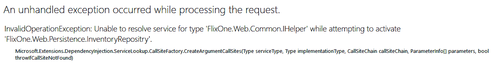
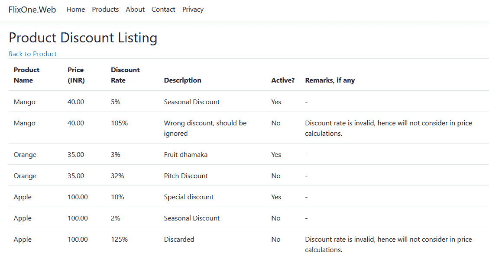

# 九、函数式编程实践

上一章（[第 8 章](08.html)、*在.NETCore中的并发编程*）介绍了在.NETCore中的并发编程，本章的目的是利用`async`/`await`和并行性，使我们的程序更具性能。

在本章中，我们将尝试使用 C 语言进行函数式编程。我们还将深入探讨向您展示如何利用.NETCore中的 C# 来执行函数式编程的概念。本章的目的是帮助您理解什么是函数式编程，以及如何使用 C# 语言使用函数式编程。

函数式编程受数学的启发，它以函数的方式解决问题。在数学中，我们有公式，在函数式编程中，我们以各种函数的形式使用数学。函数式编程最好的部分是它有助于无缝地实现并发

本章将介绍以下主题：

*   理解函数式编程
*   库存应用
*   战略模式和函数式编程

# 技术要求

本章包含各种代码示例，以解释函数式编程的概念。代码保持简单，仅用于演示目的。大多数示例都涉及用 C# 编写的.NETCore控制台应用。

The complete source code is available at the following link: [https://github.com/PacktPublishing/Hands-On-Design-Patterns-with-C-and-.NET-Core/tree/master/Chapter9](https://github.com/PacktPublishing/Hands-On-Design-Patterns-with-C-and-.NET-Core/tree/master/Chapter9).

要运行和执行代码，先决条件如下：

*   Visual Studio 2019（Visual Studio 2017 更新 3 或更高版本也可用于运行应用）。
*   设置.NETCore
*   SQL server（本章使用快速版）

# 安装 Visual Studio

要运行这些代码示例，您需要安装 Visual Studio 2017（或更高版本，如 2019）。要执行此操作，请遵循以下说明：

1.  从以下下载链接下载 Visual Studio，其中包括安装说明：[https://docs.microsoft.com/en-us/visualstudio/install/install-visual-studio](https://docs.microsoft.com/en-us/visualstudio/install/install-visual-studio) 。
2.  按照安装说明进行操作。
3.  Visual Studio 安装有多个版本。这里，我们使用的是 Visual Studio for Windows。

# 设置.NETCore

如果未安装.NET Core，则需要遵循以下说明：

1.  在[下载.NET Core for Windowshttps://www.microsoft.com/net/download/windows](https://www.microsoft.com/net/download/windows) 。
2.  有关多个版本和相关库，请访问[https://dotnet.microsoft.com/download/dotnet-core/2.2](https://dotnet.microsoft.com/download/dotnet-core/2.2) 。

# 安装 SQL Server

如果未安装 SQL Server，则需要按照以下说明操作：

1.  从以下链接下载 SQL Server:[https://www.microsoft.com/en-in/download/details.aspx?id=1695](https://www.microsoft.com/en-in/download/details.aspx?id=1695) 。
2.  在此处找到安装说明：[https://docs.microsoft.com/en-us/sql/ssms/download-sql-server-management-studio-ssms?view=sql-服务器-2017](https://docs.microsoft.com/en-us/sql/ssms/download-sql-server-management-studio-ssms?view=sql-server-2017)。

For troubleshooting and more information, refer to the following link: [https://www.blackbaud.com/files/support/infinityinstaller/content/installermaster/tkinstallsqlserver2008r2.htm](https://www.blackbaud.com/files/support/infinityinstaller/content/installermaster/tkinstallsqlserver2008r2.htm).

# 理解函数式编程

简单地说，**函数式编程**是一种符号计算方法，与解决数学问题的方法相同。任何函数编程都是基于数学函数及其编码风格的。任何支持函数式编程的语言都可以解决以下两个问题：

*   它需要解决什么问题？
*   它是如何解决的？

函数式编程不是一项新发明。这种语言在业界已经存在很长时间了。以下是一些支持函数式编程的著名编程语言：

*   哈斯克尔
*   斯卡拉
*   二郎
*   Clojure
*   口齿不清
*   奥卡姆

In 2005, Microsoft released the first version of F# (pronounced *EffSharp—*[https://fsharp.org/](https://fsharp.org/)). This is a functional programming language that has a lot of good features that any functional programming should have. In this chapter, we are not going to discuss much F#, but we will be discussing functional programming and its implementation using the C# language.

纯函数是通过说它们是纯函数来加强函数编程的函数。这些功能在两个级别上工作：

*   对于提供的参数，最终结果/输出将始终保持不变。
*   它们不会影响程序的行为或应用的执行路径，即使它们被调用了一百次。

考虑下面的例子从我们的 FlixOne 库存申请：

```cs
public static class PriceCalc
{
    public static decimal Discount(this decimal price, decimal discount) => 
        price * discount / 100;

    public static decimal PriceAfterDiscount(this decimal price, decimal discount) =>
        decimal.Round(price - Discount(price, discount));
}
```

如您所见，我们有一个具有两个扩展方法的`PriceCalc`类：`Discount`和`PriceAfterDiscount`。这些函数可以称为纯函数；`PriceCalc`功能和`PriceAfterDiscount`功能均符合`Pure`功能的标准；`Discount`方法将根据当前价格和折扣计算折扣。在这种情况下，对于提供的参数值，方法的输出永远不会改变。这样，价格为`190.00`且折扣为`10.00`的产品将按以下方式计算：`190.00 * 10.00 /100`，并返回`19.00`。我们的下一个方法`PriceAfterDiscount`——使用相同的参数值计算`190.00 - 19.00`并返回`171.00`的值。

函数式编程的另一个重要点是函数是纯粹的，并且传递完整的信息（也称为**函数诚实**。考虑前面代码中的 Tyr T0.方法；这是一个纯粹的函数，也是诚实的。那么，如果有人意外地提供了一个负折扣或一个超过其实际价格（超过 100%）的折扣，这个函数会保持纯粹和诚实吗？为了处理这种情况，我们的数学函数应该以这样的方式编写：如果有人进入`discount <= 0 or discount > 100`，那么系统将不会接受它。用下面的方法考虑下面的代码：

```cs
public static decimal Discount(this decimal price, ValidDiscount validDiscount)
{
    return price * validDiscount.Discount / 100;
}
```

如您所见，我们的`Discount`函数有一个名为`ValidDiscount`的参数类型，它验证了我们所讨论的输入。这样，我们的函数现在是诚实函数。

这些函数与函数式编程一样简单，但是使用函数式编程仍然需要大量的实践。在接下来的部分中，我们将讨论函数式编程的高级概念，包括函数式编程原理。

考虑下面的代码，我们检查折扣值是否有效：

```cs
private readonly Func<decimal, bool> _vallidDiscount = d => d > 0 || d % 100 <= 1;
```

在前面的代码片段中，我们有一个名为`_validDiscount`的字段。让我们看看这是怎么做的：`Func`接受`decimal`作为输入，并返回`bool`作为输出。从其名称可以看出，`field`只提供有效折扣。

`Func` is a type of delegate that points to a method of one or more arguments and returns a value. The general declaration of `Func` is `Func<TParameter, TOutput>`, where `TParameter` is the input parameter of any valid datatype and `TOutput` is the return value of any valid datatype.

考虑下面的代码片段，在这里我们使用了方法中的“{ To0t}”字段：

```cs
public IEnumerable<DiscountViewModel> FilterOutInvalidDiscountRates(
    IEnumerable<DiscountViewModel> discountViewModels)
{
    var viewModels = discountViewModels.ToList();
    var res = viewModels.Select(x => x.Discount).Where(_vallidDiscount);
    return viewModels.Where(x => res.Contains(x.Discount));
}
```

在前面的代码中，我们有`FilterOutInvalidDiscountRates`方法。这种方法是不言自明的，表明我们正在过滤掉无效的贴现率。现在让我们分析代码。

`FilterOutInvalidDiscountRates`方法返回具有有效折扣的产品的`DiscountViewModel`类集合。以下代码属于我们的`DiscountViewModel`类：

```cs
public class DiscountViewModel
{
    public Guid ProductId { get; set; }
    public string ProductName { get; set; }
    public decimal Price { get; set; }
    public decimal Discount { get; set; }
    public decimal Amount { get; set; }
}
```

我们的`DiscountViewModel`类包含以下内容：

*   `ProductId`：表示产品的 ID。
*   `ProductName`：表示产品名称。
*   `Price`：包含产品的实际价格。实际价格在任何折扣、税费等之前。
*   `Discount`：包含折扣的百分比，如 10 或 3。有效折扣率不应为负、等于零或超过 100%（换句话说，它不应超过产品的实际成本）。
*   `Amount`：包含任何折扣、税费等后的产品价值。

现在，让我们回到我们的`FilterOutInavlidDiscountRates`方法，看看`viewModels.Select(x => x.Discount).Where(_vallidDiscount)`。在这里，您可能会注意到我们正在从`viewModels`列表中选择折扣率。此列表包含根据`_validDiscount`字段有效的折扣率。在下一行中，我们的方法是返回具有有效折扣率的记录。

在函数式编程中，这些函数也称为**一级函数**。这些函数的值可以用作任何其他函数的输入或输出。它们也可以分配给变量或存储在集合中。

转到 Visual Studio 并打开`FlixOne`库存应用。从这里运行应用，您将看到以下屏幕截图：


上一个屏幕截图是显示所有可用产品的产品列表页面。这是一个简单的页面；您也可以将其称为产品列表仪表板，在这里可以找到所有产品。在“创建新产品”中，您可以添加新产品，而“编辑”将为您提供更新现有产品的功能。此外，详细信息页面将显示特定产品的完整详细信息。通过单击“删除”，可以从列表中删除现有产品。

请参考我们的`DiscountViewModel`课程。我们可以选择对具有业务规则的产品使用多个折扣率，该规则确定一次只有一个折扣率处于活动状态。要查看产品的所有折扣率，请单击前面屏幕（产品列表）中的折扣率。这将显示以下屏幕：


前面的屏幕是产品折扣清单，显示产品名称 Mango 的折扣清单。这有两个折扣率，但只有季节性折扣率有效。你可能已经注意到了备注栏；该折扣率被标记为无效折扣率，因为根据`_validDiscount`——这在上一节中讨论过，该折扣率不符合有效折扣率的标准。

`Predicate` is also a delegate type, similar to `Func` delegates. This represents a method that validates the set of criteria. In other words, `Predicate` returns the type of `Predicate <T>`, where `T` is a valid datatype. It works if the criteria matches and returns a value of type `T`.

考虑下面的代码，在这里我们验证产品名称作为语句的有效性：

```cs
private static readonly TextInfo TextInfo = new CultureInfo("en-US", false).TextInfo;
private readonly Predicate<string> _isProductNameTitleCase = s => s.Equals(TextInfo.ToTitleCase(s));
```

在前面的代码中，我们使用了`Predicate`关键字，这将分析使用`TitleCase`关键字验证`ProductName`的条件。如果条件匹配，结果将为`true`。否则，结果将为`false`。考虑下面的代码片段，在这里我们使用的是：

```cs
public IEnumerable<ProductViewModel> FilterOutInvalidProductNames(
    IEnumerable<ProductViewModel> productViewModels) => productViewModels.ToList()
    .Where(p => _isProductNameTitleCase(p.ProductName));
```

在前面的代码中，我们有`FilterOutInvalidProductNames`方法。此方法的目的是选择具有有效产品名称的产品（仅限`TitleCase`产品名称）。

# 增强我们的库存应用

该项目针对的是一个假设情况，公司 FlixOne 希望增强库存管理应用，以管理其不断增长的产品集合。这不是一个新的应用，因为我们已经开始开发该应用，并在[第 3 章](03.html)、*实现设计模式-基础第 1 部分*中讨论了初始阶段，我们已经开始开发基于控制台的库存系统。利益相关者将不时审查应用，并尝试满足最终用户的需求。此增强功能非常重要，因为员工（用于管理库存）和客户（用于浏览和创建新订单）都将使用此应用。应用需要具有可扩展性，并且是业务的基本系统。

由于这是一本技术书籍，我们将主要从开发团队的角度讨论各种技术观察，并讨论用于实现库存管理应用的模式和实践

# 要求

有必要增强应用，而这不可能在一天内实现。这将需要大量的会议和讨论。在几次会议中，业务团队和开发团队讨论了库存管理系统新增强的需求。在定义一组清晰的需求方面进展缓慢，最终产品的愿景也不清晰。开发团队决定缩减庞大的需求列表，使之具有足够的功能，以便关键人员可以开始记录一些库存信息。这将允许进行简单的库存管理，并为业务扩展提供基础。我们将根据需求采取**最小可行产品**（**MVP**方法。

MVP is the smallest set of features of an application that can still be released and have enough value for a user base.

在管理层和业务分析师之间举行了几次会议和讨论之后，产生了一系列需求，以增强我们的`FlixOne`web 应用。高级要求如下：

*   **分页实现**：目前所有页面列表均未分页。通过向下滚动或向上滚动屏幕来查看页面数较大的项目确实很有挑战性。
*   **折扣率**：目前没有增加或查看产品各种折扣率的规定。贴现率的业务规则如下：

    *   一个产品可以有多个折扣率。
    *   一个产品只能有一个活动折扣率。
    *   有效贴现率不应为负值，且不应超过 100%。

# 回到 FlixOne

在上一节中，我们讨论了增强应用所需的内容。在本节中，我们将实现这些需求。让我们首先回顾一下项目的文件结构。请查看以下快照：


前面的快照描述了我们的 FlixOne web 应用，其文件夹结构如下：

*   **wwwroot**：这是一个包含静态内容的文件夹，例如 CSS 和 jQuery 文件，这些都是 UI 项目所必需的。此文件夹附带 Visual Studio 提供的默认模板。
*   **常用**：包含所有与业务规则等相关的常用文件和操作。
*   **上下文**：包含`InventoryContext`，是提供`Entity Framework Core`功能的`DBContext`类。
*   **控制器**：包含我们`FlixOne`应用的所有控制器类。
*   **迁移**：包含`InventoryModel`快照和初始创建的实体。
*   **模型：**包含我们的应用所需的数据模型`ViewModels`。
*   **持久性：**包含`InventoryRepository`及其操作。
*   **视图**：包含应用的所有视图/屏幕。

考虑下面的代码：

```cs
public interface IHelper
{
    IEnumerable<DiscountViewModel> FilterOutInvalidDiscountRates(
        IEnumerable<DiscountViewModel> discountViewModels);

    IEnumerable<ProductViewModel> FilterOutInvalidProductNames(
        IEnumerable<ProductViewModel> productViewModels);
}
```

前面的代码包含一个`IHelper`接口，该接口包含两个方法。我们将在以下代码段中实现此接口：

```cs
public class Helper : IHelper
{
    private static readonly TextInfo TextInfo = new CultureInfo("en-US", false).TextInfo;
    private readonly Predicate<string> _isProductNameTitleCase = s => s.Equals(TextInfo.ToTitleCase(s));
    private readonly Func<decimal, bool> _vallidDiscount = d => d == 0 || d - 100 <= 1;

    public IEnumerable<DiscountViewModel> FilterOutInvalidDiscountRates(
        IEnumerable<DiscountViewModel> discountViewModels)
    {
        var viewModels = discountViewModels.ToList();
        var res = viewModels.Select(x => x.ProductDiscountRate).Where(_vallidDiscount);
        return viewModels.Where(x => res.Contains(x.ProductDiscountRate));
    }

    public IEnumerable<ProductViewModel> FilterOutInvalidProductNames(
        IEnumerable<ProductViewModel> productViewModels) => productViewModels.ToList()
        .Where(p => _isProductNameTitleCase(p.ProductName));
}
```

`Helper`类实现`IHelper`接口。在这个类中，我们有两个主要且重要的方法：一个是检查有效的折扣，另一个是检查有效的`ProductName`属性。

在我们的应用中使用此功能之前，我们应该将其添加到我们的`Startup.cs`文件中，如下代码所示：

```cs
public void ConfigureServices(IServiceCollection services)
{
    services.AddTransient<IInventoryRepositry, InventoryRepositry>();
    services.AddTransient<IHelper, Helper>();
    services.AddDbContext<InventoryContext>(o => o.UseSqlServer(Configuration.GetConnectionString("FlixOneDbConnection")));
    services.Configure<CookiePolicyOptions>(options =>
    {
        // This lambda determines whether user consent for non-essential cookies is needed for a given request.
        options.CheckConsentNeeded = context => true;
        options.MinimumSameSitePolicy = SameSiteMode.None;
    });
}
```

在前面的代码片段中，我们有一个书面语句，`services.AddTransient<IHelper, Helper>();`。这样，我们将向应用添加一个临时服务。我们已经在[第 5 章](05.html)中讨论了*控制反转*部分，*实现设计模式-.NETCore*。

考虑下面的代码，在这里我们使用了 HORT T0R 类，利用了控制反转：

```cs
public class InventoryRepositry : IInventoryRepositry
{
    private readonly IHelper _helper;
    private readonly InventoryContext _inventoryContext;

    public InventoryRepositry(InventoryContext inventoryContext, IHelper helper)
    {
        _inventoryContext = inventoryContext;
        _helper = helper;
    }

... 
}
```

前面的代码包含了`InventoryRepository`类，在这里我们可以看到正确的**依赖注入**（**DI**的用法）：

```cs
    public IEnumerable<Discount> GetDiscountBy(Guid productId, bool activeOnly = false)
        {
            var discounts = activeOnly
                ? GetDiscounts().Where(d => d.ProductId == productId && d.Active)
                : GetDiscounts().Where(d => d.ProductId == productId);
            var product = _inventoryContext.Products.FirstOrDefault(p => p.Id == productId);
            var listDis = new List<Discount>();
            foreach (var discount in discounts)
            {
                if (product != null)
                {
                    discount.ProductName = product.Name;
                    discount.ProductPrice = product.Price;
                }

                listDis.Add(discount);
            }

            return listDis;
        }
```

前面的代码是`InventoryRepository`类的`GetDiscountBy`方法，该类是`active`或`de-active`记录折扣模型的返回集合。请考虑下面的代码片段，该代码片段用于

```cs
    public IEnumerable<DiscountViewModel> GetValidDiscoutedProducts(
        IEnumerable<DiscountViewModel> discountViewModels)
    {
        return _helper.FilterOutInvalidDiscountRates(discountViewModels);
    }
}
```

前面使用`DiscountViewModel`集合的代码根据前面讨论的业务规则筛选出没有有效折扣的产品。`GetValidDiscountProducts`方法返回`DiscountViewModel`的集合。

如果我们忘记在我们的项目`startup.cs`文件中定义`IHelper`，我们会遇到一个异常，如下截图所示：



前面的屏幕截图清楚地表明`IHelper`服务未解决。在我们的例子中，我们不会遇到这个异常，因为我们已经在`Startup`类中添加了`IHelper`。

到目前为止，我们已经添加了 helper 方法来满足我们对折扣率的新要求，并对其进行验证。现在，让我们添加一个控制器和后续操作方法。为此，请从解决方案资源管理器添加一个新的`DiscountController`控制器。在此之后，我们的`FlixOne`web 解决方案将类似于以下快照：


在前面的快照中，我们可以看到我们的`Controller`文件夹现在有一个额外的控制器，即`DiscountController`，下面的代码来自`DiscountController`：

```cs
public class DiscountController : Controller
{
    private readonly IInventoryRepositry _repositry;

    public DiscountController(IInventoryRepositry inventoryRepositry)
    {
        _repositry = inventoryRepositry;
    }

    public IActionResult Index()
    {
        return View(_repositry.GetDiscounts().ToDiscountViewModel());
    }

    public IActionResult Details(Guid id)
    {
        return View("Index", _repositry.GetDiscountBy(id).ToDiscountViewModel());
    }
}
```

执行应用，从主屏幕单击产品，然后单击产品折扣列表。从这里，您将看到以下屏幕：



前面的快照描述了所有可用产品的产品折扣清单。产品折扣清单有很多记录；因此，需要向上或向下滚动以查看屏幕上的项目。为了处理这种困难的情况，我们应该实现分页。

# 战略模式与功能规划

在本书的前四章中，我们讨论了很多模式和实践。战略模式是**四人帮**（**GoF**模式）的重要模式之一。这属于行为模式范畴，也称为策略模式。这是一种通常在类的帮助下实现的模式。这也是使用函数式编程更容易实现的方法。

跳回本章的*理解函数式编程*部分，重新思考函数式编程的范式。高阶函数是函数编程的重要范式之一；使用这一点，我们可以很容易地以功能的方式实现策略模式。

**Higher-order functions** (**HOFs**) are the functions that take parameters as functions. They can also return functions.

考虑下面的代码，说明函数编程中 HOFS 的实现：

```cs
public static IEnumerable<T> Where<T>
    (this IEnumerable<T> source, Func<T, bool> criteria)
{
    foreach (var item in source)
        if (criteria(item))
            yield return item;
}
```

前面的代码是`Where`子句的简单实现，我们在其中使用了`LINQ Query`。在这里，我们迭代一个集合并返回一个符合条件的项。前面的代码可以进一步简化。请考虑以下代码，以简化前面代码的版本：

```cs
public static IEnumerable<T> SimplifiedWhere<T>
    (this IEnumerable<T> source, Func<T, bool> criteria) => 
    Enumerable.Where(source, criteria);
```

如您所见，`SimplifiedWhere`方法产生的结果与前面讨论的`Where`方法相同。此方法基于标准，并具有返回结果的策略，并且此标准在运行时执行。我们可以在后续方法中轻松调用前面的函数，以利用函数编程。考虑下面的代码：

```cs
public IEnumerable<ProductViewModel>
    GetProductsAbovePrice(IEnumerable<ProductViewModel> productViewModels, decimal price) =>
    productViewModels.SimplifiedWhere(p => p.ProductPrice > price);
```

我们有一个叫做`GetProductsAbovePrice`的方法。在这种方法中，我们提供的是价格。这种方法是不言自明的，它在`ProductViewModel`集合上使用一个标准来列出产品价格高于参数价格的产品。在我们的`FlixOne`清单应用中，您可以找到实现函数编程的更多范围。

# 总结

函数式编程是关于函数的，主要是关于数学函数。任何支持函数式编程的语言在解决方案中都会遇到两个主要问题：需要解决什么问题以及如何解决？我们看到了函数式编程及其使用 C# 编程语言的简单实现。

我们还学习了`Func`、`Predicate`、LINQ、`Lambda`、匿名函数、闭包、表达式树、curry、闭包和递归。最后，我们使用函数式编程研究了策略模式的实现。

在下一章（[第 10 章](10.html)、*反应式编程模式和技术*，我们将讨论反应式编程及其模型和原理。我们还将讨论**无功扩展**。

# 问题

以下问题将使您能够整合本章中包含的信息：

1.  什么是函数式编程？
2.  什么是函数式编程中的引用透明性？
3.  什么是纯函数？