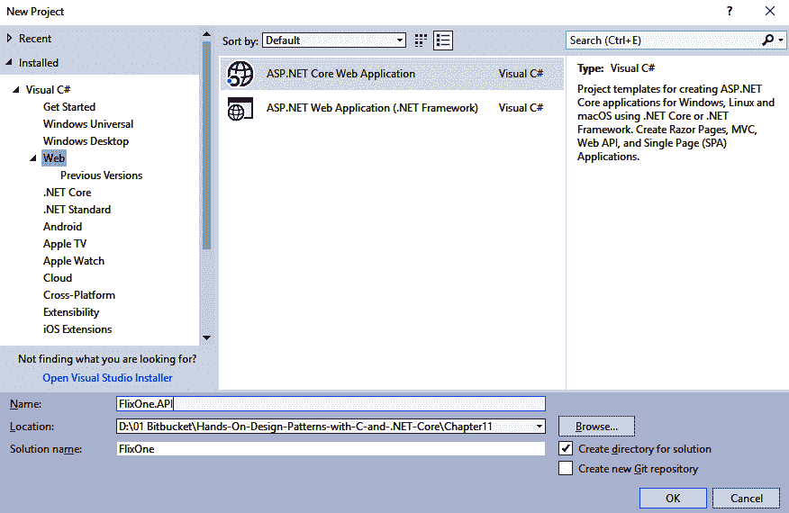
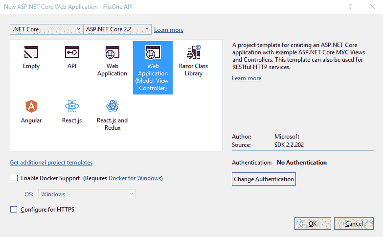
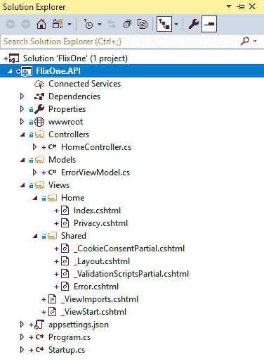
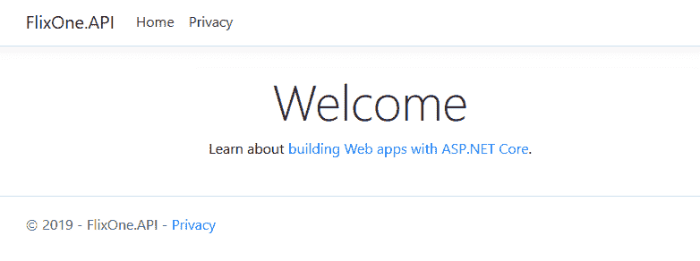
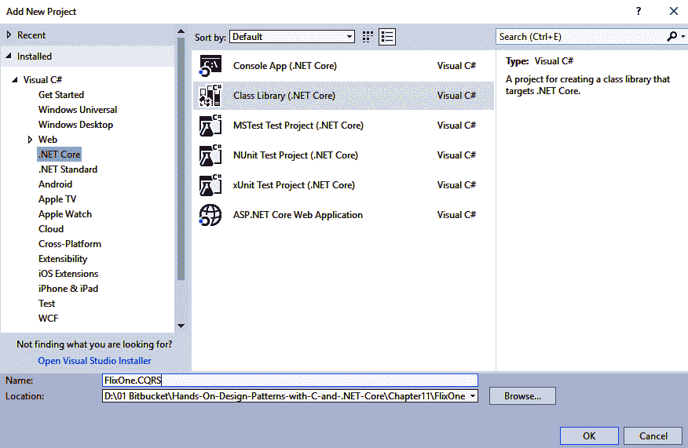
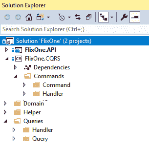
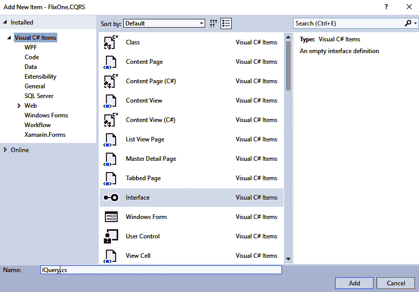
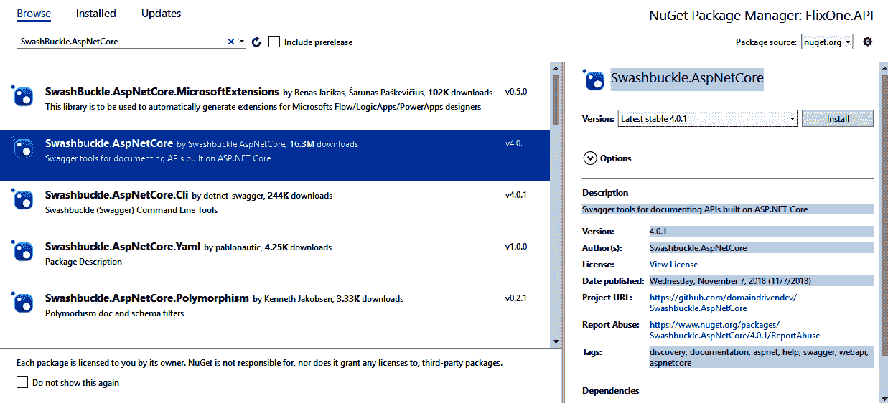

# 先进的数据库设计和应用技术

在上一章中，我们通过讨论反应式编程的原理和模型来学习它。我们还讨论并查看了反应式编程如何与数据流相关的示例。

数据库设计是一项复杂的任务，需要很多耐心。在本章中，我们将讨论先进的数据库和应用技术，包括应用**命令查询责任分离**（**CQRS**）和账本式数据库。

与前几章类似，为了确定**最低可行产品**（**MVP**，将对需求收集环节进行说明。在本章中，将使用几个因素来引导 CQR 的设计。我们将使用分类账风格的方法，包括增加对库存水平变化的跟踪，并希望提供检索库存水平的公共 API。本章将介绍为什么开发人员使用分类账样式的数据库，以及为什么我们应该关注 CQRS 实现。在本章中，我们将了解为什么要采用 CQRS 模式。

本章将介绍以下主题：

*   用例讨论
*   数据库讨论
*   存货分类账样式数据库
*   实现 CQRS 模式

# 技术要求

本章包含各种代码示例来解释这些概念。代码保持简单，仅用于演示目的。大多数示例都涉及用 C# 编写的.NET 核心控制台应用程序。

要运行和执行代码，Visual Studio 2019 是一个先决条件（您也可以使用 Visual Studio 2017 运行应用程序）。

# 安装 Visual Studio

要运行这些代码示例，您需要安装 VisualStudio（首选 IDE）。要执行此操作，请遵循以下说明：

1.  从以下下载链接下载 Visual Studio 2017（或 2019 版）：[https://docs.microsoft.com/en-us/visualstudio/install/install-visual-studio](https://docs.microsoft.com/en-us/visualstudio/install/install-visual-studio) 。
2.  按照可通过上一链接访问的安装说明进行操作。Visual Studio 安装有多个选项。这里，我们使用的是 Visual Studio for Windows。

# 设置.NET 内核

如果未安装.NET Core，则需要遵循以下说明：

1.  下载.NET Core for Windows:[https://www.microsoft.com/net/download/windows](https://www.microsoft.com/net/download/windows) 。
2.  有关多个版本和相关库，请访问[https://dotnet.microsoft.com/download/dotnet-core/2.2](https://dotnet.microsoft.com/download/dotnet-core/2.2) 。

# 安装 SQL Server

如果未安装 SQL Server，则需要按照以下说明操作：

1.  从以下链接下载 SQL Server:[https://www.microsoft.com/en-in/download/details.aspx?id=1695](https://www.microsoft.com/en-in/download/details.aspx?id=1695) 。
2.  您可以在[找到安装说明 https://docs.microsoft.com/en-us/sql/ssms/download-sql-server-management-studio-ssms?view=sql-服务器-2017](https://docs.microsoft.com/en-us/sql/ssms/download-sql-server-management-studio-ssms?view=sql-server-2017)。

For troubleshooting and for more information, refer to the following link: [https://www.blackbaud.com/files/support/infinityinstaller/content/installermaster/tkinstallsqlserver2008r2.htm](https://www.blackbaud.com/files/support/infinityinstaller/content/installermaster/tkinstallsqlserver2008r2.htm).

# 用例讨论

在本章中，我们将继续使用 FlixOne 库存应用程序。在本章中，我们将讨论 CQRS 模式，并扩展我们在前几章中开发的 web 应用程序。

This chapter continues with the web application that was developed in the previous chapter. If you skipped the previous chapter, please revisit it in order to aid your understanding of the current chapter.

在本节中，我们将介绍需求收集的过程，然后讨论 web 应用程序面临的各种挑战。

# 项目启动

在[第 7 章](07.html)中*实现 Web 应用程序的设计模式–第 2 部分*中，我们扩展了 FlixOne 清单，并向 Web 应用程序添加了身份验证和授权。考虑到以下几点后，我们扩展了应用程序：

*   当前应用程序对所有人开放；因此，任何用户都可以访问任何页面，甚至是受限页面。
*   用户不应访问需要访问权限或特殊访问权限的页面；这些页面也称为受限页面或访问受限的页面。
*   用户应该能够根据其角色访问页面/资源。

在[第 10 章](10.html)*反应式编程模式和技术*中，我们进一步扩展了我们的 FlixOne 清单应用程序，并向所有显示清单的页面添加分页、过滤和排序。我们在扩展应用程序时考虑了以下几点：

*   **项目过滤**：目前用户无法按类别过滤项目。要扩展此功能，用户应该能够根据其类别筛选产品项。
*   **项目排序**：目前，项目以添加到数据库的顺序出现。没有任何机制允许用户根据项目名称或价格等类别对项目进行排序。

# 要求

在与管理层、**业务分析师**（**BA**）和售前人员进行多次会议和讨论后，管理层决定针对以下高层需求开展工作：业务需求和技术需求。

# 业务要求

根据与利益相关者和最终用户的讨论以及市场调查，我们的业务团队列出了以下要求：

*   **产品扩展**：产品正在接触不同的用户。现在是扩展应用程序的好时机。在扩展应用程序之后，该应用程序将具有强大的扩展能力。
*   **产品模型**：作为一个库存管理应用，用户应该感觉到自由（这意味着在模型层面没有限制，没有复杂的验证），用户与应用交互时不应该有任何限制。每个屏幕和页面都应该是不言自明的。
*   **数据库设计**：应用程序的数据库设计应确保扩展不会花费太多时间。

# 技术要求

满足业务需求的实际需求现在已准备好进行开发。在与业务人员进行多次讨论后，我们得出以下结论：

*   以下是**登陆**或**首页**的要求：
    *   应该是包含各种小部件的仪表板
    *   应该显示商店的概览图
*   以下是**产品页面**的要求：
    *   应具有添加、更新和删除产品的功能
    *   应具有添加、更新和删除产品类别的功能

The FlixOne Inventory Management web application is an imaginary product. We are creating this application to discuss the various design patterns that are required/used in web projects.

# 挑战

虽然我们已经扩展了现有的 web 应用程序，但它对开发人员和企业都有各种各样的挑战。在本节中，我们将讨论这些挑战，然后找出克服这些挑战的解决方案。

# 开发人员面临的挑战

以下是由于应用程序中的重大更改而产生的挑战。它们也是与将控制台应用程序升级为 web 应用程序相关的主要扩展的结果：

*   **不支持 RESTful 服务**：目前不支持 RESTful 服务，因为没有开发 API。
*   **有限安全**：在当前应用程序中，只有一种机制可以限制/允许用户访问应用程序的特定屏幕或模块：即通过登录

# 企业面临的挑战

当我们采用新的技术堆栈时，会出现以下挑战，并且代码中有很多更改。因此，实现最终输出需要时间，这会延迟产品，导致业务损失：

*   **客户流失**：在这里，我们仍处于发展阶段，但对我们业务的需求非常高。然而，开发团队交付产品的时间比预期的要长。
*   **发布生产更新**需要更多时间：目前开发工作非常耗时，这会延迟后续活动，导致生产延迟。

# 为问题/挑战提供解决方案

经过几次会议和头脑风暴会议，开发团队得出结论，我们必须稳定基于 web 的解决方案。为了克服这些挑战并提供解决方案，技术团队和业务团队聚在一起确定各种解决方案和要点。

以下是该解决方案支持的要点：

*   演进 RESTful Web 服务应该有一个 API 仪表板
*   严格遵循**T****est 驱动开发**（**TDD**）
*   重新设计**用户界面**（**UI**）以满足用户体验期望

# 数据库讨论

在我们开始讨论数据库之前，我们必须考虑以下几点：我们的 FlixOne Web 应用的一个大图：

*   我们的应用程序的一部分是库存管理，但另一部分是电子商务 web 应用程序。
*   最具挑战性的部分是，我们的应用程序还将充当**销售点**（**POS**）。在此部件/模块中，用户可以从离线柜台/门店购买物品。
*   对于库存部分，我们需要说明我们将采用何种方法来计算和维护账目和交易，以及确定任何售出物品的成本。

*   为了维持存货的库存，有多种选择，最常用的两种选择是**先进先出**（**先进先出**）和**后进先出**（**后进先出**）。
*   大多数交易涉及财务数据，因此这些交易需要历史数据。每个记录都应该有以下信息：当前值、当前更改前的值以及所做的更改。
*   在维护库存的同时，我们还需要维护所购买的物品。

在为任何电子商务 web 应用程序设计数据库时，还有更多要点非常重要。为了展示库存和库存管理，我们限制了 FlixOne 应用程序的范围。

# 数据库处理

与本书中讨论的其他主题类似，有大量数据库，从数据库模式的基本模式到控制数据库系统如何组合的模式。本节将介绍两种系统模式，**在线事务处理**（**OLTP**）和**在线分析处理**（**OLAP**）。为了进一步理解数据库设计模式，我们将更详细地探讨一种特定的模式，即分类账样式的数据库。

A database schema is another word for the collection of tables, views, stored procedures, and other components that make up a database. Think of this as the *blueprint* of the database.

# OLTP

OLTP 数据库设计用于处理导致数据库更改的大量语句。基本上，`INSERT`、`UPDATE`和`DELETE`语句都会引起变化，其行为与`SELECT`语句非常不同。OLTP 数据库的设计考虑到了这一点。因为这些数据库记录更改，所以它们通常是*主*或*主**数据库，这意味着它们是保存当前数据的存储库。*

*The `MERGE` statement also qualifies as a statement that causes change. This is because it provides a convenient syntax for the insertion of a record when a row does not exist, and the insertion of an update when a row does exist. It will update when a row does exist. The `MERGE` statement is not supported in all database providers or versions.

OLTP 数据库通常设计为快速处理更改语句。这通常是通过仔细规划表结构来完成的。查看这一点的简单方法是考虑数据库表。此表可以包含用于存储数据的字段、用于高效查找数据的键、其他表的索引、响应特定情况的触发器以及其他表构造。这些构造中的每一个都有性能损失。因此，OLTP 数据库的设计是在表上使用最少数量的构造与所需行为之间的平衡。

让我们考虑一个记录我们库存系统中书籍的表格。每本书可能记录名称、数量、出版日期，并参考作者信息、出版商和其他相关表格。我们可以在所有列上放置索引，甚至可以为相关表中的数据添加索引。这种方法的问题是，必须为每个引起更改的语句存储和维护每个索引。数据库设计者必须仔细规划和分析数据库，以确定添加和（同样重要的）不向表中添加索引和其他构造的最佳组合。

A table index can be thought of like a virtual lookup table that provides the relational database with a faster way of looking up data.

# 联机分析处理

使用 OLAP 模式设计的数据库预期会比导致更改的语句有更多的`SELECT`语句。这些数据库通常具有一个或多个数据库数据的合并视图。因此，这些数据库通常不是主数据库，而是用于提供与主数据库分离的报告和分析的数据库。在某些情况下，这是在与其他数据库隔离的基础结构上提供的，以便不影响操作数据库的性能。这种类型的部署通常被称为**数据仓库**。

数据仓库**可用于提供企业内系统或系统集合的整合视图。传统上，数据是通过较慢的周期性作业来刷新来自其他系统的数据，但随着现代数据库系统的发展，这一趋势正趋向于接近实时的整合。**

 **OLTP 和 OLAP 的主要区别在于数据的存储和组织方式。在许多情况下，这需要表或持久视图，具体取决于在支持特定报告场景和复制数据的 OLAP 数据库中创建的技术。在 OLTP 数据库中，重复数据是不可取的，因为它会引入多个表，这些表需要为导致更改的单个语句维护。

# 分类账样式数据库

分类账样式的数据库设计将被重点介绍，因为它是一种已经在许多金融数据库中使用了几十年的模式，并且一些开发人员可能不知道它。分类账样式的数据库源于会计师的分类账，在该分类账中，交易被添加到文档中，数量和/或金额被清点，以得出最终数量或金额。下表显示了苹果销售的分类账：


关于这个例子，有几点需要指出。买方信息写在单独的行上，而不是删除其金额并输入新金额。就拿这两次购买和一次信贷来说吧。这通常不同于许多数据库，在这些数据库中，一行包含买家信息，其中包含金额和价格的单独字段

分类账样式的数据库采用这种概念，每个事务都有一个单独的行，因此删除了`UPDATE`和`DELETE`语句，只依赖`INSERT`语句。这有几个好处。与分类账类似，一旦每笔交易被写入，就不能删除或更改。如果发生错误或更改，例如对 West Country Product 的信贷，则需要编写新的交易以达到所需状态。这样做的一个有趣的好处是，源表现在具有立即提供活动详细日志的价值。如果我们要添加一个由列修改的*，那么我们就可以有一个全面的日志，记录是谁或是什么做出了更改，以及更改是什么。*

This example is for a single-entry ledger, but in the real world, a double-entry ledger would be used. The difference is that in a double-entry ledger, each transaction is recorded as a credit in one table and a debit in another.

下一个挑战是捕获表的最终版本或汇总版本。在本例中，即已购买的苹果数量和价格。第一种方法可以使用一个`SELECT`语句，简单地对购买者执行`GROUP BY`，如下所示：

```cs
SELECT Purchaser, SUM(Amount), SUM(Price)
FROM Apples
GROUP BY Purchaser
```

虽然这对于较小的数据量是合适的，但这里的问题是，随着行数的增加，查询的性能会随着时间的推移而降低。另一种方法是将数据聚合成另一种形式。实现这一目标的主要方式有两种。第一种方法是在将分类账表中的信息写入另一个以聚合形式保存数据的表（或持久视图，如果支持）的同时执行此活动。

A **persistent** or **materialized view** is similar to a database view, but the results of the view are cached. This gives us the benefit of not requiring the view to be recalculated on each request, and it is either refreshed periodically or when the underlying data changes.

第二种方法依赖于另一种独立于`INSERT`语句的机制，在需要时检索聚合视图。在某些系统中，将更改写入表并检索结果的主要场景执行的频率较低。在这种情况下，优化数据库以使写入速度快于读取速度更有意义，从而限制插入新记录时所需的处理量。

下一节将讨论一个有趣的模式 CQRS，它可以应用于数据库级别。这可以用于分类账样式的数据库设计。

# 实现 CQRS 模式

CQRS 只是在查询（读取）和命令（修改）之间进行分离。**命令查询分离****CQS**是**面向对象设计****OOD**的一种方法。

CQRS was introduced for the first time by Bertrand Meyer ([https://en.wikipedia.org/wiki/Bertrand_Meyer](https://en.wikipedia.org/wiki/Bertrand_Meyer)). He mentioned this term in his book, *Object-Oriented Software Construction*, during the late 1980s: [https://www.amazon.in/Object-Oriented-Software-Construction-Prentice-hall-International/dp/0136291554](https://www.amazon.in/Object-Oriented-Software-Construction-Prentice-hall-International/dp/0136291554).

CQR 非常适合某些场景，并且有一些有用的因素：

*   **模型分离**：在建模方面，我们可以对数据模型进行多种表示。清晰的分离允许选择不同的框架或技术，而不是其他更适合查询或命令的框架或技术。可以说，这可以通过**创建、读取、更新和删除**（**CRUD**）样式的实体来实现，尽管通常会出现单个数据层组件。
*   **协作**：在一些企业中，查询和命令之间的分离将有利于参与构建复杂系统的团队，特别是当一些团队更适合实体的不同方面时。例如，一个更关注表示的团队可以专注于查询模型，而另一个更关注数据完整性的团队可以维护命令模型。
*   **独立可扩展性**：许多解决方案往往要么需要对模型进行更多读取，要么需要更多写入，具体取决于业务需求。

For CQRS, remember that commands update data and queries read data.

在处理 CQR 时需要注意的一些重要事项如下：

*   命令应该异步放置，而不是作为同步操作放置。
*   决不能使用查询修改数据库。

CQRS 通过使用单独的命令和查询简化了设计。此外，我们还可以从物理上分离读数据和写数据操作。在这种安排下，只读数据库可以使用单独的数据库模式，或者换句话说，我们可以说它可以使用针对查询进行优化的只读数据库。

由于数据库使用物理分离方法，我们可以可视化应用程序的 CQRS 流，如下图所示：


上图描述了 CQRS 应用程序的虚拟工作流，其中应用程序具有用于写入操作和读取操作的物理上独立的数据库。这个虚构的应用程序基于 RESTfulWeb 服务（.NET 核心 API）。尚未向使用这些 API 的客户机/最终用户直接公开任何 API。有一个 API 网关向用户公开，对应用程序的任何请求都将通过 API 网关。

The API Gateway provides an entry point to groups with similar types of services. You can also simulate it with the facade pattern, which is part of the distributed system.

在上图中，我们有以下内容：

*   **用户界面**：可以是任何客户端（使用 API）、web 应用程序、桌面应用程序、移动应用程序或任何其他应用程序。
*   **API 网关**：任何来自 UI 的请求和对 UI 的响应都是通过 API 网关传递的。这是 CQR 的主要部分，因为可以通过使用命令和持久性层来合并业务逻辑。
*   **数据库**：该图显示了两个物理上分离的数据库。在实际应用程序中，这取决于产品的要求，您可以使用数据库进行写操作和读操作。
*   查询是通过**数据传输对象**（**DTO**的`Read`操作生成的。

您现在可以回到*用例*部分，在该部分中，我们讨论了 FlixOne 库存应用程序的新特性/扩展。在本节中，我们将创建一个新的 FlixOne 应用程序，该应用程序具有前面使用 CQRS 模式讨论的功能。请注意，我们将首先开发 API。如果您没有安装先决条件，我建议您重新访问*技术要求*部分，收集所有必需的软件，并将它们安装到您的机器上。如果您已经完成了先决条件，那么让我们从以下步骤开始：

1.  打开 VisualStudio。
2.  单击文件|新建项目以创建新项目。
3.  在“新建项目”窗口中，选择 Web，然后选择 ASP.NET 核心 Web 应用程序。
4.  给你的项目起个名字。我已将我们的项目命名为`FlixOne.API`，并确保解决方案名称为`FlixOne`。

5.  选择`Solution`文件夹的位置，然后点击 OK 按钮，如下图所示：



6.  现在您应该在新的 ASP.NET Web Core 应用程序-FlixOne.API 屏幕上。请确保在此屏幕上选择 ASP.NET Core 2.2。从可用模板中选择 Web 应用程序（模型视图控制器），并取消选中 Configure for HTTPS 复选框，如以下屏幕截图所示：



7.  您将看到出现一个默认页面，如以下屏幕截图所示：


8.  展开“解决方案资源管理器”，然后单击“显示所有文件”。您将看到由 Visual Studio 创建的默认文件夹/文件。请参阅以下屏幕截图：



我们已选择 ASP.NET 核心 Web（模型视图控制器）模板。因此，我们有默认的文件夹、控制器、模型和视图。这是 Visual Studio 提供的默认模板。要检查此默认模板，请点击*F5*并运行项目。然后，您将看到以下默认页面：



前面的屏幕截图是 web 应用程序的默认主屏幕。你可能在想*这是一个网站吗？*这里需要的是 API 文档页面，而不是网页。这是因为，当我们选择模板时，VisualStudio 默认添加 MVC 控制器而不是 API 控制器。请注意，在 ASP.NET 内核中，MVC 控制器和 API 控制器都使用相同的控制器管道（请参见控制器类：[https://docs.microsoft.com/en-us/dotnet/api/microsoft.aspnetcore.mvc.controller?view=aspnetcore-2.2](https://docs.microsoft.com/en-us/dotnet/api/microsoft.aspnetcore.mvc.controller?view=aspnetcore-2.2)）。

在详细讨论 API 项目之前，让我们首先向 FlixOne 解决方案添加一个新项目。为此，展开“解决方案资源管理器”，右键单击解决方案名称，然后单击“添加新项目”。请参阅以下屏幕截图：


在新建项目窗口中，添加新的`FlixOne.CQRS`项目，点击`OK`按钮。请参阅以下屏幕截图：



上一个屏幕截图显示的是“添加新项目”窗口。在其上，选择.NET Core，然后选择类库（.NET Core）项目。输入名称`FlixOne.CQRS`并单击确定按钮。已将新项目添加到解决方案中。然后，您可以将文件夹添加到新解决方案中，如以下屏幕截图所示：



上一个截图显示我添加了四个新文件夹：`Commands`、`Queries`、`Domain`和`Helper`。在`Commands`文件夹中，我有`Command`和`Handler`子文件夹。同样，对于`Queries`文件夹，我添加了名为`Handler`和`Query`的子文件夹。

为了开始这个项目，让我们首先在项目中添加两个域实体。以下是所需代码：

```cs
public class Product
{
    public Guid Id { get; set; }
    public string Name { get; set; }
    public string Description { get; set; }
    public string Image { get; set; }
    public decimal Price { get; set; }
}
```

前面的代码是具有以下属性的`Product`域实体：

*   `Id`：唯一标识符
*   `Name`：产品名称
*   `Description`：产品说明
*   `Image`：产品图片
*   `Price`：产品的价格

我们还需要添加`CommandResponse`数据库。这在与数据库/存储库交互时起着重要作用，因为它确保系统得到响应。以下是`CommandResponse`实体模型的代码片段：

```cs
public class CommandResponse
{
    public Guid Id { get; set; }
    public bool Success { get; set; }
    public string Message { get; set; }

}
```

前面的`CommandResponse`类包含以下属性：

*   `Id`：唯一标识符。
*   `Success`：值为`True`或`False`表示操作是否成功。
*   `Message`：作为操作响应的消息。如果`Success`为 false，则此消息包含`Error`。

现在，是为查询添加接口的时候了。要添加接口，请执行以下步骤：

1.  在解决方案资源管理器中，右键单击`Queries`文件夹，单击添加，然后单击新建项目，如下图所示：


2.  从“添加新项目”窗口中，选择界面，将其命名为 IQuery，然后单击“添加”按钮：



3.  按照前面的步骤操作，并添加`IQueryHandler`接口。以下是`IQuery`界面的代码：

```cs
public interface IQuery<out TResponse>
{
}
```

4.  前面的接口用作查询任何类型操作的框架。这是一个使用`TResponse`类型的`out`参数的通用接口。

以下是我们`ProductQuery`班的代码：

```cs
public class ProductQuery : IQuery<IEnumerable<Product>>
{
}

public class SingleProductQuery : IQuery<Product>
{
    public SingleProductQuery(Guid id)
    {
        Id = id;
    }

    public Guid Id { get; }

}
```

以下是我们`ProductQueryHandler`班的代码：

```cs
public class ProductQueryHandler : IQueryHandler<ProductQuery, IEnumerable<Product>>
{
    public IEnumerable<Product> Get()
    {
        //call repository
        throw new NotImplementedException();
    }
}
public class SingleProductQueryHandler : IQueryHandler<SingleProductQuery, Product>
{
    private SingleProductQuery _productQuery;
    public SingleProductQueryHandler(SingleProductQuery productQuery)
    {
        _productQuery = productQuery;
    }

    public Product Get()
    {
        //call repository
        throw new NotImplementedException();
    }
}
```

以下是我们`ProductQueryHandlerFactory`班的代码：

```cs
public static class ProductQueryHandlerFactory
{
    public static IQueryHandler<ProductQuery, IEnumerable<Product>> Build(ProductQuery productQuery)
    {
        return new ProductQueryHandler();
    }

    public static IQueryHandler<SingleProductQuery, Product> Build(SingleProductQuery singleProductQuery)
    {
        return  new SingleProductQueryHandler(singleProductQuery);
    }
}
```

与`Query`接口和`Query`类类似，我们需要为命令及其类添加接口。

在我们为产品域实体创建 CQR 时，您可以按照此工作流添加更多的实体。现在，让我们继续我们的`FlixOne.API`项目，通过以下步骤添加一个新的 API 控制器：

1.  在解决方案资源管理器中，右键单击`Controllers`文件夹。
2.  选择添加|新项目。

3.  选择 API 控制器类，命名为`ProductController`；请参阅以下屏幕截图：


4.  在 API 控制器中添加以下代码：

```cs
[Route("api/[controller]")]
public class ProductController : Controller
{
    // GET: api/<controller>
    [HttpGet]
    public IEnumerable<Product> Get()
    {
        var query = new ProductQuery();
        var handler = ProductQueryHandlerFactory.Build(query);
        return handler.Get();
    }

    // GET api/<controller>/5
    [HttpGet("{id}")]
    public Product Get(string id)
    {
        var query = new SingleProductQuery(id.ToValidGuid());
        var handler = ProductQueryHandlerFactory.Build(query);
        return handler.Get();
    }
```

以下代码用于保存产品：

```cs

    // POST api/<controller>
    [HttpPost]
    public IActionResult Post([FromBody] Product product)
    {
        var command = new SaveProductCommand(product);
        var handler = ProductCommandHandlerFactory.Build(command);
        var response = handler.Execute();
        if (!response.Success) return StatusCode(500, response);
        product.Id = response.Id;
        return Ok(product);

    }
```

以下代码用于删除产品：

```cs

    // DELETE api/<controller>/5
    [HttpDelete("{id}")]
    public IActionResult Delete(string id)
    {
        var command = new DeleteProductCommand(id.ToValidGuid());
        var handler = ProductCommandHandlerFactory.Build(command);
        var response = handler.Execute();
        if (!response.Success) return StatusCode(500, response);
        return Ok(response);
    }

```

我们已经创建了产品 API，本节不打算创建 UI。为了查看我们所做的工作，我们将向 API 项目添加**招摇过市**支持。

Swagger 是一种可用于文档目的的工具，它在一个屏幕上提供有关 API 端点的所有信息，您可以在其中可视化 API 并通过设置参数对其进行测试。

要开始在我们的 API 项目中实施 Swagger，请执行以下步骤：

1.  打开 Nuget 包管理器。

2.  进入 Nuget Package Manager |浏览并搜索`Swashbuckle.ASPNETCore`；请参阅以下屏幕截图：



3.  打开`Startup.cs`文件，将以下代码添加到`ConfigureService`方法中：

```cs
//Register Swagger
            services.AddSwaggerGen(swagger =>
            {
                swagger.SwaggerDoc("v1", new Info { Title = "Product APIs", Version = "v1" });
            });
```

4.  现在，在`Configure`方法中添加以下代码：

```cs
// Enable middleware to serve generated Swagger as a JSON endpoint.
app.UseSwagger();

// Enable middleware to serve swagger-ui (HTML, JS, CSS, etc.), specifying the Swagger JSON endpoint.
app.UseSwaggerUI(c =>
{
    c.SwaggerEndpoint("/swagger/v1/swagger.json", "Product API V1");
});
```

现在，我们已经完成了所有用于展示 CQR 在应用程序中的威力的更改。在 Visual Studio 中点击*F5*并通过访问以下 URL 打开招摇过市文档页面：[http://localhost:52932/swagger/](http://localhost:52932/swagger/) （请注意，端口号`52932`可能会根据您的项目设置而有所不同）。您将看到以下招摇过市文档页面：


在这里，您可以测试产品 API。

# 总结

本章介绍了 CQRS 模式，然后将其实现到我们的应用程序中。本章的目的是浏览数据库技术，并了解分类账式数据库如何为库存系统工作。为了展示 CQR 的强大功能，我们创建了产品 API 并添加了对 Swagger 文档的支持。

在下一章中，我们将讨论云服务，并详细介绍微服务和无服务器技术。

# 问题

以下问题将使您能够整合本章中包含的信息：

1.  什么是分类账样式的数据库？
2.  什么是 CQRS？
3.  我们什么时候应该使用 CQR？***