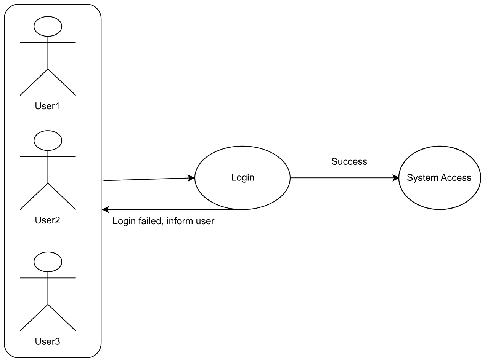

# 十三、其它最佳做法

到目前为止，在本书中，我们已经讨论了各种模式、样式和代码。在本次讨论中，我们的目标是了解编写整洁、干净和健壮代码的模式和实践。本附录将主要关注实践。当涉及到遵守任何规则或任何类型的编码风格时，实践是非常重要的。作为开发人员，您应该每天排练编码。根据一句古老的谚语，“熟能生巧”。

事实证明，玩游戏、驾驶汽车、阅读或写作等技能并不是一蹴而就的。相反，我们应该通过时间和实践来完善这些技能。例如，当你开始开车时，你会慢慢地开车。在这里，你需要记住什么时候踩离合器，什么时候踩刹车，他们需要把方向盘转多远，等等。但是，一旦驾驶员熟悉驾驶，则无需记住这些步骤；他们是天生的。这是因为实践。

在本附录中，我们将介绍以下主题：

*   用例讨论
*   最佳做法
*   其他设计模式

# 技术要求

本附录包含各种代码示例，用于解释所涵盖的概念。代码保持简单，仅用于演示目的。本章中的大多数示例都涉及用 C# 编写的.NETCore 控制台应用。

要运行和执行代码，有以下先决条件：

*   Visual Studio 2019（不过，您也可以使用 Visual Studio 2017 运行应用）

# 安装 visualstudio

要运行本章中包含的代码示例，您需要安装 Visual Studio 或更高版本。要执行此操作，请遵循以下说明：

1.  从以下下载链接下载 Visual Studio:[https://docs.microsoft.com/en-us/visualstudio/install/install-visual-studio](https://docs.microsoft.com/en-us/visualstudio/install/install-visual-studio) 。
2.  按照安装说明进行操作。
3.  Visual Studio 提供了多个版本。我们正在使用 Visual Studio for Windows。

The example code files for the chapter is available at the following link: [https://github.com/PacktPublishing/Hands-On-Design-Patterns-with-C-and-.NET-Core/tree/master/Appendix](https://github.com/PacktPublishing/Hands-On-Design-Patterns-with-C-and-.NET-Core/tree/master/Appendix).

# 用例讨论

简单地说，用例是业务场景的预创建或符号表示。例如，我们可以用图形/符号表示登录页面用例。在我们的示例中，用户试图登录到系统。如果登录成功，他们可以进入系统。如果失败，系统将通知用户登录尝试失败。参见**登录**用例的下图：



在上图中，名为**User1**、**User2**和**User3**的用户正试图使用应用的登录功能进入系统。如果登录尝试成功，用户可以访问系统。如果没有，应用会通知用户登录失败，用户无法访问系统。前面的图表比我们实际的详细描述要清晰得多，我们在这里描述这个图表。这个图表也是不言自明的。

# UML 图

在上一节中，我们讨论了借助符号表示的登录功能。您可能已经注意到图表中使用的符号。上图中使用的符号或符号是符号语言**统一建模语言**的一部分。这是一种可视化程序、软件甚至类的方法。

The symbol or notation used in the UML has evolved from the work of Grady Booch, James Rumbaugh, Ivar Jacobson, and the Rational Software Corporation.

# UML 图的类型

这些图表分为两大类：

*   **结构化 UML 图**：这些图强调被建模系统中必须存在的东西。该组进一步分为以下不同类型的图表：

    *   类图
    *   包装图
    *   对象图
    *   组件图
    *   复合结构图
    *   部署图
*   **行为 UML 图**：用于显示系统的功能，包括用例图、序列图、协作图、状态机图和活动图。该组进一步分为以下不同类型的图表：

    *   活动图
    *   序列图
    *   用例图
    *   状态图
    *   通信图
    *   交互概述图
    *   时序图

# 最佳做法

正如我们所确立的那样，练习是我们日常活动中的一种习惯。在软件工程中，软件是工程化的，而不是制造出来的，为了编写高质量的代码，我们必须进行实践。可能还有更多的观点可以解释软件工程中涉及的最佳实践。让我们来讨论一下：

*   **简短但简化的代码**：这是一件非常基本的事情，确实需要实践。开发人员应该每天使用简短的代码，以便编写简洁的代码，并在日常生活中坚持这种做法。代码应该是干净的，不能重复。前几章介绍了干净的代码和代码简化；如果您错过了本主题，请重新阅读[章节](02.html)[2](02.html)*现代软件设计模式和原则*。请看以下简明代码示例：

```cs
public class Math
{
    public int Add(int a, int b) => a + b;
    public float Add(float a, float b) => a + b;
    public decimal Add(decimal a, decimal b) => a + b;
}
```

前面的代码片段包含一个具有三个`Add`方法的`Math`类。这些方法用于计算两个整数的和以及两个浮点数和十进制数的和。`Add(float a, float b)`和`Add(decimal a, decimal b)`方法是`Add (int a, int b)`的重载方法。前面的代码示例表示一个场景，其中要求生成一个具有 int、float 或 decimal 数据类型输出的单个方法。

*   **单元测试**：当我们想通过编写代码来测试代码时，这是开发的一个组成部分。**测试驱动开发**（**TDD**）是应该坚持的最佳实践之一。我们在[第 7 章](07.html)、*实现 Web 应用设计模式第 2 部分*中讨论了 TDD。

*   **代码一致性**：如今，开发人员单独工作的机会非常少。开发人员主要在团队中工作，这意味着整个团队的代码一致性非常重要。代码一致性可以参考代码样式。开发人员在编写程序时应该定期使用一些推荐的做法和代码转换。

有许多方法可以声明变量。以下是变量声明的最佳示例之一：

```cs
namespace Implement
{
    public class Consume
    {
        BestPractices.Math math = new BestPractices.Math();
    }
}
```

在前面的代码中，我们声明了一个`BestPractices.Math`类型的`math`变量。这里，`BestPractices`是我们的名称空间，`Math`是类。如果我们没有在代码中使用`using`指令，那么最好使用完全限定名称空间的变量。

Official docs for the C# language describe these conventions very elaborately. You can refer to them here: [https://docs.microsoft.com/en-us/dotnet/csharp/programming-guide/inside-a-program/coding-conventions](https://docs.microsoft.com/en-us/dotnet/csharp/programming-guide/inside-a-program/coding-conventions).

*   **代码评审**：犯错误是人的本性，在开发中也会发生。代码审查是练习编写无 bug 代码和发现代码中不可预测错误的第一步。

# 其他设计模式

到目前为止，我们已经介绍了各种设计模式和原则，包括编写代码的最佳实践。本节将总结以下模式，并指导您编写高质量和健壮的代码。这些模式的细节和实现超出了本书的范围。

我们已经介绍了以下模式：

*   GoF 模式
*   设计原则
*   软件开发生命周期模式
*   测试驱动开发

在本书中，我们讨论了很多主题，并开发了一个示例应用（控制台和 web）。这不是世界末日，世界上还有更多的东西需要学习。

我们可以列出更多模式：

*   **基于空间的架构模式**：**基于空间的模式**（**SBP**s）是通过最小化限制应用扩展的因素来帮助实现应用可扩展性的模式。这些模式也称为**云架构模式**。我们已经在[第 12 章](12.html)*云编程*中介绍了其中的许多内容。
*   **消息模式**：这些模式用于基于消息（以数据包的形式发送）连接两个应用。这些数据包或消息使用各种应用连接的逻辑路径（这些逻辑路径称为通道）进行传输。可能存在一个应用有多条消息的情况；在这种情况下，并非所有消息都可以一次发送。在存在多条消息的场景中，一个通道可以称为队列，多条消息可以在一个通道中排队，并且可以在同一时间点从各种应用访问。
*   **领域驱动设计分层体系结构的其他模式：**这描述了关注点的分离，其中引入了分层体系结构的概念。在幕后，开发应用的基本思想是将其结构化为概念层。通常，应用有四个概念层：
    *   **用户界面**：这一层拥有最终用户交互的一切，这一层接受命令，然后提供相应的信息。
    *   **应用层**：该层更倾向于事务管理、数据翻译等。
    *   **域层**：该层坚持域的行为和状态。
    *   **基础架构层**：这里发生的一切都与存储库、适配器和框架有关。
*   **容器化应用模式**：在深入研究之前，我们应该知道容器是什么。容器是轻量级的便携式软件；它定义了软件可以运行的环境。通常，容器内运行的软件被设计为单一用途的应用。对于集装箱化应用，最重要的模式如下：
    *   **Docker 形象构建模式**：该模式基于 GoF 设计模式中的构建者模式，我们在[第 3 章](03.html)、*实现设计模式基础第 1 部分*中讨论了该模式。它只描述了用于构建容器的设置。除此之外，还有一种多级映像构建模式，它提供了从单个 Dockerfile 构建多个映像的方法。

# 总结

本附录旨在强调实践的重要性。在本章中，我们讨论了如何练习提高技能。一旦我们掌握了这些技能，就没有必要记住完成特定任务的步骤。我们涵盖并讨论了现实世界中的一些用例，讨论了日常代码中的最佳实践，以及可以在日常实践中用于提高技能的其他设计模式。最后，我们结束了本书的最后一章，了解到通过实践和各种模式的调整，开发人员可以提高代码质量。

# 问题

以下问题将使您能够整合本附录中包含的信息：

1.  什么是实践？从我们的日常生活中举几个例子。
2.  我们可以通过实践获得特定的编码技能。解释一下。
3.  什么是测试驱动开发，它如何帮助开发人员实践？

# 进一步阅读

这本书的结尾差不多了！在本附录中，我们介绍了许多与实践相关的内容。这不是学习的结束，但只是一个开始，你可以参考更多的书籍来学习和掌握知识：

*   *由*Alexey Zimarev*编写的具有.NETCore 的领域驱动设计*，由*Packt Publishing*出版：[https://www.packtpub.com/in/application-development/hands-domain-driven-design-net-core](https://www.packtpub.com/in/application-development/hands-domain-driven-design-net-core) 。
*   *C# 和.NETCore 测试驱动开发*由*Ayobami Adewole*完成，由*Packt Publishing*出版：[https://www.packtpub.com/in/application-development/c-and-net-core-test-driven-development](https://www.packtpub.com/in/application-development/c-and-net-core-test-driven-development) 。
*   *建筑图案*，*Pethuru Raj，Harihara Subramanian 等*，由*Packt 出版社*出版：[https://www.packtpub.com/in/application-development/architectural-patterns](https://www.packtpub.com/in/application-development/architectural-patterns) 。
*   *并发模式和最佳实践*，作者*Atul S.Khot*，发表于*Packt Publishing*：[https://www.packtpub.com/in/application-development/concurrent-patterns-and-best-practices](https://www.packtpub.com/in/application-development/concurrent-patterns-and-best-practices) 。