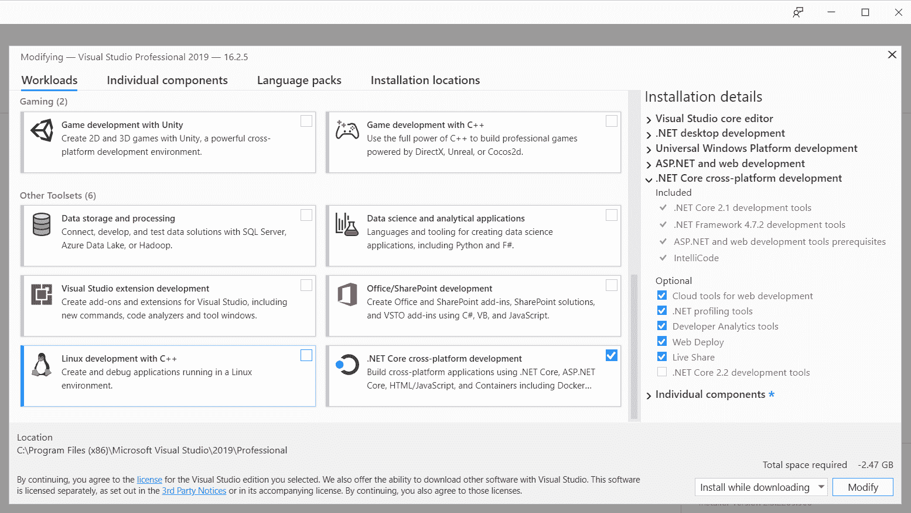
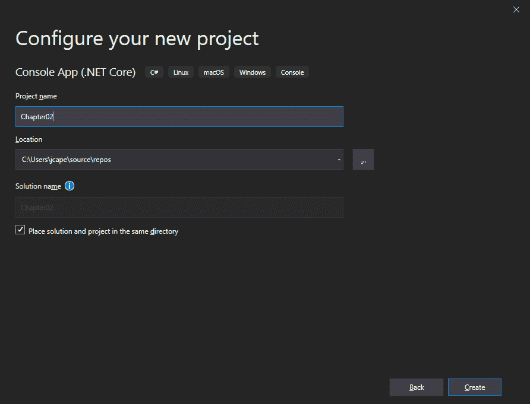
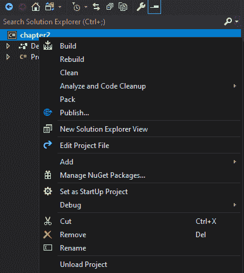

# 二、建立 ML.NET 环境

现在，您已经牢固地掌握了机器学习的基础知识，了解了微软的 ML.NET 是什么，以及它提供了什么，是时候训练并创建您的第一个机器学习模型了! 我们将基于评论构建一个简单的餐馆情感分析模型，并将该模型集成到一个简单的.NET Core 应用中。 在我们开始训练和创建模型之前，我们首先必须配置开发环境。

在本章中，我们将涵盖以下主题:

*   设置开发环境
*   使用 ML.NET 从头到尾创建您的第一个模型
*   评估模型

# 设置开发环境

幸运的是，为 ML.NET 配置环境相对容易。 在本节中，我们将安装 Visual Studio 2019 和.NET Core 3。 如果您不确定是否已经安装，请遵循以下步骤。 此外，在我们继续阅读这本书的过程中，还有一些组织元素和过程需要尽早建立，并且您可以开始自己进行试验。

# Visual Studio 安装

ML.NET 开发的核心是 Microsoft Visual Studio。 对于本书中使用的所有示例和截图，将使用 Windows 10 19H2 上的 Microsoft Visual Studio 2019 Professional。 在撰写本文时，16.3.0 是最新的版本。 请使用最新的版本。 如果您没有 Visual Studio 2019，可以在[www.visualstudio.com](http://www.visualstudio.com)上免费获得一个功能齐全的社区版本。

对这本书的范围中提到的[第一章](01.html),*开始使用机器学习和 ML.NET*,*我们将创建一个广泛的应用类型展示 ML.NET 在特定的应用平台上的各种问题。 因此，我们将在前面安装几个可用的工作负载，以避免在后面的章节中返回到安装程序:*

 *1.  首先，保证**. net 桌面开发**、**通用 Windows 平台开发**、**ASP. net 桌面开发; NET 和 web 开发**被检查。 这些工作负载将使您能够创建 UWP、WPF 和 ASP。 NET 应用，我们将在后面的章节中使用:


2.  另外，确保**. net Core 跨平台开发**也被勾选。 这将使.NET Core 能够同时用于命令行和桌面应用，比如我们将在本章后面制作的应用:



# 安装.NET Core 3

所[第一章](01.html),*开始使用机器学习和 ML.NET*、.NETCore 3 是首选.NET 框架的编写针对多个平台时,由于优化工作期间取得的发展.NETCore 3。 在编写时，. net Core 3 还没有与 16.3.0 之前的 Visual Studio 安装程序捆绑在一起，需要在这里单独下载:[https://dotnet.microsoft.com/download/dotnet-core/3.0](https://dotnet.microsoft.com/download/dotnet-core/3.0)。 本书专门使用的下载版本是 3.0.100，但是在您阅读本文时，可能会有一个更新的版本。 对于那些好奇的读者，运行时是与 SDK 捆绑在一起的。

您可以通过打开 PowerShell 或命令提示符并执行以下命令来验证安装是否成功:

```cs
dotnet --version
3.0.100
```

输出应该以*3*开始，如下所示。 在撰写本文时，3.0.100 是可用的最新生产版本。

Be sure to install both 32-bit and 64-bit versions to avoid issues when targeting 32-bit and 64-bit platforms later on in this book and your future experiments.

# 创建一个过程

在本书和您自己的探索过程中，您将收集样本数据，构建模型，并尝试各种应用。 从长远来看，尽早建立一个过程来保持这些元素的有序将使事情变得更容易。 这里有一些建议要记住:

*   始终对所有代码使用源代码控制。
*   确保测试集和训练集在它们自己的文件夹中被正确命名(如果可能的话是版本化的)。
*   同时使用命名和源代码控制对模型进行版本控制。
*   在电子表格中保留评估指标以及使用的参数。

当您开发技能集并创建更复杂的问题时，很可能需要额外的工具，如 Apache Spark 或其他集群平台。 我们将在[第 11 章](11.html)、***Training and Building Production Models*中讨论这个问题，并对规模化训练提出其他建议。**

 **# 创建您的第一个 ML.NET 应用

现在是时候开始创建您的第一个 ML.NET 应用了。 对于第一个应用，我们将创建一个. net Core 控制台应用。 这个应用将把一个词的句子分类为积极的陈述或消极的陈述，并在提供的小样本数据集上进行训练。 本项目将采用**随机双坐标上升**(**SDCA**)方法，采用二元 logistic 回归分类模型。 在第三章、*回归模型*中，我们将对这种方法进行更深入的探讨。

# 在 Visual Studio 中创建项目

在打开时(取决于您在 Visual Studio 中的配置)，它要么直接打开到项目创建屏幕，要么将是一个空的 Visual Studio 窗口。 如果您的环境显示了后者，只需单击**File**，然后单击**New**，然后单击**Project**:

1.  当窗口打开时，在搜索栏中键入`console app`查找**控制台应用(。 NET Core)**。 确保语言类型为 C#(有相同名称的 Visual Basic 模板)，突出显示该模板，然后单击

 **

2.  我建议给项目起一个你可以参考的名字，比如`Chapter02`，以帮助你以后找到项目:



3.  现在，您已经有了一个.NET Core 3 控制台应用，所以现在让我们添加`ML.NET`NuGet 包。 右键单击项目，点击**管理 NuGet 包**:



4.  在搜索字段中键入`microsoft ml`。 您应该看到最新的`Microsoft.ML`版本可用:


5.  找到后，点击**安装**按钮。 简单!

At the time of writing, 1.3.1 is the latest version available and all examples throughout this book will use that version. Prior to 1.0, the syntax was very much in flux, but since then has been consistent, so using a newer version should function identically.

此时，已经为 ML.NET 配置了项目——所有未来的项目都将以这种方式引用 ML.NET，并让您回到这些步骤。

# 项目架构

简单的项目将分为两个主要功能:

*   训练和评估
*   模型运行

这在使用机器学习的功能模型和实际生产应用之间划分，因为通常有专门的团队负责每个应用。

对于那些希望从一个已完成的项目开始并遵循本节其余部分的人，您可以从这里获得代码:[https://github.com/PacktPublishing/Hands-On-Machine-Learning-With-ML.NET/tree/master/chapter02](https://github.com/PacktPublishing/Hands-On-Machine-Learning-With-ML.NET/tree/master/chapter02)

下面的截图显示了 Visual Studio 的解决方案资源管理器中的项目细分。 如前所述，该项目分为两个主要类:`Predictor`和`Trainer`:


`Trainer`类包含所有的模型构建和评估代码，而`Predictor`类，顾名思义，包含使用训练过的模型运行预测的代码。

我们将在接下来的章节中使用`BaseML`课程，并在本书的其余部分展开。 这门课背后的想法是减少**干**(****不重复自己**【显示】)违反,创建一个有凝聚力和容易迭代框架。 `Constants`课程进一步帮助了这个想法——当我们进入更复杂的应用时，减少神奇的弦; 这个设计将在未来的所有章节项目中使用。**

 **最后，`Program`类是我们的控制台应用的主要入口点。

# 运行代码

现在我们将深入研究在这个项目中使用的各种类，包括以下类:

*   `RestaurantFeedback`
*   `RestaurantPrediction`
*   `Trainer`
*   `Predictor`
*   `BaseML`
*   `Program`

# RestaurantFeedback 类

类为我们的模型提供输入类。 在 ML.NET(和其他框架)中，传统的方法是将结构化的输入输入到数据管道中，然后将其传递到训练阶段，最终传递到训练模型中。

下面的类定义了用于保存预测值的容器类。 这是我们将在本书的其余部分使用的方法:

```cs
using Microsoft.ML.Data;

namespace chapter02.ML.Objects
{
     public class RestaurantFeedback
     {
          [LoadColumn(0)]
          public bool Label { get; set; }

          [LoadColumn(1)]
          public string Text { get; set; }
     }
}
```

乍一看，您可能想知道`RestarauntFeedback`类中的`Label`和`Text`属性与源数据之间的相关性是什么。 在`Data`文件夹中，有一个名为`sampledata.csv`的文件。 该文件包含以下内容:

```cs
0    "Great Pizza"
0    "Awesome customer service"
1    "Dirty floors"
1    "Very expensive"
0    "Toppings are good"
1    "Parking is terrible"
0    "Bathrooms are clean"
1    "Management is unhelpful"
0    "Lighting and atmosphere are romantic"
1    "Crust was burnt"
0    "Pineapple was fresh"
1    "Lack of garlic cloves is upsetting"
0    "Good experience, would come back"
0    "Friendly staff"
1    "Rude customer service"
1    "Waiters never came back"
1    "Could not believe the napkins were $10!"
0    "Supersized Pizza is a great deal"
0    "$5 all you can eat deal is good"
1    "Overpriced and was shocked that utensils were an upcharge"
```

第一列映射到`Label`属性。 您可能还记得在[第一章](01.html)，*机器学习入门和 ML.NET*中，在本示例中执行的监督学习需要标记。 在这个项目中，我们的标签是一个布尔值。 在数据集中，False(0)表示正反馈，True(1)表示负反馈。

第二列映射到`Text`属性，以传播情感(也就是要提供给模型的句子)。

# RestaurantPrediction 类

类包含将从我们的模型运行中产生的输出属性。 根据使用的算法，输出类，正如你将在以后的章节中发现的，将包含更多的属性:

```cs
using Microsoft.ML.Data;

namespace chapter02.ML.Objects
{
    public class RestaurantPrediction
    {
        [ColumnName("PredictedLabel")]
        public bool Prediction { get; set; }

        public float Probability { get; set; }

        public float Score { get; set; }
    }
}
```

与`RestaurantFeedback Label`属性类似，`Prediction`属性包含正反馈或负反馈的整体结果。 `Probability`属性包含了我们模型对该决策的信心。 `Score`属性用于我们模型的评估。

# 训练类

在下面，你将找到在`Trainer`类中唯一的方法。 在较高的层次上，`Trainer`方法做以下工作:

*   它将训练数据(在本例中为 CSV)加载到内存中。
*   它构建一个训练集和一个测试集。
*   它创造了管道。
*   它训练并保存模型。
*   它对模型进行评估。

这就是我们将贯穿本书其余部分的结构和流程。 现在，让我们深入了解`Train`方法背后的代码:

1.  首先，我们检查以确保训练数据文件名存在:

```cs
if (!File.Exists(trainingFileName)) {
    Console.WriteLine($"Failed to find training data file ({trainingFileName}");

    return;
}
```

尽管这是一个简单的测试应用，但最好将其视为生产级应用。 此外，由于这是一个控制台应用，您可能会错误地传入训练数据的路径，这可能会导致方法中进一步出现异常。

2.  使用 ML.NET 提供的`LoadFromTextFile`助手方法来帮助将文本文件加载到`IDataView`对象中:

```cs
IDataView trainingDataView = MlContext.Data.LoadFromTextFile<RestaurantFeedback>(trainingFileName);
```

如你所见，我们同时传入了训练文件名和类型; 在本例中，它是前面提到的`RestaurantFeedback`类。 需要注意的是，该方法还有其他几个参数，包括以下参数:

*   `separatorChar`:列分隔符; 它默认为`\t`(换句话说，一个选项卡)。
*   `hasHeader`:如果设置为`true`，则数据集的第一行有标题; 默认为`false`。
*   `allowQuoting`:定义源文件是否可以包含由带引号字符串定义的列; 它默认为 false。
*   `trimWhitespace`:删除行末尾的空白; 它默认为 false。
*   `allowSparse`:定义文件是否可以包含稀疏格式的数值向量; 它默认为 false。 稀疏格式需要一个新的列来显示特性的数量。

对于本书中使用的大多数项目，我们将使用默认设置。

3.  给定我们之前创建的`IDataView`对象，使用 ML.NET 提供的`TrainTestSplit`方法从主训练数据创建一个测试集:

```cs
DataOperationsCatalog.TrainTestData dataSplit = MlContext.Data.TrainTestSplit(trainingDataView, testFraction: 0.2);
```

如[Chapter 1](01.html)，*Getting Started with Machine Learning and ML.NET*所述，样本数据被分为训练和测试两组。 参数`testFraction`指定为测试保留数据集的百分比，在本例中为 20%。 默认情况下，该参数设置为 0.2。

4.  首先，我们创建管道:

```cs
TextFeaturizingEstimator dataProcessPipeline = MlContext.Transforms.Text.FeaturizeText(outputColumnName: "Features",
        inputColumnName: nameof(RestaurantFeedback.Text));
```

以后的示例将有更复杂的管道。 在本例中，我们只是将前面讨论的`Text`属性映射到`Features`输出列。

5.  接下来，实例化我们的`Trainer`类:

```cs
SdcaLogisticRegressionBinaryTrainer sdcaRegressionTrainer = MlContext.BinaryClassification.Trainers.SdcaLogisticRegression(
        labelColumnName: nameof(RestaurantFeedback.Label),
        featureColumnName: "Features");

```

你可能还记得[第一章](01.html)，*开始学习机器学习和 ML.NET*，ML.NET 中的各种算法被称为训练器。 在这个项目中，我们使用 SCDA 训练师。

6.  然后，通过添加之前实例化的训练器来完成管道:

```cs
EstimatorChain<BinaryPredictionTransformer<CalibratedModelParametersBase<LinearBinaryModelParameters, PlattCalibrator>>> trainingPipeline = dataProcessPipeline.Append(sdcaRegressionTrainer);
```

7.  接下来，我们使用本章前面创建的数据集来训练模型:

```cs
ITransformer trainedModel = trainingPipeline.Fit(dataSplit.TrainSet);
```

8.  我们将新创建的模型保存到指定的文件名中，以匹配训练集的模式:

```cs
MlContext.Model.Save(trainedModel, dataSplit.TrainSet.Schema, ModelPath);
```

9.  现在，我们用之前创建的测试集来转换新创建的模型:

```cs
IDataView testSetTransform = trainedModel.Transform(dataSplit.TestSet);
```

10.  最后，我们将使用之前创建的`testSetTransform`函数，并将其传递给`BinaryClassification`类的`Evaluate`方法:

```cs
CalibratedBinaryClassificationMetrics modelMetrics = MlContext.BinaryClassification.Evaluate(
        data: testSetTransform,
        labelColumnName: nameof(RestaurantFeedback.Label),
        scoreColumnName: nameof(RestaurantPrediction.Score));

Console.WriteLine($"Area Under Curve: {modelMetrics.AreaUnderRocCurve:P2}{Environment.NewLine}" +
        $"Area Under Precision Recall Curve: {modelMetrics.AreaUnderPrecisionRecallCurve:P2}" +                    $"{Environment.NewLine}" +
        $"Accuracy: {modelMetrics.Accuracy:P2}{Environment.NewLine}" +
        $"F1Score: {modelMetrics.F1Score:P2}{Environment.NewLine}" +
        $"Positive Recall: {modelMetrics.PositiveRecall:#.##}{Environment.NewLine}" +
        $"Negative Recall: {modelMetrics.NegativeRecall:#.##}{Environment.NewLine}");
```

这种方法允许我们生成模型度量。 然后，我们使用训练过的模型和测试集打印主要指标。 我们将在本章的*评估模型*部分详细讨论这些属性。

# 预测类

如前所述，`Predictor`类是在我们的项目中提供预测支持的类。 这种方法背后的思想是提供一个简单的接口来运行模型，给出相对简单的输入。 在以后的章节中，我们将扩展这种方法结构，以支持更复杂的集成，比如那些托管在 web 应用中的集成:

1.  类似于`Trainer`课程中所做的，我们在阅读模型之前验证模型是否存在:

```cs
if (!File.Exists(ModelPath)) {
    Console.WriteLine($"Failed to find model at {ModelPath}");

    return;
}
```

2.  然后定义`ITransformer`对象:

```cs
ITransformer mlModel;

using (var stream = new FileStream(ModelPath, FileMode.Open, FileAccess.Read, FileShare.Read)) {
    mlModel = MlContext.Model.Load(stream, out _);
}

if (mlModel == null) {
    Console.WriteLine("Failed to load model");

    return;
}
```

当我们通过`Model.Load`方法加载时，这个对象将包含我们的模型。 此方法也可以采用直接文件路径。 然而，流方法本身支持我们将在后面的章节中使用的非磁盘方法。

3.  接下来，根据前面加载的模型创建一个`PredictionEngine`对象:

```cs
var predictionEngine = MlContext.Model.CreatePredictionEngine<RestaurantFeedback,                        RestaurantPrediction>(mlModel);
```

在本项目中，我们将分别传入 TSrc 和 TDst，分别为`RestaurantFeedback`和`RestaurantPrediction`。

4.  然后调用`PredictionEngine`类上的`Predict`方法:

```cs
var prediction = predictionEngine.Predict(new RestaurantFeedback { Text = inputData });
```

因为，当我们用 TSrc 创建对象时，类型被设置为`RestaurantFeedback`，我们有一个强类型的接口到我们的模型。 然后，我们使用`inputData`变量创建`RestaurantFeedback`对象，该对象包含我们将在其上运行模型的句子的字符串。

5.  最后，显示预测输出和概率:

```cs
Console.WriteLine($"Based on \"{inputData}\", the feedback is predicted to be:{Environment.NewLine}" +
        "{(prediction.Prediction ? "Negative" : "Positive")} at a {prediction.Probability:P0}" +                 " confidence");
```

# BaseML 类

如前所述，从本章开始，`BaseML`类将包含`Trainer`和`Predictor`类之间的公共代码。 在本书的剩余部分，我们将在定义如下的`BaseML`类之上构建:

```cs
using System;
using System.IO;

using chapter02.Common;

using Microsoft.ML;

namespace chapter02.ML.Base
{
    public class BaseML
    {
        protected static string ModelPath => Path.Combine(AppContext.BaseDirectory,                                                           Constants.MODEL_FILENAME);

        protected readonly MLContext MlContext;

        protected BaseML()
        {
            MlContext = new MLContext(2020);
        }
    }
}
```

对于训练和预测中的所有 ML.NET 应用，都需要一个`MLContext`对象。 在测试组件期间，需要用特定的种子值初始化对象，以创建更一致的结果。 一旦加载模型，种子值(或缺少种子值)不会影响输出。

# 项目类

已经创建控制台应用的人应该熟悉其中的`Program`类和`Main`方法。 在本书的其余部分中，我们将对其他基于控制台的应用遵循这种结构。 下面的代码块包含应用将从其中开始执行的程序类:

```cs
using System;

using chapter02.ML;

namespace chapter02
{
    class Program
    {
        static void Main(string[] args)
        {
            if (args.Length != 2)
            {
                Console.WriteLine($"Invalid arguments passed in, exiting.{Environment.NewLine}" +                            $"{Environment.NewLine}Usage: {Environment.NewLine}" +
                    $"predict <sentence of text to predict against>{Environment.NewLine}" +
                    $"or {Environment.NewLine}" +
                    $"train <path to training data file>{Environment.NewLine}");

                return;
            }

            switch (args[0])
            {
                case "predict":
                    new Predictor().Predict(args[1]);
                    break;
                case "train":
                    new Trainer().Train(args[1]);
                    break;
                default:
                    Console.WriteLine($"{args[0]} is an invalid option");
                    break;
            }
        }
    }
}
```

对于那些熟悉解析命令行参数的人来说，这构成了一个相当简单的方法实现。 帮助文本中使用了一个简单的双参数方法。

When executing a more complex command-line application that takes in several arguments (optional and required), Microsoft has provided a simple-to-use NuGet package, which is available here: [https://github.com/dotnet/command-line-api](https://github.com/dotnet/command-line-api)

# 运行这个例子

要同时运行训练和预测，只需构建项目，然后传入适当的数据。

对于训练，您可以使用包含的`sampledata.csv`文件或创建自己的文件。 我们将通过打开一个 PowerShell 窗口并传入相对路径来实现:

```cs
.\chapter02.exe train ..\..\..\Data\sampledata.csv
Area Under Curve: 100.00%
Area Under Precision Recall Curve: 100.00%
Accuracy: 100.00%
F1Score: 100.00%
Positive Recall: 1
Negative Recall: 1
```

模型建立后，可以按如下方式运行预测:

```cs
.\chapter02.exe predict "bad"
Based on "bad", the feedback is predicted to be:
Negative at a 64% confidence
```

请随意尝试各种短语来测试模型的有效性，并祝贺您训练了第一个模型!

# 评估模型

正如您在运行示例项目的训练器组件时看到的，有各种模型评估元素。 对于每种模型类型，在分析模型的性能时都有不同的度量标准。

在二进制分类模型中，如在示例项目中找到的模型中，以下属性暴露在我们调用`Evaluate`方法后设置的`CalibratedBiniaryClassificationMetrics`中。 但是，首先，我们需要在一个二进制分类中定义四种预测类型:

*   真阴性:正确归类为阴性
*   真阳性:正确归类为阳性
*   False negative:不正确地归类为 negative
*   误报:不正确地归类为阳性

第一个需要理解的指标是**准确性**。 顾名思义，准确性是评估模型时最常用的量度之一。 这个指标可以简单地计算为正确分类的预测与总分类的比率。

下一个需要理解的指标是**精度**。 精度定义为一个模型中真实结果占所有正面结果的比例。 例如，精度为 1 意味着没有误报，这是一种理想的情况。 如前所述，假阳性是指当某事物应该被归类为阴性时却将其归类为阳性。 误报的一个常见例子是将一个文件误分类为恶意的，而实际上它是良性的。

下一个需要理解的指标是**回想**。 召回率是模型返回的所有正确结果的比例。 例如，召回值为 1 表示没有错误的阴性结果，这是另一种理想的情况。 “假阴性”是指当某件事应该被归类为“阳性”时，却把它归类为“阴性”。

下一个需要理解的指标是**f 评分**，它同时利用精确度和召回率，根据假阳性和假阴性产生加权平均。 与简单地看准确性相比，f 值给出了模型性能的另一个角度。 值的范围在 0 到 1 之间，理想值为 1。

**曲线下面积**曲线下面积**又称 AUC，顾名名义，是真阳性在 y 轴上，假阳性在 x 轴上绘制的曲线下面积。 对于我们在本章前面训练的模型这样的分类器，如您所见，它返回 0 到 1 之间的值。**

最后，用**平均日志损耗**和**训练日志损耗**进一步解释了模型的性能。 平均日志损失通过取真实分类和模型预测之间的差异，有效地表达了在单个数字中对错误结果的惩罚。 训练日志损失用概率与已知值的比较来表示模型的不确定性。 当你训练你的模型时，你会寻找一个较低的数字(较低的数字更好)。

至于其他模型类型，我们将在各自的章节中深入探讨如何评估它们，其中我们将涵盖回归和聚类指标。

# 总结

在本章的过程中，我们已经建立了我们的开发环境，并学习了适当的文件组织。 除了针对新模型进行训练、评估和运行预测外，我们还创建了我们的第一个 ML.NET 应用。 最后，我们探讨了如何评估一个模型和各种性质的含义。

在下一章中，我们将深入研究逻辑回归算法。*******