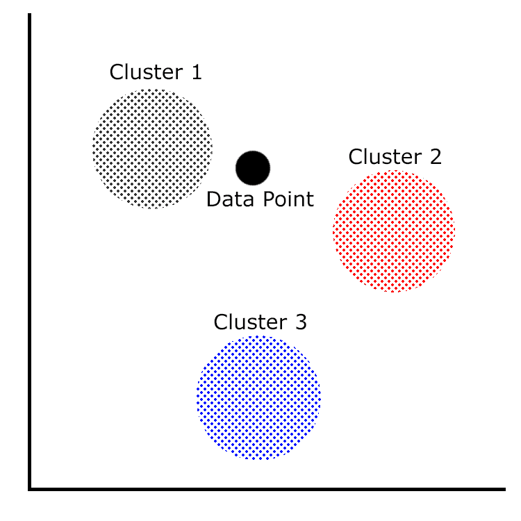

# 聚类模型

分类模型已经过去，现在是时候深入研究集群模型了。 目前，在 ML.NET 中只有一种聚类算法，k-means。 在本章中，我们将深入探讨 k-means 聚类以及最适合使用聚类算法的各种应用。 此外，我们将构建一个新的 ML.NET 集群应用，它仅通过查看内容来确定文件的类型。 最后，我们将探讨如何评估具有 ML.NET 所揭示的属性的 k-means 聚类模型。

在本章中，我们将涵盖以下主题:

*   分解 k-means 算法
*   创建集群应用
*   评估 k-means 模型

# 分解 k-means 算法

正如[第 1 章](01.html)，*Getting Started with Machine Learning and ML.NET，*k-means 聚类，其定义是一种无监督学习算法。 这意味着数据根据提供给模型用于训练的数据分组到集群中。 在本节中，我们将深入研究群集和 k-means 训练器的许多用例。

# 集群用例

您可能已经开始认识到，集群有许多应用，其中的输出将相似的输出分类为几组相似的数据点。

它的一些潜在应用包括:

*   追踪地震或飓风等自然灾害，并形成高危险区域群
*   根据作者、主题和来源对书籍或文档进行分组
*   将客户数据分组成有针对性的营销预测
*   搜索结果分组相似的结果，其他用户发现有用

此外，它还有许多其他的应用，如预测恶意软件家族或癌症研究的医疗目的。

# 潜入 k-means 训练器

ML.NET 中使用的 k-means 训练器基于阴阳方法，而不是经典的 k-means 实现。 就像我们在前面的章节中看到的一些训练器一样，所有的输入都必须是 Float 类型。 此外，所有的输入必须标准化为一个单一的特征向量。 幸运的是，k-means 培训器包含在主 ML.NET NuGet 包中; 因此，不需要额外的依赖项。

To learn more about the Yinyang implementation, Microsoft Research published a white paper here: [https://www.microsoft.com/en-us/research/wp-content/uploads/2016/02/ding15.pdf](https://www.microsoft.com/en-us/research/wp-content/uploads/2016/02/ding15.pdf).

看看下面的图表，显示了三个集群和一个数据点:



在聚类中，每个这些聚类代表一组相似的数据点。 对于 k-means 聚类(以及其他聚类算法)，数据点与每个聚类之间的距离是模型将返回的聚类的度量。 特别是对于 k-means 聚类，它使用每个这些聚类的中心点(也称为质心)，然后计算到数据点的距离。 这些值中最小的是预测的集群。

对于 k-means 训练器，可以用三种方法之一初始化它。 一种方法是利用随机初始化—正如您可能已经猜到的那样，这可能导致随机预测结果。 另一种方法是利用 K -means++，它努力产生 O(log K)预测。 最后，k-means||是 ML.NET 中的默认方法，它使用一个并行方法来减少初始化所需的传递次数。

For more information on k-means||, you can refer to a paper published by Stanford, which explains it in detail: [https://theory.stanford.edu/~sergei/papers/vldb12-kmpar.pdf](https://theory.stanford.edu/~sergei/papers/vldb12-kmpar.pdf). [](https://theory.stanford.edu/~sergei/papers/vldb12-kmpar.pdf) 
For more information on k-means++, you can refer to a paper published by Stanford in 2006, explaining it in detail: [http://ilpubs.stanford.edu:8090/778/1/2006-13.pdf](http://ilpubs.stanford.edu:8090/778/1/2006-13.pdf).

我们将在下一节的示例应用中演示这个培训器。

# 创建集群应用

如前所述，我们将创建的应用是一个文件类型分类器。 给定一组从文件中静态提取的属性，如果它是文档、可执行文件或脚本，预测将返回。 对于那些使用过 Linux`file`命令的人来说，这是一个基于机器学习的简化版本。 本例中包含的属性不是确定的属性列表，也不应该在生产环境中按原样使用它们; 但是，您可以将此作为为 Linux`file`命令创建真正的基于 ml 的替换的起点。

与前面的章节一样，完整的项目代码、示例数据集和项目文件可以在这里下载:[https://github.com/PacktPublishing/Hands-On-Machine-Learning-With-ML.NET/tree/master/chapter05](https://github.com/PacktPublishing/Hands-On-Machine-Learning-With-ML.NET/tree/master/chapter05)。

# 探索项目架构

基于我们在前面章节中创建的项目架构和代码，架构上的主要变化是在训练集和测试集上进行特征提取。

在这里，您将找到项目的 Visual Studio 解决方案资源管理器视图。 该解决方案新增的文件是`FileTypes`、`FileData`和`FilePrediction`，我们将在本节稍后回顾:


这个`sampledata.csv`文件包含我系统上的 80 行随机文件，包括 30 个 Windows 可执行文件、20 个 PowerShell 脚本和 20 个 Word 文档。 请随意调整数据以符合您自己的观察或调整训练模型。 以下是数据片段:

```cs
0,1,1,0
0,1,1,0
0,1,1,0
2,0,0,0
2,0,0,0
2,0,0,0
2,0,0,0
2,0,0,0
2,0,0,0
2,0,0,0
2,0,0,0
2,0,0,0
2,0,0,0
2,0,0,0
1,1,0,1
1,1,0,1
1,1,0,1
1,1,0,1
```

这些行中的每一行都包含新创建的`FileData`类中属性的值，我们将在本章的后面讨论这个类。

除此之外，我们还添加了`testdata.csv`文件，该文件包含了额外的数据点，用于针对和评估新训练的模型进行测试。 甚至有 10 个 Windows 可执行文件、10 个 PowerShell 脚本和 10 个 Word 文档。 下面是`testdata.csv`内部的数据片段:

```cs
0,1,1,0
0,1,1,0
2,0,0,0
2,0,0,0
2,0,0,0
2,0,0,0
2,0,0,0
2,0,0,0
1,1,0,1
```

# 钻研代码

对于这个应用，如前一节所述，我们是在第 4 章、*分类模型*中完成的工作之上构建的。 在本文中，我们将只关注为该应用更改的代码。

更改或添加的类如下:

*   `Constants`
*   【t】【t】
*   `FileTypes`
*   `FileData`
*   `FileTypePrediction`
*   `FeatureExtractor`
*   `Predictor`
*   `Trainer`
*   `Program`

# 常量类

除支持特征提取的`testdata.csv`变量外，`Constants`类已更改为将模型保存为`chapter5.mdl`。 下面的代码块反映了这些更改:

```cs
namespace chapter05.Common
{
    public class Constants
    {
        public const string MODEL_FILENAME = "chapter5.mdl";

        public const string SAMPLE_DATA = "sampledata.csv";

        public const string TEST_DATA = "testdata.csv";
    }
}
```

# BaseML 类

在`BaseML`类中唯一的变化是增加了`FEATURES`变量。 通过在这里使用一个变量，我们可以在`Trainer`类中删除魔术字符串的使用(我们将在本节稍后讨论):

```cs
protected const string FEATURES = "Features";
```

# 文件枚举

枚举包含用于映射分类和数值的强类型方法。 正如我们在前面的例子中发现的，使用枚举而不是魔术或常量值提供了更好的灵活性，如图所示，并贯穿于其余的类:

```cs
namespace chapter05.Enums
{
    public enum FileTypes
    {
        Executable = 0,
        Document = 1,
        Script = 2
    }
}
```

# FileData 类

`FileData`**类是包含预测和训练模型的数据的容器类:**

 **1.  首先，我们为`True`和`False`加上常数，因为 k-means 需要浮点值:

```cs
public class FileData
{
    private const float TRUE = 1.0f;
    private const float FALSE = 0.0f;
```

2.  接下来，我们创建一个构造函数，它同时支持我们的预测和训练。 我们可以选择传入培训的文件名来提供一个标签，在本例中，分别为脚本、可执行文件和文档提供了`ps1`、`exe`和`doc`。 我们还调用 helper 方法来确定文件是二进制的，还是以 MZ 或 PK 开头:

```cs
public FileData(Span<byte> data, string fileName = null)
{
    // Used for training purposes only
    if (!string.IsNullOrEmpty(fileName))
    {
        if (fileName.Contains("ps1"))
        {
            Label = (float) FileTypes.Script;
        } else if (fileName.Contains("exe"))
        {
            Label = (float) FileTypes.Executable;
        } else if (fileName.Contains("doc"))
        {
            Label = (float) FileTypes.Document;
        }
    }

    IsBinary = HasBinaryContent(data) ? TRUE : FALSE;

    IsMZHeader = HasHeaderBytes(data.Slice(0, 2), "MZ") ? TRUE : FALSE;

    IsPKHeader = HasHeaderBytes(data.Slice(0, 2), "PK") ? TRUE : FALSE;
}
```

MZ and PK are considered to be magic numbers of Windows executables and modern Microsoft Office files. Magic numbers are unique byte strings that are found at the beginning of every file. In this case, both are simply two bytes. When performing analysis on files, making quick determinations is crucial for performance. For the keen reader, PK is also the magic number for ZIP. Modern Microsoft Office documents are actually ZIP archives. For the sake of simplicity in this example, PK is used as opposed to performing an additional level of detection.

3.  接下来，我们还添加了一个额外的构造函数来支持值的硬真值设置。 我们将在本节后面深入讨论这个添加的目的:

```cs
/// <summary>
/// Used for mapping cluster ids to results only
/// </summary>
/// <param name="fileType"></param>
public FileData(FileTypes fileType)
{
    Label = (float)fileType;

    switch (fileType)
    {
        case FileTypes.Document:
            IsBinary = TRUE;
            IsMZHeader = FALSE;
            IsPKHeader = TRUE;
            break;
        case FileTypes.Executable:
            IsBinary = TRUE;
            IsMZHeader = TRUE;
            IsPKHeader = FALSE;
            break;
        case FileTypes.Script:
            IsBinary = FALSE;
            IsMZHeader = FALSE;
            IsPKHeader = FALSE;
            break;
    }
}
```

4.  接下来，我们实现两个助手方法。 第一个是`HasBinaryContent`，顾名思义，它获取原始二进制数据并搜索非文本字符，以确保它是二进制文件。 其次，定义`HasHeaderBytes`; 该方法获取一个字节数组，将其转换为一个`UTF8`字符串，然后检查该字符串是否与传入的字符串匹配:

```cs
private static bool HasBinaryContent(Span<byte> fileContent) =>
            System.Text.Encoding.UTF8.GetString(fileContent.ToArray()).Any(a => char.IsControl(a) && a != '\r' && a != '\n');

private static bool HasHeaderBytes(Span<byte> data, string match) => System.Text.Encoding.UTF8.GetString(data) == match;
```

5.  接下来，我们添加用于预测、训练和测试的属性:

```cs
[ColumnName("Label")]
public float Label { get; set; }

public float IsBinary { get; set; }

public float IsMZHeader { get; set; }

public float IsPKHeader { get; set; }
```

6.  最后，我们将`ToString`方法覆盖在特征提取中:

```cs
public override string ToString() => $"{Label},{IsBinary},{IsMZHeader},{IsPKHeader}";
```

# FileTypePrediction 类

`FileTypePrediction`**类包含映射到预测输出的属性。 在 k-means 聚类中，`PredictedClusterId`属性存储所找到的最近的聚类。 除此之外，`Distances`数组还包含了从数据点到每个集群的距离:**

 **```cs
using Microsoft.ML.Data;

namespace chapter05.ML.Objects
{
    public class FileTypePrediction
    {
        [ColumnName("PredictedLabel")]
        public uint PredictedClusterId;

        [ColumnName("Score")]
        public float[] Distances;
    }
}
```

# FeatureExtractor 类

我们在第 3 章、*回归模型*的逻辑回归例子中使用的`FeatureExtractor`类，已被改编用于支持测试和训练数据提取:

1.  首先，我们将提取一般化为取文件夹路径和输出文件。 如前所述，我们也传入文件名，提供`Labeling`干净地出现在`FileData`类中:

```cs
private void ExtractFolder(string folderPath, string outputFile)
{
    if (!Directory.Exists(folderPath))
    {
        Console.WriteLine($"{folderPath} does not exist");

        return;
    }

    var files = Directory.GetFiles(folderPath);

    using (var streamWriter =
        new StreamWriter(Path.Combine(AppContext.BaseDirectory, $"../../../Data/{outputFile}")))
    {
        foreach (var file in files)
        {
            var extractedData = new FileData(File.ReadAllBytes(file), file);

            streamWriter.WriteLine(extractedData.ToString());
        }
    }

    Console.WriteLine($"Extracted {files.Length} to {outputFile}");
}
```

2.  最后，我们从命令行中获取两个参数(从`Program`类中调用)，并简单地第二次调用前面的方法:

```cs
public void Extract(string trainingPath, string testPath)
{
    ExtractFolder(trainingPath, Constants.SAMPLE_DATA);
    ExtractFolder(testPath, Constants.TEST_DATA);
}
```

# 预测类

在这个类中有几个变化来处理文件类型预测场景:

1.  首先，我们添加了一个辅助方法`GetClusterToMap`，它将已知值映射到预测集群。 注意这里`Enum.GetValues`的用法; 当你添加更多的文件类型时，这个方法不需要修改:

```cs
private Dictionary<uint, FileTypes> GetClusterToMap(PredictionEngineBase<FileData, FileTypePrediction> predictionEngine)
{
    var map = new Dictionary<uint, FileTypes>();

    var fileTypes = Enum.GetValues(typeof(FileTypes)).Cast<FileTypes>();

    foreach (var fileType in fileTypes)
    {
        var fileData = new FileData(fileType);

        var prediction = predictionEngine.Predict(fileData);

        map.Add(prediction.PredictedClusterId, fileType);
    }

    return map;
}         
```

2.  接下来，我们将`FileData`和`FileTypePrediction`类型传递到`CreatePredictionEngine`方法中，以创建我们的预测引擎。 然后，我们将该文件作为二进制文件读取，并在运行预测和映射初始化之前将这些字节传递给`FileData`的构造函数:

```cs
var predictionEngine = MlContext.Model.CreatePredictionEngine<FileData, FileTypePrediction>(mlModel);

var fileData = new FileData(File.ReadAllBytes(inputDataFile));

var prediction = predictionEngine.Predict(fileData);

var mapping = GetClusterToMap(predictionEngine);
```

3.  最后，我们需要调整输出以匹配 k-means 预测返回的输出，包括欧几里得距离:

```cs
Console.WriteLine(
    $"Based on input file: {inputDataFile}{Environment.NewLine}{Environment.NewLine}" +
    $"Feature Extraction: {fileData}{Environment.NewLine}{Environment.NewLine}" +
    $"The file is predicted to be a {mapping[prediction.PredictedClusterId]}{Environment.NewLine}");

Console.WriteLine("Distances from all clusters:");

for (uint x = 0; x < prediction.Distances.Length; x++) { 
    Console.WriteLine($"{mapping[x+1]}: {prediction.Distances[x]}");
}
```

# 培训类

在`Trainer`类内部，为了支持 k-means 分类，需要做一些修改:

1.  第一个更改是添加了一个`GetDataView`帮助器方法，它从之前`FileData`类中定义的列构建`IDataView`对象:

```cs
private IDataView GetDataView(string fileName)
{
    return MlContext.Data.LoadFromTextFile(path: fileName,
        columns: new[]
        {
            new TextLoader.Column(nameof(FileData.Label), DataKind.Single, 0),
            new TextLoader.Column(nameof(FileData.IsBinary), DataKind.Single, 1),
            new TextLoader.Column(nameof(FileData.IsMZHeader), DataKind.Single, 2),
            new TextLoader.Column(nameof(FileData.IsPKHeader), DataKind.Single, 3)
        },
        hasHeader: false,
        separatorChar: ',');
}
```

2.  然后我们构建数据处理管道，将这些列转换为单个的`Features`列:

```cs
var trainingDataView = GetDataView(trainingFileName);

var dataProcessPipeline = MlContext.Transforms.Concatenate(
    FEATURES,
    nameof(FileData.IsBinary),
    nameof(FileData.IsMZHeader),
    nameof(FileData.IsPKHeader));
```

3.  然后，我们可以创建簇大小为 3 的 k-means 训练器，并创建模型:

```cs
var trainer = MlContext.Clustering.Trainers.KMeans(featureColumnName: FEATURES, numberOfClusters: 3);
var trainingPipeline = dataProcessPipeline.Append(trainer);
var trainedModel = trainingPipeline.Fit(trainingDataView);

MlContext.Model.Save(trainedModel, trainingDataView.Schema, ModelPath);
```

The default value for the number of clusters is 5\. An interesting experiment to run based either on this dataset or one modified by you is to see how the prediction results change by adjusting this value.

4.  现在我们使用测试数据集来评估我们刚刚训练的模型:

```cs
var testingDataView = GetDataView(testingFileName);

IDataView testDataView = trainedModel.Transform(testingDataView);

ClusteringMetrics modelMetrics = MlContext.Clustering.Evaluate(
    data: testDataView,
    labelColumnName: "Label",
    scoreColumnName: "Score",
    featureColumnName: FEATURES);
```

5.  最后，我们输出所有的分类指标，我们将在下一节详细介绍每一个指标:

```cs
Console.WriteLine($"Average Distance: {modelMetrics.AverageDistance}");
Console.WriteLine($"Davies Bould Index: {modelMetrics.DaviesBouldinIndex}");
Console.WriteLine($"Normalized Mutual Information: {modelMetrics.NormalizedMutualInformation}");
```

# 项目类

如前几章所述，`Program`类是我们应用的主要入口点。 在`Program`类中唯一的变化是帮助文本，用于指示提取的用法，以接受用于提取的测试文件夹路径:

```cs
if (args.Length < 2)
{
    Console.WriteLine($"Invalid arguments passed in, exiting.{Environment.NewLine}{Environment.NewLine}Usage:{Environment.NewLine}" +
                      $"predict <path to input file>{Environment.NewLine}" +
                      $"or {Environment.NewLine}" +
                      $"train <path to training data file> <path to test data file>{Environment.NewLine}" +
                      $"or {Environment.NewLine}" + $"extract <path to training folder> <path to test folder>{Environment.NewLine}");

    return;
}
```

最后，我们修改`switch`/`case`语句以支持`extract`方法的附加参数，以同时支持训练和测试数据集:

```cs
switch (args[0])
{
    case "extract":
        new FeatureExtractor().Extract(args[1], args[2]);
        break;
    case "predict":
        new Predictor().Predict(args[1]);
        break;
    case "train":
        new Trainer().Train(args[1], args[2]);
        break;
    default:
        Console.WriteLine($"{args[0]} is an invalid option");
        break;
}
```

# 运行应用

运行应用的过程几乎与[第 3 章](03.html)、*回归模型*的示例应用相同，只是在训练时添加了通过测试数据集:

1.  要像我们在前几章中所做的那样在命令行上运行训练，只需传入以下命令(假设您已经添加了两组文件; 一个为您的训练和测试集):

```cs
PS chapter05\bin\Debug\netcoreapp3.0> .\chapter05.exe extract ..\..\..\TrainingData\ ..\..\..\TestData\
Extracted 80 to sampledata.csv
Extracted 30 to testdata.csv
```

Included in the code repository are two pre-feature extracted files (`sampledata.csv` and t`estdata.csv`) to allow you to train a model without performing your own feature extraction.  If you would like to perform your own feature extraction, create a `TestData` and `TrainingData` folder.  Populate these folders with a sampling of **PowerShell **(**PS1**), **Windows Executables** (**EXE**) and **Microsoft Word documents** (**DOCX**).

2.  提取数据后，我们必须通过传入新创建的`sampledata.csv`和`testdata.csv`文件来训练模型:

```cs
PS chapter05\bin\Debug\netcoreapp3.0> .\chapter05.exe train ..\..\..\Data\sampledata.csv ..\..\..\Data\testdata.csv 
Average Distance: 0
Davies Bould Index: 0
Normalized Mutual Information: 1
```

3.  要使用此文件运行模型，只需将文件名传递给构建的应用(在本例中，使用已编译的`chapter05.exe`)，预测的输出将显示:

```cs
PS chapter05\bin\Debug\netcoreapp3.0> .\chapter05.exe predict .\chapter05.exe
Based on input file: .\chapter05.exe

Feature Extraction: 0,1,1,0

The file is predicted to be a Executable

Distances from all clusters:
Executable: 0
Script: 2
Document: 2
```

注意，扩展的输出包含了几个度量数据点——我们将在本章的最后讨论每一个度量数据点的含义。

您可以随意修改这些值，并查看基于训练模型的数据集的预测如何变化。 从这一点开始，一些实验领域可以包括以下内容:

*   添加一些额外的功能来提高预测的准确性
*   向集群中添加额外的文件类型，如视频或音频
*   添加一个新的文件范围来生成新的样本和测试数据

# 评估 k-means 模型

正如前面章节所讨论的，评估模型是整个模型构建过程的关键部分。 一个训练不良的模型只会提供不准确的预测。 幸运的是，ML.NET 提供了许多流行的属性，用于在训练时根据测试集计算模型准确性，从而使您了解模型在生产环境中的执行情况。

在 ML.NET 中，如示例应用所述，有三个属性组成了`ClusteringMetrics`类对象。 让我们深入了解在`ClusteringMetrics`对象中暴露的属性:

*   平均距离
*   Davies-Bouldin 指数
*   归一化互信息

在下一节中，我们将分析如何计算这些值以及要查找的理想值。

# 平均距离

也称为**平均分数**，是集群中心到测试数据的距离。 类型为 double 的值将随着集群数量的增加而减少，从而有效地为边缘情况创建集群。 此外，当您的特性创建不同的集群时，可能会出现 0 值，例如在我们的示例中发现的值。 这意味着，如果您发现自己的预测性能很差，那么您应该增加集群的数量。

# Davies-Bouldin 指数

戴维斯-博尔丁指数是衡量集群质量的另一个指标。 具体地说，davis - bouldin Index 测量从 0 到 1(类型为 double)的簇分离的散度，值为 0 是理想值(就像我们的示例一样)。

For more details on the Davies-Bouldin Index, specifically the math behind the algorithm, a good resource can be found here: [https://en.wikipedia.org/wiki/Davies%E2%80%93Bouldin_index](https://en.wikipedia.org/wiki/Davies%E2%80%93Bouldin_index).

# 归一化互信息

采用归一化互信息度量来度量特征变量之间的相互依赖性。

值的范围从 0 到 1(类型为 double)—接近或等于 1 是理想的，类似于我们在本章前面训练的模型。

For more details on normalized mutual information along with the math behind the algorithm, please read [http://en.wikipedia.org/wiki/Mutual_information# Normalized_variants](http://en.wikipedia.org/wiki/Mutual_information# Normalized_variants).

# 总结

在本章中，我们通过 k-means 聚类算法深入研究了 ML.NET 的聚类支持。 我们还创建并训练了我们的第一个集群应用，使用 k-means 来预测文件的文件类型。 最后，我们深入探讨了如何评估 k-means 聚类模型，以及 ML.NET 揭示的各种属性，以实现对 k-means 聚类模型的正确评估。

在下一章中，我们将通过创建登录异常预测器来深入研究使用 ML.NET 的异常检测算法。****