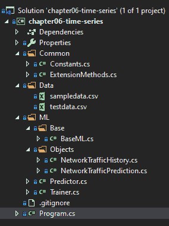
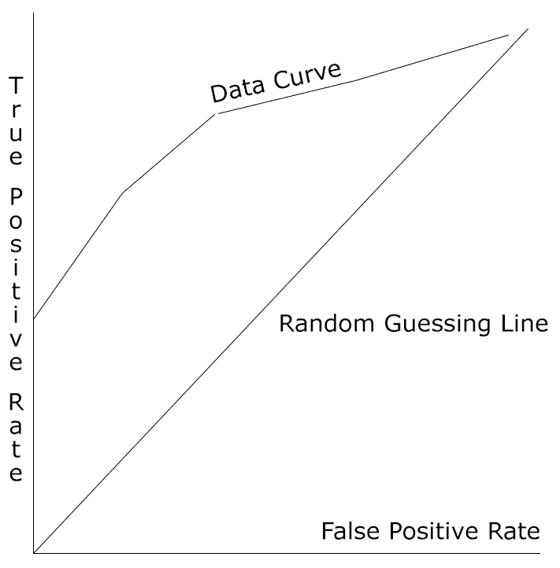

# 异常检测模型

随着 k-means 聚类模型的结束，现在是时候深入研究异常检测模型了。 异常检测是 ML.NET 中更新的功能之一，特别是时间序列转换。 在本章中，我们将深入研究异常检测和各种最适合利用异常检测的应用。 此外，我们将构建两个新的示例应用程序:一个异常检测应用程序确定登录尝试是否异常显示随机 PCA 训练器，另一个在网络流量异常检测应用程序中演示时间序列。 最后，我们将探讨如何评估具有 ML.NET 所暴露的属性的异常检测模型。

在本章中，我们将涵盖以下主题:

*   故障异常检测
*   创建时间序列应用程序
*   创建异常检测应用
*   评估异常检测模型

# 故障异常检测

如[第一章](01.html)，*Getting Started with Machine Learning and ML.NET，*异常检测，根据定义，是一种无监督学习算法。 这意味着算法将对数据进行训练，并寻找不符合正常数据的数据。 在本节中，我们将深入探讨异常检测的用例，以及 ML.NET 中用于异常检测的各种培训器。

# 异常检测用例

正如您可能已经意识到的那样，异常检测有许多应用程序，其中有可用的数据，但不知道数据中是否有异常。 不需要进行人工抽查，异常检测算法对这些数据进行训练，并确定是否有任何异常。 ML.NET 提供各种异常检测值，以便在应用程序中以编程方式查看。 我们将在本章后面回顾这些值，以更好地确保任何检测都不是假阳性。

最适合异常检测的一些潜在应用包括:

*   销售预测
*   股票市场
*   欺诈检测
*   预测设备因各种因素而发生故障
*   用于远程连接和网络流量登录历史的网络安全应用程序，例如我们稍后将深入讨论的示例应用程序

# 进入随机 PCA 培训师

在撰写本文时，随机 PCA 训练器是 ML.NET 中发现的唯一用于异常检测的传统训练器。 随机 PCA 训练器需要将值归一化; 然而，缓存是不必要的，不需要额外的 NuGet 包来使用培训器。

与其他算法类似，输入是一个已知的向量大小，类型为`Float`。 输出包含两个属性:`Score`和`PredictedLabel`。 `Score`值为`Float`类型，非负且无界。 而`PredictedLabel`属性则表示基于阈值集的有效异常; true 表示异常，false 表示不正常。 ML.NET 的默认阈值为 0.5，可以通过`ChangeModelThreshold`方法进行调整。 实际上，高于阈值的值返回 true，低于阈值的值返回 false。

在此基础上，算法利用特征向量估计包含正规类的子空间，然后计算该子空间中实际特征向量与投影特征向量之间的归一化差值。 简单地说，如果计算误差不接近于 0，算法会找到边界情况。 如果它发现误差接近于 0，就认为它是一个正常的数据点(即非异常)。

我们将在本章后面的第二个示例应用程序中通过检测登录异常来演示这个培训器。

If you would like to deep dive further into randomized PCA, the following paper is a great resource: [https://web.stanford.edu/group/mmds/slides2010/Martinsson.pdf](https://web.stanford.edu/group/mmds/slides2010/Martinsson.pdf).

# 深入研究时间序列变换

与本书和 ML.NET 本身中发现的其他算法不同，时间序列支持是作为一系列转换添加的，以应用于您的训练和测试数据。 如前所述，时间序列也是 ML.NET 中较新的添加内容之一，是在 1.2.0 中添加的。

在 ML.NET 中，时间序列转换分组到`TimeSeriesCatalog`类中。 在这个类中有六个不同的方法:

*   `DetectAnomalyBySrCnn`:SRCNN 算法检测异常
*   `DetectChangePointBySsa`:采用变点**奇异谱分析**(**SSA**)算法检测异常
*   `DetectIidChangePoint`:采用**独立同分布**(**i.i.d**)算法检测变化并预测变化点
*   `DetectIidSpike`:使用 id 算法检测变化，但预测峰值而不是变化点
*   `DetectSpikeBySsa`:通过 SSA 算法检测峰值
*   `ForecastBySsa`:使用 SSA 算法进行基于奇异变量(通常称为单变量)的时间序列预测

根据应用程序的不同，您可能希望查找数据更改的峰值或更改点(向上或向下螺旋)。 在本章关于时间序列的例子中，我们将利用`DetectSpikeBySsa`来寻找随着时间变化的网络传输峰值。

For more information on forecasting with SSA, a great resource can be found here: [http://arxiv.org/pdf/1206.6910.pdf](http://arxiv.org/pdf/1206.6910.pdf).

# 创建时间序列应用程序

如前所述，我们将创建的应用程序是一个网络流量异常检测器。 给定一组与网络通信量(以字节为单位)相关的属性，应用程序将使用该数据来查找给定检查点的通信量中的异常情况。 与其他应用程序一样，这并不意味着支持下一个 ML 网络流量异常检测产品; 但是，它将向您展示如何在 ML.NET 中使用时间序列，特别是用 SSA 检测峰值。

与前面的章节一样，完整的项目代码、示例数据集和项目文件可以在这里下载:[https://github.com/PacktPublishing/Hands-On-Machine-Learning-With-ML.NET/tree/master/chapter06-time-series](https://github.com/PacktPublishing/Hands-On-Machine-Learning-With-ML.NET/tree/master/chapter06-time-series)。

# 探索项目架构

建立在我们在前几章中创建的项目架构和代码之上，大部分的变化是在模型的训练中，因为时间序列需要从我们在前几章中回顾的相当重要的范式转变。 此外，在使用时间序列转换时，如果您从头创建一个项目，则需要添加`Microsoft.ML.TimeSeries`NuGet 包。 GitHub 存储库中的示例应用程序已经包含了这个包。

在下面的屏幕截图中，您将发现项目的 Visual Studio Solution Explorer 视图。 该解决方案新增的是`NetworkTrafficHistory`**和`NetworkTrafficPrediction`**文件，我们将在本节稍后回顾:****

 ****

`sampledata.csv`文件包含 8 行网络流量数据。 请随意调整数据以符合您自己的观察或调整训练模型。 以下是数据片段:

```cs
laptop,2019-11-14T11:13:23,1500
laptop,2019-11-15T11:13:23,1000
laptop,2019-11-16T11:13:23,1100
laptop,2019-11-17T11:13:23,1600
laptop,2019-11-18T11:13:23,1000
laptop,2019-11-19T11:13:23,1100
laptop,2019-11-20T11:13:23,1000
laptop,2019-11-21T11:13:23,1000
```

这些行中的每一行都包含新创建的`NetworkTrafficHistory`**类中的属性值，我们将在本章的后面进行回顾。**

 **除此之外，我们还添加了`testdata.csv`文件，其中包含额外的数据点，用于测试新训练的模型并进行评估。 下面是`testdata.csv`内部的数据片段:

```cs
laptop,2019-11-22T11:13:23,1000
laptop,2019-11-23T11:13:23,1100
laptop,2019-11-24T11:13:23,1200
laptop,2019-11-25T11:13:23,1300
laptop,2019-11-26T11:13:23,1400
laptop,2019-11-27T11:13:23,3000
laptop,2019-11-28T11:13:23,1500
laptop,2019-11-29T11:13:23,1600
```

# 钻研代码

对于这个应用程序，如前一节所述，我们在第 5 章、*聚类模型*中完成的工作的基础上进行构建。 在本文中，我们将只关注为该应用程序更改的代码。

更改或添加的类如下:

*   `NetworkTrafficHistory`
*   `NetworkTrafficPrediction`
*   `Predictor`
*   `Trainer`
*   `Program`

# NetworkTrafficHistory 类

`NetworkTrafficHistory`**类是容器类，它包含用于预测和训练模型的数据。 如前面章节所述，`LoadColumn`装饰器中的数字映射到 CSV 文件中的索引。 如前所述，ML.NET 中的异常检测需要使用单个浮点值; 在本例中，它是`BytesTransferred`属性:**

 **```cs
using System;

using Microsoft.ML.Data;

namespace chapter06.ML.Objects
{
    public class NetworkTrafficHistory
    {
        [LoadColumn(0)]
        public string HostMachine { get; set; }

        [LoadColumn(1)]
        public DateTime Timestamp { get; set; }

        [LoadColumn(2)] 
        public float BytesTransferred { get; set; }
    }
}
```

# NetworkTrafficPrediction 类

`NetworkTrafficPrediction`**类包含映射到预测输出的属性。 函数保存警报、分数和 p 值。 我们将在本节稍后回顾这些值:**

 **```cs
using Microsoft.ML.Data;

namespace chapter06.ML.Objects
{
    public class NetworkTrafficPrediction
    {
        [VectorType(3)]
        public double[] Prediction { get; set; }
    }
}
```

# 预测类

为了处理网络流量预测场景，需要对这个类做一些更改:

1.  首先，我们使用`NetworkTrafficHistory`**和`NetworkHistoryPrediction`类型创建我们的预测引擎:**

 **```cs
var predictionEngine = MlContext.Model.CreatePredictionEngine<NetworkTrafficHistory, NetworkTrafficPrediction>(mlModel);
```

2.  接下来，我们将输入文件读入一个`IDataView`变量中(注意重载使用逗号作为`separatorChar`):

```cs
var inputData = MlContext.Data.LoadFromTextFile<NetworkTrafficHistory>(inputDataFile, separatorChar: ',');
```

3.  接下来，我们使用新创建的`IDataView`变量，并根据该数据视图获得一个可枚举的变量:

```cs
var rows = MlContext.Data.CreateEnumerable<NetworkTrafficHistory>(inputData, false);
```

4.  最后，我们需要运行预测，然后输出模型运行的结果:

```cs
Console.WriteLine($"Based on input file ({inputDataFile}):");

foreach (var row in rows)
{
    var prediction = predictionEngine.Predict(row);

    Console.Write($"HOST: {row.HostMachine} TIMESTAMP: {row.Timestamp} TRANSFER: {row.BytesTransferred} ");
    Console.Write($"ALERT: {prediction.Prediction[0]} SCORE: {prediction.Prediction[1]:f2} P-VALUE: {prediction.Prediction[2]:F2}{Environment.NewLine}");
}
```

由于`Transform`只返回三个元素的向量，因此将输出原始行数据来给出上下文。

# 培训类

在`Trainer`类内部，需要进行一些修改以支持时间序列转换。 在许多方面，需要简化。 去除评估和测试数据负载:

1.  第一个添加的是要发送到转换的四个变量:

```cs
private const int PvalueHistoryLength = 3;
private const int SeasonalityWindowSize = 3;
private const int TrainingWindowSize = 7;
private const int Confidence = 98;
```

The training window size must be greater than twice the p-value history length due to a constraint in the ML.NET library at the time of writing.

2.  然后从 CSV 训练文件中构建`DataView`对象:

```cs
var trainingDataView = GetDataView(trainingFileName);
```

3.  然后我们可以创建 SSA 峰值检测:

```cs
var trainingPipeLine = MlContext.Transforms.DetectSpikeBySsa(
    nameof(NetworkTrafficPrediction.Prediction),
    nameof(NetworkTrafficHistory.BytesTransferred),
    confidence: Confidence,
    pvalueHistoryLength: PvalueHistoryLength,
    trainingWindowSize: TrainingWindowSize,
    seasonalityWindowSize: SeasonalityWindowSize);
```

4.  现在，我们将模型拟合到训练数据上，并保存模型:

```cs
ITransformer trainedModel = trainingPipeLine.Fit(trainingDataView);

MlContext.Model.Save(trainedModel, trainingDataView.Schema, ModelPath);

Console.WriteLine("Model trained");
```

# 项目类

由于训练只需要训练数据，所以需要对`Program`类进行一些修改:

1.  帮助文本需要更新，以反映新的用法:

```cs
if (args.Length < 2)
{
    Console.WriteLine($"Invalid arguments passed in, exiting.{Environment.NewLine}{Environment.NewLine}Usage:{Environment.NewLine}" +
                      $"predict <path to input file>{Environment.NewLine}" +
                      $"or {Environment.NewLine}" +
                      $"train <path to training data file>{Environment.NewLine}");

    return;
}
```

2.  此外，switch case 语句需要更新，以反映传递给预测的单个参数:

```cs
switch (args[0])
{
    case "predict":
        new Predictor().Predict(args[1]);
        break;
    case "train":
        new Trainer().Train(args[1]);
        break;
    default:
        Console.WriteLine($"{args[0]} is an invalid option");
        break;
}
```

# 运行应用程序

为了运行应用程序，我们使用的过程与[第 3 章](03.html)、*回归模型*的示例应用几乎相同:

1.  在准备好数据之后，我们必须通过传入新创建的`sampledata.csv`文件来训练模型:

```cs
PS chapter06-time-series\bin\Debug\netcoreapp3.0> .\chapter06-time-series.exe train ..\..\..\Data\sampledata.csv
Model trained
```

2.  要使用该文件运行模型，只需将前面提到的`testdata.csv`文件**传递到新构建的应用程序中，预测的输出将显示如下:**

 **```cs
PS bin\debug\netcoreapp3.0> .\chapter06-time-series.exe predict ..\..\..\Data\testdata.csv
Based on input file (..\..\..\Data\testdata.csv):
HOST: laptop TIMESTAMP: 11/22/2019 11:13:23 AM TRANSFER: 1000 ALERT: 0 SCORE: 46.07 P-VALUE: 0.50
HOST: laptop TIMESTAMP: 11/23/2019 11:13:23 AM TRANSFER: 1100 ALERT: 0 SCORE: 131.36 P-VALUE: 0.00
HOST: laptop TIMESTAMP: 11/24/2019 11:13:23 AM TRANSFER: 1200 ALERT: 0 SCORE: 180.44 P-VALUE: 0.06
HOST: laptop TIMESTAMP: 11/25/2019 11:13:23 AM TRANSFER: 1300 ALERT: 0 SCORE: 195.42 P-VALUE: 0.17
HOST: laptop TIMESTAMP: 11/26/2019 11:13:23 AM TRANSFER: 1400 ALERT: 0 SCORE: 201.15 P-VALUE: 0.22
HOST: laptop TIMESTAMP: 11/27/2019 11:13:23 AM TRANSFER: 3000 ALERT: 1 SCORE: 1365.42 P-VALUE: 0.00
HOST: laptop TIMESTAMP: 11/28/2019 11:13:23 AM TRANSFER: 1500 ALERT: 0 SCORE: -324.58 P-VALUE: 0.11
HOST: laptop TIMESTAMP: 11/29/2019 11:13:23 AM TRANSFER: 1600 ALERT: 0 SCORE: -312.93 P-VALUE: 0.25
```

输出包括三个数据点:`HOST`、`TIMESTAMP`和`TRANSFER`。 新增的是`ALERT`、`SCORE`和`P-VALUE`。 `ALERT`非零值表示异常。 `SCORE`为异常评分的数值表示; 较高的值表示峰值。 `P-VALUE`为当前点与平均值之间的距离，取值范围为 0 ~ 1。 一个接近或等于 0 的值是另一个峰值的标志。 当评估您的模型和有效性时，使用这三个数据点可以保证一个真正的峰值，有效地减少潜在的假阳性计数。

您可以随意修改这些值，并根据训练模型的数据集探索预测如何变化。 从这一点开始的一些实验领域可能如下:

*   添加更具体的数据点，如 IP 地址
*   在培训和测试数据中添加多样化和更多的数据点

# 创建异常检测应用

如前所述，我们将创建的应用程序是登录异常检测器。 给定一组与登录相关的属性，应用程序将使用这些数据来查找异常情况，比如不寻常的登录时间。 与其他应用程序一样，这并不意味着支持下一个 ML 登录异常检测产品; 但是，它将向您展示如何在 ML.NET 中使用异常检测。

与前面的章节一样，完整的项目代码、示例数据集和项目文件可以在这里下载:[https://github.com/PacktPublishing/Hands-On-Machine-Learning-With-ML.NET/tree/master/chapter06](https://github.com/PacktPublishing/Hands-On-Machine-Learning-With-ML.NET/tree/master/chapter06)。

# 探索项目架构

基于我们在前面章节中创建的项目架构和代码，本例中的大部分更改都是在模型的训练中进行的。

在下面的屏幕截图中，您将发现项目的 Visual Studio Solution Explorer 视图。 该解决方案新增的是`LoginHistory `和`LoginPrediction`文件，我们将在本节稍后回顾:


`sampledata.csv`文件包含 10 行登录数据。 请随意调整数据以符合您自己的观察或调整训练模型。 以下是数据片段:

```cs
0,1,0,1,1,0
0,1,0,1,1,0
0,0,1,0,1,0
0,0,1,0,1,0
0,0,1,1,0,1
1,1,0,1,1,0
1,1,0,1,1,0
1,0,1,0,1,0
1,0,1,0,1,1
1,0,1,1,0,0
```

这些行中的每一行都包含新创建的`LoginHistory`类中的属性值，我们将在本章的后面讨论。

除此之外，我们还添加了`testdata.csv`文件，该文件包含了额外的数据点，用于针对和评估新训练的模型进行测试。 下面是`testdata.csv`内部的数据片段:

```cs
0,1,0,1,1,0
0,1,0,1,1,0
0,0,1,0,1,0
0,0,1,0,1,0
0,0,1,1,0,1
1,1,0,1,1,0
1,1,0,1,1,0
1,0,1,0,1,0
1,0,1,0,1,1
1,0,1,1,0,0
```

# 钻研代码

对于这个应用程序，如前一节所述，我们在第 5 章、*聚类模型*中完成的工作的基础上进行构建。 在本文中，我们将只关注为该应用程序更改的代码。

更改或添加的类如下:

*   `Constants`
*   `LoginHistory`
*   `LoginPrediction`
*   `Predictor`
*   `Trainer`

# 常量类

`Constants`类已更改为将模型保存为`chapter6.mdl`。 下面的代码块反映了这些更改:

```cs
namespace chapter06.Common
{
    public class Constants
    {
        public const string MODEL_FILENAME = "chapter6.mdl";

        public const string SAMPLE_DATA = "sampledata.csv";

        public const string TEST_DATA = "testdata.csv";
    }
}
```

# LoginHistory 类

`LoginHistory`**类是容器类，它包含用于预测和训练模型的数据。 如前面章节所述，`LoadColumn`装饰器中的数字映射到 CSV 文件中的索引。 每个属性映射到一个值，该值将被发送到模型中进行异常检测:**

 **```cs
using Microsoft.ML.Data;

namespace chapter06.ML.Objects
{
    public class LoginHistory
    {
        [LoadColumn(0)]
        public float UserID { get; set; }

        [LoadColumn(1)]
        public float CorporateNetwork { get; set; }

        [LoadColumn(2)] 
        public float HomeNetwork { get; set; }

        [LoadColumn(3)] 
        public float WithinWorkHours { get; set; }

        [LoadColumn(4)] 
        public float WorkDay { get; set; }

        [LoadColumn(5)] 
        public float Label { get; set; }
    }
}
```

# LoginPrediction 类

`LoginPrediction`**类包含映射到预测输出的属性。 下面的`PredictedLabel`属性将保持我们的预测，而`Label`和`Score`属性用于评估:**

 **```cs
namespace chapter06.ML.Objects
{
    public class LoginPrediction
    {
        public float Label;

        public float Score;

        public bool PredictedLabel;
    }
}
```

# 预测类

为了处理`Login`异常检测场景，需要对这个类做一些更改:

1.  首先，我们使用`LoginHistory`**和`LoginPrediction`类型创建我们的预测引擎:**

 **```cs
var predictionEngine = MlContext.Model.CreatePredictionEngine<LoginHistory, LoginPrediction>(mlModel);     
```

2.  接下来，我们将输入文件读入一个字符串变量:

```cs
var json = File.ReadAllText(inputDataFile);
```

3.  最后，我们运行预测，然后输出模型运行的结果:

```cs
var prediction = predictionEngine.Predict(JsonConvert.DeserializeObject<LoginHistory>(json));

Console.WriteLine(
                    $"Based on input json:{System.Environment.NewLine}" +
                    $"{json}{System.Environment.NewLine}" + 
                    $"The login history is {(prediction.PredictedLabel ? "abnormal" : "normal")}, with a {prediction.Score:F2} outlier score");
```

# 培训类

在`Trainer`类中，为了支持使用随机 PCA 训练器进行异常检测分类，需要做以下几点修改:

1.  第一个更改是添加了一个`GetDataView`助手方法，它从之前`LoginHistory`类中定义的列构建`IDataView`数据视图:

```cs
private (IDataView DataView, IEstimator<ITransformer> Transformer) GetDataView(string fileName, bool training = true)
{
    var trainingDataView = MlContext.Data.LoadFromTextFile<LoginHistory>(fileName, ',');

    if (!training)
    {
        return (trainingDataView, null);
    }

    IEstimator<ITransformer> dataProcessPipeline = MlContext.Transforms.Concatenate(
        FEATURES, 
        typeof(LoginHistory).ToPropertyList<LoginHistory>(nameof(LoginHistory.Label)));

    return (trainingDataView, dataProcessPipeline);
}
```

2.  然后我们构建训练数据视图和`RandomizedPcaTrainer.Options`对象:

```cs
var trainingDataView = GetDataView(trainingFileName);

var options = new RandomizedPcaTrainer.Options
{
    FeatureColumnName = FEATURES,
    ExampleWeightColumnName = null,
    Rank = 5,
    Oversampling = 20,
    EnsureZeroMean = true,
    Seed = 1
};

```

Note that the `Rank` property must be equal to or less than the features.

3.  然后，我们可以创建随机的 PCA 训练器，将其添加到训练数据视图中，拟合我们的模型，然后保存它:

```cs
IEstimator<ITransformer> trainer = MlContext.AnomalyDetection.Trainers.RandomizedPca(options: options);

EstimatorChain<ITransformer> trainingPipeline = trainingDataView.Transformer.Append(trainer);

TransformerChain<ITransformer> trainedModel = trainingPipeline.Fit(trainingDataView.DataView);

MlContext.Model.Save(trainedModel, trainingDataView.DataView.Schema, ModelPath);
```

4.  现在我们使用测试数据集来评估我们刚刚训练的模型:

```cs
var testingDataView = GetDataView(testingFileName, true);

var testSetTransform = trainedModel.Transform(testingDataView.DataView);

var modelMetrics = MlContext.AnomalyDetection.Evaluate(testSetTransform);
```

5.  最后，我们输出所有的分类度量。 每一项都将在下一节详细介绍:

```cs
Console.WriteLine($"Area Under Curve: {modelMetrics.AreaUnderRocCurve:P2}{Environment.NewLine}" +
                  $"Detection at FP Count: {modelMetrics.DetectionRateAtFalsePositiveCount}");
```

# 运行应用程序

为了运行应用程序，我们使用的过程几乎与[第 3 章](03.html)、*回归模型*的示例应用程序相同，只是在训练时添加了通过测试数据集:

1.  提取数据后，我们必须通过传入新创建的`sampledata.csv`和`testdata.csv`文件来训练模型:

```cs
PS chapter06\bin\Debug\netcoreapp3.0> .\chapter06.exe train ..\..\..\Data\sampledata.csv ..\..\..\Data\testdata.csv 
Area Under Curve: 78.12%
Detection at FP Count: 1
```

2.  要使用该文件运行模型，只需传入一个构造好的 JSON 文件(在本例中为`input.json`)，预测的输出将显示:

```cs
PS chapter06\bin\Debug\netcoreapp3.0> .\chapter06.exe predict input.json 
Based on input json:
{
 "UserID": 0, "CorporateNetwork": 1, "HomeNetwork": 0, "WithinWorkHours": 1, "WorkDay": 1
}
The login history is normal, with a 0% score
```

注意模型训练的扩展输出包括两个度量数据点。 在本章的最后，我们将讨论每一项的意义。

您可以随意修改这些值，并根据训练模型的数据集探索预测如何变化。 从这一点开始，一些实验领域可能包括以下内容:

*   添加一些附加属性以增加生产场景中的预测精度，例如登录发生的时间
*   增加训练和测试数据的多样性

# 评估随机 PCA 模型

正如前面章节所讨论的，评估模型是整个模型构建过程的关键部分。 一个训练不良的模型只会提供不准确的预测。 幸运的是，ML.NET 提供了许多流行的属性，用于在训练时根据测试集计算模型准确性，从而使您了解模型在生产环境中的执行情况。

在 ML.NET 中，如示例应用程序所述，有两个属性组成了`AnomalyDetectionMetrics`**类对象。 让我们深入了解在`AnomalyDetectionMetrics`**对象中暴露的属性:****

 *****   ROC 曲线下的面积
*   假阳性计数检出率

在下一节中，我们将分析如何计算这些值以及如何寻找理想值。

# ROC 曲线下的面积

ROC 曲线下的面积,因为[第三章中提到的](03.html),*回归模型,是,顾名思义,接受者操作特征下的面积**(**中华民国)曲线。 可能会想到的一个问题是:这与评估异常检测模型有什么关系?*****

 ***这个计算区域等于算法(在我们的例子中是随机 PCA)为一个正实例评分高于一个负实例的几率，这两个都是随机选择的，以更好地评估数据。 接近 100%的返回值是理想值，而如果接近 0%，则很可能出现严重的误报。 您可能还记得我们之前的示例应用程序得到 78%。 这意味着有 22%的机会出现假阳性; 下面概述了一些改进模型的建议，应该减少这个数量。

下图直观地反映了一条随机猜测线和一条任意数据曲线。 在随机猜测线之间的数据曲线下的面积是 ROC 曲线数据度量下的面积:



# 假阳性计数检出率

假阳性计数性质的检出率为*K*假阳性的检出率。 异常检测场景中的假阳性将认为一个数据点是异常，而实际上它不是。 这一比率的计算方法如下:

*K 例假阳性检出率= X / Y*

这里，根据前面在异常检测示例中描述的分数(按降序排序)，计算出*X*为 top 测试样本。 这些被认为是最积极的(也就是说，更有可能是实际的异常)。

*Y*计算为测试数据中的异常总数，而不考虑评分值(不过滤到看起来可疑的点)。 理论上，如果你的训练数据中假阳性的数量很高，这个数字可能会很高。 当您使用随机 PCA 构建生产模型时，请确保您的数据表示尽可能接近生产，以避免对异常进行过拟合或欠拟合。

# 总结

在本章的过程中，我们讨论了 ML.NET 的异常检测支持通过随机 PCA 算法。 我们还创建并训练了我们的第一个异常检测应用程序，使用随机 PCA 算法来预测异常登录。 除此之外，我们还创建了一个时间序列应用程序，查看网络流量并查找传输数据量中的峰值。 最后，我们还研究了如何评估异常检测模型，以及 ML.NET 提供的各种属性，以实现对异常检测模型的适当评估。

在下一章中，我们将深入探讨用 ML.NET 来创建一个音乐偏好预测器的矩阵分解。***************************