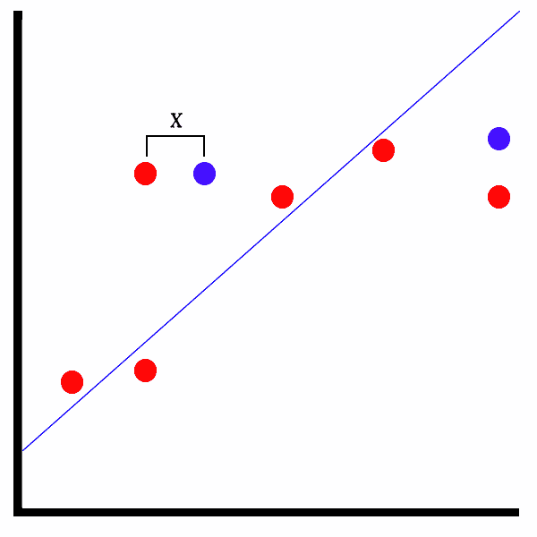

# 矩阵分解模型

有了异常检测模型，现在是时候深入研究矩阵分解模型了。 矩阵分解是 ML.NET 中较新的添加内容之一，它具有相同名称的转换。 在这一章中，我们将深入探讨矩阵分解，以及最适合利用矩阵分解的各种应用。 此外，我们将构建一个新的样本应用，根据样本训练数据预测音乐推荐。 最后，我们将探讨如何利用 ML.NET 公开的属性来评估矩阵分解模型。

在本章中，我们将涵盖以下主题:

*   分解矩阵分解
*   创建一个矩阵分解应用
*   评估矩阵分解模型

# 分解矩阵分解

正如在[第一章](01.html)，*Getting Started with Machine Learning and ML.NET*中提到的，矩阵分解，根据定义，是一种无监督学习算法。 这意味着算法将根据数据进行训练，并在用户评分中构建一个模式矩阵，在预测调用期间，将尝试根据提供的数据寻找类似的评分。 在本节中，我们将深入探讨矩阵分解的用例，并了解 ML.NET 中的矩阵分解训练器。

# 矩阵分解的用例

正如您可能开始意识到的那样，矩阵分解有许多数据可用的应用，但其思想是根据以前未选择的数据建议其他匹配。 不需要进行手工抽样检查，矩阵分解算法对这些未选择的数据进行训练，并使用键值对组合确定模式。 ML.NET 提供了各种矩阵分解值，可以在应用内部以编程方式查看。 我们将在本章后面回顾这些值，以更好地确保该建议不是假阳性。

最适合矩阵分解的一些潜在应用有:

*   音乐推荐
*   产品推荐
*   电影推荐
*   有什么好书推荐

实际上，任何可以追溯到单个用户的数据，然后在输入更多数据时构建的数据都可以利用矩阵分解。 这个问题被称为**冷启动****问题**。 举个例子，一个新的音乐平台旨在帮助你找到新的乐队来听。 当您第一次到达站点并创建概要文件时，没有预先可用的数据。 作为最终用户，您必须告诉系统您喜欢什么，不喜欢什么。 由于算法的性质，矩阵分解比我们在前面章节中探索的直接回归或二元分类算法更适合这种应用。

# 深入到矩阵分解训练器

在撰写本文时，矩阵分解训练器是 ML.NET 中唯一的传统训练器。 矩阵分解训练器需要值的规范化和缓存。 此外，要在 ML.NET 中利用矩阵分解，如果您从头开始创建项目，则需要`Microsoft.ML.Recommender`NuGet 包。 GitHub 存储库中包含的示例包含这个包。

与其他算法类似，需要标准化，但矩阵分解是惟一的。 其他的算法，如我们在二元分类或回归算法中看到的，有多个可以标准化的值。 在矩阵分解中，只涉及三个值:`Label`、`Row`、`Column`。 输出由两个属性组成:`Score `和`Label`。 `Score`值为`Float`类型，非负且无界。

值得注意的是，在 2018 年 7 月的 ML.NET 0.3 更新中，添加了油田感知因子分解机。 然而，这种类型的训练器只提供二进制建议(比如喜欢或不喜欢)，而不是矩阵分解，后者支持任意范围的浮点值。 这在使用上提供了相当好的灵活性，例如获得更细粒度的预测。 例如，如果一个从 0 到 100 的矩阵分解推荐返回 30，推荐引擎很可能返回一个负面推荐。 使用简单的二进制响应，应用——进而是终端用户——都不会显示推荐的强度。

在下一节中，我们将通过提供音乐推荐来在示例应用中演示这个培训器。

# 创建一个矩阵分解应用

正如前面提到的，我们将要创建的应用是用于音乐预测的。 给定 UserID、MusicID 和评级，算法将使用这些数据创建推荐。 与其他应用一样，这并不是为了支持下一个 Spotifyesque 机器学习产品; 然而，它将向您展示如何在 ML.NET 中使用矩阵分解。

与前面的章节一样，完整的项目代码、示例数据集和项目文件可以在这里下载:[https://github.com/PacktPublishing/Hands-On-Machine-Learning-With-ML.NET/tree/master/chapter07](https://github.com/PacktPublishing/Hands-On-Machine-Learning-With-ML.NET/tree/master/chapter07)。

# 探索项目架构

建立在我们在前面章节中创建的项目架构和代码之上，大部分的变化是在模型的训练中，因为矩阵分解需要从我们在前面章节中回顾的相当重要的范式转换。

在下面的屏幕截图中，您将发现项目的 Visual Studio Solution Explorer 视图。 该解决方案新增的是`MusicRating`**和`MusicPrediction`**文件，我们将在本节后面回顾:****

 ****

`sampledata.csv`文件包含 10 行随机音乐评级。 请随意调整数据以符合您自己的观察，或调整训练模型。 以下是数据片段:

```cs
1,1000,4
1,1001,3.5
1,1002,1
1,1003,2
2,1000,1.5
2,1001,2
2,1002,4
2,1003,4
3,1000,1
3,1001,3
```

这些行中的每一行都包含新创建的`MusicRating`**类中属性的值，我们将在本章的后面部分回顾该类。**

 **除此之外，我们还添加了包含额外数据点的`testdata.csv`文件，以测试新训练的模型并对其进行评估。 下面是`testdata.csv`内部的数据片段:

```cs
1,1000,4
1,1001,3.5
2,1002,1
2,1003,2
3,1000,1.5
3,1001,2
4,1002,4
4,1003,4
```

# 钻研代码

对于这个应用，如前一节所述，我们是在第 6 章、*异常检测模型*中完成的工作的基础上构建的。 在本文中，我们将只关注为该应用更改的代码。

更改或添加的类如下:

*   `MusicRating`
*   `MusicPrediction`
*   `Predictor`
*   `Trainer`
*   `Constants`

# MusicRating 类

`MusicRating`**类是容器类，它包含用于预测和训练模型的数据。 如前面章节所述，`LoadColumn`装饰器中的数字映射到 CSV 文件中的索引。 正如前面提到的，ML.NET 中的矩阵分解需要使用规范化，如下代码块所示:**

 **```cs
using Microsoft.ML.Data;

namespace chapter07.ML.Objects
{
    public class MusicRating
    {
        [LoadColumn(0)]
        public float UserID { get; set; }

        [LoadColumn(1)]
        public float MovieID { get; set; }

        [LoadColumn(2)]
        public float Label { get; set; }
    }
}
```

# MusicPrediction 类

`MusicPrediction`**类包含映射到预测输出的属性。 其中`Score`包含预测准确的可能性。 我们将在本节稍后回顾这些值，但现在，它们可以在以下代码块中看到:**

 **```cs
namespace chapter07.ML.Objects
{
    public class MusicPrediction
    {
        public float Label { get; set; }

        public float Score { get; set; }
    }
}
```

# 预测类

在这个类中有几个变化来处理音乐预测场景，如下所示:

1.  首先，我们使用`MusicRating`**和`MusicPrediction`类型创建我们的预测引擎，如下所示:**

 **```cs
var predictionEngine = MlContext.Model.CreatePredictionEngine<MusicRating, MusicPrediction>(mlModel);
```

2.  接下来，我们将输入文件读入一个字符串对象，如下所示:

```cs
var json = File.ReadAllText(inputDataFile);
```

                3 所示。 接下来，将字符串反序列化为`MusicRating`类型的对象，如下所示:

```cs
var rating = JsonConvert.DeserializeObject<MusicRating>(json);
```

4.  最后，我们需要运行预测，然后输出模型运行的结果，如下:

```cs
var prediction = predictionEngine.Predict(rating);

Console.WriteLine(
    $"Based on input:{System.Environment.NewLine}" +
    $"Label: {rating.Label} | MusicID: {rating.MusicID} | UserID: {rating.UserID}{System.Environment.NewLine}" +
    $"The music is {(prediction.Score > Constants.SCORE_THRESHOLD ? "recommended" : "not recommended")}");
```

由于转换只返回三个元素的向量，因此将输出原始行数据以给出上下文。

# 培训类

在`Trainer`类内部，需要做一些修改来支持矩阵分解。 在许多方面，由于只有三种输入的性质，需要简化:

1.  第一个加法是用于变量编码的两个常量变量，如下面的代码块所示:

```cs
private const string UserIDEncoding = "UserIDEncoding";
private const string MovieIDEncoding = "MovieIDEncoding";
```

2.  然后构建`MatrixFactorizationTrainer`选项。 属性`Row`和`Column`被设置为前面定义的列名。 `Quiet`标志在每次迭代中显示额外的模型构建信息，如下面的代码块所示:

```cs
var options = new MatrixFactorizationTrainer.Options
{
    MatrixColumnIndexColumnName = UserIDEncoding,
    MatrixRowIndexColumnName = MovieIDEncoding,
    LabelColumnName = "Label",
    NumberOfIterations = 20,
    ApproximationRank = 10,
    Quiet = false
};
```

3.  然后我们可以创建矩阵分解训练器，如下所示:

```cs
var trainingPipeline = trainingDataView.Transformer.Append(MlContext.Recommendation().Trainers.MatrixFactorization(options));
```

4.  现在，我们将模型拟合到训练数据上，并保存模型，如下所示:

```cs
ITransformer trainedModel = trainingPipeLine.Fit(trainingDataView.DataView);

MlContext.Model.Save(trainedModel, trainingDataView.DataView.Schema, ModelPath);

Console.WriteLine($"Model saved to {ModelPath}{Environment.NewLine}");
```

5.  最后，我们加载测试数据并将数据传递给矩阵分解评估器，如下所示:

```cs
var testingDataView = GetDataView(testingFileName, true);

var testSetTransform = trainedModel.Transform(testingDataView.DataView);

var modelMetrics = MlContext.Recommendation().Evaluate(testSetTransform);

Console.WriteLine($"matrix factorization Evaluation:{Environment.NewLine}{Environment.NewLine}" +
                  $"Loss Function: {modelMetrics.LossFunction}{Environment.NewLine}" +
                  $"Mean Absolute Error: {modelMetrics.MeanAbsoluteError}{Environment.NewLine}" +
                  $"Mean Squared Error: {modelMetrics.MeanSquaredError}{Environment.NewLine}" +
                  $"R Squared: {modelMetrics.RSquared}{Environment.NewLine}" +
                  $"Root Mean Squared Error: {modelMetrics.RootMeanSquaredError}");
```

# 常量类

另外，由于培训只需要培训数据，所以需要对`Program`类进行一些修改，具体如下:

```cs
namespace chapter07.Common
{
    public class Constants
    {
        public const string MODEL_FILENAME = "chapter7.mdl";

        public const float SCORE_THRESHOLD = 3.0f;
    }
}
```

# 运行应用

要运行应用，流程几乎与第 6 章的示例应用相同，如下所示:

1.  在准备好数据之后，我们必须通过传入新创建的`sampledata.csv`文件来训练模型，如下所示:

```cs
PS Debug\netcoreapp3.0> .\chapter07.exe train ..\..\..\Data\sampledata.csv ..\..\..\Data\testdata.csv
iter tr_rmse obj
   0 2.4172 9.6129e+01
   1 1.9634 6.6078e+01
   2 1.5140 4.2233e+01
   3 1.3417 3.5027e+01
   4 1.2860 3.2934e+01
   5 1.1818 2.9107e+01
   6 1.1414 2.7737e+01
   7 1.0669 2.4966e+01
   8 0.9819 2.2615e+01
   9 0.9055 2.0387e+01
  10 0.8656 1.9472e+01
  11 0.7534 1.6725e+01
  12 0.6862 1.5413e+01
  13 0.6240 1.4311e+01
  14 0.5621 1.3231e+01
  15 0.5241 1.2795e+01
  16 0.4863 1.2281e+01
  17 0.4571 1.1938e+01
```

```cs
  18 0.4209 1.1532e+01
  19 0.3975 1.1227e+01

Model saved to Debug\netcoreapp3.0\chapter7.mdl
```

2.  要使用该文件运行模型，只需将前面提到的`testdata.csv`文件**传递到新构建的应用中，预测的输出将显示如下:**

 **```cs
matrix factorization Evaluation:

Loss Function: 0.140
Mean Absolute Error: 0.279
Mean Squared Error: 0.140
R Squared: 0.922
Root Mean Squared Error: 0.375
```

在运行预测之前，在记事本中创建一个 JSON 文件，包含以下文本:

```cs
{ "UserID": 10, "MusicID": 4, "Label": 3 }
```

然后将文件保存到输出文件夹中。

3.  然后，像这样运行预测:

```cs
PS Debug\netcoreapp3.0> .\chapter07.exe predict input.json
Based on input:
Label: 3 | MusicID: 4 | UserID: 10
The music is not recommended
```

您可以随意修改这些值，并查看预测如何根据训练模型的数据集发生变化。 从这一点开始的一些实验领域可能是:

*   更改`Trainer`类中提到的超参数。
*   在培训和测试数据中添加多样化和更多的数据点。

# 评估矩阵分解模型

正如前面章节所讨论的，评估模型是整个模型构建过程的关键部分。 一个训练不良的模型只会提供不准确的预测。 幸运的是，ML.NET 提供了许多流行的属性，用于在训练时根据测试集计算模型准确性，从而使您了解模型在生产环境中的执行情况。

正如前面在示例应用中提到的，对于 ML.NET 中的矩阵分解模型评估，有五个属性组成了`RegressionMetrics`**类对象。 让我们深入了解在`RegressionMetrics`**对象中暴露的属性:****

 *****   损失函数
*   **均方误差**(T2】MSE)
*   **平均绝对误差**(T2】MAE
*   平方
*   **均方根误差**(**RMSE**)

在下一节中，我们将分析如何计算这些值，并详细说明要查找的理想值。

# 损失函数

此属性在初始化矩阵分解训练器时使用损失函数集。 在我们的矩阵分解示例应用中，我们使用默认构造函数，它默认为`SquaredLossRegression`类。

ML.NET 提供的其他回归损失函数有:

*   平方损失一个类
*   平方损失回归

这个属性背后的想法是，与其他四个属性相比，允许在评估模型时具有一定的灵活性，其他四个属性使用固定的算法进行评估。

# MSE

MSE 定义为误差平方和的平均值。 简单地说，以下图所示的情节为例:


这些点与我们模型的数据点相关联，而蓝色的线是预测线。 红点与预测线之间的距离就是误差。 对于 MSE，值是根据这些点及其到直线的距离计算的。 从这个值计算出平均值。 对于 MSE，值越小，拟合越好，模型的预测就越准确。

当离群值对预测结果至关重要时，MSE 最好用于评估模型。

# 美

MAE 类似于 MSE，其关键区别在于，它将点与预测线之间的距离相加，而不是计算平均值。 应该注意的是，MAE 在计算总和时不考虑方向。 例如，如果有两个数据点距离直线的距离相等，一个在直线上，另一个在直线下，实际上这将被正负值抵消。 在机器学习中，这被称为**Mean Bias Error**(**MBE**)。 然而，在撰写本文时，ML.NET 并没有将此作为`RegressionMetrics`类的一部分提供。

当异常值被认为是简单的异常时，MAE 最好用于评估模型，而不应在评估模型的性能时计算在内。

# 平方

r 平方，也被称为**决定系数**，是另一种表示预测比测试集好多少的方法。 r 平方的计算方法是:取每个预测值与其对应的实际值之间的差值，将差值平方，然后对每对点的平方求和。

r 平方值通常在 0 到 1 之间，用浮点值表示。 当拟合模型被评估为比平均拟合差时，可能会出现负值。 然而，一个低的数字并不总是反映模型是坏的。 像我们在这一章中看到的，基于人类行为预测的预测通常不到 50%。

相反，更高的值不一定是模型性能的肯定标志，因为这可以被认为是模型的过度拟合。 这发生在当有很多特性的模型,从而使模型更复杂的比模型中构建*创建您的第一个 ML.NET 应用[的](02.html)*部分第二章,*设置 ML.NET 环境【5】, 因为在训练和测试集中没有足够的多样性。 例如，如果所有的雇员都是大致相同的值，那么测试集保持值由相同范围的值组成，这将被认为是过拟合。*

# RMSE

考虑到前面的方法，RMSE 可以说是最容易理解的属性。 以下图所示的图为例:



在测试模型的情况下，就像我们之前对 holdout 集所做的那样，红点是来自测试集的实际值，而蓝点是预测值。 图中的 X 是预测值和实际值之间的距离。 RMSE 就是取所有这些距离的平均值，将其平方，然后开方。

小于 180 的值通常被认为是一个好的模型。

# 总结

在本章的过程中，我们已经深入了解了 ML.NET 的矩阵分解支持。 我们还创建并训练了我们的第一个矩阵分解应用来预测音乐推荐。 最后，我们还深入研究了如何评估矩阵分解模型，并查看了 ML.NET 为实现矩阵分解模型的适当评估而公开的各种属性。

随着本章的结束，我们也完成了对 ML.NET 提供的各种模型的初步调查。 在下一章中，我们将在前几章的基础上创建完整的应用，第一个是提供股票预测的完整的。net Core 应用。******************