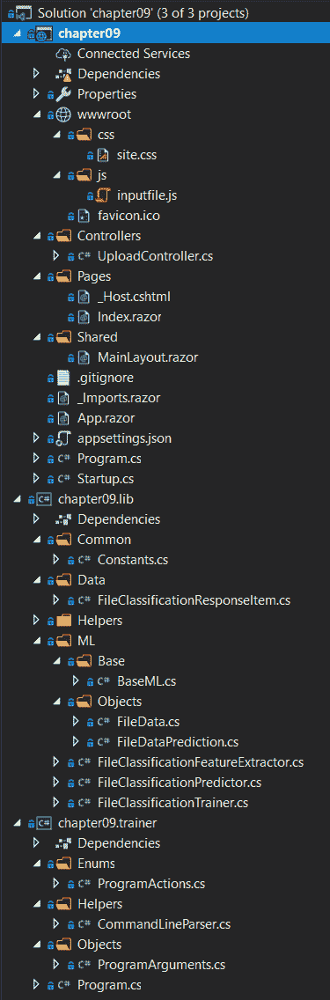
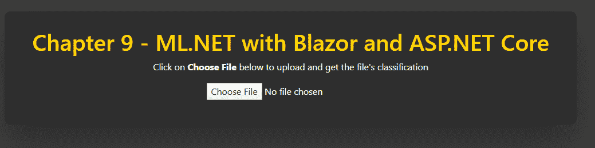

# 九、使用 ML.NET 和 ASP.NETCore

现在我们已经知道了如何创建一个产品级的.NET Core 控制台应用，在这一章中，我们将深入研究如何创建一个功能齐全的 ASP。 NET Core Blazor web 应用。 这个应用将利用一个 ML.NET 二进制分类模型,使文件分类在 Windows 可执行文件(**可移植可执行**(**PE)文件),以确定文件本身是干净的或恶意的。 此外，我们将探索将我们的应用代码分解成一个基于组件的体系结构，使用.NET Core 库在我们的 web 应用和训练我们模型的控制台应用之间共享。 在本章结束时，你应该对设计和编写一个产品级的 ASP 有一个牢固的掌握。 NET Core Blazor web 应用与 ML.NET。**

在本章中，我们将涵盖以下主题:

*   打破 ASP.NETCore
*   创建文件分类 web 应用
*   探索其他生产应用增强功能

# 打破 ASP.NETCore

基于[第 8 章](08.html)、*中讨论的.NET Core 和预测*中讨论的.NET Core 技术。 NET Core 添加了一个强大的 web 框架。 除了支持可扩展的**代表性状态传输**(**REST**)服务外，这个 web 框架还包括一个强大的呈现引擎 Razor。 本章的例子将使用这种技术来创建我们的文件分类前端。 在接下来的两节中，我们将深入探讨 ASP。 NETCore架构和讨论 Blazor，微软的新 web 框架。

# 了解 ASP.NETCore架构

在较高的层次上，ASP。 NET Core 构建在.NET Core 之上，提供了一个功能齐全的 web 框架。 与.NET Core 一样，ASP。 NET Core 运行在 Windows、Linux 和 macOS 上，并且允许部署到 x86、x64 和**高级 RISC 机**(**ARM**)CPU 架构。

一个典型的 ASP。 NET Core 应用包括以下内容:

*   模型
*   的观点
*   控制器

这些组件形成了一个通用的 web 架构原则**模型-视图-控制器**，也就是**MVC**。

# 控制器

控制器提供服务器端代码来处理 web 应用和 REST 服务的业务逻辑。 控制器可以在同一个控制器中同时包含 web 和 REST 调用，但我建议将它们分开，以确保代码组织干净。

# 模型

模型提供了从控制器到视图的数据容器，反之亦然。 例如，以从数据库中提取数据的列表页面为例。 控制器将返回一个用该数据填充的模型，如果随后使用相同的数据进行过滤，它也将被序列化为**JavaScript 对象表示法**(**JSON**)，并发送回控制器。

# 的观点

视图为前端视图提供了支持模型绑定的模板。 模型绑定允许绑定到各种**域对象模型**(**DOM**)对象的属性——比如文本框、复选框和下拉框——被清晰地映射到或从那里。 这种模型绑定方法还有支持强类型引用的额外好处，当您有一个复杂的 View，其中有许多属性绑定到一个 model 时，这就非常方便了。

表单处理的模型提供了一个类似的模型绑定到**模型-视图 ViewModel**(**MVVM)方法我们将深入[第十章](10.html),*使用 ML.NET UWP*,在【显示】环球 Windows 平台**(**UWP)应用。**

**If you want to deep dive further into ASP.NET, Channel 9 from Microsoft has a series called ASP.NET Core 101 that covers all of the main aspects of ASP.NET, at [https://channel9.msdn.com/Series/ASPNET-Core-101](https://channel9.msdn.com/Series/ASPNET-Core-101).

# Blazor

建立在 ASP。 NETCore基础设施，Blazor 专注于消除复杂 web 应用的最大障碍之一——**JavaScript**。 Blazor 允许您编写 C# 代码而不是 JavaScript 代码来处理客户端任务，如表单处理、HTTP 调用和异步加载数据。 在此基础上，Blazor 使用了**WebAssembly**(**Wasm**)，这是一种受当前所有浏览器(Edge、Safari、Chrome 和 Firefox)支持的流行的高性能 JavaScript 框架。

与其他框架类似，Blazor 也支持并推荐使用模块化组件来促进重用。 这些被称为**Blazor****component**。

此外，在创建 Blazor 应用时，有三种项目类型:

*   仅使用 blazor 客户端，它非常适合于更多静态页面。
*   Blazor (ASP。 NETCore托管的)客户端应用。 NET Core(这是我们将在下一节中回顾的项目类型)。
*   一个更新 DOM 的 Blazor 服务器端应用。 这非常适合与 SignalR 一起使用，SignalR 是微软的实时 web 框架，支持聊天、实时报价和地图等等。

If you want to deep dive further into Blazor, Microsoft has written an abundant amount of documentation on **Microsoft Developer Network** (**MSDN**) at: [https://docs.microsoft.com/en-us/aspnet/core/blazor/?view=aspnetcore-3.1](https://docs.microsoft.com/en-us/aspnet/core/blazor/?view=aspnetcore-3.1).

# 创建文件分类 web 应用

如前所述，我们将创建的应用是一个文件分类 web 应用。 使用*中获得的知识创建一个二进制分类应用在*部分第四章,*分类模型,我们会将这一概念再推进一步,看着之前添加更多属性文件进行分类。 此外，我们将把机器学习和 ML.NET 整合到 web 应用中，终端用户可以上传文件进行分类，返回干净或恶意的文件，以及对预测的信心。*

 *与前面的章节一样，完成的项目代码、示例数据集和项目文件可以在:[https://github.com/PacktPublishing/Hands-On-Machine-Learning-With-ML.NET/tree/master/chapter09](https://github.com/PacktPublishing/Hands-On-Machine-Learning-With-ML.NET/tree/master/chapter09)下载。

# 探索项目架构

由于前面的应用都是命令行应用，因此本示例的项目架构非常不同。

与前面的一些章节一样，为了在 ML.NET 中使用`FastTree`算法，需要一个额外的 ML.NET NuGet 包——`Microsoft.ML.FastTree`。 版本 1.3.1 在 GitHub 上包含的例子中都使用了，在本章的深入讲解中也是如此。

在下面的截图中，您将找到示例解决方案的 Visual Studio 解决方案资源管理器视图。 鉴于此示例包含三个独立的项目(更类似于生产场景)，新文件和显著修改的文件的数量都相当大。 我们将在接下来的章节中详细查看以下解决方案截图中显示的每个新文件:



`sampledata.csv`文件包含 14 行从 Windows 可执行文件中提取的特性(我们将在下一节中更详细地讨论这些特性)。 请随意调整数据以符合您自己的观察结果，或者使用不同的示例文件调整训练过的模型。 下面的代码片段是在`sampledata.data`文件中找到的行之一:

```cs
18944 0 7 0 0 4 True "!This program cannot be run in DOS mode.Fm;Ld &~_New_ptrt(M4_Alloc_max"uJIif94H3"j?TjV*?invalid argum_~9%sC:\Program Files (x86\Microsoft Visu Studio\20cl4e\xomory"/Owneby CWGnkno excepti & 0xFF;b?eCErr[E7XE# D%d3kRegO(q/}nKeyExWa!0 S=+,H}Vo\DebugPE.pdbC,j?_info ByteToWidendled=aekQ3V?$buic_g(@1@A8?5/wQAEAAV0;AH@Z?flush@Co12@XcCd{(kIN<7BED!?rdbufPA[Tght_tDB.0J608(:6<?xml version='1.0' encoding='UTF8' standalone='yes'?><assembly xmlns='urn:schemasmicrosoftcom:asm.v1' manifestVersion='1.0'> <trustInfo > <security> <requestedPrivileges> <requestedExecutionLevel level='asInvoker' uiAccess='false' /> </requestedPrivileges> </security> </trustInfo></assembly>KERNEL32.DLLMSVCP140D.dllucrtbased.dllVCRUNTIME140D.dllExitProcessGetProcAddressLoadLibraryAVirtualProtect??1_Lockit@std@@QAE@XZ"
```

除此之外，我们还添加了包含额外数据点的`testdata.data`文件，以测试新训练的模型并对其进行评估。 下面是`testdata.data`中数据的示例行:

```cs
1670144 1 738 0 0 24 False "!This program cannot be run in DOS mode.WATAUAVAWH A_AA]A\_t$ UWAVHx UATAUAVAWHA_AA]A\]UVWATAUAVAWH|$@H!t$0HA_AA]A\_]VWATAVAWHSUVWATAUAVAWH(A_AA]A\_][@USVWATAVAWHA_AA\_[]UVWATAUAVAWHA_AA]A\_]@USVWAVH` UAUAVHWATAUAVAWH A_AA]A\_x ATAVAWHUSVWATAUAVAWHA_AA]A\_[]UVWATAUAVAWHA_AA]A\_]\$ UVWATAUAVAWHA_AA]A\_]x UATAUAVAWHA_AA]A\]@USVWAVHUVWATAUAVAWHA_AA]A\_]UVWATAUAVAWHA_AA]A\_]@USVWATAVAWHA_AA\_[]t$ UWAVH@USVWAVHUVWAVAWHh VWATAVAWHUVWAVAWHUVWATAUAVAWHpA_AA]A\_]WATAUAVAWH0A_AA]A\_L$ UVWATAUAVAWH@A_AA]A\_]UVWATAUAVAWH`A_AA]A\_]UVWATAUAVAWHpA_AA]A\_]@USVWATAVAWHD$0fD9 tA_AA\_[]"
```

由于示例项目的规模，在运行本节最后的应用之前，我们将深入研究每个不同组件的代码，顺序如下:

*   .NET Core 库用于两个应用之间的公共代码
*   ASP。 NET Blazor web 应用的运行预测
*   用于特征提取和训练的.NET Core 控制台应用

# 潜入图书馆

更改或添加的类和枚举如下:

*   `FileClassificationResponseItem`
*   `Converters`
*   `ExtensionMethods`
*   `HashingExtension`
*   `FileData`
*   `FileDataPrediction`
*   `FileClassificationFeatureExtractor`
*   `FileClassificationPredictor`
*   `FileClassificationTrainer`

`Constants`和`BaseML`类与[第 8 章](08.html)、*使用 ML.NET with . net Core 和 Forecasting*保持不变。

Due to the nature of this application and that of production applications, where there are multiple platforms and/or ways to execute shared code, a library is used in this chapter's example application. The benefit of using a library is that all common code can reside in a portable and dependency-free manner. Expanding the functionality in this sample application to include desktop or mobile applications would be a much easier lift than having the code either duplicated or kept in the actual applications.

# FileClassificationResponseItem 类

`FileClassificationResponseItem`类是一个公共类，它包含用于提供模型的属性，也用于在 web 应用中返回给最终用户。

1.  首先，我们分别定义`TRUE`和`FALSE`映射到`1.0f`和`0.0f`，如下所示:

```cs
private const float TRUE = 1.0f;
private const float FALSE = 0.0f;
```

2.  接下来，我们添加所有用于提供模型的属性，并将其显示给 web 应用中的最终用户。 `FileSize`、`Is64Bit`、`NumImports`、`NumImportFunctions`、`NumExportFunctions`、`IsSigned`和`Strings`属性是我们模型中专门使用的特征。 `SHA1Sum`、`Confidence`、`IsMalicious`和`ErrorMessage`属性用于将我们的分类返回给最终用户，如下面的代码块所示:

```cs
public string SHA1Sum { get; set; }

public double Confidence { get; set; }

public bool IsMalicious { get; set; }

public float FileSize { get; set; }

public float Is64Bit { get; set; }

public float NumImports { get; set; }

public float NumImportFunctions { get; set; }

public float NumExportFunctions { get; set; }

public float IsSigned { get; set; }

public string Strings { get; set; }

public string ErrorMessage { get; set; }
```

3.  接下来，我们有构造函数方法。 如您所见，构造函数有一个字节数组作为参数。 这样做是为了方便两个应用中的训练和预测路径，其思想是原始文件字节将从`File.ReadAllBytes`调用或其他机制进入构造器，以提供灵活性。 然后，我们使用`PeNet`NuGet 包。 这个包提供了一个易于使用的接口，用于从 Windows 可执行文件(也称为 PE 文件)中提取特性。 对于这个应用的范围，选择了几个特性进行提取并存储到各自的属性中，如下代码块所示:

```cs
public FileClassificationResponseItem(byte[] fileBytes)
{
    SHA1Sum = fileBytes.ToSHA1();
    Confidence = 0.0;
    IsMalicious = false;
    FileSize = fileBytes.Length;

    try
    {
        var peFile = new PeNet.PeFile(fileBytes);

        Is64Bit = peFile.Is64Bit ? TRUE : FALSE;

        try
        {
            NumImports = peFile.ImageImportDescriptors.Length;
        }
        catch
        {
            NumImports = 0.0f;
        }

        NumImportFunctions = peFile.ImportedFunctions.Length;

        if (peFile.ExportedFunctions != null)
        {
            NumExportFunctions = peFile.ExportedFunctions.Length;
        }

        IsSigned = peFile.IsSigned ? TRUE : FALSE;

        Strings = fileBytes.ToStringsExtraction();
    }
    catch (Exception)
    {
        ErrorMessage = $"Invalid file ({SHA1Sum}) - only PE files are supported";
    }
}
```

# FileData 类

与以前的预测数据容器一样，`FileData`类为我们的模型提供了提供文件分类所需的字段。 此外，在特征提取步骤中，我们覆盖了`ToString`方法，以方便将该数据导出到**逗号分隔值**(**CSV**)文件，如下所示:

```cs
public class FileData
{
    [LoadColumn(0)]
    public float FileSize { get; set; }

    [LoadColumn(1)]
    public float Is64Bit { get; set; }

    [LoadColumn(2)]
    public float NumberImportFunctions { get; set; }

    [LoadColumn(3)]
    public float NumberExportFunctions { get; set; }

    [LoadColumn(4)]
    public float IsSigned { get; set; }

    [LoadColumn(5)]
    public float NumberImports { get; set; }

    [LoadColumn(6)]
    public bool Label { get; set; }

    [LoadColumn(7)]
    public string Strings { get; set; }

    public override string ToString() => $"{FileSize}\t{Is64Bit}\t{NumberImportFunctions}\t" +
                                         $"{NumberExportFunctions}\t{IsSigned}\t{NumberImports}\t" +
                                         $"{Label}\t\"{Strings}\"";
}
```

# FileDataPrediction 类

在我们的 web 应用中，`FileDataPrediction`类包含了预测的分类和返回给最终用户的概率属性，如下代码块所示:

```cs
public class FileDataPrediction
{
    public bool Label { get; set; }

    public bool PredictedLabel { get; set; }

    public float Score { get; set; }

    public float Probability { get; set; }
}
```

# 转换器类

`Converters`类提供了一个扩展方法来将`FileClassificationResponseItem`类(在本节前面回顾过)转换为`FileData`类。 通过创建一个扩展方法，如下面的代码块所示，我们可以快速干净地在应用容器和仅模型容器之间进行转换:

```cs
public static class Converters
{
    public static FileData ToFileData(this FileClassificationResponseItem fileClassification)
    {
        return new FileData
        {
            Is64Bit = fileClassification.Is64Bit,
            IsSigned = fileClassification.IsSigned,
            NumberImports = fileClassification.NumImports,
            NumberImportFunctions = fileClassification.NumImportFunctions,
            NumberExportFunctions = fileClassification.NumExportFunctions,
            FileSize = fileClassification.FileSize,
            Strings = fileClassification.Strings
        };
    }
}
```

# ExtensionMethods 类

如前几章所示，`ExtensionMethods`类包含助手扩展方法。 在本例中，我们将添加`ToStrings`扩展方法。 在对文件进行分类时，字符串是一种非常流行的首选特性，也是一种易于捕获的特性。 让我们深入研究这个方法，如下所示:

1.  首先，我们定义两个新常量来处理缓冲区大小和编码。 如前所述，`1252`是 Windows 可执行文件编码的编码方式，如下代码块所示:

```cs
private const int BUFFER_SIZE = 2048;
private const int FILE_ENCODING = 1252;
```

2.  下一个变化是添加了`ToStringsExtraction`方法本身，并定义了正则表达式，如下所示:

```cs
public static string ToStringsExtraction(this byte[] data)
{
     var stringRex = new Regex(@"[ -~\t]{8,}", RegexOptions.Compiled);
```

这个正则表达式将用于遍历文件的字节。

3.  接下来，初始化`StringBuilder`类，并检查传入的字节数组是否为空或为空(如果为空，则无法处理)，如下所示:

```cs
var stringLines = new StringBuilder();

if (data == null || data.Length == 0)
{
     return stringLines.ToString();
}
```

4.  现在我们已经确认传入的数组中有字节，我们只需要占用`65536`字节。 这样做的原因是，如果文件大小为 100 MB，那么执行该操作可能要花费大量时间。 您可以随意调整这个数字，看看疗效结果。 代码如下所示:

```cs
var dataToProcess = data.Length > 65536 ? data.Take(65536).ToArray() : data;
```

5.  现在我们有了将要分析的字节，我们将循环并提取在字节中找到的文本行，如下所示:

```cs
using (var ms = new MemoryStream(dataToProcess, false))
{
    using (var streamReader = new StreamReader(ms, Encoding.GetEncoding(FILE_ENCODING), false, BUFFER_SIZE, false))
    {
        while (!streamReader.EndOfStream)
        {
            var line = streamReader.ReadLine();

            if (string.IsNullOrEmpty(line))
            {
                continue;
            }

            line = line.Replace("^", "").Replace(")", "").Replace("-", "");

            stringLines.Append(string.Join(string.Empty,
                stringRex.Matches(line).Where(a => !string.IsNullOrEmpty(a.Value) && !string.IsNullOrWhiteSpace(a.Value)).ToList()));
        }
    }
}
```

6.  最后，我们简单地返回连接成单个字符串的行，像这样:

```cs
return string.Join(string.Empty, stringLines);
```

# HashingExtensions 类

新的`HashingExtensions`类将字节数组转换为 SHA1 字符串。 不把它和其他扩展方法放在一起的原因是提供一个公共类来潜在地保存 SHA256、ssdeep 或其他哈希值(特别是考虑到最近的 SHA1 冲突，证明 SHA1 是不安全的)。

对于这个方法，我们使用内置的.NET Core`SHA1`类，然后通过调用`ToBase64String`将其转换为 Base64 字符串，如下所示:

```cs
public static class HashingExtension
{
    public static string ToSHA1(this byte[] data)
    {
        var sha1 = System.Security.Cryptography.SHA1.Create();

        var hash = sha1.ComputeHash(data);

        return Convert.ToBase64String(hash);
    }
}
```

# FileClassificationFeatureExtractor 类

`FileClassificationFeatureExtractor`类包含我们的`Extract`和`ExtractFolder`方法:

1.  首先，我们的`ExtractFolder`方法将包含我们的特征提取的文件夹路径和输出文件，如下面的代码块所示:

```cs
private void ExtractFolder(string folderPath, string outputFile)
{
    if (!Directory.Exists(folderPath))
    {
        Console.WriteLine($"{folderPath} does not exist");

        return;
    }

    var files = Directory.GetFiles(folderPath);

    using (var streamWriter =
        new StreamWriter(Path.Combine(AppContext.BaseDirectory, $"../../../../{outputFile}")))
    {
        foreach (var file in files)
        {
            var extractedData = new FileClassificationResponseItem(File.ReadAllBytes(file)).ToFileData();

            extractedData.Label = !file.Contains("clean");

            streamWriter.WriteLine(extractedData.ToString());
        }
    }

    Console.WriteLine($"Extracted {files.Length} to {outputFile}");
}     
```

2.  接下来，我们使用`Extract`方法调用训练提取和测试提取，如下所示:

```cs
public void Extract(string trainingPath, string testPath)
{
    ExtractFolder(trainingPath, Constants.SAMPLE_DATA);
    ExtractFolder(testPath, Constants.TEST_DATA);
}
```

# FileClassificationPredictor 类

`FileClassificationPredictor`类使用重载的`Predict`方法为命令行和 web 应用提供接口:

1.  第一个`Predict`方法适用于我们的命令行应用，它只接收文件名，在装入字节后，在*步骤 2*中调用重载，如下所示:

```cs
public FileClassificationResponseItem Predict(string fileName)
{
    var bytes = File.ReadAllBytes(fileName);

    return Predict(new FileClassificationResponseItem(bytes));
}
```

2.  第二个实现是针对我们的 web 应用，它获取`FileClassificationResponseItem`对象，创建我们的预测引擎，并返回预测数据，如下所示:

```cs
public FileClassificationResponseItem Predict(FileClassificationResponseItem file)
{
    if (!File.Exists(Common.Constants.MODEL_PATH))
    {
        file.ErrorMessage = $"Model not found ({Common.Constants.MODEL_PATH}) - please train the model first";

        return file;
    }

    ITransformer mlModel;

    using (var stream = new FileStream(Common.Constants.MODEL_PATH, FileMode.Open, FileAccess.Read, FileShare.Read))
    {
        mlModel = MlContext.Model.Load(stream, out _);
    }

    var predictionEngine = MlContext.Model.CreatePredictionEngine<FileData, FileDataPrediction>(mlModel);

    var prediction = predictionEngine.Predict(file.ToFileData());

    file.Confidence = prediction.Probability;
    file.IsMalicious = prediction.PredictedLabel;

    return file;
}
```

# FileClassificationTrainer 类

在库中添加的最后一个类是`FileClassificationTrainer`类。 本课程支持使用`FastTree`ML.NET 训练器，以及利用我们从文件中提取的特性:

1.  第一个更改是使用`FileData`类将 CSV 文件读入`dataView`属性，如下代码块所示:

```cs
var dataView = MlContext.Data.LoadFromTextFile<FileData>(trainingFileName, hasHeader: false);
```

              2。 接下来，我们映射我们的`FileData`特性来创建我们的管道，如下所示:

```cs
var dataProcessPipeline = MlContext.Transforms.NormalizeMeanVariance(nameof(FileData.FileSize))
    .Append(MlContext.Transforms.NormalizeMeanVariance(nameof(FileData.Is64Bit)))
    .Append(MlContext.Transforms.NormalizeMeanVariance(nameof(FileData.IsSigned)))
    .Append(MlContext.Transforms.NormalizeMeanVariance(nameof(FileData.NumberImportFunctions)))
    .Append(MlContext.Transforms.NormalizeMeanVariance(nameof(FileData.NumberExportFunctions)))
    .Append(MlContext.Transforms.NormalizeMeanVariance(nameof(FileData.NumberImports)))
    .Append(MlContext.Transforms.Text.FeaturizeText("FeaturizeText", nameof(FileData.Strings)))
    .Append(MlContext.Transforms.Concatenate(FEATURES, nameof(FileData.FileSize), nameof(FileData.Is64Bit),
        nameof(FileData.IsSigned), nameof(FileData.NumberImportFunctions), nameof(FileData.NumberExportFunctions),
        nameof(FileData.NumberImports), "FeaturizeText"));
```

              3 所示。 最后，我们初始化我们的`FastTree`算法，如下所示:

```cs
var trainer = MlContext.BinaryClassification.Trainers.FastTree(labelColumnName: nameof(FileData.Label),
    featureColumnName: FEATURES,
    numberOfLeaves: 2,
    numberOfTrees: 1000,
    minimumExampleCountPerLeaf: 1,
    learningRate: 0.2);
```

其余方法类似于我们之前在[第 5 章](05.html)、*聚类模型*中的二元分类`Train`方法。

# 深入到 web 应用

库代码已经审核过了，下一个组件是 web 应用。 正如开头部分所讨论的，我们的 web 应用是一个 ASP。 NET Core Blazor 应用。 对于本示例的范围，我们使用标准方法来处理后端和前端。 这个应用的架构结合了 Blazor 和 ASP。 NET core，特别是使用 asp.net。 NET Core 来处理应用的 REST 服务组件。

在本节中，我们将深入讨论以下文件:

*   `UploadController`
*   `Startup`
*   `Index.razor`

# UploadController 类

类的目的是在文件提交后处理服务器端处理。 对于那些使用过 ASP。 NET MVC 或 Web API，这个控制器看起来应该很熟悉:

1.  首先要注意的是装饰类的属性标记。 `ApiController`属性将控制器配置为处理 HTTP api，而`Route`标记表示控制器将监听`/Upload`路径，如下代码块所示:

```cs
[ApiController]
[Route("[controller]")]
public class UploadController : ControllerBase
```

2.  接下来要注意的是，在传入预测器对象的`UploadController`构造函数中使用了**依赖注入**(**DI**)。 DI 是一种强大的方法来提供对单例对象(如`FileClassificationPredictor`或数据库)的访问，如下代码块所示:

```cs
private readonly FileClassificationPredictor _predictor;

public UploadController(FileClassificationPredictor predictor)
{
    _predictor = predictor;
}
```

3.  接下来，我们创建一个助手方法来处理从 HTTP post 获取`IFormFile`并返回所有字节，如下所示:

```cs
private static byte[] GetBytesFromPost(IFormFile file)
{
    using (var ms = new BinaryReader(file.OpenReadStream()))
    {
        return ms.ReadBytes((int)file.Length);
    }
}
```

4.  最后，我们创建了`Post`方法。 `HttpPost`属性告诉路由引擎只监听`HttpPost`调用。 该方法处理方法调用`GetBytesFromPost`的输出，创建`FileClassificationResponseItem`对象，然后返回预测结果，如下面的代码块所示:

```cs
[HttpPost]
public FileClassificationResponseItem Post(IFormFile file)
{
    if (file == null)
    {
        return null;
    }

    var fileBytes = GetBytesFromPost(file);

    var responseItem = new FileClassificationResponseItem(fileBytes);

    return _predictor.Predict(responseItem);
}
```

# 启动类

`Startup`类中既有 ASP。 NET Core 和 Blazor 应用控制 web 应用中使用的各种服务的初始化。 Visual Studio 附带的`Startup`模板进行了两个主要更改，如下:

1.  第一个更改是在`ConfigureServices`方法中。 因为这是两个 ASP 的结合应用。 NET Core 和 Blazor，我们需要调用`AddControllers`方法。 此外，我们将利用 DI 并在将预测器对象作为单例对象添加之前初始化它一次，如下面的代码块所示:

```cs
public void ConfigureServices(IServiceCollection services)
{
    services.AddRazorPages();
    services.AddControllers();
    services.AddServerSideBlazor();

    services.AddSingleton<FileClassificationPredictor>();
    services.AddSingleton<HttpClient>();
}
```

2.  第二个变化来自`Configure`方法。 第一件事是注册`CodePages`实例。 如果没有这个调用，引用 Windows-1252 编码的特性提取调用将导致一个异常(在下一节中，我们也将把这个调用添加到训练器应用中)。 第二件事是配置`MapControllerRoute`的使用，如下代码块所示:

```cs
public void Configure(IApplicationBuilder app, IWebHostEnvironment env)
{
    Encoding.RegisterProvider(CodePagesEncodingProvider.Instance);

    if (env.IsDevelopment())
    {
        app.UseDeveloperExceptionPage();
    }
    else
    {
        app.UseExceptionHandler("/Error");
    }

    app.UseStaticFiles();

    app.UseRouting();

    app.UseEndpoints(endpoints =>
    {
        endpoints.MapControllerRoute("default", "{controller=Home}/{action=Index}/{id?}");
        endpoints.MapBlazorHub();
        endpoints.MapFallbackToPage("/_Host");
    });
}
```

# 索引。 剃须刀文件

`Index.razor`文件包含我们的文件分类 web 应用的前端。 此外，它还包含对本节前面描述的`UploadController`类的 REST 调用。 为了深入了解，我们将特别关注 Blazor 代码块，如下所示:

1.  首先要注意的是我们的`FileClassificationResponseItem`类的声明。 我们在这个块中定义变量，因为它允许访问整个页面。 第二个元素是我们的`HandleSelection`方法的声明，如下代码块所示:

```cs
FileClassificationResponseItem _classificationResponseItem;

async Task HandleSelection(IEnumerable<IFileListEntry> files) {
```

2.  接下来，我们获取第一个文件，将其转换为字节数组，并创建`MultipartFormdataContent`对象来 POST 到前面描述的`Post`方法，如下所示:

```cs
var file = files.FirstOrDefault();

if (file != null)
{
    var ms = new MemoryStream();
    await file.Data.CopyToAsync(ms);

    var content = new MultipartFormDataContent {
        {
            new ByteArrayContent(ms.GetBuffer()), "file", file.Name
        }
    };
```

3.  最后，在将响应赋值给响应变量`_classificationResponseItem`之前，我们将文件 POST 到`UploadController`端点，并异步等待 ML.NET 预测的响应，如下所示:

```cs
var response = await client.PostAsync("http://localhost:5000/upload/", content);

var jsonResponse = await response.Content.ReadAsStringAsync();

_classificationResponseItem = JsonSerializer.Deserialize<FileClassificationResponseItem>(jsonResponse, new JsonSerializerOptions
{
    PropertyNameCaseInsensitive = true
});
```

# 进入训练器应用

现在，我们已经回顾了共享库和 web 应用，让我们进入训练器应用。

我们将审查以下文件:

*   `ProgramArguments`
*   `ProgramActions`
*   `Program`

# ProgramArguments 类

在[第 8 章](08.html)、*使用 ML.NET 与.NET Core 和 Forecasting*中详细介绍的`ProgramArguments`课程的基础上，我们只对课程做了一个补充。 此更改添加了存储`Testing`和`Training`文件夹路径的属性，如下代码块所示:

```cs
public string TestingFolderPath { get; set; }

public string TrainingFolderPath { get; set; }
```

与前一章不同的是，特征提取是基于许多 Windows 可执行文件，而不是仅仅包含一个 CSV 文件。

# ProgramActions 枚举

第一个更改是在`ProgramActions`枚举中。 在[第八章](08.html)、*使用 ML.NET with . net Core 和 forecast*中，我们只进行了训练和预测。 然而，正如本章前面提到的，我们现在还需要执行`FeatureExtraction`。 要添加支持，只需将`FEATURE_EXTRACTOR`添加到枚举，如下所示:

```cs
public enum ProgramActions
{
    FEATURE_EXTRACTOR,
    TRAINING,
    PREDICT
}
```

# 项目类

在`Program`类内部，与前一章对命令行参数解析的彻底修改相比，只有两个变化，如下:

1.  首先，我们需要注册`CodePages`编码器实例来从文件中正确读取 Windows-1252 编码，就像我们在 web 应用中做的那样，如下所示:

```cs
Encoding.RegisterProvider(CodePagesEncodingProvider.Instance);
```

2.  然后，我们可以使用一个简化的强类型切换案例来处理我们的三个操作，如下所示:

```cs
switch (arguments.Action)
{
    case ProgramActions.FEATURE_EXTRACTOR:
        new FileClassificationFeatureExtractor().Extract(arguments.TrainingFolderPath,
            arguments.TestingFolderPath);
        break;
    case ProgramActions.PREDICT:
        var prediction = new FileClassificationPredictor().Predict(arguments.PredictionFileName);

        Console.WriteLine($"File is {(prediction.IsMalicious ? "malicious" : "clean")} with a {prediction.Confidence:P2}% confidence");
        break;
    case ProgramActions.TRAINING:
        new FileClassificationTrainer().Train(arguments.TrainingFileName, arguments.TestingFileName);
        break;
    default:
        Console.WriteLine($"Unhandled action {arguments.Action}");
        break;
}
```

# 运行训练器应用

首先，我们需要运行`chapter09.trainer`应用来对模型进行特征提取和训练。 教练应用运行,这个过程是几乎相同的示例应用所示[第三章](03.html),,*回归模型的传递在文件夹路径测试数据集训练时,我们将遵循以下步骤:*

1.  我们将运行训练师应用，将路径传递到训练和测试文件夹，进行特征提取，如下所示:

```cs
PS chapter09\chapter09.trainer\bin\Debug\netcoreapp3.1> .\chapter09.trainer.exe trainingfolderpath ..\..\..\..\TrainingData\ testingfolderpath ..\..\..\..\TestData\
Extracted 14 to sampledata.data
Extracted 14 to testdata.data
```

Included in the code repository are two pre-feature extracted files (`sampledata.csv` and t`estdata.csv`) to allow you to train a model without performing your own feature extraction.  If you would like to perform your own feature extraction, create a `TestData` and `TrainingData` folder.  Populate these folders with a sampling of **PowerShell **(**PS1**), **Windows Executables** (**EXE **) and **Microsoft Word documents** (**DOCX**).

2.  现在，我们将再次运行应用，根据*步骤 1*样本和测试数据导出训练模型。 生成的模型(`fileclassification.mdl`)将与可执行文件在同一个文件夹中，如下所示:

```cs
PS chapter09\chapter09.trainer\bin\Debug\netcoreapp3.1> .\chapter09.trainer.exe action training trainingfilename ..\..\..\..\sampledata.data testingfilename ..\..\..\..\testdata.data
Entropy: 0.5916727785823275
Log Loss: 12.436063032030377
Log Loss Reduction: -20.018480961432264
```

您可以随意修改这些值，并查看预测如何根据训练模型的数据集变化。 从这一点开始，一些实验领域可能会做以下工作:

*   调整在`Trainer`类中回顾的超参数，如`numberOfLeaves`、`numberOfTrees`和`learningRate`，来看看准确性是如何受到影响的。
*   向`FileData`类添加新特性，比如特定的导入，而不是只使用计数。
*   在训练和样本集合中添加更多的变量，以获得更好的数据采样。

为了方便，GitHub 存储库同时包含了`testdata.csv`和`sampledata.csv`文件。

# 运行 web 应用

现在我们的模型已经训练好了，我们可以运行我们的 web 应用并测试文件的提交。 如果还没有构建 web 应用，那么必须首先构建 web 应用。 这将创建`bin\debug\netcoreapp3.1`文件夹。 在构建 web 应用之后，复制我们在前一节中训练的模型。 此时，启动 web 应用。 在启动时，你应该会在你的默认浏览器中看到以下内容:



继续单击 Choose File 按钮，选择一个`.exe`或`.dll`文件，您将看到以下来自我们模型的结果:


您可以自由地在您的机器上尝试各种文件来查看信心评分，如果您收到一个误报，也许可以向模型添加额外的特性来纠正分类。

# 探索改进的其他想法

现在我们已经完成了我们的深入研究，有几个额外的元素可能进一步增强应用。 接下来讨论了一些想法。

# 日志记录

正如我们上一章深入讨论日志记录一样，添加日志记录对于远程理解 web 应用何时发生错误至关重要。 随着应用复杂性的增加，强烈推荐使用 NLog([https://nlog-project.org/](https://nlog-project.org/))或类似的开源项目进行日志记录。 这将允许您在不同级别上记录文件、控制台或第三方日志解决方案(如 loggly)的日志。

# 利用缓存层

想象一下，将这个应用部署在一个面向公众的 web 服务器上，并且有数百个并发用户。 很有可能用户会上传相同的文件，将结果缓存到内存中，这样就避免了每次运行预测时不必要的 CPU 处理。 一些缓存选项包括利用 ASP。 NET 内存缓存，或外部缓存数据库，如 Redis。 它们都可以通过 NuGet 软件包获得。

# 利用数据库

与缓存建议类似，将结果记录在数据库中可以避免不必要的 CPU 处理。 一个合理的选择是利用 NoSQL 数据库，比如 MongoDB。 在高流量场景中，使用 SHA1 哈希作为键，将值作为完整 JSON 响应，可以显著提高性能。 MongoDB 在 NuGet 上有一个可用的.NET 接口`MongoDB.Driver`。 2.10.0 版本是撰写本文时的最新版本。

# 总结

在本章的学习过程中，我们已经讨论了什么是可用于生产的 ASP。 NET Core Blazor web 应用架构，使用前面章节的工作作为基础。 我们还利用 ML.NET 中的 FastTree 二进制分类器创建了一个全新的文件分类 web 应用。 最后，我们还讨论了进一步增强 ASP 的一些方法。 NETCore应用(以及一般的生产应用)。

在下一章中，我们将使用 ML.NET 的情感分析和 UWP 框架，使用网页内容来确定内容是否有恶意，从而创建一个产品 web 浏览器。***