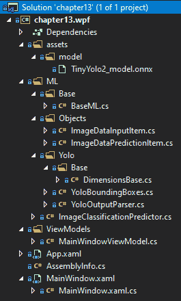
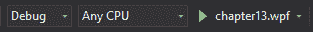

# 使用 ONNX 和 ML.NET

既然我们已经完成了我们的深入探究用 TensorFlow**Windows Presentation Foundation (WPF**)应用程序和 ML.NET,现在,是时候深入使用**打开神经网络交换**(**ONNX**),ML.NET。 特别地，在最后一章中，我们将回顾什么是 ONNX，并使用预先训练的 ONNX 模型**YOLO**创建一个新的示例应用程序。 这个应用程序将建立在前一章的基础上，并显示模型检测到的对象的边界框。 此外，我们还将在本章结束时提出关于改进示例的建议，使其成为生产级应用程序或集成到生产应用程序中。****

 ****在本章中，我们将涵盖以下主题:

*   分解 ONNX 和 YOLO
*   创建 ONNX 对象检测应用程序
*   探索其他生产应用程序增强功能

# 分解 ONNX 和 YOLO

正如在[第一章](01.html)、*入门机器学习和 ML.NET 中提到的，*ONNX 标准在业内被广泛认为是跨机器学习框架的真正通用格式。 在接下来的两节中，我们将回顾 ONNX 提供了什么，以及驱动本章示例的 YOLO 模型。

# 引入 ONNX

ONNX 是在使用预训练模型或跨框架的训练模型时，作为一种较少锁定和自由流动的过程的方法而创建的。 通过为框架提供一种可供导出的开放格式，ONNX 允许互操作性，因此促进了一些实验，而这些实验本来是禁止的，因为几乎每个框架都使用专有格式。

目前，支持的框架包括 TensorFlow、XGBoost 和 pytorch——当然，除了 ML.NET 之外。

If you want to deep dive into ONNX further, please check out their website: [https://onnx.ai/index.h](https://onnx.ai/index.html)[tml](https://onnx.ai/index.html).

# YOLO ONNX 模型

在[第 12 章](12.html)，*TensorFlow with ML.NET*中，我们使用了预训练的 Inception 模型，在这一章中，我们将使用预训练的 YOLO 模型。 该模型提供了非常快速和准确的目标检测，这意味着它可以在一定程度上自信地找到图像中的多个目标。 这与上一章的模型不同，后者提供了一个纯粹的图像分类，如水或食物。

为了直观地看到这两个模型之间的区别，我们将前一章的 TensorFlow 模型中的水进行分类，并将其与本章的汽车目标检测进行比较，如下截图所示:


图像(和视频)中的目标检测的需求日益增长，因为互联网上的图像数量显著增加，以及对安全的需求。 想象一个拥挤的环境，比如足球场，尤其是前门附近。 保安巡逻和监控这一区域; 但是，和你一样，他们也是人，只能以一定程度的准确性看这么多人。 应用机器学习的实时目标检测来发现武器或大袋子，然后可以用来提醒保安人员去追捕嫌疑人。

YOLO 模型本身有两种主要形式——微型模型和完整模型。 在本例中，我们将使用较小的模型(约 60mb)，它可以对图像中的 20 个对象进行分类。 这个小模型由 9 个卷积层和 6 个最大池层组成。 完整的模型可以对成千上万的对象进行分类，并且，给定适当的硬件(即**图形处理单元**(**gpu**)，可以比实时运行更快。

下图描述了 YOLO 模型(以及神经网络，在一定程度上)的工作原理:


实际上，图像(或图像)被转换为 3 x 416 x 416 图像。 3 分量表示**红-绿-蓝**(**RGB**)值。 这 416 个值表示调整后的图像的宽度和高度。 然后将这个输入层输入到模型的隐藏层中。 对于我们在本章中使用的 Tiny YOLO v2 模型，在输出层之前总共有 15 个层。

To deep dive further into the YOLO model, please read this paper: [https://arxiv.org/pdf/1612.08242.pdf](https://arxiv.org/pdf/1612.08242.pdf).

# 创建 ONNX 对象检测应用程序

如前所述，我们将创建的应用程序是一个使用预训练的 ONNX 模型的对象检测应用程序。 使用我们开发的应用程序在 12 章,*用 TensorFlow ML.NET*作为起点,我们将在支持添加图像的边框上覆盖的模型分类对象很清楚。 这对一般公众的有用之处在于图像对象检测提供的各种应用程序。 想象一下，你正在为警察或情报机构做一个项目，他们有图像或视频，想要检测武器。 正如我们将要展示的，在 ML.NET 中使用 YOLO 模型将使这个过程变得非常简单。

与前面的章节一样，完成的项目代码、预训练模型和项目文件可以在这里下载:[https://github.com/PacktPublishing/Hands-On-Machine-Learning-With-ML.NET/tree/master/chapter13](https://github.com/PacktPublishing/Hands-On-Machine-Learning-With-ML.NET/tree/master/chapter13)。

# 探索项目架构

在我们在前面章节中创建的项目架构和代码的基础上，我们将要检查的架构被增强为对最终用户更加结构化和可用。

在前面的一些章节中，如果你想使用 ONNX 模型并执行对象检测，以下两个额外的 NuGet 包是必需的:

*   `Microsoft.ML.ImageAnalytics`
*   `Microsoft.ML.OnnxTransformer`

这些 NuGet 包已经在包含的示例代码中被引用。 这些包的 1.3.1 版本在 GitHub 上的示例和本章的深入讨论中都有使用。

在下面的屏幕截图中，您将发现项目的 Visual Studio Solution Explorer 视图。 解决方案中增加了一些新内容，以促进我们目标产品用例的实现。 我们将在本章后面的解决方案截图中详细回顾每一个新文件:



在撰写本文时，由于目前 ML.NET 的限制，ONNX 支持仅用于使用预先存在的模型进行评分。 本例中包含的预训练模型可以在`img/model`文件夹中找到。

# 钻研代码

对于这个应用程序，正如在前一节中提到的，我们是在[第 12 章](12.html)、*中使用 ML.NET*中的 TensorFlow 完成的工作之上构建的。 虽然**用户界面**(**UI**)没有发生太多变化，但是运行 ONNX 模型的底层代码发生了变化。 对于每一个被更改的文件(如前几章所述)，我们将回顾所做的更改以及这些更改背后的原因。

更改或添加的类如下:

*   `DimensionsBase`
*   `BoundingBoxDimensions`
*   `YoloBoundingBox`
*   `MainWindow.xaml`
*   `ImageClassificationPredictor`
*   `MainWindowViewModel`

还有一个额外的文件，其中包含了`YoloOutputParser`类。 这个类是从**麻省理工学院**(**MIT**)授权的`TinyYOLO`ONNX 模型接口派生而来。 由于课程的长度，我们就不复习了; 然而，代码读起来很容易，并且如果您希望步进一个预测，流程将很容易遵循。

# DimensionsBase 类

`DimensionsBase`类包含坐标以及`Height`和`Width`属性，如下面的代码块所示:

```cs
public class DimensionsBase
{
    public float X { get; set; }

    public float Y { get; set; }

    public float Height { get; set; }

    public float Width { get; set; }
}
```

`YoloOutputParser`和`BoundingBoxDimensions`类都使用这个基类来减少代码重复。

# YoloBoundingBox 类

`YoloBoundingBox`类提供了容器类，用于在为覆盖生成边界框时填充它们，如下面的代码块所示:

```cs
public class YoloBoundingBox
{
    public BoundingBoxDimensions Dimensions { get; set; }

    public string Label { get; set; }

    public float Confidence { get; set; }

    public RectangleF Rect => new RectangleF(Dimensions.X, Dimensions.Y, Dimensions.Width, Dimensions.Height);

    public Color BoxColor { get; set; }
}
```

此外，同样在这个类文件中定义的是我们的`BoundingBoxDimensions`类，如下代码块所示:

```cs
public class BoundingBoxDimensions : DimensionsBase { }
```

同样，这种继承用于减少代码重复。

# 主窗口。 xaml 文件

我们应用程序的**可扩展应用程序标记语言**(**XAML**)视图已经简化为按钮和图像控件，如下代码块所示:

```cs
<Grid>
    <Grid.RowDefinitions>
        <RowDefinition Height="Auto" />
        <RowDefinition Height="*" />
    </Grid.RowDefinitions>

    <Button Grid.Row="0" Margin="0,10,0,0" Width="200" Height="35" Content="Select Image File" HorizontalAlignment="Center" Click="btnSelectFile_Click" />

    <Image Grid.Row="1" Margin="10,10,10,10" Source="{Binding SelectedImageSource}" />
</Grid>
```

此外，由于您可以选择的边界框和图像的性质，窗口已默认为`Maximized`，如下代码块所示:

```cs
<Window x:Class="chapter13.wpf.MainWindow"

        xmlns:x="http://schemas.microsoft.com/winfx/2006/xaml"
        xmlns:d="http://schemas.microsoft.com/expression/blend/2008"
        xmlns:mc="http://schemas.openxmlformats.org/markup-compatibility/2006"
        xmlns:local="clr-namespace:chapter13.wpf"
        mc:Ignorable="d"
        ResizeMode="NoResize"
        WindowStyle="SingleBorderWindow"
        WindowState="Maximized"
        WindowStartupLocation="CenterScreen"
        Background="#1e1e1e"
        Title="Chapter 13" Height="450" Width="800">
```

XAML 的变化已经过去，现在让我们进入修改后的`ImageClassificationPredictor`类。

# ImageClassificationPredictor 类

`ImageClassificationPredictor`类，很像[第十二章](12.html)，*Using TensorFlow with ML.NET*，包含了运行我们的图像预测的方法。 在本章中，我们将需要制作几个额外的类对象来支持 ONNX 模型的运行，如下所示:

1.  首先，我们定义了定义网络高度和宽度的`ImageNetSettings`结构。 YOLO 模型需要使用 416 * 416 像素，如下代码块所示:

```cs
public struct ImageNetSettings
{
    public const int imageHeight = 416;
    public const int imageWidth = 416;
}   
```

2.  接下来，我们定义与 ONNX 模型一起使用的`TinyYoloModelSettings`结构，如下所示:

```cs
public struct TinyYoloModelSettings
{
    public const string ModelInput = "image";

    public const string ModelOutput = "grid";
}
```

3.  在前一章中，TensorFlow 模型在第一次运行时被导入，然后导出为 ML.NET 模型，而在撰写本文时，ONNX 不支持该路径。 因此，我们必须每次都在`Initialize`方法中加载 ONNX 模型，如下代码块所示:

```cs
public (bool Success, string Exception) Initialize()
{
    try
    {
        if (File.Exists(ML_NET_MODEL))
        {
            var data = MlContext.Data.LoadFromEnumerable(new List<ImageDataInputItem>());

            var pipeline = MlContext.Transforms.LoadImages(outputColumnName: "image", imageFolder: "", 
                    inputColumnName: nameof(ImageDataInputItem.ImagePath))
                .Append(MlContext.Transforms.ResizeImages(outputColumnName: "image", 
                    imageWidth: ImageNetSettings.imageWidth, 
                    imageHeight: ImageNetSettings.imageHeight, 
                    inputColumnName: "image"))
                .Append(MlContext.Transforms.ExtractPixels(outputColumnName: "image"))
                .Append(MlContext.Transforms.ApplyOnnxModel(modelFile: ML_NET_MODEL, 
                    outputColumnNames: new[] { TinyYoloModelSettings.ModelOutput }, 
                    inputColumnNames: new[] { TinyYoloModelSettings.ModelInput }));

            _model = pipeline.Fit(data);

            return (true, string.Empty);
        }

        return (false, string.Empty);
    }
    catch (Exception ex)
    {
        return (false, ex.ToString());
    }
}
```

4.  接下来，我们广泛修改`Predict`方法以支持`YoloParser`调用，调用`DrawBoundingBox`方法覆盖边界框，然后返回更新后图像的字节数，如下所示:

```cs
public byte[] Predict(string fileName)
{
    var imageDataView = MlContext.Data.LoadFromEnumerable(new List<ImageDataInputItem> { new ImageDataInputItem { ImagePath = fileName } });

    var scoredData = _model.Transform(imageDataView);

    var probabilities = scoredData.GetColumn<float[]>(TinyYoloModelSettings.ModelOutput);

    var parser = new YoloOutputParser();

    var boundingBoxes =
        probabilities
            .Select(probability => parser.ParseOutputs(probability))
            .Select(boxes => parser.FilterBoundingBoxes(boxes, 5, .5F));

    return DrawBoundingBox(fileName, boundingBoxes.FirstOrDefault());
}
```

为了简洁起见，这里没有显示`DrawBoundingBox`方法。 在较高的级别上，原始图像被加载到内存中，然后模型的边界框与标签和置信值一起绘制在图像的顶部。 然后将更新后的图像转换为字节数组并返回。

# MainWindowViewModel 类

在`MainWindowViewModel`类内部，由于示例的性质，需要进行一些更改。 我们来看一下:

1.  首先，`LoadImageBytes`方法现在只获取解析后的图像字节并将它们转换为`Image`对象，如下所示:

```cs
private void LoadImageBytes(byte[] parsedImageBytes)
{
    var image = new BitmapImage();

    using (var mem = new MemoryStream(parsedImageBytes))
    {
        mem.Position = 0;

        image.BeginInit();

        image.CreateOptions = BitmapCreateOptions.PreservePixelFormat;
        image.CacheOption = BitmapCacheOption.OnLoad;
        image.UriSource = null;
        image.StreamSource = mem;

        image.EndInit();
    }

    image.Freeze();

    SelectedImageSource = image;
}
```

2.  最后，我们修改了`Classify`方法，在模型运行成功后调用`LoadImageBytes`方法，如下:

```cs
public void Classify(string imagePath)
{
    var result = _prediction.Predict(imagePath);

    LoadImageBytes(result);
}
```

在对`Classify`方法进行了相应的更改之后，本章示例所需的代码更改就完成了。 现在，让我们运行应用程序!

# 运行应用程序

要运行应用程序，该过程与第 12 章、*中使用 TensorFlow 与 ML.NET*中的示例应用程序相同。 要在 Visual Studio 中运行应用程序，只需单击工具栏中的*播放*图标，如下截图所示:



在启动应用程序后，就像在[第 12 章](12.html)，*使用 TensorFlow 与 ML.NET*，选择一个映像文件，模型就会运行。 例如，我选择了我在德国度假时拍摄的一张图片(注意汽车的边框)，如下截图所示:


你可以随意选择你硬盘上的图像，看看检测的置信度，以及物体周围的边框是如何形成的。

# 探索其他生产应用程序增强功能

现在我们已经完成了深入的研究，还有几个额外的元素可以进一步增强应用程序。 接下来的部分将讨论一些想法。

# 日志记录

如前所述，日志的重要性在桌面应用程序中再怎么强调也不为过。 随着应用程序复杂性的增加，强烈推荐使用 NLog([https://nlog-project.org/](https://nlog-project.org/))或类似的开源项目进行日志记录。 这将允许您在不同级别上记录文件、控制台或第三方日志解决方案(如 Loggly)。 例如，如果将此应用程序部署到客户，将错误级别至少划分为 Debug、Warning 和 error 将有助于远程调试问题。

# 图像缩放

正如您可能已经注意到的，对于非常大的图像(超过屏幕分辨率的图像)，在图像预览中边框的文本标记和调整大小不像 640 x 480 的图像那么容易阅读。 这里的一个改进是提供悬停功能，根据窗口大小调整图像大小或动态增加字体大小。

# 充分利用 YOLO 模型

此外，该示例的另一个改进方面是在应用程序中使用完整的 YOLO 模型。 如前所述，示例应用程序中使用的 Tiny YOLO 模型只提供了 20 个标签。 在生产应用程序或希望在其上进行构建的应用程序中，使用更大、更复杂的模型将是一个不错的选择。

You can download the full YOLO model here: [https://github.com/onnx/models/tree/master/vision/object_detection_segmentation/yolov3](https://github.com/onnx/models/tree/master/vision/object_detection_segmentation/yolov3).

# 总结

在本章的过程中，我们深入探讨了 ONNX 格式的内涵以及它为社区提供了什么。 此外，我们还使用 ML.NET 中预先训练的 Tiny YOLO 模型创建了一个全新的检测引擎。

至此，您对 ML.NET 的深入研究就结束了。 从本书的第一页到本文的第一页，您已经很有希望理解 ML.NET 以一种非常直观的、功能丰富的抽象方式提供的强大功能。 随着 ML.NET 的不断发展(很像。net)， ML.NET 的特性集和部署目标的发展将是毫无疑问的，从嵌入式**物联网**(**物联网**)设备到移动设备。 我希望这本书对您深入了解 ML.NET 和机器学习有所帮助。 此外，我希望在将来处理问题时，首先考虑是否可以利用 ML.NET 更有效地、潜在地更好地解决问题。 鉴于世界上的数据以指数级的速度持续增长，使用非暴力/传统方法的必要性只会继续增长，因此从本书中获得的技能将在未来几年对您有所帮助。****