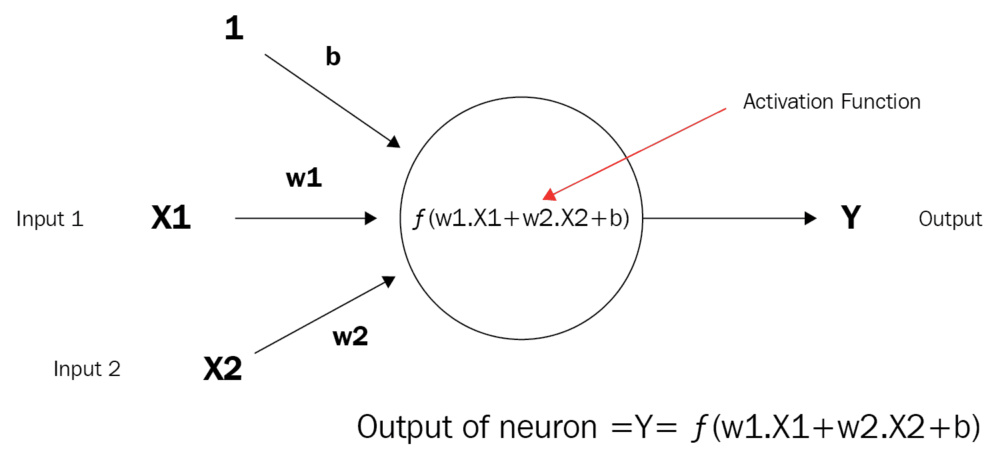
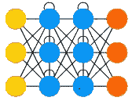
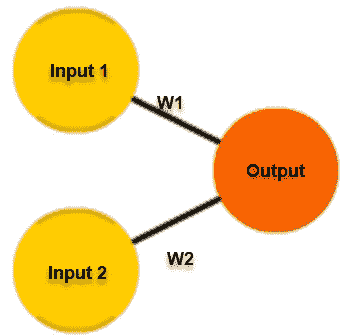
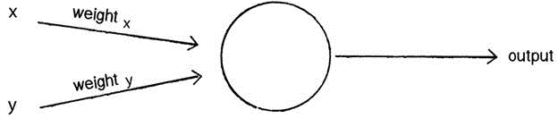
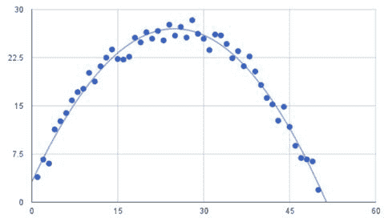
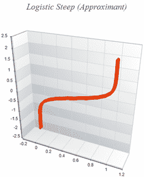
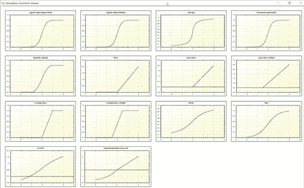

# 一、快速回顾

欢迎来到*使用 C#*进行神经网络开发的实践。我想感谢您购买这本书，并与我们一起踏上这段旅程。似乎，无论你走到哪里，无论你走到哪里，你听到和读到的都是机器学习，人工智能，深度学习，神经元这个，人工那个，等等。而且，除了这些刺激之外，与你交谈的每个人对这些术语的含义都有着稍微不同的理解。

在本章中，我们将复习一些非常基本的神经网络术语，为以后的章节做好准备。我们需要说同一种语言，只是为了确保我们在后面章节中所做的一切都非常清楚。

我还应该让你知道，这本书的目标是让你，一个 C# 开发者，尽快启动并运行。为此，我们将使用尽可能多的开源库。我们必须做一些自定义应用程序，但我们也提供了这些应用程序的源代码。在所有情况下，我们都希望您能够以最大的速度和最小的工作量将此功能添加到您的应用程序中。

好的，我们开始吧。

神经网络已经存在了很多年，但在过去几年中又重新兴起，现在是一个热门话题。朋友们，这就是为什么要写这本书。这里的目标是帮助你穿过杂草，进入开阔地带，这样你就可以在通往成功的神经道路上导航。本书特别关注 C#.NET 开发人员。我想确保那些 C# 开发者拥有便利的资源，可以在他们的项目中有所帮助，而不是我们经常看到的 Python、R 和 MATLAB 代码。如果您安装了 VisualStudio，并且有强烈的学习欲望，那么您已经准备好开始您的旅程了。

首先，让我们确定有几件事是清楚的。在写这本书的时候，假设你，读者，对神经网络的接触是有限的。如果你确实有一些接触，那就太好了；你可以随意跳到你最感兴趣的部分。我还假设您是一名经验丰富的 C# 开发人员，并使用 C#、.NET 和 Visual Studio 构建了应用程序，尽管我没有假设您可能使用了每个应用程序的哪个版本。目标不是 C# 语法、.NET 框架或 Visual Studio 本身。同样，其目的是让开发人员获得尽可能多的有价值的资源，以便他们能够润色自己的代码并创建世界级的应用程序。

现在我们已经解决了这一问题，我知道您很高兴马上开始编写代码，但为了提高效率，我们首先必须花一些时间复习一些基本知识。一点理论，一些关于原因和原因的迷人见解，我们将在这一过程中加入一些视觉效果来帮助处理粗糙和坚硬的干燥材料。别担心；我们不会深入讨论这个理论，在接下来的几页中，您将编写并浏览源代码！

此外，请记住，这一领域的研究正在迅速发展。今天最新最棒的消息是下个月的老消息。因此，请考虑这本书的不同研究和意见的概述。它不是所有与神经网络相关的事物的全部和最终的圣经，也不应该被认为是。你很可能会遇到与作者意见不同的人。你会发现人们编写的应用程序和功能会有所不同。这很好，你可以收集所有的信息，自己做出明智的选择。只有这样，你才能增加你的知识基础。

本章将包括以下主题：

*   神经网络综述
*   神经网络在当今企业中的作用
*   学习类型
*   理解感知
*   理解激活函数
*   理解反向传播

# 技术要求

了解 C# 的基本知识是理解我们将在本书中开发的应用程序的必要条件。此外，Microsoft Visual Studio（任何版本）是开发应用程序的首选软件。

# 神经网络综述

让我们从定义一个神经网络开始。首先我要指出的是，你们可能也会听到一种叫做**人工神经网络**（**人工神经网络**）的神经网络。虽然我个人不喜欢术语*人造*，但在本书中，我们将交替使用这些术语。

"Let's state that a neural network, in its simplest form, is a system comprising several simple but highly interconnected elements; each processes information based upon their response to external inputs."

你知道吗，神经网络更普遍，但松散地模仿哺乳动物大脑的大脑皮层？我为什么不说它们是模仿人类的呢？因为在很多情况下，生物和计算研究都是从老鼠、猴子和人类的大脑中进行的。一个大型神经网络可能有数百个甚至数千个处理单元，而哺乳动物的大脑则有数十亿个。正是神经元发挥了神奇的作用，事实上，我们可以单独就这个话题写一整本书。

这就是为什么我说他们会变魔术：如果我给你看哈莉·贝瑞的照片，你会马上认出她来。你没有时间分析事情；根据一生收集的知识，你会知道。类似地，如果我对你说“比萨饼”这个词，你会立即产生一种心理印象，甚至可能开始感到饥饿。这一切是怎么发生的？神经元！尽管今天的神经网络在能力和速度上不断提高，但与所有时代的终极神经网络——人脑相比，它们显得苍白无力。关于这个神经网络，有太多我们还不知道或不了解的东西；等着瞧，一旦我们这样做了，神经网络会变成什么样子！

神经网络被组织成*层*由所谓的**节点**或**神经元**组成。这些节点本身就是神经元，并且相互连接（在本书中，我们交替使用术语*节点*和*神经元*。信息呈现给输入层，由一个或多个*隐藏*层处理，然后提供给*输出*层，用于最终（或继续进一步）处理泡沫、冲洗、重复！

*但你会问什么是神经元*？使用下图，让我们陈述一下：

"A neuron is the basic unit of computation in a neural network"

正如我前面提到的，神经元有时也被称为节点或单元。它接收来自其他节点或外部源的输入并计算输出。每个输入都有一个相关的**权重**（下方的**w1 和 w2），该权重根据其相对于其他输入的相对重要性进行分配。节点将函数*f**（一个激活函数，我们将在后面了解更多）应用于其输入的加权和。虽然这是对神经元是什么以及它能做什么的极端过于简单化，但基本上就是这样。***

 *让我们直观地看一下从一个神经元到一个非常深入的学习网络的过程。根据我们的描述，以下是单个神经元在视觉上的样子：



接下来，下图显示了一个由几个神经元组成的非常简单的神经网络：


这是一个更复杂或更深的网络：


# 神经网络训练

既然我们知道了神经网络和神经元是什么，我们就应该讨论它们做什么以及如何做。神经网络是如何学习的？你们这些有孩子的人已经知道这个问题的答案了。如果你想让你的孩子知道什么是猫，你会怎么做？你给他们看猫（图片或真实的）。你想让你的孩子知道什么是狗？让他们看看狗。神经网络在概念上没有什么不同。它有一种**学习规则**的形式，它将修改输入层传入的权重，通过隐藏层进行处理，并通过激活函数将其放入，希望能够识别猫和狗。而且，如果操作正确，猫不会变成狗！

神经网络最常见的学习规则之一是所谓的**增量规则**。这是一个*监督的*规则，每次向网络呈现另一种学习模式时都会调用该规则。每次发生这种情况，都被称为**周期**或**纪元**。每次输入模式通过一个或多个*正向*传播层，然后通过一个或多个*反向*传播层时，都会调用该规则。

更简单地说，当一个神经网络呈现一个图像时，它试图确定答案可能是什么。正确答案与我们猜测的差异在于**错误**或**错误率**。我们的目标是使错误率最小化或最大化。在最小化的情况下，我们需要每个猜测的错误率尽可能接近于 0。我们越接近 0，就越接近成功。

随着我们的进步，我们进行所谓的**梯度下降**，这意味着我们继续朝着所谓的**全球最小值**前进，这是我们可能出现的最低误差，希望这对*成功*至关重要。我们下降到全球最小值。

一旦网络本身被训练，并且你很高兴，训练周期就可以结束了，你可以进入测试周期。在测试周期内，仅使用正向传播层。此过程的输出将产生*模型*，用于进一步分析。同样，测试期间不会发生反向传播。

# 神经网络视觉指南

在本节中，我可以输入数千个单词，试图描述神经网络的所有组合及其外观。然而，再多的文字也比不上下面的图表：


Reprinted with permission, Copyright Asimov Institute 
Source: http://www.asimovinstitute.org/neural-network-zoo/

让我们从上一张图中讨论几个更常见的网络：

*   **感知器：**这是可用的最简单的前馈神经网络，如您所见，它不包含任何隐藏层：


*   **前馈网络：**该网络可能是设计的最简单的人工神经网络类型。它包含多个排列在**层**中的神经元（节点）。相邻层的节点之间有**连接**或**边**。每个连接都有与其相关联的**权重**：


*   **递归神经网络（RNN）：**RNN 被称为*递归*，因为它们对序列的每个元素执行相同的任务，其输出取决于之前的计算。他们还能够回顾前面的步骤，这些步骤形成了一种**短期记忆**：



# 神经网络在当今企业中的作用

作为开发人员，我们主要关心的是如何将我们正在学习的知识应用到实际场景中。更具体地说，在企业环境中，使用神经网络的机会是什么？以下是关于神经网络应用的一些想法（很多想法中的一些）：

*   在不了解变量之间关系的情况下
*   在关系难以描述的场景中
*   在一个场景中，目标是发现数据中的不规则模式
*   对数据进行分类以识别模式，如动物、车辆等
*   信号处理
*   图像识别（情绪、情绪、年龄、性别等）
*   文本翻译
*   笔迹识别
*   自动驾驶车辆
*   还有更多！

# 学习类型

既然我们谈到了我们的神经网络学习，让我们简单地谈谈你应该注意的三种不同类型的学习。它们是**监督**、**非监督**和**加固**。

# 监督学习

如果您有一个与已知结果相匹配的大型测试数据集，那么监督学习可能是一个不错的选择。神经网络将处理数据集；将其输出与已知结果进行比较，调整并重复。很简单吧？

# 无监督学习

如果您没有任何测试数据，并且可以从数据的行为中以某种方式导出成本函数，那么无监督学习可能是一个不错的选择。神经网络将处理一个数据集，使用`cost`函数判断错误率，调整参数，然后重复。所有这些都是在实时工作时完成的！

# 强化学习

我们的最后一种学习方式是**强化**学习，在一些圈子里更为人所知的是**胡萝卜加大棒**。神经网络将处理数据集，从数据中学习，如果我们的错误率降低，我们将得到胡萝卜。如果错误率增加，我们就会得到棍子。说够了，对吧？

# 理解感知器

我们要处理的最基本的元素叫做神经元。如果我们采用神经元使用的最基本的激活函数形式，我们将得到一个只有两个可能结果的函数，1 和 0。在视觉上，这样一个函数可以表示为：


如果输入为正或 0，此函数返回 1，否则返回 0。激活函数类似于此的神经元称为**感知器**。这是我们可以开发的最简单的神经网络形式。从视觉上看，它如下所示：



感知器遵循前馈模型，这意味着输入被发送到神经元，经过处理，然后产生输出。输入进来，输出出去。让我们举个例子。

假设我们有一个感知器，它有两个输入，如前所示。在本例中，输入 0 为 x1，输入 1 为 x2。如果我们分配这两个变量值，它们将如下所示：

*输入 0:x1=12*
*输入 1:x2=4*

这些输入中的每一个都必须经过**加权**，即乘以某个值，该值通常是一个介于-1 和 1 之间的数字。当我们创建感知器时，我们首先为它们分配随机权重。例如，输入 0（**x1**）将有一个我们将标记为**w1**的权重，输入 1，**x2**将有一个我们将标记为**w2**的权重。考虑到这一点，我们的权重是如何寻找这个感知器的：

*重量 0:0.5* *重量 1:-1*



一旦输入被*加权*，它们现在需要求和。使用上一个示例，我们将得到：

*6+-4=2*

然后，该总和将通过一个激活函数传递，我们将在后面的章节中详细介绍该函数。这将产生感知器的输出。激活函数最终会告诉感知器触发是否*可以，即激活。*

现在，对于我们的激活函数，我们将使用一个非常简单的函数。如果总和为正，则输出为 1。如果总和为负，则输出为-1。再简单不过了，对吧？

因此，在伪代码中，我们针对单个感知器的算法如下所示：

*   对于每个输入，将该输入乘以其权重
*   对所有加权输入求和
*   根据通过激活函数传递的和（和的符号），计算感知器的输出

# 这有用吗？

是的，事实上是这样，让我们来告诉你怎么做。考虑输入向量作为点的坐标。对于包含*n*元素的向量，该点就像它位于 n 维空间中一样。拿一张纸，在这张纸上画一组点。现在用一条直线将这两点分开。现在，您的一张纸应该如下所示：


如您所见，这些点现在分为两组，一组位于直线的每一侧。如果我们可以用一条直线清楚地分开所有的点，那么这两个集合就是所谓的线性可分集合。

信不信由你，我们的单个感知器将能够知道这条线在哪里，当你的程序完成时，感知器还能够分辨出一个点是在这条线的上方还是下方（或者在它的左侧或右侧，取决于这条线是如何画的）。

让我们快速编写一个`Perceptron`类代码，这样对于那些喜欢阅读代码而不是文字的人来说（像我一样！）就更清楚了。我们的目标是创建一个简单的感知器，它可以确定一个点应该位于线路的哪一侧，就像前面的图表一样：

```cs
class Perceptron {

float[] weights;
```

构造函数可以接收指示输入数量的参数（在本例中为三个：*x*、*y*和一个偏差），并相应调整数组大小：

```cs
Perceptron(int n) {
    weights = new float[n];
    for (int i = 0; i<weights.length; i++) {
```

`weights`是随机选取的，首先是：

```cs
      weights[i] = random(-1,1);
    }
}
```

接下来，我们需要一个函数让感知器接收其信息，该信息的长度与权重数组的长度相同，然后将输出值返回给我们。我们称之为`feedforward`：

```cs
int feedforward(float[] inputs) {
    float sum = 0;
    for (int i = 0; i<weights.length; i++) {
      sum += inputs[i]*weights[i];
    }
```

结果是总和的符号，它将是-1 或+1。在这种情况下，感知器试图猜测输出应该在线路的哪一侧：

```cs
 return activate(sum);
 }
```

到目前为止，我们有一个功能最小的感知机，它应该能够对我们的点在哪里做出有根据的猜测。

创建`Perceptron`：

```cs
Perceptron p = new Perceptron(3);
```

输入为 3 个值：*x*、*y、*和偏差：

```cs
float[] point = {5,-2,19};
```

获得答案：

```cs
int result = p.feedforward(point);
```

唯一能让我们的感知机更有价值的是训练它的能力，而不是让它做出有根据的猜测。我们通过创建如下的`train`函数来实现：

1.  我们将引入一个新变量来控制学习率：

```cs
float c = 0.01;
```

2.  我们还将提供输入和已知答案：

```cs
void train(float[] inputs, int desired) {
```

3.  我们将根据提供的输入进行有根据的猜测：

```cs
  int guess = feedforward(inputs);
```

4.  我们将计算`error`，这是答案与我们的`guess`之间的差值：

```cs
float error = desired - guess;
```

5.  最后，我们将根据误差和学习常数调整所有权重：

```cs
  for (int i = 0; i<weights.length; i++) {
    weights[i] += c * error * inputs[i];
```

所以，现在你知道并了解了什么是感知器，让我们将**激活函数**添加到混合中，并将其提升到下一个级别！

# 理解激活函数

将激活函数添加到神经网络的输出端以确定输出。它通常会将结果值映射到-1 到 1 之间的某个位置，具体取决于函数。它最终用于确定神经元是*触发*还是*激活*，如在灯泡打开或关闭时。

激活函数是输出之前网络的最后一部分，可被视为输出值的供应商。可以使用多种激活函数，此图仅突出显示其中的一小部分：


激活函数有线性和非线性两种类型：

*   **线性**：线性函数是位于或接近于直线的函数，如图所示：


*   **非线性**：非线性函数是指不在直线上的函数，如图所示：



# 视觉激活函数绘图

在处理激活函数时，在使用激活函数之前，您必须直观地了解激活函数的外观。我们将绘制几个激活函数，然后对其进行基准测试，以供您查看：



这就是逻辑斯蒂普近似和 Swish 激活函数在单独绘制时的样子。由于有许多类型的激活函数，下面显示了我们所有的激活函数在一起绘制时的外观：



Note: You can download the program that produces the previous output from the SharpNeat project on GitHub [https://github.com/colgreen/sharpneat](https://github.com/colgreen/sharpneat).

在这一点上，你可能想知道为什么我们甚至关心什么样的情节看起来像伟大的一点。我们很关心，因为一旦你进入实践经验阶段，当你深入研究神经网络时，你会大量使用这些工具。能够知道你的激活函数是否将你的神经元的值置于开或关状态，以及它将保持或需要这些值的范围是非常方便的。毫无疑问，在作为机器学习开发人员的职业生涯中，您将遇到和/或使用激活函数，了解 Tanh 和 LeakyRelu 激活函数之间的区别非常重要。

# 函数绘图

对于这个例子，我们将使用开源软件包**SharpNeat**。它是世界上功能最强大的机器学习平台之一，并附带一个特殊的激活函数绘图仪。您可以在[找到 SharpNeat 的最新版本 https://github.com/colgreen/sharpneat](https://github.com/colgreen/sharpneat) 。对于本例，我们将使用包含的***ActivationFunctionViewer***项目，如图所示：


打开该项目后，搜索`PlotAllFunctions`函数。正是此函数处理所有激活函数的绘图，如前所示。让我们详细介绍一下这个函数：

```cs
private void PlotAllFunctions()
{
    Clear everything out.
    MasterPane master = zed.MasterPane;
    master.PaneList.Clear();
    master.Title.IsVisible = true;
    master.Margin.All = 10;

    Here is the section that will plot each individual function.
    PlotOnMasterPane(Functions.LogisticApproximantSteep, "Logistic 
    Steep (Approximant)");

    PlotOnMasterPane(Functions.LogisticFunctionSteep, "Logistic Steep 
    (Function)");

    PlotOnMasterPane(Functions.SoftSign, "Soft Sign");

    PlotOnMasterPane(Functions.PolynomialApproximant, "Polynomial 
    Approximant");

    PlotOnMasterPane(Functions.QuadraticSigmoid, "Quadratic Sigmoid");

    PlotOnMasterPane(Functions.ReLU, "ReLU");

    PlotOnMasterPane(Functions.LeakyReLU, "Leaky ReLU");

    PlotOnMasterPane(Functions.LeakyReLUShifted, "Leaky ReLU 
    (Shifted)");

    PlotOnMasterPane(Functions.SReLU, "S-Shaped ReLU");

    PlotOnMasterPane(Functions.SReLUShifted, "S-Shaped ReLU 
    (Shifted)");

    PlotOnMasterPane(Functions.ArcTan, "ArcTan");

    PlotOnMasterPane(Functions.TanH, "TanH");

    PlotOnMasterPane(Functions.ArcSinH, "ArcSinH");

    PlotOnMasterPane(Functions.ScaledELU, "Scaled Exponential Linear 
    Unit");

    Reconfigure the Axis
    zed.AxisChange();

    Layout the graph panes using a default layout
    using (Graphics g = this.CreateGraphics()) 
    {
        master.SetLayout(g, PaneLayout.SquareColPreferred);
    }

    MainPlot Function

    Behind the scenes, the ‘Plot' function is what is responsible for 
    executing     and plotting each function.

    private void Plot(Func<double, double> fn, string fnName, Color 
    graphColor, GraphPane gpane = null)
    {
        const double xmin = -2.0;
        const double xmax = 2.0;
        const int resolution = 2000;
        zed.IsShowPointValues = true;
        zed.PointValueFormat = "e";

        var pane = gpane ?? zed.GraphPane;
        pane.XAxis.MajorGrid.IsVisible = true;
        pane.YAxis.MajorGrid.IsVisible = true;
        pane.Title.Text = fnName;
        pane.YAxis.Title.Text = string.Empty;
        pane.XAxis.Title.Text = string.Empty;

        double[] xarr = new double[resolution];
        double[] yarr = new double[resolution];
        double incr = (xmax - xmin) / resolution;
        doublex = xmin;

        for(int i=0; i<resolution; i++, x += incr)
        {
            xarr[i] = x;
            yarr[i] = fn(x);
        }

        PointPairList list1 = new PointPairList(xarr, yarr);
        LineItem li = pane.AddCurve(string.Empty, list1, graphColor, 
        SymbolType.None);
        li.Symbol.Fill = new Fill(Color.White);
        pane.Chart.Fill = new Fill(Color.White, 
        Color.LightGoldenrodYellow, 45.0F);
}
```

前面代码中的主要关注点以黄色突出显示。这是执行我们传入的激活函数的地方，它的值用于*y*轴绘图值。著名的**ZedGraph**开源绘图软件包用于所有图形绘图。执行每个功能后，将绘制相应的绘图。

# 理解反向传播

**反向传播**是**误差反向传播**的简称，是一种基于梯度下降的神经网络监督学习算法。这就计算出了误差函数相对于网络权重的所谓**梯度。它是感知器的 delta 规则的一种广义形式，一直到多层前馈神经网络。**

与正向传播不同，反向传播通过在网络中向后移动来计算梯度。首先计算最后一层权重的梯度，最后计算第一层权重的梯度。随着近年来图像和语音识别深度学习的流行，back-prop 再次成为人们关注的焦点。无论出于何种目的，它都是一种高效的算法，今天的版本利用 GPU 进一步提高性能。

最后，由于 back prop 的计算取决于前向阶段的激活和输出（所有层的非错误项，包括隐藏），因此必须在后向阶段开始之前计算所有这些值。因此，对于梯度下降的每次迭代，要求前向阶段先于后向阶段。

# 前向和反向传播差异

让我们花些时间来澄清前馈和反向传播的区别。一旦你理解了这一点，你就可以直观地理解整个神经网络是如何流动的。

在神经网络中，您向前传播数据以获得输出，然后将其与实际预期值进行比较以获得误差，即假定的数据与机器学习算法实际认为的数据之间的差异。为了使误差最小化，您现在必须*向后传播*，找到误差对每个权重的导数，然后从权重本身中减去该值。

在神经网络中进行的基本学习是训练神经元*何时*被激活，何时触发，何时*开启*或*关闭*。每个神经元应该只激活某些类型的输入，而不是所有的输入。因此，通过向前传播，您可以看到神经网络的运行情况，并找到错误。找出网络错误率后，反向传播并使用梯度下降的形式更新权重的新值。再次，您将向前传播数据以查看这些权重的执行情况，然后向后传播数据以更新权重。这将一直持续到您达到某个误差值的最小值（希望是全局最小值，而不是局部最小值）。再次，起泡，冲洗，重复！

# 总结

在本章中，我们简要概述了各种神经网络术语。我们回顾了感知机、神经元和反向传播等。在我们的下一章中，我们将开始编写一个完整的神经网络！

我们将涵盖神经网络训练、术语、突触、神经元、正向传播、反向传播、sigmoid 函数、反向传播和误差计算等主题。

所以，抓住你的帽子；密码来了！

# 工具书类

*   @EVOLVE deep learning 共享信息神经网络框架，版权所有 2016 Matt R Cole，[www.evolvedaisolutions.com](http://www.evolvedaisolutions.com)。
*   SharpNeat 激活函数/查看器：SharpNeat（[https://github.com/colgreen/sharpneat](https://github.com/colgreen/sharpneat) ）。*