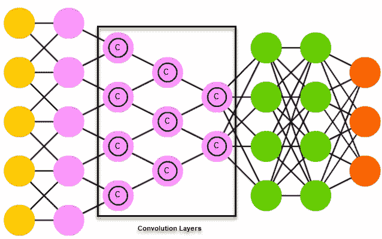
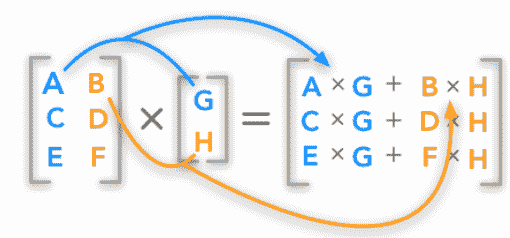
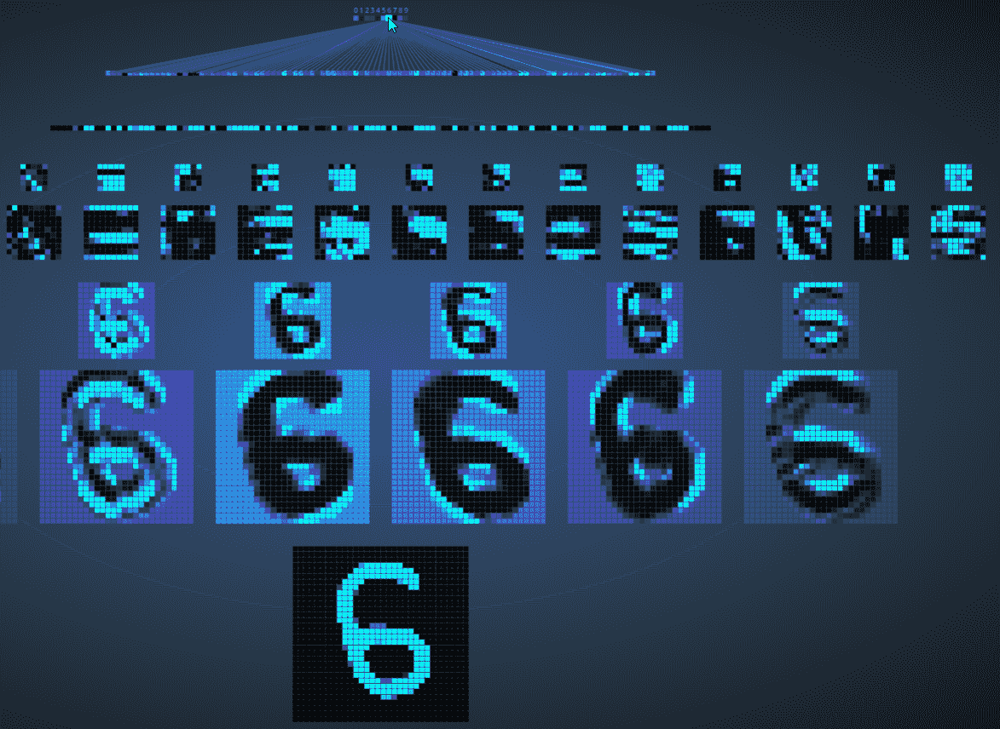
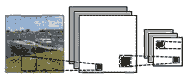
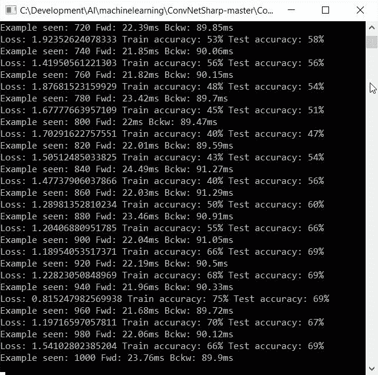
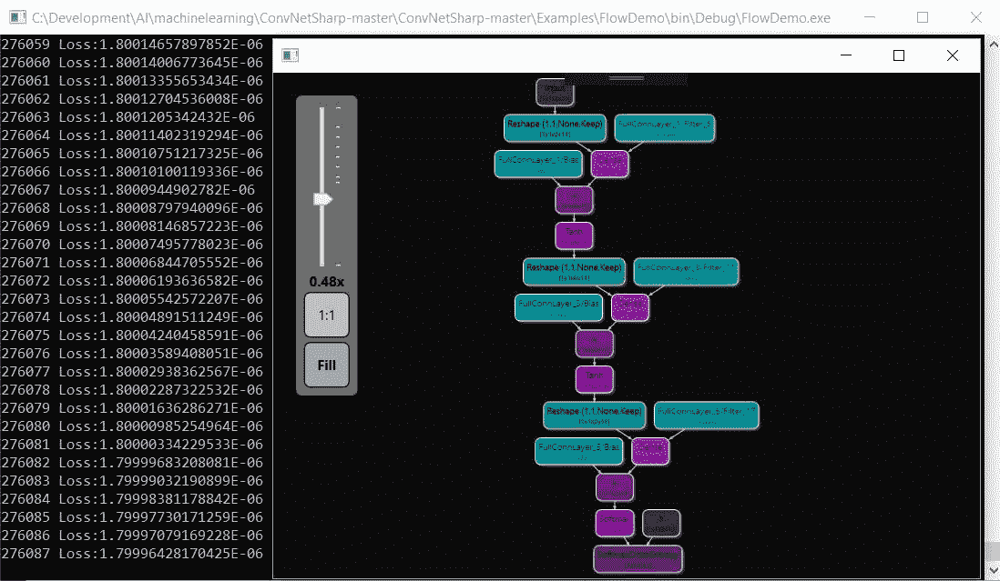
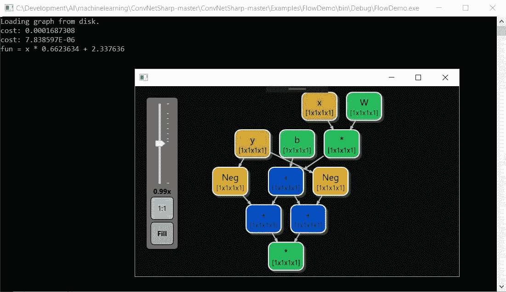

# 五、使用 ConvNetSharp 训练 CNN

在本章中，我们将使用塞德里克·博瓦尔（Cédric Bovar）的非凡开源软件包**ConvNetSharp**来演示如何训练我们的**卷积神经网络**（**CNN**。在本章中，我们将研究以下主题：

*   通用神经网络模块
*   与 CNN 相关的各种术语和概念
*   处理图像的卷积网络

# 技术要求

本章需要 Microsoft Visual Studio 和 ConvNetSharp 框架

# 结识

在我们开始深入研究代码之前，让我们先介绍一些基本的术语，以便我们在提到事物时都在同一页上。此术语适用于 CNN 以及**ConvNetSharp**框架。

**卷积**：在数学上，*卷积*是对两个函数执行的运算。此操作生成第三个函数，该函数表示一个函数的形状如何被另一个函数修改。下图直观地显示了这一点：



值得注意的是，卷积层本身是 CNN 的组成部分。该层的参数由一组可学习的过滤器组成（有时称为**内核**。这些内核有一个小的感受区，它是整个图像中的一个较小的视图，并且该视图延伸到输入卷的整个深度。在正向传播阶段，每个滤波器在整个输入体积的宽度和高度上进行**卷积**。正是这种卷积计算滤波器和输入之间的点积。然后生成过滤器的二维映射（有时称为**激活映射**。这有助于网络了解在相应输入位置检测到特征时应激活哪些过滤器。

**点积计算**：下图展示了我们所说的点积计算的含义：



*   **Vol 类**：在 ConvNetSharp 中，`Vol`类只是一个一维数字列表的包装器，包括数字、它们的梯度和尺寸（即宽度、深度和高度）。
*   **Net 类**：在 ConvNetSharp 中，`Net`是一个非常简单的类，包含一个层列表。当`Vol`通过`Net`类时，`Net`遍历其所有层，通过调用`forward()`函数向前传播每一层，并返回最后一层的结果。反向传播时，`Net`调用每层的`backward()`函数计算梯度。
*   **层**：正如我们所知，每个神经网络只是一个层的线性列表，我们的也一样。对于神经网络，第一层必须是输入层，最后一层必须是输出层。每一层接受一个输入`Vol`并产生一个新的输出`Vol`。
*   **全连接层**：全连接层可能是最重要的一层，从功能上来说，它肯定是最有趣的一层。它包含一层神经元，对所有输入进行加权相加。然后通过非线性激活函数（如 ReLU）传递这些信息。
*   **损失层**和**分类器层**：当我们需要为数据预测一组离散类时，这些层很有用。您可以使用 softmax、SVM 和许多其他类型的层。和往常一样，你应该尝试你的特殊问题，看看哪一个效果最好。
*   **损失层**和**L2 回归层**：该层获取目标列表并通过它们反向传播 L2 损失。
*   **卷积层**：该层几乎是全连接层的镜像。这里的区别是神经元只与该层中的少数神经元局部连接，而不是与所有神经元连接。它们还共享参数。
*   **训练师**`Trainer`课程采用一个网络和一组参数。它通过网络传递该信息，查看预测，并调整网络权重，以使提供的标签对于特定输入更准确。随着时间的推移，该过程将转换网络，并将所有输入映射到正确的输出。

现在，让我们来谈谈 CNN 本身。CNN 由输入层和输出层组成；这没什么大不了的。将有一个或多个隐藏层，包括卷积层、池层、完全连接层或规范化层。正是在这些隐藏的层中，魔法发生了。卷积层对输入应用**卷积**运算，并将结果传递给下一层。稍后我们将进一步讨论这个问题。

随着我们的进展，激活贴图将为沿深度维度运行的所有过滤器堆叠。这反过来将形成层本身的完整输出体积。该层上的每个神经元只为自己的感受野（它能看到的数据视图）处理数据。这些信息与其他神经元共享。

对于 CNN，我们必须时刻记住的是输入的大小，这可能需要非常多的神经元来处理，这取决于图像的分辨率。由于每个像素都是一个需要处理的变量，因此这在架构上可能会变得不方便，甚至难以处理。

让我们来看一个例子。如果我们有一个 100 x 100 像素的图像，我们都会同意这是一个小图像。但是，该图像总共有 10000 个像素（100 x 100），所有像素都是第二层中每个神经元的权重。卷积是解决这一问题的关键，因为它减少了参数的数量，并允许网络以更少的参数深入。有 10000 个可学习的参数，解决方案可能完全难以解决；然而，如果我们把图像缩小到一个 5×5 的区域，例如，我们现在有 25 个不同的神经元需要处理，而不是 10000 个，这是更可行的。这也将有助于我们消除或至少大大减少在训练多层网络时有时遇到的消失或爆炸梯度问题。

现在让我们快速了解一下它是如何在视觉上工作的。如下图所示，我们将使用数字 6 并通过 CNN 运行它，看看我们的网络是否能够检测到我们试图绘制的数字。下面截图底部的图像是我们将绘制的。当我们将事情一直卷积到顶部时，我们应该能够点亮表示数字 6 的单个神经元，如下所示：



在前面的屏幕截图中，我们可以看到输入层（我们的单个数字 6）、卷积层、下采样层和输出层。我们的进展如下：我们从一个 32 x 32 的图像开始，这给我们留下了 1024 个神经元。然后我们再往下看 120 个神经元，然后是 100 个神经元，最后是我们输出层中的 10 个神经元——这 10 个数字中的每一个都是一个神经元。您可以看到，当我们向输出层前进时，图像的尺寸会减小。正如我们所看到的，我们在第一个卷积层中有 32 x 32，在第二个卷积层中有 10 x 10，在第二个池层中有 5 x 5。

还值得注意的是，输出层中的每个神经元都完全连接到它前面完全连接层中的所有 100 个节点；因此，术语“完全连接层”。

如果我们画一张这个网络的三维图，并把它翻转过来，我们就能更好地看到卷积是如何发生的。下图描述的正是这一点，因为被激活的神经元颜色更亮。图层继续卷积，直到决定我们绘制的数字，如下所示：


# 过滤器

CNN 的另一个独特特征是，许多神经元可以共享相同的权重和偏差向量，或者更正式地说，相同的**滤波器**。为什么这很重要？因为每个神经元通过对前一层的输入值应用函数来计算输出值。对这些权重和偏差的增量调整有助于网络学习。如果相同的过滤器可以重复使用，那么所需的内存占用将大大减少。这变得非常重要，尤其是当图像或感受野变大时。

CNN 具有以下显著特征：

*   **神经元的三维体积**：CNN 的各层神经元以三维形式排列：宽度、高度和深度。每一层内的神经元都连接到该层的一个小区域，然后称之为感受野。不同类型的连接层堆叠起来，形成实际的卷积架构，如下图所示：



**Convolving**

*   **共享权重**：在卷积神经网络中，每个感受野（滤波器）在整个视野中复制，如上图所示。这些过滤器共享相同的权重向量和偏差参数，形成通常称为**特征图**。这意味着给定卷积层中的所有神经元在其特定场中对同一特征作出反应。以这种方式复制单元允许检测特征，而不管其在视野中的位置如何。下图是这意味着什么的简单示例：

**这是一个样本**

这是一个样本

这是一个样本

这是一个样本

# 创建网络

使用 ConvNetSharp 框架，有三种方法可以创建神经网络。首先，我们可以使用`Core.Layers`或`Flow.Layers`对象创建卷积网络（带或不带计算图），如下图所示：


或者，我们可以创建如下所示的计算图：


# 示例 1–一个简单的示例

让我们看看我们的第一个例子。这是一个最小的示例，我们将定义一个**两层**-**层神经网络**，并在单个数据点上对其进行训练。我们有意将此示例详细化，以便我们能够一起完成每个步骤，以提高我们的理解：

```cs
var net = new Net<double>();
```

`InputLayer`变量声明输入的大小。如前面的代码所示，我们使用二维数据。三维体积（宽度、高度和深度）是必需的，但如果您不处理图像，则我们可以将前两个尺寸（宽度和高度）保留为 1，正如我们在以下示例中所做的：

```cs
net.AddLayer(new InputLayer(1, 1, 2));
```

声明包含`20`神经元的完全连接层，如下所示：

```cs
net.AddLayer(new FullyConnLayer(20));
```

接下来，我们需要声明一个校正的线性单元非线性（`ReLU`层，如下所示：

```cs
net.AddLayer(new ReluLayer());
```

然后，声明一个完全连接的层，`SoftmaxLayer`将使用以下代码：

```cs
net.AddLayer(new FullyConnLayer(10));
```

在上一个隐藏层的顶部声明线性分类器，如下所示：

```cs
net.AddLayer(new SoftmaxLayer(10));
var x = BuilderInstance.Volume.From(new[] { 0.3, -0.5 }, new Shape(2));
```

然后，我们需要通过网络向前移动随机数据点，如下所示：

```cs
var prob = net.Forward(x);
```

`prob`是一本书。体积具有存储原始数据的特性权重和存储渐变的权重渐变。以下代码打印约 0.50101，如下所示：

```cs
Console.WriteLine("probability that x is class 0: " + prob.Get(0));
```

接下来，我们需要训练网络，指定`x`为零级，并使用随机梯度下降训练器，如下所示：

```cs
var trainer = new SgdTrainer(net)
{
LearningRate = 0.01, L2Decay = 0.001
};
trainer.Train(x,BuilderInstance.Volume.From(new[]{ 1.0, 0.0, 0.0, 0.0, 0.0, 0.0, 0.0, 0.0, 0.0, 0.0 }, new Shape(1, 1, 10, 1)));
var prob2 = net.Forward(x);
Console.WriteLine("probability that x is class 0: " + prob2.Get(0));
```

输出现在应为 0.50374，略高于先前的值 0.50101。这是因为网络权重已通过`trainer`进行调整，以便为我们训练网络的班级（为零）提供更高的概率。

# 示例 2–另一个简单示例

与上一节一样，以下示例还解决了一个简单的问题，同时演示了如何保存和加载图形：

```cs
var cns = new ConvNetSharp<float>();
```

要创建图形，请输入以下代码：

```cs
Op<float> cost;
Op<float> fun;
if (File.Exists("test.graphml"))
{
Console.WriteLine("Loading graph from disk.");
var ops = SerializationExtensions.Load<float>("test", true);
fun = ops[0];
cost = ops[1];
}
else
{
var x = cns.PlaceHolder("x");
var y = cns.PlaceHolder("y");
var W = cns.Variable(1.0f, "W", true);
var b = cns.Variable(2.0f, "b", true);
fun = x * W + b;
cost = (fun - y) * (fun - y);
}
var optimizer = new AdamOptimizer<float>(cns, 0.01f, 0.9f, 0.999f, 1e-08f);
using (var session = new Session<float>())
{
```

接下来，为了计算图中每个节点上的 dCost/dW，我们使用以下代码：

```cs
session.Differentiate(cost);
float currentCost;
do
{
 var dico = new Dictionary<string, Volume<float>> { { "x", -2.0f }, { "y", 1.0f } };
currentCost = session.Run(cost, dico);
Console.WriteLine($"cost: {currentCost}");
var result = session.Run(fun, dico);
session.Run(optimizer, dico);
}
while (currentCost > 1e-5);
float finalW = session.GetVariableByName(fun, "W").Result;
float finalb = session.GetVariableByName(fun, "b").Result;
Console.WriteLine($"fun = x * {finalW} + {finalb}");
fun.Save("test", cost);
```

要显示图形，请输入以下代码：

```cs
var vm = new ViewModel<float>(cost);
var app = new Application();
app.Run(new GraphControl { DataContext = vm });
}
```

# 示例 3–我们的最后一个简单示例

下面的示例执行简单的计算并显示结果计算图。所需代码如下：

```cs
var cns = new ConvNetSharp<float>();
```

要创建图形，请使用以下代码：

```cs
var x = cns.PlaceHolder("x");
var fun = 2.0f * x;
using (var session = new Session<float>())
{
```

接下来，为了计算图中每个节点上的 dCost/dW，我们使用以下代码：

```cs
session.Differentiate(fun);
```

最后，要显示图形，请输入以下代码：

```cs
var vm = new ViewModel<float>(x.Derivate);
var app = new Application();
app.Run(new GraphControl { DataContext = vm });
}
```

# 使用 fluentapi

对于那些有 Fluent API bug 的人，ConvNetSharp 已经为您提供了一个 bug。

只需查看以下示例，就可以了解在添加层时使用 Fluent DSL 是多么容易：

```cs
varnet=FluentNet<double>.Create(24, 24, 1)
.Conv(5, 5, 8).Stride(1).Pad(2)
.Relu()
.Pool(2, 2).Stride(2)
.Conv(5, 5, 16).Stride(1).Pad(2)
.Relu()
.Pool(3, 3).Stride(3)
.FullyConn(10)
.Softmax(10)
.Build();
```

# GPU

为了在使用 ConvNetSharp 的软件中使用 GPU 功能，必须安装 CUDA 版本 8 和 Cudnn 版本 6.0（2017 年 4 月 27 日）。`Cudnn bin path`也应该在**路径**环境变量中引用。

# 使用 MNIST 数据库进行流畅的训练

在下面的例子中，我们将针对`MNIST`图像数据库对 CNN 进行训练。

要声明函数，请使用以下代码：

```cs
private void MnistDemo()
{
```

接下来，使用以下命令下载训练测试`datasets`：

```cs
var datasets = new DataSets();
```

使用以下命令加载`100`验证集：

```cs
if (!datasets.Load(100))
{
return;
}
```

现在是使用 Fluent API 创建神经网络的时候了，如下所示：

```cs
this._net = FluentNet<double>.Create(24, 24, 1)
.Conv(5, 5, 8).Stride(1).Pad(2)
.Relu()
.Pool(2, 2).Stride(2)
.Conv(5, 5, 16).Stride(1).Pad(2)
.Relu()
.Pool(3, 3).Stride(3)
.FullyConn(10)
.Softmax(10)
.Build();
```

使用以下命令从网络创建随机梯度下降训练器：

```cs
this._trainer = new SgdTrainer<double>(this._net)
{
LearningRate = 0.01,
BatchSize = 20,
L2Decay = 0.001,
Momentum = 0.9
};
do
{
```

接下来，使用以下代码获取数据的`NextBatch`：

```cs
var trainSample = datasets.Train.NextBatch(this._trainer.BatchSize);
```

`Train`通过以下命令接收数据：

```cs
Train(trainSample.Item1, trainSample.Item2, trainSample.Item3);
```

现在是获取`NextBatch`数据的时候了；要执行此操作，请使用以下命令：

```cs
var testSample = datasets.Test.NextBatch(this._trainer.BatchSize);
```

可以使用以下命令测试代码：

```cs
Test(testSample.Item1, testSample.Item3, this._testAccWindow);
```

要报告`accuracy`，请输入以下命令：

```cs
Console.WriteLine("Loss: {0} Train accuracy: {1}% Test accuracy: {2}%", this._trainer.Loss, Math.Round(this._trainAccWindow.Items.Average() * 100.0, 2),
Math.Round(this._testAccWindow.Items.Average() * 100.0, 2));
} while (!Console.KeyAvailable);

```

# 训练网络

为了训练卷积网络，我们必须执行前向和后向传播，如以下示例所示：

```cs
public virtual void Train(Volume<T> x, Volume<T> y)
{
Forward(x);
Backward(y);
}
```

以下屏幕截图说明了我们正在进行的训练：



# 测试数据

本节详细介绍了`Test`函数，它将向我们展示如何测试我们训练的数据。我们通过以下命令获得网络预测并跟踪每个标签的精度：

```cs
private void Test(Volume x, int[] labels, CircularBuffer<double> accuracy, bool forward = true)
{
if (forward)
{
```

`Forward`动量可通过以下代码找到：

```cs
this._net.Forward(x);
}
var prediction = this._net.GetPrediction();
for (var i = 0; i < labels.Length; i++)
{
```

要跟踪`accuracy`，请输入以下代码：

```cs
accuracy.Add(labels[i] == prediction[i] ? 1.0 : 0.0);
}
}
```

# 预测数据

在这种情况下，预测数据意味着预测`argmax`值。为此，我们假设网络的最后一层是`SoftmaxLayer`。当我们调用`GetPrediction()`<q>函数时会发生预测，如下所示：</q>

```cs
public int[] GetPrediction()
{
var softmaxLayer = this._lastLayer as SoftmaxLayer<T>;
if (softmaxLayer == null)
{
throw new Exception("Function assumes softmax as last layer of the net!");
}
var activation = softmaxLayer.OutputActivation;
var N = activation.Shape.Dimensions[3];
var C = activation.Shape.Dimensions[2];
var result = new int[N];
for (varn = 0; n < N; n++)
{
varmaxv = activation.Get(0, 0, 0, n);
varmaxi = 0;
for (vari = 1; i < C; i++)
{
var output = activation.Get(0, 0, i, n);
if (Ops<T>.GreaterThan(output, maxv))
{
maxv = output;
maxi = i;
}
}
result[n] = maxi;
}
return result;
}
```

# 计算图

以下屏幕截图是我们根据示例应用创建的两个计算图：





# 总结

在本章中，我们使用开源软件包 ConvNetSharp 来解释 CNN。我们研究了如何测试和训练这些网络，也了解了为什么它们是卷积的。我们使用了几个示例应用来解释 ConvNetSharp 的功能和操作。在下一章中，我们将介绍自动编码器和 RNNSharp，让您进一步了解递归神经网络。

# 工具书类

*   ConvNetSharp 版权所有（c）2018 cédric Bovar。在获得许可的情况下使用。
*   阿西莫夫研究所（Asimov Institute）解释的最完整的神经网络图，在获得许可的情况下使用。
*   [http://scs.ryerson.ca/~aharley/vis/conv/flat.html](http://scs.ryerson.ca/~aharley/vis/conv/flat.html)