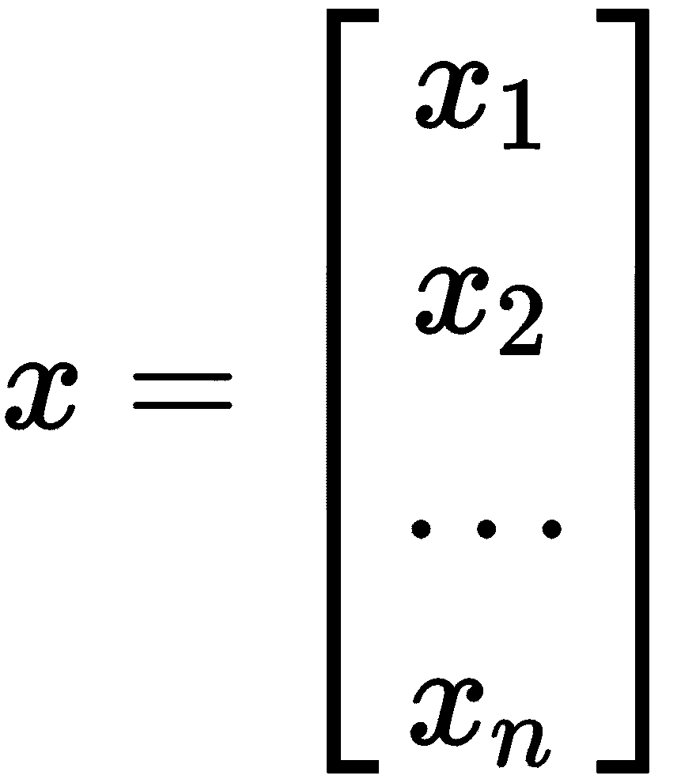
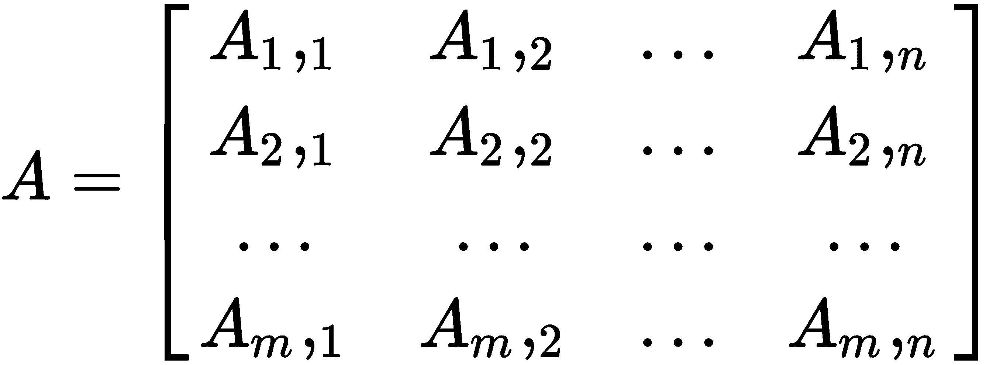
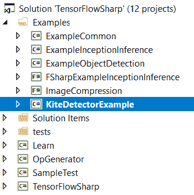
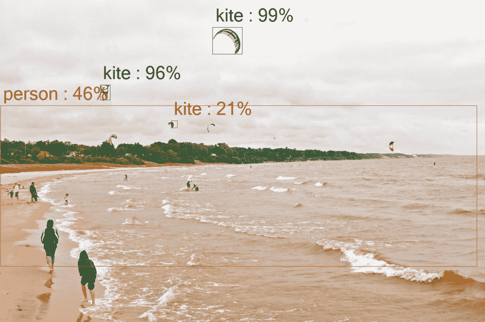
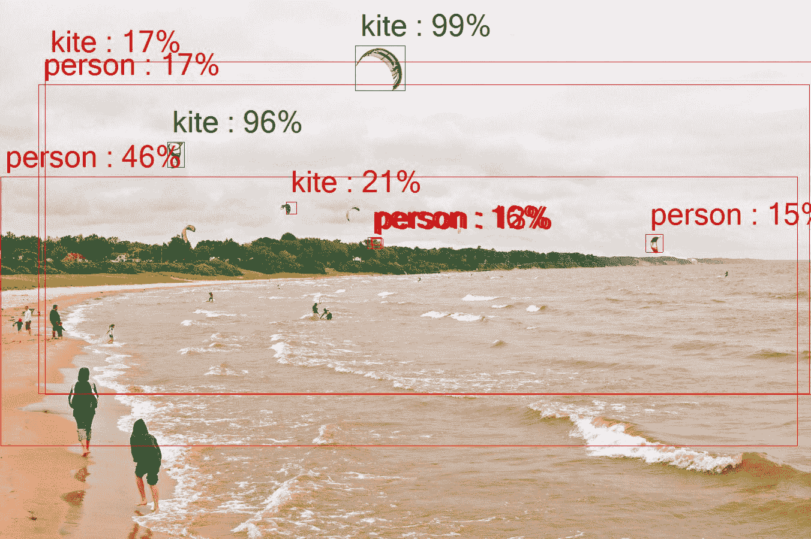

# 基于 TensorFlowSharp 的目标检测

在本章中，我们将向您介绍一个名为 TensorFlowSharp 的开源软件包。更具体地说，我们将使用 TensorFlow[1]对象检测 API，这是一个构建在 TensorFlow 之上的开源框架，它使构建、训练和部署各种形式的对象检测模型变得容易。

对于那些不熟悉 TensorFlow 的人，以下是 TensorFlow 网站[2]的摘录：

"TensorFlow is an open source software library for high performance numerical computation. Its flexible architecture allows easy deployment of computation across a variety of platforms (such as CPUs, GPUs, and TPUs), and from desktops to clusters of servers to mobile and edge devices. Originally developed by researchers and engineers from the Google Brain team within Google's AI organization, it comes with strong support for machine learning and deep learning and the flexible numerical computation core is used across many other scientific domains."

TensorFlowSharp 提供到 TensorFlow 库的.NET 绑定，如果您需要，可以在此处发布这些绑定：[https://github.com/tensorflow/tensorflow](https://github.com/tensorflow/tensorflow) 。

本章包括的主题如下：

*   使用张量
*   张量
*   开发自己的 TensorFlow 应用程序
*   检测图像
*   对象突出显示的最低分数

# 技术要求

您需要具备使用 Microsoft Visual Studio 和 C#进行.NET 开发的基本知识。您需要从本书的网站下载本章的代码：TensorFlowSharp（[https://github.com/migueldeicaza/TensorFlowSharp](https://github.com/migueldeicaza/TensorFlowSharp) ）。

查看以下视频以查看代码的作用：[http://bit.ly/2pqEiZ9](http://bit.ly/2pqEiZ9) 。

# 使用张量

让我们通过讨论张量到底是什么来开始。要做到这一点，我们还应该讨论一下向量和矩阵。如果您已经熟悉，可以跳过本节，但它很短，如果您已经了解矩阵和向量，谁知道呢，您可能还记得您忘记的东西！不管怎样，还是继续读吧！

现在，在我们开始讨论之前，让我给大家展示一个图形，它可能会使事情更容易可视化：


向量是一个数字数组，如下所示：



矩阵是由*n x m*个数组成的网格，是一个二维数组。我们可以对矩阵进行各种整齐的运算，如加法和减法，只要大小兼容：



如果我们愿意，我们可以将矩阵相乘，如下所示：


矩阵可以加在一起，如下所示：


在这两种情况下，我们都是在二维空间中工作。那么，如果我们的要求是计算出一个*n*维空间到*n>2*的位置，我们该怎么办？这就是张量的作用。

张量基本上是一个矩阵，但不是二维的（尽管可以）。它可能是一个三维矩阵（向量是张量是矩阵），或者是一个我们还不知道如何可视化的不可思议的维度。为了向你们展示张量到底有多强大，张量在一个维度上是协变的，在另一个维度上是逆变的。张量的维数通常称为其**秩**。

更正式地说，张量实际上是所谓的**数学实体**，它生活在一个结构中，并与该结构中的其他实体相互作用。如果其中一个实体被转换，张量必须遵守所谓的**相关转换规则**。这就是矩阵和张量的区别。当变换发生时，张量必须允许实体四处移动。

现在我们已经把所有这些都整理好了，下面让我们看一下如何通过浏览一些示例代码来处理张量：

```cs
void BasicVariables ()
{
Console.WriteLine ("Using placerholders");
using (var g = new TFGraph ())
{
var s = new TFSession (g);
```

请注意，变量类型必须与`TFTensor`中的类型转换匹配：

```cs
var var_a = g.Placeholder (TFDataType.Int16);
var var_b = g.Placeholder (TFDataType.Int16);
```

我们要做加法和乘法：

```cs
var add = g.Add (var_a, var_b);
var mul = g.Mul (var_a, var_b);
varrunner = s.GetRunner ();
```

让我们一起添加两个张量（这是前面提到的变量类型转换）：

```cs
runner.AddInput (var_a, new TFTensor ((short)3));
runner.AddInput (var_b, new TFTensor ((short)2));
Console.WriteLine ("a+b={0}", runner.Run (add).GetValue ());
```

现在让我们将两个张量相乘：

```cs
runner = s.GetRunner ();
runner.AddInput (var_a, new TFTensor ((short)3));
runner.AddInput (var_b, new TFTensor ((short)2));
Console.WriteLine ("a*b={0}", runner.Run (mul).GetValue ());
}
}
```

# 张量

现在我们已经讨论并向您展示了张量，让我们看看我们通常如何使用 TensorFlowSharp API 本身。

您的应用程序通常会创建一个图（`TFGraph`，在那里设置操作，然后从中创建一个会话（`TFSession`。然后，此会话将使用会话运行程序设置输入和输出，并执行管道。让我们看一个快速的例子，说明这可能是如何进行的：

```cs
using(var graph = new TFGraph ())
{
graph.Import (File.ReadAllBytes ("MySavedModel"));
var session = new TFSession (graph);
var runner = session.GetRunner ();
runner.AddInput (graph ["input"] [0], tensor);
runner.Fetch (graph ["output"] [0]);
var output = runner.Run ();
```

从输出中获取结果：

```cs
TFTensor result = output [0];
}
```

在不需要单独设置图形的场景中，会话将自动为您创建一个图形。下面的示例演示如何使用 TensorFlow 计算两个数字的和。我们将让会话自动为我们创建图表：

```cs
using (var session = new TFSession())
{
var graph = session.Graph;
var a = graph.Const(2);
var b = graph.Const(3);
Console.WriteLine("a=2 b=3");
```

添加两个常量：

```cs
var addingResults = session.GetRunner().Run(graph.Add(a, b));
var addingResultValue = addingResults.GetValue();
Console.WriteLine("a+b={0}", addingResultValue);
```

乘以两个常数：

```cs
var multiplyResults = session.GetRunner().Run(graph.Mul(a, b));
var multiplyResultValue = multiplyResults.GetValue();
Console.WriteLine("a*b={0}", multiplyResultValue);
}
```

# 开发自己的 TensorFlow 应用程序

现在我们已经向您展示了一些初步的代码示例，让我们继续我们的示例项目，如何使用控制台应用程序中的 TensorFlowSharp 来检测图像中的对象。这段代码非常简单，如果您愿意，可以添加到您的解决方案中。只要调整输入和输出名称，也许允许用户调整超参数，就可以了！

要运行此解决方案，您应该从网站下载本章的源代码并在 Microsoft Visual Studio 中打开。请按照说明下载本书的代码：



在深入研究代码之前，让我们先谈谈一个非常重要的变量：

```cs
private static double MIN_SCORE_FOR_OBJECT_HIGHLIGHTING = 0.5;
```

这个变量是我们识别和突出显示基础图像中对象的阈值。在 0.5 时，检测可靠性和准确性之间存在合理的同步性。当我们降低这个数字时，我们会发现识别出更多的对象，但是，识别精度开始下降。我们走得越低，错误识别物体的机会就越大。我们将确定它们，但它们可能不是我们想要的，正如您稍后将看到的那样。

现在，让我们快速了解一下此示例的主要功能，并了解它的功能：

```cs
static void Main(string[] args)
{
```

加载默认模型和数据：

```cs
_catalogPath = DownloadDefaultTexts(_currentDir);
_modelPath = DownloadDefaultModel(_currentDir);
_catalog = CatalogUtil.ReadCatalogItems(_catalogPath);
var fileTuples = new List<(string input, string output)>() { (_input, _output) };
string modelFile = _modelPath;
```

让我们在这里创建 TensorFlowSharp 图形对象：

```cs
using (var graph = new TFGraph())
{
```

将所有数据读入图形对象：

```cs
graph.Import(new TFBuffer(File.ReadAllBytes(modelFile)));
```

创建要使用的新 TensorFlowSharp 会话：

```cs
using (var session = new TFSession(graph))
{
Console.WriteLine("Detecting objects", Color.Yellow);
foreach (var tuple in fileTuples)
{
```

从图像文件创建张量：

```cs
var tensor = ImageUtil.CreateTensorFromImageFile(tuple.input, TFDataType.UInt8);
var runner = session.GetRunner();
runner.AddInput(graph["image_tensor"][0], tensor).Fetch(graph["detection_boxes"][0],graph["detection_scores"][0],graph["detection_classes"][0],graph["num_detections"][0]);var output = runner.Run();
var boxes = (float[,,])output[0].GetValue();
var scores = (float[,])output[1].GetValue();
var classes = (float[,])output[2].GetValue();
Console.WriteLine("Highlighting object...", Color.Green);
```

处理完所有变量后，让我们确定并绘制在示例图像上检测到的对象框：

```cs
DrawBoxesOnImage(boxes, scores, classes, tuple.input, tuple.output, MIN_SCORE_FOR_OBJECT_HIGHLIGHTING);
Console.WriteLine($"Done. See {_output_relative}. Press any key", Color.Yellow);
Console.ReadKey();
}
}
}
```

好吧，对于一个简单的运算来说，这是很好的，但是如果我们真正需要做的是一个更复杂的运算，比方说乘以一个矩阵，那该怎么办呢？我们可以这样做：

```cs
void BasicMultidimensionalArray ()
{
```

创建我们的`TFGraph`对象：

```cs
using (var g = new TFGraph ())
{
```

创建我们的`TFSession`对象：

```cs
var s = new TFSession (g);
```

为乘法变量创建占位符：

```cs
var var_a = g.Placeholder (TFDataType.Int32);
var mul = g.Mul (var_a, g.Const (2));
```

进行乘法运算：

```cs
var a = new int[,,] { { { 0, 1 } , { 2, 3 } } , { { 4, 5 }, { 6, 7 } } };
var result = s.GetRunner ().AddInput (var_a, a).Fetch (mul).Run () [0];
```

测试结果：

```cs
var actual = (int[,,])result.GetValue ();
var expected = new int[,,] { { {0, 2} , {4, 6} } , { {8, 10}, {12, 14} } };
Console.WriteLine ("Actual: " + RowOrderJoin (actual));
Console.WriteLine ("Expected: " + RowOrderJoin (expected));
Assert(expected.Cast<int> ().SequenceEqual (actual.Cast<int> ()));
};
}
private static string RowOrderJoin(int[,,] array) => string.Join (", ", array.Cast<int> ());
```

# 检测图像

现在是时候开始一个真正的项目了。在本例中，我们将获取基本图像（如下所示），并使用它让计算机检测图像中的对象。正如你所看到的，照片中有几个人和风筝的例子。这是所有 TensorFlowSharp 示例中使用的相同基础图像。当我们更改允许的最小阈值时，您将看到检测和突出显示进度的变化。

这是我们的基本样本图像，一张照片：


# 对象突出显示的最低分数

我们之前讨论过突出显示的最低分数。让我们来看看当我们使用不同的最低分数来突出显示对象时会发生什么，这到底意味着什么。让我们从 0.5 的值开始，看看在我们的照片中检测到哪些对象：


正如你所看到的，我们挑选了两只风筝，每只都有相当好的准确度。方框以绿色绘制，表示高置信度目标。不错。但是仍然有很多东西，我认为我们应该捡起来。还有一些风筝和一些人应该很容易被发现。为什么我们没有这样做？

如果我们将最低阈值降低到 0.3 而不是 0.5 呢？让我们看看结果：



嗯，正如你所看到的，我们确实捡到了其他风筝，尽管由于照片中的距离，我们的自信分数较低，但更重要的是，我们现在也开始认识人了。任何用红色绘制的框都是低置信度目标，绿色是高置信度目标，黄色是中等置信度目标。

现在，如果我们更进一步，将最低阈值一直降低到 0.1，会怎么样？如果我们的模式遵循，我们应该能够识别更多的图像，当然，尽管置信度较低。

如果你看下面这张照片，你会发现我们确实选择了更多的物体。不幸的是，正如我们所怀疑的那样，准确度已经大大降低。风筝和人混淆了，有一次树也和人混淆了。但值得肯定的是，随着我们调整阈值，我们的认知会发生变化。是否可以在更高级的应用程序中自适应地执行此操作？当然，我想培养的正是这些想法，这样你就可以润色代码，制作出真正震撼世界的应用程序：



好的，还有最后一个例子，我想你会喜欢的。在本例中，我已将最小阈值降至 0.01。如果我们的直觉是正确的，那么屏幕上现在应该会亮起低置信度目标。让我们看看我们是否正确：


看来我们的直觉是对的。我知道屏幕标签杂乱无章，但关键是我们增加了目标检测，尽管置信阈值较低。

现在你应该花些时间考虑一下这些技术的令人兴奋的应用。从人脸和物体检测到自动驾驶车辆，张量现在到处都在使用，这是你应该熟悉的。

# 总结

TensorFlowSharp 是一个激动人心的开源项目，它使使用 TensorFlow 和 TensorFlow 变得非常简单。在本章中，我们向您展示了什么是张量以及如何使用它们。我们还构建了一个功能极其强大的示例应用程序，允许您检测图片中的图像并为其添加标签。

在下一章中，我们将学习长短记忆网络，以及如何使用它们来增强应用程序和进程。

# 工具书类

*   [1] “现代卷积目标探测器的速度/精度权衡”，黄 J，拉托德 V，孙 C，朱 M，Koratikara A，Fathi A，Fischer I，Wojna Z，Song Y，Guadarrama S，Murphy K，CVPR 2017
*   [2] [www.tensorflow.org](http://www.tensorflow.org)
*   [3] 琼，哈德里安。*深度学习书籍系列 2.1 标量向量矩阵和张量*网络博客帖子。[hadrienj.github.io](http://hadrienj.github.io)。2018 年 3 月 26 日。