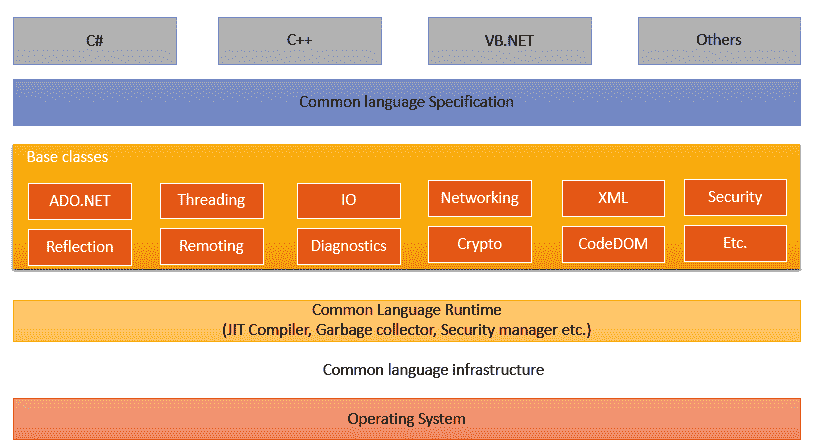
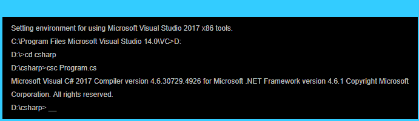
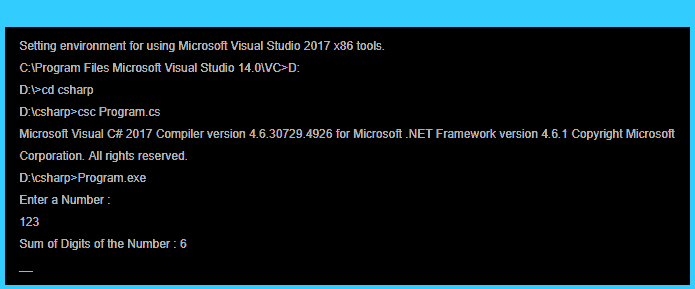
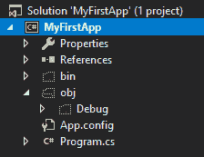
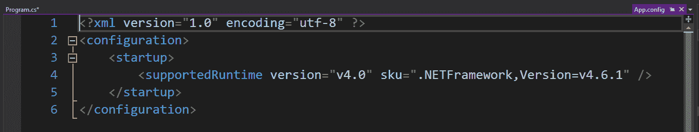
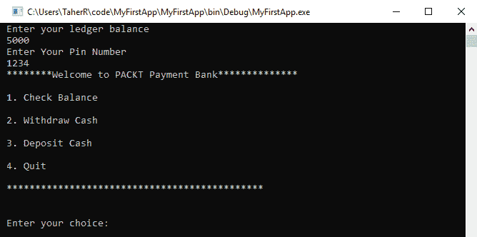
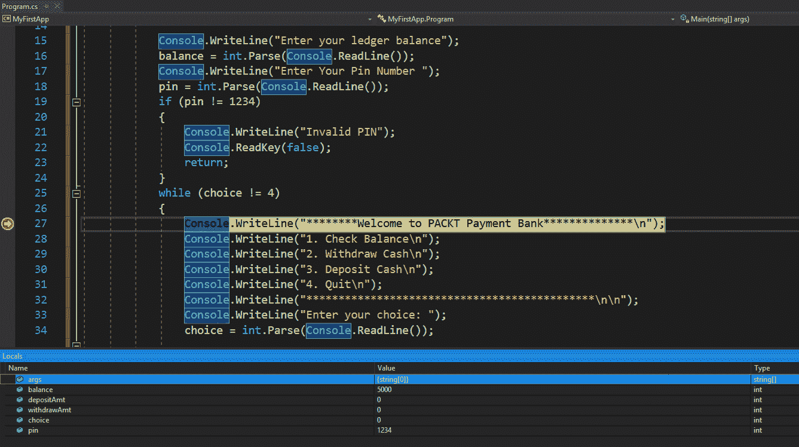

# 一、C# 语言概述

随着现代编程实践的引入，很明显，开发人员正在寻找更先进的结构来帮助他们以最有效的方式交付最好的软件。在框架之上发展的语言是为了增强开发人员的能力，使他们能够以更低的复杂性快速构建代码，从而使代码既可维护又可读。

市场上有许多面向对象的高级编程语言，但我认为其中最有前途的是 C#。C# 语言在编程世界中并不新鲜，已经存在了十多年，但是随着语言本身的动态发展创造了如此多更新的结构，它已经将一些最广泛接受的语言竞争抛在了脑后。C# 是一种面向对象、类型安全的通用语言，它建立在.NET 框架，该框架由微软开发，并得到了**欧洲计算机制造商协会**(**【ECMA】**)和**国际标准组织** ( **ISO** )的批准。它被构建为在公共语言基础设施上运行，并且可以与基于相同架构构建的任何其他语言进行交互。受 C++的启发，这种语言在不处理太多复杂代码的情况下提供了最好的应用。

在本章中，我们将涵盖以下主题:

*   C# 的演变
*   C# 的体系结构
*   C# 语言的基础和语法
*   作为编辑器的 Visual Studio
*   在 Visual Studio 中编写您的第一个程序

# C# 的演变

C# 是近年来最具活力的语言之一。这种语言是开源的，主要是由一群软件工程师驱动的，他们最近提出了许多重大的改变来增强这种语言，并提供一些特性来处理现有语言中的复杂性。为该语言提出的一些主要增强包括**泛型**、LINQ、动态和异步/等待模式:


在上图中，我们可以看到这种语言是如何从 C# 1.0 中的托管代码开始，到 C# 5.0 中引入的异步编程结构，再到现代的 C# 8。在进一步讨论之前，让我们看看 C# 在其不同发展阶段的一些亮点。

# 托管代码

托管代码一词是在微软宣布.NET 框架。在托管环境中运行的任何代码都由**公共语言运行时** ( **CLR** )处理，它保持

# 无商标消费品

泛型是 C# 2.0 引入的一个概念，它允许模板类型定义和类型参数。泛型允许程序员用开放式类型参数定义类型，这极大地改变了程序员编写代码的方式。动态类型化泛型模板的类型安全性提高了可读性、可重用性和代码性能。

# 查询表达式

C# 语言的第三部分介绍了**语言集成查询(LINQ)** ，一种可以在对象结构上运行的查询的新构造。LINQ 对编程世界来说是非常陌生的，他让我们看到了在面向对象的通用编程结构之上的函数式编程。LINQ 还以`IQueryable`接口的形式引入了一堆新的接口，其中引入了许多可以使用 LINQ 与外部世界交互的库。Lambda 表达式和表达式树的引入促进了 LINQ 的发展。

# 力学

第四批也提供了一个全新的结构。介绍了动态语言结构。动态编程能力帮助开发人员将编程调用推迟到运行时。在同一运行时编译动态代码的语言中引入了一种特定的语法糖。该版本还提出了许多新的接口和类来增强其语言能力。

# 异步/等待

对于任何语言来说，线程化或异步编程都是一件痛苦的事情。当处理异步时，程序员不得不遇到许多降低代码可读性和可维护性的复杂性。有了 C# 语言的异步/等待特性，异步编程就像同步编程一样简单。编程已经简化，所有的复杂性都由编译器和框架内部处理。

# 编译器即服务

微软一直在研究如何将编译器的部分源代码对外开放。因此，作为一名程序员，你能够查询编译器的一些内部工作原理。C# 6.0 引入了许多库，使开发人员能够深入了解编译器、绑定器、程序的语法树等等。虽然这些功能作为罗斯林项目已经开发了很长时间，但微软最终还是将其发布给了外部世界。

# 异常过滤器

C# 6.0 有很多小功能。其中一些特性为开发人员提供了用简单代码实现复杂逻辑的机会，而其中一些特性增强了语言的整体能力。这个版本新引入了异常过滤器，它使程序能够过滤掉某些异常类型。异常过滤器是一种 CLR 构造，在其整个生命周期中一直隐藏在语言中，但最终在 C# 6.0 中引入。

# C# 8 及更高版本

随着 C# 成为市场上最具活力的语言，它也在不断改进。使用较新的特性，如可空引用类型、异步流、范围和索引、接口成员以及 C# 最新版本附带的许多其他特性，它们增强了基本特性，并帮助程序员利用这些新构造，从而使他们的生活更加轻松。

注意，在语言的进化过程中.NET 框架也是开源的。您可以找到.NET 框架在以下链接:[https://referencesource.microsoft.com/](https://referencesource.microsoft.com/)。

# 建筑。网

尽管它已经有十年的历史了.NET 框架仍然构建良好，并确保它分层、模块化和层次化。每一层都为用户提供特定的功能，有些是在安全性方面，有些是在语言能力方面。这些层为最终用户提供了一个抽象层，并尽可能地隐藏了本机操作系统的大部分复杂性。那个.NET 框架被划分成多个模块，每个模块都有自己不同的职责。较高层从较低层请求特定的功能，因此它是分层的。

让我们来看看.NET 架构:



上图描述了.NET 框架架构。在最底层，是操作系统与操作系统中存在的内核 API 进行交互。公共语言基础结构与 CLR 连接，CLR 提供监视每个代码执行和托管内存的服务，处理异常，并确保应用按预期运行。基础设施的另一个重要目标是语言的互操作性。公共语言运行库再次被抽象为.NET 类库。这一层保存了构建该语言的二进制文件，所有构建在库之上的编译器都提供相同的编译代码，以便 CLR 能够理解代码并轻松地相互交互。

在进一步讨论之前，让我们快速了解一下语言所基于的一些关键方面.NET 框架。

# 公共语言运行时

CLR 提供了底层非托管基础架构与托管环境之间的接口。这以垃圾收集、安全性和互操作性的形式提供了托管环境的所有基本功能。CLR 由即时编译器组成，它将特定编译器生成的汇编代码编译成本机调用。CLR 是.NET 架构。

# 普通类型系统

由于语言和框架之间有一个抽象层，很明显，每种语言文字都被映射到特定的 CLR 类型。例如，VB.NET 的整数和 C# 的 int 是一样的，因为两者都指向同一个类型，System.Int32。由于编译器负责类型的映射，所以总是首选使用语言类型。CTS 系统构建为类型层次结构，其顶点为`System.Object`。**通用类型系统** ( **CTS** )分为两种，一种是值类型，是从`System.ValueTypes`派生出来的原语，其他都是引用类型。值类型与引用类型的处理方式不同。这是因为虽然内存值类型的分配是在执行期间在线程堆栈上创建的，但引用类型总是在堆上创建的。

# .NET 框架类库

框架类库位于语言和 CLR 之间，因此框架中存在的任何类型都暴露给您编写的语言。那个.NET 框架由大量的类和结构组成，公开了作为程序员的你可以从中受益的永无止境的功能。类库以二进制文件的形式存储，可以直接从程序代码中引用。

# 即时编译器

.NET 语言编译两次。在第一种编译形式中，高级语言被转换成一种**微软中间语言** ( **MSIL** )，这种语言可以被 CLR 理解，而 MSIL 语言在运行时程序执行时被再次编译。JIT 在程序运行时内部工作，并定期编译预计在执行期间需要的代码。

# C# 语言的基础和语法

作为一种高级语言，C# 装饰着许多更新的语法，这有助于程序员高效地编写代码。正如我们前面提到的，语言支持的类型系统分为两种类型:

*   值类型
*   参考类型

值类型通常是原语类型，在本地执行期间存储在堆栈中，以便更快地分配和释放内存。值类型主要在代码开发过程中使用，因此，这构成了代码的主要范围。

# 数据类型

C# 的基本数据类型分为以下几类:

*   布尔类型:`bool`
*   字符类型:`char`
*   整数类型:`sbyte`、`byte`、`short`、`ushort`、`int`、`uint`、`long`和`ulong`
*   浮点类型:`float`和`double`
*   小数精度:`decimal`
*   字符串:`string`
*   对象类型:`object`

这些是原始数据类型。这些数据类型嵌入在 C# 编程语言中。

# 可空类型

C# 中基元类型或值类型不可为空。因此，开发人员总是需要将类型设置为可空，因为开发人员可能需要确定值是否是显式提供的。最新版本的.NET 提供可空类型:

```cs
Nullable<int> a = null;
int? b = a; //same as above
```

前面示例中的两行都定义了可空变量，而第二行只是第一个声明的快捷方式。当该值为空时，`HasValue`属性将返回`false`。这将确保您可以检测变量是否被显式指定为值。

# 文字

文字也是任何程序的重要组成部分。C# 语言为开发人员提供了不同种类的选项，允许程序员在代码中指定文字。让我们看看支持的不同类型的文字。

# 布尔代数学体系的

布尔文字以`true`或`false`的形式定义。除了`true`和`false`以外，不能在布尔类型中分配其他值:

```cs
bool result = true;
```

布尔类型的默认值是`false`。

# 整数

整数是可以有加号(+)或减号(-)作为前缀的数字，但这是可选的。如果没有给出符号，则认为是正的。您可以用 int、long 或十六进制形式定义数值:

```cs
int numberInDec = -16;
int numberInHex = -0x10;
long numberinLong = 200L;
```

您可以看到，第一个字面值`-16`是在整数变量中指定的字面值，而相同的值是使用十六进制字面值分配给整数的。长变量被赋予一个带`L`后缀的值。

# 真实的

像整数一样，实数值是带有正负符号的数字序列。这也使得指定分数值成为可能:

```cs
float realNumber = 12.5f;
realNumber = 1.25e+1f;
double realdNumber = 12.5;
```

如您所见，最后一行中的文字`12.5`默认为`double`，因此需要将其赋给一个双变量，而前两行指定了浮点类型中的文字。您也可以指定`d`或`D`作为后缀来定义`double`，如`f`或`F`表示`float`，而`m`表示小数。

# 性格；角色；字母

字符文字需要保留在单引号内。文字的值可以如下:

*   一个字符，例如`c`
*   一个字符代码，例如`\u0063`
*   转义字符，例如`\\`(正斜杠是转义字符)

# 线

字符串是一系列字符。在 C# 中，字符串用双引号表示。在 C# 中有不同的方法可以创建字符串。让我们看看在 C# 中创建字符串的不同方法:

```cs
string s = "hello world";
string s1 = "hello \n\r world"; //prints the string with escape sequence
string s2 = @"hello \n\r world"; //prints the string without escape sequence
string s3 = $"S1 : {s1}, S2: {s2}"; // Replaces the {s1} and {s2} with values
```

`@`字符可以作为前缀放在字符串之前，以保持字符串原样，而无需担心任何转义字符。它被称为逐字字符串。`$`字符用作字符串插值的前缀。如果您的字符串前面有`$`符号，如果变量被放在`{ }`括号内，它们会被自动替换为值。

# 编程语法–条件

条件是任何程序最常见的构造块之一。程序不能有单一维度；比较、跳转和中断是 C# 中最常见的练习形式。有三种类型的条件可用:

*   `if...else`
*   `switch-case`
*   `goto`(无条件结块)

# If-else 构造

最常用的条件语句是 if-else 构造。if-else 结构的构建块包含一个`if`关键字，后跟一个布尔表达式和一组花括号来指定要执行的步骤。或者，可以有一个`else`关键字，后跟当`if`块为`false`时要执行的代码的花括号:

```cs
int a = 5;
if (a == 5)
{
   // As a is 5, do something
}
else
{
  // As a is not 5, do something
}
```

if-else 构造还可以有一个 else-if 语句来指定多个执行条件。

# 开关盒结构

另一方面，开关盒几乎类似于`if`语句；在本陈述中，案例将决定执行步骤。在`switch`的情况下，这总是落在一组离散的值中，因此，可以设置这些值:

```cs
int a = 5;
switch (a)
{
  case 4:
     // Do something; 
     break;
  case 5:
     // Do something;
     break;
 default:
     // Do something;
     break;
}
```

switch case 会根据值自动选择正确的 case 语句，并执行块中定义的步骤。一个案件需要以一个中断声明结束。

# goto 语句

尽管它们不太流行，也不建议使用，但`goto`语句用于语言中的无条件跳转，并且被语言本身广泛使用。作为一名开发人员，您可以使用`goto`语句跳转到程序的任何位置，并使用您拥有的上下文:

```cs
... code block
goto lbl1;
...
...
lbl1: expression body
```

`goto`语句直接跳转到指定的位置，没有任何条件或标准。

# 编程语法–循环

对于执行过程中的重复任务，循环起着至关重要的作用。循环允许程序员根据循环的类型定义一个条件，在该条件下循环将结束或直到循环应该执行。有四种类型的循环:

*   正在…
*   语法
*   为
*   为每一个

# while 构造

在编程世界中，循环用于使一系列执行步骤重复进行，直到满足条件。`while`循环是 C# 编程架构的构建块之一，用于循环遍历花括号中提到的主体，直到`while`标准中提到的条件是`true`:

```cs
while (condition)
{
  loop body;
}
```

循环中提到的条件应该评估为`true`以执行下一次迭代的循环。

# 边做边构造

`do...while`构造在执行一次步骤后检查条件。尽管`do...while`循环类似于`while`循环，但是`do...while`循环和`while`循环之间的唯一区别在于`do...while`循环将至少执行一次主体，即使标准是`false`:

```cs
do
{
  loop body;
}
while (condition);
```

# for 构造

语言中最流行的循环是`for`循环，它通过在块本身内保持循环的有效执行次数来处理复杂性:

```cs
for (initialization; condition; update)
{
  /* loop body */
}
```

`for`循环在标准中有几个部分。每个都用分号(`;`)隔开。第一部分定义了索引变量，该变量在执行循环之前执行一次。第二部分是在`for`循环的每次迭代中执行的条件。如果条件变为`false`，则`for`循环不会继续执行并停止。第三部分也是在每次执行循环体之后执行的，它操纵在`for`循环初始化和条件中使用的变量。

# foreach 构造

`foreach`循环对于语言来说是新的，用于迭代一系列对象。尽管这纯粹是语言中的语法糖，但是`foreach`循环在处理集合时被广泛使用。`foreach`循环本质上使用`IEnumerable<object>`接口，并且应该只用于实现该接口的对象:

```cs
foreach (type variable in collection)
{
    //statements;
}
```

# 上下文–中断和继续语句

如果您正在使用循环，那么理解另外两个能够与循环交互的上下文关键词是非常重要的。

# 破裂

这允许开发人员打破循环，将上下文带出循环，即使条件仍然有效。编程上下文关键字`break`被用作一个旁路来中断它正在执行的循环。`break`语句在循环和开关语句中有效。

# 继续

这用于调用下一个迭代。上下文关键字允许开发人员继续下一步，而无需在块中执行任何进一步的代码。

现在，让我们看看如何在程序中使用这两种上下文语句:

```cs
var x = 0;
while(x<=10)
{
   x++;
   if(x == 2)continue;
   Console.WriteLine(x);
   if(x == 5) break;
   Console.WriteLine("End of loop body");
}
Console.WriteLine($"End of loop, X : {x}");
```

由于`continue`语句，前面的代码将跳过迭代值`2`的主体执行。由于`break`语句，循环将一直执行到`x`的值为`5`为止。

# 在控制台应用中编写第一个 C# 程序

由于您现在已经了解了 C# 语言、文字、循环、条件等的基础知识，我认为是时候看一个 C# 代码示例了。因此，让我们从编写一个简单的控制台应用开始，编译它，并使用 C# 编译器运行它。

打开计算机中的任何记事本应用，并键入以下代码:

```cs
using System;

public  Program
{
      static void Main(string[] args)
      {
          int num, sum = 0, r;
          Console.WriteLine("Enter a Number : ");
          num = int.Parse(Console.ReadLine());
          while (num != 0)
          {
              r = num % 10;
              num = num / 10;
              sum = sum + r;
          }
          Console.WriteLine("Sum of Digits of the Number : " + sum);
          Console.ReadLine();
      }
}
```

前面的代码是计算一个数字的所有数字之和的经典例子。它使用`Console.ReadLine()`函数将一个数字作为输入，解析它，并将其存储到变量`num`中，当该数字为`0`时循环通过，并通过`10`取模得到除法的提醒，然后求和得到结果。

可以看到在代码块的顶部有一个`using`语句，保证了`Console.ReadLine()`和`Console.WriteLine()`可以被调用。`System`是代码中的一个命名空间，它使程序能够调用其中定义的类，而无需指定类的完整命名空间路径。

让我们将该类保存为`program.cs`。现在，打开控制台，将其移动到保存代码的位置。

要编译代码，我们可以使用以下命令:

```cs
csc Program.cs
```

编译将产生如下内容:



编译将产生`program.exe`。如果您运行这个，它将把数字作为输入并产生结果:



您可以看到代码正在控制台窗口中执行。

如果我们进一步剖析代码是如何执行的，我们可以看到？NET 框架提供了`csc`编译器，一个能够将我的 C# 代码编译成托管可执行文件的可执行文件。编译器生成一个以 MSIL 为内容的可执行文件，然后在执行该可执行文件时.NET 框架调用一个可执行文件，并使用 JIT 进一步编译它，以便它可以与输入/输出设备交互。

`csc`编译器提供了各种命令行钩子，可以用来进一步添加**动态链接库** ( **dll** )对程序的引用，将输出作为 dll，等等。您可以在以下链接找到完整的功能文档:[https://docs . Microsoft . com/en-us/dotnet/cs harp/language-reference/compiler-options/list-按字母顺序排列](https://docs.microsoft.com/en-us/dotnet/csharp/language-reference/compiler-options/listed-alphabetically)。

# 作为编辑器的 Visual Studio

微软已经创建了许多改进工具集来帮助创建、调试和运行程序。其中一个工具叫做 **Visual Studio** ( **VS** )。微软 VS 是一个使用微软语言的开发环境。这是一个开发人员可以依赖的工具，这样他们就可以轻松地使用微软技术。VS 已经存在了相当长的一段时间，但新的 VS 已经完全重新设计，并作为 VS 2019 发布以支持.NET 语言。

# Visual Studio 的演进

随着时间的推移，微软发布了更新版本的 VS，有了更多的优势和增强。作为一个插件宿主，它以插件的形式托管许多服务，VS 已经随着许多工具和扩展而发展。它一直是每个开发人员活动的核心部分。VS 已经被大量不属于开发人员社区的人使用，因为他们发现这个 IDE 对于编辑和管理文档是有益的。

# Visual Studio 的类型

微软推出了不同类型或版本的 VS，这些版本的区别在于特性和定价。在这些版本中，一个是免费的，而其他的你必须购买。因此，知道哪个版本提供哪些特性，哪个版本更适合哪种类型的工作，将使开发人员更容易选择正确的版本。

让我们来看看 VS 所有版本之间的比较。

# Visual Studio 社区

VS 社区版是免费版。这个版本没有其他版本中提供的一些高级功能，但是这个社区版本非常适合构建小型/中型项目。这对于想要探索 C# 编程语言的人来说特别有用，因为他们可以免费下载这个版本并开始构建应用。

# Visual Studio 专业版

这个版本的 VS 是为你自己开发的，有重要的调试工具和所有常用的开发者工具。因此，您可以使用 IDE 作为您的主要方向，然后就可以继续了！

# Visual Studio 企业版

VS 企业版适用于需要集成开发环境商业使用级别的企业。它支持用于测试、调试等的特殊工具。它还可以发现常见的编码错误，生成测试数据等等。

# Visual Studio 代码

VS Code 是一个小型的开源工具，它不是一个完整的 IDE，而是一个由微软开发的简单代码编辑器。这个编辑器非常轻量级，并且独立于平台。VS 代码并不具备 VS IDE 所具备的大部分特性，但却有足够的特性来开发和调试应用。

对于这本书，我们将在大多数情况下使用 VS Community，但是您可以安装任何您想要的版本。您可以通过以下链接免费下载社区版:[https://www.visualstudio.com/downloads/](https://www.visualstudio.com/downloads/)。

# Visual Studio 集成开发环境简介

在您首次安装 VS 之后，VS 安装程序将为您提供一些关于工作负载的选项，这意味着您将使用此 IDE 开发的应用类型。对于本书，我们将只创建 C# 控制台应用，因此如果您愿意，您可以选择该选项。现在，让我们开始 VS IDE。加载集成开发环境后，它会显示一个包含多个选项的起始页。选择创建新项目的选项。

# 新项目

选择新项目后，将出现“新建项目”对话框。在此对话框中，根据当前集成开发环境中安装的软件包，有许多选项可用，如下图所示:


在前面的截图中，左侧的组是您可以选择的模板类型。在这里，我选择了 Windows 桌面，从中间窗口，我选择了控制台应用().NET 框架)来创建我的应用。屏幕底部允许您命名项目并选择存储项目文件的位置。有两个复选框可用，其中一个表示选中时为解决方案创建目录(默认情况下，此选项保持选中状态)。这将在所选路径下创建一个目录，并将文件放入其中，否则将在文件夹内创建文件。

如果找不到模板，请使用“搜索已安装的模板”在对话框的右上角按名称搜索任何模板。由于一台电脑中可以存在多个框架，因此“新建项目”对话框将允许您选择框架；您需要在部署应用时使用它。它显示了.NET framework 4.6.1 作为项目的默认框架，但是您可以通过从下拉菜单中选择一个框架来更改为任何框架。

最后，单击“确定”用默认文件创建项目:


上面的截图显示了创建项目后基本 IDE 的样子。我们还可以看到 IDE 的每个部分。主 IDE 由许多工具窗口组成。你可以在屏幕的四周看到一些工具窗口。“任务列表”窗口位于屏幕底部。主 IDE 工作区在中间，形成 IDE 的工作区。可以使用屏幕角落的缩放控件放大工作空间。屏幕顶部的集成开发环境搜索框使您能够更优雅、更轻松地在集成开发环境中找到选项。我们现在将把整个集成开发环境分成这些部分，并探索集成开发环境。

# 解决方案浏览器

文件夹和文件在解决方案资源管理器中分层显示。解决方案资源管理器是主窗口，列出了加载到集成开发环境中的整个解决方案。这为您提供了一个项目和文件的视图，这些项目和文件有一个以树的形式轻松导航的解决方案。解决方案资源管理器的外部节点本身就是一个解决方案，然后是项目，最后是文件和文件夹。解决方案资源管理器也支持在解决方案中加载文件夹和在第一级存储文档。设置为启动的项目用粗体标记。

在解决方案资源管理器的顶部有许多按钮，称为工具栏按钮。根据在树中选择的文件，工具栏按钮将被启用或禁用。让我们分别看一下它们:

*   **全部折叠按钮:**此按钮允许您折叠当前选定节点下的所有节点。使用大型解决方案时，通常需要完全折叠树的一部分。您可以使用此功能，而无需手动折叠每个节点。
*   **属性:**作为“属性”窗口的快捷方式，可以选择此按钮打开“属性”窗口，加载与当前所选节点相关联的元数据。
*   **显示所有文件:**解决方案通常映射到文件系统目录中的文件夹结构。解决方案中包含的文件仅显示在解决方案树中。显示所有文件允许您在查看目录中的所有文件和仅查看已添加到解决方案中的文件之间切换。
*   **刷新:**这将刷新当前解决方案中文件的状态。刷新按钮还会检查文件系统中的每个文件，并相应地显示其状态(如果有)。
*   **查看类图:**类图是命名空间和类的逻辑树，而不是文件系统中的文件。当您选择此选项时，VS 会启动类图，其中包含其属性、方法等所有细节。类图对于单独查看所有类及其关联非常有用。
*   **查看代码:**当您选择一个代码文件时，会出现“查看代码”按钮，该按钮会加载与当前选择相关联的代码文件。例如，当您选择一个 Windows 窗体时，它会在需要编写代码的地方后面显示它的代码。
*   **视图设计器:**有时，根据树中选择的文件类型，会出现视图设计器按钮。此按钮启动与当前选定文件类型关联的设计器。
*   **添加新文件夹:**正如我已经说过的，解决方案也可以包含文件夹。您可以使用“添加新文件夹”按钮将文件夹直接添加到解决方案中。
*   **创建新的解决方案:**有时，在处理大型项目时，您可能需要创建整个解决方案的子集，并且只列出您当前正在处理的项目。此按钮将创建一个单独的解决方案资源管理器，该解决方案资源管理器与原始解决方案资源管理器同步，但投影解决方案树的特定部分。

VS 中的解决方案树还按照项目在文件系统中的组织方式加载项目的类结构。如果您看到一个折叠的文件夹，您可以将其展开以查看其中的内容。如果展开一个`.cs`文件，将列出该类的所有成员。如果您只想查看类是如何组织的，可以使用类视图窗口，但是通过使用解决方案资源管理器，您可以看到类以及它自己的层次结构中的其他元素。您可以通过选择视图|类视图或按下 *Ctrl + W 和 C* 来打开类视图，这样您只能查看类及其成员的一部分:



有些文件在解决方案中显示为空白文件(在我们的案例中，是`bin`、`obj`等文件夹)。这意味着这些文件存在于文件系统中，但不包含在解决方案文件中。

每个文件在解决方案中树节点的右侧显示附加信息。该按钮提供与文件相关的额外信息。例如，如果你点击一个`.cs`文件对应的按钮，它会打开一个带有`Contains`的菜单。这将获得解决方案中该特定文件的关联类视图。菜单可以很长，这取决于不能在通用工具栏按钮中显示的项目。当解决方案加载附加信息时，有向前和向后按钮，可用于在解决方案的视图之间导航。

# 主工作区

主工作区是您实际编写代码或对应用应用不同设置的地方。本节将打开项目中不同类型的文件。作为开发人员，这是您将花费大部分时间进行编码的领域。您可以在此窗口中打开多个文件。不同的文件将显示在不同的选项卡中，您可以通过单击选项卡从一个选项卡切换到另一个选项卡。如果需要，您也可以固定标签。如果您认为需要的话，可以让选项卡浮动，或者也可以将其设为全屏大小，这样您就可以专注于正在处理的代码。

因此，当您双击解决方案资源管理器中的文件或从文件的上下文菜单中选择“打开”时，该文件将在主编辑器区域的选项卡中打开。这样，您就可以在编辑器窗口的不同选项卡中打开多个文件，并在需要时在它们之间切换。每个选项卡标题包含几组固定的项目:



在前面的截图中，可以看到选项卡标题包含链接到选项卡的文件名(`Program.cs`)；当需要保存项目时，它会显示一个`*`，并且它有一个 Toggle pinner 按钮(就像所有其他 IDE 工具窗口一样)，这使得标签在左侧很粘，还有一个关闭按钮。标题部分有时还会指示一些附加状态，例如，当文件被锁定时，它会显示一个锁定图标，当从元数据加载对象时，它会在方括号中显示该图标，如前面的截图所示。在这一节中，当我们继续打开文件时，它会进入一堆标签页，一个接一个，直到它到达末尾。整个区域被占用后，它最终会在工作区标题的最右边创建一个菜单，以保存所有无法在屏幕上显示的文件列表。从该菜单中，您可以选择需要打开的文件。 *Ctrl + Tab* 也可以用于在工作区中已经加载的选项卡之间切换。

选项卡标题下方和主要工作区域之前是两个下拉菜单。一个加载了在 IDE 中打开的类，另一个加载了在文件中创建的所有成员。这些下拉菜单通过在左侧列出当前文件中加载的所有类来帮助更容易地在文件中导航，而在右侧还有另一个菜单，它在上下文中列出了类中的所有成员。这两个下拉菜单足够智能，只要有任何新代码添加到编辑器中，就会自动更新下拉值。

主工作区由两个滚动条限定，滚动条处理文档的溢出。但是，在垂直滚动条之后，有一个特殊的按钮来拆分窗口，如下图所示:


另一方面，水平滚动条包含另一个显示编辑器当前缩放百分比的下拉菜单。VS 现在允许您将编辑器缩放到您喜欢的缩放级别。缩放功能的快捷方式是 *Ctrl* +滚动鼠标滚轮。

# 输出窗

输出窗口位于集成开发环境的底部(一般来说)，当您编译、连接到各种服务、开始调试或做一些需要集成开发环境显示一些代码的事情时，它会在不同的时间打开。集成开发环境使用“输出”窗口显示日志和跟踪消息:


“输出”窗口停靠在页面底部，其中列出了各种类型的输出。从顶部的下拉菜单中，您可以选择希望在输出窗口中看到的输出。如果您只想显示较新的日志，也可以选择清除日志。

# “命令”和“立即”窗口

“命令”窗口与 Windows 操作系统的命令提示符非常相似。您可以使用此工具执行命令。在 VS 命令行中，您可以对正在处理的项目执行命令。命令非常方便，并且可以提高您的工作效率，因为您不必拖动鼠标来执行某些事情。您可以运行一个命令来轻松实现这一点。

要在 VS 中打开命令窗口，您可以单击视图菜单，然后单击窗口。之后，选择命令窗口。或者，您可以使用键盘快捷键 *Ctrl + Alt + A、*来打开它。当你在命令窗口时，你会看到一个`>`放置在每个输入的前面。这被称为提示。在提示符下，当您开始键入时，它会为您显示一个 Intellisense 菜单。开始输入`Build.Compile`，此时项目也会为你编译。也可以使用`Debug.Start`开始调试应用。您可以使用命令轻松调试应用。我将列出在使用“命令”窗口进行调试时最常用的一些重要命令:

*   `?`:告诉你一个变量的值(你也可以用`Debug.Print`做同样的事情)
*   `??`:将变量发送到观察窗
*   `locals`:显示本地窗口
*   `autos`:显示自动窗口
*   `GotoLn`:将光标设置到特定的一行
*   `Bp`:在当前行设置断点

与命令窗口类似，中间窗口允许您测试代码，而不必运行它。中间窗口用于评估、执行语句，甚至打印变量值。要打开立即窗口，请转到调试|窗口并选择立即。

# 集成开发环境中的搜索选项

在屏幕的右上角，你会发现一个新的搜索框。这叫做 IDE 搜索框。VS IDE 是浩瀚的。其中有成千上万个选项可供您配置。有时候，很难找到你想要的特定选项。IDE 搜索功能可帮助您更轻松地找到该选项:


搜索选项将列出与 VS IDE 选项相关的所有条目，您可以在这里轻松找到您正在寻找的任何功能。

# 在 Visual Studio 中编写您的第一个程序

VS 是集成开发环境，开发人员在使用 C# 语言时主要在其中编码。既然你已经对 VS 的工作原理有了一个基本的了解，那么让我们在 VS 中编写我们的第一个程序。让我们创建一个控制台应用，命名解决方案`MyFirstApp`，然后按 OK。将自动添加默认解决方案模板，其中包括一个带有`Main`程序的`Program.cs`，以及多个其他文件。

让我们构建一个生成自动取款机的程序。将会有一个包含三个选项的菜单:

*   撤退
*   存款
*   余额检查

提取将在余额(最初为 1，000 美元)上执行，存款将增加当前余额。现在，让我们看看这个程序是什么样子的:

```cs
class Program
{
  static void Main(string[] args)
  {
      int balance, depositAmt, withdrawAmt;
      int choice = 0, pin = 0;
      Console.WriteLine("Enter your ledger balance");
      balance = int.Parse(Console.ReadLine());
      Console.WriteLine("Enter Your Pin Number ");
      pin = int.Parse(Console.ReadLine());

      if(pin != 1234)
      {
          Console.WriteLine("Invalid PIN");
          Console.ReadKey(false);
          return;
      }

      while (choice != 4)
      {
          Console.WriteLine("********Welcome to PACKT Payment Bank**************\n");
          Console.WriteLine("1\. Check Balance\n");
          Console.WriteLine("2\. Withdraw Cash\n");
          Console.WriteLine("3\. Deposit Cash\n");
          Console.WriteLine("4\. Quit\n");
          Console.WriteLine("*********************************************\n\n");
          Console.WriteLine("Enter your choice: ");
          choice = int.Parse(Console.ReadLine());

          switch (choice)
          {
              case 1:
                  Console.WriteLine("\n Your balance $ : {0} ", balance);
                  break;
              case 2:
                  Console.WriteLine("\n Enter the amount you want to withdraw : ");
                  withdrawAmt = int.Parse(Console.ReadLine());
                  if (withdrawAmt % 100 != 0)
                  {
                      Console.WriteLine("\n Denominations present are 100, 500 and 2000\. Your amount cannot be processed");
                  }
                  else if (withdrawAmt > balance)
                  {
                      Console.WriteLine("\n Sorry, insufficient balance.");
                  }
                  else
                  {
                      balance = balance - withdrawAmt;
                      Console.WriteLine("\n\n Your transaction is processed.");
                      Console.WriteLine("\n Current Balance is {0}", balance);
                  }
                  break;
              case 3:
                  Console.WriteLine("\n Enter amount you want to deposit");
                  depositAmt = int.Parse(Console.ReadLine());
                  balance = balance + depositAmt;
                  Console.WriteLine("Your ledger balance is {0}", balance);
                  break;
              case 4:
                  Console.WriteLine("\n Thank you for using the PACKT ATM.");
                  break;
          }
      }
      Console.ReadLine();
  }
}
```

现在，让我们举例说明这个程序。该程序要求在打开自动取款机前输入个人识别码。个人识别码不会被检查，可以是任何东西。一旦程序启动，它会在控制台的前面创建一个包含所有所需选项的菜单。

您可以看到整个代码是在`while`循环中编写的，因为它确保程序在多次执行中保持活动状态。在执行过程中，您可以选择任何可用的选项并执行与之关联的操作。

要执行该程序，只需单击集成开发环境工具栏上的运行按钮:



如果程序没有自动运行，您可以查看错误列表窗口来找出实际问题。如果您在代码中犯了一个错误，VS 将向您显示适当的错误消息，您可以双击它来导航到实际位置。

# 如何调试

如果您听说过 VS，那么您一定听说过 IDE 的调试功能。您可以通过按下 *F10* 在调试模式下启动程序。程序将以调试模式启动，上下文在第一行。让我们执行几行。这将如下所示:



代码编辑器工作区中突出显示的行描述了当前执行已经停止的行。该行还在代码编辑器的最左侧标有箭头。您可以继续按下 *F10* 或 *F11* (步入)按钮来执行这些行。您必须检查“局部变量”窗口，以了解局部变量在执行过程中的所有值。

# 通过代码调试

对于真正的高级用户来说.NET 类库打开了一些有趣的调试器 API，您可以从源代码中调用这些 API 来手动调用调试器。

从程序一开始，就有一个`DEBUG`预处理器变量，它决定了项目是否是在调试模式下构建的。

您可以通过以下方式编写代码:

```cs
# IF DEBUG
/// The code runs only in debug mode
# ENDIF
```

预处理器指令实际上是在编译时计算的。这意味着`IF DEBUG`内部的代码只有在项目以调试模式构建时才会在程序集中编译。

还有其他选项如`Debug.Assert`、`Debug.Fail`、`Debug.Print`。所有这些都只在调试模式下工作。在发布模式下，这些 API 不会被编译。

如果有任何这样的进程可用，您也可以使用`Debugger.Break()`方法调用附加到该进程的调试器，这将在当前行打断调试器。您可以检查调试器。`IsAttached`用于查明调试器是否附加到当前进程。

当你开始调试你的代码时，VS 会启动实际的进程以及文件名中`.vshost`的一个进程。VS 通过启用部分信任的调试来增强调试体验，并通过使用`.vshost`文件来改善 *F5* 体验。这些文件在后台工作，将实际流程与预定义的应用域关联起来进行调试，以获得完美的调试体验。

`.vshost`文件只由 IDE 使用，不应该在实际项目中发布。

VS 需要终端服务来运行这些调试器，因为它与进程通信，即使它在同一台机器上。它通过使用终端服务来维护正常和远程进程调试的无缝体验。

# 摘要

在本章中，我们了解了 C# 语言的基础知识，并介绍了 VS 编辑器。我们还试图使用命令行和 VS 编写我们的第一个程序。

在下一章中，我们将继续讨论 OOP 的概念和技术，这将允许我们编写更多的类。