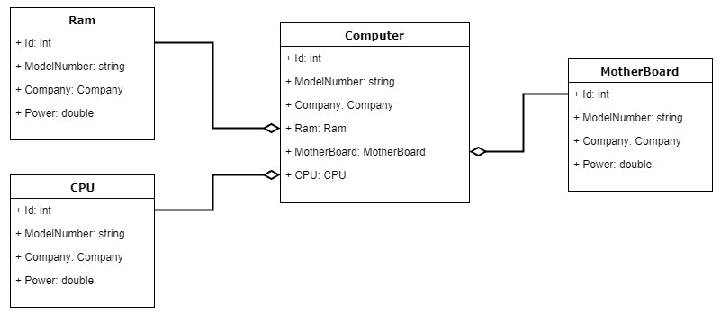
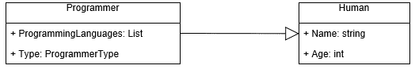

# 四、对象协作

正如我们在前面几章中所看到的，面向对象是关于对象的，这是这种编程方法的主要焦点。当我们使用这种方法设计软件时，我们会记住面向对象的概念。我们还将尝试将我们的软件组件分解成更小的对象，并在这些对象之间创建适当的关系，以便它们可以一起工作来提供我们想要的输出。对象之间的这种关系称为**对象协作**。

在本章中，我们将涵盖以下主题:

*   什么是对象协作？
*   不同类型的协作
*   什么是依赖协作？
*   什么是联想？
*   什么是继承？

# 对象协作的例子

对象协作是面向对象程序设计中最重要的课题之一。如果程序中的对象不相互协作，就什么都不能实现。例如，如果我们考虑一个简单的 web 应用，我们可以看到不同对象之间的关系如何在构建应用时发挥重要作用。例如，Twitter 有许多相互关联的对象，以便使应用工作。`User`对象由用户名、密码、名字、姓氏、图片和其他属于推特用户的用户相关信息组成。可能还有另一个名为`Tweet`的对象，它由消息、日期和时间、发布推文的用户的用户名以及一些其他属性组成。还可能有另一个名为`Message`的对象，它保存着消息的内容，消息来自谁，发送给谁，以及日期和时间。对于像 Twitter 这样的大型应用来说，这可能是最简单的细分；它几乎肯定包含许多其他物体。但是现在，让我们只考虑这三个对象，并试图找到它们之间的关系。

首先，我们来看看`User`对象。这是 Twitter 中最重要的对象之一，因为它保存着用户信息。Twitter 中的一切不是由某个用户制作就是由*某个用户执行，或者是由*某个用户执行*某个用户，所以我们可以假设应该还有其他一些对象需要和这个`User`对象有关系。现在让我们试着看看`Tweet`对象是否与`User`对象有任何关系。推文是一条信息，所有用户都应该可以看到`Tweet`对象是否公开。如果它是私有的，只有该用户的追随者会看到它。正如我们所看到的，一个`Tweet`对象与一个`User`对象有着非常强的关系。因此，使用面向对象的方法，我们可以说`User`对象与 Twitter 应用中的`Tweet`对象协作。*

如果我们也试着分析`User`和`Message`物体之间的关系，我们会看到`Message`物体也和`User`物体有着非常强的关系。一个用户向另一个用户发送消息；因此，没有用户，`Message`对象就没有适当的实现。

但是`Tweet`和`Message`对象之间有关系吗？从上面所说的，我们可以说这两个物体之间没有关系。不是每个对象都必须与所有其他对象相关，但是一个对象通常至少与一个其他对象有关系。现在让我们看看 C# 中有哪些不同类型的对象协作。

# C# 中不同类型的对象协作

在编程中，一个对象可以通过多种方式与其他对象协作。但是，在本章中，我们将只讨论三个最重要的协作规则。

我们将首先尝试解释每一种类型，看一些例子来帮助我们理解它们。如果你不能将这些概念与你的工作联系起来，你可能会有点难以理解对象协作的重要性，但是相信我，这些概念在你成为一名优秀的软件开发人员的道路上非常重要。

当你和别人讨论软件设计时，甚至当你自己设计软件时，所有这些概念和术语都会派上用场。因此，我的建议是专注于理解这些概念，并将它们与你的工作联系起来，以便从这些信息中获益。

现在，让我们看看本章将要讨论的三种协作类型，如下表所示:

*   属国
*   联合
*   遗产

让我们设想一个假想的应用，并尝试将这些协作概念与这个应用的对象联系起来。当你能把概念与现实世界联系起来时，学习就更容易，也更有趣，所以这就是我们将在下面几节中采用的方法。

# 个案研究

因为本章的主要目标是学习对象协作中涉及的概念，而不是设计一个成熟的超级应用，所以我们将以简单和最小的方式设计我们的对象。

例如，我们打算开发一些餐馆管理软件。这可能是为一家豪华餐厅，或一个小咖啡馆，人们来喝咖啡和放松。就我们而言，我们正在考虑一家中等价位的餐厅。为了开始构建这个应用，让我们考虑一下我们需要什么类和对象。我们需要一个`Food`班，一个`Chef`班，一个`Waiter`班，也许还有一个`Beverage`班。

当你读完这一章时，不要直接跳到下一章。相反，花一些时间思考本章中没有提到的一些对象，并尝试分析您已经思考过的对象之间的关系。这将有助于您发展对象协作概念的知识。记住:软件开发不是打字工作，它需要繁重的脑力劳动。因此，你对这些概念想得越多，你在软件开发方面就会变得越好。

现在，让我们看看当我思考应该包含在我们想象中的餐厅应用中的对象时，我想到了什么对象:

*   `Food`
*   `Beef Burger`
*   `Pasta`

*   `Beverage`
*   `Cola`
*   `Coffee`
*   `Order`
*   `OrderItem`
*   `Staff`
*   `Chef`
*   `Waiter`
*   `FoodRepository`
*   `BeverageRepository`
*   `StaffRepository`

其中一些对象现在对你来说可能没什么意义。例如，`FoodRepository`、`BeverageRepository`和`StaffRepository`对象实际上不是业务对象，而是帮助应用中不同模块相互交互的辅助对象。例如，`FoodRepository`对象将用于从数据库和用户界面中保存和检索`Food`对象。同样，`BeverageRepository`对象将处理饮料。我们还有一个叫`Food`的类，是类的一般类型，还有更具体的食物对象，比如`Beef Burger`、`Pasta`。这些对象是`Food`对象的子类别。作为软件开发人员，我们已经确定了开发该软件所需的对象。现在，是时候使用这些对象来解决软件将被用于的问题了；然而，在我们开始编写代码之前，我们需要理解并弄清楚这些对象是如何相互关联的，这样应用才是最好的。让我们从依赖关系开始。

# 属国

当一个对象使用另一个不相关的对象执行任务时，它们之间的关系称为**依赖关系**。在软件世界中，我们也称这种关系为**使用**关系**关系**。现在，让我们看看我们为餐厅应用考虑的对象之间是否存在任何依赖关系。

如果我们分析我们的`FoodRepository`对象，它将从数据库中保存和检索`Food`对象，并将它们传递给用户界面，我们可以说`FoodRepository`对象必须使用`Food`对象。这意味着`Food`和`FoodRepository`对象之间的关系是一种依赖关系。如果我们考虑一下当一个新的`Food`对象被创建时前端的流程，这个对象将被传递给`FoodRepository`。然后`FoodRepository`会将`Food`对象序列化为数据库数据，以便将其保存在数据库中。如果`FoodRepository`不使用`Food`对象，那么它怎么知道要序列化什么并存储在数据库中呢？这里`FoodRepository`必须与`Food`对象有依赖关系。让我们看看这个的代码:

```cs
public class Food {
 public int? FoodId {get;set;}
 public string Name {get;set;}
 public decimal Price {get;set;}
}

public class FoodRepository {
 public int SaveFood(Food food){
 int result = SaveFoodInDatabase(food);
 return result;
 }

 public Food GetFood(int foodId){
 Food result = new Food();
 result = GetFoodFromDatabaseById(foodId);
 return result;
 }
}
```

在前面的代码中，我们可以看到`FoodRepository`类有两种方法。一种方法是`SaveFood`，另一种是`GetFood`。

`SaveFood`方法是取一个`Food`对象，保存在数据库中。在数据库中保存食物后，它将新创建的`foodId`返回到`FoodRepository`。`FoodRepository`然后将新创建的`FoodId`传递给用户界面，通知用户食品创建成功。另一方面，另一种`GetFood`方法从用户界面中获取一个标识作为参数，并检查该标识是否是有效的输入。如果是，则`FoodRepository`将`FoodId`传递给`databasehandler`对象，后者在数据库中搜索食物并将其映射回`Food`对象。之后，`Food`对象返回视图。

这里我们可以看到`FoodRepository`对象需要使用`Food`对象来做它的工作。这种类型的关系被称为**依赖关系**。我们也可以用*用一个*短语来标识这种关系。`FoodRepository`使用一个`Food`对象来保存数据库中的食物。

像`FoodRepository`一样，`BeverageRepository`对一个`Beverage`对象做同样的事情:它在数据库和用户界面中保存和检索饮料对象。现在让我们看看`BeverageRepository`代码是什么样子的:

```cs
public class Beverage {
    public int? BeverageId {get;set;}
    public string Name { get;set;}
    public decimal Price {get;set;}
}

public class BeverageRepository {
    public int SaveBeverage(Beverage beverage){
        int result = SaveBeverageInDatabase(beverage);
        return result;
    }

public Beverage GetBeverage(int beverageId) {
        Beverage result = new Beverage();
        result = GetBeverageFromDatabaseById(beverageId);
        return result;
    }
}
```

如果你看看前面的代码，你会看到`BeverageRepository`有两种方法:`SaveBeverage`和`GetBeverage`。这两种方法都使用`Beverage`对象。这意味着`BeverageRepository`与一个`Beverage`对象有依赖关系。

现在，让我们来看看到目前为止已经创建的两个类，如下面的代码所示:

```cs
public class FoodRepository {
    public int SaveFood(Food food){
        int result = SaveFoodInDatabase(food);
        return result;
    }

    public Food GetFood(int foodId){
        Food result = new Food();
        result = GetFoodFromDatabaseById(foodId);
        return result;
    }
}

public class BeverageRepository {
    public int SaveBeverage(Beverage beverage){
        int result = SaveBeverageInDatabase(beverage);
        return result;
    }

public Beverage GetBeverage(int beverageId){
        Beverage result = new Beverage();
        result = GetBeverageFromDatabaseById(beverageId);
        return result;
    }
}
```

使用依赖关系，一个对象可以与多个对象相关联。在 OOP 中，这种类型的关系非常常见。

让我们看看依赖关系的另一个例子。`Programmer`和`Computer`之间的关系可以是依赖关系。怎么做？嗯，我们知道`Programmer`很可能是人`Computer`是机器。一`Programmer`用一`Computer`写计算机程序，但是`Computer`不是`Programmer`的财产。一台`Programmer` *使用一台*电脑，这不一定是一台特定的电脑——它可以是任何一台电脑。那么我们能说`Programmer`和`Computer`之间的关系是一种依赖关系吗？是的，我们当然可以。让我们看看如何用代码来表示:

```cs
public class Programmer {
    public string Name { get; set; }
    public string Age { get; set; }
    public List<ProgrammingLanguages> ProgrammingLanguages { get; set; }
    public ProgrammerType Type { get; set; } // Backend/Frontend/Full Stack/Web/Mobbile etc

    public bool WorkOnAProject(Project project, Computer computer){
        // use the provided computer to do the project
        // here we can see that the programmer is using a computer
    }
}

public class Computer {
    public int Id { get; set; }
    public string ModelNumber { get; set; }
    public Company Manufacturer { get; set; }
    public Ram Ram { get; set; }
    public MotherBoard MotherBoard { get; set; }
    public CPU CPU { get; set; }
}
```

在前面的例子中，我们可以清楚地看到一个`Programmer`和一个`Computer`是如何有依赖关系的，然而，情况并不总是这样:这取决于你如何设计你的对象。如果你把你的`Programmer`类设计成每个程序员都必须有一台专用的计算机，你可以把`Computer`作为`Programmer`类中的一个属性，那么程序员和计算机之间的关系就会改变。因此，这种关系取决于对象是如何设计的。

我在这一部分的主要目标是阐明依赖关系。我希望依赖关系的本质现在对你来说是清楚的。

现在我们来看看依赖关系是如何在**统一建模语言** ( **UML** )图中绘制的，如下图所示:


实线用于表示依赖关系。

# 联合

另一种关系是关联关系。这种关系不同于依赖关系。在这种类型的关系中，一个对象知道另一个对象并与之相关联。通过将一个对象作为另一个对象的属性来实现这种关系。在软件社区中，这种关系类型也被称为*有*关系。例如，一辆汽车有一个发动机。如果你想到任何一个可以用短语*联系起来的物体有一个*，那么这个关系就是一个关联关系。在我们的汽车例子中，发动机是汽车的一部分。没有发动机，汽车就不能执行任何功能。虽然发动机本身是一个独立的物体，但它是汽车的一部分，因此汽车和发动机之间有关联。

这种关联关系可以分为以下两类:

*   聚合
*   作文

让我们看看这两种类型的关系是什么，它们之间有什么不同。

# 聚合

当一个对象中有另一个对象作为属性，而另一个对象是独立的，这称为**聚合关系**。让我们以上一节中的示例为例，尝试看看这是否是聚合关系。

前面的例子研究了汽车和发动机之间的关系。我们都知道汽车必须有发动机，这就是为什么发动机是汽车的财产，如下面的代码所示:

```cs
public class Car {
    public Engine Engine { get; set; }
    // Other properties and methods
}
```

现在的问题是，这种类型的关系是什么？决定因素是发动机是独立于汽车运行的独立物体。当制造商制造发动机时，他们在制造汽车的其他部件时不会制造发动机:他们可以单独制造发动机。即使没有汽车，发动机也可以进行测试，甚至可以用于其他目的。因此，我们可以说汽车与发动机的关系类型是*聚合关系*。

现在让我们看看我们的餐厅管理软件的例子。如果我们分析`Food`和`Chef`物体之间的关系，很明显没有厨师就没有食物可以存在。必须有人烹饪、烘烤和准备食物，食物本身无法做到这一点。因此，我们可以说食物有厨师。这意味着`Food`对象应该有一个名为`Chef`的属性，它将持有该`Food`的`Chef`对象。让我们看看这段关系的代码:

```cs
public class Food {
    public int? FoodId {get;set;}
    public string Name { get; set; }
    public string Price { get; set; }
    public Chef Chef { get; set; }
}
```

如果我们考虑一下`Beverage`对象，每种饮料都必须有一个公司或制造商。例如，商业饮料是由百事公司、可口可乐公司等公司制造的。这些公司生产的饮料是他们的合法财产。饮料也可以在当地生产，在这种情况下，公司名称将是当地商店的名称。然而，这里的主要思想是，饮料必须有一个制造商公司。让我们看看`Beverage`类在代码中的样子:

```cs
public class Beverage {
    public int? BeverageId {get;set;}
    public string Name { get; set; }
    public string Price { get; set; }
    public Manufacturer Manufacturer { get; set; }
}
```

在这两个例子中，`Chef`和`Manufacturer`对象分别是用作`Food`和`Beverage`属性的对象。我们也知道一个`Chef`或者一个`Manufacturer`公司是独立的。因此，`Food`和`Chef`之间的关系是聚合关系。`Beverage`和`Manufacturer`也是如此。

为了使事情更清楚，让我们看另一个聚合的例子。我们用于编程或任何其他任务的计算机是由不同的组件组成的。我们有主板、内存、中央处理器、显卡、屏幕、键盘、鼠标和许多其他东西。某些组件与计算机有聚合关系。例如，主板、内存和中央处理器是构建计算机所需的内部组件。所有这些组件都可以独立于计算机而存在，因此，所有这些组件都与计算机有聚合关系。让我们在下面的代码中看看`Computer`类是如何与`MotherBoard`类相关联的:

```cs
public class Computer {
    public int Id { get; set; }
    public string ModelNumber { get; set; }
    public Company Manufacturer { get; set; }
    public Ram Ram { get; set; }
    public MotherBoard MotherBoard { get; set; }
    public CPU CPU { get; set; }
}

public class Ram {
    // Ram properties and methods
}

public class CPU {
    // CPU properties and methods
}

public class MotherBoard {
    // MotherBoard properties and methods
}
```

现在，让我们看看聚合关系是如何在 UML 图中绘制的。如果我们试图显示前面的计算机类与内存、中央处理器和主板的聚合关系，那么它看起来如下所示:



实线和菱形用于表示聚合关系。菱形放置在持有属性的类的旁边，如下图所示:


# 作文

组合关系是一种关联关系。这意味着一个对象将有另一个对象作为它的属性，但它与聚合的不同之处在于，在组合中，用作属性的对象不能独立存在；它必须有另一个对象的帮助才能发挥作用。如果我们想想`Chef`和`Manufacturer`类，这些类的存在并不完全依赖于`Food`和`Beverage`类。相反，这些类可以独立存在，因此具有聚合关系。

然而，如果我们思考一下`Order`和`OrderItem`物体之间的关系，我们可以看到`OrderItem`物体没有`Order`就没有意义。让我们看看下面这个`Order`类的代码:

```cs
public class Order {
    public int OrderId { get; set; }
    public List<OrderItem> OrderItems { get; set; }
    public DateTime OrderTime { get; set; }
    public Customer Customer { get; set; }
}
```

这里我们可以看到`Order`对象里面有一个`OrderItems`的列表。这些`OrderItems`是客户订购的`Food`商品。顾客可以点一个菜或多个菜，这就是为什么`OrderItems`是一个列表类型。所以现在是时候证明我们的想法了。一个`OrderItem`真的和`Order`有构成关系吗？我们有没有犯什么错误？我们是否将聚合关系视为组合关系？

为了确定这是哪种类型的关联关系，我们必须问自己一些问题。`OrderItem`没有`Order`还能存在吗？如果没有，那为什么没有？它是一个独立的物体！然而，如果你想得更深一点，你会意识到没有`Order`就没有`OrderItem`，因为顾客必须订购一件物品，而没有`Order`物件，`OrderItem`物件是不可追踪的。`OrderItem`项目不能提供给任何客户，因为没有`OrderItem`针对的客户的数据。因此，我们可以说`OrderItem`与`Order`对象有构成关系。

我们再来看一个作文的例子。在我们的学校系统中，我们有学生、老师、科目和成绩，对吗？现在，我想说一个`Subject`对象和一个`Grade`对象之间的关系是一种合成关系。让我证明我的回答是正确的。看看下面这两个类的代码:

```cs
public class Subject {
    public int Id { get; set; }
    public string Name { get; set; }
    public Grade Grade { get; set; }
}

public class Grade {
    public int Id { get; set; }
    public double Mark { get; set; }
    public char GradeSymbol { get; set; } // A, B, C, D, F etc
}
```

在这里，我们可以看到`Grade`对象保存了学生在某一特定科目考试中的分数。它还持有`GradeSymbol`，如`A`、`B`或`F`，这取决于该学校的评分规则。我们可以在`Subject`类中看到有一个属性叫做`Grade`。这保持了特定`Subject`对象的等级。如果我们只是单独思考`Grade`而不是与`Subject`课联系在一起，我们会有点困惑，想知道这个分数是为了什么科目。

因此，`Grade`和`Subject`之间的关系是构成关系。

让我们看看如何使用前面的例子`Subject`和`Grade`在 UML 图中显示组合关系:


实线和黑色菱形用于表示构图关系。菱形放置在持有属性的类的旁边:


# 遗产

这是 OOP 的四大支柱之一。**继承**是一个对象继承或重用另一个对象的属性或方法。被继承的类称为**基类**，继承基类的类通常称为**派生类**。继承关系可以视为*是关系*。比如，面食就是一种`Food`。`Pasta`对象在数据库中有一个唯一的标识，该标识有其他属性，如名称、价格和厨师。因此，由于`Pasta`满足`Food`类的所有属性，它可以继承`Food`类并使用`Food`类的属性。让我们看看代码:

```cs
public class Pasta : Food {
    public string Type { get; set; }
    public Sauce Sauce { get; set; }
    public string[] Spices { get; set; }
}
```

饮料也是如此。例如，`Coffee`是一种饮料，具有`Beverage`对象所具有的所有属性。咖啡有名字和价格，可能有糖、牛奶和咖啡豆。让我们写`Coffee`课，看看它看起来怎么样:

```cs
public class Coffee : Beverage {
    public int Sugar { get; set; }
    public int Milk { get; set; }
    public string LocationOfCoffeeBean { get; set; }
}
```

所以在这里，我们可以说`Coffee`是继承了`Beverage`类。这里，`Coffee`是派生类，`Beverage`是基类。

在前面的例子中，我们使用了`Programmer`对象。既然如此，你认为`Programmer`类真的可以继承`Human`类吗？是的，当然。在这个例子中，程序员不是别人，而是人。如果我们看一个`Programmer`的属性和一个`Human`的属性，我们会发现有一些共同的属性，比如名字，年龄等等。因此，我们可以修改`Programmer`类的代码，如下所示:

```cs
public class Programmer : Human {
 // Name, Age properties can be inherited from Human
 public List<ProgrammingLanguages> ProgrammingLanguages { get; set; }
 public ProgrammerType Type { get; set; } // Backend/Frontend/Full Stack/Web/Mobbile etc

 public bool WorkOnAProject(Project project, Computer computer){
 // use the provided computer to do the project
 // here we can see that the programmer is using a computer
 }
}
```

现在，让我们看看如何为我们的`Programmer`类绘制一个 UML 图:



继承用一条实线表示，上面有一个三角形符号。这个三角形指向超级类的方向:


# 摘要

我们在本章中看到的对象协作类型是 C# 中最常用的类型。当设计一个应用或架构一些软件时，对象协作是非常重要的。它将定义软件有多灵活，可以添加多少新功能，以及维护代码有多容易。对象协作非常重要。

在下一章中，我们将讨论异常处理。这是编程的另一个非常重要的部分。