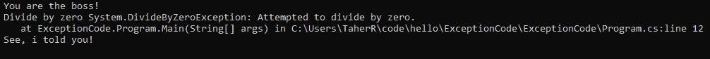
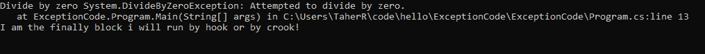
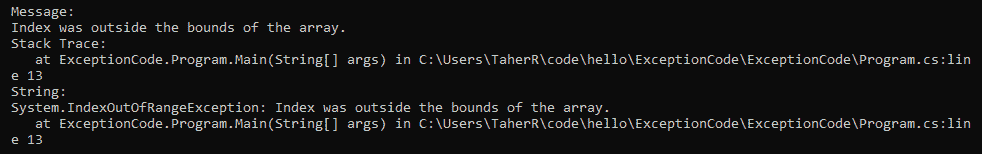
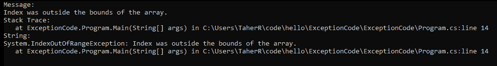

# 异常处理

让我们从两个词开始这一章:异常和处理。在英语中 **exception** 这个词指的是通常不会发生的不寻常的事情。在编程中，异常一词有类似的含义，但与软件代码有关。就其本质而言，计算机程序应该只做我们指示它们做的那些事情，当计算机不会或不能遵循我们的指示时，就被认为是不正常的。如果计算机程序没有遵循我们的指令，它在软件世界中被归类为例外。

**错误**是编程中大量使用的另一个词。理解错误和异常不是一回事对我们来说很重要。错误是指软件甚至无法运行的事件。更具体地说，错误意味着编写的代码包含错误，这就是编译器无法编译/构建代码的原因。另一方面，异常是运行时发生的事情。区分这两个概念最简单的方法是——如果代码没有编译/构建，那么代码中就有错误。如果代码编译/构建，但是当您运行它时，您得到一些不寻常的行为，那么它是一个例外。

**异常处理**是指处理/控制/监督我们运行程序时发生的异常。我们将在本章中探讨的主题如下:

*   为什么我们在编程中需要异常处理
*   C# 编程中的异常处理
*   异常处理的基础
*   `try`和`catch`
*   如果不处理异常会发生什么
*   多个`catch`块
*   `throw`关键字是用来做什么的

*   `finally`街区做什么
*   异常类
*   一些常见的异常类
*   异常处理最佳实践

# 为什么我们在编程中需要异常处理

假设您已经编写了一些代码。代码应该按照你的指示去做，对吗？但是由于某种原因，软件无法执行您给出的命令。可能是软件面临一些问题，导致无法运行。

例如，假设您已经指示软件读取文件、收集数据并将其存储在数据库中。但是，软件无法在文件应该在的位置找到该文件。文件在那里找不到的原因可能有很多:文件可能已被某人删除或已被移动到另一个位置。现在，你的软件会做什么？自动处理这种情况还不够聪明。如果软件不清楚自己的工作，就会抛出异常。作为软件开发人员，我们有责任告诉软件在这种情况下应该做什么。

软件会让我们知道它卡住了，无法通过传递消息来解决这种情况。但是它应该对我们说什么呢？*“救命！救命啊！”*不会是一个合适的消息，这种消息也不会让开发者的生活变得更轻松。我们需要更多关于情况的信息，以便我们可以引导计算机相应地工作。因此.NET 框架创建了一些在编程中经常出现的非常常见的异常。如果软件面临的问题有一个预定义的异常，它会抛出这个异常。例如，假设有一个程序试图将一个数除以零。从数学上讲，这是不可能的，但是计算机必须这么做，因为你已经指示它这么做了。现在电脑麻烦大了；很迷茫很无助。它试图按照您的指示将数字除以零，但编译器会停止它并说*“请求帮助，程序先生！”*，意思是，*“T**hrow a*`DivideByZeroException`*向你的主人求助”。*然后程序会抛出一个`DivideByZeroException`，并期望程序员编写一些代码来处理它。这就是我们如何知道我们需要在程序中处理哪些异常。这就是为什么我们在编程中需要异常。

# C# 编程中的异常处理

那个.NET 框架和 C# 编程语言开发了一些处理异常的强大方法。`System.Exceptions`是中的一个班.NET，它有一些功能可以帮助您管理运行时发生的异常，并防止程序崩溃。如果你在代码中没有正确处理异常，你的软件就会崩溃。这就是为什么异常处理在软件开发中非常重要。

现在，您可能想知道如何处理代码中的异常。例外是意想不到的事情。你怎么知道哪个异常会在你的代码中出现并导致程序崩溃？这是一个非常好的问题，我相信这个问题也是在语言开发人员设计语言时被问到的。这就是为什么他们想出了一个解决方案.NET 创建了一个非常漂亮的机制来处理异常。

# 异常处理的基础

C# 中的异常处理主要通过四个关键词来实现:`try`、`catch`、`throw`、`finally`。稍后，我们将详细讨论这些关键词。但是，为了让您对这些关键词的含义有一个基本的了解，让我们简单讨论一下它们:

*   `try`:当你不确定一段代码的预期行为或者是否有异常的可能时，你应该把这段代码放在`try`块中。`try`块将抛出一个异常，如果任何异常发生在该块的代码中。如果没有异常发生，`try`块将像正常代码块一样工作。`try`块实际上是为了抛出异常而设计的，这是它的主要任务。
*   `catch`:捕捉到异常时执行`catch`块。由`try`块引发的异常将由下面的`catch`块处理。一个`try`区块可能有多个`catch`区块。每个`catch`块可以专用于一个特定的异常。因此，我们应该为不同类型的异常编写不同的`catch`块。
*   `throw`:手动想抛出异常时使用。可能会有这样的情况，你想这样做来控制一种特定的情况。
*   `finally`:这是一段将被强制执行的代码。`try`块是否抛出异常并不重要——将执行`finally`块。这主要用于编码一些在任何情况下都必须处理的任务。

# 试着抓住

`try`和`catch`关键词是 C# 中异常处理最重要的两个关键词。如果你写了一个没有`catch`块的`try`块，那就没有任何意义了，因为如果一个`try`块抛出了一个异常，没有`catch`块来处理，那有什么好处呢？异常仍将无法处理。`catch`块实际上依赖于一个`try`块。如果没有`try`块与之关联，则`catch`块不能存在。让我们看看如何编写一个`try` - `catch`块:

```cs
try 
{
  int a = 5 / 0; 
} 
catch(DivideByZeroException ex)
{
  Console.WriteLine(“You have divided by zero”);
}
```

对于一个`try`区块，我们还可以有更多的`catch`区块。让我们看一个例子:

```cs
try 
{
  int a = 5 / 0; 
} 
catch(DivideByZeroException ex)
{ 
  Console.WriteLine(“You have divided by zero”); 
} 
catch(Exception ex) 
{ 
  Console.WriteLine(“Normal exception”); 
}
```

# 如果不处理异常会怎么样？

例外真的重要吗？当你在逻辑中有大量的复杂性时，花时间处理它们值得吗？是的，它们超级重要。让我们探索一下如果不处理异常会发生什么。当一个异常被触发时，如果没有代码处理它，那么该异常将进入系统运行时。

此外，当系统运行时面临异常时，它只是终止程序。所以，现在你明白为什么你应该处理异常了。如果您没有做到这一点，您的应用可能会在运行过程中崩溃。我确信你个人不喜欢在使用时崩溃的程序，所以我们在编写无异常软件时必须小心。让我们看一个例子，如果不处理异常，系统运行时会发生什么:

```cs
Using system;

class LearnException {
    public static void Main()
    {
        int[] a = {1,2,3,4};
        for (int i=0; i<10; i++)
        {
            Console.WriteLine(a[i]);
        }
    }
}
```

如果我们运行这段代码，那么它运行的前四次，它将完美地运行，并打印一些从 1 到 4 的数字。但之后会抛出`IndexOutOfRangeException`的异常，系统运行时会终止程序。

# 多个捕捉块

在一个`try`块中得到不同类型的异常是正常的。但是你怎么处理呢？您不应该使用一般的异常来执行此操作。如果抛出一般异常而不是特定异常，您可能会错过一些关于异常的重要信息。为此，C# 语言为一个`try`块引入了多个`catch`块。您可以为一种类型的异常指定一个将被调用的`catch`块，并且您可以逐个创建具有不同异常类型的其他`catch`块。当一个特定的异常被抛出时，只有那个特定的`catch`块才会被执行，如果它有一个专用于那种异常的`catch`块的话。让我们看一个例子:

```cs
using System;

class ManyCatchBlocks 
{     
    public static void Main()
    {
        try
        {
            var a = 5;
            var b = 0;
            Console.WriteLine("Here we will divide 5 by 0");
            var c = a/b;
        }
        catch(IndexOutOfRangeException ex)
        {
            Console.WriteLine("Index is out of range " + ex);
        }
        catch(DivideByZeroException ex)
        {
            Console.WriteLine("You have divided by zero, which is not correct!");
        }
    }
}
```

如果你运行前面的代码，你会看到只有第二个`catch`块被执行。如果您打开控制台窗口，您将看到以下行已经打印出来:

```cs
You have divided by zero, which is not correct!
```

因此，我们可以看到，如果您有多个`catch`块，那么只有与抛出的异常类型相匹配的特定`catch`块才会被执行。

现在你可能会想，*“你说过我们不应该使用一般的异常处理程序。但是为什么呢？是的，我们可能会错过一些信息，但我的系统没有崩溃！这样不是更好吗？”*其实这个问题的答案并不简单。它可能因系统而异，但让我告诉你为什么你希望系统有时崩溃。假设您有一个处理非常复杂和敏感数据的系统。当这样的系统出现异常时，允许客户使用该软件可能是非常危险的。由于异常处理不当，客户可能会对数据造成严重损坏。但是是的，如果你认为如果你允许用户继续，你的系统会很好，即使他们得到了一个未知的异常，你也可以使用一个通用的`catch`块。现在让我告诉你怎么做。如果您希望`catch`块捕获任何类型的异常，无论异常类型如何，那么您的`catch`块都应该接受`Exception`类作为参数，如下代码所示:

```cs
using System;

namespace ExceptionCode
{
  class Program
  {
    static void Main(string[] args)
    {
      try
      {
        var a = 0;
        var b = 5;
        var c = b / a;
      }
      catch (IndexOutOfRangeException ex)
      {
        Console.WriteLine("Index out of range " + ex);
      }
      catch (Exception ex)
      {
        Console.WriteLine("I will catch you exception! You can't hide from me!" + ex);
      }

      Console.WriteLine("Hello");
      Console.ReadKey();
     }
   }
}
```

或者，您也可以向`catch`块传递一个`no`参数。这也将捕获每一种异常并执行代码体。下面的代码给出了一个例子:

```cs
using System;

namespace ExceptionCode
{
  class Program
  {
    static void Main(string[] args)
    {
      try
      {
        var a = 0;
        var b = 5;
        var c = b / a;
      }
      catch (IndexOutOfRangeException ex)
      {
        Console.WriteLine("Index out of range " + ex);
      }
      catch
      {
        Console.WriteLine("I will catch you exception! You can't hide from me!");
      }

      Console.WriteLine("Hello");
      Console.ReadKey();
     }
   }
}
```

但是，请记住，这必须是最后一个`catch`块，否则，将会出现运行时错误。

# 使用 throw 关键字

有时候，在你自己的程序中，你必须自己创建异常。不，不是为了报复用户，而是为了你的应用。有时候，有些情况下你需要抛出一个异常来绕过一个困难，记录一些东西，或者只是重定向软件的流程。别担心:这样做你不会成为坏人；你实际上是拯救程序免于麻烦的英雄。但是你怎么能创造一个例外呢？为此，C# 有一个名为`throw`的关键词。这个关键字将帮助您创建一个异常类型的实例并抛出它。让我给你看一个`throw`关键词的例子:

```cs
using System;

namespace ExceptionCode
{
 class Program
 {
 public static void Main(string[] args)
 {
 try
 {
 Console.WriteLine("You are the boss!");
 throw new DivideByZeroException();
 }
 catch (IndexOutOfRangeException ex)
 {
 Console.WriteLine("Index out of range " + ex);
 }
 catch (DivideByZeroException ex)
 {
 Console.WriteLine("Divide by zero " + ex);
 }
 catch
 {
 Console.WriteLine("I will catch you exception! You can't hide from me!");
 }

 Console.WriteLine("See, i told you!");
 Console.ReadKey();
 }
 }
}
```

输出如下:



可以看到，如果运行前面的代码，就会得到`DivideByZeroException` `catch`块的执行。

所以，如果你想抛出一个异常(例如，因为你想让上层的`catch`块来处理它)，你只需要抛出一个新的异常实例。这可以是任何类型的异常，包括系统异常或自行创建的异常。请记住，有一个`catch`块可以处理它。

# finally 块做什么？

当我们说“终于”的时候，我们指的是我们一直在等待的东西，或者将要结束这个过程的东西。这在异常处理中几乎是一样的。一个`finally`块是一个无论在`try`或`catch`块中发生什么都将被执行的代码块。不管抛出了什么类型的异常，也不管它们是否被处理，都将执行`finally`块。现在你可能会问，**我们为什么需要这个* `finally` *街区？如果我们的程序有异常，我们会用* `catch` *块处理！我们不能把代码写在* `catch` *块里面而不是* `finally` *块里面吗？”**

 *是的，你可以，但是如果抛出异常但是`catch`块没有被触发会发生什么？这意味着`catch`块中的代码不会被执行。为此，`finally`街区很重要。有没有例外并不重要；`finally`模块将运行。让我给你看一个`finally`街区的例子:

```cs
using System;

namespace ExceptionCode
{
 class Program
 {
 static void Main(string[] args)
 {
 try
 {
 int a = 0;
 int b = 5;
 int c = b / a;
 }
 catch (IndexOutOfRangeException ex)
 {
 Console.WriteLine("Index out of range " + ex);
 }
 catch (DivideByZeroException ex)
 {
 Console.WriteLine("Divide by zero " + ex);
 }
 catch
 {
 Console.WriteLine("I will catch you exception! You can't hide from me!");
 }
 finally
 {
 Console.WriteLine("I am the finally block i will run by hook or by crook!");
 }
 Console.ReadLine();
 }
 }
}
```

输出如下:



`finally`块的一个重要用例可能是当您在`try`块中打开一个数据库连接时！您必须关闭这个，否则，该连接将对程序的其余部分开放，并且会使用大量资源。此外，数据库可以建立的连接数量有限，因此如果您打开一个连接而不关闭它，该连接字符串就会被浪费。最佳做法是在您的工作完成后立即关闭连接。

`finally`区块在这里发挥的作用最好。不管`try`块会发生什么情况，`finally`块会关闭连接，如下代码所示:

```cs
using System;

namespace ExceptionCode
{
  class Program
  {
    static void Main(string[] args)
    {
      try
      {
        // Step 1: Established database connection

        // Step 2: Do some activity in database
      }
      catch (IndexOutOfRangeException ex)
      {
        // Handle IndexOutOfRangeExceptions here
      }
      catch (DivideByZeroException ex)
      {
        // Handle DivideByZeroException here
      }
      catch
      {
        // Handle All other exception here
      }
      finally
      {
        // Close the database connection
      }
    }
  }
}
```

这里，我们在`try`块中执行两个主要任务。首先，我们打开一个数据库连接，其次，我们在数据库中执行一些活动。现在，如果在我们执行这些操作时发生任何异常，将会抛出一个由`catch`块处理的异常。最后，`finally`块将关闭数据库连接。

`finally`块不是处理异常必须要有的东西，但是如果需要的话应该使用它。

# 异常类

一个`exception`只是 C# 中的一个类。这有几个属性和方法。四个最常用的属性如下:

| **属性** | **描述** |
| `Message` | 这包含了异常的内容。
 |
| `StackTrace` | 这包含方法调用堆栈信息。 |
| `TargetSite` | 这给出了一个包含发生异常的方法的对象。 |
| `InnerException` | 这给出了导致异常的异常的实例。 |

Exception class properties and methods

这个类最流行的方法之一是`ToString()`。此方法返回包含异常信息的字符串。当异常以字符串格式表示时，它更容易阅读和理解。

让我们看一个使用这些属性和方法的例子:

```cs
using System;

namespace ExceptionCode
{
 class Program
 {
 static void Main(string[] args)
 {
 try
 {
 var a = 0;
 var b = 5;
 var c = b / a;
 }
 catch (DivideByZeroException ex)
 {
 Console.WriteLine("Message:");
 Console.WriteLine(ex.Message);
 Console.WriteLine("Stack Trace:");
 Console.WriteLine(ex.StackTrace);
 Console.WriteLine("String:");
 Console.WriteLine(ex.ToString());
 }

 Console.ReadKey();
 }
 }
}
```

输出如下:


在这里，我们可以看到异常的`message`属性保存了信息`Attempted to divide by zero`。此外，`ToString()`方法给出了很多关于异常的信息。在程序中处理异常时，这些属性和方法会对您有很大帮助。

# 一些常见的异常类

中有许多可用的异常类.NET 框架。那个.NET Framework 团队创建这些是为了让开发人员的生活更轻松。那个.NET 框架提供了关于异常的具体信息。以下是一些最常见的异常类:

| **异常类** | **描述** |
| `DivideByZeroException` | 当任何数字被零除时，将引发此异常。 |
| `IndexOutOfRangeException` | 当应用试图使用不存在的数组的索引时，会引发此异常。 |
| `InvalidCastException` | 试图执行无效转换时引发此异常。 |
| `NullReferenceException` | 当试图使用或访问空引用类型时，会引发此异常。 |

Different exception classes of .NET framework

让我们看一个使用这些异常类之一的例子。在这个例子中，我们使用了`IndexOutOfRange`异常类:

```cs
using System;

namespace ExceptionCode
{
 class Program
 {
 static void Main(string[] args)
 {
 int[] a = new int[] {1,2,3};

 try
 {
 Console.WriteLine(a[5]);
 }
 catch (IndexOutOfRangeException ex)
 {
 Console.WriteLine("Message:");
 Console.WriteLine(ex.Message);
 Console.WriteLine("Stack Trace:");
 Console.WriteLine(ex.StackTrace);
 Console.WriteLine("String:");
 Console.WriteLine(ex.ToString());
 }

 Console.ReadKey();
 }
 }
}
```

输出如下:



# 用户定义的异常

有时，您会遇到这样的情况:您可能认为预定义的异常不满足您的条件。在这种情况下，您可能希望有一种方法可以创建自己的异常类并使用它们。值得庆幸的是，在 C# 中，实际上有一种机制，您可以创建自己的自定义异常，并且可以编写任何适合这种异常的消息。让我们看一个如何创建和使用自定义异常的示例:

```cs
using System;

namespace ExceptionCode
{

 class HelloException : Exception
 {
 public HelloException() { }
 public HelloException(string message) : base(message) { }
 public HelloException(string message, Exception inner) : base(message, inner) { }
 }

 class Program
 {
 static void Main(string[] args)
 {
 try
 {
 throw new HelloException("Hello is an exception!");
 }
 catch (HelloException ex)
 {
 Console.WriteLine("Exception Message:");
 Console.WriteLine(ex.Message);
 }

 Console.ReadKey();
 }
 }
}
```

输出如下:


因此，我们可以从前面的例子中看到，您只需要创建一个类来扩展`Exception`类。这个类应该有三个构造函数:一个不应该接受任何参数，一个应该接受一个字符串并将其传递给基类，一个应该接受一个字符串和一个异常并将其传递给基类。

使用自定义异常就像使用.NET 框架。

# 异常过滤器

在编写本文时，异常过滤器功能还不是很老——它是在 C# 6 中引入的。这样做的主要好处是，您可以在一个块中捕获更具体的异常。让我们看一个例子:

```cs
using System;

namespace ExceptionCode
{
 class Program
 {
 static void Main(string[] args)
 {

 int[] a = new int[] {1,2,3};

 try
 {
 Console.WriteLine(a[5]);
 }
 catch (IndexOutOfRangeException ex) when (ex.Message == "Test Message")
 {
 Console.WriteLine("Message:");
 Console.WriteLine("Test Message");
 }
 catch (IndexOutOfRangeException ex) when (ex.Message == "Index was outside the bounds of the array.")
 {
 Console.WriteLine("Message:");
 Console.WriteLine(ex.Message);
 Console.WriteLine("Stack Trace:");
 Console.WriteLine(ex.StackTrace);
 Console.WriteLine("String:");
 Console.WriteLine(ex.ToString());
 }

 Console.ReadKey();
 }
 }
}
```

输出如下:



要过滤掉异常，您必须使用`catch`声明行旁边的`when`关键字。所以首先，当抛出任何异常时，它会检查这是什么类型的异常，然后检查在`when`关键字后提供的条件。在我们的例子中，异常类型是`IndexOutOfRangeException`，条件是`ex.Message == "Index was outside the bounds of the array."`。我们可以看到，当代码运行时，只有那个特定的`catch`块被执行，它满足了所有的条件。

# 异常处理最佳实践

可以看到，处理异常有不同的方式:有时可以抛出异常，有时可以使用`finally`块，有时可以使用多个`catch`块。因此，如果您没有足够的异常处理经验，一开始就有可能会感到困惑。但是感谢 C# 社区，有一些异常处理的最佳实践。让我们来看看其中的一些:

*   使用`finally`块来关闭/清理将来可能导致问题的相关资源。
*   捕捉特定的异常并正确处理。如果需要，使用多个`catch`块。
*   如果需要，创建您自己的例外并使用它们。
*   尽快处理异常。
*   如果可以使用特定的处理程序处理异常，就不要使用通用的异常处理程序。
*   异常消息应该非常清楚。

# 摘要

我们都梦想有一个完美的世界，没有错误或意外情况，但在现实中，这是不可能的。软件开发也不是没有错误和异常。软件开发人员不希望他们的软件崩溃，但意外的异常时有发生。因此，处理这些异常对于开发优秀的软件是必要的。在这一章中，我们熟悉了软件开发中的异常情况。我们还学习了如何处理异常、为什么需要处理异常、如何创建自定义异常以及许多其他重要主题。在应用中实现异常处理时，请尝试遵循最佳实践，以便获得平稳运行的应用。*