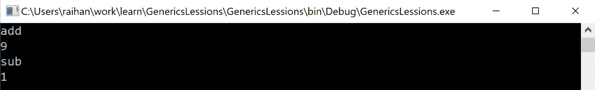
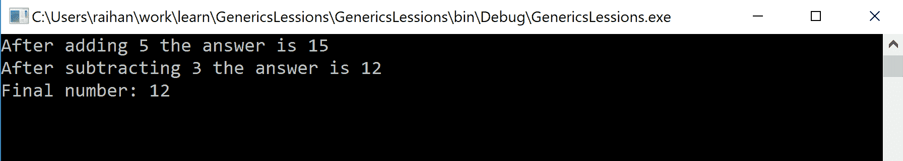
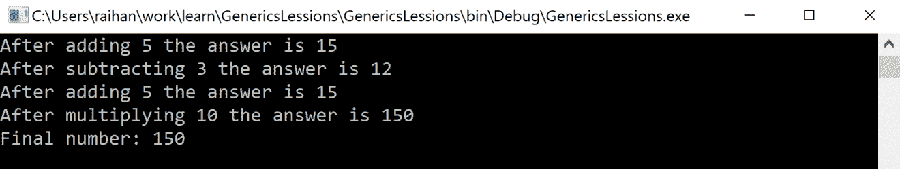
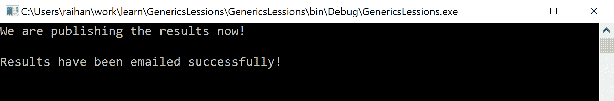
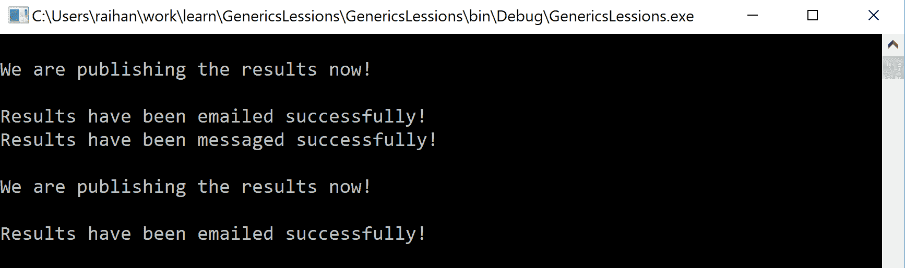

# 事件和代表

事件和委托看起来像是复杂的编程主题，但实际上，它们不是。在本章中，我们将首先通过分析这些概念各自名称的含义来了解它们。然后我们将把这些词的一般含义与编程联系起来。我们将在本章中查看大量示例代码，这将有助于我们轻松理解概念。在深入研究之前，让我们先来看看本章将涉及的主题:

*   如何创建和使用委托
*   方法组转换
*   用两台调频发射机播送一个立体声节目
*   协方差和逆方差
*   事件和多播事件
*   .NET 事件指南

# 什么是代表？

一个**代表**是一个代理人，一个替代者，或者其他人的代表。例如，我们可能在报纸上看到，一位来自另一个国家的代表要来我国会见一位高级官员。这个人是代表，因为他们来我们国家代表他们自己的国家。他们可以是总统、总理或该国任何其他高级官员的代表。让我们想象代表代表一个国家的总统。也许总统由于某种原因不能亲自出席这次会议，这就是为什么代表他们派了一名代表。这位代表将做总统在旅行中应该做的工作，并代表总统做出决定。委托人不是固定的个人；可能是总统选择的任何合格的人。

在软件开发中，委托的概念是相似的。我们可以有这样一种功能，其中一个方法不做它被要求做的实际工作，而是调用另一个方法来执行这项工作。此外，在编程中，不做实际工作，而是将其传递给另一个方法的方法称为**委托**。因此，委托实际上会保存一个方法的引用。当调用委托时，引用的方法将被实际调用和执行。

现在，你可能会问，*“如果一个委托要调用另一个方法，我为什么要调用它？我为什么不直接调用方法呢？”*我们这样做是因为如果直接调用方法，会因为代码耦合而失去灵活性。您正在对代码中的方法名进行硬编码，以便每当该代码行运行时，该方法都会被执行。但是，通过委托，您可以决定在运行时而不是编译时调用哪个方法。

# 如何创建和使用委托

要创建委托，我们需要使用`delegate`关键字。让我向您展示如何以一般形式声明委托:

```cs
delegate returnType delegateName(parameters)
```

现在让我向您展示一些真实的示例代码:

```cs
using System;

namespace Delegate1
{
  delegate int MathFunc(int a, int b);

  class Program
  {
    static void Main(string[] args)
    {
      MathFunc mf = new MathFunc(add);

      Console.WriteLine("add");
      Console.WriteLine(mf(4, 5));

      mf = new MathFunc(sub);

      Console.WriteLine("sub");
      Console.WriteLine(mf(4, 5));

      Console.ReadKey();
    }

    public static int add(int a, int b)
    {
      return a + b;
    }

    public static int sub(int a, int b)
    {
      return (a > b) ? (a - b) : (b - a);
    }
  }
}
```

前面代码的输出如下:



现在让我们讨论前面的代码。在名称空间的最顶端，我们可以看到委托的声明，如下面的代码所示:

```cs
delegate int MathFunc(int a, int b);
```

我们使用`delegate`关键字让编译器知道我们正在声明一个`delegate`。然后我们将返回类型设置为`int`，并将委托命名为`MathFunc`。我们还在该委托中传递了两个`int`类型参数。

之后`program`类开始，在那个类中，除了主方法之外，我们还有两个方法。一个是`add`，一个是`sub`。如果您密切关注这些方法，您会发现它们与委托具有相同的签名。这是故意的，因为当一个方法与`delegate`具有相同的签名时，该方法可以使用`delegate`。

现在，如果我们看看主方法，我们会发现以下有趣的代码:

```cs
MathFunc mf = new MathFunc(add);
```

在主方法的第一行，我们创建委托的对象。在这样做的同时，我们在构造函数中传递`add`方法。这是必需的，因为您需要传递一个要使用委托的方法。然后我们可以看到，当我们调用委托`mf(4,5)`时，它返回`9`。这意味着它实际上是在调用`add`方法。之后，我们将`sub`分配给`delegate`。一调用`mf(4,5)`，这次我们得到`1`。这意味着调用了`sub`方法。这样，一个`delegate`可以用于许多具有相同签名的方法。

# 方法组转换

在最后一个示例中，我们看到了如何创建委托的对象并在构造函数中传递方法名。现在我们来看看实现同样目标的另一种方式，但方式更简单。这叫**法团转换**。这里不需要初始化`delegate`对象，可以直接给它赋值方法。让我给你看一个例子:

```cs
using System;

namespace Delegate1
{
 delegate int MathFunc(int a, int b);

 class Program
 {
 static void Main(string[] args)
 {
 MathFunc mf = add;

 Console.WriteLine("add");
 Console.WriteLine(mf(4, 5));

 mf = sub;

 Console.WriteLine("sub");
 Console.WriteLine(mf(4, 5));
 Console.ReadKey();
 }

 public static int add(int a, int b)
 {
 return a + b;
 }

 public static int sub(int a, int b)
 {
 return (a > b) ? (a - b) : (b - a);
 }
 }
}
```

在这里，我们可以看到，我们没有在构造函数中传递方法名，而是直接将方法赋给它。这是在 C# 中分配委托的一种快速方法。

# 使用静态和实例方法作为委托

在前面的例子中，我们在委托中使用了静态方法。但是，您也可以在委托中使用实例方法。让我们看一个例子:

```cs
using System;

namespace Delegate1
{
  delegate int MathFunc(int a, int b);

  class Program
  {
    static void Main(string[] args)
    {
      MyMath mc = new MyMath();

      MathFunc mf = mc.add;

      Console.WriteLine("add");
      Console.WriteLine(mf(4, 5));

      mf = mc.sub;

      Console.WriteLine("sub");
      Console.WriteLine(mf(4, 5));

      Console.ReadKey();
    }
  }
  class MyMath
  {
    public int add(int a, int b)
    {
      return a + b;
    }

    public int sub(int a, int b)
    {
      return (a > b) ? (a - b) : (b - a);
    }
  }
}
```

在前面的例子中，我们可以看到我们在`MyMath`类下有实例方法。要在委托中使用这些方法，我们首先必须创建该类的对象，并使用对象实例简单地将方法分配给委托。

# 用两台调频发射机播送一个立体声节目

**组播**是代表们的一大特色。通过多播，您可以为一个委托分配多个方法。当执行该委托时，它将运行一个接一个分配的所有方法。使用`+`或`+=`运算符，可以向委托添加方法。还有一种方法可以从委托中移除添加的方法。为此，您必须使用`-`或`-=`运算符。让我们看一个例子来清楚地理解什么是多播:

```cs
using System;

namespace MyDelegate
{
  delegate void MathFunc(ref int a);

  class Program
  {
    static void Main(string[] args)
    {
      MathFunc mf;
      int number = 10;
      MathFunc myAdd = MyMath.add5;
      MathFunc mySub = MyMath.sub3;

      mf = myAdd;
      mf += mySub;

      mf(ref number);

      Console.WriteLine($"Final number: {number}");

      Console.ReadKey();
    }
  }

  class MyMath
  {
    public static void add5(ref int a)
    {
      a = a + 5;
      Console.WriteLine($"After adding 5 the answer is {a}");
    }

    public static void sub3(ref int a)
    {
      a = a - 3;
      Console.WriteLine($"After subtracting 3 the answer is {a}");
    }
  }
}
```

前面的代码将给出以下输出:



在这里，我们可以看到我们的委托如何一个接一个地执行这两个方法。我们必须记住，它像队列一样工作，所以您添加的第一个方法将是第一个被执行的方法。现在让我们看看如何从委托中移除方法:

```cs
using System;

namespace MyDelegate
{
  delegate void MathFunc(ref int a);

  class Program
  {
    static void Main(string[] args)
    {
      MathFunc mf;
      MathFunc myAdd = MyMath.add5;
      MathFunc mySub = MyMath.sub3;
      MathFunc myMul = MyMath.mul10;

      mf = myAdd;
      mf += mySub;
      int number = 10;

      mf(ref number);

      mf -= mySub;
      mf += myMul;
      number = 10;

      mf(ref number);

      Console.WriteLine($"Final number: {number}");

      Console.ReadKey();
    }
  }

  class MyMath
  {
    public static void add5(ref int a)
    {
      a = a + 5;
      Console.WriteLine($"After adding 5 the answer is {a}");
    }

    public static void sub3(ref int a)
    {
      a = a - 3;
      Console.WriteLine($"After subtracting 3 the answer is {a}");
    }

    public static void mul10(ref int a)
    {
      a = a * 10;
      Console.WriteLine($"After multiplying 10 the answer is {a}");
    }
  }
}
```

前面的代码将给出以下输出:



这里，我们首先向委托添加了两个方法。然后，我们去掉了`sub3`方法，增加了`mul10`方法。在我们执行委托时做了所有这些更改后，我们看到`5`被添加到数字中，然后`10`被乘以数字。没有减法发生。

# 协方差和逆方差

有两个重要的委托特性。到目前为止，我们了解到，通常情况下，要在委托中注册一个方法，该方法必须与委托的签名相匹配。这意味着方法和委托的返回类型和参数必须相同。但是，通过使用协方差和逆变的概念，您实际上可以将方法注册到没有相同返回类型或参数的委托中。当被调用时，委托将能够执行它们。

**协变**是当您将一个方法分配给一个委托时，该委托的返回类型是该委托的返回类型的派生类型。例如，如果类`B`是从类`A`派生的，如果委托返回类`A`，那么可以向返回类`B`的委托注册一个方法。让我们看看下面代码中的示例:

```cs
using System;

namespace EventsAndDelegates
{
 public delegate A DoSomething();

 public class A
 {
 public int value { get; set; }
 }

 public class B : A {}

 public class Program
 {
 public static A WorkA()
 {
 A a = new A();
 a.value = 1;
 return a;
 }

 public static B WorkB()
 {
 B b = new B();
 b.value = 2;
 return b;
 }

 public static void Main(string[] args)
 {
 A someA = new A();

 DoSomething something = WorkB;

 someA = something();

 Console.WriteLine("The value is " + someA.value);

 Console.ReadLine();
 }
 }
}
```

前面代码的输出如下:


另一方面，**contra variation**是当一个方法被传递给一个委托时，该方法的参数与该委托的参数不匹配。这里，我们必须记住，方法的参数类型必须至少是从委托的参数类型中派生出来的。让我们看一个反差的例子:

```cs
using System;

namespace EventsAndDelegates
{
 public delegate int DoSomething(B b);

 public class A
 {
 public int value = 5;
 }

 public class B : A {}

 public class Program
 {
 public static int WorkA(A a)
 {
 Console.WriteLine("Method WorkA called: ");
 return a.value * 5;
 }

 public static int WorkB(B b)
 {
 Console.WriteLine("Method WorkB called: ");
 return b.value * 10;
 }

 public static void Main(string[] args)
 {
 B someB = new B();

 DoSomething something = WorkA;

 int result = something(someB);

 Console.WriteLine("The value is " + result);

 Console.ReadLine();
 }
 }
}
```

前面的代码将给出以下输出:


在这里，我们可以看到委托以类型`B`为参数。然而，当`WorkA`方法在委托中注册为方法时，它没有给出任何错误或警告，即使`WorkA`方法采用的参数是类型`A`。之所以管用，是因为`B`型源自`A`型。

# 事件

您可以将**事件**视为一种在某些情况下执行并通知处理者或代表该事件的方法。例如，当您注册电子邮件简讯时，您会从网站上收到关于发布的最新文章、博客帖子或新闻的电子邮件。这些电子邮件可以是每天的，每周的，每月的，每年的，或者根据你选择的其他特定时间段。这些电子邮件不是由人工发送的，而是由自动系统/软件发送的。这种自动电子邮件发送器可以使用事件来开发。现在，你可能会想，为什么我需要一个事件，我不能用正常的方法给订户发一封电子邮件吗？是的，你可以。但是，假设在不久的将来，您也想引入一个功能，在移动应用上通知您。您必须更改代码并为此添加功能。几天后，如果您想进一步扩展您的系统并向特定用户发送短信，您必须再次更改代码。不仅如此，如果您使用普通方法编写代码，那么您为实现这一点而编写的代码将是非常强耦合的。使用`event`可以解决这类问题。您还可以创建不同的事件处理程序，并将这些事件处理程序分配给一个事件，以便每当该事件被激发时，它将通知所有将执行其工作的注册处理程序。现在让我们看一个例子，让它更清楚一点:

```cs
using System;

namespace EventsAndDelegates
{
  public delegate void GetResult();

  public class ResultPublishEvent
  {
    public event GetResult PublishResult;

    public void PublishResultNow()
    {
      if (PublishResult != null)
      {
        Console.WriteLine("We are publishing the results now!");
        Console.WriteLine("");
        PublishResult();
      }
    }
  }

  public class EmailEventHandler
  {
    public void SendEmail()
    {
      Console.WriteLine("Results have been emailed successfully!");
    }
  }

  public class Program
  {
    public static void Main(string[] args)
    {
      ResultPublishEvent e = new ResultPublishEvent();

      EmailEventHandler email = new EmailEventHandler();

      e.PublishResult += email.SendEmail;
      e.PublishResultNow();

      Console.ReadLine();
    }
  }
}
```

前面代码的输出如下:



在前面的代码中，我们可以看到，当`PublishResultNow()`方法被调用时，它基本上触发了`PublishResult`事件。此外，订阅事件的`SendMail()`方法被执行并在控制台上打印`Results have been emailed successfully!`。

# 多播事件

您可以像在委托中一样在事件中多播。这意味着您可以为一个事件注册多个事件处理程序(已订阅该事件的方法)，并且当事件被激发时，所有这些处理程序都将被逐一执行。要进行多播，您必须使用`+=`符号向事件注册事件处理程序。您也可以使用`-=`运算符从事件中移除事件处理程序。当您应用多播时，注册的第一个事件处理程序将首先执行，然后是第二个，依此类推。通过多播，您可以轻松地扩展或减少应用中的事件处理程序，而无需做太多工作。让我们看一个多播的例子:

```cs
using System;

namespace EventsAndDelegates
{
 public delegate void GetResult();

 public class ResultPublishEvent
 {
 public event GetResult PublishResult;

 public void PublishResultNow()
 {
 if (PublishResult != null)
 {
 Console.WriteLine("");
 Console.WriteLine("We are publishing the results now!");
 Console.WriteLine("");
 PublishResult();
 }
 }
 }

 public class EmailEventHandler
 {
 public void SendEmail()
 {
 Console.WriteLine("Results have been emailed successfully!");
 }
 }

 public class SmsEventHandler
 {
 public void SmsSender()
 {
 Console.WriteLine("Results have been messaged successfully!");
 }
 }

 public class Program
 {
 public static void Main(string[] args)
 {
 ResultPublishEvent e = new ResultPublishEvent();

 EmailEventHandler email = new EmailEventHandler();
 SmsEventHandler sms = new SmsEventHandler();

 e.PublishResult += email.SendEmail;
 e.PublishResult += sms.SmsSender;

 e.PublishResultNow();

 e.PublishResult -= sms.SmsSender;

 e.PublishResultNow();

 Console.ReadLine();
 }
 }
}
```

以下是前面代码的输出:



现在如果我们分析前面的代码，我们可以看到我们已经创建了另一个类，`SmsEventHandler`，并且这个类有一个名为`SmsSender`的方法，它遵循与我们的委托`GetResult`相同的签名，如下面的代码所示:

```cs
public class SmsEventHandler
{
  public void SmsSender()
  {
    Console.WriteLine("Results have been messaged successfully!");
  }
}
```

然后，在主方法中，我们创建这个`SmsEventHandler`类的一个实例，并将`SmsSender`方法注册到事件中，如下面的代码所示:

```cs
e.PublishResult += sms.SmsSender;
```

触发事件一次后，我们使用`-=`操作符从事件中移除`SmsSender`事件处理程序，如下所示:

```cs
e.PublishResult -= sms.SmsSender;
```

当我们再次触发事件时，我们可以在输出中看到只有电子邮件事件处理程序被执行。

# 活动指南来自。网

为了更好的稳定性.NET Framework 为在 C# 中使用事件提供了一些指南。并不是说你一定要遵循这些准则，但是遵循这些准则一定会让你的程序更有效率。现在让我们看看我们需要遵循什么准则。

事件应该采用以下两个参数:

*   对生成事件的对象的引用
*   保存事件处理程序所需的其他重要信息的`EventArgs`类型

守则的一般形式如下:

```cs
void eventHandler(object sender, EventArgs e)
{
}
```

让我们看一个遵循这些准则的例子:

```cs
using System;

namespace EventsAndDelegates
{
  class MyEventArgs : EventArgs
  {
    public int number;
  }

  delegate void MyEventHandler(object sender, MyEventArgs e);

  class MyEvent
  {
    public static int counter = 0;

    public event MyEventHandler SomeEvent;

    public void GetSomeEvent()
    {
      MyEventArgs a = new MyEventArgs();

      if (SomeEvent != null)
      {
        a.number = counter++;
        SomeEvent(this, a);
      }
    }

  }

  class X
  {
    public void Handler(object sender, MyEventArgs e)
    {
      Console.WriteLine("Event number: " + e.number);
      Console.WriteLine("Source Object: " + sender);
      Console.WriteLine();
    }
  }

  public class Program
  {
    public static void Main(string[] args)
    {
      X x = new X();

      MyEvent myEvent = new MyEvent();

      myEvent.SomeEvent += x.Handler;

      myEvent.GetSomeEvent();
      myEvent.GetSomeEvent();

      Console.ReadLine();
    }
  }
}
```

前面代码的输出如下:


如果我们分析前面的代码，我们会看到我们已经使用`EventArgs`参数传递了计数器值，并且使用`object`参数传递了对象的引用。

# 摘要

在本章中，我们了解了代表和事件。这些主题在软件开发中非常重要，因为它们提供了在特定情况下自动化代码的功能。这些概念在 web 开发领域都被大量使用。

在下一章中，我们将研究 C# 中的泛型和集合。这些是 C# 编程语言非常有趣的特性，您可以使用它们在程序中编写泛型委托。