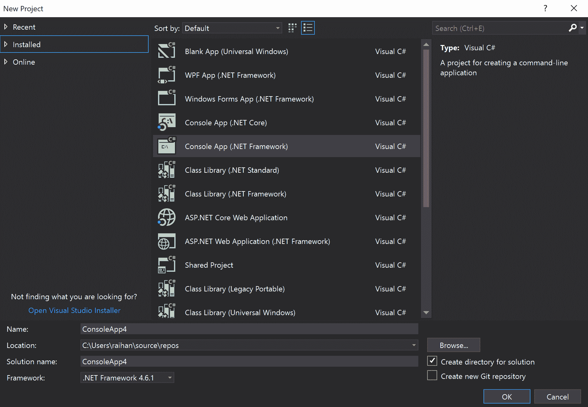
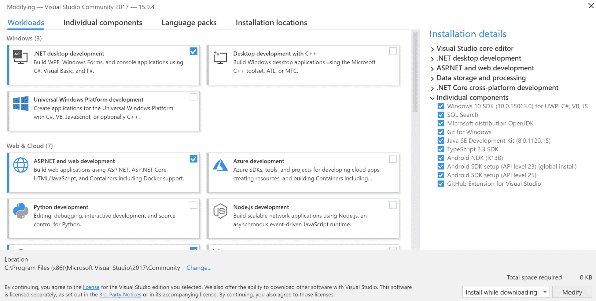
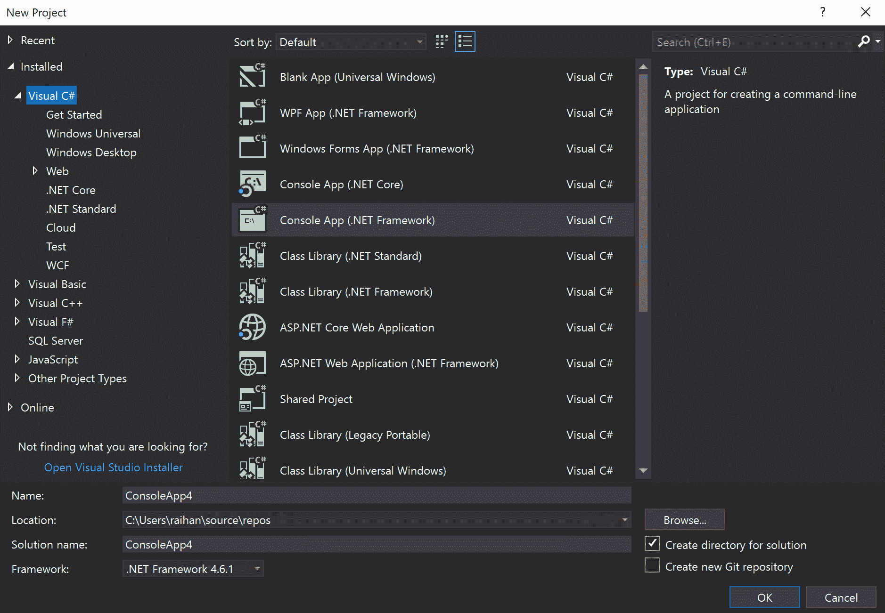
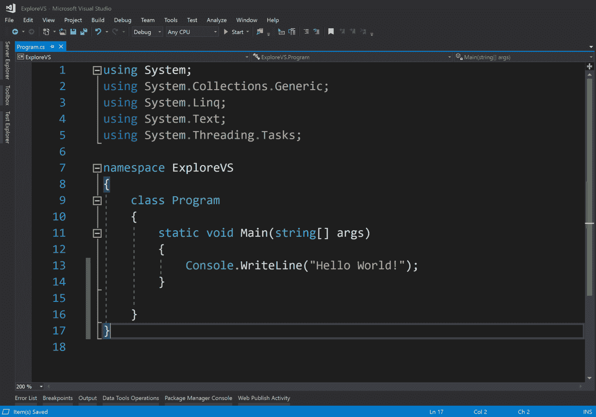
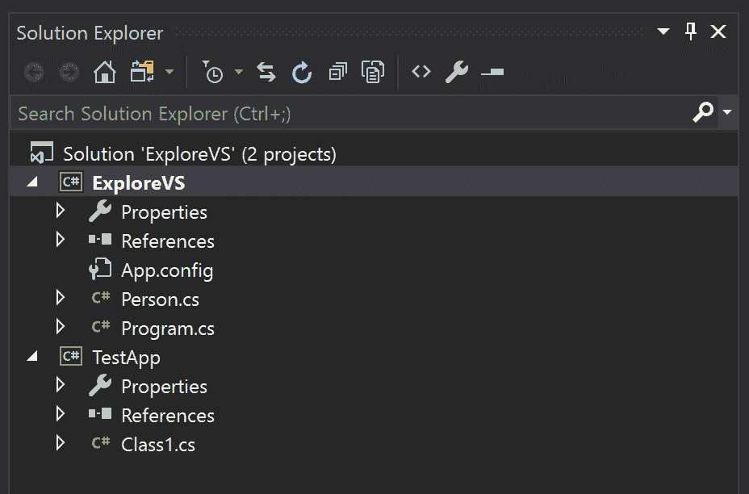
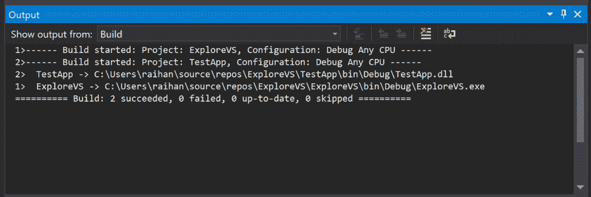
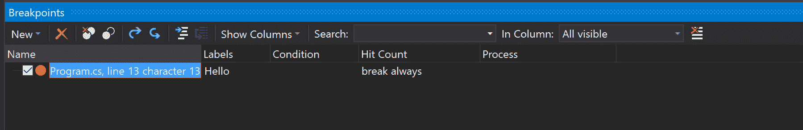
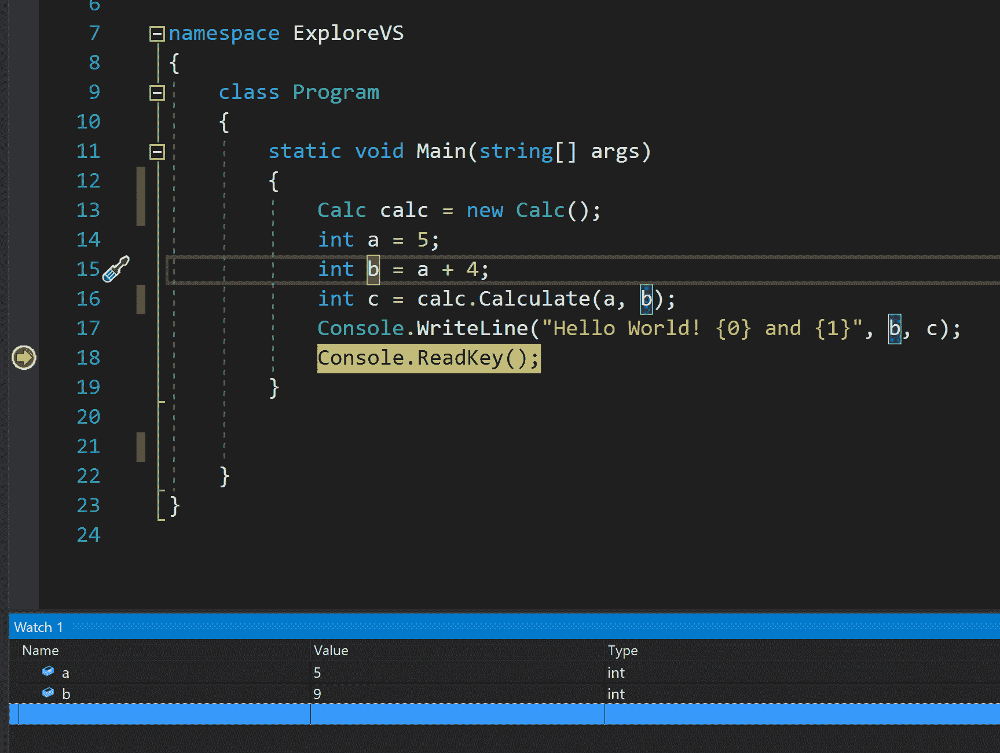
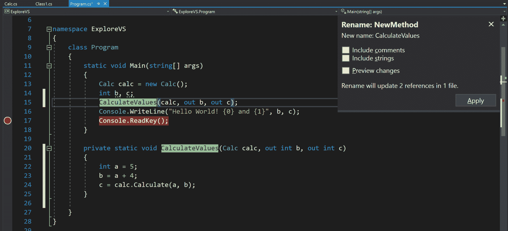

# Visual Studio 和相关工具

Visual Studio 是微软的**集成开发环境** ( **IDE** )。它是计算机软件，也是可以用来编写、调试和执行代码的工具。Visual Studio 是业界最流行的 IDEs 之一，主要用于.NET 应用。因为它来自微软，所以.NET 开发非常容易和顺利。其他编程语言可以使用 Visual Studio，但我不能保证它会是最有用的选项；然而，对于像我这样的 C# 开发人员来说，这是目前最好的 IDE。作为一名开发人员，我大部分时间都在 Visual Studio 中度过。

在写这本书的时候，Visual Studio 的最新版本是 Visual Studio 2017。微软推出了不同版本的 Visual Studio。其中之一，社区版，是免费的。还有另外两个版本:Visual Studio 专业版和 Visual Studio 企业版。专业版和企业版不是免费的，更适合大项目。在本书中，我们将探索社区版的特性，因为它是免费的，并且具有足够的功能来满足本书的目的。

在本章中，我们将了解 Visual Studio 的功能。我们将涵盖以下主题:

*   Visual Studio 项目类型和模板
*   Visual Studio 编辑器和不同的窗口
*   调试窗口
*   断点、调用堆栈跟踪和监视
*   Visual Studio 中的 Git
*   重构和代码优化技术

# Visual Studio 项目类型和模板

Visual Studio 是微软相关技术栈的最佳 IDE。无论您是计划为 Windows 开发桌面应用，还是为 Windows Server 开发网络应用，都可以使用 Visual Studio。使用 Visual Studio 的最大好处是，集成开发环境将帮助您完成许多常见的任务，如果不使用它，您将不得不手动执行这些任务。例如，如果您计划使用 ASP.NET**模型-视图-控制器** ( **MVC** )创建一个 web 应用，Visual Studio 可以为您提供一个 MVC 应用的模板。您可以从模板开始，并根据您的要求进行修改。如果没有这些，您将不得不下载包，创建文件夹，并为应用设置 web 配置。为了充分利用 Visual Studio，您必须了解它附带的不同项目和模板，以便加快开发过程。

让我们看看 Visual Studio 提供的不同项目类型。打开 Visual Studio 后，如果单击“新建项目”，将弹出以下窗口:

在这里，在左侧，我们可以看到项目的主要类别:最近、已安装和在线。在“最近”选项卡中，您可以看到最近使用过的项目类型，因此不必每次都搜索常用的项目类型。在“已安装”选项卡中，您将找到已经安装在您的计算机上的项目类型。安装 Visual Studio 时，您可以选择要安装的工作负载。

安装 Visual Studio 时将出现的“工作负载”窗口如下所示:

您选择的工作负载选项与安装的项目类型直接相关。在“联机”选项卡下，您将找到安装 Visual Studio 时未安装的项目。Visual Studio 有许多可用的项目模板，这就是为什么它们不能一次全部安装的原因。

现在，如果我们展开 Installed 选项卡，我们将看到不同的编程语言显示为子选项卡:Visual C#、Visual Basic、Visual C++，等等。由于本书与 C# 相关，我们将只关注 Visual C# 区域，如下图截图所示:

如果我们展开 Visual C# 选项卡，我们将看到更多与更特定类型的项目相关的选项卡，例如 Windows 桌面、Web、.NETCore、测试等等。但是如果我们关注窗口的中间部分，就会看到不同的项目模板，比如 Windows 窗体 App(.NET 框架)、控制台应用(.NET Core)，控制台应用(.NET 框架)、类库(.NET 标准)、类库(.NET 框架)，ASP.NETCore网络应用，ASP.NET 网络应用(.NET 框架)，等等。在窗口的右侧，我们可以看到您在中间窗格中选择的项目模板的简短描述，如下图所示:

让我们来看看 Visual Studio 2017 中可用的一些最常见的项目模板:

*   **控制台应用:**创建命令行应用的项目。这种项目有两种不同的类型:一种用于.NETCore和另一个.NET 框架。
*   **类库:**如果你正在开发一个类库项目，可以作为另一个项目的扩展代码，你可以使用这个模板。在 Visual Studio 2017 中，您再次获得两个选项:一个用于.NET 标准和另一个.NET 框架。
*   **ASP.NETCore web 应用:**本项目针对使用的 Web 应用.NET Core，独立于平台。您可以使用这种类型的项目创建 MVC、web API 和 SPA 应用。

*   **ASP.NET 网络应用(.NET Framework):** 该项目模板用于使用开发 web 应用.NET 框架。与 ASP.NETCore网络应用模板类似，使用这个项目模板，您可以从 MVC、网络应用编程接口或 SPA 项目中进行选择。
*   **WCF 服务器应用:**您可以使用此项目类型创建**Windows Communication Foundation**(**WCF**)服务。
*   **WPF App(.NET Framework):** 如果您正在创建**Windows Presentation Foundation**(**WPF**)项目，则可以选择此模板。
*   **单元测试项目(.NET 框架):**这是一个单元测试的项目。如果你创建了这个项目，你会得到一个预制的测试类，你可以用它来编写你的单元测试。

有许多其他项目模板可供使用.NET 开发人员。如果您确定应用的目的，最好从项目模板开始，而不是空白模板。

# Visual Studio 编辑器和不同的窗口

Visual Studio 不像一个简单的文本编辑器。它有很多工具和功能，所以它可能有点让人难以招架。然而，要开始，你不需要理解每一个工具和特性:你只需要基础。随着你对它的了解越来越多，你可以充分利用它的能力，让你的生活更轻松，让你更有效率。在本章的后面，我们还将学习一些非常有用的键盘快捷键。我们将首先看一下基础知识。

# 编辑器窗口

在 Visual Studio 中创建或打开项目后，除非您有不同的环境设置，否则您将看到类似于下面屏幕截图所示的屏幕。在左侧，显示代码的窗口称为**编辑器窗口**。这是您编写代码的窗口。这个编辑器窗口非常聪明；当文件在左上角的编辑器中打开时，它会出现。如果打开多个文件，活动文件将有蓝色背景，非活动文件将为黑色，如下图所示:

行号显示在每个代码行的左侧，代码用不同的颜色表示。蓝色的文字是 C# 中的保留关键字，白色的文字是你的活动可修改代码，绿色的文字代表一个类名，橙色的文字是指字符串文字。Visual Studio 中还有一些其他颜色、下划线标记和符号可以帮助您更好地理解代码。如果您正在阅读这本书的黑白副本，我建议您打开 Visual Studio 并编写代码来检查颜色表示。比如看看下面截图中的`using`语句。除了`System`名称空间，所有其他名称空间的颜色都比较暗淡，这意味着这些名称空间还没有在这个文件中使用。`System`命名空间是亮白色的，因为我们在代码中使用了`Console.WriteLine()`方法，它属于`System`命名空间。您还可以看到，在代码的左边，有一些带有-符号的方框，下面有一条水平线。这显示了代码折叠选项。

您可以轻松地折叠代码，以便更清楚地看到特定的代码:

从左大括号到右大括号的虚线显示了大括号覆盖的区域。因此，即使您没有将左大括号和右大括号放在同一条垂直线中，您也可以看到这些大括号覆盖了哪些行，如下图所示:

编辑器窗口还有一些其他有用的功能，例如**智能感知**和**重构**。当您编写代码时，IntelliSense 会建议其他选项或组件的更多细节，包括代码完成、关于代码的信息、代码的用法和代码要求。例如，如果您正在编写`Console`，它将建议您可能想要编写的不同选项，并且还将告诉您该特定代码做什么以及如何使用它，如下图所示。当了解不同的方法及其使用方法时，这非常有帮助:

Different console methods

重构意味着在不改变代码功能的情况下改进代码。在本章的后面，我们将详细讨论重构。

编辑器窗口中另一个非常有趣的功能是快速操作，它是所选代码行左侧的灯泡。这推荐了 Visual Studio 认为您应该对该特定代码行进行更改的内容。您也可以用它来重构代码。比如我们写`Console`中途停下来看灯泡，会在灯泡底部显示一个红色的叉号，说明这一行代码是无效的，Visual Studio 有一些建议。让我们看看它推荐什么，以及我们是否可以使用它来修复我们的代码。

如果我们点击灯泡，它会显示选项，你可以在下面的截图中看到。从那里，将“控制台”更改为“控制台”是我们想要执行的选项。如果我们单击它，Visual Studio 将为您修复代码:

让我们看看如何用快速动作重构我们的代码。如果我们试图创建一个在代码库中不存在的类的对象，它会显示一个带有红色十字的灯泡。如果您查看这些选项，您会看到 Visual Studio 正在询问是否应该为您创建一个类，如下图所示:

编辑器窗口中还有许多其他功能，可以让您作为开发人员的生活更加高效。我建议您多尝试这些，并阅读更多文档以了解更多信息。

# 解决方案浏览器

如果您查看 Visual Studio 的右侧，您将看到一个名为“解决方案资源管理器”的窗口。这是 Visual Studio 中非常重要的一个窗口；它显示您正在处理的解决方案中的文件和文件夹。在 Visual Studio 中，我们有像不同项目的包装器一样的解决方案。这个术语可能有点混乱，因为我们通常会用*项目*这个词来标识一件特定的作品。在 Visual Studio 中，解决方案是作为包装器创建的，项目是在解决方案中创建的。一个解决方案可以包含多个项目。这种细分有助于实现模块化应用。在此解决方案资源管理器窗口中，您可以看到哪些项目在解决方案中，哪些文件在项目中。

您可以展开或最小化项目和文件夹以获得更好的视图，如下图所示:

在前面的截图中，您可以看到我们有一个名为 ExploreVS 的解决方案，在这个解决方案中，我们有一个名为 ExploreVS 的项目。项目和解决方案的名称在这里是相同的，因为当我们创建解决方案时，我们选择使用相同的名称。如果需要，解决方案和项目可以有不同的名称。

在“解决方案资源管理器”窗口中，您可以右键单击该解决方案并轻松添加另一个项目。如果要向项目中添加文件或文件夹，可以右键单击并添加。在下面的截图中，您可以看到我们已经向解决方案中添加了另一个名为 TestApp 的项目，以及 ExploreVS 项目中名为 Person 的类。您还可以在解决方案名称旁边看到解决方案包含的项目数量。除了隐藏在顶部图标后面的一些其他功能之外，解决方案资源管理器中还有一个搜索选项，可以在大型解决方案中轻松搜索文件。圆形箭头刷新解决方案资源管理器。接下来，堆叠的框折叠项目以获得解决方案的高级视图。之后，带有三个文档的图标显示了解决方案资源管理器中的所有文档。这是必要的，因为并非每个文件都始终可供查看，因为 Visual Studio 为我们提供了从解决方案中排除文件的选项。这不会从文件系统中删除文件，而只是在解决方案中忽略它。然后，在那个图标旁边，我们有一个视图代码图标，它将在代码编辑器中打开代码。我们还有属性图标，它将显示文件或项目的属性。

在左侧，我们有主页图标，它会将您带到主页面板。除此之外，我们还有解决方案和文件夹切换器。如果单击该按钮，您将看到文件系统的文件夹，而不是解决方案，如下图所示:

# 输出窗

输出窗口对于开发人员来说是一个非常重要的窗口，因为您的构建和调试的所有日志和输出都可以在这里查看。如果您构建的应用失败，您可以使用“输出”窗口找出问题所在并解决问题。如果您的构建成功运行，您将在“输出”窗口中获得一条消息，表明构建成功，如下图所示:

您可以在此窗口中查看不同类型的日志，如版本控制日志。要更改选项，请转到从文本显示输出旁边的下拉菜单，并查看特定输出的日志。您可以通过单击带有水平线和红十字的图标来清除日志，并使用下一个图标切换换行功能。

# 调试窗口

调试是软件开发中非常重要的一部分。当您编写一些代码时，您的代码很有可能不会第一次构建。即使它真的建立了，你也可能得不到预期的结果。这就是调试派上用场的地方。如果您正在使用文本编辑器，调试一些代码可能会相当困难，因为普通的文本编辑器不会给您任何调试工具，因此您可能不得不使用控制台。然而，Visual Studio 为调试提供了一些优秀的工具和功能，这可以让您提高工作效率。要找到这些，请从 Visual Studio 菜单栏转到调试菜单，然后单击窗口，如下图所示:

从这个列表中，我们可以看到不同的窗口如下:

*   断点
*   异常设置
*   输出
*   显示诊断工具
*   马上
*   Python 调试交互

# 断点窗口

“断点”窗口列出了您在代码库中设置的断点。它显示了关于标签、条件、过滤器、文件名、函数名和代码库中一些其他属性的信息，如下面的屏幕截图所示:

如果您不知道断点的标签、条件和操作，让我们在下面的列表中简单地看一下它们:

*   标签:您可以命名一个断点，或者给断点一个标签，以便于识别其用途。您可以右键单击断点并选择“编辑标签”来添加标签或从以前的标签中进行选择，如下图所示:

*   条件:您可以在断点上设置条件。这意味着只有当这些条件成立时，断点才会停止。要向断点添加条件，请右键单击断点，然后单击条件，如下图所示:

*   操作:与条件一样，您可以向断点添加操作。操作的一个例子可以是在日志系统或控制台中写入。

“断点”窗口还有一些其他功能。您可以删除解决方案的所有断点、禁用或启用断点、导入或导出断点、转到断点的代码位置或搜索断点。

# 异常设置

“例外设置”窗口显示可用的不同例外。如果您打开窗口，您将看到例外列表和每个项目旁边的复选框。如果希望调试器在 Visual Studio 中中断该异常，可以选中复选框，如以下代码所示:

# 输出

我们已经在前一节讨论了输出窗口。您可以在“输出”窗口中输出不同的值，以检查它们是否正确。您可以在“输出”窗口中阅读有关异常的信息，以了解有关异常的更多信息，如下图所示:

# 诊断工具

“诊断工具”窗口将向您显示应用的性能。您可以检查它使用了多少内存和 CPU，以及一些其他与性能相关的数字，如下图所示:

# 即时窗口

“立即”窗口帮助您在运行应用时调试变量值、方法和其他代码短语。您可以在运行程序的某个点手动检查不同变量的值。您可以通过在此窗口中执行方法来检查它正在返回什么。在下面的截图中，你可以看到我们已经为一个名为`x`的`int`变量设置了一个值`1`。然后，我们执行一个名为`Add(x,5)`的方法，返回两个数的和。这里我们通过`x`和`5`作为参数，得到`6`作为回报:

# Python 调试器窗口

使用 Python 调试器窗口，您可以在 Visual Studio 中正在处理的应用上运行 Python 脚本。因为这本书与 Python 编程语言无关，所以我们不会更详细地讨论这个窗口。

# 断点、调用堆栈跟踪和监视

在前一节中，我们查看了用于在 Visual Studio 中调试的窗口。我们现在将详细了解一些很酷的特性——断点、调用堆栈跟踪和监视。

# 断点

一个**断点**不是 C# 编程语言的特性——它是 Visual Studio 附带的调试器的特性。断点是代码中您希望暂停调试器以检查代码的位置。在 Visual Studio 中，断点可以在代码编辑器窗口的左侧窗格中找到。要添加断点，单击适当的代码行，会出现一个代表断点的红色球。您也可以使用 *F9* 键(或功能 9 键)作为切换断点的键盘快捷键。

下面的屏幕截图显示了在 Visual Studio 中断点的样子:

放置断点后，调试器将在该位置暂停，并为您提供查看数据的选项。当调试器在断点处暂停时，您可以选择“单步执行”、“单步执行”或“单步退出”来导航代码，如顶部栏中的箭头所示。在圆圈中，您将看到一个箭头，指示调试器现在指向的位置，如下图所示:

断点的主要目的是检查数据，并查看特定代码段在运行时的反应。Visual Studio 提供了一种使用断点调试代码的非常简单的方法。

# 调用堆栈跟踪

调用堆栈是调试应用时非常有用的窗口。它向您展示了应用的流程，并告诉您调用了哪些方法来达到某个点。例如，如果您有一个方法可以被两个不同的源调用，那么，通过查看调用堆栈，您可以很容易地识别哪个源调用了该方法，并对程序流有更好的了解。

# 观察窗口

“监视”窗口是 Visual Studio 中另一个非常有用的调试功能。在您的代码库中，您可能会面临需要检查特定变量值的情况。每次悬停检查值都很耗时。相反，您可以将这些变量添加到监视列表中，并在 Visual Studio 中保持“监视”窗口打开，以查看此时这些变量的值。

在下面的截图中，您可以看到如何使用“监视”窗口来监视变量值:

# Visual Studio 中的 Git

版本控制现在是软件开发的一个重要部分。不管项目有多大或多小，版本控制是每个软件应用的必备。有许多可用的版本控制系统，但 Git 是最受欢迎的。对于远程存储库，您可以使用微软团队基础服务器、微软 Azure、GitHub 或任何其他远程存储库。由于 GitHub 也是最受欢迎的远程存储库，我们将在本节中了解如何将其与 Visual Studio 集成。

目前，默认情况下，Visual Studio 不具备与 GitHub 连接的功能，因此您必须使用扩展。要获取扩展，请转到工具|扩展和更新。然后，在“在线”类别中，搜索 GitHub。您将看到一个名为 Visual Studio Github Extension 的扩展，如下图所示。安装扩展并重新启动 Visual Studio:

现在，如果您打开团队资源管理器窗口，您可以看到 GitHub 的一个部分。输入您的 GitHub 凭据并连接，如下图所示。连接确认后，您将被设置为通过 Visual Studio 与 GitHub 通信:

您可以从 Visual Studio 创建或克隆存储库，并继续提交您的代码，然后将其推送到 GitHub 中的远程存储库。您也可以在 Visual Studio 中执行所有主要的 Git 任务。您可以创建分支、推送和拉取代码，以及发送拉取请求。

下面的屏幕截图显示了 Visual Studio 团队资源管理器窗口中的 Git 面板:

能够在不使用任何外部软件的情况下使用集成开发环境来处理版本控制确实很有用。您也不需要使用命令行界面进行版本控制。

# 重构和代码优化技术

如果你不了解重构的概念，我建议你进行一些进一步的研究；这是一个非常有趣的话题，对于高质量的软件开发至关重要。基本上，重构是指为了代码改进而修改现有代码的过程，而不改变其功能。

Visual Studio 为重构提供了一些优秀的特性和工具。我们将在下面的部分中研究其中的一些。

# 重新命名

您可以使用 Visual Studio 的重命名功能来更改方法、字段、属性、类或任何其他内容的名称，如下图所示。为此，高亮显示实体并按下 *Ctrl + R* 两次。或者，转到编辑|重构|重命名。当您以这种方式更改名称时，无论在哪里使用，它都会被更新。这个简单的重构步骤允许您随时更改某些东西的名称:

# 更改方法签名

假设您的解决方案中有一个在许多地方使用的方法。现在，如果您更改该方法的参数，您的代码将会中断，直到您在使用该方法的任何地方修复它。手动执行此操作非常耗时，并且可能会产生错误。Visual Studio 提供了一个重构功能，可以在代码中使用方法签名的任何地方重构方法签名，如下图所示。

如果要更改方法中的参数顺序，可以使用 *Ctrl + R* 和 *Ctrl + O* 或者从菜单中单击编辑|重构|重新排列参数。要从方法中移除参数，可以使用 *Ctrl + R* 和 *Ctrl + V* 或单击编辑|重构|移除参数:

总是建议您使用 Visual Studio 重构工具，而不是手动重构。

# 封装字段

您可以使用 Visual Studio 重构工具将字段转换为属性，而不是手动进行。突出显示该字段，然后按 *Ctrl + R* 和 *Ctrl + E* ，或者转到编辑|重构|封装字段。

这将改变代码中使用该变量的所有地方，如下图所示:

# 提取方法

如果您看到一段代码，并且您认为它应该在一个方法中，您可以使用“提取方法”重构来提取选定的代码，并为其创建一个新方法，如下图所示。重构工具非常聪明，它还可以识别方法是否应该返回特定的值。为此，选择要提取到某个方法的代码，然后按 *Ctrl + R* 和 *Ctrl + M* ，或者转到编辑|重构|提取方法:

Visual Studio 中还有许多其他重构功能。不可能把它们都涵盖在这里；我建议您查看 Visual Studio 文档以了解更多信息。

# 摘要

Visual Studio 是 C# 开发人员必不可少的工具；正确理解它会提高你的工作效率。在本章中，我们讨论了与 Visual Studio 相关的各种概念，包括它的项目和模板、它的不同编辑器和窗口以及它的调试工具。我们还查看了断点、调用堆栈跟踪和监视窗口，以及如何使用它们来优化调试过程。之后，我们探索了 Git 和 GitHub 与 Visual Studio 的集成。最后，我们讨论了 Visual Studio 中可用的不同重构特性。很难在一本书的一章中涵盖与如此非凡的 IDE 相关的所有概念；我建议你玩它，并进一步探索它，以便学习如何以最好的方式使用它。在下一章中，我们将讨论数据库和 about。