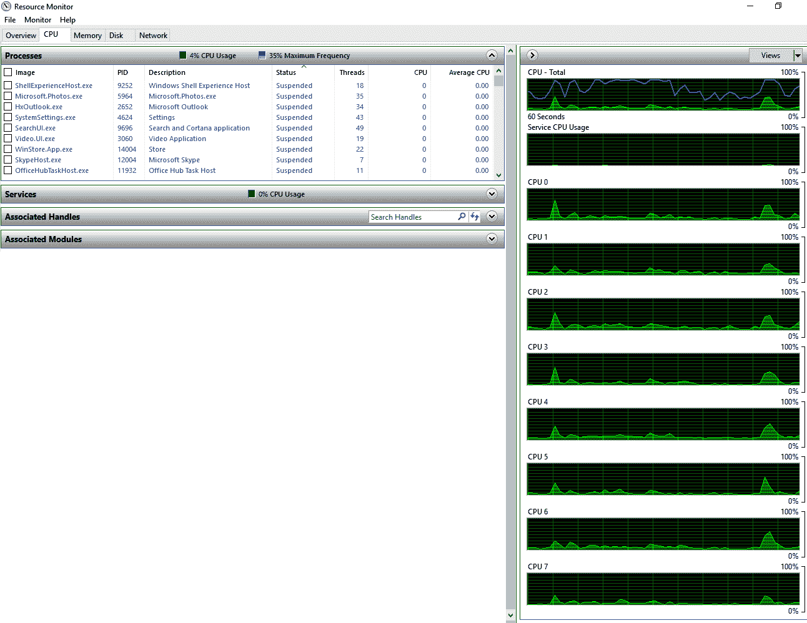
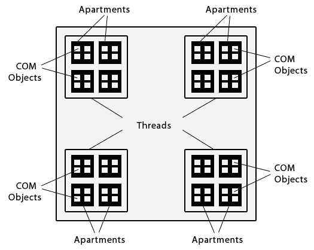
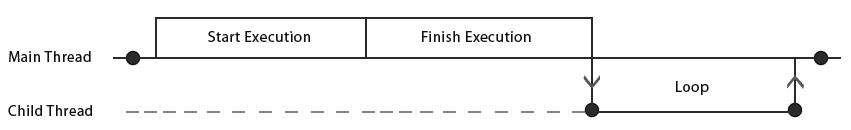
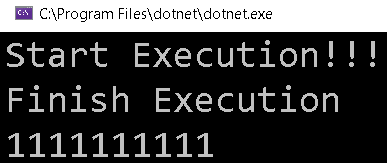

# 并行编程导论

自。net framework 4.0 推出**Task Parallel Library**(**TPL**)以来，。net 就一直支持并行编程，并且自。net framework 4.0 推出**Task Parallel Library**(**TPL**)以来，并行编程已经获得了强大的基础。

多线程是并行编程的一个子集，是编程中最难理解的方面之一; 这是许多新开发人员难以理解的一个问题。 C# 从一开始就有了很大的发展。 它有非常强大的支持，不仅对多线程，而且对异步编程。 C# 中的多线程可以追溯到 C# 1.0 版本。 C# 主要是同步的，但是从 C# 5.0 以后添加了强大的异步支持，它已经成为应用程序员的首选。 多线程只处理如何在进程内并行化，而并行编程也处理进程间通信场景。

在引入 TPL 之前，我们依靠`Thread`、`BackgroundWorker`和`ThreadPool`为我们提供多线程功能。 在 C# v1.0 时代，它依赖于线程来分割工作并释放**用户界面**(**UI**)，从而允许用户开发响应式应用。 这个模型现在被称为经典线程。 随着时间的推移，这个模型被另一个称为 TPL 的编程模型所取代，TPL 依赖于任务，并且仍然在内部使用线程。

在本章中，我们将学习各种概念，这些概念将帮助你学习如何从零开始编写多线程代码。

我们将涵盖以下议题:

*   多核计算的基本概念，首先介绍与**操作系统**(**操作系统**相关的概念和进程。
*   线程以及多线程和多任务处理之间的区别
*   编写并行代码的优点和缺点以及使用并行编程的场景

# 技术要求

本书中展示的所有示例都是在 Visual Studio 2019 中使用 C# 8 创建的。 所有的源代码可以在 GitHub 上的[https://github.com/PacktPublishing/Hands-On-Parallel-Programming-with-C-8-and-.NET-Core-3/tree/master/Chapter01](https://github.com/PacktPublishing/Hands-On-Parallel-Programming-with-C-8-and-.NET-Core-3/tree/master/Chapter01)找到。

# 为多核计算做准备

在本节中，我们将介绍操作系统的核心概念，首先介绍进程，它是线程生存和运行的地方。 然后，我们将考虑多任务是如何随着硬件功能的引入而发展的，硬件功能使并行编程成为可能。 之后，我们将尝试理解用代码创建线程的不同方法。

# 流程

通俗地说，*进程*指的是正在执行的程序。 然而，在操作系统方面，进程是内存中的地址空间。 每个应用，无论是 Windows、web 还是移动应用，都需要运行进程。 进程为程序提供了相对于在同一系统上运行的其他程序的安全性，因此分配给一个程序的数据不会被另一个程序意外访问。 它们还提供隔离，以便程序可以独立于彼此和底层操作系统独立地启动和停止。

# 关于操作系统的更多信息

应用的性能在很大程度上取决于硬件的质量和配置。 这包括以下内容:

*   CPU 速度
*   大量的内存
*   硬盘速度(5400/7200 RPM)
*   硬盘类型:HDD 或 SSD

在过去的几十年里，我们看到了硬件技术的巨大飞跃。 例如，微处理器通常有一个单核，即带有一个**中央处理器**(**CPU**)的芯片。 在世纪之交，我们看到了多核处理器的出现，它是带有两个或更多处理器的芯片，每个处理器都有自己的缓存。

# 多任务处理

多任务处理是指计算机系统在同一时间运行多个进程(应用)的能力。 一个系统可以运行的进程数量与该系统的核心数量成正比。 因此，单核处理器一次只能运行一个任务，双核处理器一次可以运行两个任务，四核处理器一次可以运行四个任务。 如果我们加上 CPU 调度的概念，我们可以看到 CPU 通过基于 CPU 调度算法的调度或切换来同时运行更多的应用。

# 超线程

**超线程**(**HT**)技术是 Intel 开发的一项专利技术，旨在提高 x86 处理器上执行的计算的并行度。 它于 2002 年首次引入到 Xeon 服务器处理器中。 支持 ht 的单处理器芯片使用两个虚拟(逻辑)核心运行，能够一次执行两个任务。 下面的图表显示了单核和多核芯片之间的区别:


下面是一些处理器配置和它们可以执行的任务数量的例子:

*   **带有单核芯片的单个处理器**:一次执行一个任务
*   带有启用 ht 的单核芯片的单个处理器:一次执行两个任务
*   **带有双核芯片的单处理器**:一次执行两个任务
*   **一个带有启用 ht 的双核芯片的单处理器**:一次执行 4 个任务
*   **带有四核芯片的单个处理器**:一次执行 4 个任务
*   **带有 HT-enabled 四核芯片的单个处理器**:一次 8 个任务

下面是启用了 ht 的四核处理器系统的 CPU 资源监视器的屏幕截图。 在右边，你可以看到有 8 个可用的 cpu:



您可能想知道，仅仅通过从单核处理器转移到多核处理器，您能在多大程度上提高计算机的性能。 在撰写本文时,大多数最快的超级计算机是建立在**多个指令,多个数据**(**多指令多数据)的架构,它是计算机体系结构的分类之一迈克尔·j·弗林在 1966 年提出的。**

 **让我们试着去理解这种分类。

# 弗林的分类

Flynn 根据并发指令(或控制)流和数据流的数量将计算机架构分为四类:

*   **Single Instruction, Single Data (SISD)**:**该模型中有单个控制单元和单个指令流。 这些系统一次只能执行一条指令，不需要任何并行处理。 所有单核处理器都基于 SISD 架构。**
***   **Single Instruction, Multiple Data (SIMD)**:**在这个模型中，我们有一个指令流和多个数据流。 同一指令流被并行地应用于多个数据流。 这在投机方法场景中很方便，因为我们有多个算法来处理数据，而我们不知道哪个会更快。 它为所有算法提供相同的输入，并在多个处理器上并行运行它们。*****   **Multiple Instructions, Single Data (MISD)**:**在这个模型中，多个指令操作一个数据流。 因此，可以在同一数据源上并行地应用多个操作。 这通常用于容错和航天飞机飞行控制计算机。*****   **多指令多数据(Multiple Instructions, Multiple Data, MIMD)**:**在这个模型中，顾名思义，我们有多个指令流和多个数据流。 因此，我们可以实现真正的并行性，即每个处理器可以在不同的数据流上运行不同的指令。 如今，这种架构被大多数计算机系统所使用。********

 ******现在我们已经介绍了基本知识，让我们将讨论转移到线程。

# 线程

线程是进程内的执行单元。 为了获得更好的性能，程序在任何时候都可以由一个或多个线程组成。 基于 gui 的 Windows 应用,如遗产**Windows 窗体**(**WinForms)或**Windows Presentation Foundation (WPF**),有一个专门的线程管理 UI 和处理用户操作。 这个线程也被称为 UI 线程，或**前台线程**。 它拥有作为 UI 一部分创建的所有控件。******

 ****# 类型的线程

有两种不同类型的托管线程，即前台线程和后台线程。 它们之间的区别如下:

*   **前台线程:**前台线程对应用的生命周期有直接影响。 应用会一直运行，直到前台线程出现。
*   **后台线程:**这些线程对应用的生命周期没有影响。 当应用退出时，所有的后台线程都被杀死。

一个应用可以由任意数量的前台或后台线程组成。 当处于活动状态时，前台线程保持应用运行; 也就是说，应用的生命周期取决于前台线程。 当最后一个前台线程停止或中止时，应用将完全停止。 当应用退出时，系统停止所有后台线程。

# 公寓的状态

线程需要理解的另一个重要方面是单元状态。 这是线程中**组件对象模型**(**COM**)对象所在的区域。

COM is an object-oriented system for creating binary software that the user can interact with and is distributed and cross-platform. COM has been used to create Microsoft OLE and ActiveX technologies.

您可能知道，所有 Windows 窗体控件都封装在 COM 对象上。 无论何时创建。net WinForms 应用，实际上都是托管 COM 组件。 线程单元是应用进程中创建 COM 对象的一个独特区域。 下面的图表展示了线程单元和 COM 对象之间的关系:



从前面的图中可以看到，每个线程都有驻留在其中的 COM 对象的线程单元。

线程可以属于两个单元状态之一:

*   **单线程公寓**(**STA**):**底层的 COM 对象只能通过单个线程访问**
***   **多线程单元**(**MTA**):**底层 COM 对象可以通过多个线程一次访问****

 ****下面的列表强调了关于线程单元状态的一些要点:

*   进程可以有多个线程，前台或后台都可以。
*   每个线程可以有一个公寓，STA 或 MTA。
*   每个公寓都有一个并发模型，或者单线程的，或者多线程的。 我们也可以通过编程的方式改变线程状态。
*   一个申请流程可以有多个 STA，但最多只能有一个 MTA。
*   STA 应用的示例是 Windows 应用，MTA 应用的示例是 web 应用。
*   COM 对象创建在公寓中。 一个 COM 对象只能位于一个线程单元中，而线程单元不能共享。

通过在主方法上使用`STAThread`属性，可以强制应用以 STA 模式启动。 下面是一个遗留 WinForm 的`Main`方法的例子:

```cs
static class Program
{
    /// <summary>
    /// The main entry point for the application.
    /// </summary>
    [STAThread]
    static void Main()
    {
        Application.EnableVisualStyles();
        Application.SetCompatibleTextRenderingDefault(false);
        Application.Run(new Form1());
    }
}
```

`STAThread`属性也出现在 WPF 中，但对用户是隐藏的。 下面是编译后的`App.g.cs`类的代码，可以在编译后的 WPF 项目的`obj/Debug`目录中找到:

```cs
/// <summary>
    /// App
    /// </summary>
    public partial class App : System.Windows.Application {

        /// <summary>
        /// InitializeComponent
        /// </summary>
        [System.Diagnostics.DebuggerNonUserCodeAttribute()]
        [System.CodeDom.Compiler.GeneratedCodeAttribute(
         "PresentationBuildTasks", "4.0.0.0")]
        public void InitializeComponent() {

            # line 5 "..\..\App.xaml"
            this.StartupUri = new System.Uri("MainWindow.xaml", 
             System.UriKind.Relative);

            # line default
            # line hidden
        }

        /// <summary>
        /// Application Entry Point.
        /// </summary>
        [System.STAThreadAttribute()]
        [System.Diagnostics.DebuggerNonUserCodeAttribute()]
        [System.CodeDom.Compiler.GeneratedCodeAttribute(
         "PresentationBuildTasks", "4.0.0.0")]
        public static void Main() {
            WpfApp1.App app = new WpfApp1.App();
            app.InitializeComponent();
            app.Run();
        }
    }
```

如您所见，`Main`方法用`STAThread`属性装饰。

# 多线程

在。net 中代码的并行执行是通过多线程实现的。 一个进程(或应用)可以利用任意数量的线程，这取决于它的硬件能力。 每个应用，包括控制台、遗留的 WinForms、WPF，甚至 web 应用，默认情况下都是由单个线程启动的。 通过在需要时以编程方式创建更多线程，我们可以轻松实现多线程。

多线程通常使用调度组件**线程调度器**来执行任务，该组件跟踪线程何时应该耗尽进程中的活动线程。 创建的每个线程都被分配一个`System.Threading.ThreadPriority`，它可以具有以下有效值之一。 `Normal`是分配给任何线程的默认优先级:

*   `Highest`
*   `AboveNormal`
*   `Normal`
*   `BelowNormal`
*   `Lowest`

操作系统根据线程优先级调度算法为每个在进程中运行的线程分配一个时间片。 每个操作系统都有不同的线程运行调度算法，因此不同操作系统的执行顺序可能不同。 这使得排除线程错误更加困难。 最常见的调度算法如下:

1.  找到优先级最高的线程，并安排它们运行。
2.  如果有多个具有最高优先级的线程，则为每个线程分配一个固定的时间片，它们可以在其中执行。

3.  最高优先级的线程执行完毕后，较低优先级的线程就开始分配给它可以开始执行的时间片。
4.  如果创建了一个新的最高优先级线程，低优先级线程将再次被推回。

时间切片指的是在活动线程之间切换执行。 它可以根据硬件配置而变化。 单核处理器机器一次只能运行一个线程，因此线程调度程序执行时间切片。 时间片很大程度上取决于 CPU 的时钟速度，但是在这样的系统中，通过多线程仍然不能获得很多性能提升。 此外，上下文切换还会带来性能开销。 如果分配给线程的工作跨越多个时间片，那么需要在内存中切换线程。 每次切换时，它都需要绑定和保存它的状态(数据)，并在切换回来时重新加载它。

并发**是一个主要用于多核处理器的概念。 正如我们前面所讨论的，多核处理器有更多可用的 cpu，因此不同的线程可以同时在不同的 cpu 上运行。 处理器数量越多意味着并发程度越高。**

 **在程序中创建线程有多种方式。 这些措施包括:

*   `Thread`班
*   `ThreadPool`类
*   `BackgroundWorker`类
*   异步的代表
*   TPL

在本书的过程中，我们将深入讨论异步委托和第三方 pl，但在本章中，我们将对其余三种方法进行解释。

# 线程类

创建线程最简单、最简单的方法是通过`Thread`类，该类定义在`System.Threading`名称空间中。 自从。net 1.0 版本发布以来，这种方法就一直在使用，而且它也适用于。net 核心。 要创建线程，我们需要传递一个线程需要执行的方法。 该方法可以是无参数的，也可以是参数化的。 框架提供了两个委托来包装这些函数:

*   `System.Threading.ThreadStart`
*   `System.Threading.ParameterizedThreadStart`

我们将通过例子来学习这两种方法。 在介绍如何创建线程之前，我将尝试解释同步程序是如何工作的。 稍后，我们将介绍多线程，以便了解异步的执行方式。 创建线程的示例如下:

```cs
using System;
namespace Ch01
{
    class _1Synchronous
    {
        static void Main(string[] args)
        {
            Console.WriteLine("Start Execution!!!");

            PrintNumber10Times();
            Console.WriteLine("Finish Execution");
            Console.ReadLine();
        }
        private static void PrintNumber10Times()
        {
            for (int i = 0; i < 10; i++)
            {
                Console.Write(1);
            }
            Console.WriteLine();
        }
    }
}
```

在前面的代码中，一切都在主线程中运行。 我们从`Main`方法中调用了`PrintNumber10Times`方法，由于`Main`方法是由主 GUI 线程调用的，所以代码是同步运行的。 如果代码运行了很长一段时间，因为主线程在执行期间很忙，这可能会导致无响应行为。

代码的输出如下:


在下面的时间轴中，我们可以看到所有的事情都发生在**主线程**:


前面的图显示了`Main`线程上顺序的代码执行。

现在，我们可以创建一个线程来执行打印，从而使程序成为多线程的。 主线程输出在`Main`方法中写入的语句:

```cs
using System;
namespace Ch01
{
    class _2ThreadStart
    {
        static void Main(string[] args)
        {
            Console.WriteLine("Start Execution!!!");

            //Using Thread without parameter
            CreateThreadUsingThreadClassWithoutParameter();
            Console.WriteLine("Finish Execution");
            Console.ReadLine();
        }
        private static void CreateThreadUsingThreadClassWithoutParameter()
        {
            System.Threading.Thread thread;
            thread = new System.Threading.Thread(new 
             System.Threading.ThreadStart(PrintNumber10Times));
            thread.Start();
        }
        private static void PrintNumber10Times()
        {
            for (int i = 0; i < 10; i++)
            {
                Console.Write(1);
            }
            Console.WriteLine();
        }
    }
}            
```

在前面的代码中，我们将`PrintNumber10Times()`的执行委托给一个通过`Thread`类创建的新线程。 `Main`方法中的`Console.WriteLine`语句仍然通过主线程执行，但是`PrintNumber10Times`不通过子线程调用。

代码输出如下:**:**


这个过程的时间表如下。 可以看到`Console.WriteLine`在**主线程**上执行，而循环在**子线程**上执行:



上图是多线程执行的一个例子。

如果我们比较输出，我们可以看到程序在主线程中完成了所有工作，然后开始打印这个数字 10 次。 此示例中的操作非常小，因此以确定的方式工作。 但是，如果在打印**Finish Execution**之前主线程中存在耗时的语句，结果可能会有所不同。 为了充分理解这个概念，我们将在本章后面讨论多线程是如何工作的，以及它与 CPU 速度和数字之间的关系。

下面是另一个例子，展示如何使用`System.Threading.ParameterizedThreadStart`委托将数据传递给线程:

```cs
using System;
namespace Ch01
{
    class _3ParameterizedThreadStart
    {
        static void Main(string[] args)
        {
            Console.WriteLine("Start Execution!!!");
            //Using Thread with parameter
            CreateThreadUsingThreadClassWithParameter();
            Console.WriteLine("Finish Execution");
            Console.ReadLine();
        }
        private static void CreateThreadUsingThreadClassWithParameter()
        {
            System.Threading.Thread thread;
            thread = new System.Threading.Thread(new        
             System.Threading.ParameterizedThreadStart(PrintNumberNTimes));
            thread.Start(10);
        }
        private static void PrintNumberNTimes(object times)
        {
            int n = Convert.ToInt32(times);
            for (int i = 0; i < n; i++)
            {
                Console.Write(1);
            }
            Console.WriteLine();
        }
    }
}
```

上述代码的输出如下:**:**


使用`Thread`类有一些优点和缺点。 让我们试着去理解它们。

# 螺纹的优缺点

`Thread`班有以下优点:

*   线程可以用来释放主线程。
*   线程可以用来将一个任务分解成可以并发执行的更小的单元。

`Thread`类有以下缺点:

*   使用更多的线程，代码将变得难以调试和维护。
*   线程创建在内存和 CPU 资源方面给系统带来了负载。
*   我们需要在工作方法内部进行异常处理，因为任何未处理的异常都可能导致程序崩溃。

# ThreadPool 类

就内存和 CPU 资源而言，线程创建是一项昂贵的操作。 平均而言，每个线程消耗大约 1 MB 的内存和几百微秒的 CPU 时间。 应用性能是一个相对的概念，因此创建大量线程不一定会提高应用性能。 相反，创建大量线程有时会大大降低应用的性能。 根据目标系统的 CPU 负载，也就是系统上运行的其他程序，我们应该始终致力于创建一个最佳的线程数量。 这是因为每个程序都通过 CPU 获得一个时间片，然后在应用内部的线程中分配这个时间片。 如果您创建了太多的线程，它们在被交换出内存以给予时间片其他类似优先级的线程之前可能无法进行任何建设性的工作。

找到最佳线程数可能很棘手，因为它可能因系统不同而不同，这取决于配置和系统上并发运行的应用的数量。 在一个系统上可能是最优的数字可能会对另一个系统造成负面影响。 与其自己寻找最佳线程数，不如把它留给**公共语言运行时**(**CLR**)。 CLR 有一种算法，可以根据任意时间点的 CPU 负载来确定最佳数量。 它维护一个线程池，称为`ThreadPool`。 `ThreadPool`驻留在一个进程中，每个应用都有自己的线程池。 线程池的优点是它维护了最优的线程数量，并将它们分配给一个任务。 当工作完成后，线程被返回到池中，在那里它们可以被分配给下一个工作项，从而防止创建和销毁线程的成本。

下面是可以在`ThreadPool`内的不同框架中创建的最佳线程数列表:

*   在。net Framework 2.0 中，每个核心 25 个
*   在。net Framework 3.5 中，每个核心 250 美元
*   在 32 位环境中。net Framework 4.0 中的 1023
*   在。net Framework 4.0 之后的版本中有 32,768 个，在 64 位环境中也有。net 内核

While working with an investment bank, we came across a scenario where a trade process was taking almost 1,800 seconds to book close to 1,000 trades synchronously. After trying various optimal numbers, we finally switched to `ThreadPool` and made the process multithreaded. With .NET Framework version 2.0, the application finished in close to 72 seconds. With version 3.5, the same application finished in just a few seconds. This is a typical example of using the framework that's been provided rather than reinventing the wheel. You can get much-needed performance gains just by updating the framework.  

我们可以通过调用`ThreadPool.QueueUserWorkItem`通过`ThreadPool`创建一个线程，如下面的示例所示。

下面是我们想要并行调用的方法:

```cs
private static void PrintNumber10Times(object state)
{
    for (int i = 0; i < 10; i++)
    {
        Console.Write(1);
    }
    Console.WriteLine();
}
```

下面是我们如何在传递`WaitCallback`委托时使用`ThreadPool.QueueUserWorkItem`创建线程:

```cs
private static void CreateThreadUsingThreadPool()
{
    ThreadPool.QueueUserWorkItem(new WaitCallback(PrintNumber10Times));
}
```

下面是来自`Main`方法的调用:

```cs
using System;
using System.Threading;

namespace Ch01
{
    class _4ThreadPool
    {
        static void Main(string[] args)
        {
            Console.WriteLine("Start Execution!!!");
            CreateThreadUsingThreadPool();
            Console.WriteLine("Finish Execution");
            Console.ReadLine();
        }
    }
}
```

上述代码的输出如下:



每个线程池维护最小线程数和最大线程数。 这些值可以通过调用以下静态方法来修改:

*   `ThreadPool.SetMinThreads`
*   `ThreadPool.SetMaxThreads`

A thread is created via `System.Threading`. The `Thread` class doesn't belong to the `ThreadPool`.

让我们看看与使用`ThreadPool`类相关的优点和缺点，以及何时避免使用它。

# 优点、缺点以及何时避免使用 ThreadPool

`ThreadPool`的优点如下:

*   线程可以用来释放主线程。
*   线程是由 CLR 以最优的方式创建和维护的。

`ThreadPool`的缺点如下:

*   使用更多的线程，代码将变得难以调试和维护。
*   我们需要在工作方法内部进行异常处理，因为任何未处理的异常都可能导致程序崩溃。
*   进度报告、取消和完成逻辑需要从头开始编写。

以下是我们应该避免`ThreadPool`的原因:

*   当我们需要前台线程时。
*   当我们需要为线程设置显式的优先级时。
*   当我们有长时间运行或阻塞的任务时。 由于`ThreadPool`中每个进程可用的线程数量有限，如果池中有大量的阻塞线程，将无法启动新的任务。
*   如果我们需要 STA 线程，因为`ThreadPool`线程默认是 MTA。
*   如果我们需要通过提供一个不同的标识来将一个线程专用于一个任务，因为我们不能命名一个`ThreadPool`线程。

# BackgroundWorker

`BackgroundWorker`是. net 提供的一个构造，用于从`ThreadPool`创建更易于管理的线程。 在解释基于 gui 的应用时，我们看到`Main`方法被`STAThread`属性修饰。 这个属性保证了控件的安全性，因为控件是在线程所拥有的单元中创建的，并且不能与其他线程共享。 在 Windows 应用中，有一个拥有 UI 和控件的执行主线程，它在应用启动时创建。 它负责接受用户输入，并根据用户的操作绘制或重新绘制 UI。 为了获得良好的用户体验，我们应该尽量让 UI 不使用线程，并将所有耗时的任务委派给工作线程。 通常分配给工作线程的一些常见任务如下:

*   从服务器下载映像
*   与数据库交互
*   与文件系统交互
*   与 web 服务交互
*   复杂的本地计算

如您所见，其中大多数是**输入/输出**(**I/O**)操作。 I/O 操作由 CPU 执行。 当我们调用一段封装了 I/O 操作的代码时，执行就从线程传递给 CPU，由 CPU 执行任务。 当它完成时，操作的结果返回给调用者线程。 从传递接力棒到接收结果的这段时间是线程的静止期，因为它只需要等待操作完成。 如果这发生在主线程中，应用就会失去响应。 出于这个原因，将这些任务委托给工作线程是有意义的。 对于响应式应用，仍然有几个挑战需要克服。 让我们看一个例子。

**案例研究**:

我们需要从流数据的服务中获取数据。 我们想要更新用户的百分比完成的工作。 一旦工作完成，我们需要用所有数据更新用户。

**挑战**

服务调用需要时间，因此我们需要将调用委托给工作线程，以避免 UI 冻结。

**溶液**:

`BackgroundWorker`是`System.ComponentModel`中提供的一个类，可以使用`ThreadPool`创建一个工作线程，正如我们之前讨论的那样。 这意味着它以一种有效的方式工作。 `BackgroundWorker`除了通知操作结果外，还支持进度报告和取消。

这个场景可以用下面的代码进一步解释:

```cs
using System;
using System.ComponentModel;
using System.Text;
using System.Threading;

namespace Ch01
{
    class _5BackgroundWorker
    {
        static void Main(string[] args)
        {
            var backgroundWorker = new BackgroundWorker();
            backgroundWorker.WorkerReportsProgress = true;
            backgroundWorker.WorkerSupportsCancellation = true;
            backgroundWorker.DoWork += SimulateServiceCall;
            backgroundWorker.ProgressChanged += ProgressChanged;
            backgroundWorker.RunWorkerCompleted += 
              RunWorkerCompleted;
            backgroundWorker.RunWorkerAsync();
            Console.WriteLine("To Cancel Worker Thread Press C.");
            while (backgroundWorker.IsBusy)
            {
                if (Console.ReadKey(true).KeyChar == 'C')
                {
                    backgroundWorker.CancelAsync();
                }
            }
        }
        // This method executes when the background worker finishes 
        // execution
        private static void RunWorkerCompleted(object sender, 
          RunWorkerCompletedEventArgs e)
        {
            if (e.Error != null)
            {
                Console.WriteLine(e.Error.Message);
            }
            else
                Console.WriteLine($"Result from service call 
                 is {e.Result}");
        }

        // This method is called when background worker want to 
        // report progress to caller
        private static void ProgressChanged(object sender, 
          ProgressChangedEventArgs e)
        {
            Console.WriteLine($"{e.ProgressPercentage}% completed");
        }

        // Service call we are trying to simulate
        private static void SimulateServiceCall(object sender, 
          DoWorkEventArgs e)
        {
            var worker = sender as BackgroundWorker;
            StringBuilder data = new StringBuilder();
            //Simulate a streaming service call which gets data and 
            //store it to return back to caller
            for (int i = 1; i <= 100; i++)
            {
                //worker.CancellationPending will be true if user 
                //press C
                if (!worker.CancellationPending)
                {
                    data.Append(i);
                    worker.ReportProgress(i);
                    Thread.Sleep(100);
                    //Try to uncomment and throw error
                    //throw new Exception("Some Error has occurred");
                }
               else
                {
                    //Cancels the execution of worker
                    worker.CancelAsync();
                }
            }
            e.Result = data;
        }
    }
}
```

`BackgroundWorker`提供了对原始线程的抽象，为用户提供了更多的控制和选项。 使用`BackgroundWorker`最好的地方在于，它使用了**基于事件的异步模式**(**EAP**)，这意味着它能够比原始线程更有效地与代码交互。 代码或多或少是不言自明的。 为了引发进度报告和取消事件，您需要将以下属性设置为`true`:

```cs
backgroundWorker.WorkerReportsProgress = true;
backgroundWorker.WorkerSupportsCancellation = true;
```

你需要订阅`ProgressChanged`事件来接收进度，订阅`DoWork`事件来传递一个需要被线程调用的方法，订阅`RunWorkerCompleted`事件来接收线程执行的最终结果或任何错误消息:

```cs
backgroundWorker.DoWork += SimulateServiceCall;
backgroundWorker.ProgressChanged += ProgressChanged;
backgroundWorker.RunWorkerCompleted += RunWorkerCompleted;
```

一旦这个设置完成，你就可以通过调用下面的命令来调用 worker:

```cs
backgroundWorker.RunWorkerAsync();
```

在任何时候，您都可以通过调用`backgroundWorker.CancelAsync()`方法来取消线程的执行，该方法在工作线程上设置`CancellationPending`属性。 我们需要编写一些代码来不断检查这个标志并优雅地退出。

如果没有异常，线程的执行结果可以通过以下设置返回给调用者:

```cs
e.Result = data;
```

如果程序中有任何未处理的异常，它们将优雅地返回给调用者。 我们可以通过将其包装到`RunWorkerCompletedEventArgs`中，并将其作为参数传递给`RunWorkerCompleted`事件处理程序来实现这一点。

在下一节中，我们将讨论使用`BackgroundWorker`的优点和缺点。

# 使用 BackgroundWorker 的优点和缺点

使用`BackgroundWorker`的优点如下:

*   线程可以用来释放主线程。
*   线程是由`ThreadPool`类的 CLR 以最优的方式创建和维护的。
*   优雅和自动的异常处理。
*   支持使用事件的进度报告、取消和完成逻辑。

使用`BackgroundWorker`的缺点是，使用更多的线程，代码将变得难以调试和维护。

 **# 多线程和多任务处理

我们已经看到了多线程和多任务处理是如何工作的。 这两种方法都有优点和缺点，您可以根据具体的用例使用其中任何一种。 下面是一些使用多线程的例子:

*   **如果您需要一个易于设置和终止的系统**:当您有一个具有较大开销的进程时，多线程可能是有用的。 对于线程，您需要做的就是复制线程堆栈。 然而，创建一个复制进程意味着在一个单独的内存空间中重新创建整个数据进程。
*   **如果您需要快速的任务切换**:CPU 缓存和程序上下文可以很容易地在进程的线程之间维护。 但是，如果必须将 CPU 切换到另一个进程，则必须重新加载它。
*   **如果您需要与其他线程共享数据**:**一个进程中的所有线程共享相同的内存池，这使得它们更容易共享数据来比较进程。 如果进程想要共享数据，它们需要 I/O 操作和传输协议，这是昂贵的。**

 **在本节中，我们讨论了多线程和多任务的基础知识，以及在旧版本的。net 中用于创建线程的各种方法。 在下一节中，我们将尝试了解一些可以利用并行编程技术的场景。

# 并行编程可以派上用场的场景

以下是并行编程可能有用的场景:

*   **为基于 gui 的应用创建响应式 UI**:**我们可以将所有繁重和耗时的任务委托给工作线程，从而允许 UI 线程处理用户交互和 UI 重绘任务。**
***   **同时处理请求**:**在服务器端编程场景中，我们需要处理大量并发用户。 我们可以创建一个单独的线程来处理每个请求。 例如，我们可以使用 ASP。 NET 请求模型，它利用`ThreadPool`并为每个到达服务器的请求分配一个线程。 然后，线程负责处理请求并向客户机返回响应。 在客户端场景中，我们可以通过多线程调用多个互斥 API 调用来节省时间。*****   **高效地使用 CPU**:**对于多核处理器，只有一个核通常被利用而没有多线程，并且过载。 我们可以通过创建多个线程来充分利用 CPU 资源，每个线程运行在单独的 CPU 上。 以这种方式分担负担会提高性能。 这对于长时间运行的复杂计算非常有用，使用分治策略可以更快地执行这些计算。*****   **推测性方法**:**涉及多个算法的场景，例如对于一个数字输入集，我们希望尽快得到一个排序集。 唯一的方法是将输入传递给所有算法并并行地运行它们，并接受最先完成的，而其余的则被取消。********

 ******# 并行编程的优点和缺点

多线程导致并行性，它有自己的编程和缺陷。 现在我们已经掌握了并行编程的基本概念，了解它的优点和缺点是很重要的。

下面是并行编程的好处:

*   **增强的性能**:我们可以获得更好的性能，因为任务分布在并行运行的线程上。
*   **改进的 GUI 响应**:由于任务执行非阻塞 I/O，这意味着 GUI 线程总是可以自由地接受用户输入。 这导致更好的响应性。
*   **任务的同时发生和并行发生**:由于任务是并行运行的，我们可以同时运行不同的编程逻辑。
*   通过利用资源更好地利用缓存存储，更好地利用 CPU 资源。 任务可以在不同的内核上运行，从而确保最大限度地提高吞吐量。

并行编程也有以下缺点:

*   **复杂的调试和测试过程**:没有良好的多线程工具支持，调试线程并不容易，因为不同的线程是并行运行的。
*   **上下文切换开销**:每个线程都在分配给它的时间片上工作。 一旦时间片过期，就会发生上下文切换，这也会浪费资源。
*   **死锁发生几率高**:如果多个线程在一个共享资源上工作，我们需要应用锁来实现线程安全。 如果多个线程同时锁定和等待共享资源，这可能会导致死锁。
*   **难于编程**:使用代码分支，与同步版本相比，并行程序难于编写。
*   **不可预测的结果**:由于并行编程依赖于 CPU 内核，我们可以在不同的配置机器上得到不同的结果。

我们应该始终理解并行编程是一个相对的概念，对别人有用的东西可能对你有用，也可能对你没用。 建议您实现这种方法并自己验证它。

# 总结

在本章中，我们讨论了并行编程的场景、优点和缺陷。 在过去的几十年里，计算机系统已经从单核处理器发展到多核处理器。 芯片中的硬件已经实现了 ht 功能，从而提高了现代系统的性能。

在开始并行编程之前，最好先了解与操作系统相关的基本概念，例如进程、任务以及多线程和多任务之间的区别。

在下一章中，我们将把讨论的重点完全放在 TPL 及其相关的实现上。 然而，在现实世界中，有许多遗留代码仍然依赖于旧的构造，因此了解这些结构将是很方便的。

# 问题

1.  多线程是并行编程的一个超集。
    1.  真正的
    2.  假
2.  启用超线程的单处理器双核机器将有多少核?
    1.  2
    2.  4
    3.  8
3.  当应用退出时，所有前台线程也会被杀死。 在应用退出时关闭前台线程不需要单独的逻辑。
    1.  真正的
    2.  假
4.  当一个线程试图访问它没有拥有/创建的控件时，抛出哪个异常?
    1.  `ObjectDisposedException`
    2.  `InvalidOperationException`
    3.  `CrossThreadException`
5.  哪些提供取消支持和进度报告?

    1.  `Thread`
    2.  `BackgroundWorker`
    3.  `ThreadPool`****************************