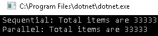
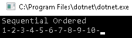
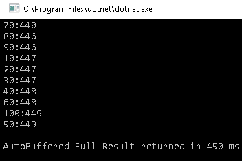
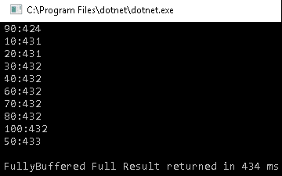
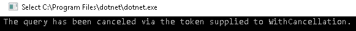
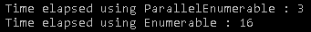

# 使用 PLINQ

PLINQ 是**语言集成查询**(**LINQ**)的并行实现。 PLINQ 最初是在.NET Framework 4.0 中引入的，从那时起就变得功能丰富。 在 LINQ 之前，开发人员很难从各种数据源(如 XML 或数据库)获取数据，因为每种数据源需要不同的技能。 LINQ 是一种语言语法，它依赖于.NET 委托和内置方法来查询或修改数据，而不必担心学习低级任务。

在本章中，我们将从.NET 中的 LINQ 提供者开始。 由于 PLINQ 是程序员的首选，我们将介绍它的各种编程方面，以及与之相关的一些缺点。 最后，我们将了解影响 PLINQ 性能的因素。

我们将涵盖以下议题:

*   .NET 中的 LINQ 提供商
*   编写 PLINQ 查询
*   在 PLINQ 中保持秩序
*   Merge options in PLINQ
*   处理 PLINQ 中的异常
*   组合并行和顺序查询
*   PLINQ disadvantages
*   PLINQ 的加速效果

# 技术要求

为了完成本章，你应该对 TPL 和 C# 有一个很好的理解。 本章的源代码可以在 GitHub 上的[https://github.com/PacktPublishing/Hands-On-Parallel-Programming-with-C-8-and-.NET-Core-3/tree/master/Chapter04](https://github.com/PacktPublishing/Hands-On-Parallel-Programming-with-C-8-and-.NET-Core-3/tree/master/Chapter04)找到。

# .NET 中的 LINQ 提供商

LINQ 是一组 api，帮助我们更容易地处理 XML、对象和数据库。 LINQ 有很多提供程序，包括以下这些，它们都是常用的:

*   LINQ 到对象:LINQ 到对象允许开发人员查询内存中的对象，比如数组、集合、泛型类型等等。 它返回一个`IEnumerable`，并支持排序、过滤、分组、排序和聚合函数等特性。 它的功能在`System.Linq`命名空间中定义。
*   LINQ to XML: LINQ to XML，或 XLINQ，允许开发人员查询或修改 XML 数据源。 它在`System.Xml.Linq`命名空间中定义。
*   LINQ ADO。 NET:从 LINQ 到 ADO。 NET 不是一种技术，而是一组技术，它们允许开发人员查询或修改关系数据源，如 SQL Server、MySQL 或 Oracle。
*   LINQ 到 SQL:这也被称为 DLINQ。 DLINQ 使用**对象关系****映射**(**ORM**)，是微软支持但没有增强的一项遗留技术。 它只适用于 SQL Server，并允许用户将数据库表映射到.NET 类。 它还有一个适配器，它的工作方式类似于开发人员对数据库的接口。
*   LINQ 到数据集:这允许开发人员在内存中查询或修改数据集。 它适用于 ADO 的任何数据库。 NET 有一个提供商。
*   实体 LINQ:这是最先进和最受欢迎的技术。 它允许开发人员使用任何关系数据库，包括 SQL Server、Oracle、IBM Db2 和 MySQL。 实体的 LINQ 也支持 ORM。
*   PLINQ:也被称为 PLINQ。 PLINQ 是针对对象的 LINQ 的并行实现。 LINQ 查询是按顺序执行的，对于繁重的计算操作来说，它会非常慢。 PLINQ 支持查询的并行执行，方法是将一个任务安排在多个线程上运行，也可以选择在多个核上运行。

. net 支持使用`AsParallel()`方法将 LINQ 无缝转换为 PLINQ。 PLINQ 是计算重型操作的一个非常好的选择。 它的工作原理是将源数据分配为块，这些块依次由多个核上运行的不同线程执行。 PLINQ 还支持 XLINQ 和 LINQ to 对象。

# 编写 PLINQ 查询

要理解 PLINQ 查询，我们需要首先了解`ParallelEnumerable`类。 一旦我们理解了`ParallelEnumerable`类，我们将学习如何编写并行查询。

# 引入 ParallelEnumerable 类

`ParallelEnumerable`类可以在`System.Linq`名称空间和`System.Core`程序集中使用。

除了支持 LINQ 定义的大多数标准查询操作符外，`ParallelEnumerable`类还支持许多额外的支持并行执行的方法:

*   `AsParallel()`:这是并行化所需的种子方法。
*   `AsSequential()`:通过更改并行行为来启用并行查询的顺序执行。
*   `AsOrdered()`:默认情况下，PLINQ 不保留任务执行和返回结果的顺序。 我们可以通过调用`AsOrdered()`方法来保持这种顺序。
*   `AsUnordered()`:**这是`ParallelQuery`的默认行为，可以由`AsOrdered()`方法覆盖。 我们可以通过调用这个方法将行为从有序更改为无序。**
***   `ForAll()`:**允许并行执行查询。*****   `Aggregate()`:此方法可用于在并行查询中聚合来自不同线程本地分区的结果。*   `WithDegreesOfParallelism()`:**使用这种方法，我们可以指定用于并行执行查询的最大处理器数量。*****   `WithParallelOption()`:**通过这种方法，我们可以缓冲并行查询产生的结果。*****   `WithExecutionMode()`:**使用这种方法，我们可以强制并行执行查询，或者让 PLINQ 决定查询是按顺序执行还是按并行执行。**********

 ******在本章的后面，我们将通过使用代码示例来更多地了解这些方法。 有一个非常方便的工具叫 LINQPad，在这里值得一提。 LINQPad 帮助我们了解 LINQ/PLINQ 查询，因为它有超过 500 个可用的示例和连接到各种数据源的能力。 您可以从[https://www.linqpad.net/](https://www.linqpad.net/)下载。

# 我们的第一个 PLINQ 查询

假设我们想要找出所有能被 3 整除的数。

首先，我们定义了 100,000 个数字的范围:

```cs
var range = Enumerable.Range(1, 100000);
```

要找到所有能被 3 整除的数，使用下面的 LINQ 查询:

```cs
var resultList = range.Where(i => i % 3 == 0).ToList();
```

下面是使用`AsParallel`方法但使用方法语法的同一个查询的并行版本:

```cs
 var resultList = range.AsParallel().Where(i => i % 3 == 0).ToList();

```

下面是在 LINQ 中使用查询语法选项的相同版本:

```cs
var resultList = (from i in range.AsParallel()
                  where i % 3 == 0
                  select i).ToList();
```

下面是完整的代码:

```cs
var range = Enumerable.Range(1, 100000);
//Here is sequential version
var resultList = range.Where(i => i % 3 == 0).ToList();
Console.WriteLine($"Sequential: Total items are {resultList.Count}");
//Here is Parallel Version using .AsParallel method
resultList = range.AsParallel().Where(i => i % 3 == 0).ToList();
resultList = (from i in range.AsParallel()
 where i % 3 == 0
 select i).ToList();
 Console.WriteLine($"Parallel: Total items are {resultList.Count}" ); 
Console.WriteLine($"Parallel: Total items are {resultList.Count}");

```

其输出如下:



# 在执行并行执行时保持 PLINQ 中的顺序

PLINQ 并行执行工作项，并且在默认情况下，不关心保持项的顺序来提高并行查询的性能。 然而，有时重要的是，项的执行顺序与源集合中存在的顺序相同。 例如，假设您正在向服务器发送多个请求以以块的形式下载文件，然后合并这些块以在客户端重新创建文件。 由于文件是分部分下载的，所以每个部分都需要按照正确的顺序下载并合并。 在并行执行项时保持顺序对性能有直接影响，因为我们需要在整个分区中保持原来的顺序，并确保合并项时顺序是一致的。

我们可以覆盖默认行为，并通过在源集合上使用`AsOrdered()`方法来打开顺序保存。 如果在任何时候，我们想要关闭保序，我们可以调用`AsUnOrdered()`方法。

让我们看一个例子:

```cs
var range = Enumerable.Range(1, 10);
Console.WriteLine("Sequential Ordered"); 
range.ToList().ForEach(i => Console.Write(i + "-"));
```

这段代码是连续的，所以当我们运行它时，我们会得到以下输出:



我们可以使用`AsParallel()`方法制作一个平行版本:

```cs
Console.WriteLine("Parallel Unordered");
var unordered = range.AsParallel().Select(i => i).ToList();
unordered.ForEach(i => Console.WriteLine(i));
```

前面的代码是并行执行的，但是顺序是混乱的:


为了两全其美，也就是说，通过排序并行执行，我们可以这样修改代码:

```cs
var range = Enumerable.Range(1, 10);
Console.WriteLine("Parallel Ordered");
var ordered = range.AsParallel().AsOrdered().Select(i => i).ToList();                            ordered.ForEach(i => Console.WriteLine(i));
```

下面是输出:


正如您所看到的，当我们调用`AsOrdered()`方法时，它在保持原始顺序的同时并行执行所有的工作项，然而，在默认的方法中，顺序没有被保留。 使用`AsOrdered()`方法的性能影响是巨大的，因为在执行的每一步都要恢复顺序。

# 使用 AsUnOrdered()方法的顺序执行

一旦我们在 PLINQ 上调用了`AsOrdered`，查询将按顺序执行。 在某些情况下，我们可能希望在一段时间内按顺序执行查询，但在那之后将其更改为无序以获得性能。

假设我们想从一组数字中生成前 100 个数字的平方。 一种并行的方法如下:

```cs
  var range = Enumerable.Range(100, 10000);
  var ordered = range.AsParallel().AsOrdered().Take(100).Select(i => i * i);
```

我们需要`AsOrdered()`来获得前 100 个号码。 问题是`Select`查询也将按顺序执行。 结合`AsOrdered()`和`AsUnOrdered()`可以提高性能:

```cs
var range = Enumerable.Range(100, 10000);
var ordered = range.AsParallel().AsOrdered().Take(100).AsUnordered().Select(i => i * i).ToList();
```

现在，将按顺序并行检索前 100 项。 之后，查询将在不保留任何顺序的情况下执行。

# Merge options in PLINQ

如前所述，在创建并行查询时，将对源集合进行分区，以便多个任务可以并发地处理各个部分。 一旦查询完成，就需要合并结果，以便使用它们的线程可以使用它们。 根据查询操作符的不同，有多种方法可以合并结果。 我们可以指定如何使用`ParallelMergeOperation`枚举和`WithMergeOption()`扩展方法显式合并结果。

让我们看看各种可用的合并选项。

# 使用 NotBuffered 合并选项

并发任务的结果不会被缓冲。 一旦任何一个任务完成，它们就将结果返回给正在使用的线程:

```cs
var range = ParallelEnumerable.Range(1, 100);
Stopwatch watch = null;
ParallelQuery<int> notBufferedQuery = range.WithMergeOptions(ParallelMergeOptions.NotBuffered)
                                           .Where(i => i % 10 == 0)
                                           .Select(x => {
                                                     Thread.SpinWait(1000);
                                                     return x;
                                                        });
watch = Stopwatch.StartNew();
foreach (var item in notBufferedQuery)
{
    Console.WriteLine( $"{item}:{watch.ElapsedMilliseconds}");
}
Console.WriteLine($"\nNotBuffered Full Result returned in {watch.ElapsedMilliseconds} ms");
```

这个的输出如下:


# 使用 AutoBuffered 合并选项

并发任务的结果将被缓冲，并且该缓冲区可以定期使用线程。 根据集合的大小，可能会返回多个缓冲区。 使用此选项，消费线程需要等待更长时间才能获得第一个结果。 这也是默认选项。

考虑以下代码:

```cs
var range = ParallelEnumerable.Range(1, 100);
Stopwatch watch = null;
ParallelQuery<int> query = range.WithMergeOptions(ParallelMergeOptions.AutoBuffered)
                                .Where(i => i % 10 == 0)
                                .Select(x => {
                                             Thread.SpinWait(1000);
                                             return x;
                                             });
watch = Stopwatch.StartNew();
foreach (var item in query)
{
    Console.WriteLine($"{item}:{watch.ElapsedMilliseconds}");
}
Console.WriteLine($"\nAutoBuffered Full Result returned in {watch.ElapsedMilliseconds} ms");
watch.Stop();
```

输出如下:



# 使用 fullbuffered 合并选项

并发任务的结果在一次进入使用线程之前被完全缓冲。 这提高了整体性能，尽管获得第一个结果的时间会更长:

```cs
var range = ParallelEnumerable.Range(1, 100);
Stopwatch watch = null;
ParallelQuery<int> fullyBufferedQuery = range.WithMergeOptions(ParallelMergeOptions.FullyBuffered)
                                .Where(i => i % 10 == 0)
                                .Select(x => {
                                              Thread.SpinWait(1000);
                                              return x;
                                              });
watch = Stopwatch.StartNew();
foreach (var item in fullyBufferedQuery)
{
    Console.WriteLine($"{item}:{watch.ElapsedMilliseconds}");
}
Console.WriteLine($"\nFullyBuffered Full Result returned in {watch.ElapsedMilliseconds} ms");
watch.Stop();
```

输出如下:



并非所有查询操作符都支持所有合并模式。 下面是操作符列表及其限制:


This information can be found at [http://msdn.microsoft.com/en-us/library/dd997424(v=vs.110).aspx](http://msdn.microsoft.com/en-us/library/dd997424(v=vs.110).aspx).

除了前面的运算符外，`ForAll()`始终为`NotBuffered`，`OrderBy`始终为`FullyBuffered`。 如果在这些操作符上指定了任何自定义合并选项，它们将被忽略。

# 用 PLINQ 抛出和处理异常

就像其他并行原语一样，PLINQ 在遇到异常时抛出一个`System.AggregateException`。 异常处理在很大程度上取决于您的设计。 您可能希望程序尽快失败，或者希望将所有异常返回给调用者。

在下面的例子中，我们将把一个并行查询封装在一个`try`-`catch`块中。 当查询抛出异常时，它将传播回调用者，以`System.AggregateException`封装:

```cs
var range = ParallelEnumerable.Range(1, 20);
ParallelQuery<int> query= range.Select(i => i / (i - 10)).WithDegreeOfParallelism(2);
try
{
    query.ForAll(i => Console.WriteLine(i));
}
catch (AggregateException aggregateException)
{
    foreach (var ex in aggregateException.InnerExceptions)
    {
        Console.WriteLine(ex.Message);
        if (ex is DivideByZeroException)
            Console.WriteLine("Attempt to divide by zero. Query 
             stopped.");
    }
}
```

输出如下:


我们还可以在一个委托中指定一个`try`-`catch`块，这将尽快通知我们错误情况。 它也可以用于这样的场景:我们只是想记录一个异常，并通过提供一个默认值作为异常情况下的查询结果来继续执行查询:

```cs
var range = ParallelEnumerable.Range(1, 20);
Func<int, int> selectDivision = (i) =>
{
    try
    {
        return  i / (i - 10);
    }
    catch (DivideByZeroException ex)
    {
        Console.WriteLine($"Divide by zero exception for {i}");
        return -1;
    }
};
ParallelQuery<int> query = range.Select(i => selectDivision(i)).WithDegreeOfParallelism(2);
try
{
    query.ForAll(i => Console.WriteLine(i));
}
catch (AggregateException aggregateException)
{
    foreach (var ex in aggregateException.InnerExceptions)
    {
        Console.WriteLine(ex.Message);
        if (ex is DivideByZeroException)
            Console.WriteLine("Attempt to divide by zero. Query stopped.");
    }
}
```

输出如下:


异常处理对于在应用中维护正确的流，以及在应用出现错误时通知用户非常重要。 通过适当的异常处理和日志记录，我们还可以在生产环境中排除应用错误。 在下一节中，我们将讨论如何合并并行和顺序查询。

# 组合并行和顺序 LINQ 查询

我们已经讨论了使用`AsParallel()`来创建并行查询。 有时，我们可能希望按顺序执行操作符。 我们可以使用`AsSequential()`方法强制 PLINQ 按顺序操作。 一旦将此方法应用于任何并行查询，以下操作符将按顺序执行。 考虑以下代码:

```cs
var range = Enumerable.Range(1, 1000);
range.AsParallel().Where(i => i % 2 == 0).AsSequential().Where(i => i % 8 == 0).AsParallel().OrderBy(i => i);
```

这里，第一个`Where`类`Where(i => i % 2 == 0)`将并行执行。 然而，第二个`Where`类`Where(i => i % 8 == 0)`将依次执行。 `OrderBy`也将切换到并行执行模式。

如下图所示:


现在，我们应该对如何合并同步和并行 LINQ 查询有一个很好的想法。 在下一节中，我们将学习如何取消 PLINQ 查询以节省 CPU 资源。

# 取消 PLINQ 查询

我们可以使用`CancellationTokenSource`和`CancellationToken`类取消 PLINQ 查询。 取消令牌通过`WithCancellation`子句传递给 PLINQ 查询，然后我们可以调用`CancellationToken.Cancel`来取消查询操作。 取消查询时，将抛出`OperationCancelledException`。

具体操作如下:

1.  创建一个取消令牌源:

```cs
CancellationTokenSource cs = new CancellationTokenSource();
Create a task that starts immediately and cancel the token after 4 seconds
     Task cancellationTask = Task.Factory.StartNew(() =>
            {
                Thread.Sleep(4000);
                cs.Cancel();
            });
```

2.  将 PLINQ 查询封装在一个`try`块中:

```cs
try
       {
           var result = range.AsParallel()
             .WithCancellation(cs.Token)
             .Select(number => number)
             .ToList();
       }
```

3.  添加两个`catch`块; 一个捕捉`OperationCanceledException`，另一个捕捉`AggregateException`:

```cs
     catch (OperationCanceledException ex)
            {
                Console.WriteLine(ex.Message);
            }
            catch (AggregateException ex)
            {
                foreach (var inner in ex.InnerExceptions)
                {
                    Console.WriteLine(inner.Message);
                }
            }
```

4.  将范围作为一个非常大的值，执行时间超过 4 秒:

```cs
            var range = Enumerable.Range(1,1000000);
```

5.  运行代码。 四秒后，我们将看到以下输出:



并行编程有它自己的警告。 在下一节中，我们将介绍使用 PLINQ 编写并行代码的缺点。

# PLINQ 并行编程的缺点

在大多数情况下，PLINQ 比它的非并行对等 LINQ 执行得快得多。 然而，也有一些性能开销，这与并行化 LINQ 时的分区和合并有关。 以下是我们在使用 PLINQ 时需要考虑的一些事情:

1.  **并行并不总是更快**:**并行化是开销。 除非源集合非常大，或者它具有计算绑定的操作，否则按顺序执行操作更有意义。 总是衡量顺序和并行查询的性能，以做出明智的决策。**
***   **避免涉及原子性的 I/O 操作**:**所有涉及到写入文件系统、数据库、网络或共享内存位置的 I/O 操作都应该避免在 PLINQ 中执行。 这是因为这些方法不是线程安全的，所以使用它们可能会导致异常。 一种解决方案是使用同步原语，但这也会大大降低性能。*****   **您的查询可能并不总是并行运行**:**PLINQ 中的并行化是由 CLR 决定的。 即使我们在查询中调用`AsParallel()`方法，也不能保证它采用并行路径，而是可以按顺序运行。******

 ******# 理解影响 PLINQ 性能的因素(加速)

PLINQ 的主要目的是通过分割任务并并行执行来加速查询执行。 然而，有很多因素会影响 PLINQ 的性能。 这些开销包括与分块和分区有关的同步开销，以及调度和从线程收集结果。 PLINQ 在*并行*场景中表现最好，在这些场景中，线程不需要共享状态，也不需要担心执行顺序。 *与*愉快地并行是理想的，但由于工作的性质，并不总是能够实现。 让我们试着了解影响 PLINQ 性能的因素。

# 程度的并行性

通过使用更多的核，我们可以获得显著的性能提升，因为 TPL 确保多个任务可以在多个核上并发执行。 这种性能改进可能不是指数级的，在优化性能时，我们应该尝试在具有多个核的不同系统上运行，并比较结果。

# Merge option

在结果经常改变，用户希望尽快看到结果而不是等待的情况下，我们可以显著地改善用户体验。 PLINQ 的默认选项是缓冲结果，然后合并它们并返回给用户。 我们可以通过选择一个合适的合并选项来修改这种行为。

# 分区类型

我们应该经常检查我们的工作项目是平衡的还是不平衡的。 对于不平衡的工作项场景，可以引入自定义分区程序来提高性能。

# 决定何时与 PLINQ 保持顺序

我们应该始终计算出每个工作项和整个操作的计算成本，这样我们就可以决定我们是要保持顺序性还是移动到并行性。 由于分区、调度等的额外开销，并行查询可能并不总是快速的:

*计算成本=执行 1 个工作项的成本*工作项总数*

并行查询可以通过增加每个条目的计算成本来显著提高性能。 但是，如果性能增益非常低，那么顺序执行查询是有意义的。

PLINQ 决定是顺序执行还是并行执行取决于查询中操作符的组合。 简单地说，如果查询有以下任何一个操作符，PLINQ 可能会决定按顺序运行查询:

*   `Take`、`TakeWhile`、`Skip`,`SkipWhile`,`First`,`Last`,`Concat`,`Zip`或【显示】
*   索引`Where`和`Select`，分别是`Where`和`Select`的重载

下面的代码演示了使用索引`Where`和`Select`:

```cs
IEnumerable<int> query =
    numbers.AsQueryable()
    .Where((number, index) => number <= index * 10);
IEnumerable<bool> query =
    range.AsQueryable()
    .Select((number, index) => number <= index * 10);
```

# 操作的顺序

PLINQ 为无序集合提供了更好的性能，因为按照顺序执行集合会产生性能成本。 这种性能代价包括分区、调度和收集结果，以及调用`GroupJoin`和过滤器。 作为一名开发人员，您应该考虑何时需要使用`AsOrdered()`。

# ForAll versus calling ToArray() or ToList()

当调用`ToList()`或`ToArray()`或在循环中枚举一个结果时，我们强制 PLINQ 将所有并行线程的结果合并到单个数据结构中。 这是性能开销。 如果我们只想对一组项目执行一些操作，最好使用`ForAll()`方法。

# 迫使并行性

PLINQ 不能保证每次都执行并行执行。 根据查询的类型，它可能决定执行顺序执行。 我们可以使用`WithExecutionMode`方法进行控制。 `WithExecutionMode`是在`ParallelQuery`类型对象上工作的扩展方法。 它以`ParallelExecutionMode`作为参数，即`enum`。 默认值`ParallelExecutionMode`让 PLINQ 决定最佳执行模式。 我们可以使用`ForceParallelism`选项强制并行执行模式:

```cs
var range = Enumerable.Range(1, 10);
var squares = range.AsParallel().WithExecutionMode
(ParallelExecutionMode.ForceParallelism).Select(i => i * i);
squares.ToList().ForEach(i => Console.Write(i + "-"));
```

# 生成序列

在本书中，我们使用了`Enumerable.Range()`方法来生成一个数字序列。 我们也可以使用`ParallelEnumerable`类并行地生成数字。 让我们做一个简单的测试比较`Enumerable`和`ParallelEnumerable`类:

```cs
Stopwatch watch = Stopwatch.StartNew();
IEnumerable<int> parallelRange = ParallelEnumerable.Range(0, 5000).Select(i => i);
watch.Stop();
Console.WriteLine($"Time elapsed {watch.ElapsedMilliseconds}");
Stopwatch watch2 = Stopwatch.StartNew();
IEnumerable<int> range = Enumerable.Range(0, 5000);
watch2.Stop();
Console.WriteLine($"Time elapsed {watch2.ElapsedMilliseconds}");
Console.ReadLine();
```

输出如下:



如您所见，在创建范围方面，`ParallelEnumerable`比`Enumerable`工作得快得多。

在类似的场景中，我们可能希望生成一个特定次数的数字。 对于这个场景，我们可以使用`ParallelEnumerable.Repeat()`方法，如下所示:

```cs
IEnumerable<int> rangeRepeat = ParallelEnumerable.Repeat(1, 5000);
```

现在我们已经理解了影响 PLINQ 性能的因素，我们已经到了本章的末尾。 现在，让我们总结一下所学到的。

# 总结

在这一章中，在理解如何使用 PLINQ 编写并行查询之前，我们讨论了 LINQ 的基础知识。 我们了解到 PLINQ 可以很好地提高应用的整体性能，但重要的是要记住它的缺点。 作为一名程序员，通过同时编写 LINQ 和 PLINQ 查询并比较它们的性能来权衡您的选择总是一个好主意。

在下一章中，我们将学习如何在多个线程之间共享数据时使用同步原语来保持数据的一致性和状态。

# 问题

1.  这些 LINQ 提供者中哪个对关系对象有更好的支持?

    1.  LINQ to SQL
    2.  LINQ to 实体
2.  使用`AsParallel()`可以方便地将 LINQ 转换为并行 LINQ。

    1.  真正的
    2.  假

3.  在 PLINQ 中，不可能在有序和无序执行之间切换。

    1.  真正的
    2.  假
4.  哪一种方法允许将并发任务的结果进行缓冲，并以定期间隔提供给线程使用?

    1.  `FullyBuffered`
    2.  `AutoBuffered`
    3.  `NotBuffered`
5.  如果在任务中执行以下代码，将抛出哪个异常?

```cs
int i=5;
i = i/i -5;
```************