# 五、同步原语

在前一章中，我们讨论了并行编程的潜在缺陷。 其中之一是同步开销。 当我们将工作分解为多个工作项处理的任务时，就需要同步来自每个线程的结果。 我们讨论了线程本地存储和分区本地存储的概念，它们可以在一定程度上解决这个同步问题。 然而，仍然需要同步线程，以便我们可以将数据写入共享内存位置，以便我们可以执行 I/O 操作。

在本章中，我们将讨论由.NET 框架和 TPL 提供的同步原语。

在本章中，我们将涵盖以下主题:

*   同步原语
*   联锁操作
*   锁定原语
*   信号原语
*   轻量级的同步原语
*   障碍和倒计时事件

在本章结束时，你将对. net Framework 提供的各种锁定和信号原语有一个很好的理解，包括一些轻量级的同步原语，在需要同步的地方应该尽可能多地使用这些原语。

# 技术要求

为了完成本章，你应该对 TPL 有一个很好的理解，主要是并行循环。 本章的源代码可以在 GitHub 上的[https://github.com/PacktPublishing/Hands-On-Parallel-Programming-with-C-8-and-.NET-Core-3/tree/master/Chapter05](https://github.com/PacktPublishing/Hands-On-Parallel-Programming-with-C-8-and-.NET-Core-3/tree/master/Chapter05)找到。

# 什么是同步原语?

在理解同步原语之前，我们需要了解临界区。 临界区是线程执行路径的一部分，为了保持某些不变量，必须保护它不被并发访问。 临界区本身不是同步原语，而是依赖于同步原语。

同步原语是底层平台(OS)提供的简单软件机制。 它们有助于内核的多线程。 同步原语在内部使用低级原子操作，以及内存障碍。 这意味着同步原语的用户不必担心实现锁和内存障碍本身。 一些常见的同步原语示例是锁、互斥锁、条件变量和信号量。 监视器是一种高级同步工具，它在内部使用其他同步原语。

. net 框架提供了一系列同步原语来处理线程之间的交互，以及避免潜在的竞争条件。 同步原语大致可以分为五类:

*   联锁操作
*   锁定
*   信号
*   轻量级的同步类型
*   `SpinWait`

在下面几节中，我们将讨论每个类别及其各自的低级原语。

# 联锁操作

这个互锁类封装了同步原语，用于为线程间共享的变量提供原子操作。 它提供了`Increment`、`Decrement`、`Add`、`Exchange`、`CompareExchange`等方法。

考虑下面的代码，它试图在一个并行循环中增加一个计数器:

```cs
Parallel.For(1, 1000, i =>
       {
           Thread.Sleep(100);
           _counter++;
       });
       Console.WriteLine($"Value for counter should be 999 and 
        is {_counter}");
```

如果我们运行这段代码，我们将看到以下输出:


如您所见，期望值和实际值不匹配。 这是因为线程之间存在竞争条件，这是因为线程想从已经写入但尚未提交的变量中读取一个值。

我们可以使用`Interlocked`类修改前面的代码，使其成为线程安全的，如下所示:

```cs
Parallel.For(1, 1000, i =>
       {
           Thread.Sleep(100);
           Interlocked.Increment(ref _counter);
       });
       Console.WriteLine($"Value for counter should be 999 and 
        is {_counter}");
```

预期输出如下:


类似地，我们可以使用`Interlocked.Decrement(ref _counter)`以线程安全的方式递减值。

下面的代码显示了操作的完整列表:

```cs
 //_counter becomes 1
Interlocked.Increment(ref _counter);
// _counter becomes 0
Interlocked.Decrement(ref _counter);
// Add: _counter becomes 2 
Interlocked.Add(ref _counter, 2);
//Subtract: _counter becomes 0
Interlocked.Add(ref _counter, -2);
// Reads 64 bit field 
Console.WriteLine(Interlocked.Read(ref _counter)); 
// Swaps _counter value with 10 
Console.WriteLine(Interlocked.Exchange(ref _counter, 10));
//Checks if _counter is 10 and if yes replace with 100 
Console.WriteLine(Interlocked.CompareExchange(ref _counter, 100, 10)); 
// _counter becomes 100
```

除了上述方法外，.NET Framework 4.5 还增加了两个新方法:`Interlocked.MemoryBarrier()`和`Interlocked.MemoryBarrierProcessWide()`。

在下一节中，我们将学习更多关于.NET 中的内存障碍的知识。

# .NET 中的内存障碍

线程模型在单核和多核处理器上的工作方式不同。 在单核处理器上，只有一个线程获得 CPU 片，而其他线程则等待轮到它们。 这确保了当一个线程访问内存(用于加载和存储)时，它是按照正确的顺序进行的。 该模型又称为**序列一致性模型**。 在多核处理器系统的情况下，多个线程并发运行。 在这些系统中不能保证顺序一致性，因为硬件或**Just in Time**(**JIT**)编译器可能会重新排序内存指令以提高性能。 出于缓存、负载猜测或延迟存储操作的性能考虑，内存指令也可能被重新排序。

负载推测的一个例子如下:

```cs
a=b;
```

一个存储操作示例如下:

```cs
c=1;
```

当编译器遇到 Load 和 store 语句时，它们并不总是按照编写时的顺序执行。 编译器为了提高性能做了一些重新排序。 让我们试着了解更多关于重新排序的内容。

# 重新排序是什么?

对于给定的代码语句序列，编译器可以选择以接收到的相同顺序执行它们，或者在多个线程处理同一代码时重新排序它们以获得性能。 例如，看看下面的代码:

```cs
a = b;
c = 1;
```

前面的代码可以在另一个线程中重新排序并按以下顺序执行:

```cs
c = 1;
a = b;
```

代码重新排序是一个问题，多核处理器与弱内存模型，如英特尔安腾处理器。 然而，由于顺序一致性模型，它对单核处理器没有影响。 代码被重新构造，以便另一个线程可以利用或存储内存中已经存在的指令。 代码重新排序既可以由硬件完成，也可以由 JIT 编译器完成。 为了保证代码的重新排序，我们需要某种类型的**内存屏障**。

# 记忆屏障的类型

内存屏障确保任何高于或低于这个屏障的代码语句都不会跨越这个屏障，从而加强了代码的顺序。 有三种类型的内存屏障:

*   **存储(写)内存屏障:**存储内存屏障确保不允许任何存储操作跨越这个屏障。 对负载运行无影响; 这些仍然可以重新排序。 实现此效果的等效 CPU 指令为**SFENCE**:

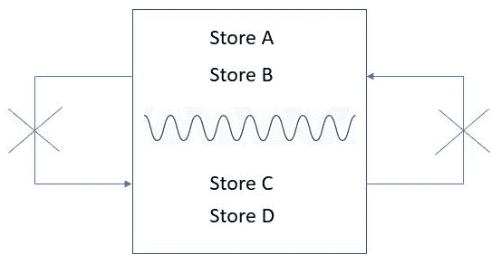

*   **加载(读)内存屏障:**负载屏障确保不允许任何负载操作通过该屏障，但对存储操作不强制执行。 实现此效果的等效 CPU 指令是**LFENCE**:

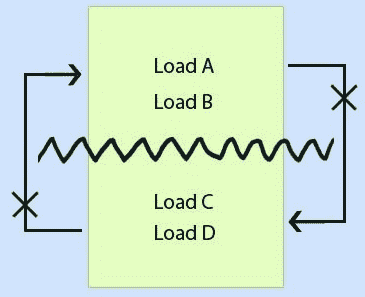

*   **全内存屏障:**全内存屏障通过不允许存储或加载操作跨越内存屏障来确保顺序。 实现此效果的等效 CPU 指令是**MFENCE**。 全内存屏障的行为通常是由.NET 同步结构实现的，例如:
    *   `Task.Start`、`Task.Wait`、`Task.Continuation`
    *   `Thread.Sleep`、`Thread.Join`、`Thread.SpinWait`、`Thread.VolatileRead`、`Thread.VolatileWrite`
    *   `Thread.MemoryBarrier`
    *   `Lock`、`Monitor.Enter`、`Monitor.Exit`
    *   `Interlocked`类操作

半障碍由`Volatile`关键字和`Volatile`类方法提供。 . net Framework 提供了一些内置模式，在类中使用了 volatile 字段，如`Lazy<T>`和`LazyInitializer`。 我们将在[第七章](07.html)、*用延迟初始化提高性能*中进一步讨论这些问题。

# 避免使用构造对代码进行重新排序

我们可以使用`Thread.MemoryBarrier`避免重新排序，如下代码所示:

```cs
static int a = 1, b = 2, c = 0;
private static void BarrierUsingTheadBarrier()
{
    b = c;
    Thread.MemoryBarrier();
    a = 1;
}
```

`Thread.MemoryBarrier`创建一个不允许加载或存储操作通过的完全屏障。 它被封装在`Interlocked.MemoryBarrier`中，所以同样的代码可以写成如下:

```cs
private static void BarrierUsingInterlockedBarrier()
       {
           b = c;
           Interlocked.MemoryBarrier();
           a = 1;
       }
```

如果我们想创建一个进程和系统范围的障碍，我们可以使用在.NET Core 2.0 中引入的`Interlocked.MemoryBarrierProcessWide`。 这是一个封装在`FlushProcessWriteBuffer`Windows API 或`sys_membarrier`Linux 内核上的包装器:

```cs
private static void BarrierUsingInterlockedProcessWideBarrier()
{
    b = c;
    Interlocked.MemoryBarrierProcessWide();
    a = 1;
}
```

前面的示例向我们展示了如何创建流程范围的障碍。 现在，让我们看看什么是锁定原语。

# 介绍锁定原语

锁可用于将对受保护资源的访问限制为一个线程或一组线程。 为了能够有效地实现锁定，我们需要确定可以通过锁定原语保护的适当临界区。

# 锁定是如何工作的

当我们对共享资源应用锁时，会执行以下步骤:

1.  一个线程或一组线程通过获取一个锁来访问共享资源。
2.  其他无法访问锁的线程进入等待状态。
3.  一旦锁被一个线程释放，它就会被另一个线程获取，然后开始执行。

要理解锁定原语，我们需要理解各种线程状态，以及阻塞和旋转等概念。

# 线程状态

在线程生命周期的任何时刻，我们都可以使用线程的`ThreadState`属性查询线程的状态。 线程可以处于以下任何一种状态:

*   `Unstarted`:线程已经被 CLR 创建，但是`System.Threading.Thread.Start`方法还没有在线程上被调用。
*   `Running`:线程已通过调用`Thread.Start`启动。 它不等待任何挂起的操作。
*   `WaitSleepJoin`:由于通过调用线程调用`Wait()`、`Sleep()`或`Join()`方法，线程处于阻塞状态。
*   `StopRequested`:线程已被请求停止。
*   `Stopped`:线程已经停止执行。
*   `AbortRequested`:已经在线程上调用了`Abort()`方法，但是线程还没有被中止，因为它正在等待`ThreadAbortException`，而`ThreadAbortException`将尝试终止它。
*   `Aborted`:线程已经中止。
*   `SuspendRequested`:由于调用`Suspend`方法，请求线程挂起。
*   `Suspended`:线程已挂起。
*   `Background`:线程正在后台执行。

让我们尝试探索一条线从初始状态`UnStarted`到最终状态`Stopped`的历程:


当线程由 CLR 创建时，它处于`Unstarted`状态。 当外部线程调用其上的`Thread.Start()`方法时，它将从`Unstarted`转换到`Running`。 从`Running`状态，线程可以过渡到以下状态:

*   `WaitSleepJoin`
*   `AbortRequested`
*   `Stopped`

当线程处于`WaitSleepJoin`状态时，线程被阻塞。 被阻塞线程的执行被暂停，因为它正在等待一些外部条件得到满足，这些条件可能是某些 cpu 限制的 I/O 操作或其他线程的结果。 一旦被阻塞，线程立即生成 CPU 时间片，并且在阻塞条件满足之前不使用处理器片。 此时，线程已解除阻塞。 阻塞和解除阻塞构成了性能开销，因为这需要 CPU 执行上下文切换。

一个线程可以在以下任何事件中被解除阻塞:

*   如果满足阻塞条件
*   通过在阻塞的线程上调用`Thread.Interrupt`
*   通过使用`Thread.Abort`中止线程
*   当达到指定的超时时

# 阻塞和旋转

一个被阻塞的线程在指定的时间内放弃处理器片。 这通过使其可用于其他线程来提高性能，但会带来上下文切换的开销。 在线程必须阻塞相当长的时间的情况下，这是很好的。 如果等待时间更短，那么在不放弃处理器片的情况下进行旋转是有意义的。 例如，下面的代码简单地无限循环:

```cs
while(!done);
```

这只是一个空的`while`循环，用于检查一个布尔变量。 当等待结束时，变量将被设置为 false，循环将中断。 尽管这是在浪费处理器时间，但如果等待时间不是很长，它可以显著提高性能。 . net 框架提供了一些特殊的结构，我们将在本章后面讨论，例如`SpinWait`和`SpinLock`。

让我们通过代码示例来尝试理解一些锁定原语。

# 锁、互斥和信号量

Lock 和互斥是只允许一个线程访问受保护资源的锁定结构。 锁是一种快捷实现，它使用另一个称为`Monitor`的高级同步类。

信号量是一种锁定结构，允许指定数量的线程访问受保护的资源。 Lock 只能同步进程内部的访问，但如果我们需要访问系统级资源或共享内存，我们就需要在多个进程之间同步访问。 互斥锁允许我们通过提供一个内核级别的锁来同步跨进程对资源的访问。

下表提供了这些结构功能的比较:

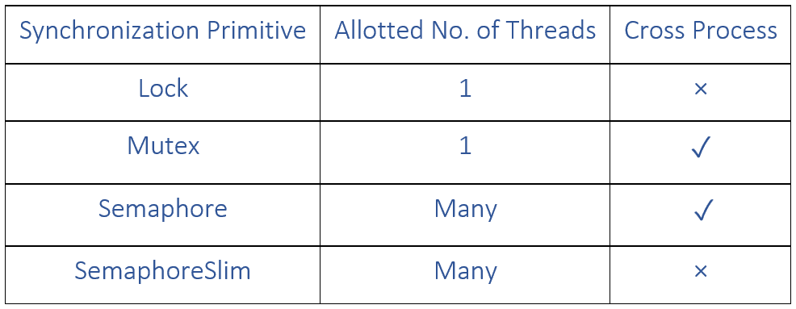

如我们所见,**互斥锁**和**只允许单线程对共享资源的访问,而信号**和**SemaphoreSlim**可用于允许访问的资源已经被多个线程共享。 另外，**Lock**和**SemaphoreSlim**只在进程内工作，**Mutex**和**Semaphore**有一个进程范围的锁。****

 ****# 锁

让我们考虑下面的代码，它试图将一个数字写入一个文本文件:

```cs
var range = Enumerable.Range(1, 1000);
Stopwatch watch = Stopwatch.StartNew();
       for (int i = 0; i < range.Count(); i++)
       {
           Thread.Sleep(10);
           File.AppendAllText("test.txt", i.ToString());
       }
       watch.Stop();
       Console.WriteLine($"Total time to write file is 
        {watch.ElapsedMilliseconds}");
```

当我们运行前面的代码时，输出如下:

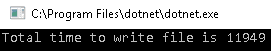

如您所见，该任务由 1,000 个工作项组成，每个工作项大约需要 10 毫秒的时间来执行。 任务所花费的时间是 1000 乘以 10，也就是 10000 毫秒。 我们还必须考虑执行 I/O 所花费的时间，因此总时间是 11,949。

让我们尝试使用`AsParallel()`和`AsOrdered()`子句并行执行这个任务，如下所示:

```cs
range.AsParallel().AsOrdered().ForAll(i =>
{
    Thread.Sleep(10);
    File.AppendAllText ("test.txt", i.ToString());
});
```

当我们尝试运行这段代码时，我们得到以下`System.IO.IOException**:** 'The process cannot access the file …\test.txt' because it is being used by another process.'`。

这里实际发生的情况是，文件是一个具有临界区的共享资源，因此只允许原子操作。 使用并行代码，我们会遇到这样一种情况:多个线程实际上试图写入文件，并导致异常。 我们需要确保代码尽可能快地并行运行，同时在写入文件时保持原子性。 我们需要使用一个锁语句修改前面的代码。

首先，声明一个`static`引用类型变量。 在我们的例子中，我们取一个类型为`object`的变量。 我们需要一个引用类型变量，因为锁只能应用在堆内存上:

```cs
static object _locker = new object ();
```

接下来，我们修改`ForAll()`方法内部的代码，使其包含`lock`:

```cs
range.AsParallel().AsOrdered().ForAll(i =>
       {
           lock (_locker)
           {
               Thread.Sleep(10);
               File.WriteAllText("test.txt", i.ToString());
           }
       });
```

现在，当我们运行这段代码时，我们不会得到任何异常，但任务所花费的时间实际上比顺序执行的时间要多:


这里出了什么问题? 通过确保只允许一个线程访问易受攻击的代码，Lock 确保了原子性，但这伴随着阻塞等待锁释放的线程的开销。 我们管这叫哑锁。 我们可以稍微修改一下程序，只锁住临界区，以提高性能，同时保持原子性，如下所示:

```cs
range.AsParallel().AsOrdered().ForAll(i =>
       {
           Thread.Sleep(10);
           lock (_locker)
           {
               File.WriteAllText("test.txt", i.ToString());
           }
       });
```

下面是上述代码的输出:

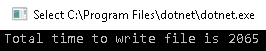

正如您所看到的，通过混合同步化和并行化，我们获得了显著的收益。 我们可以使用另一个锁定原语(即`Monitor`类)来实现类似的结果。

Lock 实际上是实现`Monitor.Enter()`和`Monitor.Exit()`封装在`try`-`catch`块中的一种简写语法。 因此，同样的代码可以写成如下的形式:

```cs
range.AsParallel().AsOrdered().ForAll(i =>
{
    Thread.Sleep(10);
    Monitor.Enter(_locker);
    try
    {
        File.WriteAllText("test.txt", i.ToString());
    }
    finally
    {
        Monitor.Exit(_locker);
    }
});
```

这段代码的输出如下:


# 互斥锁

前面的代码适用于单个实例应用，因为任务在进程中运行，锁实际上锁定了进程中的内存屏障。 如果我们运行应用的多个实例，两个应用都将拥有它们自己的静态数据成员副本，因此将锁定它们自己的内存屏障。 这将允许每个进程有一个线程实际进入临界区并尝试写入文件。 这会导致以下`System.IO.IOException**:** 'The process cannot access the file …\test.txt' because it is being used by another process.'`。

为了能够对共享资源应用锁，我们可以使用`mutex`类在内核级别应用锁。 和锁一样，互斥锁只允许一个线程访问受保护的资源，但也可以跨进程工作，因此每个系统只允许一个线程访问受保护的资源，而不管正在执行的进程的数量。

互斥锁可以命名或未命名。 未命名的互斥锁就像锁一样工作，不能跨进程工作。

首先，我们将创建一个未命名的`Mutex`:

```cs
private static Mutex mutex = new Mutex();
```

然后，我们将修改前面的并行代码，以便我们可以像使用锁一样使用`Mutex`:

```cs
range.AsParallel().AsOrdered().ForAll(i =>
       {
           Thread.Sleep(10);
           mutex.WaitOne();
           File.AppendAllText("test.txt", i.ToString());
           mutex.ReleaseMutex(); 
       });
```

上述代码的输出如下:

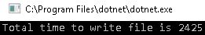

使用`Mutex`类，我们可以调用`WaitHandle.WaitOne()`方法来锁定临界区段，并调用`ReleaseMutex()`来解锁临界区段。 关闭或处理互斥锁会自动释放它。

前面的程序运行得很好，但是如果我们试图在多个实例上运行它，它将抛出一个`IOException`。 为此，我们可以创建一个`namedMutex`，如下所示:

```cs
private static Mutex namedMutex = new Mutex(false,"ShaktiSinghTanwar");
```

可选地，我们可以在调用互斥锁`WaitOne()`时指定一个超时，以便它在解除阻塞之前等待指定时间的信号。 如下面的例子所示:

```cs
namedMutex.WaitOne(3000);
```

如果前面的互斥锁没有接收到信号，它将等待三秒钟才能解除自己的阻塞。

Lock and mutex can only be released from the thread that obtained them.

# 信号量

锁、互斥和监视只允许一个线程访问受保护的资源。 然而，有时我们需要允许多个线程能够访问共享资源。 其中的例子包括资源池场景和节流场景。 与锁或互斥锁不同，`semaphore`是线程无关的，这意味着任何线程都可以调用`semaphore`的释放。 就像互斥锁一样，它也可以跨进程工作。

一个典型的`semaphore`构造器如下:


如您所见，它接受两个参数:`initialCount`，它指定最初允许输入多少线程，以及`maximumCount`，它指定可以输入的线程总数。

假设我们有一个远程服务，它只允许每个客户端有三个并发连接，并且需要一秒钟来处理一个请求，如下所示:

```cs
private static void DummyService(int i)
       {
           Thread.Sleep(1000);
       }
```

我们有一个方法，它有 1000 个工作项，这些工作项需要调用带有参数的服务。 我们需要并行地处理一个任务，但也要确保在任何时候对服务的调用不超过三个。 我们可以通过创建一个最大数量为`3`的`semaphore`来实现:

```cs
Semaphore semaphore = new Semaphore(3,3);
```

现在，我们可以编写一些代码来模拟并行执行 1,000 个请求，但每次只执行 3 个请求，使用下面的`semaphore`:

```cs
   range.AsParallel().AsOrdered().ForAll(i =>
            {
                semaphore.WaitOne();
                Console.WriteLine($"Index {i} making service call using 
                 Task {Task.CurrentId}" );
                //Simulate Http call
                CallService(i);
                Console.WriteLine($"Index {i} releasing semaphore using 
                  Task {Task.CurrentId}");
                semaphore.Release();
            });
```

这个的输出如下:

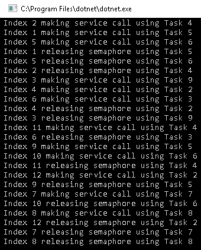

如您所见，三个线程进入并调用服务，而其他线程则等待锁被释放。 一旦一个线程释放了锁，另一个线程就会进入，但前提是任何时候都有三个线程在临界区内。

有两种类型的信号量:本地和全局。 我们将在下面讨论这些。

# 当地信号量

本地`semaphore`对于使用它的应用来说是本地的。 任何没有名称的`semaphore`将被创建为本地`semaphore`，如下所示:

```cs
Semaphore semaphore = new Semaphore(1,10);
```

# 全球信号量

全局的`semaphore`对于操作系统是全局的，因为它应用内核或系统级锁原语。 用名称创建的任何`semaphore`都将被创建为全局变量`semaphore`，如下所示:

```cs
Semaphore semaphore = new Semaphore(1,10,”Globalsemaphore”);
```

If we create a `semaphore` with only one thread, it will act like a lock.

# ReaderWriterLock

类定义了一个锁，该锁一次支持多个读取器和一个写入器。 在许多线程频繁读取共享资源但很少更新的场景中，这很方便。 . net 框架提供了两个读-写锁类:`ReaderWriterLock`和`ReaderWriterLockSlim`。 `ReaderWriterLock`现在几乎已经过时了，因为它可能会导致潜在的死锁、性能下降、复杂的递归规则以及锁的升级或降级。 我们将在本章后面更详细地讨论`ReaderWriterLockSlim`。

# 介绍信号原语

并行编程的一个重要方面是任务协调。 在创建任务时，你可能会遇到生产者/消费者的情况，其中一个线程(消费者)正在等待一个共享资源被另一个线程(生产者)更新。 由于消费者不知道生产者何时更新共享资源，所以它会继续轮询共享资源，这可能会导致竞态条件。 在处理这些场景时，轮询的效率非常低。 最好使用. net 框架提供的信号原语。 使用信号原语，消费者线程会被暂停，直到它收到来自生产者线程的信号。 让我们讨论一些常见的信号原语，如`Thread.Join`、`WaitHandles`和`EventWaitHandlers`。

# 线程。 加入

这是让一个线程等待另一个线程的信号的最简单的方法。 `Thread.Join`本质上是阻塞的，这意味着调用方线程被阻塞，直到所连接的线程完成为止。 可选地，我们可以指定一个超时，允许被阻塞的线程在达到超时时脱离阻塞状态。

在下面的代码中，我们将创建一个模拟长时间运行的任务的子线程。 完成后，它将更新本地变量(称为`result`)中的输出。 程序应该将结果`10`打印到控制台。 让我们试着运行代码:

```cs
int result = 0;
Thread childThread = new Thread(() =>
{
    Thread.Sleep(5000);
    result = 10;
});
childThread.Start();
Console.WriteLine($"Result is {result}");
```

上述代码的输出如下:

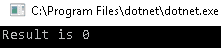

我们期望的结果是`10`，但结果却是`0`。 发生这种情况是因为主线程应该在子线程完成执行之前运行。 我们可以通过阻塞主线程来实现期望的行为，直到子线程完成。 这可以通过在子线程上调用`Join()`来实现，如下所示:

```cs
int result = 0;
Thread childThread = new Thread(() =>
{
    Thread.Sleep(5000);
    result = 10;
});
childThread.Start();
childThread.Join();
Console.WriteLine($"Result is {result}");
```

如果我们现在再次运行这段代码，我们将看到等待 5 秒后所期望的输出，在此期间主线程被阻塞:

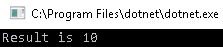

# EventWaitHandle

类表示线程的同步事件。 它用作`AutoResetEvent`和`ManualResetEvent`类的基类。 我们可以通过调用`Set()`或`SignalAndWait()`来标记`EventWaitHandle`。 `EventWaitHandle`类没有任何线程关联，所以它可以被任何线程发出信号。 让我们学习更多关于`AutoResetEvent`和`ManualResetEvent`的内容。

# AutoResetEvent

这指的是自动重置的`WaitHandle`类。 一旦它们被重置，它们允许一个线程通过创建的障碍。 一旦线程被传递，它们就会被重新设置，从而阻塞线程直到下一个信号。

在下面的示例中，我们试图在不使用锁的情况下，以线程安全的方式找出 10 个数字的和。

首先，创建一个初始状态为无信号的`AutoResetEvent`，或者`false`。 这意味着所有的线程都应该等待直到接收到信号。 如果我们将初始状态设置为有信号状态(即`true`)，则第一个线程将通过，而其他线程则等待信号:

```cs
AutoResetEvent autoResetEvent = new AutoResetEvent(false);
```

接下来，创建一个使用`autoResetEvent.Set()`方法每秒触发 10 次信号的信令任务:

```cs
Task signallingTask = Task.Factory.StartNew(() => {
    for (int i = 0; i < 10; i++)
    {
        Thread.Sleep(1000);
        autoResetEvent.Set();
    }
});
```

声明一个变量 sum 并将其初始化为`0`:

```cs
int sum = 0;
```

创建一个并行的`for`循环，创建 10 个任务。 每个任务将立即启动，并等待信号进入，因此阻塞在`autoResetEvent.WaitOne()`语句。 每一秒后，信号任务将发送一个信号，一个线程将进入并更新`sum`:

```cs
 Parallel.For(1, 10, (i) => {
     Console.WriteLine($"Task with id {Task.CurrentId} waiting for 
      signal to enter");
     autoResetEvent.WaitOne();
     Console.WriteLine($"Task with id {Task.CurrentId} received 
      signal to enter");
     sum += i;
 });
```

输出如下:


如您所见，所有 10 个任务最初都被阻塞，并在接收到信号后每秒释放一个任务。

# ManualResetEvent

这指的是需要手动重置的等待句柄。 与只允许一个线程通过每个信号的`AutoResetEvent`不同，`ManualResetEvent`允许线程继续通过，直到再次设置。 让我们用一个简单的例子来理解这一点。

在下面的示例中，我们需要以 5 个并行的批进行 15 个服务调用，每个批之间有 2 秒的延迟。 在进行服务调用时，我们需要确保系统已连接到网络。 为了模拟网络状态，我们将创建两个任务:一个通知网络关闭，另一个通知网络打开。

首先，我们将创建一个手动重置事件，初始状态为*off*:

```cs
ManualResetEvent manualResetEvent = new ManualResetEvent(false);
```

接下来,我们将创建两个任务模拟网络被行刑的打开和关闭网络*事件每两秒(街区所有的网络调用)和网络*事件每 5 秒(它允许所有的网络调用通过):**

 **```cs
Task signalOffTask = Task.Factory.StartNew(() => {
           while (true)
           {
               Thread.Sleep(2000);
               Console.WriteLine("Network is down");
               manualResetEvent.Reset();
           }
       });
       Task signalOnTask = Task.Factory.StartNew(() => {
           while (true)
           {
               Thread.Sleep(5000);
               Console.WriteLine("Network is Up");
               manualResetEvent.Set();
           }
       });
```

从前面的代码中可以看到，我们使用`manualResetEvent.Set()`每 5 秒发出一次手动重置事件。 我们使用`manualResetEvent.Reset()`每两秒关闭一次。 下面的代码进行实际的服务调用:

```cs
for (int i = 0; i < 3; i++)
       {
           Parallel.For(0, 5, (j) => {
               Console.WriteLine($"Task with id {Task.CurrentId} waiting 
                for network to be up");
               manualResetEvent.WaitOne();
               Console.WriteLine($"Task with id {Task.CurrentId} making 
                service call");
               DummyServiceCall();
           });
           Thread.Sleep(2000);
       }
```

从前面的代码中可以看到，我们创建了一个`for`循环，该循环在每个迭代中创建 5 个任务，迭代之间的睡眠间隔为 2 秒。

在进行服务调用之前，我们通过调用`manualResetEvent.WaitOne();`等待网络启动。

如果我们运行前面的代码，我们将收到以下输出:


如您所见，五个任务立即启动并阻塞，以等待网络启动。 五秒钟后，当网络启动时，我们使用`Set()`方法发出信号，所有五个线程都通过来进行服务调用。 这将随着`for`循环的每次迭代而重复。

# WaitHandles

`System.Threading.WaitHandle`是一个继承自`MarshalByRefObject`类的类，用于同步应用中运行的线程。 阻塞和信令用于使用等待句柄同步线程。 可以通过调用`WaitHandle`类的任何方法来阻塞线程。 它们被释放，这取决于所选择的信号结构的类型。 `WaitHandle`类方法如下:

*   `WaitOne`:阻塞调用线程，直到它从等待句柄接收到它正在等待的信号。
*   `WaitAll`:阻塞调用线程，直到它收到来自所有它正在等待的等待句柄的信号。

下面是一个例子，展示了`WaitAll`是如何工作的:

```cs
public static bool WaitAll (System.Threading.WaitHandle[] waitHandles, TimeSpan timeout, bool exitContext);
```

下面的示例使用两个线程来模拟两个不同的服务调用。 两个线程将并行执行，但在将总和输出到控制台之前将等待`WaitHandle.WaitAll(waitHandles)`:

```cs
static int _dataFromService1 = 0;
static int _dataFromService2 = 0;
private static void WaitAll()
{
    List<WaitHandle> waitHandles = new List<WaitHandle>
       {
            new AutoResetEvent(false),
            new AutoResetEvent(false)
       };
    ThreadPool.QueueUserWorkItem(new WaitCallback
     (FetchDataFromService1), waitHandles.First());
    ThreadPool.QueueUserWorkItem(new WaitCallback
     (FetchDataFromService2), waitHandles.Last());
    //Waits for all the threads (waitHandles) to call the .Set() 
    //method 
    //i.e. wait for data to be returned from both service
    WaitHandle.WaitAll(waitHandles.ToArray());
    Console.WriteLine($"The Sum is 
     {_dataFromService1 + _dataFromService2}");
}
private static void FetchDataFromService1(object state)
{
    Thread.Sleep(1000);
    _dataFromService1 = 890;
    var autoResetEvent = state as AutoResetEvent;
    autoResetEvent.Set();
}
private static void FetchDataFromService2(object state)
{
    Thread.Sleep(1000);
    _dataFromService2 = 3;
    var autoResetEvent = state as AutoResetEvent;
    autoResetEvent.Set();
}
```

上述代码的输出如下:


*   `WaitAny`:阻塞调用线程，直到它从它正在等待的任何一个等待句柄接收到信号。

以下是`WaitAny`方法的特点:

```cs
public static int WaitAny (System.Threading.WaitHandle[] waitHandles);
```

下面是一个使用两个线程执行项搜索的示例。 两个线程将并行执行，程序将等待任何线程在`WaitHandle.WaitAny(waitHandles)`方法中完成执行，然后将项索引打印到控制台。

我们有两种方法，二进制搜索和线性搜索，它们使用二进制和线性算法进行搜索。 我们想从这两种方法中尽快得到结果。 我们可以通过使用`AutoResetEvent`信号来实现这一点，并将结果存储在`findIndex`和`winnerAlgo`全局变量中:

```cs
 static int findIndex = -1;
 static string winnerAlgo = string.Empty; 
 private static void BinarySearch(object state)
 {
     dynamic data = state;
     int[] x = data.Range;
     int valueToFind = data.ItemToFind;
     AutoResetEvent autoResetEvent = data.WaitHandle 
      as AutoResetEvent;
     //Search for item using .NET framework built in Binary Search
     int foundIndex = Array.BinarySearch(x, valueToFind);
     //store the result globally
     Interlocked.CompareExchange(ref findIndex, foundIndex, -1);
     Interlocked.CompareExchange(ref winnerAlgo, "BinarySearch", 
      string.Empty);
     //Signal event
     autoResetEvent.Set();
 }

 public static void LinearSearch( object state)
 {
     dynamic data = state;
     int[] x = data.Range;
     int valueToFind = data.ItemToFind;
     AutoResetEvent autoResetEvent = data.WaitHandle as AutoResetEvent;
     int foundIndex = -1;
     //Search for item linearly using for loop
     for (int i = 0; i < x.Length; i++)
     {
         if (valueToFind == x[i])
         {
             foundIndex = i;
         }
     }
     //store the result globally
     Interlocked.CompareExchange(ref findIndex, foundIndex, -1); 
     Interlocked.CompareExchange(ref winnerAlgo, "LinearSearch", 
       string.Empty); 
     //Signal event
     autoResetEvent.Set();
 }

```

下面的代码使用`ThreadPool`并行调用这两个算法:

```cs
 private static void AlgoSolverWaitAny()
 {
     WaitHandle[] waitHandles = new WaitHandle[]
     {
     new AutoResetEvent(false),
     new AutoResetEvent(false)
     };
     var itemToSearch = 15000;
     var range = Enumerable.Range(1, 100000).ToArray(); 
     ThreadPool.QueueUserWorkItem(new WaitCallback    
      (LinearSearch),new {Range = range,ItemToFind =           
      itemToSearch, WaitHandle= waitHandles[0] });
     ThreadPool.QueueUserWorkItem(new WaitCallback(BinarySearch), 
      new { Range = range, ItemToFind =         
      itemToSearch, WaitHandle = waitHandles[1] });
     WaitHandle.WaitAny(waitHandles);
     Console.WriteLine($"Item found at index {findIndex} and faster 
      algo is {winnerAlgo}" );
 }
```

*   `SignalAndWait`:该方法用于在一个等待句柄上调用`Set()`，并在另一个等待句柄上调用`WaitOne`。 在多线程环境中，这个方法可以用来每次释放一个线程，然后重置以等待下一个线程:

```cs
public static bool SignalAndWait (System.Threading.WaitHandle toSignal, System.Threading.WaitHandle toWaitOn);
```

# 轻量级的同步原语

. net 框架还提供了轻量级的同步原语，其性能比对应的原语更好。 它们尽可能避免依赖于诸如 wait 句柄之类的内核对象，因此它们只在进程内部工作。 当线程的等待时间很短时，应该使用这些原语。 我们可以将它们分为两类，这两类我们都将在本节中看到。

# 苗条的锁

瘦锁是旧同步原语的瘦实现，可以通过减少开销来提高性能。

下表显示了遗留的同步原语和它们的苗条对应:


让我们试着学习更多关于修长头发的知识。

# ReaderWriterLockSlim

`ReaderWriterLockSlim`是`ReaderWriterLock`的轻量级实现。 它表示一种锁，可用于以允许多个线程共享读访问而只允许一个线程写访问的方式管理受保护的资源。

下面的示例使用`ReaderWriterLockSlim`来保护一个由三个读线程和一个写线程共享的列表的访问:

```cs
static ReaderWriterLockSlim _readerWriterLockSlim = new ReaderWriterLockSlim();
static List<int> _list = new List<int>();
private static void ReaderWriteLockSlim()
{
    Task writerTask = Task.Factory.StartNew( WriterTask);
    for (int i = 0; i < 3; i++)
    {
        Task readerTask = Task.Factory.StartNew(ReaderTask);
    }
}
static void WriterTask()
{
    for (int i = 0; i < 4; i++)
    {
        try 
            {
            _readerWriterLockSlim.EnterWriteLock();
            Console.WriteLine($"Entered WriteLock on Task {Task.CurrentId}");
            int random = new Random().Next(1, 10);
            _list.Add(random);
            Console.WriteLine($"Added {random} to list on Task {Task.CurrentId}");
            Console.WriteLine($"Exiting WriteLock on Task {Task.CurrentId}");
            }
        finally
            {
             _readerWriterLockSlim.ExitWriteLock();
            }

        Thread.Sleep(1000);
    }
}
static void ReaderTask()
{
    for (int i = 0; i < 2; i++)
    {
       _readerWriterLockSlim.EnterReadLock();
       Console.WriteLine($"Entered ReadLock on Task {Task.CurrentId}"); 
       Console.WriteLine($"Items: {_list.Select(j=>j.ToString ()).Aggregate((a, b) => 
       a + "," + b)} on Task {Task.CurrentId}"); 
       Console.WriteLine($"Exiting ReadLock on Task {Task.CurrentId}"); 
        _readerWriterLockSlim.ExitReadLock();
        Thread.Sleep(1000);
    }
}
```

这段代码的输出如下:

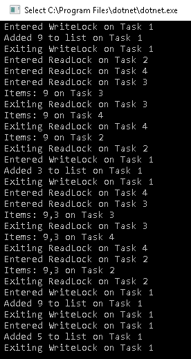

# SemaphoreSlim

`SemaphoreSlim`是`semaphore`的轻量级实现。 它将对受保护资源的访问限制在多个线程上。

以下是我们在本章前面展示的`semaphore`程序的精简版本:

```cs
 private static void ThrottlerUsingSemaphoreSlim()
        {
            var range = Enumerable.Range(1, 12);
            SemaphoreSlim semaphore = new SemaphoreSlim(3, 3);
            range.AsParallel().AsOrdered().ForAll(i =>
            {
                try
                {
                    semaphore.Wait();
                    Console.WriteLine($"Index {i} making service call using Task {Task.CurrentId}");
                    //Simulate Http call
                    CallService(i);
                    Console.WriteLine($"Index {i} releasing semaphore using Task {Task.CurrentId}");
                }
                finally
                {
                    semaphore.Release();
                }
            });
        }
        private static void CallService(int i)
        {
            Thread.Sleep(1000);
        }
```

我们在这里看到的区别，除了用`SemaphoreSlim`替换了`Semaphore`类之外，就是我们现在有了`Wait()`方法，而不是`WaitOne()`。 这更有意义，因为我们允许多个线程通过。

另一个重要的区别是，`SemaphoreSlim`总是作为本地`semaphore`创建，而不像`semaphore`，它也可以全局创建。

# ManualResetEventSlim

`ManualResetEventSlim`是`ManualResetEvent`的轻量级实现。 它比`ManualResetEvent`具有更好的性能和更少的开销。

我们可以使用下面的语法创建一个对象，就像`ManualResetEvent`:

```cs
ManualResetEventSlim manualResetEvent = new ManualResetEventSlim(false);
```

就像其他苗条的方法一样，这里的一个主要区别是我们用`Wait()`代替了`WaitOne()`方法。

您可以通过进行上述更改来尝试运行一些`ManualResetEvent`演示代码，看看它是否有效。

# 障碍和倒计时项目

. net 框架有一些内置的信号原语，可以帮助我们同步多个线程，而不需要编写大量的同步逻辑。 所有的同步都由提供的数据结构在内部处理。 在这一节中，让我们讨论两个非常重要的信号原语:`CountDownEvent`和`Barrier`:

*   **CountDownEvent**:`System.Threading.CountDownEvent`类指的是当其计数变为 0 时发出信号的事件。

*   **障碍**:`Barrier`类允许多个线程在没有主线程控制的情况下运行。 它创建了一个障碍，参与的线程必须等待直到所有线程到达。 `Barrier`适用于工作需要并行和分阶段进行的情况。

# 一个使用 Barrier 和 CountDownEvent 的案例研究

例如，假设我们需要从两个动态托管的服务中获取数据。 在从服务 1 获取数据之前，我们需要托管它。 一旦获取了数据，就需要关闭它。 只有当服务一关闭后，我们才能启动服务二，并从服务二中获取数据。 需要尽可能快地获取数据。 让我们创建一些代码来满足这个场景的需求。

创建一个有`5`参与者的`Barrier`:

```cs
static Barrier serviceBarrier = new Barrier(5);
```

创建两个`CountdownEvents`，当六个线程通过它时，将触发服务的启动或关闭。 五个工作者任务将参与其中，还有一个任务将管理服务的启动或关闭:

```cs
static CountdownEvent serviceHost1CountdownEvent = new CountdownEvent(6);
static CountdownEvent serviceHost2CountdownEvent = new CountdownEvent(6);
```

最后，创建另一个数量为`5`的`CountdownEvent`。 这指的是在事件发出信号之前可以通过的线程数。 `CountdownEvent`将在所有 worker 任务执行完毕时触发:

```cs
static CountdownEvent finishCountdownEvent = new CountdownEvent(5);
```

以下是我们的`serviceManagerTask`实现:

```cs
     Task serviceManager = Task.Factory.StartNew(() =>
            {
                //Block until service name is set by any of thread
                while (string.IsNullOrEmpty(_serviceName))
                    Thread.Sleep(1000);
                string serviceName = _serviceName;
                HostService(serviceName);
                //Now signal other threads to proceed making calls to service1
                serviceHost1CountdownEvent.Signal();
                //Wait for worker tasks to finish service1 calls                                    
                serviceHost1CountdownEvent.Wait();
                //Block until service name is set by any of thread
                while (_serviceName != "Service2")
                    Thread.Sleep(1000);
                Console.WriteLine($"All tasks completed for service {serviceName}.");
                //Close current service and start the other service
                CloseService(serviceName);
                HostService(_serviceName);
                //Now signal other threads to proceed making calls to service2
                serviceHost2CountdownEvent.Signal();
                serviceHost2CountdownEvent.Wait();
                //Wait for worker tasks to finish service2 calls
                finishCountdownEvent.Wait();
                CloseService(_serviceName);
                Console.WriteLine($"All tasks completed for service {_serviceName}.");
            });
```

下面是 worker 任务执行的方法:

```cs
        private static void GetDataFromService1And2(int j)
        {
            _serviceName = "Service1";
            serviceHost1CountdownEvent.Signal();
            Console.WriteLine($"Task with id {Task.CurrentId} signalled countdown event and waiting for   
            service to start");
            //Waiting for service to start
            serviceHost1CountdownEvent.Wait();
            Console.WriteLine($"Task with id {Task.CurrentId} fetching data from service ");
            serviceBarrier.SignalAndWait();
            //change servicename
            _serviceName = "Service2";
            //Signal Countdown event
            serviceHost2CountdownEvent.Signal();
            Console.WriteLine($"Task with id {Task.CurrentId} signalled countdown event and waiting for 
            service to start");
            serviceHost2CountdownEvent.Wait();
            Console.WriteLine($"Task with id {Task.CurrentId} fetching data from service ");
            serviceBarrier.SignalAndWait();
            //Signal Countdown event
            finishCountdownEvent.Signal();
        }
    //Finally make worker tasks
     for (int i = 0; i < 5; ++i)
            {
                int j = i;
                tasks[j] = Task.Factory.StartNew(() =>
                {
                    GetDataFromService1And2(j);
                });
            }
            Task.WaitAll(tasks);
            Console.WriteLine("Fetch completed");
```

上述代码的输出如下:

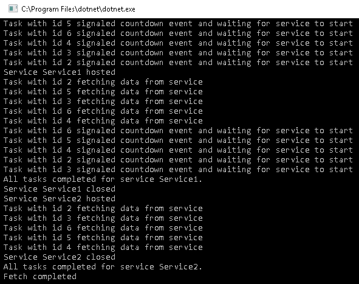

在本节中，我们了解了各种内置的信号原语，这些原语有助于简化代码同步，而不需要将自己锁定为开发人员。 阻塞仍然以性能为代价，因为它涉及到上下文切换。 在下一节中，我们将研究一些旋转技术，这些技术可以帮助消除上下文切换的开销。

# SpinWait

在本章的开始，我们提到对于较小的等待，旋转比阻塞更有效。 旋转具有较少的与上下文切换和转换相关的内核开销。

我们可以这样创建一个`SpinWait`对象:

```cs
var spin = new SpinWait();
```

然后，无论我们在哪里需要创建`spin`，我们都可以调用以下命令:

```cs
spin.SpinOnce();
```

# 自旋锁

如果获得锁的等待时间很短，锁和联锁原语会显著降低性能。 `SpinLock`提供了一种轻量级的、低级的锁替代方案。 `SpinLock`是一种值类型，所以如果我们想在多个地方使用同一个对象，我们需要通过引用传递它。 出于性能原因，即使`SpinLock`还没有获得锁，它也会生成线程的时间片，以便垃圾收集器能够有效地工作。 默认情况下，`SpinLock`不支持线程跟踪，即确定哪个线程获得了锁。 但是，可以打开这个功能。 这只建议用于调试，而不用于生产，因为它会降低性能。

创建一个`SpinLock`对象，如下:

```cs
 static SpinLock _spinLock = new SpinLock();
```

创建一个方法，将被各种线程调用，并更新一个全局静态列表:

```cs
 static List<int> _itemsList = new List<int>();
        private static void SpinLock(int number)
        {
            bool lockTaken = false;
            try
            {
                Console.WriteLine($"Task {Task.CurrentId} Waiting for lock");                                
 _spinLock.Enter(ref lockTaken);                Console.WriteLine($"Task {Task.CurrentId} Updating list");
                _itemsList.Add(number);
            }
            finally
            {
                if (lockTaken)
                {
                    Console.WriteLine($"Task {Task.CurrentId} Exiting Update");
                    _spinLock.Exit(false);
                }
            }
        }
```

如您所见，锁通过`_spinLock.Enter(ref lockTaken)`获得，通过`_spinLock.Exit(false)`**释放。** 这两个语句之间的所有内容将在所有线程之间同步执行。

让我们在一个并行循环中调用这个方法:

```cs
Parallel.For(1, 5, (i) => SpinLock(i));
```

下面是我们使用锁定原语时的同步输出:

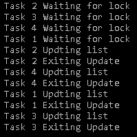

根据经验，如果我们有小任务，使用旋转可以完全避免上下文切换。

# 总结

在本章中，我们学习了.NET Core 提供的同步原语。 同步原语是必须的，如果你想写并行代码，并确保它是正确的，即使是多线程工作。 同步原语会带来性能开销，建议在可能的情况下使用它们的苗条对应版本。

我们还学习了信号原语，当线程需要处理一些外部事件时，这非常有用。 我们还讨论了障碍和倒计时事件，这可以帮助我们避免代码同步问题，而不需要编写额外的逻辑。 最后，我们介绍了一些旋转技术，它们消除了由于阻塞代码(即`SpinLock`和`SpinWait`而产生的性能开销。

在下一章中，我们将学习.NET Core 提供的各种数据结构。 它们是自动同步的，同时也是并行的。

# 问题

1.  其中哪些可以用于跨进程同步?

    1.  `Lock`
    2.  `Interlocked.Increment`
    3.  `Interlocked.MemoryBarrierProcessWide`
2.  以下哪一个不是有效的内存屏障?

    1.  读记忆障碍
    2.  一半记忆障碍
    3.  完整的记忆障碍
    4.  读取和执行内存屏障
3.  以下哪一种状态不能恢复线程?

    1.  `WaitSleepJoin`
    2.  `Suspended`
    3.  `Aborted`
4.  一个未命名的`semaphore`可以在哪里提供同步?

    1.  在过程
    2.  跨流程
5.  这些构造中哪些支持跟踪线程?

    1.  `SpinWait`
    2.  `SpinLock`******