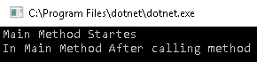
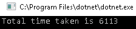

# 九、异步、等待和基于任务的异步编程基础

在前一章中，我们介绍了 C# 中的异步编程实践和解决方案，甚至早于.NET Core。 我们还讨论了一些场景，其中异步编程非常方便，以及应该避免使用它。

在本章中，我们将更深入地研究异步编程，并将介绍使编写异步代码非常容易的两个关键字。 本章将涵盖以下主题:

*   `async`、`await`简介
*   异步委托和 lambda 表达式
*   **任务异步模式**(**TAP**)
*   异步代码中的异常处理
*   异步与 PLINQ
*   测量异步代码性能
*   使用异步代码的指导原则

我们先来介绍一下`async`和`await`关键字，这两个关键字在 C# 5.0 中首次引入，在.NET Core 中也采用了。

# 技术要求

读者应该对**任务并行库**(**TPL**)和 C# 有一个很好的理解。 本章的源代码可以在 GitHub 上的[https://github.com/PacktPublishing/-Hands-On-Parallel-Programming-with-C-8-and-.NET-Core-3/tree/master/Chapter09](https://github.com/PacktPublishing/-Hands-On-Parallel-Programming-with-C-8-and-.NET-Core-3/tree/master/Chapter09)找到。

# 介绍 async 和 await

`async`和`await`是.NETCore开发人员使用.NET Framework 提供的新异步 api 编写异步代码时非常流行的两个关键词。 它们用于在调用异步操作时标记代码。 在上一章中，我们讨论了将同步方法转换为异步方法的挑战。 以前，我们通过将方法分解为两个方法`BeginMethodName`和`EndMethodName`来实现这一点，这两个方法可以异步调用。 这种方法使代码难于编写、调试和维护。 然而，使用`async`和`await`关键字，代码可以保持同步实现中的状态，只需要进行一些小更改。 所有分解方法、执行异步方法以及将响应返回给程序的困难工作都由编译器完成。

. net Framework 提供的所有新的 I/O api 都支持基于任务的异步，我们在前一章已经讨论过了。 现在让我们尝试理解一些涉及 I/O 操作的场景，在这些场景中我们可以利用`async`和`await`关键字。 假设我们想要从返回 JSON 格式数据的公共 API 中下载数据。 在旧版本的 C# 中，我们可以使用`System.Net`命名空间中的`WebClient`类编写同步代码，如下所示。

首先，添加对`System.Net`程序集的引用:

```cs
WebClient client = new WebClient();
string reply = client.DownloadString("http://www.aspnet.com"); 
Console.WriteLine(reply);
```

接下来，创建`WebClient`类的对象，并通过传递要下载的页面的 URL 来调用`DownloadString`方法。 方法将同步运行，调用线程将被阻塞，直到下载操作完成。 这会影响服务器的性能(如果在服务器端代码中使用)和应用的响应能力(如果在 Windows 应用代码中使用)。

为了提高性能和响应性，我们可以使用稍后介绍的`DownloadString`方法的异步版本。

下面是一个为远程资源`http://www.aspnet.com`创建下载请求并订阅`DownloadStringCompleted`事件的方法，而不是等待下载完成:

```cs
private static void DownloadAsynchronously()
 {
     WebClient client = new WebClient(); 
     client.DownloadStringCompleted += new 
     DownloadStringCompletedEventHandler(DownloadComplete); 
     client.DownloadStringAsync(new Uri("http://www.aspnet.com"));
 }
```

下面是`DownloadComplete`事件处理程序，它在下载完成时被触发:

```cs
private static void DownloadComplete(object sender, DownloadStringCompletedEventArgs e)
{
     if (e.Error != null)
     {
         Console.WriteLine("Some error has occurred.");
         return;
     }
     Console.WriteLine(e.Result);
     Console.ReadLine();
 }
```

在前面的代码中，我们使用了**基于事件的异步模式**(**EAP**)。 如您所见，我们已经订阅了`DownloadCompleted`事件，一旦下载完成，`WebClient`类将会触发该事件。 然后，我们调用了`DownloadStringAsync`方法，该方法将异步调用代码并立即返回，从而避免了阻塞线程的需要。 当下载在后台完成时，将调用`DownloadComplete`方法，我们可以使用`e.Error`属性接收错误，或者使用`DownloadStringCompletedEventArgs`的`e.Result`属性接收数据。

如果我们在 Windows 应用中运行上述代码，结果将如预期的那样，但响应总是由工作线程(在后台执行)接收，而不是由主线程接收。 作为 Windows 应用开发人员,我们需要注意这一事实我们不能更新 UI 控件的`DownloadComplete`方法,和所有这些调用需要委托回主 UI 线程在经典 Windows 窗体,使用技术,如调用或调度员**Windows Presentation Foundation (WPF**)。 使用 Invoke/Dispatcher 方法最好的一点是主线程不会阻塞，因此应用整体上响应性更好。****

 ****在本书附带的代码示例中，我们包括了 Windows 窗体和 WPF 的场景，尽管.NET Core 还不支持 Windows 应用或 WPF。 这种支持预计将在 Visual Studio 的下一个版本 VS 2019 中引入。

让我们尝试在.NET Core 控制台应用中从主线程运行上述代码，如下所示:

```cs
 public static void Main()
        {
         DownloadAsynchronously();   
        }
```

我们可以通过添加`Console.WriteLine`语句来修改`DownloadComplete`方法，如下所示:

```cs
private static void DownloadComplete(object sender, DownloadStringCompletedEventArgs e)
        {
            …
            …
            …
            Console.ReadLine() ;//Added this line
        }
```

根据逻辑，程序应该异步下载页面，打印输出，并等待用户输入结束。 当我们运行前面的代码时，我们将看到程序没有打印任何东西，也没有等待用户输入就终止了。 为什么会这样?

如前所述，只要调用`DownloadStringAsync`方法，主线程就会被解除阻塞。 主线程并不等待回调函数执行。 这是由设计决定的，并且异步方法被期望以这种方式表现。 然而，由于主线程没有其他事情可做，并且已经完成了它所期望的事情，即调用方法，应用终止。

作为一个 web 应用开发人员，如果你在使用 web Forms 或 ASP 的服务器端应用中使用上述代码，你可能会面临类似的问题。 净 MVC。 如果异步调用该方法，执行请求的 IIS 线程将立即返回，而无需等待下载完成。 因此，结果将不像预期的那样。 在 web 应用中，我们并不期望代码将输出打印到控制台，并且在 web 应用代码中运行时，`Console.WriteLine`语句会被简单地忽略。 假设您的逻辑是返回 web 页面作为对客户请求的响应。 我们可以使用`WebClient`类同步地实现这一点，如下面的例子所示，使用 ASP。 NET MVC:

```cs
public IActionResult Index()
{
    WebClient client = new WebClient();
    string content = client.DownloadString(new 
     Uri("http://www.aspnet.com"));
    return Content(content,"text/html");
}
```

这里的问题是,前面的代码将阻塞线程,可以对服务器的性能产生影响,导致自己造成的**拒绝服务(DoS****)攻击,发生在大量用户并发应用的一部分。 随着越来越多的线程被命中并阻塞，服务器将没有任何空闲线程来处理客户端请求，并将开始排队请求。 一旦达到队列限制，服务器将开始抛出 503 错误:服务不可用。**

我们不能使用`DownloadStringAsync`方法，因为当它被调用时，线程将返回一个响应给客户端，而不等待`DownloadComplete`完成。 我们需要一种方法使服务器线程等待而不阻塞它。 `async`和`await`在这样的情况下帮助我们。 除了帮助我们实现目标外，它们还帮助我们拥有易于编写、调试和维护的干净代码。

为了演示`async`和`await`，我们可以使用.NET Core 的另一个重要类`HttpClient`，它可以在`System.Net.Http`名称空间中使用。 应该使用`HttpClient`而不是`WebClient`，因为它完全支持基于任务的异步操作，性能得到了极大的改进，并且支持 GET、POST、PUT 和 DELETE 等 HTTP 方法。

下面是前面代码的异步版本，使用了`HttpClient`类并引入了`async`和`await`关键字:

```cs
public async Task<IActionResult> Index()
        {
            HttpClient client = new HttpClient();
            HttpResponseMessage response = await 
             client.GetAsync("http://www.aspnet.com");
            string content = await response.Content.ReadAsStringAsync();
            return Content(content,"text/html");
        }
```

首先，我们需要更改方法签名以包含`async`关键字。 这是给编译器的一条指令，该方法将在必要的地方异步执行。 然后，将方法的返回类型封装在`Task<T>`中。 这一点很重要，因为.NET Framework 支持基于任务的异步操作，并且所有异步方法都必须返回`Task`。

我们需要创建`HttpClient`类的一个实例，并调用`GetAsync()`方法，传递您想要下载的资源的 URL。 与依赖回调的 EAP 模式不同，我们只需在调用时写入`await`关键字。 这确保了以下几点:

*   该方法是异步执行的。
*   调用线程被解除阻塞，以便它可以返回线程池并处理其他客户机请求，从而使服务器响应。
*   当下载完成后，`ThreadPool`从处理器接收到一个中断信号，它将从`ThreadPool`中取出一个空闲线程，该线程可以是正在操作请求的同一个线程，也可以是不同的线程。
*   `ThreadPool`线程接收响应并开始执行方法的其余部分。

当下载完成后，我们可以通过使用另一个称为`ReadAsStringAsync()`的异步操作来读取下载的内容。 本节展示了很容易编写类似于同步方法的异步方法，使得它们的逻辑也很简单。

# 异步方法的返回类型

在前面的示例中，我们将方法的返回类型从`IAsyncResult`更改为`Task<IAsyncResult>`。 异步方法可以有三种返回类型:

*   `void`
*   `Task`
*   `Task<T>`

所有异步方法必须返回`Task`才能被等待(使用`await`关键字)。 这是因为，一旦您调用它们，它们不会立即返回，而是异步地执行长时间运行的任务。 在这样做的时候，调用者线程也可能在上下文中切换。

`void`可以用于调用线程不希望等待的异步方法。 这些方法可以是在后台发生的、不属于返回给用户的响应的任何操作。 例如，日志记录和审计可以是异步的。 这意味着它们可以包装在异步`void`方法中。 调用者线程将在调用操作后立即返回，日志记录和审计操作将稍后进行。 因此强烈建议从异步方法返回`Task`而不是`void`。

# 异步委托和 lambda 表达式

我们还可以使用`async`关键字来创建异步委托和 lambda 表达式。

下面是一个同步委托，它返回一个数字的平方:

```cs
Func<int, int> square = (x) => {return x * x;};
```

我们可以通过添加`async`关键字来使前面的委托成为异步的，如下所示:

```cs
Func<int, Task<int>> square =async (x) => {return x * x;};
```

类似地，lambda 表达式可以被转换，如下所示:

```cs
Func<int, Task<int>> square =async (x) => x * x;
```

异步方法在一个链中工作。 一旦您使任何一个方法成为异步的，那么调用该方法的所有方法也需要被转换为异步的，从而创建一长串异步方法。

# 基于任务的异步模式

在第二章、*任务并行*中，我们讨论了如何使用`Task`类实现 TAP。 有两种方法来实现这个模式:

*   编译器方法，使用`async`关键字
*   手动方法

让我们在接下来的部分中看看这些方法是如何操作的。

# 编译器方法，使用 async 关键字

当我们使用`async`关键字使任何方法异步时，编译器将在内部使用 TAP 执行所需的优化以异步执行方法。 异步方法必须返回`System.Threading.Task`或`System.Threading.Task<T>`。 编译器负责异步执行方法，并将结果或异常返回给调用者。

# 手动实现 TAP

我们已经展示了如何在 EAP 和**异步编程模型**(**APM**)中手动实现 TAP。 实现这个模式使我们能够更好地控制方法的整体实现。 我们可以创建一个`TaskCompletionSource<TResult>`类，然后执行异步操作。 当异步操作完成后，我们可以通过调用`TaskCompletionSource<TResult>`类的`SetResult`、`SetException`或`SetCanceled`方法将结果返回给调用者，如下代码所示:

```cs
public static Task<int> ReadFromFileTask(this FileStream stream, byte[] buffer, int offset, int count, object state)
{
    var taskCompletionSource = new TaskCompletionSource<int>();
    stream.BeginRead(buffer, offset, count, ar =>
    {
         try 
         { 
               taskCompletionSource.SetResult(stream.EndRead(ar));
         }
         catch (Exception exc) 
         { 
               taskCompletionSource.SetException(exc); 
         }
     }, state);
     return taskCompletionSource.Task;
}
```

在前面的代码中，我们创建了一个返回`Task<int>`的方法，该方法可以作为扩展方法处理任何`System.IO.FileStream`对象。 在该方法中，我们创建了一个`TaskCompletionSource<int>`对象，然后调用`FileStream`类提供的异步操作将文件读入字节数组。 如果读取操作成功完成，则使用`SetResult`方法将结果返回给调用者; 否则，我们使用`SetException`方法返回异常。 最后，该方法将底层任务从`TaskCompletionSource<int>`对象返回给调用者。

# 异步代码的异常处理

在同步代码的情况下，所有异常都被传播到堆栈的顶部，直到 try-catch 块处理它们或者将它们作为未处理的异常抛出。 当我们等待任何异步方法时，调用堆栈将不会是相同的，因为线程已经从方法转换到线程池，现在正在返回。 然而，C# 通过改变异步方法的异常行为，使异常处理变得更容易。 所有异步方法都返回`Task`或`void`。 让我们试着通过示例来理解这两个场景，并看看程序将如何运行。

# 返回 Task 并抛出异常的方法

假设我们有以下方法，即`void`。 作为最佳实践，我们返回`Task`:

```cs
 private static Task DoSomethingFaulty()
 {
      Task.Delay(2000);
      throw new Exception("This is custom exception.");
 }
```

该方法在延迟两秒后抛出异常。

我们将尝试使用各种方法调用此方法，以试图理解异步方法处理异常的行为。 本节将讨论以下场景:

*   不使用`await`关键字从 try-catch 块外部调用异步方法
*   不使用`await`关键字从 try-catch 块内部调用异步方法
*   使用`await`关键字从 try-catch 块之外调用异步方法
*   返回方法`void`

我们将在后面的章节中详细介绍这些方法。

# 不带 await 关键字的 try-catch 块外部的异步方法

下面是一个返回`Task`的异步方法示例。 然后，该方法调用另一个方法`DoSomethingFaulty ()`，该方法抛出一个异常。

下面是我们的`DoSomethingFaulty()`方法实现:

```cs
  private static Task DoSomethingFaulty()
  {
      Task.Delay(2000);
      throw new Exception("This is custom exception.");
  }
```

下面是`AsyncReturningTaskExample()`方法的代码:

```cs
private async static Task AsyncReturningTaskExample()
 {
      Task<string> task = DoSomethingFaulty();
      Console.WriteLine("This should not execute");
      try
      {
           task.ContinueWith((s) =>
           {
             Console.WriteLine(s);
           });
      }
      catch (Exception ex)
      {
       Console.WriteLine(ex.Message);
       Console.WriteLine(ex.StackTrace);
      }
  }
```

下面是`Main()`方法对该方法的调用:

```cs
 public static void Main()
 {
     Console.WriteLine("Main Method Starts");
     var task = AsyncReturningTaskExample();
     Console.WriteLine("In Main Method After calling method");
     Console.ReadLine();
 }
```

Async main is a handy addition to C# from version 7.1 onward. It became broken in release 7.2 but was fixed back in .NET Core 3.0.

如您所见，程序调用 async 方法—即`AsyncReturningTaskExample()`—而不使用`await`关键字。 `AsyncReturningTaskExample()`方法进一步调用`DoSomethingFaulty()`方法，从而抛出异常。 当我们运行这段代码时，会产生以下输出:



在同步编程的情况下，程序会导致一个未处理的异常，并且会导致崩溃。 但在这里，程序继续进行，就像什么都没发生过一样。 这是由于框架处理`Task`对象的方式。 在这种情况下，任务将返回到调用者，状态为 Faulted，如下截图所示:


更好的代码应该是检查任务状态并获取所有异常(如果有的话):

```cs
var task = AsyncReturningTaskExample();
if (task.IsFaulted)
    Console.WriteLine(task.Exception.Flatten().Message.ToString());
```

正如我们在[第二章](02.html)，*任务并行性*中看到的，这个任务返回一个`AggregateExceptions`的实例。 要抛出所有内部异常，可以使用`Flatten()`方法，如前一个屏幕截图所示。

# 一个不带 await 关键字的 try-catch 块内部的异步方法

让我们更改方法，将调用移到 try-catch 块内的异步方法`GetSomethingFaulty()`，并从`Main()`方法进行调用。

以下是`Main`方法:

```cs
public static void Main()
{
    Console.WriteLine("Main Method Started");
    var task = Scenario2CallAsyncWithoutAwaitFromInsideTryCatch();
    if (task.IsFaulted)
        Console.WriteLine(task.Exception.Flatten().Message.ToString());
    Console.WriteLine("In Main Method After calling method");
    Console.ReadLine();
}       
```

下面是`Scenario2CallAsyncWithoutAwaitFromInsideTryCatch()`方法:

```cs
private async static Task Scenario2CallAsyncWithoutAwaitFromInsideTryCatch()
{
     try
     {
         var task = DoSomethingFaulty();
         Console.WriteLine("This should not execute"); 
         task.ContinueWith((s) =>
         {
             Console.WriteLine(s);
         });
     }
     catch (Exception ex)
     {
         Console.WriteLine(ex.Message);
         Console.WriteLine(ex.StackTrace);
     }
}
```

这一次，我们看到异常将被抛出并被 catch 块接收，在此之后程序将恢复正常。

有必要看一下`Main`方法中的`Task`对象的值:


As you can see, if task creation is not carried out inside the try-catch block, the exceptions will be unobserved. This can cause issues, since the logic may not work as expected. A best practice is to always wrap the task creation inside the try-catch block.

如您所见，由于异常已被处理，执行正常地从异步方法返回。 返回的任务状态变为`RanToCompletion`。

# 在 try-catch 块之外使用 await 关键字调用异步方法

下面的代码块显示了调用错误方法`DoSomethingFaulty()`并使用`await`关键字等待方法完成的方法代码:

```cs
private async static Task Scenario3CallAsyncWithAwaitFromOutsideTryCatch()
{
    await DoSomethingFaulty();
    Console.WriteLine("This should not execute"); 
}
```

下面是来自`Main`方法的调用:

```cs
public static void Main()
{
      Console.WriteLine("Main Method Starts");
      var task = Scenario3CallAsyncWithAwaitFromOutsideTryCatch();
      if (task.IsFaulted)
          Console.WriteLine(task.Exception.Flatten().Message.ToString());
      Console.WriteLine("In Main Method After calling method");
      Console.ReadLine();
}
```

在本例中，程序的行为将与第一个场景中相同。

# 方法返回空

如果方法返回`void`而不是`Task`，程序将崩溃。 您可以尝试运行以下代码。

下面是返回`void`而不是`Task`的方法:

```cs
private async static void Scenario4CallAsyncWithoutAwaitFromOutsideTryCatch()
{
    Task task = DoSomethingFaulty();
    Console.WriteLine("This should not execute");
}
```

下面是来自`Main`方法的调用:

```cs
public static void Main()
{
    Console.WriteLine("Main Method Started"); 
    Scenario4CallAsyncWithoutAwaitFromOutsideTryCatch();
    Console.WriteLine("In Main Method After calling method"); 
    Console.ReadLine();
}
```

将没有输出，因为程序将崩溃。

Although it makes sense to never return `void` from async methods, mistakes do happen. We should write code so that it never crashes or only crashes gracefully after logging exceptions.

我们可以通过订阅两个全局事件处理程序来全局处理这个问题，如下所示:

```cs
AppDomain.CurrentDomain.UnhandledException += (s, e) => Console.WriteLine("Program Crashed", "Unhandled Exception Occurred");
TaskScheduler.UnobservedTaskException += (s, e) => Console.WriteLine("Program Crashed", "Unhandled Exception Occurred");
```

前面的代码将处理程序中所有未处理的异常，并说明了异常管理中的良好实践。 程序不应该随机崩溃，而且，如果它需要崩溃，那么它应该记录信息并清理所有资源。

# 异步与 PLINQ

PLINQ 对于开发人员来说是一个非常方便的工具，可以通过并行执行一组任务来提高应用的性能。 创建大量的任务可以提高性能，但是，如果任务本质上是阻塞的，那么应用将最终创建许多阻塞线程，并在某个点上变得无响应。 如果任务正在执行一些 I/O 操作，这一点尤其正确。 这里有一个方法，需要从网上下载 100 页尽可能快:

```cs
 public async static void Main()
        {
            var urls =  Enumerable.Repeat("http://www.dummyurl.com", 100);
            foreach (var url in urls)
            {
                HttpClient client = new HttpClient();
                HttpResponseMessage response = await 
                 client.GetAsync("http://www.aspnet.com");
                string content = await 
                  response.Content.ReadAsStringAsync();
                Console.WriteLine();
            }
```

可以看到，前面的代码是同步的，复杂度为*O(n)*。 如果一个请求需要 1 秒来完成，则该方法将至少需要 100 秒(这里 n = 100)。

为了使下载速度更快(假设我们有一个良好的服务器配置，可以处理这个负载乘以应用想要支持的用户数量)，我们需要使这个方法并行。 我们可以使用`Parallel.ForEach`来实现，如下所示:

```cs
     Parallel.ForEach(urls, url =>
            {
                HttpClient client = new HttpClient();
                HttpResponseMessage response = await 
                 client.GetAsync("http://www.aspnet.com");
                string content = await 
                 response.Content.ReadAsStringAsync();
            });
```

突然，代码开始抱怨:

'await'操作符只能在异步 lambda 表达式中使用。 考虑使用'async'修饰符标记该 lambda 表达式。

这是因为我们使用了一个 lambda 表达式，它也需要成为异步的，如下代码所示:

```cs
Parallel.ForEach(urls,async url =>
            {
                HttpClient client = new HttpClient();
                HttpResponseMessage response = await 
                 client.GetAsync("http://www.aspnet.com");
                string content = await 
                 response.Content.ReadAsStringAsync();
            });
```

现在代码将按照预期进行编译和工作，性能得到了很大的改善。 下一节将更多地讨论性能，我们将更深入地探讨如何度量异步代码的性能。

# 度量异步代码的性能

异步代码可以提高应用的性能和响应能力，但也需要权衡利弊。 对于基于 gui 的应用，如 Windows 窗体或 WPF，如果一个方法花费了很长时间，那么将其设置为异步是有意义的。 然而，对于服务器应用，您需要衡量阻塞线程所使用的额外内存和使方法异步所需的额外处理器开销之间的权衡。

考虑下面的代码，它创建了三个任务。 每个任务一个接一个地异步运行。 当一个方法完成时，它会继续异步地执行另一个任务。 完成该方法所花费的总时间可以用`Stopwatch`计算:

```cs
public static void Main(string[] args)
{
    MainAsync(args).GetAwaiter().GetResult();
    Console.ReadLine();
}
public static async Task MainAsync(string[] args)
{
    Stopwatch stopwatch = Stopwatch.StartNew();
    var value1 = await Task1();
    var value2 = await Task2();
    var value3 = await Task3();
    stopwatch.Stop();
    Console.WriteLine($"Total time taken is 
     {stopwatch.ElapsedMilliseconds}");
}
public static async Task<int> Task1()
{
    await Task.Delay(2000);
    return 100;
}
public static async Task<int> Task2()
{
    await Task.Delay(2000);
    return 200;
}
public static async Task<int> Task3()
{
    await Task.Delay(2000);
    return 300;
}
```

上述代码的输出如下:



这与编写同步代码一样好。 好处是线程不会被阻塞，但是应用的整体性能很差，因为所有代码现在都是同步运行的。 我们可以改变前面的代码来提高性能，如下所示:

```cs
Stopwatch stopwatch = Stopwatch.StartNew();
       await Task.WhenAll(Task1(), Task2(), Task3());
       stopwatch.Stop();
       Console.WriteLine($"Total time taken is {stopwatch.ElapsedMilliseconds}");
```

正如你所看到的，这是一个更好的使用并行和异步来获得改进的性能:


为了更好地理解异步，我们还需要了解哪个线程运行我们的代码。 由于新的异步 api 与`Task`类一起工作，所有的调用都由`ThreadPool`线程执行。 当我们进行异步调用时——比如说，从网络中获取数据——控制被转移到 I/O 完成端口线程，它由操作系统管理。 通常，只有一个线程在所有网络请求之间共享。 当 I/O 请求完成时，OS 触发一个中断信号，将一个作业添加到 I/O 完成端口的队列中。 在服务器端应用的情况下，通常以**多线程公寓**(**MTA**)模式工作，任何线程都可以启动异步请求，任何其他线程都可以接收它。

然而在 Windows 应用的情况下,(包括 WinForms 和 WPF),工作在**线程公寓**(**STA)模式,它成为重要的是一个异步调用会返回相同的线程开始它(通常一个 UI 线程)。 Windows 应用中的每个 UI 线程都有一个`SynchronizationContext`，以确保代码总是由正确的线程执行。 这是很重要的，因为控制所有权。 为了避免跨线程问题，只有所有者线程可以更改控件的值。 `SynchronizationContext`类最重要的方法是`Post`，它可以使委托在正确的上下文中运行，从而避免跨线程问题。**

每当我们等待一个任务时，当前的`SynchronizationContext`就会被捕获。 然后，当需要恢复方法时，`await`关键字在内部使用`Post`方法来恢复捕获的`SynchronizationContext`中的方法。 然而，调用`Post`方法的成本非常高，但是该框架提供了内置的性能优化。 如果捕获的`SynchronizationContext`与当前返回线程的`SynchronizationContext`相同，则不会调用`Post`方法。

如果我们正在编写一个类库，并且我们并不真正关心调用将返回到哪个`SynchronizationContext`，我们可以完全关闭`Post`方法。 我们可以通过在返回任务上调用`ConfigureAwait()`方法来实现，如下所示:

```cs
HttpClient client = new HttpClient();
HttpResponseMessage response = await client.GetAsync(url).ConfigureAwait(false);
```

到目前为止，我们已经学习了异步编程的重要方面。 现在我们需要知道在编程时使用异步代码的指导原则!

# 使用异步代码的指导原则

使用异步代码编写时的一些指导原则/最佳实践如下:

*   避免使用异步 void。
*   异步链。
*   尽可能使用`ConfigureAwait`。

我们将在下面几节中了解更多。

# 避免使用异步 void

我们已经看到了从异步方法返回`void`实际上是如何影响异常处理的。 异步方法应该返回`Task`或`Task<T>`，以便可以观察到异常，而不会被取消处理。

# 异步链

混合使用异步方法和阻塞方法会对性能产生影响。 一旦我们决定将一个方法设置为异步的，那么从该方法调用的整个方法链也应该设置为异步的。 不这样做有时会导致死锁，如下面的代码示例所示:

```cs
private async Task DelayAsync()
{
    await Task.Delay(2000);
}
public void Deadlock()
{
    var task = DelayAsync();
    task.Wait();
}
```

如果我们从任意 ASP 调用`Deadlock()`方法。 NET 或基于 gui 的应用，它会创建死锁，尽管相同的代码在控制台应用中运行良好。 当我们调用`DelayAsync()`方法时，它捕获当前的`SynchronizationContext`，或者如果`SynchronizationContext`为空，则捕获当前的`TaskScheduler`。 当等待的任务完成时，它尝试使用捕获的上下文执行方法的其余部分。 这里的问题是，已经有一个线程在同步地等待异步方法完成。 在这种情况下，两个线程将等待另一个线程完成，从而导致死锁。 这个问题只会在基于 gui 或 ASP 的环境中出现。 NET 应用，因为它们依赖于一次只能执行一个代码块的`SynchronizationContext`。 另一方面，控制台应用使用`ThreadPool`而不是`SynchronizationContext`。 当等待结束时，挂起的异步方法部分被安排在一个`ThreadPool`线程上。 该方法是在一个单独的线程上完成的，并将任务返回给调用者，因此不存在死锁。

Never try to create sample `async`/`await` code in a console application and copy and paste it in a GUI or ASP.NET application, as they have different models for executing async code.

# 尽可能使用 ConfigureAwait

在前面的代码示例中，我们可以完全跳过`SynchronizationContext`来避免死锁:

```cs
private async Task DelayAsync()
{
await Task.Delay(2000);
}
public void Deadlock()
{
var task = DelayAsync().ConfigureAwait(false);
task.Wait();
}
```

当我们使用`ConfigureAwait(false)`时，方法是等待的。 当等待完成时，处理器尝试在线程池上下文中执行异步方法的其余部分。 由于没有阻塞上下文，该方法能够顺利完成。 该方法完成其返回的任务，并且不存在死锁。

这一章我们已经讲完了。 现在让我们看看我们学到了什么!

# 总结

在本章中，我们讨论了两个非常重要的结构，它们使编写异步代码变得非常容易。 当我们使用这些关键字时，所有繁重的工作都是由编译器完成的，并且代码看起来与同步代码非常相似。 我们还讨论了使方法异步时代码运行在哪个线程上，以及与使用`SynchronizationContext`相关的性能损失。 最后，我们研究了如何完全关闭`SynchronizationContext`以提高性能。

在下一章中，我们将介绍使用 Visual Studio 的并行调试技术。 我们还将学习 Visual Studio 中用于帮助并行代码调试的工具。

# 问题

1.  在异步方法中，什么关键字用来解除线程阻塞?
    1.  `async`
    2.  `await`
    3.  `Thread.Sleep`              
    4.  `Task`
2.  以下哪一种是异步方法的有效返回类型?
    1.  `void`                                
    2.  `Task`
    3.  `Task<T>`                        
    4.  `IAsyncResult`
3.  `TaskCompletionSource<T>`可用于手动实现基于任务的异步模式。
    1.  真正的                                
    2.  假

4.  我们可以将`Main`方法写成异步方式吗?
    1.  是的                                
    2.  没有
5.  `Task`类的哪个属性可以用来检查一个异常是否已被异步方法抛出?
    1.  `IsException`              
    2.  `IsFaulted`
6.  我们应该始终使用`void`作为异步方法的返回类型。
    1.  真正的                                
    2.  假****