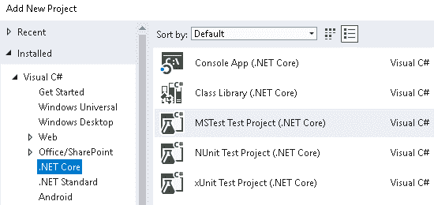
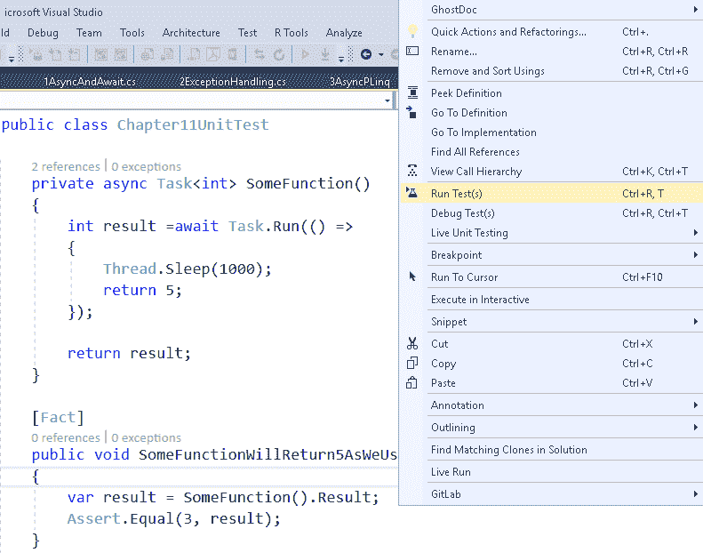
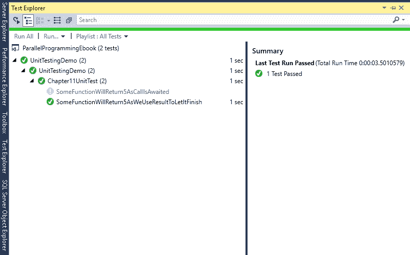
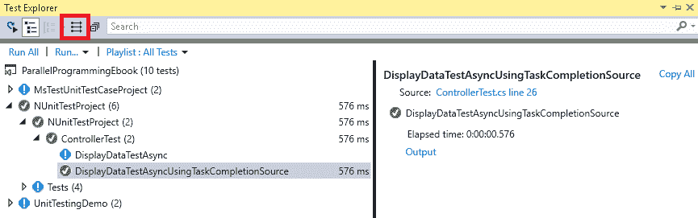

# 为并行和异步代码编写单元测试用例

在本章中，我们将介绍如何为并行和异步代码编写单元测试用例。 编写单元测试用例是在与大型团队合作时编写易于维护的健壮代码的一个重要方面。

使用新的 CI/CD 平台，可以更容易地将运行单元测试用例作为构建过程的一部分。 这有助于在非常早期的阶段发现问题。 编写集成测试也很有意义，这样我们就可以评估不同的组件是否能够正确地一起工作。 虽然你会在 Visual Studio 的社区和专业版中找到更多的特性，但是只有 Visual Studio 企业版支持分析单元测试用例的代码覆盖率。

在本章中，我们将涵盖以下主题:

*   理解为异步代码编写单元测试用例的问题
*   为并行和异步代码编写单元测试用例
*   使用 Moq 模拟异步代码的设置
*   使用测试工具

# 技术要求

基本了解单元测试和 C# 是学习如何使用 Visual Studio 支持的框架编写单元测试用例的必要条件。 本章的源代码可以在 GitHub 上的[https://github.com/PacktPublishing/Hands-On-Parallel-Programming-with-C-8-and-.NET-Core-3/tree/master/Chapter11](https://github.com/PacktPublishing/Hands-On-Parallel-Programming-with-C-8-and-.NET-Core-3/tree/master/Chapter11)找到。

# 使用.NET Core 进行单元测试

.NET Core 支持三种编写单元测试的框架，分别是 MSTest、NUnit 和 xUnit，如下截图所示:



最初，编写测试用例的首选框架是 NUnit。 然后，在 xUnit 被引入.NET Core 之前，MSTest 被添加到 Visual Studio 中。 与 NUnit 相比，xUnit 是一个非常精简的版本，它帮助用户编写干净的测试并利用新特性。 xUnit 的一些好处如下:

*   它是轻量级的。
*   它使用了新的功能。
*   它改善了测试隔离。
*   xUnit 创建者也来自微软，是微软内部使用的一个工具。
*   `Setup`和`TearDown`属性已经被构造函数和`System.IDisposable`替换，因此迫使开发人员编写干净的代码。

单元测试用例只是一个返回`void`的简单函数，它用于测试函数逻辑并根据预定义的输入集验证输出。 为了使函数可识别为一个测试用例，它必须用`[Fact]`属性装饰，如下所示:

```cs
[Fact]
public void SomeFunctionWillReturn5AsWeUseResultToLetItFinish()
{
    var result = SomeFunction().Result;
    Assert.Equal(5, result);
}
```

要运行这个测试用例，我们需要右键单击代码中的函数并单击 run test (s)或 Debug test (s):



测试用例执行的输出可以在 test Explorer 窗口中看到:



虽然这相当简单，但为并行和异步代码编写单元测试用例是有挑战性的。 我们将在下一节中详细讨论这个问题。

# 理解为异步代码编写单元测试用例的问题

异步方法返回一个需要等待以获得结果的`Task`。 如果它没有被等待，该方法将立即返回，而不等待异步任务完成。 考虑下面的方法，我们用它来编写 xUnit 的单元测试用例:

```cs
private async Task<int> SomeFunction()
{
    int result =await Task.Run(() =>
    {
        Thread.Sleep(1000);
        return 5;
    });           
    return result;
}
```

该方法在延迟 1 秒后返回一个常量值 5。 由于该方法使用了`Task`，所以我们使用了`async`和`await`关键字来获得预期的结果。 下面是一个非常简单的测试用例，我们可以使用 MSTest 来测试这个方法:

```cs
[TestMethod]
public async void SomeFunctionShouldFailAsExpectedValueShouldBe5AndNot3()
{
    var result = await SomeFunction();
    Assert.AreEqual(3, result);
 }
```

如您所见，该方法应该失败，因为预期返回值为 3，而该方法返回 5。 当我们运行这个测试时，它通过了:


这里发生的情况是，由于方法被标记为 async，当遇到`await`关键字时，它立即返回。 当一个任务返回时，它被认为在未来某个时间点运行，但是由于测试用例返回时没有任何失败，因此它被测试框架标记为通过。 这是一个值得关注的主要原因，因为这意味着测试将通过，即使任务抛出异常。

前面的测试用例可以写得稍微不同，以使它使用 MSTest 运行:

```cs
[TestMethod]
public void SomeFunctionWillReturn5AsWeUseResultToLetItFinish()
{
    var result = SomeFunction().Result;
    Assert.AreEqual(3, result);
}
```

同样的单元测试用例可以在 xUnit 中编写如下:

```cs
[Fact]
public void SomeFunctionWillReturn5AsWeUseResultToLetItFinish()
{
    var result = SomeFunction().Result;
    Assert.Equal(5, result);
}
```

当我们运行前面的 xUnit 测试用例时，它成功运行。 然而，这段代码的问题在于它是一个阻塞测试用例，这会对测试套件的性能产生重大影响。 更好的单元测试用例应该如下所示:

```cs
[Fact]
public async void SomeFunctionWillReturn5AsCallIsAwaited()
{
    var result = await SomeFunction();
    Assert.Equal(5, result);
}
```

最初，并不是每个单元测试框架都支持异步单元测试用例，正如我们在 MSTest 中看到的那样。 但是，xUnit 和 NUnit 支持它们。 前面的测试用例再次返回成功。

前面的单元测试用例可以用 NUnit 写成如下:

```cs
[Test]
public async void SomeFunctionWillReturn5AsCallIsAwaited()
{
    var result = await SomeFunction();
    Assert.AreEqual(3, result);
}
```

这里与前面的代码有一些不同。 `[Fact]`属性被`[Test]`替换，`Assert.Equal`被`Assert.AreEqual`替换。 然而，当您在 Visual Studio 中尝试运行前面的测试用例时，您将看到主要的区别是它将失败，并出现以下错误:`"Message: Async test method must have non-void return type"`。 因此，对于 NUnit，需要修改方法，如下所示:

```cs
[Test]
public async Task SomeFunctionWillReturn5AsCallIsAwaited()
{
    var result = await SomeFunction();
    Assert.AreEqual(3, result);
}
```

这里唯一的区别是用`Task`代替了`void`。

在本节中，我们看到了在使用为单元测试提供的各种框架时可能会遇到的问题。 现在，让我们看看如何编写更好的单元测试用例。

# 为并行和异步代码编写单元测试用例

在前一节中，我们学习了如何为异步代码编写单元测试用例。 在本节中，我们将讨论为异常场景编写单元测试用例。 考虑以下方法:

```cs
private async Task<float> GetDivisionAsync(int number , int divisor)
{
    if (divisor == 0)
    {
        throw new DivideByZeroException();
    }
    int result = await Task.Run(() =>
    {
        Thread.Sleep(1000);
        return number / divisor;
    });
    return result;
}
```

前面的方法异步返回两个数除法的结果。 如果除数为 0，则该方法抛出`DivideByZero`异常。 我们需要两种类型的测试用例来覆盖这两个场景:

*   检查是否成功
*   检查除数为 0 时的异常结果

# 检查是否成功

测试用例如下所示:

```cs
[Test]
public async Task GetDivisionAsyncShouldReturnSuccessIfDivisorIsNotZero()
{
    int number = 20;
    int divisor = 4;
    var result = await GetDivisionAsync(number, divisor);
    Assert.AreEqual(result, 5);
}
```

可以看到，预期的结果是`5`。 当我们运行测试时，它将在 test Explorer 中显示为成功。

# 检查除数为 0 时的异常结果

我们可以使用`Assert.ThrowsAsync<>`方法为抛出异常的方法编写测试用例:

```cs
[Test]
public void GetDivisionAsyncShouldCheckForExceptionIfDivisorIsNotZero()
{
    int number = 20;
    int divisor = 0;
    Assert.ThrowsAsync<DivideByZeroException>(async () => 
     await GetDivisionAsync(number, divisor));
}
```

如您所见，我们在异步调用`GetDivisionAsync`方法时使用`Assert.ThrowsAsync<DivideByZeroException>`检查断言。 由于我们将`divisor`作为`0`传递，该方法将抛出一个异常，断言将保持为真。

# 使用 Moq 模拟异步代码的设置

模拟对象是单元测试的一个非常重要的方面。 正如你可能知道的，单元测试就是一次测试一个模块; 任何外部依赖项都假定工作正常。

有很多用于.NET 的 mocking 框架，包括以下几个:

*   NSubstitute(在.NETCore中不支持)
*   Rhino Mocks(在.NETCore中不支持)
*   Moq(在.NETCore中支持)
*   NMock3(在.NETCore中不支持)

为了演示，我们将使用 Moq 来模拟服务组件。

在本节中，我们将创建一个包含异步方法的简单服务。 然后，我们将尝试为调用服务的方法编写单元测试用例。 让我们考虑一个服务接口:

```cs
public interface IService
{
    Task<string> GetDataAsync();
}
```

如我们所见，该接口有一个`GetDataAsync()`方法，该方法以异步方式获取数据。 下面的代码片段展示了一个控制器类，它利用一些依赖注入框架来访问服务实例:

```cs
class Controller
{
    public Controller (IService service)
    {
        Service = service;
    }
    public IService Service { get; }
    public async Task DisplayData()
    {
        var data =await Service.GetDataAsync();
        Console.WriteLine(data);
    }
}
```

前面的`Controller`类还公开了一个名为`DisplayData()`的异步方法，该方法从服务中获取数据并将其写入控制台。 当我们试图为上述方法编写单元测试用例时，我们将遇到的第一个问题是，在没有任何具体实现的情况下，我们无法创建服务实例。 即使我们确实有一个具体的实现，我们也应该避免调用实际的服务方法，因为这更适合于集成测试用例而不是单元测试用例。 模拟在这里拯救了我们。

让我们试着用 Moq 为上述方法编写一个单元测试用例:

1.  我们需要安装`Moq`作为一个 NuGet 包。
2.  为其添加命名空间如下:

```cs
using Moq;
```

3.  创建一个模拟对象，如下所示:

```cs
var serviceMock = new Mock<IService>();
```

4.  设置返回虚拟数据的模拟对象。 这可以通过`Task.FromResult`方法实现，如下:

```cs
serviceMock.Setup(s => s.GetDataAsync()).Returns(
                Task.FromResult("Some Dummy Value"));
```

5.  接下来，我们需要通过传递刚刚创建的模拟对象来创建一个控制器对象:

```cs
var controller = new Controller(serviceMock.Object);
```

下面是`DisplayData()`方法的一个简单测试用例:

```cs
 [Test]
        public async System.Threading.Tasks.Task DisplayDataTestAsync()
        {
            var serviceMock = new Mock<IService>();
            serviceMock.Setup(s => s.GetDataAsync()).Returns(
                Task.FromResult("Some Dummy Value"));
            var controller = new Controller(serviceMock.Object);
            await controller.DisplayData();
        }
```

前面的代码展示了如何为模拟对象设置数据。 为模拟对象设置数据的另一种方法是通过`TaskCompletionSource`类，如下所示:

```cs
[Test]
public async Task DisplayDataTestAsyncUsingTaskCompletionSource()
{
    // Create a mock service
    var serviceMock = new Mock<IService>();
    string data = "Some Dummy Value";
    //Create task completion source
    var tcs = new TaskCompletionSource<string>();
    //Setup completion source to return test data
    tcs.SetResult(data);
    //Setup mock service object to return Task underlined by tcs 
    //when GetDataAsync method of service is called
    serviceMock.Setup(s => s.GetDataAsync()).Returns(tcs.Task);
    //Pass mock service instance to Controller
    var controller = new Controller(serviceMock.Object);
    //Call DisplayData method of controller asynchronously
    await controller.DisplayData();
}
```

由于测试用例的数量在企业项目中确实会增长，因此需要能够找到并执行测试用例。 在下一节中，我们将讨论 Visual Studio 中一些可以帮助我们管理测试用例执行过程的通用测试工具。

# 测试工具

在 Visual Studio 中运行测试或查看测试执行结果的最重要的工具之一是 test Explorer。 在本章开始时，我们简要地了解了 Test Explorer。 Test Explorer 的一个关键特性是它能够并行地运行测试用例。 如果您有一个具有多个核的系统，您可以轻松地利用并行性来更快地运行测试用例。 这可以通过单击“测试资源管理器”中的“并行运行测试”工具栏按钮来实现:



根据您的 Visual Studio 版本，Microsoft 提供了一些额外的支持。 一个有用的工具是使用**Intellitest 自动生成单元测试用例的选项。 Intellitest 分析你的源代码，并自动生成测试用例、测试数据和测试套件。 目前.NET 内核还不支持 Intellitest，不过它可以在其他版本的.NET 框架中使用。 它可能会在未来升级到 Visual Studio。**

# 总结

在本章中，我们学习了为异步方法编写单元测试用例，这有助于实现健壮的代码，支持大型团队，并适应新的 CI/CD 平台，这有助于在非常早期的阶段发现问题。 我们首先介绍了一些您在为并行和异步代码编写单元测试用例时可能遇到的问题，以及如何使用正确的编码实践来缓解这些问题。 然后，我们继续讨论 mock，这是单元测试的一个非常重要的方面。

我们了解到，Moq 支持.NET Core，并且.NET Core 的发展非常快; 很快，所有主要的 mock 框架都将得到支持。 还解释了编写测试用例的所有步骤，包括将 Moq 安装为 NuGet 包，以及为模拟对象设置数据。 最后，我们探索了一个重要的测试工具 Test Explorer 的特性，我们可以使用它来编写更清晰的测试用例，以及如何并行化单元测试用例以更快地执行。

在下一章中，我们将介绍 IIS 和 Kestrel 在.NET Core web 应用开发环境中的概念和作用。

# 问题

1.  在 Visual Studio 中，哪些是不受支持的单元测试框架?
    1.  JUnit                          
    2.  NUnit
    3.  xUnit                          
    4.  MSTest
2.  我们如何检查单元测试用例的输出?

    1.  通过使用“任务资源管理器”窗口
    2.  通过使用测试资源管理器窗口
3.  当测试框架是 xUnit 时，哪些属性可以应用于测试方法?
    1.  事实                            
    2.  TestMethod
    3.  测试

4.  如何验证抛出异常的测试用例是否成功?
    1.  `Assert.AreEqual(ex, typeof(Exception)`          
    2.  `Assert.IsException`
    3.  `Assert.ThrowAsync<T>`
5.  .NET Core 支持哪些 mock 框架?
    1.  NSubstitute                        
    2.  Moq
    3.  犀牛模拟                        
    4.  NMock

# 进一步的阅读

你可以在以下网页上阅读并行编程和单元测试技术:

*   [https://www.packtpub.com/application-development/c-multithreaded-and-parallel-programming](https://www.packtpub.com/application-development/c-multithreaded-and-parallel-programming)
*   [https://www.packtpub.com/application-development/net-45-parallel-extensions-cookbook](https://www.packtpub.com/application-development/net-45-parallel-extensions-cookbook)