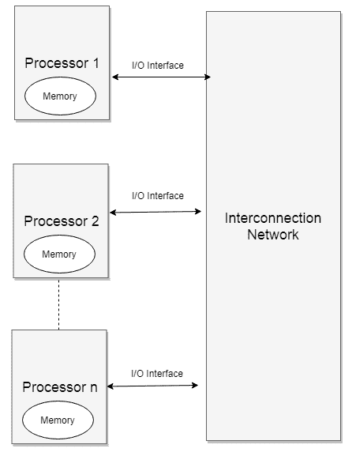
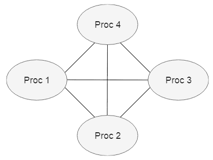
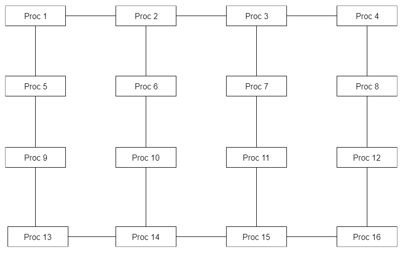
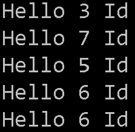

# 分布式内存管理

在过去的 20 年里，行业已经见证了大数据和机器学习架构的范式转变，包括尽可能快地处理 tb / pb 级的数据。 随着计算能力变得更便宜，需要使用多处理器来更大规模地加速处理。 这导致了分布式计算。 分布式计算是指通过一些网络/分布中间件连接的计算机系统的安排。 所有连接的系统共享资源并通过中间件协调它们的活动，以便最终用户将它们的工作方式视为单个系统。 由于现代应用程序对容量和吞吐量的巨大需求，需要分布式计算。 单系统无法满足计算需求的一些典型场景，需要分布在多个计算机网格中:

*   谷歌每年至少执行 1.5 万亿次搜索。
*   物联网设备发送多个 tb 的数据到事件集线器。
*   数据仓库在最短的时间内接收和计算 tb 级的记录。

在本章中，我们将讨论分布式内存管理和对分布式计算的需求。 我们还将学习分布式系统的消息如何通过通信网络传递，以及各种类型的通信网络。

本章将涵盖以下主题:

*   分布式系统的优点
*   共享内存模型与分布式内存模型
*   通信网络类型
*   通信网络的性质
*   探索拓扑
*   使用消息传递编程分布式内存机器
*   集体

# 技术要求

要完成本章，你需要掌握 C 语言编程和 c# Windows 平台 API 调用编程的知识。

# 分布式系统简介

在本书中，我们已经讨论了分布式计算的工作方式。 在本节中，我们将尝试通过一个在数组上工作的小示例来理解分布式计算。

假设我们有一个 1040 个元素的数组，我们想要找到所有这些数字的和:

```cs
a = [1,2,3, 4...., n]
```

如果添加数字所花费的总时间是 x(假设所有的数字都很大)，并且我们想要尽可能快地计算它们，我们可以利用分布式计算。 我们将数组分成多个数组(比如四个数组)，每个数组的元素数为原来的 25%，并将每个数组发送给不同的处理器来计算总和，如下所示:


在这种安排中，所有数字相加所花费的总时间被简化为(x/4 +d)或(x/处理器数量+d)，其中 d 是整理所有处理器的和并将它们相加以得到最终结果所花费的时间。

分布式系统的一些优点如下:

*   系统可以在没有任何硬件限制的情况下扩展到任何级别
*   没有单点故障，这使得它们具有更强的容错性
*   高可用性
*   在处理大数据问题时非常高效

分布式系统经常与并行系统混淆，但它们之间有细微的差别。 并行系统**并行系统**是一种多处理器的排列，它们大多被放置在一个容器中，但有时也被放置在相邻的多个容器中。 另一方面，分布式系统**则由多个处理器(每个处理器都有自己的内存和 I/O 设备)组成，这些处理器通过一个能够进行数据交换的网络连接在一起。**

# 共享内存模型与分布式内存模型

为了实现高性能，已经发展了**多处理器**和**多计算机**架构。 在多处理器体系结构中，多个处理器共享一个公共内存，并通过对共享内存进行读写来相互通信。 在多台计算机中，不共享一个物理内存的多台计算机通过传递消息彼此通信。 **分布式共享内存**(**DSM**)处理物理的、非共享(分布式)架构中的共享内存。

让我们看看每一个，并讨论他们的差异。

# 共享内存模型

在共享内存模型的情况下，多个处理器共享一个公共内存空间。 由于多个处理器共享内存空间，因此需要采取一些同步措施来避免数据损坏和竞争条件。 正如我们在本书中所看到的，同步带来了性能开销。 下面是共享内存模型的示例表示。 正如你所看到的，有**n**个处理器，所有这些处理器都可以访问一个公共的共享内存块:


共享内存模型的特点如下:

*   所有的处理器都可以访问整个内存块。 内存块可以是由内存模块组成的一片内存，如下图所示:


*   处理器之间通过在主内存中创建共享变量进行通信。
*   并行化的效率很大程度上取决于服务总线的速度。
*   由于服务总线的速度，系统只能扩展到 n 个处理器。

共享内存模型也被称为**对称多处理**(**SMP**)模型，因为所有处理器都可以访问所有可用的内存块。

# 分布式内存模型

在分布式内存模型的情况下，内存空间不再在处理器之间共享。 事实上，这些处理器并不共享共同的物理位置; 相反，它们可以被远程放置。 每个处理器都有自己的私有内存空间和 I/O 设备。 数据在处理器之间而不是在单个内存中存储。 每个处理器可以处理自己的本地数据，但要访问存储在其他处理器内存中的数据，它们需要通过通信网络连接。 使用*发送消息*和*接收消息*指令，通过**消息传递**在处理器之间传递数据。 下面是分布式内存模型的图示:



上图描述了每个处理器，以及它自己的内存空间，以及通过 I/O 接口与通信网络**的交互。 让我们试着了解可以在分布式系统中使用的各种类型的通信网络。**

# 通信网络类型

通信网络是连接典型计算机网络中两个或多个节点的链路。 通讯网络分为两类:

*   静态通信网络
*   动态通信网络

让我们来看看这两种情况。

# 静态通信网络

静态通信网络包含链路，如下图所示:



链接用于将节点连接在一起，从而创建一个完整的通信网络，其中任何节点都可以与任何其他节点进行通信。

# 动态通信网络

动态通信网络有链路和交换机，如下图所示:


交换机是具有输入/输出端口的设备，它们将输入数据重定向到输出端口。 这意味着路径是动态的。 如果一个处理器想要向另一个处理器发送数据，它需要通过一个开关来完成，如上图所示。

# 通信网络的性质

在设计通信网络时，我们需要考虑以下几个特点:

*   拓扑结构
*   路由算法
*   切换策略
*   流控制

让我们更详细地看看这些特性。

# 拓扑结构

拓扑是指节点(桥梁、交换机和基础设施设备)之间的连接方式。 常见的拓扑有 crossbar、ring、2D mesh、3D mesh、higherD mesh、2D torus、3D torus、higherD torus、hypercube、tree、butterfly、perfect shuffle、dragonfly 等。

在 crossbar 拓扑的情况下，网络中的每个节点都连接到其他每个节点(尽管它们可能不是直接连接)。 因此，消息可以通过许多路由传递，以避免任何冲突。 下面是一个典型的横向拓扑结构:


在网状拓扑结构的情况下，节点之间直接连接，而不依赖网络中的其他节点。 这样，所有节点都可以独立地传递信息。 网格可以部分连接，也可以完全连接。 下面是一个典型的全连接网格:


我们将在本章后面的*探索拓扑*一节中更详细地研究拓扑。

# 路由算法

路由是一个过程，一个信息包通过网络被发送，以便它到达预定的节点。 路由可以是自适应的，即通过不断从相邻节点获取信息来响应网络拓扑的变化;也可以是非自适应的，即相邻节点是静态的，是在网络启动时将路由信息下载到节点的地方。 需要选择路由算法以确保没有死锁。 例如，在二维环面中，所有的路径都是从东到西，从北到南，以避免出现僵局的情况。 我们将在本章后面更详细地讨论二维环面。

# 切换策略

选择合适的交换策略可以提高网络的性能。 最突出的两种交换策略如下:

*   **电路交换**:在电路交换中，全路径保留给整个消息，例如电话。 为了在电话网络中开始呼叫，需要在呼叫者和被呼叫者之间建立一条专用线路，并且该线路在整个通话期间保持不变。
*   **包交换**:在包交换中，消息被分成单独路由的包，如 internet。 就成本效益而言，它比电路切换要好得多，因为连接的成本是由用户共享的。 包交换主要用于异步场景，如发送电子邮件或文件传输。

# 流控制

流量控制是一个过程，通过它，网络确保数据包在发送方和接收方之间有效地、无误地传输。 在网络拓扑的情况下，发送方和接收方的速度可能会有所不同，这在某些情况下可能会导致瓶颈或数据包丢失。 通过流量控制，我们可以在网络上出现拥塞时做出决策。 一些策略包括将数据临时存储到缓冲区、将数据重新路由到其他节点、指示源节点临时停止、丢弃数据等等。 以下是一些常见的流量控制算法:

*   **Stop and wait**:整个消息被分成几个部分。 发送方向接收方发送一个部件，并在特定的时间段(超时)内等待确认。 发送方一旦收到确认，就发送消息的下一部分。
*   **滑动窗口**:接收端指定一个发送窗口，发送端发送消息。 当窗口满时，发送方必须停止发送，以便接收方能够处理消息并发布下一个发送窗口。 这种方法在接收方将数据存储在缓冲区时效果最好，因此只能接收缓冲区容量。

# 探索拓扑

到目前为止，我们已经了解了一些完整的通信网络，其中每个处理器都可以直接与其他处理器通信，而不需要任何交换机。 这种安排在处理器数量较少的情况下很适用，但如果处理器数量需要增加，则可能成为真正的麻烦。 还可以使用其他各种性能拓扑。 在度量拓扑中图的性能时，有两个重要方面:

*   **图的直径**:节点之间的最长路径。
*   **平分带宽**:将网络分成两等分的最小断面的带宽。 这对于每个处理器都需要与其他处理器通信的网络来说是很重要的。

下面是一些网络拓扑的示例。

# 线性拓扑和环形拓扑

这些拓扑结构适用于一维阵列。 在线性拓扑的情况下，所有的处理器都是线性排列的，只有一个输入和输出流，而在环形拓扑的情况下，处理器形成一个循环返回到起始处理器。

让我们更详细地看看它们。

# 线性阵列

所有处理器呈线性排列，如下图所示:


这种安排将有以下值的直径和平分带宽:

*   直径= n-1，其中 n 是处理器的数量
*   平分带宽= 1

# 环或环

所有的处理器都是环形排列，信息从一个处理器流向另一个处理器，使一个环回到原始处理器。 这样就形成了一个圆环，如下图所示:


这种安排将有以下值的直径和平分带宽:

*   直径= n/2，其中 n 是处理器的数量
*   平分带宽= 2

# 网格和花床

这些拓扑结构可以很好地与 2D 和 3D 阵列配合使用。 让我们更详细地看看它们。

# 2 d 网格

在网状结构的情况下，节点之间直接连接，而不依赖于网络中的其他节点。 所有节点呈二维网格排列，如下图所示:



这种安排将有以下值的直径和平分带宽:

*   直径= 2 *(根号(n) - 1)，其中 n 是处理器的数量
*   平分带宽=根号(n)

# 2 d 环

所有处理器呈二维环面排列，如下图所示:


这种安排将有以下值的直径和平分带宽:

*   直径=√(n)，其中 n 是处理器的数量
*   平分带宽= 2 *根号(n)

# 使用消息传递编程分布式内存机器

在本节中，我们将讨论如何使用 Microsoft 的**消息传递接口**(**MPI**)对分布式内存机进行编程。

MPI 是一种标准的、可移植的系统，是为分布式和并行系统开发的。 它定义了并行硬件供应商用来支持分布式内存通信的基本功能集。 在下面几节中，我们将讨论使用 MPI 优于旧消息传递库的优点，并解释如何安装和运行一个简单的 MPI 程序。

# 为什么 MPI ?

MPI 的一个优点是 MPI 例程可以从各种语言调用，比如 C、c++、c#、Java、Python 等等。 与旧的消息库相比，MPI 具有高度的可移植性，并且 MPI 例程针对它们要运行的每一块硬件进行了速度优化。

# Windows 下安装 MPI

MPI 可以从[https://www.open-mpi.org/software/ompi/v1.10/](https://www.open-mpi.org/software/ompi/v1.10/)下载并以 ZIP 文件的形式安装。

您也可以从[https://github.com/Microsoft/Microsoft-MPI/releases](https://github.com/Microsoft/Microsoft-MPI/releases)下载微软版本的 MPI。

# 使用 MPI 的示例程序

下面是一个简单的`HelloWorld`程序，我们可以使用 MPI 运行它。 程序在延迟两秒后打印正在执行代码的处理器号。 相同的代码可以在多个处理器上运行(我们可以指定处理器计数)。

让我们在 Visual Studio 中创建一个新的控制台应用程序项目，并在`Program.cs`文件中写入以下代码:

```cs
[DllImport("Kernel32.dll"), SuppressUnmanagedCodeSecurity]
public static extern int GetCurrentProcessorNumber();

static void Main(string[] args)
{
    Thread.Sleep(2000);
    Console.WriteLine($"Hello {GetCurrentProcessorNumber()} Id");
}
```

`GetCurrentProcessorNumber()`是一个实用函数，它给出代码执行位置的处理器号。 从前面的代码中可以看到，没有什么神奇的——它作为单个线程运行并打印`Hello`和当前处理器号。

我们将从*在 Windows 上安装 MPI*节中提供的 Microsoft MPI 链接安装`msmpisetup.exe`。 安装完成后，我们需要在命令提示符中执行以下命令:

```cs
C:\Program Files\Microsoft MPI\Bin>mpiexec.exe -n 5 “path to executable “
```

这里，`n`表示我们希望程序在其上运行的处理器数量。

下面是上述代码的输出:



如您所见，我们可以使用 MPI 在多个处理器上运行相同的程序。

# 基本的发送/接收使用

MPI 是一个 c++实现，微软网站上的大多数文档只能用 c++。 然而，创建. net 编译包装器并在我们的任何项目中使用它是很容易的。 有一些第三方的。net 实现也可以用于 MPI，但不幸的是，目前还不支持。net Core 实现。

下面是一个将数据缓冲区发送到另一个处理器的函数的语法:

```cs
int MPIAPI MPI_Send(
  _In_opt_ void         *buf, //pointer to buffer containing Data to send
           int          count, //Number of elements in buffer
           MPI_Datatype datatype,//Datatype of element in buffer
           int          dest, //rank of destination process
           int          tag, //tag to distinguish between messages
           MPI_Comm     comm //Handle to communicator
);
```

该方法在缓冲区可以安全地重用时返回。

下面是一个`MPU_Recv`函数的语法，它将从另一个处理器接收一个数据缓冲区:

```cs
int MPIAPI MPI_Recv(
  _In_opt_ void         *buf,
           int          count,
           MPI_Datatype datatype,
           int          source,
           int          tag,
           MPI_Comm     comm,
  _Out_    MPI_Status   *status //Returns MPI_SUCCESS  or the error code.
);
```

这个方法直到收到缓冲区才返回。

下面是使用发送和接收函数的典型示例:

```cs
#include “mpi.h”
#include <iostream> int main( int argc, char *argv[]) { int rank, buffer; MPI::Init(argv, argc); rank = MPI::COMM_WORLD.Get_rank(); // Process 0 sends data as buffer and Process 1 receives data as buffer if (rank == 0) { buffer = 999999; MPI::COMM_WORLD.Send( &buffer, 1, MPI::INT, 1, 0 ); } else if (rank == 1) { MPI::COMM_WORLD.Recv( &buffer, 1, MPI::INT, 0, 0 ); std::cout << “Data Received “ << buf << “\n”; } MPI::Finalize(); return 0; }
```

当通过 MPI 运行时，通信器将发送数据，这些数据将由另一个处理器的接收函数接收。

# 集体

集合，顾名思义，是一种通信方法，其中包含一个通信器中的所有处理器。 集体帮助我们完成这些任务。 以下是两种主要用于此的集体方法:

*   `MPI_BCAST`:这个**将****数据从一个通信器中的一个(根)进程分发到另一个处理器**
***   `MPI_REDUCE`:这个**将通信器中所有处理器的**数据合并并返回给根进程**

 **既然我们理解了集体，我们就到了这一章的结尾，也最终到了本书的结尾。 现在，是时候看看我们学到了什么!

# 总结

在本章中，我们讨论了分布式内存管理的实现。 我们学习了分布式内存管理模型，比如共享内存和分布式内存处理器，以及它们的实现。 最后，我们讨论了什么是 MPI 以及如何利用它。 我们还讨论了通信网络和实现高效网络的各种设计考虑。 现在，您应该对网络拓扑、路由算法、交换策略和流控制有了很好的理解。

在本书中，我们介绍了。net Core 3.1 中用于实现并行编程的各种编程结构。 如果正确使用并行编程，可以极大地提高应用程序的性能和响应能力。 net Core 3.1 中提供的新特性和语法确实使编写/调试和维护并行代码变得更容易。 为了便于比较，我们还介绍了在 TPL 出现之前我们是如何编写多线程代码的。

通过异步编程的新构造(async 和 await)，我们了解了在程序流是同步的情况下如何充分利用非阻塞 I/ o。 然后，我们讨论了一些新特性，如异步流和异步主方法，它们帮助我们更容易地编写异步代码。 我们还讨论了 Visual Studio 中的并行工具支持，它可以帮助我们更好地调试代码。 最后，我们讨论了如何为并行代码编写单元测试用例，以使我们的代码更加健壮。

然后，我们通过介绍分布式编程技术以及如何在。net Core 中使用它们来结束这本书。

# 问题

1.  ____________ 是一种多处理器的排列方式，它们大多被放置在单个容器中，但有时也被放置在相邻的多个容器中。
2.  在动态通信网络的情况下，任何节点都可以向其他节点发送数据。
    1.  真正的
    2.  假
3.  以下哪项是通信网络的特征?
    1.  拓扑结构
    2.  切换策略
    3.  流控制
    4.  共享内存
4.  在分布式内存模型的情况下，内存空间是跨处理器共享的。
    1.  真正的
    2.  假
5.  电路交换可以用于异步场景。
    1.  真正的
    2.  假**