# *第 6 章*:材料和效果与 URP 和着色图

欢迎来到*第二部分*第一章! 我非常高兴你能读到这本书的这一部分，因为在这里我们将深入探讨 Unity 的不同图像和音频系统，以显著改善游戏的外观和感觉。 我们将从本章开始这一部分，我们将讨论材质的着色器是什么，以及如何创建我们自己的着色器来实现几个自定义的效果，不能使用默认的 Unity 着色器完成。 我们将创建一个简单的水动画效果来学习这个新概念。

在本章中，我们将研究以下着色器的概念:

*   着色器简介
*   用着色图创建着色器

# 介绍着色器

我们在前一章的中创建了 Materials，但是我们从来没有讨论过它们内部是如何工作的，以及为什么 Shader 属性非常重要。 在本章的第一节中，我们将探索着色器的概念，作为一种编程视频卡实现自定义视觉效果的方法。

在本节中，我们将涵盖以下与着色器相关的概念:

*   着色器管道
*   渲染管道和 URP
*   URP 内置的着色器

让我们从讨论着色器如何修改着色管道来实现效果开始。

## 着色管道

每当一个显卡渲染一个 3D 模型时，它都需要输入数据来处理，例如网格、纹理、对象的变换(位置、旋转和缩放)，以及影响该对象的灯光。 有了这些数据，显卡必须将对象的像素输出到 Back-Buffer 中，即显卡将在其中绘制对象的图像。 当 Unity 渲染完所有对象(和一些效果)，显示完成的场景时，图像将显示出来。 基本上，Back-Buffer 是视频卡一步一步渲染的图像，当绘制完成时显示它(此时，它成为 front buffer，与前一个交换)。

这是渲染对象的通常方式，但数据输入和像素输出之间发生的事情可以通过无数不同的方式和技术来处理，这取决于你想要的对象的外观; 也许你希望它是真实的或者看起来像一个全息图，也许物体需要一个分解效果或者一个卡通效果——有无限的可能性。 指定我们的视频卡如何处理对象的渲染的方法是通过一个着色器。

着色器是用特定的显卡语言(如 CG、HLSL 或 GLSL)编写的程序，它配置渲染过程的不同阶段，有时不仅配置它们，还用完全定制的代码替换它们，以达到我们想要的确切效果。 渲染的所有阶段都形成了我们所称的着色器管道(Shader Pipeline)，这是一条对输入数据进行修改的链，直到它被转换成像素。

重要提示

有时候，我们在本书中所称的着色器管道也可以在另一个参考书目中找到渲染管道，而后者也是正确的，在 Unity 中，术语渲染管道指的是不同的东西，所以让我们坚持这个名称。

管道的每个阶段都负责不同的修改，取决于显卡着色器模型，这个管道可以有很大的变化。 在下一个图中，你可以找到一个简化的渲染管道，跳过高级/可选阶段，现在不重要:

图 6.1 - Common Shader 流水线

让我们来讨论每个阶段:

*   **Input Assembler**:这里是所有网格数据，如顶点位置、uv 和法线，被组装起来，为下一阶段做准备。 你在这里做不了什么; 这个过程几乎总是相同的。
*   **Vertex Shader**:在过去，这个阶段仅限于应用物体的变换，相机的位置和透视，以及一些简单但有限的光照计算。 有了现代的 gpu，你可以负责做任何你想做的事情。 这个阶段接收对象的每个顶点来渲染并输出一个修改后的顶点，所以基本上，你有机会在这里修改对象的几何形状。 通常的代码基本上是相同的老视频卡,应用对象的变换,但是你可以做一些影响,如膨胀对象沿法线将旧的卡通效果技术或应用一些扭曲,使全息图的效果(看看全息图的效果在死亡*滞留)。 也有机会计算下一阶段的数据，但我们现在不会深入到那么深。*
**   **Culling**:对于你将要渲染的大多数模型，你将永远看不到模型脸的背面。 让我们以一个立方体为例; 没有办法看到它的背面或任何侧面的内侧，因为它们会自动被其他侧面遮挡。 知道了这一点，渲染立方体的每个面的两面，即使看不到背面，也没有意义，幸运的是，这个阶段解决了这个问题。 Culling 将根据人脸的方向来决定是否需要渲染人脸，从而节省了大量的遮挡人脸的像素计算。 你可以改变它以在特定的情况下表现不同; 例如，我们可以创建一个玻璃盒子，它需要透明才能看到盒子的所有方面。*   **栅格化**:现在我们已经计算了模型的修改和可见的几何图形，是时候将其转换为像素了。 光栅化器为网格的三角形创建所有像素。 这里发生了很多事情，但我们对它的控制非常有限; 通常栅格化的方法是，只是创建网格三角形边缘内的所有像素。 我们也有其他模式，只是渲染边缘的像素来看到线框效果，但这通常用于调试目的:*

 *

图 6.2 -图形栅格化示例

*   **片段着色器**:这是所有阶段中最可定制的。 它的目的很简单:只是确定光栅化器生成的每个片段(像素)的颜色。 在这里，可以发生很多事情，从简单地输出一个纯色或采样纹理到应用复杂的照明计算，如法线映射和 PBR。 此外，您可以使用这个阶段来创建特殊效果，如水动画、全息图、变形、分解，以及其他需要修改像素外观的特殊效果。 我们将在本章的下一节中探讨如何使用这一阶段。
*   **Depth Testing**:在完成像素给出之前，我们需要检查是否可以看到该像素。 这个阶段检查像素的深度是在之前渲染的像素的后面还是前面，保证不管对象的渲染顺序如何，最接近相机的像素总是被绘制在其他像素之上。 通常情况下，这个阶段会保持默认状态，优先考虑靠近相机的像素，但有些效果需要不同的行为。 举个例子，在下面的截图中，你可以看到一个让你看到其他物体后面的物体的效果，比如《帝国时代》*中的单位和建筑:*

 *

图 6.3 -渲染角色被遮挡的部分

*   **混合**:一旦确定像素的颜色，并且我们确定像素没有被前一个像素遮挡，最后一步是将其放入 Back-Buffer(你正在绘制的帧或图像)中。 通常的做法是覆盖该位置的任何像素(因为我们的像素更靠近相机)，但如果你考虑透明物体，我们需要将我们的像素与前一个像素结合，以产生透明效果。 除了混合，透明还需要考虑其他的事情，但主要的想法是混合控制像素如何与 Back-Buffer 中先前渲染的像素相结合。

着色管道是一个需要一整本书的主题，但对于这本书的范围，前面的描述将给你一个很好的想法，一个着色器做什么，以及它可能实现的效果。 既然我们已经讨论了着色器如何渲染单个对象，那么就有必要讨论 Unity 如何使用渲染管道渲染所有对象。

## 渲染管道和 URP

我们已经介绍了显卡如何渲染一个对象，但是 Unity 需要来要求显卡执行每个对象的 Shader Pipeline。 为了做到这一点，Unity 需要做大量的准备工作和计算来确定如何以及何时执行每个着色器。 的任务是由 Unity 所称的渲染管道来完成。

渲染管道是一种绘制场景对象的方法。 一开始，似乎只有一种简单的方法可以做到这一点，比如迭代场景中的所有对象，并使用每个对象的材质中指定的着色器执行着色管道，但实际情况可能比这更复杂。 通常，一个渲染管道和另一个渲染管道的主要区别是照明和一些高级效果的计算方式，但它们可以在其他方面有所不同。

在以前的 Unity 版本中，只有一个渲染管道，现在叫做内置渲染管道。 这是一个拥有各种项目所需要的所有可能功能的管道，从移动 2D 图像和简单的 3D 图像到你可以在主机或高端 pc 上找到的尖端 3D 图像。 这听起来很理想，但实际上并非如此; 一个巨大的渲染器需要高度定制，以适应所有可能的场景，这会产生大量的开销和限制，比创建一个自定义的渲染管道更头疼。 幸运的是，Unity 的最新版本在 e (SRP)中引入了**可脚本渲染管道，这是一种为你的项目创建渲染管道的方法。**

值得庆幸的是,统一不希望您创建自己的渲染管道为每个项目(一项复杂的任务),这为你创建了两个自定义管道已经准备好使用:URP(以前称为 LWRP),即普遍的渲染管道,和 HDRP 代表高清晰度渲染管道。 的想法是，您必须根据您的项目需求(除非您确实需要创建自己的)选择其中一个。 URP 是我们在为游戏创建项目时选择的一个渲染管道，它适用于大多数不需要很多高级图像功能的游戏，比如手机游戏或简单的 PC 游戏，而 HDRP 则为高质量的游戏提供了大量高级渲染功能。 后者需要高端硬件来运行，而 URP 在几乎所有相关的目标设备上运行。 值得一提的是，你可以随时在内置渲染器、HDRP 和 URP 之间切换，包括在创建项目之后(不推荐):

图 6.4 -显示 HDRP 和 URP 模板的项目向导

我们可以讨论它们是如何实现的，以及它们之间的差异，但同样地，这可以填满整个章节; 现在,本节的想法是让你知道我们为什么选择 URP 当我们创建的项目,因为它有一些限制,我们将在本书中,我们会遇到需要考虑,因此,很高兴知道为什么我们接受这些限制(所有相关硬件上运行我们的游戏)。 此外，我们需要知道我们选择了 URP，因为它支持着色器图形，我们将在本章中使用 Unity 工具来创建自定义效果。 之前的 Unity 内置管道没有为我们提供这样的工具(除了第三方插件)。 最后,介绍了 URP 的概念的另一个原因是,它有很多内置的着色器我们需要知道之前创建我们的自己的为了避免重新发明轮子,并适应那些阴影,因为如果你来自早期版本的统一,你知道的不会在这里工作, 事实上，这正是我们将要在这本书的下一部分讨论的:不同 URP 内置着色器之间的区别。

## URP 内置着色器

现在我们知道了 URP 和其他管道之间的区别，让我们来讨论一下哪些着色器集成到 URP 中。 让我们简单描述一下这个管道中三个最重要的着色器:

*   **Lit**:这是旧的标准着色器的替换。 这个着色器是有用的，当创建各种真实的物理材料，如木材，橡胶，金属，皮肤，和他们的组合(如一个角色与皮肤和金属盔甲)。 它支持法线映射，遮挡，金属和镜面工作流，以及透明。
*   **Simple Lit**:这是旧的移动/漫反射着色器的替换。 顾名思义，这个着色器是 Lit 的一个更简单的版本，这意味着它的照明计算是光如何工作的更简单的近似，比它的对应版本获得更少的功能。 基本上，当你有简单的图形而没有逼真的灯光效果时，这是最好的选择。
*   **Unlit**:这是替换旧的 Unlit/Texture 着色器。 有时候，你需要没有光照的物体，在这种情况下，这就是你的着色器。 没有照明并不意味着没有光或完全黑暗; 这实际上意味着物体没有任何阴影，没有任何阴影，它完全可见。 一些简单的图形可以处理这一点，依赖于阴影在纹理中烘烤，这意味着纹理与阴影一起出现。 这是极好的性能，特别是对于低端设备，如移动电话。 此外，还有其他情况，如光管或屏幕，这些物体不能接收阴影，因为它们发出光，所以即使在完全黑暗中，它们也能被看到全彩。 在下面的截图中，你可以看到一个使用 Unlit 着色器的 3D 模型。 它看起来像是被点亮了，但它只是模型的纹理，较浅的颜色和较深的颜色被应用在物体的不同部分:

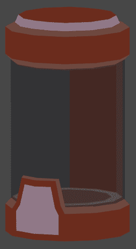

图 6.5 - Pod 使用 Unlit 效果来模拟廉价照明

让我们用 Simple Lit Shader 做一个有趣的分解效果来展示它的能力。 你必须做到以下几点:

1.  Download and import a **Cloud Noise** Texture from any search engine:

    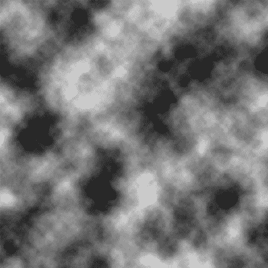

    图 6.6 -噪音纹理

2.  在项目面板中选择最近导入的纹理。
3.  In the Inspector, set the **Alpha Source** property to **From Gray Scale**. This will mean the alpha channel of the texture will be calculated based on the grayscale of the image:

    

    图 6.7 -从灰度纹理设置生成 Alpha

    重要提示

    颜色的 alpha 通道通常与透明度有关，但你会注意到我们的对象不是透明的。 Alpha 通道是额外的颜色数据，在制作效果时可以用于多种目的。 在本例中，我们将使用它来确定哪些像素首先被分解。

4.  Create a Material by clicking on the **+** icon in the Project View and selecting **Material**:

    

    图 6.8 -材质创建按钮

5.  Create a cube with the **GameObject | 3d Object | Cube** option at the top menu of Unity:

    

    图 6.9 -多维数据集原语创建

6.  将创建的材质从项目窗口拖动到立方体上以应用该材质。
7.  Click in the drop-down menu at the right of the Shader property in the Inspector and look for the **Universal Render Pipeline | Simple Lit** option:

    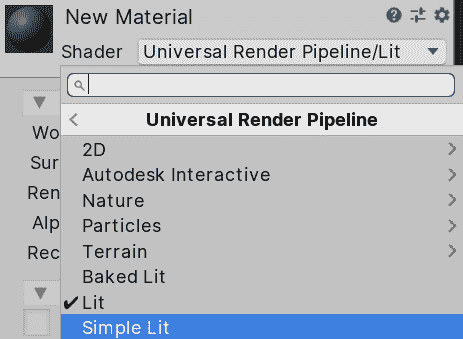

    图 6.10 - Simple Lit 着色器选择

8.  选择**材质**，在**底图中**设置最近下载的云噪纹理。
9.  Check the **Alpha Clipping** checkbox and set the **Threshold** slider to **0.5**:

    

    图 6.11 Alpha 剪辑阈值材质滑块

10.  You will see how as you move the Alpha Clipping slider, the object starts to disintegrate. Alpha Clipping discards pixels that have less Alpha intensity than the style value:

    

    图 6.12 Alpha 剪裁的崩解效果

11.  Finally, set **Render Face** to **Both** to turn off the **Culling Shader Stage** and see both sides of the cube's faces:

    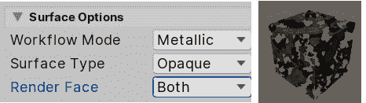

    图 6.13 双面 Alpha 剪裁

12.  要考虑到，创建纹理的美工可以手动配置 Alpha 通道，而不是根据灰度来计算，只是为了精确地控制分解效果，而不管纹理的颜色分布。

本节的想法不是给所有 URP 着色器的所有属性一个全面的指南，而是给你一个想法，一个着色器可以做什么，当正确配置和什么时候使用每个集成着色器。 有时候，你可以通过使用现有的着色器来达到你需要的效果。 事实上，在简单游戏中，99%的情况下你都可以这么做，所以你要尽可能地坚持使用它们。 但如果你真的需要创建一个自定义着色器来创建一个非常具体的效果，下一节将教你如何使用 URP 工具称为着色器图。

# 使用着色图创建着色器

现在我们知道了着色器是如何工作的，以及 URP 中现有的着色器，我们有了一个基本的概念，什么时候需要创建一个自定义着色器，什么时候不需要。 如果你真的需要创建一个，这一节将涵盖使用着色器图形(Shader Graph)创建效果的基础知识，这是一个使用可视化的基于节点的编辑器创建效果的工具，是一个很容易使用的工具，当你不习惯编码。

在本节中，我们将讨论着色图的以下概念:

*   创建我们的第一个着色图
*   使用纹理
*   结合纹理
*   应用透明

让我们开始看看如何创建和使用着色图。

## 创建我们的第一个着色器图形资产

Shader Graph 是一个工具，允许我们使用基于节点的系统创建自定义效果。 Shader Graph 中的效果可以如下截图所示，在这里你可以看到创建全息图效果所需的节点:

图 6.14 着色器图形与节点创建自定义效果

我们将在后面讨论这些节点做什么，并将逐步实现效果的例子，但在截图中，你可以看到作者如何创建和连接几个节点，这些节点是那些相互连接的盒子，每个节点做一个特定的过程来实现效果。 使用 Shader Graph 创建效果的想法是了解你需要哪些特定的节点，以及如何正确地连接它们，以创建一个“算法”或一系列有序的步骤来实现一个特定的结果。 这与我们编写游戏玩法的方式类似，但为了达到效果，我们对图进行了调整和简化。

创建和编辑我们的第一个着色器图形资产，执行以下步骤:

1.  In the Project Window, click the **+** icon and find the **Shader | PBR Graph** option. This will create a Shader Graph using PBR mode, meaning that this Shader will support lighting effects (unlike Unlit Graphs):

    

    图 6.15 创建 PBR 着色器图

2.  Name it **WaterGraph**. If you lose the opportunity to rename the asset, remember that you can select the asset, right-click, and select **Rename**:

    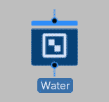

    图 6.16 着色器图形资产

3.  Create a new Material called **WaterMaterial** and set **Shader** to **Shader Graphs/Water**. If for some reason Unity doesn't allow you to do that, try right-clicking **WaterGraph** and clicking **Reimport**. As you can see, the created Shader Graph asset now appears as a Shader in the Material, meaning that we have already created a custom Shader:

    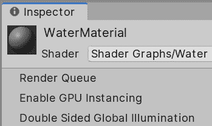

    图 6.17 设置一个着色器图形作为材质着色器

4.  使用**GameObject | 3d Object | Plane**选项创建一个平面。
5.  将**材质**拖动到**平面**上应用。

现在，你已经创建了你的第一个自定义着色器，并将其应用到一个材质。 到目前为止，它看起来一点都不有趣——它只是一个灰色效果，但现在是时候编辑图来释放它的全部潜力了。 正如图的名字所示，我们将在本章创建一个水效果来说明着色器图工具集中的几个节点以及如何连接它们，所以让我们从讨论主节点开始。 当你通过双击打开图形时，你会看到以下内容:

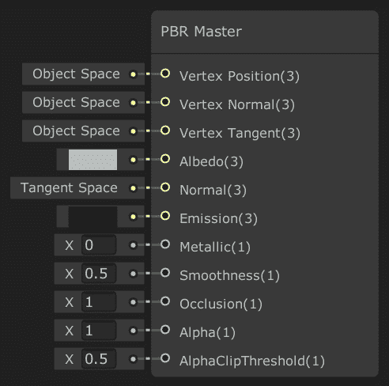

图 6.18 主节点具有计算对象外观所需的所有属性

所有节点都有输入插脚、它们工作所需的数据和输出插脚，输出插脚是其过程的结果。 例如，在求和运算中，我们将有两个输入数和一个输出数，它们是求和的结果。 在这种情况下,您可以看到,主节点只有输入,因为所有数据,进入主节点将使用统一计算物体的呈现和照明,比如所需的对象颜色或纹理(反照率输入插口),是多么光滑(平滑输入插口), 或它包含多少金属(金属输入引脚)，所以它们是所有的属性，将影响如何照明将应用到对象。 从某种意义上说，这个节点的输入就是整个图的输出数据以及我们需要填充的数据。

让我们开始探索如何通过以下方法来改变输出数据:

1.  双击**Shader Graph**打开其编辑器窗口。
2.  Click in the gray rectangle to the left of the **Albedo** input pin:

    

    图 6.19 Albedo 主节点输入引脚

3.  In the color picker, select a light blue color, like water. Select the bluish part of the circle around the picker and then a shade of that color in the middle rectangle:

    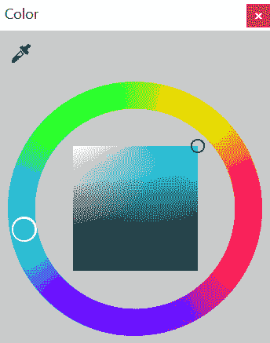

    图 6.20 颜色选取器

4.  Set **Smoothness** to **0.9**:

    

    图 6.21 平滑度 PBR 主节点输入引脚

5.  Click the **Save Asset** button at the top-left of the window:

    

    图 6.22 Shader Graph 保存选项

6.  回到场景视图，检查平面是浅蓝色的，并且有太阳的反射:

图 6.23 初始着色器图结果

正如你所看到的，着色器的行为会根据你在主节点中设置的属性而变化，但是到目前为止，这样做与创建 Unlit 着色器并设置其属性没有什么不同; Shader Graph 的真正强大之处在于当你将执行特定计算的节点作为主节点的输入时。 我们将开始看到纹理节点，这允许我们应用纹理到我们的模型。

# 使用纹理

使用纹理的想法是将图像应用到模型中，这意味着我们可以用不同的颜色为模型的不同部分绘制。 记住，模型有 UV 贴图，它允许 Unity 知道纹理的哪个部分将应用到模型的哪个部分:

图 6.24 左侧为人脸纹理; 在右边，同样的纹理应用于一个面网格

我们有几个节点来完成这个任务，其中一个是 Sample Texture 2D，这个节点有两个主输入。 首先，它要求我们对纹理进行采样或应用于模型，然后是 UV。 你可以在下面的截图中看到:

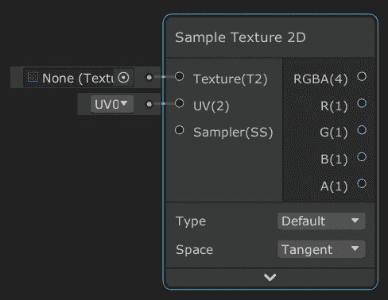

图 6.25 纹理节点示例

正如你所看到的，纹理输入节点的默认值是**None**，所以默认没有纹理，我们需要手动指定它。 对于 UV，默认值是 UV0，这意味着，默认情况下，节点将使用模型的主 UV 通道，是的，一个模型可以设置几个 UV 通道，但现在，我们将坚持使用主 UV 通道。 让我们试试这个节点，执行以下操作:

1.  Download and import a **Tileable Water Texture** from the internet:

    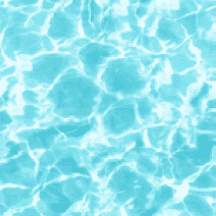

    图 6.26 水纹纹理

2.  Select the Texture and be sure that the **Wrap Mode** property of the Texture is on **Repeat**, which will allow us to repeat the Texture as we did in the terrain, because the idea is to use this Shader to cover large water areas:

    

    图 6.27 纹理重复模式

3.  In the **Water Shader Graph**, right-click in an empty area of the **Shader Graph** and select **Create Node**:

    

    图 6.28 Shader Graph Create Node 选项

4.  In the Search box, write **Sample texture** and all of the sample nodes will show up. Select **Sample Texture 2D** double clicking it:

    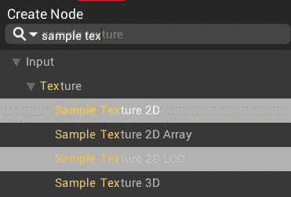

    图 6.29 纹理节点搜索示例

5.  Click in the circle to the left of the Texture input pin of the Sample Texture 2D node. It will allow us to pick a Texture to sample—just select the water one. You can see that the Texture can be previewed in the bottom part of the node:

    

    图 6.30 在其输入引脚中带有纹理的纹理节点示例

6.  Drag the output pin **RGBA** from the **Sample Texture 2D** node to the **Albedo** input pin of the Master node:

    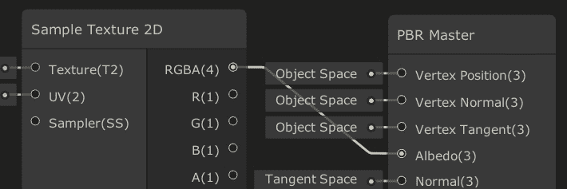

    图 6.31 将纹理采样结果与主节点的 Albedo 引脚连接

7.  点击着色器图形编辑器左上角的**保存资产**按钮，查看场景视图的变化:

图 6.32 在着色图中应用纹理的结果

正如你所看到的，纹理被正确地应用到模型中，但是如果你考虑到默认平面的大小是 10x10 米，那么水的波纹看起来太大了，所以让我们平铺纹理! 要做到这一点，我们需要改变模型的 uv，使它们更大。 更大的 uv 听起来像是纹理也应该变大，但要考虑到我们并没有让物体变大; 我们只是修改了 UV，所以相同的物体大小将读取更多的纹理，这意味着更大的纹理样本区域将重复纹理，并将它们放在相同的物体大小中，所以这将被压缩到模型区域内。 要做到这一点，请遵循以下步骤:

1.  Right-click in any empty space area and click **New Node** to search the UV node:

    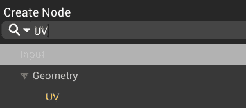

    图 6.33 搜索 UV 节点

2.  使用相同的方法创建一个**乘以**节点。
3.  Set the **B** pin input value to (**4**,**4**,**4**,**4**):

    

    图 6.34 uv 乘以 4

4.  将 UV 节点的**引脚拖出到**乘**节点的**A**引脚上，连接它们。**
***   Drag the **Out** pin of the **Multiply** node to the **UV** pin of the **Sample Texture 2D** node to connect them:

    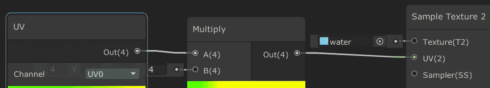

    图 6.35 使用成倍的 uv 来采样纹理

    *   如果你保存图形并回到场景视图，你可以看到现在的波纹更小了，因为我们已经平铺了我们的模型的 uv。 你也可以在**采样器纹理 2D**节点的预览中看到:**

 **

图 6.36 模型的紫外线倍增结果

我们现在可以做的另一个有趣的效果是对纹理应用偏移来移动它。 我们的想法是，即使飞机实际上没有移动，我们也会模拟水通过它的流动，只移动纹理。 记住，决定将纹理的一部分应用到模型的每个部分的责任属于 UV，所以如果我们向 UV 坐标添加值，我们将移动它们，生成一个纹理滑动效果。 为此，让我们做以下工作:

1.  创建一个**Add**node 到**Multiply**node 的右边。
2.  Connect the **Out** pin of the UV to the **A** pin of the **Add** node:

    

    图 6.37 增加 uv 值

3.  在**添加**节点的左侧创建一个**Time**节点。
4.  Connect the **Time** node to the **B** pin of the **Add** node:

    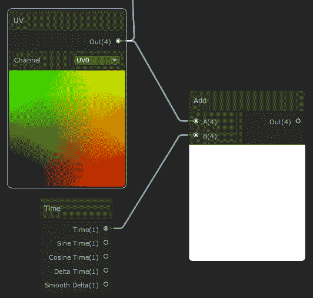

    图 6.38 增加 uv 时间

5.  Connect the **Out** pin of the **Add** node to the **A** input pin of the **Multiply** node:

    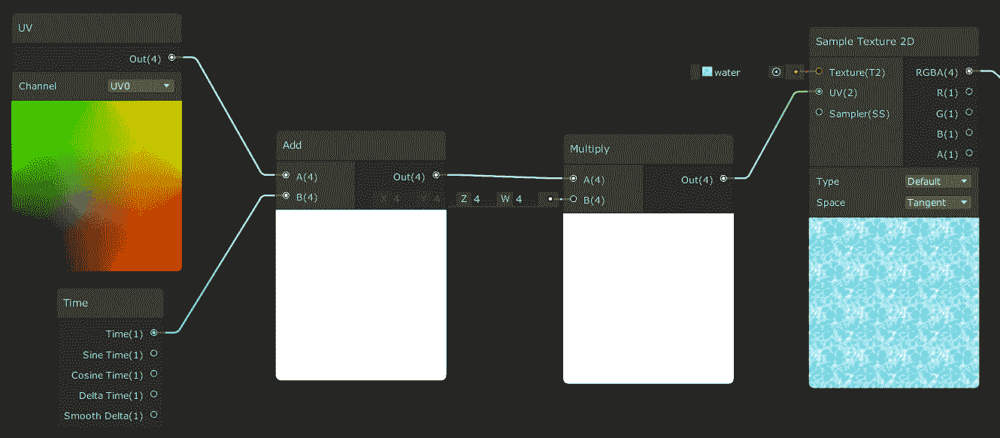

    图 6.39 添加并乘以 uv 作为 Sample Texture 的输入

6.  保存并看到水在场景视图中移动。
7.  If you feel the water is moving too fast, try to use the multiplication node to make the time a smaller value. I recommend you try it by yourself before looking at the next screenshot, which has the answer:

    

    图 6.40 乘上时间使其移动得更快

8.  如果你觉得图形开始变大，尝试隐藏一些节点预览，点击向上箭头，当你把鼠标移动到预览上:

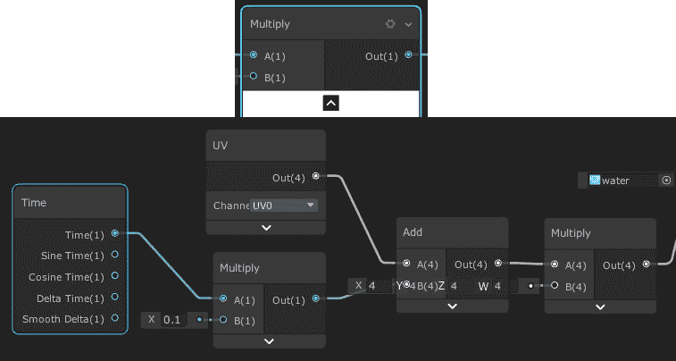

图 6.41 从图节点中隐藏预览和未使用的引脚

所以，总结一下，首先我们将时间添加到 UV 中以移动它，然后乘以已移动的 UV 的结果以使它更大以平铺纹理。 值得一提的是，有一个平铺和偏移节点为我们做了所有这些，但我想向你展示如何简单的乘法缩放 UV 和添加操作移动它产生一个很好的效果; 您无法想象使用其他简单的数学节点可以实现的所有可能效果! 实际上，让我们在下一节中探索数学节点的其他用法来组合纹理。

# 组合纹理

即使我们有使用的节点，我们还没有创建任何不能使用常规着色器创建的东西，但这即将改变。 到目前为止，我们可以看到水在移动，但它看起来仍然是静态的，这是因为涟漪总是相同的。 我们有几种产生涟漪的技术，最简单的一种是将两个在不同方向移动的水纹理混合在一起，实际上，我们可以简单地使用相同的纹理，只是翻转，以节省一些内存。 为了合并纹理，我们将它们加起来，然后除以 2，所以基本上，我们是在计算纹理的平均值! 让我们通过以下步骤来实现:

1.  Select all of the nodes between **Time** and **Sampler 2D** (including them), creating a selection rectangle by clicking in any empty space in the graph, holding and dragging the click, and then releasing when all target nodes are covered:

    

    图 6.42 选择多个节点

2.  右键单击并选择**副本,然后再次右键单击并选择**粘贴**,或者使用经典的*Ctrl + C*,【显示】Ctrl + V*命令(【病人】命令+*,【t16.1】命令+*V*在 Mac), 或者只是*Ctrl*+*D*(*命令*+*D*)。******
***   Move the copied nodes below the original ones:

    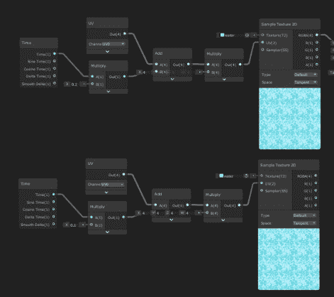

    图 6.43 节点复制

    *   复制节点,设置**销的**用节点连接到**样本纹理 2 d**(**4**,【显示】4**,**4**,【病人】4)。 你可以看到这翻转了纹理。*****   Also, set the **B** pin of the **Multiply** node connected to the **Time** node in **-0.1**:

    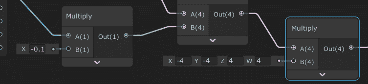

    图 6.44 数值相乘

    *   Create an **Add** node at the right of both Sampler Texture 2D nodes and connect the outputs of those nodes as the **A** and **B** input pins of the **Add** node:

    

    图 6.45 添加两个纹理

    *   You can see that the resulting combination is too bright because we have summed up the intensity of both textures, so let's fix that by multiplying the **Out** of the **Add** node by (**0.5,0.5,0.5,0.5**), which will divide each resulting color channel by 2, averaging the color:

    

    图 6.46 分割两个纹理的和得到平均值

    *   将**Multiply**节点的**Out**引脚连接到主节点的**Albedo**引脚，应用所有这些计算作为对象的颜色。*   保存**资产**，在场景视图中查看结果:****

 ****

图 6.47 纹理混合结果

你可以继续添加节点以使效果更加多样化，例如使用窦节点应用非线性运动等等，但我将让你通过自己的实验来了解这一点。 现在，我们就讲到这里。 与往常一样，这个主题值得写一整本书，而本章的目的是让你稍微体验一下这个强大的 Unity 工具。 我建议你在互联网上寻找其他着色图的例子，以了解相同节点的其他用法，当然，新节点。 这里需要考虑的一件事是，我们刚刚所做的一切基本上都是应用于我们之前讨论的着色器管道的片段着色器阶段。 现在，让我们使用混合着色器阶段给水添加一些透明度。

# 应用透明度

在宣布我们的效果完成之前，我们可以做的一点添加是让水有点透明。 记住，着色器管道有这个混合阶段，它负责将模型的每个像素混合到这一帧中渲染的图像中。 这个想法是让我们的着色器图修改那个阶段，应用一个 Alpha 混合，这个混合将我们的模型和基于我们模型的 Alpha 值的之前渲染的模型结合在一起。 要获得这种效果，请执行以下步骤:

1.  单击主节点右上角的轮子。
2.  设置**表面属性**为**透明**。
3.  Set the **Blend** property to **Alpha** if it isn't already at that value:

    

    图 6.48 策略路由主节点设置

4.  Set the **Alpha** input pin of the Master to **0.5**:

    

    图 6.49 设置主节点的 Alpha 值

5.  Save the graph and see the transparency being applied in the Scene View. If you can't see the effect, just put a cube in the water to make the effect more evident:

    

    图 6.50 水的阴影被应用到立方体上

6.  你可以看到水在立方体上投下的阴影。 这是因为 Unity 没有检测到物体是透明的，所以它认为它必须投射阴影，所以让我们禁用它们。 点击水面，在检查器中寻找 Mesh Renderer 组件。
7.  在**灯光**区域，设置**投射阴影**至**关闭**; 这将禁用平面上的阴影投射:

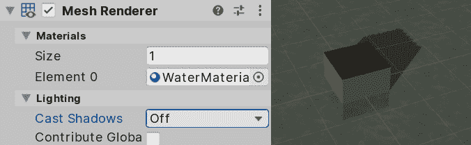

图 6.51 禁用阴影投射

添加透明度是一个简单的过程，但也有其局限性，比如阴影问题，在更复杂的场景中，它可能会有其他问题，所以我建议您避免使用透明度，除非它是必要的。 事实上，我们的水在没有透明的情况下也能生存，尤其是当我们把水应用到基地周围的河流流域时，因为我们不需要看到水下面有什么，但这个想法是为了让你知道你所有的选择。 在下面的截图中，你可以看到我们如何将一个具有这种效果的巨型飞机放置在我们的底座下方，大到足以覆盖整个盆地:

图 6.52 在主场景中使用我们的水

# 总结

在这一章中，我们讨论了着色器如何使用 GPU 工作，以及如何创建我们的第一个简单的着色器来实现良好的水效果。 使用着色器是一项复杂而有趣的工作，在一个团队中，通常有一个或多个人负责创建所有这些效果，他们的职位叫做技术美工; 所以，正如你所看到的，这个话题可以扩展成整个职业生涯。 记住，这本书的目的是让你了解你在这个行业中可能扮演的所有角色，所以如果你真的喜欢这个角色，我建议你开始阅读 shader 独家书籍。 你面前有一条漫长而有趣的路要走。

但是足够的着色器，现在让我们转移到下一个主题，改进图形和创建粒子系统的视觉效果!********