# 七、粒子系统和视觉特效图的视觉效果

在这里，我们将继续学习我们的游戏的视觉效果。 我们将讨论粒子系统，一种模拟火焰、瀑布、烟雾和各种流体的方法。 此外，我们还将看到两个 Unity**粒子系统**创造这种效果，**Shuriken**和**VFX Graph**，后者比前者更强大，但需要更多硬件。

在本章中，我们将研究以下粒子系统的概念:

*   粒子系统概论
*   创建流体模拟
*   使用 VFX Graph 创建复杂的模拟

# 粒子系统概论

到目前为止，我们创建的所有图形和效果都使用了静态网格、3D 模型，它们不能被扭曲、弯曲或变形。 **火焰和烟雾等流体**显然不能用这种网格来表示，但实际上，我们可以用静态网格的组合来模拟这些效果，这就是粒子系统有用的地方。

**粒子系统**是发射并激活大量**粒子**或**广告牌**的物体，它们是面对摄像机的简单四边形网格。 每个粒子都是一个静态网格，但是渲染、动画和结合它们可以产生流体的错觉。 在下一张图片中，你可以看到左边是使用粒子系统的烟雾效果，右边是相同粒子的线框视图。 在那里你可以看到产生烟雾错觉的四边形，这是通过对每个粒子应用烟雾纹理和动画来完成的，所以它们在底部生成并随机向上移动:

图 7.1 -左侧为烟雾粒子系统; 右边是同一系统的线框

在本节中，我们将涵盖以下与粒子相关的概念:

*   创建一个基本的粒子系统
*   使用先进的模块

让我们开始讨论如何创建我们的第一个粒子系统。

## 创建基本粒子系统

为了说明创建一个粒子系统，让我们创建一个爆炸效果。 其想法是一次性产生大量粒子，并将它们扩散到各个方向。 让我们开始创建粒子系统，并配置它提供的基本设置，以改变它的默认行为。 要做到这一点，请遵循以下步骤:

1.  Select the **GameObject** | **Effects** | **Particle System** option:

    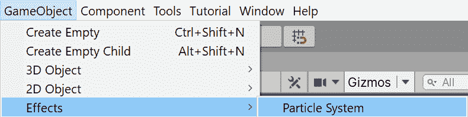

    图 7.2 -粒子系统创建按钮

2.  You should see the effect in the following screenshot. The default behavior is a column of particles going up, like the smoke effect shown previously. Let's change that:

    

    图 7.3 -默认粒子系统外观

3.  点击场景中创建的对象，查看检查器。
4.  通过单击标题打开**形状**部分。
5.  Change the **Shape** property to **Sphere**. Now the particles should move in all possible directions instead of following the default cone:

    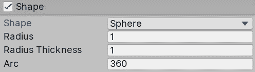

    图 7.4 -形状属性

6.  在粒子系统**模块**(通常称为 Main)中设置**启动速度**为**10**。 这将使粒子运动得更快。
7.  In the same module, set **Start Lifetime** to **0.5**. This specifies how long a particle will live. In this case, we have given a lifetime of half a second. In combination with the speed (10 meters per second), this makes the particles disappear after moving 5 meters:

    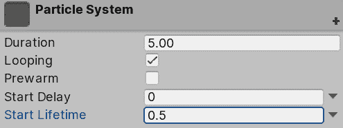

    图 7.5 -主粒子系统模块

8.  打开**Emission**模块，设置**Rate Over Time**为**0**。 这个属性指定了每秒会发射多少个粒子，但是对于一个爆炸，我们实际上需要一个粒子的爆发，所以在这种情况下，我们不会一直发射粒子。
9.  In the **Bursts** list, click the **+** button at the bottom and in the created item in the list, set the count column to **100**:

    

    图 7.6 -发射模块

10.  In the Main module (the one titled **Particle System**) set **Duration** to **1** and uncheck **Looping**. In our case, the explosion won't repeat constantly; we just need one explosion:

    

    图 7.7 -循环复选框

11.  Now that the particle isn't looping, you need to manually hit the **Play** button that is shown in the **Particle Effect** window in the bottom-right part of the Scene View to see the system:

    

    图 7.8 -粒子系统回放控制

12.  Set **Stop Action** to **Destroy**. This will destroy the object when the **Duration** time has passed. This will just work when you are running the game, so you can safely use this configuration while editing your scene:

    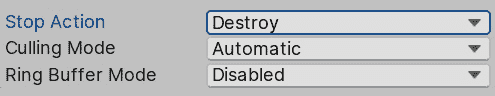

    图 7.9 - Stop Action 设置为 Destroy

13.  Set the **Start Size** of the Main module to **3**. This will make the particles bigger so they seem denser:

    

    图 7.10 -粒子系统起始尺寸

14.  点击 Main 模块**Start Rotation**属性右侧的向下箭头，选择**Random Between Two Constants**。
15.  Set the **Start Rotation** to **0** and **360** in the two input values that appeared after the previous step. This allows us to give the particles a random rotation when they spawn to make them look slightly different from each other:

    

    图 7.11 -随机起始旋转

16.  现在粒子的行为和预期的一样，但它们看起来并不像预期的那样。 让我们改变这种情况。 点击项目视图中的**+**图标，选择**材质**，创建一个新材质。 称之为**爆炸**。
17.  Set its shader to **Universal Render Pipeline/Particles/Unlit**. This is a special shader that is used to apply a texture to the Shuriken particle system:

    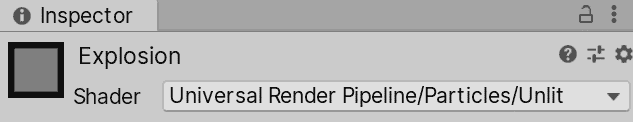

    图 7.12 -粒子系统材质着色器

18.  Download a smoke particle texture from the internet or the **Asset Store**. In this case, it is important to download one with a black background; ignore the others:

    

    图 7.13 -烟雾颗粒纹理

19.  将此纹理设置为材质的**底图**。
20.  Set the **Surface Type** to **Transparent** and the **Blending Mode** to **Additive**. Doing this will make the particles blend with each other, instead of being drawn on each other, to simulate a big mass of smoke instead of individual smoke puffs. We use **Additive** mode because our texture has a black background and because we want to create a lighting effect (the explosion will brighten the scene):

    

    图 7.14 -粒子表面选项

21.  Drag your material to the **Material** property of the **Renderer** module:

    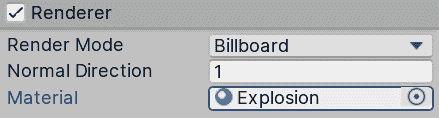

    图 7.15 -粒子材质设置

22.  现在你的系统应该是这样的:

图 7.16 -前面设置的结果

在前面的步骤中,我们改变了粒子或广告牌会生成(使用发射模块),在哪个方向移动(使用形状模块),他们会移动的快慢,他们将持续多久,他们有多大(使用主模块),他们会像(使用渲染器模块)。 创建粒子系统是一个简单的例子，正确配置它们的不同设置。 当然，正确的操作本身就是一种艺术; 它需要创造力和知识，如何使用所有的设置和配置，他们提供。 因此，为了增加配置工具箱，让我们讨论一些高级模块。

## 使用高级模块

我们的系统看起来很好，但我们可以改进很多，所以让我们启用一些新模块来提高它的质量:

1.  Check the checkbox on the left of the **Color over Lifetime** module to enable it:

    

    图 7.17 -启用 Color over Lifetime 模块

2.  通过单击标题打开模块，并单击**Color**属性右侧的白色条。 这将打开渐变编辑器。
3.  Click slightly to the right of the top-left white marker in the bar to create a new marker. Also, click slightly to the left of the top-right white marker to create the fourth marker. These markers will allow us to specify the transparency of the particles during its life:

    

    图 7.18 - Color over Lifetime 渐变编辑器

4.  如果您创建了不想要的标记，只需将它们拖到窗口外就可以删除它们。
5.  Click on the top-left marker (not the one we created, the one that was already there) and set the **Alpha** slider at the bottom to **0**. Do the same with the top-right marker, as shown in the following screenshot. Now you should see the particles fading away instead of popping out of existence when the explosion is finishing:

    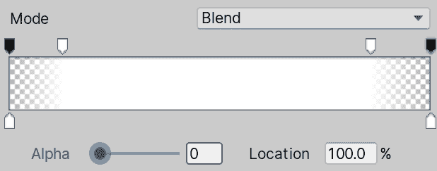

    图 7.19 -渐入渐出梯度

6.  通过点击**限制生命周期**模块的复选框来启用**限制速度。**
7.  Set the **Dampen** setting to **0.1**. This will make the particles slowly stop instead of continuing to move:

    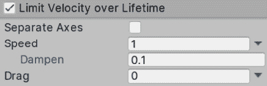

    图 7.20 -阻尼速度使粒子停止

8.  启用**旋转寿命**，并将**角速度**设置在**-90**和**90**之间。 请记住，您应该通过单击属性右侧的向下箭头来设置**Random Between Two Constants**中的值。 现在粒子应该在它们的生命周期中稍微旋转，以模拟更多的运动:

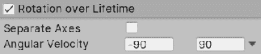

图 7.21 -随机旋转速度

正如你所看到的，有很多额外的模块可以启用或禁用来在现有的模块之上添加行为层，所以再次，创造性地使用它们来创建各种效果。 记住，你可以创建这些系统的预制件，在你的场景中复制它们。 我还建议从素材商店中搜索和下载粒子效果，看看其他人是如何使用相同的系统来创造惊人的效果的。 这是学习如何创建它们的最好方法，看看各种不同的系统，这实际上是我们在下一节要做的，创建更多的系统!

# 创建流体模拟

正如我们所说，学习如何创建粒子系统的最好的方法是不断寻找已经创建的粒子系统，并探索人们如何使用各种系统设置来创建完全不同的模拟。

在本节中，我们将看到如何使用粒子系统创建以下效果:

*   瀑布的效果
*   篝火效应

让我们从最简单的开始，即瀑布效应。

## 创造瀑布效果

为了做到这一点，遵循以下步骤:

1.  创建一个新的粒子系统(**GameObject**|**Effects**|**particle system**)。
2.  Set **Shape** to **Edge** and its **Radius** to 5 in the **Shape** module. This will make the particles spawn along a line of emission:

    

    图 7.22 -边缘形状

3.  设置**Emission**模块的**Rate over life**为**50**。
4.  Set the **Start Size** of the Main module to **3** and the **Start Lifetime** to **3**:

    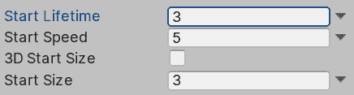

    图 7.23 -主模块设置

5.  Set the **Gravity Modifier** of the Main module to **0.5**. This will make the particles fall down:

    

    图 7.24 - Main 模块中的重力修饰符

6.  Use the same **Explosion** material we created previously for this system:

    

    图 7.25 -爆炸颗粒材质

7.  启用**Color Over life**，打开**Gradient**编辑器。
8.  点击右下角的标记，这一次你应该看到一个颜色选择器，而不是 alpha 滑块。 顶部的标记允许你随时间改变透明度，而底部的标记可以随时间改变粒子的颜色。 设置浅蓝色在此标记:

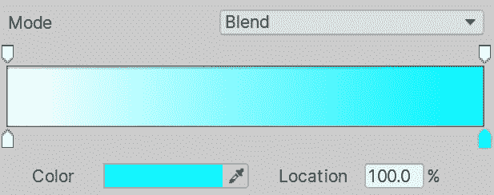

图 7.26 -白色到浅蓝色的渐变

作为一个挑战，我建议你添加一个小的粒子系统，在这个系统的末端创建一些水飞溅，模拟水与底部的湖泊碰撞。 现在我们可以将这个粒子系统添加到我们场景中的一座山中来装饰它，就像下面的截图一样。 我对系统做了一点调整，以便在这个场景中看起来更好。 我建议你自己把它调整成这样:

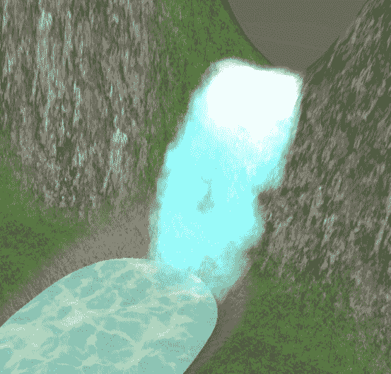

图 7.27 -瀑布粒子系统被应用到我们当前的场景

现在，让我们创建另一个效果，一个篝火。

## 创造篝火效果

为了创建它，执行以下:

1.  创建一个粒子系统。
2.  Look for a **Fire Particle Texture Sheet** texture on the internet or the Asset Store. This kind of texture should look like a grid of different flame textures. The idea is to apply a flame animation to our particles swapping all those mini-textures:

    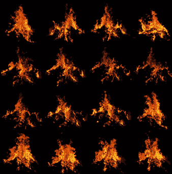

    图 7.28 -粒子纹理精灵表

3.  Create a particle material and set this texture as the **Base Map**. Set the color at the right of the **Base Map** to white. Then set this material as the particle material. Remember to set **Surface Type** to **Transparent** and **Blending Mode** to **Additive**:

    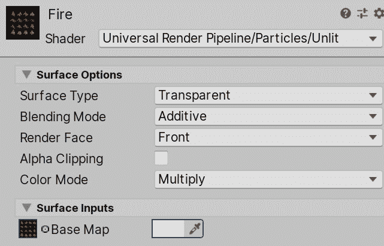

    图 7.29 -带有粒子精灵片的材质

4.  Enable the **Texture Sheet Animation** module and set the **Tiles** property according to your fire sheet. In my case, I have a grid of 4x4 sprites, so I put **4** in **X** and **4** in **Y**. After this, you should see the particles swapping textures:

    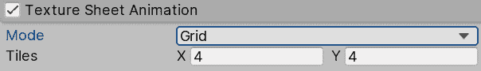

    图 7.30 -启用纹理表动画

5.  在 Main 模块中设置**启动速度**为**0**，**启动大小**为**1.5**。
6.  在**形状**中设置**半径**到**0.5**。
7.  Create a second particle system and make it a child of the fire system:

    

    图 7.31 -养育粒子系统

8.  应用爆炸例子中的 Smoke材质。
9.  在 Shape 模块中设置**角度**到**0**和**半径**到**0.5**。
10.  系统应该是这样的:

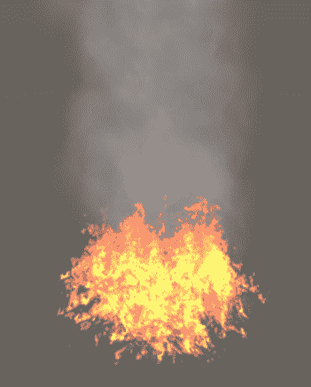

图 7.32 -火与烟粒子系统合并的结果

如你所见，你可以结合几个粒子系统来创建一个单一的效果。 在这样做的时候要小心，因为这很容易释放出太多的粒子，并影响游戏的性能。 粒子并不便宜，如果你不小心，可能会导致游戏的**FPS(每秒帧数)**的减少。

到目前为止,我们已经探索的一个统一的系统,您可以使用它们来创建这些类型的影响,而这个系统是足够的对于大多数情况,最近发布了一个新的统一,可以产生更多的复杂的效应,称为**视效图。 让我们看看如何使用它，看看它与《飞镖》有何不同。**

 **# 使用 VFX Graph 创建复杂的模拟

我们目前使用的粒子系统(T0)被称为 Shuriken，它(T1)在 CPU 中处理所有计算。 这两个优点和缺点。专业是它可以运行在所有可能的设备统一支持,不管他们的能力(所有的 CPU),但缺点是,我们很容易超过 CPU 能力如果我们不谨慎的与我们发射的粒子数。 现代游戏需要更复杂的粒子系统来生成可信的效果，而这种基于 cpu 的粒子系统解决方案已经开始达到其极限。 这就是特效图的作用:

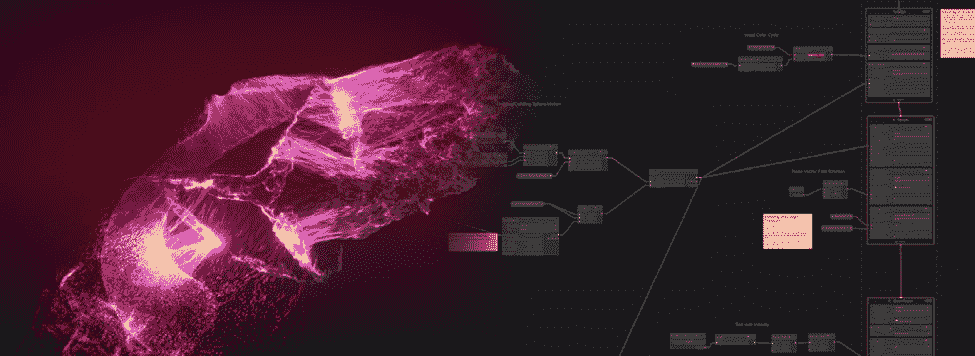

图 7.33 -左边是一个巨大的粒子系统，右边是一个特效图的例子

**VFX Graph (Visual Effects Graph)**是基于 gpu 的粒子系统解决方案，这意味着系统在显卡上而不是 CPU 上执行。 这是因为显卡在执行大量小型模拟时效率更高，就像系统中每个粒子所需要的那样，所以我们可以用 GPU 实现比 CPU 更高数量级的粒子数量。 这里的缺点是,我们需要一个相当现代 GPU 的计算着色器**功能来支持这个系统,所以我们会排除某些目标平台使用这个系统(大多数手机忘记),所以只有使用它,如果你的目标平台支持它(中高端个人电脑、游戏机和一些高端手机)。**

 **在本节中，我们将讨论以下 VFX 图的概念:

*   安装视效图
*   创建和分析视觉特效图
*   创造降雨效应

让我们开始看看我们如何在我们的项目中添加对 VFX Graph 的支持。

## 安装特效图

到目前为止，我们已经使用了很多已经安装在我们项目中的 Unity 功能，但是 Unity 可以通过大量的插件进行扩展，包括官方的和第三方的。 VFX 图是那些需要独立安装的功能之一，如果你使用**通用渲染管道****(URP)**。 我们可以使用软件包管理器(Package Manager)来实现这一点，这是一个专门用于管理官方 Unity 插件的 Unity 窗口。

当你安装这些包时，需要考虑的是，每个包或插件都有自己的版本，独立于 Unity 版本。 这意味着你可以安装 Unity 2020.1，但是 VFX Graph 7.1.5 或 7.1.2 或任何你想要的版本，你可以在不升级 Unity 的情况下将包更新到新版本。 这是很重要的，因为这些包的一些版本需要最低版本的 Unity。 此外，有些包依赖于其他包，以及这些包的具体版本，因此我们需要确保每个包的正确版本以确保兼容性。 需要明确的是，一个包的依赖项是自动安装的，但有时我们可以让它们单独安装，所以在这种情况下，我们需要检查所需的版本。 这听起来很复杂，但其实比听起来简单。

在写这本书的时候，我使用的是 get VFX Graph 8.2.0 版本，与 URP 的版本相同。 是的，URP 是你需要使用包管理器安装的另一个特性，但是当我们使用 URP 模板创建项目时，它已经为我们安装了。 关于版本，我有一个建议:除非真的有必要，否则不要在游戏制作过程中更新 Unity 版本或包版本。 升级通常伴随着许多兼容性版本，这意味着你的游戏的某些部分可能需要在升级后进行修复，以符合这些包的新版本的工作方式。 此外，考虑到有些包带有“验证”标签，这意味着它是在我们的 Unity 版本中测试的，因此建议使用它。

现在，让我们安装 VFX 图如下:

1.  In the top menu of Unity, go to **Window** | **Package Manager**:

    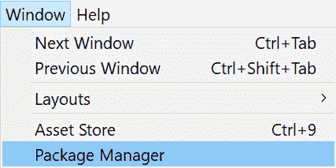

    图 7.34 - Package Manager 位置

2.  Look for the **Visual Effects Graph** package on the left side of the window. Make sure you select version 8.2.0 or higher:

    

    图 7.35 -视觉效果图包

3.  Click at the button **Install** at the bottom-right of the window and wait for the package to install:

    

    图 7.36 -安装包按钮

4.  建议在安装包后重新启动 Unity，所以保存更改并重新启动 Unity。

现在我们已经安装了 VFX Graph，让我们使用它创建我们的第一个粒子系统。

## 创建和分析视觉特效图

使用 VFX 图创建粒子系统的原理与相似。 我们将链接和配置模块作为粒子行为的一部分，每个模块添加一些特定的行为，但我们做的方式与《飞镖》非常不同。 首先，我们需要创建一个**视觉效果图**，这是一个包含所有模块和配置的素材，然后让一个游戏对象玩这个图。 让我们通过以下步骤来实现这一点:

1.  In the Project window, click on the **+** button and look for **Visual Effects** | **Visual Effect Graph**:

    

    图 7.37 -视觉效果图

2.  Create an Empty GameObject using the **Game Object** | **Create Empty** option:

    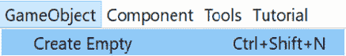

    图 7.38 -创建空的游戏对象

3.  选择创建的对象并查看检查器。
4.  Using the **Add Component** search bar, look for the **Visual Effect** component and click on it to add it to the object:

    

    图 7.39 -在视觉效果图中添加一个组件

5.  Drag the VFX asset we created to the **Asset Template** property of the **Visual Effect** component in our GameObject:

    

    图 7.40 -使用之前创建的 VFX 素材的视觉效果

6.  你应该看到时钟粒子从我们的物体发射:

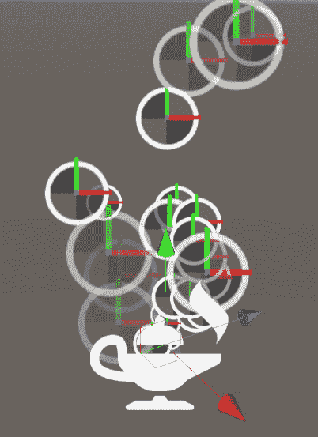

图 7.41 -默认 VFX 素材结果

现在我们有了一个基础效果，让我们创建一些需要很多粒子的东西，比如稠密的雨。 在此之前，让我们先探索一些 VFX Graph 的核心概念。 如果你双击 Visual Effect 素材，你会看到以下编辑器:

图 7.42 -视觉效果图形编辑器窗口

该窗口由几个相互连接的节点组成，生成一个要执行的操作流。 一开始，它看起来与着色器图形相似，但它的工作有点不同，所以让我们研究默认图形的每个部分。

第一个要探索的区域是包含三个节点的点状区域。 这就是 Unity 所称的**系统**。 一个系统是一组节点，它定义了粒子的行为方式，你可以想要多少就有多少，这相当于有几个粒子系统对象。 每个系统是由,**上下文虚线区域内的节点,在这种情况下,我们有**初始化粒子**,**更新粒子**和【显示】输出粒子四**。 每个上下文代表粒子系统逻辑流的一个不同阶段，所以让我们定义图中的每个上下文的作用:

*   **初始化粒子**:定义每个发射粒子的初始数据，如位置、颜色、速度和大小。 它类似于我们在本章开始时看到的粒子系统的 Main 模块中的 Start 属性。 此节点中的逻辑仅在发出新粒子时执行。
*   **Update Particle**:在这里，我们可以对活粒子的数据应用修改。 我们可以改变粒子数据，如当前速度或所有帧的大小。 这类似于先前粒子系统的 Over Time 节点。
*   **Output Particle Quad**:当粒子需要渲染时，此上下文将被执行。 它将读取粒子数据，以查看在哪里渲染，如何渲染，使用哪种纹理和颜色，以及不同的视觉设置。 这类似于之前的粒子系统的渲染器模块。

在每个上下文中，除了一些基本配置外，我们可以添加**Blocks**。 每个 Block 都是一个将在上下文中执行的操作。 我们有可以在任何上下文中执行的操作，还有一些特定的上下文操作。 例如，我们可以在初始化粒子上下文中使用一个添加位置块来移动初始粒子的位置，但如果我们在更新粒子上下文中使用相同的块，它将不断移动粒子。 所以基本上，context 是发生在粒子生命周期中的不同情况，block 是在这些情况下执行的动作:

图 7.43 -在初始化粒子上下文中设置一个速度随机块 这就决定了粒子的初始速度

此外，我们还可以在系统外部设置**独立上下文**、上下文，例如**衍生上下文**。 这个上下文负责告诉系统需要创建一个新的粒子。 我们可以添加 Blocks 来指定上下文何时告诉系统创建粒子，例如以固定的速度在一段时间内创建粒子、爆发等等。 这个想法是刷出将根据它的块创建粒子，而系统负责初始化、更新和渲染它们，同样，根据我们在每个上下文中设置的块。

所以我们可以看到《忍者飞镖》与《忍者飞镖》有很多相似之处，但是《忍者飞镖》创造系统的方式却截然不同。 让我们通过创建雨的效果来加强这一点，这将需要大量的粒子，这是一个很好的 VFX 图用例。

## 创造降雨效果

为了创建这种效果，请执行以下:

1.  Set the **Capacity** property of the **Initialize Particle** Context to **10000**:

    

    图 7.44 -初始化粒子上下文

2.  Set the **Rate** of the **Constant Spawn Rate** of the **Spawn** context to **10000**:

    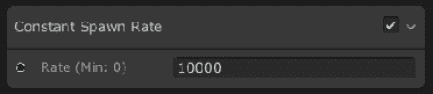

    图 7.45 -固定刷出率块

3.  Set the **A** and **B** properties to (**0**, **-50**, **0**) and (**0**, **-75**, **0**) respectively in the **Set Velocity Random Block** in the **Initialize Particle** Context. This will set a random velocity pointing downward for our particles:

    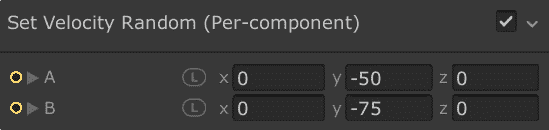

    图 7.46 -设置速度随机块

4.  点击**Initialize Particle**标题来选择上下文，一旦突出显示，按空格键到显示**Add Block**窗口。
5.  Search for the **Set Position Random** block and click on it:

    

    图 7.47 -添加块

6.  设置**和**B**的**属性设置位置随机块**(【-50 T6】、【显示】0,**-50**)和(50【病人】,**0**,【t16.1】50)。 这将定义一个初始区域，在其中随机生成粒子。**
***   单击箭头在左边的**范围**的**属性初始化粒子**块显示其属性,并设置中心**和**【T7 大小】(【显示】0**,**-12.5**,【病人】0),(100 年**,【t16.1】25,**100**)。 这将定义粒子应该存在的区域。 粒子实际上可以移动到这个区域之外，但这对系统的正常工作很重要(在互联网上搜索**截锥体剔除**以获得更多信息)。*********   Select the GameObject that is executing the system, and in the bottom-right window in the Scene view check the **Show Bounds** checkbox to see the previously defined Bounds:

    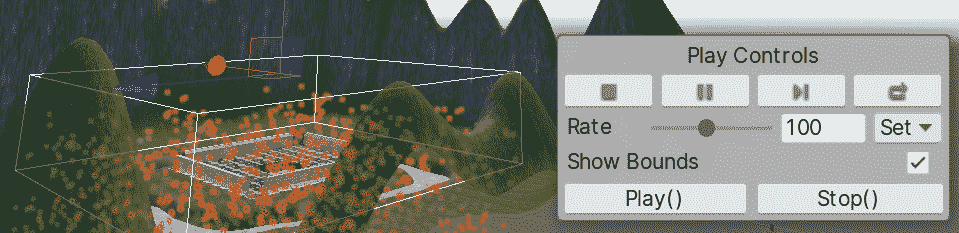

    图 7.48 -视觉效果回放控制

    *   Set the object position to cover the whole base area. In my case, the position is (**100**, **37**, **100**). Remember that you need to change the **Position** of the **Transform** component for this:

    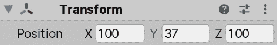

    图 7.49 -设置变换位置

    *   Set the **A** and **B** properties of the **Set Lifetime Random** Block in the **Initialize Particle** to **0.5**. This will make the particles have a shorter life, ensuring that they are always inside the bounds:

    

    图 7.50 -设置生命周期随机块

    *   Change the **Main Texture** property of the **Output Particle Quad** Context to another texture. In this case, the previously downloaded smoke texture can work here, even though it's not water, because we will modify its appearance in a moment. Also, you can try to download a water droplet texture if you want to:

    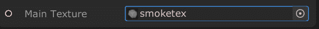

    图 7.51 - VFX 图形主纹理

    *   Set **Blend Mode** of the **Output Particle Quad** Context to **Additive**:

    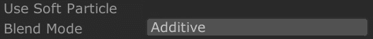

    图 7.52 - VFX Graph 的添加模式

    *   If you can't see the last change being applied, click the **Compile** button in the top-left of the window. Also, you can save your changes using *Ctrl* + *S* (*Command* + *S* on Mac):

    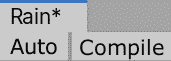

    图 7.53 - VFX 素材保存控件

    *   Now we need to stretch our particles a little bit to look like actual raindrops instead of falling balls. To do so, first we need to change the orientation of our particles so they don't point at the camera all the time. In order to do this, right-click on the **Orient Block** in the **Output Particle Quad** Context and select **Delete** (or press *Delete* on PC or *Command* + *Backspace* on Mac):

    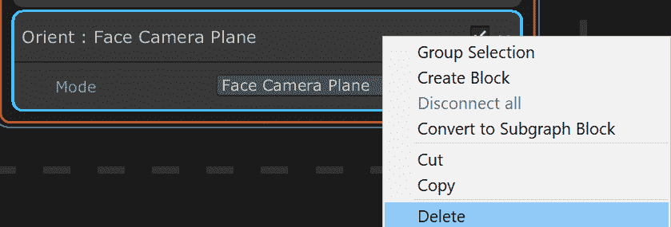

    图 7.54 -删除块

    *   我们要根据粒子的速度方向拉伸粒子。 要做到这一点,选择**输出粒子的标题四**上下文和寻找一块按空格键在增加。这种情况下,我们需要搜索**东方沿着速度块。*****   Add a **Set Scale** Block to the **Initialize Particle** Context (click it and press the space bar) and set the **Scale** property to (**0.25**, **1.5**, **0.25**). This will stretch the particles to look like falling drops:

    

    图 7.55 -设置比例块

    *   再次单击左上角窗口中的**Compile**按钮来查看更改。 你的系统应该看起来像这样:********

 ********

图 7.56 -下雨结果

从这里，你可以通过从上下文中添加和删除 block 来进行实验，如果你想的话，我再次建议你寻找已经创建的视觉效果图来为其他系统寻找思路。 实际上，你可以通过观察《忍者神剑》中的效果并使用类似的方块来获得关于 VFX Graph 的想法。 此外，我建议您可以在[https://docs.unity3d.com/Packages/com.unity.visualeffectgraph@7.1/manual/index.html 中查找 VFX Graph 文档](https://docs.unity3d.com/Packages/com.unity.visualeffectgraph@7.1/manual/index.html)来了解更多关于这个系统的信息。

# 总结

在本章中，我们讨论了两种不同的方法来创建粒子系统，使用 Shuriken 和 VFX Graph。 我们使用它们来模拟不同的流体现象，如火灾、瀑布、烟雾和雨。 这个想法是将粒子系统与网格相结合，以生成场景所需的所有可能的道具。 同样，你可以想象，专业地创造这些效果需要你深入。 如果你想把自己奉献给这个(技术艺术家)的另一个工作的一部分,您将需要学习如何创建自己的粒子纹理来得到你想要的确切的外观和感觉,代码的脚本控制系统的某些方面,粒子和其他几个方面的创造。 同样，这也超出了本书的范围。

现在我们的场景中有一些雨，我们可以看到场景中的天空和照明并不能真正反映雨天，所以让我们在下一章中修复它!************