# 十一、用户界面设计

在屏幕上显示并通过计算机扬声器传输的一切都是通信形式。 在之前的章节中，我们使用了三维模型让用户知道他们在山中的一个基地，我们用适当的声音和音乐来强化这个想法。 但是对于我们的游戏,我们需要沟通的其他信息,如用户的生活留下了,当前的分数,等等,有时,很难表达这些东西使用游戏内的图形(有一些成功案例管理要做到这一点,比如*死亡空间,但是我们让事情变得简单)。 为了传播这些信息,我们将添加另一层图形上的场景,通常称为**用户界面**(**UI)或抬头显示器【T7)**】(**【显示】HUD)。***

 *这将包含不同的视觉元素，如文本框、条和按钮，以帮助用户做出明智的决定，如在生命垂危时逃到一个安全的地方:

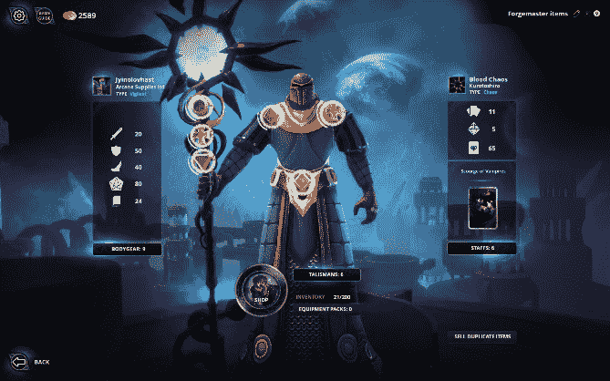

图 11.1 -角色创建 UI 显示带有数字的角色统计信息

在本章中，我们将研究以下 UI 概念:

*   **Canvas**和**RectTransform**
*   画布对象类型
*   创建响应式 UI

在本章结束时，你将能够使用 Unity UI 系统来创建能够告知用户游戏状态的界面，并允许他们通过按下按钮来采取行动。 让我们开始讨论 Unity UI 系统中的一个基本概念——recttransform。

# 理解 Canvas 和 RectTransform

目前，在 Unity 中有三种用于不同目的的 UI 系统:

*   **UI 元素**:一个用自定义窗口和工具扩展 Unity 编辑器的系统。 它使用几个 web 概念，如样式表和基于 xml 的语言来布局 UI。 在未来，它将在游戏中使用。
*   **Unity UI**:基于游戏对象的 UI 只适用于游戏内置 UI(不是编辑器扩展)。 你可以使用 gameobject 和组件创建它，就像我们迄今为止编辑过的其他对象一样。
*   **IMGUI**:完全通过脚本创建的基于代码的遗留 UI。 很久以前，这是编辑器和游戏内部 UI 中唯一使用的 UI 系统。 现在，它只用于扩展编辑器，很快就会被 UI 元素完全取代。

在本章中，我们将只关注游戏内部 UI，以向玩家传达关于游戏状态的不同信息，所以我们将使用 Unity UI。 在撰写这本书的时候，有人计划用 UI 元素取代 Unity UI，但还没有预计的日期。 无论如何，即使 Unity 很快将 UI 元素作为游戏内部 UI 系统发布，Unity UI 仍将存在一段时间，并能够完美地处理你需要创建的所有类型的 UI。

如果你打算使用 Unity UI，你首先需要理解其两个主要的概念——画布和**RectTransform**。 Canvas 是主对象，它将包含并渲染我们的 UI，而 RectTransform 是负责定位和调整屏幕上每个 UI 元素的特性。

在本节中，我们将研究以下 Unity UI 概念:

*   用 Canvas 创建 UI
*   用 RectTransform 定位元素

让我们开始使用 Canvas 组件来创建 UI。

## 使用 Canvas 创建 UI

在 Unity UI 中，你在 UI 中看到的每个图像、文本和元素都是带有一组适当组件的游戏对象，但为了让它们发挥作用，它们必须是 Canvas 组件的主游戏对象的子对象。 该组件负责触发 UI 生成，并在每个子对象上绘制迭代。 我们可以配置该组件，以精确地指定该流程如何工作，并使其适应不同的可能需求。

首先，你可以简单地创建一个带有**GameObject**|**UI**|**canvas**选项的画布。 这样做之后，你会在场景中看到一个矩形，它代表用户屏幕，所以你可以把元素放在里面，并预览它们相对于用户显示器的位置。 你可以在下面的截图中看到这个矩形的例子:

图 11.2 -画布屏幕矩形

这里你可能想知道两件事。 首先，“为什么矩形在场景中间? 我希望它永远出现在屏幕上!” 别担心，因为事实就是如此。 当你编辑 UI 时，你将看到它作为关卡的一部分，作为其中的一个对象，但当你玩游戏时，它将总是投射到屏幕上，在每个对象之上。 此外，你可能想知道为什么矩形是巨大的，这是因为屏幕上的一个像素映射到场景上的一个米。 所以，不要担心这个; 当你在游戏视图中看到游戏时，你会在用户屏幕上看到所有 UI 元素的适当大小和位置。

在向 UI 添加元素之前，值得注意的是，在创建 UI 时，会在画布旁边创建第二个对象，称为 Event System。 这个对象对于渲染 UI 来说不是必需的，但如果你想让 UI 具有交互性，这意味着包含操作，如点击按钮、在字段中引入文本或用操纵杆导航 UI。 EventSystem 组件负责对用户输入(如键盘、鼠标或操纵杆)进行采样，并将数据发送到 UI 以做出相应的反应。 我们可以更改与 UI 交互的确切按钮，但目前的默认值是 OK 的，所以只要知道，如果你想与 UI 交互，你需要这个对象。 如果由于某些原因你删除了这个对象，你可以在**游戏对象**|**UI**|**事件系统**中重新创建它。

现在我们已经有了创建 UI 的基本对象，让我们向其添加元素。

## 用 RectTransform 定位元素

在统一界面,每个图像、文本和元素在 UI 是一个 GameObject 与一组适当的组件根据其使用,但是你会发现他们中的大多数人有一个共同点——**组件 RectTransform**。 UI 的每个部分本质上都是一个充满文本或图像的矩形，并且具有不同的行为，因此了解**RectTransform**组件的工作方式以及如何编辑它非常重要。

为了试验这个组件，让我们为 UI 创建并编辑一个简单的白色矩形元素的位置，操作如下:

1.  Go to **GameObject** | **UI** | **Image**. After that, you will see that a new GameObject is created within the **Canvas** element. Unity will take care of setting any new UI element as a child of **Canvas**; outside it, the element will not be visible:

    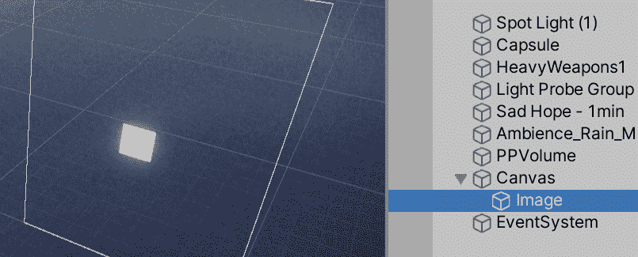

    图 11.3 -默认图像 UI 元素-白框

2.  Click on the 2D button in the top bar of the **Scene** view. This will just change the perspective of the Scene view to one that is better suited to edit the UI (and also two-dimensional games):

    

    图 11.4 - 2D 按钮位置

3.  Double-click on the canvas in the **Hierarchy** window to make the UI fit entirely in the Scene view. This will allow us to edit the UI clearly. You can also navigate the UI using the mouse scroll wheel to zoom, and click and drag the scroll wheel to pan the camera:

    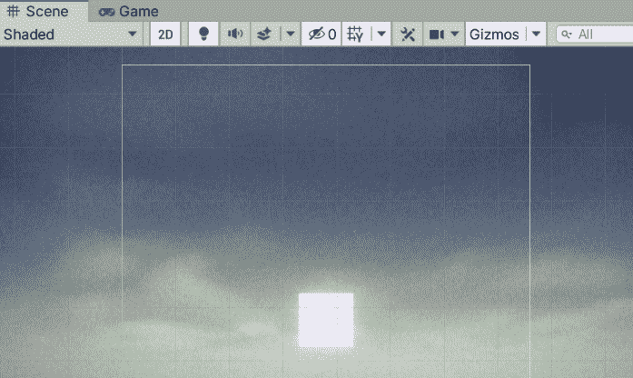

    图 11.5 - 2D 编辑模式下的场景视图

4.  Disable the **PPVolume** object to disable postprocessing. The final UI won't have postprocessing, but the editor view still applies it. Remember to re-enable it later:

    

    图 11.6 -禁用一个游戏对象——在本例中，禁用后处理卷

5.  Enable (if it is not already enabled) the **RectTrasform** tool, which is the fifth button in the top-left part of the Unity Editor (or press the *T* key). That will enable the rectangle gizmo, which allows you to move, rotate, and scale two-dimensional elements. You can use the usual transform, rotate, and scale gizmos, which were the ones we used in 3D mode, but the rectangle gizmo causes less trouble, especially with scaling:

    

    图 11.7 -矩形小工具按钮

6.  Using the rectangle gizmo, drag the object to move it, use the blue dots to change its size, or locate the mouse in a tricky position near the blue dots to rotate it. Consider that resizing the object using this gizmo is not the same as scaling the object, but more on that in a moment:

    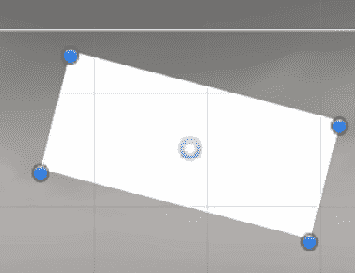

    图 11.8 -用于编辑二维元素的矩形小工具

7.  在 Inspector 窗口,注意改变 UI 元素的大小后,**矩形变换设置**规模的房地产仍在(**1**,**1**,【显示】1**),但你可以看到**如何宽【病人】和**高**属性发生了改变。 **Rect Transform**本质上是一个经典的 Transform，但是加上**Width**和**Height**。 你可以在这里设置你想要表达的像素值:****

 **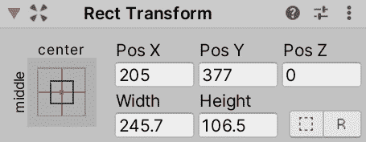

图 11.9 -矩形转换属性

现在我们知道了如何定位任何 UI 对象的基本知识，让我们来探索可以添加到 Canvas 的不同类型的元素。

# 画布对象类型

到目前为止，我们已经使用了最简单的 Canvas 对象类型—白盒—但是还有许多其他对象类型可以使用，比如图像、按钮、文本等等。 它们都使用**RectTransform**来定义它们的显示区域，但每个都有自己的概念和配置需要理解。

在本节中，我们将探讨以下 Canvas 对象概念:

*   集成 UI 的素材
*   创建 UI 控件

让我们首先开始探索如何将图像和字体集成到画布中，以便我们可以使用图像和文本 UI 对象类型将它们集成到我们的 UI 中。

## 为 UI 集成素材

在让我们的 UI 使用漂亮的图像素材之前，我们需要像一样将它们正确地整合到 Unity 中。 以下截图是我们在[*第一章*](01.html# _idTextAnchor015)*从零开始设计游戏*中提出的 UI 设计:

图 11.10 -第一章的 UI 设计

在此之上，我们将添加一个暂停菜单，当用户按下*Esc*时，该菜单将被激活。 它看起来就像下面的截图:

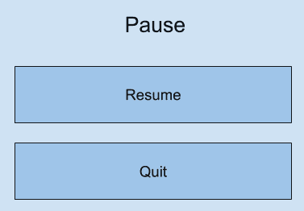

图 11.11 - Pause 菜单设计

根据这些设计，我们可以确定我们需要以下素材:

*   英雄的化身形象
*   健康条图像
*   一个暂停菜单的背景图像
*   一个暂停菜单按钮图像
*   文字字体

与往常一样，我们可以在互联网上或在 Asset Store 上找到所需的素材。 在我的例子中，我将使用两者的混合物。 让我们从最简单的角色开始。 采取以下步骤:

1.  Download the avatar you want from the internet:

    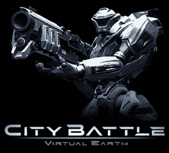

    图 11.12 -下载的头像素材

2.  将其添加到您的项目中，可以将其拖放到项目窗口中，也可以使用**素材**|**导入新素材**选项。 将其添加到**精灵**文件夹中。
3.  选择纹理，在检查器窗口中，设置**纹理类型**设置为**精灵(2D 和 UI)**。 默认情况下，所有纹理都准备在 3D 中使用。 这个选项准备在 2D 中使用的所有东西。

对于工具条、按钮和窗口背景，我将使用 Asset Store 查找 UI 包。 在我的例子中，我发现以下截图中的包适合启动我的 UI。 与往常一样，请记住，这个确切的包可能现在还不可用。 在这种情况下，记得寻找另一个类似的包，或从 GitHub repo 选择精灵:

图 11.13 -选择的 UI 包

一开始，这个包包含许多以相同方式配置的图像，作为精灵，但我们可以进一步修改导入设置以实现高级行为，因为我们将需要按钮。 按钮素材具有固定大小，但如果您需要更大的按钮怎么办? 一种选择是使用不同大小的其他按钮素材，但这将导致大量重复的按钮和其他素材，如不同窗口的不同大小的背景，这将消耗不必要的 RAM。 另一种选择是使用九切片方法，该方法将图像分割，以便将角落与其他部分分开。 这允许 Unity 拉伸图像的中间部分，以适应不同的大小，保持角落在他们的原始大小，这，当结合一个聪明的图像，可以用来创建几乎任何你需要的大小。 在下面的图中，您可以看到一个在左下角有 9 个切片的形状，在同一个图的右下角，您可以看到该形状被拉伸了，但它的角保持在原来的大小。 右上角显示的形状拉伸没有切片。 你可以看到，非切片版本是扭曲的，而切片版本不是:

图 11.14 -切片和非切片图像拉伸

在这种情况下，我们可以将九段应用到按钮和面板背景图像中，将其用于游戏的不同部分。 为了做到这一点，请执行以下步骤:

1.  使用**窗口**|**包管理器**选项打开包管理器。
2.  Verify that **Package Manager** is showing all the packages by setting the dropdown to the right of the **+** button in the top-left part of the window to **Unity Registry**:

    

    图 11.15 -在 Package Manager 中显示所有包

3.  Install the **2D Sprite** package to enable the sprite editing tools (if it is not already installed):

    

    图 11.16 - package Manager 中的 2D 精灵包

4.  Select the button sprite in the **Project** window and click on the **Sprite Editor** button in the **Inspector** window:

    

    图 11.17 -检查器窗口中的精灵编辑器按钮

5.  在**精灵编辑器**窗口中，定位并拖动图像边缘的绿色圆点来移动切片标尺。 尽量确保切片不在按钮边缘的中间位置。 需要注意的一点是，在我们的例子中，我们将使用 3 个切片而不是 9 个，因为我们的按钮不会垂直拉伸。
6.  Click on the **Apply** button in the top-right corner of the window and close it:

    

    图 11.18 -精灵编辑器窗口中的九个切片

7.  对**背景**面板重复相同的步骤。 在我的例子中,你可以看到下面的截图,这个背景不是准备记住 9 片,因为所有中间区域的图像可以更小,如果 nine-slicing 方法用于拉伸,他们将看起来一样。 所以，我们可以用任何图像编辑工具来编辑它，或者就像现在这样工作:

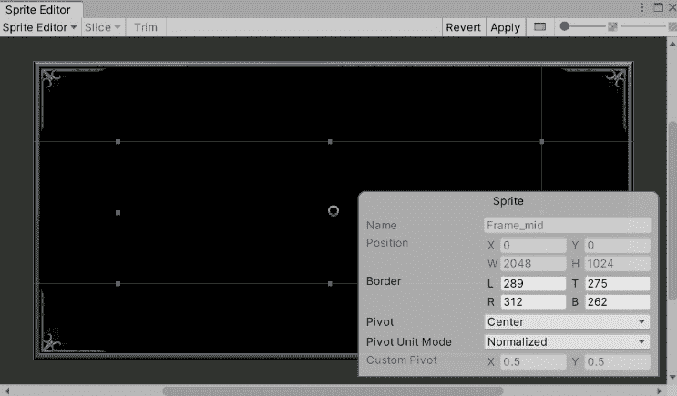

图 11.19 -精灵编辑器窗口中的九个切片

现在我们已经准备好了精灵，我们可以找到一个字体，这是一个相当简单的任务。 只需下载任何格式为**.ttf**或**.otf**的字体并将其导入 Unity，这就是全部，无需进一步配置。 你可以在网上找到很多好的、免费的字体网站。 我习惯了使用经典的[DaFont.com](http://DaFont.com)站点，但是还有很多其他站点可以使用。 在我的情况下，我将使用以下字体:

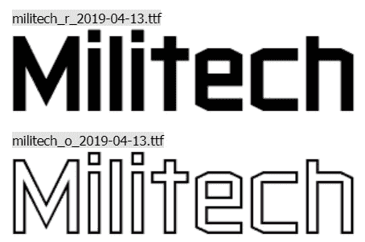

图 11.20 -我从 DaFont.com 选择的字体用于项目

如果压缩文件包含多个字体文件，你可以将它们全部拖到 Unity 中，然后使用你最喜欢的那个。 此外，像往常一样，尝试将字体放入名为**Fonts**的文件夹。

现在我们已经拥有了创建 UI 所需的所有素材，让我们探索不同类型的组件来创建所有所需的 UI 元素。

## 创建 UI 控件

几乎每一个单独的部分的 UI 将是一个组合的图像和文字配置巧妙。 在本节中，我们将探讨以下组件:

*   **图像**
*   **Text**
*   **按键**

让我们开始探索**图像**。 实际上，我们已经在 ui 中创建了一个图像——我们之前在本章中创建的白色矩形。 如果你选择它并查看 Inspector 窗口，你会注意到它有一个 Image 组件，就像下面的截图:

图 11.21 - Image 组件的 Inspector 窗口

让我们开始探索这个组件的不同设置，从我们的英雄角色开始。 采取以下步骤:

1.  Using the rectangle gizmo, locate the white rectangle at the top-left part of the UI:

    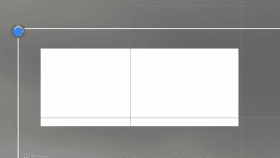

    图 11.22 -位于 UI 左上角的白色矩形

2.  In the **Inspector** window, click on the circle to the right of the **Source Image** property and pick the downloaded hero avatar sprite:

    

    图 11.23 -设置图像组件的精灵

3.  我们需要校正图像的纵横比以防止失真。 一种方法是点击**Image**组件底部的**设置本机大小**按钮，使图像使用与原始精灵相同的大小。 然而,通过这样做,图像会变得太大,所以你可以减少图像大小按*【T7 转变】修改宽度【显示】和**高度值。 另一个选择是勾选**保持外观**复选框，以确保图像适合矩形而不拉伸。 在我的例子中，我将使用两种方法:***

 **

图 11.24 -保留方面和设置本机大小图像选项

现在，让我们按照以下步骤创建生命条:

1.  使用**GameObject**|**UI**|**Image**选项创建另一个**Image**组件。
2.  Set the **Source Image** property to the life bar image you downloaded:

    

    图 11.25 -头像和生命条

3.  设置**图像类型**属性为**填充**。
4.  设置**填充方法**属性为**水平**。
5.  Drag the **Fill Amount** slider to see how the bar is cut according to the value of the slider. We will change that value via scripting when we code the life system in *Part 3* of the book, where we will be code out own scripts:

    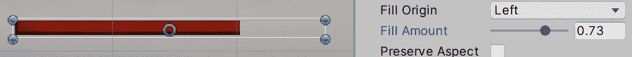

    图 11.26 -填充量滑块，将图像宽度削减为其大小的 73%

6.  In my case, the bar image also comes with a bar frame, so I will create another image, set the sprite, and position it on top of the life bar to frame it. Bear in mind that the order the objects are in in the **Hierarchy** window determines the order in which they will be drawn. So, in my case, I need to be sure the frame GameObject is below the health bar image:

    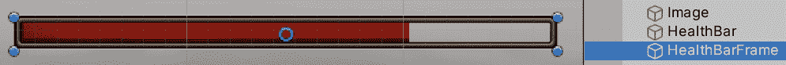

    图 11.27 -把一张图片放在另一张上面，创建一个框架效果

7.  Repeat steps *1 to 6* to create the base bar at the bottom, or just copy and paste the bar and the frame and locate it at the bottom of the screen:

    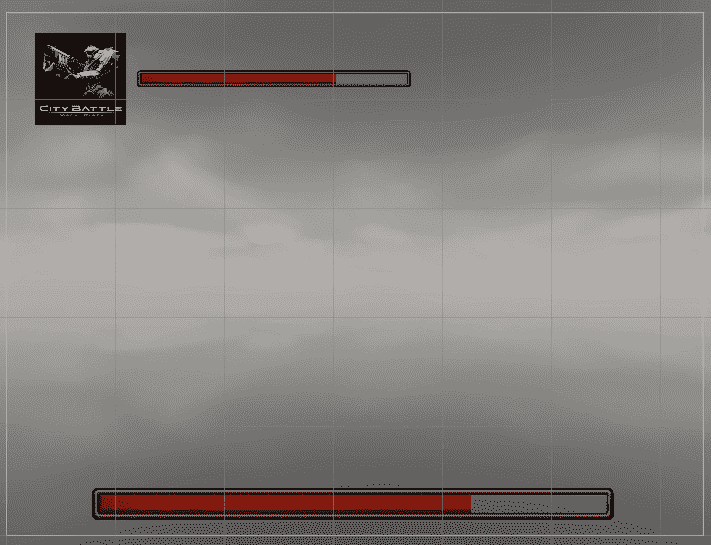

    图 11.28 -两个柱状图

8.  点击**项目**窗口中的**+**按钮，选择**精灵**|**Square**选项。 这将创建一个简单的正方形精灵。 这与下载*4 × 4*分辨率的全白图像并导入 Unity 是一样的。
9.  将精灵设置为基础栏，而不是下载的栏精灵。 这次，我们将使用纯白色图像作为条形图，因为在我的例子中，原来的图像是红色的，而将红色图像的颜色更改为绿色是不可能的。 然而，白色图像很容易着色。 考虑到原始条形图的细节——例如，原始条形图中的小阴影在这里不会出现，但如果你想保留它，你应该得到一个带有该细节的白色条形图。
10.  Select the base health bar and set the **Color** property to green:

    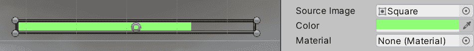

    图 11.29 -一个带有正方形精灵和绿色色调的条形图

11.  一个可选步骤是将条形框架图像转换为 9 个切片图像，以允许我们更改原始宽度以适应屏幕。

现在，让我们通过以下步骤添加分数、子弹、剩余波和剩余敌人标签的文本字段:

1.  使用**GameObject**|**UI**|**text**选项创建文本标签。 这将是 Score 标签。
2.  将标签放置在屏幕的右上方。
3.  在**检查器**窗口中，设置**Text**属性为**Score: 0**。
4.  设置**字体大小**属性为**20**。
5.  通过点击**font**属性右侧的圆圈，应用下载的字体，并选择所需的字体。
6.  Check the horizontal alignment option (the one on the far right) for the **Alignment** property and the central option for the vertical options:

    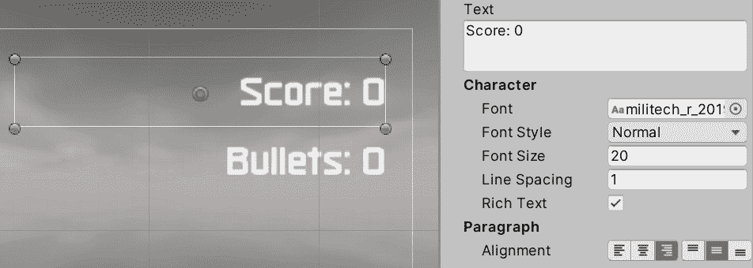

    图 11.30 -文本标签的设置

7.  Repeat *steps 1 to 6* to create the other three labels (or just copy and paste the score three times). For the **Remaining Waves** label, you can use the left alignment option to better match the original design:

    

    图 11.31 - UI 的所有标签

8.  设置所有标签的颜色为白色，因为我们的场景将主要是黑暗的。

现在我们已经完成了最初的 UI 设计，让我们按照以下步骤创建暂停菜单:

1.  为菜单的背景创建一个**Image**组件(T2】GameObject|**UI**|**Image**)。
2.  使用我们之前制作的 9 个切片设置**背景**面板精灵。
3.  设置**图像类型**属性为**已切片**，如果它还没有。 这种模式将应用九片方法，以防止角落拉伸。
4.  There's a chance that the image will stretch the corners anyway, which happens because sometimes the corners are quite big compared to the **RectTransform** setting's **Size** property that you are using, so Unity has no option other than to do that. In this scenario, the correct solution is to have an artist that creates assets tailored to your game, but sometimes we don't have that option. This time, we can just increase the **Pixels Per Unit** value of the sprite, which will reduce the scale of the original image while preserving its resolution.

    在以下两个屏幕截图中，您可以看到背景图像的**像素/**单位值为**100**，再次为**700**。 记住，只对 9 片或平铺图像类型执行此操作，或者如果你没有美工来为你调整:

    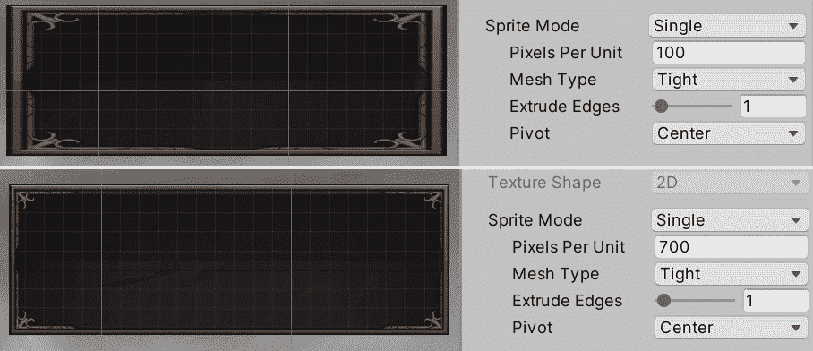

    图 11.32 -在顶部，一个小 RectTransform 组件中的九层图像，小到可以缩小角落，在底部，像素单位设置为 700 的图像相同

5.  创建一个**Text**字段，将放在您想要暂停标签在图表中的位置，设置它显示暂停文本，并设置字体。 请记住，您可以使用**color**属性更改文本颜色。
6.  Drag the text field onto the background image. The parenting system in **Canvas** works the same—if you move the parent, the children will move with it. The idea is that if we disable the panel, it will also disable the buttons and all its content:

    

    图 11.33 - Pause 标签

7.  点击**GameObject**|**UI**|**Button**创建两个按钮。 把它们放在背景图像中你想要的位置。
8.  通过在**层次**窗口中拖动，将其设置为**暂停**背景图像的子图像。
9.  选择按钮并设置其 Image 组件的**Source Image**属性以使用我们之前下载的按钮精灵。 如果你遇到了与之前相同的问题，请记住我们之前修复的**单位像素**。
10.  You will notice that the button is essentially an image with a child Text object. Change the text of both buttons to **Resume** and **Quit**, respectively:

    

    图 11.34 - Pause 菜单实现

11.  记住，你可以通过取消选中**检查器**窗口顶部对象名称右侧的复选框来隐藏面板:

图 11.35 -禁用游戏对象

如您所见，您几乎可以通过使用 Image 和 Text 组件创建任何类型的 UI。 当然，还有一些更高级的组件允许您创建按钮、文本字段、复选框、列表等等，但是让我们继续使用基本的组件。 需要注意的一点是，我们已经创建了按钮，但到目前为止它们没有任何作用。 稍后，在本书的第 3 部分*中，我们将看到如何用脚本使它们具有一个函数。*

在本节中，我们讨论了如何导入图像和字体，以便通过图像、文本和按钮组件集成，以创建丰富的、信息量大的 UI。 做完这些之后，让我们来讨论一下如何让它们适应不同的设备。

# 创建响应式 UI

如今，用单一分辨率设计 UI 几乎是不可能的，而且我们的目标用户显示设备可能会有很大变化。 PC 有各种不同类型的显示器，具有不同的分辨率(如 1080p、4k 等)和纵横比(如 16:9、16:10、超宽等)，对于移动设备也是如此。 我们需要准备我们的 UI 来适应最常见的显示，而 Unity UI 拥有这样做所需的工具。

在本节中，我们将探讨以下 UI 响应的概念:

*   适应对象的位置
*   适应对象的大小

我们将探索 UI 元素如何使用 Canvas 和**RectTransform**组件的高级功能(如锚点和缩放器)调整它们的位置和大小以适应不同的屏幕尺寸。

## 调整物体的位置

现在，如果我们玩我们的游戏，我们将看到 UI 如何适合我们的屏幕。 但如果由于某些原因我们改变了**游戏**的视图大小，我们将看到物体如何开始从屏幕上消失。 在以下截图中，你可以看到不同大小的游戏窗口，以及其中一个界面看起来不错，但另一个却很糟糕:

图 11.36 -相同的 UI，但不同的屏幕尺寸

问题在于，我们使用编辑器中的任何分辨率创建 UI，但只要我们稍微改变它，UI 就会保持其先前分辨率的设计。 此外，如果仔细观察，您会注意到 UI 总是居中的，例如在中间的图像中，UI 被裁剪到其两侧，或者在第三个图像中，沿屏幕边界可以看到额外的空间。 这是因为 UI 中的每个元素都有自己的锚，当你选择一个对象时，你可以看到一个小十字，比如下面的截图:

图 11.37 -屏幕右下方的一个锚十字，属于屏幕左上方的英雄化身

对象的 X 和 Y 位置是通过到锚点的距离来测量的，锚点有一个相对于屏幕的位置，其默认位置是在屏幕的中心。 这意味着在 800 x 600 屏幕上，锚点将位于 400 x 300 位置，而在 1920 x 1080 屏幕上，锚点将位于 960 x 540 位置。 如果元素(RectTransform 中的元素)的 X 和 Y 位置为 0，则对象与中心的距离将始终为 0。 在前面三个例子的中间截图中，英雄角色掉落到屏幕外是因为它与中心的距离大于屏幕的一半，而当前的距离是基于之前更大的屏幕大小计算的。 那么，我们能做些什么呢? 移动锚!

通过设置相对位置，我们可以将锚定位在屏幕的不同部分，并将屏幕的这一部分作为参考位置。 以我们的英雄角色为例，我们可以将 Anchor 放置在屏幕的左上角，以确保我们的角色与那个角落的距离是固定的。 我们可以这样做:

1.  选择你的英雄头像。
2.  Drag the Anchor cross with your mouse to the top-left part of the screen. If for some reason the Anchor breaks into pieces when you drag it, undo the change (press *Ctrl* + *Z*, or *Command* + *Z* on macOS) and try to drag it by clicking in the center. We will break the Anchor later:

    

    图 11.38 -在屏幕左上方有一个 Anchor 的图像

3.  将**生命条**对象及其框架的锚点置于相同位置。 我们希望工具条与那个角落的距离始终保持一致，这样当屏幕大小改变时，它就会随着英雄角色移动。
4.  对于**Boss 栏**对象，将 Anchor 放置在屏幕底部的部分，使其始终居中。 稍后，我们将处理调整它的大小。
5.  Put the **Remaining Waves** label at the bottom-left corner and **Remaining Enemies** in the bottom-right corner:

    

    图 11.39 -寿命条和标签的锚

6.  Put the **Score** and **Bullets** Anchors at the top-right corner:

    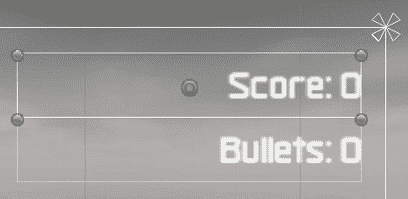

    图 11.40 -分数和子弹标签的锚

7.  选择任意元素，用鼠标拖动画布矩形的边，以预览元素如何适应其位置。 请注意，你必须选择 Canvas 的直接子对象; 按钮内的文本不会有这个选项:

图 11.41 -预览画布的大小调整

现在我们的 UI 元素已经适应了它们的位置，让我们考虑对象大小也必须适应的场景。

## 调整物体的大小

在处理不同的宽高比时，首先要考虑的是，我们的屏幕元素不仅可能从其的原始设计位置移动(我们在前一节中固定了这个位置)，而且它们可能不适合原始设计。 在我们的 UI 中，我们有一个健康条的例子，当我们在更宽的屏幕上预览它时，它显然不能适应屏幕宽度。 我们可以通过破坏锚来解决。

当我们打破锚，我们的位置和大小的对象计算相对于不同锚部分的距离。 如果我们将 Anchor 横向拆分，我们将使用 Left 和 Right 属性，而不是 X 和 Width 属性，它表示到左右 Anchor 的距离。 我们可以用以下方式来使用它:

1.  选择生命条，将锚点的左侧拖动到屏幕的左侧，将锚点的右侧拖动到屏幕的右侧。
2.  Do the same for the health bar frame:

    

    图 11.42 -健康条中的拆分器锚

3.  检查检查器窗口中的**recttransform**设置的**Left**和**Right**属性，它们表示当前到各自锚点的距离。 如果你愿意，你可以添加一个特定的值，特别是当你的健康条显示在屏幕外时:

图 11.43 -分离锚的 Left 和 Right 属性

这样，物体将始终处于与屏幕相对位置的固定距离上——在本例中是屏幕的两侧。 如果您正在处理子对象，例如按钮的 Text 和 Image 组件，那么 anchor 是相对于父对象的。 如果你注意文字的“锚”，它们不仅水平地分开，而且垂直地分开。 这允许文本根据按钮的大小调整其位置，所以你不必手动更改它:

图 11.44 -按钮文本的分离锚

现在，这个解决方案并不适用于所有的情况。 让我们考虑一种情况，即英雄角色的显示分辨率高于其设计初衷。 即使头像被正确放置，它也会显示得更小，因为屏幕每英寸的像素比其他分辨率更高。 你考虑使用分割锚点，但是宽度和高度锚点可以在不同的长宽比屏幕上以不同的比例缩放，因此原始图像变得扭曲。 相反，我们可以使用 Canvas Scaler 组件。

Canvas Scaler 组件定义了在我们的场景中 1 像素的含义。 如果我们的 UI 设计分辨率是 1080p，但我们在 4k 显示器中看到它(这是 1080p 分辨率的两倍)，我们可以缩放 UI，使像素变为 2，调整其大小以保持与原始设计相同的比例大小。 基本上，这个想法是如果屏幕更大，我们的元素也应该更大。

我们可以通过以下步骤来使用这个组件:

1.  选择**Canvas**对象，并在**检查器**窗口中找到**Canvas Scaler**组件。
2.  设置**UI 缩放模式**属性为**缩放屏幕大小**。
3.  我们的情况并非如此，但如果将来你与美工合作，请将参考分辨率设置为美工创建 UI 时的分辨率，并记住它必须是最高的目标设备分辨率。 在我们的例子中，我们不确定所下载素材的艺术家所考虑的分辨率是什么，所以我们可以使用**1920 x 1080**，这是全高清分辨率大小，在今天非常常见。
4.  将**Match**属性设置为**Height**。 这个属性的想法是，它设置了执行缩放计算时将考虑的分辨率的哪一边。 在我们的例子中，如果我们在 1080 分辨率下玩游戏，1 个 UI 像素等于 1 个真正的屏幕像素。 然而，如果我们是在 720p 分辨率下玩游戏，1 个 UI 像素将是 0.6 个真实像素，所以在更小的分辨率屏幕上，元素将会更小，保持其正确的大小。 在本例中，我们没有选择**Width**值，因为我们可以在屏幕中设置极端的宽度，比如超宽，如果我们选择了该选项，这些屏幕将不必要地缩放 UI。 另一个选项是将该值设置为**0.5**，以考虑这两个值，但在 PC 上，这没有太大意义。 在移动设备上，你应该根据游戏的方向来选择，为横向模式设置高度，为纵向模式设置宽度。 试着预览一个更宽更高的屏幕，看看这个设置是如何工作的:

图 11.45 -标准 PC 游戏中正确设置的 Canvas Scaler

你会发现你的 UI 比你原来的设计要小，这是因为我们之前应该设置这些属性。 现在，唯一的解决办法就是重新调整所有东西的大小。 下次你尝试这个练习的时候要考虑到这一点; 我们遵循这个顺序只是为了学习。

在继续进行之前，请记住重新激活后处理卷对象以再次显示这些效果。 你会注意到在 Game 视图中 UI 不受它们的影响。

重要提示:

如果你想让你的 UI 受到后处理效果的影响，你可以设置**Canvas 渲染模式**为**屏幕空间****-相机**。 拖动主相机到**渲染相机**属性，并设置**平面距离**为**5**。 这将把 UI 和其他对象放在一起，并与摄像机视图保持 5 米的距离。

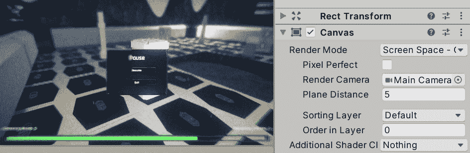

图 11.46 -画布渲染模式设置为相机模式以接收后处理效果

有了这些知识，现在就可以开始自己创建第一个 ui 了。

# 总结

在本章中，我们介绍了 UI 的基础知识，理解了**Canvas**和**RectTransform**组件在屏幕上定位对象并创建 UI 布局。 我们也涵盖了不同类型的 UI 元素，主要是**Image**和**Text**，让我们的 UI 布局更有生气，更吸引用户。 最后，我们讨论了如何让 UI 对象适应不同的分辨率和长宽比，以使我们的 UI 适应不同的屏幕尺寸，即使我们无法预测用户将在哪个监视器上玩游戏。

在下一章中，我们将开始看到如何添加动画角色到我们的游戏。*****