# *第 13 章*:c# Unity 脚本简介

Unity 拥有许多出色的内置工具来解决游戏开发中最常见的问题，就像我们目前所看到的那些问题。 即使是两款题材相同的游戏也有其独特之处，而 Unity 无法预见这一点，所以我们才会使用脚本。 通过编码，我们可以通过多种方式扩展 Unity 的功能，以实现我们所需要的精确行为，这一切都通过众所周知的语言——c#。 我们将介绍如何使用 c#脚本创建自定义组件。

这里我需要指出的一点是，这一章主要是对 Unity 的 c#脚本基础进行概述，但在其中一节中，我将为有经验的程序员解释一些高级技巧。 所以，如果你有编程经验但没有使用 Unity，请不要跳过这一章。

在本章中，我们将研究以下脚本的概念:

*   创建 c#脚本
*   使用事件和指令

我们将创建我们自己的 Unity 组件，学习类的基本结构，以及我们可以执行动作和暴露要配置的属性的方式。 让我们从讨论脚本创建的基本知识开始。

# 创建 c#脚本

这本书是为有一些编程知识的读者准备的，但在第一部分，我们将讨论 c#脚本结构，以确保你对接下来章节中编写的行为有一个坚实的基础。

在本节中，我们将研究以下脚本创建概念:

*   初始设置
*   创建一个基于单一行为的类
*   添加字段

我们将创建我们的第一个 Unity 脚本，它将用于创建我们的组件，讨论所需的工具，并探索如何将我们的类字段暴露给编辑器。 让我们从脚本创建的基础知识开始。

## 初始设置

在创建我们的第一个脚本之前要考虑的一件事是 Unity 如何编译代码。 在编码时，我们习惯于使用**集成开发环境**(**IDE**)，这是一个创建代码并编译或执行它的程序。 在 Unity 中，我们将使用 IDE 作为工具来轻松地创建带有着色和自动完成功能的脚本，因为 Unity 没有自定义代码编辑器，如果你之前从未编码过，这些对于初学者来说是很有价值的工具。 脚本将在 Unity 项目中创建，如果有任何更改，Unity 将检测并编译它们，所以你不会在 IDE 中编译。 不要担心——您仍然可以在此方法中使用断点。

我们可以使用 Visual Studio, Visual Studio Code, Rider，或者任何你想使用的 c# IDE，但是当你安装 Unity 时，你可能会看到一个选项自动安装 Visual Studio，这允许你拥有一个默认的 IDE。 这将安装 Visual Studio 的免费版本，所以无需担心这里的许可证。 如果你的电脑上没有 IDE，并且在安装 Unity 时没有检查 Visual Studio 选项，你可以做以下操作:

1.  打开**Unity Hub**。
2.  转到**安装**部分。
3.  Click on the three dots in the top-right area of the Unity version you are using and click on **Add Modules**:

    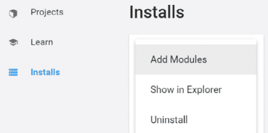

    图 13.1 -添加一个模块到 Unity 安装

4.  勾选选项:**Visual Studio**; 选项的描述将根据你使用的 Unity 版本而有所不同。
5.  Hit the **NEXT** button at the bottom right:

    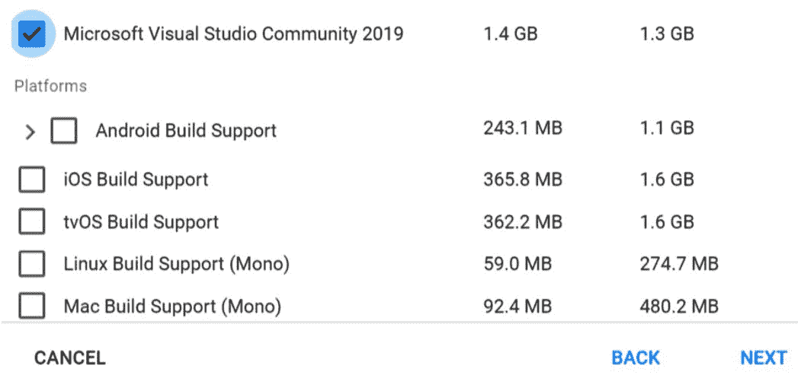

    图 13.2 -安装 Visual Studio

6.  等待操作结束。 这可能需要几分钟。

如果你有一个首选的 IDE，你可以自己安装它并配置 Unity 来使用它。 如果你能负担得起，或者你是老师或学生(因为在这些情况下它是免费的)，我推荐 Rider。 它是一个很棒的 IDE，拥有许多 c#和 Unity 特性，你会喜欢的; 然而，它对这个练习不是至关重要的。 为了设置 Unity 使用自定义 IDE，请执行以下操作:

1.  打开项目。
2.  转到编辑器顶部菜单中的**编辑**|**首选项**。
3.  从左面板选择**外部工具**菜单。
4.  From the external script editor, select your preferred IDE; Unity will automatically detect the supported IDEs:

    

    图 13.3 -选择自定义 IDE

5.  如果您没有在列表中找到您的 IDE，您可以使用**Browse…**选项，但是通常情况下，要求您使用此选项的 IDE 并没有得到很好的支持—但是值得一试。

最后，一些 ide，如 Visual Studio、Visual Studio Code 和 Rider，都有 Unity 集成工具，你需要来安装到你的项目中，这些工具是可选的，但也很有用。 通常 Unity 会自动安装这些内容，但如果你想确保它们已经安装，请执行以下操作:

1.  打开**包管理器**(**窗口**|**包管理器**)。
2.  Search the list for your IDE or filter the list by using the search bar. In my case, I used Rider, and I can find a package called **JetBrains Rider Editor**:

    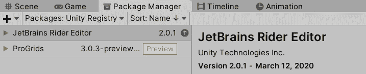

    图 13.4 -自定义 IDE 编辑器扩展安装-在本例中，是 Rider

3.  通过查看包管理器右下角的按钮，检查您的 IDE 集成包是否已安装。 如果你看到一个**安装**或**更新**按钮，点击它，但是如果它显示**安装**，一切都设置好了。

现在我们已经配置了一个 IDE，让我们创建第一个脚本。

## 创建一个基于单一行为的类

c#是一种非常面向对象的语言，在 Unity 中也没有什么不同。 任何时候我们想要扩展 Unity，我们需要创建我们自己的类 a 脚本，其中包含我们想要添加到 Unity 的指令。 如果我们想创建自定义组件，我们需要创建一个继承自自定义组件的基类**MonoBehaviour**的类。

我们可以使用编辑器直接在 Unity 项目中创建 c#脚本文件，你可以把它们放在其他资产文件夹旁边的文件夹中。 创建脚本的最简单的方法是通过以下步骤:

1.  选择任何你想要拥有我们将要创建的组件的游戏对象。 因为我们只是测试这个，选择任何对象。
2.  Click on the **Add Component** button at the bottom of the Inspector and look for the **New script** option at the bottom of the list, displayed after clicking on **Add Component**:

    

    图 13.5 - New script 选项

3.  In the **Name** field, enter the desired script name. In my case, I will call it **MyFirstScript**, but for the scripts that you will use for your game, try to enter descriptive names, regardless of the length:

    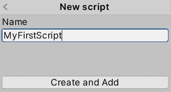

    图 13.6 -命名脚本

    重要提示:

    建议使用 Pascal 大小写进行脚本命名。 在 Pascal 案例中，关于玩家射击功能的脚本将被称为**PlayerShoot**。 每个单词的第一个字母都是大写的，不能使用空格。

4.  You can see how a new asset, called as the script was, is created in Project View. Remember that each component has its own asset, and I suggest you each component to a **Scripts** folder:

    

    图 13.7 -脚本资产

5.  现在，你还会看到你的游戏对象在检查器窗口中有一个新组件，它的名称与你的脚本相同。 所以，你现在已经创建了你的第一个组件类:

图 13.8 -我们的脚本被添加到游戏对象中

现在我们已经创建了一个**组件**类，记住类并不是组件本身。 它描述了组件应该是什么样子——组件应该如何工作的蓝图。 为了实际使用组件，我们需要通过创建基于类的组件来实例化它。 每次使用编辑器向对象添加组件时，我们都在实例化它。 通常，我们不使用 new 来实例化，而是使用编辑器或专门的函数。 现在，你可以像添加其他组件一样，在 Inspector 窗口中使用**add component**按钮，并在**Scripts**类别中查找它，或者通过名称搜索它:

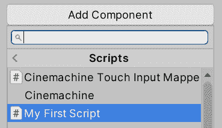

图 13.9 -在 Scripts 类别中添加自定义组件

你需要考虑的是，我们可以将相同的组件添加到多个游戏对象中。 我们不需要为每个使用组件的游戏对象创建一个类。 我知道这是程序员的基本知识，但请记住，我们在这里试图概括这些基本知识。 在下一章中，我们将讨论更有趣的话题。

现在我们已经有了我们的组件，让我们来探索它的外观，并通过以下操作来执行一个类结构概述:

1.  在项目视图中找到脚本资产并双击它。 记住，它应该位于前面创建的**Scripts**文件夹中。
2.  Wait for the IDE to open; this can take a while. You will know that the IDE has finished the initialization when you see your script code and its keywords properly colored, which varies according to the desired IDE. In Rider, it looks as in the following screenshot. In my case, I knew that Rider had finished initializing because the MonoBehaviour type and the script name are colored the same:

    

    图 13.10 -在 Rider IDE 中打开的新脚本

3.  The first three lines—the ones that start with the **using** keyword—include common namespaces. Namespaces are like code containers, which is, in this case, code created by others (such as Unity, C# creators, and so on). We will be using namespaces quite often to simplify our tasks; they already contain solved algorithms that we will use. We will be adding and removing the **using** component as we need; in my case, Rider is suggesting that the first two **using** components are not necessary because I am not using any code inside them, and so they are grayed out. But for now, keep them as you will use them in later chapters of this book. Remember, they should always be at the beginning of the class:

    

    图 13.11 -使用部分

4.  下一行以**公共类**开头，声明我们正在创建一个继承自**MonoBehaviour**(每个自定义组件的基类)的新类。 我们知道这一点，因为它以**:单行为**结束。 你可以看到其余的代码是如何位于括号中，就在这一行的正下方，这意味着其中的代码属于组件:

图 13.12 - MyFirstScript 类定义继承自 MonoBehaviour

现在我们有了第一个组件，让我们从字段开始编辑它。

## 添加字段

当我们添加组件**刚体**或作为不同种类的碰撞器时，添加组件是不够的。 我们需要正确地配置它们，以实现我们需要的确切行为。 例如，**刚体**具有**Mass**属性来控制物体的重量，碰撞器具有**Size**属性来控制它们的形状。 通过这种方式，我们可以在不同的场景中重用相同的组件，防止类似组件的重复。 使用**Box**collider，我们可以通过改变 size 属性来表示一个正方形或矩形框。 我们的组件也不例外; 如果我们有一个组件来移动一个物体，如果我们想让两个物体以不同的速度移动，我们可以使用相同的配置不同的组件。

每个配置都是一个类字段，它是一个特定的类型变量，我们可以在其中保存参数的值。 我们可以以两种方式创建可以在编辑器中编辑的类字段:将字段标记为**public**，但这违反了封装原则;或者创建私有字段并使用属性公开它。 现在，我们将介绍这两种方法，但是如果您不熟悉**面向对象编程**(**OOP**)的概念，例如封装，我建议使用第一种方法。

假设我们正在创建一个移动脚本。 我们将使用第一种方法添加一个可编辑的数字字段，即通过添加**public**字段来表示速度。 我们将遵循以下步骤:

1.  像前面一样，通过双击打开脚本。
2.  Inside the class brackets, but outside any brackets within them, add the following code:

    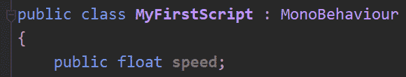

    图 13.13 -在我们的组件中创建一个速度字段

    重要提示:

    关键字**public**指定变量可以在类的范围之外被查看和编辑。 代码的**浮点**部分表示变量使用十进制数类型，**speed**是我们为字段选择的名称——可以是您想要的任何名称。 您可以使用其他值类型来表示其他类型的数据，例如用**bool**表示复选框或布尔值，用**string**表示文本。

3.  To apply the changes, just save the file in the IDE (usually by pressing *Ctrl* + *S* or *command* + *S*) and return again to Unity. When you do this, you will notice a little loading wheel at the bottom-right part of the editor, indicating that Unity is compiling the code. You can't test the changes until the wheel finishes. Remember that Unity will compile the code; don't compile it in the IDE:

    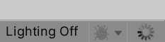

    图 13.14 -装料轮

4.  After the compilation is finished, you can see your component in the Inspector window and the **Speed** variable should be there, allowing you to set the speed you want. Of course, right now, the variables do nothing. Unity doesn't recognize your intention by the name of the variable; we need to set it for use in some way, but we will do that later:

    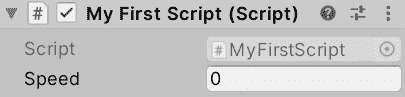

    图 13.15 -用于编辑组件稍后将使用的数据的公共字段

5.  试着将相同的组件添加到其他物体上，并设置不同的速度。 这将向你展示不同游戏对象中的组件是如何独立的，允许你通过不同的设置改变它们的一些行为。

第二个定义属性的方法是类似的,但不是创造一个**公共领域,我们创建一个****私人领域,鼓励封装和公开使用**SerializeField**属性,如下面屏幕截图所示。 这些截屏显示了两种方法——两者都会产生相同的结果; 唯一的区别是样式。 使用最适合你的编码标准:**

图 13.16 -在 Inspector 窗口中公开私有属性的两种方法

如果您不熟悉 OOP 的封装概念，就使用第一种方法，它对初学者来说更灵活。 如果您创建一个**私有**字段，其他脚本将无法访问该字段，因为**SerializeField**属性只向编辑器公开该变量。 记住团结不允许您使用构造函数,所以设置初始数据和注入依赖关系的唯一途径是通过序列化私人领域和公共领域和设置他们在编辑器(或使用依赖注入框架,但这超出了这本书的范围)。 为了简单起见，我们将在本书的大多数练习中使用第一种方法。

如果你想，尝试创建其他类型的变量，看看它们在检查器中是什么样子。 如前所述，尝试将**float**替换为**bool**或**string**。 现在我们知道了如何通过数据配置组件，让我们使用这些数据来创建一些行为。

# 使用事件和指令

现在我们有了一个脚本，我们准备对它做一些事情。 我们不会在这一章中实现任何有用的东西，但我们将确定概念，为我们将在下一章中创建的脚本添加一些类型的行为。

在本节中，我们将涵盖以下概念:

*   事件和指令
*   在指令中使用字段
*   常见的初学者错误

我们将探索 Unity 事件系统，它将允许我们通过执行 Unity 函数来应对这些情况。 这些函数还将受到编辑器值的影响，并且暴露给脚本的字段是可配置的。 最后，我们将讨论常见的脚本错误以及如何解决它们。 让我们先介绍 Unity 事件的概念。

## 事件和指示

统一允许我们以因果的方式创建行为，这通常被称为事件系统。 事件是 Unity 监视的一种情况——例如，当两个物体碰撞或被摧毁时，Unity 会告诉我们这种情况，让我们根据自己的需求做出反应。 例如，当玩家与子弹相撞时，玩家的生命就会减少。 在这里，我们将探索如何通过一些简单的操作来侦听这些事件并测试它们。

如果你习惯了事件系统，你会知道它们通常需要我们订阅某种侦听器或委托，但在 Unity 中，有一个更简单的方法可用。 我们只需要为我们正在寻找的事件准确地编写函数——我的意思是*准确地*。 如果该名称的一个字母没有正确的大小写，它将不会执行，也不会引发警告。 这是初学者最常犯的错误，所以要注意了。

在 Unity 中有许多事件或消息需要倾听，所以让我们从最常见的一个开始——**Update**。 这个事件会告诉你什么时候 Unity 想要你更新你的对象，这取决于你行为的目的; 有些人不需要它们。 **Update**逻辑通常需要不断执行; 更准确地说，是每一帧。 记住，每一款游戏都像一部电影——你的屏幕快速切换一系列图像，看起来就像我们有连续的运动。 在**Update**事件中做的一个常见动作是稍微移动对象，通过这样做，每一帧都将使对象不断移动。

稍后我们将了解我们可以使用**Update**和其他事件或消息来做哪些事情。 现在，让我们关注如何让我们的组件至少侦听这个事件。 实际上，基本组件已经提供了两个可以使用的事件函数，一个是**Update**，另一个在脚本中。 如果您不熟悉 c#中的函数概念，我们将参考下面截图中的代码片段，它已经包含在我们的脚本中。 试着在你的字典里找到它:

图 13.17 -一个名为 Update 的函数，它将在每一帧执行

您会注意到在**void Update()**行之上有一行(通常是)绿色的文本(取决于 IDE)——这被称为注释。 这些基本上都被 Unity 忽略了。 它们只是你可以留给自己的注解，并且必须始终以**//**开始，以防止 Unity 尝试执行它们并失败。 稍后我们将使用它来临时禁用代码行。

现在，为了测试这是否实际工作，让我们添加一条一直执行的指令。 没有比**print**更好的测试功能了。 这是一个简单的指令，告诉 Unity向控制台打印一条消息，开发者可以看到各种消息来检查一切是否正常工作。 用户将永远不会看到这些消息。 它们类似于经典的日志文件，即当游戏出现问题时，开发者有时会要求你提交问题报告。

为了使用函数测试事件，请执行以下操作:

1.  通过双击脚本打开它。
2.  To test, add **print("test");** within the event function. In the following screenshot, you can see an example of how to do that in the **Update** event. Remember to write the instruction *exactly*, including the correct casing, spaces, and quotes symbols:

    

    图 13.18 -在所有帧中打印一条消息

3.  Save the file, go to Unity, and play the game.

    重要提示:

    记住在从 IDE 切换回 Unity 之前先保存文件。 这是 Unity 知道你的文件已经改变的唯一方法。 有些 ide，比如 Rider，会自动为您保存文件，但我不建议您使用自动保存，至少在大型项目中是这样的(您不希望意外地重新编译未完成的工作; 在有很多脚本的项目中，这需要很长时间)。

4.  查找**Console**选项卡并选择它。 这通常在**项目视图**选项卡旁边。 如果你不能找到它,去**窗口**|**【T7 将军】|【显示】控制台**,*或按 Ctrl*+【病人】转变+*C*(【t16.1】命令+*+*C 转变在 macOS*)。*
**   您将看到在**控制台**标签的每一帧中打印出大量的**“test”**消息。 如果你没有看到这个，记得在玩游戏之前保存脚本文件。*   让我们再来测试**Start**函数。 添加**print("test Start");** ，保存文件，开始游戏。 完整的脚本应该如下所示:*

 *

图 13.19 -测试 Start 和 Update 函数的脚本

如果您现在检查控制台并向上滚动，您将看到一个单一的**“test Start”**消息以及大量的**“test”**消息。 正如您所猜测的，**Start**事件告诉您游戏已经开始，并允许您执行在游戏开始时只需要发生一次的代码。 我们将在本书后面使用它。

对于**void Update()**语法，我们将告诉 Unity，这一行下面的括号中包含的内容是一个将在所有帧中执行的函数。 将 print 指令*放在*的**Update**括号内(类的括号内)是很重要的。 同样，**print**函数期望在其圆括号内接收文本，称为实参或形参，在 c#中文本必须用引号括起来。 最后，所有功能内部的指令，如**Update**或**Start***必须以分号结束。*

在这里，我建议您尝试添加另一个名为**OnDestroy**的事件，使用**打印函数**来发现它的执行时间。 一个小建议是，玩完游戏后停止游戏，然后查看主机底部进行测试。

对于高级用户，如果 IDE 允许的话，也可以使用断点。 断点允许你在执行特定的代码行之前完全冻结 Unity，以查看我们字段的数据在时间内是如何变化的，并检测错误。 在这里，我将向您展示在 Rider 中使用断点的步骤，但 Visual Studio 版本应该是类似的:

1.  Click on the vertical bar at the left of the line where you want to add the breakpoint:

    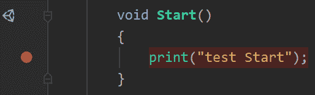

    图 13.20 -打印指令中的断点

2.  Go to **Run** | **Attach to Unity Process** (in Visual Studio, go to **Debug** | **Attack Unity Debugger**. Remember that you need the Visual Studio Unity plugin and the Visual Studio integration package of **Package Manager**):

    

    图 13.21 -用 Unity 进程攻击我们的 IDE

3.  从列表中，寻找你想要测试的特定 Unity 实例。 该列表将显示其他打开的编辑器或正在执行的调试构建。

停止调试过程不会关闭 Unity。 它只是将 IDE 从编辑器中分离出来。

既然我们已经创建了字段和指令，那么让我们将它们组合起来组成可配置的组件。

## 使用指令中的字段

我们已经创建了字段来配置组件的行为，但是到目前为止我们还没有使用它们。 我们将在下一章中创建有意义的组件，但是我们经常需要的一件事是使用我们创建的字段来更改对象的行为。 到目前为止，我们还没有真正使用我们创建的**速度**域。 然而,以下测试的想法我们的代码是否工作(也称为调试),我们可以学习如何使用功能测试的数据在一个字段值是否预期,改变**的输出显示在控制台打印**字段的值。

在我们当前的脚本中，我们的**速度**值在运行时不会改变。 但是，举个例子，如果你正在创建一个带有护盾伤害吸收的生命系统，并且你想测试减少伤害的计算是否正常工作，你可能需要将计算值打印到控制台并检查它们是否正确。 这里的想法是用一个字段替换**print**函数中的固定消息。 当您这样做时，**print**将在控制台中显示该字段的值。 如果你设置一个值的【T6 5】【显示】速度和你打印它,你会看到很多消息说**5**在控制台的输出【病人】打印功能是由。 要测试这一点，您的**打印**消息在**Update**功能中应该如下所示:

图 13.22 -使用字段作为打印函数参数

正如您可以看到的，我们只是将字段名省略了引号。 如果使用引号，将打印一条**"speed"**消息。 在其他情况下,您可以使用此**速度值在一些移动功能控制运动将以多快的速度,或者您可以创建一个名为**的字段“fireRate”**(字段使用驼峰式大小写而不是帕斯卡,第一个字母是小写)来控制冷却时间一颗子弹与未来:**

 **

图 13.23 -打印当前速度

重要提示:

你可以看到我的编辑器是红色的，这是因为我把它配置为红色，当玩游戏时，很容易检测到。 你可以去编辑>首选项>颜色和改变播放模式色彩。

有了这些，我们现在有了开始创建实际组件所需的工具。 在继续之前，让我们回顾一下第一次使用 c#创建脚本时可能会遇到的一些常见错误。

## 初学者常见的错误

如果您是一个有经验的程序员，我打赌您对这些非常熟悉，但是让我们回顾一下在开始编写脚本时可能会浪费大量时间的常见错误。 其中大多数是由于没有准确地复制所显示的代码*而引起的。 如果你在代码中出现错误，Unity 将在控制台显示红色消息，不允许你运行游戏，即使你没有使用脚本。 所以，不要留下任何未完成的事情。*

 *让我们从一个经典的错误开始，它是一个缺少分号的错误，它导致了许多程序员的迷因和笑话。 函数中的所有字段和大多数指令(如**print**)在被调用时，都需要在末尾有一个分号。 如果你不添加分号，Unity 就会在控制台中显示一个错误，比如下图中左边的截图。 你还会注意到，下图右边的截图也有一个坏代码的例子，IDE 显示了一个红色图标，表明在那个地方出了问题:

图 13.24 - IDE 和 Unity 控制台提示的打印行错误

您会注意到，错误显示了准确的脚本(**MyFirstScript.cs**)，准确的代码行(在本例中为**18**)，通常还有描述性消息——在本例中为**; [分号]期望**。 你可以简单地双击这个错误，Unity 会打开 IDE，突出显示有问题的行。 您甚至可以单击堆栈中的链接来跳转到您想要的堆栈行。

我已经提到了为什么在说明书的每一个字母上都要使用*精确*case。 然而，基于我教初学者的经验，我需要强调这一特殊方面。 第一个可能发生这种情况的场景是在指令中。 在下面的屏幕截图中，您可以看到一个写得很糟糕的**print**函数的样子——也就是说，您可以看到控制台将显示的错误，以及 IDE 将如何提示存在错误。 首先，在 Rider 的情况下，该指令是红色的，表示该指令未被识别(在 Visual Studio 中，它将显示一条红线)。 然后，错误消息说**Print**在当前上下文中不存在，这意味着 Unity(实际上是 c#)不识别任何名为**Print**的指令。 在另一种类型的脚本中，大写**打印**可能有效，但在常规组件中无效，这就是为什么在当前上下文中存在澄清:

图 13.25 -写错误指令时出现错误提示

现在，如果用错误的大小写编写事件，情况会更糟。 您可以创建像**Start**和**Update**这样的函数，使用您想要的任何名称来实现其他目的。 编写**update**或**start**是完全正确的，因为 c#会认为您将把这些函数作为常规函数而不是事件来使用。 因此，不会显示错误，您的代码将无法工作。 试着把**更新**改为**更新**，看看会发生什么:

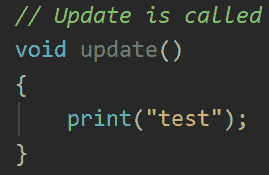

图 13.26 - Update 函数中错误的大小写会编译函数，但不会执行它

另一个错误是将指令放在函数括号外，比如类的括号内或括号外。 这样做不会给函数提示什么时候需要执行它。 因此，在**Event**函数之外使用**print**函数是没有意义的，它会显示如下截图所示的错误。 这一次，错误并不是非常清晰的。 Identifier expected 表示 c#希望你创建一个函数或字段——这类结构可以直接放在类中:

图 13.27 -错误的指令或函数调用

最后，另一个典型的错误是忘记了右括号。 如果不关闭括号，c#将不知道一个函数在哪里结束，另一个函数在哪里开始，或者类函数在哪里。 这可能听起来有些多余，但 c#需要完美地定义这一点。 在下面的截图中，你可以看到它的样子:

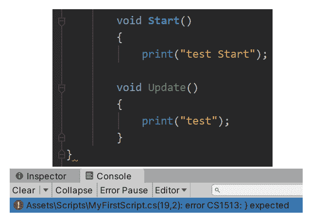

图 13.28 -缺少闭括号

这个有点难以捕捉，因为代码中的错误是在实际错误之后显示的。 这是由于 c#允许将函数放在函数中(不经常使用)，所以 c#稍后会检测到这个错误，并要求您添加一个右括号。 但是，由于我们不想将**更新**放在**Start**中，所以我们需要在**Start**结束之前修复这个错误。 在控制台中，错误消息将是描述性的，但同样，不要在消息建议的地方放置右括号，除非你 100%确定该位置是正确的。

除了这些错误之外，您可能会面临许多错误，但它们的工作原理是一样的。 IDE 会给你一个提示，控制台会显示一条消息; 随着时间的推移，你会了解它们的。 只要有耐心，因为每个程序员都经历过这种情况。 还有其他类型的错误，如运行时错误，代码编译后由于某些错误配置而在执行时失败，或者最糟糕的逻辑错误，代码编译和执行时没有错误，但没有做您想做的事情。

# 总结

在本章中，我们探讨了创建脚本时会用到的基本概念。 我们讨论了类和实例的概念，以及它们必须如何继承 MonoBehaviour 才能被 Unity 接受来创建我们自己的脚本。 我们还看到了如何混合事件和指令来为对象添加行为，以及如何使用指令中的字段来自定义它们的功能。

我们只是探讨了 c#脚本的基本知识，以确保每个人都在同一页上。 然而,从现在开始,我们将假设您已经基本编码经验的一些编程语言,你知道如何使用结构如**如果**,**,**数组,等等。 如果没有，你仍然可以通读这本书，并在需要的时候用一本 c#介绍书来补充你不理解的地方。****

 ****在下一章中，我们将开始看到如何使用我们所学到的来创建移动和生成脚本。********