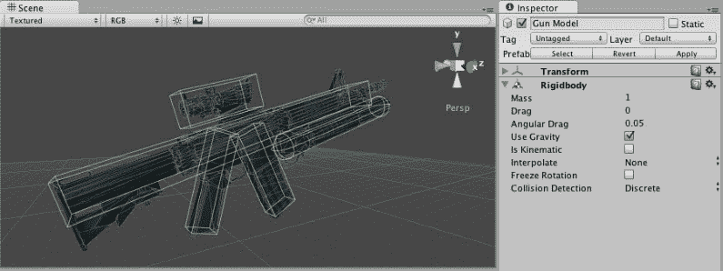
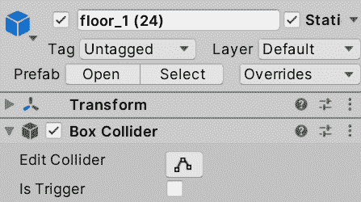
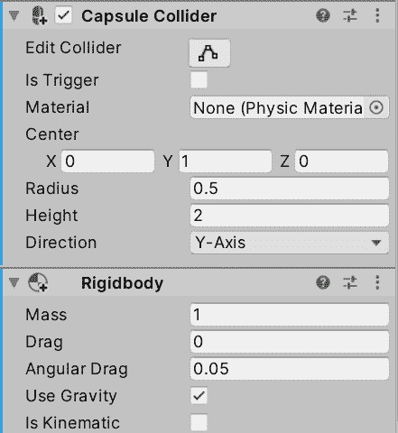
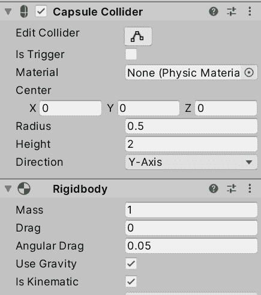
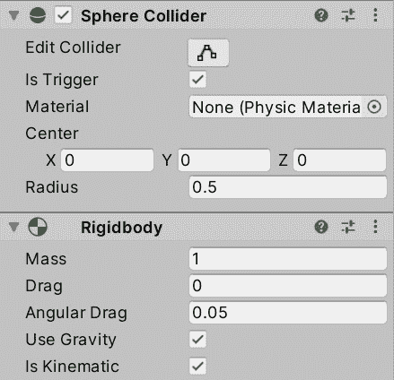
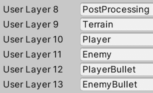
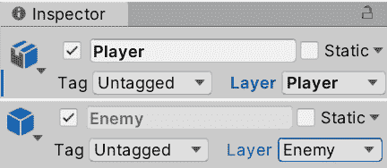
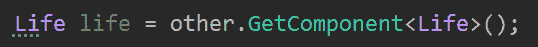
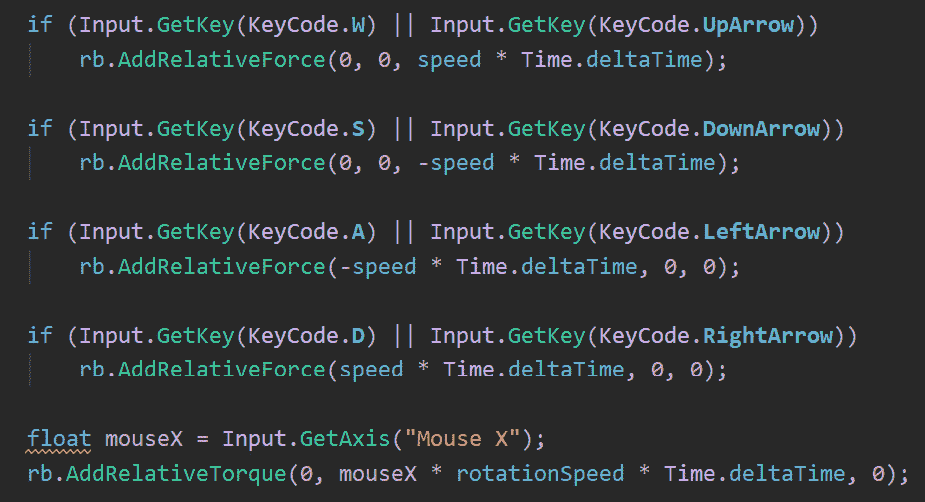
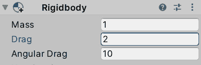

# *第十五章*:物理碰撞与健康系统

当游戏试图模拟现实世界的行为时，模拟的一个重要方面便是物理，即指示物体如何移动以及它们如何相互碰撞，如玩家与墙壁或子弹与敌人的碰撞。 物理很难控制由于无数的反应可能发生碰撞后,我们将学习如何正确配置它获得物理学面前,这将生成所需的拱廊运动感觉但得到碰撞后工作,有时候,现实生活不是游戏一样有趣。

在本章中，我们将研究以下碰撞概念:

*   配置物理
*   碰撞检测
*   以物理运动

首先，我们将学习如何正确配置物理，这是我们的脚本检测对象之间的碰撞所需的步骤，使用我们也将学习的新事件。 然后，我们将讨论移动与**变换**之间的区别，正如我们到目前为止所做的，移动与刚体以及每个版本的优缺点。 让我们开始讨论物理设置。

# 配置物理

Unity 的物理系统已经准备好覆盖大量可能的游戏玩法应用，所以正确配置它对于获得预期的结果很重要。

在本节中，我们将研究以下的物理设置概念:

*   设置形状
*   物理对象类型
*   过滤的碰撞

我们将开始学习 Unity 提供的不同类型的碰撞器，然后学习配置这些以检测不同类型的物理反应(碰撞和触发器)的不同方法。 最后，我们将讨论如何忽略特定对象之间的碰撞，以防止出现玩家的子弹伤害玩家的情况。

## 设置形状

在这本书的开始，我们了解了对象通常有两种形状，视觉形状，即，基本上是 3D 网格，和物理形状，即碰撞器，物理系统将使用它来计算碰撞。 记住，这样做的想法是让你拥有一个非常详细的可视化模型，同时有一个简化的物理形状来提高性能。

Unity 有几种类型的碰撞器，所以在这里我们将回顾常见的碰撞器，从基本类型开始，即 Box, Sphere 和 Capsule。 这些形状是最便宜的(在性能方面)来检测冲突是因为它们之间的碰撞都是通过数学公式,与其他对撞机如网对撞机,它允许您使用任何网格物体的物理身体,但是更高的成本和一定的局限性。 这个想法是，你应该使用一个原始类型来表示你的对象或它们的组合，例如，一个飞机可以用两个 Box Colliders 来完成，一个用于机身，另一个用于机翼。 你可以在下面的截图中看到一个例子，你可以看到一个由原语组成的武器碰撞器:

图 15.1 -复合碰撞器

无论如何，尽量避免这样做; 如果我们想让武器直接掉到地上，也许一个覆盖整个武器的 Box Collider 就足够了，因为这些类型的碰撞并不需要精确，因此能够提高性能。 另外，一些形状甚至不能用原始形状的组合来表示，如坡道或金字塔，在那里你唯一的解决方案是使用一个网格碰撞器，它要求一个 3D 网格来使用碰撞，但我们不会在这本书中使用它们; 我们将用原语解决所有物理对撞机。

现在，让我们添加必要的碰撞器到我们的场景，以准备它正确计算碰撞。 考虑一下，如果你使用的是 Asset Store 环境包而不是我的，你可能已经有了带有碰撞器的场景模块; 我将展示我需要在我的案例中做的工作，但尝试推断这里的主要想法到你的场景。 要添加碰撞器，请遵循以下步骤:

1.  选择一个墙在基础和检查对象和可能的子对象碰撞组件; 在我的例子中，我没有对撞机。 如果你检测到任何网格碰撞器，你可以留下它，但我建议你删除它并在下一步用另一个选项替换它。 我的想法是向它添加碰撞器，但我在这里发现的问题是，由于我的墙壁不是一个预制的实例，我需要向每个墙壁添加碰撞器。
2.  One option is to create a Prefab and replace all of the walls for instances of the Prefab (the recommended solution) or to just select all walls in the Hierarchy (by clicking them while pressing *Ctrl* or *Cmd* on Mac) and, with them selected, use the **Add Component** button to add a collider to all of them. In my case, I will use the **Box Collider** component, which will adapt the size of the collider to the mesh. If it doesn't adapt, you can just change the Size and Center properties of the Box Collider to cover the entire wall:

    

    图 15.2 -一个添加到墙上的盒子碰撞器

3.  重复*步骤 1 和*处理角落、地砖和其他阻碍玩家和敌人移动的障碍物。

为我们的敌人和球员,我们将添加胶囊对撞机,通常的对撞机中使用可移动人物由于圆形底部将允许对象顺利爬上斜坡,和水平圆允许对象容易旋转在角落不被卡住了,连同其他便利的形状。 记住敌人是一个预制件，所以你需要将碰撞器添加到预制件中，而我们的玩家是场景中的一个简单对象，所以你需要将碰撞器添加到预制件中。

重要提示

你可能想添加几盒对撞机的骨头字符创建一个真实形状的对象,虽然我们可以应用不同的损害根据身体的一部分,击中的敌人,我们只是创建运动对撞机; 胶囊足够了。 在先进的损伤系统中，胶囊和骨骼碰撞器将同时存在，一个用于运动，另一个用于损伤检测; 但我们会在游戏中简化它。

同时，有时候碰撞器也不能很好地适应对象的视觉形状，在我的例子中，胶囊碰撞器并不能为角色提供一个很好的形状。 我需要固定它的形状，以匹配字符设置其值如下截图所示:

图 15.3 -字符碰撞器

我们用球体创建的子弹已经有一个球体碰撞器，但如果你用另一个球体替换子弹的网格，你可能想要改变碰撞器。 现在，我们的游戏中不需要其他对象，所以现在每个人都有了合适的碰撞器，让我们看看如何为每个对象设置不同的物理设置，以实现适当的碰撞检测。

## 物理对象类型

现在我们已经通过让对象在物理模拟中存在而向每个对象添加了碰撞器，现在是时候配置它们以拥有我们想要的确切物理行为了。 我们有无数可能的设置组合，但是我们将讨论一组涵盖大多数情况的通用配置文件。 记住，除了对撞机，我们在本书的开始看到了刚体组件，这是一个应用物理到对象。 下面的配置文件是通过碰撞器和刚体设置的组合完成的:

*   **Static Collider**: As the name suggests, this kind of collider is the one that is not supposed to move by any means in the game, aside from some specific exceptions. Most of the environment Objects falls into this category, such as walls, floors, obstacles, and the Terrain. These kind of colliders are just colliders with no **Rigidbody** component, so they have a presence in the Physics Simulation, but don't have any Physics applied to them; they cannot be moved by other Objects, they won't have physics, and they will be fixed at their position no matter what. Take into account that this has nothing to do with the static checkbox at the top-right part of the Editor; those are for the previously seen systems (such as Lighting and others), so you can have a Static Collider with that checkbox unchecked if needed.

    重要提示

    考虑到这些对象可以通过脚本移动，但你不应该这么做。 Unity 将优化技术应用于它们，每次移动静态碰撞器时，优化就会失效，需要进一步计算更新它，而这样做的每一帧都是昂贵的。

    我们刚刚提到了地形作为一个例子，如果你检查地形的组件，你会看到它有自己的碰撞器，地形碰撞器。 对于 terrrains，这是唯一使用的对撞机。

*   **物理对撞机**:这些是带有**刚体**组件的对撞机，就像我们在本书第一部分中做的下落球的例子。 这些完全是物理驱动的物体，有重力，可以通过力移动; 其他物体可以推动它们，它们会执行你所期望的所有其他物理反应。 你可以将其用于玩家、手榴弹移动、掉落的箱子或在基于物理的游戏(如**the Incredible Machine**)中的所有对象中。
*   **运动学碰撞器**:这些是碰撞器，具有**刚体**组件，但是选中了**Is 运动学**复选框。 它们不具有与静态碰撞器相同的物理反应，但它们可以通过脚本(**转换)移动。 翻译**)，没有性能损失。 考虑到它们没有物理原理，它们也不会发生碰撞，所以它们可以穿墙。 这些可以用于需要使用动画或自定义脚本移动(如移动平台)的对象，考虑到在这种情况下，平台不会与其他对象发生碰撞，但拥有物理碰撞器的玩家将会与它们发生碰撞; 实际上，物理对撞机会和所有类型的对撞机发生碰撞。
*   **触发静态碰撞**:这是一个常规的静态碰撞器，但是选中了碰撞器的**is Trigger**复选框。 不同的是，运动学和物理对象通过它，但通过生成一个**触发器**事件，一个可以通过脚本捕获的事件，并告诉我们有东西在碰撞器中。 这可以用于在游戏区域中创建按钮或触发对象，当玩家经过某些发生的事情时，如产生一波敌人，打开一扇门，或赢得游戏(游戏邦注:如果该区域是玩家的目标位置)。 考虑到常规的静态碰撞器在通过这个类型时不会生成触发器事件，因为它们不应该移动。
*   **Trigger Kinematic Collider**:Kinematic Collider 不产生碰撞，所以它们会通过任何其他对象，但它们会生成 Trigger 事件，所以我们可以通过脚本进行反应。 可以用来创造可移动的升级道具，当玩家触碰这些道具时，它们便会消失，并为我们提供点数或子弹，这些子弹将基于自定义脚本移动而不带有任何物理属性，就像我们的子弹一样直接移动，但却会在接触到其他物体时造成伤害。
*   我们可以有一个触发器物理碰撞器，一个刚体的碰撞器，但是带有**Is Trigger**检查，通常，它没有真正的用途; 它将是一个不断下落的物体，会在世界上产生触发事件，但会穿越一切。 当然,其他配置文件可以存在除了指定的使用与特定的游戏需求一些游戏,但是考虑到所有可能的组合的物理设置你尝试是否有些是有用的对于你的情况,描述了配置文件将覆盖 99%的病例。
*   为了回顾之前的场景，我给你留下了下面的表格，展示了所有类型的对撞机之间的接触反应。 你会发现每一个配置文件可以移动一行; 记住，静态配置文件不应该移动。 每一列表示当它们与其他类型碰撞时的反应，“Nothing”表示该对象将通过而不产生任何效果，“Trigger”表示该对象将通过但引发触发器事件，“Collision”表示该对象将无法通过该对象:

表 15.4 碰撞反应矩阵

考虑到这一点，让我们开始配置场景对象的物理属性。

墙壁、角落、地砖和障碍物应该使用静态碰撞器配置文件，所以它们没有**刚体**组件，它们的碰撞器将有**Is Trigger**复选框未选中:

图 15.5 -地砖的配置; 记住静态复选框仅用于照明

玩家应该移动并产生与物体的碰撞，所以我们需要它具有动态配置文件。 这个配置文件将使用我们当前的移动脚本生成一个有趣的行为(我鼓励您测试它)，特别是当它与墙壁碰撞时，所以它的行为不会像您预期的那样。 我们将在本章后面讨论这个问题:

图 15.6 -播放器的动态设置

敌人的**预制,我们将使用这里的运动轮廓,因为我们将与团结的 AI 系统移动物体后,这里我们不需要物理,我们希望玩家碰撞,我们需要一个碰撞反应,所以没有**触发**:**

 **

图 15.7 -敌人的运动设置

对于**Bullet**预制件，它将通过简单的脚本移动(只是向前移动)，而不是物理。 我们不需要碰撞; 我们会将子弹编码为一旦它接触到某物就摧毁它自己，并且会损坏碰撞物体(如果可能的话)，所以一个运动学触发轮廓就足够了; 我们将使用**Trigger**事件来编写接触反应脚本:

图 15.8 -子弹的运动学触发设置; 是否检查触发器和运动学

现在我们已经正确地配置了 Object，让我们检查一下如何过滤某些 Object 类型之间不希望发生的冲突。

## 过滤碰撞

在经历了配置对象的所有麻烦之后，我们想要避免冲突吗? 实际上，是的，有时我们希望某些对象忽略彼此。 例如，玩家射出的子弹不应该与自己相撞，敌人的子弹也不应该击中自己。 我们总是可以过滤器与一个**如果**声明在 C# 脚本,检查是否达到对象从相反的团队或任何你想要的过滤逻辑,但到那时,为时已晚,物理系统已经浪费了资源通过检查对象之间的碰撞,从来就不应该被碰撞。 这就是图层碰撞矩阵可以帮助我们的地方。

图层碰撞矩阵听起来很吓人，但它是一个简单的物理系统设置，允许我们指定哪些对象组应该与其他组发生碰撞，例如，玩家的子弹应该与敌人发生碰撞，敌人的子弹应该与玩家发生碰撞。 其理念是创建这些组并将对象放入其中，在 Unity 中，这些组被称为**层**。 我们可以创建图层并设置 GameObject 的图层属性(检查器的顶部)，将对象分配给该组或层。 考虑到您只有有限的层，所以要明智地使用它们。

一旦我们创建了图层并分配了对象，我们就可以进入物理设置并指定哪些图层会与其他图层发生碰撞。 我们可以通过以下方法来实现这一点:

1.  Go to **Edit** | **Project Settings** and, inside it, look for the **Tags and Layers** option from the left pane:

    

    图 15.9 -标签和图层设置

2.  From the **Layers** section, use the empty spaces from **Layer 10** onward to create the needed ones. In our case, we will use this for the bullet scenario, so we need four layers, **Player**, **Enemy**, **PlayerBullet**, and **PlayerEnemy**:

    

    图 15.10 -创建图层

3.  Select the **Player** and, from the top part of the Inspector, change the layer property to **Player**. Also, change the **Enemy** Prefab to have the **Enemy** layer. A window will show asking you whether you want to change the child Objects also; select that option:

    

图 15.11 -改变玩家和敌人预制体的层

在子弹的例子中，我们有一个问题; 我们有一个预制件，但有两层，预制件只能有一层。 我们有两个选择，即通过脚本根据射击者改变图层，或者拥有两个带有不同图层的子弹预制件。 为了简单起见，我将选择后者，并利用机会将另一种材料应用到敌人子弹上，使其看起来不同。

我们将创建一个预制变种的球员子弹。 记住，Variant 是一个 Prefab，它是基于原始的，比如类继承。 当原来的预制件改变时，变式也会改变，但变式可以有差异，这将使它独一无二:

1.  在场景中投掷一颗子弹来创建一个实例。
2.  再次将实例拖到**Prefabs**文件夹中，这次选择**Prefabs Variant**选项。 称之为**敌人子弹**。 记住要摧毁场景中的预制实例。
3.  创造与玩家子弹相似的第二种材质，但要用黄色或任何你喜欢的颜色，并将其放在敌人子弹预制件变体上。
4.  选择敌人子弹的变种，设置它的层(**EnemyBullet**)，并对最初的预制件(**PlayerBullet**)做同样的操作。 即使你改变了原始的 Prefab 层，因为变体修改了它，修改的版本(或覆盖)将占上风，允许每个 Prefab 有自己的层。
5.  转到**编辑**|**项目设置**，寻找**物理设置**(不是物理 2D)。
6.  向下滚动，直到你看到图层碰撞矩阵，复选框的半网格。 您会注意到，每一列和每一行都被标记为层的名称，所以在行和列的交叉处的每个复选框将允许我们指定这两个是否应该碰撞。 在我们的例子中，我们将它配置为如下截图所示:

图 15.12 -让玩家子弹与敌人碰撞，敌人子弹与玩家碰撞

值得注意的是，有时过滤逻辑不会那么固定或可预测，例如， 我们的子弹可能只击中具有一定生命值的物体，或者没有无形时间 buff 的物体，或者在游戏过程中会发生变化的条件，很难为所有可能的群体生成所有可能的层。 因此，在这些情况下，我们应该依赖于触发器或碰撞事件之后的手动过滤。

现在我们已经过滤了碰撞，让我们在下一节中通过反应碰撞来检查我们的设置是否正常工作。

# 检测碰撞

正如你所看到的，适当的物理设置可能是复杂和非常重要的，但现在我们已经解决了这个问题，让我们通过以不同的方式响应接触来做一些事情，并在这个过程中创建一个卫生系统。

在本节中，我们将研究以下碰撞概念:

*   检测触发事件
*   修改其他对象

首先，我们将探索 Unity 提供的不同碰撞和触发事件，通过 Unity 碰撞事件来反应两个物体之间的接触。 这允许我们执行任何我们想放置的反应代码，但是我们将探索如何使用**GetComponent**函数修改接触的 Object 组件。

## 检测触发事件

如前所述，如果对象被正确配置，我们可以得到两个反应，触发器和碰撞。 碰撞反应的默认效果是阻止对象的移动，但我们可以使用脚本在其之上添加自定义行为，但使用触发器，除非我们添加自定义行为，否则它不会产生任何明显的效果。 无论哪种方式，我们都可以根据两种可能的情况编写反应脚本，如添加分数、减少生命值和输掉游戏。 为此，我们可以使用一系列物理事件。

这些事件被分成两组，碰撞事件和触发事件，所以根据你的对象设置，你需要选择合适的组。 两组有三个主要的事件,**进入**,**,和**退出,告诉我们当一个碰撞或触发开始(输入),他们是否仍发生或仍在接触(呆),当他们停止了联系(退出)。 例如，我们可以编写一个行为，比如在 Enter 事件中两个对象开始接触时播放声音(比如摩擦声)，并在 Exit 事件中在接触结束时停止它。****

 **让我们通过创建第一次接触行为来测试这一点，也就是说，子弹在接触某物时被摧毁。 请记住，项目符号被配置为触发器，因此它们将在与任何东西接触时生成触发器事件。 你可以通过以下步骤做到这一点:

1.  在 Bullet Player 预制件上创建并添加名为**ContactDestroyer**的脚本; 因为子弹敌人预制件是它的变体，它也有相同的脚本。
2.  为了检测何时发生触发器，例如 Start 和 Update，创建一个名为**OnTriggerEnter**的事件函数。
3.  Inside the event, use the **Destroy(gameObject);** line to make the bullet destroy itself when touching something:

    

    图 15.13 -与物体接触时自动销毁

4.  保存并向墙壁发射子弹，看看它们是如何消失的，而不是穿过它。 这里，我们没有碰撞，但有一个触发器，在接触时摧毁子弹。 因此，通过这种方式，我们可以确定子弹永远不会穿过任何东西，但我们仍然没有使用物理运动。

目前，我们还不需要其他的 Collision 事件，但如果你需要它们，它们的工作方式是类似的; 只需将**OnCollisionEnter**替换。 现在，让我们研究相同函数的另一个版本。 它不仅告诉我们我们击中了什么东西，还告诉我们接触了什么。 我们将使用它使我们的接触驱逐舰也摧毁另一个物体。 要做到这一点，请遵循以下步骤:

1.  Replace the **OnTriggerEnter** method signature with the one in the following screenshot. This one receives a parameter of the **Collider** type, indicating the exact collider that hit us:

    

    图 15.14 -触发器事件的版本，它告诉我们碰撞了哪个对象

2.  We can access the entire Object of that collider using the **gameObject** setter, so we can use this to destroy the other one also, as shown in the following screenshot. If we just use **Destroy** by passing the **other** reference, it would only destroy the **Collider** component:

    

    图 15.15 -销毁两个对象

3.  保存并测试脚本。 你会发现子弹会摧毁它所接触到的一切。

当然，我们不希望子弹在接触时摧毁所有东西，只希望子弹本身和其他物体(如果它符合特定标准的话)，如根据我们的游戏，它属于相反的团队或其他东西。 在我们的例子中，我们将向前移动一步，而不是直接摧毁接触到的对象，我们将让敌人和玩家拥有一定的生命值，所以子弹会将其减少到 0。

## 修改其他对象

到目前为止，我们使用了**转换**字段来访问 Object 的特定组件，但是当我们需要访问其他组件时会发生什么呢? 在我们的场景中，为了让子弹损坏碰撞物体，它需要访问它的**Life**组件来改变寿命。 请记住，Unity 并没有提供所有可能的游戏行为。 因此，在我们的例子中，**Life**组件是我们将要创建的仅用于保存具有生命量的浮动字段的组件。 具有该组件的每个对象都将被视为可损坏对象。 这里是**GetComponent**函数将帮助我们的地方。

如果你有一个对游戏对象或组件的引用，你可以使用**GetComponent**来访问一个目标组件的引用，如果该对象包含它(如果没有，它将返回 null)。 让我们看看如何使用这个功能，让子弹降低其他物体的寿命，如果它被破坏了以下步骤:

1.  Create and add a **Life** component with a **public float** field called **amount** to both the Player and enemies. Remember to set the value in the amount field for both Objects in the Inspector:

    

    图 15.16 - Life 组件

2.  从玩家子弹中移除**接触破坏者**组件，这也将从敌人子弹变种中移除它，取而代之的是添加一个新的**接触破坏者**组件; 你以后可能需要**接触破坏者**行为。 我们正在创建另一个组件。
3.  添加一个**OnTriggerEnter**事件来接收另一个碰撞器，并且只添加**Destroy**函数调用来自动销毁自己，而不是销毁另一个对象; 我们的剧本不会毁了它，只会缩短它的寿命。
4.  添加一个名为 damage 的浮动字段，这样我们就可以配置对其他对象造成的伤害。 记住在继续之前保存文件并设置一个值。
5.  Use **GetComponent** on the reference to the other collider to get a reference to its **life** component and save it in a variable:

    

    图 15.17 -访问碰撞对象的 Life 组件

6.  Before reducing the life of the Object, we must check whether the life reference isn't null, which would happen if the other Object doesn't have the **Life** component, as in the case of walls and obstacles. The idea is that the bullet will destroy itself when anything collides with it and reduce the life of the other Object if it is a damageable Object that contains the **Life** component.

    在下面的截图中，你会发现完整的脚本完成了:

    

    图 15.18 -碰撞物体寿命降低

7.  基于预制件在场景中放置一个敌人，并设置实例速度(场景中的那个)为**0**以阻止其移动。
8.  在点击播放之前选择它并开始射击它。

你可以在检查员身上看到生命的价值是如何降低的。 你也可以按下*Esc*键重新控制鼠标，在播放模式下选择对象，在编辑器中查看运行期间生命字段的变化。

现在，你会注意到生命在减少，但它会变得消极; 我们希望对象在生命值低于 0 时销毁自己。 我们可以通过两种方式来实现这一点，一种是向**Life**组件添加**Update**，它将检查所有帧的 Life 是否低于 0，并在发生这种情况时销毁自己。 第二种方法是封装**life**字段，并在 setter 中检查该字段，以防止检查所有帧。 我更喜欢第二种方法，但我们将实现第一种方法，使我们的脚本对初学者尽可能简单。 要做到这一点，请遵循以下步骤:

1.  将**Update**添加到**Life**组件中。
2.  添加**If**检查**amount**字段是否低于**0**。
3.  如果条件为真，则添加**销毁**。
4.  The full **Life** script will look like the following screenshot:

    

    图 15.19 -寿命组件

5.  保存并查看对象在其生命值为 0 时如何被销毁。

可选地，当这种情况发生时，你可以实例化一个对象，比如一个声音，一个粒子，或者一个能量提升。 我将把这个留给你们作为一个挑战。

通过使用类似的脚本，你可以创造能够增加生命值的生命强化道具，或者能够访问**PlayerMovement**脚本并能够增加速度场的速度强化道具; 从现在开始，运用你的想象力，用它来创造令人兴奋的行为。

现在我们已经探索了如何检测碰撞并对其做出反应，让我们探索如何修复玩家在碰撞墙壁时跌倒的问题。

# 移动与物理

到目前为止，玩家是唯一与动态 Collider Profile 一起移动的对象，也是唯一与物理一起移动的对象，它是使用 Transform API 在自定义脚本中移动。 每个动态对象都应该使用刚体 API 函数，以一种物理系统更好理解的方式移动，所以在这里我们将探索如何移动对象，这次是通过刚体组件。

在本节中，我们将研究以下物理运动概念:

*   应用的力量
*   调整物理

我们将开始了解如何通过力量以正确的物理方式移动物体，并将这一概念应用于玩家的移动。 然后，我们将探索为什么真实的物理并不总是有趣的，以及我们如何调整我们的对象的物理属性，以有一个更灵敏和吸引人的行为。

## 施力

物理上准确的移动一个物体的方法是通过力，它会影响物体的速度。 要施加力，我们需要访问**刚体**而不是**Transform**，并分别使用**AddForce**和**AddTorque**功能来移动和旋转。 在这些函数中，您可以指定要应用于每个位置轴和旋转轴的力的大小。 这种运动技术将有充分的物理反应; 在速度开始移动时，力会累积在速度上，并会产生阻力效应，使速度缓慢下降，最重要的是，它会与墙壁碰撞，挡住物体的道路。

要得到这种运动，我们可以做以下工作:

1.  Create a **Rigidbody** field in the **PlayerMovement** script, but this time, make it **private**, meaning, do not write the **public** keyword in the field, which will make it disappear in the Editor; we will get the reference another way.

    特定的编码标准指定您需要显式地取代公共**字**与**私人关键字,但在 C# 中,把私人****,而不是把它有同样的效果,这取决于你的偏好:**

    

    图 15.20 -私有的刚体引用字段

2.  Using **GetComponent** in the **Start** event function, get our **Rigidbody** and save it in the field. We will use this field to cache the result of the **GetComponent** function; calling that function every frame to access the Rigidbody is not performant. Also, you can notice here that the **GetComponent** function can be used to retrieve not only components from other Objects (like the collision example) but also your own:

    

    图 15.21 -缓存刚体参考以备将来使用

3.  替换**转换。 用**rb 翻译**呼叫。 AddRelativeForce**。 这将调用刚体的添加力函数，特别是相对力函数，它将考虑对象的当前旋转。 例如，如果你在 z 轴上指定一个力(第三个参数)，对象将沿着它的正向矢量应用它的力。
4.  替换的**转换。 用**rb 旋转**调用。 AddRelativeTorque**，它将应用旋转力:

图 15.22 -使用刚体力 API

重要提示

如果你熟悉 Unity，你可能会认为我需要在固定更新中这么做，虽然这是正确的，但在更新中这么做不会有任何明显的效果。 我更喜欢在初学者的脚本中使用**Update**来防止在**FixedUpdate**中使用**GetKeyDown**和**GetKeyUp**时可能发生的问题。

现在，如果你保存并测试结果，你可能会发现玩家正在下落，这是因为现在我们使用的是真实物理，其中包含地板摩擦力，由于在重心处施加的力，它将使物体下落。 记住，从物理学的角度来说，你是一个胶囊; 你没有腿可以移动，这里是标准物理不适合我们的游戏的地方。 解决方案是调整物理以模拟我们需要的行为类型。

## 调整物理

为了让我们的玩家像在常规平台游戏中一样移动，我们需要冻结某些轴以防止物体下落。 消除对地面的摩擦力，增加空气摩擦力(阻力)，让玩家在释放按键时自动降低速度。 要做到这一点，请遵循以下步骤:

1.  In the **Rigidbody** component, look at the **Constraints** section at the bottom and check the **X** and **Z** axes of the **Freeze Rotation** property:

    

    图 15.23 -冻结旋转轴

    这将防止物体横向下落，但将允许物体横向旋转。 如果你不想让玩家跳跃，你也可以冻结**冻结位置**属性的 y 轴，以防止在碰撞时发生一些不希望发生的垂直移动。

2.  您可能需要更改速度值，因为您将从米/秒值更改为牛顿/秒，即**加力**和**加扭矩**函数的期望值。 使用**1000**的速度和**45**的旋转速度对我来说已经足够了。
3.  Now, you will probably notice that the speed will increase a lot over time, as will the rotation. Remember that you are using forces, which affects your velocity. When you stop applying forces, the velocity is preserved, and that's why the Player still keeps rotating even if you are not moving the mouse. The fix to this is to increase the **Drag** and **Angular Drag values**, which emulates air friction and which will reduce the movement and rotation respectively when no force is applied. Experiment with values that you see suitable; in my case, I used **2** for **Drag** and **10** for **Angular Drag**, needing to increase the **Rotation Speed** to **150** to compensate for the drag increase:

    

    图 15.24 -设置旋转和移动的空气摩擦力

4.  现在，如果你在接触墙壁的同时移动，而不是像大多数游戏那样滑动，你的玩家就会因为接触摩擦力而粘在障碍物上。 我们可以通过创建一个物理材质(Physics Material)来移除这一点，这是一个可以分配给碰撞器的资产，以控制它们在这些场景中的反应。 点击项目窗口中的**+**按钮，选择**物理材质**(不是 2D 版本)，开始创建一个物理材质。 将其命名为**Player**，并记住将其放入此类资产的文件夹中。
5.  Select it and set **Static Friction** and **Dynamic Friction** to **0**, and **Friction Combine** to **Minimum**, which will make the Physics system pick the minimum friction of the two colliding Objects, being always the minimum—in our case, zero:

    

    图 15.25 -创建一个物理材质

6.  Select the Player and drag this asset to the **Material** property of the **Capsule Collider**:

    

    图 15.26 -设置玩家的物理材质

7.  如果你现在玩游戏，你可能会注意到玩家将比以前移动得更快，因为现在地板上没有任何摩擦力，所以你可能需要减少移动力。
8.  在这里你可能会发现一个小错误，即相机后处理应用于玩家的运动模糊效果存在一些问题，例如物体正在移动的帧和其他未移动的帧。 问题在于，由于性能和确定性(默认为每帧 50 次)，物理并没有在每帧执行，但渲染却执行了，这影响了后处理。 你可以将刚体的**插入**属性设置为**插入**值，以使刚体以自己的速率计算物理，但每帧插入位置以模拟流体:

图 15.27 -使刚体插入它的位置

如你所见，我们需要调整物理规则以允许玩家进行响应性移动。 你可以通过增加阻力和力量来获得更强的响应能力，所以速度可以更快地应用和降低，但这同样取决于你希望游戏拥有的体验。 有些游戏需要立即响应没有速度插值,从 0 到全速从一个框架,反之亦然,在这些情况下,您可以重写球员的速度和旋转向量直接在你甚至会使用其他系统而不是物理,如角色控制器组件, 为平台游戏角色提供特殊物理机制; 但我们先把事情简单化。

# 总结

每款游戏都有这样或那样的物理机制，用于移动、碰撞检测或两者兼而有之。 在本章中，我们学习了如何同时使用物理系统，意识到适当的设置可以让系统正常运行，对碰撞做出反应来生成玩法系统，并以这种方式移动玩家，让其与障碍物发生碰撞，保持其物理上的不准确移动。 我们使用这些概念去创造玩家和子弹的移动，并让我们的子弹去伤害敌人，但我们也可以重复使用这些知识去创造许多其他可能的游戏玩法要求，所以我建议你尝试一下这里所提到的物理概念; 您可以发现许多有趣的用例。

在下一章中，我们将讨论如何编程游戏的视觉方面，如效果，并使 UI 对输入作出反应。****