# *第 17 章*:为 UI、声音和图形编写脚本

在游戏中，即使玩家通过摄像机看到游戏，也会有一些重要的信息是不可见的，比如剩余子弹的确切数量、它们的生命值、敌人，以及他们身后是否有敌人等等。 我们已经讨论了如何解决这些问题与 UI,声音,和**视觉效果**(**视效),但是当我们开始继续脚本在我们的游戏中,这些元素也需要适应比赛。 本章的理念是让我们的 UI、声音和视觉特效通过脚本反应游戏情境，反映游戏世界中正在发生的事情。**

在本章中，我们将研究以下反馈脚本的概念:

*   脚本 UI
*   脚本的反馈

在本章结束时，你将能够让 UI 对游戏情境做出反应，以文本和条形图的形式显示相关信息，也能够让游戏对与 UI 的互动做出反应，比如通过按钮。 此外，你还可以让游戏通过其他媒介告知用户这些信息，如声音和粒子图像，这可能与 UI 一样有效，但更有吸引力。

# 为 UI 编写脚本

我们以前创建了一个包含栏、文本和按钮等元素的 UI 布局，但到目前为止，它们都是静态的。 我们需要让它们适应游戏的实际状态。 在本章中，我们将讨论以下 UI 脚本的概念:

*   在 UI 中显示信息
*   编程暂停菜单

我们将首先了解如何使用脚本在 UI 上显示信息，这些脚本修改文本和带有 Canvas 元素的图像。 之后，我们将创建 Pause 功能，它将在整个 UI 中使用。

## 在 UI 中显示信息

正如前面所讨论的,我们将使用用户界面信息显示给用户,让他们做出明智的决定,让我们首先看到我们如何让球员的健康酒吧反应的生命他们留在**我们之前创建脚本:**

 **1.  Add a new script called **Life Bar** to the **HealthBar** Canvas child object, which is the UI **Image** component we created earlier to represent the life bar:

    

    图 17.1 -生命条组件在玩家的健康条画布

2.  In the **Life** **Bar**, script adds a **Life** type field. This way, our script will ask the editor which **Life** component we will be monitoring. Save the script:

    

    图 17.2 - Life 组件的编辑器可配置引用

3.  In the Editor, drag the **Player** GameObject from the **Hierarchy** window to the **targetlife** property to make the life bar reference the player's life, and remember to have the **HealthBar** object selected before dragging **Player**.

    通过这种方式，我们可以告诉我们的**生命条**脚本哪个**生命条**组件去检查玩家还有多少生命。 有趣的是，敌人拥有相同的**生命**组件，所以我们可以轻松地使用这个组件为游戏中其他拥有生命的对象创建生命条:

    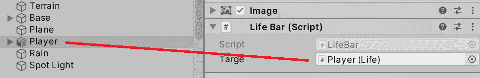

    图 17.3 - dragingplayer 引用它的生命组件

4.  Add the **using UnityEngine.UI;** line right after the **using** statements in the first few lines of the script. This will tell C# that we will be interacting with the UI scripts:

    

    图 17.4 -脚本中所有的 using 语句 我们不会把它们都用完，但先留着吧

5.  Create a **private** field (without the **public** keyword) of the **Image** type. We will save the reference to the component here in a moment:

    

    图 17.5 -对映像的私有引用

6.  Using **GetComponent** in **Awake**, access the reference to the **Image** component in our GameObject (**HealthBar**) and save it in the **image** field. As usual, the idea is to get this reference just once and save it for later use in the **Update** function. Of course, this will always work when you put this component in an object with an **Image** component. If not, the other option would be to create a public field of the **Image** type and drag the image component into it:

    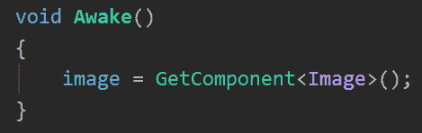

    图 17.6 -在此对象中保存对 Image 组件的引用

7.  在**LifeBar**脚本中创建**Update**event功能。 我们将使用这个来根据玩家的生命值不断更新生命条。
8.  In the **Update** event, divide the amount of life by **100** to have our current life percentage expressed in the **0** to **1** range (assuming our maximum life is **100**), and set the result in the **fillAmount** field of the **Image** component as in the following screenshot. Remember that **fillAmount** expects a value between **0** and **1**, with **0** signalling that the bar is empty and **1** that the bar is its full capacity:

    

    图 17.7 -根据 Life 组件更新 Life bar 脚本的 Image 组件的填充量

    重要提示:

    请记住，将**100**放在代码中被认为是硬编码(它也被称为一个神奇的数字)，这意味着以后对该值的更改将要求我们查看代码以获得该值，这在大型项目中是一项复杂的任务。 这就是为什么它被认为是糟糕的做法。 最好在**Life**组件中有一个**Maximum Life**字段，或者至少在该值上有一个常量。

9.  保存脚本并在编辑器中选择玩家并开始游戏。 在**Play**模式中，按*Esc*以重新访问鼠标，并在检查器窗口中改变玩家的生命值，查看生命条的更新情况。 你也可以通过让玩家受到伤害来测试这一点，比如让敌人产生子弹(后面会有更多关于敌人的内容):

图 17.8 - Full LifeBar 脚本

重要提示:

在前一章中，我们探讨了事件的概念，以检测其他对象状态的变化。 生活条是另一个使用事件的例子，因为我们可以在生活发生改变时改变图像的填充量。 我建议你尝试在生活发生变化时创建一个事件，并使用我们在前一章中看到的那个脚本来实现这个脚本。

您可能会认为这个 UI 行为可以直接在**Life**组件中编码，这是完全有可能的，但这里的想法是创建简单的脚本，而不需要多少压力来保持代码分离。 每个脚本都应该有一个修改的理由，将 UI 行为和游戏玩法行为混合在一个脚本中会让脚本承担两种责任，这就导致了更改脚本的两个可能原因。 通过这种方法，我们还可以将玩家的基本生命条设置在底部，只需将相同的脚本添加到其生命条中，但将我们在前一章中创建的**基础伤害**对象拖动到本次的目标生命条中。

重要提示:

我们刚才提到的单一对象责任原则是五种面向对象编程原则之一，称为 SOLID。 如果您不知道什么是 SOLID，我强烈建议您查阅它来改进您的编程最佳实践。

现在我们已经整理了玩家的生命条，让我们根据玩家剩余的子弹来更新**子弹**标签。 这里需要考虑的是，我们当前的玩家射击脚本有无限的子弹，所以让我们通过以下步骤来改变这一点:

1.  添加一个公共的**int**type字段到玩家射击脚本**bulletsAmount**。
2.  在检查鼠标左键压力的**if**语句中，添加一个条件来检查子弹数量是否大于**0**。
3.  Inside the **if** statement, reduce the number of bullets by **1**:

    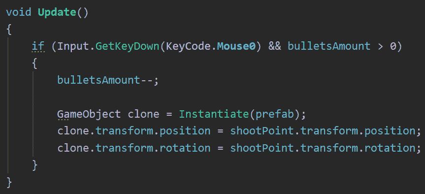

    图 17.9 -限制射击的子弹数量

    现在我们有了一个表明剩余项目符号数量的字段，我们可以通过以下操作创建一个脚本在 UI 中显示该数字:

4.  在子弹的**文本**游戏对象中添加**PlayerBulletsUI**脚本。 在我的例子中，我称之为**子弹标签**。
5.  Add the **using UnityEngine.UI** statement and add a private field of the **Text** type, saving it in the reference to our own **Text** component in **Awake**:

    

    图 17.10 -缓存对我们自己的 Text 组件的引用

6.  创建一个**PlayerShooting**类型的**公共**字段，名为**targetShooting**，并在编辑器中将**player**拖动到此属性。 一样【显示】对于生活栏组件,我们的想法是,我们的 UI 脚本将访问的脚本有剩余的子弹更新文本,弥合两个脚本(**文本**和**【病人】PlayerShooting)来保持他们的责任分离。**
7.  创建一个**更新语句里面,设置**文本字段的文本参考(我知道,混淆)的连接**“子弹:“**和**bulletsAmount**的【显示】targetShooting**参考。 这样，我们将根据当前的项目数量来替换标签的文字:**

 **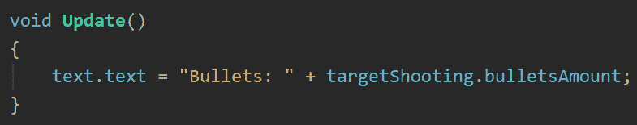

图 17.11 -更新项目符号的文本标签

重要提示:

请记住，连接字符串会分配内存，因此，我建议您只在必要时使用事件来执行此操作。

如果您查看这两个脚本，您将发现一个模式。 你可以访问**UI**和**玩法**组件，并相应地更新 UI 组件，大多数 UI 脚本将以相同方式运行。 记住这一点，我建议你创建必要的脚本，让**得分**、**敌人**和**Waves**计数器发挥作用。 记得使用 UnityEngine 添加**。 UI**使用**Text**组件。 完成这个之后，你可以比较你的解决方案与下面截图中的一个，从开始与**scorei**:

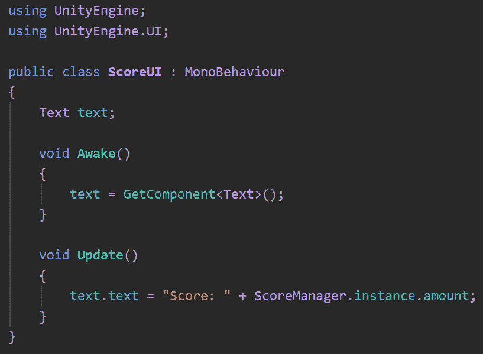

图 17.12 - ScoreUI 脚本

另外，我们还需要**WavesUI**组件:

图 17.13 - WavesUI 脚本

最后，我们需要**EnemiesUI**:

图 17.14 - EnemiesUI 脚本

如您所见，我们使用已经编码在管理器中的事件，仅在必要时才更改 UI。 现在我们已经对 UI 标签和条进行了编码，让我们对**Pause**菜单进行编码。

## 暂停菜单编程

回想一下我们在前一章中是如何创建暂停菜单的，但是它目前是禁用的，所以让我们使它工作。 首先，我们需要编码**暂停**，这可能相当复杂。 因此，我们将再次使用一个简单的方法来暂停大多数行为，那就是停止时间! 记住,我们的大多数运动脚本使用时间功能,如**三角洲时间,来计算运动应用的数量,还有一种模拟时间慢或快,这是通过设置**时间表**。**

这个领域会影响团结的时间系统的速度,我们可以将它设置为**0 模拟已经停止,将暂停动画,阻止粒子,并减少**三角洲时间****0**,使我们的运动停止。 所以，让我们这样做:**

 **1.  创建一个名为**Pause**的脚本，并将其添加到场景中的一个新对象中，也称为**Pause**。
2.  In **Update**, detect when the *Esc* key is pressed, and in that scenario, set **Time.timeScale** to **0**:

    

    图 17.15 -模拟暂停的停止时间

3.  Save and test this.

    你会注意到几乎所有的东西都会停止，但是你可以看到拍摄功能是如何工作的。 这是因为玩家射击脚本并不依赖于时间。 这里的一个解决方案可能是简单地检查**Time。 时间刻度**大于**0**可以防止这种情况:

    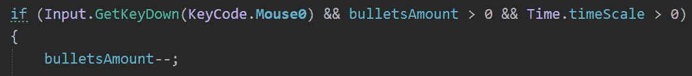

    图 17.16 -检查 PSlayer 射击脚本中的暂停

    重要提示:

    像往常一样，我们在这里采用了最简单的方法，但还有一种更好的方法。 我建议你尝试创建带有布尔值(指示游戏是否暂停)的**PauseManager**，并在过程中改变**时间尺度**。

    现在我们有了一个简单而有效的暂停游戏的方法，让我们通过以下操作使**pause**menu可见以取消暂停游戏:

4.  在**Pause**脚本中添加**GameObject**类型的**pauseMenu**字段。 这里的想法是拖动**Pause**菜单，这样我们就有了启用和禁用它的参考。
5.  在**Awake**中，添加**pauseMenu.SetActive(false); 在游戏开始时禁用**暂停**菜单。 即使我们在编辑器中禁用了**Pause**菜单，我们也添加了这个菜单，以防我们错误地重新启用它。 它必须总是禁用启动。**
6.  Using the same function but passing **true** as the first parameter, enable the **Pause** menu in the *Esc* key pressure check:

    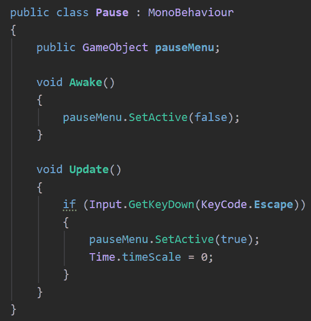

    图 17.17 -按 Esc 键时启用暂停菜单

    现在，我们需要使**Pause**菜单按钮工作。 如果你还记得，在前一章中，我们探讨了事件的概念，并使用**UnityEvents**和**Button**脚本实现它们。 我们的**Pause**菜单按钮使用相同的类来实现**OnClick**事件，这是一个通知我们某个特定按钮已被按下的事件。 让我们按下这些按钮后继续游戏:

7.  在**Pause**脚本中创建一个名为**resumeButton**的字段**Button**，并将**resumeButton**拖动到其中; 这样，我们的**Pause**脚本就有了对按钮的引用。
8.  在**Awake**中，为**resumeButton**的**onClick**事件添加一个名为**OnResumePressed**的监听函数。
9.  使**OnResumePressed**函数集**时间表****1**和禁用**【T7 暂停】菜单,正如我们在【显示】清醒**:

图 17.18 -取消游戏暂停

如果你保存并测试这个,你会注意到你不能点击**恢复**按钮因为我们禁用鼠标在游戏的开始,所以确保你重新启用它在**暂停和禁用你的简历:**

 **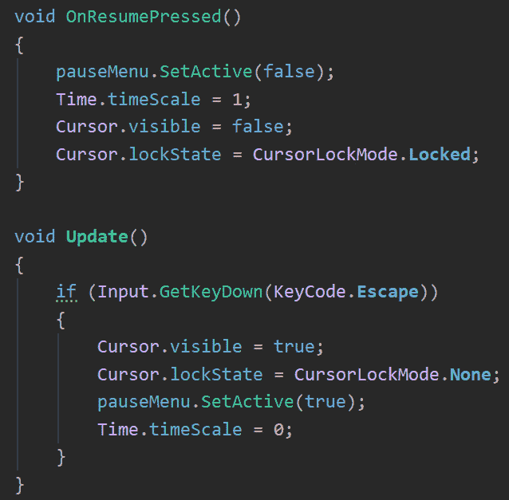

图 17.19 -在暂停时显示和隐藏光标

现在您已经知道了如何对按钮进行编码，接下来我要求您对**Exit**按钮的行为进行编码。 同样，记得使用 UnityEngine 添加**。 UI**。 此外，您还需要调用**Application.Quit();** 退出游戏，但要考虑到这在编辑器中不会做任何事; 我们不想在创建游戏时关闭编辑器。 这个函数只在你创建游戏时有效。 所以现在，只要调用它，如果你想打印一条消息，以确保按钮正常工作，下面的截图提供了一个解决方案:

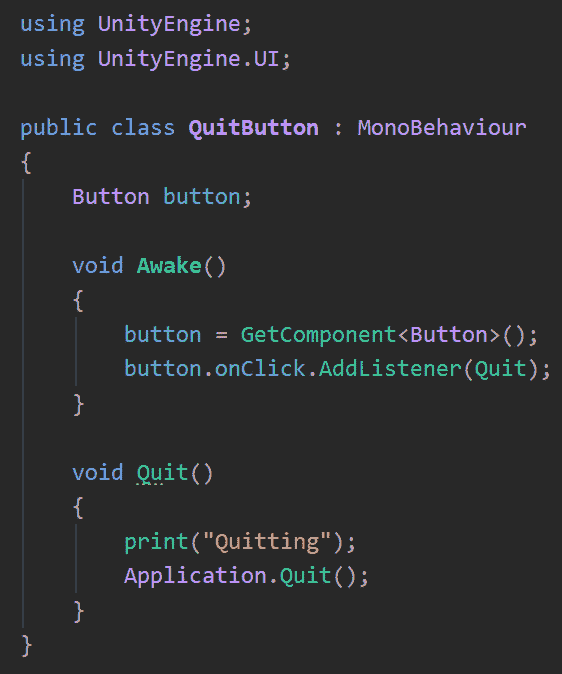

图 17.20 - Quit 按钮脚本

这个解决方案建议你直接将此脚本添加到**退出**按钮 GameObject 本身,这样脚本听**onClick 事件在其同级组件**按钮,在这种情况下,执行**退出【显示】功能。 您还可以将此行为添加到**Pause**脚本中，虽然这可以工作，但请记住，如果由于一个脚本执行两个不相关的任务，所以可以将其分为两个脚本，因此最好将其拆分，使各个行为不相关。 在这里，暂停行为与退出行为无关。******

现在我们已经使用 UI 和按钮设置了暂停系统，让我们继续寻找其他视觉和听觉方法，让玩家意识到发生了什么。

# 脚本反馈

我们只是使用UI 将数据传递给用户，以便他们知道发生了什么，但有时这还不够。 我们可以使用其他类型的反馈来强化游戏事件，如声音和爆炸，我们在之前的章节中已经整合了这些内容。

在本节中，我们将探讨以下反馈概念:

*   脚本视觉反馈
*   脚本音频反馈
*   脚本动画

我们将开始研究如何让我们的游戏玩法获得更多反馈，在适当的时候使用不同的视觉效果，如音频和粒子系统。 然后，我们将让角色的动画与这些时刻相匹配，例如，我们将创造出他们真的在走路的错觉。

## 脚本化视觉反馈

视觉反馈是指使用不同的视觉特效(游戏邦注:如粒子和视觉特效图)来强化正在发生的内容。 例如，现在我们正在射击，我们知道这正在发生，因为我们可以看到子弹。 这并不是真正意义上的射击，因为射击模拟需要我们的枪来显示枪口闪光的效果。 另一个例子是敌人的死亡——这只是毁灭! 这并没有给人应有的满足感。 我们可以添加一个小爆炸(考虑到它们是机器人)。

让我们开始让敌人在死亡时产生爆炸，方法如下:

1.  创建一个爆炸效果或从资产商店下载一个。 它不应该循环，需要在爆炸结束时自动销毁(确保**循环**未检查，主模块中的**停止动作**设置为**销毁**)。
2.  Asset Store 中的一些爆炸可能会使用非 urp 兼容的着色器。 可以修复它们通过设置**编辑**|**渲染管道**|**普遍呈现管道**|**升级选定材料**选择【显示】UniversalRP 材料同时保持材料选择。
3.  手动升级不能自动升级的材料。
4.  在**敌人**预制中添加一个名为**ExplosionOnDeath**的脚本。 这将负责产卵粒子预制时，敌人死亡。
5.  Add a field of the **GameObject** type called **particlePrefab** and drag the explosion Prefab to it.

    重要提示:

    您可能希望将爆炸产卵添加到**生命**组件中。 在这种情况下，你假设任何与生命有关的东西都会在死亡时产生一个粒子，但考虑到角色在下落动画中死亡的场景，或者一个物体只是消失而没有任何影响。 如果某个行为在大多数场景中不使用，最好将其编码在一个单独的可选脚本中，以便我们混合和匹配不同的组件，并获得我们想要的确切行为。

6.  让脚本访问**Life**组件并订阅其**onDeath**事件。
7.  In the **listener** function, spawn the particle system in the same location:

    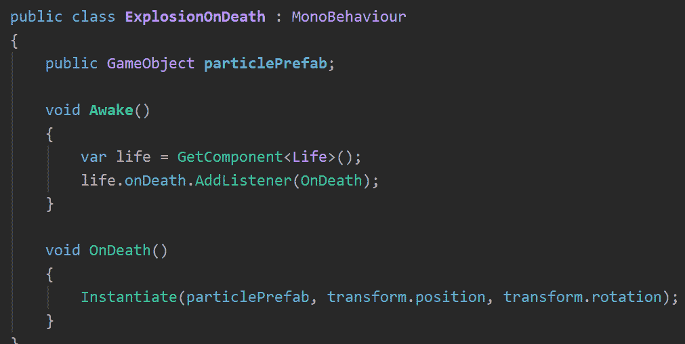

    图 17.21 -爆炸刷出脚本

    正如你所看到的，我们只是使用了我们在前几章学到的相同的概念，但以新的方式组合它们。 这就是编程的意义所在。 让我们继续讨论炮口效应，这也是一个粒子系统，但这次我们将采用另一种方法。

8.  Download a weapon model from the Asset Store and instantiate it so that it is the parent of the hand of the player. Remember that our character is rigged and has a hand bone, so you should put the weapon there:

    

    图 17.22 -养育手骨中的武器

9.  创建或获得一个枪口粒子系统。 在这种情况下，我的炮口粒子系统是作为一个短粒子系统创建的，它有一个粒子爆发，然后自动停止。 尝试使用这种行为，因为存在其他循环，处理该场景的脚本会有所不同。
10.  Create an instance of the particle system Prefab in the Editor and parent it inside the weapon, locating it in front of the weapon, aligned with the barrel of the gun. Make sure the **Play On Awake** property of the main module of the particle system is unchecked; we don't want the muzzle to fire until we press the fire key:

    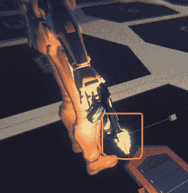

    图 17.23 -炮口在武器上

11.  在**PlayerShooting**中创建一个名为**muzzleEffect**的**ParticleSystem**类型的场，并将枪口效果拖拽到其上。 现在，我们有一个参考的**颗粒系统**组成部分的枪口来管理它。
12.  在检查是否正在射击的**if**语句中，执行**muzzleEffect.Play();** 发挥粒子系统。 它会自动停止，并在关键压力之间足够短，以完成:

图 17.24 -炮口在武器上

重要提示:

在这里，我们再次有同样的问题:所有的武器在射击时都有枪口吗? 在这种情况下，由于我们项目的范围，我会说是的，所以我将保持代码原样。 但是，如果您需要其他组件来知道这个脚本是否正在拍摄，您可以在将来创建一个**onShoot**事件。 通过这种方式，您可以扩展射击行为。 考虑在脚本中使用事件作为启用插件的一种方式。

现在我们已经有了一些特效，让我们添加音效。

## 脚本化音频反馈

视觉特效为游戏中所发生的事情添加了很好的沉浸感深度，但我们可以通过声音进一步完善这一点。 让我们开始为爆炸效果添加声音，步骤如下:

1.  下载一个爆炸音效。
2.  选择爆炸预制件，添加**音频源**。
3.  将下载的爆炸音频剪辑设置为音频源的**AudioClip**属性。
4.  确保在**音频源**下**Play On Awake**被选中，**Loop**被选中。
5.  Set the **Spatial Blend** slider to **3D** and test the sound, configuring the **3D Sound** settings as needed:

    

    图 17.25 -增加爆炸的声音

    正如您在这里看到的，我们不需要使用任何脚本。 当声音被添加到预制件时，它将在预制件被实例化的瞬间自动播放。 现在，让我们通过以下步骤整合射击声音:

6.  下载一个枪击声音通过音频源,并将它添加到武器的球员,这次取消勾选**复选框在清醒又设置空间混合****3 d【5】。******
***   的**PlayerShooting 脚本,创建一个字段的**AudioSource**类型叫做**shootSound**并拖动这个属性连接脚本的武器**AudioSource**变量的武器。***   在检查是否可以射击的**if**语句中，添加**shoosound . play ();** 线执行声音时射击，使用相同的逻辑应用于粒子系统:**

 **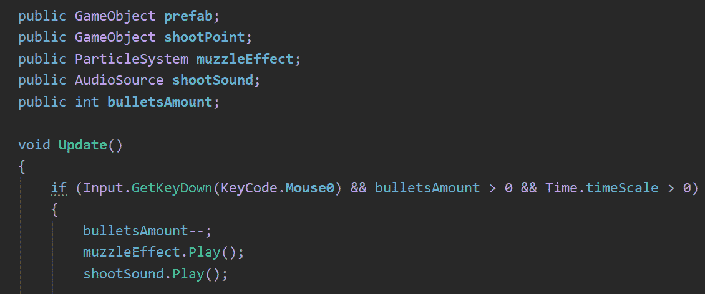

图 17.26 -射击时添加声音

另一种方法和我们处理爆炸的方法一样; 只需在子弹上添加射击的声音，但如果子弹与墙壁碰撞，很快声音就会被切断。 或者，如果将来我们想要一个自动武器声音，它就需要被执行为一个单一的循环声音，当我们按下相关键时开始，当我们释放它时停止。 通过这种方式，当我们发射过多子弹时，我们可以避免过多音效实例重叠。 在选择编写反馈脚本的方法时，要考虑这些类型的场景。

现在我们已经完成了音频反馈，让我们完成整合我们的动画资产，这是我们在[*第十二章*](12.html#_idTextAnchor161)，*用 Animator, Cinemachine, and Timeline*中准备的。

## 脚本动画

在[*第十二章*](12.html#_idTextAnchor161),*创建动画与动画师,Cinemachine,时间表*,我们创建了一个动画控制器作为一个整合一些动画,我们还增加了参数来控制动画之间的转换时应该执行。 现在，是时候编写脚本，让这些参数受到玩家实际行为的影响，并通过以下操作匹配玩家的当前状态:

1.  In the **PlayerShooting** script, add a reference to **Animator** using **GetComponent** in **Awake** and cache it in a field:

    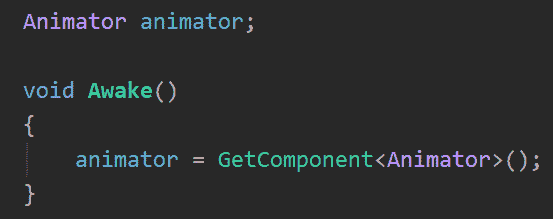

    图 17.27 -缓存 Animator 引用

2.  Call the **animator.SetBool("Shooting", true);** function in the **if** statement that checks whether we are shooting, and add the same function but pass **false** as a second argument in the **else** clause of the **if** statement. This function will modify the **"Shooting"** parameter of the animator controller:

    

    图 17.28 -根据是否射击设置射击布尔值

    如果进行测试，您可能会注意到一个错误——动画没有播放。 如果你检查脚本时,您会注意到,它将**真正的**只是一帧作为我们使用**GetKeyDown**,所以拍摄布尔将立即被设置为**假在下一帧。 我们可以在此执行的多个解决方案之一是，让我们的射击脚本重复射击动作，同时按下按键，而不是释放并再次点击以发射另一颗子弹。**

3.  检查下面的屏幕截图的解决方案，并尝试理解的逻辑:

图 17.29 -重复拍摄脚本

正如你所看到的,我们现在的脚本使用**GetKey**继续射击,同时保持拍摄按钮按下,为了防止在每一帧,我们比较当前时间和最后的拍摄时间检查最后一球以来已经过去了多少时间。 我们创建了**fireRate**场来控制射击间隔时间。

对于动画控制器的**Velocity**参数，我们可以检测**刚体**速度矢量的大小，单位为米/秒，并将其设置为当前值。 这可以与**PlayerMovement**脚本完美分离，所以如果有必要，我们可以在其他场景中重用它。 因此，我们需要如下脚本，它将**刚体**组件的速度与**动画器****velocity**参数连接起来:

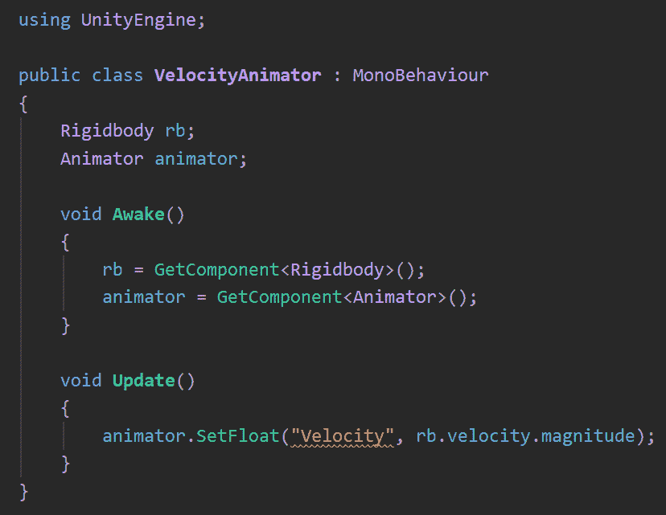

图 17.30 -重复拍摄脚本

由于**刚体**在释放按键后继续移动，你可能需要在动画控制器的转换条件中稍微增加**0.01**转换阈值。 使用**1**对我来说非常有效。 另一个选择便是增加玩家的拖曳和速度，从而让角色停止得更快。 选择最适合你的方法。

如你所见，我们可以收集关于玩家的实际移动和射击动作的数据，将其状态告知动画控制器，以便做出相应的反应。

# 总结

反馈是电子游戏中的一个重要主题。 它为玩家提供了有价值的信息，如如果有 3D 音效设置，敌人的位置，背景中枪口闪光所描绘的远距离射击，指示玩家即将死亡的生命条，根据玩家动作做出反应的动画等等。 在这一章中，我们看到了不同形式的反馈、声音、视觉特效、动画和 UI，这些我们已经在本书的第 2 部分*中创建。 在这里，我们学习了如何使用脚本将 UI 与游戏连接起来。*

 *现在，你可以为 UI、粒子系统和声音编写脚本，以响应游戏状态，包括改变分数文本或 UI 的生命条，或在角色射击时播放粒子和声音效果。 这能够提高玩家在游戏中的沉浸感。

在下一章中，我们将讨论如何为我们的敌人创造一个具有挑战性的 AI。***********