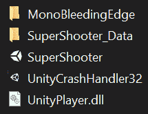
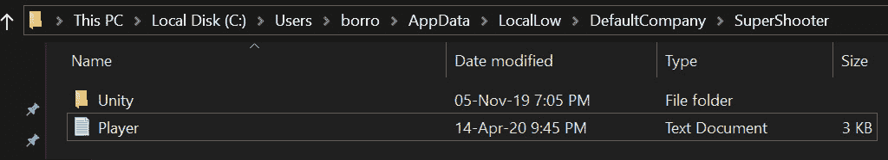
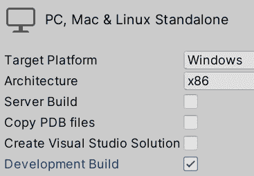
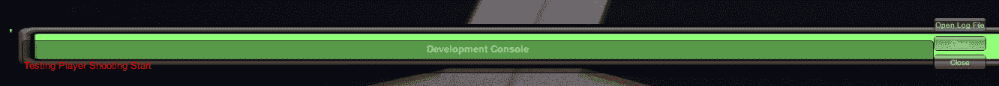
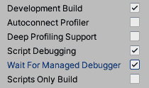
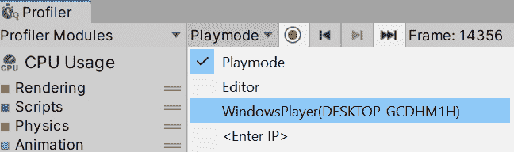
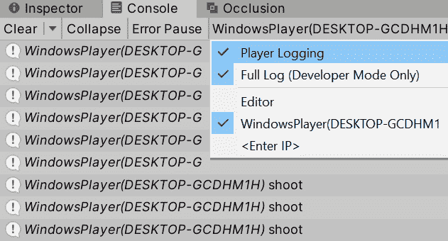
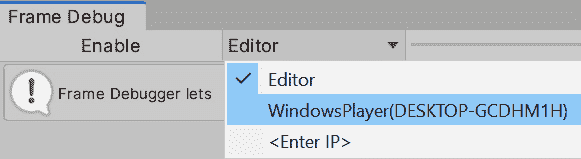
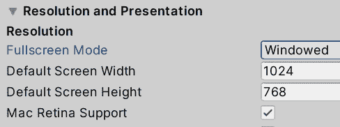

# *第 20 章*:构建项目

所以，我们的游戏已经足够成熟，可以让真人测试了。 问题在于，我们不能假装人们会安装 Unity，打开一个项目，然后点击 Play。 他们希望收到一个漂亮的可执行文件，双击并立即播放。 在这一章中，我们将讨论如何将我们的项目转换成易于共享的可执行格式。

在本章中，我们将研究以下构建概念:

*   建立一个项目
*   调试构建

## 构建项目

在软件开发(包括电子游戏)中，将项目的源文件转换为可执行的格式的结果称为 Build。 生成的可执行文件被优化以获得最大可能的性能。 由于项目性质的变化，我们无法在编辑游戏时获得性能。 在编辑游戏的同时准备最终形式的资产是非常耗时的。 此外，生成的文件的格式难以读取。 它们不会有纹理、音频和源代码文件供用户查看。 它们将被格式化为自定义的文件结构，所以在某种程度上，它可以防止用户窃取它们。

重要提示

实际上，有几种工具可以从电子游戏中提取源文件，特别是从像 Unity 这样广泛使用的引擎中。 你可以提取纹理和 3D 模型等资产，甚至有程序可以直接从 VRAM 中提取这些资产，所以我们不能保证这些资产不会在游戏之外使用。 最后，用户将这些资产的数据保存在他们的磁盘中。

当您以 PC、Mac 或 Linux 等桌面平台为目标时，构建过程非常简单，但在构建之前我们需要记住一些设置。 我们将要看到的第一个配置是场景列表。 我们已经讨论过这个问题，但现在是时候记住，将这个列表的第一个元素设置为首先加载的场景是很重要的。 记住，你可以通过去**文件|构建设置**，并将你想要的起始场景拖放到列表的顶部。 在我们的例子中，我们将游戏场景定义为第一个场景，但在真正的游戏中，最好使用 UI 和一些图像创建主菜单场景:

图 20.1 -场景列表顺序

这里可以更改的另一项设置是目标平台——将为其创建构建的目标操作系统。 通常，这是为您正在开发的同一个操作系统设置的，但如果您是在 Mac 上开发，并且您想为 Windows 构建，只需将**目标平台**设置为 Windows。 这样，结果将是**exe**而不是**app**。 你可能认为 Android 和 iOS 是其他目标平台，但制作手机游戏还需要考虑其他我们在本书中不打算讨论的因素:

图 20.2 -目标平台

在同一个窗口中,您可以点击**播放器设置**按钮在底部左边,或者只是打开**编辑**|**项目设置**窗口,单击**玩家**类别访问其余的构建设置。 Unity 将生成的可执行文件称为游戏玩家。 这里我们有一组会影响构建或玩家行为的配置，下面是一些基本的配置:

*   **产品名称**:这是窗口标题栏中的游戏名称和可执行文件。
*   **公司名称**:这是开发游戏的公司名称，Unity 使用它来创建某些文件路径，并将包含在可执行信息中。
*   **默认图标**:在这里，你可以选择一个纹理作为可执行图标。
*   **默认光标**:可以设置纹理来替换常规的系统光标。 如果您这样做，请记住将**Cursor Hotspot**属性设置为您希望光标执行单击操作的图像的像素。
*   **分辨率和演示:**关于我们游戏的分辨率将如何处理的设置。
*   **分辨率和呈现|默认为原生分辨率**:勾选此选项，当游戏在全屏模式下运行时，当前系统中使用的分辨率将是 Unity 使用的分辨率。 你可以取消勾选并设置你想要的分辨率。
*   **飞溅图像:**游戏第一次加载后显示的飞溅图像设置
*   **启动画面**:这将启用一个 Unity 启动画面，将徽标作为游戏介绍。 如果你有 Unity Pro 许可证，你可以取消这个选项来创建你的自定义启动画面，如果你想的话。
*   **Splash Image | Logos List**:在这里，你可以添加一组 Unity 在启动游戏时显示的图像。 如果你是免费使用 Unity，你将被迫在这个列表中显示 Unity 标志。
*   **|启动图像绘制模式**:你可以设置这**所有顺序**显示每一个标志,一个接一个,或统一标志下面显示您的自定义介绍与下面的统一标志永远存在你的标志:

图 20.3 -玩家设置

在按照您的意愿配置这些设置之后，下一步是执行实际的构建，这可以通过点击**File | build settings**窗口中的**build**按钮来完成。 这将要求您设置要创建构建文件的位置。 我建议您在桌面上创建一个空的文件夹，以便方便地访问结果。 耐心点——根据项目的规模，这个过程可能需要一段时间:

图 20.4 -创建游戏

在这里可能会失败的是使用非构建兼容的脚本—仅在编辑器中执行的脚本，主要是编辑器扩展。 我们没有创建任何这些，所以如果你在构建之后在控制台中有一个错误消息(类似下面的截图)，这可能是因为某些 Asset Store 包中的某些脚本。 在这种情况下，只需删除在控制台中显示 Build Error 消息之前的文件。 如果，在任何机会，有一个你的脚本，确保你没有任何的**使用 UnityEditor;** 任何你的脚本中的行。 它会尝试使用 Editor 命名空间，构建编译中不包含的命名空间，以节省磁盘空间:

图 20.5 -构建错误

这差不多就是你需要知道的一切了。 你已经生成了你的游戏! 需要考虑的是，在构建时指定的文件夹中创建的每个文件必须被共享，而不仅仅是可执行文件。 **Data**文件夹包含所有资产，在 Windows 版本中分享游戏时很重要。 对于 Linux 和 Mac 版本，只生成一个文件(**x86/x86_64**和**应用包**):

图 20.6 -一个 windows 生成的文件夹

最后一个建议——注意**Build**窗口中的**Script Build Only**复选框。 如果您只更改了代码，并希望测试该更改，请检查它并进行构建。 这将使该过程比常规构建更快。 如果您在编辑器中更改了任何其他内容，请记住取消选中该选项，因为如果选中该选项，这些更改将不会被包含在内。

现在我们已经有了构建，您可以通过双击可执行文件来测试它。 现在您已经尝试了构建，我们可以讨论如何使用在编辑器中使用的 Debug 和 Profiling 工具来测试构建。

## 调试构建

在理想的情况下，编辑器和构建程序的行为是一样的，但遗憾的是，这不是真的。 编辑器准备在快速迭代模式下工作。 代码和资产在被用于(T0)之前具有最小的处理过程，所以我们可以轻松地测试我们的游戏。 当游戏被构建时，我们便会使用一系列优化和来自编辑器项目的差异去确保我们能够获得最佳表现，但这些差异也会导致游戏某些部分的行为发生改变，从而导致玩家的分析数据与编辑器存在差异。 这就是为什么我们要探索如何在构建中调试和分析我们的游戏。

在本节中，我们将研究以下构建调试概念:

*   调试代码
*   分析性能

让我们开始讨论如何调试构建的代码。

## 调试代码

由于玩家代码的编译方式不同，我们可能会在构建中遇到编辑器中没有出现的错误，我们需要以某种方式进行调试。 我们有两种主要的调试方法——通过打印消息和通过断点。 那么，让我们从第一个开始，信息。 如果您运行您的可执行文件，您可能已经注意到没有可用的控制台。 这只是全屏的游戏视图，这是有意义的; 我们不想让恼人的测试消息分散用户的注意力。 幸运的是，消息仍在打印中，但在文件中，所以我们可以直接进入该文件并查找它们。

不同操作系统的位置不同。 在这个列表中，你可以找到可能的地点:

*   **Linux**:**~/.config/unity3d/CompanyName/ProductName/Player.log**
*   **Mac**:**~/Library/Logs/Company Name/Product Name/Player.log**
*   **Windows**:**c:\用户名\ appdata \ locallow\ CompanyName\ProductName\Player.log**

在这些路径,你必须改变**公司名称**和**ProductName****的值属性玩家**设置我们之前设置的,也被称为**公司**和【显示】产品名称。 在 Windows 中，您必须将**用户名**替换为您正在执行游戏的 Windows 帐户的名称。 考虑到文件夹可能是隐藏的，所以启用选项显示隐藏文件在您的操作系统:

图 20.7 -显示隐藏文件

在这个文件夹中，你会发现一个名为**Player**的文件; 您可以使用任何文本编辑器打开它并查看消息。 在这个例子中，我使用了 Windows，所以目录路径如下截图所示:

图 20.8 -调试目录

除了从 Asset Store 下载任何自定义包，还有一种方法可以直接在游戏中看到控制台的消息，至少是错误消息——通过创建开发构建。 这是一种特殊的构建，它允许扩展调试和分析功能，但不像最终构建那样完全优化代码，但它对一般调试就足够了。 你可以通过在**File | build Settings**窗口中选中**Development build**复选框来创建这种类型的构建:

图 20.9 - Development Build 复选框

记住，这里只显示错误消息，因此您可以使用一个小技巧，将**print**和**Debug. log**函数调用替换为**Debug。 LogError**，它也将在控制台中打印消息，但带有一个红色图标。 考虑到这不是一个好的实践，所以限制这种类型的消息用于临时调试。 对于永久日志记录，请使用日志文件或在资产存储中找到用于运行时的自定义调试控制台。

记住要想让**开发构建**发挥作用，你需要重新构建游戏; 幸运的是，第一个版本花费了最多的时间，下一个版本会更快。 这一次，您只需单击**Build 和 Run**按钮，就可以在之前构建的文件夹中进行构建:

图 20.10 -调试错误消息

在下面的截图中，你可以看到运行时显示的错误:

图 20.11 -开发构建中的错误消息

同样，你也可以使用规则断点，正如我们在[*第 13 章*](13.html# _idTextAnchor172)*C#*Unity 脚本导论中解释的那样。 将 IDE 附加到播放器，它将显示在目标列表中。 但要使其工作，您不仅必须在 Build 窗口中检查**Development Build**，而且还必须检查**Script Debugging**。 这里，勾选后会显示一个附加选项，允许您暂停整个游戏，直到附加了调试器，这个选项名为**Wait for Managed debugger**。 如果你想要测试在开始时立即发生的事情，并且不允许你有足够的时间来附加调试器，这是很有用的:

图 20.12 -启用脚本调试

我们有另一种查看消息的方式，但这需要 Profiler 工作，因此让我们以此为借口来讨论如何分析编辑器。

## 性能分析

我们将使用与前一章相同的工具，但这一次是为了分析玩家。 幸运的是，差异是最小的。 正如我们在前面所做的，你需要在**Development**模式下构建玩家，在 build 窗口中检查**Development build**复选框，然后分析器应该自动检测它。

让我们通过以下步骤开始在构建中使用 Profiler:

1.  在构建过程中玩游戏。
2.  使用*Alt*+*Tab*切换到 Unity(在 Mac 上使用*命令*+*Tab*)
3.  打开分析器。
4.  点击“T0”播放模式“T1”菜单，选择其中包含**播放器**的项目。 因为我用过 Windows，它显示**WindowsPlayer**:

图 20.13 -分析玩家

注意，当你点击一个框架时，游戏不会像在编辑器中那样停止。 如果希望将注意力集中在特定时刻的帧上，可以单击 record 按钮(红色圆圈)使 Profiler 停止捕获数据，以便分析到目前为止捕获的帧。

此外，你可以看到当 Profiler 连接到玩家时，控制台也会被连接，所以你可以直接在 Unity 中看到日志。 考虑到这个版本需要打开 Unity，所以我们不能期望正在测试我们游戏的朋友拥有它。 您可能需要点击**控制台**上出现的**播放器**按钮，并检查**播放器登录**才能工作:

图 20.14 -附加探查器后启用玩家登录

帧调试器也可以与播放器一起工作。 你需要点击框架调试器中的**编辑器**按钮，再次，你会在可能的调试目标列表中看到播放器; 选择后，按**开启**。 考虑到绘制调用的预览不会在游戏视图中看到，而是在构建本身中。 如果你在全屏模式下运行游戏，你可能需要在 Unity 和构建之间来回切换:

图 20.15 -调试游戏玩家的帧

您也可以运行游戏**窗口的模式,设置**全屏模式**属性玩家设置**窗口的**,建立一个默认分辨率小于你的桌面分辨率,都统一和玩家可见:**

 **

图 20.16 -启用 Windowed 模式

最后,**内存分析器还支持分析玩家,你可能会想,你可以选择列表中的玩家显示当你点击第一个按钮的顶部栏的窗口,然后单击**捕捉玩家**:**

 **

图 20.17 -获取玩家的内存快照

就这些了。 正如你所见，Unity profiler的设计是为了让玩家能够轻松整合。 如果您开始从它们获取数据，您将看到与编辑器分析相比的差异，特别是在**内存分析**中。

# 总结

在这一章中，我们看到了如何创建游戏的可执行版本，并正确地配置它，以便你不仅可以与你的朋友分享它，甚至可能与全世界分享! 我们还讨论了如何分析我们的构建; 记住，比起分析编辑器，这样做能够提供更准确的数据，所以我们能够更好地改善游戏的性能。

但在此之前，让我们讨论一些最后的细节。 这些都不是与 unity 相关的细节，而是与游戏相关的内容; 在将游戏展示给除你自己以外的人或任何在游戏开发过程中看到你的游戏的人之前和之后你需要考虑的事情。 我们将在下一章做这件事。****