# 第二天-c# 入门

今天，我们在七天学习系列的第二天。昨天，我们已经基本了解了.NETCore及其重要方面。今天，我们将讨论 C# 编程语言。我们将通过理解一个典型的 C# 程序从基础概念开始，然后我们将通过覆盖保留的关键字、类型和运算符开始研究其他东西；在一天结束时，我们将能够在涵盖以下主题后编写一个完整的 C# 程序:

*   介绍 C#
*   理解一个典型的 C# 程序
*   C# 保留关键字、类型和运算符的概述
*   类型转换概述
*   理解语句
*   数组和字符串操作
*   结构与阶级

# C# 入门

简单来说，C#(发音为 *See-Sharp* )是微软开发的一种编程语言。C# 通过**国际标准组织** ( **ISO** )和**欧洲计算机制造商协会** ( **ECMA** )的认证。

这是官网上的定义([https://docs . Microsoft . com/en-us/dotnet/csharp/tour-of-csharp/index](https://docs.microsoft.com/en-us/dotnet/csharp/tour-of-csharp/index)):

C# is a simple, modern, object-oriented, and type-safe programming language. C# has its roots in the C family of languages and will be immediately familiar to C, C++, Java, and JavaScript programmers.

C# 语言旨在遵守我们在第一天讨论过的**通用语言基础设施** ( **CLI** )。

C# 是最受欢迎的专业语言，原因如下:

*   它是一种面向对象的语言
*   它是面向组件的
*   这是一种结构化语言
*   使它最受欢迎的主要部分:这是.NET 框架
*   它有一个统一的类型系统，这意味着所有类型的语言 C# 都继承自一个类型对象(这也称为母类型)
*   它由一个健壮耐用的应用构建，例如*垃圾收集*(在第一天讨论)
*   它能够处理程序中未知的问题，这就是所谓的异常处理(我们将在第四天讨论异常处理)
*   反射的强大支持，支持动态编程(我们将在第四天讨论反射)

# C# 语言的历史

C# 语言是由*安德斯·海尔斯伯格*和他的团队开发的。语言名称受乐谱*锐* ( *#* )的启发，这表明书写的音符应该在音高上提高半音。

第一个发布的版本是 2002 年 1 月推出的 C# 1.0，目前的版本是 C# 7.0。

下表描述了 C# 语言的所有版本。

| **c# 版本** | **发布年份** | **描述** |
| One | 2002 年 1 月 | 使用 Visual Studio 2002–.NET 框架 1.0 |
| One point two | 2003 年 4 月 | 使用 Visual Studio 2003–.NET 框架 1.1 |
| Two | 2005 年 | 使用 Visual Studio 2005–.NET 框架 2.0 |
| Three | 2007 年 | Visual Studio 2008，Visual Studio 2010–.NET 框架 3.0 和 3.5 |
| Four | 2010 年 4 月 | visual Studio 2010–.NET 框架 4 |
| Five | 2012 年 8 月 | Visual Studio 2012，2013–.NET 框架 4.5 |
| Six | 2015 年 7 月 | visual Studio 2015–.NET 框架 4.6 |
| C# 7.0 | 2017 年 3 月 | visual Studio 2017–.NET 框架 4.6.2 |
| C# 7.1 | 2017 年 8 月 | visual Studio 2017 update 3–.NET 框架 4.7 |

在下一节中，我们将详细讨论这种语言，以及代码示例。我们将讨论 C# 语言的关键字、类型、运算符等等。

# 理解一个典型的 C# 程序

在我们开始用 C# 编写程序之前，让我们先回到第一天，在那里我们讨论了各种有助于使用 C# 语言编写程序/应用的 ide 和编辑器。重温第一天，了解各种编辑器和 IDEs，并检查为什么我们应该选择一个。我们将在本书的所有示例中使用 Visual Studio 2017 更新 3。

To know the steps to install Visual Studio 2017, refer to [https://docs.microsoft.com/en-us/visualstudio/install/install-visual-studio](https://docs.microsoft.com/en-us/visualstudio/install/install-visual-studio).

要从一个简单的 C# 程序开始(我们将创建一个控制台应用)，请执行以下步骤:

1.  启动您的 Visual Studio。
2.  转到文件|新建|项目(或*ctrl*+*Shift*+*N*)。
3.  在 Visual C# 节点下，选择.NETCore，然后选择控制台应用。
4.  给你的程序命名，说`Day02`，点击确定(见下图高亮显示的文字):


您将在类`Program.cs`中获得以下代码–这是 Visual Studio 提供的默认代码；你可以根据需要修改它:

```cs
using System; 

namespace Day02 
{ 
class Program 
    { 
     static void Main(string[] args) 
        { 
         Console.WriteLine("Hello World!"); 
        } 
    } 
} 
```

按下键盘上的 *F5* 键，您将在调试模式下运行程序。

Typically, every program has two different configurations or modes, that is, Debug and Release. In Debug mode, all compiled files and symbols that are helpful to drill down any issue encountered during the execution of application will be loaded. On the other hand, Release is kind of a clean run, where only binaries without Debug symbols load and perform the action. For more information, refer to [https://stackoverflow.com/questions/933739/what-is-the-difference-between-release-and-debug-modes-in-visual-studio](https://stackoverflow.com/questions/933739/what-is-the-difference-between-release-and-debug-modes-in-visual-studio).

当程序运行时，您可以看到以下输出:


在继续之前，让我们分析一下我们在 Visual Studio 上的控制台应用的下图:

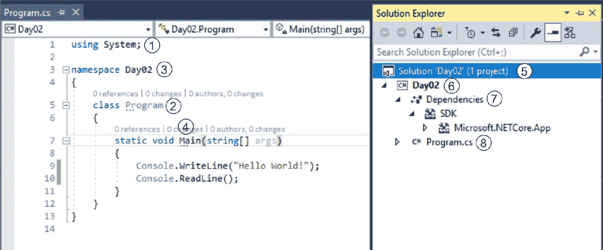

上图描述了一个典型的 C# 程序；我们正在使用 Visual Studio，但是控制台程序在不同的 ide 或编辑器中保持不变。让我们更详细地讨论这个问题。

# 1(系统)

这是我们定义程序/应用中将要使用的名称空间的地方。通常，这是使用语句来调用的，该语句包括外部、内部或任何其他名称空间的使用。

System 是一个典型的命名空间，包含许多基本类。更多信息，请参考[https://docs.microsoft.com/en-us/dotnet/api/system?view=netcore-2.0](https://docs.microsoft.com/en-us/dotnet/api/system?view=netcore-2.0) 。

# 3(第 2 天)

这是我们现有控制台应用的名称空间。

命名空间是一种将一组名称与另一组名称分开的方法，这意味着您可以创建任意多的命名空间，不同命名空间下的类会将它们视为一个单独的名称，尽管它们具有相同的名称；也就是说，如果你在`namespace Day02`中声明一个`ClassExample`类，它将不同于在`Day02New` `namespace`中声明的`ClassExample`类，并且将在没有任何冲突的情况下工作。

这是一个典型的例子，显示了两个同名的类，有两个不同的`namespaces`:

```cs
namespace Day02 
{ 
public class ClassExample 
    { 
public void Display() 
        { 
Console.WriteLine("This is a class 'ClassExample' of namespace 'Day02'. "); 
        } 
    } 
} 

namespace Day02New 
{ 

public class ClassExample 
    { 
public void Display() 
        { 
Console.WriteLine("This is a class 'ClassExample' of namespace 'Day02New'. "); 
        } 
    } 
} 
```

前面的代码可以这样调用:

```cs
private static void SameClassDifferentNamespacesExample() 
{ 
var class1 = new ClassExample(); 
var class2 = new Day02New.ClassExample(); 
    class1.Display(); 
    class2.Display(); 
} 
```

这将返回以下输出:


# 2(程序)

这是在命名空间第二天定义的类名。

C# 中的类是对象的蓝图。对象是类的动态创建的实例。在我们的控制台程序中，我们有一个类程序，它包含一个名为`Main`的方法。

# 4(主)

这是我们项目的切入点。我们的 C# 程序至少需要一个`Main`方法，应该是静态的。我们将在接下来的章节*中详细讨论*静态*c# 保留关键词*概述。`Main`也是保留关键字。

入口是一种让 CLR 知道 DLL 中函数的*什么*和*在哪里*的方式。例如，每当我们运行控制台应用时，它都会告诉 CLR`Main`是入口点，一切都围绕在这里。详见[https://docs . Microsoft . com/en-us/dotnet/framework/interop/指定入口点](https://docs.microsoft.com/en-us/dotnet/framework/interop/specifying-an-entry-point)和[https://docs . Microsoft . com/en-us/dotnet/framework/interop/指定入口点](https://docs.microsoft.com/en-us/dotnet/framework/interop/specifying-an-entry-point)。

# 5(第 02 天)

这是我们的控制台应用的解决方案的名称。

一个解决方案可以包含许多库、应用、项目等等。例如，我们的解决方案第 02 天将包含另一个名为第 03 天或第 04 天的项目。我们的控制台应用的 Visual Studio 解决方案文件名是`Day02.sln`。
参考[https://stackoverflow . com/questions/30601187/什么是 Visual Studio 中的解决方案](https://stackoverflow.com/questions/30601187/what-is-a-solution-in-visual-studio)了解 Visual Studio 解决方案。

To view the solution file, open the folder where `Day02.sln` solution file is located. You can directly open this file using any text editor/Notepad. I used Notepad++ ([https://notepad-plus-plus.org/](https://notepad-plus-plus.org/)) to view the solution file.

下面的截图描述了我们的解决方案文件:

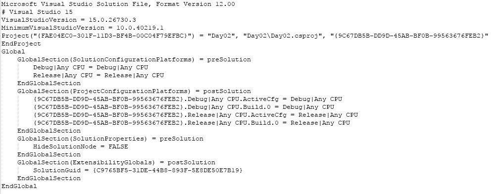

# 6(第 02 天)

这是我们控制台应用的一个项目。

项目是一个包，包含程序所需的一切。这是来自官网的项目定义:[https://docs . Microsoft . com/en-us/visualstudio/ide/visual studio 中的解决方案和项目](https://docs.microsoft.com/en-us/visualstudio/ide/solutions-and-projects-in-visual-studio)

A project is contained, in a logical sense and in the file system, within a solution, which may contain one or more projects, along with build information,Visual Studio window settings and any miscellaneous files that aren't associated with any project. In a literal sense, the solution is a text file with its own unique format; it is generally not intended to be edited by hand.

我们的项目文件名是`Day02.csproj`。

You are not required to have a project for your application. You can directly start working on your C# files.

下面的截图描述了我们的项目文件:


# 7(依赖关系)

这指的是运行特定应用所需的所有引用和二进制文件。

依赖项是我们的应用所依赖的程序集或 dll，或者是我们的应用正在使用引用的程序集的功能的地方。例如，我们的控制台应用需要.NET Core 2.0 SDK，所以它包含它作为依赖项。参考以下截图:

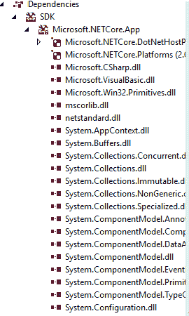

# 8(程序控制系统)

这是物理类文件名。

这是在我们的磁盘驱动器上物理可用的类文件的名称。类名和文件名可能不同，这意味着如果我的类名是`Program`，那么我的类名可能是`Program1.cs`。然而，用不同的名称调用类和文件名是不好的做法，但是你可以这样做，编译器不会抛出任何异常。更多信息请参考[需要匹配的文件名和类名](https://stackoverflow.com/questions/2224653/c-sharp-cs-file-name-and-class-name-need-to-be-matched)。

# 使用 Visual Studio 深入研究应用

在前一节中，您了解了我们的控制台应用可以包含的各种内容。在这一节中，让我们深入了解如何使用 Visual Studio 来获得更多信息。

要开始，请转到项目属性。从解决方案资源管理器(右键单击项目并单击属性)或从菜单(项目| Day02 属性)执行此操作；您将看到项目属性窗口，如下图所示:


在应用选项卡上，我们可以设置程序集名称、默认命名空间、目标框架和输出类型(输出类型为`Console Application`、`Windows Application`、`Class Library`)。

下面是构建选项卡的截图:


在构建选项卡中，我们可以设置条件编译符号、平台目标和其他可用选项。

Conditional compilations are nothing but pre-processors, which we will discuss on day six.

下面的屏幕截图描述了“包”选项卡:


“包”选项卡帮助我们直接创建 NuGet 包。在早期版本中，我们需要大量的配置设置来构建一个 NuGet 包。在当前版本中，我们只需要在 Package 选项卡上提供信息，Visual Studio 将根据我们的选项生成 NuGet 包。“调试”选项卡、“签名”和“资源”选项卡是不言自明的，它们为我们提供了一种对程序集进行签名的方法，并支持在程序中嵌入资源。

# 讨论代码

我们已经浏览了控制台应用，并讨论了典型的控制台应用包含什么，以及如何使用 Visual Studio 设置各种东西。现在让我们讨论我们的代码，它是在前面的章节*中编写的，理解一个典型的 C# 程序*。

`Console`是一个`System`命名空间的静态类，不能被继承。

在上述代码中，我们指示程序在`WriteLine()`方法的帮助下向控制台写一些东西作为输出。

`Console`类的官方定义如下([https://docs.microsoft.com/en-us/dotnet/api/system.console?view=netcore-2.0](https://docs.microsoft.com/en-us/dotnet/api/system.console?view=netcore-2.0) ):

Represents the standard input, output, and error streams for console applications. This class cannot be inherited.

`Console`不过是操作系统的终端窗口(也称为**控制台用户界面** ( **CUI** ))与用户进行交互。Windows 操作系统有控制台，即接受 MS-DOS 命令的命令提示符。这样，`Console`类就为实现这一点提供了基础支持。

以下是我们可以使用控制台进行的一些重要操作。

# 颜色

控制台背景和/或前景色可以使用接受`ConsoleColor`枚举值的 setter 和 getter 属性进行更改。要将其设置为默认颜色，有一种`Reset`方法。让我们用下面的代码演示所有的颜色组合:

```cs
private static (int, int) DisplayColorMenu(ConsoleColor[] colors) 
{ 
var count = 0; 

foreach (var color in colors) 
    { 
        WriteLine($"{count}{color}"); 
        count += 1; 
    } 
WriteLine($"{count + 1} Reset"); 
WriteLine($"{count + 2} Exit"); 

Write("Choose Foreground color:"); 
var foreground = Convert.ToInt32(ReadLine()); 
Write("Choose Background color:"); 
var background = Convert.ToInt32(ReadLine()); 

return new ValueTuple<int, int>(background, foreground); 
} 
```

前面的代码是 GitHub 存储库中完整源代码的一个片段。完整的代码将提供以下输出:


# 哔哔声

`Beep`是通过控制台扬声器产生系统声音的方法。下面是最简单的例子:

```cs
private static void ConsoleBeepExample() 
{ 
for (int i = 0; i &lt; 9; i++) 
Beep(); 
} 
```

还有一些方法在使用控制台应用时很有帮助。关于这些方法的更多细节，请参考[https://docs.microsoft.com/en-us/dotnet/api/system.console?view=netcore-2.0](https://docs.microsoft.com/en-us/dotnet/api/system.console?view=netcore-2.0) 。

到目前为止，我们已经借助一个使用 Visual Studio 2017 的代码示例讨论了一个典型的 C# 程序；我们浏览了控制台程序的各个部分并进行讨论。您可以再次重温这一部分，或者继续进一步阅读。

# C# 保留关键字、类型和运算符的概述

保留关键字只不过是预定义的词，对编译器有特殊的意义。您不能将这些保留的关键字用作普通文本或标识符，除非您明确告诉编译器这个词不是为编译器保留的。

In C#, you can use the reserved keyword as a normal word by prefixing the `@` symbol.

C# 关键字分为以下几类:

*   **类型**:在 C# 中，打字系统分为值类型、引用类型、指针类型。
*   **修饰符**:顾名思义，修饰符用于修改特定类型的类型和成员的声明。
*   **语句关键词**:这些是按顺序执行的编程指令。
*   **方法参数**:可以声明为值类型或引用类型，可以使用 **out** 或 **ref** 关键字传递值。
*   **命名空间关键词**:这些是只属于命名空间的关键词。
*   **操作符关键词**:这些操作符一般用于执行杂七杂八的操作，比如类型检查、获取对象大小等等。
*   **转换关键词**:这是`explicit`、`implicit`、`operator`关键词，后面会讲到。
*   **访问关键字**:这些是常用的关键字，可以帮助访问属于父类或者属于自己的类的东西。这些关键词是`this`和`base`。
*   **文字关键词**:关键词有一些赋值的值，分别是`null`、`true`、`false`、`default`。
*   **上下文关键词**:这些在代码中用作特定含义。这些是特殊关键字，不是 C# 中的保留关键字。
*   **查询关键词**:这些是可以在查询表达式中使用的上下文关键词，例如`from`关键词可以用于 LINQ。

在接下来的章节中，我们将使用代码示例更详细地讨论 C# 关键字。

# 标识符

这些关键字用于 C# 程序的任何部分，并且是保留的。标识符是特殊的关键字，由编译器区别对待。

这些是 C# 保留的标识符:

*   **抽象**:这通知你，伴随抽象修饰语而来的事物还没有完成或者缺少定义。我们将在第四天详细讨论这个问题。
*   **为**:可以在施法操作中使用。换句话说，我们可以说这检查了两种类型之间的兼容性。

The `as` keyword falls in the operator category of keywords; refer to [https://docs.microsoft.com/en-us/dotnet/csharp/language-reference/keywords/operator-keywords](https://docs.microsoft.com/en-us/dotnet/csharp/language-reference/keywords/operator-keywords).

以下是演示`as`标识符的小代码片段:

```cs
public class Stackholder 
{ 
public void GetAuthorName(Person person) 
    { 
var authorName = person as Author; 
Console.WriteLine(authorName != null ? $"Author is {authorName.Name}" :"No author."); 
    } 

} 

//Rest code is omitted 
```

前面的代码片段有一个将作者姓名写入控制台窗口的方法。在`as`操作符的帮助下，由以下代码调用:

```cs
private static void ExampleIsAsOperator() 
{ 
WriteLine("isas Operator"); 
var author = new Author{Name = "Gaurav Aroraa"}; 

WriteLine("Author name using as:\n"); 
stackholder.GetAuthorName(author); 

} 
```

这将产生以下结果:


*   **base** :这是 access 关键字，用于从派生类中访问父类的成员。下面是显示`base`关键字用法的代码片段。更多信息请参考[https://docs . Microsoft . com/en-us/dotnet/csharp/language-reference/keywords/base](https://docs.microsoft.com/en-us/dotnet/csharp/language-reference/keywords/base)

```cs
public class TeamMember :Person 
{ 
public override string Name { get; set; } 
public void GetMemberName() 
    { 
     Console.WriteLine($"Member name:{Name}"); 
    } 
} 

public class ContentMember :TeamMember 
{ 
public ContentMember(string name) 
    { 
     base.Name = name; 
    } 
public void GetContentMemberName() 
    { 
     base.GetMemberName(); 
    } 
} 
```

这是一个用来展示`base`力量的非常简单的例子。这里，我们只是使用基类成员和方法来获得预期的输出:

*   **bool** :这是`structureSystem.Boolean`的别名，帮助声明变量。这有两个值:真或假。我们将在下一节*数据类型*中详细讨论这一点。
*   **破**:关键词不言自明；它破坏了特定代码执行中的某些东西，可能是流语句(`for`循环)或代码块的终止(`switch`)。我们将在下一节循环和语句中详细讨论这一点。
*   **字节**:这有助于声明无符号整数的变量。这是`System.Byte`的别名。我们将在下一节详细讨论这一点。
*   **案例**:这与`Switch`语句一起使用，然后它倾向于基于某种条件的代码块执行。我们将在第三天讨论`switch`案例。
*   **catch** :这个关键字是异常处理块的 catch 块，也就是`try`..`catch`..`finally`。我们将在第六天详细讨论异常处理。
*   **char** :当我们声明一个变量来存储属于结构`System.Char`的字符时，这个关键字很有用。我们将在数据类型部分详细讨论这一点。
*   **勾选**:有时候，你的程序可能会面临溢出值。溢出异常意味着您分配的值大于受理人数据类型的最大值。编译器引发溢出异常，程序终止。关键字 checks 强制编译器确保当编译器错过溢出时，该场景不会发生溢出。为了更好地理解这一点，请看下面的代码片段:

```cs
int sumWillthrowError = 2147483647 + 19; //compile time error
```

这将生成编译时错误。一旦编写了前面的语句，就会出现以下错误:


如下图所示，下面的代码片段是修改后的代码。通过这种修改，新代码将不会生成编译时错误:

```cs
Private static void CheckOverFlowExample()
{
var maxValue = int.MaxValue;
var addSugar = 19;
var sumWillNotThrowError = maxValue + addSugar;
WriteLine($"sum value:{sumWillNotThrowError} is not the correct value because it is larger than {maxValue}.");
} 
```

前面的代码永远不会抛出溢出异常，但它不会给出正确的总和；它给出-2147483647 作为`2147483647` + 19 的结果，因为实际和将超过一个整数的最大正值，即`2147483647`。它将产生以下输出:

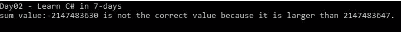

在现实世界的程序中，我们不能冒错误计算的风险。我们应该使用 checked 关键字来克服这种情况。让我们使用检查过的关键字重写前面的代码:

```cs
private static void CheckOverFlowExample() 
{ 
const int maxValue = int.MaxValue; 
const int addSugar = 19; 
var sumWillNotThrowError = checked(maxValue+addSugar); //compile time error 
WriteLine( 
$"sum value:{sumWillNotThrowError} is not the correct value because it is larger than {maxValue}."); 
} 
```

只要使用 checked 关键字编写代码，就会看到以下编译时错误:

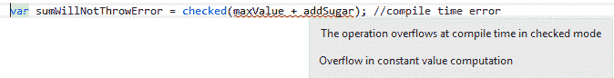

现在我们来讨论更多 C# 的关键词:

*   **类**:这个关键字帮助我们声明类。C# 类将包含成员、方法、变量、字段等(我们将在第四天详细讨论这些)。类不同于结构；我们将在*类与结构*部分详细讨论这一点。
*   **const** :这个关键字帮助我们声明常量字段或者常量局部变量。我们将在第三天详细讨论这个问题。
*   **继续**:这个关键词是`break`的对手。它将控制传递给流程语句中的下一个迭代，即`while`、`do`、`for`和`foreach`。我们将在接下来的章节中详细讨论这一点。
*   **小数**:这有助于我们声明一个 128 位的数据类型。我们将在*数据类型*部分对此进行详细讨论。
*   **默认**:这是`switch`语句中告诉我们默认条件的关键词。我们也可以使用默认值作为文字来获取默认值；我们将在第三天讨论这个问题。
*   **委托**:这有助于声明类似于方法签名的委托类型。我们将在第六天详细讨论这个问题。
*   **做**:这样反复执行一条语句，直到满足 false 的表达式条件。我们将在下一节讨论这个问题。
*   **double** :这有助于声明简单的 64 位浮点值。我们将在下一节详细讨论这一点。
*   **其他**:这个跟`if`语句一起出现，执行不属于`if`条件的`code`语句。我们将在下一节详细讨论这一点。
*   **枚举**:这有助于创建枚举。我们将在第四天讨论这个问题。
*   **事件**:这有助于在发布者类中声明一个事件。我们将在第六天详细讨论这个问题。
*   **显式**:这是转换关键词之一。此关键字声明用户定义的类型转换运算符。我们将在下一节详细讨论这一点。
*   **假**:布尔值表示`false`条件、`result`或`Operator`。我们将在接下来的章节中详细讨论这一点。
*   **最后**:这是异常处理块的一部分。最后，总是执行一个块。我们将在第四天详细讨论这个问题。
*   **固定**:用于不安全代码，有助于防止 GC 分配或重定位。我们将在第六天详细讨论这个问题。
*   **float** :这是一个存储 32 位浮点值的简单数据类型。我们将在下一节详细讨论这一点。
*   **代表**:`for`关键字是流程语句的一部分。使用`for`循环，您可以重复运行一个语句，直到达到特定的表达式。我们将在下一节详细讨论这一点。
*   **foreach** :这也是一个 flow 语句，但是它只适用于集合或者数组的元素。可以使用`goto`、`return`、`break`和`throw`关键词退出。我们将在下一节详细讨论这一点。
*   **转到**:这将借助标签将控件重定向到另一个部分。在 C# 中，goto 通常与`switch..case`语句一起使用。我们将在接下来的章节中详细讨论这一点。
*   **if** :这是条件语句关键字。它通常带有`if...else`语句。我们将在接下来的章节中详细讨论这一点。
*   **隐式**:类似于显式关键字，这有助于声明隐式的用户定义转换。我们将在接下来的章节中详细讨论这一点。
*   中的**:一个关键字有助于检测集合，从这里我们需要迭代`foreach`循环中的成员。我们将在接下来的章节中详细讨论这一点。**
*   **int** :这是结构`System.Int32`的别名，也是存储带符号 32 位整数值的数据类型。我们将在接下来的章节中详细讨论这一点。
*   **接口**:这个关键字有助于声明一个只能包含方法、属性、事件和索引器的接口(我们将在第四天讨论这个)。
*   **内部**:这是一个访问修饰符。我们将在第四天详细讨论这个问题。
*   **是**:类似于`as`运算符，`is`也是关键字运算符。

*   这是一个显示`is`运算符的代码示例:

```cs
public void GetStackholdersname(Person person) 
{ 
if (person is Author) 
    { 
     Console.WriteLine($"Author name:{((Author)person).Name}"); 
    } 
elseif (person is Reviewer) 
    { 
     Console.WriteLine($"Reviewer name:{((Reviewer)person).Name}"); 
    } 
elseif(person is TeamMember) 
    { 
     Console.WriteLine($"Member name:{((TeamMember)person).Name}"); 
    } 
else 
    { 
     Console.Write("Not a valid name."); 
    } 

} 
```

`is`和`as`操作符的完整解释，请参考[https://goo.gl/4n73JC](https://goo.gl/4n73JC)。

*   **锁定**:这代表代码块的一个关键部分。使用`lock`关键字，我们会得到一个对象的互斥锁，它会在语句执行后被释放。这通常伴随着线程的使用。线程超出了本书的范围。详见[https://docs . Microsoft . com/en-us/dotnet/csharp/language-reference/keywords/lock-statement](https://docs.microsoft.com/en-us/dotnet/csharp/language-reference/keywords/lock-statement)和[https://docs . Microsoft . com/en-us/dotnet/csharp/programming-guide/concepts/threading/index](https://docs.microsoft.com/en-us/dotnet/csharp/programming-guide/concepts/threading/index)。
*   **long** :这有助于声明变量来存储带符号的 64 位整数值，它引用的是结构`System.Int64`。我们将在接下来的章节中详细讨论这一点。
*   **命名空间**:这有助于定义声明一组相关对象的命名空间。我们将在第四天详细讨论这个问题。
*   **新增**:`new`关键字可以是运算符、修饰符或约束。我们将在第四天详细讨论这个问题。
*   **空**:表示空引用。它不引用任何对象。引用类型的默认值为空。这在处理可空类型时很有帮助。
*   **对象**:这是`System.Object`的别名，中的万能类型.NET 世界。它接受任何数据类型，而不是 null。
*   **操作员**:这有助于过载内置操作员。我们将在接下来的章节中详细讨论这一点..
*   **out** :这是一个上下文关键词，第四天会详细讨论。
*   **覆盖**:这个关键字有助于覆盖或扩展抽象或虚拟成员、方法、属性、索引器或事件的实现。我们将在第四天详细讨论这个问题。
*   **参数**:这有助于用可变数量的参数定义方法参数。我们将在第四天详细讨论这个问题。
*   **private** :这是一个访问修饰符，将在第四天讨论。
*   **受保护**:这是一个访问修饰符，将在第四天讨论。
*   **public** :这是一个访问修饰符，通过应用设置可用性，将在第四天讨论。
*   **只读**:这有助于我们将字段声明声明为只读。我们将在第四天详细讨论这个问题。
*   **参考**:这有助于通过参考传递值。我们将在第四天详细讨论这个问题。
*   **返回**:这有助于终止方法的执行，并返回调用方法的结果。我们将在第四天详细讨论这个问题。
*   **字节**:表示`System.SByte`，存储带符号的 8 位整数值。我们将在接下来的章节中详细讨论这一点。
*   **密封**:这是一个防止进一步使用/扩展的修改器。我们将在第四天详细讨论这个问题。
*   **简称**:表示`System.Int16`，存储带符号的 16 位整数值。我们将在接下来的章节中详细讨论这一点。
*   **sizeof** :这有助于获取内置类型和/或非托管类型的字节大小。对于非托管类型和除内置数据类型之外的所有其他类型，unsafe 关键字是必需的。
*   以下代码使用内置类型解释`sizeof`:

```cs
private static void SizeofExample() 
{ 
WriteLine("Various inbuilt types have size as mentioned below:\n"); 
WriteLine($"The size of data type int is: {sizeof(int)}"); 
WriteLine($"The size of data type long is: {sizeof(long)}"); 
WriteLine($"The size of data type double is: {sizeof(double)}"); 
WriteLine($"The size of data type bool is: {sizeof(bool)}"); 
WriteLine($"The size of data type short is: {sizeof(short)}"); 
WriteLine($"The size of data type byte is: {sizeof(byte)}"); 
} 
```

上述代码产生以下输出:


让我们讨论更多的 C# 关键词；这些关键词非常重要，在编写真实世界的程序时起着至关重要的作用:

*   **静态**:这有助于我们声明静态成员，第四天会详细讨论。
*   **字符串**:这有助于存储 unicode 字符。它是一个引用类型。我们将在下一节 **字符串中更详细地讨论这一点。**
*   **结构**:这有助于我们声明一个`struct`类型。结构类型是值类型。我们将在下一节*课与课的对比中更详细地讨论这一点。结构*。
*   **切换**:这有助于声明`switch`语句。Switch 是一个选择声明，我们将在第三天讨论它。
*   **这个**:这个`this`关键字帮助我们访问一个类的当前实例的成员。这也是一个修饰语，我们将在第四天讨论。注意`this`关键字对于`extension`方法有特殊的含义。扩展方法超出了本书的范围；详见[https://docs . Microsoft . com/en-us/dotnet/cs harp/programming-guide/class-and-struts/extension-methods](https://docs.microsoft.com/en-us/dotnet/csharp/programming-guide/classes-and-structs/extension-methods)。
*   **抛出**:这有助于抛出系统或自定义异常。我们将在第六天详细讨论这个问题。
*   **真**:和假类似，我们之前讨论过这个。它表示一个布尔值，可以是文字或运算符。我们将在下一节中更详细地讨论这一点。
*   **试试**:这代表了一个`try`块的异常处理。Try block 是帮助处理任何不可避免的错误或程序实例的其他三个块之一。所有这三个块统称为异常处理块。试块总是第一位的。此块包含可能引发异常的代码。我们将在第六天更详细地讨论这个问题。
*   **类型**:这有助于获得所需类型的类型对象。此外，在运行时，您可以借助`GetType()`方法获得对象的类型。

    下面的代码片段显示了`typeof()`方法的作用:

```cs
private static void TypeofExample() 
{ 
var thisIsADouble = 30.3D; 
WriteLine("using typeof()"); 
WriteLine($"System.Type Object of {nameof(Program)} is {typeof(Program)}\n"); 
var objProgram = newProgram(); 
WriteLine("using GetType()"); 
WriteLine($"Sytem.Type Object of {nameof(objProgram)} is {objProgram.GetType()}"); 
WriteLine($"Sytem.Type Object of {nameof(thisIsADouble)} is {thisIsADouble.GetType()}"); 
} 
```

前面的代码将生成以下结果:

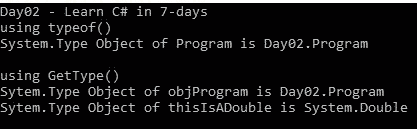

这些是无符号数据类型，这些数据类型存储不带符号的值( *+* / *-* ):

*   **uint** :这有助于声明一个无符号 32 位整数的变量。我们将在下一节详细讨论这一点。
*   **ulong** :这有助于声明一个无符号 65 位整数的变量。我们将在下一节详细讨论这一点。
*   **未勾选**:这个关键字的作用和勾选的正好相反。使用 checked 关键字引发编译时错误的代码块不会使用 checked 关键字生成任何编译时异常。
    让我们重写使用 checked 关键字编写的代码，看看 checked 关键字如何与 checked 关键字完全相反:

```cs
private static void CheckOverFlowExample() 
{ 
const int maxValue = int.MaxValue; 
const int addSugar = 19; 
//int sumWillthrowError = 2147483647 + 19; //compile time error 
var sumWillNotThrowError = unchecked(maxValue+addSugar); 
//var sumWillNotThrowError = checked(maxValue + addSugar); //compile time error 
WriteLine( 
$"sum value:{sumWillNotThrowError} is not the correct value because it is larger than {maxValue}."); 
} 
```

前面的代码运行顺利，但给出的结果是错误的，即 *-2147483647* 。

你可以参考[https://docs . Microsoft . com/en-us/dotnet/cs harp/language-reference/keywords/checked 找到更多关于已检查和未检查关键字的详细信息。](https://docs.microsoft.com/en-us/dotnet/csharp/language-reference/keywords/checked)

*   **不安全**:这有助于执行通常使用指针的不安全代码块。我们将在第六天详细讨论这个问题。
*   **ushort** :这有助于声明一个无符号 16 位整数的变量。我们将在下一节*数据类型*中对此进行更详细的讨论。
*   **使用**:`using`关键字的作用类似于指令或声明。让我们考虑下面的代码示例:

```cs
using System;
```

前面的指令提供了属于`System`命名空间的所有内容:

```cs
using static System.Console;
```

前面的指令帮助我们调用静态成员。在程序中包含前面的指令后，我们可以直接调用静态成员、方法等，如下面的代码所示:

```cs
Console.WriteLine("This WriteLien is without using static directive");
WriteLine("This WriteLien is called after using static directive");
```

在前面的代码片段中，在第一条语句中，我们调用了`Console.WriteLine`，但是在第二条语句中，不需要写类名，所以我们可以直接调用`WriteLine`方法。

另一方面，`using`语句帮助我们完美地使用`IDisposable`类。下面的代码片段告诉我们，当我们使用一次性类(这些类使用`IDisposable`接口)时，using 语句是多么有用:

```cs
public class DisposableClass : IDisposable 
{ 
public string GetMessage() 
    { 
     return"This is from a Disposable class."; 
    } 
protected virtual void Dispose(bool disposing) 
    { 
     if (disposing) 
        { 
         //disposing code here 
        } 
    } 

public void Dispose() 
    { 
       Dispose(true); 
       GC.SuppressFinalize(this); 
    } 
} 
private static void UsingExample() 
{ 
using (var disposableClass = new DisposableClass()) 
    { 
     WriteLine($"{disposableClass.GetMessage()}"); 
    } 
} 
```

上述代码产生以下输出:

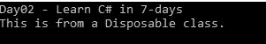

C# 关键字 virtual 和 void 有一个特殊的含义:一个允许另一个重写它，而另一个是当方法什么也不返回时用作返回类型的。让我们详细讨论这两个问题:

*   **virtual** :如果使用了 virtual 关键字，意味着它允许在派生类中重写方法、属性、索引器或事件。我们将在第四天更详细地讨论这个问题。
*   **虚空**:这是`System.Void`类型的别名。当 void 使用方法时，意味着该方法没有任何返回类型。例如，看看下面的代码片段:

```cs
public void GetAuthorName(Person person) 
{ 
var authorName = person as Author; 
Console.WriteLine(authorName != null ? $"Author is {authorName.Name}" :"No author."); 
} 
```

在前面的代码片段中，`getAuthorName()`方法属于`void`类型；因此，它不返回任何东西。

*   **while** : While 是一个流语句，执行特定的代码块，直到指定的表达式计算为 false。我们将在下一节*流程声明*中对此进行更详细的讨论。

# 上下文的

这些不是保留的关键字，但它们对程序的有限上下文有特殊的意义，也可以用作该上下文之外的标识符。

这些是 C# 的上下文关键词:

*   **添加**:用于定义自定义访问器，当有人订阅事件时调用。`add`访问器后面总是跟有`remove`访问器，这意味着当我们提供 add 访问器时，应该在上面应用 remove 访问器。更多信息请参考[https://docs . Microsoft . com/en-us/dotnet/csharp/编程指南/事件/如何实现接口事件](https://docs.microsoft.com/en-us/dotnet/csharp/programming-guide/events/how-to-implement-interface-events)。
*   **上升/下降**:这个上下文关键词与`LINQ`语句中的`orderby`子句一起使用。我们将在第六天更详细地讨论这个问题。
*   **异步**:用于异步方法、lambda 表达式或匿名方法。为了从异步方法中获得结果，使用了`await`关键字。我们将在第六天更详细地讨论这个问题。
*   **动态**:这有助于我们绕过编译时的类型检查。这将在运行时解析类型。

Compile time type is what you used to define a variable. Runtime type refers to the actual type to which a variable belongs.
Let's look at the following code in order to understand these terms better:

```cs
internal class Parent
{
//stuff goes here
}
internal class Child : Parent
{
//stuff goes here
}

```

我们可以像这样创建子类的对象:

```cs
Parent myObject = new Child();
```

这里，`myObject`的编译时类型是`Parent`，因为编译器知道变量是一种类型`Parent`，而不关心或不知道我们正在用类型`Child`实例化这个对象。因此这是一个编译时类型。运行时类型是我们示例中的`Child`实际类型。因此，我们的变量`myObject`的运行时类型是`Child`。

看看下面的代码片段:

```cs
private static void DynamicTypeExample() 
{ 
dynamic dynamicInt = 10; 
dynamic dynamicString = "This is a string"; 
object obj = 10; 
WriteLine($"Run-time type of {nameof(dynamicInt)} is {dynamicInt.GetType()}"); 
WriteLine($"Run-time type of {nameof(dynamicString)} is {dynamicString.GetType()}"); 
WriteLine($"Run-time type of {nameof(obj)} is {obj.GetType()}"); 

} 
```

上述代码产生以下输出:


更多信息请参考:[https://docs . Microsoft . com/en-us/dotnet/cs harp/language-reference/keywords/dynamic](https://docs.microsoft.com/en-us/dotnet/csharp/language-reference/keywords/dynamic)。

这些是在查询表达式中使用的上下文关键字；让我们详细讨论这些关键词:

*   **从**开始:这使用了 in 查询表达式，将在第六天讨论。
*   **获取**:这定义了访问器，并与属性一起用于检索值。我们将在第六天更详细地讨论这个问题。
*   **组**:与查询表达式一起使用，返回一系列`IGroupong<Tkey,TElement>`对象。我们将在第六天更详细地讨论这个问题。
*   **到**:这个标识符有助于在处理查询表达式时存储临时数据。我们将在第六天更详细地讨论这个问题。

有关上下文关键词的更多信息，请参考[https://docs . Microsoft . com/en-us/dotnet/cs harp/language-reference/keywords](https://docs.microsoft.com/en-us/dotnet/csharp/language-reference/keywords)。

# 类型

在 C# 中，7.0 类型也称为数据类型和变量。这些分为以下几大类。

# 值类型

这些都来源于`System.ValueType`类。值类型的变量直接包含它们的数据，或者，简单地说，值类型变量可以直接赋值。值类型可以分为更多的子类别:数据类型、自定义类型(`Enum`类型和`Struct`类型)。在本节中，我们将详细讨论数据类型。`Enum`将在第四天讨论，struct 将在接下来的章节中讨论。

# 数据类型

这些类型也以兼容值类型、简单值类型和基本值类型而闻名。我称这些数据类型是因为它们定义价值本质的能力。下表包含所有值类型:

| **自然** | **类型** | **CLR 型** | **范围** | **默认值** | **尺寸** |
| 带符号整数 | sbyte(字节) | `System.SByte` | -128 到 127 | Zero | 8 位 |
|  | 短的 | `System.Short` | -32，768 至 32，767 | Zero | 16 位 |
|  | （同 Internationalorganizations）国际组织 | `System.Int32` | -2，147，483，648 至 2，147，483，647 | Zero | 32 位 |
|  | 长的 | `System.Int64` | -9，223，372，036，854，775，808 至 9，223，372，036，854，775，807 | 0L | 64 位 |
| 无符号整数 | 字节 | `System.Byte` | 0 到 255 | Zero | 8 位 |
|  | 乌肖特 | `System.UInt16` | 0 至 65，535 | Zero | 16 位 |
|  | 无符号整型 | `System.UInt32` | 0 至 4，294，967，295 | Zero | 32 位 |
|  | 乌龙！乌龙 | `System.UInt64` | 0 至 18，446，744，073，709，551，615 | Zero | 64 位 |
| Unicode 字符 | 茶 | `System.Char` | U +0000 至 U +ffff | '\0' | 16 位 |
| 浮点 | 漂浮物 | `System.Float` | -3.4 x 10 <sup class="calibre37">38</sup> 至+ 3.4 x 10 <sup class="calibre37">38</sup> | 0.0F | 32 位 |
|  | 两倍 | `System.Double` | (+/-)5.0 x 10 <sup class="calibre37">-324</sup> 至(+/-)1.7 x 10 <sup class="calibre37">308</sup> | 0.0D | 64 位 |
| 高精度十进制 | 小数 | `System.Decimal` | (-7.9 x 1028 至 7.9 x 1028) / 100 至 28 | 0.0M | 128 位 |
| 布尔代数学体系的 | 弯曲件 | `System.Boolean` | 真或假 | 错误的 | 布尔值 |

借助下面的代码片段，我们可以证明上表中提到的值:

```cs
//Code is omitted 
public static void Display() 
{ 
WriteLine("Table :: Data Types"); 
var dataTypes = DataTypes(); 
WriteLine(RepeatIt('\u2500', 100)); 
WriteLine("{0,-10} {1,-20} {2,-50} {3,-5}", "Type", "CLR Type", "Range", "Default Value"); 
WriteLine(RepeatIt('\u2500', 100)); 
foreach (var dataType in dataTypes) 
WriteLine("{0,-10} {1,-20} {2,-50} {3,-5}", dataType.Type, dataType.CLRType, dataType.Range, 
dataType.DefaultValue); 
WriteLine(RepeatIt('\u2500', 100)); 
} 
//Code is omitted 
```

在前面的代码中，我们显示了数据类型的最大值和最小值，这将产生以下输出:


# 参考类型

实际数据不存储在变量中，但它包含对变量的引用。简单来说，我们可以说引用类型指的是一个内存位置。此外，多个变量可以引用一个内存位置，如果这些变量中的任何一个将数据更改到该位置，所有变量都将获得新值。以下是内置的引用类型:

*   **类类型**:包含成员、方法、属性等的数据结构。这也称为对象类型，因为它继承了通用的`classSystem.Object`。C# 7.0 中，类类型支持单继承；我们将在第七天更详细地讨论这个问题。

The object type can be assigned a value of any other type; an object is nothing but an alias of `System.Object`. In this context, any other type is meant to be a value type, reference type, predefined type, and user-defined type.

有一个叫做`boxing`和`unboxing`的概念，一旦我们处理一个对象类型就会发生。一般情况下，凡是值类型转换为对象类型的都叫`boxing`，凡是对象类型转换为值类型的都叫`unboxing.`

看看下面的代码片段:

```cs
private static void BoxingUnboxingExample() 
{ 
int thisIsvalueTypeVariable = 786; 
object thisIsObjectTypeVariable = thisIsvalueTypeVariable; //Boxing 
thisIsvalueTypeVariable += 1; 
    WriteLine("Boxing"); 
WriteLine($"Before boxing: Value of {nameof(thisIsvalueTypeVariable)}: {thisIsvalueTypeVariable}"); 
WriteLine($"After boxing: Value of {nameof(thisIsObjectTypeVariable)}: {thisIsObjectTypeVariable}"); 

thisIsObjectTypeVariable = 1900; 
thisIsvalueTypeVariable = (int) thisIsObjectTypeVariable; //Unboxing 
    WriteLine("Unboxing"); 
WriteLine($"Before Unboxing: Value of {nameof(thisIsObjectTypeVariable)}: {thisIsObjectTypeVariable}"); 
WriteLine($"After Unboxing: Value of {nameof(thisIsvalueTypeVariable)}: {thisIsvalueTypeVariable}"); 
 }
```

在前面的代码片段中，我们定义了装箱和取消装箱，其中装箱发生在值类型`thisIsvalueTypeVariable`变量被分配给对象`thisIsObjectTypeVariable`时。另一方面，当我们用 int 将对象变量`thisIsObjectTypeVariable`转换为值类型`thisIsvalueTypeVariable`变量时，会发生取消装箱。这是代码的输出:

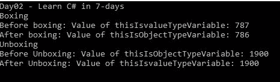

在这里，我们将讨论三种重要的类型，即接口、字符串和委托类型:

*   **接口类型**:这个类型基本上是一个契约，打算由谁来使用它就由谁来实现。一个类或结构可以使用一个或多个接口类型。一个接口类型可以从多个其他接口类型继承。我们将在第七天详细讨论这个问题。
*   **委托类型**:这是一个表示参数列表的方法引用的类型。众所周知，委托被称为函数指针(如 C++中所定义的)。委托是类型安全的。我们将在第四天详细讨论这个问题。
*   **弦式**:这是`System.String`的别名。这种类型允许您将任何字符串值赋给变量。我们将在接下来的章节中详细讨论这一点。

# 指针类型

此类型属于不安全代码。定义为指针类型的变量存储另一个变量的内存地址。我们将在第六天详细讨论这个问题。

# 零型

可空类型只是`System.Nullable<T>`结构的一个实例。可空类型包含与其`ValueType`相同的数据范围，但增加了一个空值。参考数据类型表，其中 int 的范围是 2147483648 到 2147483647，但是`System.Nullable<int>`或`int`？除了 null 之外，还具有相同的范围。这意味着你可以这样做:`int? nullableNum = null;`。

有关可空类型的更多详细信息，请参考[https://docs . Microsoft . com/en-us/dotnet/cs harp/编程指南/可空类型/](https://docs.microsoft.com/en-us/dotnet/csharp/programming-guide/nullable-types/) 。

# 经营者

在 C# 中，运算符只是告诉编译器执行特定操作的数学或逻辑运算符。例如，乘法(*)运算符告诉编译器乘法；另一方面，逻辑 and (&&)运算符检查两个操作数。我们可以将 C# 运算符分为更广泛的类型，如下表所示:

| 类型 | 操作员 | 描述 |
| 算术运算符 | + | 添加两个操作数，例如`var result = num1 +num2;` |
|  | - | 从第一个操作数中减去第二个操作数，例如`var result = num1 - num2;` |
|  | * | 将两个操作数相乘，例如`var result = num1 * num2;` |
|  | / | 分子除以分母，例如`var result = num1 / num2;` |
|  | % | 模量，例如`result = num1 % num2;` |
|  | ++ | 将值增加 1 的增量运算符。，例如`var result = num1++;` |
|  | - | 将值减少 1 的递减运算符，例如`var result = num1--;` |
| 关系运算符 | == | 确定两个操作数是否具有相同的值。如果表达式成功，则返回真；否则返回假，例如`var result = num1 == num2;` |
|  | ！= | 执行与`==`相同的操作，但否定比较；如果两个操作数相等，则返回 false，例如`var result = num1 != num2;` |
|  | > | 确定在表达式中，左操作数是否大于右操作数，并在成功时返回真，例如`var result = num1 > num2;` |
|  | < | 确定在表达式中，左操作数是否小于右操作数，并在成功时返回真，例如`var result = num1 < num2;` |
|  | >= | 确定在表达式中，左操作数的值是否大于或等于右操作数的值，并在成功时返回真，例如`var result = num1 <= num2;` |
|  | <= | 确定在表达式中，左操作数的值是否小于或等于右操作数的值，并在成功时返回真，例如`var result = num1 <= num2;` |
| 逻辑运算符 | && | 这是一个合乎逻辑的`AND`运算符。表达式基于左操作数求值；如果是真的，那么右边的操作数不会被忽略，例如`var result = num1 && num2;` |
|  | &# 124;&# 124; | 这是一个合乎逻辑的`OR`运算符。如果任何操作数为真，表达式的计算结果为真，例如`var result = num1 &# 124;&# 124; num2;` |
|  | ！ | 这被称为逻辑`NOT`运算符。它反转评估结果，例如`var result = !(num1 && num2);` |
| 按位运算符 | &# 124; | 这是一个按位`OR`运算符，用于位。如果任一位为 1，结果将为 1，例如`var result = num1 &# 124; num2;` |
|  | & | 这是一个按位`AND`运算符，用于位。如果任一位为 0，则结果为 0；否则，就是 1，例如`var result = num1 & num2;` |
|  | ^ | 这是一个按位`XOR`运算符，用于位。如果位相同，结果为 0；否则，就是 1，例如`var result = num1 ^ num2;` |
|  | ~ | 这是一元运算符，称为按位`COMPLEMENT`运算符。这适用于单个操作数并反转该位，这意味着如果该位为 0，则返回 1，反之亦然，例如`var result = ~num1;` |
|  | << | 这是一个按位左移运算符，将一个数字向左移动表达式中指定的位数，并将零添加到最低有效位，例如`var result = num1 << 1;` |
|  | >> | 这是一个按位右移运算符，将一个数字向右移动表达式中指定的位数，例如`var result = num1 >> 1;` |
| 赋值运算符 | = | 从右侧向左侧操作数赋值的赋值运算符，例如`var result = nim1 + num2;` |
|  | += | 添加和分配运算符；它将右操作数的值相加并赋给左操作数，例如`result += num1;` |
|  | -= | 减法和赋值运算符；它将右操作数的值减去并赋给左操作数，例如`result -= num1;` |
|  | *= | 乘法和赋值运算符；它将右操作数的值相乘并赋给左操作数，例如`result *= num1;` |
|  | /= | 除法和赋值运算符；它将右操作数的值划分并分配给左操作数，例如`result /= num1;` |
|  | %= | 模数和赋值运算符；取左右操作数的模，给左右操作数赋值，例如`result %= num1;` |
|  | <<= | 按位左移和赋值，例如`result <<= 2;` |
|  | >>;= | 按位右移和赋值，例如`result >>= 2;` |
|  | &= | 按位`AND`和赋值运算符，例如，。`result &= Num1;` |
|  | = | 按位`XOR`和赋值运算符，例如`result ^= num1;` |
|  | &# 124;= | 按位`OR`和赋值运算符，例如`result &# 124;= num1;` |

看看下面的代码片段，它实现了前面讨论的所有操作符:

```cs
private void ArithmeticOperators() 
{ 
WriteLine("\nArithmetic operators\n"); 
WriteLine($"Operator '+' (add): {nameof(Num1)} + {nameof(Num2)} = {Num1 + Num2}"); 
WriteLine($"Operator '-' (substract): {nameof(Num1)} - {nameof(Num2)} = {Num1 - Num2}"); 
WriteLine($"Operator '*' (multiplication): {nameof(Num1)} * {nameof(Num2)} = {Num1 * Num2}"); 
WriteLine($"Operator '/' (division): {nameof(Num1)} / {nameof(Num2)} = {Num1 / Num2}"); 
WriteLine($"Operator '%' (modulus): {nameof(Num1)} % {nameof(Num2)} = {Num1 % Num2}"); 
WriteLine($"Operator '++' (incremental): pre-increment: ++{nameof(Num1)} = {++Num1}"); 
WriteLine($"Operator '++' (incremental): post-increment: {nameof(Num1)}++ = {Num1++}"); 
WriteLine($"Operator '--' (decremental): pre-decrement: --{nameof(Num2)} = {--Num2}"); 
WriteLine($"Operator '--' (decremental): post-decrement: {nameof(Num2)}-- = {Num2--}"); 
ReadLine(); 
} 
//Code omitted 
```

完整的代码可以在 GitHub 存储库中找到，它会产生以下结果:


# C# 中运算符优先级的讨论

任何表达式的计算或求值以及运算符的顺序都非常重要。这就是所谓的运算符优先级。我们都读过运算符的数学规则*阶，缩写为 *BODMAS* 。参考[https://www.skillsyouneed.com/num/bodmas.html](https://www.skillsyouneed.com/num/bodmas.html)刷新记忆。所以，数学教我们如何解一个表达式；以类似的方式，我们的 C# 应该遵循规则来求解或评估表达式。比如 *3+2*5* 评定为 *13* 而不是 *25* 。所以，在这个等式中，规则是先相乘，然后相加。所以评估为 *2*5 = 10* ，然后 *3+10 = 13* 。您可以通过应用大括号来设置更高的优先顺序，因此如果您在前面的语句 *(3+2)*5* 中这样做，将得到 *25* 。*

To know more about operator precedence, refer to [https://msdn.microsoft.com/en-us/library/aa691323(VS.71).aspx](https://msdn.microsoft.com/en-us/library/aa691323(VS.71).aspx).

这是一个计算表达式的简单代码片段:

```cs
private void OperatorPrecedence() 
{ 
Write("Enter first number:"); 
    Num1 = Convert.ToInt32(ReadLine()); 
Write("Enter second number:"); 
    Num2 = Convert.ToInt32(ReadLine()); 
Write("Enter third number:"); 
    Num3 = Convert.ToInt32(ReadLine()); 
Write("Enter fourth number:"); 
    Num4 = Convert.ToInt32(ReadLine()); 
int result = Num1 + Num2 * Num3/Num4; 
WriteLine($"Num1 + Num2 * Num3/Num4 = {result}"); 
    result = Num1 + Num2 * (Num3 / Num4); 
WriteLine($"Num1 + Num2 * (Num3/Num4) = {result}"); 
    result = (Num1 + (Num2 * Num3)) / Num4; 
WriteLine($"(Num1 + (Num2 * Num3)) /Num4 = {result}"); 
    result = (Num1 + Num2) * Num3 / Num4; 
WriteLine($"(Num1 + Num2) * Num3/Num4 = {result}"); 
ReadLine(); 
} 
```

上述代码会产生以下结果:

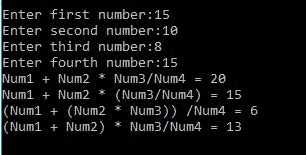

# 操作员超载

操作员加载是重新定义特定操作员实际功能的一种方式。当您使用用户定义的复杂类型时，这一点很重要，因为在这种情况下不可能直接使用内置运算符。例如，假设您有一个具有许多属性的对象，并且您想要为这些类型的对象增加两个属性。不可能这样:`VeryComplexObject = result = verycoplexobj1 + verycomplexobj2;`。为了克服这种情况，超载确实很神奇。

You cannot overload all inbuilt operators; refer to [https://docs.microsoft.com/en-us/dotnet/csharp/programming-guide/statements-expressions-operators/overloadable-operators](https://docs.microsoft.com/en-us/dotnet/csharp/programming-guide/statements-expressions-operators/overloadable-operators) to see what operators are overloadable.

让我们考虑下面的代码片段，看看运算符加载是如何工作的(注意，这段代码并不完整；完整的源代码请参考 Github):

```cs
public struct Coordinate 
{ 
//code omitted 

public static Coordinateoperator +(Coordinate coordinate1, Coordinate coordinate2) =>; 
new Coordinate(coordinate1._xAxis + coordinate2._xAxis, coordinate1._yAxis + coordinate2._yAxis); 
public static Coordinateoperator-(Coordinate coordinate1, Coordinate coordinate2) => 
new Coordinate(coordinate1._xAxis - coordinate2._xAxis, coordinate1._yAxis - coordinate2._yAxis); 
public static Coordinateoperator *(Coordinate coordinate1, Coordinate coordinate2) => 
new Coordinate(coordinate1._xAxis * coordinate2._xAxis, coordinate1._yAxis * coordinate2._yAxis); 
//code omitted 

public static booloperator ==(Coordinate coordinate1, Coordinate coordinate2) =>; 
        coordinate1._xAxis == coordinate2._xAxis && coordinate1._yAxis == coordinate2._yAxis; 

public static booloperator !=(Coordinate coordinate1, Coordinate coordinate2) => !(coordinate1 == coordinate2); 

//code omitted 

public double Area() => _xAxis * _yAxis; 

public override string ToString() =>$"({_xAxis},{_yAxis})"; 
}
```

在前面的代码中，我们有一个新的类型坐标，它是 *x* 轴和 *y* 轴的曲面。现在，如果我们想应用一些操作，使用内置操作符是不可能的。借助运算符重载，我们增强了内置运算符的实际功能。以下代码是消耗的坐标类型:

```cs
private static void OperatorOverloadigExample() 
{ 
WriteLine("Operator overloading example\n"); 
Write("Enter x-axis of Surface1: "); 
var x1 = ReadLine(); 
Write("Enter y-axis of Surface1: "); 
var y1 = ReadLine(); 
Write("Enter x-axis of Surface2: "); 
var x2= ReadLine(); 
Write("Enter y-axis of Surface2: "); 
var y2= ReadLine(); 

var surface1 = new Coordinate(Convert.ToInt32(x1),Convert.ToInt32(y1)); 
var surface2 = new Coordinate(Convert.ToInt32(x2),Convert.ToInt32(y2)); 
WriteLine(); 
Clear(); 
WriteLine($"Surface1:{surface1}"); 
WriteLine($"Area of Surface1:{surface1.Area()}"); 
WriteLine($"Surface2:{surface2}"); 
WriteLine($"Area of Surface2:{surface2.Area()}"); 
WriteLine(); 
WriteLine($"surface1 == surface2: {surface1==surface2}"); 
WriteLine($"surface1 < surface2: {surface1 < surface2}"); 
WriteLine($"surface1 > surface2: {surface1 > surface2}"); 
WriteLine($"surface1 <= surface2: {surface1 <= surface2}"); 
WriteLine($"surface1 >= surface2: {surface1 >= surface2}"); 
WriteLine(); 
var surface3 = surface1 + surface2; 
WriteLine($"Addition: {nameof(surface1)} + {nameof(surface2)} = {surface3}"); 
WriteLine($"{nameof(surface3)}:{surface3}"); 
WriteLine($"Area of {nameof(surface3)}: {surface3.Area()} "); 
WriteLine(); 
WriteLine($"Substraction: {nameof(surface1)} - {nameof(surface2)} = {surface1-surface2}"); 
WriteLine($"Multiplication: {nameof(surface1)} * {nameof(surface2)} = {surface1 * surface2}"); 
WriteLine($"Division: {nameof(surface1)} / {nameof(surface2)} = {surface1 / surface2}"); 
WriteLine($"Modulus: {nameof(surface1)} % {nameof(surface2)} = {surface1 % surface2}"); 
} 
```

在前面的代码片段中，我们声明了结构*坐标*的一个变量，并为各种操作调用了运算符。注意，通过重载，我们改变了操作符的实际行为，例如，add ( *+* )操作符，它通常将两个数字相加，但是在这里的实现中，add ( *+* )操作符给出了两个曲面的和。完整的代码会产生以下结果:


# 类型转换概述

类型转换意味着将一种类型转换成另一种类型。或者，我们称之为铸造或类型铸造。类型转换大致分为以下几类。

# 隐式转换

隐式转换是由 C# 编译器内部执行的转换，通过向变量赋值来匹配变量的类型。这个动作是隐式发生的，不需要编写任何额外的代码来遵守类型安全机制。在隐式转换中，只有较小到较大的类型和派生类到基类是可能的。

# 显式转换

显式转换是用户使用强制转换运算符显式执行的转换；这就是为什么这也被称为类型铸造。使用内置类型转换方法也可以进行显式转换。更多信息请参考[https://docs . Microsoft . com/en-us/dotnet/cs harp/language-reference/keywords/explicit-numeric-conversions-table](https://docs.microsoft.com/en-us/dotnet/csharp/language-reference/keywords/explicit-numeric-conversions-table)。

让我们看一下下面的代码片段，它显示了隐式/显式类型转换的操作:

```cs
private static void ImplicitExplicitTypeConversionExample() 
{ 
WriteLine("Implicit conversion"); 
int numberInt = 2589; 
double doubleNumber = numberInt; // implicit type conversion 

WriteLine($"{nameof(numberInt)} of type:{numberInt.GetType().FullName} has value:{numberInt}"); 
WriteLine($"{nameof(doubleNumber)} of type:{doubleNumber.GetType().FullName} implicitly type casted and has value:{doubleNumber}"); 

WriteLine("Implicit conversion"); 
doubleNumber = 2589.05D; 
numberInt = (int)doubleNumber; //explicit type conversion 
WriteLine($"{nameof(doubleNumber)} of type:{doubleNumber.GetType().FullName} has value:{doubleNumber}"); 
WriteLine($"{nameof(numberInt)} of type:{numberInt.GetType().FullName} explicitly type casted and has value:{numberInt}"); 
} 
```

在前面的代码片段中，我们讨论了当我们将 int 类型的变量`numberInt`赋给 double 类型的变量`doubleNumber`时的隐式和显式转换，这被称为隐式类型转换，反之则是需要使用 int 进行转换的显式类型转换。请注意，隐式地，类型转换不需要任何类型转换，但是显式地，转换需要类型转换，并且在显式转换期间可能会丢失数据。例如，我们从 double 到 int 的显式转换会导致数据丢失(当一个值被赋给 int 类型变量时，所有精度都会被截断)。这段代码产生以下结果:

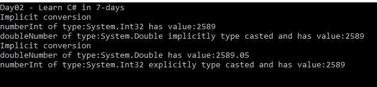

The two most important language fundamentals are type conversion and casting. To know more about these two, refer to [https://docs.microsoft.com/en-us/dotnet/csharp/programming-guide/types/casting-and-type-conversions](https://docs.microsoft.com/en-us/dotnet/csharp/programming-guide/types/casting-and-type-conversions).

# 理解语句

在 C# 中，您可以计算不同类型的表达式，这些表达式会或不会生成结果。每当你说类似*的话，如果结果& gt，会发生什么；0* 这样的话，我们是在陈述什么。这可以是决策声明、结果声明、任务声明或任何其他活动声明。另一方面，循环是重复执行几条语句的代码块。

在本节中，我们将详细讨论语句和循环。

语句应该在返回结果之前执行一些操作。换句话说，如果你正在写一份声明，那份声明应该说些什么。为此，它必须执行一些内置或定制的操作。语句可以依赖于决策，也可以是任何现有语句结果的一部分。官方页面([https://docs . Microsoft . com/en-us/dotnet/csharp/programming-guide/statements-expressions-operator/statements](https://docs.microsoft.com/en-us/dotnet/csharp/programming-guide/statements-expressions-operators/statements))将 statement 定义为:

A statement can consist of a single line of code that ends in a semicolon, or a series of single-line statements in a block. A statement block is enclosed in {} brackets and can contain nested blocks.

看看下面的代码片段，它显示了不同的语句:

```cs
private static void StatementExample() 
{ 
WriteLine("Statement example:"); 
int singleLineStatement; //declarative statement 
WriteLine("'intsingleLineStatement;' is a declarative statment."); 
singleLineStatement = 125; //assignment statement 
WriteLine("'singleLineStatement = 125;' is an assignmnet statement."); 
WriteLine($"{nameof(singleLineStatement)} = {singleLineStatement}"); 
var persons = newList<Person> 
    { 
     newAuthor {Name = "Gaurav Aroraa" } 
    }; //declarative and assignmnet statement 
WriteLine("'var persons = new List&lt;Person&gt;();' is a declarative and assignmnet statement."); 

//block statement 
foreach (var person in persons) 
    { 
      WriteLine("'foreach (var person in persons){}' is a block statement."); 
      WriteLine($"Name:{person.Name}"); 
    } 
} 
```

在前面的代码中，我们使用了三种类型的语句:声明性语句、赋值语句和块语句。该代码产生以下结果:

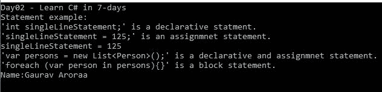

按照官方页面([https://docs . Microsoft . com/en-us/dotnet/cs harp/programming-guide/statements-expressions-operator/statements](https://docs.microsoft.com/en-us/dotnet/csharp/programming-guide/statements-expressions-operators/statements))来看，C# 语句大致可以分为以下几类。

# 陈述句

无论何时声明变量或常量，都是在编写声明性语句。您也可以在声明变量时为变量赋值。在声明时为变量赋值是一项可选任务，但是在声明时需要常量来赋值。

这是一个典型的声明性语句:

```cs
int singleLineStatement; //declarative statement 
```

# 表达式语句

在表达式语句中，右侧的表达式计算结果，并将结果赋给左侧的变量。表达式语句可以是赋值、方法调用或新对象创建。这是典型的表达式语句示例:

```cs
Console.WriteLine($"Member name:{Name}"); 
var result = Num1 + Num2 * Num3 / Num4; 
```

# 选择语句

这也叫做决策声明。语句根据条件及其评估进行分支。条件可以是一个或多个。选择或决定声明属于`if...else`和`switch`情况。在本节中，我们将详细讨论这些陈述。

# if 语句

`if`语句是一个决策语句，可以分支一个或多个语句进行评估。该语句由一个布尔表达式组成。让我们考虑一下在第一天讨论过的一本书里找到元音的问题。让我们用`if`语句来写这个:

```cs
private static void IfStatementExample() 
{ 
WriteLine("if statement example."); 
Write("Enter character:"); 
char inputChar = Convert.ToChar(ReadLine()); 

//so many if statement, compiler go through all if statement 
//not recommended way 
if (char.ToLower(inputChar) == 'a') 
WriteLine($"Character {inputChar} is a vowel."); 
if (char.ToLower(inputChar) == 'e') 
WriteLine($"Character {inputChar} is a vowel."); 
if (char.ToLower(inputChar) == 'i') 
WriteLine($"Character {inputChar} is a vowel."); 
if (char.ToLower(inputChar) == 'o') 
WriteLine($"Character {inputChar} is a vowel."); 
if (char.ToLower(inputChar) == 'u') 
WriteLine($"Character {inputChar} is a vowel."); 
} 
```

在前面的代码中，我们只使用了`if`条件。然而，前面的代码并不是推荐的代码，但这只是为了展示`if`语句的用法。在前面的代码片段中，一旦代码执行了编译器，它就会验证所有的`if`语句，而不考虑我的第一个`if`语句被传递的场景。比方说，如果你输入 *a* ，在这种情况下是一个元音，编译器会发现第一个表达式为真并打印输出(我们得到我们的结果)，然后编译器会检查下一个`if`语句，以此类推。在这种情况下，编译器不必要地检查了所有四个不应该发生的语句的剩余部分。可能会有这样一种情况，我们的代码没有落入前面代码中的任何`if`语句中；那样的话，我们就不会得到预期的结果。为了克服这种情况，我们有`if...else`声明，我们将在下一节中讨论。

# 如果..else 语句

在这个`if`语句中，如果 if 块为假，则执行 else 和 else 块。这是一个简单的例子:

```cs
private static void IfElseStatementExample() 
{ 
WriteLine("if statement example."); 
Write("Enter character:"); 
char inputChar = Convert.ToChar(ReadLine()); 
char[] vowels = {'a', 'e', 'i', 'o', 'u'}; 

if (vowels.Contains(char.ToLower(inputChar))) 
WriteLine($"Character '{inputChar}' is a vowel."); 
else 
WriteLine($"Character '{inputChar}' is a consonent."); 
} 
```

在前面的代码片段中，我们使用了`else`后跟`if`语句。当`if`语句评估为假时，将执行`else`块代码。

# 如果...否则如果...else 语句

当需要测试多个条件时，`if...else`语句非常重要。在这个语句中，`if`语句首先求值，然后是`else` `if`语句，最后执行 else 块。这里，`if`语句可以有也可以没有`if...else`语句或区块；`if...else`总是在`if`块之后和`else`块之前。`else`语句是`if...else...if else...else`语句中的最后一个代码块，表示前面的条件都没有评估为真。

看看下面的代码片段:

```cs
private static void IfElseIfElseStatementExample() 
{ 
WriteLine("if statement example."); 
Write("Enter character:"); 
char inputChar = Convert.ToChar(ReadLine()); 

if (char.ToLower(inputChar) == 'a') 
{ WriteLine($"Character {inputChar} is a vowel.");} 
elseif (char.ToLower(inputChar) == 'e') 
{ WriteLine($"Character {inputChar} is a vowel.");} 
elseif (char.ToLower(inputChar) == 'i') 
{ WriteLine($"Character {inputChar} is a vowel.");} 
elseif (char.ToLower(inputChar) == 'o') 
{ WriteLine($"Character {inputChar} is a vowel.");} 
elseif (char.ToLower(inputChar) == 'u') 
{ WriteLine($"Character {inputChar} is a vowel.");} 
else 
{ WriteLine($"Character '{inputChar}' is a consonant.");} 
} 
```

在前面的代码片段中，我们有各种`if...else if...else`语句来评估表达式:`inputchar`是否等同于比较的`characternot`。在此代码中，如果您输入除 *a* 、*e*I、 *o* 、 *u* 以外的字符，而该字符不属于上述任何一种情况，则案例`else`代码块执行并产生最终结果。所以当`else`执行时，它通过说输入的字符是辅音来返回结果。

# 嵌套 if 语句

嵌套的`if`语句只不过是`if`语句块中的`if`语句块。同样，我们可以嵌套`else if`语句块。这是一个简单的代码片段:

```cs
private static void NestedIfStatementExample() 
{ 
WriteLine("nested if statement example."); 
Write("Enter your age:"); 
int age = Convert.ToInt32(ReadLine()); 

if (age < 18) 
    { 
      WriteLine("Your age should be equal or greater than 18yrs."); 
      if (age < 15) 
        { 
         WriteLine("You need to complete your school first"); 
        } 
    } 
} 
```

# 交换语句

这是一条语句，提供了一种使用`switch`语句选择表达式的方法，当代码不属于任何`case`块时，该语句使用`case`块评估条件；然后，`default`块执行(默认块是`switch...case`语句中的可选块)。

Switch 语句也称为`if...else if...else`语句的替代语句。让我们重写上一节中使用的示例来展示`if...else if...else`语句:

```cs
private static void SwitchCaseExample() 
{ 
WriteLine("switch case statement example."); 
Write("Enter character:"); 
charinputChar = Convert.ToChar(ReadLine()); 

switch (char.ToLower(inputChar)) 
{ 
case'a': 
WriteLine($"Character {inputChar} is a vowel."); 
break; 
case'e': 
WriteLine($"Character {inputChar} is a vowel."); 
break; 
case'i': 
WriteLine($"Character {inputChar} is a vowel."); 
break; 
case'o': 
WriteLine($"Character {inputChar} is a vowel."); 
break; 
case'u': 
WriteLine($"Character {inputChar} is a vowel."); 
break; 
default: 
WriteLine($"Character '{inputChar}' is a consonant."); 
break; 
} 
}
```

在前面的代码中，如果没有一个事例的计算结果为真，将执行默认块。`switch...case`声明将在第三天详细讨论。

当你在`switch...case`和`if...else`之间选择时，会有细微的差别。更多详情，请参考[https://stackoverflow . com/questions/94305/什么是更快的字符串或其他类型的开关](https://stackoverflow.com/questions/94305/what-is-quicker-switch-on-string-or-elseif-on-type)。

# 迭代语句

这些语句提供了一种迭代集合数据的方法。可能会有这样的情况，您希望多次执行一个代码块，或者在同一活动中需要重复的操作。有迭代循环可以实现这一点。循环语句中的代码块按顺序执行，这意味着第一条语句先执行，依此类推。以下是我们可以将 C# 的迭代语句分为的主要类别:

# do...while 循环

这有助于我们重复执行语句或块的语句，直到它将表达式计算为 false。在`do...while`语句中，一个语句块首先执行，然后检查`while`下的条件，这意味着一个语句或语句块至少执行一次。

看看下面的代码:

```cs
private static void DoWhileStatementExample() 
{ 
WriteLine("do...while example"); 
Write("Enter repeatitive length:"); 
int length = Convert.ToInt32(ReadLine()); 
int count = 0; 
do 
    { 
        count++; 
        WriteLine(newstring('*',count));  
    } while (count < length); 
} 
```

在前面的代码片段中，`do`块的语句一直执行到 while 块的语句计算为 false。

# while 循环

这会执行语句或代码块，直到条件评估为真。在此表达式中，在执行代码块之前进行计算，如果表达式计算为 false，则循环终止，不执行任何语句或代码块。看看下面的代码片段:

```cs
private static void WhileStatementExample() 
{ 
WriteLine("while example"); 
Write("Enter repeatitive length:"); 
int length = Convert.ToInt32(ReadLine()); 
int count = 0; 
while (count < length) 
    { 
       count++; 
       WriteLine(newstring('*', count)); 
    } 
}   
```

前面的代码重复执行`while`语句，直到表达式计算为假。

# for 循环

`for`循环类似于其他循环，帮助重复运行语句或代码块，直到表达式计算为假。`for`循环分为三个部分:`initializer`、`condition`和`iterator`，其中`initializer`部分首先执行，并且只执行一次；这只是一个开始循环的变量。下一部分是条件，如果它的计算结果为真，那么只执行 body 语句；否则它终止循环。第三个也是最重要的部分是增量或迭代器，它更新循环控制变量。让我们看看下面的代码片段:

```cs
private static void ForStatementExample() 
{ 
WriteLine("for loop example."); 
Write("Enter repeatitive length:"); 
int length = Convert.ToInt32(ReadLine()); 
for (intcountIndex = 0; countIndex < length; countIndex++) 
    { 
     WriteLine(newstring('*', countIndex)); 
    } 
}
```

前面的代码片段是一个`for`循环的工作示例。这里，`for`循环块中的代码语句将重复执行，直到`countIndex&lt; length`表达式计算为假。

# foreach 循环

这有助于迭代数组元素或集合。它与`for`循环做同样的事情，但是这可用于迭代集合，而不需要从集合中添加或移除项目。

让我们看看下面的代码片段:

```cs
private static void ForEachStatementExample() 
{ 
WriteLine("foreach loop example"); 
char[] vowels = {'a', 'e', 'i', 'o', 'u'}; 
WriteLine("foreach on Array."); 
foreach (var vowel in vowels) 
    { 
        WriteLine($"{vowel}"); 
    } 
WriteLine(); 
var persons = new List<Person> 
    { 
     new Author {Name = "Gaurav Aroraa"}, 
     new Reviewer {Name = "ShivprasadKoirala"}, 
     new TeamMember {Name = "Vikas Tiwari"}, 
     new TeamMember {Name = "Denim Pinto"} 
    }; 
WriteLine("foreach on collection"); 
foreach (var person in persons) 
    { 
        WriteLine($"{person.Name}"); 
    } 
}
```

前面的代码是一个打印人名的`foreach`语句的工作示例。`Name`是`Person`对象集合中的一个属性。`foreach`块的语句重复执行，直到表达式`person in persons`计算为假。

# 跳转语句

jump 语句从名称上来说是不言自明的，它是一个帮助将控制从一个部分移动到另一个部分的语句。这些是 C# 中主要的跳转语句。

# 破裂

这将终止控制流`for`循环或`switch`语句。看看下面的例子:

```cs
private static void BreakStatementExample() 
{ 
WriteLine("break statement example"); 
WriteLine("break in for loop"); 
for (int count = 0; count &lt; 50; count++ 
{ 
if (count == 8) 
   { 
    break; 
   } 
WriteLine($"{count}"); 
} 
WriteLine(); 
WriteLine("break in switch statement"); 
SwitchCaseExample(); 
} 
```

在前面的代码中，`if`表达式计算为真时，`for`循环的执行将中断。

# 继续

这有助于`continue`控制下一次循环迭代，它带有`while`、`do`、`for`或`foreach`循环。看看下面的例子:

```cs
private static void ContinueStatementExample() 
{ 
WriteLine("continue statement example"); 
WriteLine("continue in for loop"); 
for (int count = 0; count &lt; 15; count++) 
{ 
if (count< 8) 
{ 
 continue; 
} 
 WriteLine($"{count}"); 
} 
} 
```

当`if`表达式的计算结果为真时，前面的代码会绕过执行。

# 系统默认值

这带有一个`switch`语句和一个`default`块，确保在任何`case`块中没有找到`if`匹配项，执行`default`块。详见`switch...case`声明。

# 异常处理语句

这具有处理程序中未知问题的能力，这被称为异常处理(我们将在第四天讨论异常处理)。

# 数组和字符串操作

数组和字符串在 C# 编程中很重要。当您需要字符串操作或使用数组处理复杂数据时，可能会有机会。在本节中，我们将讨论数组和字符串。

# 数组

数组只不过是存储相同类型的固定大小的顺序元素的数据结构。包含数据的数组的元素基本上都是变量，我们也可以把一个数组叫做同类型变量的集合，这种类型一般叫做元素类型。

An array is a block of contiguous memory. This block stores everything required for an array, that is, elements, element rank, and length of the array. The first element rank is 0 and the last element rank is equal to the total length of array - 1.

我们来考虑一下`char[] vowels = {'a', 'e', 'i', 'o', 'u'};`阵。大小为五的数组。每个元素都以顺序的方式存储，并且可以使用其元素等级进行访问。下图显示了数组声明包含的内容:


上图是我们为数据类型为*字符的元音的数组声明的表示。这里， *[ ]* 代表一个数组，告诉 CLR 我们在声明一个字符数组。元音是一个变量名，是包含数据的完整数组的右侧表示。*

下图描述了这个数组在内存中的样子:


在上图中，我们有一组连续的内存块。这也告诉我们，内存中数组的最低地址对应数组的第一个元素，内存中数组的最高地址对应最后一个元素。

我们可以通过元素的等级(从 0 开始)来检索元素的值。所以，在前面的代码中，*元音【0】*会给我们*一个**元音【4】*会给我们 *u* 。

When we talk about an array, we mean a reference type because array types are reference types. Array types are derived from `System.Array`, which is a class. Hence, all array types are reference types.

或者，我们也可以使用`for`获取值，迭代直到`rankIndex < vowels.Length`表达式计算为假，并且`for`循环语句的代码块根据数组元素的等级打印数组元素:

```cs
private static void ArrayExample() 
{ 
WriteLine("Array example.\n"); 
char[] vowels = {'a', 'e', 'i', 'o', 'u'}; 
WriteLine("char[] vowels = {'a', 'e', 'i', 'o', 'u'};\n"); 
WriteLine("acces array using for loop"); 
for (intrankIndex = 0; rankIndex&lt;vowels.Length; rankIndex++) 
{ 
    Write($"{vowels[rankIndex]} "); 
} 
WriteLine(); 
WriteLine("acces array using foreach loop"); 
foreach (char vowel in vowels) 
    { 
        Write($"{vowel} "); 
    } 
} 
```

上述代码会产生以下结果:


在前面的例子中，我们初始化了数组，并将数据分配给了一个相当于`char[] vowels = newchar[5];`的语句。在这里，我们告诉 CLR，我们正在创建一个名为 char 类型元音的数组，它最多有五个元素。或者，我们也可以声明相同的`char[] vowels = newchar[5] { 'a', 'e', 'i', 'o', 'u' };`

在本节中，我们将讨论不同类型的阵列，并了解如何在不同的场景中使用阵列。

# 数组的类型

前面，我们讨论了什么是数组，以及如何声明数组。到目前为止，我们已经讨论了一维数组。考虑一个矩阵，其中有行和列。数组是相对于矩阵按行和列排列的数据的表示。然而，数组有更多的类型，如这里所讨论的。

# 一维数组

可以通过初始化数组类和设置大小来简单地声明一维数组。这是一个一维数组:

```cs
string[] cardinalDirections = {"North","East","South","West"}; 
```

# 多维数组

数组可以声明为多个一维，这意味着您可以创建行和列的矩阵。多维数组可以是二维数组、三维数组或更多。创建 2x2 大小的典型二维数组的不同方式意味着两行两列:

```cs
int[,] numbers = new int[2,2]; 
int[,] numbers = new int[2, 2] {{1,2},{3,4} }; 
```

下面是访问二维数组的代码片段:

```cs
int[,] numbers = new int[2, 2] {{1,2},{3,4} }; 
for (introwsIndex = 0; rowsIndex< 2; rowsIndex++) 
{ 
for (intcolIndex = 0; colIndex< 2; colIndex++) 
    { 
        WriteLine($"numbers[{rowsIndex},{colIndex}] = {numbers[rowsIndex, colIndex]}"); 
    } 
} 
```

前面的代码片段是 2x2 数组的表示，即两行两列。在数学术语中，我们也知道这是一个正方形矩阵。要检索这个数组的元素，我们至少需要两个`for`循环；外部循环将对行起作用，内部循环将对列起作用，最后，我们可以使用`number[rowIndex][colIndex]`获得元素值。

A square matrix is the one with the same rows and columns. Generally, it is called an *n* by *n* matrix.

此代码产生以下结果:

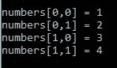

# 交错数组

交错数组是数组的数组或数组中的数组。在交错数组中，数组的元素是数组。您还可以设置不同大小/尺寸的数组元素。交错数组的任何元素都可以有另一个数组。

交错数组的典型声明如下:

```cs
string[][,] collaborators = new string[5][,]; 
```

考虑以下代码片段:

```cs
WriteLine("Jagged array.\n"); 
string[][,] collaborators = new string[3][,] 
{ 
new[,] {{"Name", "ShivprasadKoirala"}, {"Age", "40"}}, 
new[,] {{"Name", "Gaurav Aroraa" }, {"Age", "43"}}, 
new[,] {{"Name", "Vikas Tiwari"}, {"Age", "28"}} 
}; 

for (int index = 0; index <collaborators.Length; index++) 
{ 
     for (introwIndex = 0; rowIndex< 2; rowIndex++) 
    { 
         for (intcolIndex = 0; colIndex< 2; colIndex++) 
        { 
            WriteLine($"collaborators[{index}][{rowIndex},
            {colIndex}] = {collaborators[index]  
            [rowIndex,colIndex]}"); 
        } 
    } 
} 
```

在前面的代码中，我们声明了包含二维数组的三个元素的交错数组。执行后，它会产生以下结果:


您还可以声明更复杂的数组来与更复杂的场景交互。你可以参考 https://docs.microsoft.com/en-us/dotnet/api/system.array?获得更多信息 view=netcore-2.0 。

Implicitly typed arrays can be created as well. In implicitly typed arrays, the array type inferred from the elements is defined during array initialization, for instance, `var charArray = new[] {'a', 'e', 'i', 'o', 'u'};` here we declare a char array. For more information on implicitly typed arrays, refer to [https://docs.microsoft.com/en-us/dotnet/csharp/programming-guide/arrays/implicitly-typed-arrays](https://docs.microsoft.com/en-us/dotnet/csharp/programming-guide/arrays/implicitly-typed-arrays).

# 用线串

在 C# 中，字符串只不过是表示 UTF-16 代码单元的字符数组，用于表示文本。

The maximum size of a string in memory is 2 GB.

字符串对象的声明就像声明任何变量一样简单最常用的语句:`string authorName = "Gaurav Aroraa";`。

字符串对象被称为不可变的，这意味着它是只读的。字符串对象的值在创建后不能修改。对字符串对象执行的每个操作都会返回一个新字符串。由于字符串是不可变的，它们会导致巨大的性能损失，因为字符串上的每个操作都需要创建一个新的字符串。为了克服这一点，`System.Text`类中提供了`StringBuilder`对象。

For more information on strings, refer to [https://docs.microsoft.com/en-us/dotnet/api/system.string?view=netcore-2.0# Immutability](https://docs.microsoft.com/en-us/dotnet/api/system.string?view=netcore-2.0# Immutability).

这些是声明字符串对象的替代方法:

```cs
private static void StringExample() 
{ 
WriteLine("String object creation"); 
string authorName = "Gaurav Aroraa"; //string literal assignment 
WriteLine($"{authorName}"); 
string property = "Name: "; 
string person = "Gaurav"; 
string personName = property + person; //string concatenation 
WriteLine($"{personName}"); 

char[] language = {'c', 's', 'h', 'a', 'r', 'p'}; 
stringstr Language = new string(language); //initializing the constructor 
WriteLine($"{strLanguage}"); 
string repeatMe = new string('*', 5); 
WriteLine($"{repeatMe}"); 
string[] members = {"Shivprasad", "Denim", "Vikas", "Gaurav"}; 
string name = string.Join(" ", members); 
WriteLine($"{name}"); 
} 
```

前面的代码片段告诉我们，声明可以按如下方式完成:

*   声明字符串变量时的字符串赋值
*   连接字符串时
*   构造函数初始化使用`new`
*   方法返回字符串

There are plenty of string methods and formatting actions that are available for string operations; refer to [https://docs.microsoft.com/en-us/dotnet/api/system.string?view=netcore-2.0](https://docs.microsoft.com/en-us/dotnet/api/system.string?view=netcore-2.0) for more details.

# 结构与阶级

类似于 C# 中的类，结构也是由成员、函数等组成的数据结构。类是引用类型，但结构是值类型；因此，这些不是堆分配所必需的，而是在堆栈上分配所必需的。

值类型数据将在堆栈上分配，引用类型数据将在堆上分配。struct 中使用的值类型存储在堆栈上，但是当数组中使用相同的值类型时，它存储在堆中。

For more details on heap and stack memory allocation, refer to [http://www-ee.eng.hawaii.edu/~tep/EE160/Book/chap14/subsection2.1.1.8.html](http://www-ee.eng.hawaii.edu/~tep/EE160/Book/chap14/subsection2.1.1.8.html) and [https://www.codeproject.com/Articles/1058126/Memory-allocation-in-Net-Value-type-Reference-type](https://www.codeproject.com/Articles/1058126/Memory-allocation-in-Net-Value-type-Reference-type).

因此，当您创建一个`struct`类型的变量时，该变量直接存储数据而不是引用，就像类一样。在 C# 中，`struct`关键字(更多细节请参考 C# 关键字部分)有助于声明结构。结构有助于表示记录或当您需要呈现一些数据时。

看看下面的例子:

```cs
public struct BookAuthor 
{ 
public string Name; 
public string BookTitle; 
public int Age; 
public string City; 
public string State; 
public string Country; 

   //Code omitted 
} 
```

在这里，我们有一个名为`BookAuthor`的结构，它代表了一个书籍作者的数据。看看下面使用这种结构的代码:

```cs
private static void StructureExample() 
{ 
WriteLine("Structure example\n"); 
Write("Author name:"); 
var name = ReadLine(); 
Write("Book Title:"); 
var bookTitle = ReadLine(); 
Write("Author age:"); 
var age = ReadLine(); 
Write("Author city:"); 
var city = ReadLine(); 
Write("Author state:"); 
var state = ReadLine(); 
Write("Author country:"); 
var country = ReadLine(); 

BookAuthor author = new BookAuthor(name,bookTitle,Convert.ToInt32(age),city,state,country); 
WriteLine($"{author.ToString()}"); 
BookAuthor author1 = author; //copy structure, it will copy only data as this is //not a class 

Write("Change author name:"); 
var name1 = ReadLine(); 
author.Name = name1; 

WriteLine("Author1"); 
WriteLine($"{author.ToString()}"); 
WriteLine("Author2"); 
WriteLine($"{author1.ToString()}"); 
} 
```

这只是显示作者的详细信息。这里重要的一点是，一旦我们复制了结构，更改结构的任何字段都不会影响复制的内容；这是因为当我们复制时，只有数据被复制。如果对类执行相同的操作，将导致复制引用而不是复制数据。这种复制过程称为深度复制和浅复制。参考[https://www . code project . com/Articles/28952/浅层-Copy-vs-Deep-Copy-in-NET](https://www.codeproject.com/Articles/28952/Shallow-Copy-vs-Deep-Copy-in-NET) 了解更多关于浅层拷贝和深层拷贝的知识。

这是前面代码的结果:

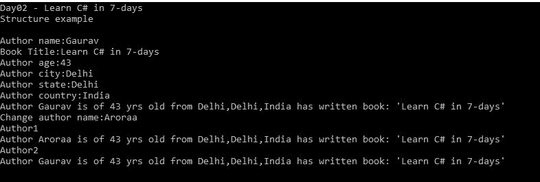

现在，让我们对类尝试相同的操作；看看下面的代码，它消耗了我们的类:

```cs
private static void StructureExample() 
{ 
WriteLine("Structure example\n"); 
Write("Author name:"); 
var name = ReadLine(); 
Write("Book Title:"); 
var bookTitle = ReadLine(); 
Write("Author age:"); 
var age = ReadLine(); 
Write("Author city:"); 
var city = ReadLine(); 
Write("Author state:"); 
var state = ReadLine(); 
Write("Author country:"); 
var country = ReadLine(); 

ClassBookAuthor author = new ClassBookAuthor(name,bookTitle,Convert.ToInt32(age),city,state,country); 
WriteLine($"{author.ToString()}"); 
ClassBookAuthor author1 = author; //copy class, it will copy reference 

Write("Change author name:"); 
var name1 = ReadLine(); 
author.Name = name1; 

WriteLine("Author1"); 
WriteLine($"{author.ToString()}"); 
WriteLine("Author2"); 
WriteLine($"{author1.ToString()}"); 
} 
```

现在我们的两个类变量将具有相同的值。下面的截图向我们展示了结果:

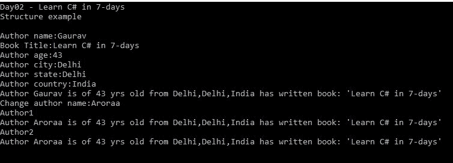

结构和类是不同的:

*   结构是值类型，而类是引用类型。
*   类支持单一继承(使用接口可以实现多重继承)，但是结构不支持继承。
*   类有隐式默认构造函数，但结构没有默认构造函数。

这里还有更多我们没有讨论的结构功能。参考[https://docs . Microsoft . com/en-us/dotnet/cs harp/tour-cs harp/struts](https://docs.microsoft.com/en-us/dotnet/csharp/tour-of-csharp/structs)获取更多关于 struct 的内部信息。

# 动手练习

让我们通过解决以下问题来倒回今天(即第二天)的学习内容:

1.  写一个简短的程序来演示我们可以在不同的名称空间中使用相同的类名。
2.  定义`console`类。编写一个`console`程序，通过修改书中讨论的代码示例来显示所有可用的颜色，这样所有的元音都将显示为绿色，所有的辅音都将显示为蓝色。
3.  阐述 C# 保留关键词。
4.  用例子描述不同类别的 C# 关键词。

5.  创建一个小程序来演示`is`和`as`操作符。
6.  写一个小程序，借助上下文关键词展示查询表达式。
7.  写一个小程序来展示`this`和`base`关键词的重要性。
8.  借助一个短程序定义装箱和拆箱。
9.  写一个短程序来证明指针类型变量存储的是另一个变量的内存而不是数据。
10.  写一个简短的程序来展示操作员优先顺序。
11.  什么是运算符重载？写一个小程序来展示操作符重载的作用。
12.  有哪些不能重载的运算符，为什么？
13.  借助一个短程序定义类型转换。
14.  编写一个短程序，使用所有可用的内置 C# 类型，并使用转换方法执行转换(使用`var result = Convert.ToInt32(5689.25);`可以实现十进制到 int 的转换)。
15.  定义 C# 语句。
16.  写一个程序来阐述每个陈述类别。
17.  `jump`有哪些说法？写一个小程序展示所有`jump`语句。
18.  C# 中的数组是什么？
19.  写一个程序，证明一个数组是一块连续的内存。
20.  参考`System.Array`类([https://docs.microsoft.com/en-us/dotnet/api/system.array?view=netcore-2.0](https://docs.microsoft.com/en-us/dotnet/api/system.array?view=netcore-2.0) )并编写一个短程序。
21.  将数组作为参数传递给方法。
22.  对数组排序。
23.  复制数组。
24.  参考`System.String`类，借助一个短程序探索它的所有方法和属性。
25.  字符串对象是如何不可变的？写一个简短的节目来展示这一点。
26.  什么是弦乐器？
27.  什么是阶级？
28.  什么是结构？
29.  写一个小程序，展示一个`struct`和一个`class`的区别。

30.  解释编译时类型和运行时类型。
31.  编写一个程序来显示编译时类型和运行时类型之间的区别。
32.  写一个简短的程序来证明，显式地，类型转换会导致数据丢失。

# 重温第二天

因此，我们结束了七天学习系列的第二天。今天，我们从一个非常简单的 C# 程序开始，遍历了它的所有部分(一个典型的 C# 程序)。然后，我们讨论了关于 C# 保留关键字和访问器的所有内容，我们也理解了什么是上下文关键字。

我们在 C# 中介绍了各种可用数据类型的类型转换和类型转换。您学习了装箱和取消装箱是如何发生的，以及我们如何使用内置方法执行转换。

我们也对各种语句进行了梳理和理解，你也学到了各种语句的用法和流程，比如`for`、`foreach`、`while`、`do`。我们借助代码示例查看了条件语句、`that is`、`if`、`if...else`、`if...elseif...else`开关。

然后，我们在代码示例的帮助下浏览数组并理解它们，包括字符串操作。

最后，我们以结构和课程结束了一天。我们研究了这两者的不同之处。

明天，在第三天，我们将讨论 C# 语言的所有新特性，并借助代码示例讨论它们的用法和功能。