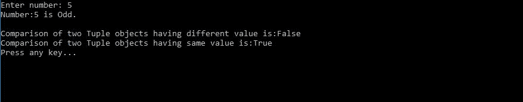
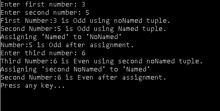
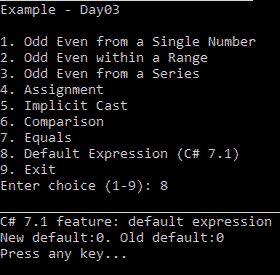
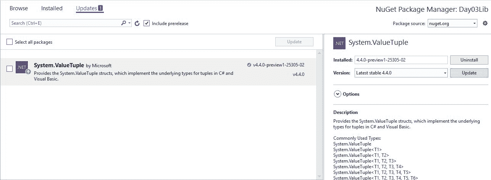

# 第三天-c#有什么新功能

今天，我们将学习 C#语言当前版本的一个非常新发布的特性，即 C# 7.0(这是本书评论中最新的改编)。其中一些元素是全新的，而其他元素则出现在过去的改编中，并在当前版本的语言中进行了升级。C# 7.0 将改变游戏，带来许多新功能。其中一些元素，如元组，是官方可访问的想法的扩展，而其他的则是全新的。以下是我们将在第 3 天了解的基本要素:

*   元组与解构
*   模式匹配
*   本地功能
*   字面上的改进
*   异步主
*   默认表达式
*   推断元组名称

# 元组与解构

元组在当前版本中没有被新引入，但在。NET 4.0 版本。在当前版本中，它们已经得到了改进。

# 元组

元组存在于特定情况需要从一个方法返回多个值的任何地方。例如，假设我们必须从给定的数列中找出奇数和偶数。

Tuples are an unchanging information esteem that hold related data. Tuples used to aggregate together related data, for example, such that a person's name, age, gender and whatever you want data as an information.

要完成这一步，我们的方法应该返回或向我们提供一个数字，并告诉我们这是奇数还是偶数。对于将返回这些多个值的方法，我们可以使用自定义数据类型、动态返回类型或 out 参数，这有时会给开发人员造成混乱。

To use tuples, you need to add the NuGet package:

[https://www.nuget.org/packages/System.ValueTuple/](https://www.nuget.org/packages/System.ValueTuple/)

对于这个问题，我们有一个元组对象，在 C# 7.0 中，我们有两个不同的东西，元组类型和元组文字，从一个方法返回多个值。

让我们使用一个代码示例来详细讨论元组。考虑以下代码片段:

```cs
public static (int, string) FindOddEvenBySingleNumber(int number) 
{ 
   string oddOrEven = IsOddNumber(number) ? "Odd" :"Even"; 
   return (number, oddOrEven);//tuple literal 
} 
```

在前面的代码片段中，方法`FindOddEvenBySingleNumber`正在返回多个值，这告诉我们一个数字是奇数还是偶数。参见前面代码的 return 语句`return (number, oddOrEven)`:在这里，我们只是返回了两个不同的变量。现在，如何从调用者方法访问这些值？在这种情况下，我们返回一个元组值，调用者方法将收到一个包含这些值的元组，这些值只不过是元组的元素或项。在这种情况下，对于来电者方法，该号码将作为`Item1`和`oddOrEven`作为`Item2`提供。以下内容来自调用方方法:

```cs
var result = OddEven.FindOddEvenBySingleNumber(Convert.ToInt32(number); 
Console.WriteLine($"Number:{result.Item1} is {result.Item2}"); 
```

在前面的代码片段中，`result.Item1`代表数字，`result.Item2`代表`oddOrEven`。当有人知道这些元组项/元素的表示时，这很好。但是考虑这样一个场景:我们有许多元组元素，而编写调用者方法的开发人员不知道这些项/元素的表示。在这种情况下，消费这些元组项/元素有点复杂。为了克服这个问题，我们可以给这些元组项命名。我们称这些命名的元组项目/元素。让我们修改我们的方法`FindOddEvenBySingleNumber`以返回命名元组项:

```cs
public static (int number, string oddOrEvent) FindOddEvenBySingleNumber (int number) 
{ 
   string result = IsOddNumber(number) ? "Odd" : "Even"; 
   return (number:number, oddOrEvent: result);//returning
   named tuple element in tuple literal 
} 
```

在前面的代码片段中，我们向元组中添加了更多描述性名称。现在调用方方法可以直接使用这些名称，如下面的代码片段所示:

```cs
var result = OddEven.FindOddEvenBySingle(Convert.ToInt32(number)); 
Console.WriteLine($"Number:{result.number} is {result.oddOrEvent}"); 
```

通过给元组添加一些描述性的名称，我们可以很容易地在调用者方法中识别和使用元组的项/元素。

# 系统。ValueTuple 结构

C# 7.0 中的元组需要 NuGet 包`System.ValueType`。这只不过是一个设计好的结构。这包含了一些静态的和公共的方法来解决这个问题:

*   **CompareTo(ValueTuple)** :与`ValueTuple`实例进行比较的公共方法。如果比较成功，方法返回 0，否则返回 1。
*   这里我们有两种方法来展示`CompareTo`方法的威力:

```cs
public static bool CompareToTuple(int number) 
{ 
   var oddEvenValueTuple =
   FindOddEvenBySingleNumber(number); 
   var differentTupleValue =
   FindOddEvenBySingleNumberNamedElement(number + 1); 
   var res =
   oddEvenValueTuple.CompareTo(differentTupleValue); 
   return res == 0; // 0 if other is a ValueTuple instance
   and 1 if other is null 
} 
public static bool CompareToTuple1(int number) 
{ 
    var oddEvenValueTuple =
    FindOddEvenBySingleNumber(number); 
    var sameTupleValue =
    FindOddEvenBySingleNumberNamedElement(number); 
    var res = oddEvenValueTuple.CompareTo(sameTupleValue); 
    return res == 0;// 0 if other is a ValueTuple instance
    and 1 if other is null 
} 
```

下面是从前面的代码中获取结果的调用代码片段:

```cs
Console.Clear(); 
Console.Write("Enter number: "); 
var num = Console.ReadLine(); 
var resultNum = OddEven.FindOddEvenBySingleNumberNamedElement(Convert.ToInt32(num)); 
Console.WriteLine($"Number:{resultNum.number} is {resultNum.oddOrEven}."); 
Console.WriteLine(); 
var comp = OddEven.CompareToTuple(Convert.ToInt32(num)); 
Console.WriteLine($"Comparison of two Tuple objects having different value is:{comp}"); 
var comp1 = OddEven.CompareToTuple1(Convert.ToInt32(num)); 
Console.WriteLine($"Comparison of two Tuple objects having same value is:{comp1}"); 
```

当我们执行前面的代码时，它将提供如下输出:



*   **等于(对象)**:返回真/假的公共方法，说明`TupleValue`实例是否等于提供的对象。如果成功，它将返回 true。
*   下面是实现:

```cs
public static bool EqualToTuple(int number) 
{ 
   var oddEvenValueTuple =
   FindOddEvenBySingleNumber(number); 
   var sameTupleValue =
   FindOddEvenBySingleNumberNamedElement(number); 
   var res = oddEvenValueTuple.Equals(sameTupleValue); 
   return res;//true if obj is a ValueTuple instance;
   otherwise, false. 
} 
```

下面是调用方法的代码片段:

```cs
var num1 = Console.ReadLine(); 
var namedElement = OddEven.FindOddEvenBySingleNumberNamedElement(Convert.ToInt32(num1)); 
Console.WriteLine($"Number:{namedElement.number} is {namedElement.oddOrEven}."); 
Console.WriteLine(); 
var equalToTuple = OddEven.EqualToTuple(Convert.ToInt32(num1)); 
Console.WriteLine($"Equality of two Tuple objects is:{equalToTuple}"); 
var equalToObject = OddEven.EqualToObject(Convert.ToInt32(num1)); 
Console.WriteLine($"Equality of one Tuple object with other non tuple object is:{equalToObject}"); 
```

最后，输出如下:


*   **Equals(ValueTuple)** :一个总是返回 true 的公共方法，它是通过设计实现的。之所以这样设计，是因为`ValueTuple`是一个零元素元组，因此当两个值元组相等时，没有元素将总是返回零。
*   **GetHashCode()** :返回对象哈希代码的公共方法。
*   **GetType()** :提供当前实例具体类型的公共方法。
*   **ToString()** :公共方法，是`ValueTuple`实例的字符串表示。然而，根据设计，它总是返回零。
*   **Create()** :创建新的`ValueTuple` (0 元组)的静态方法。我们可以如下创建一个 0 元组:

```cs
public static ValueTuple CreateValueTuple() => ValueTuple.Create();
```

*   **创建< T1 > (T1)...创建< T1、T2、T3、T4、T5、T6、T7、T8 > (T1、T2、T3、T4、T5、T6、T7、T8)** :均为静态方法，创建 1-组件(单个)到 8-组件(八个)的值元组。
*   请参见下面显示单例和八例的代码片段:

```cs
public static ValueTuple<int> CreateValueTupleSingleton(int number) => ValueTuple.Create(number); 
public static ValueTuple<int, int, int, int, int, int, int, ValueTuple<int,string>> OctupleUsingCreate() => ValueTuple.Create(1, 2, 3, 4, 5, 6, 7, ValueTuple.Create(8, IsOddNumber(8) ? "Odd" : "Even")); 
```

You will need to update the NuGet package to Microsoft.Net.Compilers to 2.0 preview if you get compilation warnings. To do so, just select preview and search Microsoft.Net.Compilers to 2.0 from NuGet Package Manager [[https://www.nuget.org/packages/Microsoft.Net.Compilers/](https://www.nuget.org/packages/Microsoft.Net.Compilers/)].

# 解构

在上一节中，我们看到使用`ValueTuple`的多个返回值可以通过它的项/元素来访问。现在考虑一个场景，我们希望直接将这些元素值赋给变量。在这里，解构主义帮助了我们。解构是一种方法，在这种方法中，我们可以对方法返回的元组进行解包。

解构元组主要有两种方式:

*   显式类型声明:我们显式声明每个字段的类型。让我们看看下面的代码示例:

```cs
public static string ExplicitlyTypedDeconstruction(int num) 
{ 
   (int number, string evenOdd) =
   FindOddEvenBySingleNumber(num); 
   return $"Entered number:{number} is {evenOdd}."; 
} 
```

*   隐式类型声明:我们隐式声明每个字段的类型。让我们看看下面的代码示例:

```cs
public static string ImplicitlyTypedDeconstruction(int num) 
{ 
   var (number, evenOdd) =
   FindOddEvenBySingleNumber(num); 
   //Following deconstruct is also valid 
   //(int number, var evenOdd) =
   FindOddEvenBySingleNumber(num); 
   return $"Entered number:{number} is {evenOdd}."; 
} 
```

我们还可以通过使用输出参数实现解构来解构用户定义/自定义类型；请参见下面的代码示例:

```cs
public static string UserDefinedTypeDeconstruction(int num) 
{ 
   var customModel = new UserDefinedModel(num,
   IsOddNumber(num) ? "Odd" : "Even"); 
   var (number,oddEven) = customModel; 
   return $"Entered number:{number} is {oddEven}."; 
} 
```

在前面的代码中，解构方法实现了从一个`UserDefinedModel`到一个 int 和一个 string 的赋值，它们分别表示属性`number`和`OddEven`。

# 元组–需要记住的要点

在前一节中，我们讨论了元组，并注意到它们如何在我们需要多个值和复杂数据值(除了自定义类型之外)的场景中帮助我们。在使用元组时，我们应该记住以下要点:

*   为了处理元组，我们需要 NuGet 包`System.ValueTuple`。
*   `ValueTuple` ( `System.ValueTuple`)是一个结构，而不是一个设计类。
*   `ValueTuple`实现`IEquatable<ValueTuple>, IStructuralEquatable, IStructuralComparable, IComparable, IComparable<ValueTuple>`接口。
*   值元组是可变的。
*   值元组是灵活的数据容器，可以是未命名的，也可以是命名的:

    *   **未命名**:当我们没有为字段提供任何名称时，这些是未命名的元组，可以使用默认字段`Item1`、`Item2`等进行访问:

```cs
var oddNumber = (3, "Odd"); //Unnamed tuple 
```

```cs
var oddNumber = (number: 3, oddOrEven: "Odd"); //Named Tuple 
```

*   分配:当我们将一个元组分配给另一个元组时，只分配值，而不分配字段名:

```cs
Console.Write("Enter first number: "); 
var userInputFirst = Console.ReadLine(); 
Console.Write("Enter second number: "); 
var userInputSecond = Console.ReadLine(); 
var noNamed = OddEven.FindOddEvenBySingleNumber(Convert.ToInt32(userInputFirst)); 
var named = OddEven.FindOddEvenBySingleNumberNamedElement(Convert.ToInt32(userInputSecond)); 
Console.WriteLine($"First Number:{noNamed.Item1} is {noNamed.Item2} using noNamed tuple."); 
Console.WriteLine($"Second Number:{named.number} is {named.oddOrEven} using Named tuple."); 

Console.WriteLine("Assigning 'Named' to 'NoNamed'"); 
                        noNamed = named; 
Console.WriteLine($"Number:{noNamed.Item1} is {named.Item2} after assignment."); 
Console.Write("Enter third number: "); 
var userInputThird = Console.ReadLine(); 
var noNamed2 = OddEven.FindOddEvenBySingleNumber(Convert.ToInt32(userInputThird)); 
Console.WriteLine($"Third Number:{noNamed2.Item1} is {noNamed2.Item2} using second noNamed tuple."); 
Console.WriteLine("Assigning 'second NoNamed' to 'Named'"); 
named = noNamed2; 
Console.WriteLine($"Second Number:{named.number} is {named.oddOrEven} after assignment."); 
```

前面代码片段的输出如下:



在前面的代码片段中，我们可以看到分配的元组的输出与分配的元组相同。

# 模式匹配

一般来说，模式匹配是一种比较表达式中预定义格式内容的方法。格式只是不同匹配的组合。

在 C# 7.0 中，模式匹配是一个特性。通过使用这个特性，我们可以在对象类型之外的属性上实现方法分派。

模式匹配支持各种表达式；让我们用代码示例来讨论这些。

Patterns can be constant patterns: Type patterns or Var patterns.

# 是表达

`is`表达式允许检查对象及其属性，并确定其是否满足模式:

```cs
public static string MatchingPatterUsingIs(object character) 
{ 
   if (character is null) 
   return $"{nameof(character)} is null. "; 
   if (character is char) 
   { 
      var isVowel = IsVowel((char) character) ? "is a
      vowel" : "is a consonent"; 
      return $"{character} is char and {isVowel}. "; 
   } 
   if (character is string) 
   { 
      var chars = ((string) character).ToArray(); 
      var stringBuilder = new StringBuilder(); 
      foreach (var c in chars) 
      { 
         if (!char.IsWhiteSpace(c)) 
         { 
         var isVowel = IsVowel(c) ? "is a vowel" : "is a
         consonent"; 
         stringBuilder.AppendLine($"{c} is char of string
         '{character}' and {isVowel}."); 
         } 
       } 

       return stringBuilder.ToString(); 
     } 
     throw new ArgumentException(
     "character is not a recognized data type.", 
     nameof(character)); 
} 
```

前面的代码没有显示任何花哨的东西，并告诉我们输入的参数是特定的类型和元音还是辅音。你可以看到这里我们简单地使用`is`操作符，它告诉对象是否是同一类型的。

The `is` operator ([https://goo.gl/79sLW5](https://goo.gl/79sLW5)) checks the object, and if the object is of the same type, it returns true; if not, it returns false.

在前面的代码中，当我们检查对象的字符串时，我们需要显式地将对象转换为字符串，然后将其传递给我们的实用方法`IsVowel()`。在前面的代码中，我们做了两件事:第一件事是检查传入参数的类型，如果类型相同，那么我们将它转换为所需的类型，并根据我们的情况执行操作。当我们需要用表达式编写更复杂的逻辑时，这有时会造成混乱。

C# 7.0 巧妙地解决了这个问题，使我们的表达更简单。现在我们可以在检查表达式中的类型时直接声明一个变量；请参见以下代码:

```cs
if (character is string str) 
{ 
    var chars = str.ToArray(); 
    var stringBuilder = new StringBuilder(); 
    foreach (var c in chars) 
    { 
        if (!char.IsWhiteSpace(c)) 
        { 
            var isVowel = IsVowel(c) ? "is a vowel" : "is
            a consonent"; 
            stringBuilder.AppendLine($"{c} is char of
            string '{character}' and {isVowel}."); 
        } 
    } 

    return stringBuilder.ToString(); 
} 
```

在上面的代码中，更新了`is`表达式，该表达式测试变量并将其分配给所需类型的新变量。有了这个变化，就不需要像我们在前面的代码中所做的那样显式地转换类型`((string) character)`。

让我们在前面的代码中再添加一个条件:

```cs
if (character is int number) 
return $"{nameof(character)} is int {number}."; 
```

在前面的代码中，我们正在为`int`检查*对象*，这是一个*结构*。前面的条件运行得非常好，产生了预期的结果。

下面是我们的完整代码:

```cs
private static IEnumerable<char> Vowels => new[] {'a', 'e', 'i', 'o', 'u'}; 

public static string MatchingPatterUsingIs(object character) 
{ 
    if (character is null) 
    return $"{nameof(character)} is null. "; 
    if (character is char) 
    { 
        var isVowel = IsVowel((char) character) ? "is a 
        vowel" : "is a consonent"; 
        return $"{character} is char and {isVowel}. "; 
    } 
    if (character is string str) 
    { 
        var chars = str.ToArray(); 
        var stringBuilder = new StringBuilder(); 
        foreach (var c in chars) 
        { 
            if (!char.IsWhiteSpace(c)) 
            { 
                var isVowel = IsVowel(c) ? "is a vowel" :
                "is a consonent"; 
                stringBuilder.AppendLine($"{c} is char of
                string '{character}' and {isVo 
            } 
        } 

        return stringBuilder.ToString(); 
    } 

    if (character is int number) 
    return $"{nameof(character)} is int {number}."; 

    throw new ArgumentException( 
    "character is not a recognized data type.", 
    nameof(character)); 
} 

private static bool IsVowel(char character) => Vowels.Contains(char.ToLower(character));
```

The `is` expression works perfectly fine with both value types as well as reference types.

在前面的代码示例中，变量`str`和`number`仅在各自的表达式匹配结果为`true`时才被赋值。

# 交换语句

我们已经在第二天讨论了`switch`声明。`switch`模式帮助很大，因为它使用任何数据类型进行匹配。另外`case`提供了一种方法，所以它匹配条件。

`match`的表达是一样的，但是在 C# 7.0 中，这个特性通过三种不同的方式得到了增强。让我们用代码示例来理解它们。

# 恒定模式

在早期版本的 C#中，`switch`语句只支持*常量*模式，在这种模式下，我们对`switch`中的某个变量求值，然后根据常量情况进行条件调用。参见下面的代码示例，我们试图检查`inputChar`是否具有特定的长度，该长度在`switch`中计算:

```cs
public static string ConstantPatternUsingSwitch(params char[] inputChar) 
{ 
    switch (inputChar.Length) 
    { 

        case 0: 
            return $"{nameof(inputChar)} contains no
            elements."; 
        case 1: 
            return $"'{inputChar[0]}' and
            {VowelOrConsonent(inputChar[0])}."; 
        case 2: 
            var sb = new
            StringBuilder().AppendLine($"'{inputChar[0]}'
            and {VowelOrConsonent(inputChar[0])}."); 
            sb.AppendLine($"'{inputChar[1]}' and
            {VowelOrConsonent(inputChar[1])}."); 
            return sb.ToString(); 
        case 3: 
            var sb1 = new
            StringBuilder().AppendLine($"'{inputChar[0]}'
            and {VowelOrConsonent(inputChar[0])}."); 
            sb1.AppendLine($"'{inputChar[1]}' and
            {VowelOrConsonent(inputChar[1])}."); 
            sb1.AppendLine($"'{inputChar[2]}' and
            {VowelOrConsonent(inputChar[2])}."); 
            return sb1.ToString(); 
        case 4: 
            var sb2 = new
            StringBuilder().AppendLine($"'{inputChar[0]}'
            and {VowelOrConsonent(inputChar[0])}."); 
            sb2.AppendLine($"'{inputChar[1]}' and
            {VowelOrConsonent(inputChar[1])}."); 
            sb2.AppendLine($"'{inputChar[2]}' and
            {VowelOrConsonent(inputChar[2])}."); 
            sb2.AppendLine($"'{inputChar[3]}' and
            {VowelOrConsonent(inputChar[3])}."); 
            return sb2.ToString(); 
        case 5: 
            var sb3 = new
            StringBuilder().AppendLine($"'{inputChar[0]}'
            and {VowelOrConsonent(inputChar[0])}."); 
            sb3.AppendLine($"'{inputChar[1]}' and
            {VowelOrConsonent(inputChar[1])}."); 
            sb3.AppendLine($"'{inputChar[2]}' and
            {VowelOrConsonent(inputChar[2])}."); 
            sb3.AppendLine($"'{inputChar[3]}' and
            {VowelOrConsonent(inputChar[3])}."); 
            sb3.AppendLine($"'{inputChar[4]}' and
            {VowelOrConsonent(inputChar[4])}."); 
            return sb3.ToString(); 
            default: 
            return $"{inputChar.Length} exceeds from
            maximum input length."; 
    } 
} 
```

在前面的代码中，我们的主要任务是检查`inputChar`是元音还是辅音，我们在这里做的是我们首先评估`inputChar`的长度，然后根据需要执行操作，这导致在更复杂的条件下需要更多的工作/代码。

# 类型模式

随着*型*模式的引入，我们可以克服*常数*模式所面临的问题(在前一节中)。考虑以下代码:

```cs
public static string TypePatternUsingSwitch(IEnumerable<object> inputObjects) 
{ 
    var message = new StringBuilder(); 
    foreach (var inputObject in inputObjects) 
    switch (inputObject) 
        { 
            case char c: 
                message.AppendLine($"{c} is char and
                {VowelOrConsonent(c)}."); 
                break; 
            case IEnumerable<object> listObjects: 
                foreach (var listObject in listObjects)

                message.AppendLine(MatchingPatterUsingIs(
                listObject)); 
                break; 
            case null: 
                break; 
        } 
    return message.ToString(); 
} 
```

在前面的代码中，现在很容易按照类型模式执行操作。

# case 表达式中的 When 子句

通过在`case`表达式中引入一个`when`子句，可以在表达式中做特殊的事情；请参见以下代码:

```cs
public static string TypePatternWhenInCaseUsingSwitch(IEnumerable<object> inputObjects) 
{ 
    var message = new StringBuilder(); 
    foreach (var inputObject in inputObjects) 
    switch (inputObject) 
        { 
            case char c: 
                message.AppendLine($"{c} is char and
                {VowelOrConsonent(c)}."); 
                break; 
            case IEnumerable<object> listObjects when
                listObjects.Any(): 
                foreach (var listObject in listObjects) 
                message.AppendLine(MatchingPatterUsingIs
                (listObject)); 
                break; 
            case IEnumerable<object> listInlist: 
                break; 
            case null: 
                break; 
        } 
    return message.ToString(); 
} 
```

在前面的代码中，带有`when`的`case`确保只有当`listObjects`有一些值时，它才会执行操作。

The `case` statement requires that each `case` ends with a `break`, `return`, or `goto`.

# 本地功能

在以前的版本中，使用匿名方法使用函数和操作可以实现本地函数，但是仍然有一些限制:

*   无商标消费品
*   `ref`和`out`参数
*   `params`

局部函数的特点是在块范围内声明。这些函数非常强大，具有与任何其他普通函数相同的能力，但不同的是，它们的作用域在声明它们的块中。

考虑以下代码示例:

```cs
public static string FindOddEvenBySingleNumber(int number) => IsOddNumber(number) ? "Odd" : "Even";
```

前面代码中的方法`FindOddEvenBySingleNumber()`只是返回一个大于 1 的数字作为*奇数*或*偶数*。这使用了私有方法`IsOddNumber()`，如下所示:

```cs
private static bool IsOddNumber(int number) => number >= 1 && number % 2 != 0; 
```

方法`IsOddNumber()`是一个私有方法，在它声明的类中是可用的。因此，它的作用域是在一个类中，而不是在一个代码块中。

让我们看看下面的本地函数的代码示例:

```cs
public string FindOddEvenBySingleNumberUsingLocalFunction(int someInput) 
{ 
    //Local function, scoped within
    FindOddEvenBySingleNumberUsingLocalFunction 
    bool IsOddNumber(int number) 
    { 
        return number >= 1 && number % 2 != 0; 
    } 

    return IsOddNumber(someInput) ? "Odd" : "Even"; 
} 
```

在前面的代码中，本地函数`IsOddNumber()`正在执行与上一节中的`private`方法相同的操作。但是在这里，`IsOddNumber()`的范围在方法`FindOddEvenBySingleNumberUsingLocalFunction()`之内。因此，它在这个代码块之外不可用。

# 字面上的改进

当涉及到文字时，我们可以考虑各种变量常量的声明，这些变量有时是方法的生命，因为这些变量对于方法或做出任何决定都非常重要。它会导致对数字常数的误读，从而做出错误的决定。为了克服这种混乱，C# 7.0 引入了两个新特性，二进制文字和数字分隔符。

# 二进制文字

二进制数字对于执行复杂操作非常重要。一个二进制数字的常数可以声明为 *0b <二进制值>* ，其中 0b 告诉我们这是一个二进制文字，二进制值是你的十进制数字的值。这里有几个例子:

```cs
//Binary literals
public const int Nineteen = 0b00010011; 
public const int Ten = 0b00001010; 
public const int Four = 0b0100; 
public const int Eight = 0b1000; 
```

# 数字分隔符

随着数字分隔符的引入，我们可以轻松地读取长数字、二进制数字。数字分隔符可以用于数字和二进制数字。对于二进制数字，数字分隔符，即下划线(`_`)适用于位模式，对于数字，它可以出现在任何地方，但最好将 1，000 作为分隔符。看看下面的例子:

```cs
//Digit separator - Binary numbers 
public const int Hundred = 0b0110_0100; 
public const int Fifty = 0b0011_0010; 
public const int Twenty = 0b0001_0100; 
//Numeric separator 
public const long Billion = 100_000_0000; 

```

The digit separator can be used with decimal, float, and double types as well.

以下是 Visual Studio 2017 update 3 附带的新功能作为 C# 7.1 的语言功能，我们将按照以下方式讨论所有功能:[https://github . com/dotnet/roslyn/blob/master/docs/Language % 20 feature % 20 status . MD](https://github.com/dotnet/roslyn/blob/master/docs/Language%20Feature%20Status.md)

有关 Visual Stuio 2017 新版本的更多信息，请参考:[https://www . visualstudio . com/en-us/news/release notes/vs 2017-rel notes](https://www.visualstudio.com/en-us/news/releasenotes/vs2017-relnotes)

如果您正在寻找如何设置您现有的项目或使用 C# 7.0 的新项目，那么您不必担心，Visual Studio 2017 Update 3 将为您提供帮助。每当您开始使用 C# 7.1 的新功能时，您都需要遵循以下步骤:

1.  如果您想使用 C# 7.1 的新功能，Visual Studio 将对现有版本支持发出警告，并建议升级您的项目。
2.  只需点击黄色灯泡，选择最适合您需求的选项，您就可以使用新的 C# 7.1 了。

下图告诉您准备 C# 7.1 的两个步骤:


让我们开始讨论 C# 7.1 语言的新特性:

# 异步主

C# 7.1 语言的一个新特性，支持应用程序的入口点，即`Main`。Async main 使`main`方法变得可用，这意味着`Main`方法现在异步获得`Task`或`Task<int>`。具有此功能的有效入口点如下:

```cs
static Task Main()
{
    //stuff goes here
}
static Task<int> Main()
{
    //stuff goes here
}
static Task Main(string[] args)
{
    //stuff goes here
}
static Task<int> Main(string[] args)
{
    //stuff goes here
}
```

# 使用新签名时的限制

*   您可以使用这些新的签名入口点，如果不存在先前签名的重载，则这些入口点被标记为有效，这意味着您正在使用现有的入口点。

```cs
public static void Main()
{
    NewMain().GetAwaiter().GetResult();
}
private static async Task NewMain()
{
    //async stuff goes here
}
```

*   将入口点标记为异步并不是强制性的，这意味着您仍然可以使用现有的异步入口点:

```cs
private static void Main(string[] args)
{
    //stuff goes here
}
```

There may be more usage of the entry-point that you can incorporate in the application – refer to official document of this feature: [https://github.com/dotnet/csharplang/blob/master/proposals/async-main.md](https://github.com/dotnet/csharplang/blob/master/proposals/async-main.md)

# 默认表达式

C# 7.1 中引入的一个新表达式，它是默认文字。随着这个新文字的引入，表达式可以隐式转换为任何类型，并产生作为该类型默认值的结果。

新的默认文字与旧的`default(T)`不同。早期的`default`转换`T`的目标类型，但是新的可以转换任何类型。

下面的代码片段显示了旧的和新的`default`:

```cs
//Code removed
case 8:
    Clear();
    WriteLine("C# 7.1 feature: default expression");
    int thisIsANewDefault = default;
    var thisIsAnOlderDefault = default(int);
    WriteLine($"New default:{thisIsANewDefault}. Old
    default:{thisIsAnOlderDefault}");
    PressAnyKey();
    break;
//Code removed
```

在前面的代码中，当我们编写在 C# 7.1 中有效的表达式`int thisIsANewDefault = default;`时，它隐式地将表达式转换为 int 类型，并将默认值 0(零)赋给`thisIsANewDefault`。这里值得注意的一点是，默认文字隐式检测`thisIsANewDefault`的类型并设置值。另一方面，我们需要明确告诉目标类型在表达式`var thisIsAnOlderDefault = default(int);`中设置默认值。

上述代码生成以下输出:



新的默认文字有多种实现方式，因此您可以在以下情况下使用相同的方式:

# 成员变量

新的`default`表达式可用于给变量赋值，有以下几种方式:

```cs
int thisIsANewDefault = default;
int thisIsAnOlderDefault = default(int);
var thisIsAnOlderDefaultAndStillValid = default(int);
var thisIsNotValid = default; //Not valid, as we cannot assign default to implicit-typed variable
```

# 常数

与变量类似，通过使用默认值，我们可以声明常量，以下是各种方法:

```cs
const int thisIsANewDefaultConst = default; //valid
const int thisIsAnOlderDefaultCont = default(int); //valid
const int? thisIsInvalid = default; //Invalid, as nullable cannot be declared const
```

有更多的场景可以使用这个新的默认文字。方法中的可选参数即，更多信息请参考:[https://github . com/dotnet/csharpalang/blob/master/meetings/2017/LDM-2017-03-07 . MD](https://github.com/dotnet/csharplang/blob/master/meetings/2017/LDM-2017-03-07.md)

# 推断元组名称

随着这个新特性的引入，我们您不需要显式地声明元组候选名称。我们在前面的章节*中讨论了元组和解构*。推断元组名称功能是对 C# 7.0 中引入的元组值的扩展。

要使用这个新特性，您需要更新您在上一节*元组*中安装的`ValueTuple`的 NuGet 包。要更新 NuGet 包，请转到 *NuGet 包管理器*，单击“更新”选项卡，然后单击“更新最新版本”。下面的截图提供了完整的信息:



下面的代码片段展示了声明元组的各种方法:

```cs
public static void InferTupleNames(int num1, int num2)
{
    (int, int) noNamed = (num1, num2);
    (int, int) IgnoredName = (A:num1, B:num2);
    (int a, int b) typeNamed = (num1, num2);
    var named = (num1, num2);
    var noNamedVariation = (num1, num1);
    var explicitNaming = (n: num1, num1);
    var partialnamed = (num1, 5);
}
```

前面的代码是不言自明的，Tuple `noNamed`没有任何成员名称，可以使用`item1`和`item2`访问。同样，在元组`IgnoredName`中，所有定义的成员名称都将被忽略，因为声明不是用成员名称定义的。下面的代码片段讲述了我们如何访问各种元组的完整故事:

```cs
public static void InferTupleNames(int num1, int num2)
{
    (int, int) noNamed = (num1, num2);
    Console.WriteLine($"NoNamed:{noNamed.Item1},
    {noNamed.Item2}");
    (int, int) ignoredName = (A:num1, B:num2);
    Console.WriteLine($"IgnoredName:{ignoredName.Item1}
    ,{ignoredName.Item2}");
    (int a, int b) typeNamed = (num1, num2);
    Console.WriteLine($"typeNamed using default member-
    names:{typeNamed.Item1}
    {typeNamed.Item2}");
    Console.WriteLine($"typeNamed:{typeNamed.a},
    {typeNamed.b}");
    var named = (num1, num2);
    Console.WriteLine($"named using default member-names
    :{named.Item1},{named.Item2}");
    Console.WriteLine($"named:{named.num1},{named.num2}");
    var noNamedVariation = (num1, num1);
    Console.WriteLine($"noNamedVariation:
    {noNamedVariation.Item1},{noNamedVariation.Item2}");
    var explicitNaming = (n: num1, num1);
    Console.WriteLine($"explicitNaming:{explicitNaming.n},
    {explicitNaming.num1}");
    var partialnamed = (num1, 5);
    Console.WriteLine($"partialnamed:{partialnamed.num1},
    {partialnamed.Item2}");
}
```

上述代码产生以下输出:


There is more variation where you can use this new feature for more info, refer: [https://github.com/dotnet/roslyn/blob/master/docs/features/tuples.md](https://github.com/dotnet/roslyn/blob/master/docs/features/tuples.md)

# 其他应该发布的功能

除了之前的特性之外，编程语言 C# 7.1 的最终版本还会有更多的特性，以下是迄今为止遇到错误或部分实现的特性。

# 泛型模式匹配

这里提出了与泛型的模式匹配:[https://github . com/dotnet/csharp lang/blob/master/proposts/generics-pattern-match . MD](https://github.com/dotnet/csharplang/blob/master/proposals/generics-pattern-match.md)作为 C# 7.1 的新特性，遇到了一个 bug，可以在这里看到:[https://github.com/dotnet/roslyn/issues/16195](https://github.com/dotnet/roslyn/issues/16195)

此功能的实现将基于`as`运算符，如下所述:[https://github . com/dotnet/csharp lang/blob/master/spec/expressions . MD # as-operator](https://github.com/dotnet/csharplang/blob/master/spec/expressions.md#the-as-operator)

# 参考组件

引用程序集功能尚未纳入 IDE，您可以在此处参考:[https://github . com/dotnet/roslyn/blob/master/docs/features/ref out . MD](https://github.com/dotnet/roslyn/blob/master/docs/features/refout.md)了解更多详细信息。

# 动手练习

回答以下问题，这些问题涵盖了今天学习的概念:

1.  `ValueTuple`有哪些类型？
2.  value 元组是可变的；用例子证明。
3.  创建一个由 10 个元素组成的`ValueTuple`。

4.  如下创建一个用户定义的类员工，然后编写一个程序来解构用户定义的类型:

```cs
public class employee
{
public Guid EmplId { get; set; }
public String First { get; set; }
public string Last { get; set; }
public char Sex { get; set; }
public string DepartmentId { get; set; }
public string Designation { get; set; }
}
```

5.  使用数字分隔符创建一类不同的常数，并将这些常数实现到函数`ToDecimal()`和`ToBinary()`中。
6.  什么是本地功能？它们与私有函数有何不同？
7.  使用通用局部函数重写`OddEven`程序。
8.  使用`switch`情况下的类型模式重写`OddEven`程序。
9.  利用 C# 7.1 语言的推断元组名称特性，编写一个程序找出`OddEven`。
10.  什么是缺省表达式(C# 7.1)，借助程序阐述？

# 重游第三天

今天，我们通过代码示例讨论了 C# 7.0 中引入的所有新特性。我们也理解了这些特性的要点和用法。

我们讨论了值元组如何帮助我们收集数据信息，以及我们期望一个方法有多个输出的情况。`ValueTuple`的一个优点是这是一个可变的`ValueType`。`System.ValueTuple`提供了一些`public`和`static`的方法，我们可以利用这些方法实现很多复杂的场景。

然后我们开始了解模式匹配的优势和力量；这有助于编码器执行各种复杂的条件场景，这在 C#语言的早期版本中是不可能的。类型模式和`case`语句中的`when`子句使得这个特性非常出色。

局部函数是 C# 7.0 中引入的最重要的特性之一。它们在我们需要使代码对称的场景中有很大帮助，这样当我们不需要外部方法时，或者当我们不需要重用块范围内需要的操作时，您可以完美地读取代码。

通过文字上的改进，现在我们可以将二进制数声明为常数，并像使用其他变量一样使用它们。添加数字分隔符下划线(`_`)的功能使该功能更加有用。

最后，我们已经了解了作为 Visual Studio 更新 3 的一部分为 C# 7.1 语言发布的新功能。

早些时候，在计划中有更多的特性被计划发布，但是最终的发布带有先前的新特性。下一个版本正在计划中，还有更强大的功能即将推出。您可以在这里观看计划和下一个发布功能列表:[https://github.com/dotnet/csharplang/tree/master/proposals](https://github.com/dotnet/csharplang/tree/master/proposals)。