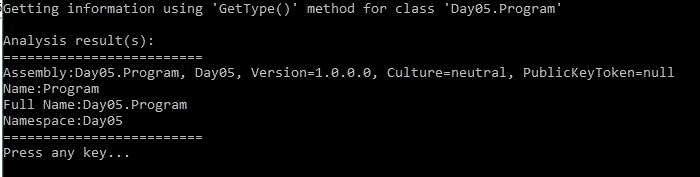
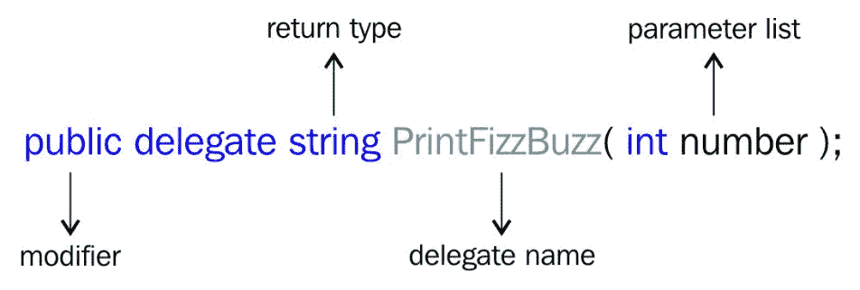
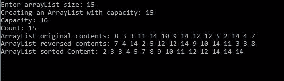
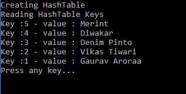

# 第 5 天-反思和收藏概述

今天是我们七天学习系列的第五天。到目前为止，我们已经对 C# 语言进行了各种各样的深入研究，并且已经了解了如何处理语句、循环、方法等等。今天，我们将学习在编写代码时动态工作的最佳方式。

我们有很多方法可以动态实现代码更改并生成整个编程类。今天，我们将讨论以下主题:

*   什么是反思？
*   代表和活动概述
*   集合和非泛型

# 什么是反思？

简单来说，反射是进入程序内部的一种方式，收集程序/代码的对象信息和/或在运行时调用这些信息。因此，在反射的帮助下，我们可以通过用 C# 编写代码来分析和评估我们的代码。要详细了解反射，我们以`class` `OddEven`为例。下面是这个类的部分代码:

```cs
public class OddEven
{
   public string PrintOddEven(int startNumber, int
   lastNumber)
   {
     return GetOddEvenWithinRange(startNumber,
     lastNumber);
   }
   public string PrintSingleOddEven(int number) => CheckSingleNumberOddEvenPrimeResult(number);
   private string CheckSingleNumberOddEvenPrimeResult(int
   number)
   {
      var result = string.Empty;
      result = CheckSingleNumberOddEvenPrimeResult(result,
      number);
      return result;
   }
   //Rest code is omitted
}
```

看完代码后，我们可以说这段代码有几个公共方法和私有方法。公共方法利用私有方法来满足各种功能需求，并执行任务来解决现实世界中的问题，在现实世界中，我们需要识别奇数或偶数。

当我们需要利用前面的类时，我们必须实例化这个类，然后调用它们的方法来获得结果。下面是我们如何利用这个简单的类来获得结果:

```cs
class Program
{
   static void Main(string[] args)
   {
      int userInput;
      do
      {
         userInput = DisplayMenu();
         switch (userInput)
         {
            case 1:
            Console.Clear();
            Console.Write("Enter number: ");
            var number = Console.ReadLine();
            var objectOddEven = new OddEven();
            var result =           
            objectOddEven.PrintSingleOddEven
            (Convert.ToInt32(number));
            Console.WriteLine
            ($"Number:{number} is {result}");
            PressAnyKey();
            break;
            //Rest code is omitted
         } while (userInput != 3);
       }
    //Rest code is ommitted
}
```

在前面的代码片段中，我们只是以单个数字的形式接受用户的输入，然后创建我们类的一个对象，因此我们可以调用方法`PrintSingleOddEven`来检查输入的数字是奇数还是偶数。下面的截图显示了我们实现的输出:


前面的代码展示了一种实现代码的方法。同样，我们可以使用相同的解决方案，但通过分析代码来实现这一点。我们已经说过反射是分析代码的一种方式。在接下来的部分中，我们将实现并讨论类似实现的代码，但是使用反射。

You need to add the following NuGet package to work with reflection, using the Package Manager Console: install-`Package System.Reflection`.

在下面的代码片段中，我们将实现我们在前面的代码片段中所做的事情，但是这里我们将使用`Reflection`来解决相同的问题并获得相同的结果:

```cs
class Program
{
   private static void Main(string[] args)
   {
      int userInput;
      do
      {
         userInput = DisplayMenu();
         switch (userInput)
         {
            //Code omitted
            case 2:
            Console.Clear();
            Console.Write("Enter number: ");
            var num = Console.ReadLine();
            Object objInstance = 
            Activator.CreateInstance(typeof(OddEven));
            MethodInfo method = 
            typeof(OddEven).GetMethod
            ("PrintSingleOddEven");
            object res = method.Invoke
            (objInstance, new object[] 
            { Convert.ToInt32(num) });
            Console.WriteLine($"Number:{num} is {res}");
            PressAnyKey();
            break;
         }
      } while (userInput != 3);
    }
   //code omitted
}
```

前面的代码片段很容易定义:在这里，我们使用`System.Reflection`获得`MethodInfo`，然后通过传递所需的参数来调用该方法。前面的例子是展示`Reflection`力量的最简单的例子；借助`Reflection`我们可以做更多的事情。

在前面的代码中，代替`Activator.CreateInstance(typeof(OddEven))`，我们也可以使用`Assembly.CreateInstance("OddEven")`。`Assembly.CreateInstance`查看装配类型，并使用`Activator.CreateInstance`创建实例。关于`Assembly``CreateInstance`的更多信息，请参考:[https://docs . Microsoft . com/en-us/dotnet/API/system . reflection . assembly . create instance？view = netstandard-2.0 # System _ Reflection _ Assembly _ CreateInstance _ System _ String _](https://docs.microsoft.com/en-us/dotnet/api/system.reflection.assembly.createinstance?view=netstandard-2.0# System_Reflection_Assembly_CreateInstance_System_String_)。

下面是前面代码的输出:


# 使用中的反射

在前一节中，我们了解了反射以及如何利用`Reflection`的力量来分析代码。在本节中，我们将看到更复杂的场景，在这些场景中，我们可以使用`Reflection`并更详细地讨论`System.Type`和`System.Reflection`。

# 获取类型信息

有一个`System.Type`类可以使用，它为我们提供了关于我们的对象类型的完整信息:我们可以使用`typeof`来获取关于我们的类的所有信息。让我们看看下面的代码片段:

```cs
class Program
{
   private static void Main(string[] args)
   {
      int userInput;
      do
      {
         userInput = DisplayMenu();
         switch (userInput)
         {
            // code omitted
            case 3:
            Console.Clear();
            Console.WriteLine
            ("Getting information using 'typeof' operator
            for class 'Day05.Program");
            var typeInfo = typeof(Program);
            Console.WriteLine();
            Console.WriteLine("Analysis result(s):");
            Console.WriteLine
            ("=========================");
            Console.WriteLine($"Assembly:
            {typeInfo.AssemblyQualifiedName}");
            Console.WriteLine($"Name:{typeInfo.Name}");
            Console.WriteLine($"Full Name:
            {typeInfo.FullName}");
            Console.WriteLine($"Namespace:
            {typeInfo.Namespace}");
            Console.WriteLine
            ("=========================");
            PressAnyKey();
            break;
            code omitted
          }
       } while (userInput != 5);
   }
      //code omitted
}
```

在前面的代码片段中，我们使用`typeof`来收集我们的`class` `Program`的信息。`typeof`运算符在这里表示类型声明；在我们的例子中，它是一个类型声明`class` `Program`。下面是前面代码的结果:


在同一个节点上，我们可以有`System.Type`类的方法`GetType()`，它获取类型并提供信息。让我们分析和讨论以下代码片段:

```cs
internal class Program
{
   private static void Main(string[] args)
   {
      int userInput;
      do
      {
         userInput = DisplayMenu();
         switch (userInput)
         {
            //code omitted
            case 4:
            Console.Clear();
            Console.WriteLine("Getting information using 
            'GetType()' method for class
            'Day05.Program'");
            var info = Type.GetType("Day05.Program");
            Console.WriteLine();
            Console.WriteLine("Analysis result(s):");
            Console.WriteLine
            ("=========================");
            Console.WriteLine($"Assembly:
            {info.AssemblyQualifiedName}");
            Console.WriteLine($"Name:{info.Name}");
            Console.WriteLine($"Full Name:
            {info.FullName}");
            Console.WriteLine($"Namespace: 
            {info.Namespace}");
            Console.WriteLine
            ("=========================");
            PressAnyKey();
            break;
         }
      } while (userInput != 5);
   }
 //code omitted
}
```

在前面的代码片段中，我们使用`GetMethod()`收集了`class` `Program`的所有信息，结果如下:



前面几节中讨论的代码片段有一个表示类`System.Type`的类型，然后我们使用属性收集信息。下表解释了这些属性:

| **物业名称** | **描述** |
| **名称** | 返回类型的名称，例如`Program` |
| **全称** | 返回不带程序集名称的类型的完全限定名，例如`Day05.Program` |
| **命名空间** | 返回类型的命名空间，例如`Day05`。如果没有命名空间，此属性将返回 null |

这些属性是只读的(属于抽象类`System.Type`类)；这意味着我们只能读取或获得结果，但它们不允许我们设置值。

The `System.Reflection.TypeExtensions` class has everything we need to analyse and write code dynamically. The complete source code is available at [https://github.com/dotnet/corefx/blob/master/src/System.Reflection.TypeExtensions/src/System/Reflection/TypeExtensions.cs](https://github.com/dotnet/corefx/blob/master/src/System.Reflection.TypeExtensions/src/System/Reflection/TypeExtensions.cs).

所有扩展方法的实现都超出了本书的范围，因此我们添加了下表，它代表了重要扩展方法的所有细节:

| **方法名称** | **描述** | **来源(**T2】https://github . com/dotnet/corefx/blob/master/src |
| `GetConstructor(Type type, Type[] types)` | 对提供的类型执行并返回类型`System.Reflection. ConstructorInfo`的输出 | `/System.Reflection.Emit/ref/System.Reflection.Emit.cs` |
| `ConstructorInfo[] GetConstructors(Type type)` | 返回`System.Reflection. ConstructorInfo`提供的类型和数组输出的所有构造函数信息 | `/System.Reflection.Emit/ref/System.Reflection.Emit.cs` |
| `ConstructorInfo[] GetConstructors(Type type, BindingFlags bindingAttr)` | 返回所提供类型和属性的所有构造函数信息 | `/System.Reflection.Emit/ref/System.Reflection.Emit.cs` |
| `MemberInfo[] GetDefaultMembers(Type type)` | 获取对提供的属性、成员、给定类型和数组输出的访问权`System.Reflection. MemberInfo` | `/System.Reflection.Emit/ref/System.Reflection.Emit.cs` |
| `EventInfo` `GetEvent(Type type, string name)` | 提供对`System.Reflection. MemberInfo`的事件元数据输出的访问 | `/System.Reflection.Emit/ref/System.Reflection.Emit.cs` |
| `FieldInfo GetField(Type type, string name)` | 获取指定类型的字段信息，对于提供的字段名，返回`System.Reflection. FieldInfo`输出 | `/System.Reflection.Emit/ref/System.Reflection.Emit.cs` |
| `MemberInfo[] GetMember(Type type, string name)` | 使用成员名称获取指定类型的成员信息，此方法输出一个`System.Reflection. MemberInfo`数组 | `/System.Reflection.Emit/ref/System.Reflection.Emit.cs` |
| `PropertyInfo[] GetProperties(Type type)` | 提供指定类型的所有属性，并以`System.Reflection. PropertyInfo`数组的形式输出 | `/System.Reflection.Emit/ref/System.Reflection.Emit.cs` |

Try implementing all extension methods using a simple program.

在前几节中，我们学习了如何使用`Reflection`分析我们编译的代码/应用。`Reflection`在我们有现有代码的情况下工作正常。想象一个场景，我们需要一些动态代码生成逻辑。假设我们需要生成一个简单的类，如下面的代码片段所述:

```cs
public class MathClass
{
   private readonly int _num1;
   private readonly int _num2;
   public MathClass(int num1, int num2)
   {
      _num1 = num1;
      _num2 = num2;
   }
     public int Sum() => _num1 + _num2;
     public int Substract() => _num1 - _num2;
     public int Division() => _num1 / _num2;
     public int Mod() => _num1 % _num2;
}
```

仅仅使用`Reflection`是不可能创建或编写纯动态代码或动态代码的。借助`Reflection`，我们可以分析我们的`MathClass`，但是我们可以使用`Reflection.Emit`动态创建这个类。

Dynamic code generation is beyond the scope of this book. You can refer to the following thread for more information: [https://stackoverflow.com/questions/41784393/how-to-emit-a-type-in-net-core](https://stackoverflow.com/questions/41784393/how-to-emit-a-type-in-net-core)

# 代表和活动概述

在本节中，我们将讨论委托和事件的基础。委托和事件都是 C# 语言最高级的特性。我们将在接下来的章节中详细了解这些内容。

# 代表

在 C# 中，委托是指向函数的指针的类似概念，就像在 C 和 C++中一样。委托只不过是一个引用类型的变量，它保存一个方法的引用，并且这个方法被触发。

We can achieve late binding using delegates. In [Chapter 7](7.html# 72V5S0-cd07d0bec7404d1cb3fdb41e48e5618f), *Understanding Object Oriented Programing with C#*, we will discuss late binding in detail.

`System.Delegate`是派生所有委托的类。我们使用委托来实现事件。

# 声明委托类型

声明委托类型类似于方法签名类。我们只需要声明一个类型公共委托字符串:`PrintFizzBuzz(int number);`。在前面的代码中，我们声明了一个委托类型。此声明类似于抽象方法，区别在于委托声明具有类型委托。我们刚刚声明了一个委托类型`PrintFizzBuzz`，它接受 int 类型的一个参数并返回字符串的结果。我们只能声明公共或内部可访问的委托。

Accessibility of delegates is internal by default.



在上图中，我们可以分析委托声明的语法。如果我们看到这个图，我们会注意到它以 public 开始，然后是关键字 delegate，它告诉我们这是一个委托类型，字符串是一个返回类型，我们的语法以 name 和传递参数结束。下表定义了该声明的主要部分:

| **语法部分** | **描述** |
| 修饰语 | 修饰符是委托类型的定义的可访问性。这些修饰符只能是公共的或内部的，默认情况下，委托类型修饰符是内部的。 |
| 返回类型 | 委托可以或不能返回结果；它可以是任何类型或空的。 |
| 名字 | 声明的委托的名称。委托类型的名称遵循与典型类相同的规则，如第二天所讨论的。 |
| 参数列表 | 典型参数表；参数可以是任何类型。 |

# 委托的实例

在上一节中，我们创建了一个名为`PrintFizzBuzz`的委托类型。现在我们需要声明一个这种类型的实例，这样我们就可以在代码中使用它。这类似于我们声明变量的方式——请参考第二天了解更多关于变量声明的信息。下面的代码片段告诉我们如何声明委托类型的实例:

`PrintFizzBuzz printFizzBuzz;`

# 正在使用的委托

我们可以通过调用匹配的方法直接使用委托类型，这意味着委托类型调用相关的方法。在下面的代码片段中，我们只是调用了一个方法:

```cs
internal class Program
{
   private static PrintFizzBuzz _printFizzBuzz;
   private static void Main(string[] args)
   {
      int userInput;
      do
      {
         userInput = DisplayMenu();
         switch (userInput)
         {
            //code omitted
            case 6:
            Clear();
            Write("Enter number: ");
            var inputNum = ReadLine();
            _printFizzBuzz = FizzBuzz.PrintFizzBuzz;
            WriteLine($"Entered number:{inputNum} is
            {_printFizzBuzz(Convert.ToInt32(inputNum))}");
            PressAnyKey();
            break;
         }
      } while (userInput != 7);
   }
```

在前一节编写的代码片段中，我们从用户那里获取输入，然后在委托的帮助下，我们得到了预期的结果。下面的屏幕截图显示了前面代码的完整输出:


More advanced delegates, namely multicast, and strongly typed delegates will be discussed on day six.

# 事件

一般来说，每当事件进入画面时，我们可以为用户考虑一个动作或用户动作。有几个来自我们日常生活的例子；也就是说，我们检查我们的电子邮件，发送电子邮件，等等。从我们的电子邮件客户端点击发送按钮或接收按钮之类的动作只不过是事件。

事件是类型的成员，而此类型是委托类型。这些成员在引发时通知其他类型。

事件使用发布者-订阅者模型。发布者只不过是一个定义了事件和委托的对象。另一方面，订阅者是接受事件并提供事件处理程序的对象(事件处理程序只不过是由发布者类中的委托调用的方法)。

# 声明事件

在我们声明一个事件之前，我们应该有一个委托类型，所以我们应该首先声明一个委托。下面的代码片段显示了委托类型:

```cs
public delegate string FizzBuzzDelegate(int num);
The following code snippet shows event declaration:
public event FizzBuzzDelegate FizzBuzzEvent;
The following code snippet shows a complete implementation of an event to find FizzBuzz numbers:
public delegate string FizzBuzzDelegate(int num);
public class FizzBuzzImpl
{
   public FizzBuzzImpl()
   {
      FizzBuzzEvent += PrintFizzBuzz;
   }
      public event FizzBuzzDelegate FizzBuzzEvent;
      private string PrintFizzBuzz(int num) => FizzBuzz.PrintFizzBuzz(num);
      public string EventImplementation(int num)
   {
      var fizzBuzImpl = new FizzBuzzImpl();
      return fizzBuzImpl.FizzBuzzEvent(num);
   }
}
```

上一节中编写的代码片段定义了事件如何在内部调用委托类型的附加方法。这里，我们有一个名为`FizzBuzzEvent`的事件，它被附加到一个名为`FizzBuzzDelegate`的委托类型上，该委托类型在名为`FizzBuzzImpl`的类的实例化中调用了一个方法`PrintFizzBuzz`。因此，每当我们调用我们的事件`FizzBuzzEvent`，它会自动调用一个方法`PrintFizzBuzz`，并返回预期的结果:


# 集合和非泛型

在第二天，我们学习了固定大小的数组，您可以将这些数组用于强类型列表对象。但是，如果我们想使用这些对象或将它们组织成其他数据结构，如队列、列表、堆栈等，该怎么办呢？所有这些我们都可以通过使用集合(`System.Collections`)来实现。

有各种方法可以利用集合来处理数据(存储和检索)。以下是我们可以使用的主要集合类。

`System.Collections.NonGeneric` ([https://www.nuget.org/packages/System.Collections.NonGeneric/](https://www.nuget.org/packages/System.Collections.NonGeneric/) ) is a NuGet package which provides all non-generic types, namely `ArrayList`, `HashTable`, `Stack`, `SortedList`, `Queue`, and so on.

# 数组列表

因为它是一个数组，所以它包含一个对象的有序集合，并且可以单独索引。由于这是一个非泛型类，它可以从`System.Collections.NonGeneric`单独的 NuGet 包中获得。要使用示例代码，您应该首先安装这个 NuGet 包。

# 数组列表的声明

声明部分非常简单:您可以将其定义为`ArrayList`类型的变量。下面的代码片段展示了我们如何声明`ArrayList`:

```cs
ArrayList arrayList = new ArrayList();
ArrayList arrayList1 = new ArrayList(capacity);
ArrayList arrayList2 = new ArrayList(collection);
```

在前面的代码片段中，`arrayList`是使用默认构造函数初始化的。`arrayList1`针对特定的初始容量进行初始化。`arrayList2`使用另一个集合的元素初始化。

`ArrayList`属性和方法对于在集合中添加、存储或移除数据项非常重要。`ArrayList`类有许多可用的属性和方法。在接下来的章节中，我们将讨论常用的方法和属性。

# 性能

在分析现有的`ArrayList`时，`ArrayList`的属性起着至关重要的作用；以下是常用的属性:

| **属性** | **描述** |
| `Capacity` | getter setter 属性；利用这个，我们可以设置或得到`ArrayList`的元素个数。例如:

```cs
ArrayList arrayList = new ArrayList {Capacity = 50};
```

 |
| `Count` | `ArrayList`包含的实际元素总数。请注意，该计数可能与容量不同。例如:

```cs
ArrayList arrayList = new ArrayList {Capacity = 50};
var numRandom = new Random(50);
for (var countIndex = 0; countIndex < 50; countIndex++)
arrayList.Add(numRandom.Next(50));
```

 |
| `IsFixedSize` | getter 属性根据`ArrayList`是否为固定大小返回真/假。例如:

```cs
ArrayList arrayList = new ArrayList();
var arrayListIsFixedSize = arrayList.IsFixedSize;
```

 |

# 方法

正如我们在上一节中所讨论的，属性在我们使用`ArrayList`时起着重要的作用。在同一个节点中，方法为我们提供了一种在处理非泛型集合时添加、移除或执行其他操作的方法:

| **方法** | **描述** |
| `Add (object value)` | 在`ArrayList`的末尾添加一个对象。例如:

```cs
ArrayList arrayList = new ArrayList {Capacity = 50};
var numRandom = new Random(50);
for (var countIndex = 0; countIndex < 50; countIndex++)
arrayList.Add(numRandom.Next(50));
```

 |
| `Void Clear()` | 从`ArrayList`中移除所有元素。例如:

```cs
arrayList.Clear();
```

 |
| `Void Remove(object obj)` | 移除集合中第一个出现的元素。例如:

```cs
arrayList.Remove(15);
```

 |
| `Void Sort()` | 对`ArrayList`中的所有元素进行排序 |

以下代码片段是显示`ArrayList`的完整示例:

```cs
public void ArrayListExample(int count)
{
var arrayList = new ArrayList();
var numRandom = new Random(count);
WriteLine($"Creating an ArrayList with capacity: {count}");
for (var countIndex = 0; countIndex < count; countIndex++)
arrayList.Add(numRandom.Next(count));
WriteLine($"Capacity: {arrayList.Capacity}");
WriteLine($"Count: {arrayList.Count}");
Write("ArrayList original contents: ");
PrintArrayListContents(arrayList);
WriteLine();
arrayList.Reverse();
Write("ArrayList reversed contents: ");
PrintArrayListContents(arrayList);
WriteLine();
Write("ArrayList sorted Content: ");
arrayList.Sort();
PrintArrayListContents(arrayList);
WriteLine();
ReadKey();
}
```

以下是前面程序的输出:



You will learn all advanced concepts of collections and generics on day six.

# 散列表

非泛型类型`hashTable`类只不过是键/值对集合的表示，并且是基于一个键来组织的，这个键只不过是一个哈希代码。当我们需要基于密钥访问数据时，使用`hashTable`是明智的。

# 哈希表的声明

`Hashtable`可以通过初始化`Hashtable`类来声明；下面的代码片段显示了相同的内容:

```cs
Hashtable hashtable = new Hashtable();
```

接下来我们将讨论`HashTable`的常用方法和性质。

# 性能

`hashTable`的属性在分析现有的`HashTable`时起着至关重要的作用；以下是常用的属性:

| **属性** | **描述** |
| `Count` | 吸气性能；返回`HashTable`中键/值对的数量。例如:

```cs
var hashtable = new Hashtable
{
{1, "Gaurav Aroraa"},
{2, "Vikas Tiwari"},
{3, "Denim Pinto"},
{4, "Diwakar"},
{5, "Merint"}
};
var count = hashtable.Count;
```

 |
| `IsFixedSize` | 吸气性能；根据`HashTable`是否为固定大小返回真/假。例如:

```cs
var hashtable = new Hashtable
{
{1, "Gaurav Aroraa"},
{2, "Vikas Tiwari"},
{3, "Denim Pinto"},
{4, "Diwakar"},
{5, "Merint"}
};
var fixedSize = hashtable.IsFixedSize ? " fixed size." : " not fixed size.";
WriteLine($"HashTable is {fixedSize} .");
```

 |
| `IsReadOnly` | 吸气性能；告诉我们`Hashtable`是否为只读。例如:

```cs
WriteLine($"HashTable is ReadOnly : {hashtable.IsReadOnly} ");
```

 |

# 方法

`HashTable`的方法通过提供更多的操作提供了一种添加、移除和分析集合的方法，如下表所述:

| **方法** | **描述** |
| `Add (object key, object value)` | 向`HashTable`添加特定键和值的元素。例如:

```cs
var hashtable = new Hashtable
hashtable.Add(11,"Rama");
```

 |
| `Void Clear()` | 从`HashTable`中移除所有元素。例如:

```cs
hashtable.Clear();
```

 |
| `Void Remove (object key)` | 从哈希表中移除指定键的元素。例如:

```cs
hashtable.Remove(15);
```

 |

在下一节中，我们将使用一个代码片段实现一个简单的`HashTable`，在这里我们将创建一个`HashTable`集合，并尝试重申它的键:

```cs
public void HashTableExample()
{
   WriteLine("Creating HashTable");
   var hashtable = new Hashtable
   {
      {1, "Gaurav Aroraa"},
      {2, "Vikas Tiwari"},
      {3, "Denim Pinto"},
      {4, "Diwakar"},
      {5, "Merint"}
   };
      WriteLine("Reading HashTable Keys");
      foreach (var hashtableKey in hashtable.Keys)
   {
      WriteLine($"Key :{hashtableKey} - value :
      {hashtable[hashtableKey]}");
   }
}
```

以下是前面代码的输出:



# 出去！出去

非泛型类型`SortedList`类只不过是键/值对集合的表示，基于键组织，并按键排序。`SortedList`是`ArrayList`和`HashTable`的组合。因此，我们可以通过键或索引来访问元素。

# 排序列表的声明

`SortedList`可以通过初始化`SortedList`类来声明；下面的代码片段显示了相同的内容:

```cs
SortedList sortedList = new SortedList();
```

接下来我们将讨论`SortedList`的常用方法和性质。

# 性能

`SortedList`的属性在分析现有的`SortedList`时起着至关重要的作用；以下是常用的属性:

| **属性** | **描述** |
| `Capacity` | getter setter 属性；利用这个，我们可以设置或得到`SortedList`的容量。例如:

```cs
var sortedList = new SortedList
{
{1, "Gaurav Aroraa"},
{2, "Vikas Tiwari"},
{3, "Denim Pinto"},
{4, "Diwakar"},
{5, "Merint"},
{11, "Rama"}
};
WriteLine($"Capacity: {sortedList.Capacity}");
```

 |
| `Count` | 吸气性能；返回`HashTable`中键/值对的数量。例如:

```cs
var sortedList = new SortedList
{
{1, "Gaurav Aroraa"},
{2, "Vikas Tiwari"},
{3, "Denim Pinto"},
{4, "Diwakar"},
{5, "Merint"},
{11, "Rama"}
};
WriteLine($"Capacity: {sortedList.Count}");
```

 |
| `IsFixedSize` | 吸气性能；根据`SortedList`是否为固定大小返回真/假。例如:

```cs
var sortedList = new SortedList
{
{1, "Gaurav Aroraa"},
{2, "Vikas Tiwari"},
{3, "Denim Pinto"},
{4, "Diwakar"},
{5, "Merint"},
{11, "Rama"}
};
ar fixedSize = sortedList.IsFixedSize ? " fixed size." : " not fixed size.";
WriteLine($"SortedList is {fixedSize} .");
```

 |
| `IsReadOnly` | 吸气性能；告诉我们`SortedList`是否为只读。例如:

```cs
WriteLine($"SortedList is ReadOnly : {sortedList.IsReadOnly} ");
```

 |

# 方法

以下是常用的方法:

| **方法** | **描述** |
| `Add (object key, object value)` | 向`SortedList`添加特定键和值的元素。例如:

```cs
var sortedList = new SortedList
sortedList.Add(11,"Rama");
```

 |
| `Void Clear()` | 从`SortedList`中移除所有元素。例如:

```cs
sortedList.Clear();
```

 |
| `Void Remove (object key)` | 从`SortedList`中移除指定键的元素。例如:

```cs
sortedList.Remove(15);
```

 |

在下一节中，我们将使用前面几节中提到的属性和方法来实现代码。让我们用`SortedList`收集 7 天内学习 C# 这本书的所有利益相关者列表:

```cs
public void SortedListExample()
{
   WriteLine("Creating SortedList");
   var sortedList = new SortedList
   {
      {1, "Gaurav Aroraa"},
      {2, "Vikas Tiwari"},
      {3, "Denim Pinto"},
      {4, "Diwakar"},
      {5, "Merint"},
      {11, "Rama"}
   };
   WriteLine("Reading SortedList Keys");
   WriteLine($"Capacity: {sortedList.Capacity}");
   WriteLine($"Count: {sortedList.Count}");
   var fixedSize = sortedList.IsFixedSize ? " fixed
   size." :" not fixed size.";
   WriteLine($"SortedList is {fixedSize} .");
   WriteLine($"SortedList is ReadOnly :
   {sortedList.IsReadOnly} ");
   foreach (var key in sortedList.Keys)
   {
      WriteLine($"Key :{key} - value :
      {sortedList[key]}");
   }
}
```

以下是前面代码的输出:


# 堆

一个非泛型类型，它表示一个集合，作为对象的最后一个入，先出(LIFO) 。它包含两个主要的东西:`Push`和`Pop`。每当我们在列表中插入一个项目时，它被称为推送，当我们从列表中提取/移除一个项目时，它被称为弹出。当我们获得一个对象而没有从列表中移除该项目时，这被称为窥视。

# 堆栈声明

`Stack`的声明与我们声明其他非泛型类型的方式非常相似。下面的代码片段显示了相同的内容:

```cs
Stack stackList = new Stack();
```

我们将讨论`Stack`的常用方法和性质。

# 性能

`Stack`类只有一个属性，它告诉计数:

| **属性** | **描述** |
| `Count` | 吸气性能；返回堆栈包含的元素数量。例如:

```cs
var stackList = new Stack();
stackList.Push("Gaurav Aroraa");
stackList.Push("Vikas Tiwari");
stackList.Push("Denim Pinto");
stackList.Push("Diwakar");
stackList.Push("Merint");
WriteLine($"Count: {stackList.Count}");
```

 |

# 方法

以下是常用的方法:

| **方法** | **描述** |
| `Object Peek()` | 返回堆栈顶部的对象，但不移除它。例如:

```cs
WriteLine($"Next value without removing:{stackList.Peek()}");
```

 |
| `Object Pop()` | 移除并返回堆栈顶部的对象。例如:

```cs
WriteLine($"Remove item: {stackList.Pop()}");
```

 |
| `Void Push(object obj)` | 在堆栈顶部插入一个对象。例如:

```cs
WriteLine("Adding more items.");
stackList.Push("Rama");
stackList.Push("Shama");
```

 |
| `Void Clear()` | 从堆栈中移除所有元素。例如:

```cs
var stackList = new Stack();
stackList.Push("Gaurav Aroraa");
stackList.Push("Vikas Tiwari");
stackList.Push("Denim Pinto");
stackList.Push("Diwakar");
stackList.Push("Merint");
stackList.Clear();
```

 |

以下是堆栈的完整示例:

```cs
public void StackExample()
{
   WriteLine("Creating Stack");
   var stackList = new Stack();
   stackList.Push("Gaurav Aroraa");
   stackList.Push("Vikas Tiwari");
   stackList.Push("Denim Pinto");
   stackList.Push("Diwakar");
   stackList.Push("Merint");
   WriteLine("Reading stack items");
   ReadingStack(stackList);
   WriteLine();
   WriteLine($"Count: {stackList.Count}");
   WriteLine("Adding more items.");
   stackList.Push("Rama");
   stackList.Push("Shama");
   WriteLine();
   WriteLine($"Count: {stackList.Count}");
   WriteLine($"Next value without removing:
   {stackList.Peek()}");
   WriteLine();
   WriteLine("Reading stack items.");
   ReadingStack(stackList);
   WriteLine();
   WriteLine("Remove value");
   stackList.Pop();
   WriteLine();
   WriteLine("Reading stack items after removing an
   item.");
   ReadingStack(stackList);
   ReadLine();
}
```

前面的代码为《用 7 天学习 C# 的书》`Stack`捕获了一个利益相关者列表，并展示了前面章节中讨论的属性和方法的用法。这段代码产生了如下截图所示的输出:


# 长队

队列只是一个非泛型类型，代表一个对象的先进先出集合。`queue`主要有两个动作:增加一个项目的时候叫入队，去掉一个项目的时候叫`dequeue`。

# 队列声明

`Queue`的声明与我们声明其他非泛型类型的方式非常相似。下面的代码片段显示了相同的内容:

```cs
Queue queue = new Queue();
```

接下来我们将讨论`Queue`的常用方法和性质。

# 性能

`Queue`类只有一个属性，它告诉计数:

| **属性** | **描述** |
| `Count` | 吸气性能；返回包含的元素数量`queue`。例如:

```cs
Queue queue = new Queue();
queue.Enqueue("Gaurav Aroraa");
queue.Enqueue("Vikas Tiwari");
queue.Enqueue("Denim Pinto");
queue.Enqueue("Diwakar");
queue.Enqueue("Merint");
WriteLine($"Count: {queue.Count}");
```

 |

# 方法

以下是常用的方法:

| **方法** | **描述** |
| `Object Peek()` | 返回`queue`顶部的对象，但不移除它。例如:

```cs
WriteLine($"Next value without removing:{stackList.Peek()}");
```

 |
| `Object Dequeue()` | 移除并返回`queue`开头的对象。例如:

```cs
WriteLine($"Remove item: {queue.Dequeue()}");
```

 |
| `Void Enqueue (object obj)` | 在`queue`的末尾插入一个对象。例如:

```cs
WriteLine("Adding more items.");
queue.Enqueue("Rama");
```

 |
| `Void Clear()` | 从`Queue`中移除所有元素。例如:

```cs
Queue queue = new Queue();
queue.Enqueue("Gaurav Aroraa");
queue.Enqueue("Vikas Tiwari");
queue.Enqueue("Denim Pinto");
queue.Enqueue("Diwakar");
queue.Enqueue("Merint");
queue.Clear();
```

 |

前面几节讨论了属性和方法。现在是时候在现实世界中实现这些属性和方法了。让我们创建一个包含股东姓名的`queue`在 7 天内学习 C# 这本书*。下面的代码片段使用`Enqueue`和`Dequeue`方法从使用`queue`存储的集合中添加和移除项目:*

```cs
public void QueueExample()
{
   WriteLine("Creating Queue");
   var queue = new Queue();
   queue.Enqueue("Gaurav Aroraa");
   queue.Enqueue("Vikas Tiwari");
   queue.Enqueue("Denim Pinto");
   queue.Enqueue("Diwakar");
   queue.Enqueue("Merint");
   WriteLine("Reading Queue items");
   ReadingQueue(queue);
   WriteLine();
   WriteLine($"Count: {queue.Count}");
   WriteLine("Adding more items.");
   queue.Enqueue("Rama");
   queue.Enqueue("Shama");
   WriteLine();
   WriteLine($"Count: {queue.Count}");
   WriteLine($"Next value without removing:
   {queue.Peek()}");
   WriteLine();
   WriteLine("Reading queue items.");
   ReadingQueue(queue);
   WriteLine();
   WriteLine($"Remove item: {queue.Dequeue()}");
   WriteLine();
   WriteLine("Reading queue items after removing an
   item.");
   ReadingQueue(queue);
}
```

以下是前面代码的输出:


# 位数组

BitArray 只不过是一个管理位值数组的数组。这些值表示为布尔值。真表示位为*开* (1)，假表示位为*关* (0)。当我们需要存储位时，这个非泛型集合类很重要。

BitArray 的实现并不包括在内。请参考本章末尾的练习来实现 BitArray。

We have discussed non-generic collections in this chapter. Generic collections are beyond the scope of this chapter; we will cover them on day six. To compare different collections, refer to [https://www.codeproject.com/Articles/832189/List-vs-IEnumerable-vs-IQueryable-vs-ICollection-v](https://www.codeproject.com/Articles/832189/List-vs-IEnumerable-vs-IQueryable-vs-ICollection-v).

# 动手练习

解决以下问题，这些问题涵盖了今天学习的概念:

1.  什么是反思？写一个短程序使用`System.Type`。
2.  创建至少包含三个属性、两个构造函数、两个公共方法和三个私有方法的类，并实现至少一个接口。
3.  使用`System.Reflection.Extensins`编写一个程序来评估问题二中创建的类。
4.  研究 NuGet 包`System.Reflection.TypeExtensions`并通过实现它的所有特性来编写一个程序。
5.  研究 NuGet 包`System.Reflection. Primitives`并通过实现它的所有特性来编写一个程序。
6.  什么是委托类型，如何定义多播委托？
7.  什么是事件？事件是如何基于发布者-订阅者模型的？用一个真实的例子来展示这一点。
8.  使用委托和事件编写一个程序，得到类似于[https://github.com/garora/TDD-Katas# string-sum-kata](https://github.com/garora/TDD-Katas# string-sum-kata)的输出。
9.  定义集合并实现非泛型类型。

Refer to our problem from day one, the vowel count problem, and implement this using all non-generic collection types.

# 重游第五天

今天，我们讨论了非常重要的 C# 概念，包括反射、集合、委托和事件。

我们讨论了反射在代码分析方法中的重要性。在讨论中，我们实现了展示反射能力的代码，在这里我们分析了完整的代码。

然后我们讨论了委托和事件，以及委托和事件如何在 C# 中工作。我们还实施了代表和活动。

我们详细讨论的 C# 语言的一个重要且关键的特性是非泛型类型，即`ArrayList`、`HashTable`、`SortedList`、`Queue`、`Stack`等等。我们使用 C# 7.0 代码实现了所有这些。*