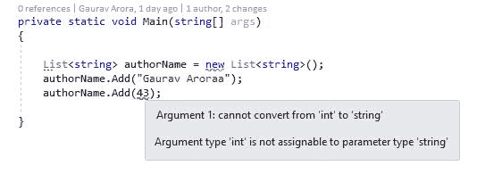
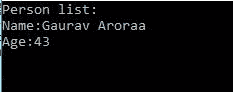
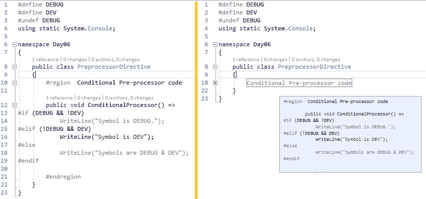
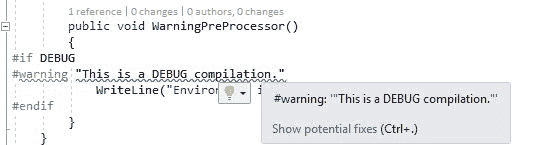
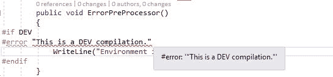

# 第 6 天-深度潜水和高级概念

今天是我们七天学习系列的第六天。在第五天，我们讨论了 C# 语言的重要概念，并经历了反射、集合、委托和事件。我们使用代码片段探索了这些概念，其中我们讨论了非泛型集合。今天，我们将讨论使用泛型类型的集合的主要功能，然后，我们将讨论预处理器指令和属性。

我们将在本章中讨论以下主题:

*   玩转集合和泛型
*   使用属性美化代码
*   利用预处理器指令
*   从 LINQ 开始
*   编写不安全的代码
*   编写异步代码
*   重温第六天
*   动手练习

# 玩转集合和泛型

收藏对我们来说并不新鲜，因为我们在第五天已经讨论了非通用的收藏。所以，我们也有通用系列。在本节中，我们将使用代码示例来讨论集合和泛型。

# 了解集合类及其用法

正如第五天所讨论的，收集类是专门的类，用于数据交互(存储和检索)。我们已经讨论了各种集合类，即
堆栈、队列、列表和哈希表，并且我们已经使用`System.Collections.NonGeneric`命名空间编写了代码。下表概述了非泛型集合类的用法和含义:

| **属性** | **描述** | 用法 |
| `ArrayList` | 该名称本身描述了它包含一个有序集合的集合，可以使用索引访问该集合。我们可以声明`ArrayList`如下:
`ArrayList arrayList = new ArrayList();` | 第二天，我们讨论了数组，并讨论了如何访问数组的各个元素。在`ArrayList`的情况下，我们可以获得添加或移除集合元素的各种方法的好处，如第五天所讨论的。 |
| `HashTable` | `HashTable`只不过是一个键值对集合的表示，并且是基于一个键来组织的，这个键只不过是一个
哈希代码。当我们需要基于密钥访问数据时，使用`HashTable`是明智的。我们可以声明`HashTable`如下:
`Hashtable hashtable = new Hashtable();` | `HashTable`在我们需要使用一个键访问元素时非常有用。在这种情况下，我们有一个键，需要在一个键的基础上找到集合中的值。 |
| `SortedList` | `SortedList`类只不过是一个键值对集合的表示，基于一个键进行组织，并按键进行排序。`SortedList`类是`ArrayList`和`HashTable`的组合。因此，我们可以使用键或索引来访问元素。我们可以声明`SortedList`如下:
`SortedList sortedList = new SortedList();` | 如上所述，排序列表是数组和哈希表的组合。可以使用键或索引来访问项。这是使用索引访问项目时的`ArrayList`；另一方面，当使用哈希键访问项目时，就是`HashTable`。`SortedList`最主要的是项目集合总是按照键值排序。 |
| `Stack` | 堆栈表示对象的集合；可以按照**后进先出** ( **后进先出**的顺序访问对象。它包含两个主要操作:推送和弹出。每当我们向列表中插入一个项目时，它被称为推送，当我们从列表中提取/移除一个项目时，它被称为弹出。当我们获得一个对象而没有从列表中移除该项目时，这被称为窥视。我们可以声明如下:
`Stack stackList = new Stack();` | 当需要首先检索最后插入的项目时，这一点很重要。 |
| `Queue` | 队列代表对象的**先进先出** ( **先进先出**)集合。队列中有两个主要动作-添加一个项目称为入队，删除一个项目称为取消排队。我们可以如下声明一个队列:
`Queue queue = new Queue();` | 当首先插入的项目需要首先检索时，这一点很重要。 |
| `BitArray` | `BitArray`只不过是一个管理位值数组的数组。这些值表示为布尔值。真表示*开* (1)，假表示*关* (0)。我们可以声明`BitArray`如下:
`BitArray bitArray = new BitArray(8);` | 当我们需要存储位时，这个非泛型集合类很重要。 |

上表只显示了非泛型集合类。通过使用泛型，我们还可以借助`System.Collections`命名空间来实现泛型集合类。在接下来的部分中，我们将讨论泛型集合类。

# 性能- BitArray 对 boolArray

在上表中，我们讨论了`BitArray`只是一个管理真值或假值的数组( *0* 或 *1* )。但是在内部，`BitArray`对一个字节的每个元素执行第八轮，并经历各种逻辑操作，需要更多的 CPU 周期。另一方面，`boolArray` ( `bool[]`)将每个元素存储为 1 字节，因此需要更多内存，但需要更少的 CPU 周期。`BitArray`战胜`bool[]`的是内存优化器。

让我们考虑以下性能测试，看看`BitArray`的表现如何:

```cs
private static long BitArrayTest(int max) 
{ 
    Stopwatch stopwatch = Stopwatch.StartNew(); 
    var bitarray = new BitArray(max); 
    for (int index = 0; index < bitarray.Length; index++) 
    { 
        bitarray[index] = !bitarray[index]; 
        WriteLine($"'bitarray[{index}]' = {bitarray[index]}"); 
    } 
    stopwatch.Stop(); 
    return stopwatch.ElapsedMilliseconds; 
} 
```

在前面的代码片段中，我们只是通过应用一个非常简单的测试来测试`BitArray`的性能，其中我们运行了一个 for 循环，直到 int `MaxValue.`的最大计数

下面的代码片段是为`bool[]`执行的一个简单测试，使这个测试更简单；我们刚刚启动了一个最大值为`int.MaxValue`的 for 循环:

```cs
private static long BoolArrayTest(int max) 
{ 
    Stopwatch stopwatch = Stopwatch.StartNew(); 
    var boolArray = new bool[max]; 
    for (int index = 0; index < boolArray.Length; index++) 
    { 
        boolArray[index] = !boolArray[index]; 
        WriteLine($"'boolArray[{index}]' = {boolArray[index]}"); 
    } 
    stopwatch.Stop(); 
    return stopwatch.ElapsedMilliseconds; 
} 
```

下面的代码片段调用了`BitArrayTest`和`BoolArrayTest`方法:

```cs
private static void BitArrayBoolArrayPerformance() 
{ 
    //This is a simple test 
    //Not testing bitwiseshift  etc. 
    WriteLine("BitArray vs. Bool Array performance test.\n"); 
    WriteLine($"Total elements of bit array: {int.MaxValue}"); 
    PressAnyKey(); 
    WriteLine("Starting BitArray Test:"); 
    var bitArrayTestResult = BitArrayTest(int.MaxValue); 
    WriteLine("Ending BitArray Test:"); 
    WriteLine($"Total timeElapsed: {bitArrayTestResult}"); 

    WriteLine("\nStarting BoolArray Test:"); 
    WriteLine($"Total elements of bit array: {int.MaxValue}"); 
    PressAnyKey(); 
    var boolArrayTestResult = BoolArrayTest(int.MaxValue); 
    WriteLine("Ending BitArray Test:"); 
    WriteLine($"Total timeElapsed: {boolArrayTestResult}"); 
} 
```

在我的机器上，`BitArrayTest`用了 6 秒，`BoolArrayTest`用了 15 秒。

从前面的测试中，我们可以得出结论，bool 数组消耗的大小/空间是代表值的八倍。简单来说，bool 数组需要每个元素 1 个字节。

# 理解泛型及其用法

简单地说，在泛型的帮助下，我们可以为一个类创建或编写代码，该类可以接受为其编写的不同数据类型。假设一个泛型类是以接受结构的方式编写的，那么它将接受 int、string 或自定义结构。这个类也称为泛型类。当它允许我们在声明这个泛型类的一个实例时定义数据类型时，它会更神奇地工作。让我们研究以下代码片段，其中我们定义了一个泛型类，并在创建其实例时提供了数据类型:

```cs
    IList<Person> persons = new List<Person>()

```

在前面的代码片段中，我们声明了一个泛型类型的`persons`变量`List`。在这里，我们有`Person`作为强势类型。以下是填充此强类型列表的完整代码片段:

```cs
private static IEnumerable<Person> CreatePersonList() 
        { 
            IList<Person> persons = new List<Person> 
            { 
                new Person 
                { 
                    FirstName = "Denim", 
                    LastName = "Pinto", 
                    Age = 31 
                }, 
                new Person 
                { 
                    FirstName = "Vikas", 
                    LastName = "Tiwari", 
                    Age = 25 
                }, 
                new Person 
                { 
                    FirstName = "Shivprasad", 
                    LastName = "Koirala", 
                    Age = 40 
                }, 
                new Person 
                { 
                    FirstName = "Gaurav", 
                    LastName = "Aroraa", 
                    Age = 43 
                } 
            }; 

            return persons; 
        } 
```

前面的代码片段显示了`Person`类型及其集合项列表的启动。这些项可以迭代，如下面的代码片段中所述:

```cs
private static void Main(string[] args) 
        { 
            WriteLine("Person list:"); 
            foreach (var person in Person.GetPersonList()) 
            { 
                WriteLine($"Name:{person.FirstName} {person.LastName}"); 
                WriteLine($"Age:{person.Age}"); 
            } 
            ReadLine(); 
        } 
```

在运行前面的代码片段后，我们将获得以下输出:


我们可以为强类型列表创建一个泛型列表，它可以接受除`Person`以外的类型。为此，我们只需要创建这样一个列表:

```cs
private IEnumerable<T> CreateGenericList<T>() 
{ 
    IList<T> persons = new List<T>(); 

    //other stuffs 

    return persons; 
} 
```

在前面的代码片段中`T`可以是`Person`或任何相关类型。

# 集合和泛型

第二天，你学习了固定大小的数组。对于强类型列表对象，可以使用固定大小的数组。但是，如果我们想使用这些对象或将它们组织成其他数据结构，如队列、列表、堆栈等，该怎么办呢？我们可以通过使用集合(`System.Collections`)来实现所有这些。

`System.Collections`([https://www.nuget.org/packages/System.Collections/](https://www.nuget.org/packages/System.Collections/))是一个提供所有泛型类型的 NuGet 包，以下是常用的类型:

| **通用集合类型** | **描述** |
| `System.Collections.Generic.List<T>` | 强类型泛型列表 |
| `System.Collections.Generic.Dictionary<TKey, TValue>` | 具有键值对的强类型泛型字典 |
| `System.Collections.Generic.Queue<T>` | 一个通用`Queue` |
| `System.Collections.Generic.Stack<T>` | 一个通用`Stack` |
| `System.Collections.Generic.HashSet<T>` | 一个通用`HashSet` |
| `System.Collections.Generic.LinkedList<T>` | 一个通用`LinkedList` |
| `System.Collections.Generic.SortedDictionary<TKey, TValue>` | 具有键值对集合并按键排序的泛型`SortedDictionary`。 |

上表只是`System.Collections.Generics`命名空间的泛型类的概述。在接下来的部分中，我们将借助代码示例详细讨论泛型集合。

For a complete list of classes, structures, and interfaces of the `System.Collections.Generics` namespace, visit the official documentations link at [https://docs.microsoft.com/en-us/dotnet/api/system.collections.generic?view=netcore-2.0](https://docs.microsoft.com/en-us/dotnet/api/system.collections.generic?view=netcore-2.0).

# 我们为什么要使用泛型？

对于非泛型列表，我们使用来自对象类型[[https://docs.microsoft.com/en-us/dotnet/api/system.object](https://docs.microsoft.com/en-us/dotnet/api/system.object)]的通用基的集合，这在编译时不是类型安全的。让我们假设我们使用的是`ArrayList;`的非泛型集合，有关更多详细信息，请参见下面的代码片段:

```cs
ArrayList authorArrayList = new ArrayList {"Gaurav Aroraa", "43"}; 
foreach (string author in authorArrayList) 
{ 
    WriteLine($"Name:{author}"); 
} 
```

这里，我们有一个带有字符串值的`ArrayList`。这里，我们把年龄作为一个字符串，实际上应该是 int。让我们看另一个数组列表，它的年龄是一个整数:

```cs
ArrayList editorArrayList = new ArrayList { "Vikas Tiwari", 25 }; 
foreach (int editor in editorArrayList) 
{ 
    WriteLine($"Name:{editor}"); 
} 
```

在这种情况下，我们的代码会编译，但它会在运行时引发 typecast 异常。所以，我们的`ArrayList`没有编译时类型检查:


在挖掘完前面的代码后，我们可以很容易地理解为什么在编译时没有错误；这是因为，`ArrayList`接受任何类型(值和引用)，然后将其转换为的通用基类型。NET，它只不过是对象。但是当我们在那个时候运行代码时，它需要实际的类型，例如，如果它被定义为字符串，那么它在运行时应该是字符串类型，而不是对象类型。因此，我们得到一个运行时异常。

The activity of casting, boxing, and unboxing of an object in `ArrayList` hits the performance, and it depends upon the size of `ArrayList` and how large the data that you're iterating through is.

借助前面的代码示例，我们知道了非泛型`ArrayList`的两个缺点:

1.  它不是编译时类型安全的。
2.  处理大数据时会影响性能。
3.  `ArrayList`将所有内容强制转换为对象，因此在编译时没有办法停止添加任何类型的项。例如，在前面的代码片段中，我们可以输入 int 和/或 string 类型的项。

为了克服这些问题/缺点，我们有泛型集合，这阻止我们提供除预期类型之外的任何东西。考虑以下代码片段:

```cs
List<string> authorName = new List<string> {"Gaurav Aroraa"}; 
```

我们有一个`List`，它被定义为只获取字符串类型的项目。因此，我们只能在这里添加字符串类型值。现在考虑以下内容:

```cs
List<string> authorName = new List<string>(); 
authorName.Add("Gaurav Aroraa"); 
authorName.Add(43); 
```

在这里，我们试图提供一个 int 类型的项目(记住我们在`ArrayList`的情况下做了同样的事情)。现在，我们得到了一个与强制转换相关的编译时错误，因此一个被定义为只接受字符串类型项的通用列表能够阻止客户端输入字符串以外的任何类型的项。如果我们将鼠标悬停在`43`上，则显示完全错误；请参考下图:



在前面的代码片段中，我们通过声明一个字符串列表来解决我们的一个问题，该列表只允许我们输入字符串值，因此在作者的情况下，我们只能输入作者姓名，而不能输入作者年龄。你可能在想，如果我们需要另一个类型 int 的列表，它提供了一种输入作者年龄的方法，也就是说，如果我们需要一个新类型的单独列表，那么我们为什么要使用泛型集合呢？目前，我们只需要两个项目-名称和年龄-所以我们在这个节点上创建了两个不同的字符串和 int 类型列表。如果我们需要另一个不同类型的项目，那么我们会去另一个新的列表。这是我们拥有多种类型的东西的时候，比如字符串、int、decimal 等等。我们可以创造自己的类型。考虑以下通用列表的声明:

```cs
List<Person> persons = new List<Person>(); 
```

我们有一个类型为`Person`的`List`。此通用列表将允许在此类型中定义的所有类型的项目。下面是我们的`Person`课:

```cs
internal class Person 
{ 
    public string FirstName { get; set; } 
    public string LastName { get; set; } 
    public int Age { get; set; } 
} 
```

我们的`Person`类包含三个属性，两个是 string 类型，一个是 int 类型。在这里，我们有一个完整的解决方案来解决我们在上一节中讨论的问题。借助于这个属于`Person`类型的列表，我们可以输入字符串和/或 int 类型的项目。下面的代码片段显示了这一点:

```cs
private static void PersonList() 
{ 
    List<Person> persons = new List<Person> 
    { 
        new Person 
        { 
            FirstName = "Gaurav", 
            LastName = "Aroraa", 
            Age = 43 
        } 
    }; 
    WriteLine("Person list:"); 
    foreach (var person in persons) 
    { 
        WriteLine($"Name:{person.FirstName} {person.LastName}"); 
        WriteLine($"Age:{person.Age}"); 
    } 
} 
```

运行此代码后，我们将输出以下内容:



我们的`Person`类型的`List`将比`ArrayList`更具性能，因为在我们的泛型类中，没有对对象的隐式类型转换；这些项目属于它们预期的类型。

# 讨论限制因素

在前一节中，我们讨论了`Person`类型的`List`如何接受其定义类型的所有项目。在我们的示例代码中，我们只使用字符串和 int 数据类型，但是在泛型中，您可以使用任何数据类型，包括 int、float、double 等等。另一方面，可能会有这样的场景:我们希望将自己的使用限制在少数数据类型上，或者只限于泛型中的特定数据类型。要实现这一点，有一些通用的限制。考虑以下代码片段:

```cs
public class GenericConstraint<T> where T:class 
{ 
    public T ImplementIt(T value) 
    { 
        return value; 
    } 
} 
```

这里，我们的类是一个泛型类。GenericConstraint，类型为`T`，只不过是引用类型；因此，我们创建这个类只接受引用类型。此类不接受任何值类型。这个类有一个`ImplementIt`方法，它接受一个类型为`T`的参数，并返回一个类型为`T`的值。

Check [https://docs.microsoft.com/en-us/dotnet/csharp/programming-guide/generics/generic-type-parameters](https://docs.microsoft.com/en-us/dotnet/csharp/programming-guide/generics/generic-type-parameters) to know more about Generic Type Parameter Guidelines.

以下声明是有效的，因为它们属于引用类型:

```cs
GenericConstraint<string> genericConstraint = new GenericConstraint<string>(); 
Person person = genericPersonConstraint.ImplementIt(new Person()); 
```

以下是无效的声明，因为这是值类型，不适合当前的泛型类:

```cs
GenericConstraint<int> genericConstraint = new GenericConstraint<int>(); 
```

第二天，我们了解到 int 是值类型，而不是引用类型。前面的声明给出了一个编译时错误。在 Visual Studio 中，您将看到以下错误:


因此，在泛型约束的帮助下，我们限制我们的类不接受引用类型以外的任何类型。

**Constraints** are basically an act by which you safeguard your generic class to prevent the client from using any other type while the class is instantiated. It results in a compile-time error if the client code tries to provide a type that is not allowed. The contextual where keyword helps us in defining constraints.

在现实世界中，您可以定义各种类型的约束，这些约束会限制客户端代码创建任何不想要的情况。让我们用例子来讨论这些类型:

# 值类型

这个约束是用上下文关键字`where T: struct`定义的。有了这个约束，客户端的代码应该包含值类型的参数；在这里，可以指定除了 Nullable 之外的任何值。

**例**

以下是声明带有值类型约束的泛型类的代码片段:

```cs
public class ValueTypeConstraint<T> where T : struct 
{ 
    public T ImplementIt(T value) 
    { 
        return value; 
    } 
} 
```

用法

以下是描述用值类型约束声明的泛型类的客户端代码的代码段:

```cs
private static void ImplementValueTypeGenericClass() 
{ 
    const int age = 43; 
    ValueTypeConstraint<int> valueTypeConstraint = new
    ValueTypeConstraint<int>(); 
    WriteLine($"Age:{valueTypeConstraint.ImplementIt(age)}"); 

} 
```

# 引用类型

这个约束是用上下文关键字`where T:class`定义的。使用此约束，客户端代码被绑定为不提供引用类型以外的任何类型。有效的类型是类、接口、委托和数组。

**例**

下面的代码片段声明了一个带有引用类型约束的泛型类:

```cs
public class ReferenceTypeConstraint<T> where T:class 
{ 
    public T ImplementIt(T value) 
    { 
        return value; 
    } 
} 
```

用法

下面的代码片段描述了用引用类型约束声明的泛型类的客户端代码:

```cs
private static void ImplementReferenceTypeGenericClass() 
{ 
    const string thisIsAuthorName = "Gaurav Aroraa"; 
    ReferenceTypeConstraint<string> referenceTypeConstraint = new ReferenceTypeConstraint<string>(); 
    WriteLine($"Name:{referenceTypeConstraint.ImplementIt(thisIsAuthorName)}"); 

    ReferenceTypeConstraint<Person> referenceTypePersonConstraint = new ReferenceTypeConstraint<Person>(); 

    Person person = referenceTypePersonConstraint.ImplementIt(new Person 
    { 
        FirstName = "Gaurav", 
        LastName = "Aroraa", 
        Age = 43 
    }); 
    WriteLine($"Name:{person.FirstName}{person.LastName}"); 
    WriteLine($"Age:{person.Age}"); 
} 
```

# 默认构造函数

这个约束是用上下文关键字`where T: new()`定义的，它限制泛型类型参数定义默认构造函数。类型为`T`的参数必须有一个公共的无参数构造函数，这也是必须的。当与其他约束一起使用时，`new()`约束必须在最后指定。

**例**

下面的代码片段声明了一个带有默认构造函数约束的泛型类:

```cs
public class DefaultConstructorConstraint<T> where T : new() 
{ 
    public T ImplementIt(T value) 
    { 
        return value; 
    } 
} 
```

用法

下面的代码片段描述了用默认构造函数约束声明的泛型类的客户端代码:

```cs
private static void ImplementDefaultConstructorGenericClass() 
{ 
    DefaultConstructorConstraint<ClassWithDefautConstructor>
    constructorConstraint = new
    DefaultConstructorConstraint<ClassWithDefautConstructor>(); 
    var result = constructorConstraint.ImplementIt(new
    ClassWithDefautConstructor { Name = "Gaurav Aroraa" }); 
    WriteLine($"Name:{result.Name}"); 
} 
```

# 基类约束

这个约束是用上下文关键字`where T: <BaseClass>`定义的。此约束限制所有客户端代码，在这些代码中，提供的参数不是指定基类的，或者不是从指定基类派生的。

**例**

下面的代码片段声明了一个带有基类约束的泛型类:

```cs
public class BaseClassConstraint<T> where T:Person 
{ 
    public T ImplementIt(T value) 
    { 
        return value; 
    } 
} 
```

用法

下面的代码片段描述了用基类约束声明的泛型类的客户端代码:

```cs
private static void ImplementBaseClassConstraint() 
{ 
    BaseClassConstraint<Author>baseClassConstraint = new BaseClassConstraint<Author>(); 
    var result = baseClassConstraint.ImplementIt(new Author 
    { 
        FirstName = "Shivprasad", 
        LastName = "Koirala", 
         Age = 40 
    }); 

    WriteLine($"Name:{result.FirstName} {result.LastName}"); 
    WriteLine($"Age:{result.Age}"); 
} 
```

# 界面约束

这个约束是用上下文关键字`where T:<interface name>`定义的。客户端代码必须提供实现指定参数的类型的参数。此约束中可能定义了多个接口。

**例**

下面的代码片段声明了一个带有接口约束的泛型类:

```cs
public class InterfaceConstraint<T>:IDisposable where T : IDisposable 
{ 
    public T ImplementIt(T value) 
    { 
        return value; 
    } 

    public void Dispose() 
    { 
        //dispose stuff goes here 
    } 
} 
```

用法

下面的代码片段描述了用接口约束声明的泛型类的客户端代码:

```cs
private static void ImplementInterfaceConstraint() 
{ 
    InterfaceConstraint<EntityClass> entityConstraint = new InterfaceConstraint<EntityClass>(); 
    var result=entityConstraint.ImplementIt(new EntityClass {Name = "Gaurav Aroraa"}); 
    WriteLine($"Name:{result.Name}"); 
} 
```

在这一节中，我们讨论了泛型和集合，包括各种类型的泛型，我们还提到了为什么我们应该使用泛型。

For more details on generics, visit the official documentation at [https://docs.microsoft.com/en-us/dotnet/csharp/programming-guide/generics/](https://docs.microsoft.com/en-us/dotnet/csharp/programming-guide/generics/).

# 使用属性美化代码

属性提供了一种将信息与代码相关联的方法。这些信息可以像消息/警告一样简单，也可以包含复杂的操作或代码本身。这些都是在标签的帮助下简单声明的。这些还通过提供内置或自定义属性来帮助我们美化代码。考虑以下代码:

```cs
private void PeerOperation() 
{ 
    //other stuffs 
    WriteLine("Level1 is completed."); 
    //other stuffs 
} 
```

在这种方法中，我们显示一条信息消息来通知对等方。前面的方法将借助属性进行修饰。考虑以下代码:

```cs
[PeerInformation("Level1 is completed.")] 
private void PeerOperation() 
{ 
    //other stuffs 
} 
```

现在，我们可以看到我们只是在属性的帮助下修饰了我们的方法。

根据官方文档【[https://docs . Microsoft . com/en-us/dotnet/cs harp/tutorials/attributes](https://docs.microsoft.com/en-us/dotnet/csharp/tutorials/attributes)】，属性提供了一种以声明方式将信息与代码相关联的方式。它们还可以提供一个可重用的元素，可以应用于各种目标。

属性可用于以下目的:

*   要添加元数据信息
*   添加注释、描述、编译器指令等

在接下来的部分中，我们将通过代码示例详细讨论属性。

# 属性类型

在前一节中，我们讨论了属性，这有助于修饰和美化我们的代码。在本节中，我们将详细讨论各种类型的属性。

# 属性用法

这是框架中预先定义的属性。这限制了属性的使用；换句话说，它告诉可以使用属性的项目类型，也称为属性目标。这些可以是以下全部或一项:

*   装配
*   班级
*   构造器
*   代表
*   列举型别
*   事件
*   田
*   通用参数
*   连接
*   方法
*   组件
*   参数
*   财产
*   返回值
*   结构体

默认情况下，属性属于任何类型的目标，除非您明确指定。

**例**

创建以下属性仅用于类:

```cs
[AttributeUsage(AttributeTargets.Class)] 
public class PeerInformationAttribute : Attribute 
{ 
    public PeerInformationAttribute(string information) 
    { 
        WriteLine(information); 
    } 
} 
```

在前面的代码中，我们定义了仅用于类的属性。如果您试图将此属性用于类之外的其他类，那么它会给您一个编译时错误。请参见下图，该图显示了实际上只为类编写的方法属性的错误:


# 废弃

在某些情况下，您可能希望针对特定代码发出警告，以便在客户端传达。`Obsolete`属性是一个预定义的属性，它会做同样的事情，并警告调用用户某个特定的零件是`obsolete`。

**例**

考虑下面的代码片段，它将一个类标记为`Obsolete`。您甚至可以在出现警告消息后编译并运行代码，因为我们没有要求此属性在使用时抛出任何错误消息:

```cs
[Obsolete("Do not use this class use 'Person' instead.")] 
public class Author:Person 
{ 
    //other stuff goes here 
} 
```

下图显示了一条警告消息，称不要使用`Author`类，因为它是`Obsolete`。但是客户端仍然可以编译和运行代码(我们没有要求这个属性在使用时抛出错误):


下面将抛出一条关于用法的错误消息和警告消息:

```cs
[Obsolete("Do not use this class use 'Person' instead.",true)] 
public class Author:Person 
{ 
    //other stuff goes here 
} 
```

考虑下面的图像，其中用户在使用属性后得到一个异常，写这个异常是为了在使用时抛出一个错误:


# 有条件的

条件属性是预定义的属性，它根据应用于正在处理的代码的条件来限制执行。

**例**

考虑下面的代码片段，它限制了已定义调试预处理器方法的条件执行(我们将在下一节详细讨论预处理器):

```cs
# define Debug 
using System.Diagnostics; 
using static System.Console; 

namespace Day06 
{ 
    internal class Program 
    { 
        private static void Main(string[] args) 
        { 
            PersonList(); 
            ReadLine(); 
        } 

        [Conditional("Debug")] 
        private static void PersonList() 
        { 
            WriteLine("Person list:"); 
            foreach (var person in Person.GetPersonList()) 
            { 
                WriteLine($"Name:{person.FirstName} {person.LastName}"); 
                WriteLine($"Age:{person.Age}"); 
            } 
        } 
    } 
} 
```

定义预处理器符号时记住一件事；你在文件的第一行定义它。

# 创建和实现自定义属性

在前一节中，我们讨论了可用的或预定义的属性，我们注意到这些属性非常有限，在现实应用中，我们的需求将需要更复杂的属性。在这种情况下，我们可以创建自己的自定义属性；这些属性类似于预定义的属性，但是具有我们定制的操作代码和目标类型。所有自定义属性都应该从`System.Attribute`类继承。

在本节中，我们将按照以下要求创建一个简单的自定义属性:

*   创建一个`ErrorLogger`属性
*   该属性将处理所有可用的环境，即调试、开发、生产等
*   此方法应仅限于方法
*   它应该显示自定义或提供的异常/异常消息
*   默认情况下，应该将环境视为`DEBUG`
*   如果为了开发和`DEBUG`环境而修饰，它应该显示并抛出异常

# 先决条件

要创建和运行自定义属性，我们应该具备以下先决条件:

1.  Visual Studio 2017 或更高版本
2.  。NET Core 1.1 或更高版本

下面是创建我们期望的属性的代码片段:

```cs
public class ErrorLogger : Attribute 
{ 
    public ErrorLogger(string exception) 
    { 
        switch (Env) 
        { 
            case Env.Debug: 
            case Env.Dev: 
                WriteLine($"{exception}"); 
                throw new Exception(exception); 
            case Env.Prod: 
                WriteLine($"{exception}"); 
                break; 
            default: 
                WriteLine($"{exception}"); 
                throw new Exception(exception); 
        } 
    } 

    public Env Env { get; set; } 
} 
```

在前面的代码中，我们只是编写控制台来处理客户端代码提供的任何异常。在`DEBUG`或`Dev`环境中，异常被进一步抛出。

下面的代码片段显示了该属性的简单用法:

```cs
public class MathClass 
{ 
    [ErrorLogger("Add Math opetaion in development", Env =
    Env.Debug)] 
    public string Add(int num1, int num2) 
    { 
        return $"Sum of {num1} and {num2} = {num1 + num2}"; 
    } 

    [ErrorLogger("Substract Math opetaion in development", Env =
    Env.Dev)] 
    public string Substract(int num1, int num2) 
    { 
        return $"Substracrion of {num1} and {num2} = {num1 -
        num2}"; 
    } 

    [ErrorLogger("Multiply Math opetaion in development", Env =
    Env.Prod)] 
    public string Multiply(int num1, int num2) 
    { 
        return $"Multiplication of {num1} and {num2} = {num1 -
        num2}"; 
    } 
} 
```

在前面的代码中，我们为不同的环境标记了不同的方法。Out 属性将触发并写入为单个方法提供的异常。

# 利用预处理器指令

顾名思义，预处理器指令是在实际编译开始之前进行的过程。换句话说，这些预处理程序向编译器发出指令，对信息进行预处理，这在编译器编译代码之前就可以工作了。

# 要点

在使用预处理器时，需要注意以下几点:

*   预处理器指令实际上是编译器的条件
*   预处理器指令必须以`# `符号开始
*   预处理器指令不应像语句终止那样以分号(`;`)终止
*   预处理程序不用于创建宏
*   预处理程序应该逐行声明

# 预处理器指令正在运行

请考虑以下预处理器指令:

```cs
# if ... # endif  
```

这个指令是一个条件指令，只要这个指令应用到代码上代码就执行，你也可以使用`# elseif`和/或`# else`指令。由于这是一个条件指令，并且 C# 中的`# if`条件是布尔型的，因此这些运算符可用于检查等式(`==`)和不等式(`!=`)以及多个符号之间的关系，并且(`&&`)或(`||`)，而非(`!`)运算符也可用于评估条件。

You should define a symbol on the very first line of the file where it is being applied with the use of `# define`.

考虑下面的代码片段，它让我们知道了条件编译:

```cs
# define DEBUG 
# define DEV 
using static System.Console; 

namespace Day06 
{ 
    public class PreprocessorDirective 
    { 
        public void ConditionalProcessor() =>
        # if (DEBUG && !DEV) 
            WriteLine("Symbol is DEBUG."); 
            # elseif (!DEBUG && DEV) 
            WriteLine("Symbol is DEV"); 
            # else 
            WriteLine("Symbols are DEBUG & DEV"); 
            # endif 
    } 
} 
```

在前面的代码片段中，我们为两个不同的编译环境定义了两个变量，即`DEBUG`和`DEV`，现在，基于我们的条件，下面将是前面代码的输出。


**# 定义和# 取消定义**

`# define`指令基本上为我们定义了一个符号，将在条件预处理器指令中使用。

`# define`不能用于声明常数值。

使用`# define`声明符号时，应记住以下几点:

*   它不能用于声明常量
*   它可以定义一个符号，但不能为这些符号赋值
*   符号上的任何指令都应该在文件中符号定义之后，这意味着`# define`指令总是在使用之前
*   借助`# define`指令定义或创建的符号的范围在其声明/定义的文件内

回想一下我们在`# if`指令中讨论的代码示例，其中我们定义了两个符号。所以，很容易定义一个符号，比如:`# define DEBUG`。

`# undef`指令允许我们取消定义先前定义的符号。这个预处理器应该在任何非指令语句之前。考虑以下代码:

```cs
# define DEBUG 
# define DEV 
# undef DEBUG 
using static System.Console; 

namespace Day06 
{ 
    public class PreprocessorDirective 
    { 
        public void ConditionalProcessor() => 
# if (DEBUG && !DEV) 
            WriteLine("Symbol is DEBUG."); 
# elif (!DEBUG && DEV) 
            WriteLine("Symbol is DEV"); 
# else 
            WriteLine("Symbols are DEBUG & DEV"); 
# endif 
    } 
} 
```

在前面的代码中，我们没有定义`DEBUG`符号，代码将产生以下输出:


**区域# 和末端区域# 指令**

这些指令在处理长的基于代码的文件时非常有用。有时，当我们在一个长代码库上工作时，比如说，一个企业应用，这种应用将有 1000 行代码，这些代码将是不同功能/方法或业务逻辑的一部分。因此，为了更好的可读性，我们可以在区域内管理这些部分。在一个区域中，我们可以命名并给出该区域包含的代码的简短描述。让我们考虑以下图像:



在上图中，左侧部分显示了`# region`的展开图...`# endregion`指令，它告诉我们如何将这些指令应用到我们的长代码基文件中。图像的右侧显示了折叠视图，当您将鼠标悬停在折叠区域文本上时，可以看到 Visual Studio 中出现一个矩形块，表示所有这些区域包含的内容。因此，您不需要扩展区域来检查在这个区域下写了什么代码。

**# 线路指令**

`# line`指令提供了一种修改编译器实际行数的方法。您也可以提供错误和警告的输出`FileName`，这是可选的。该指令在构建过程的自动化中间步骤中可能很有用。然而，在行号已经从原始源代码中删除的情况下，您将需要基于带有编号的原始文件生成输出。

此外，`# line`默认指令将行号恢复为默认值，并对之前重新编号的行进行计数。

`# line`隐藏指令不影响错误报告中的文件名或行号。

`# line` filename 指令描述了一种命名希望出现在编译器输出中的文件的方法。在这种情况下，默认值是正在使用的实际文件名；您可以在双引号中提供一个新名称，并且该名称前面必须有行号。

考虑以下代码片段:

```cs
        public void LinePreprocessor() 
        { 
            # line 85 "LineprocessorIsTheFileName" 
            WriteLine("This statement is at line# 85 and not at
            line# 25");
            # line default 
            WriteLine("This statement is at line# 29 and not at
            line# 28");
            # line hidden 
            WriteLine("This statement is at line# 30"); 
        } 
    } 
```

在前面的代码片段中，我们为第一条语句标记了行号`85`，它最初位于行号`25`。

**# 警告指令**

`# warning`指令提供了一种在代码的任何部分生成警告的方法，并且通常在条件指令中工作。考虑以下代码片段:

```cs
        public void WarningPreProcessor() 
        { 
           # if DEBUG 
           # warning "This is a DEBUG compilation." 
           WriteLine("Environment is DEBUG."); 
           # endif 
        } 
    } 
```

前面的代码将在编译时发出警告，警告消息将是您在`# warning`指令中提供的内容:



**# 错误**

`# error`指令提供了一种在代码的任何部分产生错误的方法。考虑以下代码片段:

```cs
        public void ErrorPreProcessor() 
        { 
           # if DEV 
           # error "This is a DEV compilation." 
           WriteLine("Environment is DEV."); 
           # endif 
        } 
```

这将引发一个错误，由于这个错误，您的代码将无法正确构建；它使构建失败，并显示您通过`# error`指令提供的错误消息。让我们看看下面的图片:



在本节中，我们通过代码示例讨论了所有关于预处理器指令及其用法的内容。

For a complete reference of C# preprocessor directives, please refer to the official documentation:
[https://docs.microsoft.com/en-us/dotnet/csharp/language-reference/preprocessor-directives/](https://docs.microsoft.com/en-us/dotnet/csharp/language-reference/preprocessor-directives/)

# 从 LINQ 开始

LINQ 只是语言集成查询的首字母缩略词，它是编程语言的一部分。LINQ 提供了一种使用指定语法编写或查询数据的简单方法，就像我们在查询数据时使用 where 子句一样。因此，我们可以说 LINQ 是一种用于查询数据的语法。

在本节中，我们将看到一个查询数据的简单示例。我们有`Person`列表，下面的代码片段为我们提供了多种查询数据的方式:

```cs
private static void TestLINQ() 
{ 
    var person = from p in Person.GetPersonList() 
        where p.Id == 1 
        select p; 
    foreach (var per in person) 
    { 
        WriteLine($"Person Id:{per.Id}"); 
        WriteLine($"Name:{per.FirstName} {per.LastName}"); 
        WriteLine($"Age:{per.Age}"); 
    } 

} 
```

在前面的代码片段中，我们正在向`List`的人员查询*personad*= 1。LINQ 查询返回一个`IEnumerable<Person>`类型的结果，可以使用`foreach`轻松访问。这段代码产生以下输出:


Complete discussion of LINQ is beyond the scope of this book. For complete LINQ functionality refer to: [https://code.msdn.microsoft.com/101-LINQ-Samples-3fb9811b](https://code.msdn.microsoft.com/101-LINQ-Samples-3fb9811b)

# 编写不安全的代码

在本节中，我们将讨论如何使用 Visual Studio 编写不安全代码的介绍。C# 语言提供了一种编写代码的方法，可以编译和创建对象，这些根下的对象由垃圾收集器管理[有关垃圾收集器的更多详细信息，请参考[day 01](1.html# K0RQ0-cd07d0bec7404d1cb3fdb41e48e5618f)]。简单来说，C# 不像 C，C++语言那样使用函数指针的概念来访问引用。但是有一种情况，在 C# 语言中有必要使用函数指针，类似于支持函数指针的语言，如 C 或 C++，但是 C# 语言不支持它。为了克服这种情况，我们用 C# 语言编写了不安全的代码。有一个修饰符 unsafe，它告诉我们这段代码不受垃圾收集器的控制，在这个块中，我们可以使用函数指针和其他不安全的东西。要使用不安全代码，我们首先通知编译器从 Visual Studio 2017 或更高版本中设置不安全编译，只需转到项目属性，并在“生成”选项卡上，选择“允许不安全代码”选项，请参考以下屏幕截图:


如果未选择此选项，您将无法继续处理不安全的代码，请参考以下屏幕截图:


在设置了不安全编译之后，让我们编写代码来使用指针交换两个数字，考虑下面的代码片段:

```cs
public unsafe void SwapNumbers(int*  num1, int* num2) 
{ 
    int tempNum = *num1; 
    *num1 = *num2; 
    *num2 = tempNum; 
} 
```

Previous 是一个非常简单的交换函数，它只是在指针的帮助下交换两个数字。让我们调用这个函数来查看实际结果:

```cs
private static unsafe void TestUnsafeSwap() 
{ 
    Write("Enter first number:"); 
    var num1 = Convert.ToInt32(ReadLine()); 
    Write("Enter second number:"); 
    var num2 = Convert.ToInt32(ReadLine()); 
    WriteLine("Before calling swap function:"); 
    WriteLine($"Number1:{num1}, Number2:{num2}"); 
    //call swap 
    new UnsafeSwap().SwapNumbers(&num1, &num2); 
    WriteLine("After calling swap function:"); 
    WriteLine($"Number1:{num1}, Number2:{num2}"); 
} 
```

在前面的代码片段中，我们输入了两个数字，然后显示了交换前后的结果，这产生了以下输出:


在本节中，我们讨论了如何处理不安全的代码。

For more details on unsafe code, refer to official documentations of language specifications: [https://docs.microsoft.com/en-us/dotnet/csharp/language-reference/language-specification/unsafe-code](https://docs.microsoft.com/en-us/dotnet/csharp/language-reference/language-specification/unsafe-code)

# 编写异步代码

在我们以异步方式讨论代码之前，让我们首先讨论我们的正常代码，它只不过是一个同步代码，让我们考虑下面的代码片段:

```cs
public class FilePolling 
{ 
    public void PoleAFile(string fileName) 
    { 
        Console.Write($"This is polling file:
        {fileName}"); 
        //file polling stuff goes here 
    } 
} 
```

前面的代码片段又短又甜。它告诉我们它正在轮询一个特定的文件。在这里，系统必须等待完成轮询文件的操作，然后才能开始下一步操作。这就是同步代码。现在，考虑一个场景，其中我们不需要等待完成这个函数的操作来启动另一个操作或函数。为了满足这样的场景，我们有异步编码，这可以通过关键字 async 来实现。

请考虑以下代码:

```cs
public async void PoleAFileAsync(string fileName) 
{ 
    Console.Write($"This is polling file: {fileName}"); 
    //file polling async stuff goes here 
} 
```

仅仅在`async`关键字的帮助下，我们的代码就能够进行异步调用。

从前面的代码来看，我们可以说异步编程是一种在任何异步操作期间都不等待客户端代码执行另一个函数或操作的编程。简单来说，我们可以说异步代码不能容纳另一个需要调用的操作。

在本章中，我们讨论了异步编码。关于这个话题的完整讨论超出了我们的书的范围。完整详情请参考官方文件:[https://docs.microsoft.com/en-us/dotnet/csharp/async](https://docs.microsoft.com/en-us/dotnet/csharp/async)

# 动手练习

1.  通过创建`StringCalculator` : [的泛型代码来定义泛型类](https://github.com/garora/TDD-Katas/tree/develop/Src/cs/StringCalculator)
2.  创建一个泛型和非泛型集合，并根据性能测试哪个更好。
3.  我们已经在部分*中讨论了代码片段，为什么应该使用泛型？*讲述运行时编译异常。在这方面，为什么我们不应该以下面的方式使用相同的代码呢？

```cs
internal class Program 
{ 
      private static void Main(string[] args) 
{ 
    //No exception at compile-time or run-time 
    ArrayList authorEditorArrayList = new ArrayList {
    "Gaurav Arora", 43, "Vikas Tiwari", 25 }; 
    foreach (var authorEditor in authorEditorArrayList) 
    { 
        WriteLine($"{authorEditor}"); 
    } 
}     
} 
```

1.  `default`关键字在泛型代码中有什么用，借助一个真实世界的例子详细说明。
2.  使用所有 3 种类型的预定义属性编写简单的代码。
3.  属性的默认限制类型是什么？编写一个程序来展示所有的限制类型。
4.  创建一个名为- *日志故障属性*的自定义属性，将所有异常记录在一个文本文件中。
5.  为什么预处理器指令`# define`不能用来声明常量值？
6.  编写一个程序来创建`Authors`的`List`，并在其上应用 LINQ 功能。
7.  编写程序对数组进行排序
8.  写一个完整的程序写一个同步和异步方法写一个文件。

# 重温第六天

今天，我们讨论了一些高级概念，如泛型、属性、预处理程序、LINQ、不安全代码和异步编程。

我们的一天从泛型开始，在这里，您借助代码片段了解了泛型类。然后，我们深入到属性中，学习如何用预定义的属性来修饰我们的 C# 代码。我们已经创建了一个自定义属性，并在我们的代码示例中使用了它。我们用完整的例子讨论了预处理器指令，并学习了这些指令在我们的编码中的用法。讨论的其他概念有 LINQ、不安全代码和异步编程。

明天，也就是第七天，将是我们七天学习系列的最后一天。我们将介绍面向对象的概念及其在 C# 语言中的实现。