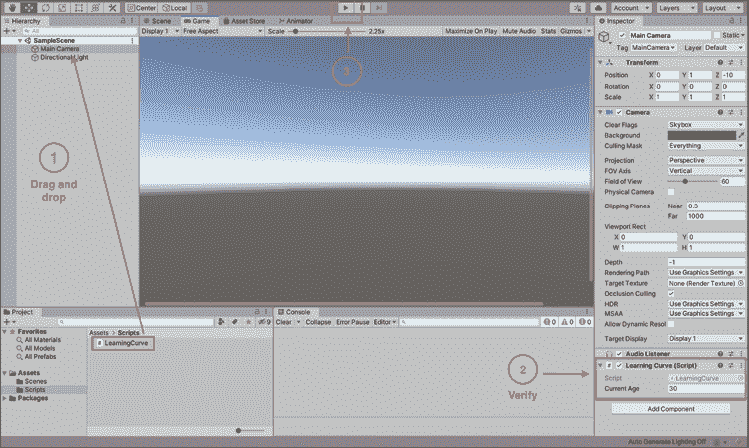
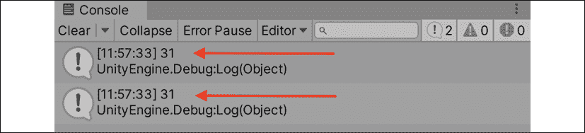
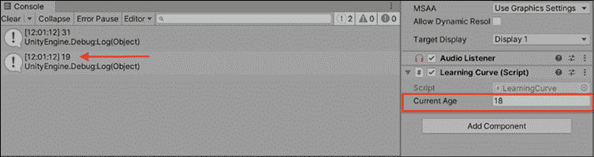
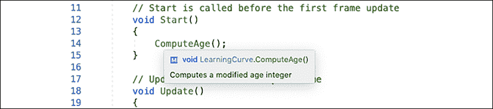

# 2

# 编程的构建模块

在不习惯的人看来，任何编程语言一开始都像是古希腊语言，c#也不例外。 好消息是，在最初的神秘之下，所有的编程语言都是由相同的基本构件组成的。 变量、方法和类(或对象)构成了传统编程的 DNA; 理解这些简单的概念可以打开一个包含各种复杂应用程序的世界。 毕竟，地球上的每个人只有四种不同的 DNA 碱基; 然而，我们每个人都是独一无二的有机体。

如果你是一个编程新手，那么在本章中你将会接触到很多信息，而这些信息可能标志着你编写的第一行代码。 关键是不要让事实和数据让你的大脑超负荷; 它通过使用日常生活中的例子来全面地了解编程的构建模块。

本章是关于组成程序的各个部分的高级视图。 在直接进入代码之前，先了解这些东西是如何工作的，这不仅可以帮助你的新程序员找到自己的立足点，而且还可以用容易记住的参考来巩固主题。 除了漫谈，我们将在这一章中关注以下主题:

*   定义变量
*   理解方法
*   引入类
*   处理意见
*   将积木组装在一起

# 定义变量

让我们从一个简单的问题开始:什么是变量? 根据你的观点，有几种不同的方式来回答这个问题:

*   **从概念上**，变量是编程的最基本单位，就像原子之于物理世界(弦理论除外)。 一切都是从变量开始的，没有变量程序就不能存在。
*   **从技术上讲**，变量是计算机内存中保存赋值的一小部分。 每个变量都跟踪其信息存储的位置(这被称为内存地址)、它的值和它的类型(例如，数字、单词或列表)。
*   实际上**变量是一个容器。 您可以随意创建新的，填充它们，移动它们，更改它们所包含的内容，并根据需要引用它们。 它们甚至可以是空的，但仍然有用。**

您可以在 Microsoft c#文档的[https://docs.microsoft.com/en-us/dotnet/csharp/language-reference/language-specification/variables](https://docs.microsoft.com/en-us/dotnet/csharp/language-reference/language-specification/variables)中找到对变量的深入解释。

一个实际的现实生活中的变量的例子是邮箱，还记得那些吗?


图 2.1:一排彩色邮箱的快照

可以放信件，账单，你梅布尔阿姨的照片任何东西。 关键在于，邮箱中的内容可以有所不同:它们可以有名称、保存信息(物理邮件)，如果您有正确的安全许可，它们的内容甚至可以更改。 同样，变量可以包含不同的类型的信息。 c#中的变量可以包含字符串(文本)、整数(数字)，甚至布尔值(表示真或假的二进制值)。

## 名字是很重要的

参考图 2.1*，如果我让你过去打开邮箱，你可能会问的第一件事是:哪一个? 如果我说的是史密斯家族邮箱，或者是向日葵邮箱，甚至是最右边那个下垂的邮箱，那么您就有了打开我正在引用的邮箱所必需的上下文。 类似地，在创建变量时，必须为它们指定唯一的名称，以便以后引用。 我们将在*第三章*、**深入探讨变量、类型和方法*中详细讨论适当的格式和描述性命名。**

 **## 变量充当占位符

当您创建并命名一个变量时，您是在为要存储的值创建一个占位符。 以为例:

```cs
2 + 9 = 11 
```

好的，这里没有什么神秘的，但是如果我们想要数字`9`作为它的变量呢? 考虑以下代码块:

```cs
MyVariable = 9 
```

现在我们可以在需要的地方使用变量名`MyVariable`来代替`9`:

```cs
2 + MyVariable = 11 
```

如果你想知道变量是否有其他规则或规定，它们确实有。 我们将在下一章讨论这些，所以请耐心等待。

尽管这个示例不是真正的 c#代码，但它说明了变量的强大功能以及它们作为占位符引用的用法。 在下一节中，您将开始创建自己的变量，所以请继续!

好了，足够的理论——让我们在我们在*第一章*，*了解你的环境*中创建的`LearningCurve`脚本中创建一个实变量:

1.  在 Unity 项目窗口中双击`LearningCurve.cs`在 Visual Studio 中打开它。
2.  在第 6 行和第 7 行之间添加一个空格，并添加以下代码行来声明一个新变量:
3.  在`Start`方法中，添加两个调试日志以输出以下计算:

让我们分解一下刚刚添加的代码。 首先，我们创建了一个名为`CurrentAge`的新变量，并将其赋值为`30`。 然后，我们添加了两个调试日志来打印`30 + 1`和`CurrentAge + 1`的结果，以显示变量如何存储值。 它们可以像这些值本身一样被使用。

同样需要注意的是，`public`变量会出现在 Unity 检查器中，而`private`变量则不会。 现在不要担心语法，只要确保你的脚本与下面截图中显示的脚本相同:


图 2.2:在 Visual Studio 中打开的 LearningCurve 脚本

完成后，使用**编辑器**|**文件**|**save**保存文件。

对于在 Unity 中运行的脚本，它们必须附加到场景中的*GameObjects*。 *Hero Born*中的样例场景默认有一个相机和方向灯，它为场景提供的照明，所以让我们将`LearningCurve`附加到相机上以保持简单:

1.  将`LearningCurve.cs`拖放到**主摄像机**上。
2.  选择**主摄像机**，使其出现在**检查器**面板中，并验证`LearningCurve.cs`(Script)组件是否正确附加。
3.  Click play and watch for the output in the **Console** panel:

    

    图 2.3:带有用于拖放脚本的 callouts 的 Unity Editor 窗口

`Debug.Log()`语句打印出我们放入括号中的简单数学方程的结果。 正如你在下面的**控制台**截图中所看到的，使用变量`CurrentAge`的方程式就像它是一个实数一样:



图 2.4:带有附加脚本调试输出的 Unity 控制台

在本章的最后，我们将了解 Unity 如何将 c#脚本转换为组件，但首先，让我们来处理改变其中一个变量的值。

由于`CurrentAge`在第 7 行被声明为变量，如图 2.2*所示，它存储的值可以更改。 然后，更新的值将滴落到代码中使用变量的任何地方; 让我们看看实际情况:*

 *1.  如果场景仍在运行，点击**暂停**按钮停止游戏
2.  Change **Current Age** to `18` in the **Inspector** panel and play the scene again, looking at the new output in the **Console** panel:

    

    图 2.5:带有调试日志和附加到主摄像机的 LearningCurve 脚本的 Unity 控制台

第一个输出仍然是`31`，因为我们在脚本中没有改变任何东西，但是第二个输出现在是`19`，因为我们在检查器中改变了`CurrentAge`的值。

这里的目标不是学习变量语法，而是展示变量如何作为可以一次创建并在其他地方引用的容器。 我们将在*第三章*、*深入探讨变量、类型和方法*中进行更详细的讨论。

现在我们知道了如何在 c#中创建变量并为它们赋值，我们准备进入下一个重要的编程构建块:方法!

# 理解方法

就其本身而言，变量除了跟踪赋值之外不能做更多的事情。 虽然这是至关重要的，但就创建有意义的应用程序而言，它们本身并不是很有用。 那么，我们如何在代码中创建动作和驱动行为呢? 简短的回答是通过使用方法。

在了解什么是方法以及如何使用方法之前，我们应该澄清一点术语。 在编程领域，你经常会看到术语*方法*和*函数*可以互换使用，特别是在 Unity 中。

由于 c#是一种面向对象的语言(这是我们将*第五章*,*处理类,结构,和 OOP*),我们将的*的方法*这本书符合标准 C #指南。

当您在脚本参考或其他文档中遇到函数这个词时，请考虑方法。

## 方法驱动行为

与变量类似，定义编程方法可能是冗长乏味或简短的; 下面是另一个需要考虑的三管齐下的方法:

*   从概念上讲**，方法是在应用程序中完成工作的方式。**
*   **从技术上讲**，方法是一个包含可执行语句的代码块，当按名称调用方法时，该代码块将运行。 方法可以接受参数(也称为参数)，它可以在方法的作用域中使用。
*   实际上**，方法是一组指令的容器，这些指令在每次执行时都会运行。 这些容器还可以接收变量作为输入，这些变量只能在方法内部引用。**

 **总之，方法是任何程序的骨架——它们连接所有的东西，几乎所有的东西都是建立在它们的结构之上的。

你可以在 Microsoft c#文档中的[https://docs.microsoft.com/en-us/dotnet/csharp/programming-guide/classes-and-structs/methods](https://docs.microsoft.com/en-us/dotnet/csharp/programming-guide/classes-and-structs/methods)找到方法的深入指南。

## 方法也是占位符

让我们举一个简单的例子，把两个数字加在一起，来理解这个概念。 在编写脚本时，您实际上是在为计算机设置代码行以按顺序执行。 第一次你需要把两个数字相加，你可以像下面的代码块一样把它们相加:

```cs
SomeNumber + AnotherNumber 
```

但你会得出结论，这些数字需要在其他地方相加。

你可以创建一个命名的方法来处理这个动作，而不是复制和粘贴同一行代码，这会导致草率或“意大利面条”代码，应该不惜一切代价避免这样做:

```cs
AddNumbers() 
{
    SomeNumber + AnotherNumber
} 
```

现在，`AddNumbers`在内存中保留了一个位置，就像一个变量; 然而，它不是一个值，而是一个指令块。 在脚本的任何地方使用方法的名称(或调用它)将使存储的指令在您的指尖，而不需要重复任何代码。

如果您发现自己一遍又一遍地编写相同的代码行，您可能会错过将重复操作简化或压缩为常用方法的机会。

这就产生了程序员们戏称为意大利面代码的代码，因为它可能会变得很混乱。 您还会听到程序员提到一个名为**Don't Repeat Yourself**(**DRY**)原则的解决方案，这是您应该牢记的箴言。

和前面一样，一旦我们在伪代码中看到了一个新概念，最好是我们自己实现它，这也是我们在下一节中要做的，以便深入了解它。

让我们再次打开`LearningCurve`，看看方法在 c#中是如何工作的。 就像变量示例一样，您希望将代码完全复制到脚本中，正如下面的截图所示。 我已经删除了前面的示例代码，以使事情更整洁，但你当然可以把它保留在你的脚本中作为参考:

1.  在 Visual Studio 中打开`LearningCurve`。
2.  在第 8 行中添加一个新变量:

    ```cs
    public int AddedAge = 1; 
    ```

3.  在第 16 行添加一个新方法，将`CurrentAge`和`AddedAge`添加到一起并打印出结果:

    ```cs
    void ComputeAge() 
    {
        Debug.Log(CurrentAge + AddedAge);
    } 
    ```

4.  Call the new method inside `Start` with the following line:

    ```cs
     ComputeAge(); 
    ```

    在 Unity 中运行脚本之前，请仔细检查你的代码是否如下截图所示:

    

    图 2.6:使用新的 ComputeAge 方法的学习曲线

5.  保存文件，然后返回并在 Unity 中点击 play 来查看新的**控制台**输出。

您在第 16 到 19 行定义了第一个方法，并在第 13 行调用它。 现在，无论在哪里调用`ComputeAge()`，两个变量将被加在一起并打印到控制台，即使它们的值发生了变化。 记住，你在 Unity 检查器中设置`CurrentAge`为`18`，检查器的值将总是覆盖 c#脚本中的值:


图 2.7:在检查器中改变变量值的控制台输出

继续，在**检查器**面板中尝试不同的变量值，看看这是怎么回事! 关于您刚刚编写的代码的实际语法的更多细节将在下一章中出现。

有了对方法的全面了解，我们已经准备好解决编程景观类中最大的主题了!

# 引入类

我们已经了解了变量如何存储信息以及方法如何执行操作，但是我们的编程工具包仍然有一定的局限性。 我们需要一种方法来创建一种超级容器，其中包含可以在容器内部引用的变量和方法。 输入类:

*   **从概念上讲**，类在单个容器中保存相关信息、操作和行为。 他们甚至可以互相交流。
*   **从技术上讲**，类是数据结构。 它们可以包含变量、方法和其他编程信息，所有这些都可以在创建类的对象时引用。
*   **实际上**，一个班就是一个蓝图。 它为使用类蓝图创建的任何对象(称为实例)制定规则和规则。

您可能已经意识到，我们周围的类不仅在 Unity 中，而且在现实世界中也是如此。 接下来，我们将看看最常见的 Unity 类以及类在野外是如何工作的。

您可以在 Microsoft c#文档[https://docs.microsoft.com/en-us/dotnet/csharp/fundamentals/types/classes](https://docs.microsoft.com/en-us/dotnet/csharp/fundamentals/types/classes)中找到类的深入指南。

## 一个共同的 Unity 类

在你想知道一个类在 c#中是什么样子之前，你应该知道你在整个章节中都在使用一个类。 默认情况下，在 Unity 中创建的每个脚本都是一个类，你可以从第 5 行`class`关键字中看到:

```cs
public class LearningCurve: MonoBehaviour 
```

`MonoBehaviour`只是意味着这个类可以附加到 Unity 场景中的游戏对象上。

类可以独立存在，我们将在*第 5 章*，*中创建独立的类时看到这一点。*

术语脚本和类有时在 Unity 资源中可以互换使用。 为了一致性，我将把c#文件作为脚本(如果它们附加到gameobject)，作为类(如果它们是独立的)。

## 类是蓝图

在我们的最后一个例子中，让我们考虑一个当地的邮局。 它是一个独立的、自包含的环境，具有属性，比如物理地址(一个变量)，以及执行操作(比如发送邮件(方法))的能力。

这使得邮局成为一个很好的潜在类的例子，我们可以在下面的伪代码块中列出它:

```cs
public class PostOffice
{
    // Variables
    public string address = "1234 Letter Opener Dr."
    // Methods
    DeliverMail() {}
    SendMail() {}
} 
```

这里的主要结论是，当信息和行为遵循预定义的蓝图时，复杂的操作和类间通信就成为可能。 例如，如果我们有另一个类想要通过我们的`PostOffice`类发送一封信，它就不需要考虑到哪里去触发这个动作。 它可以简单地从`PostOffice`类中调用`SendMail`函数，如下所示:

```cs
PostOffice().SendMail() 
```

或者，你可以用它来查找邮局的地址，这样你就知道在哪里寄信了:

```cs
PostOffice().address 
```

如果你想知道在单词之间使用句号(称为点符号)，我们将在下一节深入讨论——请耐心等待。

## 类之间的沟通

到目前为止，我们已经将类和 Unity 组件描述为独立的实体; 实际上，它们是紧密交织在一起的。 如果不调用类之间的某种交互或通信，就很难创建任何有意义的软件应用程序。

如果您还记得前面的office 示例，示例代码使用了句点(或点)来引用类、变量和方法。 如果你把类看作信息的目录，那么点表示法就是索引工具:

```cs
PostOffice().Address 
```

类中的任何变量、方法或其他数据类型都可以用点符号访问。 这也适用于嵌套或子类信息，但我们将在学习*第 5 章*、*处理类、结构和 OOP*时处理所有这些主题。

点表示法也是驱动类之间通信的因素。 每当一个类需要关于另一个类的信息或者想要执行它的一个方法时，就会使用点表示法:

```cs
PostOffice().DeliverMail() 
```

点表示法有时被称为`.`操作符，所以如果您在文档中看到它以这种方式被提到，请不要感到困惑。

如果你对点符号还不太感兴趣，别担心，它会的。 它是整个编程体的血液循环，在需要的地方携带信息和上下文。

现在您对类有了更多的了解，让我们来讨论一下您在编程生涯中使用最多的工具——评论!

# 处理意见

您可能已经注意到，`LearningCurve`有一行奇数的文本(*图 2.6*中的**10**)，以两个正斜杠开始，这是在脚本中默认创建的。

这些是代码注释! 在 c#中，有几种方法可以用来创建注释，而 Visual Studio(和其他代码编辑应用程序)通过内置快捷方式通常会使创建注释变得更容易。

一些专业人士不会把评论称为编程的基本组成部分，但我有礼貌地表示不同意。 正确地用有意义的信息注释掉代码是新程序员可以养成的最基本的习惯之一。

## 单行注释

下面的单行注释是，与我们在`LearningCurve`中包含的注释相似:

```cs
// This is a single-line comment 
```

Visual Studio 不将以两个正斜杠(没有空格)开头的行编译为代码，因此您可以根据需要尽可能地使用它们向其他人或未来的自己解释您的代码。

## 多行注释

因为它在名称中，所以可以认为单行注释只适用于一行代码。 如果你想要多行注释，你需要在注释文本周围使用斜杠和星号(分别为`/*`和`*/`作为开始和结束字符):

```cs
/* this is a 
      multi-line comment */ 
```

您还可以对代码块进行注释或取消注释，方法是在 macOS 上使用`Cmd`+`/`**快捷方式，在 Windows 上使用`Ctrl`+`K`+`C`快捷方式。**

 **Visual Studio 还提供了一个方便的自动生成评论功能; 在任何代码行(变量、方法、类等等)之前的行上输入三个斜杠，一个总结注释块就会出现。

看到示例注释很好，但将它们放入代码中总是更好。 评论再早也不为过!

## 添加注释

打开`LearningCurve`，在`ComputeAge()`方法之上添加三个反斜杠:


图 2.8:为方法自动生成的三行注释

您应该看到一个三行注释，其中描述了 Visual Studio 根据方法的名称生成的方法，夹在两个`<summary>`标记之间。 当然，您可以像在文本文档中那样，通过点击`Enter`来更改文本或添加新行; 只是确保不要碰`<summary>`标签，否则 Visual Studio 将无法正确识别注释。

当您想了解您所编写的方法时，这些详细注释的有用部分就很明显了。 如果你使用了三斜杠注释，你所需要做的就是将鼠标悬停在方法名上，在类或脚本中调用它的任何地方，Visual Studio 就会弹出你的摘要:



图 2.9:带有评论摘要的 Visual Studio 弹出信息框

您的基本编程工具包现在已经完成了(至少是理论工具箱)。 然而，我们仍然需要理解我们在本章中学到的所有内容如何应用于 Unity 游戏引擎，这也是我们下一节将关注的内容!

# 将积木组装在一起

在构建模块做好准备之后，是时候在结束本章之前做一些特定于 unity 的整理工作了。 具体来说，我们需要知道更多关于 Unity 如何处理 c#脚本附加到游戏对象。

在本例中，我们将继续使用`LearningCurve`脚本和主摄像机游戏对象。

## 脚本成为组件

所有 GameObject 组件都是脚本，无论它们是由你还是 Unity 的优秀人员编写的。 唯一的区别是，特定于 unity 的组件(如`Transform`)以及它们各自的脚本不应该由用户编辑。

当你创建的脚本被放到游戏对象上时，它就会成为该对象的另一个组件，这也是它出现在**检查器**面板上的原因。 对于 Unity 来说，它行走，说话，和任何其他组件一样，在组件下面有公共变量，可以随时改变。 尽管我们不需要编辑 Unity 提供的组件，但我们仍然可以访问它们的属性和方法，使它们成为强大的开发工具。

当脚本成为组件时，Unity 也会自动调整可读性。 你可能注意到在*图 2.3*和*2.5*中，当我们将`LearningCurve`添加到主摄像机时，Unity 将其显示为`Learning Curve`，而`CurrentAge`则变为`Current Age`。

我们在*变量充当占位符*部分的**检查器**面板中查看了如何更新变量，但我们有必要更详细地了解它是如何工作的。 有三种情况可以修改属性值:

*   在 Unity 编辑器的**播放模式**中
*   在**开发模式**中的 Unity 编辑器窗口中
*   在 Visual Studio 代码编辑器中

在游戏模式中所做的改变是实时生效的，这对于测试和调整游戏玩法非常有用。 但是需要注意的是，当你停止游戏并返回开发模式时，在游戏模式中所做的任何改变都会消失。

当你处于开发模式时，你对变量所做的任何改变都将被 Unity 保存。 这意味着如果你退出 Unity 并重新启动它，所做的改变将被保留。

在播放模式下，你对**检查器**面板中的值所做的更改不会修改你的脚本，但它们会覆盖你在开发模式下在脚本中分配的任何值。

当你停止播放模式时，在播放模式中所做的任何改变都会自动重置。 如果您需要撤销在**Inspector**面板中所做的任何更改，您可以将脚本重置为其默认值(有时称为初始值)。 点击任意组件右侧的三个垂直点图标，然后选择**复位**，如下图所示:


图 2.10:检查器中的脚本重置选项

这会让你平静下来——如果你的变量失控了，总是会有困难的重置。

## 来自 MonoBehaviour 的援助之手

既然 c#脚本是类，Unity 如何知道制作一些脚本组件而不是其他? 简短的答案是`LearningCurve`(以及在 Unity 中创建的任何脚本)继承自`MonoBehaviour`(Unity 提供的默认类)。 这告诉 Unity, c#类可以转换为组件。

对于编程之旅的这一点来说，类继承的主题有点高级; 可以将其看作是将其一些变量和方法借给`LearningCurve`的`MonoBehaviour`类。 第五章，*与类、结构和 OOP 一起工作*，将详细介绍类继承。

我们使用的`Start()`和`Update()`方法属于`MonoBehaviour`，Unity 可以在任何附加到游戏对象的脚本上自动运行。 `Start()`方法在场景开始播放时运行一次，而`Update()`方法每帧运行一次(取决于机器的帧速率)。

现在你对 Unity 文档的熟悉程度有所提高，我为你准备了一个简短的可选挑战!

### 英雄的试验-脚本 API 中的 MonoBehaviour

现在是时候让你自己熟悉使用 Unity 文档了，还有什么比查找一些常见的`MonoBehaviour`方法更好的方法:

*   尝试在脚本 API 中搜索`Start()`和`Update()`方法，以便更好地理解它们在 Unity 中做什么以及什么时候做
*   如果你有足够的勇气，你可以走额外的一步，看看手册中的`MonoBehaviour`课程，以获得更详细的解释

# 总结

在短短的几页中，我们已经走了很长一段路，但是理解基本概念(如变量、方法和类)的总体理论将为您构建基础奠定坚实的基础。 请记住，这些构建块在现实世界中有非常真实的对应物。 变量保存值就像邮箱保存信件一样; 方法存储的指令就像配方一样，要遵循它才能得到预定义的结果; 上课就像蓝图，就像真正的蓝图。 如果你想让房子屹立不倒，你就不能建造一个没有经过深思熟虑的设计来遵循的房子。

本书的其余部分将带你从头开始深入了解 c#语法，下一章将更详细地介绍如何创建变量、管理值类型以及使用简单和复杂的方法。

# 突击测验- c#构建模块

1.  变量的主要目的是什么?
2.  方法在脚本中扮演什么角色?
3.  一个脚本如何成为一个组件?
4.  点表示法的目的是什么?*******