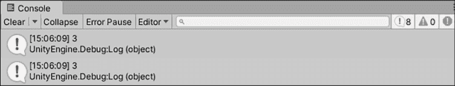
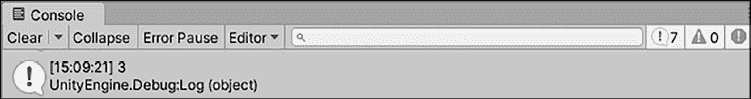
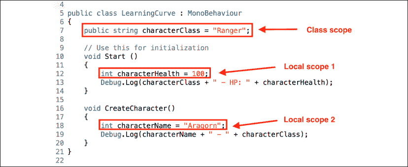
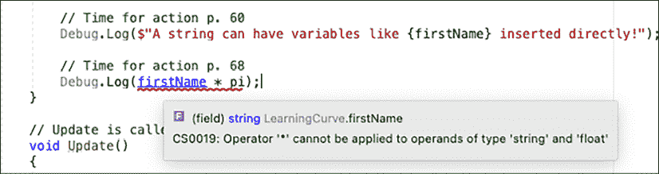
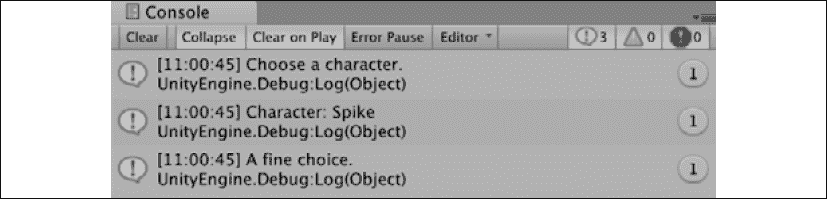
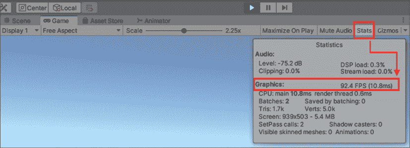

# 3

# 深入研究变量、类型和方法

进入任何编程语言的最初步骤都有一个基本问题——您可以理解输入的单词，但不能理解它们背后的含义。 正常情况下，这可能会导致矛盾，但编程是一种特殊情况。

C# 不是它自己的语言; 它是用英语写的。 你每天使用的单词和 Visual Studio 中的代码之间的差异来自于上下文的缺失，这是需要重新学习的东西。 你知道如何说和拼写在 C# 中使用的单词，但你不知道的是在哪里，何时，为什么，以及最重要的是，它们如何构成语言的语法。

这一章标志着我们从编程理论出发，并开始了我们真正的编码之旅。 我们将讨论可接受的格式、调试技术，以及将更复杂的变量和方法示例组合在一起。 有很多内容需要覆盖，但当你完成最后一个测试时，你会对以下高级主题感到舒服:

*   C# 写的
*   调试代码
*   理解变量
*   引入运营商
*   定义方法

让我们开始吧!

# C# 写的

代码行的功能类似于句子，这意味着它们需要有某种分隔或结尾的字符。 C# 中的每一行(称为语句)，*必须*以分号结束，以便代码编译器进行处理。

然而，有一个问题你需要注意。 与我们都熟悉的文字不同，C# 语句在技术上不需要在一行上; 代码编译器会忽略空格和换行符。 例如，一个简单的变量可以写成这样:

```cs
public int FirstName = "Harrison"; 
```

或者，也可以写成如下:

```cs
public
int
FirstName
= 
"Harrison"; 
```

这两个代码片段对于 Visual Studio 来说都是完全可以接受的，但是第二个选项在软件社区中是非常不鼓励的，因为它会使代码非常难以阅读。 其思想是尽可能地高效和清晰地编写程序。

有时候，一个语句会太长，以至于不能合理地写在一行中，但这种情况很少。 只要确保它以别人能够理解的方式格式化，并且不要忘记分号。

您需要深入编码肌肉记忆的第二个格式化规则是使用花括号或大括号:`{}`。 方法、类和接口在声明之后都需要一组花括号。 我们将在稍后深入讨论每一种格式，但在您的头脑中尽早了解标准格式是很重要的。

C# 中的传统做法是在新行中包含每个方括号，如下所示:

```cs
public void MethodName() 
{
} 
```

然而，您可能会看到第一个花括号位于与声明的同一行。 这完全取决于个人偏好:

```cs
public void MethodName() {
} 
```

虽然这不是什么让你抓狂的事情，但重要的是要始终如一。 在本书中，我们将坚持使用“纯粹的”C# 代码，即将每个括号放在新行中，而与 Unity 和游戏开发相关的 C# 例子通常会遵循第二个例子。

在开始编程时，良好的、一致的格式风格是至关重要的，但能够看到自己的工作成果也是如此。 在下一节中，我们将讨论如何将变量和信息直接打印到 Unity 控制台。

# 调试代码

当我们在处理的实际例子时，我们需要一种将信息和反馈打印到 Unity 编辑器中的**控制台**窗口的方法。 编程术语就是调试，C# 和 Unity 都提供了帮助方法来简化开发人员的调试过程。 您已经在上一章中调试了您的代码，但是我们并没有深入讨论它实际如何工作的细节。 让我们解决这个问题。

当我要求你调试或打印某个东西时，请使用以下方法之一:

*   For simple text or individual variables, use the standard `Debug.Log()` method. The text needs to be inside a set of parentheses, and variables can be used directly with no added characters; for example:

    ```cs
    Debug.Log("Text goes here.");
    Debug.Log(CurrentAge); 
    ```

    这将在**控制台**面板中产生以下内容:

    

图 3.1:观察 Debug.Log 输出

*   For more complex debugging, use `Debug.LogFormat()`. This will let you place variables inside the printed text by using placeholders. These are marked with a pair of curly brackets, each containing an index. An index is a regular number, starting at 0 and increasing sequentially by 1\. In the following example, the `{0}` placeholder is replaced with the `CurrentAge` value, `{1}` with `FirstName`, and so on:

    ```cs
    Debug.LogFormat("Text goes here, add {0} and {1} as variable
       placeholders", CurrentAge, FirstName); 
    ```

    这将在**控制台**面板中产生以下内容:

    

    图 3.2:观察调试。 LogFormat 输出

您可能已经注意到，我们在调试技术中使用了**点表示法**，您是对的! Debug 是我们正在使用的类，而`Log()`和`LogFormat()`是我们可以从该类中使用的不同方法。 关于这一点，在本章的末尾有更多的说明。

有了强大的调试功能，我们可以安全地继续前进，深入研究变量是如何声明的，以及语法可以使用的不同方式。

# 理解变量

在前一章中，我们看到了变量是如何编写的，并涉及到它们提供的高级功能。 然而，我们仍然缺少使这一切成为可能的语法。

## 声明变量

变量不只是出现在 C# 脚本的顶部; 它们必须根据某些规则和要求进行申报。 在最基本的层面上，一个变量语句需要满足以下要求:

*   需要指定变量将存储的数据类型
*   变量必须有一个唯一的名称
*   如果有一个赋值，它必须匹配指定的类型
*   变量声明需要以分号结束

遵循这些规则的结果是以下语法:

```cs
dataType UniqueName = value; 
```

变量需要唯一的名称，以避免与 C# 中已经使用的单词发生冲突，这些单词被称为关键字。 您可以在[https://docs.microsoft.com/en-us/dotnet/csharp/language-reference/keywords/index](https://docs.microsoft.com/en-us/dotnet/csharp/language-reference/keywords/index)中找到受保护关键字的完整列表。

这是简单、整洁和有效的。 然而，如果只有一种方法可以创建像变量这样普遍存在的东西，那么从长远来看，编程语言是没有用的。 复杂的应用和游戏有不同的用例和场景，所有这些都有独特的 C# 语法。

### 类型和值声明

创建变量最常见的场景是在声明时拥有所有可用的信息。 举个例子来说吧，如果我们知道玩家的年龄，那么存储这些数据就会像以下操作一样简单:

```cs
int CurrentAge = 32; 
```

在这里，所有的基本要求都得到了满足:

*   指定了一个数据类型`int`(整数的缩写)
*   使用唯一的名称`CurrentAge`
*   `32`为整数，匹配指定的数据类型
*   语句以分号结束

然而，在某些情况下，您可能想要声明一个变量而不立即知道它的值。 我们将在下一节中讨论这个主题。

### 类型只声明

考虑另一种情况—您知道要存储的变量的数据类型及其名称，但不知道它的值。 该值将被计算并分配到其他地方，但您仍然需要在脚本顶部声明变量。 这种情况非常适合类型声明:

```cs
int CurrentAge; 
```

只定义了类型(`int`)和惟一名称(`CurrentAge`)，但是语句仍然有效，因为我们遵循了规则。 如果没有赋值，默认值将根据变量的类型赋值。 在本例中，`CurrentAge`将被设置为`0`，这与`int`类型匹配。 一旦变量的实际值可用，就可以通过引用变量名并给它赋值，在单独的语句中轻松设置它:

```cs
CurrentAge = 32; 
```

您可以在[https://docs.microsoft.com/en-us/dotnet/csharp/language-reference/builtin-types/default-values](https://docs.microsoft.com/en-us/dotnet/csharp/language-reference/builtin-types/default-values)中找到所有 C# 类型及其默认值的完整列表。

此时，您可能会问为什么到目前为止我们的变量没有包含`public`关键字，称为*访问修饰符*，这是我们在前面的脚本示例中看到的。 答案是，我们没有必要的基础来清楚地讨论它们。 现在我们有了这个基础，是时候重新审视它们的细节了。

## 使用访问修饰符

现在基本语法不再是一个谜，让我们来了解变量语句的细节。 由于我们从左到右读取代码，所以从传统上首先出现的关键字——访问修饰符——开始深入研究变量是有意义的。

快速回顾一下我们在前一章中使用的变量`LearningCurve`，你会发现它们的语句前面有一个额外的关键字:`public`。 这是变量的访问修饰符。 可以把它看作是一个安全设置，决定谁和什么可以访问变量的信息。

任何没有标记`public`的变量都默认为`private`，并且不会在 Unity 检查面板中显示。

如果你添加了一个修饰符，那么我们在本章开头所做的更新后的语法配方将是这样的:

```cs
accessModifier dataType UniqueName = value; 
```

虽然在声明变量时不需要显式访问修饰符，但作为一名新程序员，学习是一个好习惯。 这个额外的单词会大大提高代码的可读性和专业性。

在 C# 中有 4 个主要的访问修饰符，但作为初学者，你最常使用的两个是:

*   **Public**:这个对任何脚本都可用，没有限制。
*   **Private**:只有在创建它们的类中可用(称为包含类)。 任何没有访问修饰符的变量默认为 private。

这两种高级修饰符有以下特点:

*   **Protected**:可从其包含的类或派生的类型中访问
*   **内部**:当前总成中只有可用

每个修饰符都有特定的用例，但在我们进入高级章节之前，不要担心**受保护的**和**内部的**。

两个组合的修饰符也存在，但我们不会在本书中使用它们。 你可以在[https://docs.microsoft.com/en-us/dotnet/csharp/language-reference/keywords/access-modifiers](https://docs.microsoft.com/en-us/dotnet/csharp/language-reference/keywords/access-modifiers)找到更多关于他们的信息。

让我们试试我们自己的一些访问修饰符! 就像现实生活中的信息一样，一些数据需要被保护或与特定的人共享。 如果不需要在**Inspector**窗口中修改变量，或者从其他脚本中访问变量，那么私有访问修饰符是一个不错的选择。

执行以下步骤更新`LearningCurve`:

1.  将`CurrentAge`前面的`public`修改为`private`，然后保存文件。
2.  回到 Unity，选择主摄像机，看看在`LearningCurve`*部分发生了什么变化:

    * 

 *图 3.3:附加到主摄像机的 LearningCurve 脚本组件

由于`CurrentAge`现在是私有的，它在**Inspector**窗口中不再可见，只能在代码中的`LearningCurve`脚本中访问。 如果我们点击播放，脚本仍然会像之前一样工作。

这是我们研究变量的一个很好的开始，但我们仍然需要更多地了解它们可以存储哪些类型的数据。 这就是数据类型的作用所在，我们将在下一节中讨论。

## 处理类型

将特定类型赋值给变量是一个重要的选择，它会渗透到变量在其整个生命周期中所具有的每个交互中。 因为 C# 是所谓的*强类型*或*类型安全*语言，所以每个变量都必须有一个没有异常的数据类型。 这意味着在使用特定类型执行操作时有特定的规则，在将给定的变量类型转换为另一个变量类型时有特定的规则。

### 常见的内置类型

C# 中的所有数据类型从共同的祖先`System.Object`涓流而下(或者从程序术语中*派生*)。 这个层次结构，称为**公共类型系统**(**CTS**)，意味着不同的类型有许多共享的功能。 下表列出了一些最常见的数据类型选项和它们所存储的值:


图 3.4:变量的常见数据类型

除了指定变量可以存储的值类型外，类型还包含关于自身的附加信息，包括以下内容:

*   所需的存储空间
*   最小值和最大值
*   允许操作
*   位置在内存中
*   访问方法
*   基地(派生)类型

如果这看起来势不可挡，那就深呼吸。 使用 C# 提供的所有类型是使用文档而不是记忆的完美例子。 很快，使用即使是最复杂的定制类型也会让人觉得很自然。

您可以在[https://docs.microsoft.com/en-us/dotnet/csharp/programming-guide/types/index](https://docs.microsoft.com/en-us/dotnet/csharp/programming-guide/types/index)中找到所有 C# 内置类型及其规范的完整列表。

在类型列表成为关键问题之前，最好先对它们进行试验。 毕竟，学习新事物的最好方法是使用它，破坏它，然后学习如何修复它。

打开`LearningCurve`*，并从*常见内置类型*部分为前面的图表中每个类型添加一个新变量。 您使用的名称和值由您决定; 确保它们被标记为 public，这样我们就能在检查器窗口中看到它们。 如果你需要灵感，看看我的代码:*

```cs
public class LearningCurve : MonoBehaviour
{
    private int CurrentAge = 30;
    public int AddedAge = 1;

**public****float** **Pi =** **3.14f****;**
**public****string** **FirstName =** **"Harrison"****;**
**public****bool** **IsAuthor =** **true****;**

    // Start is called before the first frame update
    void Start()
    {
        ComputeAge(); 
    }

    /// <summary>
    /// Time for action - adding comments
    /// Computes a modified age integer
    /// </summary>
    void ComputeAge()
    {
        Debug.Log(CurrentAge + AddedAge);
    }
} 
```

在处理字符串类型时，实际的文本值需要在一对双引号中，而浮点值需要以小写的`f`结束，如`FirstName`和`piFirstName`所示。

所有不同的变量类型现在都可见了。 请注意 Unity 将`bool`变量显示为复选框(true 选中，false 未选中)。


图 3.5:带有常见变量类型的 LearningCurve 脚本组件

记住，任何你声明为私有的变量都不会出现在检查器窗口中。 在我们继续讨论转换之前，我们需要了解字符串数据类型的一个常见且功能强大的应用; 也就是说，创建任意散布变量的字符串。

虽然数字类型的行为与小学数学一样，但字符串则是另一回事。 通过从一个`$`字符开始，可以将变量和文字值直接插入文本，这被称为字符串插值。 你已经在`LogFormat()`调试中使用了插值字符串; 添加`$`字符可以让你在任何地方使用它们!

让我们在`LearningCurve`中创建一个简单的内插字符串，看看它是如何运行的。 在`ComputeAge()`调用之后直接输出`Start()`方法中插入的字符串:

```cs
void Start()
{
    ComputeAge();
    **Debug.Log(****$"A string can have variables like** **{FirstName}** **inserted directly!"****);**
} 
```

多亏了`$`字符和花括号，`FirstName`的值被当作一个值，并在插入的字符串中打印出来。 如果没有这种特殊的格式，字符串将仅仅包含`FirstName`作为文本，而不是变量值。


图 3.6:显示调试日志输出的控制台

也可以使用`+`操作符创建内插字符串，我们将在*介绍操作符*一节中讨论。

### 类型转换

我们已经看到，变量只能保存其声明类型的值，但是在某些情况下，您将需要将不同类型的变量组合起来。 在编程术语中，这些被称为转换，它们有两种主要形式:

*   **Implicit** conversions take place automatically, usually when a smaller value will fit into another variable type without any rounding. For example, any integer can be implicitly converted into a `double` or `float` value without additional code:

    ```cs
    int MyInteger = 3;
    float MyFloat = MyInteger;

    Debug.Log(MyInteger);
    Debug.Log(MyFloat); 
    ```

    **控制台**窗格中的输出如下截图所示:

    

图 3.7:隐式类型转换调试日志输出

*   当在转换过程中存在丢失变量信息的风险时，需要使用显式**转换。 例如，如果我们想将一个`double`值转换为一个`int`值，我们必须显式地强制转换(转换)它，方法是在要转换的值之前加上圆括号中的目标类型。**
***   This tells the compiler that we are aware that data (or precision) might be lost:

    ```cs
    int ExplicitConversion = (int)3.14; 
    ```

    在这个显式转换中，`3.14`将被四舍五入到`3`，忽略小数值:

    ** 

 **图 3.8:显式类型转换调试日志输出

C# 提供了内置的方法来显式地将值转换为通用类型。 例如，可以使用`ToString()`方法将任何类型转换为字符串值，而`Convert`类可以处理更复杂的转换。 您可以在[https://docs.microsoft.com/en-us/dotnet/api/system.convert?view=netframework-4.7.2](https://docs.microsoft.com/en-us/dotnet/api/system.convert?view=netframework-4.7.2)的*Methods*部分找到关于这些特性的更多信息。

到目前为止，我们已经了解了类型有关于它们的交互、操作和转换的规则，但是我们如何处理需要存储未知类型的变量的情况呢? 这听起来可能有点疯狂，但想想数据下载场景——你知道信息进入游戏，但你不知道它会以什么形式出现。 我们将在下一节中讨论如何处理这个问题。

### 隐式声明

幸运的是，C# 可以从变量的赋值*推断*变量的类型。 例如，`var`关键字可以让程序知道数据的类型`CurrentAge`需要由其值`32`决定，`32`是一个整数:

```cs
**var** CurrentAge = 32; 
```

虽然这在某些情况下很方便，但不要养成懒惰的编程习惯，对所有事情都使用推断变量声明。 这给您的代码增加了大量的猜测，而这些猜测本来应该是非常清楚的。

在结束关于数据类型和转换的讨论之前，我们确实需要简要介绍一下创建自定义类型的想法，这是我们接下来要做的。

### 自定义类型

当我们讨论数据类型时，必须尽早理解数字和单词(称为*文本值*)并不是变量可以存储的唯一类型。 例如，类、结构或枚举可以作为变量存储。 我们将介绍这些主题*第五章*,【T6 处理类、结构、和 OOP,并探索它们在【显示】第十章更详细地,*回顾类型、方法和类*。

类型很复杂，熟悉它们的唯一方法就是使用它们。 然而，这里有一些重要的事情要记住:

*   所有变量都需要具有指定的类型(无论是显式的还是推断的)
*   变量只能保存所赋值类型的值(不能将`string`值赋给`int`变量)
*   如果需要分配一个变量，或者需要与不同类型的变量组合，则需要进行转换(隐式或显式)
*   C# 编译器可以使用`var`关键字从变量的值推断其类型，但只有在创建变量时类型未知时才应该使用

这是很多细节，我们只是塞进了几个部分，但我们还没有完成。 我们仍然需要理解 C# 中的命名约定是如何工作的，以及变量在脚本中的位置。

## 命名变量

根据我们所学的关于访问修饰符和类型的知识，为变量选择名称似乎是事后的想法，但它不应该是一个简单的选择。 在你的代码中清晰和一致的命名约定不仅会使它更容易读懂，而且还会确保团队中的其他开发人员无需询问就能理解你的意图。

命名变量的第一个规则是，你给它起的名字应该有意义; 第二个规则是使用 Pascal case。 让我们以游戏中的一个常见例子为例，声明一个变量来存储玩家的健康值:

```cs
public int Health = 100; 
```

如果你发现自己像这样声明了一个变量，你的脑子里应该会响起警报。 他健康吗? 它存储的是最大值还是最小值? 当这个值改变时，其他哪些代码会受到影响? 这些问题都可以通过一个有意义的变量名轻松回答; 您不希望在一周或一个月内发现自己被代码搞糊涂。

话虽如此，让我们尝试使用 Pascal 大小写名来让它更好一点:

```cs
public int MaxPlayerHealth = 100; 
```

记住，Pascal 大小写以变量名中的每个单词的大写字母开始。

这是更好的。 稍微考虑一下，我们已经用意义和上下文更新了变量名。 因为对于变量名的长度没有技术上的限制，您可能会发现自己做得太过了，写出了可笑的描述性名称，这将给您带来与简短的、非描述性名称一样多的问题。

作为一个一般规则，使一个变量的名称具有描述性——不能多也不能少。 找到自己的风格并坚持下去。

## 理解变量作用域

我们对变量的深入已经接近尾声，但还有一个更重要的主题需要讨论:范围。 与访问修饰符(它决定哪些外部类可以获取变量的信息)类似，变量作用域是用来描述给定变量存在的位置及其在其包含类中的访问点的术语。

在 C# 中有三个主要的变量范围级别:

*   **Global**作用域是指一个可以被整个程序访问的变量; 在这种情况下，一个游戏。 C# 不直接支持全局变量，但全局变量的概念在某些情况下是有用的，我们将在*第 10 章*，*重访类型、方法和类。*
*   **类**或**成员**范围指的是在其包含的类的任何地方都可以访问的变量。
*   **局部**作用域指的是变量，该变量只能在创建它的特定代码块内访问。

看看下面的截图。 如果你不想的话，你不需要把它放进`LearningCurve`; 在这一点上，这只是为了可视化的目的:



图 3.9:LearningCurve 脚本中不同作用域的示意图

当我们谈论代码块时，我们指的是任何一组花括号内的区域。 这些括号在编程中充当一种可视化层次结构; 右缩进越深，它们在类中的嵌套越深。

让我们在前面的截图中分解类和局部作用域变量:

*   `CharacterClass`声明在类的最顶部，这意味着我们可以在`LearningCurve`中的任何位置通过名称引用它。 您可能听说过这个概念称为变量可见性，这是一种很好的思考方法。
*   `CharacterHealth`是在`Start()`方法中声明的，这意味着它只在代码块中可见。 我们仍然可以从`Start()`访问`CharacterClass`，没有问题，但是如果我们试图从`Start()`以外的任何地方访问`CharacterHealth`，就会得到错误。
*   `CharacterName`与同舟共济; 它只能从`CreateCharacter()`方法中访问。 这只是为了说明在一个类中可以有多个，甚至是嵌套的局部作用域。

如果您在程序员周围花了足够的时间，您将听到关于声明变量的最佳位置的讨论(或争论，这取决于一天中的时间)。 答案可能比你想象的要简单:变量声明时要考虑到它们的用途。 如果您有一个需要在整个类中访问的变量，则将其设置为类变量。 如果只在代码的特定部分中需要一个变量，则将其声明为局部变量。

注意，只有类变量可以在检查器窗口中查看，这不是局部变量或全局变量的选项。

在我们的工具箱中命名和作用域，让我们回到中学数学课，重新学习算术运算是如何工作的!

# 引入运营商

在编程语言中，运算符符号表示类型所能执行的*算术*、*赋值*、*关系*和*逻辑*功能。 算术操作符表示基本数学函数，而赋值操作符同时对给定值执行数学和赋值函数。 关系和逻辑运算符计算多个值之间的条件，例如*大于*，*小于*，以及*等于*。

C# 也提供了按位操作符和杂项操作符，但这些操作符在您创建更复杂的应用之前不会发挥作用。

目前，只讨论算术和赋值操作符是有意义的，但我们将在下一章讨论关系和逻辑功能。

## 算术和作业

你已经熟悉了学校里的算术运算符:

*   `+`用于添加
*   `-`用于减法
*   `/`为除法
*   `*`用于乘法

C# 操作符遵循常规的操作顺序，即首先计算圆括号，然后是指数，然后是乘法，然后是除法，然后是加法，最后是减法。 例如，下列方程将提供不同的结果，即使它们包含相同的值和操作符:

```cs
5 + 4 - 3 / 2 * 1 = 8
5 + (4 - 3) / 2 * 1 = 5 
```

操作符对变量的作用与对文字值的作用相同。

赋值操作符可以作为任何数学操作的简写替换，即同时使用算术和等号。 例如，如果我们想要乘一个变量，你可以使用以下代码:

```cs
int CurrentAge = 32;
CurrentAge = CurrentAge * 2; 
```

另一种方法如下所示:

```cs
int CurrentAge = 32;
CurrentAge *= 2; 
```

在 C# 中，等号也被认为是赋值操作符。 其他赋值符号遵循与前面乘法示例相同的语法模式:加号和赋值、减号和赋值、除号和赋值分别为`+=`、`-=`和`/=`。

字符串是操作符的一种特殊情况，因为它们可以使用加法符号来创建拼接文本，如下所示:

```cs
string FullName = "Harrison " + "Ferrone"; 
```

这将在登录到**控制台**面板时产生以下结果:


图 3.10:在字符串上使用操作符

这种方法往往产生笨拙的代码，因此在大多数情况下，字符串插值是将不同文本位组合在一起的首选方法。

请注意算术运算符并不适用于所有数据类型。 例如，`*`和`/`操作符不能作用于字符串值，而且这些操作符都不能作用于布尔值。 已经了解了类型具有规则，这些规则决定了类型可以具有什么样的操作和交互，让我们在下一节的实践中尝试一下。

让我们做一个小实验:我们将尝试将我们的`string`和`float`变量相乘，就像我们之前对数字所做的那样:



图 3.11:Visual Studio 错误类型操作错误消息

查看 VisualStudio，您将看到我们得到了一个错误消息，让我们知道`string`类型和`float`类型不能相乘。 这个错误也会出现在 Unity**控制台**中，并且不会让项目生成。


图 3.12:控制台显示不兼容数据类型上的操作符错误

无论何时看到这种类型的错误，都要回过头来检查变量类型是否不兼容。

我们必须清理这个例子，因为编译器现在不允许我们运行我们的游戏。 在行`Debug.Log(FirstName*Pi)`开头的一对反斜杠(`//`)中选择，或者干脆将其删除。

关于变量和类型，我们就讲到这里。 在进行下一章的测试之前，一定要先测试一下自己!

# 定义方法

在前一章中，我们简要地介绍了方法在程序中所扮演的角色; 也就是说，它们存储并执行指令，就像变量存储值一样。 现在，我们需要理解方法声明的语法，以及它们如何驱动类中的动作和行为。

与变量一样，方法声明也有其基本要求，如下所示:

*   方法将返回的数据类型
*   一个独特的名字，以大写字母开头
*   方法名后面的一对圆括号
*   标记方法体(存储指令的地方)的一对花括号

把所有这些规则放在一起，我们得到了一个简单的方法蓝图:

```cs
returnType UniqueName() 
{ 
    method body 
} 
```

让我们将`LearningCurve`中的默认`Start()`方法分解为一个实际例子:

```cs
void Start() 
{
} 
```

在前面的输出中，我们可以看到以下内容:

*   该方法以`void`关键字开始，如果该方法不返回任何数据，则将其用作该方法的返回类型。
*   方法在类中有唯一的名称。 您可以在不同的类中使用相同的名称，但您的目标是无论如何始终使您的名称惟一。
*   该方法在其名称后面有一对圆括号，以保存任何可能的参数。
*   方法体由一组花括号定义。

一般来说，如果有一个方法的方法体为空，最好将其从类中删除。 您总是希望删除脚本中未使用的代码。

与变量一样，方法也可以具有安全级别。 然而，它们也可以有输入参数，这两个我们将在后面讨论!

## 声明方法

方法还可以具有与变量相同的四个访问修饰符以及输入参数。 参数是变量占位符，可以传递给方法并在其中访问。 可以使用的输入参数的数量没有限制，但每个参数都需要用逗号分隔，显示其数据类型，并具有唯一的名称。

可以将方法参数看作是可以在方法体中使用其值的变量占位符。

如果我们应用这些选项，我们的更新蓝图将如下所示:

```cs
**accessModifier** returnType UniqueName(**parameterType parameterName**) 
{ 
    method body 
} 
```

如果没有显式访问修饰符，该方法默认为 private。 私有方法(如私有变量)不能从其他脚本中调用。

要调用一个方法(意思是运行或执行它的指令)，只需使用它的名称，后跟一对圆括号(带或不带参数)，并以分号结束:

```cs
// Without parameters
UniqueName();
// With parameters
UniqueName(parameterVariable); 
```

与变量一样，每个方法都有一个描述其访问级别、返回类型和参数的指纹。 这被称为它的方法签名。 本质上，方法的签名将其标记为编译器所独有的，以便 Visual Studio 知道如何使用它。

现在我们理解了方法是如何构造的，让我们创建一个自己的方法。

*方法也是占位符(上一章中的*部分)，让你盲目地将`ComputeAge()`方法复制到`LearningCurve`中，而不知道自己要做什么。 这一次，让我们有目的地创建一个方法:

1.  声明一个带有 void 返回类型`GenerateCharacter():`

    ```cs
    public int GenerateCharacter() 
    {
    } 
    ```

    的`public`方法
2.  在新方法中添加一个简单的`Debug.Log()`并打印出你最喜欢的游戏或电影中的角色名称:

    ```cs
    Debug.Log("Character: Spike"); 
    ```

3.  Call `GenerateCharacter()` inside the `Start()` method and hit play:

    ```cs
    void Start()
    {
        **GenerateCharacter();**
    } 
    ```

    当游戏启动时，Unity 自动调用`Start()`，而 T0 反过来调用我们的`GenerateCharacter()`方法并将结果打印到控制台窗口。

如果您阅读了足够多的文档，您将看到与方法相关的不同术语。 在本书的其余部分中，当一个方法被创建或声明时，我将把它称为**定义**方法。 类似地，我将运行或执行方法称为**调用**该方法。

命名的力量是整个编程领域不可或缺的一部分，所以在继续之前，我们将重新审视方法的命名约定，这并不奇怪。

## 命名约定

与变量一样，方法需要唯一的、有意义的名称来在代码中区分它们。 方法驱动操作，因此记住这一点是一个很好的做法。 例如，`GenerateCharacter()`听起来像一个命令，当您在脚本中调用它时，它读起来很好，而`Summary()`这样的名称就很乏味，并且不能很清楚地描述该方法将完成什么。 与变量一样，方法名也是用 Pascal 大小写编写的。

## 方法作为逻辑的迂回

我们已经看到代码行是按照它们的编写顺序顺序执行的，但是将方法引入到图中会带来一种独特的情况。 调用方法告诉程序绕道进入方法指令，逐个运行它们，然后在调用方法的地方继续顺序执行。

看看下面的截图，看看你是否能找出调试日志将以什么顺序输出到控制台:


图 3.13:考虑调试日志的顺序

以下是发生的步骤:

1.  `Choose a character`首先打印出来，因为它是第一行代码。
2.  当调用`GenerateCharacter()`时，程序跳转到第 23 行，打印出`Character: Spike`，然后在第 17 行继续执行。
3.  `A fine choice`最后打印，在`GenerateCharacter()`中的所有行运行完毕后。



图 3.14:控制台显示角色构建代码的输出

现在，如果我们不能将参数值添加到这些简单的例子中，方法本身就没有什么用处了，这就是我们接下来要做的。

## 指定参数

可能您的方法并不总是像`GenerateCharacter()`那么简单。 为了传递额外的信息，我们需要定义我们的方法可以接受和使用的参数。 每个方法参数都是一个指令，需要有两件事:

*   显式类型
*   一个唯一的名称

这听起来熟悉吗? 方法参数本质上是简化的变量声明，并执行相同的函数。 每个参数就像一个局部变量，只能在其特定的方法中访问。

你可以有你需要的任意多的参数。 无论您是编写自定义方法还是使用内置方法，所定义的参数都是方法执行指定任务所需的参数。

如果形参是方法可以接受的值类型的蓝图，那么实参就是值本身。 为了进一步细分，考虑以下几点:

*   传入方法的实参需要匹配形参类型，就像变量类型及其值一样
*   参数可以是文字值(例如，数字 2)或类中其他地方声明的变量

编译时，参数名和形参名不需要匹配。

现在，让我们继续添加一些方法参数，使`GenerateCharacter()`变得更有趣一些。

让我们更新`GenerateCharacter()`，使其可以接受两个参数:

1.  添加两个方法参数:一个用于字符名称`string`类型，另一个用于字符级别`int`类型:

    ```cs
    public void GenerateCharacter(string name, int level) 
    ```

2.  更新`Debug.Log()`以使用以下新参数:

    ```cs
    Debug.LogFormat("Character: {0} - Level: {1}", name, level); 
    ```

3.  Update the `GenerateCharacter()` method call in `Start()` with your arguments, which can be either literal values or declared variables:

    ```cs
    int CharacterLevel = 32;
    GenerateCharacter("Spike", CharacterLevel); 
    ```

    你的代码应该如下所示:

    

    图 3.15:更新 generatcharacter()方法

在这里，我们定义了两个参数，`name`(string)和`level`(int)，并在`GenerateCharacter()`方法中使用它们，就像局部变量一样。 当我们调用`Start()`内部的方法时，我们为每个具有相应类型的参数添加了实参值。 在前面的屏幕截图中，您可以看到在引号中使用字面值字符串值产生的结果与使用`characterLevel`相同。


图 3.16:显示方法参数输出的控制台

进一步研究方法，您可能想知道如何从方法内部传递值并再次返回。 这将我们带到关于返回值的下一节。

## 指定返回值

除了接受参数外，方法还可以返回任何 C# 类型的值。 我们前面的所有示例都使用了`void`类型，该类型不返回任何内容，但是能够编写指令并将计算结果返回是方法的亮点。

根据我们的蓝图，方法返回类型是在访问修饰符之后指定的。 除了类型之外，方法还需要包含`return`关键字，然后是返回值。 返回值可以是变量、字面值，甚至是表达式，只要它与声明的返回类型匹配。

返回类型为`void`的方法仍然可以使用 return 关键字而不分配值或表达式。 一旦到达带有 return 关键字的行，方法将停止执行。 这在您想要避免某些行为或防止程序崩溃的情况下非常有用。

接下来，将返回类型添加到`GenerateCharacter()`并学习如何在变量中捕获它。 让我们更新`GenerateCharacter()`方法，使其返回一个整数:

1.  Change the return type in the method declaration from `void` to `int`, and set the return value to `level += 5` using the `return` keyword:

    ```cs
    public **int** GenerateCharacter(string name, int level)
    {
            Debug.LogFormat("Character: {0} - Level: {1}", name, level);

            **return** **level +=** **5****;**
    } 
    ```

    `GenerateCharacter()`现在将返回一个整数。 这是通过将`5`添加到 level 参数来计算的。 我们还没有指定如何或是否使用这个返回值，这意味着现在脚本不会做任何新的事情。

现在的问题是:如何捕获和使用新添加的返回值? 好的，我们将在下一节中讨论这个主题。

## 使用返回值

当使用返回值时，有两种方法:

*   创建一个局部变量来捕获(存储)返回值。
*   使用调用方法本身作为返回值的替身，就像使用变量一样使用它。 调用方法是触发指令的实际代码行，在我们的示例中是`GenerateCharacter("Spike", CharacterLevel)`。 如果需要，您甚至可以将一个调用方法作为参数传递给另一个方法。

由于第一个选项的可读性，在大多数编程圈中都是首选。 将方法调用作为变量随意使用会很快变得混乱，尤其是当我们在其他方法中将它们用作参数时。

让我们在代码中通过捕获和调试`GenerateCharacter()`返回的返回值来进行尝试。

我们将在两个简单的调试日志中使用两种方法来捕获和使用返回变量:

1.  在`int`类型的`Start`方法中创建一个名为`NextSkillLevel`的新的局部变量，并将其赋值给我们已有的`GenerateCharacter()`方法调用的返回值:

    ```cs
    int NextSkillLevel = GenerateCharacter("Spike", CharacterLevel); 
    ```

2.  添加两个调试日志，第一个打印出`NextSkillLevel`，第二个打印出带有您选择的参数值的新调用方法:

    ```cs
    Debug.Log(NextSkillLevel);
    Debug.Log(GenerateCharacter("Faye", CharacterLevel)); 
    ```

3.  用两个正斜杠(`//`)注释掉`GenerateCharacter()`内部的调试日志，以减少控制台输出的混乱。 你的代码应该如下:

    ```cs
    //  Start is called before the first frame update
    void Start()
    {
        int CharacterLevel = 32;
        int NextSkillLevel = GenerateCharacter("Spike", CharacterLevel);
        Debug.Log(NextSkillLevel);
        Debug.Log(GenerateCharacter("Faye", CharacterLevel));
    }
    public int GenerateCharacter(string name, int level)
    {
        // Debug.LogFormat("Character: {0} – Level: {1}", name, level);
        return level += 5;
    } 
    ```

4.  Save the file and hit play in Unity. To the compiler, the `NextSkillLevel` variable and the `GenerateCharacter()` method caller represent the same information, namely an integer, which is why both logs show the number `37`:

    

    图 3.17:字符生成代码的控制台输出

这有很多东西需要理解，特别是考虑到带参数和返回值的方法的指数可能性。 然而，我们将在这里放松一分钟，并考虑一些 Unity 最常见的方法来获得一点喘息的空间。

但首先，看看你是否能在接下来的*英雄试验*中应对挑战!

### 英雄的审判-方法作为论据

如果您有勇气，为什么不尝试创建一个新方法，引入`int`参数并简单地将其打印到控制台? 不需要返回类型。 当您得到这些之后，调用`Start`中的方法，传入`GenerateCharacter`方法调用作为其参数，并查看输出。

## 解剖常用的 Unity 方法

现在我们可以实际地讨论所有 Unity C# 新脚本中最常见的默认方法:`Start()`和`Update()`。 与我们自己定义的方法不同，属于`MonoBehaviour`类的方法会被 Unity 引擎根据它们各自的规则自动调用。 在大多数情况下，在脚本中至少有一个`MonoBehaviour`方法来启动代码是很重要的。

您可以在[https://docs.unity3d.com/ScriptReference/MonoBehaviour.html](https://docs.unity3d.com/ScriptReference/MonoBehaviour.html)中找到所有可用的 MonoBehaviour 方法及其描述的完整列表。 您还可以找到每个方法在[https://docs.unity3d.com/Manual/ExecutionOrder.html](https://docs.unity3d.com/Manual/ExecutionOrder.html)中执行的顺序。

就像故事一样，从头说起总是一个好主意。 所以，自然地，我们应该看看每个 Unity 脚本的第一个默认方法——`Start()`。

### 一开始的方法

Unity 在第一次启用脚本的第一帧调用`Start()`方法。 因为`MonoBehaviour`脚本几乎总是附加到场景中的*游戏对象*，所以当你点击播放时，它们所附加的脚本会在加载的同时启用。 在我们的项目中,`LearningCurve`*与**主要相机【病人】*GameObject*,,这意味着它的`Start()`方法运行时主要的相机是加载到场景中。 `Start()`主要用于设置变量或执行在`Update()`第一次运行之前需要执行的逻辑。***

 *到目前为止，我们所处理的示例都使用了`Start()`，尽管它们没有执行设置操作，这通常不是使用它的方式。 但是，它只触发一次，这使得它成为在控制台上显示一次性信息的绝佳工具。

除了`Start()`，你还会在默认情况下遇到另一个主要的 Unity 方法:`Update()`。 在结束本章之前，让我们先在下一节熟悉一下它是如何工作的。

### 更新方法

如果你花足够的时间观察样本统一脚本中的代码引用(https://docs.unity3d.com/ScriptReference/),你会发现绝大多数的代码使用`Update()`方法执行。 当你的游戏运行时，场景窗口(T6)每秒显示多次，这被称为帧率(T7)每秒帧数(T8)(**FPS**)。

在每一帧显示后，Unity 便会调用`Update()`方法，从而使其成为游戏中执行次数最多的方法之一。 这使得它非常适合检测鼠标和键盘输入或运行游戏逻辑。

如果你对你的机器上的 FPS 评级感到好奇，在 Unity 中点击 play，然后点击**Game**视图右上角的**Stats**标签:



图 3.18:Unity 编辑器显示带有图像 FPS 计数的统计面板

您将在最初的 C# 脚本中使用大部分的`Start()`和`Update()`方法，所以要熟悉它们。 也就是说，在本章的最后，你已经掌握了 C# 编程所提供的最基本的构建块。

# 总结

本章从编程的基本理论及其构建块快速深入到实际代码和 C# 语法的层次。 我们已经看到了代码格式的好坏形式，学会了如何在 Unity 控制台中调试信息，并创建了我们的第一个变量。

C# 类型、访问修饰符和变量范围也没有落后太多，因为我们在 Inspector 窗口中使用了成员变量，并开始冒险进入方法和操作领域。

方法帮助我们理解代码中的书面指令，但更重要的是，如何正确地将它们的力量转化为有用的行为。 输入参数、返回类型和方法签名都是重要的主题，但它们提供的真正礼物是执行新类型动作的潜力。

现在，您已经掌握了编程的两个基本构建块; 从现在开始，几乎所有您要做的事情都将是这两个概念的扩展或应用。

在下一章中，我们将看看 C# 类型的一个特殊子集集合，它可以存储相关的数据组，并学习如何编写基于决策的代码。

# 突击测验-变量和方法

1.  在 C# 中写变量名的正确方法是什么?
2.  如何让变量出现在 Unity 的检查器窗口中?
3.  C# 中有哪些访问修饰符?
4.  什么时候需要类型之间的显式转换?
5.  定义方法的最低要求是什么?
6.  方法名后面的圆括号的目的是什么?
7.  返回类型`void`在方法定义中意味着什么?
8.  Unity 调用`Update()`方法的频率是多少?*****