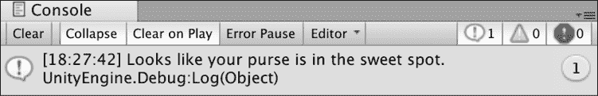
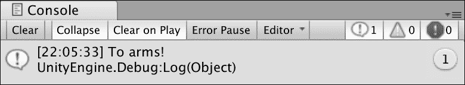
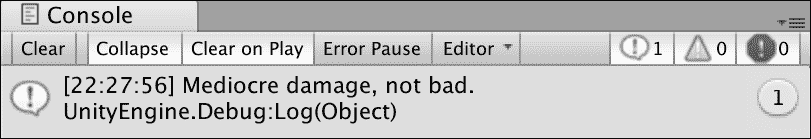
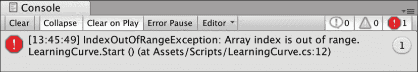
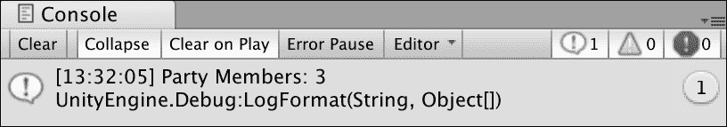
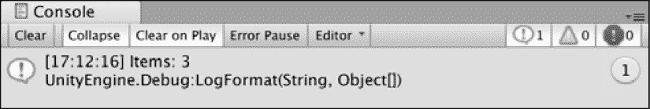
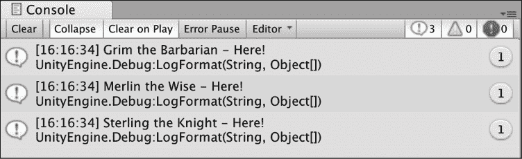
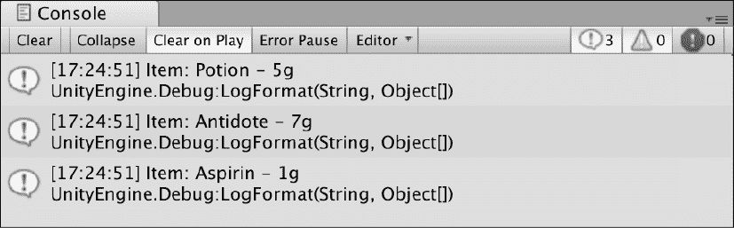

# 4

# 控制流和集合类型

计算机的中心职责之一是控制在满足预定条件时发生的情况。 当你点击一个文件夹时，你希望它打开; 当您在键盘上键入时，您希望文本反映您的击键。 为应用程序或游戏编写代码也没有什么不同——它们都需要在一种状态下以某种方式表现，在条件改变时以另一种方式表现。 在编程术语中，这被称为控制流，因为它控制代码如何在不同场景中执行的流。

除了使用控制语句之外，我们还将亲自查看集合数据类型。 集合是一种类型，允许在单个变量中存储多个值和值分组。 我们将这一章分成以下几个主题:

*   选择语句
*   使用数组、字典和列表集合
*   带有`for`、`foreach`和`while`循环的迭代语句
*   修复无限循环

# 选择语句

最复杂的编程问题通常可以归结为一组简单的选择，由游戏或程序评估和执行。 因为 Visual Studio 和 Unity 不能自己做出这些选择，所以我们可以自己写下这些决定。

`if-else`和`switch`选择语句允许您根据一个或多个条件指定分支路径，以及您希望在每种情况下采取的操作。 传统上，这些条件包括:

*   检测用户输入
*   求值表达式和布尔逻辑
*   比较变量或文字值

在下一节中，您将从这些条件语句中最简单的开始`if-else`。

## if - else 语句

`if-else`语句是代码中最常见的决策方式。 当去除它的所有语法时，其基本思想是，*如果我的条件满足，执行这段代码; 如果不是，则执行另一段代码*。 把这些语句想象成一扇门，而条件就是它们的钥匙。 要通过，密钥需要是有效的。 否则，进入将被拒绝，密码将被发送到下一个可能的门。 让我们看一下声明这些门之一的语法。

一个有效的`if-else`语句需要以下条件:

*   行首的`if`关键字
*   一对圆括号用来保存条件
*   括号内的语句体

它看起来是这样的:

```cs
if(condition is true)
{
    Execute code of code 
} 
```

可以选择添加一个`else`语句来存储在`if`语句条件失败时您想要采取的操作。 同样的规则也适用于`else`语句:

```cs
else 
    Execute single line of code
// OR
else 
{
    Execute multiple lines
    of code
} 
```

在蓝图形式下，语法读起来就像一个句子，这就是为什么这是推荐的方法:

```cs
if(condition is true)
{
    Execute this code
    block
}
else 
{
    Execute this code 
    block
} 
```

因为这些是对逻辑思维的很好的介绍，至少在编程中是这样的，所以我们将更详细地分解三种不同的`if-else`变体:

1.  A single `if` statement can exist by itself in cases where you don't care about what happens if the condition isn't met. In the following example, if `hasDungeonKey` is set to `true`, then a debug log will print out; if set to `false`, no code will execute:

    ```cs
    public class LearningCurve: MonoBehaviour 
    {
        public bool hasDungeonKey = true;
        Void Start() 
        {
            if(hasDungeonKey) 
            {
                Debug.Log("You possess the sacred key – enter.");
            }
        }
    } 
    ```

    当提到一个条件被满足时，我的意思是它的计算结果为 true，这通常被称为传递条件。

2.  在需要采取行动的情况下，添加一个`else`语句，无论条件是真还是假。 如果`hasDungeonKey`为`false`，则`if`语句将失败，代码执行将跳转到`else`语句:

    ```cs
    public class LearningCurve: MonoBehaviour 
    {
        public bool hasDungeonKey = true;
        void Start() 
        {
            if(hasDungeonKey) 
            {
                Debug.Log("You possess the sacred key – enter.");
            } 
            else 
            {
                Debug.Log("You have not proved yourself yet.");
            }
        }
    } 
    ```

3.  对于需要有两个以上可能结果的情况，添加带有括号、条件和花括号的`else-if`语句。 这是最好的展示，而不是解释，下面我们将进行解释。

请记住，`if`语句可以单独使用，但其他语句不能单独存在。 还可以使用基本的数学操作创建更复杂的条件，如`>`(大于)、`<`(小于)、`>=`(大于或等于)、`<=`(小于或等于)和`==`(等效)。 例如，条件(2>3)将返回`false`并失败，而条件(2<3)将返回`true`并通过。

现在不要担心太多的事情; 你很快就能拿到这些东西了。

让我们写出一个`if-else`语句来检查字符口袋里的钱数，在三种不同的情况下返回不同的调试日志——大于`50`，小于`15`，以及其他情况:

1.  打开`LearningCurve`并添加一个新的公共变量`int`，命名为`CurrentGold`。 将其值设置为 1 到 100 之间:

    ```cs
    public int CurrentGold = 32; 
    ```

2.  创建一个没有返回值的`public`方法，称为`Thievery`，并在`Start`中调用它。
3.  在新函数中，添加一个`if`语句来检查`CurrentGold`是否大于`50`，如果为真，则向控制台打印一条消息:
4.  在不同的调试日志中添加`else-if`语句检查`CurrentGold`是否小于`15`:
5.  添加不带条件的`else`语句和最终的默认日志:

    ```cs
    else
    {
        Debug.Log("Looks like your purse is in the sweet spot.");
    } 
    ```

6.  保存文件，检查您的方法是否与下面的代码匹配，然后单击 play:

    ```cs
    public void Thievery()
    {
        if(CurrentGold > 50)
        {
            Debug.Log("You're rolling in it!");
        } else if (CurrentGold < 15)
        {
            Debug.Log("Not much there to steal...");
        } else
        {
            Debug.Log("Looks like your purse is in the sweet spot.");
        }
    } 
    ```

在我的示例中，将`CurrentGold`设置为`32`，我们可以将代码序列分解如下:

1.  由于`CurrentGold`不大于`50`，所以跳过`if`语句和调试日志。
2.  `else-if`语句和调试日志也会被跳过，因为`CurrentGold`不小于`15`。
3.  Since 32 is not less than 15 or greater than 50, neither of the previous conditions was met. The `else` statement executes and the third debug log is displayed:

    

    图 4.1:显示调试输出的控制台屏幕截图

在您自己为`CurrentGold`尝试了其他一些值之后，让我们讨论一下如果我们想测试一个失败的条件会发生什么。

### 使用 NOT 操作符

用例并不总是需要检查阳性或`true`条件，而这正是`NOT`操作符出现的地方。 使用单个感叹号编写的`NOT`操作符允许`if`或`else-if`语句满足否定或错误的条件。 这意味着以下条件是相同的:

```cs
if(variable == false)
// AND
if(!variable) 
```

正如您已经知道的，您可以在`if`条件中检查布尔值、文字值或表达式。 因此，自然地，`NOT`操作员必须具有适应性。

下面是两个不同的负值`hasDungeonKey`和`weaponType`的例子，在`if`语句中使用:

```cs
public class LearningCurve : MonoBehaviour
{
    public bool hasDungeonKey = false;
    public string weaponType = "Arcane Staff";
    void Start()
    {
        if(!hasDungeonKey)
        {
            Debug.Log("You may not enter without the sacred key.");
        }
        if(weaponType != "Longsword")
{
            Debug.Log("You don't appear to have the right type of weapon...");
}
    }
} 
```

我们可以用来评价每一个语句如下:

*   The first statement can be translated to, "If `hasDungeonKey` is `false`, the `if` statement evaluates to true and executes its code block."

    如果你问你自己一个错误的值怎么能算为真，可以这样想:`if`语句不是检查值是否为真，而是检查表达式本身是否为真。 `hasDungeonKey`可能被设置为 false，但这就是我们要检查的，所以它在`if`条件的上下文中为真。

*   第二条语句可以翻译为:“如果`weaponType`的字符串值是`not equal`到`Longsword`，则执行此代码块。”

你可以在下面的截图中看到调试结果:


图 4.2:控制台显示 NOT 操作符输出的屏幕截图

但是，如果您仍然感到困惑，请将我们在本节中看到的代码复制到`LearningCurve`中，并对变量值进行操作，直到它有意义为止。

到目前为止，我们的分支条件已经相当简单了，但是 c#还允许条件语句在更复杂的情况下相互嵌套。

### 嵌套语句

`if-else`语句最有价值的功能之一是它们可以彼此嵌套在一起，从而在代码中创建复杂的逻辑路径。 在编程中，我们称之为决策树。 就像真正的走廊一样，门后面也可以有门，创造出各种可能性的迷宫:

```cs
public class LearningCurve : MonoBehaviour 
{
    public bool weaponEquipped = true;
    public string weaponType = "Longsword";
    void Start()
    {
        if(weaponEquipped)
        {
            if(weaponType == "Longsword")
            {
                Debug.Log("For the Queen!");
            }
        }
        else 
        {
            Debug.Log("Fists aren't going to work against armor...");
        }
    }
} 
```

让我们分解前面的例子:

*   首先，一个`if`语句检查是否有`weaponEquipped`。 此时，代码只关心它是否是`true`，而不关心它是什么类型的武器。
*   第二个`if`语句检查`weaponType`并打印出相关的调试日志。
*   如果第一个`if`语句的计算结果为`false`，则代码将跳转到`else`语句及其调试日志。 如果第二个`if`语句的计算结果为`false`，则不会打印任何内容，因为没有`else`语句。

处理逻辑结果的责任 100%落在程序员身上。 由您来决定您的代码可以采用的可能分支或结果。

到目前为止，您所学的知识将使您顺利地通过简单的用例。 然而，您将很快发现自己需要更复杂的语句，这就需要对多个条件进行评估。

### 评估多个条件

除了嵌套语句外，还可以使用`AND``OR`逻辑操作符将多个条件检查组合到单个`if`或`else-if`语句中:

*   `AND`由两个“与”字`&&`组成。 使用`AND`操作符的任何条件都意味着要执行`if`语句，所有条件的值都必须为真。
*   `OR`由两个管字`||`组成。 使用`OR`操作符的`if`语句将在其一个或多个条件为真时执行。
*   条件总是从左到右计算。

在下面的例子中，`if`语句被更新以检查`weaponEquipped`和`weaponType`，这两个语句都需要为真，代码块才能执行:

```cs
if(weaponEquipped && weaponType == "Longsword")
{
    Debug.Log("For the Queen!");
} 
```

`AND``OR`操作符可以组合在一起以任意顺序检查多个条件。 您可以组合多少个操作符也没有限制。 只是在同时使用它们时要小心，不要创建永远不会执行的逻辑条件。

现在是时候将我们目前学到的关于`if`语句的所有内容进行测试了。 因此，如果需要，请复习这一节，然后继续下一节。

让我们用一个小宝箱实验来巩固这个话题:

1.  宣布三个变量的顶部`LearningCurve`:`PureOfHeart`是`bool`和`true`,`HasSecretIncantation`也是一个`bool`,应该`false`,`RareItem`是一个字符串,它的值是由你自己决定 :

    ```cs
    public bool PureOfHeart = true;
    public bool HasSecretIncantation = false;
    public string RareItem = "Relic Stone"; 
    ```

2.  创建一个没有返回值的`public`方法，称为`OpenTreasureChamber`，并从`Start()`内部调用它。
3.  在`OpenTreasureChamber`内部，声明一个`if-else`语句来检查`PureOfHeart`是否为`true`*和*，并且`RareItem`匹配您分配给它的字符串值:

    ```cs
    if(PureOfHeart && RareItem == "Relic Stone")
    {
    } 
    ```

4.  在第一个语句中创建一个嵌套的`if-else`语句，检查`HasSecretIncantation`是否为`false`:

    ```cs
    if(!HasSecretIncantation)
    {
        Debug.Log("You have the spirit, but not the knowledge.");
    } 
    ```

5.  为每个`if-else`案例添加调试日志。
6.  保存，检查您的代码与下面的代码匹配，然后单击播放:

    ```cs
    public class LearningCurve : MonoBehaviour
    {
        public bool PureOfHeart = true;
        public bool HasSecretIncantation  = false;
        public string RareItem = "Relic Stone";
        // Use this for initialization
        void Start()
        {
            OpenTreasureChamber();
        }
        public void OpenTreasureChamber()
        {
            if(PureOfHeart && RareItem == "Relic Stone")
            {
                if(!HasSecretIncantation)
                {
                    Debug.Log("You have the spirit, but not the knowledge.");
                }
                else
                {
                    Debug.Log("The treasure is yours, worthy hero!");
                }
            }
            else
            {
                Debug.Log("Come back when you have what it takes.");
            }
        }
    } 
    ```

如果您将变量值匹配到前面的截图，那么嵌套的`if`语句调试日志将被打印出来。 这意味着我们的代码通过了第一个`if`语句来检查两个条件，但是没有通过第三个条件:


图 4.3:控制台中首次输出的屏幕截图

现在，您可以停在这里，并使用更大的`if-else`语句来满足所有的条件需求，但从长远来看，这将不是有效的。 好的编程是关于为正确的工作使用正确的工具，这就是`switch`语句的作用所在。

## switch 语句的

`if-else`语句是编写决策逻辑的好方法。 然而，当您拥有超过 3 或 4 个分支操作时，它们就不可行了。 在您意识到这一点之前，您的代码最终可能会看起来像一个难以理解的纠结的结，而且更新起来令人头疼。

`switch`语句包含了表达式，让我们写出针对每个可能结果的动作，但要比`if-else`简洁得多。

`switch`语句需要以下元素:

*   关键字`switch`后跟一对括号，其中包含其条件
*   一对花括号
*   以冒号结尾的每个可能路径的`case`语句:代码或方法的单独行，后跟`break`关键字和分号
*   默认的以冒号结尾的`case`语句:单个代码行或方法，后面跟着`break`关键字和分号

在蓝图形式中，它看起来是这样的:

```cs
switch(matchExpression)
{
    **case** matchValue1:
        Executing code block
        **break****;**
    **case** matchValue2:
        Executing code block
        **break****;**
    **default****:**
        Executing code block
        **break****;**
} 
```

在前面的蓝图中突出显示的关键字是重要的位。 当定义了`case`语句时，其冒号和`break`关键字之间的任何内容都类似于`if-else`语句的代码块。 `break`关键字只是告诉程序在选定的`case`触发后完全退出`switch`语句。 现在，让我们讨论一下语句如何确定执行哪个`case`，这称为模式匹配。

### 模式匹配

在`switch`语句中，模式匹配是指如何根据多个`case`语句验证匹配表达式。 匹配表达式可以是不为空或不为空的任何类型; 所有的`case`语句值都需要匹配匹配表达式的类型。

例如，如果我们有一个正在计算整数变量的`switch`语句，那么每个`case`语句都需要指定一个整数值来进行检查。

具有匹配表达式的值的`case`语句将被执行。 如果没有匹配`case`，则触发默认的`case`。 让我们自己试试吧!

这是很多新的语法和信息，但它有助于看到它的实际操作。 让我们为角色可能采取的不同行动创建一个简单的`switch`语句:

1.  创建一个名为`CharacterAction`的新字符串变量(成员或本地)，并将其设置为`Attack:`

    ```cs
    string CharacterAction = "Attack"; 
    ```

2.  创建一个没有返回值的`public`方法`PrintCharacterAction`，并在`Start`中调用它。
3.  声明一个`switch`语句并使用`CharacterAction`作为匹配表达式:

    ```cs
    switch(CharacterAction)
    {
    } 
    ```

4.  使用不同的调试日志为`Heal`和`Attack`创建两个`case`语句。 不要忘记在每个末尾包含`break`关键字:
5.  添加带有调试日志和`break:`

    ```cs
    default:
        Debug.Log("Shields up.");
        break; 
    ```

    的默认情况
6.  保存文件，使确保你的代码与下面的截图匹配，然后点击播放:

    ```cs
    string CharacterAction = "Attack";
    // Start is called before the first frame update
    void Start()
    {
        PrintCharacterAction();
    }
    public void PrintCharacterAction()
    {
        switch(CharacterAction)
        {
            case "Heal":
                Debug.Log("Potion sent.");
                break;
            case "Attack":
                Debug.Log("To arms!");
                break;
            default:
                Debug.Log("Shields up.");
                break;
        }
    } 
    ```

由于`CharacterAction`被设置为`Attack`，`switch`语句执行第二种情况并打印其调试日志:



图 4.4:控制台中 switch 语句输出的屏幕截图

将`CharacterAction`更改为`Heal`或未定义的操作，以查看第一个和默认操作。

有些时候，您需要多个而不是所有的`switch`案例来执行相同的操作。 这些被称为跌落案例，是我们下一节的主题。

### 失败案例

`switch`语句可以为多个情况执行相同的操作，类似于在单个`if`语句中指定多个条件。 这个术语被称为跌落案例，有时，跌落案例。 Fall-through 用例允许您为多个用例定义一组操作。 如果一个 case 块为空，或者没有`break`关键字的代码，它将直接落入下面的 case 块。 这有助于保持您的开关代码干净和高效，没有重复的 case 块。

用例可以以任何顺序编写，因此创建跌落用例极大地提高了代码的可读性和效率。

让我们用`switch`语句和失败案例来模拟桌面游戏场景，其中掷骰子决定特定行动的结果:

1.  创建一个名为`DiceRoll`的变量`int`，并将其赋值为`7`:

    ```cs
    int DiceRoll = 7; 
    ```

2.  创建一个没有返回值的`public`方法，称为`RollDice`，并在`Start`中调用它。
3.  添加一个以`DiceRoll`作为匹配表达式的`switch`语句:

    ```cs
    switch(DiceRoll)
    {
    } 
    ```

4.  在`7`、`15`和`20`添加三种可能的掷骰子情况，并在最后添加一个默认的`case`语句。
5.  案例`15`和`20`应该有它们自己的调试日志和`break`语句，而案例`7`应该落入案例`15:`

    ```cs
    case 7:
    case 15:
        Debug.Log("Mediocre damage, not bad.");
        break;
    case 20:
        Debug.Log("Critical hit, the creature goes down!");
        break;
    default:
        Debug.Log("You completely missed and fell on your face.");
        break; 
    ```

6.  Save the file and run it in Unity.

    如果您想看到实际的失败情况，请尝试在情况 7 中添加调试日志，但不添加`break`关键字。

当`DiceRoll`设置为`7`时，`switch`语句将与第一个`case`匹配，第一个`case`将通过并执行`case 15`，因为它缺少代码块和`break`语句。 如果您将`DiceRoll`改为`15`或`20`，控制台将显示它们各自的消息，而任何其他值将在语句的末尾触发默认情况:



图 4.5:跌落开关语句代码的截图

`switch`语句非常强大，甚至可以简化最复杂的决策逻辑。 如果您想深入了解开关模式匹配，请参考[https://docs.microsoft.com/en-us/dotnet/csharp/language-reference/keywords/switch](https://docs.microsoft.com/en-us/dotnet/csharp/language-reference/keywords/switch)。

这就是我们现在需要知道的条件逻辑。 因此，如果您有必要的话，请回顾本节，然后在继续讨论集合之前测试下面的测试!

## 突击测验一，如果，和，或者但是

用下面的问题来测试你的知识:

1.  用什么值来评价`if`语句?
2.  哪个运算符可以把一个真条件变为假条件变为真?
3.  如果要执行`if`语句的代码，两个条件必须为真，您将使用哪个逻辑运算符来连接这些条件?
4.  如果执行`if`语句的代码只需要两个条件中的一个为真，那么您将使用哪个逻辑运算符来连接这两个条件?

完成这些之后，就可以进入收集数据类型的世界了。 这些类型将为你的游戏和 c#程序开辟一个全新的编程功能子集!

# 收藏概览

到目前为止，我们只需要变量来存储单个值，但是在许多情况下需要一组值。 c#中的集合类型包括数组、字典和列表——每一种类型都有其优缺点，我们将在下面的小节中讨论。

## 数组

数组是 c#提供的最基本的集合。 可以把它们看作一组值的容器，在编程术语中称为*元素*，每个元素都可以单独访问或修改:

*   数组可以存储任何类型的值; 所有的元素都需要具有相同的类型。
*   长度，或者一个数组可以拥有的元素数量，是在创建时设置的，之后不能修改。
*   如果在创建时没有分配初始值，那么将给每个元素一个默认值。 存储数字类型的数组默认为零，而任何其他类型将被设置为空或为空。

数组是 c#中最不灵活的集合类型。 这主要是因为元素创建后不能添加或删除。 然而，当存储不太可能更改的信息时，它们特别有用。 这种灵活性的缺乏使得它们比其他集合类型更快。

声明数组类似于我们使用过的其他变量类型，但有一些修改:

*   数组变量需要指定的元素类型、一对方括号和唯一的名称。
*   关键字`new`用于在内存中创建数组，后面是值类型和另一对方括号。 预留内存区域是您打算在新数组中存储的数据的确切大小。
*   数组将存储的元素数放在第二对方括号中。

在 blueprint形式中，它看起来是这样的:

```cs
elementType[] name = new elementType[numberOfElements]; 
```

让我们以我们需要在游戏中存储前 3 个高分为例:

```cs
int[] topPlayerScores = new int[3]; 
```

分解后，`topPlayerScores`是一个整数数组，将存储三个整数元素。 因为我们没有添加任何初始值，所以`topPlayerScores`中的三个值都是`0`。 但是，如果更改数组大小，原始数组的内容将丢失，因此要小心。

当数组被创建时，你可以直接给它赋值，方法是将值添加到变量声明后面的一对花括号中。 c#有一种简单快捷的方式来实现这一点，但两者都是同样有效的:

```cs
// Longhand initializer
int[] topPlayerScores = new int[] {713, 549, 984};
// Shortcut initializer
int[] topPlayerScores = { 713, 549, 984 }; 
```

使用简写语法初始化数组是非常常见的，所以我将在本书的其余部分中使用它。 然而，如果你想提醒自己细节，可以使用明确的措辞。

现在声明语法不再神秘，让我们来谈谈数组元素是如何存储和访问的。

### 索引和下标

每个数组元素按其被分配的顺序存储，这被称为其索引。 数组是零索引的，这意味着元素的顺序从 0 而不是 1 开始。 可以将元素的索引看作它的引用或位置。

在`topPlayerScores`中，第一个整数`452`位于索引`0`，`713`位于索引`1`，`984`位于索引`2`:


图 4.6:数组索引映射到它们的值

每个值通过使用下标操作符的索引来定位，下标操作符是一对方括号，其中包含元素的索引。 例如，为了检索并存储`topPlayerScores`中的第二个数组元素，我们将使用数组名后跟下标括号和索引`1`:

```cs
// The value of score is set to 713
int score = topPlayerScores[1]; 
```

下标操作符也可以直接用于修改数组值，就像任何其他变量一样，甚至可以作为表达式本身传递:

```cs
topPlayerScores[1] = 1001; 
```

`topPlayerScores`中的值将是`452`、`1001`和`984`。

### 范围的例外

当数组被创建时，元素的数量被设置且不可更改，这意味着我们不能访问不存在的元素。 在`topPlayerScores`示例中，数组长度为 3，因此有效索引的范围从`0`到`2`。 任何`3`或更高的索引都超出了数组的范围，并将在控制台中生成一个恰当命名的`IndexOutOfRangeException`错误:



图 4.7:索引超出范围异常的截图

良好的编程习惯要求通过检查我们想要的值是否在数组的索引范围内来避免范围异常，我们将在*迭代语句*节中讨论这个问题。

你总是可以用`Length`属性检查数组的长度，即它包含多少项:

```cs
topPlayerScores.Length; 
```

在我们的例子中，`topPlayerScores`的长度是 4。

数组并不是 c#提供的唯一集合类型。 在下一节中，我们将处理列表，它在编程领域中更灵活、更常见。

## 列表

**列表**与数组密切相关，在一个变量中收集相同类型的多个值。 当涉及到添加、删除和更新元素时，它们更容易处理，但它们的元素不是按顺序存储的。 它们也是可变的，这意味着您可以更改正在存储的项的长度或数量，而不会覆盖整个变量。 有时，这可能导致比阵列更高的性能成本。

性能成本是指某项操作占用计算机多少时间和精力。 如今，计算机速度很快，但它们仍可能因大型游戏或应用程序而过载。

列表类型变量需要满足以下要求:

*   `List`关键字，它的元素类型在左右箭头字符中，以及唯一的名称
*   关键字`new`在内存中初始化列表，关键字`List`和元素类型位于箭头字符之间
*   以分号结尾的一对括号

图纸形式如下:

```cs
List<elementType> name = new List<elementType>(); 
```

列表的长度总是可以修改的，所以在创建时不需要指定它最终将包含多少个元素。

与数组一样，list可以在变量声明中通过在一对花括号中添加元素值来初始化:

```cs
List<elementType> name = new List<elementType>() { value1, value2 }; 
```

元素按照它们被添加的顺序(而不是值本身的顺序)存储，索引为零，可以使用下标操作符访问。

让我们开始设置一个我们自己的列表来测试这个类提供的基本功能。

让我们做一个热身练习，在一个虚构的角色扮演游戏中创建一个政党成员列表:

1.  在`Start`中创建一个名为`QuestPartyMembers`的`string`类型的新`List`，并使用三个字符的名称对其进行初始化:

    ```cs
    List<string> QuestPartyMembers = new List<string>()
        {
            "Grim the Barbarian",
            "Merlin the Wise",
            "Sterling the Knight"
        }; 
    ```

2.  添加调试日志，使用`Count`方法打印出列表中的党员数量:

    ```cs
    Debug.LogFormat("Party Members: {0}", QuestPartyMembers.Count); 
    ```

3.  保存文件并在 Unity 中播放。

我们初始化了一个名为`QuestPartyMembers`的新列表，该列表现在包含三个字符串值，并使用`List`类中的`Count`方法打印元素的数量。 注意，您对列表使用了`Count`，而对数组使用了`Length`。



图 4.8:控制台中列表项输出的屏幕截图

知道多个元素在列表中的位置非常有用; 然而，在大多数情况下，这些信息是不够的。 我们希望能够根据需要修改我们的列表，这一点我们将在后面讨论。

### 访问和修改列表

列表元素可以像数组一样通过下标操作符和索引来访问和修改，只要索引在`List`类的范围内。 然而，`List`类有各种扩展其功能的方法，例如添加、插入和删除元素。

按照`QuestPartyMembers`列表，我们增加一个新成员:

```cs
 QuestPartyMembers.Add("Craven the Necromancer"); 
```

`Add()`方法将新元素追加到列表的末尾，从而使`QuestPartyMembers`计数为 4，元素顺序如下:

```cs
{ "Grim the Barbarian", "Merlin the Wise", "Sterling the Knight",
    "Craven the Necromancer"}; 
```

要将元素添加到列表中的特定位置，可以将索引和想要添加的值传递给`Insert()`方法:

```cs
 QuestPartyMembers.Insert(1, "Tanis the Thief"); 
```

当将一个元素插入到先前占用的索引中时，列表中所有元素的索引都增加`1`。 在我们的例子中，`"Tanis the Thief"`现在位于索引`1`，这意味着`"Merlin the Wise"`现在位于索引`2`而不是`1`，以此类推:

```cs
{ "Grim the Barbarian", "Tanis the Thief", "Merlin the Wise", "Sterling
    the Knight", "Craven the Necromancer"}; 
```

删除一个元素也很简单; 我们所需要的只是索引或文字值，而`List`类完成了以下工作:

```cs
// Both of these methods would remove the required element
QuestPartyMembers.RemoveAt(0); 
QuestPartyMembers.Remove("Grim the Barbarian"); 
```

在编辑结束时，`QuestPartyMembers`现在包含以下从`0`到`3`索引的元素:

```cs
{ "Tanis the Thief", "Merlin the Wise", "Sterling the Knight", "Craven
    the Necromancer"}; 
```

还有更多的`List`类方法允许进行值检查、查找和排序元素以及处理范围。 完整的方法列表和描述可以在这里找到:[https://docs.microsoft.com/en-us/dotnet/api/system.collections.generic.list-1?view=netframework-4.7.2](https://docs.microsoft.com/en-us/dotnet/api/system.collections.generic.list-1?view=netframework-4.7.2)。

虽然列表非常适合单值元素，但在某些情况下，您需要存储包含多个值的信息或数据。 这就是词典发挥作用的地方。

## 字典

**Dictionary**类型通过在每个元素中存储值对而不是单个值，从而远离了数组和列表。 这些元素被称为键-值对:键充当其对应值的索引或查找值。 与数组和列表不同，字典是无序的。 但是，在创建它们之后，可以在各种配置中对它们进行排序和排序。

声明字典和声明列表几乎是一样的，但是增加了一个细节——键和值类型都需要在箭头符号中指定:

```cs
Dictionary<keyType, valueType> name = new Dictionary<keyType,
  valueType>(); 
```

要用键值对初始化一个字典，请执行以下操作:

*   在声明的末尾使用一对花括号。
*   将每个元素添加到它的一对花括号中，用逗号分隔键和值。
*   用逗号分隔元素，除了最后一个元素，其中逗号是可选的。

它看起来是这样的:

```cs
Dictionary<keyType, valueType> name = new Dictionary<keyType,
  valueType>()
{
    {key1, value1},
    {key2, value2}
}; 
```

在选择键值时需要考虑的一个重要注意事项是，每个键必须是唯一的，并且不能更改它们。 如果您需要更新一个键，那么您需要在变量声明中更改它的值，或者删除整个键-值对并在代码中添加另一个键-值对，下面我们将讨论这一点。

就像数组和列表一样，在 Visual Studio 中，字典可以在一行中初始化，没有任何问题。 但是，像前面的示例一样，在其行上写出每个键值对是一种很好的习惯——无论是为了可读性还是为了您的头脑。

让我们创建一个字典来存储字符可能携带的项:

1.  在`Start`方法中声明一个`Dictionary`与`key`类型的`string`和`value`类型的`ItemInventory`。
2.  将其初始化为`new Dictionary<string, int>()`，并添加您选择的三个键值对。 确保每个元素都在它的一对花括号中:
3.  添加一个调试日志以打印出`ItemInventory.Count`属性，这样我们就可以看到条目是如何存储的:
4.  保存文件并播放。

这里创建了一个名为`ItemInventory`的新字典，并使用三个键值对进行初始化。 我们将键指定为字符串，相应的值为整数，并打印出`ItemInventory`当前持有多少个元素:



图 4.9:控制台中字典计数的截图

与列表一样，我们需要做的不仅仅是打印给定字典中的键值对的数量。 在下一节中，我们将探讨如何添加、删除和更新这些值。

### 使用字典对

键值对可以使用下标方法和类方法从字典中添加、删除和访问。 为了检索元素的值，使用带有元素键的下标操作符——在下面的例子中，`numberOfPotions`将被赋值为`5`:

```cs
int numberOfPotions = `I`temInventory["Potion"]; 
```

可以使用相同的方法更新元素的值——与`"Potion"`相关联的值现在是`10`:

```cs
`I`temInventory["Potion"] = 10; 
```

元素可以通过两种方式添加到字典中:使用`Add`方法和使用下标操作符。 方法接受一个键和一个值，并创建一个新的键-值元素，只要它们的类型对应于字典声明:

```cs
`I`temInventory.Add("Throwing Knife", 3); 
```

如果使用下标操作符为字典中不存在的键赋值，编译器将自动将其作为一个新的键值对添加。 例如，如果我们想为`"Bandage"`添加一个新元素，我们可以使用以下代码:

```cs
`I`temInventory["Bandage"] = 5; 
```

这就提出了引用键值对的一个关键点:最好在尝试访问一个元素之前确定它已经存在，以避免错误地添加新的键值对。 将`ContainsKey`方法与`if`语句配对是一种简单的解决方案，因为`ContainsKey`根据键是否存在返回一个布尔值。 在下面的例子中，在修改键值之前，我们使用`if`语句确保`"Aspirin"`键存在:

```cs
if(`I`temInventory.ContainsKey("Aspirin"))
{
    `I`temInventory["Aspirin"] = 3;
} 
```

最后，可以使用`Remove()`方法从字典中删除键值对，该方法接受一个键参数:

```cs
`I`temInventory.Remove("Antidote"); 
```

与列表一样，字典提供了各种方法和功能，使开发变得更容易，但我们不能在这里一一介绍。 如果您好奇，可以在[https://docs.microsoft.com/en-us/dotnet/api/system.collections.generic.dictionary-2?view=netframework-4.7.2](https://docs.microsoft.com/en-us/dotnet/api/system.collections.generic.dictionary-2?view=netframework-4.7.2)找到官方文档。

集合在我们的工具箱中是安全的，所以现在是进行另一个测试的时候了，以确保您已经准备好将转移到下一个大主题:迭代语句。

## 突击测验 2 -所有关于集合

*   什么是数组或列表中的元素?
*   数组或列表的第一个元素的索引号是多少?
*   一个数组或列表可以存储不同类型的数据吗?
*   如何向数组中添加更多元素来为更多数据腾出空间?

由于集合是项的组或列表，因此需要以有效的方式访问它们。 幸运的是，c#有几个迭代语句，我们将在下一节中讨论。

# 迭代语句

我们已经通过下标操作符和集合类型方法访问了单个集合元素，但是当我们需要逐个遍历整个集合元素时，该怎么办呢? 在编程中，这被称为迭代，c#提供了几种语句类型，允许我们循环(或者迭代，如果您想要更专业的话)集合元素。 迭代语句类似于方法，它们存储要执行的代码块; 与方法不同，它们可以重复执行它们的代码块，只要满足它们的条件。

## for 循环

`for`循环最常用于代码块在程序继续之前被执行一定次数。 语句本身有三个表达式，每个表达式在循环执行之前都有一个特定的函数要执行。 由于`for`循环跟踪当前的迭代，所以它们最适合于数组和列表。

看看下面的循环语句蓝图:

```cs
for (initializer; condition; iterator)
{
    code block;
} 
```

让我们来分析一下:

1.  `for`关键字开始语句，后跟一对括号。
2.  括号内是看门人:`initializer`、`condition`和`iterator`表达式。
3.  循环从`initializer`表达式开始，它是一个局部变量，用于跟踪循环执行的次数——通常将其设置为 0，因为集合类型是零索引的。
4.  接下来，检查`condition`表达式，如果为真，则继续到迭代器。
5.  `iterator`表达式用于增加或减少(递增或递减)初始化式，这意味着下一次循环计算其条件时，初始化式将不同。

将一个值增加 1 或减少 1 分别称为递增和递减(`--`将值减少 1，而`++`将值增加 1)。

这听起来像很多，所以让我们看一个实际的例子，用我们之前创建的`QuestPartyMembers`列表:

```cs
List<string> QuestPartyMembers = new List<string>()
{ "Grim the Barbarian", "Merlin the Wise", "Sterling the Knight"}; 
for (int i = 0; i < QuestPartyMembers.Count; i++)
{
    Debug.LogFormat("Index: {0} - {1}", i, QuestPartyMembers[i]);
} 
```

让我们再次执行这个循环，看看它是如何工作的:

1.  首先，将`for`循环中的`initializer`设置为名为`i`的局部`int`变量，初始值为`0`。
2.  为了确保不会出现超出范围的异常，`for`循环确保只有当`i`小于`QuestPartyMembers`中的元素数时，循环才会运行:
    *   对于数组，我们使用`Length`属性来确定它有多少项
    *   对于列表，我们使用`Count`属性
3.  最后，每次使用`++`操作符运行循环时，`i`增加 1。
4.  在`for`循环中，我们刚刚使用`i`打印出了索引和该索引处的列表元素。
5.  注意，`i`与集合元素的索引是同步的，因为它们都是从 0 开始的:

    

图 4.10:使用 for 循环输出列表值的屏幕截图

传统上，字母`i`通常用作初始化器变量名。 如果碰巧有嵌套的`for`循环，则使用的变量名应该是字母 j、k、l 等。

让我们在现有的集合上尝试新的迭代语句。

当我们循环遍历`QuestPartyMembers`时，让我们看看是否可以识别某个元素何时被迭代，并为这种情况添加一个特殊的调试日志:

1.  将`QuestPartyMembers`列表和`for`循环移动到一个名为`FindPartyMember`的公共函数中，并在`Start`中调用它。
2.  在`for`循环的调试日志下面添加`if`语句，检查当前`questPartyMember`列表是否匹配`"Merlin the Wise":`

    ```cs
    if(QuestPartyMembers[i] == "Merlin the Wise")
    {
        Debug.Log("Glad you're here Merlin!");
    } 
    ```

3.  如果是，添加您选择的调试日志，检查您的代码是否匹配下面的截图，并点击播放:

    ```cs
    // Start is called before the first frame update
    void Start()
    {
        FindPartyMember();
    }
    public void FindPartyMember()
    {
        List<string> QuestPartyMembers = new List<string>()
        {
            "Grim the Barbarian",
            "Merlin the Wise",
            "Sterling the Knight"
        };
        Debug.LogFormat("Party Members: {0}", QuestPartyMembers.Count);
        for(int i = 0; i < QuestPartyMembers.Count; i++)
        {
            Debug.LogFormat("Index: {0} - {1}", i, QuestPartyMembers[i]);
            if(QuestPartyMembers[i] == "Merlin the Wise")
            {
                Debug.Log("Glad you're here Merlin!");
            }
        }
    } 
    ```

控制台输出看起来应该几乎相同，除了现在是一个额外的调试日志—当轮到 Merlin 执行循环时，它只打印一次。 更具体地说，当在第二个循环中`i`等于`1`时，触发`if`语句，输出两个日志，而不是一个:


图 4.11:for 循环打印列表值和匹配 if 语句的屏幕截图

在适当的情况下，使用标准`for`循环可能非常有用，但是在编程中很少只有一种方法来做事情，这就是`foreach`语句发挥作用的地方。

## foreach 循环

`foreach`循环获取集合中的每个元素，将每个元素存储在局部变量中，使其在语句中可以访问。 局部变量类型必须匹配集合元素类型才能正常工作。 `foreach`循环可用于数组和列表，但它们对字典尤其有用，因为字典是键值对而不是数字索引。

在蓝图形式中，`foreach`循环是这样的:

```cs
foreach(elementType localName in collectionVariable)
{
    code block;
} 
```

让我们继续使用`Q``uestPartyMembers`列表示例，并对其每个元素进行点名:

```cs
List<string> QuestPartyMembers = new List<string>()
{ "Grim the Barbarian", "Merlin the Wise", "Sterling the Knight"};

foreach(string partyMember in QuestPartyMembers)
{
    Debug.LogFormat("{0} - Here!", partyMember);
} 
```

我们可以将其分解如下:

*   元素类型声明为`string`，它匹配`QuestPartyMembers`中的值。
*   创建一个名为`partyMember`的局部变量来保存循环重复时的每个元素。
*   关键字`in`后面跟着我们要循环遍历的集合，在本例中为`QuestPartyMembers`，完成任务:

    

图 4.12:foreach 循环输出列表值的屏幕截图

这比`for`循环简单得多。 然而，在处理字典时，有几个重要的差异我们需要——即如何将键值对作为局部变量处理。

### 遍历键值对

为了在局部变量中捕获键值对，我们需要使用适当命名的`KeyValuePair`类型，为键和值类型赋值以匹配字典对应的类型。 因为`KeyValuePair`是它的类型，它就像任何其他元素类型一样，作为一个局部变量。

例如，让我们循环遍历前面在*Dictionaries*部分中创建的`ItemInventory`字典，并像调试商店项描述一样调试每个键值:

```cs
Dictionary<string, int> `I`temInventory = new Dictionary<string, int>()
{
    { "Potion", 5},
    { "Antidote", 7},
    { "Aspirin", 1}
};

foreach(KeyValuePair<string, int> kvp in `I`temInventory)
{
     Debug.LogFormat("Item: {0} - {1}g", kvp.Key, kvp.Value);
} 
```

我们指定一个局部变量`KeyValuePair`,`kvp`,这是一个常见的命名约定在编程,就像调用初始化器`i``for`循环,并设置`key`和`value`类型`string`和`int`与【显示】。

为了访问本地变量`kvp`的键和值，我们分别使用`Key`和`Value`的`KeyValuePair`属性。

在这个示例中，键是`strings`，而`values`是整数，我们可以将其打印为项目名称和项目价格:



图 4.13:foreach 循环打印字典键值对的屏幕截图

如果你特别喜欢冒险，试试下面的可选挑战，把你刚刚学到的东西带回家。

#### 英雄的试验-寻找负担得起的物品

使用前面的脚本，创建一个变量来存储虚构角色拥有多少金币，然后看看是否可以在`foreach`循环中添加一个`if`语句来检查您能够负担的道具。

提示:用`kvp.Value`来比较你钱包里的价格。

## while 循环

`while`循环与`if`语句相似，只要单个表达式或条件为真，循环就运行。

值比较和布尔变量可以用作`while`条件，并且可以用`NOT`操作符修改。

`while`循环语法表示:*当我的条件为真时，继续无限地运行我的代码块*:

```cs
Initializer
while (condition)
{
    code block;
    iterator;
} 
```

在`while`循环中，通常声明一个初始化变量，就像在`for`循环中一样，然后在循环代码块的末尾手动增加或减少该变量。 我们这样做是为了避免无限循环，我们将在本章的最后讨论。 根据您的情况，初始化器通常是循环条件的一部分。

`while`循环在 c#中非常有用，但在 Unity 中却不被认为是一种很好的实践，因为它们会对性能产生负面影响，并且需要手动管理。

让我们以一个常见的用例为例，即我们需要在玩家活着时执行代码，然后在情况不再是这样时进行调试:

1.  创建一个名为`PlayerLives`类型的初始化变量，并将其设置为`3`:

    ```cs
    int PlayerLives = 3; 
    ```

1.  创建一个名为`HealthStatus`的新公共函数，并在`Start`中调用它。
2.  声明一个`while`循环，条件是检查`PlayerLives`是否大于`0`(即玩家仍然活着):

    ```cs
    while(PlayerLives > 0)
    {
    } 
    ```

3.  在`while`循环中，调试一些东西让我们知道字符仍然在踢，然后使用`--`操作符将`PlayerLives`减 1:

    ```cs
    Debug.Log("Still alive!");
    PlayerLives--; 
    ```

4.  Add a debug log after the `while` loop curly brackets to print something when our lives run out:

    ```cs
    Debug.Log("Player KO'd..."); 
    ```

    你的代码应该如下所示:

    ```cs
    int PlayerLives = 3;
    // Start is called before the first frame update
    void Start()
    {
        HealthStatus();
    }
    public void HealthStatus()
    {
        while(PlayerLives > 0)
        {
            Debug.Log("Still alive!");
            PlayerLives--;
        }
        Debug.Log("Player KO'd...");
    } 
    ```

`PlayerLives`从`3`开始，`while`循环将执行三次。 在每次循环期间，触发调试日志`"Still alive!"`，并从`PlayerLives`中减去一个生命周期。 当`while`循环第四次运行时，我们的条件失败了，因为`PlayerLives`是`0`，所以代码块被跳过，最终的调试日志打印出来:


图 4.14:控制台中 while 循环输出的屏幕截图

如果您没有看到多个“仍然活着”的调试日志，请确保没有选中**控制台**工具栏中的**Collapse**按钮。

现在的问题是，如果循环始终不停止的执行，会发生什么? 我们将在下一节中讨论这个问题。

## 飞向无限

在完成本章之前，我们需要理解一个在迭代语句中非常重要的概念:*无限循环*。 这就是它们听起来的样子:当循环的条件使它不可能停止运行并在程序中继续运行时。 当迭代器没有增加或减少时，无限循环通常发生在`for`和`while`循环中; 如果`PlayerLives`行代码被排除在`while`循环示例之外，Unity 将会冻结和/或崩溃，因为`PlayerLives`始终是 3，并将永远执行循环。

迭代器并不是唯一需要注意的罪魁祸首; 在`for`循环中设置永不失败的条件，或求值为 false，也可能导致无限循环。 在党员的例子中,从*键值遍历*部分,如果我们设置`for`循环条件`i < 0`,而不是`i < QuestPartyMembers.Count`,`i`总是小于`0`,循环直到团结坠毁。

# 总结

当我们结束这一章时，我们应该反思我们已经完成了多少，以及我们可以用这些新知识建立什么。 我们知道如何使用简单的`if-else`检查和更复杂的`switch`语句，从而允许在代码中进行决策。 我们可以用数组和列表来创建保存值集合的变量，或者用字典来创建键值对。 这使得复杂的分组数据能够被有效地存储。 我们甚至可以为每种集合类型选择正确的循环语句，同时小心地避免无限循环崩溃。

如果你感到超负荷，那完全没问题——逻辑、顺序思维都是锻炼你编程大脑的一部分。

下一章将完成 c#编程的基础知识，看看类、结构和面向对象编程(**OOP**)。 我们将把我们到目前为止学到的一切放到这些主题中，为我们第一次真正深入理解和控制 Unity 引擎中的对象做准备。