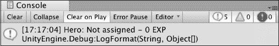
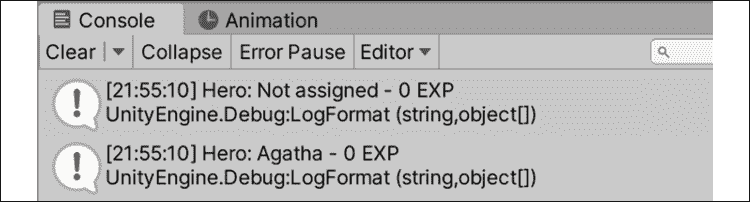
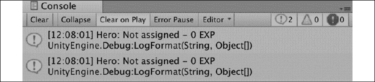
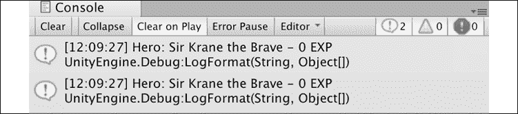
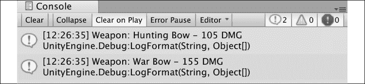
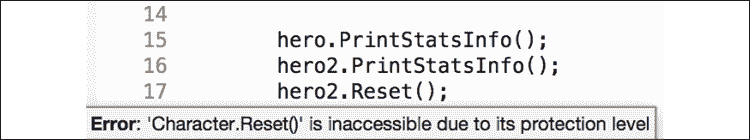
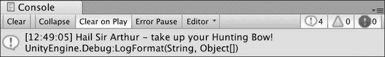
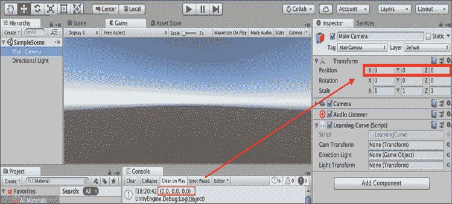
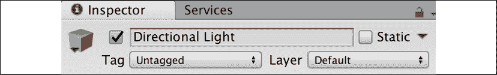
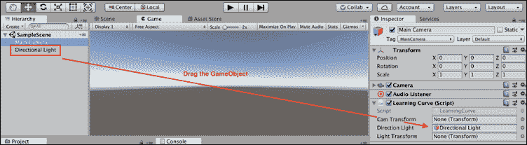

# 5

# 使用类、结构和面向对象

出于显而易见的原因，这本书的目的并不是让你从信息过载中头疼欲裂。 然而，下面的这些主题将带您走出初学者的小隔间，进入到面向对象编程的户外**(**OOP**)。 到目前为止，我们一直只依赖于作为 C# 语言一部分的预定义变量类型:作为类的底层字符串、列表和字典，这就是为什么我们可以通过点表示法创建它们并使用它们的属性。 然而，依赖内置类型有一个明显的弱点——无法偏离 C# 已经设置的蓝图。**

 **创建类可以让你自由地定义和配置设计蓝图，捕捉信息并驱动特定于你的游戏或应用的行动。 本质上，自定义类和 OOP 是编程王国的关键; 没有他们，独特的项目就会少之又少。

在本章中，您将获得从头创建类的实际经验，并讨论类变量、构造函数和方法的内部工作。 你还将被介绍到引用和值类型对象之间的差异，以及这些概念如何可以应用在 Unity 中。 下面的主题将会在接下来的课程中更详细地讨论:

*   引入面向对象
*   定义类
*   声明结构体
*   理解引用和值类型
*   集成面向对象思维
*   在 Unity 中应用 OOP

# 引入面向对象

OOP 是你在 C# 中使用的主要的编程范式。 如果类和结构实例是我们程序的蓝图，那么 OOP 就是将一切结合在一起的体系结构。 当我们将 OOP 作为一种编程范式时，我们是在说它对于整个程序如何工作和通信具有特定的原则。

本质上，OOP 关注的是对象，而不是纯粹的顺序逻辑——它们所持有的数据、它们如何驱动操作，以及最重要的是它们如何彼此通信。

# 定义类

在*第二章*，*编程的构建模块*中，我们简要地讨论了类是对象的蓝图，并提到可以将类视为自定义变量类型。 我们还了解到`LearningCurve`*脚本是一个类，但是是一个特殊的类，Unity 可以附加到场景中的对象上。 对于类，要记住的主要事情是它们是*引用类型*——也就是说，当它们被赋值或传递给另一个变量时，引用的是原始对象，而不是一个新的副本。 在讨论结构之后，我们将深入讨论这个问题。 然而，在这之前，我们需要了解创建类的基础知识。*

 *现在，我们将把类和脚本如何在 Unity 中工作放在一边，而将重点放在如何在 C# 中创建和使用它们。 类是使用`class`关键字创建的，如下所示:

```cs
accessModifier class UniqueName
{
    Variables 
    Constructors
    Methods
} 
```

在类中声明的任何变量或方法都属于该类，并通过惟一的类名访问。

为了使这些例子在本章中尽可能具有凝聚力，我们将创建并修改一个典型游戏所拥有的简单`Character`类。 我们还将远离代码截图，让您习惯于阅读和解释代码，就像您在“野外”看到的那样。 然而，我们首先需要的是一个我们自己的自定义类，因此让我们创建一个。

在理解它们的内部工作之前，我们需要一个类来练习，所以让我们创建一个新的 C# 脚本并从头开始:

1.  右键单击`Scripts`文件夹中创建*第一章*,*了解您的环境*,选择**创建**|**【显示】C# 脚本。**
2.  将脚本命名为`Character`，在 Visual Studio 中打开它，并删除所有生成的代码。
3.  声明一个名为`Character`的公共类，后面跟着一组花括号，然后保存该文件。 您的类代码应该完全匹配以下代码:

    ```cs
    using System.Collections;
    using System.Collections.Generic;
    using UnityEngine;

    public class Character
    { 
    } 
    ```

4.  我们删除了生成的代码，因为我们不需要将此脚本附加到 Unity GameObject。

`Character`现在注册为一个公共类蓝图。 这意味着项目中的任何类都可以使用它来创建字符。 然而，这些只是说明-创建一个字符需要额外的步骤。 这个创建步骤称为*实例化*，是下一节的主题。

## 实例化类对象

实例化是从一组特定的指令创建一个对象的行为，这被称为实例。 如果类是蓝图，那么实例就是根据它们的指令构建的房屋; `Character`的每个新实例都是它的对象，就像根据相同指令建造的两座房子仍然是两个不同的物理结构。 发生在一方身上的事情不会对另一方产生任何影响。

在第四章、*控制流和集合类型*中，我们使用它们的类型和`new`关键字创建了列表和字典，它们是 C# 自带的默认类。 我们可以对自定义类(如`Character`)执行相同的操作，下面将执行该操作。

我们将`Character`类声明为 public，这意味着可以在任何其他类中创建`Character`实例。 既然我们已经有了`LearningCurve`*工作，让我们在`Start()`方法中声明一个新字符。*

 *打开`LearningCurve`并在`Start()`方法中声明一个新的`Character`类型变量，称为`hero`:

```cs
Character hero = new Character(); 
```

让我们一步一步来分析这个问题:

1.  变量类型指定为`Character`，这意味着该变量是该类的实例。
2.  变量名为`hero`，它是使用`new`关键字创建的，后面跟着`Character`类名和两个圆括号。 这是在程序内存中创建实际实例的地方，即使类现在是空的。
3.  我们可以像使用其他对象一样使用`hero`变量。 当`Character`类获得自己的变量和方法时，我们可以使用点表示法从`hero`访问它们。

在创建`hero`变量时，你也可以简单地使用推断声明，如下所示:

```cs
var hero = new Character(); 
```

现在，没有任何类字段，我们的字符类就不能做太多事情。 在接下来的几节中，您将添加类字段，以及更多。

## 添加类字段

向自定义类中添加变量或字段与我们在`LearningCurve`中所做的没有什么不同。 应用相同的概念，包括访问修饰符、变量范围和值赋值。 然而，属于类的任何变量都是用类实例创建的，这意味着如果没有赋值，它们将默认为零或空。 一般来说，选择设置初始值取决于它们将存储什么信息:

*   如果在创建类实例时，变量需要具有相同的初始值，那么设置初始值是一个不错的主意。 这对于经验值或起始分数等内容非常有用。
*   如果一个变量需要在每个类实例中自定义，比如`CharacterName`，那么不给它赋值并使用类构造函数(我们将在*Using constructor*一节中讨论这个主题)。

每个字符类都需要一些基本字段; 在接下来的部分中添加它们是您的工作。

让我们结合两个变量来保存角色的名字和初始经验值的数量:

1.  在`Character`类的花括号内添加两个`public`变量——一个`string`变量代表名称，一个`integer`变量代表经验值。
2.  将`name`值保留为空，但将经验值设置为`0`，以便每个角色从底部开始:

    ```cs
    public class Character
    {
        public string name;
        public int exp = 0; 
    } 
    ```

3.  在`Character`实例初始化之后，在`LearningCurve`*中添加调试日志。 使用点符号打印新字符的`name`和`exp`变量:

    ```cs
    Character hero = new Character(); 
    Debug.LogFormat("Hero: {0} - {1} EXP", hero.name, hero.exp); 
    ```* 
**   When `hero` is initialized, `name` is assigned a null value that shows up as an empty space in the debug log, while `exp` prints out `0`. Notice that we didn't have to attach the `Character` script to any GameObjects in the scene; we just referenced them in `LearningCurve` and Unity did the rest. The console will now debug out our character information, which is referenced as follows:

    

    图 5.1:在控制台中打印自定义类属性的屏幕截图* 

 *此时，我们的类正在工作，但是对于这些空值它并不十分实用。 您需要用所谓的类构造函数来修复这个问题。

## 使用构造函数

类构造函数是在创建类实例时自动触发的特殊方法，这类似于`LearningCurve`中`Start`方法的运行方式。 构造函数根据类的蓝图来构建类:

*   如果没有指定构造函数，C# 会生成一个默认的构造函数。 默认构造函数将所有变量设置为它们的默认类型值——数值值设置为零，布尔值设置为 false，引用类型(类)设置为空。
*   就像任何其他方法一样，自定义构造函数可以用参数来定义，并用于在初始化时设置类变量的值。
*   一个类可以有多个构造函数。

构造函数的编写与常规方法类似，但有一些不同; 例如，它们需要是公共的，没有返回类型，方法名总是类名。 例如，让我们向`Character`类添加一个不带参数的基本构造函数，并将 name 字段设置为非 null。

将这个新代码直接添加到类变量下面，如下所示:

```cs
public string name;
public int exp = 0;
**public****Character****()**
**{**
 **name =** **"Not assigned"****;**
**}** 
```

在 Unity 中运行项目，你会看到使用这个新构造函数的`hero`实例。 调试日志会显示英雄的名字为**没有被分配**，而不是一个空值:



图 5.2:打印到控制台的未分配自定义类变量的屏幕截图

这是一个很好的进展，但是我们需要类构造函数更加灵活。 这意味着我们需要能够传入值，以便将它们用作起始值，这就是接下来要做的。

现在，`Character`类的行为开始更像一个真正的对象，但我们可以通过添加第二个构造函数来做得更好，在初始化时接受名称并将其设置为`name`字段:

1.  向`Character`添加另一个构造函数，该构造函数接受`string`参数，称为`name`。
2.  Assign the parameter to the class's `name` variable using the `this` keyword. This is called *constructor overloading*:

    ```cs
    public Character(string name)
    {
        this.name = name;
    } 
    ```

    为了方便起见，构造函数通常具有与类变量共享名称的参数。 在这些情况下，使用`this`关键字指定哪个变量属于类。 在本例中，`this.name`指的是类的名称变量，而`name`是参数; 如果没有`this`关键字，编译器将抛出一个警告，因为它无法区分它们。

3.  Create a new `Character` instance in `LearningCurve`, called `heroine`. Use the custom constructor to pass in a name when it's initialized and print out the details in the console:

    ```cs
    Character heroine = new Character("Agatha");
    Debug.LogFormat("Hero: {0} - {1} EXP", heroine.name,
            heroine.exp); 
    ```

    当一个类有多个构造函数或一个方法有多个变体时，Visual Studio 会在自动补全弹出窗口中显示一组箭头，可以使用箭头键滚动:

    

    图 5.3:Visual Studio 中多个方法构造函数的截图

4.  We can now choose between the basic and custom constructor when we initialize a new `Character` class. The `Character` class itself is now far more flexible when it comes to configuring different instances for different situations:

    

    图 5.4:控制台中打印的多个自定义类实例的屏幕截图

现在真正的工作开始了; 我们的类需要能够做任何有用的方法，除了作为变量的存储设施。 你的下一个任务就是将其付诸实践。

## 声明类方法

将方法添加到自定义类与将它们添加到`LearningCurve`没有什么不同。 然而，这是一个很好的机会来讨论一个好的编程的要点——**Don't Repeat Yourself**(**DRY**)。 DRY 是所有编写良好的代码的基准。 从本质上说，如果你发现自己一遍又一遍地写着同样的一行或几行，是时候重新思考和重组了。 这通常采用新方法的形式来保存重复的代码，使得在当前脚本的其他地方甚至从其他脚本中修改和调用该功能更加容易。

在编程术语中，您将看作是**提取**出一个方法或特性。

我们已经有了相当多的重复代码，所以让我们看看在哪里可以提高脚本的可读性和效率。

我们重复的调试日志是一个很好的机会，可以将一些代码直接抽象到`Character`类中:

1.  向`Character`类中添加一个带有`void`返回类型(称为`PrintStatsInfo`)的新`public`方法。
2.  将调试日志从`LearningCurve`复制并粘贴到方法体中。
3.  将变量改为`name`和`exp`，因为它们现在可以直接从类中引用:

    ```cs
    public void PrintStatsInfo()
    {
          Debug.LogFormat("Hero: {0} - {1} EXP", name, exp);
    } 
    ```

4.  用方法调用`PrintStatsInfo`替换之前添加到`LearningCurve`*的字符调试日志，然后点击 play:

    ```cs
     Character hero = new Character();
     **hero.PrintStatsInfo();**
     Character heroine = new Character("Agatha");
     **heroine.PrintStatsInfo();** 
    ```* 
**   既然`Character`类有一个方法，任何实例都可以使用点表示法自由地访问它。 由于`hero`和`heroine`都是单独的对象，`PrintStatsInfo`将各自的`name`和`exp`值调试到控制台。*

 *这种行为比将调试日志直接放在`LearningCurve`中要好。 将功能分组到一个类中并通过方法驱动操作总是一个好主意。 这使得代码更具可读性——因为我们的`Character`对象在打印调试日志时给出一个命令，而不是重复代码。

整个`Character`类应该如下所示:

```cs
using System.Collections;
using System.Collections.Generic;
using UnityEngine;

public class Character
{
    public string name;
    public int exp = 0;

    public Character()
    {
        name = "Not assigned";
    }

    public Character(string name)
    {
        this.name = name;
    }

    public void PrintStatsInfo()
    {
        Debug.LogFormat("Hero: {0} - {1} EXP", name, exp);
    }
} 
```

通过介绍类，您可以很好地编写可读、轻量级和可重用的模块化代码。 现在该处理类的表亲对象——结构了!

# 声明结构体

结构体**与类相似，因为它们也是你想在程序中创建的对象的蓝图。 主要区别在于它们是*值类型*，这意味着它们是通过值传递的，而不是像类那样通过引用传递。 当 struct 被赋值或传递给另一个变量时，会创建 struct 的一个新副本，因此原始的根本不会被引用。 我们将在下一节中对此进行更详细的讨论。 首先，我们需要理解结构是如何工作的，以及在创建它们时应用的特定规则。**

 **结构体的声明方式与类相同，可以包含字段、方法和构造函数:

```cs
accessModifier struct UniqueName 
{
    Variables
    Constructors
    Methods
} 
```

像类一样，任何变量和方法都专属于结构，并通过其唯一的名称访问。

然而，结构有一些限制:

*   除非用`static`或`const`修饰符标记变量，否则不能用结构声明中的值初始化变量——你可以在*第 10 章*，*重温类型、方法和类*中了解更多。
*   不允许没有参数的构造函数。
*   struct 带有一个默认构造函数，它将根据变量的类型自动将所有变量设置为默认值。

每个角色都需要一个好的武器，而这些武器非常适合一个类之上的结构对象。 我们将在本章的*理解引用和值类型*部分讨论为什么会这样。 但是，首先，您将创建一个可以随意使用的程序。

我们的角色需要好的武器来完成任务，这是一个简单结构的好选择:

1.  右键单击`Scripts`文件夹，选择**创建**，然后选择**C# Script**。
2.  命名它为`Weapon`，在 Visual Studio 中打开它，并删除所有在`using UnityEngine`之后生成的代码。
3.  声明一个名为`Weapon`的公共结构，后面跟着一组花括号，然后保存该文件。
4.  Add a field for `name` of type `string` and another field for `damage` of type `int`:

    您可以让类和结构彼此嵌套在一起，但这通常是不可取的，因为这会使代码混乱。

    ```cs
    public struct Weapon
    {
        public string name;
        public int damage;
    } 
    ```

5.  声明一个带有`name`和`damage`参数的构造函数，并使用`this`关键字设置结构字段:

    ```cs
    public Weapon(string name, int damage)
    {
        this.name = name;
        this.damage = damage;
    } 
    ```

6.  在构造器下面添加一个调试方法来打印武器信息:

    ```cs
    public void PrintWeaponStats()
    {
        Debug.LogFormat("Weapon: {0} - {1} DMG", name, damage);
    } 
    ```

7.  在`LearningCurve`中，使用自定义构造函数和`new`关键字创建一个新的`Weapon`结构体:

    ```cs
    Weapon huntingBow = new Weapon("Hunting Bow", 105); 
    ```

8.  新的`huntingBow`对象使用自定义构造函数，并在初始化时为两个字段提供值。

将脚本限制在单个类中是一个好主意，但是文件中包含的类只使用结构体是相当常见的。

现在我们已经有了引用(类)和值(结构)对象的例子，是时候了解它们各自的优点了。 更具体地说，您需要理解这些对象是如何传递和存储在内存中的。

# 理解引用和值类型

除了关键字和初始字段值，到目前为止，我们还没有看到类和结构之间有多大的区别。 类最适合将复杂的动作和在整个程序中会改变的数据分组在一起; 对于大多数情况下保持不变的简单对象和数据，结构是更好的选择。 除了它们的用途之外，它们在一个关键方面有根本性的不同——那就是它们如何在变量之间传递或赋值。 类是*引用类型*，这意味着它们是通过引用传递的; 结构体是*值类型*，这意味着它们是通过值传递的。

## 引用类型

当我们的`Character`类的实例初始化时，`hero`和`heroine`变量并不保存它们的类信息——相反，它们保存了一个指向程序内存中对象所在位置的引用。 如果将`hero`或`heroine`赋值给同一类中的另一个变量，则赋值的是内存引用，而不是字符数据。 这有几个含义，最重要的是，如果我们有多个变量存储相同的内存引用，更改一个变量会影响所有变量。

像这样的话题是演示而不是解释; 接下来，您可以在实际示例中进行尝试。

现在来测试一下`Character`类是否是引用类型:

1.  在`LearningCurve`中声明一个新的`Character`变量`hero2`。 将`hero2`赋给`hero`变量，并使用`PrintStatsInfo`方法打印出这两组信息。
2.  点击 play**，查看控制台中显示的两个调试日志:**
***   The two debug logs will be identical because `hero2` was assigned to `hero` when it was created. At this point, both `hero2` and `hero` point to where `hero` is located in memory:

    

    图 5.5:打印到控制台的结构统计的屏幕截图

    *   现在，将`hero2`改为有趣的内容，再次点击**:

    ```cs
    Character hero2 = hero;
    **hero2.name =** **"Sir Krane the Brave"****;** 
    ```** ***   You'll see that both `hero` and `hero2` now have the same name, even though only one of our characters' data was changed:

    

    图 5.6:打印到控制台的类实例属性的屏幕截图**** 

 ****这里的教训是，在给新变量赋值时，需要仔细对待引用类型，不要复制引用类型。 对一个引用的任何更改都会渗透到持有该引用的所有其他变量。

如果您试图复制一个类，要么创建一个新的、独立的实例，要么重新考虑结构体是否适合您的对象蓝图。 在下一节中，您将更好地了解值类型。

## 值类型

当一个 struct对象被创建时，它的所有数据都存储在它对应的变量中，没有引用或连接到它的内存位置。 这使得结构对于创建需要快速有效复制的对象非常有用，同时仍然保留它们各自的标识。 在下面的练习中，用我们的`Weapon`结构试试这个方法。

让我们创建一个新的武器对象，将`huntingBow`复制到一个新的变量中，并更新它的数据，看看这些变化是否影响到这两个结构:

1.  在`LearningCurve`中声明一个新的`Weapon`结构体，并*赋值`huntingBow`为其初始值:

    ```cs
    Weapon huntingBow = new Weapon("Hunting Bow", 105);
    **Weapon warBow = huntingBow;** 
    ```* 
**   使用调试方法打印出每个武器的数据:

    ```cs
    **huntingBow.PrintWeaponStats();**
    **warBow.PrintWeaponStats();** 
    ```

    *   The way they're set up now, both `huntingBow` and `warBow` will have the same debug logs, just like our two characters did before we changed any data:

    

    图 5.7:打印到控制台的 struct 实例的屏幕截图

    *   将`warBow.name`和`warBow.damage`字段更改为您选择的值，并再次点击播放:

    ```cs
     Weapon warBow = huntingBow;
     **warBow.name =** **"War Bow"****;**
     **warBow.damage =** **155****;** 
    ```

    *   控制台将显示只更改了与`warBow`相关的数据，而`huntingBow`保留了其原始数据。

    * 

 *图 5.8:打印到控制台的更新结构属性的屏幕截图

这个例子的好处是，结构体可以很容易地作为单独的对象进行复制和修改，而类则保留对原始对象的引用。 既然我们了解更多关于结构和类在幕后工作,并确认如何引用类型和值类型表现在自然栖息地,我们在一个好地方开始谈论的一个最重要的编码主题,面向对象,以及它如何符合编程环境。

# 集成面向对象思维

物理世界中的事物运行在与 OOP 相似的水平上; 当你想买软饮料时，你拿的是一罐苏打水，而不是饮料本身。 can 是一个对象，它将相关信息和操作组合在一个自包含的包中。 然而，在编程和杂货店中处理对象是有规则的——例如，谁可以访问它们。 不同的变化和一般的行为都影响着我们周围物体的本质。

用编程术语来说，这些规则是 OOP 的主要原则:封装性*、继承性*、多态性*。*

 *## 封装

OOP 的一个优点是它支持封装定义对象的变量和方法对外部代码的访问方式(这有时被称为*调用代码*)。 以汽水罐为例——在自动售货机中，可能的交互作用是有限的。 因为机器是锁着的，不是每个人都可以上来拿一台; 如果你碰巧有正确的更改，你将被允许临时使用它，但在一个指定的数量。 如果机器本身被锁在房间里，只有有钥匙的人才会知道汽水罐的存在。

你现在问自己的问题是，我们如何设置这些限制? 简单的答案是，在整个过程中，我们一直在使用封装，为对象变量和方法指定访问修饰符。

如果您需要复习一下，请回到*第 3 章*、*深入研究变量、类型和方法*中的*访问修饰符*部分。

让我们尝试一个简单的封装示例，以理解这在实践中是如何工作的。 我们的`Character`类是公共的，它的字段和方法也是。 但是，如果我们想要一个可以将字符数据重置为其初始值的方法呢? 这可以派上用场，但如果它被意外调用，就可能是灾难性的，使其成为私有对象成员的完美候选:

1.  创建一个名为`Reset`的`private`方法，在`Character`类中不包含返回值。 将`name`和`exp`变量分别设置回`"Not assigned"`和`0`:
2.  在打印出`hero2`数据后，尝试从`LearningCurve`中调用`Reset()`:

    

图 5.9:Character 类中不可访问方法的截图

如果你想知道 Visual Studio 是不是坏了，它不是。 将方法或变量标记为 private 将使其在使用点表示法的类或结构中无法访问; 如果您手动输入它并将鼠标悬停在`Reset()`上，您将看到一条关于正在保护的方法的错误消息。

要真正调用这个私有方法，我们可以在类构造函数中添加一个 reset 命令:

```cs
public Character()
{
    Reset();
} 
```

封装确实允许使用对象进行更复杂的可访问性设置; 然而，现在，我们将继续使用`public`和`private`成员。 当我们在下一章开始充实我们的游戏原型时，我们将根据需要添加不同的修改器。

现在，让我们来谈谈继承，当你在未来的游戏中创建类层次时，继承将成为你最好的朋友。

## 继承

一个 C# 类可以在另一个类的映像中创建，共享它的成员变量和方法，但能够定义它唯一的数据。 在 OOP 中，我们称之为*继承*，这是一种无需重复代码就可以创建相关类的强大方法。 再以汽水为例——市场上有具有相同基本属性的通用汽水，也有特殊的汽水。 这些特殊的汽水具有相同的基本特性，但有不同的品牌或包装，这使它们与众不同。 当你把它们并排看时，很明显它们都是汽水罐——但它们显然也不一样。

原始类通常被称为基类或父类，而继承类被称为派生类或子类。 任何用`public`、`protected`或`internal`访问修饰符标记的基类成员都自动成为派生类的一部分——构造函数除外。 类构造函数总是属于它们的包含类，但它们可以从派生类中使用，以将重复代码降到最低。 现在不要太担心不同的基类场景。 相反，让我们尝试一个简单的游戏例子。

大多数游戏都拥有不止一种类型的角色，所以让我们创建一个继承了`Character`角色的新职业`Paladin`。 您可以将这个新类添加到`Character`脚本中，或者创建一个新类。 如果要将新类添加到`Character`脚本中，请确保它在`Character`类的花括号之外:

```cs
public class Paladin: Character
{
} 
```

就像`LearningCurve`*继承自`MonoBehavior`一样，我们所需要做的就是添加一个冒号和我们想要继承的基类，C# 完成剩下的工作。 现在，任何`Paladin`实例都可以访问`name`属性和`exp`属性以及`PrintStatsInfo`方法。*

 *通常认为最好的做法是为不同的类创建一个新脚本，而不是将它们添加到现有的类中。 这将分离您的脚本，并避免在单个文件(称为膨胀文件)中有太多的代码行。

这很好，但是继承的类如何处理它们的构造呢? 你可以在下面的部分找到答案。

### 基本构造函数

当一个类从另一个类继承时，它们形成了一个类型的金字塔，其中的成员变量从父类流向它的任何派生子类。 父类不知道它的任何子类，但所有子类都知道它们的父类。 然而，父类构造函数可以通过简单的语法修改直接从子构造函数调用:

```cs
public class ChildClass: ParentClass
{
    public ChildClass(): **base****()**
    {
    }
} 
```

关键字`base`代表父构造函数——在本例中是默认构造函数。 然而，由于`base`是代替构造函数的，而构造函数是一个方法，子类可以将参数向上传递给它的父构造函数。

因为我们希望所有的`Paladin`对象都有一个名字，而`Character`已经有一个构造函数来处理这个问题，所以我们可以直接从`Paladin`类中调用`base`构造函数，从而省去重写构造函数的麻烦:

1.  向`Paladin`类添加一个构造函数，该构造函数接受`string`参数，称为`name`。 使用`colon`和`base`关键字调用父构造函数，传入`name`:

    ```cs
    public class Paladin: Character
    {
    **public****Paladin****(****string** **name****):** **base****(****name****)**
     **{**

     **}**
    } 
    ```

2.  在`LearningCurve`中，创建一个新的`Paladin`实例`knight`。 使用基构造函数赋值。 从`knight`调用`PrintStatsInfo`并查看控制台:

    ```cs
    Paladin knight = new Paladin("Sir Arthur");
    knight.PrintStatsInfo(); 
    ```

3.  调试日志将与其他的`Character`实例相同，但是使用我们分配给`Paladin`构造函数的名称:

    

图 5.10:基字符构造器属性的截图

当`Paladin`构造函数触发时，它将`name`参数传递给`Character`构造函数，由构造函数设置`name`值。 本质上，我们使用`Character`构造函数为`Paladin`类执行初始化工作，使得`Paladin`构造函数只负责初始化其惟一属性，而现在它还没有这个功能。

除了继承之外，有时还需要使用其他现有对象的组合来创建新对象。 把乐高; 你不能从零开始——你已经有了不同颜色和结构的块来工作。 在编程术语中，这被称为*复合*，我们将在下一节中讨论。

## 作文

除了继承之外，类可以由其他类组成。 以我们的`Weapon`结构为例。 `Paladin`可以很容易地在其内部包含`Weapon`变量，并可以访问其所有属性和方法。 让我们通过更新`Paladin`来获取起始武器并在构造函数中赋值:

```cs
public class Paladin: Character
{
   **public** **Weapon;**

    public Paladin(string name, **Weapon weapon**): base(name)
    {
        **this****.weapon = weapon;**
    }
} 
```

由于`weapon`对`Paladin`是唯一的，而不是`Character`，所以我们需要在构造函数中设置其初始值。 我们还需要更新`knight`实例以包含`Weapon`变量。 所以，让我们用`huntingBow`:

```cs
Paladin knight = new Paladin("Sir Arthur", **huntingBow**); 
```

如果你现在运行游戏，你不会看到任何不同，因为我们使用的是来自`Character`类的`PrintStatsInfo`方法，它不知道`Paladin`类的`weapon`属性。 为了解决这个问题，我们需要讨论多态性。

## 多态性

多态性在希腊语中是*多形*的意思，以两种不同的方式应用于 OOP:

*   派生类对象被视为与父类对象相同。 例如，一个由`Character`对象组成的数组也可以存储`Paladin`对象，因为它们派生自`Character`。
*   父类可以将方法标记为`virtual`，这意味着派生类可以使用`override`关键字修改方法的指令。 对于`Character`和`Paladin`，如果我们可以为每个`PrintStatsInfo`调试不同的消息，那么将非常有用。

多态性允许派生类保持其父类的结构，同时还可以自由地调整操作以满足特定的需求。 您标记为`virtual`的任何方法都将给您对象多态性的自由。 让我们将这一新知识应用到我们的角色调试方法中。

让我们修改`Character`和`Paladin`，使用`PrintStatsInfo`打印不同的调试日志:

1.  通过在`public`和`void`之间添加`virtual`关键字来更改`Character`类中的`PrintStatsInfo`:
2.  Declare the `PrintStatsInfo` method in the `Paladin` class using the `override` keyword. Add a debug log to print out the `Paladin` properties in whatever way you like:

    ```cs
    public override void PrintStatsInfo()
    {
        Debug.LogFormat("Hail {0} - take up your {1}!", name, 
                 weapon.name);
    } 
    ```

    这可能看起来像重复代码，我们已经说过这是不好的形式，但这是一种特殊情况。 我们在`Character`类中将`PrintStatsInfo`标记为`virtual`所做的就是告诉编译器，根据调用类，该方法可以有许多形状。

3.  When we declared the overridden version of `PrintStatsInfo` in `Paladin`, we added the custom behavior that only applies to that class. Thanks to polymorphism, we don't have to choose which version of `PrintStatsInfo` we want to call from a `Character` or `Paladin` object—the compiler already knows:

    

    图 5.11 多态字符属性的截图

我知道你一时难以接受。 所以，在我们接近终点线时，让我们回顾一下 OOP 的一些要点:

*   OOP 就是将相关的数据和操作分组到对象中——这些对象可以相互独立地通信和操作。
*   就像变量一样，可以使用访问修饰符来设置对类成员的访问。
*   类可以继承其他类，创建父/子关系的下拉层次结构。
*   类可以具有其他类或结构类型的成员。
*   类可以覆盖标记为`virtual`的任何父方法，允许它们在保持相同蓝图的同时执行自定义操作。

OOP 并不是与 C# 一起使用的唯一编程范式——你可以在这里找到其他主要方法的实用解释:[http://cs.lmu.edu/~ray/notes/paradigms](http://cs.lmu.edu/~ray/notes/paradigms)。

你在本章学到的 OOP 都可以直接应用于 C# 世界。 然而，我们仍然需要从 Unity 的角度来看待这一点，这也是你将在本章的剩余中关注的内容。

# 在 Unity 中应用 OOP

如果你对 OOP 语言有足够的了解，你最终会听到*一切都是对象*这句话，就像开发者之间的秘密祈祷。 遵循 OOP 原则，程序中的一切都应该是对象，但 Unity 中的 gameobject 可以代表你的类和结构。 然而，这并不是说 Unity 中的所有对象都必须在物理场景中，所以我们仍然可以在幕后使用我们新发现的编程类。

## 对象是类行为

在*第二章*，*编程的构建模块*中，我们讨论了当脚本被添加到 Unity 的游戏对象中时，脚本如何被转化为组件。 考虑到 OOP 的组合原则——游戏对象是父容器，它们可以由多个组件组成。 这听起来可能与每个脚本一个 C# 类的想法相矛盾，但实际上，这更多的是为了获得更好的可读性而不是实际的要求。 类可以嵌套在另一个类里面——它会很快变得混乱。 然而，将多个脚本组件附加到一个游戏对象可能非常有用，尤其是在处理管理器类或行为时。

总是尝试将对象浓缩为它们最基本的元素，然后使用组合从那些较小的类中构建更大、更复杂的对象。 比起修改一个大而笨重的组件，修改一个由小而可互换的组件组成的游戏对象更容易。

让我们看看**主摄像机**的动作:


图 5.12:检查器中 Main Camera 对象的屏幕截图

前面截图中的每个组件(**Transform**，**Camera**，**Audio Listener**，以及**Learning Curve**脚本)在 Unity 中作为一个类开始。 与`Character`或`Weapon`的实例一样，当我们点击 play 时，这些组件将成为计算机内存中的对象，并包含它们的成员变量和方法。

如果我们将`LearningCurve`(或任何脚本或组件)附加到 1000 个 gameobject 上并点击播放，将会创建并存储 1000 个`LearningCurve`的独立实例。

我们甚至可以使用组件名作为数据类型来创建这些组件的实例。 像类一样，Unity 组件类也是引用类型，可以像一样创建任何其他变量。 然而，找到并分配这些 Unity 组件与你目前所看到的略有不同。 为此，你需要在接下来的章节中更多地了解游戏对象的工作方式。

## 访问组件

既然我们知道了组件如何作用于 gameobject，那么我们该如何访问它们的特定实例呢? 幸运的是，Unity 中的所有 gameobject 都继承自`GameObject`类，这意味着我们可以使用它们的成员方法来寻找场景中需要的任何东西。 分配或检索当前场景中活动的游戏对象有两种方法:

1.  通过`GameObject`类中的`GetComponent()`或`Find()`方法，它们处理公共变量和私有变量。
2.  通过将游戏对象本身从`Project`面板直接拖放到**检查器**标签中的变量槽中。 这个选项只适用于 C# 中的公共变量，因为它们是唯一会出现在检查器中的变量。 如果你决定你需要一个私有变量显示在检查器中，你可以用`SerializeField`属性标记它。

你可以在 Unity 文档:[https://docs.unity3d.com/ScriptReference/SerializeField.html](https://docs.unity3d.com/ScriptReference/SerializeField.html)了解更多关于属性的和`SerializeField`。

让我们来看看第一个选项的语法。

### 在代码中访问组件

使用`GetComponent`非常简单，但是它的方法签名与我们目前看到的其他方法略有不同:

```cs
GameObject.GetComponent<ComponentType>(); 
```

我们所需要的只是正在查找的组件类型，如果组件存在，`GameObject`类将返回该组件，如果不存在，则返回 null。 `GetComponent`方法还有其他变体，但这个变体是最简单的，因为我们不需要知道我们正在寻找的`GameObject`类的细节。 这被称为`generic`方法，我们将在*第 13 章*、*探索泛型、委托及其他内容*中进一步讨论。 然而，现在，让我们只处理相机的变换。

由于`LearningCurve`*已经附加到**Main Camera**对象上，我们抓取相机的`Transform`组件并将其存储在公共变量中。 `Transform`组件在 Unity 中控制对象的位置、旋转和缩放，所以这是一个方便的例子:*

 *1.  向`LearningCurve`:

    ```cs
    public Transform CamTransform; 
    ```

    添加一个新的公共类型变量`Transform`，名为`CamTransform`
2.  使用`GameObject`类中的`GetComponent`方法初始化`Start`中的`CamTransform`。 使用`this`关键字，因为`LearningCurve`*与`Transform`组件连接在同一个`GameObject`组件上。*
**   使用点表示法访问和调试`CamTransform`的`localPosition`属性:

    ```cs
    void Start()
    {
        CamTransform = this.GetComponent<Transform>();
        Debug.Log(CamTransform.localPosition); 
    } 
    ```

    *   我们在`LearningCurve`顶部添加了一个未初始化的`public Transform`变量，并使用`Start`内部的`GetComponent`方法对其进行了初始化。 `GetComponent`找到附在`GameObject`组件上的`Transform`组件，并将其返回给`CamTransform`。 `CamTransform`现在存储一个`Transform`对象，我们可以访问它的所有类属性和方法——包括以下截图中的`localPosition`:

    * 

 *图 5.13:打印到控制台的 Transform 位置的屏幕截图

对于快速检索组件来说，`GetComponent`方法非常棒，但它只能访问调用脚本所附加到的 GameObject 上的组件。 举例来说,如果我们使用`GetComponent`的`LearningCurve`脚本附加到**主要相机**,我们只能够访问**变换**,【显示】相机,和**音频侦听器组件。**

如果我们想要引用一个单独的游戏对象上的组件，如**Directional Light**，我们需要首先使用`Find`方法获取对该对象的引用。 所需要的只是游戏对象的名称，Unity 将返回适当的游戏对象供我们存储或操作。

作为参考，每个游戏对象的名称可以在**检查器**选项卡的顶部找到:



图 5.14:检查器中方向光对象的屏幕截图

在你的游戏场景中寻找对象在 Unity 中至关重要，所以你需要练习。 让我们以我们必须使用的对象为例，练习寻找和分配它们的组件。

让我们使用`Find`方法进行旋转，并从`LearningCurve`中检索**方向光**对象:

1.  在`CamTransform`下面加上`LearningCurve`两个变量，一个是`GameObject`类型，一个是`Transform`类型:
2.  通过名称找到`Directional Light`组件，并使用它初始化`Start()`方法中的`DirectionLight`:

    ```cs
    void Start()
    {
        DirectionLight = GameObject.Find("Directional Light"); 
    } 
    ```

3.  将`LightTransform`的值设置为附加到`DirectionLight`的`Transform`组件，并调试其`localPosition`。 因为`DirectionLight`是它的`GameObject`现在，`GetComponent`完美的工作:

    ```cs
    LightTransform = DirectionLight.GetComponent<Transform>();
    Debug.Log(LightTransform.localPosition); 
    ```

4.  在运行游戏之前，理解方法调用可以链接在一起以减少代码步骤的数量是很重要的。 例如，我们可以通过组合`Find`和`GetComponent`在一行中初始化`LightTransform`，而不必经过`DirectionLight`:

    ```cs
    GameObject.Find("Directional Light").GetComponent<Transform>(); 
    ```

在处理复杂的应用时，长串的代码可能会导致较差的可读性和混乱。 一个很好的经验法则是避免行长度超过本例。

虽然在代码中查找对象总是有效的，但是你也可以简单地将对象拖放到**检查器**标签中。 让我们在下一节中演示如何做到这一点。

### 拖拽

现在我们已经介绍了代码密集的做事方式，让我们快速看一下 Unity 的拖放功能。 虽然在代码中拖放要比使用`GameObject`类快得多，但在保存或导出项目或 Unity 更新时，Unity 有时会失去对象和变量之间的连接。

当您需要快速地分配一些变量时，那么，无论如何，请利用这个特性。 对于大多数情况，我建议坚持使用代码。

让我们改变`LearningCurve`*来演示如何使用拖放来分配`GameObject`组件:*

 *1.  注释掉以下代码行，其中我们使用`GameObject.Find()`检索`Directional Light`对象并将其赋值给`DirectionLight`变量:

    ```cs
    //DirectionLight = GameObject.Find("Directional Light"); 
    ```

2.  Select the **Main Camera** GameObject, drag **Directional Light** to the `Direction Light` field in the **Learning Curve** component, and click on play:

    

    图 5.15:将 Directional Light 拖动到 script 属性的截图

3.  **方向光**游戏对象现在被分配给`DirectionLight`变量。 不涉及代码，因为 Unity 在内部分配了变量，没有对`LearningCurve`*类进行更改。*

 *在决定是使用拖放还是使用`GameObject.Find()`来分配变量时，理解一些事情很重要。 首先，`Find()`方法稍微慢了一点，如果你在多个脚本中多次调用方法，你的游戏就会面临性能问题。 其次，你需要确保你的游戏对象在场景层次结构中都有独特的名称; 如果不这样做，在有多个相同名称的对象或更改对象名称的情况下，可能会导致一些严重的 bug。

# 总结

我们对类、结构体和 OOP 的探索标志着 C# 基础第一节的结束。 你已经学习了如何声明你的类和结构，这是你所创造的每一个应用或游戏的脚手架。 您还确定了传递和访问这两个对象的方式以及它们与 OOP 的关系方面的差异。 最后，您亲身体验了使用继承、组合和多态性创建面向对象类的原则。

识别相关数据和行动，创建蓝图，并使用实例构建互动，是接近任何程序或游戏的坚实基础。 将访问组件的能力添加到混合中，你就拥有了一个 Unity 开发者的素质。

下一章将继续深入游戏开发和直接在 Unity 中脚本对象行为的基础知识。 我们将从充实一个简单的开放世界冒险游戏的要求开始，在场景中使用 GameObjects，最后为我们的角色准备好一个白盒子环境。

# 突击测验-所有的东西面向对象

1.  什么方法处理类内部的初始化逻辑?
2.  作为值类型，结构是如何传递的?
3.  OOP 的主要原则是什么?
4.  您将使用哪个`GameObject`类方法来查找与调用类相同的对象上的组件?*******************