# 六、使用 Unity 干点正事

创造一款游戏不仅仅是在代码中模拟动作。 设计、故事、环境、灯光和动画在为玩家搭建舞台方面都扮演着重要角色。 游戏首先是一种体验，仅靠代码是无法传递的。

Unity 在过去 10 年里将自己置于游戏开发的前沿，为程序员和非程序员提供了先进的工具。 动画和效果，音频，环境设计等等都可以直接从 Unity 编辑器中获得，而无需编写一行代码。 我们将在定义游戏的需求、环境和游戏机制时讨论这些主题。 然而，首先，我们需要对游戏设计进行专题介绍。

游戏设计理论是一个很大的研究领域，学习它的所有秘密可能耗费整个职业生涯。 然而，我们将只动手与基本的; 其他一切都取决于你去探索! 本章将为本书的其余部分做铺垫，并涵盖以下主题:

*   游戏设计入门
*   建立一个水平
*   照明基础知识
*   动画在统一中

# 游戏设计入门

在进入任何游戏项目之前，你必须先制定出自己想要创造的内容的蓝图。 有时候，想法一开始就清晰地出现在你的脑海中，但当你开始创造角色职业或环境时，事情似乎偏离了你的初衷。 这是游戏设计允许你规划以下接触点的地方:

*   **概念**:游戏的整体理念和设计，包括游戏类型和游戏风格。
*   **核心机制**:角色在游戏中的可玩功能或互动。 常见的游戏机制包括跳跃、射击、解谜或驾驶。
*   **控制方案**:一个按钮和/或按键的地图，让玩家控制自己的角色、环境交互和其他可执行行动。
*   **故事**:为游戏提供动力、创造同理心以及玩家与游戏世界之间的联系的基本叙事。
*   **艺术风格**:游戏的整体外观和感觉，从角色、菜单艺术到关卡和环境都保持一致。
*   **输赢条件**:支配游戏输赢的规则，通常由包含潜在失败权重的目标或目标组成。

这些主题并不是关于游戏设计的全部内容。 然而，它们是开始充实游戏设计文件的好地方，这是你的下一个任务!

## 游戏设计文档

谷歌游戏设计文件将导致大量模板、格式规则和内容指南，让新程序员随时准备放弃这些内容。 事实上，设计文件是根据制作团队或公司的情况量身定制的，这使得起草文件比你在网上想象的要容易得多。

一般来说，有三种类型的设计文件，如下:

*   **游戏设计文件**(**GDD**):GDD 包含了所有内容，包括游戏玩法、游戏氛围、故事以及游戏想要创造的体验。 根据游戏的不同，这份文件可能只有几页或几百页长。
*   **技术设计文档**(**TDD):本文档关注游戏的技术方面,从硬件上运行程序的类和如何架构需要构建。 与 GDD 一样，长度也会因项目而异。**
*   1 页**1 页**:通常用于市场营销或促销情况，1 页本质上是游戏的快照。 顾名思义，它应该只占用一页。

GDD 没有正确或错误的格式，所以这是一个让你的创意品牌茁壮成长的好地方。 提供一些能启发你的参考资料的图片; 在布局上要有创意——这是你定义愿景的地方。

在本书的剩余部分中，我们将致力于开发的游戏非常简单，不需要像 GDD 或 TDD 那样详细的内容。 相反，我们将创建一个单页来跟踪我们的项目目标和一些背景信息。

## 《英雄诞生》一页

为了让我们继续前进，我制作了一份简单的文件，列出了游戏原型的基本内容。 在继续阅读之前先通读一遍，并试着开始想象一些我们到目前为止学到的编程概念将被应用到实践中:


图 6.1:《英雄诞生》单页文档

现在你已经对我们的游戏有了一个高层次的了解，你可以开始创造一个包含游戏体验的原型关卡了。

# 建立一个水平

当你在创造游戏关卡时，你最好能够从玩家的角度去看待事物。 你希望他们如何看待环境，与之互动，以及在其中行走时的感受? 你是在创造游戏所存在的世界，所以要保持一致性。

在 Unity 中，你可以选择使用地形工具创建室外环境，用基本形状和几何形状或两者的混合来遮挡室内的东西。 您甚至可以从其他程序(如 Blender)导入 3D 模型，作为场景中的对象使用。

Unity 在[https://docs.unity3d.com/Manual/script-Terrain.html](https://docs.unity3d.com/Manual/script-Terrain.html)对地形工具进行了很好的介绍。 如果你沿着这条路走下去，在 Unity 资产商店中也有一个很棒的免费资产，叫做Terrain Toolkit 2017，可以在[https://assetstore.unity.com/packages/tools/terrain/terrain-toolkit-2017-83490](https://assetstore.unity.com/packages/tools/terrain/terrain-toolkit-2017-83490)找到。 你也可以使用像 Blender 这样的工具来创建你的游戏资产，你可以在[https://www.blender.org/features/modeling/](https://www.blender.org/features/modeling/)找到。

对于《英雄诞生》，我们将在中添加一个简单的室内竞技场设置，让很容易四处游走，但有几个角落可以藏身。 你将使用**原语**——unity 中提供的基础对象形状——拼凑所有这些，因为它们在场景中创建、缩放和定位非常容易。

## 创建原语

看看你可能经常玩的游戏，你可能会想知道如何才能创造出看起来如此真实的模型和对象，以至于你似乎可以穿过屏幕抓取它们。 幸运的是，Unity 拥有一组原始的 gameobject，你可以从中更快地选择原型。 这些工具并不会非常华丽或高清晰，但当你正在摸索或开发团队中没有 3D 美工时，它们会成为你的救星。

如果你打开统一,你可以进入**层次**面板,单击**+**|**3 d 对象,你会看到所有可用的选项,但只有约一半的这些原语或常见的形状,显示在以下截图的红色亮点:**

 **

图 6.2:选择了 Create 选项的 Unity Hierarchy 窗口

其他 3 d 对象选项,如**地形**,**风区**、和**树,有点太我们需要的先进,但是与他们随时实验如果你感兴趣。**

你可以在[https://docs.unity3d.com/Manual/CreatingEnvironments.html](https://docs.unity3d.com/Manual/CreatingEnvironments.html)找到更多关于构建 Unity 环境的信息。

在我们跳得太远之前，当你在你下面有一个地板时，通常更容易走动，所以让我们开始使用以下步骤为我们的竞技场创建一个地平面:

1.  在**层次**面板中，点击**+**|**3D 对象**|**平面**
2.  确保新对象在**Hierarchy**选项卡中被选中，在**Inspector**选项卡中将 GameObject 重命名为`Ground`
3.  In the **Transform** dropdown, change **Scale** to `3` in the **X**, **Y**, and **Z** axes:

    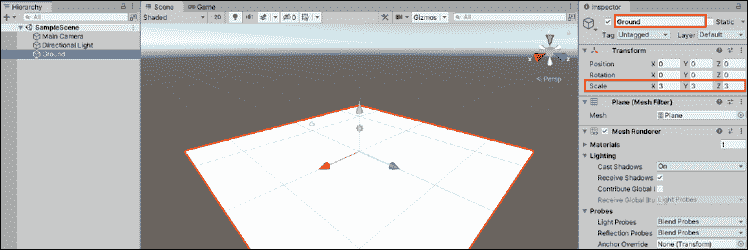

    图 6.3:带有地平面的 Unity 编辑器

4.  如果照明你的场景看起来黯淡或不同于前截图,选择**定向光在**中的****面板,并设置**【T7 强度】【显示】的价值定向光**组件 1:

    【病人】

图 6.4:在 Inspector 窗格中选择的 Directional Light 对象

我们创造了一个平面 GameObject，并增加了它的大小，为我们未来的角色创造了更多的空间。 这个平面就像一个受现实物理约束的 3D 物体，这意味着其他物体不会掉下去。 我们将在*第 7 章*、*运动、摄像机控制和碰撞*中更多地讨论 Unity 物理系统和它是如何工作的。 现在，我们需要开始用 3D 来思考。

## 思考 3 d

现在我们有了场景中的第一个对象，我们可以讨论 3D 空间——具体来说，一个对象的位置、旋转和缩放在三维空间中的表现。 如果你回想一下高中的几何，你应该熟悉具有*x*和*y*坐标系的图形。 要在图上画一个点，你必须有*x*值和*y*值。

Unity 同时支持 2D 和 3D 游戏开发，如果我们制作的是 2D 游戏，我们便可以在此给出解释。 然而，在 Unity 编辑器中处理 3D 空间时，我们有一个额外的轴，称为*z*轴。 *z*轴映射深度或透视，赋予我们的空间和其中的物体以 3D 质量。

这可能一开始会让你感到困惑，但 Unity 有一些很好的视觉辅助工具来帮助你理解。 右上方的**场景**面板中,您将看到一个 geometric-looking 图标与 x*,*,*和*z 轴标记为红色,绿色和蓝色分别。 场景中的所有游戏对象在**Hierarchy**窗口中被选中时，都会显示它们的轴箭头:**

 *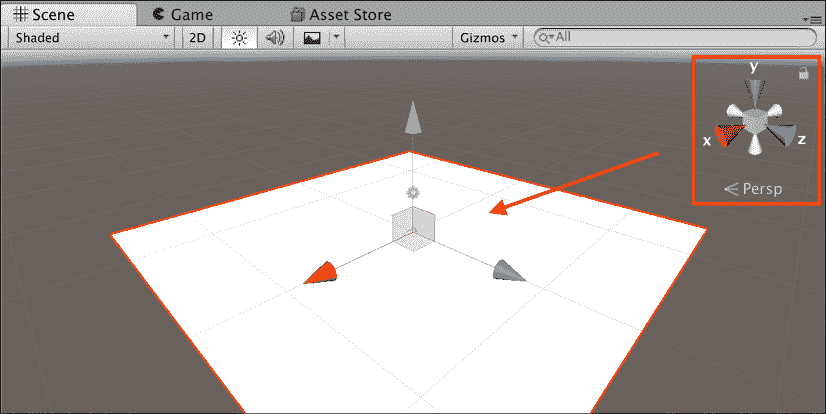

图 6.5:突出显示方向小工具的场景视图

这将始终显示场景的当前方向和放置在其中的对象。 在这些彩色轴上点击，将场景的方向切换到选定的轴上。 你自己试一试，就会习惯切换视角。

如果你看一个**地面物体的**变换**中的**组件检查器**窗格中,您将看到的位置,旋转和规模都是由这三个轴。**

 **位置决定了物体在场景中的位置，它的旋转决定了它的角度，它的比例决定了它的大小。 这些值可以在任何时候在**检查器**面板中或在 C# 脚本中更改:


图 6.6:在层次中选择地面对象

现在，地面看起来有点枯燥。 让我们用一个材料来改变它。

## 材料

我们的地面平面现在不是很有趣，但是我们可以使用**材料**为平面注入一点生命。 材质控制游戏对象在场景中的渲染方式，这是由材质的着色器决定的。 可以把**着色器**想象成负责将光照和纹理数据组合成材料外观的表现。

每个游戏对象都以默认的**材质**和**着色器**开始，将其颜色设置为标准白色:


图 6.7:对象的默认材质

要改变对象的颜色，我们需要创建一个材质，并将其拖动到我们想要修改的对象上。 记住，在 unity 中所有东西都是一个对象——材质也不例外。 材料可以根据需要在任意游戏对象上重复使用，但对材料的任何改变也会影响到该材料所依附的任何对象。 如果我们在场景中有几个敌人对象，它们的材质都是红色的，而我们将基础材质的颜色改为蓝色，那么我们所有的敌人都将是蓝色的。

蓝色是引人注目的; 让我们改变地平面的颜色，以匹配，并创建一个新的材料，将地平面从一个暗白色到一个黑暗和充满活力的蓝色:

1.  在**项目**面板中创建一个新文件夹并将其命名为`Materials`。
2.  在**材质**文件夹内，右键单击**+**|**材质**，命名为`Ground_Mat`。
3.  点击**Albedo**属性旁边的颜色框，从弹出的颜色选择窗口中选择您的颜色，然后关闭它。
4.  从**项目**窗格中拖动`Ground_Mat`对象，并将其放到**层级**面板中的`Ground`游戏对象上:

    

图 6.8:材质取色器

您创建的新材料现在是一个项目资产。 将`Ground_Mat`拖放到`Ground`游戏对象中会改变平面的颜色，这意味着`Ground_Mat`的任何改变都会反映在`Ground`中:


图 6.9:更新颜色材质的接地面

地面是我们的画布; 然而，在 3D 空间中，它可以在其表面上支持其他 3D 对象。 你可以在游戏中添加趣味和有趣的障碍，以吸引未来的玩家。

## 白盒

White-boxing是一个设计术语，指的是使用占位符来布局想法，通常是为了在以后将其替换为已完成的资产。 在关卡设计中，白拳击的做法是用原始的游戏对象来阻挡一个环境，以获得你想要它的外观。 这是一种很好的开始方式，特别是在游戏原型阶段。

在深入 Unity 之前，我想先简单描述一下关卡的基本布局和位置。 这给了我们一点方向，将帮助我们更快地布局我们的环境。

在下图中，你可以看到我心目中的竞技场，中间有一个凸起的平台，可以通过坡道进入，每个角落都有小炮塔:


图 6.10:《英雄诞生》关卡竞技场草图

如果你不是一名美工，也不要担心，重要的是将你的想法写在纸上，将它们固化在你的脑海中，并在进入 Unity 前解决任何问题。

在你继续完整的steam 并将此草图投入生产之前，你需要熟悉一些 Unity 编辑器的快捷方式，以使白框变得更容易。

### 编辑器工具

当我们在*Unity 界面讨论第 1 章*,*了解您的环境*,我们越过一些工具栏的功能,我们需要重新审视,以便我们知道如何有效地操纵 GameObjects。 你可以在 Unity 编辑器的左上角找到这些:


图 6.11:Unity Editor 工具栏

让我们从上图的工具栏中分解出我们可以使用的不同工具:

1.  **手**:这个允许你通过点击和拖动鼠标来平移和改变你在场景中的位置。
2.  **移动**:通过拖动*y*和*z*各自的箭头，可以让您沿着*x*、*y*和*z*轴移动对象。
3.  **旋转**:这个可以让你通过旋转或拖动物体各自的标记来调整物体的旋转。
4.  **缩放**:这个允许你通过拖动物体到特定的轴来修改它的缩放。
5.  **Rect Transform**:这个将移动、旋转和缩放工具功能合并到一个包中。
6.  **变换**:可以让您同时访问对象的位置、旋转和缩放。
7.  **自定义编辑器工具**:此允许您访问为编辑器构建的任何自定义工具。 不要担心这个，因为它远远超出了我们的范围。 如果您想了解更多信息，请参考文档[https://docs.unity3d.com/2020.1/Documentation/ScriptReference/EditorTools.EditorTool.html](https://docs.unity3d.com/2020.1/Documentation/ScriptReference/EditorTools.EditorTool.html)。

你可以在[https://docs.unity3d.com/Manual/PositioningGameObjects.html](https://docs.unity3d.com/Manual/PositioningGameObjects.html)的**场景**面板中找到更多关于导航和定位游戏对象的信息。 同样值得注意的是，您可以使用**Transform**组件移动、定位和缩放对象，就像我们在本章前面讨论的那样。

平移和导航场景也可以用类似的工具来完成，尽管不是 Unity 编辑器本身:

*   要查看四周，按住鼠标右键并拖动它来平移相机。
*   移动在使用相机,继续按住鼠标右键并使用*,*,*,【显示】和*D 键前进,回来,左,和正确的。****
***   按*F*键放大并聚焦在**层次**面板中选中的游戏对象上。**

 **这种场景导航通常被称为穿越模式，所以当我要求你聚焦或导航到一个特定的物体或视点时，使用这些功能的组合。

绕过场景视图有时本身就是一项任务，但这一切都归结于重复的实践。 更多场景导航功能的详细列表，请访问[https://docs.unity3d.com/Manual/SceneViewNavigation.html](https://docs.unity3d.com/Manual/SceneViewNavigation.html)。

虽然地平面不允许我们的角色掉下去，但我们仍然可以从这个点上走下来。 你的工作是在竞技场中筑墙，让玩家有一个有限的移动区域。

### 希罗的试验，建造干墙

使用原始立方体和工具栏，使用**移动**、**旋转**和**缩放**工具将四面墙围绕关卡进行切割:

1.  在**层次**面板中，选择**+**|**3D 对象**|**立方体**创建第一面墙，并命名为`Wall_01`。
2.  Set its scale value to 30 for the *x* axis, 1.5 for the *y* axis, and 0.2 for the *z* axis.

    请注意，平面的大小是物体的 10 倍——所以我们的平面长度为 3，与物体长度为 30 的长度是一样的。

3.  在**Hierarchy**面板中选择`Wall_01`对象，切换到左上角的位置工具，使用红、绿、蓝箭头来定位地平面边缘的墙壁。
4.  Repeat *steps 1-3* until you have four walls surrounding your area:

    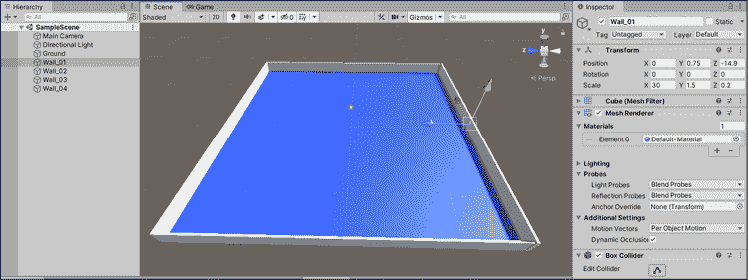

    图 6.12:带有四面墙和接地面的关卡竞技场

从这一章开始，我将给出一些关于墙壁位置、旋转和缩放的基本值，但你可以大胆尝试，使用你自己的创造力。 我想让你尝试 Unity 编辑器工具，这样你就能更快地适应。

这是一个有点建设，但竞技场已经开始成型! 在我们继续添加障碍和平台之前，您需要养成清理对象层次结构的习惯。 我们将在下一节中讨论它是如何工作的。

### 保持层级干净

通常情况下，我会把这类建议放在一个部分的末尾，但确保你的项目层次结构尽可能有组织是非常重要的，它需要有自己的分段。 理想情况下，你会希望所有相关的游戏对象都位于单个**父对象**下。 现在，这不是一个风险，因为我们在场景中只有几个对象; 然而，如果在一个大项目中出现了数百个这样的人，你就会陷入困境。

保持层次结构整洁的最简单方法是将相关对象存储在父对象中，就像您将文件存储在桌面上的文件夹中一样。 我们的关卡中有一些对象可以使用一些组织，Unity 让我们创建空的 gameobject 使这变得容易。 空对象是保存相关对象组的理想容器(或文件夹)，因为它没有附加任何组件—它是一个 shell。

让我们将我们的地平面和四壁归类到一个公共的空 GameObject 中:

1.  在**层次结构**面板中选择**+**|**创建空**，并将新对象命名为`Environment`
2.  拖拽并将地平面和四面墙放入**Environment**中，使它们成为子对象
3.  选择**环境**空对象并检查其 X**,**,**和**Z 位置都设置为 0:【显示】****

 **图 6.13:显示空游戏对象父对象的层次结构面板

环境作为父对象存在于**Hierarchy**选项卡中，舞台对象作为它的子对象。 现在，我们可以使用箭头图标展开或关闭**Environment**对象下拉列表，使**Hierarchy**面板不那么杂乱。

设置**环境是很重要的**对象的 X**,**,**和**Z 位置为 0,因为孩子现在对象的位置相对于父母的位置。 这就引出了一个有趣的问题:我们设置的这些位置、旋转和比例的原点是什么? 答案是，它们取决于我们使用的相对空间，在 Unity 中，是**World**或**Local**:****

 ***   **世界空间**使用在场景中设置起始点作为所有游戏对象的常量参考。 在统一中，这个原点是(0,0,0)，或者是*x*，*y*和*z*轴上的 0。
*   **局部空间**使用对象的父`Transform`组件作为其原点，本质上改变了场景的视角。 统一也将这个局部原点设置为(0,0,0)。可以把这个想象成父变换是宇宙的中心，其他一切都围绕着它旋转。

这两种取向在不同的情况下都很有用，但现在，在这一点上重新设定它会让每个人都处于一个公平的竞争环境中。

### 使用预制

预制件是你在 Unity 中遇到的最强大的组件之一。 它们不仅在关卡制作中很有用，在脚本编写中也很有用。 可以将 Prefabs 视为游戏对象，它可以保存并在所有子对象、组件、C# 脚本和属性设置中重用。 一旦创建，预制件就像一个类蓝图; 场景中使用的每个副本都是该预制件的单独实例。 因此，对基础预制件的任何更改也将改变场景中所有的活动实例。

竞技场看起来有点太简单，完全开放，这使它成为一个完美的地方来测试创建和编辑预制件。 因为我们想要四个相同的角楼在竞技场的每个角落，他们是一个完美的预制案例，我们可以创建以下步骤:

同样，我没有包含任何精确的屏障位置、旋转或缩放值，因为我想让你接近和个人使用 Unity 编辑器工具。

接下来，当你看到你面前的一个任务不包含特定的位置、旋转或缩放值时，我希望你通过实践来学习。

1.  通过选择**+**|**创建空**并命名为`Barrier_01`，在**环境**父对象中创建一个空的父对象。
2.  选择**+**|**3D 对象**|**Cube**创建两个立方体，并将其定位和缩放为 v 形底座。
3.  Create two more cube primitives and place them on the ends of the turret base:

    

    图 6.14:由立方体组成的炮塔的截图

4.  在**资产**下的**项目**面板中创建一个新文件夹，并将其命名为`Prefabs`。 然后，将**Barrier_01**GameObject 从**Hierarchy**面板中拖到**Prefabs**文件夹中:

    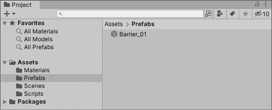

图 6.15:Prefabs 文件夹中的 Barrier Prefab

**Barrier_01**及其所有子对象现在都是 Prefabs，这意味着我们可以通过从`Prefabs`文件夹中拖拽副本或复制场景中的副本来重用它。 **Barrier_01**在**Hierarchy**标签中变成蓝色，表示其状态改变，并且在**Inspector**标签下方添加了一排预制功能按钮:

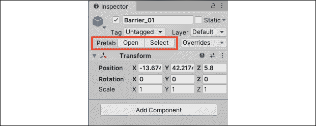

图 6.16:Inspector 窗格中突出显示的 Barrier_01 Prefab

对原预制物体**Barrier_01**的任何编辑，现在将影响场景中的任何副本。 因为我们需要第五个立方体来完成屏障，让我们更新并保存预制来看看它的作用。

现在我们的炮塔中间有一个巨大的间隙，这对于覆盖我们的角色来说并不理想，所以让我们通过添加另一个立方体来更新**Barrier_01**预制件:

1.  创建一个**立方体**原体，并将其放置在炮塔底座的交叉处。
2.  The new **Cube** primitive will be marked as gray with a little **+** icon next to its name in the **Hierarchy** tab. This means it's not officially part of the Prefab yet:

    

    图 6.17:在 Hierarchy 窗口中标记的 New Prefab 更新

3.  右键单击新**层次结构中的多维数据集原始**面板并选择**添加****GameObject**|**适用于预制“Barrier_01”**:【显示】

图 6.18:将预制件更改应用于基础预制件的选项

**Barrier_01**Prefab 现在被更新以包含新的立方体，并且整个 Prefab 层次结构应该再次变为蓝色。 你现在有了一个炮塔预制件，看起来像前面的截图，或者，如果你想冒险，一些更有创意的东西。 然而，我们希望这些在竞技场的每个角落。 这将是你的工作添加他们!

现在我们已经获得了可重复使用的屏障预制，让我们构建关卡的其余部分，以匹配我们在本部分开始时的草图:

1.  复制**Barrier_01**预制三次，并将每一个放置在竞技场的不同角落。 你可以通过拖动多个**Barrier_01 对象从**的**文件夹到现场,或右键单击**Barrier_01**【显示】层次结构中的**并选择复制。
2.  在**Environment**父对象中创建一个新的空游戏对象，并将其命名为`Raised_Platform`。
3.  创建一个**立方体**并将其缩放成一个平台，如图*图 6.19*所示。
4.  创建一个**平面**并将其缩放为斜坡:
    *   提示:围绕*x*或*y*轴旋转平面，创建一个有角度的平面
    *   然后，定位它，使它连接平台和地面
5.  在 Mac 上使用`Cmd`+`D`或在 Windows 上使用`Ctrl`+`D`复制斜坡对象。 然后，重复旋转定位步骤。
6.  重复以上步骤两次，直到有四个斜坡通向平台:

    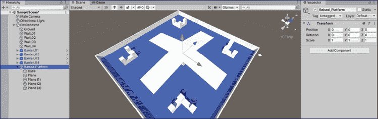

图 6.19:凸起的平台 parent GameObject

你现在已经成功地白盒你的第一个游戏关卡! 不过，不要太沉迷其中，我们才刚刚开始。 所有优秀的游戏都有玩家可以拿起或与之互动的道具。 在接下来的挑战中，你的任务是创造一个生命值道具并将其设置为预制道具。

#### 英雄的试验-创造一个生命拾取器

把我们目前在本章学到的所有内容放在一起可能需要你花几分钟，但这是很值得的。 创建拾取项如下:

1.  选择**+**|**3D 对象**|**Capsule**创建一个**Capsule**游戏对象，并命名为`Health_Pickup`。
2.  设置规模为 0.3 x*,*,*和*z 轴,然后切换到**移动工具和位置附近你的一个障碍。****
****   创建并附加一个黄色**材质**到**Health_Pickup**对象。*   将**健康拾取**对象从**层次**窗格中拖动到**预制**文件夹中。***

 ***参考下面的截图，以获得最终产品的样子:

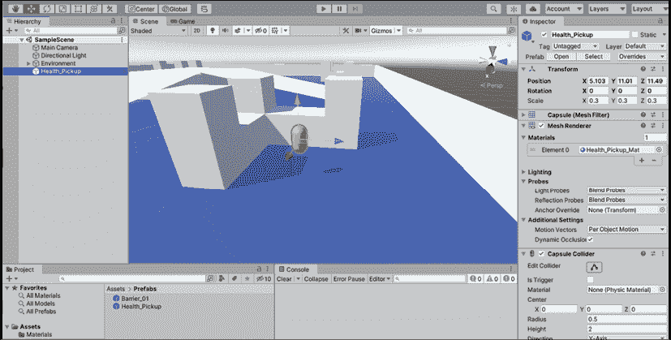

图 6.20:场景中预制的拾取物品和障碍物

这就是我们现在关于关卡设计和布局的工作。 接下来，你将得到一个在照明与 Unity 的速成课程，我们将在本章的后面学习我们的项目的动画。

# 照明基础知识

光照在 Unity是一个广泛的主题，但它可以归结为两类:实时和预先计算。 这两种类型的灯都考虑了属性，例如光的颜色和强度，以及它在场景中面对的方向，这些都可以在**检查器**窗格中配置。 不同之处在于 Unity 引擎如何计算灯光的行为。

*实时光照*是每一帧计算的，这意味着任何经过其路径的物体都会投射真实的阴影，通常表现得像一个真实的光源。 然而，这可能会显著降低你的游戏速度，并耗费大量计算能力(取决于场景中的灯光数量)。 另一方面，*预先计算的光照*将场景的光照存储在一个名为**lightmap**的纹理中，然后应用或烘焙到场景中。 虽然这节省了计算能力，但烘焙照明是静态的。 这意味着当物体在场景中移动时，它不会做出逼真的反应或改变。

还有一种混合的类型的照明称为预计算实时全局照明，它在实时和预计算过程之间架起了桥梁。 这是一个高级的特定于 unity 的主题，所以我们不会在本书中讨论它，但是您可以在[https://docs.unity3d.com/Manual/GIIntro.html](https://docs.unity3d.com/Manual/GIIntro.html)查看文档。

现在让我们看看如何在 Unity 场景中创建光对象。

## 创建灯光

默认情况下，每个场景都带有一个方向光组件作为主要照明源，但灯光可以像其他游戏对象一样在层次中创建。 尽管控制光源的想法对你来说可能是新的，但它们是 Unity 中的对象，这意味着它们可以定位、缩放和旋转，以满足你的需求:


图 6.21:照明创建菜单选项

让我们来看看一些实时光物体的例子和它们的表现:

*   **方向****灯光**非常适合模拟自然光，如阳光。 他们在场景中没有实际的位置，但是他们的光线总是指向同一个方向。
*   **点**点**光**本质上是漂浮的球体，从中心点向四面八方发射光线。 这些在场景中定义了位置和强度。
*   **聚光灯**将灯光按给定的方向发出，但它们被角度锁定并聚焦在场景的特定区域。 把它们想象成现实世界中的聚光灯或泛光灯。
*   **Area lights** are shaped like rectangles, sending out light from their surface from a single side of the rectangle.

    **反射探针**、**光探针**超出*英雄诞生*所需; *但是，如果你有兴趣，你可以在[https://docs.unity3d.com/Manual/ReflectionProbes.html](https://docs.unity3d.com/Manual/ReflectionProbes.html)和[https://docs.unity3d.com/Manual/LightProbes.html](https://docs.unity3d.com/Manual/LightProbes.html)找到更多。*

 *就像 Unity 中的所有游戏对象一样，灯光也有可以调整的属性，以赋予场景一个特定的氛围或主题。

## 光组件属性

下面的截图显示了场景中方向灯上的**Light**组件。 所有这些属性都可以配置成沉浸式环境，但我们需要注意的基本属性是**颜色**、**模式**和**强度**。 这些属性控制着光线的色调、实时或计算的效果和一般强度:

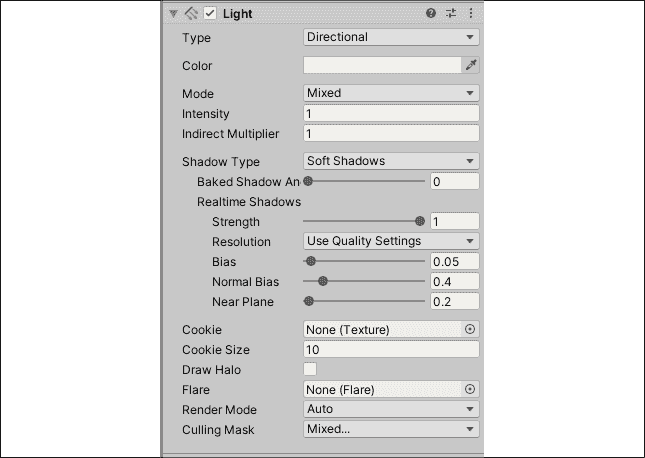

图 6.22:Inspector 窗口中的 Light 组件

像其他 Unity 组件一样，这些属性可以通过脚本和`Light`类访问，可以在[https://docs.unity3d.com/ScriptReference/Light.html](https://docs.unity3d.com/ScriptReference/Light.html)找到。

选择**+**|**Light**|**Point Light**试试这个，看看它对区域照明的影响。 设置完成后，在**层次**面板中右键单击点灯，然后选择**删除**，删除点灯。

现在我们知道了更多关于照亮游戏场景的内容，让我们将注意力转向添加一些动画!

# 动画在统一中

在 Unity 中，物体的动画可以是简单的旋转效果，也可以是复杂的角色动作和动作。 你可以在代码或动画和动画窗口中创建动画:

*   **动画**窗口是使用时间轴创建和管理动画片段(称为剪辑)的地方。 沿着这个时间轴记录对象属性，然后回放以创建一个动画效果。
*   **Animator**窗口使用称为动画控制器的对象管理这些剪辑及其转换。

你可以在[https://docs.unity3d.com/Manual/AnimatorControllers.html](https://docs.unity3d.com/Manual/AnimatorControllers.html)找到更多关于 Animator 窗口及其控制器的信息。

在剪辑中创建和操作你的目标对象将使你的游戏在任何时候移动。 在我们进入 Unity 动画的短暂旅程中，我们将在代码中使用 Animator 创建相同的旋转效果。

## 在代码中创建动画

首先，我们将在代码中创建一个动画来旋转生命值道具拾取。 因为所有游戏对象都有一个`Transform`组件，所以我们可以抓取道具的`Transform`组件并无限旋转它。

要在代码中创建动画，你需要执行以下步骤:

1.  在`Scripts`文件夹中创建一个新脚本，命名为`ItemRotation`，然后在 Visual Studio Code 中打开它。
2.  在新脚本的顶部和类内部，添加一个包含值`100`(称为`RotationSpeed`)的`int`变量，以及一个`Transform`(称为`ItemTransform:`

    ```cs
    public int RotationSpeed = 100;
    Transform ItemTransform; 
    ```

3.  在`Start()`方法体中，抓取游戏对象的`Transform` 组件并将其分配给`ItemTransform:`

    ```cs
    ItemTransform = this.GetComponent<Transform>(); 
    ```

4.  Inside the `Update()` method body, call `ItemTransform.Rotate`. This `Transform` class method takes in three axes, one for the *X*, *Y*, and *Z* rotations you want to execute. Since we want the item to rotate end over end, we'll use the *x* axis and leave the others set to `0`:

    ```cs
    ItemTransform.Rotate(RotationSpeed * Time.deltaTime, 0, 0); 
    ```

    你会注意到我们将`RotationSpeed`乘以一个叫做`Time.deltaTime`的东西。 这是在 Unity 中标准化移动效果的标准方法，这样不管玩家的电脑运行得多快或多慢，它们看起来都很平滑。 一般来说，你应该总是将你的移动或旋转速度乘以`Time.deltaTime`。

5.  Back in Unity, select the `Health_Pickup` object in the `Prefabs` folder in the **Projects** pane and scroll down to the bottom of the **Inspector** window. Click **Add Component**, search for the `ItemRotation` script, and then press `Enter`:

    

    图 6.23:Inspector 面板中的 Add Component 按钮

6.  现在我们的预制件更新了，移动**主摄像机**，这样你就可以看到`Health_Pickup`对象，然后点击播放!

    

图 6.24:聚焦于健康项目的摄像机的屏幕截图

正如你可以看到的，生命值拾取器现在在一个连续且平滑的动画中围绕其*x*轴旋转! 现在你已经在代码中动画了项目，我们将使用 Unity 的内置动画系统来复制我们的动画。

## 在 Unity 动画窗口中创建动画

任何你想要应用动画剪辑的游戏对象都需要通过设置**动画控制器**来附加到动画器组件上。 如果在创建新剪辑时，项目中没有控制器，Unity 将创建一个并保存在项目面板中，然后你可以使用它来管理你的剪辑。 你的下一个挑战是为拾取物品创建一个新的动画剪辑。

我们将通过创建一个新的动画剪辑开始动画`Health_Pickup`预制件，它将在一个无限循环中旋转对象。 要创建一个新的动画剪辑，我们需要执行以下步骤:

1.  导航到**窗口**|**动画**|**动画**,打开**动画面板和拖拽【显示】动画选项卡**控制台旁边**。**
***   Make sure the `Health_Pickup` item is selected in **Hierarchy** and then click on **Create** in the **Animation** panel:

    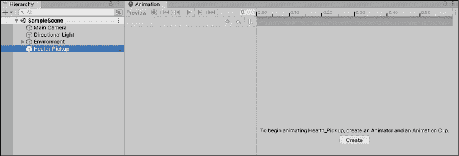

    图 6.25:Unity 动画窗口的截图

    *   Create a new folder from the following drop-down list, name it `Animations`, and then name the new clip `Pickup_Spin`:

    

    图 6.26:创建新动画窗口的屏幕截图

    *   Make sure the new clip shows up in the **Animation** panel:

    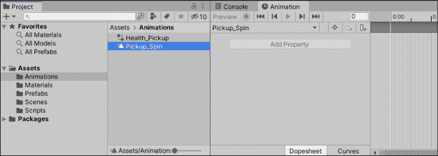

    图 6.27:动画窗口的屏幕截图

    *   因为我们没有任何**Animator**控制器，所以 Unity 在`Animation`文件夹中为我们创造了一个名为**Health_Pickup**的控制器。 与**Health_Pickup 选中时,注意在【显示】**检查器窗格中,当我们创建了剪辑,一个****动画组件也添加到我们的组合式但尚未正式保存到预设的**【病人】Health_Pickup 控制器集。*******   Notice that the **+** icon is showing in the top left of the **Animator** component, meaning it's not yet part of the **Health_Pickup** Prefab:

    

    图 6.28:Inspector 面板中的 Animator 组件

    *   Select the three-vertical-dots icon at the top right and choose **Added Component** | **Apply to Prefab 'Health_Pickup'**:

    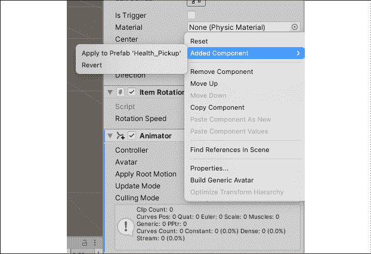

    图 6.29:应用于预制构件的新组件的屏幕截图** 

现在你已经创建并添加了一个 Animator 组件到**Health_Pickup****预制件中，是时候开始记录一些动画帧了。 当你想到电影中的动作剪辑时，你可能会想到帧。 当剪辑在它的帧中移动时，动画继续前进，产生移动的效果。 在 Unity 中也不例外; 我们需要在不同帧的不同位置记录目标对象，以便 Unity 能够播放剪辑。**

 **## 记录关键帧

现在我们有了一个要处理的剪辑，您将在**Animation**窗口中看到一个空白的时间轴。 本质上，当我们修改**Health_Pickup**预制件的*z*旋转或任何其他可以动画的属性时，时间轴将把这些变化记录为关键帧。 然后 Unity 将这些关键帧组合到你的完整动画中，就像模拟电影中的单个帧一起播放成一个移动的画面。

看看下面的截图，记住记录按钮的位置和时间轴:

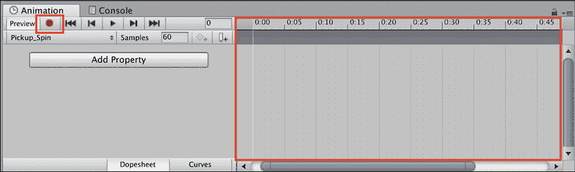

图 6.30:动画窗口和关键帧时间轴的截图

现在，让我们的项目旋转。 对于旋转动画，我们希望**Health_Pickup**预制件每秒钟在其*z*轴上进行 360 度旋转，这可以通过设置三个关键帧并让 Unity 处理其余帧来实现:

1.  Select the **Health_Pickup** object in the **Hierarchy** window, choose **Add Property** | **Transform**, and then click on the **+** sign next to **Rotation**:

    

    图 6.31:为动画添加 Transform 属性的截图

2.  Click on the record button to start the animation:
    *   将光标置于时间轴上的**0:00**，但将**Health_Pickup**预装件的*z*旋转位置保持在 0
    *   将光标置于时间轴上的**0:30**，并将*z*旋转设置为**180**
    *   将光标置于**1:00**的时间轴上，并将*z*旋转设置为**360**

    

    图 6.32:动画关键帧的截图

3.  点击录制按钮来完成动画
4.  点击录制按钮右边的播放按钮来查看动画循环

你会注意到我们的**Animator**动画覆盖了我们之前在代码中编写的动画。 别担心; 这是预期的行为。 您可以点击**检查器**面板中任何组件右侧的小复选框来激活或禁用它。 如果你停用**Animator**组件，**Health_Pickup**将再次使用我们的代码绕*x*轴旋转。

**Health_Pickup**对象现在会在*z*轴上每秒在 0、180 和 360 度之间旋转，创建循环旋转动画。 如果你现在玩游戏，动画会无限地运行，直到游戏停止:

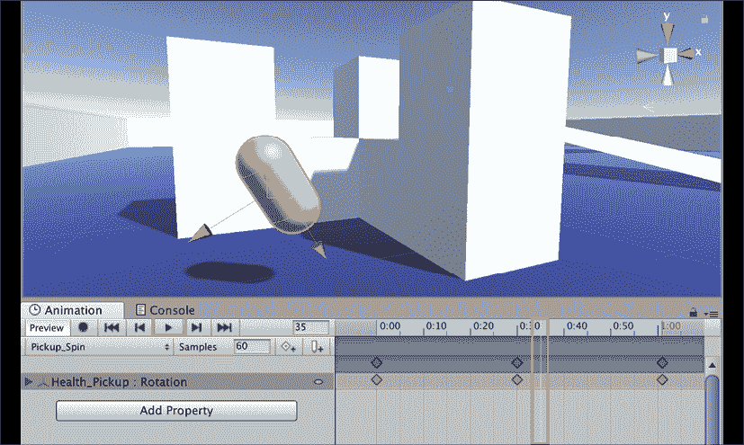

图 6.33:动画窗口中播放动画的屏幕截图

所有的动画都有曲线，它决定了动画如何执行的特定属性。 我们不会在这些方面做太多的工作，但是了解基本知识是很重要的。 我们将在下一节讨论它们。

## 曲线和切线

除了动画对象属性，Unity 还允许我们通过动画曲线来管理动画如何随着时间的推移而播放。 到目前为止，我们一直处于**Dopesheet**模式，你可以在动画窗口的底部进行更改。 如果你点击**曲线**视图(如下截图所示)，你会看到一个不同的图形，在我们记录的关键帧的位置上有重音点。

我们希望旋转动画是平滑的，也就是我们所说的线性，所以我们将保持一切原样。 然而，加速、减慢或改变动画运行中的任何一点都可以通过拖动或调整曲线图上的任何方向上的点来实现:


图 6.34:动画窗口中 Curves 时间轴的屏幕截图

使用动画曲线处理属性随时间变化的方式，我们仍然需要一种方法来修复每次**Health_Pickup**动画重复时出现的断断续续。 为此，我们需要改变动画的切线，它管理关键帧之间的混合。

这些选项可以通过在**Dopesheet**模式中右键单击时间轴上的任何关键帧来访问，你可以在这里看到:

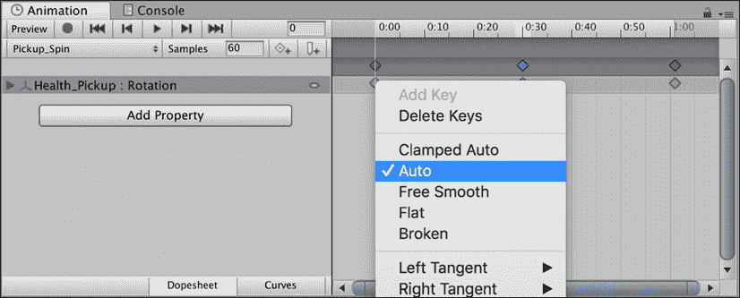

图 6.35:关键帧平滑选项的截图

曲线和切线都是中级或高级的，所以我们不会深入研究它们。 如果你感兴趣，你可以在[https://docs.unity3d.com/Manual/animeditor-AnimationCurves.html](https://docs.unity3d.com/Manual/animeditor-AnimationCurves.html)查看关于动画曲线和切线选项的文档。

如果你现在播放旋转动画，在项目完成完整的旋转和开始一个新的旋转之间会有一个轻微的暂停。 你的工作就是解决这个问题，这是下一个挑战的主题。

让我们调整动画的第一帧和最后一帧的切线，以便旋转动画在重复时无缝地融合在一起:

1.  Right-click on the first and last keyframes' diamond icons on the animation timeline and select **Auto**:

    

    图 6.36:改变关键帧平滑选项

2.  如果你还没有这样做，移动**主摄像头**，这样你就可以看到`Health_Pickup`对象，然后点击播放:

    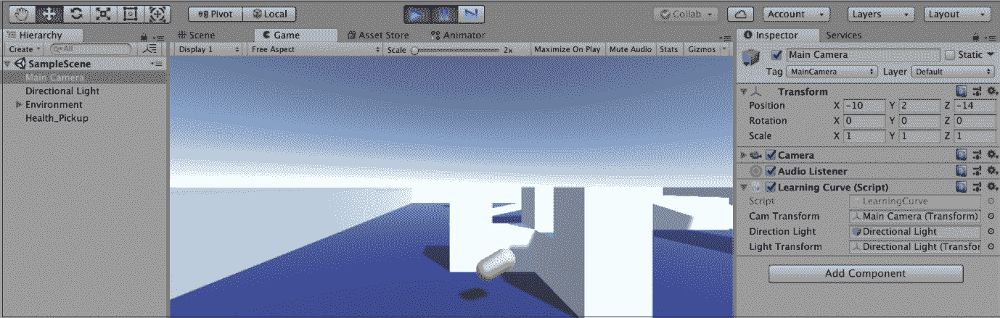

图 6.37:最终平滑动画播放的截图

将第一个和最后一个关键帧的切线更改为**Auto**会让 Unity 使它们的过渡平滑，从而消除动画循环时不稳定的停止/开始动作。

这就是你在这本书中所需要的所有动画，但我建议你去看看 Unity 在这方面提供的完整工具箱。 你的游戏会更吸引人，你的玩家也会感谢你!

# 总结

我们完成了另一章的结尾，这一章有很多可移动的部分，对于那些刚接触 Unity 的人来说，这可能是一个很大的收获。

虽然这本书的重点是 C# 语言及其在 Unity 中的实现，但我们仍然需要花时间来了解游戏开发、文档以及引擎的非脚本功能。 虽然我们没有时间深入报道灯光和动画，但如果你想继续创建 Unity 项目，那么了解它们是值得的。

在下一章中，我们将把注意力转回到《英雄诞生》的核心机制上，首先设置一个可移动的玩家对象，控制摄像机，理解 Unity 的物理系统如何控制游戏世界。

# Pop quiz -基本的 Unity 功能

1.  立方体、胶囊和球体是哪种游戏对象的例子?
2.  Unity 使用什么轴来表示深度，从而赋予场景 3D 外观?
3.  如何将游戏对象转变为可重用的预制件?
4.  Unity 动画系统使用什么测量单位来记录对象动画?*****************