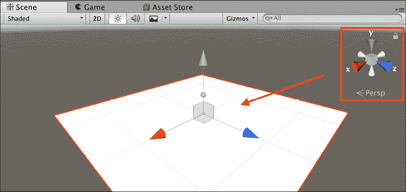
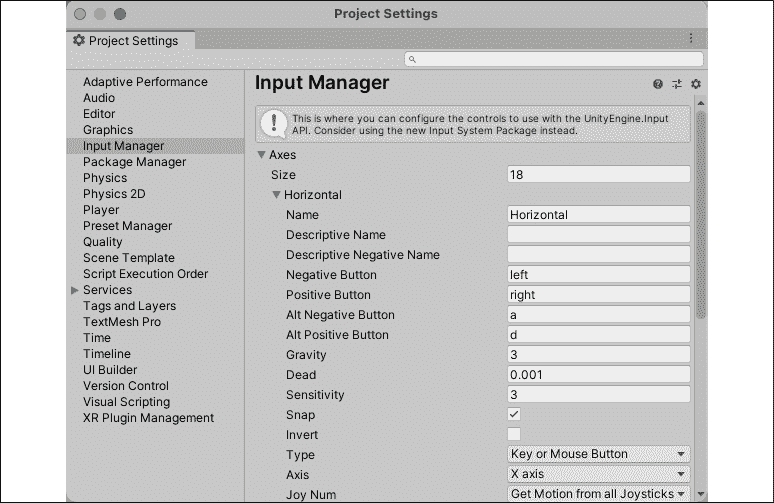
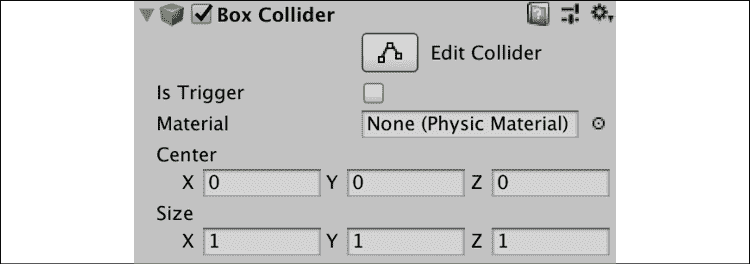
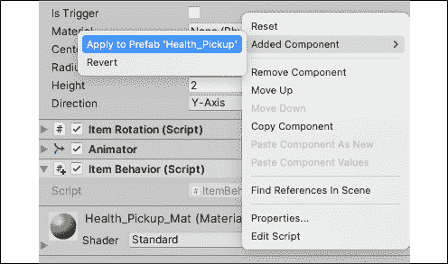
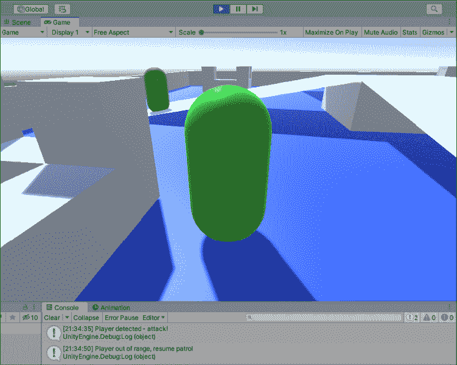

# 七、移动，相机控制，碰撞

当玩家开始一款新游戏时，他们所做的第一件事便是尝试角色移动(游戏邦注:当然，如果游戏拥有可移动的角色)和摄像机控制。 这不仅令人兴奋，还能让你的玩家知道他们可以期待什么样的游戏玩法。 *《英雄诞生》*中的人物将是一个胶囊对象，可以分别使用`W`、`A`、`S`、`D`或方向键移动和旋转。

我们将从学习如何操作玩家对象的`Transform`组件开始，然后使用应用的力量复制相同的玩家控制方案。 这产生了更现实的运动效果。 当我们移动玩家时，摄像机将会从玩家稍后或稍高于玩家的位置移动，这样当我们执行射击机制时，瞄准就更容易了。 最后，我们将探索 Unity 的物理系统如何通过我们的道具拾取预制件处理碰撞和物理交互。

所有这些都将结合在一个可玩的关卡中，尽管目前还没有任何射击机制。 它还将让我们第一次尝试用 C# 编写游戏功能，将以下主题结合在一起:

*   管理球员运动
*   使用`Transform`组件移动玩家
*   脚本相机的行为
*   使用 Unity 物理系统

# 管理球员运动

当你决定如何在虚拟世界中移动玩家角色时，要考虑什么才是最真实的，而不是用昂贵的计算来运行你的游戏。 在大多数情况下，这是一种权衡，Unity 也不例外。

三种最常见的移动 a`GameObject`的方法及其结果如下:

*   **选项 A**:使用`GameObject`的`Transform`组件进行移动和旋转。 这是最简单的解决方案，也是我们首先要使用的。
*   **Option B**: Use real-world physics by attaching a **Rigidbody** component to a `GameObject` and apply force in code. `Rigidbody` components add simulated real-world physics to any `GameObject` they are attached to. This solution relies on Unity's physics system to do the heavy lifting, delivering a far more realistic effect. We'll update our code to use this approach later on in this chapter to get a feel for both methods.

    统一是指在移动或旋转`GameObject`时坚持一致的方法; 操作一个物体的`Transform`或`Rigidbody`组件，但不能同时操作两者。

*   **选项 C**:添加现成的 Unity 组件或预制件，如角色控制器或第一人称控制器。 这样就省去了样板代码，并且在加快原型开发时间的同时仍然提供了真实的效果。

你可以在[https://docs.unity3d.com/ScriptReference/CharacterController.html](https://docs.unity3d.com/ScriptReference/CharacterController.html)找到关于字符控制器组件及其使用的更多信息。

第一人称控制器预制件可以从 Standard Assets 包中获得，您可以从[https://assetstore.unity.com/packages/essentials/asset-packs/standard-assets-32351](https://assetstore.unity.com/packages/essentials/asset-packs/standard-assets-32351)下载该包。

因为你刚刚开始使用 Unity 中的玩家移动，你将在下一节中开始使用玩家 Transform 组件，然后在本章的后面继续学习`Rigidbody`物理。

# 使用 Transform 组件移动玩家

我们希望《英雄的诞生》能有一个“T0”的第三人称冒险设置，所以我们将从一个胶囊开始，这个胶囊可以通过键盘输入和一个摄像头来控制它的移动。 尽管这两个 gameobject 将在游戏中一起工作，但为了更好地控制它们，我们将把它们和它们的脚本分开。

在我们能够执行任何脚本之前，你需要将玩家胶囊添加到场景中，这是你的下一个任务。

我们可以通过以下几个步骤创造一个不错的玩家胶囊:

1.  点击**层级**面板中的**+**|**3D 对象**|**胶囊**，命名为`Player`。
2.  选择`Player`游戏对象，点击**添加组件**在**检查器**标签底部。 搜索**刚体**，点击`Enter`添加。 我们稍后才会使用这个组件，但最好在一开始就正确设置。
3.  Expand the **Constraints** property at the bottom of the **Rigidbody** component:
    *   检查箱子的**冻结旋转****X, Y****,**和**Z 轴的球员不能旋转以外的其他任何方式通过以后我们编写的代码:**

    

    图 7.1:刚体组件

4.  在**Project**面板中选择`Materials`文件夹，点击**创建**|**材质**。 命名为`Player_Mat`。
5.  中选择`Player_Mat`**的层次结构,然后改变**反照率**中的**属性检查员**明亮的绿色和拖材料【显示】玩家**中的**对象层次结构**面板:【病人】

图 7.2:与胶囊相连的玩家材料

你已经用胶囊原体、刚体组件和新的亮绿色材料创建了**玩家**对象。 不要担心刚体组件是什么-你现在需要知道的是它允许我们的胶囊与物理系统交互。 当我们讨论 Unity 的物理系统如何工作时，我们将在本章的最后讨论更详细的内容。 在我们开始之前，我们需要讨论 3D 空间中一个非常重要的主题:向量。

## 了解向量

现在我们已经设置好玩家胶囊和摄像机，我们可以开始研究如何使用`Transform`组件移动和旋转游戏对象。 `Translate`和`Rotate`方法是 Unity 提供的`Transform`类的一部分，每个方法都需要一个矢量参数来执行其给定的功能。

在 Unity 中，矢量用于在 2D 和 3D 空间中保存位置和方向数据，这就是为什么它们有两种类型——`Vector2`和`Vector3`。 它们可以像我们见过的其他变量类型一样使用; 它们只是包含不同的信息。 因为我们的游戏是 3D 的，所以我们将使用`Vector3`对象，这意味着我们需要使用*x*，*y*和*z*值来构建对象。

对于二维向量，只需要*x*和*y*位置。 记住，你的 3D 场景中最新的方向将显示在右上方的图形中，我们在前一章讨论过*第六章*，*Getting your Hands Dirty with Unity*:



图 7.3:Unity 编辑器中的矢量小装置

如果你想要更多关于 Unity 中向量的信息，请参考文档和脚本参考[https://docs.unity3d.com/ScriptReference/Vector3.html](https://docs.unity3d.com/ScriptReference/Vector3.html)。

例如，如果我们想要创建一个新的矢量来保持场景的起始位置，我们可以使用以下代码:

```cs
Vector3 Origin = new Vector(0f, 0f, 0f); 
```

我们所做的就是创建了一个新的`Vector3`变量并初始化一个`0`【T6 x】位置,`0`的【显示】y 位置,和`0`*z 位置,在这个秩序。 这将使玩家在游戏竞技场的起源处重生。 值可以有或没有小数，但它们总是需要以小写的`f`结束。*

 *我们也可以通过使用`Vector2`或`Vector3`类属性来创建方向向量:

```cs
Vector3 ForwardDirection = Vector3.forward; 
```

而不是保持一个位置，`ForwardDirection`参考我们的场景中沿着*z*轴在 3D 空间中的正方向。 使用 Vector3 方向的好处在于，无论我们让玩家朝哪个方向看，我们的代码总是知道哪个方向是前进的。 我们来看看使用向量在本章后面,但现在习惯于思考 3 d 运动的*,*,和【显示】z 位置和方向。**

 **如果矢量的概念对你来说是新的，不要担心——这是一个复杂的话题。 Unity 的 vector 烹饪书是一个很好的开始:[https://docs.unity3d.com/Manual/VectorCookbook.html](https://docs.unity3d.com/Manual/VectorCookbook.html)。

现在你对向量有了更多的了解，你可以开始执行移动玩家胶囊的基础知识了。 为此，您需要从键盘收集玩家输入，这是下面部分的主题。

## 获取玩家输入

位置和方向本身就很有用，但如果没有玩家的输入，它们就无法产生移动。 这就是`Input`类的作用所在，它处理从击键和鼠标位置到加速度和陀螺仪数据的所有内容。

我们要使用`W`,`A`,`S`,`D`,*英雄和箭头键运动*出生,加上一个脚本,它允许摄像机跟着玩家点鼠标。 要做到这一点，我们需要理解输入轴是如何工作的。

首先，点击**Edit**|**Project Settings**|**Input Manager**，打开**Input Manager**选项卡，如下图所示:



图 7.4:Input Manager 窗口

Unity 2021 有一个新的输入系统，它删除了许多编码工作，使得在编辑器中更容易将输入设置为动作。 因为这是一本编程书，所以我们要从头做起。 但是，如果您想了解新的输入系统是如何工作的，请查看这个很棒的教程:[https://learn.unity.com/project/using-the-input-system-in-unity](https://learn.unity.com/project/using-the-input-system-in-unity)。

你会看到一个很长的 Unity 默认输入列表(T4)，但是让我们以**水平**轴为例。 你可以看到水平【显示】**输入轴的**积极的**和**-【病人】按钮设置为`left`和`right`,**和**Alt**-【t16.1】和**Alt 积极**按钮设置为`a`和`d`键。******

无论何时从代码中查询输入轴，其值都在-1 到 1 之间。 例如，当向下推左箭头或`A`键时，横轴将注册一个-1 值。 当这些键被释放时，值返回 0。 同样地，当使用右箭头或`D`键时，横轴记录值为 1。 这允许我们仅用一行代码就为一个轴捕获四个不同的输入，而不是为每个输入写一个长长的`if-else`语句链。

捕获输入轴与调用`Input.GetAxis()`并通过名称指定我们想要的轴一样简单，这就是我们将在接下来的部分中对`Horizontal`和`Vertical`输入所做的。 作为附带的好处，Unity 应用了平滑过滤器，这使得输入帧速率无关。

默认输入可以按您需要的任何方式进行修改，但是您也可以通过增加输入管理器中的`Size`属性并重命名为您创建的副本来创建自定义轴。 为了添加自定义输入，您必须增加`Size`属性。

让我们开始使用 Unity 的输入系统和我们自己的自定义移动脚本让玩家移动。

## 移动播放器

在你让玩家移动之前，你需要将一个脚本添加到玩家胶囊中:

1.  在`Scripts`文件夹中创建一个新的 C# 脚本，命名为`PlayerBehavior`，并将其拖放到**Hierarchy**面板中的**Player**胶囊中。
2.  添加以下代码并保存:

    ```cs
    using System.Collections;
    using System.Collections.Generic;
    using UnityEngine; 
    public class PlayerBehavior : MonoBehaviour 
    {
        **// 1**
        public float MoveSpeed = 10f;
        public float RotateSpeed = 75f;
        **// 2**
        private float _vInput;
        private float _hInput;
        void Update()
        {
            **// 3**
            _vInput = Input.GetAxis("Vertical") * MoveSpeed;
            **// 4**
            _hInput = Input.GetAxis("Horizontal") * RotateSpeed;
            **// 5**
            this.transform.Translate(Vector3.forward * _vInput * 
            Time.deltaTime);
            **// 6**
            this.transform.Rotate(Vector3.up * _hInput * 
            Time.deltaTime);
        }
    } 
    ```

使用`this`关键字是可选的。 Visual Studio 2019 可能会建议您删除它以简化代码，但为了清晰起见，我宁愿保留它。 在本例中，当您有空方法(如`Start`)时，为了清晰起见，通常要删除它们。

以下是前面代码的细分:

1.  声明两个公共变量用作乘数:
    *   `MoveSpeed`表示我们希望玩家前进和后退的速度
    *   `RotateSpeed`表示我们希望玩家左右旋转的速度
2.  声明两个私有变量来保存来自玩家的输入; 初始设置为无值:
    *   `_vInput`将存储垂直轴输入。
    *   `_hInput`将存储横轴输入。
3.  `Input.GetAxis("Vertical")`检测按下向上箭头、向下箭头、`W`或`S`键时的值乘以`MoveSpeed`:
    *   向上箭头和`W`键返回值为 1，这将使玩家朝正向(积极)方向移动。
    *   向下箭头和`S`键将返回-1，这将让玩家朝着消极方向向后移动。
4.  `Input.GetAxis("Horizontal")`检测按下左箭头、右箭头、`A`和`D`键时的值乘以`RotateSpeed`:
    *   右箭头和`D`键返回值 1，这将使胶囊向右旋转。
    *   The left arrow and `A` keys return -1, rotating the capsule to the left.

        如果你想知道是否有可能在一条线上完成所有的移动计算，那么简单的回答是肯定的。 然而，最好将代码分解，即使只有您一个人在阅读它。

5.  使用的`Translate`方法，其中包含一个`Vector3`参数来移动胶囊的 Transform 组件:
    *   记住，`this`关键字指定了当前脚本所附加的 GameObject，在本例中，它就是玩家胶囊。
    *   `Vector3.forward`乘以`_vInput`和`Time.deltaTime`，提供了胶囊在我们计算的速度下沿*z*轴向前或向后移动所需的方向和速度。
    *   `Time.deltaTime`将总是以秒为单位返回游戏最后一帧执行后的值。 它通常用于平滑在`Update`方法中捕获或运行的值，而不是让它由设备的帧速率决定。
6.  使用`Rotate`方法旋转胶囊的 Transform 组件，相对于我们作为参数传入的矢量:
    *   `Vector3.up`乘以`_hInput`和`Time.deltaTime`得到我们想要的左/右旋转轴。
    *   出于同样的原因，我们在这里使用`this`关键字和`Time.deltaTime`。

正如前面所讨论的，在`Translate`和`Rotate`函数中使用方向向量只是解决这个问题的一种方法。 我们可以从轴的输入中创建新的 Vector3 变量，并将它们用作参数。

当您点击播放时，您将能够使用上/下箭头键和`W`/`S`键向前和向后移动胶囊，同时使用左/右箭头键和`A`/`D`键旋转或旋转。

通过这几行代码，您已经设置了两个独立的控件，它们与帧率无关，并且很容易修改。 然而，当胶囊移动时，我们的相机并没有跟随它，所以让我们在下一节中解决这个问题。

# 脚本相机的行为

让一个 GameObject 跟随另一个 GameObject 的最简单的方法是让其中一个成为另一个的子对象。 当一个对象是另一个对象的子对象时，子对象的位置和旋转是相对于父对象的。 这意味着任何子对象都将随着父对象移动和旋转。

然而，这种方法意味着发生在玩家胶囊上的任何移动或旋转也会影响摄像机，这是我们并不希望看到的。 我们总是希望摄像机位于玩家身后一段距离，并且无论发生什么情况都要旋转去观察它。 幸运的是，我们可以通过`Transform`类的方法轻松地设置摄像机相对于胶囊的位置和旋转。 你的任务是在下一个挑战中编写摄像机逻辑脚本。

因为我们希望摄像机行为完全独立于玩家的移动方式，所以我们将控制摄像机相对于我们可以通过**Inspector**标签设置的目标的位置:

1.  在`Scripts`文件夹中新建一个 C# 脚本，命名为`CameraBehavior`，然后拖动到**Hierarchy**面板中的**Main Camera**中。
2.  添加以下代码并保存:

    ```cs
    using System.Collections;
    using System.Collections.Generic;
    using UnityEngine; 
    public class CameraBehavior : MonoBehaviour 
    {
        **// 1**
        public Vector3 CamOffset= new Vector3(0f, 1.2f, -2.6f);
        **// 2**
        private Transform _target;
        void Start()
        {
            **// 3**
            _target = GameObject.Find("Player").transform;
        }
        **// 4**
        void LateUpdate()
        {
            **// 5**
            this.transform.position = _target.TransformPoint(CamOffset);
            **// 6**
            this.transform.LookAt(_target);
        } 
    } 
    ```

以下是前面代码的细分:

1.  声明一个`Vector3`变量来存储我们想要的**主摄像机**和**玩家**胶囊之间的距离:
    *   我们可以手动设置 x*,*,*和*z 位置的相机抵消**检查员【显示】,因为`public`。****
    **   这些默认值是我认为看起来最好的，但请随意尝试。*
**   创建一个变量来保存玩家胶囊的 Transform 信息:
    *   这将使我们能够访问它的位置、旋转和缩放。
    *   我们不希望任何其他脚本能够改变相机的目标，这就是为什么它是`private`。*   使用`GameObject.Find`按名称定位胶囊并从场景中检索其 Transform 属性:
    *   这意味着胶囊的*x*，*y*和*z*位置每帧更新并存储在`_target`变量中。
    *   在场景中寻找对象是一项计算成本很高的任务，所以最好在`Start`方法中只做一次，并存储引用。 永远不要在`Update`方法中使用`GameObject.Find`，因为这将试图不断地找到你正在寻找的对象，并可能导致游戏崩溃。*   `LateUpdate`是一个`MonoBehavior`方法，像`Start`或`Update`，在`Update`之后执行:
    *   由于我们的`PlayerBehavior`脚本在其`Update`方法中移动胶囊，我们希望`CameraBehavior`中的代码在移动发生后运行; 这保证了`_target`有最新的位置可引用。*   为每一帧设置相机的位置为`_target.TransformPoint(CamOffset)`，这会产生以下效果:
    *   方法计算并返回世界空间中的相对位置。
    *   在本例中,它将返回的位置`target`(胶囊)抵消`0`的*x 轴,`1.2`在*y 轴(把上面的相机胶囊),【显示】和`-2.6`z 轴(把相机身后胶囊)。**
    ***   The `LookAt` method updates the capsule's rotation every frame, focusing on the Transform parameter we pass in, which, in this case, is `_target`:

    

    图 7.5:在播放模式下的胶囊和后面的相机*** 

 ***这是很多东西，但如果你把它分解成按时间顺序的步骤，它会更容易处理:

1.  我们为相机创建了一个偏移位置。
2.  我们找到并储存了玩家胶囊的位置。
3.  我们在每一帧中手动更新它的位置和旋转，这样它就会在一定距离内始终跟随并注视着玩家。

在使用提供特定于平台的功能的类方法时，一定要记住将事情分解为最基本的步骤。 这将帮助您在新的编程环境中立于不败之地。

虽然你所编写的管理玩家移动的代码功能完善，但你可能会注意到它有些地方有点不稳定。 为了创造一个更流畅、更真实的运动效果，你需要了解 Unity 物理系统的基础知识，这是你接下来要深入了解的。

# 使用 Unity 物理系统

到目前为止，我们还没有讨论过 Unity 引擎是如何工作的，或者它是如何在虚拟空间中创造逼真的互动和运动的。 我们将用本章剩下的时间学习 Unity 物理系统的基础知识。

驱动 Unity 的 NVIDIA PhysX 引擎的两个主要组件如下:

*   **刚体**组件，允许游戏对象受重力影响，并添加**质量**和**拖动**等属性。 如果刚体组件附加了 Collider 组件，则刚体组件也会受到施加的力的影响，这会产生更真实的运动:

    

图 7.6:Inspector 窗格中的刚体组件

*   **碰撞**组件，其中决定游戏对象如何以及何时进入和退出彼此的物理空间或简单地碰撞和反弹。 虽然应该只有一个刚体组件附加到一个给定的游戏对象，但如果你需要不同的形状或交互，可以有几个 Collider 组件。 这通常被称为复合 Collider 设置:

    

图 7.7:Inspector 窗格中的 Box collider 组件

当两个 Collider 组件相互作用时，刚体属性决定结果的相互作用。 例如，如果一个游戏物体的质量高于另一个，那么较轻的游戏物体将以更大的力弹回，就像在现实生活中一样。 这两个组件负责 Unity 中的所有物理交互和模拟运动。

使用这些组件有一些注意事项，这是 Unity 所允许的运动类型的最佳理解:

*   *运动*运动发生在刚体组件被附加到游戏对象时，但它没有注册到场景中的物理系统中。 换句话说，运动物体有物理交互作用，但不会对它们做出反应，就像现实生活中的墙一样。 这只在某些情况下使用，可以通过检查刚体组件的**is Kinematic**属性启用。 因为我们想让太空舱与物理系统相互作用，所以我们不会使用这种运动。
*   *非运动学*运动是通过施加力移动或旋转刚体组件，而不是手动改变游戏对象的 Transform 属性。 本节的目标是更新`PlayerBehavior`脚本来实现这种类型的动作。

我们现在的设置是，在使用刚体组件与物理系统交互的同时操纵胶囊的 Transform 组件，这意味着让你思考在 3D 空间中的运动和旋转。 然而，它并不适用于生产环境，Unity 建议避免在代码中混合使用运动学和非运动学运动。

你的下一个任务是使用施加的力将当前的运动系统转换成更真实的运动体验。

## 运动中的刚体组件

因为我们的玩家带有一个刚体组件，所以我们应该让物理引擎控制我们的移动，而不是手动转换和旋转 Transform。 使用武力有两种选择:

*   您可以直接使用刚体类方法(如`AddForce`和`AddTorque`)来移动和旋转对象。 这种方法有其缺点，通常需要额外的代码来补偿意外的物理行为，如碰撞期间不需要的扭矩或施加的力。
*   或者，您可以使用其他刚体类方法，如`MovePosition`和`MoveRotation`，它们仍然使用应用的力。

在下一节我们将第二个路线,以便统一应用物理的照顾我们,但如果你好奇手动应用GameObjects 力和扭矩,然后从这里开始:https://docs.unity3d.com/ScriptReference/Rigidbody.AddForce.html。

这两种方法都能让玩家感受到更逼真的感觉，让我们能够在《T0》第 8 章《T1》、《T2》脚本游戏机制《T3》中添加跳跃和冲刺机制。

如果你想知道当一个没有刚体组件的移动物体与带有刚体组件的环境组件交互时会发生什么，从玩家中移除该组件并在竞技场中运行。 恭喜你——你是个鬼魂，还能穿墙! 不要忘记添加刚体组件回来!

玩家胶囊已经附加了一个刚体组件，这意味着你可以访问和修改它的属性。 不过，首先需要找到并存储组件，这是您的下一个挑战。

在修改它之前，你需要访问并存储刚体组件到我们的播放器胶囊中。 对`PlayerBehavior`进行以下更新:

```cs
using System.Collections;
using System.Collections.Generic;
using UnityEngine;
public class PlayerBehavior : MonoBehaviour 
{
    public float MoveSpeed = 10f;
    public float RotateSpeed = 75f;
    private float _vInput;
    private float _hInput;
    **// 1**
    **private** **Rigidbody _rb;**
    **// 2**
    **void****Start****()**
    **{**
        **// 3**
        **_rb = GetComponent<Rigidbody>();**
    **}**
    void Update()
    {
      _vInput = Input.GetAxis("Vertical") * MoveSpeed;
      _hInput = Input.GetAxis("Horizontal") * RotateSpeed;
      **/***
      this.transform.Translate(Vector3.forward * _vInput * 
      Time.deltaTime);
      this.transform.Rotate(Vector3.up * _hInput * Time.deltaTime);
      ***/**
    }
} 
```

下面是前面代码的细分:

1.  添加一个类型为`Rigidbody`的私有变量，它将包含对胶囊的刚体组件的引用。
2.  `Start`方法在场景中初始化脚本时触发，这是在单击 play 时发生的，应该在需要在类的开始设置时间变量时使用该方法。
3.  `GetComponent`方法检查我们正在寻找的组件类型(在本例中为`Rigidbody`)是否存在于脚本所附加的游戏对象上，并返回它:
    *   如果组件没有附加到 GameObject，该方法将返回`null`，但因为我们知道玩家上有一个，所以我们现在不需要担心错误检查。
4.  注释掉`Update`函数中的`Transform`和`Rotate`方法调用，这样我们就不会运行两种不同的玩家控件:
    *   我们希望保留捕捉玩家输入的代码，以便我们在以后仍能使用它。

你已经在玩家胶囊中初始化并存储了刚体组件，并注释掉了过时的`Transform`代码，为基于物理的移动设置舞台。 角色现在已经准备好迎接下一个挑战，也就是增加力量。

使用以下步骤移动和旋转刚体组件。 在`Update`方法下面的`PlayerBehavior`中添加以下代码，然后保存文件:

```cs
// 1
void FixedUpdate()
{
    // 2
    Vector3 rotation = Vector3.up * _hInput;
    // 3
    Quaternion angleRot = Quaternion.Euler(rotation *
        Time.fixedDeltaTime);
    // 4
    _rb.MovePosition(this.transform.position +
        this.transform.forward * _vInput * Time.fixedDeltaTime);
     // 5
     _rb.MoveRotation(_rb.rotation * angleRot);
} 
```

以下是前面代码的细分:

1.  任何与物理或刚体相关的代码总是在`FixedUpdate`方法中，而不是`Update`或其他`MonoBehavior`方法中:
    *   `FixedUpdate`是帧率无关的，用于所有物理代码。
2.  创建一个新的`Vector3`变量来存储我们的左右旋转:
    *   `Vector3.up * _hInput`与前面例子中`Rotate`方法使用的旋转矢量相同。
3.  `Quaternion.Euler`接受`Vector3`参数并返回欧拉角度下的旋转值:
    *   我们需要一个`Quaternion`值而不是`Vector3`参数来使用`MoveRotation`方法。 这只是转换到 Unity 喜欢的旋转类型。
    *   我们乘以`Time.fixedDeltaTime`的原因与我们在`Update`中使用`Time.deltaTime`相同。
4.  在我们的`_rb`组件上调用`MovePosition`，它接受一个`Vector3`参数并相应地施加力:
    *   所使用的矢量可以分解为:胶囊在正向的位置`Transform`，乘以垂直输入和`Time.fixedDeltaTime`。
    *   刚体组件负责应用运动力来满足我们的矢量参数。
5.  调用`_rb`组件上的`MoveRotation`方法，该组件也接受一个`Vector3`参数，并在引擎盖下施加相应的力:
    *   `angleRot`已经有来自键盘的水平输入，所以我们所需要做的就是将当前的刚体旋转乘以`angleRot`来获得相同的左右旋转。

请注意，`MovePosition`和`MoveRotation`对于非运动学游戏物体的作用是不同的。 您可以在刚体脚本参考[https://docs.unity3d.com/ScriptReference/Rigidbody.html](https://docs.unity3d.com/ScriptReference/Rigidbody.html)找到更多信息。

如果你现在点击 play，你将能够在你所看到的方向上向前或向后移动，以及围绕*y*轴旋转。

施加的力会产生比转换和旋转 Transform 组件更强的效果，因此您可能需要微调**检查器**窗格中的`MoveSpeed`和`RotateSpeed`变量。 你现在已经重新创造了和之前一样的运动模式，只是有了更真实的物理效果。

如果你跑上斜坡或从中央平台上掉下来，你可能会看到玩家飞向空中，或慢慢地掉到地上。 即使刚体组件被设置为使用重力，它还是相当弱的。 我们将在下一章执行跳跃机制时解决如何将重力应用于玩家的问题。 现在，你的工作是熟悉 Collider 组件在 Unity 中如何处理冲突。

## 对撞机和碰撞

碰撞器组件不仅允许游戏对象被 Unity 的物理系统识别，而且它们还使交互和碰撞成为可能。 可以把碰撞器想象成围绕着游戏对象的无形力场; 根据它们的设置，它们可以被传递或偶遇，并且它们带有许多在不同交互过程中执行的方法。

Unity 的物理系统对 2D 和 3D 游戏的工作方式不同，所以我们将在本书中只涉及 3D 主题。 2 d 游戏如果你感兴趣,请参考[的`Rigidbody2D`组件 https://docs.unity3d.com/Manual/class-Rigidbody2D.html](https://docs.unity3d.com/Manual/class-Rigidbody2D.html)和可用的列表在[2 d 对撞机 https://docs.unity3d.com/Manual/Collider2D.html](https://docs.unity3d.com/Manual/Collider2D.html)。

下面是**Health_Pickup**对象中的**胶囊**的截图。 如果你想看到**胶囊对撞机**更好一点，增加**半径**属性:


图 7.8:附着在拾取物品上的胶囊对撞机组件

对象周围的绿色形状**胶囊对撞机**,可以移动和缩放中心使用**,**半径**,【显示】和**高度属性。****

 **当一个原语被创建时，Collider 默认匹配原语的形状; 因为我们创建了一个胶囊原语，它带有一个胶囊对撞机。

对撞机也进来**框**,**,和**网形状和从**组件可以手动添加【T7 物理学】|【显示】**菜单或从**添加组件**按钮【病人】检查员**。**

 **当 Collider 与其他组件接触时，它会发送所谓的消息或广播。 当 Collider 发送消息时，任何添加一个或多个这些方法的脚本都会收到一个通知。 这是称为*事件*，我们将在*第 14 章*、*The Journey continue*中更详细地讨论这个话题。

例如，当两个带有碰撞器的游戏对象接触时，两个对象都会注册一个`OnCollisionEnter`事件，并引用它们所遇到的对象。 可以将事件想象成发送的消息——如果您选择侦听它，那么在这种情况下，当发生碰撞时，您将得到通知。 这些信息可用于跟踪各种交互事件，但最简单的是拾取物品。 如果你希望对象能够通过其他对象，你可以使用碰撞触发器，我们将在下一节中讨论。

碰撞器通知的完整列表可以在[https://docs.unity3d.com/ScriptReference/Collider.html](https://docs.unity3d.com/ScriptReference/Collider.html)的**Messages**头下面找到。

碰撞和触发事件只在碰撞对象属于 Collider、trigger 和 RigidBody 组件以及运动学或非运动学运动的特定组合时发出。 您可以在[https://docs.unity3d.com/Manual/CollidersOverview.html](https://docs.unity3d.com/Manual/CollidersOverview.html)的**碰撞作用矩阵**部分中找到详细信息。

你之前创建的生命值道具是测试碰撞如何工作的完美场所。 你将在下一个挑战中解决这个问题。

### 拾取物品

要使用碰撞逻辑更新`Health_Pickup`对象，你需要做以下工作:

1.  在`Scripts`文件夹中创建一个新的 C# 脚本，命名为`ItemBehavior`，然后拖动到**Hierarchy**面板中的`Health_Pickup`对象上:
    *   任何使用碰撞检测*的脚本都必须*被附加到带有 Collider 组件的游戏对象上，即使它是 Prefab 的子组件。
2.  Select `Health_Pickup` in the **Hierarchy panel**, click the three vertical dots icon in the **Inspector** to the right of the **Item Behavior (Script)** component, and choose **Added Component** | **Apply to Prefab 'Health_Pickup'**:

    

    图 7.9:应用预制更改拾取物品

3.  将`ItemBehavior`中的默认代码替换为以下代码，然后保存:
4.  点击 play 并移动玩家到胶囊上来拾取它!

下面是前面代码的细分:

1.  当另一个对象进入`Item`预制件时，Unity 自动调用`OnCollisionEnter`方法:
    *   `OnCollisionEnter`带有一个参数，该参数存储了对碰撞器的引用。
    *   注意，碰撞类型是`Collision`，而不是`Collider`。
2.  `Collision`类有一个名为`gameObject`的属性，它包含了对碰撞游戏对象的 Collider 的引用:
    *   我们可以使用这个属性来获取游戏对象的名称，并使用`if`语句来检查碰撞对象是否为玩家。
3.  如果碰撞对象是玩家，我们将调用`Destroy()`方法，它接受一个 GameObject 参数并将对象从场景中移除。
4.  It then prints out a simple log to the console that we have collected an item:

    

    图 7.10:从场景中删除游戏对象的例子

我们设置了`ItemBehavior`来监听与`Health_Pickup`对象的碰撞。 每当发生碰撞时，`ItemBehavior`使用`OnCollisionEnter()`检查碰撞对象是否为玩家，如果是，则销毁(或收集)道具。

如果你感到困惑，想想我们作为接收`Health_Pickup`通知的接收器所编写的碰撞代码; 只要它被击中，代码就会触发。

同样重要的是，我们可以使用`OnCollisionEnter()`方法创建一个类似的脚本，并将其绑定到玩家身上，然后检查碰撞对象是否是 `Health_Pickup`预制件。 碰撞逻辑取决于碰撞对象的视角。

现在的问题是，在不阻止碰撞物体通过彼此的情况下，你如何设置碰撞? 我们将在下一节讨论这个问题。

## 使用对撞机触发器

默认情况下，Colliders设置为`isTrigger`属性未勾选，这意味着物理系统将它们视为固体对象，并将在碰撞时引发碰撞事件。 然而，在某些情况下，你会希望能够通过 Collider 组件而不让它停止你的游戏对象。 这时就需要触发器了。 选中`isTrigger`后，游戏对象可以通过它，但碰撞器将发送`OnTriggerEnter`、`OnTriggerExit`和`OnTriggerStay`通知。

当你需要检测游戏对象何时进入某个区域或通过某个点时，触发器是最有用的。 我们将用它来建立敌人周围的区域; 如果玩家走进入触发区，敌人就会收到警报，随后便会攻击玩家。 现在，你只需要关注下一个挑战中的敌人逻辑。

### 创建一个敌人

使用下面的步骤创建一个敌人:

1.  在**层级**面板中使用**+**|**3D 对象**|**Capsule**创建一个新基元，并命名为`Enemy`。
2.  在`Materials`文件夹内，使用**+**|**材质**，命名为`Enemy_Mat`，并将其**Albedo**属性设置为亮红色:
    *   将`Enemy_Mat`拖放到`Enemy`游戏对象中。
3.  With `Enemy` selected, click on **Add Component**, search for **Sphere Collider**, and hit `Enter` to add it:
    *   检查**isTrigger**属性框，将**半径**更改为`8`:

    

    图 7.11:附在敌人物体上的球体碰撞器组件

我们的新敌人**现在被 8 个单位的触发半径包围，形状像一个球体。 当另一个物体进入、停留或离开该区域时，Unity 就会发出通知，让我们能够捕捉到它，就像我们在碰撞中所做的那样。 您的下一个挑战将是捕获通知并在代码中执行它。**

 **为了捕获触发器事件，你需要按照以下步骤创建一个新的脚本:

1.  在`Scripts`文件夹中创建一个新的 C# 脚本，命名为`EnemyBehavior`，然后拖动到**Enemy**中。
2.  添加以下代码并保存文件:

    ```cs
    using System.Collections;
    using System.Collections.Generic;
    using UnityEngine;

    public class EnemyBehavior : MonoBehaviour 
    {
        **// 1**
        void OnTriggerEnter(Collider other)
        {
            **//2** 
            if(other.name == "Player")
            {
                Debug.Log("Player detected - attack!");
            }
        }
        **// 3**
        void OnTriggerExit(Collider other)
        {
            **// 4**
            if(other.name == "Player")
            {
                Debug.Log("Player out of range, resume patrol");
            }
        }
    } 
    ```

3.  点击游戏并走向敌人去触发第一个通知，然后离开敌人去触发第二个通知。

以下是前面代码的细分:

1.  `OnTriggerEnter()`在物体进入敌人球体对撞机半径时发射:
    *   与`OnCollisionEnter()`类似，`OnTriggerEnter()`存储了对切换对象的 Collider 组件的引用。
    *   注意，`other`属于`Collider`类型，而不是`Collision`类型。
2.  We can use `other` to access the name of the colliding GameObject, and check whether it's the `Player` with an `if` statement. If it is, the console prints out a log that the `Player` is in the danger zone.

    

    图 7.12:玩家与敌人目标之间的碰撞检测

3.  `OnTriggerExit()`在物体离开敌人球体碰撞器半径时触发:
    *   这个方法也有一个对碰撞对象的 Collider 组件的引用:
4.  We check the object leaving the Sphere Collider radius by name using another `if` statement:
    *   如果是`Player`，我们打印另一个日志到控制台，说明它们是安全的:

    

    图 7.13:碰撞触发器示例

敌人的球体对撞机(T1)会在其区域被入侵时发出通知(T2)，而`EnemyBehavior`脚本会捕捉其中两个事件。 无论玩家何时进入或退出碰撞半径，控制台都会出现一个调试日志，让我们知道代码是否有效。 我们将在*第 9 章*、*基础 AI 和敌人行为*中继续构建这些内容。

Unity 使用了一种叫做组件设计模式的东西。 无需过多细节，这是一种表示对象(以及它们的类)应该负责其行为的奇妙方式，而不是将所有代码放在一个大文件中。 这就是为什么我们在拾取道具和敌人上放置独立的碰撞脚本，而不是让一个类来处理一切。 我们将在*第十四章*、*《旅程继续》*中进一步讨论。

因为这本书是关于灌输尽可能多的好的编程习惯，你的最后一个任务是确保所有的核心对象都转化为预制件。

### 英雄的考验-所有的预制件!

要为下一章准备项目，请将`Player`和`Enemy`对象拖动到**Prefabs**文件夹中。 记住,从现在开始你总是需要右键单击**层次结构中的预制面板,选择**【显示】|**添加组件适用于预制**这些 GameObjects 巩固您所作的改变。****

完成之后，继续*物理综述*部分，确保在继续之前，你已经消化了所有我们已经讨论过的主要主题。

## 物理综述

在我们结束这一章之前，这里有几个高级概念来巩固我们到目前为止所学的内容:

*   刚体组件将模拟真实世界的物理添加到它们所附加的游戏对象中。
*   Collider 组件相互交互，以及对象，使用刚体组件:
    *   如果 Collider 组件不是触发器，它就像一个固体对象。
    *   如果 Collider 组件是一个触发器，那么它可以被遍历。
*   如果一个对象使用刚体组件并检查了**is kinematic**，那么它就是*运动学*，并告诉物理系统忽略它。
*   一个物体是*非运动学*，如果它使用刚体组件并施加力或力矩来驱动它的运动和旋转。
*   碰撞器根据它们的交互发送通知。 这些通知取决于 Collider 组件是否被设置为被触发。 通知可以从任何一个冲突方接收到，它们带有保存对象的冲突信息的引用变量。

记住，像 Unity 物理系统这样广泛而复杂的主题不是一天就能学会的。 用你在这里学到的东西作为跳板，让自己进入更复杂的话题!

# 总结

这就总结了你创造独立游戏行为并将其整合成一个简单的游戏原型的首次体验。 你已经使用了向量和基本的向量数学来确定 3D 空间中的位置和角度，你也熟悉玩家输入以及移动和旋转游戏对象的两种主要方法。 你甚至已经深入到 Unity 物理系统的内部，熟悉了刚体物理、碰撞、触发器和事件通知。 总而言之，*《英雄诞生》*开了个好头。

在下一章中，我们将开始处理更多的游戏机制，包括跳跃，冲刺，射击投射物，以及与环境的部分互动。 这将给你更多的实践经验，使用刚体组件的力量，收集玩家输入，并根据所需的场景执行逻辑。

# 突击测验-玩家控制和物理

1.  你会使用什么数据类型来存储 3D 移动和旋转信息?
2.  什么内置的 Unity 组件允许你跟踪和修改玩家控制?
3.  哪个组件将真实世界的物理添加到游戏对象?
4.  Unity 建议使用什么方法在 GameObjects 上执行物理相关代码?************