# 8

# 脚本游戏机制

在上一章中，我们专注于使用代码移动玩家和摄像机，并在旁边进入 Unity 物理环境。 然而，控制一个可玩角色并不能创造出一款吸引人的游戏; 事实上，这可能是不同游戏中保持不变的一个领域。

游戏的独特火花来自于其核心机制，以及这些机制带给玩家的力量和代理感。 如果没有乐趣和吸引人的方式去影响你所创造的虚拟环境，你的游戏就没有机会重复体验，更不用说乐趣了。 当我们冒险执行游戏机制时，我们也将升级 c#及其中级功能的知识。

本章将在《英雄诞生》原型的基础上，专注于独立执行的游戏机制，以及系统设计的基础**和用户界面**(**ui**)。 您将深入探讨以下主题:

*   增加跳跃
*   射击炮弹
*   创建游戏管理器
*   创建一个图形用户界面

# 增加跳跃

还记得上一章提到的刚体组件将模拟真实世界的物理添加到游戏对象中，碰撞器组件使用刚体对象相互交互。

关于使用刚体组件控制玩家移动，我们在前一章中没有讨论的另一件事是，我们可以轻松地添加依赖于外力的不同机制，如跳跃。 在本节中，我们将让玩家跳跃并编写第一个实用函数。

效用函数是一种类方法，它执行一些繁重的工作，这样我们就不会干扰游戏玩法代码——例如，我们想要检查玩家胶囊是否触地跳跃。

在此之前，您需要熟悉一种名为枚举的新数据类型，您将在下一节中进行操作。

## 引入枚举

根据定义，枚举类型是属于同一变量的已命名常量的集合或集合。 当您想要一个不同值的集合，但这些值的附加好处是它们都是相同的父类型时，这些值很有用。

用枚举显示比用枚举更容易，所以让我们在下面的代码片段中看看它们的语法:

```cs
enum PlayerAction { Attack, Defend, Flee }; 
```

让我们来分析一下它的工作原理，如下所示:

*   `enum`关键字声明类型，然后是变量名。
*   枚举可以包含的不同值都写在花括号中，用逗号分隔(除了最后一项)。
*   就像我们使用过的所有其他数据类型一样，`enum`必须以分号结束。

在本例中，我们声明了一个名为`PlayerAction`的变量，其类型为`enum`，可以将其设置为三个值之一:`Attack`、`Defend`或`Flee`。

要声明一个枚举变量，我们使用以下语法:

```cs
PlayerAction CurrentAction = PlayerAction.Defend; 
```

同样，我们可以将其分解如下:

*   该类型被设置为`PlayerAction`，因为我们的枚举就像任何其他类型一样，比如字符串或整数。
*   变量名为`currentAction`，并将其设置为`PlayerAction`值。
*   每个枚举常量都可以使用点表示法访问。

我们的 c`urrentAction`变量现在被设置为`Defend`，但是它可以在任何时候被更改为`Attack`或`Flee`。

枚举乍一看可能很简单，但在正确的情况下它们非常强大。 它们的最有用的特性之一是存储底层类型的能力，这是接下来要讨论的主题。

### 基本类型

枚举具有*基础类型*，这意味着花括号内的每个常量都有一个关联值。 默认的基础类型是`int`，从 0 开始，就像数组一样，每个顺序常量获得下一个最高的数字。

并不是创建所有类型——枚举的类型仅限于`byte`、`sbyte`、`short`、`ushort`、`int`、`uint`、`long`和`ulong`。 这些类型称为整型，用于指定变量可以存储的数值的大小。

这对于本书来说有点高级，但是在大多数情况下您将使用`int`。 关于这些类型的更多信息可以在这里找到:[https://docs.microsoft.com/en-us/dotnet/csharp/language-reference/keywords/enum](https://docs.microsoft.com/en-us/dotnet/csharp/language-reference/keywords/enum)。

例如，我们的`PlayerAction`枚举值现在列出如下，即使它们没有显式地写出来:

```cs
enum PlayerAction { Attack = 0, Defend = 1, Flee = 2 }; 
```

没有规则说潜在价值需要从`0`开始; 实际上，你所要做的就是指定第一个值，然后 c#为我们增加其余的值，如下面的代码片段所示:

```cs
enum PlayerAction { Attack = 5, Defend, Flee }; 
```

在上面的例子中，`Defend`等于`6`，`Flee`自动等于`7`。 但是，如果我们想要`PlayerAction`枚举保存非连续的值，我们可以显式地将它们添加进去，像这样:

```cs
enum PlayerAction { Attack = 10, Defend = 5, Flee = 0}; 
```

我们甚至可以通过在枚举名称后添加冒号，将`PlayerAction`的基础类型更改为任何已批准的类型，如下所示:

```cs
enum PlayerAction :  **byte** { Attack, Defend, Flee }; 
```

获取枚举的底层类型需要进行显式转换，但我们已经讨论过了，所以下面的语法应该不足为奇:

```cs
enum PlayerAction { Attack = 10, Defend = 5, Flee = 0};
PlayerAction CurrentAction = PlayerAction.Attack;
**int** ActionCost = **(****int****)**CurrentAction; 
```

因为`CurrentAction`被设置为`Attack`，所以`ActionCost`在上面的示例代码中应该是`10`。

枚举是编程武库中极其强大的工具。 您的下一个挑战是使用枚举知识从键盘收集更具体的用户输入。

现在我们已经基本掌握了枚举类型，我们可以使用`KeyCode`枚举来捕获键盘输入。 用以下突出显示的代码更新`PlayerBehavior`脚本，保存它，然后点击播放:

```cs
public class PlayerBehavior : MonoBehaviour 
{
    // ... No other variable changes needed ...

    **// 1**
    **public****float** **JumpVelocity =** **5f****;**
    **private****bool** **_isJumping;**

    void Start()
    {
        _rb = GetComponent<Rigidbody>();
    }

    void Update()
    {
        **// 2**
        **_isJumping |= Input.GetKeyDown(KeyCode.Space);**
        // ... No other changes needed ...
    }

    void FixedUpdate()
    {
        **// 3**
        **if****(_isJumping)**
        **{**
            **// 4**
            **_rb.AddForce(Vector3.up * JumpVelocity, ForceMode.Impulse);**
        **}**
        **// 5**
        **_isJumping =** **false****;**
        // ... No other changes needed ...
    }
} 
```

让我们将这段代码分解如下:

1.  首先，我们创建了两个新变量——一个公共变量用于保存我们想要的跳跃力的数量，另一个私有布尔值用于检查玩家是否应该跳跃。
2.  我们将`_isJumping`的值设置为`Input.GetKeyDown()`方法，该方法根据是否按下指定的键返回一个`bool`值。
    *   我们使用`|=`操作符设置`_isJumping`，这是逻辑上的`or`条件。 这个操作符确保在玩家跳跃时，连续的输入检查不会相互覆盖。
    *   The method accepts a key parameter as either a `string` or a `KeyCode`, which is an enumeration type. We specify that we want to check for `KeyCode.Space`.

        在`FixedUpdate`中检查输入有时会导致输入丢失甚至双输入，因为它不是每帧运行一次。 这就是为什么我们要检查`Update`中的输入，然后施加力或在`FixedUpdate`中设置速度。

3.  我们使用`if`语句来检查`_isJumping`是否为真，如果为真，则触发跳转机制。
4.  因为我们已经存储了刚体组件，所以我们可以将`Vector3`和`ForceMode`参数传递给`RigidBody.AddForce()`，让玩家跳跃。
    *   我们指定，矢量(或作用力)应该在`up`方向上，乘以`JumpVelocity`。
    *   The `ForceMode` parameter determines how the force is applied and is also an enumeration type. `Impulse` delivers an instant force to an object while taking its mass into account, which is perfect for a jump mechanic.

        其他的`ForceMode`选项在不同的情况下是有用的，所有这些选项都在这里详细说明:[https://docs.unity3d.com/ScriptReference/ForceMode.html](https://docs.unity3d.com/ScriptReference/ForceMode.html)。

5.  在每一帧`FixedUpdate`结束时，我们将`_isJumping`重置为 false，这样输入检查就知道一个完整的跳跃和着陆周期已经完成。

如果你现在玩游戏，你将能够移动和跳跃，当你按下空格键。 然而，该机制允许你无限地跳跃，这并不是我们想要的。 在下一节中，我们将使用一种叫做图层蒙版的东西来限制我们的跳跃机制。

## 使用图层蒙版

可以将图层蒙板视为游戏对象所属的不可见组，由物理系统用于确定从导航到交叉碰撞器组件的任何内容。 虽然更多的图层蒙版的高级用法超出了本书的范围，但我们将创建并使用一个蒙版来执行一个简单的检查，即玩家胶囊是否接触地面，以便限制玩家一次只能跳跃一次。

在我们检查玩家胶囊是否接触地面之前，我们需要将关卡中的所有环境对象添加到自定义图层蒙版中。 这将让我们能够使用已经连接到玩家上的 Capsule Collider 组件执行实际的碰撞计算。 进行如下:

1.  Select any environment GameObject in the **Hierarchy** and in the corresponding **Inspector** pane, click on **Layer** | **Add Layer...**, as illustrated in the following screenshot:

    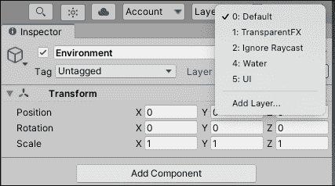

    图 8.1:在 Inspector 窗格中选择层

2.  Add a new layer called `Ground` by typing the name into the first available slot, which is Layer 6\. Layers 0-5 are reserved for Unity's default layers, even though Layer 3 is empty, as illustrated in the following screenshot:

    

    图 8.2:在 Inspector 窗格中添加图层

3.  Select the **Environment** parent GameObject in the **Hierarchy**, click on the **Layer** dropdown, and select **Ground**.

    

    图 8.3:设置自定义层

在选择了如下截图所示的**地面**选项后，单击**是，更改子**，这时会出现对话框询问是否更改所有子对象。 在这里，您已经定义了一个名为**Ground**的新层，并将**Environment**的每个子对象分配给该层。

继续前进，所有在**地面**层上的物体都可以检查它们是否与特定的物体相交。 你将在接下来的挑战中使用这一点，以确保玩家能够在地面上执行跳跃; 这里没有无限的跳跃。

因为我们不想让`Update()`方法的代码混乱，我们将在实用函数中进行图层蒙版计算，并根据结果返回`true`或`false`值。 为此，按以下步骤进行:

1.  将以下高亮代码添加到`PlayerBehavior`中，再次播放场景:

    ```cs
    public class PlayerBehavior : MonoBehaviour 
    {
        **// 1**
        **public****float** **DistanceToGround =** **0.1f****;**
        **// 2** 
        **public** **LayerMask GroundLayer;**
        **// 3**
        **private** **CapsuleCollider _col;**
        // ... No other variable changes needed ...

        void Start()
        {
            _rb = GetComponent<Rigidbody>();

            **// 4**
            **_col = GetComponent<CapsuleCollider>();**
        }

        void Update()
        {
            // ... No changes needed ...
        }

        void FixedUpdate()
        {
            **// 5**
            if(**IsGrounded() &&** _isJumping)
            {
                _rb.AddForce(Vector3.up * JumpVelocity,
                     ForceMode.Impulse);
             }
             // ... No other changes needed ...
        }

        **// 6**
        **private****bool****IsGrounded****()**
        **{**
            **// 7**
            **Vector3 capsuleBottom =** **new** **Vector3(_col.bounds.center.x,**
                 **_col.bounds.min.y, _col.bounds.center.z);**

            **// 8**
            **bool** **grounded = Physics.CheckCapsule(_col.bounds.center,**
                **capsuleBottom, DistanceToGround, GroundLayer,**
                   **QueryTriggerInteraction.Ignore);**

            **// 9**
            **return** **grounded;**
        **}**
    **}** 
    ```

2.  With the `PlayerBehavior` script selected, set **Ground Layer** in the **Inspector** pane to **Ground** from the **Ground Layer** dropdown, as illustrated in the following screenshot:

    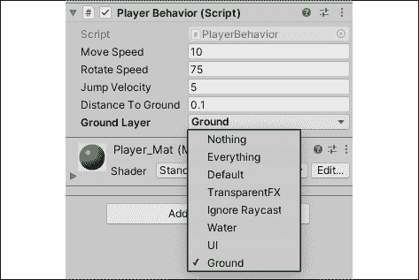

    图 8.4:设置地面层

让我们把前面的代码分解如下:

1.  我们为玩家胶囊碰撞器和任何**地面**物体之间的距离创建一个新变量。
2.  我们创建一个`LayerMask`变量，可以在**检查器**中设置，并用于 collider 检测。
3.  我们创建一个变量来存储玩家的 Capsule Collider 组件。
4.  我们使用`GetComponent()`去寻找并返回附着在玩家身上的胶囊对撞机。
5.  我们更新`if`语句来检查`IsGrounded`是否返回`true`并且在执行跳转代码之前按下空格键。
6.  我们用`bool`返回类型声明`IsGrounded()`方法。
7.  我们创建一个局部的`Vector3`变量来存储玩家胶囊碰撞器底部的位置，我们将使用它来检查**地面**层上的任何物体是否发生碰撞。
    *   所有 Collider 组件都有一个`bounds`属性，它允许我们访问其*x*、*y*和*z*轴的最小、最大和中心位置。
    *   对撞机的底部是位于中心*x*，min*y*和中心*z*的三维点。
8.  我们创建一个本地的`bool`来存储我们从`Physics`类中调用的`CheckCapsule()`方法的结果，该方法包含以下五个参数:
    *   胶囊的开始，我们将其设置为胶囊对撞机的中间，因为我们只关心底部是否接触地面。
    *   太空舱的末端，也就是我们已经计算过的`capsuleBottom`位置。
    *   胶囊的半径，即`DistanceToGround`已经设定。
    *   我们想要检查碰撞的图层蒙版，在**检查器**中设置为`GroundLayer`。
    *   The query trigger interaction, which determines whether the method should ignore colliders that are set as triggers. Since we want to ignore all triggers, we used the `QueryTriggerInteraction.Ignore` enum.

        我们还可以使用`Vector3`类中的`Distance`方法来确定我们离地面的距离，因为我们知道玩家胶囊的高度。 然而，我们将坚持使用`Physics`类，因为这是本章的重点。

9.  在计算结束时返回存储在`grounded`中的值。

我们本可以手动进行碰撞计算，但这需要更复杂的 3D 数学，我们没有时间在这里介绍。 然而，在可用时使用内置方法总是一个好主意。

这是我们刚刚添加到`PlayerBehavior`中的一段复杂的代码，但是当你分解它时，我们所做的唯一的新事情就是使用了`Physics`类中的一个方法。 简单地说，我们为`CheckCapsule()`提供了一个起始点、一个端点、一个碰撞半径和一个图层蒙版。 如果端点接近图层蒙版上的物体的碰撞半径，该方法返回`true`—意味着玩家正在接触地面。 如果玩家处于跳中位置，`CheckCapsule()`返回`false`。

因为我们在`Update()`每一帧都在`if`语句中检查`IsGround`，所以我们的玩家只有在触地时才允许跳跃技能。

这就是跳跃机制所要做的一切，但玩家仍然需要一种互动方式，并抵御最终会出现在竞技场中的大量敌人。 在接下来的章节中，你将通过执行一个简单的射击机制来解决这个问题。

# 射击炮弹

射击机制是如此普遍，以至于我们很难想象第一人称游戏没有一些变化，*《英雄诞生》*也不例外。 在本节中，我们将讨论如何在游戏运行时从 Prefabs 实例化 GameObjects，并使用我们学到的技能使用 Unity 物理推动它们前进。

## 实例化对象

在游戏中实例化一个 GameObject 的概念类似于实例化一个类的实例——两者都需要起始值，以便 c#知道我们想要创建什么样的对象以及需要在哪里创建它。 为了在运行时在场景中创建对象，我们使用`Instantiate()`方法并提供一个 Prefab 对象、一个起始位置和一个起始旋转。

从本质上来说，我们可以让 Unity 在这一点上创建带有所有组件和脚本的特定对象，朝这个方向看，然后在它在 3D 空间中诞生时根据需要对其进行操作。 在实例化对象之前，您需要创建对象 Prefab 本身，这是您的下一个任务。

在我们发射任何投射物之前，我们需要一个预制件作为参考，所以现在让我们创建它，如下所示:

1.  在**层次**面板中选择**+**|**3D****对象**|**球体**，命名为`Bullet`。
    *   在**变换**成分的*x*，*y*和*z*轴上，将其**量表**改为 0.15。
2.  选择**子弹****检查员和使用**添加组件**按钮底部寻找并添加一个**【显示】Rigidbody 组件,离开所有的默认属性。****
3.  Create a new material in the `Materials` folder using **Create** | **Material**, and name it `Bullet_Mat`:
    *   将**反照率**属性更改为深黄色。
    *   将材质从**Materials**文件夹拖放到**Hierarchy**窗格中的`Bullet`GameObject 中。

    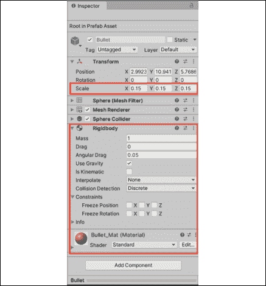

    图 8.5:设置弹丸属性

4.  Select the **Bullet** in the **Hierarchy** panel and drag it into the `Prefabs` folder in the **Project** panel. Then, delete it from the **Hierarchy** to clean up the scene:

    

    图 8.6:创建射弹预制件

你创建并配置了一个**Bullet**预制游戏对象，它可以根据我们在游戏中需要的次数进行实例化，并根据需要进行更新。 这意味着你已经准备好迎接下一个挑战——发射炮弹。

## 添加射击机制

现在我们有了一个可以使用的 Prefab 对象，我们可以在点击鼠标左键创建射击机制时实例化并移动该 Prefab 的副本，如下所示:

1.  用以下代码更新`PlayerBehavior`脚本:
2.  In the **Inspector**, drag the **Bullet** Prefab from the **Project** panel into the **Bullet** property of `PlayerBehavior`, as illustrated in the following screenshot:

    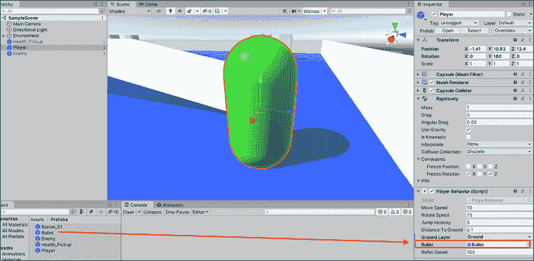

    图 8.7:设置子弹预制件

3.  玩游戏时，用鼠标左键向玩家所面对的方向发射炮弹!

让我们将代码分解如下:

1.  我们创建了两个变量:一个用于存储 Bullet Prefab，另一个用于保持 Bullet 速度。
2.  与跳跃机制一样，我们在`Update`方法中使用布尔值来检查玩家是否应该射击。
3.  我们使用逻辑运算符`or`和`Input.GetMouseButtonDown()`设置`_isShooting`的值，如果按下指定的按钮，则返回`true`，就像`Input.GetKeyDown()`一样。
    *   `GetMouseButtonDown()`使用`int`参数来确定要检查的鼠标按钮; `0`为左键，`1`为右键，`2`为中键或滚轮。
4.  然后我们使用`_isShooting`输入检查变量来检查玩家是否应该射击。
5.  我们在每次按下鼠标左键时创建一个本地 GameObject 变量:
    *   我们使用`Instantiate()`方法通过传入`Bullet`预制件将游戏对象分配给`newBullet`。 我们还利用玩家胶囊的位置将新的`Bullet`预制件放置在玩家面前，以避免任何碰撞。
    *   我们将其作为`GameObject`添加，以显式地将返回对象转换为与`newBullet`相同类型的，在本例中是一个游戏对象。
6.  我们调用`GetComponent()`来返回并存储刚体组件到`newBullet`。
7.  我们将刚体组件的`velocity`属性设置为玩家的`transform.forward`方向乘以`BulletSpeed`:
    *   改变`velocity`而不是`AddForce()`可以确保在发射时重力不会将子弹拉下弧线。
8.  最后，我们将`_isShooting`值设置为`false`，这样我们的射击输入将为下一个输入事件重置。

同样，您已经显著地升级了播放器脚本所使用的逻辑。 你现在应该可以使用鼠标从玩家的位置发射炮弹。

然而，现在的问题是，你的游戏场景和层级充斥着废弃的 Bullet 对象。 您的下一个任务是在这些对象被触发后清理它们，以避免任何性能问题。

## 管理对象累积

无论你是在编写完全基于代码的应用程序还是 3D 游戏，你都必须确保定期删除未使用的对象，以避免程序超载。 我们的子弹在被击中后并没有发挥重要作用; 它们会一直存在于地板上，靠近它们碰撞过的墙壁或物体。

在射击等机制中，这可能会导致数百甚至数千发子弹，这是我们所不希望看到的。 你的下一个挑战是在设定的延迟时间后摧毁每颗子弹。

在这个任务中，我们可以利用我们已经学过的技能，让子弹为他们的自我毁灭行为负责，如下所示:

1.  在`Scripts`文件夹中创建一个新的 c#脚本并将其命名为`BulletBehavior`。
2.  将`BulletBehavior`脚本拖放到`Prefabs`文件夹中的`Bullet`预制件上，并添加以下代码:

    ```cs
    using System.Collections;
    using System.Collections.Generic;
    using UnityEngine;
    public class BulletBehavior : MonoBehaviour 
    {
        // 1
        public float OnscreenDelay = 3f;

        void Start () 
        {
            // 2
            Destroy(this.gameObject, OnscreenDelay);
        }
    } 
    ```

让我们将这段代码分解如下:

1.  我们声明一个`float`变量来存储我们希望 Bullet Prefabs 在实例化后在场景中停留的时间。
2.  我们使用`Destroy()`方法删除游戏对象。
    *   `Destroy()`总是需要一个对象作为参数。 在本例中，我们使用`this`关键字来指定脚本附加到的对象。
    *   `Destroy()`可以选择一个额外的`float`参数作为延迟，我们使用该参数使项目符号在屏幕上停留较短的时间。

再次玩游戏，射击一些子弹，并观察在特定延迟后，他们自己从场景中的**等级**中删除。 这意味着项目执行其定义的行为，而无需另一个脚本告诉它要做什么，这是*Component*设计模式的理想应用程序。

现在我们的内务工作已经完成，您将了解任何设计良好和组织良好的项目的关键组成部分—经理类。

# 创建游戏管理器

在学习编程时，一个常见的误解是，所有的变量都应该自动公开，但一般来说，这不是一个好主意。 根据我的经验，变量从一开始就应该被认为是受保护的私有变量，只有在必要的时候才会被公开。 您将看到有经验的程序员保护他们的数据的一种方法是通过管理类，由于我们希望建立良好的习惯，我们将效仿。 可以把管理器类看作一个漏斗，可以安全地访问重要的变量和方法。

当我说安全时，我的意思就是，这在编程环境中可能看起来不太熟悉。 然而，当不同的类相互通信和更新数据时，事情就会变得混乱。 这就是为什么拥有一个单一的接触点，比如一个管理类，可以将这种情况降到最低。 在下一节中，我们将讨论如何有效地做到这一点。

## 跟踪球员属性

*《英雄诞生》*是一款简单的游戏，所以我们只需要关注的两个数据点便是玩家收集了多少道具以及他们还剩下多少命值。 我们希望这些变量是私有的，以便只能从管理器类修改它们，从而提供控制和安全性。 你的下一个挑战是为*《英雄诞生》*创建一个游戏管理器，并在其中添加有用的功能。

游戏管理器类将是你在未来开发的任何项目的一个不变的方面，所以让我们学习如何正确地创建一个，如下:

1.  Create a new C# script in the `Scripts` folder and name it `GameBehavior`.

    通常，这个脚本会被命名为`GameManager`，但 Unity 保留了这个名称用于自己的脚本。 如果您在创建脚本时，在脚本名称旁边出现了一个齿轮图标，而不是 c#文件图标，这就说明脚本受到了限制。

2.  使用**+**|**在**层级**中创建一个新的空游戏对象，创建空**并命名为`Game_Manager`。
3.  Drag and drop the `GameBehavior.cs` script from the **Scripts** folder onto the `Game_Manager` object, as illustrated in the following screenshot:

    

    图 8.8:附加游戏管理器脚本

    管理器脚本和其他非游戏文件都是在空对象上设置的，以便将它们放入场景中，即使它们并不与实际的 3D 空间交互。

4.  将下面的代码添加到`GameBehavior.cs`:

    ```cs
    public class GameBehavior : MonoBehaviour 
    {
        private int _itemsCollected = 0;
        private int _playerHP = 10;
    } 
    ```

让我们分解这段代码。 我们添加了两个新`private`变量来保存拾取道具的数量以及玩家还剩下多少条命; 这些是`private`，因为它们只能在这个类中被修改。 如果生成`public`，其他类可以随意更改它们，这可能导致变量存储不正确或并发的数据。

将这些变量声明为`private`意味着您负责如何访问它们。 下面关于`get`和`set`属性的主题将向您介绍一种标准、安全的方法来完成这项任务。

## get 和 set 属性

我们已经设置了管理器脚本和私有变量，但是如果是私有的，我们如何从其他类访问它们呢? 虽然我们可以在`GameBehavior`中编写单独的公共方法来处理向私有变量传递新值的问题，但让我们看看是否有更好的方法。

在本例中，c#提供了所有具有`get`和`set`属性的变量，这些属性非常适合我们的任务。 可以将这些方法视为 c#编译器自动触发的方法，无论我们是否显式调用它们，就像 Unity 在场景开始时执行`Start()`和`Update()`一样。

`get`和`set`属性可以添加到任何变量中，无论是否有初始值，如下面的代码片段所示:

```cs
public string FirstName { get; set; };
// OR
public string LastName { get; set; } = "Smith"; 
```

然而，像这样使用它们并不会带来任何额外的好处; 为此，你需要为每个属性包含一个代码块，如下面的代码片段所示:

```cs
public string FirstName
{
    get {
        // Code block executes when variable is accessed
    }
    set {
        // Code block executes when variable is updated
    }
} 
```

现在，设置了`get`和`set`属性来执行额外的逻辑，这取决于需要它的地方。 然而，我们还没有完成，因为我们仍然需要处理新的逻辑。

每个`get`代码块需要返回一个值，而每个`set`代码块需要返回一个值

分配一个值; 这是，使用一个私有变量(称为后台变量)和一个具有`get`和`set`属性的公共变量的组合。 私有的变量仍然是受保护的，而公共变量允许来自其他类的受控访问，如下面的代码片段所示:

```cs
private string _firstName
public string FirstName {
    get { 
        **return** _firstName;
    }
    set {
        _firstName = **value**;
    }
} 
```

让我们将其分解如下:

*   我们可以从`get`属性中`return`存储在私有变量中的值，任何时候其他类都需要它，而不实际地让外部类直接访问它。
*   我们可以在外部类将新值赋给公共变量时更新私有变量，从而保持它们的同步。
*   `value`关键字是新赋值的替身。

如果没有实际的应用程序，这似乎有点深奥，所以让我们用 getter 和 setter 属性来更新`GameBehavior`公共变量，以便与现有的私有变量保持一致。

现在我们理解了`get`和`set`属性访问器的语法，我们可以在管理器类中实现它们，以提高效率和代码的可读性。

更新`GameBehavior`中的代码，如下:

```cs
public class GameBehavior : MonoBehaviour 
{
    private int _itemsCollected = 0; 
    private int _playerHP = 10;

    **// 1**
    **public****int** **Items**
    **{**
        **// 2**
        **get** **{** **return** **_itemsCollected; }**
        **// 3**
        **set** **{** 
               **_itemsCollected =** **value****;** 
               **Debug.LogFormat(****"Items: {0}"****, _itemsCollected);**
        **}**
    **}**
    **// 4**
    **public****int** **HP** 
    **{**
        **get** **{** **return** **_playerHP; }**
        **set** **{** 
               **_playerHP =** **value****;** 
               **Debug.LogFormat(****"Lives: {0}"****, _playerHP);**
         **}**
    **}**
} 
```

让我们将代码分解如下:

1.  我们声明了一个新的变量`public`，名为`Items`，具有`get`和`set`属性。
2.  当从外部类访问`Items`时，我们将`get`属性用于`return`存储在`_itemsCollected`中的值。
3.  每当更新`Items`时，我们使用`set`属性将`_itemsCollected`赋值给`Items`的新`value`，并通过一个附加的`Debug.LogFormat()`调用打印出`_itemsCollected`的修改值。
4.  我们建立了一个名为`HP`的具有`get`和`set`属性的`public`变量来补充私有的`_playerHP`支持变量。

两个私有变量现在都是可读的，但只能通过它们的公共变量; 只能在`GameBehavior`中更改。 通过这种设置，我们确保只能从特定的接触点访问和修改我们的私有数据。 这使得我们更容易与来自其他机械脚本的`GameBehavior`进行通信，也更容易在本章最后我们将创建的简单 UI 中显示实时数据。

让我们通过更新`Items`属性来测试这一点，当我们成功地与竞技场中的道具拾取互动时。

## 更新项目集合

现在我们已经在`GameBehavior`中设置了变量，我们可以在场景中每次收集`Item`时更新`Items`，如下所示:

1.  将以下高亮显示的代码添加到`ItemBehavior`脚本:
2.  点击 play 并收集拾取项，以查看从管理器脚本打印出的新控制台日志，如下截图所示:

图 8.9:收集拾取项

让我们将代码分解如下:

1.  我们创建一个`GameBehavior`类型的新变量来存储对附加脚本的引用。
2.  We use `Start()` to initialize `GameManager` by looking it up in the scene with `Find()` and adding a call to `GetComponent()`.

    在 Unity 文档和社区项目中，你会经常看到这类代码在一行中完成。 这样做是为了简单，但是如果您觉得分开写`Find()`和`GetComponent()`调用更舒服，那么就继续吧; 清晰、明确的格式并没有什么错。

3.  在物品预制件被摧毁后，增加`OnCollisionEnter()`职业`GameManager`中的`Items`属性。

因为我们已经设置了`ItemBehavior`去处理碰撞逻辑，所以当玩家拾取道具时，我们很容易修改`OnCollisionEnter()`去与我们的管理类进行通信。 请记住像这样分离功能可以使代码更灵活，并且在开发过程中进行更改时不太可能中断。

《英雄诞生》缺少的最后一个元素是向玩家显示游戏数据的界面。 在编程和游戏开发中，这被称为 UI。 你在本章的最后一个任务是熟悉 Unity 如何创建和处理 UI 代码。

# 创建一个图形用户界面

在这一点上，我们有几个脚本一起工作，让玩家访问移动，跳跃，收集和射击机制。 然而，我们仍然缺少任何类型的显示或视觉线索来显示玩家的状态，以及获胜和失败的方式。 在结束最后一节时，我们将重点讨论这两个主题。

## 显示玩家统计数据

ui 是任何计算机系统的可视化组件。 鼠标光标、文件夹图标和您的笔记本电脑上的程序都是 UI 元素。 在我们的游戏中，我们想要一个简单的显示让玩家知道他们收集了多少道具，他们当前的生命值，以及当某些事件发生时提供给他们更新的文本框。

Unity 中的 UI 元素可以通过以下两种方式添加:

*   直接从**Hierarchy**面板中的**+**菜单，就像其他游戏对象一样
*   在代码中使用内置 GUI 类

我们将坚持使用第一个选项，因为内置的 GUI 类是 Unity 遗留 UI 系统的一部分，我们希望保持当前状态，对吧? 这并不是说你不能通过编程来完成所有事情，但对于我们的原型来说，更新的 UI 系统更适合我们。

如果你对 Unity 中的编程 UI 感到好奇，你可以自己看看文档:[https://docs.unity3d.com/ScriptReference/GUI.html](https://docs.unity3d.com/ScriptReference/GUI.html)。

您的下一个任务是向游戏场景添加一个简单的 UI，以显示收集的道具、玩家生命值和存储在`GameBehavior.cs`中的进度信息变量。

首先，让我们在场景中创建三个文本对象。 Unity 中的用户界面是在画布上工作的，这就是它听起来的样子。 把画布想象成一张空白的画，你可以在上面画画，Unity 会为你渲染游戏世界。 当你在**Hierarchy**面板中创建第一个 UI 元素时，一个**Canvas**父对象就会随之创建。

1.  Right-click in the **Hierarchy** panel and select **UI** | **Text** and name the new object **Health**. This will create a **Canvas** parent object and the new **Text** object all at once:

    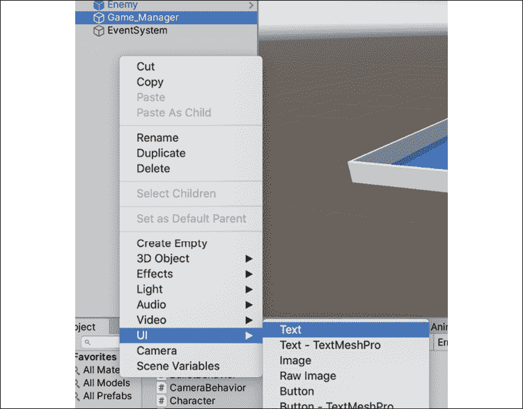

    图 8.10:创建 Text 元素

2.  To see the canvas correctly, select **2D** mode at the top of the **Scene** tab. From this view, our entire level is that tiny white line in the lower-left hand corner.
    *   即使**Canvas**和关卡在场景中没有重叠，当游戏玩的时候 Unity 会自动正确地覆盖它们。

    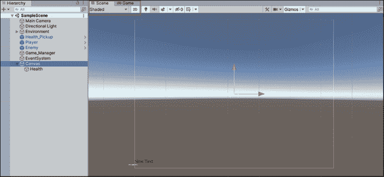

    图 8.11:Unity 编辑器中的画布

3.  If you select the **Health** object in the **Hierarchy**, you'll see that the new text object was created in the lower-left corner of the canvas by default, and it has a whole list of customizable properties, like text and color, in the **Inspector** pane:

    

    图 8.12:Unity 画布上的文本元素

4.  With the **Health** object selected in the **Hierarchy** pane, click on the **Anchor** presets in the **Rect Transform** component of the **Inspector** and choose **Top Left**.
    *   锚定在画布上设置了一个UI 元素的参考点，这意味着无论设备屏幕的大小，我们的生命值将始终锚定在屏幕的左上方:

    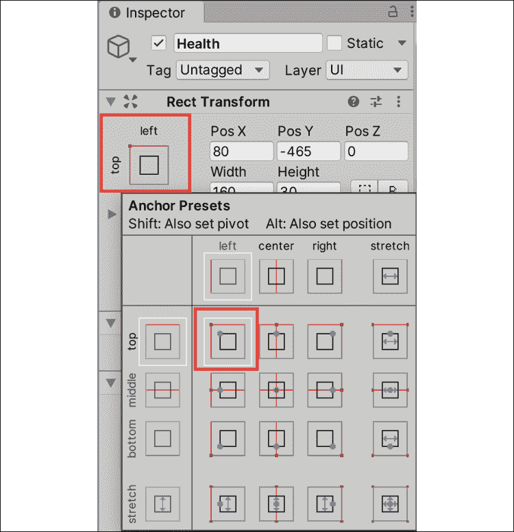

    图 8.13:设置锚预设

5.  In the **Inspector** pane, change the **Rect Transform** position to **100** on the **X** axis and **–30** on the **Y** axis to position the text in the upper-right corner. Also change the **Text** property to say **Player Health:**. We'll be setting the actual value in code in a later step:

    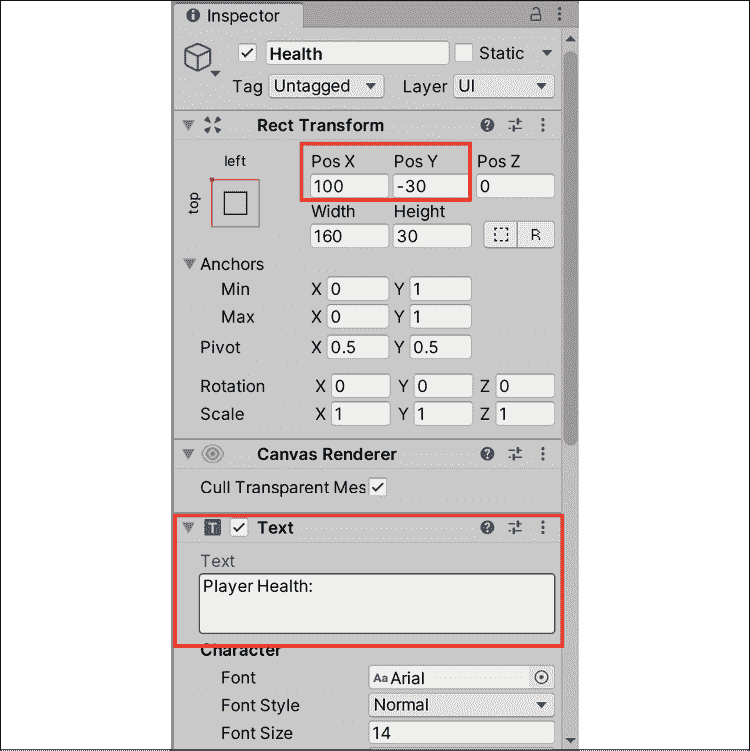

    图 8.14:设置文本属性

6.  Repeat steps 1-5 to create a new UI **Text** object and name it **Items**:
    *   **左上**，**Pos X**至**100**，**Pos Y**至**-60**
    *   **文本**设置为**收集物品:**

    

    图 8.15:创建另一个 Text 元素

7.  重复*步骤 1-5*，创建一个新的 UI**Text**对象，并命名为**Progress**:

    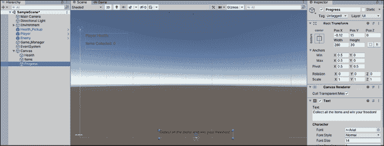

    *   将锚预设设置为**底部中心**,**Pos X****0**,**Pos Y【显示】**15**,【病人】和**宽度 280****
    ***   设置**文本**到**收集所有物品，赢得自由!****

 **图 8.16:创建进度文本元素

现在我们已经设置了 UI，让我们连接游戏管理器脚本中已有的变量。 进行如下:

1.  将`GameBehavior`更新为，以收集项，并在收集项时显示屏幕文本:

    ```cs
    // 1
    using UnityEngine.UI; 
    public class GameBehavior : MonoBehaviour 
    {
        // 2
        public int MaxItems = 4;
        // 3
        public Text HealthText;     
        public Text ItemText;
        public Text ProgressText;
        // 4
        void Start()
        { 
            ItemText.text += _itemsCollected;
            HealthText.text += _playerHP;
        }
        private int _itemsCollected = 0;
        public int Items
        {
            get { return _itemsCollected; }
            set { 
                _itemsCollected = value; 
                **// 5**
                ItemText.text = "Items Collected: " + Items;
                // 6
                if(_itemsCollected >= MaxItems)
                {
                    ProgressText.text = "You've found all the items!";
                } 
                else
                {
                    ProgressText.text = "Item found, only " + (MaxItems - _itemsCollected) + " more to go!";
                }
            }
        }

        private int _playerHP = 10;
        public int HP 
        {
            get { return _playerHP; }
            set { 
                _playerHP = value;
                // 7
                HealthText.text = "Player Health: " + HP;
                Debug.LogFormat("Lives: {0}", _playerHP);
            }
        }
    } 
    ```

2.  Select **Game_Manager** in the **Hierarchy** and drag over our three text objects one by one into their corresponding `GameBehavior` script fields in the **Inspector**:

    

    图 8.17:将文本元素拖放到脚本组件中

3.  运行游戏并查看我们的新屏幕GUI 框，如下截图所示:

    

图 8.18:在游戏模式中测试 UI 元素

让我们将代码分解如下:

1.  我们添加了`UnityEngine.UI`命名空间，这样就可以访问**Text**变量类型。
2.  我们为关卡中的最大道具数量创建了一个新的公共变量。
3.  我们创建了三个新的**文本**变量，并将其连接到**检查器**面板中。
4.  然后，使用`Start`方法使用**+=**操作符设置健康状况和项目文本的初始值。
5.  每次收集一个项目时，我们更新**ItemText**的`text`属性以显示更新的`items`计数。
6.  我们在`_itemsCollected`的 set 属性中声明了一个`if`语句。
    *   如果玩家收集到的数量大于或等于`MaxItems`，他们就获胜了，`ProgressText.text`就会被更新。
    *   否则，`ProgressText.text`显示还剩下多少项需要收集。
7.  每当玩家的生命值被破坏时(我们将在下一章中讨论)，我们就会用新值更新`HealthText`的`text`属性。

当我们现在玩游戏时，我们的三个 UI 元素显示出正确的值; 收集 Item 时，`ProgressText`和`_itemsCollected`计数更新，如下截图所示:


图 8.19:更新 UI 文本

每场比赛要么赢，要么输。 在本章的最后一节中，您的任务是实现这些条件以及与之相关的 UI。

## 输赢条件

我们已经执行了核心游戏机制和简单的 UI，但《英雄诞生》仍然缺少一个重要的游戏设计元素:它的输赢条件。 这些条件将管理玩家如何赢或输游戏，并根据情况执行不同的代码。

回到游戏文件*第 6 章*，*Getting Your Hands Dirty with Unity*，我们将我们的胜败条件设定如下:

*   收集关卡中所有物品，并至少获得 1 点生命值
*   受到敌人的伤害，直到生命值为 0

这些条件将影响我们的 UI 和游戏机制，但我们已经设置了`GameBehavior`来有效地处理。 我们的`get`和`set`属性将处理任何与游戏相关的逻辑，以及当玩家赢或输时 UI 的变化。

我们将在本节中实现胜利条件逻辑，因为我们已经有了拾取系统。 当我们在下一章谈到敌人 AI 行为时，我们将添加损失条件逻辑。 您的下一个任务是用代码确定游戏何时获胜。

我们总是希望给予玩家清晰和即时的反馈，所以我们将从添加获胜条件的逻辑开始，如下所示:

1.  更新`GameBehavior`以匹配以下代码:

    ```cs
    public class GameBehavior : MonoBehaviour 
    { 
        **// 1**
        **public** **Button WinButton;**
        private int _itemsCollected = 0;
        public int Items
        {
            get { return _itemsCollected; }
            set
            {
                _itemsCollected = value;
                ItemText.text = "Items Collected: " + Items;

                if (_itemsCollected >= MaxItems)
                {
                    ProgressText.text = "You've found all the items!";

                    **// 2**
                    **WinButton.gameObject.SetActive(****true****);**
                }
                else
                {
                    ProgressText.text = "Item found, only " + (MaxItems - _itemsCollected) + " more to go!";
                }
            }
        }
    } 
    ```

2.  Right-click in the **Hierarchy** and select **UI** | **Button**, then name it **Win Condition**:
    *   选择**胜利条件**和**Pos X**和**Pos Y****0**,其宽度【显示】**225**,【病人】及其高度**115**。

    

    图 8.20:创建 UI 按钮

3.  Click on the arrow to the right of the **Win Condition** button to expand its text child object, then change the text to say **You won!**:

    

    图 8.21:更新按钮文本

4.  Select the **Win Condition** parent object again and click the checkmark icon in the upper right of the **Inspector**.

    

    图 8.22:取消游戏对象的激活

    这将隐藏按钮，直到我们赢得游戏:

    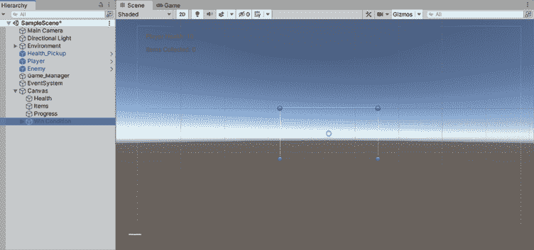

    图 8.23:测试隐藏的 UI 按钮

5.  Select **Game_Manager** in the **Hierarchy** and drag the **Win Condition** button from the **Hierarchy** to the **Game Behavior (Script)** in the **Inspector**, just like we did with the text objects:

    

    图 8.24:将 UI 按钮拖放到脚本组件上

6.  Change **Max Items** to `1` in the **Inspector** to test out the new screen, as illustrated in the following screenshot:

    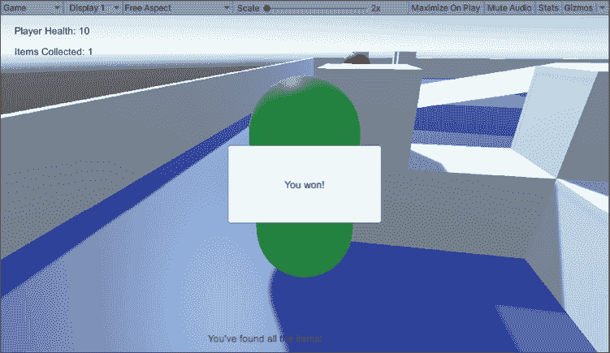

    图 8.25:显示获胜屏幕

让我们将代码分解如下:

1.  我们创建了一个 UI 按钮变量来连接**层次结构**中的 Win Condition 按钮。
2.  因为我们在游戏开始时将获胜条件按钮设置为**隐藏**，所以我们在游戏获胜时重新激活它。

**最大道具**设置为`1`，场景中收集唯一的`Pickup_Item`时，会出现**Win**按钮。 现在单击按钮不会做任何事情，但我们将在下一节中解决这个问题。

## 使用指令和名称空间暂停和重新开始游戏

现在，我们的获胜条件和预期一样，但玩家仍然控制着胶囊，在游戏结束后没有办法重新开始游戏。 Unity 在`Time`类中提供了一个名为`timeScale`的属性，当设置为`0`时，该属性会冻结游戏场景。 然而，要重新启动游戏，我们需要访问一个名为的名称空间**，该名称空间在默认情况下不能从我们的类中访问。**

命名空间收集并将一组类分组在特定名称下，以组织大型项目，并避免可能共享相同名称的脚本之间的冲突。 一个`using`指令需要添加到类中才能访问命名空间的类。

所有使用 Unity 创建的 c#脚本都带有三个默认的`using`指令，如下面的代码片段所示:

```cs
using System.Collections;
using System.Collections.Generic;
using UnityEngine; 
```

它们允许访问公共名称空间，但是 Unity 和 c#提供了更多的功能，可以使用`using`关键字后跟名称空间名称添加这些功能。

因为我们的游戏需要在玩家获胜或失败时暂停并重新启动，所以这是一个使用新 c#脚本默认不包含的名称空间的好时机。

1.  将以下代码添加到`GameBehavior`并播放:

    ```cs
    using System.Collections;
    using System.Collections.Generic;
    using UnityEngine;
    using UnityEngine.UI;
    **// 1**
    **using** **UnityEngine.SceneManagement;**
    public class GameBehavior : MonoBehaviour 
    {
        // ... No changes needed ...
        private int _itemsCollected = 0;
        public int Items
        {
            get { return _itemsCollected; }
            set { 
                _itemsCollected = value;

                if (_itemsCollected >= MaxItems)
                {
                    ProgressText.text = "You've found all the items!";
                    WinButton.gameObject.SetActive(true);

                    **// 2**
                    **Time.timeScale =** **0f****;**
                }
                else
                {
                    ProgressText.text= "Item found, only " + (MaxItems – _itemsCollected) + " more to go!";
                }
            }
        }
        **public****void****RestartScene****()**
        **{**
            **// 3**
            **SceneManager.LoadScene(****0****);**
            **// 4**
            **Time.timeScale =** **1f****;**
        **}**

        // ... No other changes needed ...
    } 
    ```

2.  Select **Win Condition** from the **Hierarchy**, scroll down in the **Inspector** to the **OnClick** section of the **Button** component, and hit the plus icon:
    *   每个 UI按钮都有一个**OnClick**事件，这意味着您可以从脚本中分配一个方法来在按钮被按下时执行。
    *   当一个按钮被点击时，你可以有多个方法被触发，但在本例中我们只需要一个:

    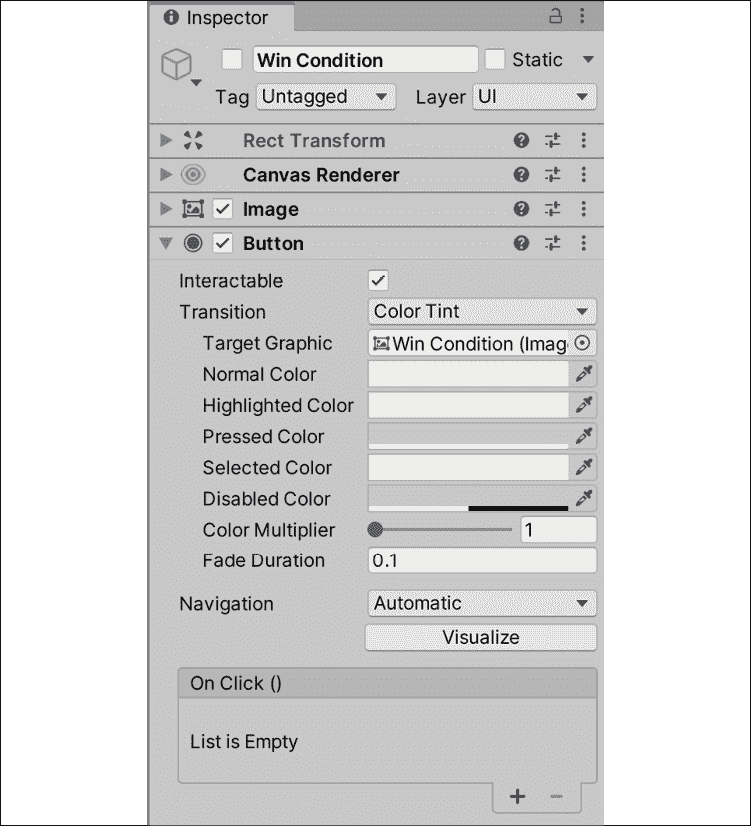

    图 8.26:按钮的 OnClick 部分

3.  From the **Hierarchy**, drag the **Game_Manager** into the slot underneath **Runtime** to tell the button we want to choose a method from our manager script to fire when the button is pushed:

    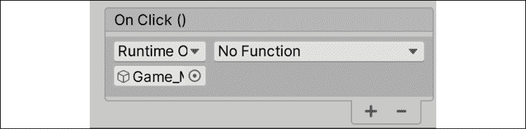

    图 8.27 在 On Click 中设置游戏管理器对象

4.  Select the **No Function** dropdown and choose **GameBehavior** | **RestartScene ()** to set the method we want the button to execute:

    

    图 8.28:为按钮点击选择重启方法

5.  转到**窗口**|**渲染**|**照明**和在底部选择**生成照明**。 确保**Auto Generate**未被选中:

这一步是必要的，以解决 Unity 问题，重新加载场景没有任何照明。


图 8.29:Unity 编辑器中的照明面板

让我们将的代码分解如下:

1.  我们用`using`关键字添加`SceneManagement`名称空间，它处理所有与场景相关的逻辑，比如创建加载场景。
2.  我们将`Time.timeScale`设置为`0`以在显示胜利画面时暂停游戏，将禁用任何输入或移动。
3.  我们创建一个名为`RestartScene`的新方法，并在点击获胜屏幕按钮时调用`LoadScene()`:
    *   `LoadScene()`以场景索引中的作为`int`参数。
    *   因为我们的项目中只有一个场景，所以我们使用索引`0`从头开始重新开始游戏。
4.  我们将`Time.timeScale`重置为默认值`1`，这样当场景重新启动时，所有的控制和行为将能够再次执行。

现在，当你收集一个道具并点击胜利画面按钮时，关卡将重新开始，所有脚本和组件将恢复到原来的值，并为下一轮游戏做好准备!

# 总结

恭喜你! *《英雄诞生》*现在是一个可玩原型。 我们执行了跳跃和射击机制，管理了物理碰撞和生成对象，并添加了一些基本的 UI 元素来显示反馈。 我们甚至在玩家获胜时重新设置关卡。

本章介绍了许多新的主题，回顾并确保您理解了我们编写的代码的内容是很重要的。 特别注意我们对枚举、`get`和`set`属性以及名称空间的讨论。 从这里开始，随着我们进一步深入 c#语言的可能性，代码只会变得更加复杂。

在下一章中，我们将开始致力于让我们的敌人 gameobject 在我们太靠近玩家时注意到我们的玩家，从而产生一个跟踪射击协议，这将增加我们的玩家的风险。

# 突击测验-与机械师一起工作

1.  枚举存储什么类型的数据?
2.  你如何在活动场景中创建预制游戏对象的副本?
3.  当变量属性的值被引用或修改时，哪些变量属性允许您添加功能?
4.  哪个 Unity 方法在场景中显示所有 UI 对象?**