# 12

# 保存、加载和序列化数据

你玩过的每一款游戏都需要使用数据，不管是玩家统计数据、游戏进程还是在线多人游戏记分牌。 你最喜欢的游戏还管理内部数据，这意味着程序员使用硬编码的信息来构建关卡，追踪敌人的统计数据，并编写有用的工具。 换句话说，数据无处不在。

在本章中，我们将从 C# 和 Unity 如何处理计算机上的文件系统开始，然后继续阅读、写入和序列化我们的游戏数据。 我们的重点是处理您可能遇到的三种最常见的数据格式:文本文件、XML 和 JSON。

在本章结束时，您将对计算机的文件系统、数据格式和基本读写功能有一个基本的理解。 这将是你建立游戏数据的基础，为玩家创造更丰富、更吸引人的体验。 你还可以开始考虑哪些游戏数据是需要保存的，以及 C# 类和对象在不同的数据格式下会是什么样子。

在此过程中，我们将涵盖以下主题:

*   介绍文本、XML 和 JSON 格式
*   理解文件系统
*   使用不同的流类型
*   读取和写入游戏数据
*   序列化对象

# 引入数据格式

在编程中，数据可以有不同的形式，但在你的数据之旅之初，你应该熟悉的三种格式是:

*   **Text**，也就是你现在正在读的
*   **XML**(**可扩展标记语言**)，这是一种对文档信息进行编码的方法，以便您和计算机都能读懂
*   **JSON**(**JavaScript 对象表示法**)，是由属性-值对和数组组成的一种人类可读的文本格式

每种数据格式都有自己的优点和缺点，以及在编程中的应用。 例如，文本通常用于存储更简单的、非分层的或嵌套的信息。 XML 更擅长以文档格式存储信息，而 JSON 具有更广泛的功能，特别是数据库信息和服务器与应用的通信。

您可以在[https://www.xml.com](https://www.xml.com)找到关于 XML 的更多信息，在[https://www.json.org](https://www.json.org)找到 JSON。

在任何编程语言中，数据都是一个重要的主题，因此让我们在接下来的两节中分析 XML 和 JSON 格式的实际情况。

## 分解 XML

典型的 XML 文件具有标准化的格式。 XML 文档的每个元素都有一个开始标记(`<element_name>`)和一个结束标记(`</element_name>`)，并支持标记属性(`<element_name attribute= "attribute_name"></element_name>`)。 一个基本文件将以版本和所使用的编码开始，然后是开始或根元素，然后是元素项列表，最后是结束元素。 作为一个蓝图，它看起来像这样:

```cs
<?xml version="1.0" encoding="utf-8"?>
<root_element>
    <element_item>[Information goes here]</element_item>
    <element_item>[Information goes here]</element_item>
    <element_item>[Information goes here]</element_item>
</root_element> 
```

XML 数据还可以通过使用子元素来存储更复杂的对象。 例如，我们将使用本书前面编写的`Weapon`类将武器列表转换为 XML。 因为每个武器都有其名称和伤害值的属性，所以看起来是这样的:

```cs
// 1
<?xml version="1.0"?>
// 2
<ArrayOfWeapon>
     // 3
    <Weapon>
     // 4
        <name>Sword of Doom</name>
        <damage>100</damage>
     // 5
    </Weapon>
    <Weapon>
        <name>Butterfly knives</name>
        <damage>25</damage>
    </Weapon>
    <Weapon>
        <name>Brass Knuckles</name>
        <damage>15</damage>
    </Weapon>
// 6
</ArrayOfWeapon> 
```

让我们分解一下上面的例子，以确保我们是正确的:

1.  XML 文档从使用的版本开始
2.  根元素是用一个名为`ArrayOfWeapon`的开始标记声明的，它将保存所有元素项
3.  一个武器物品的开始标签是`Weapon`
4.  它的子属性在一行中添加了`name`和`damage`的开始和结束标记。
5.  武器物品关闭，并添加了另外两件武器物品
6.  数组是关闭的，标志着文档的结束

好消息是，我们的应用不需要手动以这种格式写入数据。 C# 有一个完整的类和方法库来帮助我们将简单的文本和类对象直接转换成 XML。

稍后我们将深入研究实际的代码示例，但首先我们需要了解 JSON 是如何工作的。

## 打破 JSON

JSON 数据格式与 XML 类似，但没有标签。 相反，一切都是基于属性-值对，就像我们在*第 4 章*、*控制流和*中使用的**Dictionary**集合类型。 每个 JSON 文档都以一个父字典开始，该字典包含您需要的任意多的属性-值对。 字典使用开花括号和闭花括号(`{ }`)，冒号分隔每个属性和值，每个属性-值对用逗号分隔:

```cs
// Parent dictionary for the entire file
{
    // List of attribute-value pairs where you store your data
    "attribute_name": value,
    "attribute_name": value
} 
```

JSON 还可以通过将属性-值对的值设置为属性-值对数组来拥有子结构或嵌套结构。 例如，如果我们想要存储一个武器，它应该是这样的:

```cs
// Parent dictionary
{
    // Weapon attribute with its value set to an child dictionary
    "weapon": {
          // Attribute-value pairs with weapon data
          "name": "Sword of Doom",
          "damage": 100
    }
} 
```

最后，JSON 数据通常由列表、数组或对象组成。 继续我们的例子，如果我们想要存储一个包含玩家可以选择的所有武器的列表，我们将使用一对方括号表示一个数组:

```cs
// Parent dictionary
{
    // List of weapon attribute set to an array of weapon objects
    "weapons": [
        // Each weapon object stored as its own dictionary
        {
            "name": "Sword of Doom",
            "damage": 100
        },
        {
            "name": "Butterfly knives",
            "damage": 25
        },
        {
            "name": "Brass Knuckles",
            "damage": 15
        }
    ]
} 
```

您可以混合和匹配任何这些技术来存储所需的任何类型的复杂数据，这是 JSON 的主要优势之一。 但就像使用 XML 一样，不要被新的语法所取代——C# 和 Unity 都有帮助类和方法，可以将文本和类对象转换成 JSON，而无需我们做任何繁重的工作。 阅读 XML 和 JSON 有点像学习一门新语言——使用得越多，对它就越熟悉。 很快它就会成为第二天性!

现在我们已经初步了解了数据格式化的基础知识，我们可以开始讨论计算机上的文件系统是如何工作的，以及我们可以通过 C# 代码访问哪些属性。

# 理解文件系统

当我们说到文件系统时，我们谈论的是您已经熟悉的东西——文件和文件夹是如何在您的计算机上创建、组织和存储的。 当您在计算机上创建一个新文件夹时，您可以为其命名并将文件或其他文件夹放在其中。 它还由一个图标表示，这既是一个视觉提示，也是一种拖动、拖放和移动它的方式。

你可以在桌面上做的一切都可以用代码来做。 您所需要的只是文件夹的名称，或者它被称为目录，以及存储它的位置。 当您想要添加一个文件或子文件夹时，您可以引用父目录并添加新内容。

为了将文件系统驱动回家，让我们开始构建`DataManager`类:

1.  Right-click in the **Hierarchy** and choose **Create Empty**, then name it **Data_Manager**:

    

    图 12.1:层次结构中的 Data_Manager

2.  Select the **Data_Manager** object in the **Hierarchy** and drag the `DataManager` script we created in *Chapter 10*, *Revisiting Types, Methods, and Classes*, from the **Scripts** folder into the **Inspector**:

    

    图 12.2:检查器中的 Data_Manager

3.  打开`DataManager`脚本并用以下代码更新它，以打印出一些文件系统属性:

    ```cs
    using System.Collections;
    using System.Collections.Generic;
    using UnityEngine;

    **// 1**
    **using** **System.IO;**

    public class DataManager : MonoBehaviour, IManager
    {
        // ... No variable changes needed ...

        public void Initialize()
        {
            _state = "Data Manager initialized..";
            Debug.Log(_state);

            **// 2**
            **FilesystemInfo();**
        }
        public void FilesystemInfo()
        {
            **// 3**
            **Debug.LogFormat(****"Path separator character: {0}"****,**
              **Path.PathSeparator);**
            **Debug.LogFormat(****"Directory separator character: {0}"****,**
              **Path.DirectorySeparatorChar);**
            **Debug.LogFormat(****"Current directory: {0}"****,**
              **Directory.GetCurrentDirectory());**
            **Debug.LogFormat(****"Temporary path: {0}"****,**
              **Path.GetTempPath());**
        }
    } 
    ```

让我们分解代码:

1.  首先，我们添加`System.IO`名称空间，其中包含使用文件系统所需的所有类和方法。
2.  我们调用在下一步中创建的`FilesystemInfo`方法。
3.  我们创建了`FilesystemInfo`方法来打印一些文件系统属性。 每个操作系统处理其文件系统路径的方式都不同——路径是用字符串写入的目录或文件的位置。 在 mac 电脑上:
    *   路径由冒号分隔(`:`)
    *   目录用正斜杠分隔(`/`)
    *   当前目录路径是存储*Hero Born*项目的路径
    *   临时路径是文件系统的临时文件夹的位置

如果您在其他平台和操作系统上，请确保在使用文件系统之前检查`Path`和`Directory`方法。

运行游戏，看看输出:


图 12.3:来自 Data Manager 的控制台消息

`Path`和`Directory`类是我们将在中存储数据的基础。 然而，它们都是大类，所以我鼓励您在继续数据旅程时查看它们的文档。

你可以找到更多的文档路径类[https://docs.microsoft.com/en-us/dotnet/api/system.io.path](https://docs.microsoft.com/en-us/dotnet/api/system.io.path)和目录类[https://docs.microsoft.com/en-us/dotnet/api/system.io.directory【5】。](https://docs.microsoft.com/en-us/dotnet/api/system.io.directory)

现在我们有了一个在`DataManager`脚本中打印出来的文件系统属性的简单示例，我们可以创建一个文件系统路径到我们想要保存数据的位置。

## 使用资产路径

在纯 C# 应用中，您必须选择将文件保存在哪个文件夹中，并以字符串形式写出文件夹路径。 然而，Unity 提供了一个方便的预配置路径作为`Application`类的一部分，你可以在其中存储持久的游戏数据。 持久数据意味着每次程序运行时都会保存和保存信息，这使得它成为此类玩家信息的理想选择。

要知道，Unity 的持久数据目录路径是跨平台的，这意味着无论你是面向 iOS、Android、Windows 等平台开发游戏，它都是不同的。 你可以在 Unity 文档[https://docs.unity3d.com/ScriptReference/Application-persistentDataPath.html](https://docs.unity3d.com/ScriptReference/Application-persistentDataPath.html)找到更多信息。

我们需要对`DataManager`进行的唯一更新是创建一个私有变量来保存路径字符串。 我们之所以将此设置为私有，是因为我们不希望任何其他脚本能够访问或更改该值。 这样，`DataManager`只负责所有与数据相关的逻辑，而不负责其他任何事情。

将以下变量添加到`DataManager.cs`:

```cs
public class DataManager : MonoBehaviour, IManager
{
    // ... No other variable changes needed ...

    **// 1**
    **private****string** **_dataPath;**
    **// 2**
    **void****Awake****()**
    **{**
        **_dataPath = Application.persistentDataPath +** **"/Player_Data/"****;**

        **Debug.Log(_dataPath);**
    **}**

    // ... No other changes needed ...
} 
```

让我们来分析一下我们的代码更新:

1.  我们创建了一个私有变量来保存数据路径字符串
2.  We set the data path string to the application's `persistentDataPath` value, added a new folder name called **Player_Data** using open and closed forward slashes, and printed out the complete path:
    *   需要注意的是，`Application.persistentDataPath`只能在`Awake()`、`Start()`、`Update()`等`MonoBehaviour`方法中使用，游戏需要运行在 Unity 中才能返回有效路径。

    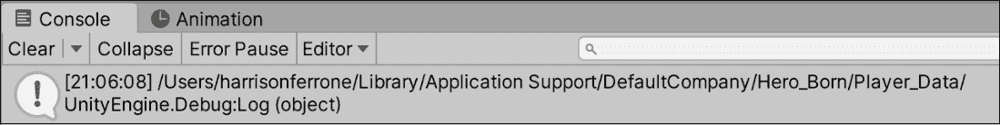

    图 12.4:Unity 持久数据文件的路径

因为我使用的是 Mac，所以我的持久数据文件夹是嵌套在我的`/Users` 文件夹中。 如果您使用的是不同的设备，请查看[https://docs.unity3d.com/ScriptReference/Application-persistentDataPath.html](https://docs.unity3d.com/ScriptReference/Application-persistentDataPath.html)以找出您的数据存储在何处。

当你不使用预定义的资源路径(如 Unity 的持久数据目录)时，C# 在`Path`类中有一个名为`Combine`的方法，用于自动配置路径变量。 `Combine()`方法最多可以使用四个字符串作为输入参数，或者使用表示路径组件的字符串数组。 例如，您的`User`目录的路径可能如下所示:

```cs
var path = Path.Combine("/Users", "hferrone", "Chapter_12"); 
```

这解决了在路径和目录中分隔字符和正反斜杠的任何潜在的跨平台问题。

现在我们有了存储数据的路径，让我们在文件系统中创建一个新目录或文件夹。 这将让我们能够在游戏运行之间安全地存储数据，而不是将其删除或覆盖到临时存储中。

## 创建和删除目录

创建一个新的目录文件夹是很简单的——我们检查在相同的路径上是否已经存在同名的文件夹，如果没有，我们告诉 C# 为我们创建它。 每个人都有自己的处理文件和文件夹中的副本的方法，所以我们将在本章的其余部分中重复相当多的副本检查代码。

我仍然建议在实际应用中遵循**DRY**(**Don't Repeat Yourself**)原则; 这里重复的检查代码只是为了使示例完整和易于理解:

1.  将以下方法添加到`DataManager`:

    ```cs
    public void NewDirectory()
    {
        // 1
        if(Directory.Exists(_dataPath))
        {
            // 2
            Debug.Log("Directory already exists...");
            return;
        }
        // 3
        Directory.CreateDirectory(_dataPath);
        Debug.Log("New directory created!");
    } 
    ```

2.  调用`Initialize()`:

    ```cs
    public void Initialize()
    {
        _state = "Data Manager initialized..";
        Debug.Log(_state);
        **NewDirectory();**
    } 
    ```

    中的新方法

让我们来分析一下我们所做的事情:

1.  首先，使用在上一步中创建的路径检查目录文件夹是否已经存在
2.  如果已经创建了，我们将在控制台中发送一条消息，并使用`return`关键字退出该方法，而不做进一步操作
3.  如果目录文件夹不存在，我们将数据路径传递给`CreateDirectory()`方法，并记录它已经创建

运行游戏并确保在控制台中看到正确的调试日志，以及在持久数据文件夹中的新目录文件夹。

如果您找不到它，使用我们在上一步中打印的`_dataPath`值。


图 12.5:创建新目录的控制台消息

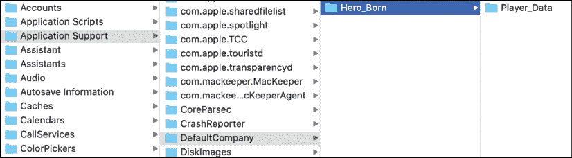

图 12.6:在桌面上创建的新目录

如果你第二次运行游戏，将不会创建重复的目录文件夹，这正是所需要的安全代码。


图 12.7:重复目录文件夹的控制台消息

删除目录与我们创建目录的方式非常相似——我们检查目录是否存在，然后使用`Directory`类删除所传入路径上的任何文件夹。

在`DataManager`中添加如下方法:

```cs
public void DeleteDirectory()
{
    // 1
    if(!Directory.Exists(_dataPath))
    {
        // 2
        Debug.Log("Directory doesn't exist or has already been
deleted...");

        return;
    }
    // 3
    Directory.Delete(_dataPath, true);
    Debug.Log("Directory successfully deleted!");
} 
```

因为我们想要保留刚刚创建的目录，所以不必立即调用这个函数。 但是，如果您想尝试它，只需将`Initialize()`函数中的`NewDirectory()`替换为`DeleteDirectory()`即可。

空目录文件夹并不是特别有用，所以让我们创建第一个文本文件并将其保存到新位置。

## 创建、更新和删除文件

处理文件类似于创建和删除目录，所以我们已经有了所需的基本构建块。 为了确保不复制数据，我们将检查文件是否已经存在，如果不存在，我们将在新目录文件夹中创建一个新文件。

在本节中，我们将使用`File`类，它有大量有用的方法来帮助实现我们的特性。 您可以在[https://docs.microsoft.com/en-us/dotnet/api/system.io.file](https://docs.microsoft.com/en-us/dotnet/api/system.io.file)找到整个列表。

在我们开始之前，需要强调的一点是:在添加文本之前，文件需要打开;在完成之后，文件需要关闭。 如果您不关闭正在以编程方式处理的文件，它将在程序的内存中保持打开状态。 这两种方法都使用了计算能力来处理您没有积极编辑的内容，并且可能造成潜在的内存泄漏。 在后面的章节中有更多的介绍。

我们将为每个要执行的操作(创建、更新和删除)编写单独的方法。 我们还将检查我们正在处理的文件在每个情况下是否存在，这是重复的。 我已经把这本书的这一部分组织好了，这样你就可以对每一个步骤有一个坚实的了解。 然而，在你学习了基础知识之后，你完全可以将它们结合成更经济的方法。

采取以下步骤:

1.  为新文本文件添加一个新的私有字符串路径，并将其值设置为`Awake`:

    ```cs
    private string _dataPath;
    **private****string** **_textFile;**
    void Awake()
    {
        _dataPath = Application.persistentDataPath + "/Player_Data/";

        Debug.Log(_dataPath);

        **_textFile = _dataPath +** **"Save_Data.txt"****;**
    } 
    ```

2.  `DataManager`:

    ```cs
    public void NewTextFile()
    {
        // 1
        if (File.Exists(_textFile))
        {
            Debug.Log("File already exists...");
            return;
        }
        // 2
        File.WriteAllText(_textFile, "<SAVE DATA>\n\n");
        // 3
        Debug.Log("New file created!");
    } 
    ```

    新增方法
3.  在`Initialize()`:

    ```cs
    public void Initialize()
    {
        _state = "Data Manager initialized..";
        Debug.Log(_state);

        FilesystemInfo();
        NewDirectory();
        **NewTextFile();**
    } 
    ```

    中调用新的方法

让我们分解一下我们的新代码:

1.  我们检查文件是否已经存在，如果已经存在，我们将`return`移出方法以避免重复:
    *   值得注意的是，这种方法对于不打算更改的新文件很有效。 在下一个练习中，我们将讨论更新和覆盖数据到文件。
2.  我们使用了`WriteAllText()`方法，因为它在一个地方完成了我们需要的所有事情:
    *   使用我们的`_textFile`路径创建一个新文件
    *   添加标题字符串`<SAVE DATA>`，并添加两个带有`\n`字符的新行
    *   然后文件会自动关闭
3.  我们打印出一个日志信息，让我们知道一切进展顺利

当你现在玩游戏时，你会在控制台看到调试日志和在你的持久数据文件夹位置的新文本文件:


图 12.8:创建新文件的控制台消息

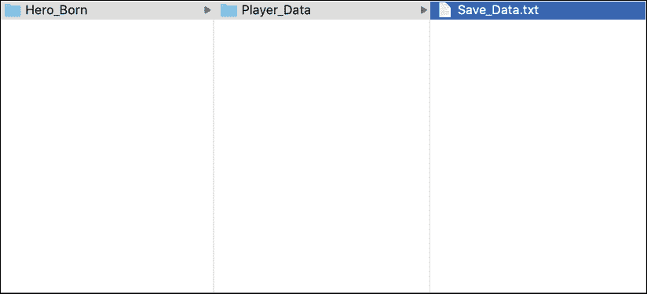

图 12.9:在桌面上创建新文件

为了更新新的文本文件，我们将执行一组类似的操作。 知道何时开始新游戏总是件好事，所以你的下一个任务是添加一个方法到，将该信息写入我们的保存数据文件:

1.  在`DataManager`的顶部添加一个新的`using`指令:

    ```cs
    using System.Collections;
    using System.Collections.Generic;
    using UnityEngine;
    using System.IO;
    **using** **System;** 
    ```

2.  添加一个新方法`DataManager`:

    ```cs
    public void UpdateTextFile()
    {
        // 1
        if (!File.Exists(_textFile))
        {
            Debug.Log("File doesn't exist...");
            return;
        }

        // 2
        File.AppendAllText(_textFile, $"Game started: {DateTime.Now}\n");
        // 3
        Debug.Log("File updated successfully!");
    } 
    ```

3.  在`Initialize()`:

    ```cs
    public void Initialize()
    {
        _state = "Data Manager initialized..";
        Debug.Log(_state);

        FilesystemInfo();
        NewDirectory();
        NewTextFile();
        **UpdateTextFile();**
    } 
    ```

    中调用新的方法

让我们分解一下上面的代码:

1.  如果文件存在，我们不想复制它，所以我们只退出方法，不做任何进一步的操作
2.  如果文件存在，我们使用另一个名为`AppendAllText()`的一体化方法来添加游戏的开始时间:
    *   此方法打开文件
    *   它添加了作为方法参数传入的新文本行
    *   它会关闭文件
3.  打印出一个日志信息，让我们知道一切顺利

再次玩游戏，你会看到我们的控制台消息和文本文件中的一行新内容，其中包含新游戏的日期和时间:


图 12.10:用于更新文本文件的控制台消息


图 12.11:文本文件数据更新

为了读取我们的新文件数据，我们需要一个方法来获取所有文件的文本并将其以字符串的形式交还给我们。 幸运的是，`File` 类有方法可以做到这一点:

1.  添加一个新方法`DataManager`:

    ```cs
    // 1
    public void ReadFromFile(string filename)
    {
        // 2
        if (!File.Exists(filename))
        {
            Debug.Log("File doesn't exist...");
            return;
        }

        // 3
        Debug.Log(File.ReadAllText(filename));
    } 
    ```

2.  调用`Initialize()`中的新方法并将`_textFile`作为参数传入:

    ```cs
    public void Initialize()
    {
        _state = "Data Manager initialized..";
        Debug.Log(_state);

        FilesystemInfo();
        NewDirectory();
        NewTextFile();
        UpdateTextFile();
        **ReadFromFile(_textFile);**
    } 
    ```

让我们把这个新方法的代码分解如下:

1.  我们创建一个新方法，它接受想要读取的文件的字符串参数
2.  如果文件不存在，则不需要任何操作，因此我们退出该方法
3.  我们使用`ReadAllText()`方法将所有文件的文本数据作为字符串输出到控制台

玩游戏，你会看到控制台消息与我们以前的保存和一个新的!


图 12.12:从文件中读取保存文本数据的控制台消息

最后，让我们添加一个方法来删除我们的文本文件。 我们实际上不会使用这个方法，因为我们希望保持文本文件不变，但你可以自己尝试一下:

```cs
public void DeleteFile(string filename)
{
    if (!File.Exists(filename))
    {
        Debug.Log("File doesn't exist or has already been deleted...");

        return;
    }

    File.Delete(_textFile);
    Debug.Log("File successfully deleted!");
} 
```

既然我们已经稍微深入到文件系统领域，现在是时候讨论一种略微升级的信息处理方式——数据流!

# 处理流

到目前为止，我们一直让`File`类完成所有处理数据的繁重工作。 我们还没有讨论的是`File`类，或者其他处理读写数据的类，是如何在底层工作的。

对计算机来说，数据是由字节组成的。 把字节想象成计算机的原子，它们构成了一切——甚至还有 C# `byte`类型。 当我们读、写或更新一个文件时，我们的数据被转换成一个字节数组，然后使用`Stream`将其流到或从文件中流出。 数据流负责将数据作为字节序列传输到或从一个文件，充当我们的游戏应用和数据文件本身之间的转换器或中介。

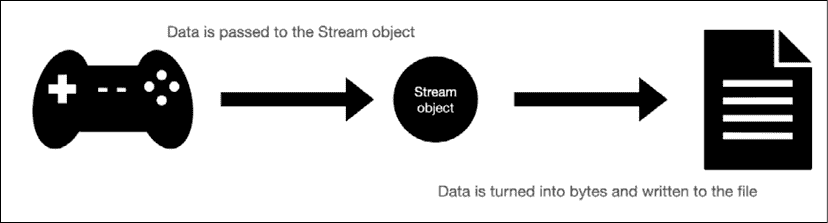

图 12.13:流数据到文件的图

`File`类自动为我们使用`Stream`对象，并且有不同的`Stream`子类用于不同的功能:

*   使用`FileStream`将数据读写到文件中
*   使用`MemoryStream`将数据读写到内存中
*   使用`NetworkStream`向其他联网的计算机读写数据
*   使用`GZipStream`压缩数据，方便存储和下载

在接下来的部分中，我们将讨论管理流资源，使用名为`StreamReader`**和`StreamWriter`的助手类来创建、读取、更新和删除文件。 您还将学习如何使用`XmlWriter`类更容易地格式化 XML。**

 **## 管理您的流资源

我们还没有讨论的一个重要话题是资源分配。 这意味着代码中的某些进程将把计算能力和内存放在一种分期付款的计划中，其中你不能碰它。 这些过程将等待，直到你明确地告诉你的程序或游戏关闭，并返回预付资源给你，这样你就回到了全力。 流就是这样的一个过程，在你使用完它们之后，它们需要被关闭。 如果您没有正确地关闭流，您的程序将继续使用这些资源，即使您没有这样做。

幸运的是，C# 有一个名为`IDisposable`的方便接口，所有`Stream`类都实现了这个接口。 这个接口只有一个方法`Dispose()`，它告诉流何时将它正在使用的资源返回给您。

你不必太担心这一点，因为我们将介绍一种自动的方法来确保你的流总是被正确关闭。 资源管理只是一个很好的编程概念。

在本章的其余部分中，我们将使用`FileStream`，但我们将使用名为`StreamWriter`和`StreamReader`的方便类。 这些类不需要手动将数据转换为字节，但仍然使用`FileStream`对象本身。

## 使用 StreamWriter 和 StreamReader

`StreamWriter`和`StreamReader`类都可以作为助手，使用属于`FileStream`的对象向特定文件写入和读取文本数据。 这些类非常有用，因为它们创建、打开和返回一个流，您可以使用最少的样板代码。 到目前为止，我们介绍的示例代码适用于小型数据文件，但如果要处理大型和复杂的数据对象，则应该使用流。

我们所需要的是我们想要写入或读取的文件的名称，然后就都设置好了。 你的下一个任务是使用一个流将文本写入一个新文件:

1.  为新的流文本文件添加一个新的私有字符串路径，并在`Awake()`:

    ```cs
    private string _dataPath;
    private string _textFile;
    **private****string** **_streamingTextFile;**

    void Awake()
    {
        _dataPath = Application.persistentDataPath + "/Player_Data/";
        Debug.Log(_dataPath);

        _textFile = _dataPath + "Save_Data.txt";
        **_streamingTextFile = _dataPath +** **"Streaming_Save_Data.txt"****;**
    } 
    ```

    中设置其值。
2.  添加一个新方法`DataManager`:

    ```cs
    public void WriteToStream(string filename)
    {
        // 1
        if (!File.Exists(filename))
        {
            // 2
            StreamWriter newStream = File.CreateText(filename);

            // 3
            newStream.WriteLine("<Save Data> for HERO BORN \n\n");
            newStream.Close();
            Debug.Log("New file created with StreamWriter!");
        }

        // 4
        StreamWriter streamWriter = File.AppendText(filename);

        // 5
        streamWriter.WriteLine("Game ended: " + DateTime.Now);
        streamWriter.Close();
        Debug.Log("File contents updated with StreamWriter!");
    } 
    ```

3.  删除或注释在上一节中使用的`Initialize()`中的方法，并添加到我们的新代码中:

    ```cs
    public void Initialize()
    {
        _state = "Data Manager initialized..";
        Debug.Log(_state);

        FilesystemInfo();
        NewDirectory();
        **WriteToStream(_streamingTextFile);**
    } 
    ```

让我们在上面的代码中分解这个新方法:

1.  首先，我们检查文件是否不存在
2.  如果文件还没有创建，则添加一个名为`newStream`的新的`StreamWriter`实例，该实例使用`CreateText()`方法创建和打开新文件
3.  一旦文件打开，我们使用`WriteLine()`方法添加一个头，关闭流，并打印出一条调试消息
4.  如果文件已经存在，我们只想更新它，那么我们可以使用`AppendText()`方法通过一个新的`StreamWriter`实例获取文件，这样现有的数据就不会被覆盖
5.  Finally, we write a new line with our game data, close the stream, and print out a debug message:

    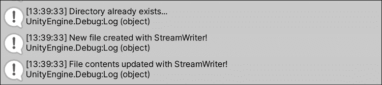

    图 12.14:使用流写入和更新文本的控制台消息

    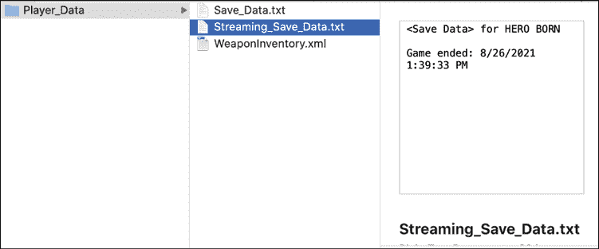

    图 12.15:用流创建和更新新文件

从流中读取几乎与我们在上一节中创建的`ReadFromFile()`方法一模一样。 唯一的区别是，我们将使用一个`StreamReader`实例来打开和读取信息。 同样，当你处理大数据文件或复杂对象时，你希望使用流，而不是使用`File`类手动创建和写入文件:

1.  添加一个新方法`DataManager`:

    ```cs
    public void ReadFromStream(string filename)
    {
        // 1
        if (!File.Exists(filename))
        {
            Debug.Log("File doesn't exist...");
            return;
        }

        // 2
        StreamReader streamReader = new StreamReader(filename);
        Debug.Log(streamReader.ReadToEnd());
    } 
    ```

2.  在`Initialize()`中调用新的方法，并将`_streamingTextFile`作为参数传入:

    ```cs
    public void Initialize()
    {
        _state = "Data Manager initialized..";
        Debug.Log(_state);

        FilesystemInfo();
        NewDirectory();
        WriteToStream(_streamingTextFile);
        **ReadFromStream(_streamingTextFile);**
    } 
    ```

让我们分解一下我们的新代码:

1.  首先，检查文件是否不存在，如果不存在，则打印一条控制台消息并退出该方法
2.  If the file does exist, we create a new `StreamReader` instance with the name of the file we want to access and print out the entire contents using the `ReadToEnd` method:

    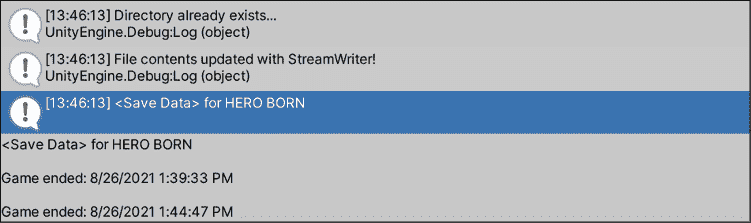

    图 12.16:控制台打印从流中读取的保存数据

正如您开始注意到的，我们的很多代码看起来都一样。 唯一的区别是我们使用流类来完成实际的读写工作。 然而，记住不同的用例将如何决定您采取哪条路线是很重要的。 请回到本节的开始，回顾每种流类型是如何不同的。

到目前为止,我们已经介绍的基本特性**CRUD(创建**,**阅读**,**更新**、【显示】和****删除**)应用使用文本文件。 但是文本文件并不是你在 C# 游戏和应用中使用的唯一数据格式。 一旦您开始使用数据库和自己复杂的数据结构，您可能会看到大量的 XML 和 JSON，这些数据结构在效率和存储方面是文本无法与之相比的。**

 **在下一节中，我们将处理一些基本的 XML 数据，然后讨论一种更简单的流管理方法。

## XMLWriter 创建一个

有时，您不会只使用普通的旧文本来读写文件。 您的项目可能需要 XML 格式的文档，在这种情况下，您需要知道如何使用常规的`FileStream`来保存和加载 XML 数据。

将 XML 数据写入文件与我们处理文本和流的方法并没有什么不同。 唯一的区别是，我们将显式地创建一个`FileStream`，并使用它来创建`XmlWriter`的实例。 可以把`XmlWriter`类看作一个包装器，它获取我们的数据流，应用 XML 格式，并以 XML 文件的形式输出我们的信息。 一旦有了这些，我们就可以使用`XmlWriter`类中的方法将文档结构成正确的 XML 格式，然后关闭文件。

您的下一个任务是为一个新的 XML 文档创建一个文件路径，并添加使用`DataManager`类向该文件写入 XML 数据的能力:

1.  将突出显示的`using`指令添加到`DataManager`类的顶部:

    ```cs
    using System.Collections;
    using System.Collections.Generic;
    using UnityEngine;
    using System.IO;
    using System;
    **using** **System.Xml;** 
    ```

2.  为新 XML 文件添加一个新的私有字符串路径，并在`Awake()`:

    ```cs
    // ... No other variable changes needed ...
    **private****string** **_xmlLevelProgress;**
    void Awake()
    {
         // ... No other changes needed ...
         **_xmlLevelProgress = _dataPath +** **"Progress_Data.xml"****;**
    } 
    ```

    中设置其值。
3.  在`DataManager`类的底部添加一个新方法:

    ```cs
    public void WriteToXML(string filename)
    {
        // 1
        if (!File.Exists(filename))
        {
            // 2
            FileStream xmlStream = File.Create(filename);

            // 3
            XmlWriter xmlWriter = XmlWriter.Create(xmlStream);

            // 4
            xmlWriter.WriteStartDocument();
            // 5
            xmlWriter.WriteStartElement("level_progress");

            // 6
            for (int i = 1; i < 5; i++)
            {
                xmlWriter.WriteElementString("level", "Level-" + i);
            }

            // 7
            xmlWriter.WriteEndElement();

            // 8
            xmlWriter.Close();
            xmlStream.Close();
        }
    } 
    ```

4.  在`Initialize()`中调用新的方法，并将`_xmlLevelProgress`作为参数传入:

    ```cs
    public void Initialize()
    {
        _state = "Data Manager initialized..";
        Debug.Log(_state);

        FilesystemInfo();
        NewDirectory();
        **WriteToXML(_xmlLevelProgress);**
    } 
    ```

让我们来分析一下 XML 的编写方法:

1.  首先，我们检查文件是否已经存在
2.  如果文件不存在，则使用创建的新路径变量创建一个新的`FileStream`
3.  然后创建一个新的`XmlWriter`实例，并将新的`FileStream`传递给它
4.  接下来，我们使用`WriteStartDocument`方法指定 XML 1.0 版本
5.  然后调用`WriteStartElement`方法来添加名为`level_progress`的起始根元素标记
6.  现在，我们可以使用`WriteElementString`方法向文档中添加单个元素，并使用`for`循环将`level`作为元素标签传递，并使用`i`的索引值传递级别号。
7.  要关闭文档，我们使用`WriteEndElement`方法添加一个关闭`level`标记
8.  最后，我们关闭写入器和流以释放我们一直在使用的流资源

如果你现在运行游戏，你会在**Player_Data**文件夹中看到一个新的`.xml`文件，里面有关卡进度信息:

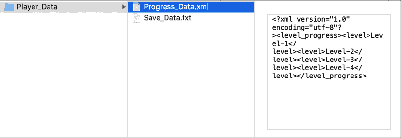

图 12.17:用文档数据创建的新 XML 文件

您会注意到没有缩进或格式化，这是预期的，因为我们没有指定任何输出格式。 在本例中，我们不打算使用它们中的任何一个，因为我们将在下一节(关于序列化)中讨论编写 XML 数据的更有效的方法。

您可以在[https://docs.microsoft.com/dotnet/api/system.xml.xmlwriter# specifying-the-output-format](https://docs.microsoft.com/dotnet/api/system.xml.xmlwriter# specifying-the-output-format)找到输出格式化属性列表。

好消息是，读取 XML 文件与读取任何其他文件没有什么不同。 您可以调用`initialize()`中的`readfromfile()`或`readfromstream()`方法，并获得相同的控制台输出:

```cs
public void Initialize()
{
    _state = "Data Manager initialized..";
    Debug.Log(_state);
    FilesystemInfo();
    NewDirectory();
    WriteToXML(_xmlLevelProgress);
    **ReadFromStream(_xmlLevelProgress);**
} 
```

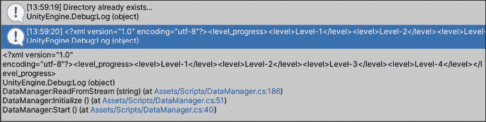

图 12.18:读取 XML 文件数据的控制台输出

现在我们已经编写了一些使用流的方法，让我们看看如何有效地、更重要的是自动地关闭任何流。

## 自动关闭流

当您处理流时，通过调用前面提到的`IDisposable`接口中的`Dispose()`方法，将它们包装在`using`语句中，从而自动关闭流。

通过这种方式，您永远不必担心您的程序可能无缘无故地打开未使用的已分配资源。

语法几乎与我们已经做的完全相同，除了我们在行开头使用`using`关键字，然后在一对圆括号内引用一个新流，后面跟着一组花括号。 我们希望流做的任何事情，比如读取或写入数据，都在花括号代码块中完成。 例如，创建一个新的文本文件，就像我们在`WriteToStream()`方法中所做的那样:

```cs
// The new stream is wrapped in a using statement
using(StreamWriter newStream = File.CreateText(filename))
{
     // Any writing functionality goes inside the curly braces
     newStream.WriteLine("<Save Data> for HERO BORN \n");
} 
```

一旦流逻辑在代码块中，外部的`using` 语句自动关闭流，并且将分配的资源返回给程序。 从现在开始，我建议始终使用这种语法来编写流代码。 它更有效，更安全，并将展示您对基本资源管理的理解!

在我们的文本和 XML 流代码工作之后，是时候继续了。 如果你想知道为什么我们没有流任何 JSON 数据，那是因为我们需要在数据工具箱序列化中再添加一个工具!

# 序列化数据

当我们讨论序列化和反序列化数据时，我们实际上讨论的是转换。 虽然我们已经在前面的小节中翻译了文本和 XML 片段，但是能够一次性翻译整个对象是一个很好的工具。

通过定义:

*   **序列化**对象的行为将对象的整个状态转换为另一种格式
*   **反序列化**的操作是的反向操作，从文件中获取数据并将其恢复到之前的对象状态


图 12.19:将对象序列化为 XML 和 JSON 的示例

让我们从上图中举一个实际的例子——我们的`Weapon`类的一个实例。 每个武器都有自己的名称、伤害属性和相关值，这被称为其状态。 对象的状态是唯一的，这允许程序将它们区分开来。

对象的状态也包括作为引用类型的属性或字段。 例如，如果我们有一个具有`Weapon`属性的`Character`类，C# 在序列化和反序列化时仍然可以识别武器的`name`和`damage`属性。 在编程世界中，您可能会听到带有引用属性的对象被称为对象图。

在我们开始之前，值得注意的是，如果您没有密切注意确保对象属性与文件中的数据匹配，反之亦然，那么序列化对象可能会很棘手。 例如，如果类对象属性与反序列化的数据之间不匹配，则序列化器将返回一个空对象。 当我们在本章后面尝试将 C# 列表序列化为 JSON 时，我们将更详细地讨论这个问题。

为了真正掌握这一点，让我们使用我们的`Weapon`示例并将其转换为工作代码。

## 序列化和反序列化 XML

本章剩下的的任务是将一个武器列表序列化和反序列化为 XML 和 JSON，首先是 XML !

1.  在`DataManager`类的顶部添加一个新的`using`指令:

    ```cs
    using System.Collections;
    using System.Collections.Generic;
    using UnityEngine;
    using System.IO;
    using System;
    using System.Xml;
    **using** **System.Xml.Serialization;** 
    ```

2.  在`Weapon`类中添加一个可序列化的属性，这样 Unity 和 C# 就知道该对象可以被序列化:
3.  添加两个新的变量，一个用于 XML 文件路径，一个用于武器列表:

    ```cs
    // ... No other variable changes needed ...
    **private****string** **_xmlWeapons;**
    **private** **List<Weapon> weaponInventory =** **new** **List<Weapon>**
    **{**
        **new** **Weapon(****"Sword of Doom"****,** **100****),**
        **new** **Weapon(****"Butterfly knives"****,** **25****),**
        **new** **Weapon(****"Brass Knuckles"****,** **15****),**
    **};** 
    ```

4.  在`Awake`:

    ```cs
    void Awake()
    {
        // ... No other changes needed ...
        **_xmlWeapons = _dataPath +** **"WeaponInventory.xml"****;**
    } 
    ```

    中设置 XML 文件路径值
5.  在`DataManager`类的底部添加一个新方法:

    ```cs
    public void SerializeXML()
    {
        // 1
        var xmlSerializer = new XmlSerializer(typeof(List<Weapon>));

        // 2
        using(FileStream stream = File.Create(_xmlWeapons))
        {
            // 3
            xmlSerializer.Serialize(stream, weaponInventory);
        }
    } 
    ```

6.  调用`Initialize`:

    ```cs
    public void Initialize()
    {
        _state = "Data Manager initialized..";
        Debug.Log(_state);

        FilesystemInfo();
        NewDirectory();
        **SerializeXML();**
    } 
    ```

    中的新方法

让我们分解一下我们的新方法:

1.  首先，我们创建一个`XmlSerializer`实例，并传入将要转换的数据类型。 在本例中，_`weaponInventory`的类型是`List<Weapon>`，这是我们在`typeof`操作符中使用的:
    *   `XmlSerializer`类是另一个有用的格式化包装器，就像我们前面使用的`XmlWriter`类一样
2.  然后，我们使用`_xmlWeapons`文件路径创建`FileStream`，并将其包装在`using`代码块中，以确保正确关闭它。
3.  最后，我们调用`Serialize()`方法并传入流和我们想要转换的数据。

再次运行游戏，看看我们无需指定任何额外格式就创建的新 XML 文档!

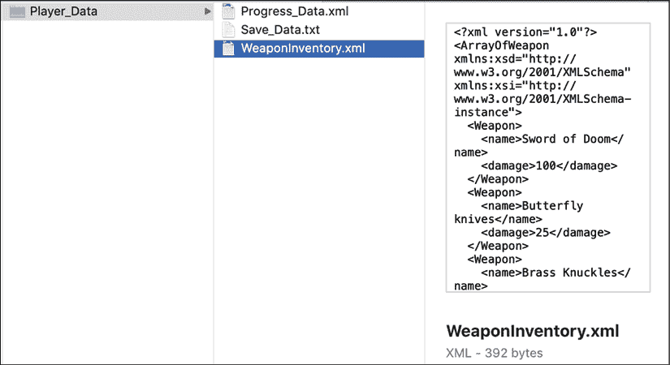

图 12.20:武器清单文件中的 XML 输出

为了将 XML 读入武器列表，我们设置了几乎与完全相同的所有内容，只是我们使用了`XmlSerializer`类中的`Deserialize()`方法:

1.  在`DataManager`类的底部添加以下方法:

    ```cs
    public void DeserializeXML()
    {
        // 1
        if (File.Exists(_xmlWeapons))
        {
            // 2
            var xmlSerializer = new XmlSerializer(typeof(List<Weapon>));

            // 3
            using (FileStream stream = File.OpenRead(_xmlWeapons))
            {
               // 4
                var weapons = (List<Weapon>)xmlSerializer.Deserialize(stream);

               // 5
               foreach (var weapon in weapons)
               {
                   Debug.LogFormat("Weapon: {0} - Damage: {1}", 
                     weapon.name, weapon.damage);
               }
            }
        }
    } 
    ```

2.  调用`Initialize`中的新方法并将`_xmlWeapons`作为参数传入:

    ```cs
    public void Initialize()
    {
        _state = "Data Manager initialized..";
        Debug.Log(_state);

        FilesystemInfo();
        NewDirectory();
        SerializeXML();
        **DeserializeXML();**
    } 
    ```

让我们来分解一下`deserialize()`方法:

1.  首先，我们检查文件是否存在
2.  如果文件存在，则创建一个`XmlSerializer`对象，并指定将 XML 数据放回`List<Weapon>`对象中
3.  然后，打开一个文件名为`_xmlWeapons`的`FileStream`:
    *   我们使用`File.OpenRead()`来指定我们想要打开文件进行读取，而不是写入
4.  接下来，我们创建一个变量来保存反序列化的武器列表:
    *   我们将显式的类型转换`List<Weapon>`放在对`Deserialize()`的调用之前，以便从序列化器返回正确的类型
5.  最后，我们使用`foreach`循环在控制台上打印出每个武器的名称和伤害值

当你再次运行游戏时，你会看到我们从 XML 列表中反序列化的每件武器都会得到一条控制台消息。

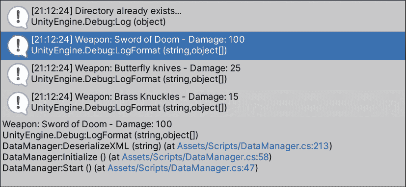

图 12.21:反序列化 XML 的控制台输出

这就是我们需要来处理 XML 数据的全部内容，但是在我们完成这一章之前，我们仍然需要学习如何使用 JSON!

## 序列化和反序列化 JSON

当谈到序列化和反序列化 JSON 时，Unity 和 C# 并不完全同步。 从本质上讲，C# 有自己的`JsonSerializer`类，它的工作方式与前面示例中使用的`XmlSerializer`类完全相同。

为了访问 JSON 序列化器，您需要`System.Text.Json``using`指令。 这里是 ruben - unity 不支持命名空间。 相反，Unity 使用`System.Text`命名空间并实现自己的 JSON 序列化器类`JsonUtility`。

因为我们的项目是在 Unity 中，我们将使用 Unity 支持的序列化类。 然而，如果你正在处理一个非 unity C# 项目，其概念与我们刚刚编写的 XML 代码相同。

您可以在[https://docs.microsoft.com/en-us/dotnet/standard/serialization/system-text-json-how-to# how-to-write-net-objects-as-json-serialize](https://docs.microsoft.com/en-us/dotnet/standard/serialization/system-text-json-how-to# how-to-write-net-objects-as-json-serialize)找到完整的操作指南，其中包括来自微软的代码。

你的下一个任务是连载一件武器来掌握`JsonUtility`职业:

1.  在`DataManager`类的顶部添加一个新的`using`指令:

    ```cs
    using System.Collections;
    using System.Collections.Generic;
    using UnityEngine;
    using System.IO;
    using System;
    using System.Xml;
    using System.Xml.Serialization;
    **using** **System.Text;** 
    ```

2.  为新 XML 文件添加一个新的私有字符串路径，并在`Awake()`:

    ```cs
    **private****string** **_jsonWeapons;**
    void Awake()
    {
        **_jsonWeapons = _dataPath +** **"WeaponJSON.json"****;**
    } 
    ```

    中设置其值。
3.  在`DataManager`类的底部添加一个新的方法:

    ```cs
    public void SerializeJSON()
    {
        // 1
        Weapon sword = new Weapon("Sword of Doom", 100);
        // 2
        string jsonString = JsonUtility.ToJson(sword, true);

        // 3
        using(StreamWriter stream = File.CreateText(_jsonWeapons))
        {
            // 4
            stream.WriteLine(jsonString);
        }
    } 
    ```

4.  在`Initialize()`中调用新方法，并将`_jsonWeapons`作为参数传入:

    ```cs
    public void Initialize()
    {
        _state = "Data Manager initialized..";
        Debug.Log(_state);

        FilesystemInfo();
        NewDirectory();
        **SerializeJSON();**
    } 
    ```

下面是序列化方法的分解:

1.  首先，我们需要使用一个武器，所以我们使用类初始化器创建一个
2.  然后我们声明一个变量来保存被格式化为字符串的翻译后的 JSON 数据，并调用`ToJson()`方法:
    *   我们使用的`ToJson()`方法接收了我们想要序列化的`sword`对象和一个布尔值`true`，因此字符串以适当的缩进方式被漂亮地打印出来。 如果我们没有指定`true`值，JSON 仍然会打印出来，它只是一个普通的字符串，不容易读取。
3.  现在我们有了要写入文件的文本字符串，我们创建一个`StreamWriter`流并传入`_jsonWeapons`文件名
4.  最后，我们使用`WriteLine()`方法并将`jsonString`值传递给它以写入文件

运行程序，查看我们创建并写入数据的新 JSON 文件!


图 12.22:带有武器属性序列化的 JSON 文件

现在让我们尝试序列化 XML 示例中使用的武器列表，看看会发生什么。

更新`SerializeJSON()`方法，使用现有的武器列表，而不是单个`sword`实例:

```cs
public void SerializeJSON()
{
    string jsonString = JsonUtility.ToJson(**weaponInventory,** true);

    using(StreamWriter stream = 
      File.CreateText(_jsonWeapons))
    {
        stream.WriteLine(jsonString);
    }
} 
```

当你再次运行游戏时，你会看到 JSON 文件数据被覆盖，我们最终得到的是一个空数组:

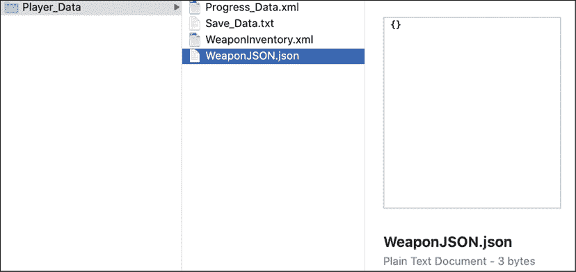

图 12.23:序列化后带有空对象的 JSON 文件

同样，这是因为 Unity 处理 JSON 序列化的方式本身并不支持列表或数组。 任何列表或数组都需要成为 Unity 的`JsonUtility`类的类对象的一部分，才能正确地识别和处理它。

不要惊慌，如果我们想到，这是一个相当直观的解决方案——我们只需要创建一个具有武器列表属性的类，并在将数据序列化为 JSON 时使用它!

1.  打开`Weapon.cs`并将以下可序列化的`WeaponShop`类添加到文件的底部。 要非常小心地将新类放在`Weapon` 类的花括号外:

    ```cs
    [Serializable]
    public class WeaponShop
    {
        public List<Weapon> inventory;
    } 
    ```

2.  回到`DataManager`类，用以下代码更新`SerializeJSON()`方法:

    ```cs
    public void SerializeJSON()
    {
        // 1
        **WeaponShop shop =** **new** **WeaponShop();**
        **// 2**
        **shop.inventory = weaponInventory;**

        // 3
        string jsonString = JsonUtility.ToJson(**shop**, true);

        using(StreamWriter stream = File.CreateText(_jsonWeapons))
        {
            stream.WriteLine(jsonString);
        }
    } 
    ```

让我们分解一下我们刚刚做的改变:

1.  首先，我们创建一个名为`shop`的新变量，它是`WeaponShop`类的一个实例
2.  然后我们将`inventory`属性设置为我们已经声明的`weaponInventory`武器列表
3.  最后，我们将`shop`对象传递给`ToJson()`方法，并将新的字符串数据写入 JSON 文件

再次运行游戏，看看我们所创造的武器列表:

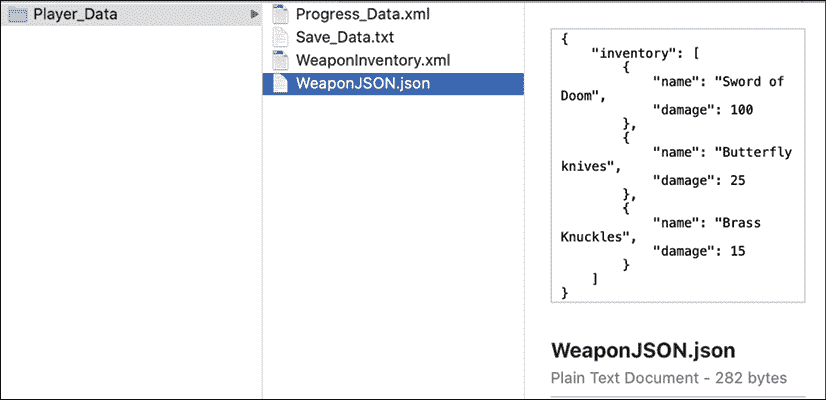

图 12.24:List 对象被正确序列化为 JSON

将 JSON 文本反序列化回到一个对象是我们刚才所做的反向过程:

1.  在`DataManager`类的底部添加一个新的方法:

    ```cs
    public void DeserializeJSON()
    {
        // 1
        if(File.Exists(_jsonWeapons))
        {
            // 2
            using (StreamReader stream = new StreamReader(_jsonWeapons))
            {
                // 3
                var jsonString = stream.ReadToEnd();

                // 4
                var weaponData = JsonUtility.FromJson<WeaponShop>
                  (jsonString);

                // 5
                foreach (var weapon in weaponData.inventory)
                {
                    Debug.LogFormat("Weapon: {0} - Damage: {1}", 
                      weapon.name, weapon.damage);
                }
            }
        }
    } 
    ```

2.  调用`Initialize()`中的新方法并将`_jsonWeapons`作为参数传入:

    ```cs
    public void Initialize()
    {
        _state = "Data Manager initialized..";
        Debug.Log(_state);

        FilesystemInfo();
        NewDirectory();
        SerializeJSON();
        **DeserializeJSON();**
    } 
    ```

让我们把`DeserializeJSON()`方法分解如下:

1.  首先，我们检查文件是否存在
2.  如果存在，则创建一个流，其中包含`_jsonWeapons`文件路径，并包装在`using`代码块中
3.  然后，我们使用流的`ReadToEnd()`方法从文件中获取整个 JSON 文本
4.  接下来，我们创建一个变量来保存反序列化的武器列表，并调用`FromJson()`方法:
    *   注意，在传入 JSON 字符串变量之前，我们指定要使用`<WeaponShop>`语法将 JSON 转换为`WeaponShop`对象
5.  最后，我们循环武器商店的`inventory`属性列表，并在控制台上打印出每个武器的名称和伤害值

最后一次运行游戏，你会看到在我们的 JSON 数据中为每个武器打印出一条控制台消息:

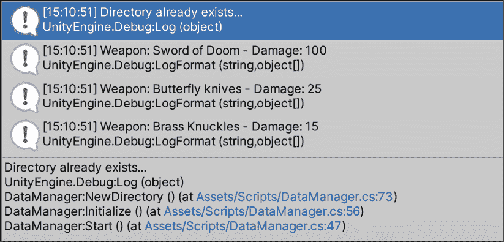

图 12.25:对 JSON 对象列表进行反序列化后的控制台输出

# 数据摘要

我们在本章中提到的每个模块和主题都可以单独使用，也可以组合使用以满足您的项目需求。 例如，您可以使用文本文件来存储字符对话，并且只在需要时加载它。 这比让游戏在每次运行时跟踪它更有效，即使这些信息没有被使用。

你还可以将角色数据或敌人统计数据放入 XML 或 JSON 文件中，并在需要升级角色或生成新怪物时读取该文件。 最后，您可以从第三方数据库获取数据并将其序列化到您自己的自定义类中。 这是存储玩家帐号和外部游戏数据的一个非常常见的场景。

您可以在[https://docs.microsoft.com/en-us/dotnet/framework/wcf/feature-details/types-supported-by-the-data-contract-serializer](https://docs.microsoft.com/en-us/dotnet/framework/wcf/feature-details/types-supported-by-the-data-contract-serializer)找到一个可以在 C# 中序列化的数据类型列表。 Unity 处理序列化的方式略有不同，所以请确保在[https://docs.unity3d.com/ScriptReference/SerializeField.html](https://docs.unity3d.com/ScriptReference/SerializeField.html)检查可用类型。

我想说的是，数据无处不在，你的工作就是创建一个系统，以游戏需要的方式，一点一点地处理数据。

# 总结

这就是使用数据的基础知识! 恭喜你完整地度过了怪物这一章。 数据在任何编程环境中都是一个大主题，所以以本章中所学的一切为起点。

您已经知道如何导航文件系统，以及如何创建、读取、更新和删除文件。 您还学习了如何有效地处理文本、XML 和 JSON 数据格式以及数据流。 您还知道如何获取整个对象的状态，并将其序列化或反序列化为 XML 和 JSON。 总而言之，学习这些技能是一项不小的壮举。 别忘了多复习几遍这一章; 在第一次演练中，有很多东西可能不会成为第二天性。

在下一章中，我们将讨论泛型编程的基础知识，获得一些关于委托和事件的实践经验，并以异常处理的概述作为结束。

# 流行测验-数据管理

1.  哪个命名空间允许您访问`Path`和`Directory`类?
2.  在 Unity 中，你使用什么文件夹路径来保存游戏运行之间的数据?
3.  `Stream`对象使用什么数据类型来读取和写入文件信息?
4.  当你把一个对象序列化成 JSON 时会发生什么?****