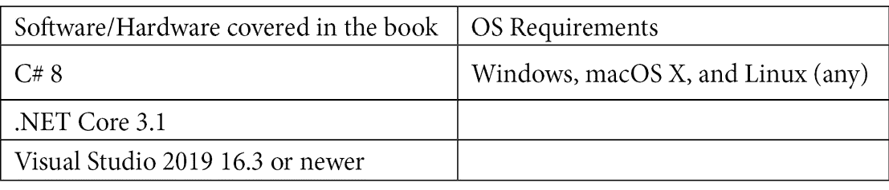

# 前言

C# 是一种通用的、多范式的编程语言，它结合了面向对象、命令式、泛型、函数式、声明式和动态编程。 在其发布后不久，C# 就成为开发人员编写各种类型应用的首选之一。 尽管它不是唯一针对 CLI 的语言(其他语言包括 VB)。 NET 和 f#)，它是为桌面、web、云和移动平台编写.NET 应用的主要选择。

多年来，这种语言逐渐而稳定地发展。 尽管最初它是一种面向对象的编程语言，但新的版本为该语言开辟了新的范例，如泛型编程、函数式编程和动态编程。 新的语言特性和更简洁的语法也被定期添加。 它作为.NET 编译器平台的一个开源项目发布，也被称为 Roslyn，它是一组用于 C# 和 VB 的编译器和代码分析 api。 NET，随着社会各界对该语言的深入参与，该语言已经进入了一个新的开放时代。

该语言的当前版本被称为 C# 8。 这是在 2019 年 9 月发布的.NET Core 3.0 版本，需要 Visual Studio 2019 16.3 或更新版本。 C# 8 也可以与.NET Framework 一起使用，尽管并不是所有的特性都可用。 这是因为它们需要运行时的改变，这是微软不想做的事情，因为它不想再投资于.NET 框架(除了长期的支持)，并将.NET Core 变成一个针对所有平台和应用类型的框架。 这个框架将被简单地称为.NET。

本书旨在帮助您从零开始学习这门语言，并最终掌握它的所有多范式编程方面。 我们从最基本的开始:数据类型、语句和其他构建块。 然后，我们继续讨论面向对象的概念，如类、接口、继承和多态性。 我们将介绍泛型、函数式编程和 LINQ、反射和动态编程，以及更高级的主题，例如资源管理、模式匹配、并发和异步编程、错误处理和序列化。 在本书的最后，我们特别关注了 C# 8 中引入的新特性。 最后，但并非最不重要的，我们将讨论单元测试以及如何为 C# 代码编写单元测试。 在每一章的结尾，我们会提供一组问题，帮助你评估你在这一章中学到了什么。

这本书包含了许多代码片段，旨在帮助您轻松理解和学习所有的语言特性。 所有这些都可以在本书附带的源代码中找到。 您将需要 Visual Studio 或 Visual Studio Code 来尝试它们。 或者，您可以使用在线编译器，在本例中主要的选择是[https://sharplab.io/](https://sharplab.io/)。

# 这本书是给谁的?

如果你是一个充满激情的程序员，想要学习 C#，这本书就是为你准备的。 如果你想开始学习编程，并且想用 C# 和.NET 来做，你也会发现这本书很有价值。 但是，我们假设您对编程概念有一些基本的了解，比如什么是编译器、什么是类和方法等等。 另一方面，如果你是一个经验丰富的 C# 程序员，但又想了解 C# 8 的最新特性，或者如何使用.NET Core 并从.NET 框架迁移过来，这本书也会对你很有用。

# 这本书的内容

[*第一章*](01.html# _idTextAnchor018),*从 C#*的构建模块,介绍了语言,其历史,及其与公共语言基础设施和.NET 框架的关系,以及提供一个介绍今天.NET 框架的家庭使用。 最后，您将学习程序集，如何在 Visual Studio 中创建项目，以及如何用 C# 编写 Hello World 程序。

[*第二章*](02.html# _idTextAnchor036),*数据类型和运算符*,走你通过语言的基本元素,包括内置的数据类型,变量和常量,参考,和价值类型,可空类型和数组类型,类型转换以及内置操作符。

第三章，*Control Statements and Exceptions*深入探讨了如何编写选择语句和循环，并简要介绍了如何处理异常。

第四章[](04.html# _idTextAnchor083)*,*理解各种用户定义的类型,提供了信息类、字段、属性、方法、构造函数、如何传递参数的方法,访问修饰符是什么,和其他方面相关的类。 最后，您将学习结构及其与类的比较，以及枚举。**

 **[*第五章*](05.html# _idTextAnchor103),*面向对象编程在 C# 中*,继续前一章的基础建立和教你面向对象编程的核心支柱,如何使用 C# 语言实现这些特性,比如接口、虚拟成员,方法重载等等。

第六章，*泛型*涵盖了 C# 泛型编程的所有方面，并教你如何编写泛型类型和方法，以及如何使用约束作为类型参数。

[*第七章*](07.html# _idTextAnchor134)，*集合*介绍了.NET 基类库中的泛型集合，这些泛型集合在编写 C# 程序时通常会用到。 本章最后概述了多线程场景中使用的并发集合。

[*第八章*](08.html# _idTextAnchor154)，*Advanced Topics*，包含了各种更高级的特性，如委托和事件、元组、扩展方法、模式匹配和正则表达式。

[*第 9 章*](09.html# _idTextAnchor173)，*资源管理*，解释了垃圾收集器是如何工作的，以及你应该如何确定性地处理资源。 此外，在本章中，您将学习如何使用平台调用服务(Platform Invocation Services)进行系统或本机 API 调用，以及如何编写不安全代码。

第十章，*Lambdas, LINQ，和函数式编程*提供了函数式编程的概念和关于 C# 中 lambda 表达式的细节的概述。 您将了解如何使用语言集成查询(Language Integrated query, LINQ)统一查询各种数据源。 在本章的最后，我们介绍了几个典型的函数式编程概念:部分函数应用、curry、闭包、monoids 和 monads 以及它们在 C# 中的工作方式。

[*第 11 章*](11.html# _idTextAnchor200),*反射和动态编程,告诉你什么是反射服务以及他们如何可以用来编写可扩展应用,如何动态地加载程序集和执行代码,如何使用属性, 以及如何使用动态语言运行库和动态类型与动态语言互操作。*

 *[*第十二章*](12.html# _idTextAnchor215),*多线程和异步编程,提供深入研究线程、任务和同步机制和揭示的细节 async-await 模式在 C# 编写异步程序。*

 *[*第十三章*](13.html# _idTextAnchor238),*文件流,和序列化*,解释了如何使用路径,文件和目录,以及如何使用流读写数据从各种各样的存储选项,如文件和内存。 在本章的第二部分，您将学习使用 XML 和 JSON 进行数据序列化。

[*第 14 章*](14.html# _idTextAnchor253),*错误处理,建立在对异常处理的概念引入[*第三章【显示】*](03.html# _idTextAnchor074)*,*控制语句和异常,并教给你的内部运作异常和异常处理与错误处理。 您将了解有关调试和监视的有价值的信息，以及处理异常的最佳实践。*

 *[*第 15 章*](15.html# _idTextAnchor271),*新特性的 C# 8*,将详细介绍在所有的新语言特性引入 C # 8,包括 nullable 引用类型、异步流,范围和指标,模式匹配和默认的实现接口成员。

[*第十六章*](16.html# _idTextAnchor296),*C# 与.NETCore 3*操作,教会你使用. net CLI 构建. NETCore应用,如何目标和开发 Linux, . net 标准是什么,以及它如何可以帮助应用设计,如何消费 NuGet 包, 以及如何将.NET Framework 应用迁移到.NET Core。

[*第 17 章*](17.html# _idTextAnchor322),*单元测试,包括单元测试、微软的 C# 代码的单元测试工具,如何使用 Visual Studio 创建单元测试项目,以及如何编写单元测试和数据驱动的单元测试。*

# 为了最大限度地了解这本书

这本书涵盖了 C#，从它的构建模块到它最先进的特性。 这本书是为那些想学习 C# 的人准备的。 因此，我们不期望你有任何事先的语言知识。 但是，我们希望您对编程概念有一些基本的了解，比如什么是编译器、编译时和运行时之间的区别、堆栈和堆之间的区别等等。

本书中的所有代码示例都是使用 C# 8 和现代编程风格(比如使用表达式体成员、插值字符串、局部函数等等)编写的。 所有这些示例都可以在针对.NET Core 3.1 的项目中与本书一起使用。

下表列出了运行这些示例的软件和平台要求:



为了运行源代码，您需要 Visual Studio 2019 16.3 或更新版本，或 Visual Studio code。 大多数示例也可以使用在线编译器进行测试。 如果您喜欢这个选项，我们建议您使用[https://sharplab.io/](https://sharplab.io/)。

如果你正在使用这本书的数字版本，我们建议你自己输入代码或通过 GitHub 存储库访问代码(链接在下一节中)。 这样做可以帮助您避免任何与复制/粘贴代码相关的潜在错误。

# 下载示例代码文件

您可以从您的帐户[www.packt.com](http://packt.com)下载本书的示例代码文件。 如果您在其他地方购买了这本书，您可以访问[www.packtpub.com/support](https://www.packtpub.com/support)并注册，将文件直接通过电子邮件发送给您。

你可以按以下步骤下载代码文件:

1.  登录或注册在[www.packt.com](http://packt.com)。
2.  选择**Support**选项卡。
3.  点击**代码下载**。
4.  在**搜索**框中输入书名，并按照屏幕上的说明操作。

下载文件后，请确保使用最新版本的解压或解压缩文件夹:

*   解压缩的软件/ 7 - zip 窗口
*   Zipeg / iZip UnRarX Mac
*   7 - zip / PeaZip Linux

该书的代码包也托管在 GitHub 上的[https://github.com/PacktPublishing/Learn-C-Sharp-Programming](https://github.com/PacktPublishing/Learn-C-Sharp-Programming)。 如果代码有更新，它将在现有的 GitHub 存储库中更新。

我们还可以在 https://github.com/PacktPublishing/上找到丰富的图书和视频目录中的其他代码包。 检查出来!

# 行动中的代码

本书的动作代码视频可以在[https://bit.ly/2VaAls9](https://bit.ly/2VaAls9)查看。

# 下载彩色图片

我们还提供了一个 PDF 文件，其中包含了本书中使用的屏幕截图/图表的彩色图像。 你可以在这里下载:https://static.packt-cdn.com/downloads/9781789805864_ColorImages.pdf。

# 使用的约定

本书中使用了许多文本约定。

**文本代码**:文本代码、数据库表名、文件夹名、文件名、文件扩展名、路径名、虚拟 url、用户输入和 Twitter 句柄。 下面是一个示例:“在这个示例中，我们正在创建一个带有三个字段的**Employee**类，用于表示员工的 ID、名和姓。”

一段代码设置如下:

```cs
class Employee
{
    public int    EmployeeId;
    public string FirstName;
    public string LastName;
}
```

当我们希望提请您注意代码块的特定部分时，相关的行或项以粗体显示:

```cs
public struct Vector
{
    public float x;
    public float y;
    private readonly float SquaredRo => (x * x) + (y * y);
    public readonly float GetLengthRo() => MathF.Sqrt(SquaredRo);
    public float GetLength() => MathF.Sqrt(SquaredRo);
}
```

任何命令行输入或输出都写如下:

```cs
cd HelloSolution
dotnet new console -o Hello
dotnet sln add Hello
```

**粗体**:表示新词条、重要单词或屏幕上看到的单词。 例如，菜单或对话框中的单词会像这样出现在文本中。 下面是一个例子:“当创建一个新项目时，选择**控制台应用(。 NET Core)**。

小贴士或重要提示

出现这样的。

# 联系

我们欢迎读者的反馈。

**一般反馈**:如果你对这本书的任何方面有疑问，请在邮件主题中提及书名，并发送电子邮件至 customercare@packtpub.com

**Errata**:尽管我们已尽一切努力确保内容的准确性，但错误还是会发生。 如果您在这本书中发现了错误，请向我们报告，我们将不胜感激。 请访问 www.packtpub.com/support/errata，选择你的书，点击勘误表提交链接，并输入详细信息。

**盗版**:如果您在网上看到任何形式的我们作品的非法拷贝，请提供我们的地址或网址，我们将不胜感激。 请通过 copyright@packt.com 联系我们，并提供相关材料的链接。

**如果你有兴趣成为一名作家**:如果你有一个你擅长的话题，并且你有兴趣写作或写一本书，请访问[authors.packtpub.com](http://authors.packtpub.com/)。

# 评论

请留下评论。 一旦你阅读和使用这本书，为什么不在你购买它的网站上留下评论? 潜在的读者可以看到并使用您的公正意见来做出购买决定，我们在 Packt 可以理解您对我们的产品的看法，我们的作者可以看到您对他们的书的反馈。 谢谢你！

更多关于 packt.com 的信息，请访问[packt.com](http://packt.com)。*****