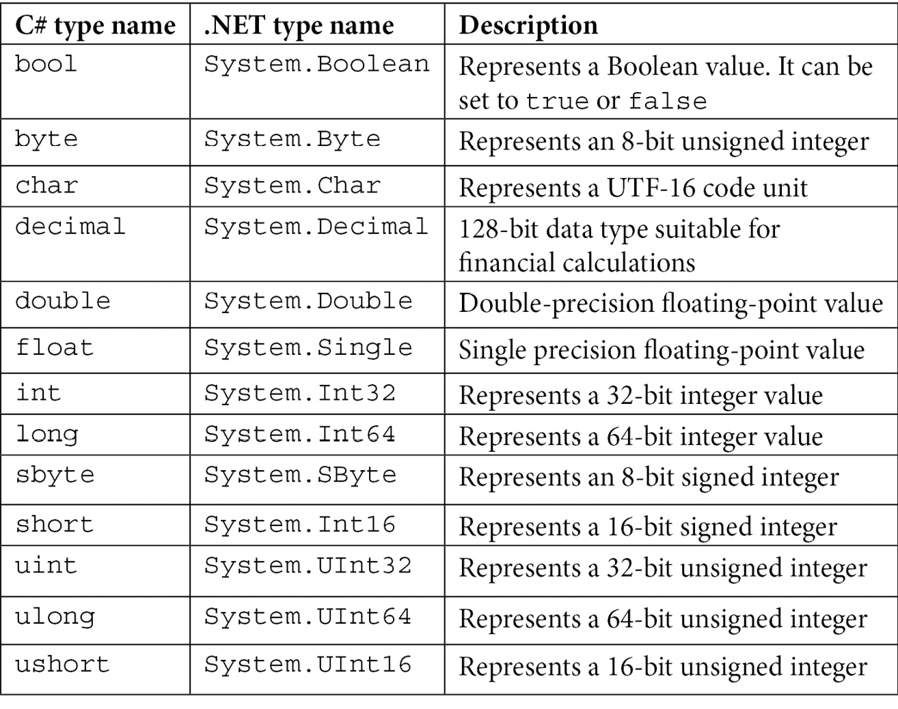
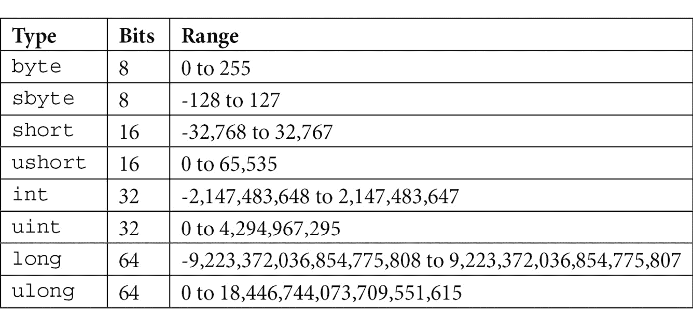
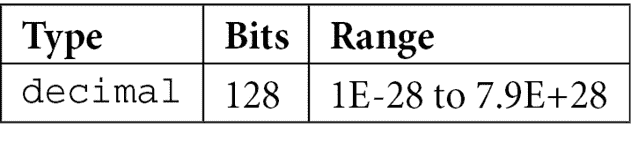
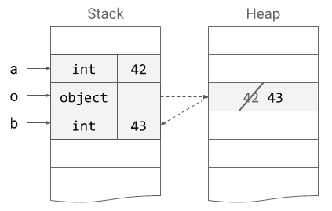
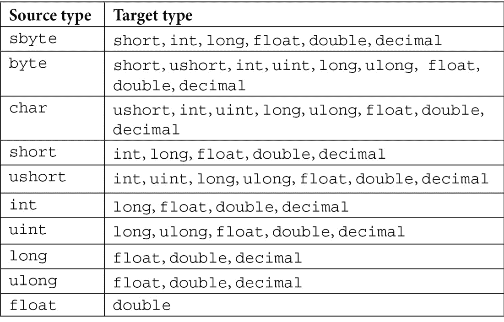
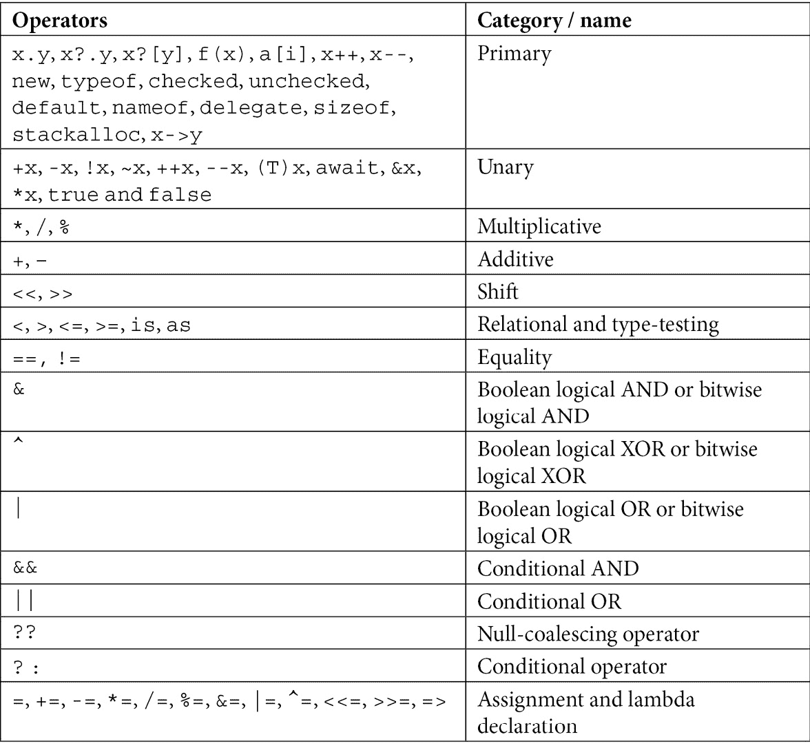

# *第二章*:数据类型和操作符

在前一章中，我们学习了。net Framework，了解了 c#程序的基本结构。 在本章中，我们将学习 c#中的数据类型和对象。 与控制语句(我们将在下一章中探讨)一样，它们是每个程序的构建块。 我们将讨论内置数据类型，解释值类型和引用类型之间的区别，并学习如何在类型之间进行转换。 在接下来的内容中，我们还将讨论该语言定义的操作符。

本章将涵盖以下主题:

*   基本内置数据类型
*   变量和常量
*   引用类型和值类型
*   可空类型
*   数组
*   类型转换
*   运营商

在本章结束时，你将能够使用上述语言特性编写一个简单的 c#程序。

# 基本数据类型

在本节中，我们将探索基本数据类型。 **公共语言基础结构**(**CLI**)定义了一组标准类型和操作，所有针对 CLI 的编程语言都支持这些类型和操作。 这些数据类型在**System**名称空间中提供。 然而，它们都有一个*c#别名*。 这些别名是 c#语言中的关键字，这意味着它们只能在指定用途的上下文中使用，不能在其他地方使用，比如变量、类或方法名。 c#名称和。net 名称，以及每种类型的简短描述，列在下面的表中(按 c#名称的字母顺序列出):



表中列出的类型称为**简单类型**或**原始类型**。 除此之外，还有两种内置类型:


让我们在下面几节中详细探讨所有基本类型。

## 整型

c#支持 8 种整数类型，它们代表不同范围的整数。 的位和范围如下表所示:



如上表所示，c#定义了有符号整数和无符号整数类型。 有符号整数和无符号整数之间的主要区别是读取高阶位的方式。 在有符号整数的情况下，高阶位被认为是符号标志。 如果标志为 0，则数字为正数;如果标志为 1，则数字为负数。

所有整型的缺省值为 0。 所有的类型都定义了两个常量**MinValue**和**MaxValue**，它们提供类型的最小值和最大值。

整型文字，即直接出现在代码中的数字(如 0、-42 等)，可以指定为十进制、十六进制或二进制文字。 十进制字面值不需要任何后缀。 十六进制字面值以**0x**或**0x**为前缀，二进制字面值以**0b**或**0b**为前缀。 下划线(**_**)可以用作所有数字字面值的数字分隔符。 这类文字的示例如下:

```cs
int dec = 32;
int hex = 0x2A;
int bin = 0b_0010_1010;
```

不带后缀的整型值被编译器推断为**int**。 要表示长整数，请使用**l**或**l**表示有符号的 64 位整数，使用**ul**或**ul**表示无符号的 64 位整数。

## 浮点类型

浮点类型用于表示具有小数分量的数。 c#定义了两种浮点类型，如下表所示:


**float**类型表示 32 位的单精度浮点数，而**double**表示 64 位的双精度浮点数。 这些类型是 IEEE 浮点算术标准(IEEE 754)的实现，是由 IEEE 电气和电子工程师协会(IEEE)**在 1985 年建立的浮点算术标准。**

浮点类型的默认值是 0。 这些类型还定义了两个常量**MinValue**和**MaxValue**，它们提供类型的最小值和最大值。 然而，这些类型也提供了表示非数(**System.Double.NaN**)和无穷大(**System.Double.NegativeInfinity**和**System.Double.PositiveInfinity**)的常量。 下面的代码清单显示了几个用浮点值初始化的变量:

```cs
var a = 42.99;
float b = 19.50f;
System.Double c = -1.23;
```

默认情况下，像**42.99**这样的非整数被认为是双精度数。 如果你想指定该浮子式,那么您需要后缀的价值**或**f**性格,比如在**42.99**或【显示】42.99 f。 或者，您也可以使用**d**或**d**后缀显式地表示双字面量，例如**42.99d**或**42.99d**。**

 **浮点类型将小数部分存储为 2 的逆幂。 因此，它们只能表示准确的值，如**10**、**10.25**、**10.5**等等。 其他数字，如**1.23**或**19.99**，不能准确地表示，只是一个近似值。 即使**double**有 15 位十进制精度，而**float**只有 7 位精度，重复计算时精度损失开始累积。

这使得**双**和**float**在某些类型的应用程序中难以使用，甚至不适合使用，例如金融应用程序，其中精度是关键。 为此，提供了**十进制**类型。

## 十进制类型

小数点**类型最多可以表示小数点的 28 位。 小数型的具体情况如下表所示:**

 **

十进制类型的缺省值是 0。 还有定义类型的最小值和最大值的**MinValue**和**MaxValue**常数。 可以使用**m**或**m**后缀指定**十进制**字面量，如下所示:

```cs
decimal a = 42.99m;
var b = 12.45m;
System.Decimal c = 100.75M;
```

值得注意的是，小数点**类型使舍入过程中的误差最小化，但并不排除舍入的需要。 例如，操作**1m / 3 * 3**的结果不是 1，而是**0.999999999999999999999999999999**。 另一方面，**数学。 圆(1m / 3 * 3)**得到值 1**。****

 **十进制**型设计用于应用中，精度是关键。 浮点数和双精度浮点数是更快的类型(因为它们使用二进制数学，计算速度更快)，而**十进制**类型则较慢(顾名思义，它使用十进制数学，计算速度较慢)。 **十进制**型比**双型**型慢一个数量级。 金融应用程序是**十进制**类型的典型用例，其中小的不精确性可以通过重复计算累积成重要的值。 在这种应用中，速度不重要，但精度重要。**

 **## char 类型

字符类型用于表示 16 位 Unicode 字符。 Unicode 定义了一个字符集，用于表示世界上大多数语言的字符。 字符用单引号(**"**)括起来表示。 例如**'A'**，**'B'**，**'c'**和**'\u0058'**:


字符值可以是字面值、形式为**'\xdddd'**的十六进制转义序列，或者形式为**'\udddd'**的 Unicode 表示(其中**dddd**是 16 个十六进制值)。 下面的清单展示了几个例子:

```cs
char a = 'A';
char b = '\x0065';
char c = '\u15FE';
```

**char**类型的默认值为十进制 0，或其等价值**'\0'**，**'\x0000'**，或**'\u0000'**。

## bool 类型

c#使用**bool**关键字到来表示布尔类型。 它可以有两个值，**true**或**false**，如下表所示:


bool 类型的默认值为**false**。 与其他语言(如 c++)不同，整数值或任何其他值都不会隐式转换为**bool**类型。 布尔变量可以赋值为布尔文字(**true**或**false**)，也可以赋值为**bool**的表达式。

## 字符串类型

字符串是由字符组成的数组。 在 c#中，表示字符串的类型称为**string**，是。net**系统的别名。 字符串**。 您可以互换地使用这两种类型中的任何一种。 在内部，字符串包含**char**对象的只读集合。 这使得字符串是不可变的，这意味着您不能更改字符串，但每次您想修改现有字符串的内容时，都需要创建一个新的字符串。 字符串不是以*null 结尾的*(与其他语言如 c++不同)，并且可以包含任意数量的 null 字符(**'\0'**)。 字符串长度将包含**char**对象的总数。

字符串可以通过多种方式声明并初始化，如下所示:

```cs
string s1;                       // unitialized
string s2 = null;                // initialized with null
string s3 = String.Empty;        // empty string
string s4 = "hello world";       // initialized with text
var s5 = "hello world";
System.String s6 = "hello world";
char[] letters = { 'h', 'e', 'l', 'l', 'o'};
string s7 = new string(letters); // from an array of chars
```

需要注意的是，使用**new**操作符创建字符串对象的唯一情况是用字符数组初始化它。

如前所述，字符串是不可变的。 虽然您可以访问字符串中的字符，但您可以读取它们，但不能更改它们:

```cs
char c = s4[0];  // OK
s4[0] = 'H';     // error
```

以下是看似正在修改字符串的方法:

*   **Remove()**:删除字符串的一部分。
*   **ToUpper()**/**tollower()**:将所有字符转换为大写或小写。

这两个方法都不会修改现有的字符串，而是返回一个新的字符串。

在下面的例子中,**s6**前面定义的字符串,**s8**将包含**你好**,**s9**将包含【显示】hello WORLD,和**s6 将继续包含【病人】hello WORLD**:

```cs
var s8 = s6.Remove(5);       // hello
var s9 = s6.ToUpper();       // HELLO WORLD
```

可以使用**ToString()**方法将任何内置类型(如整数或浮点数)转换为字符串。 这实际上是**系统的一个虚拟方法。 对象**类型，即任何. net 类型的基类。 通过覆盖此方法，任何类型都可以提供将对象序列化为字符串的方法:

```cs
int i = 42;
double d = 19.99;
var s1 = i.ToString();
var s2 = d.ToString();
```

字符串可以用几种方式组成:

*   可以使用连接操作符**+**来完成。
*   使用**格式()**方法:第一个该方法的参数格式,每个参数的显示和花括号中指定的索引定位,如**{0}**,**{1}**,**{2}【显示】等等。 指定超过参数数量的索引会导致运行时异常。**
*   使用字符串插值，这实际上是使用**string . format()**方法的一种语法快捷方式:字符串必须以**$**作为前缀，且参数直接在花括号中指定。

所有这些方法的一个例子显示在这里:

```cs
int i = 42;
string s1 = "This is item " + i.ToString();
string s2 = string.Format("This is item {0}", i);
string s3 = $"This is item {i}";
```

有些字符具有特殊的含义，并以反斜杠(**\**)作为前缀。 这些被称为转义序列。 下表列出了它们:


在某些情况下，转义序列是必要的，例如当您指定 Windows 文件路径或需要生成多行文本时。 下面的代码展示了几个使用转义序列的示例:

```cs
var s1 = "c:\\Program Files (x86)\\Windows Kits\\";
var s2 = "That was called a \"demo\"";
var s3 = "This text\nspawns multiple lines.";
```

但是，您可以通过使用逐字字符串来避免使用转义序列。 这些前缀是**@**符号。 当编译器遇到这样的字符串时，它不会解释转义序列。 当使用逐字字符串时，如果要在字符串中使用引号，必须将它们双引号。 下面的示例显示了用逐字字符串重写的前面的示例:

```cs
var s1 = @"c:\Program Files (x86)\Windows Kits\";
var s2 = @"That was called a ""demo""";
var s3 = @"This text
spawns multiple lines.";
```

在 c# 8 之前，如果你想对逐字字符串使用字符串插值，你必须首先为字符串指定**$**符号，然后为逐字字符串指定**@**符号。 在 c# 8 中，您可以以任意顺序指定这两个符号。

## 对象类型

**对象**类型是 c#中所有其他类型的基础类型，尽管您没有显式地指定此类型，我们将在下面的章节中看到。 c#中的**对象**关键字是。net**系统的别名。 对象**类型。 这两者可以互换使用。

对象类型以几个虚方法的形式为所有其他类提供一些基本功能，任何派生类都可以在必要时重写这些虚方法。 这些方法如下表所示:


除此之外，**对象**类还包含几个其他方法。 需要注意的重要一点是**GetType()**方法，该方法不是虚拟的，它返回一个**系统。 键入**对象，其中包含有关当前实例类型的信息。

另一个需要注意的重要事情是**Equals()**方法的工作方式，因为它的行为对于引用类型和值类型是不同的。 我们还没有涉及到这些概念，但将在本章的后面讨论。 目前，请记住，对于引用类型，该方法执行引用相等; 这意味着它检查这两个变量是否指向堆上的同一对象。 对于值类型，它执行值相等; 这意味着两个变量的类型相同，并且两个对象的公有和私有字段相等。

对象类型是一个引用类型。 **对象**类型的变量的默认值为**null**。 但是，**对象**类型的变量可以被赋给任何类型的任何值。 当您将一个值类型值赋给**对象**时，这个操作称为**boxing**。 将**对象**的值转换为一个值类型的反向操作称为**开箱**。 这将在本章后面的章节中详细描述。

通过本书，您将了解更多关于**对象**类型及其方法的内容。

# 变量

变量被定义为一个可以赋值的命名内存位置。 有几种类型的变量，包括以下:

*   **局部变量**:这些变量定义在方法中，且其作用域仅限于该方法。
*   **方法参数**:这些是变量，在函数调用期间保存传递给方法的参数。
*   **类字段**:这些变量定义在类的范围内，并且可以被所有类方法访问，而且还取决于字段对其他类的访问。
*   **数组元素**:这些是引用数组元素的变量。

在本节中，我们将引用局部变量，它是在函数体中声明的变量。 这些变量使用以下语法声明:

```cs
datatype variable_name;
```

在这个语句中，**数据类型**是变量的数据类型，**variable_name**是变量的名称。 这里有几个例子:

```cs
bool f;
char ch = 'x';
int a, b = 20, c = 42;
a = -1;
f = true;
```

在本例中，**f**是一个未初始化的**bool**变量。 未初始化的变量不能在任何表达式中使用。 尝试这样做将导致编译器错误。 所有变量在使用之前都必须初始化。 时可以初始化一个变量声明,如**ch**,**,和【显示】c 在前面的例子中,或在以后任何时间,如有**和【病人】。****

 ****同一类型的多个变量可以在一条语句中声明和初始化，语句之间用逗号分隔。 在前面的代码片段中用**int**变量**a**、**b**和**c**说明了这一点。

## 命名约定

命名变量时必须遵循以下几条规则:

*   变量名只能由字母、数字、下划线(**_**)组成。
*   在命名变量时，除了下划线**_**外，不能使用其他特殊字符。 因此，*@sample*、*#tag*、*name%*等都是非法的变量名。
*   变量名必须以字母或下划线(**_**)开头。 变量名不能以数字开头。 因此，**2small**作为变量名将抛出编译时错误。
*   变量名区分大小写。 因此，将**person**和**person**视为两个不同的变量。
*   变量名不能是 c#中的任何保留关键字。 因此，**true**，**false**，**double**，**float**，**var**等等都是非法的变量名。 但是，在关键字前面加上**@**会使编译器将它们视为标识符，而不是关键字。 因此，允许使用**@true**、**@return**、**@var**等变量名。 这些被称为**逐字标识符**。
*   除了命名变量时必须遵循的语言规则外，还应该确保选择的名称具有描述性和易于理解。 你应该更喜欢简短的名字，因为它们很难理解。 有各种各样的编码标准和命名约定，您应该遵守其中一个。 这促进了一致性，并使代码更易于阅读、理解和维护。

当涉及到命名约定时，在使用 c#编程时，你应该做以下工作:

*   对类、结构、枚举、委托、构造函数、方法、属性和常量使用*pascal case*。 在帕斯卡情况下，名字中的每个单词都大写; 例如:**ConnectionString**、**UserGroup**和**XmlReader**。
*   对于字段、局部变量和方法参数，使用*驼峰形式*。 在驼峰式中，名字的第一个单词不大写，但其他所有单词都大写; 例如:**userId**、**xmlDocument**和**uiControl**。
*   在标识符中不要使用*下划线*，除非作为私有字段的前缀，例如**_firstName**和**_lastName**。
*   使用描述性名称*胜过使用缩写。 例如，选择**labelText**而不是**lbltxt**，或者**employeeId**而不是**eid**。*

您可以通过查阅其他资源来了解更多关于 c#中的编码标准和命名约定的信息。

## 隐式类型变量

正如我们在前面的例子中看到的，我们需要在声明变量时指定它的类型。 然而，c#为我们提供了另一种声明变量的方法，它允许编译器根据初始化时赋给它的值推断变量的类型。 这些变量称为**隐式类型变量**。

我们可以使用**var**关键字创建一个隐式类型变量。 这样的变量必须总是在声明时初始化，因为编译器会根据初始化变量的值推断变量的类型。 下面是一个例子:

```cs
var a = 10;
```

由于**变量**是用整数字面值初始化的，**变量**被编译器认为是**int 变量**。

当使用**var**声明变量时，你必须记住以下几点:

*   隐式类型变量必须在声明时初始化为一个值，否则编译器无法通过引用来推断变量的类型，从而导致编译时错误。
*   不能将其初始化为空。
*   The variable type cannot be changed once it is declared and initialized.

    信息框

    关键字**var**不是数据类型，而是实际类型的占位符。 使用**var 声明变量时有用的类型名称很长,你想避免打字很多(例如,**<字典字符串,KeyValuePair<int,字符串【显示】>**)或者你不关心实际的类型,只有价值。**

既然已经了解了如何声明变量，那么让我们来看看一个关键的概念:变量的范围。

## 理解变量的作用域和生命周期

在 c#中，**作用域**被定义为一个位于左花括号和右花括号之间的块。 作用域定义变量的可见性和生存期。 变量只能在其定义的范围内被访问。 在特定作用域中定义的变量对该作用域中以外的代码不可见。

让我们通过一个例子来理解这一点:

```cs
class Program
{
    static void Main(string[] args)
    {
        for (int i = 1; i < 10; i++)
        {
            Console.WriteLine(i);
        }
        i = 20; // i is out of scope
    }
}
```

在这个例子中,我的****中定义的变量为**循环,因此它无法访问在**循环,因为它超出范围一旦控制退出循环。 你将在下一章了解更多关于**循环的内容。**

 **我们还可以有嵌套作用域。 这意味着在作用域中定义的变量可以在该作用域中所包含的另一个作用域中访问。 但是，来自外部作用域的变量对内部作用域是可见的，但是内部作用域变量在外部作用域中是不可访问的。 c#编译器不允许你在一个作用域中创建两个同名的变量。

让我们扩展前面例子中的代码来理解这一点:

```cs
class Program
{
    static void Main(string[] args)
    {
        int a = 5;
        for (int i = 1; i < 10; i++)
        {
            char a = 'w';                 // compiler error
            if (i % 2 == 0)
            {
                Console.WriteLine(i + a); // a is within the 
                                          // scope of Main
            }
        }
        i = 20;                           // i is out of scope
    }
}
```

这里，在循环的**之外定义了整数变量**a**，但在**Main**范围内。 因此，可以在**循环的**中访问它，因为它在这个范围内。 然而，在**循环的**中定义的**i**变量不能在**Main**范围内访问。**

如果试图在作用域中声明另一个同名的变量，将会得到编译时错误。 因此，我们不能在循环的**中声明字符变量**为**，因为我们已经有一个同名的整型变量。**

# 理解常量

在一些场景中，我们不希望在变量初始化后更改其值。 示例可以包括数学常数(pi、Euler’s number 等)、物理常数(Avogadro’s number、Boltzmann 常数等)或任何特定于应用程序的常数(允许的最大登录数、失败操作的最大重试数、状态码等)。 c#为此提供了常量变量。 一旦定义，常量变量的值就不能在其作用域内更改。 如果在常量变量初始化后尝试更改它的值，编译器将抛出错误。

要使一个变量成为常量，我们需要在它前面加上**const**关键字。 常量变量必须在声明时初始化。 下面是一个用值**42**初始化的整型常量的示例:

```cs
const int a = 42;
```

需要注意的是，只有内置类型可以用于声明常量。 用户定义的类型不能用于此目的。

# 引用类型和值类型

c#中的数据类型分为值类型和引用类型。 这两者之间有几个重要的区别，例如**复制语义**。 我们将在下面几节中详细讨论这些问题。

## 值类型

值类型的变量直接包含该值。 当从另一个值类型变量赋值时，将复制存储的值。 我们前面看到的基本数据类型都是值类型。 所有声明为结构的用户定义类型(使用**struct**关键字)都是值类型。 尽管所有类型隐式来源于**对象,类型值类型不支持显式的继承,这是一个讨论的话题[*第四章【显示】*](04.html#_idTextAnchor083),*理解各种用户定义类型*。**

让我们来看一个例子:

```cs
int a = 20;
DateTime dt = new DateTime(2019, 12, 25);
```

值类型通常存储在内存中的堆栈中，尽管这是一个实现细节，而不是值类型的特征。 如果你将一个值类型的值赋给另一个变量，那么该值将被复制到新变量中，改变一个变量不会影响另一个:

```cs
int a = 20;
int b = a;  // b is 20
a = 42;     // a is 42, b is 20
```

在前面的示例中，将**a**的值初始化为**20**，然后赋值给变量**b**。 此时，两个变量包含相同的值。 然而，在将值**42**赋给**a**变量后，**b**的值保持不变。 下图从概念上说明了这一点:


图 2.1 -在前面的代码执行过程中堆栈变化的概念性表示

在这里，您可以看到，最初在堆栈上分配了一个与**一个**整数对应的存储位置，其值为 20。 然后，分配第二个存储位置，并将第一个存储位置中的值复制到该存储位置。 然后，我们更改了**变量的值，也就是第一个存储位置中可用的值。 第二个没有动。**

## 引用类型

引用类型为的变量不直接包含值，而是对存储实际值的内存位置的引用。 内置的数据类型**对象**和**字符串**是引用类型。 数组、接口、委托和定义为类的任何用户定义类型也称为**引用类型**。 下面的示例显示了不同引用类型的几个变量:

```cs
int[]  a = new int[10];
string s = "sample";
object o = new List<int>();
```

引用类型存储在堆上。 可以为引用类型的变量赋值**null**，该值表示该变量不存储对对象实例的引用。 当尝试使用赋值为**null**的变量时，结果是运行时异常。 当为引用类型的变量赋值时，对对象的实际内存位置的引用将被复制，而不是对象本身的值。

在下面的例子中，**a1**是一个由两个整数组成的数组。 对数组的引用被复制到**a2**变量中。 当数组的内容发生变化时，通过**a1**和**a2**都可以看到这些变化，因为这两个变量都指向同一个数组:

```cs
int[] a1 = new int[] { 42, 43 };
int[] a2 = a1;   // a2 is { 42, 43 }
a1[0] = 0;       // a1 is { 0, 43 }, a2 is { 0, 43 }
```

下面的图表从概念上解释了这个例子:


图 2.2 -执行上一个代码片段期间堆栈和堆的概念表示

在这个图中可以看到，**a1**和**a2**是堆栈上的变量，它们指向在堆上分配的相同的整数数组。 改变数组的第一个元素时通过**a1**变量,改变自动可见**a2【显示】变量因为****a1 和 a2**【病人】引用同一个对象。****

尽管**string**类型是一个引用类型，但它的行为似乎有所不同。 举个例子:

```cs
string s1 = "help";
string s2 = s1;     // s2 is "help"
s1 = "demo";        // s1 is "demo", s2 is "help"
```

这里，用**“help”**字面量初始化**s1**，然后将对实际数组堆对象的引用复制到**s2**变量。 在这一点上，他们都指的是**“帮助”**字符串。 然而，**s1**后来被分配一个新的字符串**“demo”**。 此时，**s2**将继续引用**“help”**字符串。 原因是字符串是不可变的。 这意味着当您修改一个字符串对象时，将创建一个新的字符串，并且该变量将收到对新字符串对象的引用。 任何其他引用旧字符串的变量将继续这样做。

## 拳击和开打

在本章前面讨论**对象**类型时，我们简要地提到了装箱和开箱。 装箱是将值类型存储在**对象**中的过程，而解装箱是将**对象**的值转换为值类型的相反操作。 让我们通过一个例子来理解这一点:

```cs
int a = 42;
object o = a;   // boxing
o = 43;
int b = (int)o; // unboxing
Console.WriteLine(x);  // 42
Console.WriteLine(y);  // 43
```

在前面的代码中，**a**是一个整数类型的变量，初始值为**42**。 作为一种值类型，整数值**42**存储在堆栈上。 另一方面，**o**是**类型对象**的变量。 这是一个引用类型。 这意味着它只包含对存储实际对象的堆内存位置的引用。 因此，当**a**被分配给**o**时，就会发生**拳击**过程。

拳击过程中在堆上分配对象,价值的**(**42**)复制,然后引用这个对象分配到**o 变量。 当我们后来将**43**值赋给**o**时，只有盒装对象发生了变化，而**没有发生变化。 最后，我们将**o**引用的对象的值复制到一个名为**b**的新变量中。 它的值为**43**，并且作为**int 类型，**也存储在堆栈上。******

这里描述的过程如下图所示:



图 2.3 -堆栈的概念表示，展示了前面描述的装箱和拆箱过程

既然理解了值类型和引用类型之间的区别，让我们看看可空类型的主题。

# 可空类型

引用类型具有默认值**null**，这表示变量不分配给任何对象的实例。 值类型没有这样的选项。 但是，在某些情况下，对于值类型来说，没有值是有效的值。 要表示这种情况，可以使用可空类型。

**可空类型**是**系统的一个实例。 Nullable【显示】>**,一个通用的值类型,可以代表一个潜在的价值**T 类型,这是一个值类型,以及额外的**零值。 下面的例子展示了一些例子:****

 **```cs
Nullable<int> a;
Nullable<int> b = null;
Nullable<int> c = 42;
```

您可以使用简写语法**T?** ，而不是**Nullable<T>**; 这两者是*可互换的*。 下面的例子是前面几个例子的替代:

```cs
int? a;
int? b = null;
int? c = 42;
```

您可以使用**HasValue**属性来检查可空类型对象是否有值，使用**value**来访问底层值:

```cs
if (c.HasValue)
    Console.WriteLine(c.Value);
```

下面是可空类型的一些特征列表:

*   将值赋给可空类型对象的方式与赋给底层类型的方式相同。
*   如果没有赋值，可以使用**GetValueOrDefault()**方法获取赋值或底层类型的默认值。
*   装箱是在基础类型上执行的。 如果可空类型的对象没有分配任何值，装箱的结果是一个**空**对象。
*   您可以使用 null 合并操作符**??** ，以访问可空类型的对象的值(例如，**int d = c ?? 1;** )。

在 c# 8 中，引入了可空引用类型和不可空引用类型。 这是您必须在项目属性中选择的特性。 它允许您确保只有引用类型的对象声明为空，使用**T?** 语法可以分配**空**值。 尝试在非空引用类型上这样做将导致编译器警告(不是错误，因为这有可能影响大部分现有代码):

```cs
string? s1 = null; // OK, nullable type
string s2 = null;  // error, non-nullable type
```

您将在[*第 15 章*](15.html#_idTextAnchor271)、*c# 8 的新特性*中了解更多关于可空引用类型的知识。

# 阵列

数组是一种数据结构，它包含相同数据类型的多个值(包括 0 个或单个值)。 它是存储在相邻内存位置的同构元素的固定大小的序列。 c#中的数组是零索引的，这意味着数组的第一个元素的位置是 0，而数组的最后一个元素的位置是元素总数减去 1。

数组类型是引用类型，因此数组是在堆上分配的。 数字数组元素的默认值为 0，引用类型的数组的默认值为**null**。 数组元素的类型可以是任何类型，包括另一种数组类型。

c#中的数组可以是一维的、多维的或锯齿状的。 让我们来详细探讨一下。

## 一维数组

可以使用语法**数据类型[]variable_name**定义一维数组。 数组可以在声明时进行初始化。 如果数组变量未初始化，其值为**null**。 您可以在初始化数组时指定该数组的元素数量，或者您可以跳过这个步骤，让编译器从初始化表达式中推断出来。 下面的示例展示了声明和初始化数组的各种方法:

```cs
int[] arr1;
int[] arr2 = null;
int[] arr3 = new int[6];
int[] arr4 = new int[] { 1, 1, 2, 3, 5, 8 };
int[] arr5 = new int[6] { 1, 1, 2, 3, 5, 8 };
int[] arr6 = { 1, 1, 2, 3, 5, 8 };
```

在本例中，**arr1**和**arr2**的值为**null**。 **arr3**是一个包含 6 个整型元素的数组，所有元素都被设置为**0**，因为没有提供初始化。 **arr4**、**arr5**、**arr6**是由 6 个整数组成的数组，它们都包含相同的值。

一旦初始化，数组的大小就不能更改。 如果你需要这样做,你必须创建一个新的数组对象或用一个适应容器,如**列表【显示】>**,我们将看看在[*第七章*](07.html#_idTextAnchor134),*集合。*

 *可以使用索引器或枚举器访问数组的元素。 以下代码片段是等价的:

```cs
for(int i = 0; i < arr6.Length; ++i)
 Console.WriteLine(arr6[i]);
foreach(int element in arr6)
 Console.WriteLine(element);
```

虽然这两个循环的效果是一样的，但有一个细微的差别——使用枚举数不能修改数组的元素。 使用 index 操作符通过元素的索引访问元素确实提供了对元素的写访问。 可以使用枚举数，因为数组类型隐式派生自基类型**System。 数组**，实现**IEnumerable**和**IEnumerable<T>**。

如下面的例子所示:

```cs
for (int i = 0; i < arr6.Length; ++i)
   arr6[i] *= 2;  // OK
foreach (int element in arr6)
   element *= 2;  // error
```

在第一个循环中，我们通过索引访问数组中的元素，并可以修改它们。 但是，在第二个循环中，使用了迭代器，这提供了对元素的只读访问。 尝试修改它们会产生编译时错误。

## 多维阵列

多维数组是具有多个维度的数组。 它也被称为**矩形阵列**。 例如，这可以是一个二维数组(一个矩阵)或三维数组(一个立方体)。 最大尺寸数为**32**。

可以使用以下语法定义二维数组:**datatype[，] variable_name;** 。 多维数组以与一维数组类似的方式声明和初始化。 您可以指定每个维度的秩(即元素的数量)，也可以让编译器从初始化表达式中推断出它。 下面的代码片段展示了声明和初始化二维数组的不同方法:

```cs
int[,] arr1;
arr1 = new int[2, 3] { { 1, 2, 3 }, { 4, 5, 6 } };
int[,] arr2 = null;
int[,] arr3 = new int[2,3];
int[,] arr4 = new int[,] { { 1, 2, 3 }, { 4, 5, 6 } };
int[,] arr5 = new int[2,3] { { 1, 2, 3 }, { 4, 5, 6 } };
int[,] arr6 = { { 1, 2, 3 }, { 4, 5, 6 } };
```

在本例中，**arr1**最初是**null**，然后将一个引用赋给一个两行三列的数组。 同样，**arr2**也是**无效**。 另一方面，**arr3**，**ar4**，**ar5**，和**ar6**是两行三列的数组; **arr3**将所有元素设置为零，而其他元素则用指定的值初始化。 这个例子中的数组有以下形式:

```cs
1 2 3
4 5 6
```

您可以使用**GetLength()**或**GetLongLength()**方法检索每个维度的元素数量(第一个方法返回 32 位整数，第二个方法返回 64 位整数)。 下面的示例将**arr6**数组的内容打印到控制台:

```cs
for (int i = 0; i < arr6.GetLength(0); ++i)
{
   for (int j = 0; j < arr6.GetLength(1); ++j)
   {
      Console.Write($"{arr6[i, j]} ");
   }
   Console.WriteLine();
}
```

具有两个以上维度的数组以类似的方式创建和处理。 下面的例子展示了如何声明和初始化一个包含*4 x 3 x 2*元素的三维数组:

```cs
int[,,] arr7 = new int[4, 3, 2]
{
    { { 11, 12}, { 13, 14}, {15, 16 } },
    { { 21, 22}, { 23, 24}, {25, 26 } },
    { { 31, 32}, { 33, 34}, {35, 36 } },
    { { 41, 42}, { 43, 44}, {45, 46 } }
};
```

多维阵列的另一种形式是所谓的**锯齿阵列**。 我们接下来将了解这一点。

## 锯齿排列

锯齿数组是数组中的数组。 这些数组由其他数组组成，而锯齿数组中的每个数组的大小可能不同。 例如，我们可以声明一个二维锯齿数组，使用语法**datatype [][] variable_name;** 。 下面的代码片段展示了声明和初始化锯齿数组的各种示例:

```cs
int[][] arr1;
int[][] arr2 = null;
int[][] arr3 = new int[2][];
arr3[0] = new int[3];
arr3[1] = new int[] { 1, 1, 2, 3, 5, 8 };
int[][] arr4 = new int[][]
{
   new int[] { 1, 2, 3 },
   new int[] { 1, 1, 2, 3, 5, 8 }
};
int[][] arr5 =
{
   new int[] { 1, 2, 3 },
   new int[] { 1, 1, 2, 3, 5, 8 }
};
int[][,] arr6 = new int[][,]
{
    new int[,] { { 1, 2}, { 3, 4 } },
    new int[,] { {11, 12, 13}, { 14, 15, 16} }
};
```

在本例中，**arr1**和**arr2**都被设置为**null**。 另一方面，**arr3**是一个包含两个数组的数组。 它的第一个元素被设置为一个由三个元素组成的数组，这些元素被初始化为 0; 它的第二个元素被设置为一个由 6 个元素组成的数组，这些元素是由提供的值初始化的。

**arr4**和**arr5**数组是等效的，但是**arr5**使用速记语法进行数组初始化。 **arr6**混合锯齿阵列与多维阵列。 它是一个包含两个数组的数组，第一个数组是一个包含*2x2*的二维数组，第二个数组是包含*2x3*元素的二维数组。

可以使用**arr[i][j]**语法访问锯齿状数组的元素(此示例用于二维数组)。 下面的代码片段显示了如何打印前面显示的**arr5**数组的内容:

```cs
for(int i = 0; i < arr5.Length; ++i)
{
   for(int j = 0; j < arr5[i].Length; ++j)
   {
      Console.Write($"{arr5[i][j]} ");
   }
   Console.WriteLine();
}
```

现在我们已经了解了 c#中可以使用的类型的数组，让我们转移到另一个重要的主题，即不同数据类型之间的转换。

# 类型转换

有时，我们需要将一种数据类型转换为另一种，这就是**类型转换**出现的原因。 类型转换可分为以下几类:

*   隐式类型转换
*   显式类型转换
*   用户定义的转换
*   与助手类的转换

让我们来详细探讨一下。

## 隐式类型转换

对于内置数值型类型，当将变量的值赋给另一种数据类型时，如果两种类型都是兼容且目标类型的范围大于源类型的范围，则会发生隐式类型转换。 例如，**int**和**float**是兼容类型。 因此，我们可以将一个整数变量赋给一个浮点**类型的变量。 同样，**double**类型足够大，可以容纳任何其他数字类型的值，包括**long**和**float**，如下例所示:**

```cs
int i = 10;
float f = i;
long l = 7195467872;
double d = l;
```

下表显示了 c#中隐式类型在数值类型之间的转换:



关于隐式数值转换，有几点需要注意:

*   您可以将任何整型转换为任何浮点型。
*   没有对**char**、**byte**和**sbyte**类型的隐式转换。
*   **双数**和**小数**没有隐式转换; 这不包括从**十进制**到**双精度**或**浮点**的隐式转换。

对于引用类型，在类和它的直接或间接基类或接口之一之间总是可以进行隐式的转换。 下面是一个从**字符串**到**对象**的隐式转换示例:

```cs
string s = "example";
object o = s;
```

对象类型(它是**系统的别名)。 对象**是所有. net 类型的基类，包括**字符串**(它是**System 的别名。 字符串**)。 因此，存在一个从**字符串**到**对象**的隐式转换。

## 显式类型转换

当由于存在丢失信息的风险而不能在两种类型之间进行隐式转换时(例如将 32 位整数的值赋给 16 位整数时)，显式类型转换是必要的。 **显式**转换又称为**转换**。 要执行类型转换，我们需要在源变量前面的圆括号中指定目标数据类型。

例如，**double**和**int**是*不兼容的类型*。 因此，我们需要在它们之间进行显式的类型转换。 在下面的例子中，我们使用显式类型转换将**双值**(**d**)赋给一个整数。 但是，在进行转换时，**双变量**的小数部分将被截断。 因此，**i**的值将为**12**:

```cs
double d = 12.34;
int i = (int)d;
```

下表显示了 c#中预定义的数值类型之间的显式转换列表:


关于显式数字转换有几点需要注意:

*   显式转换可能会导致精度损失或抛出异常，例如**OverflowException**。
*   当从一个整型转换为另一个整型时，其结果取决于所谓的**检查上下文**，并可能导致成功的转换(可能丢弃额外的最重要字节)或溢出异常。
*   当将浮点类型转换为整型时，值将朝零四舍五入到最接近的整型值。 然而，该操作也可能导致溢出异常。

c#语句可以执行检查*或*未经检查的情况下,这是控制**检查**和**不**关键词或编译器选项,【显示】检查。 如果没有指定其中任何一个，则认为该上下文对于非常量表达式没有检查。 对于可以在编译时求值的常量表达式，始终检查默认上下文。 在已检查的上下文中，对整型算术操作和转换启用溢出检查。 在未检查的上下文中，这些检查将被抑制。 当溢出检查被启用并且发生溢出时，运行时抛出一个**System。** 异常。**

 **对于引用类型，当您想要从基类或接口转换为派生类时，需要显式强制转换。 下面的示例显示了从**对象**到**字符串**值的强制转换:

```cs
string s = "example";
object o = s;          // implicit conversion
string r = (string)o;  // explicit conversion
```

从**字符串**到**对象**的转换是隐式执行的。 然而，相反，需要以**(字符串)o**形式进行显式转换，如前面的代码片段所示。

## 用户定义的类型转换

用户定义的转换可以定义一种类型到另一种类型的隐式转换或显式转换。 定义这些转换的类型必须是*源*或*目标类型*。 为此，您必须使用**操作符**关键字，然后加上**隐式**或**显式**。 下面的示例显示了一个名为**fancy**的类型，它定义了与**int**之间的隐式和显式转换:

```cs
public readonly struct fancyint
{
    private readonly int value;
    public fancyint(int value)
    {
        this.value = value;
    }
    public static implicit operator int(fancyint v) => v.value;
    public static explicit operator fancyint(int v) => new fancyint(v);
    public override string ToString() => $"{value}";
}
```

您可以使用以下类型:

```cs
fancyint a = new fancyint(42);
int i = a;                 // implicit conversion
fancyint b = (fancyint)i;  // explicit conversion
```

在本例中，**a**是**fantasy**类型的对象。 **a**的值可以隐式转换为**int**，因为定义了隐式转换操作符。 然而，从**int**到**fancyint**的转换被定义为显式的，因此强制转换是必要的，如**(fancyint)i**。

## 与助手类的转换

使用辅助类或方法进行转换对于在不兼容的类型之间进行转换非常有用，例如在字符串和整数之间或**系统之间。 对象。 该框架提供了各种 helper 类，例如**System。 位转换器**类，**系统。 转换**类，以及内置数字类型的**Parse()**和**TryParse()**方法。 但是，您可以提供自己的类和方法来在任何类型之间进行转换。**

下面的清单显示了几个使用 helper 类进行转换的示例:

```cs
DateTime dt1 = DateTime.Parse("2019.08.31");
DateTime.TryParse("2019.08.31", out DateTime dt2);
int i1 = int.Parse("42");          // successful, i1 = 42
int i2 = int.Parse("42.15");       // error, throws exception
int.TryParse("42.15", out int i3); // error, returns false, 
                                   // i3 = 0
```

需要注意的是**Parse()**和**TryParse()**之间的关键区别。 前者尝试执行解析，如果解析成功，它返回解析后的值; 但如果失败，就会抛出异常。 后者不抛出异常,但返回**bool,指示成功或失败,并设置第二个**【显示】参数默认值的解析值如果成功或如果它失败。****

# 运营商

c#为内置类型提供了大量的操作符。 操作符大致分为以下几类:算术操作符、关系操作符、逻辑操作符、按位操作符、赋值操作符和其他操作符。 对于用户定义的类型，有些操作符可以重载。 本课题将在[*第五章*](05.html#_idTextAnchor103)，*c#面向对象编程*中进一步讨论。

计算表达式时，操作符优先级和结合性决定操作执行的顺序。 您可以通过使用*括号*来更改这个顺序，就像使用数学表达式一样。

下表列出了优先级最高的操作符在顶部，优先级最低的操作符在底部。 在同一行一起列出的运算符具有相同的优先级:



对于具有相同优先级的操作符，结合性决定哪个操作符先求值。 有两种类型的结合性:

*   **左结合性**:这决定从*从左到右*计算操作符。 除了赋值操作符和 null 合并操作符外，所有二元操作符都是左结合的。
*   **右结合性**:这决定要从*右到左*计算的操作符。 赋值操作符、null 合并操作符和条件操作符是右关联的。

在下面几节中，我们将仔细研究每一类操作符。

## 算术运算符

算术运算符对数值类型执行算术运算，并且可以是一元或二元运算符。 一元操作符有一个操作数，二元操作符有两个操作数。 以下算术运算符是在 c#中定义的:


**+**、**-**、*****分别按照加法、减法、乘法的数学规则工作。 然而，**/**操作符的行为略有不同。 当应用于整数时，它将截断除法的余数。 例如，20/3 将返回 6。 为了得到余数，我们需要使用模数运算符。 例如，20% %3 将返回 2。

其中，自增和自减操作符需要特别注意。 这些操作符有两种形式:

*   后缀的形式
*   一个前缀形式

递增操作符将其操作数的值增加**1**，而递减操作符将其操作数的值减少**1**。 在下面的示例中，**一个**变量最初是**10**，但在应用增量操作符后，其值将是**11**:

```cs
int a = 10;
a++;
```

前缀和后缀变体的区别如下:

*   前缀操作符首先执行操作，然后返回值。
*   后缀操作符首先保留该值，然后将其加 1，然后返回原始值。

让我们通过下面的代码片段来理解这一点。 在下面的例子中，**a**等于**10**。 当**+ +分配给**,【显示】b****价值 10**和【病人】是**增加 11**:**

 **```cs
int a = 10;
int b = a++;
```

然而,如果我们改变这种分配**+ +一个【】**,然后**将增加**11**,这值将被分配到【显示】**,所以**和【病人】b 将有价值**11**:******

 ****```cs
int a = 10;
int b = ++a;
```

我们将要学习的下一类操作符是关系操作符。

## 关系操作符

关系操作符，也称为**比较操作符**，执行对其操作数的比较。 c#定义了以下关系操作符集合:


关系操作符的结果是一个**bool**值。 这些操作符支持所有内置的数值和浮点类型。 但是，枚举也支持这些操作符。 对于相同枚举类型的操作数，将比较基础整型的对应值。 枚举将在稍后的[*第四章*](04.html#_idTextAnchor083)，*理解各种用户定义类型*中讨论。

下面的代码清单显示了使用的几个关系操作符:

```cs
int a = 42;
int b = 10;
bool v1 = a != b;
bool v2 = 0 <= a && a <= 100;
if(a == 42) { /* ... */ }
```

**的<**,**>**,**<=**,**和>=【显示】**运营商可以重载为用户定义的类型。 但是，如果一个类型重载**<**或**>**，则必须同时重载这两个类型。 类似地，如果一个类型重载**<=**或**>=**，则必须同时重载这两个类型。

## 逻辑运算符

逻辑操作符对**bool**操作数执行逻辑操作。 在 c#中定义了以下逻辑运算符集:


下面的例子展示了这些操作数的使用:

```cs
bool a = true, b = false;
bool c = a && b;
bool d = a || !b;
```

在这个例子中,因为**是**真正的**和**是**假**,【显示】c**将错误**和【病人】d**真正的**。****

 ****## 位和移位操作符

位操作符将直接作用于其操作数的位。 位操作符只能用于整型操作数。 下表列出了所有按位和 shift 操作符:


在下面的例子中,**是**10**,在二进制是 1010 年**和**是【显示】5,在二进制**0101**。 位的结果,0000【病人】,**c**将有价值【t16.1】0,和逐位的结果或**1111**,**d**将有价值**15**:******

 ****```cs
int a = 10;    // 1010
int b = 5;     // 0101
int c = a & b; // 0000
int d = a | b; // 1111
```

左移操作符将左操作数向左移动由右操作数定义的位数。 类似地，右移操作符将左操作数向右移动由右操作数定义的位数。 左移操作符丢弃结果类型范围之外的高阶位，并将低阶位设置为零。 右移运算符丢弃低阶位，高阶位设置如下:

*   如果移位的值为**int**或**long**，则执行算术移位。 这意味着符号位在高阶空位上向右传播。 因此,对于一个正数,高阶位设置为 0(因为符号位*0)和一个负数,高阶位设置为一个(因为符号位*是*1)。*
*   如果移位的值为**uint**或**ulong**，则执行逻辑移位。 在这种情况下，高阶位总是设置为**0**。

只对**int**、**uint**、**long**和**ulong**定义了移位操作。 如果左操作数是另一个整型，则在执行操作之前将其转换为**int**。 移位操作的结果将总是包含至少 32 位。

下面的清单显示了移位操作的示例:

```cs
// left-shifting
int x = 0b_0000_0110;
x = x << 4;  // 0b_0110_0000
uint y = 0b_1111_0000_0000_0000_1111_1110_1100_1000;
y = y << 2;  // 0b_1100_0000_0000_0011_1111_1011_0010_0000;
// right-shifting
int x = 0b_0000_0000;
x = x >> 4;  // 0b_0110_0000
uint y = 0b_1111_0000_0000_0000_1111_1110_1100_1000;
y = y >> 2;  // 0b_0011_1100_0000_0000_0011_1111_1011_0010;
```

在本例中，我们用二进制字面值初始化了**x**和**y**变量，以便更容易理解移位的工作方式。 移位后的变量值也以二进制形式显示在注释中。

## 赋值操作符

赋值操作符根据其右操作数的值给其左操作数赋值。 下面的赋值操作符在 c#中可用:


在这个表中,我们简单的赋值运算符(**=**)价值分配右手左操作数,然后我们复合赋值操作符,第一次执行操作(算术、转移或位),然后分配操作左操作数的结果。 因此，**a = a + 2**和**a += 2**等操作是等效的。

## 其他运营商

除了到目前为止讨论的操作符之外，c#中还有其他一些有用的操作符，它们既适用于内置类型，也适用于用户定义的类型。 这些操作符包括条件操作符、空条件操作符、空合并操作符和空合并赋值操作符。 我们将在下面的页面中查看这些操作符。

三元条件运算符

**三元条件运算符**用**?:**表示，通常简称为*条件运算符*。 它允许您从两个可用选项中返回一个值，该值基于一个布尔条件是**true**还是**false**。

三元操作符的语法如下:

```cs
condition ? consequent : alternative;
```

如果布尔条件的值为**true**，则将对后面的表达式进行计算，并返回其结果。 否则，将计算**替代表达式**，并返回其结果。 三元条件运算符也可以理解为**if-else**语句的简写。

在下面的例子中，名为**max()**的函数返回两个整数的最大值。 条件运算符用于检查**a**是否大于或等于**b**，在这种情况下，返回**a**的值; 否则，结果为**b**的值:

```cs
static int max(int a, int b)
{
   return a >= b ? a : b;
}
```

该操作符还有另一种形式，称为**条件 ref 表达式**(从 c# 7.2 开始使用)，它允许返回对两个表达式之一的结果的引用。 在本例中，语法如下:

```cs
condition ? ref consequent : ref alternative;
```

结果引用可以赋给一个**ref**局部变量或**ref**只读局部变量，并将其用作引用返回值或 ref 方法参数。 条件句**ref**的表达要求**后句**和**后句**的类型相同。

在下面的示例中，条件表达式**ref**用于根据用户输入在两个选项中进行选择。 如果引入偶数，则**v**变量将持有对**a**的引用; 否则，它将持有对**b**的引用。 **v**的值被增加，然后**a**和**b**被打印到控制台:

```cs
int a = 42;
int b = 21;
int.TryParse(Console.ReadLine(), out int alt);
ref int v = ref (alt % 2 == 0 ? ref a : ref b);
v++;
Console.WriteLine($"a={a}, b={b}");
```

条件操作符检查条件是否为真，而空条件操作符检查操作数是否为空。 我们将在下一节中研究这个操作符。

### null-conditional 运营商

null 条件操作符有两种形式:**?。** (也称为**Elvis 操作符**)应用成员访问，**?[]**应用数组元素访问。 当且仅当操作数**不为空**时，这些操作符将操作应用于其操作数。 否则，应用操作符的结果也是**null**。

下面的例子显示了如何使用 null-conditional 运算符来调用一个名为**的方法运行()**从一个类的实例称为**foo,通过一个对象可能是零****。 注意，结果是一个可空类型(**int? 因为如果**的操作数?。** 为**null**，则其评估结果也为**null**:****

```cs
class foo
{
    public int run() { return 42; }
}
foo f = null;
int? i = f?.run()
```

空条件操作符可以被*链接*在一起。 然而，如果链中的一个操作符被计算为**null**，那么链的其余部分将被*短路*而不被计算。

在下面的例子中，**bar**类具有**foo**类型的属性。 **栏**数组对象创建和我们试图检索值的执行**运行**()方法从【显示】f 第**的**属性栏数组中的元素:

```cs
class bar
{
    public foo f { get; set; }
}
bar[] bars = new bar[] { null };
int? i = bars[0]?.f?.run();
```

如果将空条件操作符与空合并操作符组合在一起，并且为空条件操作符返回**null**提供一个默认值，就可以避免使用可空类型。 这里给出了一个例子:

```cs
int i = bars[0]?.f?.run() ?? -1;
```

下面一节将讨论 null 合并操作符。

### 空合并和空合并赋值操作符

用**表示的**null 合并运算符**??** ，如果左操作数不是**null**，则返回; 否则，它将计算右操作数并返回其结果。 左操作数不能是非空值类型。 只有当左操作数为**null**时，右操作数才被计算。

用**表示的**null 合并赋值操作符**?? =**，是 c# 8 中添加的一个新操作符。 当且仅当左操作数为**null**时，它将右操作数的值赋给左操作数。 如果左操作数不是**null**，则不计算右操作数。

**??** 和**?? =**是*右联想*。 这意味着，表达**a ?? b ? ? **a ?? (b ? ? c)**。 同样，表达**a ?? = b ? ? = c**被评估为**a ?? = (b ? ? = c)**。**

看看下面的代码片段:

```cs
int? n1 = null;
int n2 = n1 ?? 2;  // n2 is set to 2
n1 = 5;
int n3 = n1 ?? 2;  // n3 is set to 5
```

我们定义了一个可为空的变量**n1**，并将其初始化为**null**。 **n2**的值将被设置为**2**，因为**n1**为**null**。 在为**n1**赋值一个非空值后，我们将对**n1**和整数**2**应用条件运算符。 在这种情况下，由于**n1**不是**null**，所以**n3**的值将与**n1**的值相同。

空合并操作符可以在一个表达式中多次使用。 在下面的例子中，**GetDisplayName()**函数返回**name**的值，如果这个值不是**null**; 否则，如果不是**null**，则返回**email**的值; 如果**email**也是**null**，那么它返回**“未知”**:

```cs
string GetDisplayName(string name, string email)
{
    return name ?? email ?? "unknown";
}
```

null 合并操作符也可用于实参检查。 如果期望参数是非空的，但实际上它是**空**，则可以从右操作数抛出异常。 如下面的例子所示:

```cs
class foo
{
   readonly string text;
   public foo(string value)
   {
      text = value ?? throw new
        ArgumentNullException(nameof(value));
   }
}
```

null 合并赋值操作符在用更简单、更简洁的形式赋值之前，可以用来替换检查变量是否为**null**的代码。 基本上，**?? =**操作符是下面代码的语法糖:

```cs
if(a is null)
   a = b;
```

可以用**a ?? = b**

# 总结

在本章中，我们学习了 c#中的内置数据类型，即数值类型、浮点类型、布尔类型和字符类型、字符串和对象。 此外，我们还讨论了可空类型和数组类型。 我们学习了变量和常量，了解了值类型和引用类型之间的区别。 此外，我们还讨论了类型转换和类型转换的概念。 在本章的最后，我们学习了 c#中各种类型的操作符。

在下一章中，我们将探讨 c#中的控制语句和异常。

# 测试你所学的内容

1.  c#中内置的整型是什么?
2.  浮点类型和**小数点**类型有什么区别?
3.  如何连接字符串?
4.  什么是转义序列，它们与逐字字符串有什么关系?
5.  什么是隐式类型变量? 这些变量可以用**null**初始化吗?
6.  什么是值类型? 什么是引用类型? 它们之间的主要区别是什么?
7.  什么是装箱和拆箱?
8.  什么是可空类型，如何声明可空整型变量?
9.  数组有多少种类型，它们之间的区别是什么?
10.  可用的类型转换有哪些?如何提供用户定义的类型转换?*********************************