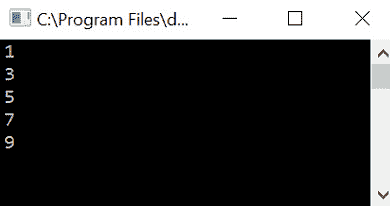
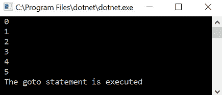
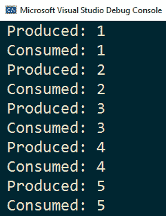
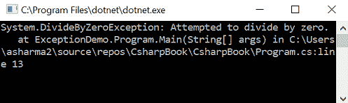
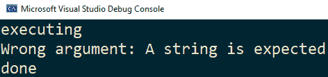

# *第三章*:控制语句和例外

在前一章中，我们讨论了 c#中的数据类型和操作符。 在本章中，我们将探索 c#中的控制语句。 控制语句允许我们在代码中实现有条件的执行路径。 我们还将学习如何实现异常处理，这将帮助我们处理在执行应用程序时可能发生的错误。

在本章中，我们将涵盖以下概念:

*   控制语句
*   异常处理

在本章结束时，我们将看到如何实际地实现这些语句和子句。 让我们通过示例详细了解每一个主题。

# 理解控制语句

控制语句允许我们控制程序的执行流程。 它们还允许我们基于特定的条件执行特定的代码块。 c#定义了三种类型的控制语句，如下所述:

*   **选择语句**:**if**and**switch**
*   **迭代语句**:**for**，**while**，**do-while**，and**foreach**
*   **跳跃语句**:**break**，**continue**，**goto**，**return**，and**yield**

我们将在下面几节中详细探讨这些语句。

## 选择语句

选择语句允许我们根据条件是否为真来更改执行流。 c#提供了两种类型的选择语句:**if**and**switch**。

### if 语句

下面的片段展示了**if**语句的语法:

```cs
if (condition1)
    statement1;
else if(condition2)
    statement2;
else
    statement3;
```

如果**condition1**结果为**true**，则将执行**statement1**。 否则，如果**condition2**计算结果为**true**，则将执行**statement2**。 否则，将执行**语句 3**。

**else-if**和**else**子句为*可选*，其中一个或两个都可以*省略*。 另一方面，你可以有任意多的**else-if**子句。

在本例中，对于**if**和**else**子句，我们只需要执行一条语句。 如果我们必须执行一系列语句，我们需要添加花括号(**{}**)使其成为一个块。 这对于单个语句是可选的，尽管它通常是使代码更清晰或更不易出错的好方法。 在这种情况下，语法将改变如下:

```cs
if (condition)
{
  statement 1;
  statement 2;
}
else
{
  statement 3;
  statement 4;
}
```

如果**条件**结果为**true**，则**statement1**和**statement2**都将被执行。 否则，将执行**语句 3**和**语句 4**。 让我们试着通过下面的代码片段来理解**if-else**语句:

```cs
class Program
{
    static void Main(string[] args)
    {
        Console.WriteLine("Enter a positive integer");
        var line = Console.ReadLine(); 
        int.TryParse(line, out int number);
        if (number % 2 == 0)
        {
            Console.WriteLine("Even number");
        }
        else
        {
            Console.WriteLine("Odd number");
        }
    }
}
```

前面的程序检查一个正整数是偶数还是奇数。 我们从控制台读取一个整数作为输入。 由于在控制台上输入的值被认为是字符串，我们需要将其转换为整数。 然后应用模(**%**)运算符，求出**2**除法的余数。 如果余数为**0**，则为*偶数*;如果余数为*奇数*。

**if**语句可以嵌套。 我们可以将一个**if**语句放入另一个**if**或**else**语句中。 下面的语法显示了嵌套的**if**语句的示例:

```cs
if (condition1)
{
  if(condition2)
      statement 1;
  if(condition3)
      statement 2;
  else
      statement 3;
}
else
{
  if(condition4)
      statement 4;
  else
      statement 5;
}
```

在这个例子中,如果**condition1【】对**真正的**,然后控制将进入**如果**块和基于评估的执行该语句的嵌套**如果语句。 如果**condition1**为**false**，则将执行**else**子句中嵌套的**If**语句。****

 **在嵌套的**if**语句中，每个**else**子句属于最后一个没有相应的**else**语句的**if**语句。 为了避免混淆和错误，建议您在嵌套**if**语句时使用花括号，以正确地配对**if**和**else**子句。 以下面的例子为例:

```cs
if(condition1)
    if(condition2)
        statement1;
    else
        statement2;
```

上述示例与以下示例不同:

```cs
if(condition1)
{
    if(condition2)
        statement1;
}
else
{
    statement2;
}
```

在第一个例子中，**else**子句属于第二个，内部的**if**子句。 另一方面，在第二个例子中，**else**子句属于第一个在外面的**if**子句。

### switch 语句的

**开关**语句为提供了一种从几个可用的替代语句中执行一组指令的方法。 它将一个表达式的值与一个可用值列表相匹配。 如果找到匹配，则执行与该值关联的代码。

**switch**语句是级联**if-else-if**语句的替代品。 如果匹配的数量很少，那么可以使用**If**语句。 然而，如果匹配条件的数量较大，则首选**switch**语句而不是**if**语句，因为其可读性和可维护性更好。

**switch**语句的语法如下:

```cs
switch (expression)
{
  case value1:
    statement 1;
    break;
  case value2:
    statement 2;
    statement 3;
    break;
  default:
    statement 4;
    break;
}
```

一个**switch**语句包含一个或多个节，每个节有一个或多个**case**标签。 每个**case**标签可以有一个或多个语句。 每个**case**标签指定一个值，该值将与**switch**表达式匹配。 如果找到匹配，控件将被转移到匹配的**case**标签。

**case**标签中的语句将被执行，直到遇到**break**语句。 如果没有找到匹配，控件将转到**默认**案例。 在执行特定的**case**标签后，控件将退出开关。 默认的**大小写是可选的。 如果没有**默认的**case 存在，并且没有为任何 case 标签找到匹配，控件将落在**switch**语句之外。**

注意，我们没有在 case 标签中使用花括号**({})**。 默认的**case**可以出现在列表的任何位置。 它总是在所有的**病例**标签被评估后进行评估。

您可以将多个 case 标签放在同一开关部分; 在这种情况下，任何 case 标签的匹配都将触发 switch 部分的执行。 在一个**switch**语句中，只能执行一个 switch 节。 从一个地方到另一个地方是不可能的。 每个**switch**语句后面必须跟着一个**break**，**goto**，或者**return**语句。

下面的示例显示了带有多个开关段的**开关**语句，其中一些带有多个**case**标签。 与您通常所做的一样，将**默认的**大小写放在最后。 每个 section用**break**语句退出:

```cs
Console.WriteLine("Enter number (1-10)");
var line = Console.ReadLine();
int.TryParse(line, out int number);
switch(number)
{
   case 1:
      Console.WriteLine("Smallest number");
      break;
   case 2: case 3: case 5: case 7:
      Console.WriteLine("Prime number");
      break;
   case 4: case 6: case 8:
      Console.WriteLine("Even number");
      break;
   case 9:
      Console.WriteLine("Odd number");
      break;
   default:
      Console.WriteLine("Not in the range");
      break;
}
```

**开关**语句支持各种形式的模式匹配。 然而,这是一个更高级的主题,将详细的[*第八章*](08.html#_idTextAnchor154),*高级主题【显示】,在[*第 15 章*【病人】,*新特性的 c# 8*。](15.html#_idTextAnchor271)*

## 迭代语句

迭代语句允许我们在满足条件时在循环中执行一组代码。 c#为我们提供了四种不同类型的循环:

*   **for**
*   **while**
*   **do-while**
*   **foreach**

让我们来详细探讨一下。

### for 循环

循环的**允许我们执行一个代码块，只要一个布尔表达式将计算为**true**。 下面的代码片段显示了**循环的**的一般语法:**

```cs
for(initializer; condition; iterator)
{
    statement1;
    statement2;
}
```

**初始化器**部分由一个或多个初始化语句组成，用于初始化计数器以控制循环。 在第一次进入循环之前只执行一次。 如果在**初始化式**部分中有多个语句，它们必须用逗号分隔。 然而，**初始化器**部分是*可选的，可以保留为空*。

循环控制计数器也称为循环控制变量。 该变量是循环的局部变量，不能在循环的**范围之外访问。**

**条件**是一个布尔表达式，它将决定循环是否执行。 它将对循环的每次迭代进行计算。 如果它的计算结果为**true**，循环将被执行。 一旦布尔条件计算结果为**false**，循环将终止，程序控制将退出循环。 这个语句是可选的，可以保留为空。

**迭代器**是一个表达式，用于在每次循环迭代后更改(递增/递减)循环控制变量。 它可以有多个用逗号分隔的语句。 这个语句也是*可选的，并且可以保留为空*。 事实上，这三个语句(**初始化器**、**条件**和**迭代器**)都可以省略，在这种情况下，我们将得到一个无限循环，如下代码片段所示:

```cs
for(;;)
{
    /* infinite loop, unless a break, goto, return, or throw
    executes */
}
```

循环的**是一个入口控制循环，这意味着在进入循环之前将计算布尔条件。 如果条件在第一次迭代中计算结果为**false**，那么循环中的代码块将根本不执行。**

让我们通过下面的代码片段来理解循环的**:**

```cs
for (int i = 0; i <= 10; i++)
{
    if (i % 2 == 0)
    {
        Console.WriteLine($"{i} is an even number");
    }
    else
    {
        Console.WriteLine($"{i} is an odd number");
    }
}
```

这里，我们为循环运行**来检查**0、**和**10**之间的整数是偶数还是奇数。 当你执行这段代码时，你会看到如下输出屏幕:**


图 3.1 -显示前面代码片段输出的控制台屏幕截图

我们还可以将循环中的**放入**循环中的另一个**中。 在这种情况下，内部循环将在外部循环的每次迭代中完全执行。 看看下面的代码片段。 在这里,所有的**的**j 值变量(即**1**和【显示】2**)将打印的每个值**我**变量(也就是说,【病人】1,**2**,【t16.1】3,和**4):**

```cs
for (int i = 1; i < 5; i++)
{
   for (int j = 1; j < 3; j++)
   {
      Console.WriteLine($"i = {i},j = {j}");
   }
}
```

程序执行后，可以看到如下输出:


图 3.2 -执行前一个代码片段的控制台输出

循环的嵌套**的一个典型例子是多维数组遍历。 在下面的例子中，我们在声明时初始化了一个三行两列的整数数组。** 循环的嵌套**用于将其元素的值打印到控制台:**

```cs
var arr = new int[3, 2] { { 1, 2, }, { 3, 4 }, { 5, 6 } };
for (int r = 0; r <= arr.GetUpperBound(0); r++)
{
    for (int c = 0; c <= arr.GetUpperBound(1); c++)
    {
        Console.Write($"{arr[r, c]} ");
    }
    Console.WriteLine();
}
```

注意，我们使用了**GetUpperBound()**方法来检索指定维度的最后一个元素的索引，以避免对数组的大小进行硬编码。

您可以退出循环迭代,同时条件仍然是真正的**使用**,**goto**,**返回【显示】,**或**把语句。 您可以使用**continue**语句跳过当前迭代的循环块的执行。 这也适用于其他循环——**而**，**做**，以及**foreach**。 **跳**语句将在本章后面详细探讨。******

while 循环

**而**回路为*入路控制回路*。 只要指定的布尔表达式的计算结果为**true**，它就执行一个语句块。 **while**循环的语法如下:

```cs
while (condition)
{
    statement1;
    statement2;
}
```

这里，**条件**是一个布尔表达式，它控制循环。 当**条件**计算结果为**true**时，循环内的代码块将被执行。 当**条件**变为**false**时，程序控制将掉出循环。 因为**条件**首先被评估，如果**条件**最初为**false**，则**while**循环可能根本不执行。

**while**循环与循环中的**非常相似。 事实上，您可以将任何**while**循环重写为**for**循环，反之亦然。 在下面的代码片段中，您可以看到如何使用**while**循环重新改写**for**循环的语法:**

```cs
initializer;
while(condition)
{
    statement1;
    statement2;
    iterator;
}
```

在下面的代码片段中，我们重写了上一个会话中的示例，通过**while**循环将偶数和奇数打印到控制台:

```cs
int i = 0;
while (i <= 10)
{
    if (i % 2 == 0)
    {
        Console.WriteLine($"{i} is an even number");
    }
    else
    {
        Console.WriteLine($"{i} is an odd number");
    }
    i++;
}
```

程序执行的结果没有改变。 事实上，还有另外一种方法可以达到同样的效果，那就是使用**do**语句。

### 延伸的循环

**do-while**循环是一个*出口控制循环*。 这意味着布尔条件将在循环的末尾进行检查。 这确保了**do-while**循环将总是至少被执行一次，即使条件在第一次迭代中计算为**false**。 这就是**while**和**do-while**循环之间的关键区别; 前者可能根本不执行，但后者总是至少执行一次。

**do-while**循环的语法如下:

```cs
do
{
    statement1;
    statement2;
} while (condition);
```

在下面的代码片段中，我们使用**do-while**循环打印**0**和**10**之间的所有数字，指定哪些是奇数，哪些是偶数。 这段代码将具有与**while**循环相同的输出:

```cs
int i = 0;
do
{
    if (i % 2 == 0)
    {
        Console.WriteLine($"{i} is an even number");
    }
    else
    {
        Console.WriteLine($"{i} is an odd number");
    }
    i++;
}
while (i <= 10);
```

到目前为止我们所了解的循环允许我们重复执行一个或多个语句，例如基于索引遍历集合的元素。 另一种类型的循环语句，如**foreach**，简化了迭代，适用于所有我们感兴趣的元素而不是索引的情况。 下面让我们来看看**和**。

### foreach 循环

**foreach 循环允许我们遍历集合的项目实现**System.Collections.IEnumerable**或**System.Collections.Generic.IEnumerable<>**界面。 [*第七章*](07.html#_idTextAnchor134)，*集*详细讨论。**

**foreach**循环的语法如下:

```cs
foreach(datatype iterator in collection)
{
  statement1;
  statement2;
}
```

这里，**数据类型**表示 c#中的有效类型，它必须与集合的数据类型相同，或者是存在隐式转换的类型。 您还可以使用**var**来代替实际的类型名，在这种情况下，编译器将从集合元素的类型推断出**迭代器**变量的类型。

**迭代器**变量是一个循环迭代变量。 **foreach**循环中的循环迭代变量是只读的。 这意味着我们不能在循环体中改变它的值。 在循环的每次迭代中，迭代器从集合中分配一个值。 当集合的所有元素都被迭代后，循环退出。 还可以使用**break**、**goto**、**return**或**throw**语句退出循环。

让我们在以下代码片段的帮助下看看**foreach**循环:

```cs
string[] languages = { "Java", "C#", "Python", "C++", "JavaScript" };
foreach (string lang in languages)
{
    Console.WriteLine(lang);
}
```

在本例中，我们使用定义了一个包含编程语言列表的字符串数组。 我们使用了**foreach**循环来遍历该数组并在控制台上打印数组的每个元素。 这段代码的输出如下截图所示:


图 3.3 -使用 foreach 语句将字符串数组的内容输出到控制台

前面的**foreach**语句在语义上等价于以下语句:

```cs
var enumerator = languages.GetEnumerator();
while(enumerator.MoveNext())
{
    Console.WriteLine(enumerator.Current);
}
```

集合类型未必实现**IEnumerable**或**【病人】IEnumerable T>**界面,但是它必须有一个公共方法叫做**GetEnumerator()**,无参数并返回一个类,结构体,或接口, 并且返回类型包含一个名为**Current**的公共属性和一个名为**MoveNext()**的公共无参数方法，该方法返回**bool**。

如果当前**属性枚举器的类型返回一个引用返回值(c# 7.3)成为可能,然后您可以声明迭代变量**ref**或**ref 只有**修饰符。 下面的代码片段中显示了一个例子:**

```cs
Span<int> arr = stackalloc int[]{ 1, 1, 2, 3, 5, 8 };
foreach(ref int n in arr)
{
    n *= 2;
}
foreach(ref readonly var n in arr)
{
    Console.WriteLine(n);
}
```

这里，**arr**变量是**System。 Span<int>** 其**GetEnumerator()**方法的返回类型为**Span<T>. enumerator**，满足上述条件。 第一个**foreach**循环遍历数组的元素(一个**stackalloc**数组在堆栈上分配，并在函数调用返回时处理)，并且将每个元素的初始值加倍。 第二个**foreach**循环再次遍历元素，但以只读方式执行。 在只读循环中试图更改迭代器变量的值将导致编译器错误。

## 跳跃语句

跳转语句允许立即将控件从转移到应用程序中的另一个点。 c#为我们提供了五种不同的跳转语句:

*   **break**break
*   **继续**
*   **to**
*   **return**
*   **产量**

我们将在下面几节中详细探讨它们。

### 打破语句

我们已经看到了如何使用**打破**以退出**开关**情况。 我们还可以使用**break**语句来终止循环的执行。 一旦程序控件在循环中遇到**break**语句，循环立即终止，控件退出循环。

看看下面的代码片段:

```cs
for (int i = 0; i <= 10; i++)
{
    Console.WriteLine(i);
    if (i == 5)
        break;
}
```

这里，我们从**0**迭代到**10**，并将当前值写入控制台。 如果循环控制变量的值变为**5**，则循环将中断，不再将任何元素打印到控制台。 虽然循环预计要运行 10 次，但**break**语句使其在迭代器的值变为**5**时立即终止。 执行后，可以看到如下输出:


图 3.4 -显示前面代码片段输出的控制台屏幕截图

**break**语句并不是唯一可以控制循环执行的语句。 另一个是**继续**，我们将在下一节中讨论。

### 继续声明

**继续**声明将控制传递给下一个迭代的封闭循环,是它为**,**,**【显示】,**或**foreach。 它用于在当前迭代中终止循环体的执行，并跳转到下一个迭代。 **continue**语句不确定循环语句的返回，但只中止当前迭代的执行，并将控制移动到循环条件的求值处。******

看看下面的代码片段:

```cs
for (int i = 0; i <= 10; i++)
{
    if (i % 2 == 0)
        continue;
    Console.WriteLine(i);
}
```

在本例中，我们从**0**迭代到**10**; 如果值为偶数，则跳过当前迭代循环并继续进行下一个迭代。 这个代码只打印在**0**和**10**之间的奇数。 输出如下:



图 3.5 -前一个代码片段的输出向控制台输出小于 10 的奇数

**break**和**continue**语句控制循环的执行。 下一条语句用于结束函数的执行。

### 的返回语句

**return**语句终止当前执行流，并将控制返回给调用方法。 可选地，我们也可以返回一个值给调用方法。 如果方法定义了返回类型，则需要返回一个值。 否则，当返回类型为 void 时，可以不指定任何值返回。

下面的例子展示了一个返回第 n 个斐波那契数的函数的可能实现:

```cs
static int Fibonacci(int n)
{
    if (n > 1)
        return Fibonacci(n - 1) + Fibonacci(n - 2);
    else
        return n;
}
```

**return**语句触发当前函数执行的停止，并将控件返回给调用函数。

### goto 语句

**goto**语句是一个无条件跳转语句。 当程序控件遇到**goto**语句时，它将跳转到其指定的位置。 **goto**的目标是使用*标签*指定的，该标签是一个带冒号的标识符(**:**)。 我们还可以使用**goto**从循环中退出。 在本例中，它的行为类似于**break**语句。

考虑以下代码片段:

```cs
for (int i = 0; i <= 10; i++)
{
    Console.WriteLine(i);
    if (i == 5)
    {
        goto printmessage;
    }
}
printmessage:
    Console.WriteLine("The goto statement is executed");
```

在本例中，我们从**0**迭代到**10**。 如果迭代器的值变为**5**，我们将使用**goto**语句跳出循环。 这个代码片段的输出如下所示:



图 3.6 -上述代码片段的控制台输出

**goto**语句的使用通常被作为一种良好的编程实践加以避免，因为它可能导致代码非结构化且难以维护。

### 收益率的声明

**yield**是上下文关键字(也就是说，在代码中提供特定含义的单词，而没有作为保留单词)。 它表明，出现在**return**或**break**语句之前的方法、操作符或**get**访问器是一个迭代器。 迭代器方法返回的序列可以使用**foreach**语句来使用。 **yield**语句可以在生成值时返回值，在可用时使用它们，这在异步上下文中特别有用。

为了更好地理解**yield**的用法，让我们考虑下面的例子。 我们有一个函数，我们称之为**GetNumbers()**，它返回一个集合，其中包含从**1**到**100**的所有数字。 一个可能的实现如下所示:

```cs
IEnumerable<int> GetNumbers()
{
    var list = new List<int>();
    for (int i = 1; i <= 100; ++i)
    {
        list.Add(i);
    }
    return list;
}
```

这种实现的问题是，我们不能在生成所有数字之前使用这些数字。 一方面，在一个真实的例子中，这可能是很耗时的，我们可能想要消费产生的数字。 另一方面，我们可能只对其中的一些数字感兴趣，而不是所有的数字。

有了这个实现，我们必须首先生成所有这些，然后才能使用我们需要的那些。 在下面的示例中，我们只将前 5 个数字打印到控制台:

```cs
var numbers = GetNumbers().Take(5);
Console.WriteLine(string.Join(",", numbers));
```

一个**yield return**语句会在项目可用时立即返回它。 它是创建迭代器的简写，这会使代码更加费力。

**GetNumbers()**的实现将会改变如下:

```cs
IEnumerable<int> GetNumbers()
{
   for (int i = 1; i <= 100; ++i)
   {
      yield return i;
   }
}
```

我们返回每个可用的数字，并且只在遍历枚举器时执行此操作，例如使用**foreach**语句。 前面的示例将前 5 个数字打印到控制台，保持不变。 然而，执行是不同的，因为循环的**中只执行了 5 次迭代。**

为了更好地理解这一点，让我们修改一下示例，以便在每个条目分别产生和消费之前，向控制台显示一条消息:

```cs
IEnumerable<int> GetNumbers()
{
    for (int i = 1; i <= 100; ++i)
    {
        Thread.Sleep(1000);
        Console.WriteLine($"Produced: {i}");
        yield return i;
    }
}
foreach(var i in GetNumbers().Take(5))
{
    Console.WriteLine($"Consumed: {i}");
}
```

调用**Thread.Sleep()**来模拟产生下一个数字时的一秒延迟。 执行此代码的结果如下图所示:



图 3.7 -执行上述代码的结果

现在我们已经了解了如何从代码的正常执行中返回，让我们快速地看一下，当代码执行期间发生意外错误时，我们如何处理异常情况。

# 异常处理

在某些情况下，我们的代码会产生错误。 错误的发生可能是由于代码中的逻辑问题，例如试图除以 0 或访问数组中超出数组边界的元素。 例如，试图访问大小为 3 的数组中的第四个元素。 外部因素也可能导致错误，例如试图读取磁盘上不存在的文件。

c#为我们提供了一个内置的异常处理机制来在代码级别上处理这些类型的错误。 异常处理的语法如下:

```cs
try
{
    Statement1;
    Statement2;
} 
catch (type)
{
    // code for error handling
}
finally
{
    // code to always run at the end
}
```

**try**块可以包含一个或多个语句。 **catch**块包含错误处理代码。 **finally**块包含将在**try**部分之后执行的代码。 这种情况不管执行恢复正常,或控制了【显示】试块,因为**,【病人】继续,**goto**,或【t16.1】返回语句。**

 **如果发生了异常并且存在**catch**块，则也保证执行**finally**块。 如果未处理异常，则**finally**块的执行取决于异常 unwind 操作是如何触发的，这取决于正在运行的机器是如何设置的。 最后**块是可选的。**

在执行时，程序控制将执行**try**块中的代码。 如果在**try**块中没有发生错误，则正常地继续执行，并将控制转移到**最后**块(如果存在的话)。 当**try**块内发生异常时，程序控制将转移到**catch**块(如果存在的话)。 在执行**catch**块之后，程序控制将转移到最后的**块，如果它存在的话。**

 **同一个**try**块可能存在多个**catch**子句。 它们的排列顺序很重要，因为它们是按照给定的顺序计算的。 这意味着应该在更一般的异常之前捕获更具体的异常。 为了捕获所有异常，可以指定一个没有异常类型的**catch**子句。 但是，这被认为是一种非常糟糕的实践，因为您应该只捕获您知道如何处理和恢复的异常。

当发生异常时，**公共语言运行时**(**CLR**)检查当前执行的方法中是否存在**catch**块来处理该异常。 如果不存在，它会在调用当前方法的方法中查找，以此类推。 如果没有找到匹配的**catch**块，则显示未处理的异常消息，并中止程序的执行。

让我们试着在以下代码片段的帮助下理解异常处理:

```cs
class Program
{
    static void Main(string[] args)
    {
        try
        {
            int a = 10;
            int b = a / 0;
        }
        catch (Exception ex)
        {
            Console.WriteLine(ex);
        }
    }
}
```

这里，我们试图模拟*除以零误差*。 当在**try**块中发生错误时，它将创建**Exception**类的实例并抛出异常。 在**catch**块中，我们指定了一个**Exception**类型的实参。 该异常为我们提供了错误消息，还提供了关于错误发生的位置(文件名和路径)以及调用堆栈的信息。

如果我们只想要与异常关联的消息，可以使用**exception**类的**message**属性。 这个代码片段的输出如下:



图 3.8 -控制台显示一个除以零异常的消息

使用**throw**语句抛出异常。 您必须指定**系统的一个实例。 异常**类或其派生类。 课程将讨论在第四章*,*理解各种用户定义类型*,在【显示】*和继承第五章*,【病人】用 c#面向对象编程,但暂时记住有许多异常类型和他们都是基于**系统。** 。 **throw**语句可以在不带任何实参的**catch**块中使用，重新抛出异常，保留调用堆栈。 当您希望在发生异常的情况下做一些事情(例如日志记录)，但又希望将异常转发到另一个地方进行完全处理时，这很有用。*

 *在下面的示例中，一个名为**FunctionThatThrows()**的函数执行了一些操作，但不是在检查其输入参数之前。 如果**对象**参数为**null**，则抛出一个**ArgumentNullException**类型的异常。 但是，如果参数不是 null，而是**string**以外的类型，则抛出一个**ArgumentException**类型的异常。 这是**ArgumentNullException**的基类。 当调用方法时，我们捕获多种异常类型:

*   **ArgumentNullException**
*   **ArgumentException**
*   **例外**

顺序很重要，因为它从最派生的类开始，以所有异常的基类结束。 一个**finally**块用于在执行结束时显示一条消息:

```cs
void FunctionThatThrows(object o)
{
    if (o is null)
        throw new ArgumentNullException(nameof(o));
    if (!(o is string))
        throw new ArgumentException("A string is expected");
    // do something
}
try
{
    Console.WriteLine("executing");
    FunctionThatThrows(42);
}
catch (ArgumentNullException e)
{
    Console.WriteLine($"Null argument: {e.Message}");
}
catch (ArgumentException e)
{
    Console.WriteLine($"Wrong argument: {e.Message}");
}
catch(Exception e)
{
    Console.WriteLine($"Error: {e.Message}");
}
finally
{
    Console.WriteLine("done");
}
```

该程序执行的输出如下:



图 3.9 -执行前一个代码片段时的控制台输出

f 异常处理将在[*第 14 章*](14.html#_idTextAnchor253)，*错误处理*中详细讨论。 如果你现在想了解更多关于异常的知识，你可以在继续下一章之前阅读本章。

# 总结

在本章中，我们探讨了 c#中的控制语句。 我们通过示例了解了不同类型的循环和跳转语句是如何工作的。 我们还简要介绍了如何抛出和捕获异常。

在下一章中，我们将研究用户定义的类型，并探索类中包含哪些字段、属性、方法、索引器和构造函数。

# 测试你所学的内容

1.  c#语言中有哪些选择语句?
2.  在哪里可以出现**switch**语句的默认情况，以及在什么时候执行?
3.  的**和**的**的区别是什么?**
4.  **while**和**do-while**的区别是什么?
5.  什么语句可以用来从函数返回?
6.  在什么地方可以使用**换行**语句，它是如何工作的?
7.  **生成**语句做什么?在哪些场景中使用它?
8.  如何捕获函数调用中的所有异常?
9.  最后的**块做什么?**
***   .NET 中所有异常的基类是什么?*********