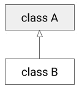
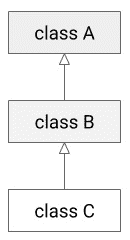
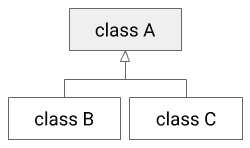

# 五、C# 中的面向对象编程

在前一章中，我们介绍了用户定义的类型并学习了类、结构和枚举。 在本章中，我们将学习面向对象编程**(或简称**OOP**)。 对 OOP 概念的良好理解对于使用 C# 编写更好的程序至关重要。 OOP 降低了代码复杂性，增加了代码的可重用性，并使软件易于维护和扩展。**

 **我们会详细介绍以下概念:

*   理解面向对象
*   抽象
*   封装
*   继承
*   多态性
*   坚实的原则

在本章结束时，您将学习如何使用 OOP 创建类和方法。 让我们从 OOP 的概述开始。

# 理解 OOP

面向对象编程是一种范例，它允许我们围绕对象编写程序。 如前一章的所述，对象包含数据和对数据进行操作的方法。 每个对象都有自己的一组数据和方法。 如果一个对象想要访问另一个对象的数据，它必须通过该对象中定义的方法来访问它。 一个对象可以使用**继承**的概念继承另一个对象的属性。 因此，我们可以说面向对象编程是围绕数据和允许对数据进行的操作来组织的。

C# 是一种通用的多范式编程语言。 OOP 只是这些范例之一。 其他支持的范例，如泛型和函数式编程，将在后面的章节中讨论。

在讨论面向对象编程时，理解类和对象之间的区别是很重要的。 如前一章所述，类是一个蓝图，它定义了数据以及如何在内存中表示数据，以及操作这些数据的功能。 另一方面，对象是根据蓝图构建和运行的类的实例。 与只存在于源代码中的类不同，它在内存中有一个物理表示。

在进行面向对象编程时，首先要确定需要操作的实体、它们之间的关系以及它们之间的交互方式。 这个过程被称为**数据建模**。 其结果是一组类，概括了所标识的实体。 它们可以从物理实体(人、对象、机器等等)到抽象(订单、待办事项列表、连接字符串等等)。

抽象、封装、多态和继承是面向对象编程的核心原则。 我们将在本章中详细探讨它们。

# 抽象

抽象是用简单的术语描述实体和过程，去除非本质特征的过程。 一个物理的或抽象的实体可能有许多特性，但是对于某些应用或领域来说，并不是所有的特性都是重要的。 通过将实体抽象为简单的模型(对应用领域有意义)，我们可以构建更简单、更有效的程序。

让我们考虑一个雇员的例子。 雇员是一个人。 一个人有名字; 一个生日; 身体特征，如身高、体重、发色、眼睛颜色; 亲戚和朋友; 爱好和爱好(如食物、书籍、电影和运动); 一个地址; 财产(如房子或公寓、汽车或自行车); 一个或多个电话号码和电子邮件地址; 还有很多其他的东西我们可以写在列表里。

根据我们正在构建的应用的类型，有些是相关的，有些是不相关的。 例如，如果我们构建一个工资单系统，我们将对员工的姓名、生日、地址、电话和电子邮件以及雇佣日期、部门、角色、薪水等感兴趣。 如果我们构建一个社交媒体应用，我们会对用户的姓名、生日、地址、亲戚、朋友、兴趣、活动等等感兴趣。

有时，需要不同的抽象级别—一些更一般，另一些更特殊。 例如，如果我们构建一个可以绘制形状的图形系统，我们可能需要建模一个具有很少功能的通用形状，例如绘制自身或转换(平移和旋转)自身的能力。 然后我们可以有二维形状和三维形状，每一个都有基于这些形状特征的更具体的属性和功能。

我们可以构建直线、椭圆和多边形作为二维形状。 一条线有一些属性，比如起点和终点，但椭圆有两个焦点，还有一个面积和一个周长。 三维物体，比如立方体，可以投射阴影。 虽然我们仍然在抽象概念，但我们已经从更一般的抽象转移到更特殊的抽象。 当这些抽象彼此基于时，实现它们的典型方法是通过继承。

# 封装

封装定义为绑定数据和在单个单元中操作数据的代码。 数据被私有地绑定在一个类中，不需要从类的外部直接访问。 所有需要读取或修改对象数据的对象都应该通过类提供的公共方法来完成。 这个特性被称为**数据隐藏**，通过定义对象数据的有限数量的入口点来减少代码的错误倾向。

让我们来看看**Employee**这门课:

```cs
public class Employee
{
    private string name;
    private double salary;
    public string Name
    {
        get { return name; }
        set { name = value; }
    }
    public double Salary
    {
        get { return salary; }
    }
    public Employee(string name, double salary)
    {
        this.name = name;
        this.salary = salary;
    }
    public void GiveRaise(double percent)
    {
        salary *= (1.0 + percent / 100.0);
    }
}
```

一个员工有两个属性:**名称**和**薪水**。 这些字段被实现为**private**类字段，这使得它们只能从**Employee**类中访问。 这两个值都在构造函数中设置。 使用名为**name**的属性公开该名称以供读写。 然而，**salary**变量仅用于读取，其只读属性为**salary**。 要改变工资，我们必须调用**GiveRaise()**方法。 当然，这只是一种可能的实现。 我们可以使用自动实现的属性而不是字段，或者使用不同的其他方法来修改工资。 这个类可以如下使用:

```cs
Employee employee = new Employee("John Doe", 2500);
Console.WriteLine($"{employee.Name} earns {employee.Salary}");
employee.GiveRaise(5.5);
Console.WriteLine($"{employee.Name} earns {employee.Salary}");
```

我们已经创建了**Employee**类的对象，并使用构造函数将值设置为私有字段。 **Employee**类不允许直接访问其字段。 要读取它们的值，我们使用公共属性的公共访问器**get**。 改变工资，我们使用**GiveRaise()**方法。 该程序的输出如下所示:


图 5.1 -执行前面代码片段的控制台输出

封装允许我们将数据隐藏在类内部，不让外界知道，这就是为什么它也被称为数据隐藏。

封装很重要，因为它通过为不同组件定义最小公共接口来减少它们之间的依赖关系。 它还提高了代码的可重用性和安全性，并使代码更容易进行单元测试。

# 遗传

继承是一种机制，通过它一个类可以继承另一个类的属性和功能。 如果我们有一组在多个类之间共享的公共功能和数据，我们可以将它们放在一个类中，即**父类**或**基类**。 其他类可以继承父类的这些功能和数据，并扩展或修改它们，并添加额外的功能和属性。 从另一个类继承的类被称为**子类**或**派生的**类。 因此，继承促进了*代码的重用*。

在 C# 中，引用类型只支持继承。 只有定义为类的类型才能从其他类型派生。 定义为结构的类型是值类型，不能从其他类型派生。 然而，C# 中的所有类型要么是值类型，要么是引用类型，并且间接派生自**系统。 对象**类型。 这种关系是隐含的，不需要开发人员做任何特殊的事情。

在 C# 中有三种类型的继承:

*   **单继承**:当一个类从一个父类继承时。 子类不应该作为任何其他类的父类。 参考下图，其中类 B 继承了类 A:



图 5.2 -类图显示类 B 从类 A 继承

*   **多层继承**:这实际上是对前一种情况的扩展，因为从另一方面来说，子类是另一个类的父类。 在下面的图中，类 B 是类 a 的子类，也是类 C 的父类:



图 5.3 -类图显示类 A 是类 B 的基类，而类 B 又是类 C 的基类

*   **层次继承**:一个类作为多个类的父类。 参考下图。 这里，类 B 和 C 继承自相同的父类 A:



图 5.4 -类图显示类 B 和 C 继承自基类 A

与其他编程语言(如 c++)不同，C# 不支持多重继承。 这意味着一个类不能从多个类派生。

为了理解继承，让我们考虑以下例子:我们正在构建一个必须表示对象的游戏，例如地形、障碍、人、机器等等。 这些是具有不同属性的各种类型的对象。 例如，人和机器可以移动和战斗，障碍可以被摧毁，地形可以通过或不可通过，等等。 然而，所有这些游戏对象都有一些共同的属性:它们在游戏中都有一个位置，它们都可以绘制在一个表面上(可以是屏幕、内存等)。 我们可以用如下方式表示一个提供这些功能的基类:

```cs
class GameUnit
{
    public Position Position { get; protected set; }
    public GameUnit(Position position)
    {
        Position = position;
    }
    public void Draw(Surface surface)
    {
        surface.DrawAt(GetImage(), Position);
    }
    protected virtual char GetImage() { return ' '; }
}
```

**游戏单元**是一个带有**Position**属性的类; 访问器**get**是公共的，但是访问器**set**是受保护的，这意味着只能从这个类或其派生类访问它。 **Draw()**公共方法在当前单元位置的表面上绘制单元。 **GetImage()**是一个虚拟方法，返回单元的表示(在我们的示例中，是单个字符)。 在基类中，这只是返回一个空格，但在派生类中，这将被实现为返回一个实际字符。

这里看到的**Position**和**Surface**类实现如下:

```cs
struct Position
{
    public int X { get; private set; }
    public int Y { get; private set; }
    public Position(int x = 0, int y = 0)
    {
        X = x;
        Y = y;
    }
}
class Surface
{
    private int left;
    private int top;
    public void BeginDraw()
    {
        Console.Clear();
        left = Console.CursorLeft;
        top = Console.CursorTop;
    }
    public void DrawAt(char c, Position position)
    {
        try
        {
            Console.SetCursorPosition(left + position.X, 
                                      top + position.Y);
            Console.Write(c);
        }
        catch (ArgumentOutOfRangeException e)
        {
            Console.Clear();
            Console.WriteLine(e.Message);
        }
    }
}
```

从基类派生出其他几个类。 为了简单起见，我们暂时将关注地形对象:

```cs
class Terrain : GameUnit
{
    public Terrain(Position position) : base(position) { }
}
class Water : Terrain
{
    public Water(Position position) : base(position) { }
    protected override char GetImage() { return '░'; }
}
class Hill : Terrain
{
    public Hill(Position position) : base(position) { }
    protected override char GetImage() { return '≡'; }
}
```

我们在这里定义了一个地形类，从**GameUnit**衍生而来，它本身是所有地形类型的基类。 我们在这个类中没有很多东西，但是在实际的应用中，会有各种各样的功能。 **Water**and**Hill**是由**Terrain**衍生而来的两个类，它们覆盖了**GetImage()**类，返回一个不同的字符来代表地形。 我们可以使用以下这些元素去创造一款游戏:

```cs
var objects = new List<v1.GameUnit>()
{
    new v1.Water(new Position(3, 2)),
    new v1.Water(new Position(4, 2)),
    new v1.Water(new Position(5, 2)),
    new v1.Hill(new Position(3, 1)),
    new v1.Hill(new Position(5, 3)),
};
var surface = new v1.Surface();
surface.BeginDraw();
foreach (var unit in objects)
    unit.Draw(surface);
```

该程序的输出如下截图所示:


图 5.5 -执行前一个程序的控制台输出

## 虚拟会员

在前面的例子中，我们看到了一个虚方法。 这是一个在基类中有实现的方法，但可以在派生类中重写，这有助于更改实现细节。 方法在默认情况下是非虚拟的。 基类中的虚方法是用**虚**关键字声明的。 派生类中虚拟方法的重写实现是用**override**关键字定义的，而不是用**virtual**关键字。 虚方法和重写方法的方法签名必须匹配。

方法不是唯一可以是虚的类成员。 虚拟的**关键字可以应用于属性、索引器和事件。 然而，**虚拟**修饰符不能与**静态**、**抽象**、**私有**或**覆盖**修饰符一起使用。**

 **在派生类中重写的虚成员可以在派生类的派生类中进一步重写。 除非使用**封闭的**关键字显式地停止，否则虚拟继承链将无限期地继续下去，如后面一节所述。

前面显示的类可以修改为使用虚拟属性**Image**，而不是虚拟方法**GetImage()**。 在这种情况下，它们将如下所示:

```cs
class GameUnit
{
    public Position Position { get; protected set; }
    public GameUnit(Position position)
    {
        Position = position;
    }
    public void Draw(Surface surface)
    {
        surface.DrawAt(Image, Position);
    }
    protected virtual char Image => ' ';
}
class Terrain : GameUnit
{
    public Terrain(Position position) : base(position) { }
}
class Water : Terrain
{
    public Water(Position position) : base(position) { }
    protected override char Image => '░';
}
class Hill : Terrain
{
    public Hill(Position position) : base(position) { }
    protected override char Image => '≡';
}
```

在某些情况下，您希望在派生类中覆盖一个方法，而不提供基类中的实现。 这种虚拟方法称为*抽象*，将在下一节中讨论。

## 抽象类和成员

我们目前所看到的例子存在一些不便之处，因为尽管**GameUnit**和**Terrain**类只是一些在游戏中没有实际表现的基类，但我们仍然可以实例化它们。 这是不幸的，因为我们希望只能创建**Water**and**Hill**的对象。 此外，**GetImage()**虚拟方法或**Image**虚拟属性必须在基类中有一个实现，这没有多大意义。 我们实际上只希望在表示物理对象的类中有一个实现。 这可以通过使用抽象类和成员来实现。

抽象类是用**抽象**关键字声明的。 抽象类不能实例化，这意味着我们不能创建抽象类的对象。 如果我们试图创建一个抽象类的实例，它将导致编译时错误。 抽象类应该是实现类定义的抽象的其他类的基类。

抽象类必须包含至少一个抽象成员，抽象成员可以是方法、属性、索引器或事件。 抽象成员也使用**抽象**关键字声明。 从抽象类派生的非抽象类必须实现所有继承的抽象成员和属性访问器。

我们可以使用抽象类和成员重写游戏单位示例。 如下清单所示:

```cs
abstract class GameUnit
{
    public Position Position { get; protected set; }
    public GameUnit(Position position)
    {
        Position = position;
    }
    public void Draw(Surface surface)
    {
        surface.DrawAt(Image, Position);
    }
    protected abstract char Image { get; }
}
abstract class Terrain : GameUnit
{
    public Terrain(Position position) : base(position) { }
}
class Water : Terrain
{
    public Water(Position position) : base(position) { }
    protected override char Image => '░';
}
class Hill : Terrain
{
    public Hill(Position position) : base(position) { }
    protected override char Image => '≡';
}
```

在这个例子中，**GameUnit**类被声明为**抽象**。 它有一个抽象属性**Image**，它不再有实现。 **Terrain**派生自**GameUnit**，但因为它没有覆盖抽象属性，所以它本身是一个抽象类，必须使用**抽象**修饰符来声明。 **Water**和**Hill**类都覆盖了**Image**属性，并且使用**override**关键字。

以下是抽象类的几个特性:

*   抽象类可以同时具有抽象成员和非抽象成员。
*   如果一个类包含一个抽象成员，那么该类必须标记为**抽象**。
*   抽象成员不能是私有的。
*   抽象成员不能有实现。
*   抽象类必须为它所实现的所有接口(如果有的话)的所有成员提供一个实现。

同样，一个抽象方法或属性具有以下特征:

*   抽象的方法隐式地是虚方法。
*   声明为抽象的成员不能是**静态**或**虚拟**。
*   派生类中的实现必须在成员的声明中指定**重写**关键字。

到目前为止，我们已经了解了如何派生和重写类和成员。 然而，有可能阻止这种情况发生。 我们将在下一节中学习如何这样做。

## 封闭的类和成员

如果我们希望限制一个类不被另一个类继承，那么我们将该类声明为**密封的**。 如果我们试图继承一个密封类，它将导致编译时错误。 我们使用**sealed**关键字来创建一个密封类。 参考以下例子:

```cs
sealed class Water : Terrain
{
   public Water(Position position) : base(position) { }
   protected override char Image => '░';
}
class Lake : Water  // ERROR: cannot derived from sealed type
{
   public Lake(Position position) : base(position) { }
}
```

这里的**水**类为**密封**。 尝试将其用作另一个类的基类将导致编译类型错误。

不仅类可以声明为密封的**，覆盖的成员也可以声明为**。 类可以通过在**覆盖**之前使用**封闭的**关键字来停止成员的虚拟继承。 试图在进一步的派生类中再次重写它将导致编译器错误。****

 **在下面的例子中，**Water**类没有密封，但其**Image**属性是。 尝试在**Lake**派生类中重写它将产生编译器错误:

```cs
class Water : Terrain
{
    public Water(Position position) : base(position) { }
    protected sealed override char Image => '░';
}

class Lake : Water
{
    public Lake(Position position) : base(position) { }
    protected sealed override char Image => '░';  // ERROR
}
```

现在我们已经了解了如何使用密封类和成员，让我们看看如何隐藏基类成员。

## 隐藏基类成员

在某些情况下,您可能想要隐藏基类的现有成员与成员相同的名称派生类,没有*虚调用*(虚拟方法的调用在类层次结构)。 通过在派生类中成员的返回类型前面使用**new**关键字，这是可能的，如下例所示:

```cs
class Base
{
    public int Get() { return 42; }
}
class Derived : Base
{
    public new int Get() { return 10; }
}
```

通过对派生类型的引用调用时，将调用以这种方式定义的新成员。 但是，如果通过对基类型的引用调用该成员，则隐藏的基成员将被调用，如下所示:

```cs
Derived d = new Derived();
Console.WriteLine(d.Get()); // prints 10
Base b = d;
Console.WriteLine(b.Get()); // prints 42
```

虚拟方法是在运行时根据用于调用它们的对象的运行时类型调用的，而隐藏方法是在编译时根据用于调用它们的对象的编译时类型解析的。

下面的示例显示了隐藏成员的可能用途，其中我们有一个需要支持克隆方法的类的层次结构。 但是，每个类应该返回一个自身的新副本，而不是基类的引用:

```cs
class Pet
{
     public string Name { get; private set; }
     public Pet(string name)
     { Name = name; }
     public Pet Clone() { return new Pet(Name); }
}
class Dog : Pet
{
     public string Color { get; private set; }
     public Dog(string name, string color):base(name)
     { Color = color; }
     public new Dog Clone() { return new Dog(Name, Color); }
}
```

定义了这些之后，我们可以编写以下代码:

```cs
Pet pet = new Pet("Lola");
Dog dog = new Dog("Rex", "black");
Pet cpet = pet.Clone();
Dog ddog = dog.Clone();
```

注意，这只在从该类的对象调用**Clone()**方法时有效，而不是通过对基类的引用。 因为调用是在编译时解析的，如果您有一个对**Pet**的引用，即使对象的运行时类型是**Dog**，也只有**Pet**会被克隆。 下面的例子说明了这一点:

```cs
Pet another = new Dog("Dark", "white");
Dog copy = another.Clone(); // ERROR this method returns a Pet
```

通常，成员隐藏被认为是一种代码味道(也就是说，表明设计和代码库中存在更深层次的问题)，应该避免。 通过成员隐藏实现的目标通常可以通过更好的方法实现。 例如，这里显示的克隆示例可以通过使用创建的设计模式来实现，通常是**Prototype**模式，但也可能是其他模式，如**工厂方法**。

在本章到目前为止，我们已经看到了如何创建类和类的层次结构。 面向对象编程中的另一个重要概念是接口，这是我们接下来将要讨论的主题。

## 接口

接口包含一组成员，这些成员必须由实现该接口的任何类或结构实现。 接口定义了一个契约，该契约被实现接口的所有类型所支持。 这也意味着使用接口的客户端不需要知道实际实现细节，这促进了松耦合，有助于维护和测试。

由于语言中既不支持多类继承，也不支持结构的继承，因此接口提供了模拟它们的方法。 一个类型，无论它是引用类型还是值类型，都可以实现任意数量的接口。

通常，接口*只包含成员的声明*，而不包含实现。 从 C# 8 开始，接口可以包含默认方法; 这个主题将在[*第十五章*](15.html# _idTextAnchor271)，*C# 8 的新特性*中详细讨论。 在 C# 中，接口是用**interface**关键字声明的。

下面列出了使用接口时需要考虑的要点:

*   接口只能包含方法、属性、索引器和事件。 它们不能包含字段。
*   如果一个类型实现了一个接口，那么它必须为该接口的所有成员提供一个实现。 接口方法的方法签名和返回类型不能被实现该接口的类型改变。
*   当接口定义属性或索引器时，实现可以为它们提供额外的访问器。 例如，如果接口中的属性只有**get**访问器，则实现还可以提供**set**访问器。
*   接口不能具有构造函数或运算符。
*   接口不能具有静态成员。
*   接口成员被隐式定义为**public**。 如果试图对接口的成员使用访问修饰符，将导致编译时错误。
*   一个接口可以由多种类型实现。 一个类型可以实现多个接口。
*   如果一个类继承了另一个类并同时实现了一个接口，那么基类名称必须出现在用逗号分隔的接口名称之前。
*   接口名称通常以字母**I**开头，例如**IEnumerable**、**IList<T>**等等。

为了理解界面是如何工作的，我们将考虑游戏单位的例子。

在之前的实现中，我们有一个名为**Surface**的类，它负责绘制游戏对象。 我们的实现是打印到控制台，但这可以是任何东西——游戏窗口、内存、位图等等。 为了能够轻松地在这两者之间进行改变，而不是将**GameUnit**类绑定到表面的特定实现上，我们可以定义一个接口来指定任何实现必须提供的功能。 这个界面将被游戏单位用于渲染。 这样的接口可以定义如下:

```cs
interface ISurface
{
    void BeginDraw();
    void EndDraw();
    void DrawAt(char c, Position position);
}
```

它包含三个成员函数，均隐含地为**public**。 该接口随后将由**Surface**类实现:

```cs
class Surface : ISurface
{
    private int left;
    private int top;
    public void BeginDraw()
    {
        Console.Clear();
        left = Console.CursorLeft;
        top = Console.CursorTop;
    }
    public void EndDraw()
    {
        Console.WriteLine();
    }
    public void DrawAt(char c, Position position)
    {
        try
        {
            Console.SetCursorPosition(left + position.X, 
                                      top + position.Y);
            Console.Write(c);
        }
        catch (ArgumentOutOfRangeException e)
        {
            Console.Clear();
            Console.WriteLine(e.Message);
        }
    }
}
```

类必须实现接口的所有成员。 但是，可以跳过它。 在这种情况下，类必须是抽象的，并且必须声明抽象成员以匹配它没有实现的接口成员。

在前面的示例中，**Surface**类实现了**Surface**接口的所有三个方法。 这些方法被显式声明为**public**。 使用任何其他访问修饰符都会导致编译器错误，因为成员在接口中是隐式公共的，并且类不能降低它们的可见性。 **游戏单元**将会改变，所以**Draw()**方法将会有一个**issurface**参数:

```cs
abstract class GameUnit
{
    public Position Position { get; protected set; }
    public GameUnit(Position position)
    {
        Position = position;
    }
    public void Draw(ISurface surface)
    {
        surface?.DrawAt(Image, Position);
    }
    protected abstract char Image { get; }
}
```

让我们进一步扩展这个例子，考虑另一个名为**IMoveable**的接口，它定义了一个**MoveTo()**方法，可以将游戏对象移动到另一个位置:

```cs
interface IMoveable
{
    void MoveTo(Position pos);
}
```

这个界面将由所有可以移动的游戏对象实现，比如人、机器等等。 一个名为**ActionUnit**的类作为所有此类对象的基类，实现了**IMoveable**:

```cs
abstract class ActionUnit : GameUnit, IMoveable
{
    public ActionUnit(Position position) : base(position) { }
    public void MoveTo(Position pos)
    {
        Position = pos;
    }
}
```

**动作单元**也是源自**游戏单元**，所以基类排在接口列表之前。 但是，由于这个类只充当其他类的基类，所以它没有实现**Image**属性，因此必须是抽象的。 **Meeple**班，由**动作单元**衍生而来:

```cs
class Meeple : ActionUnit
{
    public Meeple(Position position) : base(position) { }
    protected override char Image => 'M';
}
```

我们可以使用**Meeple**类的实例来扩展我们在前面例子中构建的游戏:

```cs
var objects = new List<GameUnit>()
{
    new Water(new Position(3, 2)),
    new Water(new Position(4, 2)),
    new Water(new Position(5, 2)),
    new Hill(new Position(3, 1)),
    new Hill(new Position(5, 3)),
    new Meeple(new Position(0, 0)),
    new Meeple(new Position(4, 3)),
};
ISurface surface = new Surface();
surface.BeginDraw();
foreach (var unit in objects)
   unit.Draw(surface);
surface.EndDraw();
```

这个程序的输出如下:


图 5.6 -执行修改后游戏的控制台输出

既然我们已经了解了继承，现在是时候看看 OOP 的最后一根支柱，即多态性。

# 多态性

面向对象编程的最后一个核心支柱是多态性。 多态性是一个希腊语单词，代表*多种形式*。 这是一种以多种形式使用一个实体的能力。 有两种类型的多态性:

*   *编译时多态性*:当我们有相同名称但不同数目或参数类型的方法时，这被称为方法重载。
*   *Run-time polymorphism*: This has two different aspects:

    一方面，派生类的对象可以无缝地用作数组或其他类型集合、方法参数和其他地方的基类的对象。

    另一方面，类可以定义可以在派生类中重写的虚方法。 在运行时，**公共语言运行时**(**CLR**)将调用与对象的运行时类型对应的虚拟成员的实现。 当使用派生类的对象代替基类的对象时，对象的声明类型和运行时类型有所不同。

多态促进代码重用，这可以使代码更容易阅读、测试和维护。 它还促进了关注点的分离，这是面向对象编程中的一个重要原则。 另一个好处是，它有助于隐藏实现细节，因为它允许通过一个公共接口与不同的类交互。

在前面的小节中，我们已经看到了这两个方面的例子。 我们已经了解了如何声明虚拟成员和如何重写它们，以及如何使用**封闭的**关键字停止虚拟继承。 我们还看到了在基类数组中使用派生类对象的例子。 这里再举一个例子:

```cs
var objects = new List<GameUnit>()
{
    new Water(new Position(3, 2)),
    new Hill(new Position(3, 1)),
    new Meeple(new Position(0, 0)),
};
```

编译时多态由*方法和*运算符重载表示。 我们将在下面几节中探讨这些问题。

## 方法重载

方法重载允许我们在同一个类中声明两个或多个方法，它们具有相同的名称，但参数不同。 这可以是不同数量的参数，也可以是不同类型的参数。 重载解析不考虑返回类型。 如果两个方法仅在返回类型上不同，那么编译器将发出一个错误。 此外，中的**ref**，**和**外的**参数修饰符不参与过载解析。 这意味着两种方法不能只在一个参数不同修饰符,比如一个方法有一个【显示】**ref 参数和另一个具有相同的参数指定在与**或【病人】**修饰符。 另一方面,没有修饰符的方法与参数可以重载的方法具有相同的参数指定为**ref【t16.1】,**或**。******

 ****让我们看看下面的例子来理解方法重载。 考虑到前面展示的**IMoveable**接口，我们可以对其进行修改，使其包含两个具有不同参数的方法，即**MoveTo()**:

```cs
interface IMoveable
{
    void MoveTo(Position pos);
    void MoveTo(int x, int y);
}
abstract class ActionUnit : GameUnit, IMoveable
{
    public ActionUnit(Position position) : base(position) { }
    public void MoveTo(Position pos)
    {
        Position = pos;
    }
    public void MoveTo(int x, int y)
    {
        Position = new Position(x, y);
    }
}
```

**ActionUnit**类为这两种重载提供了实现。 当调用重载方法时，编译器根据提供的参数的类型和数量找到最佳匹配，并调用适当的重载。 这里给出了一个例子:

```cs
Meeple m = new Meeple(new Position(3, 4));
m.MoveTo(new Position(1, 1));
m.MoveTo(2, 5);
```

确定方法调用的最佳匹配的过程称为*重载解析*。 有许多规则定义如何找到最佳匹配，列出所有这些规则超出了本书的范围。 用非常简单的术语来说，重载解析的执行如下:

1.  创建一组具有指定名称的成员。
2.  消除不能从调用范围中访问的所有成员。
3.  排除所有不适用的成员。 适用的成员是每个实参都有一个形参，且实参可隐式转换为形参的类型。
4.  如果成员具有一个带有可变数量参数的表单，则计算它们并消除不适用的表单。
5.  在剩余的组中，应用寻找最佳匹配的规则。 更具体的参数比不太具体要好。 这意味着，例如，派生类，更具体，比基类更好。 而且，非泛型参数比泛型参数更具体。

与方法重载类似，但语法和语义略有不同的是运算符重载，我们接下来将讨论它。

## 运算符重载

运算符重载允许我们为运算符提供针对特定类型的用户定义功能。 当一个或两个操作数都属于该类型时，类型可以为可重载运算符提供自定义实现。

以下是在实现运算符重载时需要考虑的几个要点:

*   关键字**运算符**用于声明运算符。 这些方法必须是**public**and**static**。
*   不能重载赋值运算符。
*   重载运算符方法的参数不应使用中的**ref**、**或**out**修饰符。**
*   不能通过运算符重载改变运算符优先级。
*   不能更改运算符所需的操作数。 但是，重载运算符可以忽略操作数。

C# 语言有一元、二元和三元运算符。 但是，只有前两个类别的运算符可以重载。 让我们从学习如何重载二元运算符开始。

### 重载二进制运算符

二元运算符的参数中至少有一个必须是**T**或**T? 其中**T**是定义运算符的类型。**

让我们考虑以下类型，我们想要重载运算符:

```cs
struct Complex
{
    public double Real      { get; private set; }
    public double Imaginary { get; private set; }
    public Complex(double real = 0, double imaginary = 0)
    {
        Real = real;
        Imaginary = imaginary;
    }
}
```

这是一个非常简单的复数实现，只有实部和虚部的两个属性。 我们希望能够进行算术运算，如加法和减法，如下所示:

```cs
var c1 = new Complex(2, 3);
var c2 = new Complex(4, 5);
var c3 = c1 + c2;
var c4 = c1 - c2;
```

为此，我们必须重载**+**和**-**二元运算符，如下所示(为简单起见，前面所示的**Complex**结构中的部分省略):

```cs
public struct Complex
{
    // [...] omitted members
    public static Complex operator +(Complex number1, 
                                     Complex number2)
    {
        return new Complex()
        {
            Real = number1.Real + number2.Real,
            Imaginary = number2.Imaginary + number2.Imaginary
        };
    }
    public static Complex operator -(Complex number1, 
                                     Complex number2)
    {
        return new Complex()
        {
            Real = number1.Real - number2.Real,
            Imaginary = number2.Imaginary - number2.Imaginary
        };
    }
}
```

我们可能还想做对象比较。 在这种情况下,我们需要过载**= =**,**! =**,**【病人】**,**>**、【显示】<=或**>=**运营商或它们的组合:

```cs
if (c3 == c2) { /* do something */}
if (c1 != c4) { /* do something else */}
```

在下面的清单中，您可以看到针对**Complex**类型的**==**和**!=**运算符的实现:

```cs
struct Complex
{
    // [...] omitted members
    public static bool operator ==(Complex number1, 
                                   Complex number2)
    {
        return number1.Real.Equals(number2.Real) &&
               number2.Imaginary.Equals(number2.Imaginary);
    }
    public static bool operator !=(Complex number1, 
      Complex number2)
    {
        return !number1.Real.Equals(number2.Real) ||
               !number2.Imaginary.Equals(number2.Imaginary);
    }
    public override bool Equals(object obj)
    {
        return Real.Equals(((Complex)obj).Real) &&
               Imaginary.Equals(((Complex)obj).Imaginary);
    }
    public override int GetHashCode()
    {
        return Real.GetHashCode() * 17 + 
          Imaginary.GetHashCode();
    }
}
```

当重载比较运算符时，必须成对实现它们，如上所述:

*   如果您过载**==**或**!=**，则必须同时过载它们。
*   如果您超载**<**或**>**，则必须同时超载。
*   如果您过载**=<**或**>=**，则必须同时过载它们。

此外，当过载**==**和**!=**时，还需要覆盖**系统。 对象**虚拟方法，**Equals()**和**GetHashCode()**。

### 重载一元运算符

一元运算符的单个实参必须是**T**或**T? 其中**T**是定义运算符的类型。**

我们将再次使用**复数**类型以及自增和自减运算符来示例。 这些可以实现如下:

```cs
struct Complex
{
    // [...] omitted members
    public static Complex operator ++(Complex number)
    {
        return new Complex(number.Real + 1, number.Imaginary);
    }
    public static Complex operator --(Complex number)
    {
        return new Complex(number.Real - 1, number.Imaginary);
    }
}
```

在这个实现中,增量(**+ +)算子和衰减(**——**)运算符只改变一个复数的实部并返回一个新的复数。 然后，我们可以编写以下代码来展示如何使用这些运算符:**

 **```cs
var c = new Complex(5, 7);
Console.WriteLine(c);  // 5i + 7
c++;
Console.WriteLine(c);  // 6i + 7
++c;
Console.WriteLine(c);  // 7i + 7
```

需要注意的是，在调用自增或自减运算符时，被操作对象会被赋给一个新值。 对于引用类型，这意味着分配了对新对象的引用。 因此，自增和自减运算符不应修改原始对象并返回对其的引用。 让我们通过将**Complex**类型实现为类来理解其原因:

```cs
public class Complex
{
    // [...] omitted members
    public static Complex operator ++(Complex number)
    {
        // WRONG implementation
        number.Real++;
        return number;
    }
}
```

这个实现是错误的，因为它会影响到对修改对象的所有引用。 考虑以下例子:

```cs
var c1 = new Complex(5, 7);
var c2 = c1;
Console.WriteLine(c1);  // 5i + 7
Console.WriteLine(c2);  // 5i + 7
c1++;
Console.WriteLine(c1);  // 6i + 7
Console.WriteLine(c2);  // 6i + 7
```

起初，**c1**和**c2**相等。 然后我们增量的价值**c1**,因为**的实现**+ +运算符【显示】**复杂类,【病人】**c1 和 c2**相同的值。 正确的实现如下:******

 **```cs
class Complex
{
    // [...] omitted members 
    public static Complex operator ++(Complex number)
    {
        return new Complex(number.Real + 1, number.Imaginary);
    }
}
```

虽然这不是值类型的问题，但是您应该养成从一元运算符返回新对象的习惯。

# 坚实的原则

我们在本章中讨论的原则——抽象、封装、继承和多态——是面向对象编程的支柱。 然而，这些并不是开发人员在进行面向对象编程时使用的唯一原则。 还有许多其他的原则，但在这里值得一提的是五个的缩写**SOLID**。 这些最初是由 Robert C. Martin 在 2000 年的一篇名为*设计原则和设计模式*的论文中介绍的。 SOLID 这个词后来是由 Michael Feathers 创造的:

*   **S**代表**单一责任原则**，该原则声明模块或类应该有单一责任，其中责任被定义为更改的理由。 当一个类提供的功能可能在不同的时间因不同的原因而改变时，这意味着这些功能不属于一起，应该被划分到不同的类中。
*   **O**代表**开闭原则**，即模块、类或功能在扩展时应打开，在修改时应关闭。 也就是说，当功能需要更改时，这些更改不应该影响现有的实现。 继承是实现这一点的典型方法，因为派生类既可以添加更多的功能，也可以专门化现有的功能。 扩展方法是 C# 中另一种可用的技术。
*   **L**代表**利斯科夫替换原则**，如果 S 是 T 的一个子类型，那么 T 的对象可以被替换为 S 的对象，而不影响程序的功能。 这一原则以芭芭拉·利斯科夫的名字命名，她是第一个提出这一原则的人。 为了理解这一原则，让我们考虑一个处理形状的系统。 我们可以有一个椭圆类，该类具有改变其两个焦点的方法。 在实现圆时，我们可能会试图专门化椭圆类，因为从数学上讲，圆是两个焦点相等的特殊椭圆。 在这种情况下，圆必须在这两种方法中将两个焦点设置为相同的值。 这是这些类的客户端所不期望的，因此椭圆不能代替圆。 为了避免违反原则，我们将不得不实现圆而不从椭圆导出。 为了确保遵循这一原则，您应该为所有方法定义前置条件和后置条件。 前提条件必须在方法执行前为真，后置条件必须在方法执行后为真。 当专门化一个方法时，您只能将其前置条件替换为较弱的条件，后置条件替换为较强的条件。
*   **I**代表**界面偏析原理**，即较小、特定的界面要优于较大、更一般的界面。 这样做的原因是，客户机可能只需要实现它需要的那些功能，而不需要其他。 通过分离职责，该原则促进了组合和解耦。
*   **D**代表**依赖倒转原则**，是列表中最后一个。 这个原则声明了软件实体应该依赖于抽象而不是实现。 高级模块不应该依赖于低级模块; 相反，它们都应该依赖于抽象。 此外，抽象不应该依赖于具体的实现，而应该依赖于具体的实现。 对实现的依赖引入了紧密耦合，使得很难替换组件。 然而，对高级抽象的依赖可以解耦模块并促进灵活性和可重用性。

这五个原则使我们能够编写更简单、更容易理解的代码，这也使它更容易维护。 同时，它们使代码更加可重用，也更容易测试。

# 总结

在本章中，我们学习了面向对象编程的核心概念:抽象、封装、继承和多态性。 我们了解了支持它们的语言功能，例如继承、虚拟成员、抽象类型和成员、密封类型和成员、接口以及方法和运算符重载。 在本章的最后，我们简要地讨论了其他被称为 SOLID 的面向对象原则。

在下一章中，我们将学习 C# 中的另一种编程范式——泛型编程。

# 测试你所学的内容

1.  什么是面向对象编程，它的核心原则是什么?
2.  封装的好处是什么?
3.  什么是继承，C# 支持哪些类型的继承?
4.  什么是虚拟方法? 那么重写的方法呢?
5.  如何防止虚拟成员在派生类中被重写?
6.  什么是抽象类，它们的特性是什么?
7.  什么是接口，接口可以包含哪些类型的成员?
8.  存在哪些类型的多态性?
9.  什么是重载方法? 如何重载运算符?
10.  什么是 SOLID 原则?

# 进一步阅读

*   *设计原则与设计模式 Robert C. Martin*:[https://web.archive.org/web/20150906155800/http://www.objectmentor.com/resources/articles/Principles_and_Patterns.pdf](https://web.archive.org/web/20150906155800/http://www.objectmentor.com/resources/articles/Principles_and_Patterns.pdf)**************