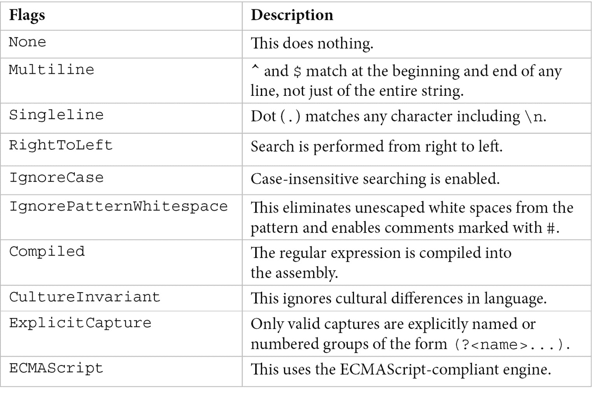
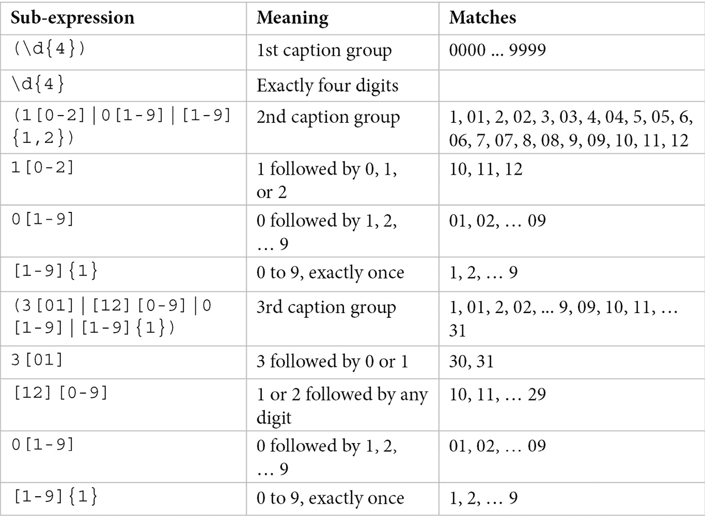

# *第八章*:高级话题

在前几章中，我们学习了语言语法、数据类型、类和结构的处理、泛型、集合以及其他主题，这些都为编写简单的 c#程序提供了必要的知识。 然而，这门语言远不止于此，在本章中，我们将探索更高级的概念。 这将包括委托，它是我们在本书后面讨论的函数式和异步编程的关键，以及各种形式的模式匹配，包括文本的正则表达式。

我们将讨论的议题如下:

*   委托和事件
*   匿名类型
*   元组
*   模式匹配
*   正则表达式
*   扩展方法

完成本章后，您将了解如何使用委托来响应在您的应用程序中发生的事件，如何使用元组来处理多个值而不引入新类型， 使用**在代码中执行模式匹配是**和**切换**表达式以及使用正则表达式搜索和替换文本。 最后(但并非最不重要)，您将学习如何在扩展方法的帮助下扩展类型，而不修改它们的实际源代码。

让我们从学习委托和事件开始本章。

# 代表和活动

**回调是一个函数(或更一般的,任何可执行代码),作为参数传递给另一个函数,以便立即被称为(****同步回调)或在以后的时间(【显示】**异步回调)。 操作系统(如 Windows)广泛地使用回调来允许应用程序响应事件，如鼠标事件或按键。 回调的另一个典型例子是通用算法，它使用回调来处理集合中的元素，比如比较元素以便对它们进行排序或过滤。****

在 C 和 c++等语言中，回调只是一个*函数指针*(即函数的地址)。 然而，在。net 中，回调是*强类型对象*，它不仅包含对一个或多个方法的引用，还包含关于它们的参数和返回类型的信息。 在。net 和 c#中，回调是由委托来表示的。

## 代表

使用**delegate**关键字定义了**delegate**。 该声明看起来像一个函数签名，但编译器实际上引入了一个类，该类可以保存对其签名与委托签名匹配的方法的引用。 一个委托可以保存对*静态*或*实例方法*的引用。

为了更好地理解委托的定义和使用方式，我们将考虑下面的示例。

我们有一个代表引擎的类。 引擎可以做不同的事情，但我们将专注于启动和停止这个引擎。 当这些事件发生时，我们希望让使用引擎的客户端知道这一点，并给他们做一些事情的机会。 为简单起见，客户机将只将事件记录到控制台。 在这个简单的模型中，引擎可以处于以下两种状态中的任何一种:**启动**或**停止**。 我们将从声明委托类型**StatusChange**开始:

```cs
public enum Status { Started, Stopped }
public delegate void StatusChange(Status status);
```

**StatusChange**不是一个函数，而是*类型*。 我们将使用它在引擎中声明一个变量，该变量将保存对回调方法的引用。 代表引擎的类如下:

```cs
public class Engine
{
    private StatusChange statusChangeHandler;
    public void RegisterStatusChangeHandler(StatusChange handler)
    {
        statusChangeHandler = handler;
    }
    public void Start()
    {
        // start the engine
        if (statusChangeHandler != null)
            statusChangeHandler(Status.Started);
    }
    public void Stop()
    {
        // stop the engine
        if (statusChangeHandler != null)
            statusChangeHandler(Status.Stopped);
    }
}
```

这里有几件事要注意:

*   首先，**RegisterStatusChangeHandler()**方法接受一个委托类型的参数(**StatusChange**)，并将其分配给**statusChangeHandler**成员字段。
*   其次，**Start()**和**Stop()**方法实际上没有做太多工作(仅为简单起见)，但您可以想象它们正在执行引擎的启动和停止。 然而，在这之后，它们调用回调函数，就像一个常规函数一样，传递所有必要的参数。
*   在本例中，委托不返回任何值，但委托可以返回任何值。 但是，在调用回调方法之前，会执行一个*空检查*。 如果委托没有被分配给方法的引用，调用该委托会导致**NullReferenceException**。

客户端代码创建**Engine**类的一个实例，为状态更改注册一个处理程序，然后启动和停止它。 代码如下:

```cs
class Program
{
    static void Main(string[] args)
    {
        Engine engine = new Engine();
        engine.RegisterStatusChangeHandler
          (OnEngineStatusChanged); 
        engine.Start();
        engine.Stop();
    }
    private static void OnEngineStatusChanged(Status status)
    {
        Console.WriteLine($"Engine is now {status}");
    }
}
```

静态方法**OnEngineStatusChanged()**用作引擎启动和停止事件的回调。 其签名与委托的类型相匹配。 执行该程序会得到以下输出:

```cs
Engine is now Started
Engine is now Stopped
```

. net 委托的一个重要方面是它们支持*多播*。 这意味着你可以设置引用到你想要被调用的方法; 然后，委托将按照添加它们的顺序调用它们。 多播委托由**系统来表示。 MulticastDelegate**类。 该类在内部有一个被链接的委托列表，称为*调用列表*。 这个列表可以包含任意数量的元素。 当调用多播委托时，调用列表中的所有委托将按照它们在列表中出现的顺序调用(这是它们被添加的顺序)。 此操作是同步的，如果在执行调用列表期间出现任何错误，则抛出异常。

另一方面，当您不再希望方法被调用时，可以从委托中删除对方法的引用。 下面的例子将举例说明这两个方面，我们更改了**Engine**类，以允许多个回调不仅被注册，而且被取消注册:

```cs
public class Engine
{
    private StatusChange statusChangeHandler;
    public void RegisterStatusChangeHandler(StatusChange handler)
    {
        statusChangeHandler += handler;
    }
    public void UnregisterStatusChangeHandler(StatusChange handler)
    {
        statusChangeHandler -= handler;
    }
    public void Start()
    {
        statusChangeHandler?.Invoke(Status.Started);
    }
    public void Stop()
    {
        statusChangeHandler?.Invoke(Status.Stopped);
    }
}
```

同样，这里有两件事需要注意:

*   首先,**RegisterStatusChangeHandler()**方法不再简单地将其参数赋给**statusChangeHandler**字段,但实际上使用了**+ =操作符添加一个新的参考委托持有内部列表。 因此，**UnregisterStatusChangeHandler()**方法使用**-=**操作符从委托中删除引用。 对于委托类型，**+=**和**-=**操作符是重载的。**
***   其次，**Start()**和**Stop()**中的代码有轻微变化。 空条件操作符(**?)** 只在对象不是**null**时调用**Invoke()**方法。**

 **另一方面，主程序的变化如下:

```cs
class Program
{
    static void Main(string[] args)
    {
        Engine engine = new Engine();
        engine.RegisterStatusChangeHandler
          (OnEngineStatusChanged); 
        engine.RegisterStatusChangeHandler
          (OnEngineStatusChanged2); 
        engine.Start();
        engine.Stop();
        engine.UnregisterStatusChangeHandler
          (OnEngineStatusChanged2);
        engine.Start();
    }
    private static void OnEngineStatusChanged(Status status)
    {
        Console.WriteLine($"Engine is now {status}");
    }
    private static void OnEngineStatusChanged2(Status status)
    {
        File.AppendAllText(@"c:\temp\engine.log",
                           $"Engine is now {status}\n");
    }
}
```

这一次，我们注册了两个回调:

*   将事件记录在*控制台*上。
*   记录到*文件*中的一个。

我们启动和停止引擎，然后注销记录到磁盘上的文件的回调。 最后，我们再次启动引擎。 因此，控制台上的输出将如下所示:

```cs
Engine is now Started
Engine is now Stopped
Engine is now Started
```

但是，只有前两行也出现在磁盘上的文件中，因为第二个回调在重新启动引擎之前被删除了。

在第二个示例中，我们使用**Invoke()**方法来调用委托引用的方法。 **Invoke()**方法从何而来? 在幕后，当您声明一个委托类型时，编译器会生成一个派生自**System 的密封类。 MulticastDelegate**，它是派生自**系统。 委托**。 这些是不允许显式派生的系统类型。 然而，它们提供了我们迄今为止看到的所有功能，例如从委托的调用列表中添加和删除方法的能力。

由编译器创建的类包含三种方法调用()——**(用于调用回调*同步方式*),**BeginInvoke()**,**和**EndInvoke()(用于调用回调在一个【显示】异步方式)。 有关异步委托的示例，请参阅其他参考资料。 你可以通过打开反汇编程序中的程序集来检查编译器生成的代码，例如**ildasm.exe**或**ILSpy**。**

## 事件

到目前为止，我们编写的代码有点过于*显式*。 我们必须创建方法来注册和取消注册对回调方法的引用。 这是因为持有这些引用的委托在类中是私有的。 我们可以将其公开化，但这样就会破坏封装，并冒着允许客户机错误地覆盖委托的调用列表的风险。 为了在这些方面提供帮助，. net 和 c#提供了*事件*，这些事件只是我们之前为注册和取消注册回调而编写的显式代码的语法糖。 使用**event**关键词来介绍事件。

引擎的最后一个实现将会改变如下:

```cs
public class Engine
{
    public event StatusChange StatusChanged;
    public void Start()
    {
        StatusChanged?.Invoke(Status.Started);
    }
    public void Stop()
    {
        StatusChanged?.Invoke(Status.Stopped);
    }
}
```

注意，我们不再有注册和注销回调的方法，只有一个名为**StatusChanged**的事件对象。 这些操作在事件对象的客户机代码中使用**+=**(添加对方法的引用)和**-=**(删除对方法的引用)操作符完成。 我们可以在下面的代码中看到客户机代码。

在本例中,我们创建一个**引擎对象并注册回调的**StatusChanged****OnEngineStatusChanged 事件是一个引用()**方法(事件记录到一个文件中),另一个是 lambda 表达式(向控制台日志事件):**

```cs
class Program
{
    static void Main(string[] args)
    {
        Engine engine = new Engine();
        engine.StatusChanged += OnEngineStatusChanged;
        engine.StatusChanged += 
            status => Console.WriteLine(
                        $"Engine is now {status}");
        engine.Start();
        engine.Stop();
        engine.StatusChanged -= OnEngineStatusChanged;
        engine.Start();
    }
    private static void OnEngineStatusChanged(Status status)
    {
        File.AppendAllText(@"c:\temp\engine.log",
                           $"Engine is now {status}\n");
    }
}
```

在启动和停止引擎之后，我们注销对**OnEngineStatusChanged()的引用**，然后重启引擎。 执行这个程序的结果与前一个程序相同。

在迄今为止的所有示例中，委托类型都有一个参数，即引擎的状态。 然而，事件模式的正确实现(在整个。net 框架中使用)有两个参数:

*   第一个参数是**System。 对象**，该对象保存对生成事件的对象的引用。 这取决于被调用的客户端是否使用这个引用。
*   第二个参数是派生自**System 的类型。 EventArgs**，它包含所有与事件相关的信息。

为了符合这个模式，我们对**Engine**的实现将改变如下:

```cs
public class EngineEventArgs : EventArgs
{
    public Status Status { get; private set; }
    public EngineEventArgs(Status s)
    {
        Status = s;
    }
}
public delegate void StatusChange(
         object sender, EngineEventArgs args);
public class Engine
{
    public event StatusChange StatusChanged;
    public void Start()
    {
        StatusChanged?.Invoke(this, 
           new EngineEventArgs(Status. Started));
    }
    public void Stop()
    {
        StatusChanged?.Invoke(this, 
           new EngineEventArgs(Status.Stopped));
    }
}
```

我们将把它留给读者作为练习，对主程序进行必要的更改以使用**Engine**类的新实现。

关于代表和活动的要点如下:

*   委托允许将方法作为参数传递，以便稍后以同步或异步方式调用。
*   委托支持多播，即调用多个回调方法。
*   静态方法、实例方法、匿名方法和 lambda 表达式可以使用委托作为回调。
*   委托可以是通用的。
*   事件是帮助注册和删除回调的语法糖。

本章讨论的下一个主题是匿名类型。

# 匿名类型

有时需要构造临时对象来保存一些值，这些值通常是较大对象的子集。 为了避免仅为此目的创建特定类型，该语言提供了所谓的*匿名类型*。 这些是一种用后即忘类型，通常用于和**LINQ**一起的查询表达式中。 本课题将在[*Chapter 10*](10.html#_idTextAnchor184)，*Lambdas, LINQ, and Functional Programming*中讨论。

这些类型被称为匿名，因为您没有在源代码中指定名称。 该名称由编译器分配。 它们只包含只读属性; 不允许任何其他成员类型。 只读属性的类型不能显式指定，而是由编译器推断。

引入匿名类型时使用了**new**关键字，后跟尖括号中的属性列表(对象初始化器)。 下面的代码片段显示了一个示例:

```cs
var o = new { Name = "M270 Turbo", Capacity = 1600, 
Power = 75.0 };
Console.WriteLine($"{o.Name} {o.Capacity / 1000.0}l 
{o.Power}kW");
```

在这里，我们定义了一个具有三个属性的匿名类型:**名称**、**容量**和**功率**。 这些属性的类型由编译器根据它们的初始值推断出来。 在这种情况下,他们是**字符串【显示】**,**int【病人】为**能力**、【t16.1】和**双为**。**********

当用表达式初始化属性时，必须为其指定名称。 但是，如果它是从另一个对象的字段或属性初始化的，则名称是可选的。 在这种情况下，编译器使用与用于初始化它的成员相同的名称。 为了展示一个例子，让我们考虑以下类型:

```cs
class Engine
{
    public string Name { get; }
    public int Capacity { get; }
    public double Power { get; }

    public Engine(string name, int capacity, double power)
    {
        Name = name;
        Capacity = capacity;
        Power = power;
    }
}
```

有了这个，我们可以写如下:

```cs
var e = new Engine("M270 Turbo", 1600, 75.0);
var o = new { e.Name, e.Power };
Console.WriteLine($"{o.Name} {o.Power}kW");
```

我们已经创建了**Engine**类的一个实例。 从这个例子中,我们创建了另一个对象有两个属性的匿名类型,编译器称之为**名称**和**因为它们初始化的名字**和【显示】**引擎的属性类。******

 ****匿名类型有以下属性:

*   它们被实现为密封类，因此是引用类型。 CLI 在匿名类型和其他引用类型之间没有任何区别。
*   它们直接来源于**系统。 对象**，并且只能被转换到**系统。 对象**。
*   它们只能包含只读属性。 其他成员不得入内。
*   它们不能用作字段、属性、事件、方法的返回类型或方法、构造函数或索引器的参数类型。
*   可以为匿名类型的只读属性指定名称。 当从表达式初始化时，这是强制性的，但当从字段或属性初始化时，这是可选的。 在这种情况下，编译器使用成员的名称作为属性的名称。
*   用于初始化属性的表达式不能为空、匿名函数或指针类型。
*   匿名类型的作用域是定义它的方法。
*   当声明匿名类型的变量时，必须使用**var**作为类型名的占位符。

元组提出了类似的特殊类型概念，但具有不同的语义，这是下一节的主题。

# 元组

**元组**简单类型,通常可以使用一个轻量级的语法,当你想从一个函数中返回多个值没有定义显式类型或没有使用**或**ref 参数或当您想要将多个值传递给一个方法作为一个单独的对象。****

 ****这个方面代表了匿名类型和元组之间的关键区别。 前者用于在单个方法范围内使用，不能作为参数传递，也不能从方法中返回。 后者正是为了这个目的而设计的。

在 c#中，有两种元组:

*   **引用元组**，由**System 表示。 元组**类
*   值元组**，由**系统表示。 值元组**结构**

 **在下一小节中，我们将研究这两种类型。

## Tuple 类

元组引用在。net Framework 4.0 中被引入。 一般类，**System。 元组**，最多可以容纳 8 个不同类型的值。 如果您需要包含 8 个以上值的元组，则必须创建嵌套元组。 元组可以用两种方式之一实例化:

*   使用**元组<T>**的*构造函数*
*   通过使用*helper 方法*、**Tuple.Create()**

以下两行是等价的:

```cs
var engine = new Tuple<string, int, double>("M270 Turbo", 1600, 75);
var engine = Tuple.Create("M270 Turbo", 1600, 75);
```

这里的第二行是首选，因为它更简单，因为您不必指定每个值的类型。 这是因为它是由编译器从参数推断出来的。

元组的元素可以通过属性被称为**Item1**,**第二条**,**Item3**,**Item4**、【显示】Item5,**Item6**,【病人】Item7,**。 在下面的例子中，我们使用**Item1**，**Item2**和**Item3**属性将引擎名称、容量和功率打印到控制台:**

 **```cs
Console.WriteLine(
    $"{engine.Item1} {engine.Item2/1000.0}l {engine.Item3}kW");
```

当您需要多于 8 个元素时，可以使用嵌套元组。 在这种情况下，将嵌套元组作为最后一个元素是有意义的。 下面的示例创建了一个包含 10 个值的元组，其中最后三个(以 kW 表示各种引擎功率)被分组到第二个嵌套的元组中:

```cs
var engine = Tuple.Create(
    "M270 DE16 LA R", 1595, 83, 73.7, 180, "gasoline", 2015, 
    Tuple.Create(75, 90, 115));
Console.WriteLine($"{engine.Item1} powers: {engine.Rest.Item1}");
```

注意这里我们使用了**Rest。 项目 1**而不是简单**休息**。 这个程序的输出如下:

```cs
M270 DE16 LA R powers: (75, 90, 115)
```

原因是推断类型变量的引擎是**【病人】元组字符串,int, int,翻倍,int,字符串,int, Tuple<元组<int, int, int>【t16.1】>**。 因此，**Rest**表示一个包含单个值的元组，而该元组又包含三个**int**值。 要访问嵌套元组的元素，在本例中必须使用**Rest.Item1。 项目 1**，**休息 项目 2**、**休息 项目 3**。

创建一个的 tuple 类型,**<元组字符串,int, int,翻倍,int,字符串,int, tuple<int, int, int>>**,您必须使用显式的语法使用构造函数:

```cs
var engine = new Tuple<string, int, int, double, int, string, int, Tuple<int, int, int>>
    ("M270 DE16 LA R", 1595, 83, 73.7, 180, "gasoline", 2015,
    new Tuple<int, int, int>(75, 90, 115));
Console.WriteLine($"{engine.Item1} powers: {engine.Rest}");
```

**系统 元组**是一个引用类型，因此该类型的对象被分配到堆上。 如果在程序执行期间发生许多小对象的分配，就会影响性能。

这增加了我们前面看到的限制—元素的数量和未命名的属性。 为了克服这些问题，c# 7.0、。net Framework 4.7 和。net Standard 2.0 引入了值类型元组，我们将在下一节中进行探讨。

## 值元组

这些是用**系统表示的。 值元组**结构。 如果您的项目不是针对。net Framework 4.7 或更高版本或。net Standard 2.0 或更高版本，您仍然可以通过将其作为 NuGet 包安装来使用**ValueTuple**。

在几个 7 中添加了各种值元组特性。 语言的 X 版本。 这里描述的功能与 c# 8 一致。

除了值语义外，值元组与引用元组在以下几个重要方面有所不同:

*   它们可以包含任意数量的元素序列，但至少需要两个元素。
*   它们可能有编译时命名的字段。
*   它们具有更简单但更丰富的语法来创建、赋值、解构和比较值。

创建值元组使用*圆括号语法*，并在其中指定值。 以下三个声明是等价的:

```cs
ValueTuple<string, int, double> engine = ("M270 Turbo", 1600, 75.0);
(string, int, double) engine = ("M270 Turbo", 1600, 75.0);
var engine = ("M270 Turbo", 1600, 75.0);
```

在所有这些情况下，变量引擎的类型是**ValueTuple<string、int、double>**，这个元组被称为*未命名的*。 在这种情况下，它的值在公共字段中可用——**Item1**、**Item2**和**Item3**，它们是编译器赋值的隐式名称:

```cs
Console.WriteLine(
    $"{engine.Item1} {engine.Item2/1000.0}l {engine.Item3}kW");
```

但是，在创建值元组时，您可以选择给值命名，从而为字段创建同义词，如**Item1**、**Item2**等等。 这样的值元组称为**命名元组**。 你可以在下面的代码片段中看到一个命名元组的例子:

```cs
var engine = (Name: "M270 Turbo", Capacity: 1600, Power: 75.0);
Console.WriteLine(
    $"{engine.name} {engine.capacity / 1000.0}l {engine.power}kW");
```

这些同义词只有在编译时可用,因为 ide 利用 Roslyn api 为您提供他们的源代码,但在编译器中间语言代码,他们不可以,只有不愿透露姓名的字段——**Item1**,**第二条**,等等。

字段的名称可以出现在赋值的任意一侧; 此外，它们可以出现在两侧，在这种情况下，左名*将优先于*，右名将被*忽略*。 以下两个声明将生成一个命名值元组，与前面代码中看到的相同:**

 **```cs
(string Name, int Capacity, double Power) engine = 
    ("M270 Turbo", 1600, 75.0);
(string Name, int Capacity, double Power) engine = 
    (name: "M270 Turbo", cap: 1600, pow: 75.0);
```

字段的名称也可以从用于初始化值元组的变量中推断出来(就像 c# 7.1 一样)。 在下面的例子中，值元组的字段名为**name**，**capacity**(小写)，以及**Item3**，因为最后一个值是一个没有显式指定名称的字面值:

```cs
var name = "M270 Turbo";
var capacity = 1600;
var engine = (name, capacity, 75);
Console.WriteLine(
    $"{engine.name} {engine.capacity / 1000.0}l {engine.Item3}kW");
```

从方法返回值元组非常简单。 在下面的例子中，**GetEngine()**函数返回一个未命名的值类型:

```cs
(string, int, double) GetEngine()
{
    return ("M270 Turbo", 1600, 75.0);
}
```

但是，您可以选择返回命名值类型，在这种情况下，您需要指定字段的名称，如下所示:

```cs
(string Name, int Capacity, double Power) GetEngine2()
{
    return ("M270 Turbo", 1600, 75.0);
}
```

从c# 7.3 开始，可以使用**==**和**!=**操作符测试值元组是否具有*相等*和*不等*。 这些操作符的工作方式是将左侧的每个元素与右侧的每个元素进行比较。 当第一对不相等时，比较停止。 然而，这只发生在元组的形状相同的情况下，即字段的数量及其类型相同。 这些名字不参与平等或不平等的测试。 下一个例子比较了两个值元组:

```cs
var e1 = ("M270 Turbo", 1600, 75.0);
var e2 = (Name: "M270 Turbo", Capacity: 1600, Power: 75.0);
Console.WriteLine(e1 == e2);
```

如果一个元组是可空元组，则**元组相等**执行*提升转换*，同时*隐式转换*对两个元组的每个成员。 后者包括提升转换、扩大转换或其他隐式转换。 例如，以下元组是相等的:

```cs
(int, long) t1 = (1, 2);
(long, int) t2 = (1, 2);
Console.WriteLine(t1 == t2);
```

可以解构元组的值。 可以通过显式指定变量的类型或使用**var**来实现。 下面的声明都是等效的。 在下面最后一个例子中，使用**var**与显式类型名结合使用:

```cs
(string name, int capacity, double power) = GetEngine();
(var name, var capacity, var power) = GetEngine();
var (name, capacity, power) = GetEngine();
(var name, var capacity, double power) = GetEngine();
```

如果有您不感兴趣的值，您可以通过使用**_**占位符来忽略它们，如下所示:

```cs
(var name, _, _) = GetEngine();
```

我们可以解构任何。net 类型，只要一个名为**的方法解构**，用**和**的参数构造你想要检索的每个值。

在下面的例子中，**发动机**类有三个属性:**名称**、**容量**和**功率**。 **Deconstruct()**public 方法取出三个匹配这些属性的实参。 这使得这种类型的对象可以使用元组语法进行解构。 下面的清单显示了提供元组解构的**Engine**类的实现:

```cs
class Engine
{
    public string Name { get; }
    public int Capacity { get; }
    public double Power { get; }
    public Engine(string name, int capacity, double power)
    {
        Name = name;
        Capacity = capacity;
        Power = power;
    }
    public void Deconstruct(out string name, out int capacity, 
                            out double power)
    {
        name = Name;
        capacity = Capacity;
        power = Power;
    }
}
var engine = new Engine("M270 Turbo", 1600, 75.0);
var (Name, Capacity, Power) = engine;
```

可以将**解构**方法作为扩展方法提供，使您甚至可以为您没有编写的类型提供解构语义，前提是您只需要解构通过类型的公共接口访问的值。 下面是一个例子:

```cs
class Engine
{
    public string Name { get; }
    public int Capacity { get; }
    public double Power { get; }
    public Engine(string name, int capacity, double power)
    {
        Name = name;
        Capacity = capacity;
        Power = power;
    } 
}
static class EngineExtension
{
    public static void Deconstruct(this Engine engine, 
                                   out string name, 
                                   out int capacity, 
                                   out double power)
    {
        name = engine.Name;
        capacity = engine.Capacity;
        power = engine.Power;
    }
}
```

如果您有一个类的层次结构，并且您提供了**Deconstruct()**方法，那么您必须确保不会引入歧义，例如在不同重载具有相同数量的参数的情况下。 应该注意的是，解构运算符不参与对等式的测试。 因此，下面的示例将生成一个编译器错误:

```cs
var engine = new Engine("M270 Turbo", 1600, 75.0);
Console.WriteLine(engine == ("M270 Turbo", 1600, 75.0));
```

综上所述，c# 7 中对值元组的支持使得在关键场景中使用元组变得更加容易，比如保存数据库中的临时值或记录。 这可以在不引入新类型或不使用**out**或**ref**参数的情况下从方法返回多个值的情况下完成。 通过值语义的性能优势以及基于名称的元素访问的改进，以及其他关键特性，命名值是对我们在本节开始时看到的引用类型元组的重要改进。

# 模式匹配

**模式匹配**是检查一个值是否具有特定形状，并在匹配成功时从该值中提取信息的过程。 在某种程度上，当我们检查一个对象是否有值，然后从其中提取信息时，我们通常使用**if**和**切换**语句。 然而，这是模式匹配的一种基本形式。

在 c# 7 中，添加到**的新功能是**和**切换**语句，以启用模式匹配功能，驱动更好地分离数据和代码，生成更简洁、更易读的代码。 模式匹配功能通过 c# 8 中的新特性得到了扩展。 你将在[*第十五章*](15.html#_idTextAnchor271)、*c# 8 的新特性*中了解这些。

## The is expression

在运行时，**是**操作符检查对象是否与给定类型兼容(一般形式**expr 是**类型)。 然而，在 c# 7 中，它被扩展到包括几种形式的模式匹配:

*   **类型模式**，在**expr 是类型 varname**形式中，检查表达式是否可以转换为指定的类型，如果可以，则将其强制转换为该指定类型的变量。
*   **常量模式**，在**expr is Constant**形式中，检查表达式是否计算为指定的常量。 一个特定的常量是**null**，其模式为**expr is null**。
*   **var 模式**是类型模式的一种特殊形式，在**expr is var varname**形式中，它总是成功并将值绑定到一个新的局部变量。 与类型模式的一个关键区别是，**null**总是匹配的，而新变量被赋值**null**。

为了理解这些工作原理，我们将使用几个类来表示车辆:

```cs
class Airplane
{
    public void Fly() { }
}
class Bike
{
    public void Ride() { }
}
class Car
{
    public bool HasAutoDrive { get; }
    public void Drive() { }
    public void AutoDrive() { }
}
```

这些车辆类不是类层次结构的一部分，但它们具有根据车辆类型设置车辆运行的公共方法。 例如，飞机会飞，自行车会骑，汽车会开。 下面的代码显示了一个函数，它使用了几种形式的模式匹配:

```cs
void SetInMotion(object vehicle)
{
    if (vehicle is null)
        throw new ArgumentNullException(
            message: "Vehicle must not be null",
            paramName: nameof(vehicle));
    else if (vehicle is Airplane a)
        a.Fly();
    else if (vehicle is Bike b)
        b.Ride();
    else if (vehicle is Car c)
    {
        if (c.HasAutoDrive) c.AutoDrive();
        else c.Drive();
    }
    else
        throw new ArgumentException(
           message: "Unexpected vehicle type", 
           paramName: nameof(vehicle)); 
}
```

这个功能设置车辆在运动中根据其具体的方式这样做。 **如果声明(车辆飞机)**测试变量车辆是否可以转换为**飞机类型,如果这是真的,那么它分配一个新的变量****飞机类型(在这个例子中,**)。 这适用于值类型和引用类型。****

 **这里看到的变量-**a**，**b**，和**c**对**if**or**else**语句有局部作用。 但是，这些变量在作用域中，并且只有在匹配成功时才明确地赋值。 这将防止您在模式未匹配时访问模式匹配表达式的结果。

除了类型模式之外，这里还使用了常量模式。 **if (vehicle is null)**语句是一个测试，查看引用是否实际设置为一个对象的实例; 如果不是，则抛出异常。 但是，正如前面提到的，常量模式匹配可以与任何常量一起使用——文字值、用 const 说明符声明的变量或枚举值。 常量表达式的计算方法如下:

*   如果**expr**和常数都是整型，则基本计算出**expr == constant**表达式。
*   否则，它将调用静态方法**Object。 等于(expr，常数)**。********  ****下面的函数展示了更多常量模式匹配的示例。 函数的作用是:将所提供的参数转换为布尔值。 布尔值(**真正的**),积分值(**1)字符串(**【显示】“1”),和字符串(**“真实”)转换为**真正的【病人】; 所有其他的包括**null**将被转换为**false**:**********

```cs
bool IsTrue(object value)
{
    if (value is null) return false;
    else if (value is 1) return true;
    else if (value is true) return true;
    else if (value is "true") return true;
    else if (value is "1") return true;
    return false;
}
Console.WriteLine(IsTrue(null));   // False
Console.WriteLine(IsTrue(0));      // False
Console.WriteLine(IsTrue(1));      // True
Console.WriteLine(IsTrue(true));   // True
Console.WriteLine(IsTrue("true")); // True
Console.WriteLine(IsTrue("1"));    // True
Console.WriteLine(IsTrue("demo")); // False
```

## 开关表达式

需要检查的模式越多，编写这类**if-else**语句就越麻烦。 当然，您会希望用**开关**来替换它们。 具有类似语法的**switch**语句也支持同样性质的模式匹配。

直到 c# 7.0 之前，**switch**语句都支持使用整型和字符串匹配常量模式。 从 c# 7.0 开始，在**switch**语句中也支持前面看到的类型模式。

上一节中显示的**SetInMotion()**函数可以使用**switch**语句修改如下:

```cs
void SetInMotion(object vehicle)
{
    switch (vehicle)
    {
        case Airplane a:
            a.Fly();
            break;
        case Bike b:
            b.Ride();
            break;
        case Car c:
            if (c.HasAutoDrive) c.AutoDrive();
            else c.Drive();
            break;
        case null:
            throw new ArgumentNullException(
                message: "Vehicle must not be null",
                paramName: nameof(vehicle));
        default:
            throw new ArgumentException(
               message: "Unexpected vehicle type", 
               paramName: nameof(vehicle));
    }
}
```

使用常量模式匹配的**switch**语句只能有一个 case 标签匹配**switch**表达式的值。 此外，**切换**部分不能通过下一个部分，而必须以**断开**，**返回**，或**转到**结束。 然而，它们可以以任何顺序排列，而不影响程序语义和执行的行为。

通过类型模式匹配，规则会发生变化。 **开关**部分可以通过下一个，**转到**不再支持作为跳转机制。 case 标签表达式按它们在文本中出现的顺序计算，只有在没有 case 标签匹配模式时才执行默认 case。 默认情况可以出现在**开关**的任何位置，但它总是最后计算。

如果缺少一个默认的 case，并且现有的 case 标签都不匹配该模式，则在**switch**语句之后继续执行，而不执行任何 case 标签中的代码。

与**开关**表达式匹配的类型模式的另一个特征是在子句中支持**。 下面的例子展示了另一个版本的**SetInMotion**()方法,使用两个 case 标签匹配**汽车类型,但其中一个条件是**【显示】HasAutoDrive 产权**汽车对象设置为【病人】真正的**:**

 **```cs
void SetInMotion(object vehicle)
{
    switch (vehicle)
    {
        case Airplane a:
            a.Fly();
            break;
        case Bike b:
            b.Ride();
            break;
        case Car c when c.HasAutoDrive:
            c.AutoDrive();
            break;
        case Car c:
            c.Drive();
            break;
        case null:
            throw new ArgumentNullException(
                message: "Vehicle must not be null",
                paramName: nameof(vehicle));
        default:
            throw new ArgumentException(
              message: "Unexpected vehicle type", 
              paramName: nameof(vehicle)); 
    }
}
```

需要注意的是，匹配类型模式保证了*非空值*，因此不需要进一步测试**空值**。 语言中有匹配**null**的特殊规则。 一个**null**值不匹配类型模式，不管变量的类型是什么。 可以将模式匹配**null**的 case 标签添加到具有类型模式匹配的 switch 表达式中，以专门处理**null**值。 在前面的实现中可以看到这样的示例。

类型模式匹配的一种特殊形式是使用**var**。 与**类似的规则是**表达式——类型是从开关表达式的静态类型推断出来的，且**null**值总是匹配的。 因此，当使用**var**模式时，您必须添加一个显式的**null**检查，因为该值实际上可能是**null**。 一个**var**声明可以匹配与默认情况相同的条件; 在这种情况下，即使存在默认情况，也不会执行。

让我们看看下面的函数，它执行作为字符串参数接收的命令:

```cs
void ExecuteCommand(string command)
{
    switch(command)
    {
        case "add":  /* add */    break;
        case "del":  /* delete */ break;
        case "exit": /* exit */   break;
        case var o when (o?.Trim().Length ?? 0) == 0:
            /* do nothing */
            break;
        default:
            /* invalid command */
            break;
    }
}
```

该函数尝试匹配**add**、**del**和**退出**命令并适当地执行它们。 但是，如果参数为**null**或为空或只有空格，则它将不执行任何操作。 但这与不支持或无法识别的实际命令的情况不同。 **var**模式匹配有助于以一种简单而优雅的方式区分两者。

以下是关于这个话题的要点:

*   c# 7.0 中添加的模式匹配功能是对现有简单模式匹配功能的增量更新。
*   新支持的模式是常量模式、类型模式和**var**模式。
*   **的模式匹配是**switch**语句中的**表达式和 case 块。
*   **开关**表达式模式匹配支持**其中**子句。
*   **var**模式总是匹配包括**null**在内的任何值，因此，有必要测试**null**。

c# 8.0 为开关表达式模式匹配引入了更多的功能:属性模式、元组模式和位置模式。 你可以在[*第十五章*](15.html#_idTextAnchor271)，*c# 8 上的新特性*中了解这些。

# 正则表达【T0

模式匹配的另一种形式由正则表达式表示。 **正则表达式**是一个可以匹配文本的模式。 虽然在语言级别上不直接支持正则表达式，但是。net 开发人员可以通过**system . text . regularexpression**命名空间中的**Regex**类使用正则表达式。 在下面的页面中，我们将研究如何使用这个类来匹配输入文本、查找文本的一部分或替换文本的一部分。

正则表达式由常量(表示字符串集)和操作符符号(表示对这些集合的操作)组成。 构建正则表达式的实际语言比本章描述的要复杂得多。 如果您不熟悉正则表达式，我们建议使用其他资源来学习它们。 您还可以使用 onli[ne 工具构建和测试您的正则](https://regexr.com/)[ar 表达式，例如 ht](https://regex101.com/)tps://regex101.com/或 https://regexr.com/。

## 概述

. net 中的正则表达式是基于 Perl 5 正则表达式构建的。 因此，大多数 Perl 5 正则表达式都与。net 正则表达式兼容。 另一方面,该框架支持另一个表达式的味道,叫做**ECMAScript**,它基本上是 JavaScript 的另一个名称(**ECMAScript**实际上是一种脚本语言 ECMA 标准,和 JavaScript 是其最有名的实现)。 但是，在使用正则表达式时，必须显式地指定这种风格。 . net 正则表达式的实现自。net 2.0 以来一直保持不变，在。net Core 中也是一样的。

以下是该实现支持的一些特性:

*   不区分大小写的匹配
*   从右到左搜索(对于阿拉伯语、希伯来语或波斯语等具有从右到左书写系统的语言)
*   改变某些符号(如**ˆ**、**$**或**含义的多行或单行搜索模式。 【知识点讲解】**
*   将正则表达式编译到程序集并在使用模式搜索大量字符串时提高性能的可能性
*   无限宽向后查找，它使我们能够退回到任意长度，并检查字符串中向后查找中的文本是否可以在那里匹配
*   字符类减法，允许指定一个字符类从另一个字符类中减法
*   平衡组，允许您确保一个子表达式与另一个子表达式匹配相同数量的类型

其中一些功能是通过作为**Regex**类构造函数的参数提供的标志来启用的。 RegexOptions**RegexOptions**枚举提供了以下标志，可以组合使用:



在我们进入下一节学习如何在 c#中实际使用正则表达式之前，有两件更重要的事情需要提到:

*   首先，正则表达式有一组特殊字符。 其中一个是**\**(反斜杠)。 与另一个文字字符结合，这将创建一个具有特殊含义的新标记。 例如，**\d**匹配从 0 到 9 的任何单个数字。 由于反斜杠也是 c#中用于引入字符转义序列的特殊字符，当您在字符串中编写正则表达式时，需要使用双反斜杠，例如**"(\\d+)"** 。 但是，您可以使用逐字字符串来避免这种情况，并保持正则表达式的自然形式。 前面的示例可以写成**@"(\d+)"** 。
*   The other important thing to notice is that the **Regex** class implicitly assumes UTF-8 encoding of the string to match. That means the **\w**, **\d**, and **\s** tokens match any UTF-8 codepoint that is a valid character, digit, or whitespace character in any language. As an example, if you use **\d+** to match any positive number of digits, you might be surprised to discover that it will match not just 0-9 but also the following characters:

    

    如果你想限制匹配英语数字**\ d**,**英语数字和字母和下划线\ w**和**标准的空白字符\ s**,那么您需要使用**RegexOptions。 ECMAScript**选项。

现在让我们看看如何定义正则表达式，并使用它们来确定某些文本是否匹配表达式。

## 匹配输入文本

正则表达式提供的最简单的功能是检查输入字符串是否具有所需的格式。 这对于执行验证非常有用，比如检查字符串是否为有效的电子邮件地址、IP 地址、日期等等。

为了理解其工作原理，我们将验证输入文本是否为有效的 ISO 8061 日期。 为了简单起见，我们只考虑形式*YYYY-MM-DD*，但是作为练习，您可以扩展它以支持其他格式。 我们将使用的正则表达式是**(\ d{4}) -(1(0 - 2) | 0 |(1 - 9)[0 - 9]{1})——(3[01]|[12][1 - 9][0 - 9]| 0 |(1 - 9){1})**。

子表达式分为以下几部分:



下面两个例子是等价的。 对于**IsMatch()**，**Regex**类同时具有静态重载和非静态重载，您可以使用其中任何一个来获得相同的结果。 其他方法也是如此,我们将看到在下面几节中,如**匹配()**,**匹配()**,【显示】替换(),和**分裂():**

```cs
var pattern = @"(\d{4})-(1[0-2]|0[1-9]|[1-9]{1})-(3[01]|[12][0-9]|0[1-9]|[1-9]{1})";
var success = Regex.IsMatch("2019-12-25", pattern);
// or
var regex = new Regex(pattern);
var success = regex.IsMatch("2019-12-25");
```

如果您只需要匹配模式一次或几次，那么您可以使用静态方法，因为它们更简单。 但是，如果您匹配相同的模式成千上万次或更多次，那么使用类的实例并调用非静态成员可能会更快。 对于大多数常见的用法来说，情况并非如此。 在下面的例子中，我们将只使用静态方法。

**IsMatch()**方法具有重载，使我们能够为正则表达式指定选项和超时时间间隔。 当正则表达式太复杂，或者输入文本太长，并且解析所花费的时间超过预期时，这是很有用的。 看看下面的例子:

```cs
var success = Regex.IsMatch("2019-12-25",
                            pattern,
                            RegexOptions.ECMAScript,
                            TimeSpan.FromMilliseconds(1));
```

这里，我们启用正则表达式的 ecmascript 兼容行为，并将超时值设置为一毫秒。

现在我们已经了解了如何匹配文本，让我们学习如何搜索子字符串和模式的多次出现。

## 查找子字符串

在迄今为止的示例中，我们只检查输入文本是否具有特定的模式。 但是也有可能得到关于结果的信息。 例如，这包括在每个标题组中匹配的文本、整个匹配值、输入文本中的位置，等等。 为此，必须使用另一组重载。

**Match()**方法检查输入字符串中匹配正则表达式的子字符串，并返回第一个匹配。 **Matches()**方法执行相同的搜索，但返回所有匹配。 对于前者，返回类型为**system . text . regularexpression . match**(表示单个匹配);对于后者，返回类型为**system . text . regularexpression . matchcollection**(表示匹配的集合)。 让我们考虑以下例子:

```cs
var pattern =
    @"(\d{4})-(1[0-2]|0[1-9]|[1-9]{1})-(3[01]|[12][0-9]|0[1-9]|[1-9]{1})";
var match = Regex.Match("2019-12-25", pattern);
Console.WriteLine(match.Value);
Console.WriteLine(
    $"{match.Groups[1]}.{match.Groups[2]}.{match.Groups[3]}");
```

第一个打印到控制台的值是**2019-12-25**，因为这是整个匹配的值。 第二个是由每个捕获组的单个值组成的值，但带有一个点(**)。** )作为分隔符。 因此，输出文本为**2019.12.25**。

捕获组可以有名称; 形式为**(? <name>…) 在下面的例子中，我们将正则表达式的三个捕获组称为**年**、**月**和**天**:**

```cs
var pattern =
    @"(?<year>\d{4})-(?<month>1[0-2]|0[1-9]|[1-9]{1})-(?<day>3[01]|[12][0-9]|0[1-9]|[1-9]{1})";
var match = Regex.Match("2019-12-25", pattern);
Console.WriteLine(
    $"{match.Groups["year"]}-{match.Groups["month"]}-{match.Groups["day"]}");
```

如果输入文本有多个匹配模式的子字符串，我们可以使用**Matches()**函数获取所有子字符串。 在下面的示例中，每一行提供一个日期，但最后两个无效(**2019-13-21**和**2019-1-32**); 因此，在结果中没有发现这些。 为了解析字符串，我们使用多行选项，以便**^**和**$**指向每一行的开头和结尾，而不是指向整个字符串，如下例所示:

```cs
var text = "2019-05-01\n2019-5-9\n2019-12-25\n2019-13-21\n2019-1-32";
var pattern =
    @"^(\d{4})-(1[0-2]|0[1-9]|[1-9]{1})-(3[01]|[12][0-9]|0[1-9]|[1-9]{1})$";
var matches = Regex.Matches(
  text, pattern, RegexOptions. Multiline); 
foreach(Match match in matches)
{
    Console.WriteLine(
      $"[{match.Index}..{match.Length}]={match. Value}");
}
```

程序的输出如下:

```cs
[0..10]=2019-05-01
[11..8]=2019-5-9
[20..10]=2019-12-25
```

有时候，我们不只是想找到输入文本的子字符串; 我们也想用别的东西来代替它们。 这个主题将在下一节中讨论。

## 替换部分文本

正则表达式还可用于将与正则表达式匹配的字符串部分替换为另一个字符串。 **取代()方法有一组过载,你可以指定一个字符串或一个所谓**匹配评估者**,这是一个函数,它接受一个**与**参数并返回一个字符串。 在下面的例子中，我们将使用该命令将日期的格式从*YYYY-MM-DD*更改为*MM/DD/YYYY*:**

```cs
var text = "2019-12-25";
var pattern = @"(\d{4})-(1[0-2]|0[1-9]|[1-9]{1})-(3[01]|[12]
    [0-9]|0[1-9]|[1-9]{1})";
var result = Regex.Replace(
    text, pattern,
    m => $"{m.Groups[2]}/{m.Groups[3]}/{m.Groups[1]}");
```

作为进一步的练习，您可以编写一个程序，将表单 2019-12-25 的输入日期转换为 2019 年 12 月 25 日的表单。

作为本节的总结，正则表达式提供了丰富的模式匹配能力。. net 提供了**Regex**类，它代表了一个具有大量功能的正则表达式引擎。 在本节中，我们了解了如何基于模式匹配、搜索和替换文本。 这些是您将在许多应用程序中遇到的常见操作。 您可以在这些方法的静态重载和实例重载之间进行选择，并定制它们使用各种选项的工作方式。

# 扩展方法

在不改变实现、创建派生类型或重新编译代码的情况下，向类型添加功能有时是很有用的。 我们可以通过在 helper 类中创建方法来实现这一点。 假设我们想要有一个函数来反转字符串的内容，因为**System。 字符串**没有。 该功能可实现如下:

```cs
static class StringExtensions
{
    public static string Reverse(string s)
    {
        var charArray = s.ToCharArray();
        Array.Reverse(charArray);
        return new string(charArray);
    }
}
```

可以这样调用:

```cs
var text = "demo";
var rev = StringExtensions.Reverse(text);
```

c#语言允许我们定义这个函数，使我们能够像调用**系统的实际成员一样调用它。 字符串**。 这些函数被称为**扩展方法**。 要使**Reverse()**方法成为扩展方法，只需对其进行少量更改。 新的实现如下代码所示:

```cs
static class StringExtensions
{
    public static string Reverse(this string s)
    {
        var charArray = s.ToCharArray();
        Array.Reverse(charArray);
        return new string(charArray);
    }
}
```

注意，对实现的唯一更改是在函数参数前面加上了**这个**关键字。 通过这些更改，函数可以被调用，就像它是 string 类的一部分一样:

```cs
var text = "demo";
var rev = text.Reverse();
```

以下规则适用于的定义和扩展方法的行为:

*   它们可以扩展类、结构和枚举。
*   它们必须声明为静态、非嵌套、非泛型类的静态方法。
*   它们的第一个参数是它们添加功能的类型。 该参数前加上**这个**关键字。
*   它们只能调用所扩展类型的公共成员。
*   只有在使用指令**将声明它们的名称空间带入当前作用域时，它们才可用。**
*   如果一个扩展方法(在当前范围内可用)与类的实例方法具有相同的签名，编译器将始终选择实例成员，并且永远不会调用扩展方法。

下面的示例显示了一个名为**AllMessages()**的扩展方法，该方法扩展了**系统的功能。 异常**类型。 它表示一个异常并有一条消息，但也可以包含一个内部异常。 这个扩展方法返回一个由所有嵌套异常的所有消息拼接而成的字符串。 布尔参数指示消息是否应该从主异常连接到最内部的异常，还是以相反的顺序连接:

```cs
static class ExceptionExtensions
{
    public static string AllMessages(this Exception exception, 
                                     bool reverse = false)
    {
        var messages = new List<string>();
        var ex = exception;
        while(ex != null)
        {
            messages.Add(ex.Message);
            ex = ex.InnerException;
        }
        if (reverse) messages.Reverse();
        return string.Join(Environment.NewLine, messages);
    }
}
```

然后可以调用扩展方法，如下所示:

```cs
var exception = 
    new InvalidOperationException(
        "An invalid operation occurred",
        new NotSupportedException(
            "The operation is not supported",
            new InvalidCastException(
                "Cannot apply cast!")));
Console.WriteLine(exception.AllMessages());
Console.WriteLine(exception.AllMessages(true));
```

. net 中最常见的扩展方法是 LINQ 标准操作符，它扩展了**IEnumerable**和**IEnumerable<T>**类型。 我们将在[*第 10 章*](10.html#_idTextAnchor184)、*Lambdas、LINQ 和函数式编程*中探讨 LINQ。 如果您实现扩展方法来扩展一个您无法更改的类型，那么您必须记住，将来对类型的更改可能会破坏扩展方法。

# 总结

在本章中，我们讨论了一系列高级语言特性。 我们从以强类型方式实现回调的委托和事件开始。 我们继续使用匿名类型和元组，元组是轻量级类型，可以保存任何值，并帮助我们避免定义新的显式类型。 然后我们看了模式匹配，这是检查一个值是否具有特定形状并提取有关它的信息的过程。 我们继续讨论正则表达式，它是具有定义良好的语法的模式，可以与文本进行匹配。 最后，我们了解了扩展方法，这些方法可以在不改变其实现的情况下向类型添加功能，比如当我们不拥有源代码的时候。

在下一章中，我们将讨论垃圾收集和资源管理。

# 测试你所学的内容

1.  什么是回调?它们与委托有什么关系?
2.  你如何定义委托? 事件呢?
3.  元组有多少种类型? 它们之间的关键区别是什么?
4.  什么是命名元组?如何创建它们?
5.  什么是模式匹配，它可以与哪些语句一起使用?
6.  模式匹配空的规则是什么?
7.  哪个类实现了正则表达式，它默认使用什么编码?
8.  这个类的**Match()**和**Matches()**方法有什么区别?
9.  什么是扩展方法，它们为什么有用?
10.  如何定义扩展方法?**************