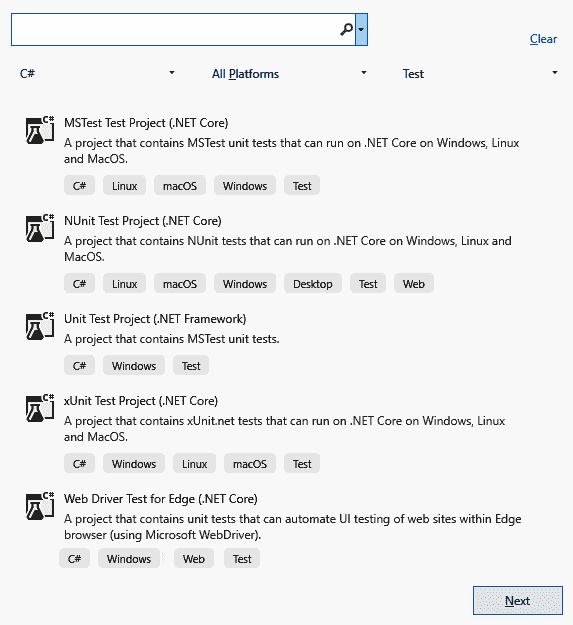
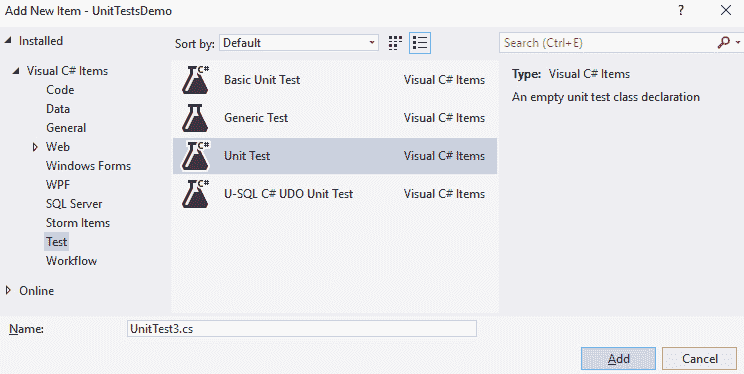
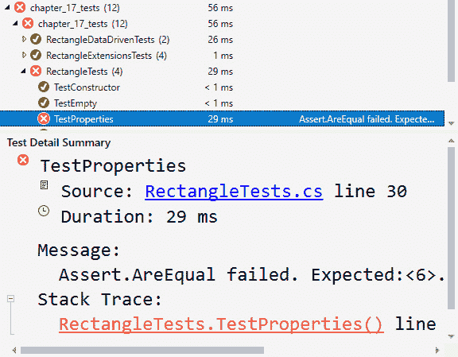
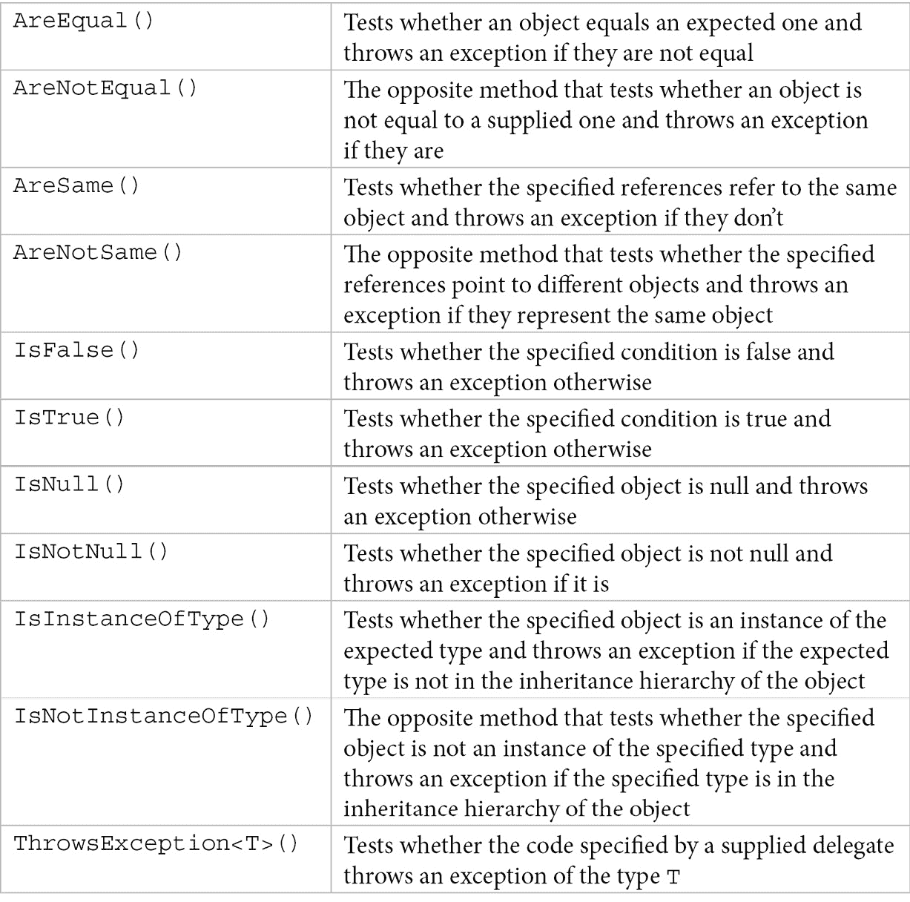
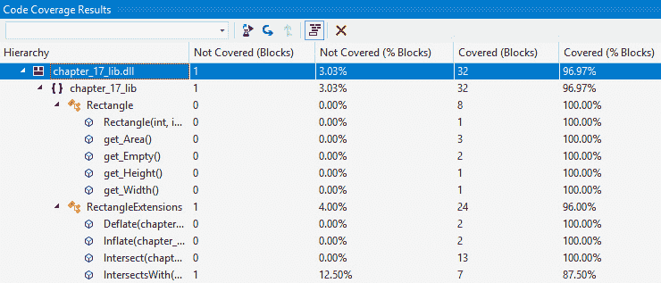

# 第 17 章:单元测试

在本书中，您已经学习了能够使用 C# 语言进行编程所需的所有知识——从语句到类，从泛型到函数编程，从反射到并发，以及许多其他知识。 我们还讨论了许多与。net Framework 和。net Core 相关的主题，包括集合、正则表达式、文件和流、资源管理和**语言集成查询**(**LINQ**)。

然而，编程的一个关键方面是确保代码的行为符合预期。 没有经过适当测试的代码很容易出现意外的错误。 测试有各种类型和级别，但开发人员在开发时通常执行的是*单元测试*。 这是本书最后一章的主题。 在本章中，您将了解什么是单元测试，以及有哪些内置工具可用于编写 C# 单元测试。 然后，我们将详细讨论如何利用这些工具来对 C# 代码进行单元测试。

本章主要讨论以下议题:

*   什么是单元测试?
*   什么是微软的单元测试工具?
*   创建一个 C# 单元测试项目
*   编写单元测试
*   编写数据驱动的单元测试

让我们从单元测试的概述开始。

# 什么是单元测试?

单元测试是一种类型的软件测试，对单个代码单元进行测试，以验证它们是否按照设计的方式工作。 单元测试是软件测试的第一层，其他的是集成测试、系统测试和验收测试。 对这些类型的测试的讨论超出了本书的范围。 单元测试通常由软件开发人员执行。

执行单元测试有重要的好处:

*   它有助于在开发周期的早期识别和修复错误，从而帮助节省时间和金钱。
*   它帮助开发人员更好地理解代码，并允许他们对代码库进行快速更改。
*   它要求代码更加模块化，以便更好地进行测试，从而有助于代码重用。
*   它可以作为项目文档。
*   它有助于加速开发，因为开发人员使用各种手工测试方法来识别 bug 的工作量要比编写单元测试所花费的时间大。
*   它简化了调试，因为当测试失败时，只需要查看和调试最新的更改。

测试的单元可能不同。 它可以是*函数*(在命令式编程中通常如此)，也可以是*类*(在面向对象编程中)。 单元是单独测试的，并与其他单元隔离。 这要求单元被设计成松散耦合的，但也使用诸如存根、mock 和 fake 等替代品。 虽然这些概念的定义可能不同，但存根是代替其他功能的函数，模拟它们的行为。 示例可能包括从 web 服务检索数据的函数的存根，或者将在稍后添加的功能的临时替代品。 mock 是模拟其他对象的行为的对象，这些对象通常很复杂，对于用于单元测试是不切实际的。 术语**fake**可以指或者*存根*或者*mock*，用来表示一个不真实的实体。

除了使用替代品，单元测试通常还需要使用测试工具。 测试工具是一种自动化测试框架，通过支持创建测试、执行测试和生成报告，可以实现测试的自动化。

单元测试覆盖了多少代码基的度量称为**代码覆盖率**。 代码覆盖率通过提供定量的度量来指示代码基础已经被测试的程度。 代码覆盖帮助我们识别程序中没有被测试用例很好覆盖的部分，并允许我们创建更多的测试来增加覆盖。

# 什么是微软的单元测试工具?

如果您正在使用 Visual Studio，那么有几个工具可以帮助您为 C# 代码编写单元测试。 这些工具包括:

*   测试资源管理器:这是 IDE 的一个组件，它允许您查看单元测试、运行它们并查看它们的结果。 **测试资源管理器**不能单独与 MSTest(微软的测试单元框架)一起工作。 它有一个可扩展的 API，允许为第三方框架开发适配器。 一些为**Test Explorer**提供适配器的框架有**NUnit**和**xUnit**。
*   **Microsoft 单元测试框架(用于托管代码或 MSTest)**:该框架安装在 VisualStudio 中，但也可以作为 NuGet 包使用。 还有一个用于具有类似功能的本地代码的单元测试框架。
*   代码覆盖工具:它们允许您确定单元测试所覆盖的代码数量。
*   **Microsoft Fakes 隔离框架**:这允许您创建类和方法的替代品。 目前，这只适用于。net Framework 和 Visual Studio Enterprise。 目前，. net 标准项目不受支持。

在编写本书时，使用微软的。net framework 和。net Core 测试框架的经验有一点不同，因为。net Core 测试项目没有单元测试模板。 这意味着您需要手动创建测试类和方法，并使用适当的属性装饰它们，稍后我们将看到这一点。

# 创建一个 C# 单元测试项目

在这一节中，我们将一起看看你如何在 Visual Studio 2019 中创建一个单元测试项目。 当您打开**文件**|**新项目**菜单时，您可以在各种测试项目之间进行选择:



图 17.1 - Visual Studio 2019 单元测试项目模板

如果您需要测试。net 框架项目，那么您可以选择**单元测试项目(。 NET Framework)**。

将为您创建一个包含以下内容的单个单元测试文件:

```cs
using System;
using Microsoft.VisualStudio.TestTools.UnitTesting;
namespace UnitTestDemo
{
    [TestClass]
    public class UnitTest1
    {
        [TestMethod]
        public void TestMethod1()
        {
        }
    }
}
```

这里，**UnitTest1**是一个包含测试方法的类。 这个类被标记为**TestClassAttribute**属性。 另一个属性**TestMethodAttribute**用于标记**TestMethod1()**方法。 测试框架使用这些属性来识别包含测试的类和方法。 然后在**Test Explorer 中显示**，您可以在其中运行或调试它们并查看它们的结果，如下面的截图所示:


图 17.2 - Visual Studio 中的测试资源管理器显示了执行从所选模板创建的空单元测试的结果

你可以手动添加更多的单元测试类，也可以使用 Visual Studio 中可用的测试模板，如下图所示:



图 17.3 - Visual Studio 中带有单元测试项选择的 Add New Item 对话框

如果您正在测试。net Core 项目，那么您应该选择名为**MSTest Test project(。 创建测试项目时**(参考本节开头的截图)。 结果是一个具有单个文件和相同内容的项目。 但是，使用向导添加更多单元测试项是不可能的，您必须手动创建所有内容。 此时，对于。net Core 的 MSTest 没有项模板可用。

在本章的剩余部分中，我们将专注于测试。net Core 项目。

# 编写单元测试

在本节中，我们将看看如何为 C# 代码编写单元测试。 为此，我们将考虑以下矩形的实现:

```cs
public struct Rectangle
{
    public readonly int Left;
    public readonly int Top;
    public readonly int Right;
    public readonly int Bottom;
    public int Width => Right - Left;
    public int Height => Bottom - Top;
    public int Area => Width * Height;
    public Rectangle(int left, int top, int right, int bottom)
    {
        Left = left;
        Top = top;
        Right = right;
        Bottom = bottom;
    }
    public static Rectangle Empty => new Rectangle(0, 0, 0, 0); 
}
```

这个实现应该是直接的，不需要进一步解释。 这是一个简单的类，没有提供太多关于矩形的功能。 我们可以提供更多的扩展方法的形式。 下面的清单显示了增加和减少矩形大小的扩展，以及检查两个矩形是否相交，并确定它们相交的结果矩形:

```cs
public static class RectangleExtensions
{
    public static Rectangle Inflate(this Rectangle r, 
                                    int left, int top, 
                                    int right, int bottom) =>
        new Rectangle(r.Left + left, r.Top + top, 
                      r.Right + right, r.Bottom + bottom);
    public static Rectangle Deflate(this Rectangle r, 
                                    int left, int top, 
                                    int right, int bottom) =>
        new Rectangle(r.Left - left, r.Top - top, 
                      r.Right - right, r.Bottom - bottom);
    public static Rectangle Interset(
      this Rectangle a, Rectangle b)
    {
        int l = Math.Max(a.Left, b.Left);
        int r = Math.Min(a.Right, b.Right);
        int t = Math.Max(a.Top, b.Top);
        int bt = Math.Min(a.Bottom, b.Bottom);
        if (r >= l && bt >= t)
            return new Rectangle(l, t, r, bt);
        return Rectangle.Empty;
    }
    public static bool IntersectsWith(
       this Rectangle a, Rectangle b) =>
        ((b.Left < a.Right) && (a.Left < b.Right)) &&
        ((b.Top < a.Bottom) && (a.Top < b.Bottom));
}
```

我们将通过测试**矩形**结构来开始，为此，我们必须创建一个如前一节所述的单元测试项目。 在项目创建之后，我们可以用下面的代码编辑生成的存根:

```cs
[TestClass]
public class RectangleTests
{
    [TestMethod]
    public void TestEmpty()
    {
        var rectangle = Rectangle.Empty;
        Assert.AreEqual(0, rectangle.Left);
        Assert.AreEqual(0, rectangle.Top);
        Assert.AreEqual(0, rectangle.Right);
        Assert.AreEqual(0, rectangle.Bottom);
    }
    [TestMethod]
    public void TestConstructor()
    {
        var rectangle = new Rectangle(1, 2, 3, 4);
        Assert.AreEqual(1, rectangle.Left);
        Assert.AreEqual(2, rectangle.Top);
        Assert.AreEqual(3, rectangle.Right);
        Assert.AreEqual(4, rectangle.Bottom);
    }
    [TestMethod]
    public void TestProperties()
    {
      var rectangle = new Rectangle(1, 2, 3, 4);
      Assert.AreEqual(2, rectangle.Width, "With must be 2");
      Assert.AreEqual(2, rectangle.Height, "Height must be 2");
      Assert.AreEqual(4, rectangle.Area, "Area must be 4"); 
    }
    [TestMethod]
    public void TestPropertiesMore()
    {
        var rectangle = new Rectangle(1, 2, -3, -4);
        Assert.IsTrue(rectangle.Width < 0,
                      "Width should be negative");
        Assert.IsFalse(rectangle.Height > 0,
                       "Height should be negative");
    }
}
```

在这个清单中，我们有一个测试类，称为**RectangleTests**，它包含几个测试方法:

*   **TestEmpty()**
*   TestConstructor()函数
*   **TestProperties()**
*   **TestPropertiesMore()**

这些方法中的每一个都测试矩形类的某些部分。 为此，我们使用了**Microsoft.VisualStudio.TestTools.UnitTesting**中的**Assert**类。 该类包含一组静态方法，这些方法可以帮助我们执行测试。 当测试失败时，抛出一个异常，测试方法的执行停止并继续下一个测试方法。

在下面的屏幕截图中，我们可以看到执行前面编写的测试方法的结果。 您可以看到所有测试都已成功执行:


图 17.4 - Test Explorer 显示了先前编写的测试方法的成功执行

当测试失败时，它将显示为带有红色子弹的，您可以在**test Explorer**窗口中检查失败的原因。 例如，假设我们更改**TestProperties()**方法，使其具有以下不正确的测试:

```cs
Assert.AreEqual(6, rectangle.Area, "Area must be 6");
```

这将使**TestProperties()**测试方法失败，如下面的截图所示:


图 17.5 - Test Explorer 显示 TestProperties()方法失败后测试方法的执行

失败的原因在**测试详细信息摘要**窗格中详细说明，如下面的屏幕截图所示。 当您单击失败的测试时，将显示此窗格:



图 17.6 - Test Explorer 的 Test Detail Summary 窗格显示了关于失败测试的详细信息

从这份报告在这个面板中,我们可以看到**Assert.AreEqual()****行 30****RectangleTests.cs**失败了,因为预期的结果是**6 日【显示】但实际价值**4**。 我们还得到了提供给**Assert.AreEqual()**方法的消息。 来自前一张截图的整个文本信息如下:**

```cs
TestProperties
   Source: RectangleTests.cs line 30
   Duration: 29 ms
  Message: 
    Assert.AreEqual failed. Expected:<6>. Actual:<4>. Area must be 6
  Stack Trace: 
    RectangleTests.TestProperties() line 35
```

在目前编写的测试代码中，我们使用了几个断言方法:**AreEqual()**、**IsTrue()**和**IsFalse()**。 然而，这些并不是唯一可用的断言方法; 他们的名单很长。 一些最常用的断言方法如下表所示:



该表中列出的所有方法实际上都是重载的方法。 您可以通过在线查阅文档来获得完整的参考资料。

## 分析代码覆盖率

当我们创建**Rectangle**类时，我们还为它创建了几个扩展方法，所以我们应该编写更多的单元测试来涵盖这两个方法。 我们可以将这些测试放到另一个测试类中。 尽管本书附带的源代码包含了更多的单元测试，为了简洁起见，我们在这里只列出其中一些:

```cs
[TestClass]
public class RectangleExtensionsTests
{
    [TestMethod]
    public void TestInflate()
    {
        var rectangle1 = Rectangle.Empty.Inflate(1, 2, 3, 4);
        Assert.AreEqual(1, rectangle1.Left);
        Assert.AreEqual(2, rectangle1.Top);
        Assert.AreEqual(3, rectangle1.Right);
        Assert.AreEqual(4, rectangle1.Bottom);
    }
    [TestMethod]
    public void TestDeflate()
    {
        var rectangle1 = Rectangle.Empty.Deflate(1, 2, 3, 4);
        Assert.AreEqual(-1, rectangle1.Left);
        Assert.AreEqual(-2, rectangle1.Top);
        Assert.AreEqual(-3, rectangle1.Right);
        Assert.AreEqual(-4, rectangle1.Bottom);
    }
    [TestMethod]
    public void TestIntersectsWith()
    {
        var rectangle = new Rectangle(1, 2, 10, 12);
        var rectangle1 = new Rectangle(3, 4, 5, 6);
        var rectangle2 = new Rectangle(5, 10, 20, 13);
        var rectangle3 = new Rectangle(11, 13, 15, 16);
        Assert.IsTrue(rectangle.IntersectsWith(rectangle1));
        Assert.IsTrue(rectangle.IntersectsWith(rectangle2));
        Assert.IsFalse(rectangle.IntersectsWith(rectangle3));
    }
    [TestMethod]
    public void TestIntersect()
    {
        var rectangle = new Rectangle(1, 2, 10, 12);
        var rectangle1 = new Rectangle(3, 4, 5, 6);
        var rectangle3 = new Rectangle(11, 13, 15, 16);
        var intersection1 = rectangle.Intersect(rectangle1);
        var intersection3 = rectangle.Intersect(rectangle3);
        Assert.AreEqual(3, intersection1.Left);
        Assert.AreEqual(4, intersection1.Top);
        Assert.AreEqual(5, intersection1.Right);
        Assert.AreEqual(6, intersection1.Bottom);
        Assert.AreEqual(0, intersection3.Left);
        Assert.AreEqual(0, intersection3.Top);
        Assert.AreEqual(0, intersection3.Right);
        Assert.AreEqual(0, intersection3.Bottom);
    }
}
```

在编译单元测试项目之后，新的单元测试类和方法将出现在**test Explorer 中，**以便您可以运行或调试它们。 下面的截图显示了所有测试方法的成功执行:


图 17.7 - Test Explorer 窗口显示所有单元测试的成功执行，包括为矩形扩展方法编写的测试

我们还可以获得基于单元测试的代码覆盖率。 您可以从**Test Explorer**或**Test**顶级菜单中触发代码覆盖。 根据我们目前看到的单元测试，我们得到以下覆盖范围:



图 17.8 - Visual Studio 中的代码覆盖率结果窗格显示单元测试的代码覆盖率

在这里，我们可以看到**Rectangle**类完全被单元测试覆盖。 然而，包含扩展的静态类只覆盖了**96%**，因为扩展方法**IntersectsWith()**有八个块中的一个没有被我们所编写的单元测试覆盖。 我们可以使用此报告来识别测试未覆盖的代码部分，以便编写更多代码。

## 测试的解剖

到目前为止，在我们编写的测试中，我们已经看到了测试类和测试方法。 然而，测试类可能具有在不同阶段执行的其他方法。 下面的代码显示了一个完整的示例:

```cs
[TestClass]
public class YourUnitTests
{
   [AssemblyInitialize]
   public static void AssemblyInit(TestContext context) { }
   [AssemblyCleanup]
   public static void AssemblyCleanup() { }
   [ClassInitialize]
   public static void TestFixtureSetup(TestContext context) { }
   [ClassCleanup]
   public static void TestFixtureTearDown() { }
   [TestInitialize]
   public void Setup() { }
   [TestCleanup]
   public void TearDown() { }

   [TestMethod]
   public void TestMethod1() { }
   TestMethod]
   public void TestMethod2() { }
}
```

这些方法的名称是无关的。 这里重要的是用于标记它们的属性。 它们由测试框架反映出来，并决定调用方法的顺序。 对于这个特定的例子，顺序如下:

```cs
AssemblyInit()          // once per assembly
  TestFixtureSetup()    // once per test class
    Setup()             // before each test of the class
      TestMethod1()
    TearDown()          // after each test of the class
    Setup()
      TestMethod2()
    TearDown()
  TestFixtureTearDown() // once per test class
AssemblyCleanup()       // once per assembly
```

用于标记这些方法的属性列在下表中:


当您希望使用不同的数据集对同一功能进行多个测试时，您可以求助于从数据源检索这些测试。 托管代码的单元测试框架以我们将在下一节中看到的方式实现了这一点。

# 编写数据驱动的单元测试

如果你仔细看一下以前的测试,比如**TestIntersectsWith()**测试方法,你会发现我们尝试测试各种情况下,比如一个矩形的交集与其他几个相交的部分,一些没有。 这是一个简单的例子，在实践中，我们应该测试更多的矩形来覆盖所有可能的矩形相交情况。

通常，随着代码的发展，测试也在发展，您常常不得不向测试数据集添加更多的数据。 与在前面的示例中显式地在测试方法中写入数据不同，您可以从数据源获取数据。 然后对数据源中的每一行执行一次测试方法。 托管代码的单元测试框架支持三种不同的场景。

## 属性数据

第一个选项是通过一个名为**DataRowAttribute**的属性在代码中提供数据。 这个属性有一个构造函数，允许我们指定任意数量的参数。 然后，这些参数以相同的顺序转发给它所使用的测试方法的参数。 让我们看一个例子:

```cs
[DataTestMethod]
[DataRow(true, 3, 4, 5, 6)]
[DataRow(true, 5, 10, 20, 13)]
[DataRow(false, 11, 13, 15, 16)]
public void TestIntersectsWith_DataRows(
    bool result, 
    int left, int top, int right, int bottom)
{
    var rectangle = new Rectangle(1, 2, 10, 12);
    Assert.AreEqual(
        result,
        rectangle.IntersectsWith(
            new Rectangle(left, top, right, bottom)));
}
```

在这个例子中有几件事需要注意。 首先，用于表明这是一个数据驱动的测试方法的属性是**DataTestMethodAttribute**。 然而，为了兼容遗留代码，也支持**TestMethodAttribute**，尽管不鼓励。 要注意的第二件事是**DataRowAttribute**的使用。 我们用它来提供几个矩形的数据，以及测试方法中与参考矩形相交的预期结果。 如前所述，该方法针对数据源中的每一行执行，在本例中，这一行是**DataRow**属性的每次出现。

下面的清单显示了执行测试方法的输出:

```cs
Test has multiple result outcomes
   4 Passed
Results
    1) TestIntersectsWith_DataRows
      Duration: 8 ms
    2) TestIntersectsWith_DataRows (True,3,4,5,6)
      Duration: < 1 ms
    3) TestIntersectsWith_DataRows (True,5,10,20,13)
      Duration: < 1 ms
    4) TestIntersectsWith_DataRows (False,11,13,15,16)
      Duration: < 1 ms
```

如果数据源中的某一行使测试失败，则报告测试失败，但将对数据源中的下一行重复执行该方法。

## 动态数据

使用**DataRow**属性的是一种改进，因为它使测试代码更简单，但它不是的最佳选择。 一个稍微好一点的选择是从类的方法或属性动态获取数据。 这可以使用另一个名为**DynamicDataAttribute**的属性实现。 您必须指定数据源(方法或属性)的名称和类型。 下面的代码显示了一个示例:

```cs
public static IEnumerable<object[]> GetData()
{
    yield return new object[] { true, 3, 4, 5, 6 };
    yield return new object[] { true, 5, 10, 20, 13 };
    yield return new object[] { false, 11, 13, 15, 16 };
}
[DataTestMethod]
[DynamicData(nameof(GetData), DynamicDataSourceType.Method)]
public void TestIntersectsWith_DynamicData(
    bool result, 
    int left, int top, int right, int bottom)
{
    var rectangle = new Rectangle(1, 2, 10, 12);
    Assert.AreEqual(
        result,
        rectangle.IntersectsWith(
            new Rectangle(left, top, right, bottom)));
} 
```

在这个例子中，我们定义了一个名为**GetData()**的方法，该方法返回一个可枚举的对象数组序列。 我们用矩形边界和与参考矩形相交的结果填充这些数组。 然后，在测试方法上，我们使用**DynamicData**属性，并向它提供提供数据的方法名称和数据源类型(**DynamicDataSourceType)。 方法**)。 实际的测试代码与前面示例中的代码没有什么不同。

然而，这种替代方法也依赖于硬编码的数据。 最理想的解决方案是从外部数据源读取它。

## 外部数据

测试数据可以从外部源获取，例如 SQL Server 数据库、CSV 文件、Excel 文档或 XML。 为此，我们必须使用另一个属性，称为**DataSourceAttribute**。 此属性有几个构造函数，允许您指定到源的连接字符串和其他必要的参数。

请注意

在写这本书的时候，这个解决方案和这个属性只适用于。net Framework，还不支持。net Core。

要编写从外部源获取数据的测试方法，您需要能够访问关于该数据源的信息。 这是可能的帮助下一个**和 TestContext 对象,框架是作为参数传递给方法标有**AssemblyInitialize**或**ClassInitialize**属性。 获得该对象引用的一个更简单的解决方案是在测试类中提供一个名为**TestContext**的公共属性，其类型为**TestContext**，如下代码所示。 框架将自动使用对测试上下文对象的引用来设置它:**

```cs
public TestContext TestContext { get; set; }
```

然后我们可以使用上下文访问数据源信息。 在下面的示例中，我们重写了测试方法，以便从一个名为**TestData.csv**的 CSV 文件中获取数据，该文件位于与测试应用相同的文件夹中。 该文件的内容如下:

```cs
expected,left,top,right,bottom
true,3,4,5,6
true,5,10,20,13
false,11,13,15,16
```

第一列是与参考矩形相交的预期结果，每一行上的其他值是矩形的边界。 下面的代码中列出了使用从这个 CSV 文件中获取的数据执行的测试方法:

```cs
[DataTestMethod]
[DataSource("Microsoft.VisualStudio.TestTools.DataSource.CSV",
          "TestData.csv",
          "TestData# csv",
          DataAccessMethod.Sequential)]
public void TestIntersectsWith_CsvData()
{
    var rectangle = new Rectangle(1, 2, 10, 12);
    bool result = Convert.ToBoolean(
      TestContext.DataRow["Expected"]);
    int left = Convert.ToInt32(TestContext.DataRow["left"]);
    int top = Convert.ToInt32(TestContext.DataRow["top"]);
    int right = Convert.ToInt32(TestContext.DataRow["right"]);
    int bottom = Convert.ToInt32(
        TestContext.DataRow["bottom"]);
    Assert.AreEqual(
        result,
        rectangle.IntersectsWith(
            new Rectangle(left, top, right, bottom)));
}
```

您可以看到，与前面的方法不同，该方法没有参数。 通过**TestContext**对象的**DataRow**属性可以获得数据，并且对于 CSV 文件中的每一行调用此方法一次。

如果不希望在源代码中指定数据源信息(例如连接字符串)，则可以使用应用配置文件来提供这些信息。 为此，您必须添加一个自定义部分，然后定义连接字符串(包含名称、字符串和提供者名称)和数据源(包含名称、连接字符串名称、表名称和数据访问方法)。 对于我们在前面的示例中使用的CSV 文件，**App.config**文件如下所示:

```cs
<?xml version="1.0" encoding="utf-8" ?>
<configuration>
   <configSections>
      <section name="microsoft.visualstudio.testtools"
               type="Microsoft.VisualStudio.TestTools.UnitTesting.TestConfigurationSection, Microsoft.VisualStudio.TestPlatform.TestFramework.Extensions"/>
   </configSections>
   <connectionStrings>
         <add name="MyCSVConn"
              connectionString="TestData.csv"
              providerName="Microsoft.VisualStudio.TestTools.DataSource.CSV" />
      </connectionStrings>
   <microsoft.visualstudio.testtools>
      <dataSources>
         <add name="MyCSVDataSource"
              connectionString="MyCSVConn"
              dataTableName="TestData# csv"
              dataAccessMethod="Sequential"/>
      </dataSources>
   </microsoft.visualstudio.testtools>
</configuration>
```

定义了这个后,唯一的变化我们必须测试方法是改变**数据源属性,指定数据源的名称从**config 文件(**MyCSVDataSource**在我们的示例中)。 如下面的代码所示。****

 **```cs
[DataTestMethod]
[DataSource("MyCSVDataSource")]
public void TestIntersectsWith_CsvData()
{
    /* ... */
}
```

要获得关于如何为各种类型的数据源提供连接字符串的更多信息，您应该阅读在线文档。

# 总结

本书的最后一章致力于单元测试，这对于编写高质量代码至关重要。 我们从单元测试的基本介绍开始，学习了编写单元测试的 Microsoft 工具，包括托管代码的单元测试框架。 我们已经看到了如何使用这个框架为。net framework 和。net Core 创建单元测试项目。 然后我们看了单元测试框架最重要的特性，并学习了如何编写单元测试。 在上一节中，我们学习了数据驱动的测试，并了解了如何使用来自不同数据源的数据编写测试。

本书在此结束，我们作者想要感谢您花时间阅读它。 通过写这本书，我们试图为您提供所有对您精通 C# 语言至关重要的东西。 我们希望这本书能成为你学习和掌握 C# 语言的宝贵资源。

# 测试你所学的内容

1.  什么是单元测试，它最重要的好处是什么?
2.  Visual Studio 提供了哪些工具来帮助编写单元测试?
3.  Visual Studio 中的 Test Explorer 提供了哪些功能?
4.  如何指定单元测试项目中的类包含单元测试?
5.  可以使用什么类和方法来执行断言?
6.  如何检查单元测试的代码覆盖率?
7.  如何编写每个测试类只执行一次的测试 fixture ? 每个方法的测试夹具呢?
8.  什么是数据驱动的单元测试?
9.  **dynamicdata 属性**做什么? 那么**DataSourceAttribute**呢?
10.  测试数据支持的外部来源是什么?**