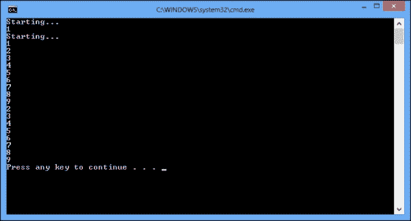

# 第 1 章螺纹基础

在本章中，我们将介绍在 C# 中使用线程的基本任务。您将了解：

*   在 C 中创建线程#
*   暂停线程
*   让线程等待
*   中止线程
*   确定线程状态
*   线程优先级
*   前台和后台线程
*   向线程传递参数
*   使用 C# lock 关键字锁定
*   使用监视器构造锁定
*   异常处理

# 导言

在过去的某个时候，普通计算机只有一个计算单元，不能同时执行多个计算任务。然而，操作系统可能已经可以同时处理多个程序，实现多任务的概念。为了防止一个程序控制 CPU，永远导致其他应用程序和操作系统本身挂起，操作系统必须以某种方式将一个物理计算单元拆分为几个虚拟处理器，并为每个执行程序提供一定的计算能力。此外，操作系统必须始终具有对 CPU 的优先访问权，并且应该能够对不同程序的 CPU 访问进行优先排序。线程就是这个概念的一个实现。它可以被视为一个虚拟处理器，提供给独立运行它的特定程序。

### 注

请记住，线程会消耗大量的操作系统资源。试图跨多个线程共享一个物理处理器将导致操作系统忙于管理线程而不是运行程序的情况。

因此，虽然可以增强计算机处理器，使其每秒执行越来越多的命令，但处理线程通常是一项操作系统任务。尝试在单核 CPU 上并行计算某些任务是没有意义的，因为这比按顺序运行这些计算要花费更多的时间。然而，当处理器开始拥有更多的计算核心时，较旧的程序无法利用这一点，因为它们只使用一个处理器核心。

为了有效地使用现代处理器的计算能力，以一种能够使用多个计算核心的方式编写程序是非常重要的，这将导致将程序组织为多个线程，相互通信和同步。

本章中的方法将重点介绍如何使用 C# 语言中的线程执行一些非常基本的操作。我们将介绍线程的生命周期，包括创建、挂起、使线程等待和中止线程，然后我们将介绍基本的同步技术。

# 在 C 中创建线程#

在下面的过程中，我们将使用 Visual Studio 2012 作为主要的工具，用 C# 编写多线程程序。这个配方将向您展示如何创建一个新的 C# 程序并在其中使用线程。

### 注

有免费的Visual Studio 2012 快速版，可从 Microsoft 网站下载。对于大多数示例，我们需要 Visual Studio 2012 Express for Windows Desktop，对于 Windows 8，我们需要 Visual Studio 2012 Express for Windows 8 以获取特定于 Windows 8 的配方。

## 准备好了吗

要完成这个配方，您需要 Visual Studio 2012。没有其他先决条件。此配方的源代码可在`BookSamples\Chapter1\Recipe1`中找到。

### 提示

**下载示例代码**

您可以下载通过您的账户[购买的所有 Packt 书籍的示例代码文件 http://www.packtpub.com](http://www.packtpub.com) 。如果您在其他地方购买了本书，您可以访问[http://www.packtpub.com/support](http://www.packtpub.com/support) 并注册，将文件直接通过电子邮件发送给您。

## 怎么做。。。

要了解如何创建新的 C# 程序并在其中使用线程，请执行以下步骤：

1.  启动 Visual Studio 2012。创建一个新的 C#**控制台应用程序**项目。
2.  Make sure that the project uses .NET Framework 4.0 or higher version.

    

3.  在`Program.cs`文件中添加以下`using`指令：

    ```cs
    using System;
    using System.Threading;
    ```

4.  在`Main`方法下方添加以下代码片段：

    ```cs
    static void PrintNumbers()
    {
      Console.WriteLine("Starting...");
      for (int i = 1; i < 10; i++)
      {
        Console.WriteLine(i);
      }
    }
    ```

5.  在`Main`方法中添加以下代码段：

    ```cs
    Thread t = new Thread(PrintNumbers);
    t.Start();
    PrintNumbers();
    ```

6.  Run the program. The output will be something like:

    

## 它是如何工作的。。。

在第 1 步和第 2 步中，我们使用.NETFramework 版本 4.0在 C# 中创建了一个简单的控制台应用程序。然后在步骤 3 中，我们包括名称空间`System.Threading`，其中包含程序所需的所有类型。

### 注

正在执行的程序实例可以称为进程。进程由一个或多个线程组成。这意味着当我们运行一个程序时，我们总是有一个主线程来执行程序代码。

在步骤 4 中，我们定义了方法`PrintNumbers`，它将在主线程和新创建的线程中使用。然后在步骤 5 中，我们创建了一个运行`PrintNumbers`的线程。当我们构造线程时，`ThreadStart`或`ParameterizedThreadStart`委托的一个实例被传递给构造函数。C# 编译器正在幕后创建这个对象，而我们只需键入要在不同线程中运行的方法的名称。然后我们启动一个线程，并以通常的方式在主线程上运行`PrintNumbers`。

因此，将有两个从 1 到 10 的数字范围相互随机交叉。这说明了`PrintNumbers`方法在主线程和其他线程上同时运行。

# 暂停线程

此配方将向您展示如何让线程等待一段时间而不浪费操作系统资源。

## 准备好了吗

要完成此配方，您需要 Visual Studio 2012。没有其他先决条件。此配方的源代码可在`BookSamples\Chapter1\Recipe2`中找到。

## 怎么做。。。

要了解如何使线程等待而不浪费操作系统资源，请执行以下步骤：

1.  启动 Visual Studio 2012。创建一个新的 C#**控制台应用程序**项目。
2.  在`Program.cs`文件中添加以下`using`指令：

    ```cs
    using System;
    using System.Threading;
    ```

3.  在`Main`方法下方添加以下代码片段：

    ```cs
    static void PrintNumbers()
    {
      Console.WriteLine("Starting...");
      for (int i = 1; i < 10; i++)
      {
        Console.WriteLine(i);
      }
    }
    static void PrintNumbersWithDelay()
    {
      Console.WriteLine("Starting...");
      for (int i = 1; i < 10; i++)
      {
        Thread.Sleep(TimeSpan.FromSeconds(2));
        Console.WriteLine(i);
      }
    }
    ```

4.  在`Main`方法中添加以下代码片段：

    ```cs
    Thread t = new Thread(PrintNumbersWithDelay);
    t.Start();
    PrintNumbers();
    ```

5.  运行程序。

## 它是如何工作的。。。

当程序运行时，它会创建一个线程，该线程将执行`PrintNumbersWithDelay`方法中的代码。紧接着，它运行`PrintNumbers`方法。这里的关键特性是将`Thread.Sleep`方法调用添加到`PrintNumbersWithDelay`方法。它会导致执行此代码的线程在打印每个数字之前等待指定的时间量（在本例中为两秒）。当线程处于睡眠状态时，它使用尽可能少的 CPU 时间。因此，我们将看到通常稍后运行的`PrintNumbers`方法中的代码将在单独线程中的`PrintNumbersWithDelay`方法中的代码之前执行。

# 让线程等待

此配方将向您展示一个程序如何等待另一个线程中的某些计算完成，以便稍后在代码中使用其结果。仅使用`Thread.Sleep`是不够的，因为我们不知道计算所需的确切时间。

## 准备好了吗

要完成此配方，您需要 Visual Studio 2012。没有其他先决条件。此配方的源代码可在`BookSamples\Chapter1\Recipe3`中找到。

## 怎么做。。。

要了解程序如何等待另一个线程中的某些计算完成，以便稍后使用其结果，请执行以下步骤：

1.  启动 Visual Studio 2012。创建一个新的 C#**控制台应用程序**项目。
2.  在`Program.cs`文件中，添加以下`using`指令：

    ```cs
    using System;
    using System.Threading;
    ```

3.  在`Main`方法下方添加以下代码片段：

    ```cs
    static void PrintNumbersWithDelay()
    {
      Console.WriteLine("Starting...");
      for (int i = 1; i < 10; i++)
      {
        Thread.Sleep(TimeSpan.FromSeconds(2));
        Console.WriteLine(i);
      }
    }
    ```

4.  在`Main`方法中添加以下代码片段：

    ```cs
    Console.WriteLine("Starting...");
    Thread t = new Thread(PrintNumbersWithDelay);
    t.Start();
    t.Join();
    Console.WriteLine("Thread completed");
    ```

5.  运行程序。

## 它是如何工作的。。。

当程序运行时，它运行一个长时间运行的线程，打印出数字，并在打印每个数字之前等待两秒钟。但是在主程序中，我们调用了`t.Join`方法，它允许我们等待线程`t`完成。完成后，主程序继续运行。借助此技术，可以在两个线程之间同步执行步骤。第一个等待，直到另一个完成，然后继续工作。当第一个线程正在等待时，它处于阻塞状态（正如您调用`Thread.Sleep`时在上一个配方中一样）。

# 中止线程

在这个配方中，我们将描述如何中止另一个线程的执行。

## 准备好了吗

要完成此配方，您需要 Visual Studio 2012。没有其他先决条件。此配方的源代码可在`BookSamples\Chapter1\Recipe4`中找到。

## 怎么做。。。

要了解如何中止另一个线程的执行，请执行以下步骤：

1.  启动 VisualStudio 2012。创建一个新的 C#**控制台应用程序**项目。
2.  在`Program.cs`文件中，添加以下`using`指令：

    ```cs
    using System;
    using System.Threading;
    ```

3.  在`Main`方法下方添加以下代码片段：

    ```cs
    static void PrintNumbersWithDelay()
    {
      Console.WriteLine("Starting...");
      for (int i = 1; i < 10; i++)
      {
        Thread.Sleep(TimeSpan.FromSeconds(2));
        Console.WriteLine(i);
      }
    }
    ```

4.  在`Main`方法中添加以下代码片段：

    ```cs
    Console.WriteLine("Starting program...");
    Thread t = new Thread(PrintNumbersWithDelay);
    t.Start();
    Thread.Sleep(TimeSpan.FromSeconds(6));
    t.Abort();
    Console.WriteLine("A thread has been aborted");
    Thread t = new Thread(PrintNumbers);
    t.Start();
    PrintNumbers();
    ```

5.  运行程序。

## 它是如何工作的。。。

当主程序和一个单独的数字打印线程运行时，我们等待 6 秒，然后调用线程上的`t.Abort`方法。这会向线程中注入一个`ThreadAbortException`方法，从而导致线程终止。这是非常危险的，通常是因为此异常可能在任何时候发生，并可能完全破坏应用程序。此外，使用这种技术并不总是能够终止线程。目标线程可以通过处理此异常并调用`Thread.ResetAbort`方法来拒绝中止。因此，不建议您使用`Abort`方法关闭线程。有不同的方法是首选的，例如提供一个`CancellationToken`方法来取消线程执行。此方法将在[第 3 章](03.html "Chapter 3. Using a Thread Pool")*使用线程池*中描述。

# 确定线程状态

此配方将描述线程可能具有的状态。获取有关线程是否已启动或是否处于阻塞状态的信息非常有用。请注意，因为线程是独立运行的，所以它的状态可以随时更改。

## 准备好了吗

要完成此配方，您需要 Visual Studio 2012。没有其他先决条件。此配方的源代码可在`BookSamples\Chapter1\Recipe5`中找到。

## 怎么做。。。

要了解如何确定线程状态并获取有关它的有用信息，请执行以下步骤：

1.  启动 Visual Studio 2012。创建一个新的 C#**控制台应用程序**项目。
2.  在`Program.cs`文件中，添加以下`using`指令：

    ```cs
    using System;
    using System.Threading;
    ```

3.  在`Main`方法下方添加以下代码片段：

    ```cs
    static void DoNothing()
    {
      Thread.Sleep(TimeSpan.FromSeconds(2));
    }

    static void PrintNumbersWithStatus()
    {
      Console.WriteLine("Starting...");
      Console.WriteLine(Thread.CurrentThread
      .ThreadState.ToString());
      for (int i = 1; i < 10; i++)
      {
        Thread.Sleep(TimeSpan.FromSeconds(2));
        Console.WriteLine(i);
      }
    }
    ```

4.  在`Main`方法中添加以下代码片段：

    ```cs
    Console.WriteLine("Starting program...");
    Thread t = new Thread(PrintNumbersWithStatus);
    Thread t2 = new Thread(DoNothing);
    Console.WriteLine(t.ThreadState.ToString());
    t2.Start();
    t.Start();
    for (int i = 1; i < 30; i++)
    {
      Console.WriteLine(t.ThreadState.ToString());
    }
    Thread.Sleep(TimeSpan.FromSeconds(6));
    t.Abort();
    Console.WriteLine("A thread has been aborted");
    Console.WriteLine(t.ThreadState.ToString());
    Console.WriteLine(t2.ThreadState.ToString());
    ```

5.  运行程序。

## 它是如何工作的。。。

当主程序启动时，它定义了两个不同的线程；其中一个将被中止，另一个将成功运行。线程状态位于`Thread`对象的`ThreadState`属性中，该对象是 C# 枚举。首先，线程具有`ThreadState.Unstarted`状态。然后，我们运行它，并假设在一个周期的 30 次迭代期间，线程将其状态从`ThreadState.Running`更改为`ThreadState.WaitSleepJoin`。

### 提示

请注意，当前的`Thread`对象始终可以通过`Thread.CurrentThread`静态属性访问。

如果没有发生，只需增加迭代次数。然后我们中止第一个线程，并看到它现在有一个`ThreadState.Aborted`状态。程序也可能打印出`ThreadState.AbortRequested`状态。这很好地说明了同步两个线程的复杂性。请记住，您不应该在程序中使用线程终止。我在这里讨论它只是为了显示相应的线程状态。

最后，我们可以看到我们的第二个线程`t2`成功完成，现在有一个`ThreadState.Stopped`状态。还有其他几个州，但它们部分被弃用，部分不如我们研究的那些州有用。

# 线程优先级

此配方将描述线程优先级的不同可能选项。设置线程优先级决定一个线程的 CPU 时间。

## 准备好了吗

要完成此配方，您需要 Visual Studio 2012。没有其他先决条件。此配方的源代码可在`BookSamples\Chapter1\Recipe6`中找到。

## 怎么做。。。

要了解线程优先级的工作原理，请执行以下步骤：

1.  启动 Visual Studio 2012。创建一个新的 C#**控制台应用程序**项目。
2.  在`Program.cs`文件中，添加以下`using`指令：

    ```cs
    using System;
    using System.Diagnostics;
    using System.Threading;
    ```

3.  在`Main`方法下方添加以下代码片段：

    ```cs
    static void RunThreads()
    {
      var sample = new ThreadSample();

      var threadOne = new Thread(sample.CountNumbers);
      threadOne.Name = "ThreadOne";
      var threadTwo = new Thread(sample.CountNumbers);
      threadTwo.Name = "ThreadTwo";

      threadOne.Priority = ThreadPriority.Highest;
      threadTwo.Priority = ThreadPriority.Lowest;
      threadOne.Start();
      threadTwo.Start();

      Thread.Sleep(TimeSpan.FromSeconds(2));
      sample.Stop();
    }
    class ThreadSample
    {
      private bool _isStopped = false;
      public void Stop()
      {
        _isStopped = true;
      }

      public void CountNumbers()
      {
        long counter = 0;

        while (!_isStopped)
        {
          counter++;
        }

        Console.WriteLine("{0} with {1,11} priority " +"has a count = {2,13}", Thread.CurrentThread.Name, Thread.CurrentThread.Priority,counter.ToString("N0"));
      }
    }
    ```

4.  在`Main`方法中添加以下代码片段：

    ```cs
    Console.WriteLine("Current thread priority: {0}", Thread.CurrentThread.Priority);
    Console.WriteLine("Running on all cores available");
    RunThreads();
    Thread.Sleep(TimeSpan.FromSeconds(2));
    Console.WriteLine("Running on a single core");
    Process.GetCurrentProcess().ProcessorAffinity = new IntPtr(1);
    RunThreads();
    ```

5.  运行程序。

## 它是如何工作的。。。

当主程序启动时，它定义两个不同的线程。第一个`ThreadPriority.Highest`将具有最高的线程优先级，而第二个`ThreadPriority.Lowest`将具有最低的线程优先级。我们打印出主线程优先级值，然后在所有可用内核上启动这两个线程。如果我们有一个以上的计算核心，我们应该在两秒钟内得到一个初始结果。最高优先级的线程通常应该计算更多的迭代次数，但这两个值应该接近。但是，如果有任何其他运行的程序加载所有 CPU 内核，情况可能会完全不同。

为了模拟这种情况，我们设置了`ProcessorAffinity`选项，指示操作系统在一个 CPU 核上运行所有线程（第一）。现在的结果应该是非常不同的，计算将需要超过 2 秒。发生这种情况是因为 CPU 核心将主要运行高优先级线程，给其余线程很少的时间。

请注意这是一个说明操作系统如何使用线程优先级的例子。通常，您不应该根据这种行为编写程序。

# 前台和后台线程

此配方将描述什么是前景和背景线程，以及设置此选项如何影响程序的行为。

## 准备好了吗

要完成此配方，您需要 Visual Studio 2012。没有其他先决条件。此配方的源代码可在`BookSamples\Chapter1\Recipe7`中找到。

## 怎么做。。。

要了解前台和后台线程对程序的影响，请执行以下操作：

1.  启动 Visual Studio 2012。创建一个新的 C#**控制台应用程序**项目。
2.  在`Program.cs`文件中，添加以下`using`指令：

    ```cs
    using System;
    using System.Threading;
    ```

3.  在`Main`方法下方添加以下代码片段：

    ```cs
    class ThreadSample
    {
      private readonly int _iterations;

      public ThreadSample(int iterations)
      {
        _iterations = iterations;
      }
      public void CountNumbers()
      {
        for (int i = 0; i < _iterations; i++)
        {
          Thread.Sleep(TimeSpan.FromSeconds(0.5));
          Console.WriteLine("{0} prints {1}", Thread.CurrentThread.Name, i);
        }
      }
    }
    ```

4.  在`Main`方法中添加以下代码片段：

    ```cs
    var sampleForeground = new ThreadSample(10);
    var sampleBackground = new ThreadSample(20);

    var threadOne = new Thread(sampleForeground.CountNumbers);
    threadOne.Name = "ForegroundThread";
    var threadTwo = new Thread(sampleBackground.CountNumbers);
    threadTwo.Name = "BackgroundThread";
    threadTwo.IsBackground = true;

    threadOne.Start();
    threadTwo.Start();
    ```

5.  运行程序。

## 它是如何工作的。。。

当主程序启动时，它定义了两个不同的线程。默认情况下，我们显式创建的线程是前台线程。为了创建背景线程，我们手动将`threadTwo`对象的`IsBackground`属性设置为`true`。我们以第一个线程完成得更快的方式配置这些线程，然后运行程序。

第一个线程完成后，程序关闭，后台线程终止。这是两者之间的主要区别：进程在完成工作之前等待所有前台线程完成，但如果它有后台线程，则它们只是关闭。

同样重要的是，如果一个程序定义了一个未完成的前台线程，那么主程序将无法正常结束。

# 向线程传递参数

这个方法将描述如何提供我们在另一个线程中运行的代码，以及所需的数据。我们将通过不同的方式完成这项任务，并回顾常见错误。

## 准备好了吗

要完成此配方，您需要 Visual Studio 2012。没有其他先决条件。此配方的源代码可在`BookSamples\Chapter1\Recipe8`中找到。

## 怎么做。。。

要了解如何将参数传递给线程，请执行以下步骤：

1.  启动 Visual Studio 2012。创建一个新的 C#**控制台应用程序**项目。
2.  在`Program.cs`文件中，添加以下`using`指令：

    ```cs
    using System;
    using System.Threading;
    ```

3.  在`Main`方法下方添加以下代码片段：

    ```cs
    static void Count(object iterations)
    {
      CountNumbers((int)iterations);
    }

    static void CountNumbers(int iterations)
    {
      for (int i = 1; i <= iterations; i++)
      {
        Thread.Sleep(TimeSpan.FromSeconds(0.5));
        Console.WriteLine("{0} prints {1}", Thread.CurrentThread.Name, i);
      }
    }
    static void PrintNumber(int number)
    {
      Console.WriteLine(number);
    }

    class ThreadSample
    {
      private readonly int _iterations;

      public ThreadSample(int iterations)
      {
        _iterations = iterations;
      }
      public void CountNumbers()
      {
        for (int i = 1; i <= _iterations; i++)
        {
          Thread.Sleep(TimeSpan.FromSeconds(0.5));
          Console.WriteLine("{0} prints {1}", Thread.CurrentThread.Name, i);
        }
      }
    }
    ```

4.  在`Main`方法中添加以下代码片段：

    ```cs
    var sample = new ThreadSample(10);

    var threadOne = new Thread(sample.CountNumbers);
    threadOne.Name = "ThreadOne";
    threadOne.Start();
    threadOne.Join();
    Console.WriteLine("--------------------------");

    var threadTwo = new Thread(Count);
    threadTwo.Name = "ThreadTwo";
    threadTwo.Start(8);
    threadTwo.Join();
    Console.WriteLine("--------------------------");

    var threadThree = new Thread(() => CountNumbers(12));
    threadThree.Name = "ThreadThree";
    threadThree.Start();
    threadThree.Join();
    Console.WriteLine("--------------------------");

    int i = 10;
    var threadFour = new Thread(() => PrintNumber(i));
    i = 20;
    var threadFive = new Thread(() => PrintNumber(i));
    threadFour.Start(); 
    threadFive.Start();
    ```

5.  运行程序。

## 它是如何工作的。。。

当主程序启动时，它首先创建一个类为`ThreadSample`的对象，为其提供多次迭代。然后我们用对象的方法`CountNumbers`启动一个线程。此方法在另一个线程中运行，但它使用数字 10，这是我们传递给对象构造函数的值。因此，我们只是以同样的间接方式将这个迭代次数传递给另一个线程。

## 还有更多…

传递数据的另一种方法是使用`Thread.Start`方法，通过接受可以传递给另一个线程的对象。要以这种方式工作，我们在另一个线程中启动的方法必须接受 object 类型的单个参数。此选项通过创建一个`threadTwo`线程来说明。我们将`8`作为对象传递给`Count`方法，将其转换为`integer`类型。

下一个选项涉及使用 lambda 表达式。lambda 表达式定义不属于任何类的方法。我们创建这样一个方法，用所需的参数调用另一个方法，并在另一个线程中启动它。当我们启动`threadThree`线程时，它会打印出 12 个数字，这些数字正是我们通过 lambda 表达式传递给它的数字。

使用 lambda 表达式涉及另一个名为`closure`的 C# 构造。当我们在 lambda 表达式中使用任何局部变量时，C# 生成一个类并使该变量成为该类的属性。所以实际上，我们在`threadOne`线程中做了相同的事情，但我们自己并不定义类；C# 编译器会自动执行此操作。

这可能导致几个问题；例如，如果我们使用来自多个 lambda 的同一变量，它们实际上将共享此变量值。前面的例子说明了这一点；当我们启动`threadFour`和`threadFive`时，它们都会打印`20`，因为变量在两个线程启动之前被更改为保存值`20`。

# 使用 C# lock 关键字锁定

此配方将描述如何确保如果一个线程使用某些资源，另一个线程不会同时使用它。我们将了解为什么需要这样做，以及线程安全概念是什么。

## 准备好了吗

要完成此配方，您需要 Visual Studio 2012。没有其他先决条件此配方的源代码可在`BookSamples\Chapter1\Recipe9`中找到。

## 怎么做。。。

要了解如何使用 C# lock 关键字，请执行以下步骤：

1.  启动 Visual Studio 2012。创建一个新的 C#**控制台应用程序**项目。
2.  在`Program.cs`文件中，添加以下`using`指令：

    ```cs
    using System;
    using System.Threading;
    ```

3.  在`Main`方法下方添加以下代码片段：

    ```cs
    static void TestCounter(CounterBase c)
    {
      for (int i = 0; i < 100000; i++)
      {
        c.Increment();
        c.Decrement();
      }
    }

    class Counter : CounterBase
    {
      public int Count { get; private set; }
      public override void Increment()
      {
        Count++;
      }

      public override void Decrement()
      {
        Count--;
      }
    }

    class CounterWithLock : CounterBase
    {
      private readonly object _syncRoot = new Object();

      public int Count { get; private set; }

      public override void Increment()
      {
        lock (_syncRoot)
        {
          Count++;
        }
      }

      public override void Decrement()
      {
        lock (_syncRoot)
        {
          Count--;
        }
      }
    }

    abstract class CounterBase
    {
      public abstract void Increment();
      public abstract void Decrement();
    }
    ```

4.  在`Main`方法中添加以下代码片段：

    ```cs
    Console.WriteLine("Incorrect counter");

    var c = new Counter();

    var t1 = new Thread(() => TestCounter(c));
    var t2 = new Thread(() => TestCounter(c));
    var t3 = new Thread(() => TestCounter(c));
    t1.Start();
    t2.Start();
    t3.Start();
    t1.Join();
    t2.Join();
    t3.Join();

    Console.WriteLine("Total count: {0}",c.Count);
    Console.WriteLine("--------------------------");
    Console.WriteLine("Correct counter");

    var c1 = new CounterWithLock();

    t1 = new Thread(() => TestCounter(c1));
    t2 = new Thread(() => TestCounter(c1));
    t3 = new Thread(() => TestCounter(c1));
    t1.Start();
    t2.Start();
    t3.Start();
    t1.Join();
    t2.Join();
    t3.Join();
    Console.WriteLine("Total count: {0}", c1.Count);
    ```

5.  运行程序。

## 它是如何工作的。。。

当主程序启动时，它首先创建一个类`Counter`的对象。这个类定义了一个可以递增和递减的简单计数器。然后，我们启动共享同一计数器实例的三个线程，并在一个周期内执行递增和递减操作。这会导致不确定的结果。如果我们多次运行该程序，它将打印出几个不同的计数器值。它可以是零，但大多数情况下不会是零。

这是因为`Counter`类不是线程安全的。当多个线程同时访问计数器时，第一个线程获取计数器值`10`并将其递增至 11。然后，第二个线程获取值 11 并将其递增为 12。第一个线程获得计数器值 12，但在减量发生之前，第二个线程同样获得计数器值 12。然后第一个线程将12 减至 11，并将其保存到计数器中，第二个线程同时执行相同操作。因此，我们有两个增量，只有一个减量，这显然是不对的。这种情况称为竞争条件，是多线程环境中常见的错误原因。

为了确保不会发生这种情况，我们必须确保当一个线程与计数器一起工作时，所有其他线程必须等到第一个线程完成工作。我们可以使用`lock`关键字来实现这种行为。如果我们`lock`一个对象，所有其他需要访问该对象的线程将以阻塞状态等待，直到它被解锁。这可能是一个严重的性能问题，稍后，在[第 2 章](02.html "Chapter 2. Thread Synchronization")、*线程同步*中，我们将进一步了解这一点。

# 使用监视器构造进行锁定

此配方说明了另一种常见的多线程错误，称为死锁。由于死锁会导致程序停止工作，因此本例中的第一部分是一个新的`Monitor`构造，它允许我们避免死锁。然后，使用前面描述的`lock`关键字获取死锁。

## 准备好了吗

要完成此配方，您需要 Visual Studio 2012。没有其他先决条件。此配方的源代码可在`BookSamples\Chapter1\Recipe10`中找到。

## 怎么做。。。

要了解多线程错误死锁，请执行以下步骤：

1.  启动 Visual Studio 2012。创建一个新的 C#**控制台应用程序**项目。
2.  在`Program.cs`文件中，添加以下`using`指令：

    ```cs
    using System;
    using System.Threading;
    ```

3.  在`Main`方法下方添加以下代码片段：

    ```cs
    static void LockTooMuch(object lock1, object lock2)
    {
      lock (lock1)
      {
        Thread.Sleep(1000);
        lock (lock2);
      }
    }
    ```

4.  在`Main`方法中添加以下代码段：

    ```cs
    object lock1 = new object();
    object lock2 = new object();

    new Thread(() => LockTooMuch(lock1, lock2)).Start();

    lock (lock2)
    {
      Thread.Sleep(1000);
      Console.WriteLine("Monitor.TryEnter allows not to get stuck, returning false after a specified timeout is elapsed");
      if (Monitor.TryEnter(lock1, TimeSpan.FromSeconds(5)))
      {
        Console.WriteLine("Acquired a protected resource succesfully");
      }
      else
      {
        Console.WriteLine("Timeout acquiring a resource!");
      }
    }
    new Thread(() => LockTooMuch(lock1, lock2)).Start();

    Console.WriteLine("----------------------------------");
    lock (lock2)
    {
      Console.WriteLine("This will be a deadlock!");
      Thread.Sleep(1000);
      lock (lock1)
      {
        Console.WriteLine("Acquired a protected resource succesfully");
      }
    }
    ```

5.  运行程序。

## 它是如何工作的。。。

让我们从`LockTooMuch`方法开始。在这种方法中，我们只需`lock`第一个对象，等待第二个对象，然后`lock`第二个对象。然后我们在另一个线程中启动这个方法，并尝试从主线程中`lock`第二个对象，然后是第一个对象。

如果我们在本演示的第二部分中使用`lock`关键字，这将是一个死锁。第一个线程在`lock1`对象上持有`lock`并等待`lock2`对象释放；主线程在`lock2`对象上持有`lock`并等待`lock1`对象释放，在这种情况下，这是永远不会发生的。

实际上，`lock`关键字是`Monitor`类用法的一种语法糖。如果我们用`lock`反汇编一段代码，我们会看到它会变成以下代码片段：

```cs
bool acquiredLock = false;
try
{
  Monitor.Enter(lockObject, ref acquiredLock);

// Code that accesses resources that are protected by the lock.

}
finally
{
  if (acquiredLock)
  {
    Monitor.Exit(lockObject);
  }
}
```

因此，我们可以直接使用`Monitor`类；它有`TryEnter`方法，接受一个超时参数，如果该超时参数在我们获取`lock`保护的资源之前过期，则返回`false`。

# 异常处理

此配方将描述如何正确处理其他线程中的异常。始终在线程内放置`try/catch`块非常重要，因为不可能捕获线程代码之外的异常。

## 准备好了吗

要完成此配方，您需要 Visual Studio 2012。没有其他先决条件。此配方的源代码可在`BookSamples\Chapter1\Recipe11`中找到。

## 怎么做。。。

要了解其他线程中异常的处理，请执行以下步骤：

1.  启动 Visual Studio 2012。创建一个新的 C#**控制台应用程序**项目。
2.  在文件`Program.cs`中添加以下`using`指令：

    ```cs
    using System;
    using System.Threading;
    ```

3.  在`Main`方法下方添加以下代码片段：

    ```cs
    static void BadFaultyThread()
    {
      Console.WriteLine("Starting a faulty thread...");
      Thread.Sleep(TimeSpan.FromSeconds(2));
      throw new Exception("Boom!");
    }

    static void FaultyThread()
    {
      try
      {
        Console.WriteLine("Starting a faulty thread...");
        Thread.Sleep(TimeSpan.FromSeconds(1));
        throw new Exception("Boom!");
      }
      catch (Exception ex)
      {
        Console.WriteLine("Exception handled: {0}", ex.Message);
      }
    }
    ```

4.  在`Main`方法中添加以下代码片段：

    ```cs
    var t = new Thread(FaultyThread);
    t.Start();
    t.Join();

    try
    {
      t = new Thread(BadFaultyThread);
      t.Start();
    }
    catch (Exception ex)
    {
      Console.WriteLine("We won't get here!");
    }
    ```

5.  运行程序。

## 它是如何工作的。。。

当主程序启动时，它定义了两个将引发异常的线程。其中一个线程处理异常，而另一个线程不处理异常。您可以看到，第二个异常没有被启动线程的代码周围的`try/catch`块捕获。因此，如果您直接使用线程，一般规则是不要从线程抛出异常，而是在线程代码中使用`try/catch`块。

在较旧版本的.NET Framework（1.0 和 1.1）中，此行为不同，未捕获的异常不会强制关闭应用程序。可以通过添加包含以下代码段的应用程序配置文件（如`app.config`）来使用此策略：

```cs
<configuration>
  <runtime>
    <legacyUnhandledExceptionPolicy enabled="1" />
  </runtime>
</configuration>
```