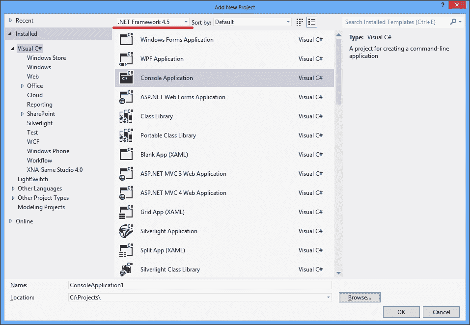
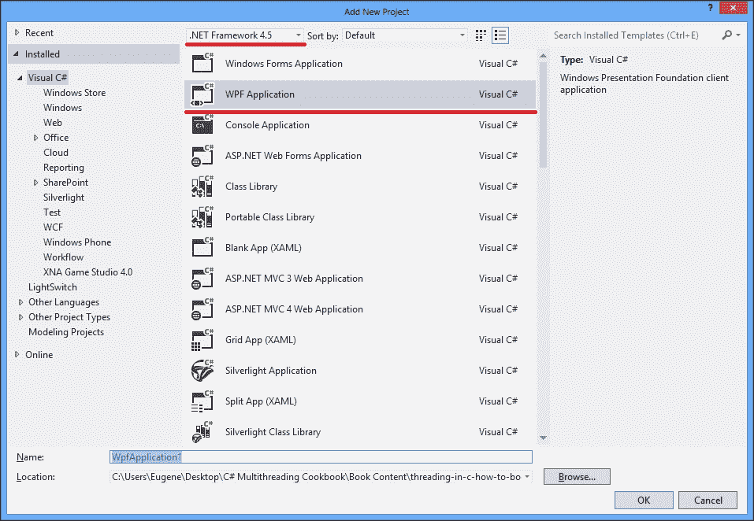

# 第四章使用任务并行库

在本章中，我们将深入研究一种新的异步编程范式，任务并行库。您将学习以下内容：

*   创建任务
*   使用任务执行基本操作
*   将任务组合在一起
*   将 APM 模式转换为任务
*   将 EAP 模式转换为任务
*   实施取消选项
*   处理任务中的异常
*   并行运行任务
*   使用 TaskScheduler 调整任务执行

# 导言

在前面的章节中，我们学习了什么是线程，如何使用线程，以及为什么需要线程池。使用线程池可以节省操作系统资源，但代价是降低并行度。我们可以将线程池视为一个**抽象层**，它向程序员隐藏线程使用的细节，使我们能够专注于程序的逻辑，而不是线程问题。

但是，使用线程池也很复杂。从线程池工作线程获取结果没有简单的方法。我们需要实现我们自己的方法来返回结果，如果出现异常，我们必须正确地将其传播到原始线程。除此之外，没有简单的方法可以创建一组依赖的异步操作，其中一个操作在另一个操作完成其工作后运行。

有几次尝试解决这些问题，结果创建了异步编程模型和基于事件的异步模式，如[第 3 章](03.html "Chapter 3. Using a Thread Pool")、*使用线程池*所述。这些模式使获得结果变得更容易，并且在传播异常方面做得很好，但是将异步操作组合在一起仍然需要大量工作，并产生大量代码。

为了解决所有这些问题，在.NETFramework 4.0 中引入了一个用于异步操作的新 API。称为**任务并行库**（**TPL**。在.NETFramework4.5 中做了一些改动，为了说明这一点，我们将在项目中使用最新版本的 TPL，即.NETFramework 的 4.5 版本。TPL 可以被看作是线程池上的另一个抽象层，对程序员隐藏将使用线程池的较低级别代码，并提供更方便和细粒度的 API。

第三方物流的核心概念是一项任务。任务表示一个异步操作，可以通过多种方式运行，无论是否使用单独的线程。我们将在本章中详细介绍所有可能性。

### 注

默认情况下，程序员不知道任务执行的准确程度。TPL 通过向用户隐藏任务实现细节来提高抽象级别。不幸的是，在某些情况下，这可能导致神秘的错误，例如在试图从任务中获得结果时挂起应用程序。本章将有助于理解第三方物流的运作机制，以及如何避免以不当方式使用第三方物流。

一项任务可以以不同的变体与其他任务组合。例如，我们可以同时启动多个任务，等待所有任务完成，然后运行一个任务，该任务将对以前所有任务的结果执行一些计算。与以前的模式相比，方便的任务组合 API 是 TPL 的关键优势之一。

还有几种方法可以处理任务导致的异常。由于一个任务可能由多个其他任务组成，而这些任务又有自己的子任务，因此有一个`AggregateException`的概念。这种类型的异常包含来自内部基础任务的所有异常，允许单独处理它们。

最后但并非最不重要的一点是，C#5.0内置了对 TPL 的支持，允许我们使用新的`await`和`async`关键字以非常流畅和舒适的方式处理任务。我们将在[第 5 章](05.html "Chapter 5. Using C# 5.0")*中使用 C#5.0*来讨论这个话题。

在本章中，我们将学习使用 TPL 执行异步操作。我们将学习什么是任务，介绍创建任务的不同方法，以及如何将任务组合在一起。我们还将讨论如何将传统 APM 和 EAP 模式转换为使用任务，如何正确处理异常，如何取消任务，以及如何处理同时执行的多个任务。此外，我们将了解如何正确处理 Windows GUI应用程序中的任务。

# 创建任务

这个食谱展示了任务的基本概念。您将学习如何创建和执行任务。

## 准备好了吗

要逐步完成此配方，您需要**Visual Studio 2012**。没有其他先决条件。此配方的源代码可在`BookSamples\Chapter4\Recipe1`中找到。

## 怎么做。。。

要创建和执行任务，请执行以下步骤：

1.  Start Visual Studio 2012\. Create a new C# **Console Application** project.

    ### 注

    这次，请确保您使用的是.Net Framework 4.5。从现在起，我们将在每个项目中使用此版本。

    

2.  在的`Program.cs`文件中，添加以下`using`指令：

    ```cs
    using System;
    using System.Threading;
    using System.Threading.Tasks;
    ```

3.  在`Main`方法下方添加以下代码片段：

    ```cs
    static void TaskMethod(string name){
      Console.WriteLine("Task {0} is running on a thread id{1}. Is thread pool thread: {2}", name,Thread.CurrentThread.ManagedThreadId,Thread.CurrentThread.IsThreadPoolThread);
    }
    ```

4.  在`Main`方法中添加以下代码片段：

    ```cs
    var t1 = new Task(() =>TaskMethod("Task 1"));
    var t2 = new Task(() =>TaskMethod("Task 2"));
    t2.Start();
    t1.Start();
    Task.Run(() =>TaskMethod("Task 3"));
    Task.Factory.StartNew(() => TaskMethod("Task 4"));
    Task.Factory.StartNew(() => TaskMethod("Task 5"),TaskCreationOptions.LongRunning);
    Thread.Sleep(TimeSpan.FromSeconds(1));
    ```

5.  运行程序。

## 它是如何工作的。。。

当程序运行时，它使用构造函数创建两个任务。我们将 lambda 表达式作为`Action`委托传递；这允许我们向`TaskMethod`提供一个字符串参数。然后，我们使用`Start`方法运行这些任务。

### 注

请注意，在我们对这些任务调用`Start`方法之前，它们不会开始执行。很容易忘记实际启动任务。

然后，我们使用`Task.Run`和`Task.Factory.StartNew`方法运行另外两个任务。的区别在于，两个创建的任务都立即开始工作，因此我们不需要显式地对任务调用`Start`方法。所有任务（编号为`Task 1`到`Task 4`）都放在线程池工作线程上，并以未指定的顺序运行。如果多次运行该程序，您会发现任务的执行顺序没有定义。

`Task.Run`方法只是`Task.Factory.StartNew`的捷径，但后者有额外的选项。一般来说，除非您需要做一些特殊的事情，否则请使用前一种方法，如`Task 5`的情况。我们将此任务标记为长时间运行，因此，此任务将在不使用线程池的单独线程上运行。但是，根据运行任务的当前**任务调度器**，此行为可能会发生变化。在本章的最后一个配方中，您将了解什么是任务调度器。

# 使用任务执行基本操作

此配方将描述如何从任务中获取结果值。我们将通过几个场景来了解在线程池或主线程上运行任务的区别。

## 准备好了吗

要开始此配方，您需要 Visual Studio 2012。没有其他先决条件。此配方的源代码可在`BookSamples\Chapter4\Recipe2`中找到。

## 怎么做。。。

要对任务执行基本操作，请执行以下步骤：

1.  启动 Visual Studio 2012。创建一个新的 C#**控制台应用程序**项目。
2.  在`Program.cs`文件中，添加以下`using`指令：

    ```cs
    using System;
    using System.Threading;
    using System.Threading.Tasks;
    ```

3.  在`Main`方法下方添加以下代码片段：

    ```cs
    static Task<int>CreateTask(string name){
      return new Task<int>(() =>TaskMethod(name));
    }

    static int TaskMethod(string name){
      Console.WriteLine("Task {0} is running on a thread id{1}. Is thread pool thread: {2}",name,Thread.CurrentThread.ManagedThreadId,Thread.CurrentThread.IsThreadPoolThread);
      Thread.Sleep(TimeSpan.FromSeconds(2));
      return 42;
    }
    ```

4.  在`Main`方法中添加以下代码片段：

    ```cs
    TaskMethod("Main Thread Task");
    Task<int> task = CreateTask("Task 1");
    task.Start();
    int result = task.Result;
    Console.WriteLine("Result is: {0}", result);

    task = CreateTask("Task 2");
    task.RunSynchronously();
    result = task.Result;
    Console.WriteLine("Result is: {0}", result);

    task = CreateTask("Task 3");
    task.Start();

    while (!task.IsCompleted){
      Console.WriteLine(task.Status);
      Thread.Sleep(TimeSpan.FromSeconds(0.5));
    } 

    Console.WriteLine(task.Status);
    result = task.Result;
    Console.WriteLine("Result is: {0}", result);
    ```

5.  运行程序。

## 它是如何工作的。。。

首先，我们运行`TaskMethod`时没有将其包装到任务中。因此，它是同步执行的，为我们提供了有关主线程的信息。显然，它不是一个线程池线程。

然后运行`Task 1`，用`Start`方法启动，等待结果。此任务将被放置在线程池中，主线程等待并被阻止，直到任务返回。

除了使用和`RunSynchronously()`方法运行它之外，我们对`Task 2`也做了同样的。这个任务将在主线程上运行，我们得到的输出与第一种情况下同步调用`TaskMethod`时完全相同。这是一个非常有用的优化，使我们能够避免在非常短暂的操作中使用线程池。

我们以与`Task 1`相同的方式运行`Task 3`，但不是阻塞主线程，而是旋转，打印任务状态，直到任务完成。这显示了几个任务状态，分别为`Created`、`Running`和`RanToCompletion`。

# 将任务组合在一起

本食谱将展示如何设置相互依赖的任务。我们将学习如何创建在父任务完成后运行的任务。此外，我们还将发现一种可能，可以为非常短暂的任务节省线程使用量。

## 准备好了吗

要逐步完成此步骤，您需要 Visual Studio 2012。没有其他先决条件。此配方的源代码可在`BookSamples\Chapter4\Recipe3`中找到。

## 怎么做。。。

要将任务组合在一起，请执行以下步骤：

1.  启动 Visual Studio 2012。创建一个新的 C#**控制台应用程序**项目。
2.  在`Program.cs`文件中，添加以下`using`指令：

    ```cs
    using System;
    using System.Threading;
    using System.Threading.Tasks;
    ```

3.  在`Main`方法下方添加以下代码片段：

    ```cs
    static int TaskMethod(string name, int seconds){
      Console.WriteLine("Task {0} is running on a thread id
        {1}. Is thread pool thread: {2}", name,Thread.CurrentThread.ManagedThreadId,Thread.CurrentThread.IsThreadPoolThread);
      Thread.Sleep(TimeSpan.FromSeconds(seconds));
      return 42 * seconds;
    }
    ```

4.  在`Main`方法中添加以下代码片段：

    ```cs
    var firstTask = new Task<int>(() =>TaskMethod("First Task",3));
    var secondTask = new Task<int>(() =>TaskMethod("SecondTask", 2));

    firstTask.ContinueWith(
      t =>Console.WriteLine("The first answer is {0}. Thread id{1}, is thread pool thread: {2}", t.Result,Thread.CurrentThread.ManagedThreadId,Thread.CurrentThread.IsThreadPoolThread),TaskContinuationOptions.OnlyOnRanToCompletion);

    firstTask.Start();
    secondTask.Start();

    Thread.Sleep(TimeSpan.FromSeconds(4));

    Task continuation = secondTask.ContinueWith(
      t =>Console.WriteLine("The second answer is {0}. Threadid {1}, is thread pool thread: {2}", t.Result,Thread.CurrentThread.ManagedThreadId,Thread.CurrentThread.IsThreadPoolThread),TaskContinuationOptions.OnlyOnRanToCompletion |TaskContinuationOptions.ExecuteSynchronously);

    continuation.GetAwaiter().OnCompleted(
      () =>Console.WriteLine("Continuation Task Completed!Thread id {0}, is thread pool thread: {1}",Thread.CurrentThread.ManagedThreadId,Thread.CurrentThread.IsThreadPoolThread));

    Thread.Sleep(TimeSpan.FromSeconds(2));
    Console.WriteLine();

    firstTask = new Task<int>(() => {varinnerTask = Task.Factory.StartNew(() =>TaskMethod("Second Task", 5), TaskCreationOptions.AttachedToParent);
      innerTask.ContinueWith(t =>TaskMethod("Third Task", 2),TaskContinuationOptions.AttachedToParent);
      return TaskMethod("First Task", 2);
    });

    firstTask.Start();

    while (!firstTask.IsCompleted){
      Console.WriteLine(firstTask.Status);
      Thread.Sleep(TimeSpan.FromSeconds(0.5));
    }
    Console.WriteLine(firstTask.Status);

    Thread.Sleep(TimeSpan.FromSeconds(10));
    ```

5.  运行程序。

## 它是如何工作的。。。

当主程序启动时，我们创建两个任务，对于第一个任务，我们设置了一个**延续**（在前一个任务完成后运行的代码块）。然后我们启动这两个任务并等待 4 秒钟，这足以让两个任务都完成。然后我们运行第二个任务的另一个延续，并通过指定一个`TaskContinuationOptions.ExecuteSynchronously`选项来尝试同步执行它。当延续非常短暂时，这是一种有用的技术，在主线程上运行它比将它放在线程池上更快。我们之所以能够做到这一点，是因为第二项任务在那一刻已经完成。如果我们注释掉 4 秒`Thread.Sleep`方法，我们将看到这段代码将放在线程池中，因为我们还没有来自先行任务的结果。

最后，我们使用新的`GetAwaiter`和`OnCompleted`方法为之前的延续定义了一个延续，但方式略有不同。这些方法旨在与 C#5.0 语言异步机制一起使用。稍后我们将在[第 5 章](05.html "Chapter 5. Using C# 5.0")中使用 C#5.0 介绍这个主题。

演示的最后一部分是关于父子任务关系的。我们创建一个新任务，在运行该任务时，我们通过提供一个`TaskCreationOptions.AttachedToParent`选项来运行一个所谓的子任务。

### 提示

必须在运行父任务时创建子任务才能正确附加到父任务！

这意味着父任务*在所有子任务完成其工作之前不会完成*。我们还可以在子任务上运行 continuations，提供一个`TaskContinuationOptions.AttachedToParent`选项。此继续操作也将影响父任务，直到最后一个子任务结束，它才会完成。

# 将 APM 模式转换为任务

在这个配方中，我们将了解如何将老式的APMAPI 转换为任务。在转换过程中可能会出现不同情况的示例。

## 准备好了吗

要开始此配方，您需要 Visual Studio 2012。没有其他先决条件。此配方的源代码可在`BookSamples\Chapter4\Recipe4`中找到。

## 怎么做。。。

要将 APM 模式转换为任务，请执行以下步骤：

1.  启动 Visual Studio 2012。创建一个新的 C#**控制台应用程序**项目。
2.  在`Program.cs`文件中，添加以下`using`指令：

    ```cs
    using System;
    using System.Threading;
    using System.Threading.Tasks;
    ```

3.  在`Main`方法下方添加以下代码片段：

    ```cs
    private delegate string AsynchronousTask(stringthreadName);
    private delegate string IncompatibleAsynchronousTask(outint threadId);

    private static void Callback(IAsyncResultar){
      Console.WriteLine("Starting a callback...");
      Console.WriteLine("State passed to a callback: {0}",ar.AsyncState);
      Console.WriteLine("Is thread pool thread: {0}",Thread.CurrentThread.IsThreadPoolThread);
      Console.WriteLine("Thread pool worker thread id: {0}",Thread.CurrentThread.ManagedThreadId);
    }

    private static string Test(string threadName){
      Console.WriteLine("Starting...");
      Console.WriteLine("Is thread pool thread: {0}",Thread.CurrentThread.IsThreadPoolThread);
      Thread.Sleep(TimeSpan.FromSeconds(2));
      Thread.CurrentThread.Name = threadName;
      return string.Format("Thread name: {0}",Thread.CurrentThread.Name);
    }

    private static string Test(out int threadId){
      Console.WriteLine("Starting...");
      Console.WriteLine("Is thread pool thread: {0}",Thread.CurrentThread.IsThreadPoolThread);
      Thread.Sleep(TimeSpan.FromSeconds(2));
      threadId = Thread.CurrentThread.ManagedThreadId;
      return string.Format("Thread pool worker thread id was:{0}", threadId);
    }
    ```

4.  在`Main`方法中添加以下代码段：

    ```cs
    int threadId;
    AsynchronousTask d = Test;
    IncompatibleAsynchronousTask e = Test;

    Console.WriteLine("Option 1");
    Task<string> task = Task<string>.Factory.FromAsync(
      d.BeginInvoke("AsyncTaskThread", Callback, "a delegateasynchronous call"), d.EndInvoke);

    task.ContinueWith(t =>Console.WriteLine("Callback isfinished, now running a continuation! Result: {0}",t.Result));

    while (!task.IsCompleted){
      Console.WriteLine(task.Status);
      Thread.Sleep(TimeSpan.FromSeconds(0.5));
    }
    Console.WriteLine(task.Status);
    Thread.Sleep(TimeSpan.FromSeconds(1));

    Console.WriteLine("----------------------------------------");
    Console.WriteLine();
    Console.WriteLine("Option 2");

    task = Task<string>.Factory.FromAsync(
      d.BeginInvoke, d.EndInvoke, "AsyncTaskThread", "adelegate asynchronous call");
    task.ContinueWith(t =>Console.WriteLine("Task is completed,now running a continuation! Result: {0}",t.Result));
    while (!task.IsCompleted){
      Console.WriteLine(task.Status);
      Thread.Sleep(TimeSpan.FromSeconds(0.5));
    }
    Console.WriteLine(task.Status);
    Thread.Sleep(TimeSpan.FromSeconds(1));

    Console.WriteLine("------------------------------------------");
    Console.WriteLine();
    Console.WriteLine("Option 3");

    IAsyncResult ar = e.BeginInvoke(out threadId, Callback, "adelegate asynchronous call");
    ar = e.BeginInvoke(out threadId, Callback, "a delegateasynchronous call");
    task = Task<string>.Factory.FromAsync(ar, _ =>e.EndInvoke(out threadId, ar));
    task.ContinueWith(t =>
      Console.WriteLine("Task is completed, now running acontinuation! Result: {0}, ThreadId: {1}",t.Result, threadId));

    while (!task.IsCompleted){
      Console.WriteLine(task.Status);
      Thread.Sleep(TimeSpan.FromSeconds(0.5));
    }
    Console.WriteLine(task.Status);

    Thread.Sleep(TimeSpan.FromSeconds(1));
    ```

5.  运行程序。

## 它是如何工作的。。。

这里我们定义了两种委托；其中一个是使用`out`参数，因此与将 APM 模式转换为任务的标准 TPLAPI 不兼容。然后我们有三个这样转换的例子。

将 APM 转换为 TPL 的关键点是`Task<T>.Factory.FromAsync`方法，其中`T`为异步操作结果类型。此方法有几个重载；在第一种情况下，我们传递`IAsyncResult`和`Func<IAsyncResult, string>`，这是一个接受`IAsyncResult`实现并返回字符串的方法。由于第一个委托类型提供了与此签名兼容的`EndMethod`，因此我们可以将此委托异步调用转换为任务。

在第二个示例中，我们做的几乎相同，但使用了不同的`FromAsync`方法重载，这不允许指定在异步委托调用完成后执行的回调。我们可以用 continuation 替换，但是如果回调很重要，我们可以使用第一个示例。

最后一个例子展示了一个小技巧。这次，`IncompatibleAsynchronousTask`委托的`EndMethod`使用了`out`参数，与任何`FromAsync`方法重载都不兼容。但是，很容易将`EndMethod`调用包装成适合任务工厂的 lambda 表达式。

为了查看底层任务的情况，我们在等待异步操作的结果时打印其状态。我们看到第一个任务的状态为`WaitingForActivation`，这意味着 TPL 基础设施尚未实际启动该任务。

# 将 EAP 模式转换为任务

此配方将描述如何将基于事件的异步操作转换为任务。在这个配方中，您将发现一个适用于.NET Framework 类库中每个基于事件的异步 API 的可靠模式。

## 准备好了吗

要开始此配方，您需要 Visual Studio 2012。没有其他先决条件。此配方的源代码可在`BookSamples\Chapter4\Recipe5`中找到。

## 怎么做。。。

要将 EAP 模式转换为任务，请执行以下步骤：

1.  启动 Visual Studio 2012。创建一个新的 C#**控制台应用程序**项目。
2.  在`Program.cs`文件中，添加以下`using`指令：

    ```cs
    using System;
    using System.ComponentModel;
    using System.Threading;
    using System.Threading.Tasks;
    ```

3.  在`Main`方法下方添加以下代码片段：

    ```cs
    static int TaskMethod(string name, int seconds){
      Console.WriteLine("Task {0} is running on a thread id{1}. Is thread pool thread: {2}", name,Thread.CurrentThread.ManagedThreadId,Thread.CurrentThread.IsThreadPoolThread);
      Thread.Sleep(TimeSpan.FromSeconds(seconds));
      return 42 * seconds;
    }
    ```

4.  在`Main`方法中添加以下代码段：

    ```cs
    var tcs = new TaskCompletionSource<int>();

    var worker = new BackgroundWorker();
    worker.DoWork += (sender, eventArgs) =>
    {
      eventArgs.Result = TaskMethod("Background worker", 5);
    };

    worker.RunWorkerCompleted += (sender, eventArgs) =>{
      if (eventArgs.Error != null) {
        tcs.SetException(eventArgs.Error);
      }
      else if (eventArgs.Cancelled) {
        tcs.SetCanceled();
      }
        else {
          tcs.SetResult((int)eventArgs.Result);
        }
    };

    worker.RunWorkerAsync();

    int result = tcs.Task.Result;

    Console.WriteLine("Result is: {0}", result);
    ```

5.  运行程序。

## 它是如何工作的。。。

这是一个将 EAP 模式转换为任务的非常简单而优雅的示例。关键是使用`TaskCompletionSource<T>`类型，其中`T`为异步操作结果类型。

同样重要的是不要忘记将`tcs.SetResult`方法调用包装到`try`**-**`catch`块中，以确保错误信息始终设置到任务完成源对象。也可以使用`TrySetResult`方法而不是`SetResult`来确保结果设置成功。

# 执行取消选项

这个方法是关于实现基于任务的异步操作的取消过程。我们将学习如何在任务中正确使用取消令牌，以及如何在任务实际运行之前确定任务是否已取消。

## 准备好了吗

要开始使用此配方，您需要 Visual Studio 2012。没有其他先决条件。此配方的源代码可在`BookSamples\Chapter4\Recipe6`中找到。

## 怎么做。。。

要为基于任务的异步操作实现取消选项，请执行以下步骤：

1.  启动 Visual Studio 2012。创建一个新的 C#**控制台应用程序**项目。
2.  在`Program.cs`文件中，添加以下`using`指令：

    ```cs
    using System;
    using System.Threading;
    using System.Threading.Tasks;
    ```

3.  在`Main`方法下方添加以下代码片段：

    ```cs
    private static int TaskMethod(string name, int seconds,CancellationToken token){

      Console.WriteLine("Task {0} is running on a thread id{1}. Is thread pool thread: {2}", name,Thread.CurrentThread.ManagedThreadId,Thread.CurrentThread.IsThreadPoolThread);
      for (int i = 0; i< seconds; i ++) {
        Thread.Sleep(TimeSpan.FromSeconds(1));
        if (token.IsCancellationRequested)
          return -1;
      }
      return 42*seconds;
    }
    ```

4.  在`Main`方法中添加以下代码片段：

    ```cs
    var cts = new CancellationTokenSource();
    var longTask = new Task<int>(() =>TaskMethod("Task 1", 10,cts.Token), cts.Token);
    Console.WriteLine(longTask.Status);
    cts.Cancel();
    Console.WriteLine(longTask.Status);
    Console.WriteLine("First task has been cancelled beforeexecution");
    cts = new CancellationTokenSource();
    longTask = new Task<int>(() =>TaskMethod("Task 2", 10,cts.Token), cts.Token);
    longTask.Start();
    for (int i = 0; i< 5; i++ ){
      Thread.Sleep(TimeSpan.FromSeconds(0.5));
      Console.WriteLine(longTask.Status);
    }
    cts.Cancel();
    for (int i = 0; i< 5; i++){
      Thread.Sleep(TimeSpan.FromSeconds(0.5));
      Console.WriteLine(longTask.Status);
    }

    Console.WriteLine("A task has been completed with result{0}.", longTask.Result);
    ```

5.  运行程序。

## 它是如何工作的。。。

这是如何为 TPL 任务实现取消选项的另一个非常简单的示例，因为您已经熟悉我们在[第 3 章](03.html "Chapter 3. Using a Thread Pool")*中使用线程池*讨论的取消令牌概念。

首先，让我们仔细看看`longTask`创建代码。我们将向基础任务传递一次取消令牌，然后第二次传递给任务构造函数。*为什么我们需要提供两次代币？*

答案是，如果我们在任务实际启动之前取消它，它的 TPL 基础设施将负责处理取消，因为我们的代码根本不会执行。我们知道第一个任务已通过获取其状态而取消。如果我们尝试在这个任务上调用`Start`方法，我们将得到`InvalidOperationException`。

然后，我们根据自己的代码处理取消过程。这意味着我们现在完全负责取消流程，在我们取消任务后，其状态仍然是`RanToCompletion`，因为从 TPL 的角度来看，任务正常完成了工作。区分这两种情况并了解每种情况下的责任差异非常重要。

# 处理任务中的异常

这个配方描述了异步任务中异常处理的重要主题。我们将从不同方面介绍任务抛出的异常会发生什么，以及如何获取它们的信息。

## 准备好了吗

要逐步完成此步骤，您需要 Visual Studio 2012。没有其他先决条件。此配方的源代码可在`BookSamples\Chapter4\Recipe7`中找到。

## 怎么做。。。

要处理任务中的异常，请执行以下步骤：

1.  启动 Visual Studio 2012。创建一个新的 C#**控制台应用程序**项目。
2.  在`Program.cs`文件中，添加以下`using`指令：

    ```cs
    using System;
    using System.Threading;
    using System.Threading.Tasks;
    ```

3.  在`Main`方法下方添加以下代码片段：

    ```cs
    static int TaskMethod(string name, int seconds){
      Console.WriteLine("Task {0} is running on a thread id{1}. Is thread pool thread: {2}", name,Thread.CurrentThread.ManagedThreadId,Thread.CurrentThread.IsThreadPoolThread);
      Thread.Sleep(TimeSpan.FromSeconds(seconds));
      throw new Exception("Boom!");
      return 42 * seconds;
    }
    ```

4.  在`Main`方法中添加以下代码片段：

    ```cs
    Task<int> task;
    try{
      task = Task.Run(() =>TaskMethod("Task 1", 2));
      int result = task.Result;
      Console.WriteLine("Result: {0}", result);
    }
    catch (Exception ex){
      Console.WriteLine("Exception caught: {0}", ex);
    }
    Console.WriteLine("----------------------------------------------");
    Console.WriteLine();

    try{
      task = Task.Run(() =>TaskMethod("Task 2", 2));
      int result = task.GetAwaiter().GetResult();
      Console.WriteLine("Result: {0}", result);
    }
    catch (Exception ex){
      Console.WriteLine("Exception caught: {0}", ex);
    }
    Console.WriteLine("----------------------------------------------");
    Console.WriteLine();

    var t1 = new Task<int>(() =>TaskMethod("Task 3", 3));
    var t2 = new Task<int>(() =>TaskMethod("Task 4", 2));
    var complexTask = Task.WhenAll(t1, t2);
    var exceptionHandler = complexTask.ContinueWith(t =>Console.WriteLine("Exception caught: {0}", t.Exception),TaskContinuationOptions.OnlyOnFaulted);
    t1.Start();
    t2.Start();

    Thread.Sleep(TimeSpan.FromSeconds(5));
    ```

5.  运行程序。

## 它是如何工作的。。。

当程序启动时，我们创建一个任务，并尝试同步获取任务结果。`Result`属性的`Get`部分使当前线程等待任务完成，并将异常传播到当前线程。在这种情况下，我们很容易在 catch 块中捕获异常，但该异常是一个名为`AggregateException`的包装异常。在这种情况下，它内部只保存一个异常，因为只有一个任务抛出了这个异常，并且可以通过访问`InnerException`属性来获取底层异常。

第二个示例基本相同，但为了访问任务结果，我们使用了`GetAwaiter`和`GetResult`方法。在这种情况下，我们没有包装器异常，因为它是由 TPL 基础设施展开的。我们同时有一个原始的异常，如果我们只有一个基本的任务，那么是非常舒服的。

最后一个示例显示了两个任务抛出异常的情况。为了处理异常，我们现在使用一个 continuation，它仅在先行任务异常完成时执行。此行为是通过为延续提供`TaskContinuationOptions.OnlyOnFaulted`选项来实现的。因此，我们已经打印出了`AggregateException`，并且我们有两个内部异常，这两个异常都来自于其中的两个任务。

## 还有更多…

由于任务可能以非常不同的方式连接，因此产生的`AggregateException`异常可能包含其他聚合异常以及常见异常。这些内部聚合异常本身可能包含其他聚合异常。

为了摆脱这些包装，我们应该使用根聚合异常的`Flatten`方法。它将返回层次结构中每个子聚合异常的所有内部异常的集合。

# 并行运行任务

此配方显示如何处理同时运行的多个异步任务。我们将学习如何在所有任务完成或任何正在运行的任务必须完成其工作时有效地通知。

## 准备好了吗

要开始此配方，您需要 Visual Studio 2012。没有其他先决条件。此配方的源代码可在`BookSamples\Chapter4\Recipe8`中找到。

## 怎么做。。。

要并行运行任务，请执行以下步骤：

1.  启动 Visual Studio 2012。创建一个新的 C#**控制台应用程序**项目。
2.  在`Program.cs`文件中，添加以下`using`指令：

    ```cs
    using System;
    using System.Collections.Generic;
    using System.Threading;
    using System.Threading.Tasks;
    ```

3.  在`Main`方法下方添加以下代码片段：

    ```cs
    static int TaskMethod(string name, int seconds){
      Console.WriteLine("Task {0} is running on a thread id{1}. Is thread pool thread: {2}", name,Thread.CurrentThread.ManagedThreadId,Thread.CurrentThread.IsThreadPoolThread);
      Thread.Sleep(TimeSpan.FromSeconds(seconds));
      return 42 * seconds;
    }
    ```

4.  在`Main`方法中添加以下代码片段：

    ```cs
    var firstTask = new Task<int>(() =>TaskMethod("First Task",3));
    var secondTask = new Task<int>(() =>TaskMethod("SecondTask", 2));
    var whenAllTask = Task.WhenAll(firstTask, secondTask);

    whenAllTask.ContinueWith(t =>
      Console.WriteLine("The first answer is {0}, the second is{1}", t.Result[0], t.Result[1]),TaskContinuationOptions.OnlyOnRanToCompletion);

    firstTask.Start();
    secondTask.Start();

    Thread.Sleep(TimeSpan.FromSeconds(4));

    var tasks = new List<Task<int>>();
    for (int i = 1; i< 4; i++)
    {
      int counter = i;
      var task = new Task<int>(() =>TaskMethod(string.Format("Task {0}", counter), counter));
      tasks.Add(task);
      task.Start();
    }

    while (tasks.Count> 0){
      var completedTask = Task.WhenAny(tasks).Result;
      tasks.Remove(completedTask);
      Console.WriteLine("A task has been completed with result{0}.", completedTask.Result);
    }

    Thread.Sleep(TimeSpan.FromSeconds(1));
    ```

5.  运行程序。

## 它是如何工作的。。。

当程序启动时，我们创建两个任务，然后在`Task.WhenAll`方法的帮助下，我们创建第三个任务，该任务将在所有任务完成后完成。结果任务为我们提供了一个 answers 数组，其中第一个元素保存第一个任务的结果，第二个元素保存第二个结果，依此类推。

然后，我们创建另一个任务列表，并等待这些任务中的任何一个通过`Task.WhenAny`方法完成。完成一项任务后，我们将其从列表中删除，并继续等待其他任务完成，直到列表为空。此方法对于获取任务的完成进度或在运行任务时使用超时非常有用。例如，我们等待许多任务，其中一个任务是计算超时。如果此任务先完成，我们将取消那些尚未完成的任务。

# 使用 TaskScheduler 调整任务执行

这个方法描述了处理任务的另一个非常重要的方面，这是从异步代码处理 UI 的一种正确方法。我们将学习什么是任务调度器，为什么它如此重要，它如何损害我们的应用程序，以及如何使用它来避免错误。

## 准备好了吗

要逐步完成此步骤，您需要 Visual Studio 2012。没有其他先决条件。此配方的源代码可在`BookSamples\Chapter4\Recipe9`中找到。

## 怎么做。。。

要使用`TaskScheduler`调整任务执行，请执行以下步骤：

1.  Start Visual Studio 2012\. Create a new C# **WPF Application** project. This time we will need a UI thread with a message loop, which is not available in console applications.

    

2.  在的`MainWindow.xaml`文件中，在一个网格元素中添加以下标记（即在的`<Grid>`和`</Grid>`标记之间）：

    ```cs
    <TextBlock Name="ContentTextBlock"
    HorizontalAlignment="Left"
    Margin="44,134,0,0"
    VerticalAlignment="Top"
    Width="425"
    Height="40"/>
    <Button Content="Sync"
    HorizontalAlignment="Left"
    Margin="45,190,0,0"
    VerticalAlignment="Top"
    Width="75"
    Click="ButtonSync_Click"/>
    <Button Content="Async"
    HorizontalAlignment="Left"
    Margin="165,190,0,0"
    VerticalAlignment="Top"
    Width="75"
    Click="ButtonAsync_Click"/>
    <Button Content="Async OK"
    HorizontalAlignment="Left"
    Margin="285,190,0,0"
    VerticalAlignment="Top"
    Width="75"
    Click="ButtonAsyncOK_Click"/>
    ```

3.  在`MainWindow.xaml.cs`文件中，使用以下`using`指令：

    ```cs
    using System;
    using System.Threading;
    using System.Threading.Tasks;
    using System.Windows;
    using System.Windows.Input;
    ```

4.  在`MainWindow`构造函数下方添加以下代码段：

    ```cs
    void ButtonSync_Click(object sender, RoutedEventArgs e){
      ContentTextBlock.Text = string.Empty;
      try {
        //string result = TaskMethod(TaskScheduler.//FromCurrentSynchronizationContext()).Result;
        string result = TaskMethod().Result;
        ContentTextBlock.Text = result;
      }
      catch (Exception ex) {
        ContentTextBlock.Text = ex.InnerException.Message;
      }
    }

    void ButtonAsync_Click(object sender, RoutedEventArgs e) {
      ContentTextBlock.Text = string.Empty;
      Mouse.OverrideCursor = Cursors.Wait;
      Task<string> task = TaskMethod();
      task.ContinueWith(t => {
        ContentTextBlock.Text = t.Exception.InnerException.Message;
        Mouse.OverrideCursor = null;
      }, 
      CancellationToken.None, TaskContinuationOptions.OnlyOnFaulted,
      TaskScheduler.FromCurrentSynchronizationContext());
    }

    void ButtonAsyncOK_Click(object sender, RoutedEventArgs e){
      ContentTextBlock.Text = string.Empty;
      Mouse.OverrideCursor = Cursors.Wait;
      Task<string> task = TaskMethod(TaskScheduler.FromCurrentSynchronizationContext());
      task.ContinueWith(t =>Mouse.OverrideCursor = null,
        CancellationToken.None,
        TaskContinuationOptions.None,
        TaskScheduler.FromCurrentSynchronizationContext());
    }

    Task<string> TaskMethod() {
      return TaskMethod(TaskScheduler.Default);
    }

    Task<string> TaskMethod(TaskScheduler scheduler) {
      Task delay = Task.Delay(TimeSpan.FromSeconds(5));

      return delay.ContinueWith(t => {
        string str = string.Format("Task is running on a threadid {0}. Is thread pool thread: {1}",Thread.CurrentThread.ManagedThreadId,Thread.CurrentThread.IsThreadPoolThread);
        ContentTextBlock.Text = str;
        return str;
      }, scheduler);
    }
    ```

5.  运行程序。

## 它是如何工作的。。。

在这里我们遇到了许多新事物。首先，我们创建了一个 WPF 应用程序，而不是控制台应用程序。这是必要的，因为我们需要一个带有消息循环的用户界面线程来演示异步运行任务的不同选项。

有一个非常重要的抽象称为`TaskScheduler`。该组件实际上负责如何执行任务。默认任务调度器将任务放在线程池工作线程上。这是最常见的场景，毫无疑问，它是 TPL 中的默认选项。我们还知道如何同步运行任务，以及如何将它们附加到父任务以一起运行这些任务。现在让我们看看我们还能对任务做些什么。

当程序启动时，我们创建一个有三个按钮的窗口。第一个按钮调用同步任务执行。代码放在`ButtonSync_Click`方法中。当任务运行时，即使我们也无法移动应用程序窗口。当用户界面线程忙于运行任务时，用户界面被完全冻结，并且在任务完成之前无法响应任何消息循环。对于 GUI Windows 应用程序来说，这是一种非常常见的错误做法，我们需要找到一种解决此问题的方法。

第二个问题是我们试图从另一个线程访问UI 控件。图形用户界面控件从未设计为从多个线程使用，为了避免可能的错误，不允许从创建这些组件的线程以外的线程访问这些组件。当我们尝试这样做时，我们会得到一个异常，异常消息会在 5 秒内打印在主窗口上。

为了解决第一个问题，我们尝试异步运行任务。这是第二个按钮的作用；此代码位于`ButtonAsync_Click`方法中。如果在调试器下运行该任务，您将看到它被放置在线程池中，最后，我们将得到相同的异常。但是，任务运行时，用户界面始终保持响应。这是一件好事，但我们需要排除例外情况。

我们已经做到了！为了输出错误消息，提供了一个带有`TaskScheduler.FromCurrentSynchronizationContext`选项的延续。如果不这样做，我们将不会看到错误消息，因为我们将得到与任务内部发生的相同的异常。此选项指示 TPL 基础结构将代码放入 UI 线程的延续中，并在 UI 线程消息循环的帮助下异步运行它。这解决了从另一个线程访问 UI 控件的问题，但仍然保持 UI 的响应性。

为了检查它是否为真，我们按下`ButtonAsyncOK_Click`方法中运行代码的最后一个按钮。不同的是，我们为任务提供了 UI 线程任务调度器。任务完成后，您将看到它以异步方式在 UI 线程上运行。UI 保持响应，甚至可以按下另一个按钮，尽管等待光标处于活动状态。

但是，使用 UI 线程运行任务有一些技巧。如果我们返回到同步任务代码，并使用提供的 UI 线程任务调度器取消注释获取结果的行，我们将永远不会得到任何结果。这是一种典型的死锁情况：我们在 UI 线程队列中调度一个操作，UI 线程等待该操作完成，但在等待时，它无法运行该操作，该操作永远不会结束（甚至不会启动）。如果我们在任务上调用`Wait`方法，也会发生这种情况。为避免死锁，切勿对调度到 UI 线程的任务使用同步操作；只需使用 C#5.0 中的`ContinueWith`或`async`/`await`。